# Branch Management Guide for Implementation Stage

This guide explains the new branch management rules that have been integrated into the implementation workflow to prevent working on merged branches and ensure proper branch organization.

## 🎯 Problem Solved

**Common Issue:** You often find yourself working on a branch that has already been merged via a pull request, or working on a branch that's meant for a different domain/task than what you're currently implementing.

**Solution:** Automated branch validation before starting any code implementation.

## 📋 New Implementation Workflow

The implementation stage now includes a mandatory branch validation step:

```mermaid
graph TD
    Start["🚀 START IMPLEMENTATION"] --> ReadDocs["📚 Read Reference Documents"]
    ReadDocs --> BranchValidation["🔍 BRANCH VALIDATION"]
    BranchValidation --> ValidationComplete{"✅ Branch<br>Validated?"}
    
    ValidationComplete -->|"No"| FixBranch["🔧 Fix Branch Issues<br>Switch/Create New Branch"]
    FixBranch --> BranchValidation
    
    ValidationComplete -->|"Yes"| ContinueImplementation["⚒️ Continue with<br>Implementation"]
    
    style Start fill:#4da6ff,stroke:#0066cc,color:white
    style BranchValidation fill:#ffa64d,stroke:#cc7a30,color:white
    style ValidationComplete fill:#d94dbb,stroke:#a3378a,color:white
    style FixBranch fill:#ff5555,stroke:#cc0000,color:white
    style ContinueImplementation fill:#4dbb5f,stroke:#36873f,color:white
```



## 🔍 Branch Validation Process

### Step 1: Check Current Branch Status
- Verify current branch name and status
- Check if branch has been merged via pull request
- Review recent commits to understand branch purpose

### Step 2: Validate Against Merged PRs
- Check if current branch name appears in merged PRs
- Look for patterns indicating completed features
- Verify branch hasn't already been merged

### Step 3: Domain/Task Alignment Check
- Verify current branch is appropriate for the task
- Check if code relates to current branch domain
- Determine if new branch is needed for different domain

## 🛠️ How to Use

### 🚀 Complete Workflow Automation (Recommended)
```bash
# Run the master workflow script for complete automation
./scripts/workflow-master.sh
```

### 🌿 Branch Creation Automation
```bash
# Create a new feature branch with interactive prompts
./scripts/create-feature-branch.sh
```

### 📝 Commit and Push Automation
```bash
# Commit changes and push to remote with auto-generated messages
./scripts/commit-and-push.sh
```

### 🔍 Automated Validation
```bash
# Run the branch validation script
./scripts/branch-validation.sh
```

### Manual Validation
```bash
# Check current branch
git branch --show-current

# Check status
git status

# Check recent commits
git log --oneline -5

# Check for merge commits
git log --oneline --graph --all | grep -i "merge\|pull"

# Check modified files
git diff main --name-only
```

## 🔄 Branch Management Scenarios

### Scenario 1: Branch Already Merged
**Indicators:**
- Branch name matches recently merged pull request
- Recent commits show "Merge pull request" messages
- Branch has been inactive for extended period

**Action:**
```bash
git checkout main
git pull origin main
git checkout -b feature/[new-feature-name]
```

### Scenario 2: Different Domain/Task
**Indicators:**
- Current branch focuses on different user stories
- Modified files are unrelated to current task
- Branch name doesn't match current task domain

**Action:**
```bash
git checkout -b feature/[new-domain-name]
```

### Scenario 3: Same Domain/Task
**Indicators:**
- Current branch is appropriate for the task
- Modified files relate to current task
- Branch name matches current task domain

**Action:**
```bash
git pull origin main
# Continue with current branch
```

## 📝 Branch Naming Conventions

### Feature Branches
```
feature/[domain]-[specific-feature]
Examples:
- feature/user-authentication
- feature/payment-processing
- feature/admin-dashboard
```

### Bug Fix Branches
```
bugfix/[issue-description]
Examples:
- bugfix/login-validation-error
- bugfix/database-connection-timeout
- bugfix/ui-responsive-layout
```

### Enhancement Branches
```
enhancement/[component]-[improvement]
Examples:
- enhancement/api-performance-optimization
- enhancement/ui-accessibility-improvements
- enhancement-database-query-optimization
```

## 🔍 Domain Validation Rules

### What Constitutes a Different Domain?
- **Different user-facing features** (e.g., authentication vs. payment processing)
- **Different system components** (e.g., frontend UI vs. backend API)
- **Different data models** (e.g., user management vs. product catalog)
- **Different technical concerns** (e.g., performance optimization vs. security features)

### What Constitutes the Same Domain?
- **Related features within the same component** (e.g., different aspects of user authentication)
- **Incremental improvements to existing functionality**
- **Bug fixes within the same feature area**
- **Refactoring within the same codebase area**

## 📊 Documentation Requirements

After completing branch validation, update `tasks.md` with:

```
## Branch Management
- [x] Current branch validated
- [x] Merged PR status checked
- [x] Domain alignment verified
- [x] Branch decision: [Continue/New Branch/Switch to Main]
- [x] Final branch: [branch-name]
```

## ⚠️ Warning Signs

### Merged PR Indicators
- Branch name matches recently merged pull request
- Recent commits show "Merge pull request" messages
- Branch has been inactive for extended period
- Commit history shows completed feature implementation

### Domain Mismatch Indicators
- Current branch focuses on different user stories
- Modified files are unrelated to current task
- Commit messages describe different functionality
- Branch name doesn't match current task domain

## 🎯 Key Benefits

1. **Prevents Wasted Effort:** Avoid working on already-merged branches
2. **Maintains Clean History:** Proper branch organization
3. **Improves Collaboration:** Clear separation of concerns
4. **Reduces Conflicts:** Proper branch management prevents merge conflicts
5. **Enhances Workflow:** Systematic approach to branch validation

## 🔧 Integration with Existing Workflow

The branch management rules are now integrated into:

- **Implementation Mode Map:** Updated to include branch validation step
- **Custom Implementation Instructions:** Added branch validation as Step 1.5
- **Core Rules:** New `Core/branch-management.mdc` rule file
- **Automation Scripts:** Complete automation suite for branch management

## 🤖 Automation Scripts

### Master Workflow Script (`workflow-master.sh`)
Provides a complete interactive menu for all branch management tasks:
- 🌿 Create new feature branches
- 📝 Commit and push changes
- 🔍 Validate current branches
- 🚀 Complete end-to-end workflow
- 📋 Show current status
- ❓ Help and documentation

### Branch Creation Script (`create-feature-branch.sh`)
Interactive branch creation with:
- Feature type selection (feature, bugfix, enhancement, docs, refactor)
- Automatic branch naming conventions
- Validation and setup
- Generated commit messages
- Push instructions

### Commit and Push Script (`commit-and-push.sh`)
Automated commit and push workflow with:
- Auto-generated commit messages based on file changes
- **Never generates empty commit messages** - always provides a meaningful message
- Change validation and review
- Interactive commit message editing
- Automatic push to remote
- Next steps guidance

### Branch Validation Script (`branch-validation.sh`)
Comprehensive branch validation with:
- Merged PR detection
- Domain alignment checking
- Branch naming convention validation
- Recommendations and warnings

### Commit Message Test Script (`test-commit-message.sh`)
Testing and validation script with:
- Tests all commit message generation functions
- Validates that no empty messages are generated
- Shows commit message best practices
- Ensures automation reliability

## 📚 Related Files

- `.cursor/rules/isolation_rules/Core/branch-management.mdc` - Core branch management rules
- `.cursor/rules/isolation_rules/visual-maps/implement-mode-map.mdc` - Updated implementation workflow
- `custom_modes/implement_instructions.md` - Updated implementation instructions
- `scripts/workflow-master.sh` - Master workflow automation script
- `scripts/create-feature-branch.sh` - Branch creation automation script
- `scripts/commit-and-push.sh` - Commit and push automation script
- `scripts/branch-validation.sh` - Branch validation automation script
- `scripts/test-commit-message.sh` - Commit message testing script

## 📝 Commit Message Automation

### Problem Solved
No more empty or meaningless commit messages! The automation scripts ensure you always have meaningful commit messages.

### How It Works
The scripts automatically generate commit messages based on:
- **File types changed** (docs, scripts, config, features)
- **Feature type** (feature, bugfix, enhancement, docs, refactor)
- **File names** (uses the most relevant file for context)

### Examples of Auto-Generated Messages
```bash
# For documentation changes
docs: Update README with new features

# For script additions
feat: Add branch validation script

# For configuration changes
config: Update package.json dependencies

# For feature additions
feat: Add user authentication system

# For bug fixes
fix: Resolve login validation error
```

### Testing Commit Messages
Run the test script to verify commit message generation:
```bash
./scripts/test-commit-message.sh
```

This ensures the automation is working correctly and never generates empty messages.

## 🚀 Getting Started

### Quick Start (Recommended)
1. **Run the master workflow:** `./scripts/workflow-master.sh`
2. **Choose option 4:** Complete workflow (create → develop → commit → push)
3. **Follow the interactive prompts:** The script will guide you through everything

### Manual Workflow
1. **Create branch:** `./scripts/create-feature-branch.sh`
2. **Make your changes:** Edit files as needed
3. **Commit and push:** `./scripts/commit-and-push.sh`
4. **Validate branch:** `./scripts/branch-validation.sh` (if needed)

### Traditional Workflow
1. **Before any implementation:** Run `./scripts/branch-validation.sh`
2. **Review the output:** Check for warnings and recommendations
3. **Take action:** Switch branches if needed
4. **Document decision:** Update `tasks.md` with branch validation results
5. **Proceed with implementation:** Continue with normal implementation workflow

This branch management system ensures you're always working on the correct branch and prevents conflicts with already-merged work. 