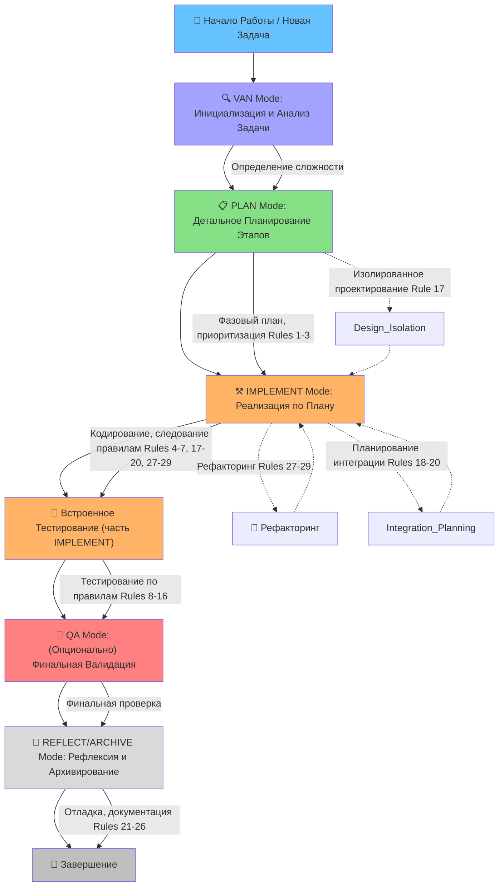

Отлично! Я проанализировал предоставленные тобой файлы, включая `DEVELOPMENT_RULES.md`, `DEVELOPMENT_PROMPT_RULES.md`, `DEVELOPMENT_WORKFLOW_RULES.md` и примеры планов/отчетов. На основе этого я извлек общие процессы и правила, которые можно интегрировать в твою систему Memory Bank.

Вот структурированное описание твоего типичного воркфлоу и правил, адаптированное для Memory Bank:

## ⚙️ Общий Процесс Разработки (Интеграция в Memory Bank)

Твой воркфлоу можно представить как последовательность режимов Memory Bank, с некоторыми специфичными акцентами на каждом этапе.

### 1. Начало Работы / Описание Задачи (Соответствует VAN Mode)

*   **Твой шаг:** Описываешь задачу, планируешь разработку, записываешь необходимый функционал, отвечаешь на уточняющие вопросы.
*   **Memory Bank Integration (VAN Mode):**
    *   **Команда:** `VAN`
    *   **Цель AI:** Понять задачу, определить её **уровень сложности (Level 1-4)**, создать первоначальные записи в Memory Bank.
    *   **Твои действия:** Предоставить AI максимально полное описание задачи. Отвечать на вопросы AI, которые помогают ему классифицировать задачу согласно `complexity-decision-tree.mdc`.
    *   **Ключевые файлы MB:**
        *   `tasks.md`: Создается или обновляется запись о задаче с указанием уровня сложности.
        *   `activeContext.md`: Устанавливается фокус на анализ задачи.
        *   `projectbrief.md` (если новая крупная задача или проект): Заполняется общая информация.
    *   **Результат:** Задача классифицирована, занесена в `tasks.md`, AI готов перейти к планированию (если L > 1).

### 2. Фаза Планирования Текущего Этапа (Соответствует PLAN Mode)

*   **Твой шаг:** После того как все вопросы заканчиваются, приступаешь к фазе планирования текущего этапа.
*   **Memory Bank Integration (PLAN Mode):**
    *   **Команда:** `PLAN` (если AI не предложил сам после VAN для L > 1).
    *   **Цель AI:** Помочь тебе создать детальный, фазовый план разработки (как в твоем **Rule #1**).
    *   **Твои действия:** Работать с AI над разбивкой задачи на этапы (phases) и подзадачи. Определить приоритеты (**Rule #3**). Указать, какие компоненты требуют творческой проработки (для CREATIVE Mode).
    *   **Ключевые файлы MB:**
        *   `tasks.md`: Детализируется план задачи, добавляются этапы, подзадачи, зависимости, флаги для CREATIVE Mode.
        *   `activeContext.md`: Фокус на планировании.
        *   `progress.md`: Начальная запись о старте планирования.
        *   **Твой Rule #2 (Документирование прогресса):** Идеи по планированию могут фиксироваться в `activeContext.md` или прямо в `tasks.md` в описании задачи/этапа с пометками ✅/❌.
    *   **Результат:** Детальный план в `tasks.md`, готовый для реализации. AI рекомендует следующий режим (CREATIVE или IMPLEMENT).

### 3. Реализация Плана (Соответствует IMPLEMENT Mode)

*   **Твой шаг:** Просишь в другом чате (или продолжаешь в текущем, если контекст позволяет) начать работу над реализацией текущего плана. Ты ссылаешься на правила и планы.
*   **Memory Bank Integration (IMPLEMENT Mode):**
    *   **Команда:** `IMPLEMENT`
    *   **Цель AI:** Помогать в написании кода, выполнении команд, тестировании и документировании прогресса реализации согласно плану из `tasks.md` и творческим решениям из `creative-*.mdc`.
    *   **Твои действия:** Последовательно выполнять задачи из плана. Предоставлять AI код для анализа, рефакторинга. Запрашивать генерацию тестов. Сообщать о результатах тестов.
    *   **Ключевые правила из `DEVELOPMENT_RULES.md` применяются здесь:**
        *   **Rule #4 (Проверка зависимостей тестов):** AI должен помочь отслеживать, как изменения влияют на другие тесты.
        *   **Rule #5 (Избегание заглушек):** AI должен писать полный код или напоминать тебе заменить заглушки.
        *   **Rule #6 (Robust поиск и навигация):** Применимо к логике, которую AI помогает писать.
        *   **Rule #7 (Координация между системами):** Если задача включает взаимодействие систем, AI должен помочь учесть это.
        *   **Rule #17-20 (Интеграция):** Если фаза включает интеграцию ранее изолированно разработанных частей.
        *   **Rule #27-29 (Рефакторинг):** Если в рамках реализации проводится рефакторинг.
    *   **Ключевые правила из `DEVELOPMENT_PROMPT_RULES.md` и `DEVELOPMENT_WORKFLOW_RULES.md` по тестированию с Bun (Rules #8-16):**
        *   AI должен генерировать тесты с использованием Bun.
        *   Помогать в изоляции контекста тестов (`beforeEach`, `afterEach`).
        *   Помогать в проверке покрытия.
        *   Использовать `performance.now()` для измерений.
        *   Создавать устойчивые ID.
    *   **Ключевые файлы MB:**
        *   `tasks.md`: Обновляются статусы выполнения подзадач.
        *   `progress.md`: Детально документируется ход реализации, выполненные команды, результаты, ключевые участки кода, ✅/❌ идеи по реализации.
        *   `activeContext.md`: Отражает текущую подзадачу или компонент в работе.
        *   Код проекта: Непосредственно изменяется.
    *   **Результат:** Реализованная и протестированная часть функционала. Обновленные `tasks.md` и `progress.md`.

### 4. Тестирование (Интегрировано в IMPLEMENT Mode и QA Mode)

*   **Твой шаг:** Проведение анализа всех тестов после каждого законченного изменения.
*   **Memory Bank Integration:**
    *   **В IMPLEMENT Mode:** После каждого значимого изменения или завершения подзадачи, ты инициируешь запуск тестов. AI помогает анализировать результаты, документировать в `progress.md`, обновлять `tasks.md` (если нужны новые подзадачи для фиксов).
        *   **Правила #8-16** по тестированию с Bun здесь вступают в полную силу.
    *   **QA Mode (опционально, но рекомендуется для крупных изменений или перед завершением этапа/фазы):**
        *   **Команда:** `QA`
        *   AI проводит более формальную техническую валидацию согласно `qa-mode-map.mdc` и его компонентам (`dependency-check.mdc`, `config-check.mdc` и т.д.). Это более системный взгляд, чем просто прогон юнит-тестов.

### 5. Отладка (Интегрировано в IMPLEMENT Mode)

*   **Твой шаг:** Трассировка перед исправлением, анализ по группам, детальное логирование, валидация инвариантов.
*   **Memory Bank Integration (IMPLEMENT Mode):**
    *   **Правила #21-23** из `DEVELOPMENT_RULES.md`.
    *   Ты можешь попросить AI помочь с трассировкой или анализом логов.
    *   Файлы трассировки (например, `failed.2pc.isolation.md`) могут быть частью `activeContext.md` на время отладки или сохраняться в специальной папке, а ссылка на них – в `progress.md`.
    *   AI может помочь генерировать детальные логи или функции валидации инвариантов.

### 6. Завершение Работы над Задачей/Этапом (Соответствует REFLECT/ARCHIVE Mode)

*   **Твой шаг:** Фиксация изменений, документирование решений, ведение статистики, создание примеров.
*   **Memory Bank Integration (REFLECT/ARCHIVE Mode):**
    *   **Команда:** `REFLECT` (или `ARCHIVE` – они объединены).
    *   **Фаза Рефлексии (по умолчанию):**
        *   AI помогает проанализировать проделанную работу, успехи, проблемы, извлечь уроки.
        *   Создается `reflection-[task_id].md`.
        *   Применяются **Rule #24 (Документирование решений)** и **Rule #25 (Ведение статистики)**.
    *   **Фаза Архивирования (по команде `ARCHIVE NOW`):**
        *   AI помогает создать итоговый архивный документ в `memory-bank/archive/`.
        *   **Rule #26 (Создание примеров использования)** может быть частью документации или отдельным артефактом, на который ссылается архив.
        *   `tasks.md` финализируется (статус COMPLETED & ARCHIVED).
        *   `progress.md` обновляется ссылкой на архив.
        *   `activeContext.md` очищается.
    *   **Результат:** Задача полностью завершена, знания сохранены, система готова к новой задаче.

## 📜 Правила Работы над Кодом (Интеграция в Memory Bank)

Эти правила в основном применяются в **IMPLEMENT Mode**, но могут затрагивать **PLAN** и **CREATIVE** для предварительного обдумывания.

*   **Rule #4: Проверка зависимостей тестов.**
    *   **MB:** В `tasks.md` для задач, затрагивающих связанные модули, можно добавлять подзадачу "Проверить влияние на тесты модуля X". AI в `IMPLEMENT` должен напоминать об этом и помогать анализировать результаты.

*   **Rule #5: Избегание заглушек в продакшене.**
    *   **MB:** Если в `PLAN` или `IMPLEMENT` создается заглушка, в `tasks.md` должна быть создана задача на ее замену. AI должен отслеживать такие задачи. При `QA` или в `REFLECT` проверяется, что все заглушки заменены.

*   **Rule #6: Robust поиск и навигация.**
    *   **MB:** Если задача в `PLAN` включает реализацию поиска/навигации, то в `CREATIVE` можно проработать robustness, а в `IMPLEMENT` AI должен помочь написать код, учитывающий fallback-сценарии. В `tasks.md` это может быть критерием приемки.

*   **Rule #7: Координация между системами.**
    *   **MB:** В `PLAN` такие точки координации должны быть идентифицированы. В `CREATIVE` могут быть разработаны механизмы (флаги, события). В `IMPLEMENT` AI помогает реализовать это. `systemPatterns.md` может хранить общие паттерны координации для проекта.

*   **Rule #17-20: Изолированное проектирование и интеграция.**
    *   **MB:** Это основа фазового подхода.
        *   `PLAN Mode`: Изолированное проектирование фаз (Rule #17). План интеграции (Rule #18). Документирование зависимостей (Rule #20).
        *   `IMPLEMENT Mode`: Реализация изолированных частей, затем интеграция. Тестирование интеграционных точек (Rule #19).

*   **Rule #27-29: Рефакторинг.**
    *   **MB:** Рефакторинг может быть отдельной задачей (свои PLAN, IMPLEMENT, REFLECT) или частью текущей задачи в `IMPLEMENT`.
        *   Постепенный рефакторинг (Rule #27): AI помогает разбить задачу рефакторинга на мелкие шаги в `tasks.md`.
        *   Сохранение обратной совместимости (Rule #28): Критерий приемки в `tasks.md`. AI помогает писать адаптеры или deprecated-обертки.
        *   Метрики качества (Rule #29): Могут отслеживаться в `progress.md` или `reflection.md`.

## 🛠️ Как Memory Bank Помогает с Твоими Правилами

*   **Структура и Дисциплина:** Режимы и визуальные карты помогают следовать фазовому подходу, документировать прогресс, планировать интеграцию.
*   **Контекст и Память:** AI лучше помнит твои правила и предыдущие решения благодаря Memory Bank.
*   **Генерация Артефактов:** AI может помочь генерировать тесты, документацию по решениям, примеры использования в соответствии с твоими правилами.
*   **Чек-листы и Верификация:** Встроенные чек-листы в режимах могут включать пункты, проверяющие соблюдение твоих правил (например, "Все заглушки заменены?", "Тесты для новой фичи созданы?").
*   **Фокус:** Специализированные режимы позволяют сосредоточиться на конкретном аспекте (планирование, дизайн, реализация), что помогает лучше применять соответствующие правила.

**Твоя задача** – явно ссылаться на свои `DEVELOPMENT_*.md` файлы, когда ты даешь AI задания в соответствующем режиме, и напоминать ему следовать этим правилам. Например: `В IMPLEMENT Mode, при написании кода, следуй Rule #6 из DEVELOPMENT_RULES.md для robust поиска.`

Эта интеграция твоих правил в структуру Memory Bank сделает процесс разработки еще более системным и эффективным.

**Готов к следующему вопросу или шагу?**