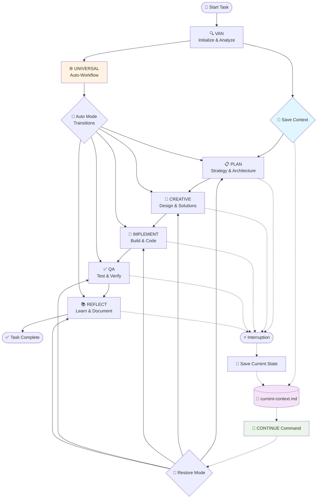

# Cursor Memory Bank v1.1

> **AI-Powered Context Management System with CONTINUE Support**

A comprehensive memory and context management system that transforms how AI assistants work in Cursor IDE. Memory Bank provides structured workflows, intelligent task management, persistent context across development sessions, and seamless work resumption with the revolutionary CONTINUE command.

**📖 [Русская документация / Russian Documentation](README_ru.md)**

## 🚀 Quick Start

Get up and running in under 5 minutes:

### Prerequisites

- [Cursor IDE](https://cursor.sh/) installed
- Basic familiarity with AI-assisted development

### Installation

1. **Clone the repository**
   ```bash
   git clone https://github.com/your-username/cursor-memory-bank.git
   cd cursor-memory-bank
   ```

2. **Set up Memory Bank**
   ```bash
   # Copy rules to Cursor configuration
   cp -r rules/ .cursor/rules/

   # Initialize Memory Bank structure
   mkdir -p memory-bank/{archive,creative,development,reflection}
   ```

3. **Verify installation**
   ```bash
   # Check if rules are properly installed
   ls .cursor/rules/isolation_rules/
   ```

4. **Start using Memory Bank**
   - Open your project in Cursor IDE
   - Type `VAN` to initialize Memory Bank for any task
   - Follow the guided workflow

## 📖 Documentation

### 📚 User Guides
- **[Getting Started](docs/user-guide/getting-started.md)** - Your first steps with Memory Bank
- **[Workflow Guide](docs/user-guide/workflow-guide.md)** - Complete workflow documentation
- **[Modes Reference](docs/user-guide/modes-reference.md)** - All 7 modes explained
- **[Best Practices](docs/user-guide/best-practices.md)** - Tips for effective usage

### 🛠️ Installation & Setup
- **[Quick Start Guide](docs/installation/quick-start.md)** - 5-minute setup
- **[Detailed Setup](docs/installation/detailed-setup.md)** - Complete installation guide
- **[Troubleshooting](docs/installation/troubleshooting.md)** - Common issues and solutions

### 💡 Examples & Tutorials
- **[Simple Bug Fix](docs/examples/simple-bug-fix.md)** - Level 1 workflow example
- **[Feature Development](docs/examples/feature-development.md)** - Level 3 workflow example
- **[Complex System](docs/examples/complex-system.md)** - Level 4 enterprise workflow
- **[Real-World Scenarios](docs/examples/real-world-scenarios.md)** - Production examples

### 🏗️ Architecture & API
- **[System Overview](docs/architecture/system-overview.md)** - High-level architecture
- **[Memory Bank Design](docs/architecture/memory-bank-design.md)** - Core system design
- **[Mode Architecture](docs/architecture/mode-architecture.md)** - Workflow modes explained
- **[API Reference](docs/api/memory-bank-api.md)** - Complete API documentation

## ✨ Key Features

### 🧠 Intelligent Context Management
- **Persistent Memory**: Maintains context across sessions with automatic save/restore
- **Smart Categorization**: Automatically organizes information
- **Context Switching**: Seamless transitions between tasks
- **CONTINUE Command**: Resume interrupted work exactly where you left off
- **Project Awareness**: Automatic discovery of project rules and tasks

### 🔄 Structured Workflows
- **7 Operational Modes**: VAN, PLAN, CREATIVE, IMPLEMENT, QA, REFLECT, UNIVERSAL
- **4 Complexity Levels**: From quick fixes to enterprise systems
- **Guided Processes**: Step-by-step workflow guidance
- **Session Continuity**: Never lose progress on interrupted tasks

### 📊 Advanced Task Management
- **Automatic Complexity Detection**: AI determines optimal workflow
- **Progress Tracking**: Real-time status monitoring with persistent state
- **Quality Assurance**: Built-in verification processes
- **Task Discovery**: Automatic detection of TODO/FIXME items and incomplete tasks
- **Multi-language Task Detection**: Supports English and Russian task markers

### 🌐 Multi-Language Support
- **Bilingual Documentation**: English and Russian
- **Localized Workflows**: Culture-aware processes
- **International Teams**: Global collaboration support
- **Multi-language Task Recognition**: Finds tasks in any supported language

## 🎯 Use Cases

### For Individual Developers
- **Bug Fixing**: Systematic approach to issue resolution
- **Feature Development**: Structured feature implementation
- **Code Refactoring**: Organized refactoring workflows
- **Learning**: Guided development processes

### For Development Teams
- **Project Planning**: Collaborative planning workflows
- **Code Reviews**: Structured review processes
- **Knowledge Sharing**: Team memory and context sharing
- **Quality Assurance**: Consistent QA processes

### For Enterprise
- **Large-Scale Projects**: Complex system development
- **Compliance**: Audit-ready development processes
- **Standardization**: Consistent development practices
- **Training**: Onboarding and skill development

## 🔧 How It Works

Memory Bank operates through a sophisticated mode-based system with automatic context management:



### Mode Overview

- **🔍 VAN Mode**: Task initialization, complexity assessment, and project discovery
- **📋 PLAN Mode**: Strategic planning and architecture design
- **🎨 CREATIVE Mode**: Creative problem-solving and design decisions
- **🔨 IMPLEMENT Mode**: Code implementation and development
- **✅ QA Mode**: Quality assurance and testing
- **📚 REFLECT Mode**: Learning and knowledge capture
- **🌐 UNIVERSAL Mode**: Automatic workflow management with intelligent transitions

### Context Management Features

- **💾 Automatic Context Saving**: Every mode transition saves current state
- **🔄 CONTINUE Command**: Resume work from any interruption point
- **📄 Persistent State**: Context maintained in `memory-bank/system/current-context.md`
- **🎯 Smart Restoration**: Automatically returns to the correct mode and phase
- **📊 Progress Tracking**: Real-time monitoring of task completion status

## 🌟 What Makes Memory Bank Special

### 🤖 AI-Native Design
Built specifically for AI-assisted development, Memory Bank understands how AI assistants work and optimizes the collaboration between human developers and AI.

### 📈 Scalable Complexity
From simple bug fixes to enterprise-scale systems, Memory Bank adapts its workflow to match the complexity of your task.

### 🧩 Modular Architecture
Each component is designed to work independently while contributing to a cohesive whole, allowing for customization and extension.

### 📚 Knowledge Accumulation
Every project builds organizational knowledge, creating a learning system that improves over time.

## 🚦 Getting Started Examples

### Quick Bug Fix (Level 1)
```bash
# Initialize for a simple bug fix
VAN
# Memory Bank will guide you through:
# 1. Problem identification
# 2. Quick solution implementation
# 3. Testing and verification
```

### Feature Development (Level 3)
```bash
# Initialize for feature development
VAN
# Memory Bank will guide you through:
# 1. Requirements analysis
# 2. Creative design phase
# 3. Structured implementation
# 4. Comprehensive testing
```

### Resume Interrupted Work
```bash
# Resume any interrupted task
CONTINUE
# or in Russian
ПРОДОЛЖАЙ

# Memory Bank will:
# 1. Load your saved context
# 2. Restore the exact working mode
# 3. Continue from where you left off
# 4. Show current progress status
```

## 🎯 New Commands

### Context Management Commands
- **`CONTINUE`** / **`ПРОДОЛЖАЙ`** - Resume interrupted work
- **`SHOW CONTEXT`** - Display current context and progress
- **`CLEAR CONTEXT`** - Clear saved context (start fresh)
- **`SCAN RULES`** - Discover and integrate project rules
- **`FIND TASKS`** - Search for TODO/FIXME items in documentation

### Project Discovery Features
Memory Bank now automatically discovers:
- **Project Rules**: Scans `rules/*.md` files for project-specific guidelines
- **TODO Items**: Finds `TODO`, `FIXME`, `HACK` markers in documentation
- **Incomplete Tasks**: Detects unchecked `- [ ]` items
- **Russian Tasks**: Recognizes `нужно`, `требуется`, `добавить`, `исправить` markers
- **File Context**: Includes file sizes and line counts for better understanding

## 🤝 Contributing

We welcome contributions from the community! Here's how you can help:

### Ways to Contribute
- **🐛 Bug Reports**: Found an issue? Let us know!
- **💡 Feature Requests**: Have an idea? We'd love to hear it!
- **📖 Documentation**: Help improve our docs
- **💻 Code**: Contribute to the codebase
- **🌐 Translations**: Help us support more languages

### Getting Started
1. Read our [Contributing Guide](CONTRIBUTING.md)
2. Check out [open issues](https://github.com/your-username/cursor-memory-bank/issues)
3. Join our [community discussions](https://github.com/your-username/cursor-memory-bank/discussions)

See [CONTRIBUTING.md](CONTRIBUTING.md) for detailed guidelines.

## 📄 License

This project is licensed under the MIT License - see the [LICENSE](LICENSE) file for details.

## 🔗 Links

- **[Documentation](docs/)** - Complete documentation
- **[Examples](examples/)** - Real-world usage examples
- **[Issues](https://github.com/your-username/cursor-memory-bank/issues)** - Bug reports and feature requests
- **[Discussions](https://github.com/your-username/cursor-memory-bank/discussions)** - Community discussions
- **[Releases](https://github.com/your-username/cursor-memory-bank/releases)** - Version history

## 🙏 Acknowledgments

- **Cursor Team** - For creating an amazing AI-powered IDE
- **Community Contributors** - For feedback, suggestions, and contributions
- **Early Adopters** - For testing and providing valuable feedback

---

**Made with ❤️ for the AI-assisted development community**

> 💡 **Tip**: Start with the [Quick Start Guide](docs/installation/quick-start.md) to get Memory Bank running in your project today!
