# Cursor Memory Bank v1.0

> **AI-Powered Context Management System for Cursor IDE**

A comprehensive memory and context management system that transforms how AI assistants work in Cursor IDE. Memory Bank provides structured workflows, intelligent task management, and persistent context across development sessions.

**📖 [Русская документация / Russian Documentation](README_ru.md)**

## 🚀 Quick Start

Get up and running in under 5 minutes:

### Prerequisites

- [Cursor IDE](https://cursor.sh/) installed
- Basic familiarity with AI-assisted development

### Installation

1. **Clone the repository**
   ```bash
   git clone https://github.com/your-username/cursor-memory-bank.git
   cd cursor-memory-bank
   ```

2. **Set up Memory Bank**
   ```bash
   # Copy rules to Cursor configuration
   cp -r rules/ .cursor/rules/

   # Initialize Memory Bank structure
   mkdir -p memory-bank/{archive,creative,development,reflection}
   ```

3. **Verify installation**
   ```bash
   # Check if rules are properly installed
   ls .cursor/rules/isolation_rules/
   ```

4. **Start using Memory Bank**
   - Open your project in Cursor IDE
   - Type `VAN` to initialize Memory Bank for any task
   - Follow the guided workflow

## 📖 Documentation

### 📚 User Guides
- **[Getting Started](docs/user-guide/getting-started.md)** - Your first steps with Memory Bank
- **[Workflow Guide](docs/user-guide/workflow-guide.md)** - Complete workflow documentation
- **[Modes Reference](docs/user-guide/modes-reference.md)** - All 7 modes explained
- **[Best Practices](docs/user-guide/best-practices.md)** - Tips for effective usage

### 🛠️ Installation & Setup
- **[Quick Start Guide](docs/installation/quick-start.md)** - 5-minute setup
- **[Detailed Setup](docs/installation/detailed-setup.md)** - Complete installation guide
- **[Troubleshooting](docs/installation/troubleshooting.md)** - Common issues and solutions

### 💡 Examples & Tutorials
- **[Simple Bug Fix](docs/examples/simple-bug-fix.md)** - Level 1 workflow example
- **[Feature Development](docs/examples/feature-development.md)** - Level 3 workflow example
- **[Complex System](docs/examples/complex-system.md)** - Level 4 enterprise workflow
- **[Real-World Scenarios](docs/examples/real-world-scenarios.md)** - Production examples

### 🏗️ Architecture & API
- **[System Overview](docs/architecture/system-overview.md)** - High-level architecture
- **[Memory Bank Design](docs/architecture/memory-bank-design.md)** - Core system design
- **[Mode Architecture](docs/architecture/mode-architecture.md)** - Workflow modes explained
- **[API Reference](docs/api/memory-bank-api.md)** - Complete API documentation

## ✨ Key Features

### 🧠 Intelligent Context Management
- **Persistent Memory**: Maintains context across sessions
- **Smart Categorization**: Automatically organizes information
- **Context Switching**: Seamless transitions between tasks

### 🔄 Structured Workflows
- **7 Operational Modes**: VAN, PLAN, CREATIVE, IMPLEMENT, QA, REFLECT, ARCHIVE
- **4 Complexity Levels**: From quick fixes to enterprise systems
- **Guided Processes**: Step-by-step workflow guidance

### 📊 Advanced Task Management
- **Automatic Complexity Detection**: AI determines optimal workflow
- **Progress Tracking**: Real-time status monitoring
- **Quality Assurance**: Built-in verification processes

### 🌐 Multi-Language Support
- **Bilingual Documentation**: English and Russian
- **Localized Workflows**: Culture-aware processes
- **International Teams**: Global collaboration support

## 🎯 Use Cases

### For Individual Developers
- **Bug Fixing**: Systematic approach to issue resolution
- **Feature Development**: Structured feature implementation
- **Code Refactoring**: Organized refactoring workflows
- **Learning**: Guided development processes

### For Development Teams
- **Project Planning**: Collaborative planning workflows
- **Code Reviews**: Structured review processes
- **Knowledge Sharing**: Team memory and context sharing
- **Quality Assurance**: Consistent QA processes

### For Enterprise
- **Large-Scale Projects**: Complex system development
- **Compliance**: Audit-ready development processes
- **Standardization**: Consistent development practices
- **Training**: Onboarding and skill development

## 🔧 How It Works

Memory Bank operates through a sophisticated mode-based system:

```mermaid
graph LR
    VAN[🔍 VAN<br>Initialize] --> PLAN[📋 PLAN<br>Strategy]
    PLAN --> CREATIVE[🎨 CREATIVE<br>Design]
    CREATIVE --> IMPLEMENT[🔨 IMPLEMENT<br>Build]
    IMPLEMENT --> QA[✅ QA<br>Verify]
    QA --> REFLECT[📚 REFLECT<br>Learn]
    REFLECT --> ARCHIVE[📁 ARCHIVE<br>Store]
```



### Mode Overview

- **🔍 VAN Mode**: Task initialization and complexity assessment
- **📋 PLAN Mode**: Strategic planning and architecture design
- **🎨 CREATIVE Mode**: Creative problem-solving and design decisions
- **🔨 IMPLEMENT Mode**: Code implementation and development
- **✅ QA Mode**: Quality assurance and testing
- **📚 REFLECT Mode**: Learning and knowledge capture
- **📁 ARCHIVE Mode**: Documentation and knowledge storage

## 🌟 What Makes Memory Bank Special

### 🤖 AI-Native Design
Built specifically for AI-assisted development, Memory Bank understands how AI assistants work and optimizes the collaboration between human developers and AI.

### 📈 Scalable Complexity
From simple bug fixes to enterprise-scale systems, Memory Bank adapts its workflow to match the complexity of your task.

### 🧩 Modular Architecture
Each component is designed to work independently while contributing to a cohesive whole, allowing for customization and extension.

### 📚 Knowledge Accumulation
Every project builds organizational knowledge, creating a learning system that improves over time.

## 🚦 Getting Started Examples

### Quick Bug Fix (Level 1)
```bash
# Initialize for a simple bug fix
VAN
# Memory Bank will guide you through:
# 1. Problem identification
# 2. Quick solution implementation
# 3. Testing and verification
```

### Feature Development (Level 3)
```bash
# Initialize for feature development
VAN
# Memory Bank will guide you through:
# 1. Requirements analysis
# 2. Creative design phase
# 3. Structured implementation
# 4. Comprehensive testing
```

## 🤝 Contributing

We welcome contributions from the community! Here's how you can help:

### Ways to Contribute
- **🐛 Bug Reports**: Found an issue? Let us know!
- **💡 Feature Requests**: Have an idea? We'd love to hear it!
- **📖 Documentation**: Help improve our docs
- **💻 Code**: Contribute to the codebase
- **🌐 Translations**: Help us support more languages

### Getting Started
1. Read our [Contributing Guide](CONTRIBUTING.md)
2. Check out [open issues](https://github.com/your-username/cursor-memory-bank/issues)
3. Join our [community discussions](https://github.com/your-username/cursor-memory-bank/discussions)

See [CONTRIBUTING.md](CONTRIBUTING.md) for detailed guidelines.

## 📄 License

This project is licensed under the MIT License - see the [LICENSE](LICENSE) file for details.

## 🔗 Links

- **[Documentation](docs/)** - Complete documentation
- **[Examples](examples/)** - Real-world usage examples
- **[Issues](https://github.com/your-username/cursor-memory-bank/issues)** - Bug reports and feature requests
- **[Discussions](https://github.com/your-username/cursor-memory-bank/discussions)** - Community discussions
- **[Releases](https://github.com/your-username/cursor-memory-bank/releases)** - Version history

## 🙏 Acknowledgments

- **Cursor Team** - For creating an amazing AI-powered IDE
- **Community Contributors** - For feedback, suggestions, and contributions
- **Early Adopters** - For testing and providing valuable feedback

---

**Made with ❤️ for the AI-assisted development community**

> 💡 **Tip**: Start with the [Quick Start Guide](docs/installation/quick-start.md) to get Memory Bank running in your project today!
