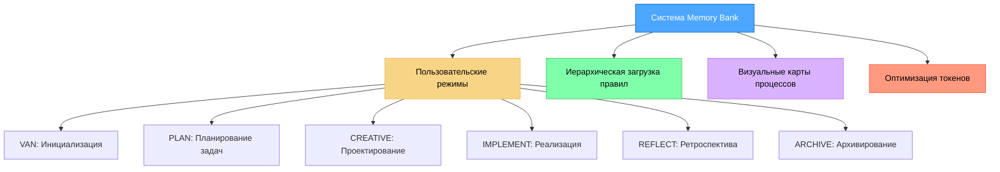
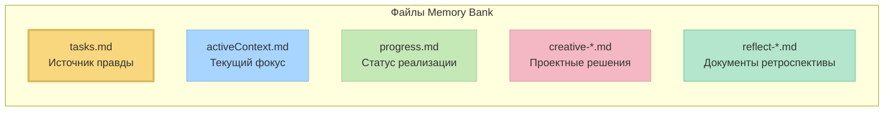

# Система Memory Bank v0.7-beta

Оптимизированная по токенам, иерархическая система управления задачами, которая интегрируется с пользовательскими режимами Cursor для эффективных рабочих процессов разработки.



> **От автора**: Memory Bank — это мой личный хобби-проект, который я разрабатываю для собственного использования в проектах по программированию. Поскольку это личный проект, я не веду трекер задач и активно не собираю обратную связь. Однако, если вы используете эти правила и сталкиваетесь с проблемами, одно из больших преимуществ заключается в том, что вы можете попросить ИИ Cursor напрямую изменить или обновить правила, чтобы они лучше соответствовали вашему конкретному рабочему процессу. Система спроектирована так, чтобы ее мог адаптировать ИИ, что позволяет вам настраивать ее под свои нужды без необходимости внешней поддержки.

## О Memory Bank

Memory Bank — это личный проект, который предоставляет структурированный подход к разработке с использованием специализированных режимов для различных фаз процесса разработки. Он использует иерархическую архитектуру загрузки правил, которая загружает только те правила, которые необходимы для каждой фазы, оптимизируя использование токенов и предоставляя индивидуальные рекомендации.

### Архитектура, оптимизированная по токенам

Версия v0.7-beta вносит значительные улучшения в оптимизацию токенов:

- **Иерархическая загрузка правил**: Изначально загружаются только основные правила, а специализированные — с помощью "ленивой" загрузки.
- **Прогрессивная документация**: Реализует краткие шаблоны, которые масштабируются в зависимости от сложности задачи.
- **Оптимизированные переходы между режимами**: Эффективно сохраняет критически важный контекст между режимами.
- **Рабочие процессы для конкретных уровней**: Адаптирует требования к документации к сложности задачи.

Подробную информацию обо всех подходах к оптимизации см. в документе [Оптимизации Memory Bank](MEMORY_BANK_OPTIMIZATIONS.md).

### Больше, чем просто базовые пользовательские режимы

Хотя документация Cursor описывает пользовательские режимы в основном как автономные конфигурации с базовыми подсказками и выбором инструментов, Memory Bank значительно расширяет эту концепцию:

- **Интеграция режимов на основе графов**: Режимы являются взаимосвязанными узлами в рабочем процессе разработки, а не изолированными инструментами.
- **Последовательность рабочего процесса**: Режимы предназначены для перехода от одного к другому в логической последовательности (VAN → PLAN → CREATIVE → IMPLEMENT → REFLECT → ARCHIVE).
- **Общая память**: Постоянное состояние поддерживается между переходами режимов через файлы Memory Bank.
- **Адаптивное поведение**: Каждый режим корректирует свои рекомендации в зависимости от сложности проекта.
- **Встроенные функции QA**: Функции QA могут быть вызваны из любого режима для технической валидации.

Такой подход превращает пользовательские режимы из простых "личностей" ИИ в компоненты скоординированной системы разработки со специализированными фазами, работающими вместе.

### Режим CREATIVE и инструмент "Think" от Claude

Режим CREATIVE в Memory Bank концептуально основан на методологии инструмента "Think" от Anthropic Claude, как описано в их [инженерном блоге](https://www.anthropic.com/engineering/claude-think-tool). Версия v0.7-beta реализует оптимизированную версию с:

- Прогрессивной документацией с табличным сравнением вариантов.
- Подходом "детали по запросу", который сохраняет эффективность токенов.
- Структурированными шаблонами, которые масштабируются в зависимости от уровня сложности.
- Эффективным сохранением контекста для фаз реализации.

Для подробного объяснения того, как Memory Bank реализует эти принципы, см. документ [Режим CREATIVE и инструмент "Think" от Claude](creative_mode_think_tool.md).

## Ключевые особенности

- **Иерархическая загрузка правил**: Загрузка только основных правил со специализированной "ленивой" загрузкой.
- **Прогрессивная документация**: Краткие шаблоны, которые масштабируются в зависимости от сложности задачи.
- **Единый перенос контекста**: Эффективное сохранение контекста между режимами.
- **Визуальные карты для конкретных режимов**: Четкие визуальные представления для каждой фазы разработки.
- **Рабочие процессы для конкретных уровней**: Адаптированные процессы в зависимости от сложности (уровни 1-4).
- **Команды, учитывающие платформу**: Автоматически адаптирует команды к вашей операционной системе.
- **Расширенный VAN режим**: Включает подрежимы VAN.RULES и VAN.SYSTEM для управления правилами и системного администрирования.
- **Интегрированное управление правилами**: Полная интеграция с правилами .cursor через специализированные подрежимы.

## Инструкции по установке

### Предварительные требования

- **Редактор Cursor**: Требуется версия 0.48 или выше.
- **Пользовательские режимы**: Функция должна быть включена в Cursor (Настройки → Функции → Чат → Пользовательские режимы).


- **Модель ИИ**: Для лучших результатов рекомендуется Claude 4 Sonnet или Claude 4 Opus, особенно для методологии инструмента "Think" в режиме CREATIVE.

### Шаг 1: Получите файлы

Просто клонируйте этот репозиторий в каталог вашего проекта:

```
git clone https://github.com/vanzan01/cursor-memory-bank.git
```

#### Альтернатива (вручную)

После извлечения из ZIP-файла выполните следующие действия.

- Скопируйте папки `.cursor` и `custom_modes` в каталог проекта.

Примечание: другие документы не являются необходимыми для работы Memory Bank, это пояснительные документы. Вы можете скопировать их в папку, например, `memory_bank_documents`.

### Шаг 2: Настройка пользовательских режимов в Cursor

**Это самая важная и сложная часть настройки.** Вам нужно будет вручную создать шесть пользовательских режимов в Cursor и скопировать содержимое инструкций из предоставленных файлов:

#### Как добавить пользовательский режим в Cursor

1.  Откройте Cursor и нажмите на селектор режимов на панели чата.
2.  Выберите "Добавить пользовательский режим".


3.  На экране конфигурации:
    -   Введите имя режима (вы можете включить иконки-эмодзи, такие как 🔍, 📋, 🎨, ⚒️, скопировав и вставив их в начало имени).
    -   Выберите иконку из ограниченного набора предопределенных опций Cursor.
    -   Добавьте ярлык (необязательно).
    -   Отметьте необходимые инструменты.
    -   Нажмите на **Расширенные опции**.
    -   В появившемся внизу пустом текстовом поле вставьте содержимое пользовательской инструкции из соответствующего файла.

#### Конфигурация режимов

Для каждого режима настройте следующее (Если отображаются MCP, вы можете оставить их включенными, они, вероятно, не будут работать):

1.  **Режим VAN** (Инициализация и Системное Администрирование)
    -   **Имя**: 🔍 VAN
    -   **Инструменты**: Включите "Поиск по кодовой базе", "Чтение файла", "Терминал", "Список каталогов", "Редактирование файла".
    -   **Расширенные опции**: Вставьте из `custom_modes/van_instructions.md`.
    -   **Подрежимы**: VAN.RULES (управление правилами), VAN.SYSTEM (системное администрирование)

 

2.  **Режим PLAN** (Планирование задач)
    -   **Имя**: 📋 PLAN
    -   **Инструменты**: Включите "Поиск по кодовой базе", "Чтение файла", "Терминал", "Список каталогов", "Редактирование файла".
    -   **Расширенные опции**: Вставьте из `custom_modes/plan_instructions.md`.

 

3.  **Режим CREATIVE** (Проектные решения)
    -   **Имя**: 🎨 CREATIVE
    -   **Инструменты**: Включите "Поиск по кодовой базе", "Чтение файла", "Терминал", "Список каталогов", "Редактирование файла".
    -   **Расширенные опции**: Вставьте из `custom_modes/creative_instructions.md`.

 

4.  **Режим IMPLEMENT** (Реализация кода)
    -   **Имя**: ⚒️ IMPLEMENT
    -   **Инструменты**: Включите все инструменты.
    -   **Расширенные опции**: Вставьте из `custom_modes/implement_instructions.md`.

 

5.  **Режим REFLECT & ARHIVE** (Ретроспектива)
    -   **Имя**: 🔍 REFLECT или ARCHIVE
    -   **Инструменты**: Включите "Поиск по кодовой базе", "Чтение файла", "Терминал", "Список каталогов", "Редактирование файла".
    -   **Расширенные опции**: Вставьте из `custom_modes/reflect_archive_instructions.md`.

 

> **Примечание**: Инструкции для REFLECT и ARCHIVE объединены в один файл и режим для оптимизации с учетом ограничений на символы и количество пользовательских режимов в Cursor при сохранении функциональности. Спасибо пользователю GitHub @joshmac007 за реализацию этой оптимизации.

Для дополнительной помощи по настройке пользовательских режимов в Cursor обратитесь к [официальной документации Cursor по пользовательским режимам](https://docs.cursor.com/chat/custom-modes).

### Функциональность QA

QA — это не отдельный пользовательский режим, а набор функций валидации, которые можно вызывать из любого режима. Вы можете вызвать возможности QA, набрав "QA" в любом режиме, когда вам нужно выполнить техническую валидацию. Такой подход обеспечивает гибкость для проведения проверки в любой момент процесса разработки.

### Расширенный VAN режим

VAN режим теперь включает мощные подрежимы для системного администрирования:

#### VAN.RULES - Управление правилами
- **VAN.RULES.INTEGRATE** - Интеграция правил .cursor с Memory Bank
- **VAN.RULES.MODIFY** - Модификация существующих правил
- **VAN.RULES.CREATE** - Создание новых пользовательских правил
- **VAN.RULES.VALIDATE** - Валидация всех правил на корректность
- **VAN.RULES.STATUS** - Проверка статуса интеграции правил

#### VAN.SYSTEM - Системное администрирование
- **VAN.SYSTEM.OPTIMIZE** - Оптимизация производительности Memory Bank
- **VAN.SYSTEM.BACKUP** - Резервное копирование состояния Memory Bank
- **VAN.SYSTEM.RESTORE** - Восстановление из резервной копии
- **VAN.SYSTEM.HEALTH** - Проверка состояния и диагностика системы

Эти подрежимы позволяют полностью управлять системой Memory Bank, включая интеграцию с правилами .cursor, без необходимости создания дополнительных пользовательских режимов.

## Основное использование

1.  **Начните с режима VAN**:
    -   Переключитесь на режим VAN в Cursor.
    -   Введите "VAN", чтобы начать процесс инициализации.
    -   VAN проанализирует структуру вашего проекта и определит сложность.

2.  **Следуйте рабочему процессу в зависимости от сложности**:
    -   **Задачи уровня 1**: Можно переходить непосредственно к IMPLEMENT после VAN.
    -   **Задачи уровня 2**: Упрощенный рабочий процесс (VAN → PLAN → IMPLEMENT → REFLECT).
    -   **Задачи уровня 3-4**: Полный рабочий процесс (VAN → PLAN → CREATIVE → IMPLEMENT → REFLECT → ARCHIVE).
    -   **В любой момент**: Введите "QA" для выполнения технической валидации.

      

3.  **Команды для конкретных режимов**:
    ```
    VAN - Инициализация проекта и определение сложности
    VAN.RULES - Управление правилами Memory Bank (интеграция, валидация, модификация)
    VAN.SYSTEM - Системное администрирование (оптимизация, резервное копирование, диагностика)
    PLAN - Создание детального плана реализации
    CREATIVE - Исследование вариантов дизайна для сложных компонентов
    IMPLEMENT - Систематическая сборка запланированных компонентов
    REFLECT - Ретроспектива и документирование извлеченных уроков
    ARCHIVE - Создание всеобъемлющей документации
    QA - Валидация технической реализации (можно вызывать из любого режима)
    ```

4.  **Использование расширенного VAN режима**:
    ```
    VAN.RULES.STATUS - Проверить статус интеграции правил
    VAN.RULES.INTEGRATE - Интегрировать правила .cursor с Memory Bank
    VAN.RULES.VALIDATE - Валидировать все правила на корректность
    VAN.SYSTEM.HEALTH - Проверить состояние системы Memory Bank
    VAN.SYSTEM.OPTIMIZE - Оптимизировать производительность системы
    ```

5.  **Начало работы с вашим проектом**:

После успешной установки Memory Bank...

## Основные файлы и их назначение



-   **tasks.md**: Центральный источник правды для отслеживания задач.
-   **activeContext.md**: Поддерживает фокус на текущей фазе разработки.
-   **progress.md**: Отслеживает статус реализации.
-   **creative-\*.md**: Документы с проектными решениями, созданные в режиме CREATIVE.
-   **reflect-\*.md**: Документы ретроспективы, созданные в режиме REFLECT.

## Устранение неполадок

### Распространенные проблемы

1.  **Режим не отвечает корректно**:
    -   Убедитесь, что пользовательские инструкции были скопированы полностью (это самая распространенная проблема).
    -   Убедитесь, что для каждого режима включены правильные инструменты.
    -   Проверьте, что вы переключились на нужный режим перед вводом команд.
    -   Убедитесь, что вы вставили инструкции в текстовое поле "Расширенные опции".

2.  **Правила не загружаются**:
    -   Убедитесь, что каталог `.cursor/rules/isolation_rules/` находится в правильном месте.
    -   Проверьте права доступа к файлам, чтобы разрешить чтение файлов правил.

3.  **Проблемы с выполнением команд**:
    -   Убедитесь, что вы выполняете команды из правильного каталога.
    -   Проверьте, что команды для конкретной платформы используются правильно.

## Информация о версии

Это версия v0.7-beta системы Memory Bank. Она вносит значительные улучшения в оптимизацию токенов по сравнению с v0.6-beta, сохраняя при этом всю функциональность. Подробную информацию об изменениях см. в [Примечаниях к выпуску](RELEASE_NOTES.md).

### Текущая разработка

Система Memory Bank активно разрабатывается и улучшается. Ключевые моменты, которые следует понимать:

-   **В процессе разработки**: Это бета-версия, находящаяся в постоянной разработке. Ожидайте регулярных обновлений, оптимизаций и новых функций.
-   **Оптимизация функций**: Модульная архитектура позволяет постоянно совершенствовать систему, не нарушая существующую функциональность.
-   **Доступна предыдущая версия**: Если вы предпочитаете стабильность предыдущей версии (v0.1-legacy), вы можете продолжать использовать ее, пока эта версия дорабатывается.
-   **Архитектурные преимущества**: Прежде чем решить, какую версию использовать, пожалуйста, прочтите [Руководство по обновлению Memory Bank](memory_bank_upgrade_guide.md), чтобы понять значительные преимущества новой архитектуры.

## Ресурсы

-   [Оптимизации Memory Bank](MEMORY_BANK_OPTIMIZATIONS.md) - Подробный обзор улучшений эффективности токенов.
-   [Примечания к выпуску](RELEASE_NOTES.md) - Информация о последних изменениях.
-   [Документация по пользовательским режимам Cursor](https://docs.cursor.com/chat/custom-modes)
-   [Руководство по обновлению Memory Bank](memory_bank_upgrade_guide.md)
-   [Режим CREATIVE и инструмент "Think" от Claude](creative_mode_think_tool.md)
-   [Руководство по изменению правил](rules/changing_the_rules.md) - Процесс модификации правил .cursor
-   [Интеграция VAN режима](custom_modes/van_enhanced.md) - Документация расширенного VAN режима
-   [Руководство по интеграции](custom_modes/integration_guide.md) - Быстрый старт для интеграции правил
-   Файлы инструкций для конкретных режимов в каталоге `custom_modes/`.

---

*Примечание: Этот README предназначен для версии v0.7-beta и может изменяться по мере развития системы.*