# Cursor Memory Bank v1.1

> **Система управления контекстом с поддержкой ИИ и командой ПРОДОЛЖАЙ**

Комплексная система управления памятью и контекстом, которая трансформирует работу ИИ-ассистентов в Cursor IDE. Memory Bank предоставляет структурированные рабочие процессы, интеллектуальное управление задачами, постоянный контекст между сессиями разработки и бесшовное возобновление работы с революционной командой ПРОДОЛЖАЙ.

## 🚀 Быстрый старт

Запустите систему менее чем за 5 минут:

### Предварительные требования

- Установленная [Cursor IDE](https://cursor.sh/)
- Базовое знакомство с разработкой с помощью ИИ

### Установка

1. **Клонируйте репозиторий**
   ```bash
   git clone https://github.com/your-username/cursor-memory-bank.git
   cd cursor-memory-bank
   ```

2. **Настройте Memory Bank**
   ```bash
   # Скопируйте правила в конфигурацию Cursor
   cp -r rules/ .cursor/rules/

   # Инициализируйте структуру Memory Bank
   mkdir -p memory-bank/{archive,creative,development,reflection}
   ```

3. **Проверьте установку**
   ```bash
   # Проверьте, что правила установлены корректно
   ls .cursor/rules/isolation_rules/
   ```

4. **Начните использовать Memory Bank**
   - Откройте Ваш проект в Cursor IDE
   - Введите `VAN` для инициализации Memory Bank для любой задачи
   - Следуйте управляемому рабочему процессу

## 📖 Документация

### 📚 Руководства пользователя
- **[Начало работы](docs/user-guide/getting-started_ru.md)** - Ваши первые шаги с Memory Bank
- **[Руководство по рабочим процессам](docs/user-guide/workflow-guide_ru.md)** - Полная документация рабочих процессов
- **[Справочник режимов](docs/user-guide/modes-reference_ru.md)** - Все 7 режимов объяснены
- **[Лучшие практики](docs/user-guide/best-practices_ru.md)** - Советы по эффективному использованию

### 🛠️ Установка и настройка
- **[Руководство быстрого старта](docs/installation/quick-start_ru.md)** - 5-минутная настройка
- **[Детальная настройка](docs/installation/detailed-setup_ru.md)** - Полное руководство по установке
- **[Устранение неполадок](docs/installation/troubleshooting_ru.md)** - Распространенные проблемы и решения

### 💡 Примеры и туториалы
- **[Простое исправление ошибки](docs/examples/simple-bug-fix_ru.md)** - Пример рабочего процесса уровня 1
- **[Разработка функции](docs/examples/feature-development_ru.md)** - Пример рабочего процесса уровня 3
- **[Комплексная система](docs/examples/complex-system_ru.md)** - Корпоративный рабочий процесс уровня 4
- **[Реальные сценарии](docs/examples/real-world-scenarios_ru.md)** - Примеры из продакшена

### 🏗️ Архитектура и API
- **[Обзор системы](docs/architecture/system-overview_ru.md)** - Высокоуровневая архитектура
- **[Дизайн Memory Bank](docs/architecture/memory-bank-design_ru.md)** - Дизайн основной системы
- **[Архитектура режимов](docs/architecture/mode-architecture_ru.md)** - Объяснение режимов рабочих процессов
- **[Справочник API](docs/api/memory-bank-api_ru.md)** - Полная документация API

## ✨ Ключевые возможности

### 🧠 Интеллектуальное управление контекстом
- **Постоянная память**: Поддерживает контекст между сессиями с автосохранением/восстановлением
- **Умная категоризация**: Автоматически организует информацию
- **Переключение контекста**: Плавные переходы между задачами
- **Команда ПРОДОЛЖАЙ**: Возобновление прерванной работы точно с места остановки
- **Осведомленность о проекте**: Автоматическое обнаружение правил и задач проекта

### 🔄 Структурированные рабочие процессы
- **7 операционных режимов**: VAN, PLAN, CREATIVE, IMPLEMENT, QA, REFLECT, UNIVERSAL
- **4 уровня сложности**: От быстрых исправлений до корпоративных систем
- **Управляемые процессы**: Пошаговое руководство рабочими процессами
- **Непрерывность сессий**: Никогда не теряйте прогресс при прерывании задач

### 📊 Продвинутое управление задачами
- **Автоматическое определение сложности**: ИИ определяет оптимальный рабочий процесс
- **Отслеживание прогресса**: Мониторинг статуса в реальном времени с постоянным состоянием
- **Обеспечение качества**: Встроенные процессы верификации
- **Обнаружение задач**: Автоматическое обнаружение элементов TODO/FIXME и незавершенных задач
- **Многоязычное обнаружение задач**: Поддержка английских и русских маркеров задач

### 🌐 Многоязычная поддержка
- **Двуязычная документация**: Английский и русский языки
- **Локализованные рабочие процессы**: Культурно-адаптированные процессы
- **Международные команды**: Поддержка глобального сотрудничества
- **Многоязычное распознавание задач**: Находит задачи на любом поддерживаемом языке

## 🎯 Случаи использования

### Для индивидуальных разработчиков
- **Исправление ошибок**: Систематический подход к решению проблем
- **Разработка функций**: Структурированная реализация функций
- **Рефакторинг кода**: Организованные рабочие процессы рефакторинга
- **Обучение**: Управляемые процессы разработки

### Для команд разработки
- **Планирование проектов**: Совместные рабочие процессы планирования
- **Ревью кода**: Структурированные процессы ревью
- **Обмен знаниями**: Командная память и обмен контекстом
- **Обеспечение качества**: Последовательные процессы QA

### Для предприятий
- **Крупномасштабные проекты**: Разработка сложных систем
- **Соответствие требованиям**: Процессы разработки, готовые к аудиту
- **Стандартизация**: Последовательные практики разработки
- **Обучение**: Адаптация и развитие навыков

## 🔧 Как это работает

Memory Bank работает через сложную систему на основе режимов с автоматическим управлением контекстом:

```mermaid
graph TD
    Start([🚀 Начать задачу]) --> VAN[🔍 VAN<br>Инициализация и анализ]
    VAN --> SaveContext{💾 Сохранить контекст}
    SaveContext --> PLAN[📋 PLAN<br>Стратегия и архитектура]
    PLAN --> CREATIVE[🎨 CREATIVE<br>Дизайн и решения]
    CREATIVE --> IMPLEMENT[🔨 IMPLEMENT<br>Сборка и код]
    IMPLEMENT --> QA[✅ QA<br>Тестирование и проверка]
    QA --> REFLECT[📚 REFLECT<br>Обучение и документация]
    REFLECT --> Complete([✅ Задача завершена])

    %% Управление контекстом
    SaveContext -.-> ContextFile[(📄 current-context.md)]
    ContextFile -.-> Continue[🔄 Команда ПРОДОЛЖАЙ]
    Continue -.-> RestoreMode{🎯 Восстановить режим}
    RestoreMode --> PLAN
    RestoreMode --> CREATIVE
    RestoreMode --> IMPLEMENT
    RestoreMode --> QA
    RestoreMode --> REFLECT

    %% Универсальный режим
    VAN --> UNIVERSAL[🌐 UNIVERSAL<br>Авто-рабочий процесс]
    UNIVERSAL --> AutoTransition{🔄 Авто переходы<br>между режимами}
    AutoTransition --> PLAN
    AutoTransition --> CREATIVE
    AutoTransition --> IMPLEMENT
    AutoTransition --> QA
    AutoTransition --> REFLECT

    %% Обработка прерываний
    PLAN -.-> Interrupt([⚡ Прерывание])
    CREATIVE -.-> Interrupt
    IMPLEMENT -.-> Interrupt
    QA -.-> Interrupt
    REFLECT -.-> Interrupt
    Interrupt -.-> SaveState[💾 Сохранить текущее состояние]
    SaveState -.-> ContextFile

    style SaveContext fill:#e1f5fe
    style ContextFile fill:#f3e5f5
    style Continue fill:#e8f5e8
    style UNIVERSAL fill:#fff3e0
```



### Обзор режимов

- **🔍 VAN Mode**: Инициализация задач, оценка сложности и обнаружение проекта
- **📋 PLAN Mode**: Стратегическое планирование и проектирование архитектуры
- **🎨 CREATIVE Mode**: Творческое решение проблем и дизайнерские решения
- **🔨 IMPLEMENT Mode**: Реализация кода и разработка
- **✅ QA Mode**: Обеспечение качества и тестирование
- **📚 REFLECT Mode**: Обучение и захват знаний
- **🌐 UNIVERSAL Mode**: Автоматическое управление рабочими процессами с интеллектуальными переходами

### Возможности управления контекстом

- **💾 Автоматическое сохранение контекста**: Каждый переход режима сохраняет текущее состояние
- **🔄 Команда ПРОДОЛЖАЙ**: Возобновление работы с любой точки прерывания
- **📄 Постоянное состояние**: Контекст поддерживается в `memory-bank/system/current-context.md`
- **🎯 Умное восстановление**: Автоматически возвращается к правильному режиму и фазе
- **📊 Отслеживание прогресса**: Мониторинг статуса завершения задач в реальном времени

## 🌟 Что делает Memory Bank особенным

### 🤖 Дизайн, ориентированный на ИИ
Создан специально для разработки с помощью ИИ, Memory Bank понимает, как работают ИИ-ассистенты, и оптимизирует сотрудничество между разработчиками-людьми и ИИ.

### 📈 Масштабируемая сложность
От простых исправлений ошибок до систем корпоративного масштаба, Memory Bank адаптирует свой рабочий процесс к сложности Вашей задачи.

### 🧩 Модульная архитектура
Каждый компонент спроектирован для независимой работы, внося вклад в целостное целое, что позволяет настройку и расширение.

### 📚 Накопление знаний
Каждый проект создает организационные знания, создавая обучающуюся систему, которая улучшается со временем.

## 🚦 Примеры для начала работы

### Быстрое исправление ошибки (Уровень 1)
```bash
# Инициализация для простого исправления ошибки
VAN
# Memory Bank проведет Вас через:
# 1. Идентификацию проблемы
# 2. Быструю реализацию решения
# 3. Тестирование и верификацию
```

### Разработка функции (Уровень 3)
```bash
# Инициализация для разработки функции
VAN
# Memory Bank проведет Вас через:
# 1. Анализ требований
# 2. Творческую фазу дизайна
# 3. Структурированную реализацию
# 4. Комплексное тестирование
```

### Возобновление прерванной работы
```bash
# Возобновить любую прерванную задачу
ПРОДОЛЖАЙ
# или на английском
CONTINUE

# Memory Bank:
# 1. Загрузит Ваш сохраненный контекст
# 2. Восстановит точный рабочий режим
# 3. Продолжит с места остановки
# 4. Покажет текущий статус прогресса
```

## 🎯 Новые команды

### Команды управления контекстом
- **`ПРОДОЛЖАЙ`** / **`CONTINUE`** - Возобновить прерванную работу
- **`ПОКАЗАТЬ КОНТЕКСТ`** - Отобразить текущий контекст и прогресс
- **`ОЧИСТИТЬ КОНТЕКСТ`** - Очистить сохраненный контекст (начать заново)
- **`СКАНИРОВАТЬ ПРАВИЛА`** - Обнаружить и интегрировать правила проекта
- **`НАЙТИ ЗАДАЧИ`** - Поиск элементов TODO/FIXME в документации

### Возможности обнаружения проекта
Memory Bank теперь автоматически обнаруживает:
- **Правила проекта**: Сканирует файлы `rules/*.md` для руководящих принципов проекта
- **TODO элементы**: Находит маркеры `TODO`, `FIXME`, `HACK` в документации
- **Незавершенные задачи**: Обнаруживает непроверенные элементы `- [ ]`
- **Русские задачи**: Распознает маркеры `нужно`, `требуется`, `добавить`, `исправить`
- **Контекст файлов**: Включает размеры файлов и количество строк для лучшего понимания

## 🤝 Участие в разработке

Мы приветствуем вклад от сообщества! Вот как Вы можете помочь:

### Способы участия
- **🐛 Отчеты об ошибках**: Нашли проблему? Сообщите нам!
- **💡 Запросы функций**: Есть идея? Мы хотели бы её услышать!
- **📖 Документация**: Помогите улучшить нашу документацию
- **💻 Код**: Внесите вклад в кодовую базу
- **🌐 Переводы**: Помогите нам поддерживать больше языков

### Начало работы
1. Прочитайте наше [Руководство по участию](CONTRIBUTING_ru.md)
2. Посмотрите [открытые проблемы](https://github.com/your-username/cursor-memory-bank/issues)
3. Присоединитесь к нашим [обсуждениям сообщества](https://github.com/your-username/cursor-memory-bank/discussions)

См. [CONTRIBUTING_ru.md](CONTRIBUTING_ru.md) для детальных руководящих принципов.

## 📄 Лицензия

Этот проект лицензирован под лицензией MIT - см. файл [LICENSE](LICENSE) для деталей.

## 🔗 Ссылки

- **[Документация](docs/)** - Полная документация
- **[Примеры](examples/)** - Примеры использования из реального мира
- **[Проблемы](https://github.com/your-username/cursor-memory-bank/issues)** - Отчеты об ошибках и запросы функций
- **[Обсуждения](https://github.com/your-username/cursor-memory-bank/discussions)** - Обсуждения сообщества
- **[Релизы](https://github.com/your-username/cursor-memory-bank/releases)** - История версий

## 🙏 Благодарности

- **Команда Cursor** - За создание потрясающей IDE с поддержкой ИИ
- **Участники сообщества** - За отзывы, предложения и вклад
- **Ранние пользователи** - За тестирование и предоставление ценных отзывов

---

**Сделано с ❤️ для сообщества разработки с помощью ИИ**

> 💡 **Совет**: Начните с [Руководства быстрого старта](docs/installation/quick-start_ru.md), чтобы запустить Memory Bank в Вашем проекте уже сегодня!