# Режим CREATIVE и инструмент "Think" от Claude

Этот документ объясняет, как режим CREATIVE в Memory Bank реализует концепции, схожие с методологией инструмента "Think" от Anthropic Claude, описанной в их [инженерном блоге](https://www.anthropic.com/engineering/claude-think-tool).

## Концептуальные параллели

Следующая диаграмма иллюстрирует концептуальное сходство между методологией инструмента "Think" от Claude и режимом CREATIVE в Memory Bank:

```mermaid
graph TD
    subgraph "Подход инструмента 'Think' от Claude"
        CT1["1: Декомпозиция проблемы"] --> CT2["2: Исследование пространства решений"]
        CT2 --> CT3["3: Анализ компромиссов"]
        CT3 --> CT4["4: Выбор и документирование решения"]
        CT4 --> CT5["5: Валидация решения"]
    end

    subgraph "Режим CREATIVE в Memory Bank"
        CM1["1: Декомпозиция компонента"] --> CM2["2: Исследование вариантов"]
        CM2 --> CM3["3: Анализ компромиссов"]
        CM3 --> CM4["4: Документирование решения"]
        CM4 --> CM5["5: Верификация решения"]
    end

    style CT1 fill:#f9d77e,stroke:#d9b95c
    style CT2 fill:#f9d77e,stroke:#d9b95c
    style CT3 fill:#f9d77e,stroke:#d9b95c
    style CT4 fill:#f9d77e,stroke:#d9b95c
    style CT5 fill:#f9d77e,stroke:#d9b95c

    style CM1 fill:#a8d5ff,stroke:#88b5e0
    style CM2 fill:#a8d5ff,stroke:#88b5e0
    style CM3 fill:#a8d5ff,stroke:#88b5e0
    style CM4 fill:#a8d5ff,stroke:#88b5e0
    style CM5 fill:#a8d5ff,stroke:#88b5e0
```



## Основные принципы инструмента "Think" от Claude

Методология инструмента "Think" от Claude основана на следующих принципах:

1.  **Структурированный процесс мышления**: Разделение сложных проблем на управляемые компоненты.
2.  **Явное обоснование**: Четкое документирование процесса рассуждений.
3.  **Исследование вариантов**: Систематическое исследование нескольких подходов к решению.
4.  **Анализ компромиссов**: Взвешивание плюсов и минусов различных вариантов.
5.  **Документирование решений**: Создание записи о принятых решениях и их обоснованиях.

## Как режим CREATIVE реализует эти принципы

Режим CREATIVE в Memory Bank реализует схожие концепции через:

### 1. Структурированные фазы

Режим CREATIVE обеспечивает структурированный подход к принятию проектных решений через явные фазы:

```
Фаза 1: Декомпозиция компонента
Фаза 2: Исследование вариантов
Фаза 3: Анализ компромиссов
Фаза 4: Документирование решения
Фаза 5: Верификация решения
```

Каждая фаза имеет конкретные результаты и критерии приемки, которые должны быть выполнены перед переходом к следующей.

### 2. Шаблоны декомпозиции компонентов

Режим CREATIVE предоставляет шаблоны для декомпозиции сложных компонентов:

```markdown
# Компонент: [Название компонента]

## Функциональные требования
- [Требование 1]
- [Требование 2]

## Технические ограничения
- [Ограничение 1]
- [Ограничение 2]

## Точки интеграции
- [Точка интеграции 1]
- [Точка интеграции 2]
```

### 3. Шаблоны исследования вариантов

Для исследования альтернативных вариантов дизайна:

```markdown
# Вариант дизайна: [Название варианта]

## Основной подход
[Краткое описание подхода]

## Детали реализации
[Ключевые соображения по реализации]

## Предварительная оценка
- **Преимущества**: [Список преимуществ]
- **Недостатки**: [Список недостатков]
- **Неизвестные моменты**: [Список неизвестных моментов]
```

### 4. Матрица анализа компромиссов

Для систематического сравнения вариантов:

```markdown
# Анализ компромиссов

| Критерий           | Вариант A | Вариант B | Вариант C |
|--------------------|-----------|-----------|-----------|
| Производительность | Оценка    | Оценка    | Оценка    |
| Поддерживаемость   | Оценка    | Оценка    | Оценка    |
| Масштабируемость   | Оценка    | Оценка    | Оценка    |
| Сложность          | Оценка    | Оценка    | Оценка    |
| Риск               | Оценка    | Оценка    | Оценка    |

## Детальный анализ
[Подробное обсуждение компромиссов]
```

### 5. Документирование решений

Для фиксации окончательных решений с их обоснованиями:

```markdown
# Проектное решение: [Название решения]

## Выбранный подход
[Описание выбранного подхода]

## Обоснование
[Объяснение, почему был выбран этот подход]

## Отвергнутые альтернативы
[Краткое описание рассмотренных, но не выбранных альтернатив]

## Руководство по реализации
[Примечания для руководства реализацией]
```

## Практический пример

Вот упрощенный пример того, как может выглядеть сессия в режиме CREATIVE при проектировании системы кэширования данных:

### Шаг 1: Декомпозиция проблемы

```
CREATIVE: Давайте спроектируем систему кэширования для нашего приложения. Сначала разберем компоненты и требования.

Компонент: Система кэширования данных

Функциональные требования:
- Хранить часто запрашиваемые данные для снижения нагрузки на базу данных
- Предоставлять настраиваемые политики истечения срока действия
- Обрабатывать инвалидацию кэша
- Поддерживать распределенное кэширование между экземплярами приложения

Технические ограничения:
- Должна работать с существующей инфраструктурой Redis
- Использование памяти не должно превышать 2 ГБ
- Операции с кэшем должны выполняться в течение 10 мс
```

### Шаг 2: Исследование вариантов

```
Давайте исследуем три варианта дизайна:

Вариант A: Простая реализация Redis "ключ-значение"
- Прямое использование хранилища "ключ-значение" Redis со строковой сериализацией
- Простое истечение срока действия на основе TTL
- Ручная инвалидация через прямое удаление ключа

Вариант B: Иерархический кэш на основе хэшей Redis
- Организация данных в хэшах Redis по типу сущности
- Использование Redis pub/sub для уведомлений об инвалидации
- Реализация иерархических политик истечения срока действия

Вариант C: Гибридное кэширование Local-Redis
- Локальный кэш LRU в памяти в качестве первого уровня
- Redis в качестве второго уровня распределенного кэша
- Фоновая синхронизация между уровнями
```

### Шаг 3: Анализ компромиссов

```
Анализ компромиссов:

| Критерий             | Вариант A | Вариант B | Вариант C |
|----------------------|-----------|-----------|-----------|
| Сложность реализации | Низкая    | Средняя   | Высокая   |
| Производительность   | Средняя   | Средняя   | Высокая   |
| Эффективность памяти | Средняя   | Высокая   | Средняя   |
| Масштабируемость     | Средняя   | Высокая   | Высокая   |
| Поддержка            | Низкая    | Средняя   | Высокая   |

Детальный анализ:
- Вариант A самый простой, но предоставляет ограниченные возможности
- Вариант B предлагает хороший баланс производительности и функциональности
- Вариант C обеспечивает наилучшую производительность, но ценой сложности
```

### Шаг 4: Документирование решения

```
Проектное решение: Иерархический кэш на основе хэшей Redis (Вариант B)

Обоснование:
- Обеспечивает хороший баланс между производительностью и поддерживаемостью
- Лучшая эффективность памяти, чем у Варианта A, благодаря структуре хэшей Redis
- Меньшая сложность, чем у Варианта C, при выполнении требований к производительности
- Лучше поддерживает нашу распределенную архитектуру

Руководство по реализации:
- Создать класс CacheManager с API для конкретных сущностей
- Реализовать слушателей Redis pub/sub для событий инвалидации
- Добавить мониторинг для показателей попадания/промаха кэша
```

## Соответствие основной методологии

Структурированный подход в приведенном выше примере отражает методологию инструмента "Think" от Claude путем:

1.  **Декомпозиции** проблемы кэширования на конкретные требования и ограничения.
2.  **Систематического исследования** нескольких вариантов дизайна.
3.  **Анализа компромиссов** с использованием явных критериев.
4.  **Документирования решений** с четкими обоснованиями.
5.  **Предоставления руководства по реализации** на основе принятого решения.

## Влияние на процесс разработки

Реализуя эти методологии, вдохновленные Claude, режим CREATIVE обеспечивает несколько преимуществ:

1.  **Улучшенное качество решений**: Более систематическое исследование вариантов.
2.  **Лучшее документирование решений**: Явная фиксация обоснований проектных решений.
3.  **Сохранение знаний**: Проектные решения сохраняются для будущего использования.
4.  **Снижение предвзятости в проектировании**: Структурированный подход уменьшает когнитивные искажения.
5.  **Более четкое руководство по реализации**: Фаза реализации получает более ясные указания.

## Постоянное совершенствование

По мере развития возможностей Claude реализация этих методологий в режиме CREATIVE будет совершенствоваться для:

-   Включения достижений в подходах к структурированному мышлению.
-   Улучшения шаблонов и фреймворков для принятия проектных решений.
-   Улучшения интеграции с другими режимами Memory Bank.
-   Оптимизации баланса между структурой и гибкостью.

Цель состоит в том, чтобы поддерживать основную методологию, постоянно улучшая ее практическую реализацию в экосистеме Memory Bank.

---

*Примечание: Этот документ описывает, как Memory Bank v0.6-beta реализует концепции, схожие с методологией инструмента "Think" от Claude. Реализация будет продолжать развиваться по мере взросления обеих систем.*