# cursor-memory-bank

## Структура файловой системы

```
└── cursor-memory-bank/
    ├── .cursor/
    │   └── rules/
    │       └── isolation_rules/
    │           ├── Core/
    │           │   ├── background-server-execution.mdc
    │           │   ├── command-execution.mdc
    │           │   ├── complexity-decision-tree.mdc
    │           │   ├── context-management.mdc
    │           │   ├── continue-command-handler.mdc
    │           │   ├── creative-phase-enforcement.mdc
    │           │   ├── creative-phase-metrics.mdc
    │           │   ├── date-format-enforcement.mdc
    │           │   ├── datetime-manager.mdc
    │           │   ├── deep-validation-system.mdc
    │           │   ├── development-rules-integration.mdc
    │           │   ├── file-verification.mdc
    │           │   ├── git-setup-validation.mdc
    │           │   ├── hierarchical-rule-loading.mdc
    │           │   ├── intelligent-model-switching.mdc
    │           │   ├── memory-bank-paths.mdc
    │           │   ├── mode-transition-optimization.mdc
    │           │   ├── optimization-integration.mdc
    │           │   ├── platform-awareness.mdc
    │           │   ├── request-versioning-system.mdc
    │           │   ├── task-management-2-0.mdc
    │           │   ├── timeout-protection.mdc
    │           │   ├── universal-mode-integration.mdc
    │           │   ├── van-mode-migration.mdc
    │           │   ├── web-search-integration.mdc
    │           │   ├── web-search-requirement.mdc
    │           │   ├── workflow-state-manager.mdc
    │           │   └── working-directory-control.mdc
    │           ├── CustomWorkflow/
    │           │   ├── debugging/
    │           │   │   ├── detailed-logging.mdc
    │           │   │   ├── invariant-validation.mdc
    │           │   │   └── systematic-debugging.mdc
    │           │   ├── documentation/
    │           │   │   ├── creative-analysis-reporting.mdc
    │           │   │   ├── creative-archive-structure.mdc
    │           │   │   ├── creative-results-capture.mdc
    │           │   │   ├── creative-versioning-system.mdc
    │           │   │   ├── decision-recording.mdc
    │           │   │   ├── statistics-tracking.mdc
    │           │   │   └── usage-examples.mdc
    │           │   ├── git-workflow/
    │           │   │   ├── backup-verification.mdc
    │           │   │   ├── branch-management.mdc
    │           │   │   ├── change-documentation.mdc
    │           │   │   └── commit-strategies.mdc
    │           │   ├── implementation/
    │           │   │   ├── dependency-checking.mdc
    │           │   │   ├── robust-search.mdc
    │           │   │   ├── stub-avoidance.mdc
    │           │   │   └── system-coordination.mdc
    │           │   ├── integration/
    │           │   │   ├── dependency-documentation.mdc
    │           │   │   ├── integration-planning.mdc
    │           │   │   ├── integration-testing.mdc
    │           │   │   └── isolated-design-rules.mdc
    │           │   ├── planning/
    │           │   │   ├── isolated-design.mdc
    │           │   │   ├── phased-approach.mdc
    │           │   │   ├── problem-prioritization.mdc
    │           │   │   └── progress-documentation.mdc
    │           │   ├── refactoring/
    │           │   │   ├── backward-compatibility.mdc
    │           │   │   ├── gradual-refactoring.mdc
    │           │   │   ├── legacy-support.mdc
    │           │   │   ├── quality-metrics.mdc
    │           │   │   └── refactoring-patterns.mdc
    │           │   ├── system/
    │           │   │   ├── creative-decision-control.mdc
    │           │   │   ├── date-management.mdc
    │           │   │   ├── interaction-mode-control.mdc
    │           │   │   ├── interactive-planning.mdc
    │           │   │   └── real-date-enforcement.mdc
    │           │   ├── testing/
    │           │   │   ├── bun-core-rules.mdc
    │           │   │   ├── bun-features.mdc
    │           │   │   ├── edge-cases.mdc
    │           │   │   ├── large-test-analysis.mdc
    │           │   │   ├── performance-testing.mdc
    │           │   │   ├── test-failure-patterns.mdc
    │           │   │   └── test-organization.mdc
    │           │   └── workflow/
    │           │       ├── backup-system.mdc
    │           │       ├── creative-archive-integration.mdc
    │           │       ├── implement-mode-integration.mdc
    │           │       ├── migration-system.mdc
    │           │       ├── mode-transition-controller.mdc
    │           │       ├── plan-mode-integration.mdc
    │           │       ├── qa-mode-integration.mdc
    │           │       ├── reflect-archive-integration.mdc
    │           │       ├── safe-mode-transitions.mdc
    │           │       ├── task-continuity.mdc
    │           │       ├── task-preservation-rules.mdc
    │           │       ├── task-status-validation.mdc
    │           │       ├── van-mode-integration.mdc
    │           │       └── warning-system.mdc
    │           ├── Level1/
    │           │   ├── optimized-workflow-level1.mdc
    │           │   ├── quick-documentation.mdc
    │           │   └── workflow-level1.mdc
    │           ├── Level2/
    │           │   ├── archive-basic.mdc
    │           │   ├── reflection-basic.mdc
    │           │   ├── task-tracking-basic.mdc
    │           │   └── workflow-level2.mdc
    │           ├── Level3/
    │           │   ├── archive-intermediate.mdc
    │           │   ├── implementation-intermediate.mdc
    │           │   ├── planning-comprehensive.mdc
    │           │   ├── reflection-intermediate.mdc
    │           │   ├── task-tracking-intermediate.mdc
    │           │   └── workflow-level3.mdc
    │           ├── Level4/
    │           │   ├── architectural-planning.mdc
    │           │   ├── archive-comprehensive.mdc
    │           │   ├── phased-implementation.mdc
    │           │   ├── reflection-comprehensive.mdc
    │           │   ├── task-tracking-advanced.mdc
    │           │   └── workflow-level4.mdc
    │           ├── Phases/
    │           │   └── CreativePhase/
    │           │       ├── creative-phase-architecture.mdc
    │           │       ├── creative-phase-uiux.mdc
    │           │       └── optimized-creative-template.mdc
    │           ├── Testing/
    │           │   └── bun-testing-framework.mdc
    │           ├── visual-maps/
    │           │   ├── van_mode_split/
    │           │   │   ├── van-qa-checks/
    │           │   │   │   ├── build-test.mdc
    │           │   │   │   ├── config-check.mdc
    │           │   │   │   ├── dependency-check.mdc
    │           │   │   │   └── environment-check.mdc
    │           │   │   ├── van-qa-utils/
    │           │   │   │   ├── common-fixes.mdc
    │           │   │   │   ├── mode-transitions.mdc
    │           │   │   │   ├── reports.mdc
    │           │   │   │   ├── rule-calling-guide.mdc
    │           │   │   │   └── rule-calling-help.mdc
    │           │   │   ├── van-complexity-determination.mdc
    │           │   │   ├── van-file-verification.mdc
    │           │   │   ├── van-mode-map.mdc
    │           │   │   ├── van-platform-detection.mdc
    │           │   │   └── van-qa-main.mdc
    │           │   ├── archive-mode-map.mdc
    │           │   ├── creative-mode-map.mdc
    │           │   ├── implement-mode-map.mdc
    │           │   ├── plan-mode-map.mdc
    │           │   ├── qa-mode-map.mdc
    │           │   └── reflect-mode-map.mdc
    │           └── main-optimized.mdc
    └── custom_modes/
        ├── creative_instructions.md
        ├── design_instructions.md
        ├── implement_instructions.md
        ├── mode_switching_analysis_ru.md
        ├── mode_switching_analysis.md
        ├── plan_instructions.md
        ├── qa_instructions.md
        ├── reflect_archive_instructions.md
        ├── step_by_step_instructions.md
        ├── universal_instructions.md
        ├── van_core_workflow.md
        └── van_instructions.md
```

## Список файлов

`.cursor/rules/isolation_rules/Core/background-server-execution.mdc`

```mdc
---
description: "Система фонового выполнения серверных команд для предотвращения блокировки системы"
globs: "**/*.test.ts", "**/tests/**/*.ts", "**/__test__/**/*.ts", "**/__tests__/**/*.ts", "**/test/**/*.ts", "**/memory-bank/**"
alwaysApply: true
---

# BACKGROUND SERVER EXECUTION SYSTEM

> **TL;DR:** Система фонового выполнения обеспечивает запуск серверных команд в background режиме, предотвращая блокировку системы и обеспечивая продолжение работы с другими задачами.

## 🚀 ПРИНЦИПЫ ФОНОВОГО ВЫПОЛНЕНИЯ

### Основные требования
**Неблокирующее выполнение**
- Запуск серверных команд в background режиме
- Предотвращение блокировки терминала
- Возможность продолжения работы с другими задачами
- Автоматическое завершение по таймауту

**Управление процессами**
- Контроль времени выполнения команд
- Graceful shutdown серверных процессов
- Логирование состояния фоновых процессов
- Мониторинг ресурсов системы

## 🔧 КОМАНДЫ ФОНОВОГО ВЫПОЛНЕНИЯ

### Использование timeout для ограничения времени

### Примеры использования

```bash
# Пример 1: Запуск команды в фоне
# Example 1: Run command in background
./my_long_running_script.sh &

# Пример 2: Запуск команды с таймаутом в 10 секунд
# Example 2: Run command with a 10-second timeout
timeout 10s ./my_script_with_timeout.py

# Пример 3: Запуск серверного процесса в фоне с перенаправлением вывода
# Example 3: Run a server process in the background with output redirection
nohup node server.js > server.log 2>&1 &

# Пример 4: Запуск команды с таймаутом и убийством процесса при превышении времени
# Example 4: Run command with a timeout, killing the process if time is exceeded
timeout -k 5s 10s ./another_script.sh
```


```

`.cursor/rules/isolation_rules/Core/command-execution.mdc`

```mdc
---
description: Command execution guidelines for isolation-focused Memory Bank
globs: command-execution.mdc
alwaysApply: false
---

# COMMAND EXECUTION SYSTEM

> **TL;DR:** This system provides guidelines for efficient command execution, balancing clarity and token optimization through appropriate command chaining, with proper documentation of commands and results.

## 🔍 COMMAND EFFICIENCY WORKFLOW

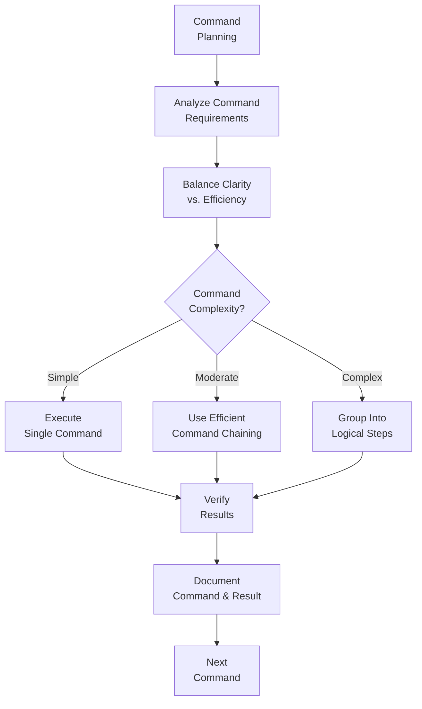
```mermaid
graph TD
    Start["Command<br>Planning"] --> Analyze["Analyze Command<br>Requirements"]
    Analyze --> Balance["Balance Clarity<br>vs. Efficiency"]
    Balance --> Complexity{"Command<br>Complexity?"}
    
    Complexity -->|"Simple"| Single["Execute<br>Single Command"]
    Complexity -->|"Moderate"| Chain["Use Efficient<br>Command Chaining"]
    Complexity -->|"Complex"| Group["Group Into<br>Logical Steps"]
    
    Single & Chain & Group --> Verify["Verify<br>Results"]
    Verify --> Document["Document<br>Command & Result"]
    Document --> Next["Next<br>Command"]
```

## 📋 COMMAND CHAINING GUIDELINES

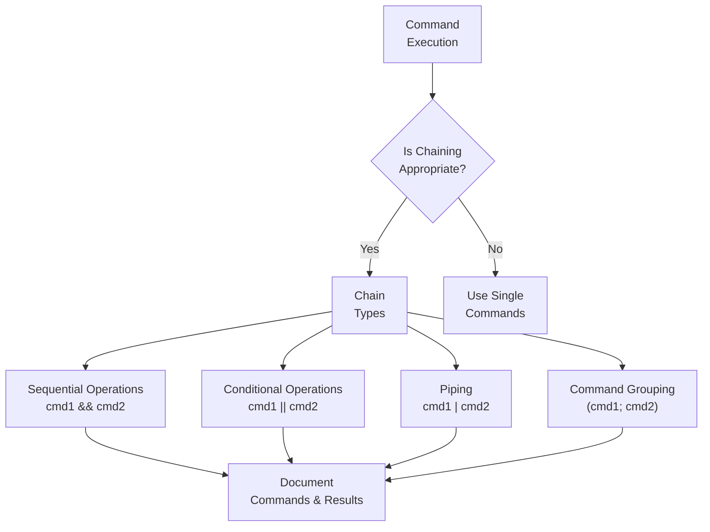
```mermaid
graph TD
    Command["Command<br>Execution"] --> ChainApprop{"Is Chaining<br>Appropriate?"}
    
    ChainApprop -->|"Yes"| ChainTypes["Chain<br>Types"]
    ChainApprop -->|"No"| SingleCmd["Use Single<br>Commands"]
    
    ChainTypes --> Sequential["Sequential Operations<br>cmd1 && cmd2"]
    ChainTypes --> Conditional["Conditional Operations<br>cmd1 || cmd2"]
    ChainTypes --> Piping["Piping<br>cmd1 | cmd2"]
    ChainTypes --> Grouping["Command Grouping<br>(cmd1; cmd2)"]
    
    Sequential & Conditional & Piping & Grouping --> Doc["Document<br>Commands & Results"]
```

## 🚦 DIRECTORY VERIFICATION WORKFLOW

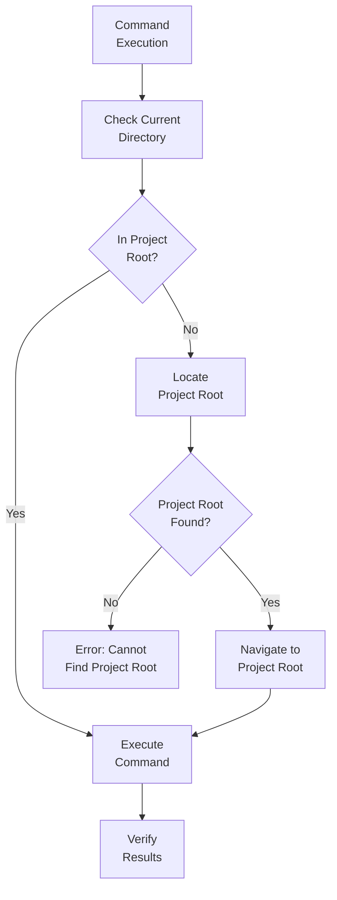
```mermaid
graph TD
    Command["Command<br>Execution"] --> DirCheck["Check Current<br>Directory"]
    DirCheck --> ProjectRoot{"In Project<br>Root?"}
    
    ProjectRoot -->|"Yes"| Execute["Execute<br>Command"]
    ProjectRoot -->|"No"| Locate["Locate<br>Project Root"]
    
    Locate --> Found{"Project Root<br>Found?"}
    Found -->|"Yes"| Navigate["Navigate to<br>Project Root"]
    Found -->|"No"| Error["Error: Cannot<br>Find Project Root"]
    
    Navigate --> Execute
    Execute --> Verify["Verify<br>Results"]
```

## 📋 DIRECTORY VERIFICATION CHECKLIST

Before executing any npm or build command:

| Step | Windows (PowerShell) | Unix/Linux/Mac | Purpose |
|------|----------------------|----------------|---------|
| **Check package.json** | `Test-Path package.json` | `ls package.json` | Verify current directory is project root |
| **Check for parent directory** | `Test-Path "*/package.json"` | `find . -maxdepth 2 -name package.json` | Find potential project directories |
| **Navigate to project root** | `cd [project-dir]` | `cd [project-dir]` | Move to correct directory before executing commands |

## 📋 REACT-SPECIFIC COMMAND GUIDELINES

For React applications, follow these strict guidelines:

| Command | Correct Usage | Incorrect Usage | Notes |
|---------|---------------|----------------|-------|
| **npm start** | `cd [project-root] && npm start` | `npm start` (from parent dir) | Must execute from directory with package.json |
| **npm run build** | `cd [project-root] && npm run build` | `cd [parent-dir] && npm run build` | Must execute from directory with package.json |
| **npm install** | `cd [project-root] && npm install [pkg]` | `npm install [pkg]` (wrong dir) | Dependencies installed to nearest package.json |
| **npm create** | `npm create vite@latest my-app -- --template react` | Manually configuring webpack | Use standard tools for project creation |

## 🔄 COMMAND CHAINING PATTERNS

Effective command chaining patterns include:

| Pattern | Format | Examples | Use Case |
|---------|--------|----------|----------|
| **Sequential** | `cmd1 && cmd2` | `mkdir dir && cd dir` | Commands that should run in sequence, second only if first succeeds |
| **Conditional** | `cmd1 || cmd2` | `test -f file.txt || touch file.txt` | Fallback commands, second only if first fails |
| **Piping** | `cmd1 \| cmd2` | `grep "pattern" file.txt \| wc -l` | Pass output of first command as input to second |
| **Background** | `cmd &` | `npm start &` | Run command in background |
| **Grouping** | `(cmd1; cmd2)` | `(echo "Start"; npm test; echo "End")` | Group commands to run as a unit |

## 📋 COMMAND DOCUMENTATION TEMPLATE

```
## Command Execution: [Purpose]

### Command
```
[actual command or chain]
```

### Result
```
[command output]
```

### Effect
[Brief description of what changed in the system]

### Next Steps
[What needs to be done next]
```

## 🔍 PLATFORM-SPECIFIC CONSIDERATIONS

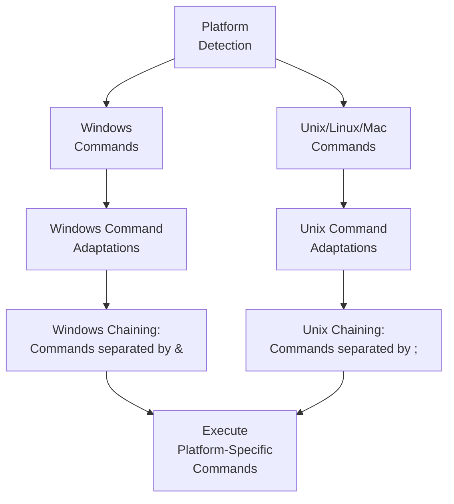
```mermaid
graph TD
    Platform["Platform<br>Detection"] --> Windows["Windows<br>Commands"]
    Platform --> Unix["Unix/Linux/Mac<br>Commands"]
    
    Windows --> WinAdapt["Windows Command<br>Adaptations"]
    Unix --> UnixAdapt["Unix Command<br>Adaptations"]
    
    WinAdapt --> WinChain["Windows Chaining:<br>Commands separated by &"]
    UnixAdapt --> UnixChain["Unix Chaining:<br>Commands separated by ;"]
    
    WinChain & UnixChain --> Execute["Execute<br>Platform-Specific<br>Commands"]
```

## 📋 COMMAND EFFICIENCY EXAMPLES

Examples of efficient command usage:

| Inefficient | Efficient | Explanation |
|-------------|-----------|-------------|
| `mkdir dir`<br>`cd dir`<br>`npm init -y` | `mkdir dir && cd dir && npm init -y` | Combines related sequential operations |
| `ls`<br>`grep "\.js$"` | `ls \| grep "\.js$"` | Pipes output of first command to second |
| `test -f file.txt`<br>`if not exists, touch file.txt` | `test -f file.txt \|\| touch file.txt` | Creates file only if it doesn't exist |
| `mkdir dir1`<br>`mkdir dir2`<br>`mkdir dir3` | `mkdir dir1 dir2 dir3` | Uses command's built-in multiple argument capability |
| `npm install pkg1`<br>`npm install pkg2` | `npm install pkg1 pkg2` | Installs multiple packages in one command |

## 📋 REACT PROJECT INITIALIZATION STANDARDS

Always use these standard approaches for React project creation:

| Approach | Command | Benefits | Avoids |
|----------|---------|----------|--------|
| **Create React App** | `npx create-react-app my-app` | Preconfigured webpack & babel | Manual configuration errors |
| **Create React App w/TypeScript** | `npx create-react-app my-app --template typescript` | Type safety + preconfigured | Inconsistent module systems |
| **Vite** | `npm create vite@latest my-app -- --template react` | Faster build times | Complex webpack setups |
| **Next.js** | `npx create-next-app@latest my-app` | SSR support | Module system conflicts |

## ⚠️ ERROR HANDLING WORKFLOW

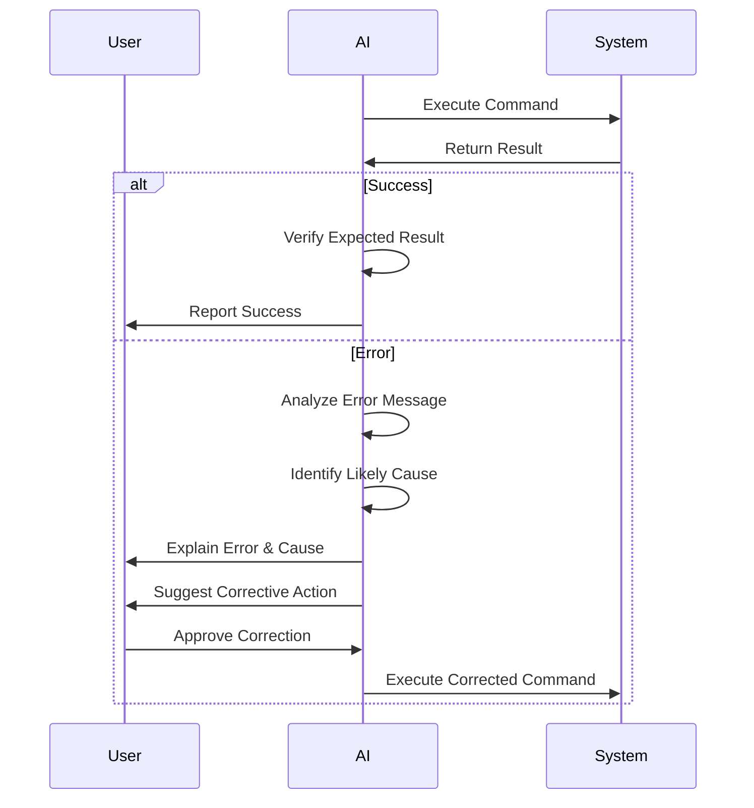
```mermaid
sequenceDiagram
    participant User
    participant AI
    participant System
    
    AI->>System: Execute Command
    System->>AI: Return Result
    
    alt Success
        AI->>AI: Verify Expected Result
        AI->>User: Report Success
    else Error
        AI->>AI: Analyze Error Message
        AI->>AI: Identify Likely Cause
        AI->>User: Explain Error & Cause
        AI->>User: Suggest Corrective Action
        User->>AI: Approve Correction
        AI->>System: Execute Corrected Command
    end
```

## 📋 COMMAND RESULT VERIFICATION

After command execution, verify:

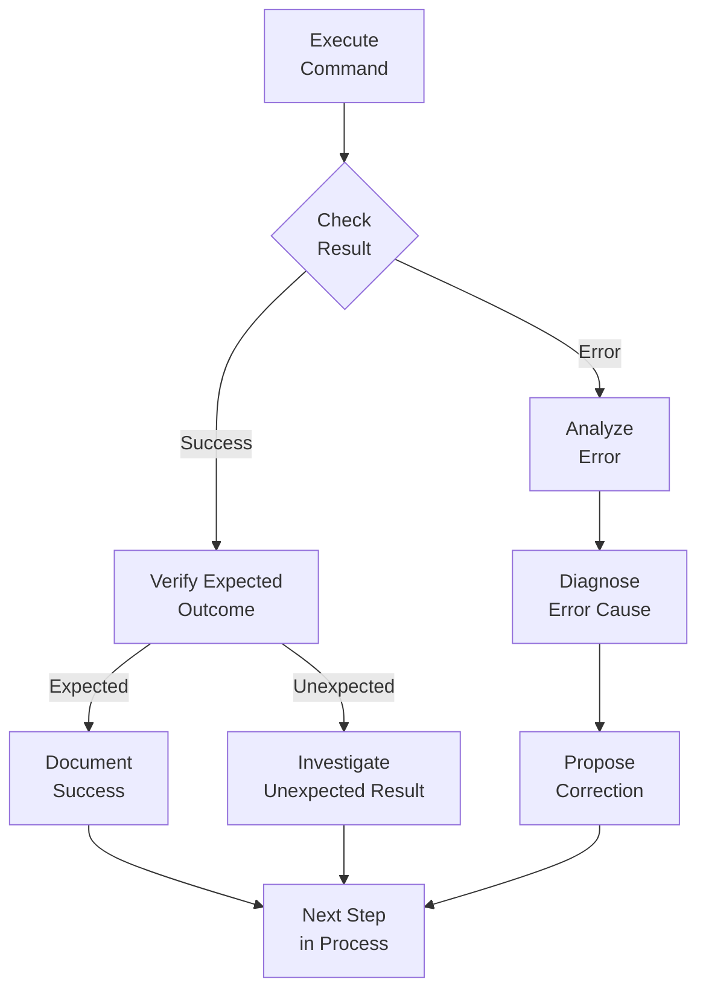
```mermaid
graph TD
    Execute["Execute<br>Command"] --> Check{"Check<br>Result"}
    
    Check -->|"Success"| Verify["Verify Expected<br>Outcome"]
    Check -->|"Error"| Analyze["Analyze<br>Error"]
    
    Verify -->|"Expected"| Document["Document<br>Success"]
    Verify -->|"Unexpected"| Investigate["Investigate<br>Unexpected Result"]
    
    Analyze --> Diagnose["Diagnose<br>Error Cause"]
    Diagnose --> Correct["Propose<br>Correction"]
    
    Document & Investigate & Correct --> Next["Next Step<br>in Process"]
```

## 📝 COMMAND EXECUTION CHECKLIST

```
✓ COMMAND EXECUTION CHECKLIST
- Command purpose clearly identified? [YES/NO]
- Appropriate balance of clarity vs. efficiency? [YES/NO]
- Platform-specific considerations addressed? [YES/NO]
- Command documented with results? [YES/NO]
- Outcome verified against expectations? [YES/NO]
- Errors properly handled (if any)? [YES/NO/NA]
- For npm/build commands: Executed from project root? [YES/NO/NA]
- For React projects: Using standard tooling? [YES/NO/NA]

→ If all YES: Command execution complete
→ If any NO: Address missing elements
```

## 🚨 COMMAND EXECUTION WARNINGS

Avoid these common command issues:

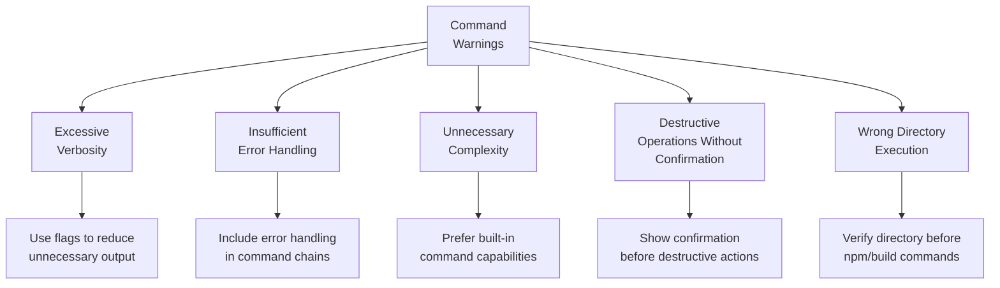
```mermaid
graph TD
    Warning["Command<br>Warnings"] --> W1["Excessive<br>Verbosity"]
    Warning --> W2["Insufficient<br>Error Handling"]
    Warning --> W3["Unnecessary<br>Complexity"]
    Warning --> W4["Destructive<br>Operations Without<br>Confirmation"]
    Warning --> W5["Wrong Directory<br>Execution"]
    
    W1 --> S1["Use flags to reduce<br>unnecessary output"]
    W2 --> S2["Include error handling<br>in command chains"]
    W3 --> S3["Prefer built-in<br>command capabilities"]
    W4 --> S4["Show confirmation<br>before destructive actions"]
    W5 --> S5["Verify directory before<br>npm/build commands"]
``` 
```

`.cursor/rules/isolation_rules/Core/complexity-decision-tree.mdc`

```mdc
---
description: complexity decision tree
globs: complexity-decision-tree.mdc
alwaysApply: false
---
# TASK COMPLEXITY DETERMINATION

> **TL;DR:** This document helps determine the appropriate complexity level (1-4) for any task. Use the decision tree and indicators to select the right process level, then load the corresponding process map.

## 🌳 COMPLEXITY DECISION TREE

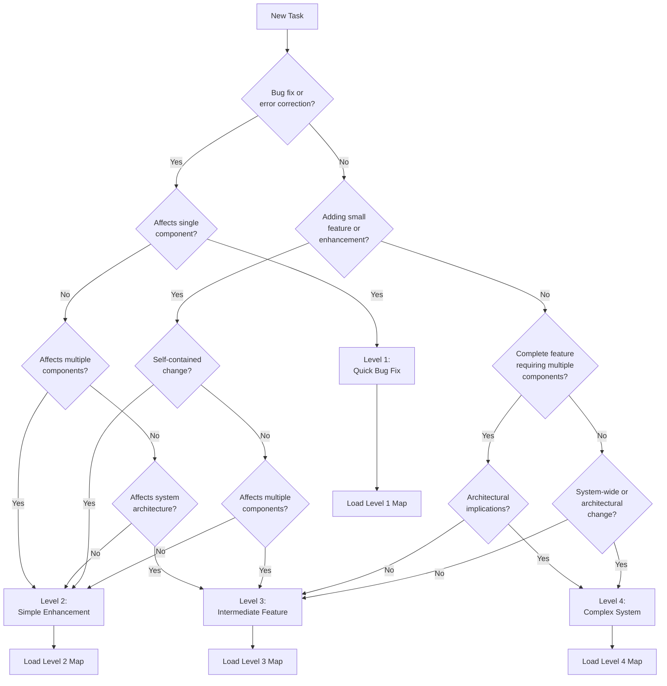
```mermaid
graph TD
    Start["New Task"] --> Q1{"Bug fix or<br>error correction?"}
    Q1 -->|Yes| Q1a{"Affects single<br>component?"}
    Q1a -->|Yes| L1["Level 1:<br>Quick Bug Fix"]
    Q1a -->|No| Q1b{"Affects multiple<br>components?"}
    Q1b -->|Yes| L2["Level 2:<br>Simple Enhancement"]
    Q1b -->|No| Q1c{"Affects system<br>architecture?"}
    Q1c -->|Yes| L3["Level 3:<br>Intermediate Feature"]
    Q1c -->|No| L2

    Q1 -->|No| Q2{"Adding small<br>feature or<br>enhancement?"}
    Q2 -->|Yes| Q2a{"Self-contained<br>change?"}
    Q2a -->|Yes| L2
    Q2a -->|No| Q2b{"Affects multiple<br>components?"}
    Q2b -->|Yes| L3
    Q2b -->|No| L2

    Q2 -->|No| Q3{"Complete feature<br>requiring multiple<br>components?"}
    Q3 -->|Yes| Q3a{"Architectural<br>implications?"}
    Q3a -->|Yes| L4["Level 4:<br>Complex System"]
    Q3a -->|No| L3

    Q3 -->|No| Q4{"System-wide or<br>architectural<br>change?"}
    Q4 -->|Yes| L4
    Q4 -->|No| L3

    L1 --> LoadL1["Load Level 1 Map"]
    L2 --> LoadL2["Load Level 2 Map"]
    L3 --> LoadL3["Load Level 3 Map"]
    L4 --> LoadL4["Load Level 4 Map"]
```

## 📊 COMPLEXITY LEVEL INDICATORS

Use these indicators to help determine task complexity:

### Level 1: Quick Bug Fix
- **Keywords**: "fix", "broken", "not working", "issue", "bug", "error", "crash"
- **Scope**: Single component or UI element
- **Duration**: Can be completed quickly (minutes to hours)
- **Risk**: Low, isolated changes
- **Examples**:
  - Fix button not working
  - Correct styling issue
  - Fix validation error
  - Resolve broken link
  - Fix typo or text issue

### Level 2: Simple Enhancement
- **Keywords**: "add", "improve", "update", "change", "enhance", "modify"
- **Scope**: Single component or subsystem
- **Duration**: Hours to 1-2 days
- **Risk**: Moderate, contained to specific area
- **Examples**:
  - Add form field
  - Improve validation
  - Update styling
  - Add simple feature
  - Change text content
  - Enhance existing component

### Level 3: Intermediate Feature
- **Keywords**: "implement", "create", "develop", "build", "feature"
- **Scope**: Multiple components, complete feature
- **Duration**: Days to 1-2 weeks
- **Risk**: Significant, affects multiple areas
- **Examples**:
  - Implement user authentication
  - Create dashboard
  - Develop search functionality
  - Build user profile system
  - Implement data visualization
  - Create complex form system

### Level 4: Complex System
- **Keywords**: "system", "architecture", "redesign", "integration", "framework"
- **Scope**: Multiple subsystems or entire application
- **Duration**: Weeks to months
- **Risk**: High, architectural implications
- **Examples**:
  - Implement authentication system
  - Build payment processing framework
  - Create microservice architecture
  - Implement database migration system
  - Develop real-time communication system
  - Create multi-tenant architecture

## 🔍 COMPLEXITY ASSESSMENT QUESTIONS

Answer these questions to determine complexity:

1. **Scope Impact**
   - Does it affect a single component or multiple?
   - Are there system-wide implications?
   - How many files will need to be modified?

2. **Design Decisions**
   - Are complex design decisions required?
   - Will it require creative phases for design?
   - Are there architectural considerations?

3. **Risk Assessment**
   - What happens if it fails?
   - Are there security implications?
   - Will it affect critical functionality?

4. **Implementation Effort**
   - How long will it take to implement?
   - Does it require specialized knowledge?
   - Is extensive testing needed?

## 📊 KEYWORD ANALYSIS TABLE

| Keyword | Likely Level | Notes |
|---------|--------------|-------|
| "Fix" | Level 1 | Unless system-wide |
| "Bug" | Level 1 | Unless multiple components |
| "Error" | Level 1 | Unless architectural |
| "Add" | Level 2 | Unless complex feature |
| "Update" | Level 2 | Unless architectural |
| "Improve" | Level 2 | Unless system-wide |
| "Implement" | Level 3 | Complex components |
| "Create" | Level 3 | New functionality |
| "Develop" | Level 3 | Significant scope |
| "System" | Level 4 | Architectural implications |
| "Architecture" | Level 4 | Major structural changes |
| "Framework" | Level 4 | Core infrastructure |

## 🔄 COMPLEXITY ESCALATION

If during a task you discover it's more complex than initially determined:

```
⚠️ TASK ESCALATION NEEDED
Current Level: Level [X]
Recommended Level: Level [Y]
Reason: [Brief explanation]

Would you like me to escalate this task to Level [Y]?
```

If approved, switch to the appropriate higher-level process map.

## 🎯 PROCESS SELECTION

After determining complexity, load the appropriate process map:

| Level | Description | Process Map |
|-------|-------------|-------------|
| 1 | Quick Bug Fix | [Level 1 Workflow](mdc:workflow-level1.mdc) |
| 2 | Simple Enhancement | [Level 2 Workflow](mdc:workflow-level2.mdc) |
| 3 | Intermediate Feature | [Level 3 Workflow](mdc:workflow-level3.mdc) |
| 4 | Complex System | [Level 4 Workflow](mdc:workflow-level4.mdc) |

## 📝 COMPLEXITY DETERMINATION TEMPLATE

Use this template to document complexity determination:

```
## COMPLEXITY DETERMINATION

Task: [Task description]

Assessment:
- Scope: [Single component/Multiple components/System-wide]
- Design decisions: [Simple/Moderate/Complex]
- Risk: [Low/Moderate/High]
- Implementation effort: [Low/Moderate/High]

Keywords identified: [List relevant keywords]

Determination: Level [1/2/3/4] - [Quick Bug Fix/Simple Enhancement/Intermediate Feature/Complex System]

Loading process map: [Level X Map]
```

```

`.cursor/rules/isolation_rules/Core/context-management.mdc`

```mdc
---
description: Enhanced Context Management with Per-Task Context Preservation
globs: "**/memory-bank/**", "**/contexts/**", "**/tasks/**"
alwaysApply: true
---

# ENHANCED CONTEXT MANAGEMENT SYSTEM

## CORE PRINCIPLE: PER-TASK CONTEXT PRESERVATION

**CRITICAL REQUIREMENT**: Each task MUST have separate context preservation to enable multi-task switching and parallel work on non-overlapping tasks.

**MANDATORY RULE**: NO static context files (like current-context.md). ALL contexts MUST be task-specific and follow YYYY-MM-DD-task-name-context.md format.

## CONTEXT ARCHITECTURE

### Context File Structure
```
memory-bank/contexts/
├── active/
│   ├── 2025-06-20-user-auth-context.md
│   ├── 2025-06-20-payment-system-context.md
│   └── 2025-06-20-dashboard-redesign-context.md
├── suspended/
│   ├── 2025-06-15-legacy-migration-context.md
│   └── 2025-06-18-api-optimization-context.md
└── archived/
    └── 2025-06/
        ├── 2025-06-10-bug-fix-123-context.md
        └── 2025-06-12-feature-abc-context.md
```

### Context Naming Convention
```
Format: YYYY-MM-DD-{task-identifier}-context.md
Examples:
- 2025-06-20-user-authentication-context.md
- 2025-06-20-payment-integration-context.md
- 2025-06-20-ui-redesign-context.md
```

## CONTEXT PRESERVATION REQUIREMENTS

### Mental State Preservation
```markdown
## 🧠 MENTAL STATE

### Current Focus
- **Primary Objective**: [What you're trying to achieve]
- **Current Approach**: [How you're approaching it]
- **Mental Model**: [Your understanding of the problem/solution]

### Cognitive Context
- **Key Insights**: [Important realizations or discoveries]
- **Assumptions Made**: [What you're assuming to be true]
- **Questions to Resolve**: [Open questions or uncertainties]
- **Decision Points**: [Choices that need to be made]

### Emotional State
- **Confidence Level**: [HIGH/MEDIUM/LOW]
- **Frustration Points**: [What's been challenging]
- **Momentum Indicators**: [What's working well]
```

### Working State Preservation
```markdown
## ⚙️ WORKING STATE

### Technical Context
- **Current File/Location**: [Where you're working]
- **Code/Config State**: [What's been modified]
- **Environment Setup**: [Tools, terminals, browsers open]
- **Dependencies**: [What needs to be running/available]

### Progress Tracking
- **Completed Steps**: [What's been finished]
- **Current Step**: [What you're working on now]
- **Next Steps**: [Immediate next actions]
- **Blocked Items**: [What's preventing progress]

### Research Context
- **Sources Consulted**: [Documentation, Stack Overflow, etc.]
- **Key Findings**: [Important information discovered]
- **Approaches Tried**: [What's been attempted]
- **Approaches to Try**: [What to attempt next]
```

### Session Planning
```markdown
## 📋 SESSION PLANNING

### Recovery Procedure
1. **Environment Setup**: [Steps to recreate working environment]
2. **Context Loading**: [How to get back into the mental state]
3. **Progress Review**: [Quick review of what's been done]
4. **Next Action**: [First thing to do when resuming]

### Time Management
- **Estimated Time Remaining**: [How much more work expected]
- **Optimal Session Length**: [Best work session duration]
- **Break Points**: [Good places to pause work]
- **Dependencies on Others**: [Waiting for external input]
```

## WIP (WORK IN PROGRESS) LIMITS

### Active Context Limits
```yaml
Maximum Active Contexts: 3
Reasoning:
  - Human cognitive limit for context switching
  - 25-minute recovery time per context switch
  - Quality degradation with too many active contexts
  - Memory and attention span constraints
```

### Context State Management
```markdown
Context States:
- **ACTIVE**: Currently being worked on (max 3)
- **SUSPENDED**: Temporarily paused, can be resumed
- **BLOCKED**: Waiting for external dependencies
- **ARCHIVED**: Completed or permanently shelved
```

## CONTEXT SWITCHING PROTOCOLS

### Suspension Protocol
```bash
# When suspending a context
suspend_context() {
    local context_file="$1"
    local reason="$2"

    echo "## 🔄 CONTEXT SUSPENSION" >> "$context_file"
    echo "**Suspended At**: $(date '+%Y-%m-%d %H:%M:%S')" >> "$context_file"
    echo "**Reason**: $reason" >> "$context_file"
    echo "**Recovery Notes**: [Add specific notes for resuming]" >> "$context_file"

    # Move to suspended directory
    mv "memory-bank/contexts/active/$context_file" "memory-bank/contexts/suspended/"
}
```

### Restoration Protocol
```bash
# When restoring a suspended context
restore_context() {
    local context_file="$1"

    echo "## ▶️ CONTEXT RESTORATION" >> "$context_file"
    echo "**Restored At**: $(date '+%Y-%m-%d %H:%M:%S')" >> "$context_file"
    echo "**Recovery Time**: [Time taken to get back into flow]" >> "$context_file"

    # Move back to active directory
    mv "memory-bank/contexts/suspended/$context_file" "memory-bank/contexts/active/"
}
```

### Context Dashboard
```markdown
# Context Dashboard Template
## 📊 ACTIVE CONTEXTS DASHBOARD

**Last Updated**: 2025-06-20 19:45:00
**Active Contexts**: 2/3

### 🟢 Active Contexts
| Context | Priority | Progress | Last Updated | Next Action |
|---------|----------|----------|--------------|-------------|
| [user-auth](contexts/active/2025-06-20-user-auth-context.md) | HIGH | 60% | 19:30 | Implement JWT validation |
| [payment-system](contexts/active/2025-06-20-payment-context.md) | MEDIUM | 30% | 18:45 | Research Stripe integration |

### ⏸️ Suspended Contexts
| Context | Reason | Suspended Since | Resume Priority |
|---------|--------|-----------------|-----------------|
| [legacy-migration](contexts/suspended/2025-06-15-legacy-context.md) | Waiting for DB access | 2 days | LOW |

### ⚠️ Context Health Alerts
- [ ] No contexts over WIP limit ✅
- [ ] All active contexts updated within 2 hours ⚠️
- [ ] No contexts suspended over 1 week ✅
```

## INTEGRATION WITH TASK MANAGEMENT

### Task-Context Linking
```markdown
# In task files:
**Related Context**: [contexts/active/2025-06-20-task-name-context.md](../contexts/active/2025-06-20-task-name-context.md)

# In context files:
**Related Task**: [tasks/in_progress/active/2025-06-20-HIGH-FEATURE-task-name.md](../tasks/in_progress/active/2025-06-20-HIGH-FEATURE-task-name.md)
```

### Context Lifecycle Management
```bash
# Context lifecycle automation
manage_context_lifecycle() {
    local task_status="$1"
    local context_file="$2"

    case "$task_status" in
        "started")
            create_active_context "$context_file"
            ;;
        "suspended")
            suspend_context "$context_file" "Task suspended"
            ;;
        "resumed")
            restore_context "$context_file"
            ;;
        "completed")
            archive_context "$context_file"
            ;;
        "cancelled")
            archive_context "$context_file" "Task cancelled"
            ;;
    esac
}
```

## MODE-SPECIFIC CONTEXT REQUIREMENTS

### VAN Mode Context
```markdown
VAN Context Requirements:
- Preserve analysis state and findings
- Track migration progress and decisions
- Document discovered patterns and issues
- Maintain investigation context across sessions
```

### PLAN Mode Context
```markdown
PLAN Context Requirements:
- Preserve strategic thinking and decisions
- Track component analysis progress
- Document research findings and sources
- Maintain planning assumptions and constraints
```

### CREATIVE Mode Context
```markdown
CREATIVE Context Requirements:
- Preserve design thinking and iterations
- Track option evaluation and decisions
- Document inspiration sources and references
- Maintain creative flow and momentum
```

### IMPLEMENT Mode Context
```markdown
IMPLEMENT Context Requirements:
- Preserve technical implementation state
- Track code changes and debugging progress
- Document technical decisions and trade-offs
- Maintain development environment context
```

## CONTEXT QUALITY ASSURANCE

### Context Health Checks
```bash
# Daily context health check
check_context_health() {
    local active_contexts=$(find memory-bank/contexts/active -name "*.md" | wc -l)
    local stale_contexts=$(find memory-bank/contexts/active -name "*.md" -mtime +1)

    if [[ $active_contexts -gt 3 ]]; then
        echo "⚠️ WIP LIMIT EXCEEDED: $active_contexts active contexts (max 3)"
    fi

    if [[ -n "$stale_contexts" ]]; then
        echo "⚠️ STALE CONTEXTS DETECTED:"
        echo "$stale_contexts"
    fi
}
```

### Context Validation
```bash
# Validate context file completeness
validate_context() {
    local context_file="$1"
    local required_sections=("MENTAL STATE" "WORKING STATE" "SESSION PLANNING")

    for section in "${required_sections[@]}"; do
        if ! grep -q "$section" "$context_file"; then
            echo "❌ MISSING SECTION: $section in $context_file"
        fi
    done
}
```

## CONTEXT MIGRATION AND ARCHIVAL

### Automatic Archival
```bash
# Archive completed contexts
archive_completed_contexts() {
    local completed_tasks=$(find memory-bank/tasks/done -name "*.md" -mtime -1)

    for task_file in $completed_tasks; do
        local task_name=$(basename "$task_file" .md)
        local context_file="memory-bank/contexts/active/${task_name}-context.md"

        if [[ -f "$context_file" ]]; then
            local archive_dir="memory-bank/contexts/archived/$(date +%Y-%m)"
            mkdir -p "$archive_dir"
            mv "$context_file" "$archive_dir/"
        fi
    done
}
```

### Context Search and Recovery
```bash
# Search contexts by content
search_contexts() {
    local search_term="$1"
    echo "🔍 Searching contexts for: $search_term"

    find memory-bank/contexts -name "*.md" -exec grep -l "$search_term" {} \;
}

# Recover archived context
recover_context() {
    local context_name="$1"
    local archived_context=$(find memory-bank/contexts/archived -name "*$context_name*")

    if [[ -n "$archived_context" ]]; then
        cp "$archived_context" "memory-bank/contexts/active/"
        echo "✅ Context recovered: $archived_context"
    fi
}
```

## PERFORMANCE OPTIMIZATION

### Context Switching Cost Mitigation
```markdown
Strategies to Reduce 25-Minute Context Switch Cost:

1. **Detailed State Preservation**
   - Complete mental state documentation
   - Specific next-action identification
   - Environment recreation instructions

2. **Quick Context Loading**
   - Summary sections for rapid review
   - Visual cues and mnemonics
   - Progress indicators and milestones

3. **Gradual Context Building**
   - Start with simple tasks in new context
   - Build complexity gradually
   - Use warm-up exercises

4. **Context Boundaries**
   - Clear separation between contexts
   - Avoid context bleeding
   - Use physical/temporal boundaries
```

### Context Efficiency Metrics
```bash
# Track context switching efficiency
track_context_efficiency() {
    local context_file="$1"
    local switch_time="$2"

    echo "## 📊 CONTEXT METRICS" >> "$context_file"
    echo "**Switch Time**: $switch_time minutes" >> "$context_file"
    echo "**Recovery Quality**: [HIGH/MEDIUM/LOW]" >> "$context_file"
    echo "**Productivity Impact**: [POSITIVE/NEUTRAL/NEGATIVE]" >> "$context_file"
}
```

## CRITICAL SUCCESS FACTORS

1. **Disciplined Context Management**: Consistent use of context preservation
2. **WIP Limit Enforcement**: Never exceed 3 active contexts
3. **Quality Documentation**: Detailed and actionable context information
4. **Regular Context Health Checks**: Daily validation and cleanup
5. **Context-Task Integration**: Seamless linking between tasks and contexts

This enhanced context management system enables efficient multi-task work while preserving the quality and continuity of work across context switches.

```

`.cursor/rules/isolation_rules/Core/continue-command-handler.mdc`

```mdc
---
description: "Система обработки команды ПРОДОЛЖАЙ с интеллектуальным восстановлением контекста"
globs: "**/**"
alwaysApply: true
---

# CONTINUE COMMAND HANDLER SYSTEM

> **TL;DR:** Система обработки команды ПРОДОЛЖАЙ обеспечивает интеллектуальное восстановление контекста, анализ текущих задач при пустом чате и предоставление выбора режима пользователю.

## 🔄 ПРИНЦИПЫ ОБРАБОТКИ КОМАНДЫ ПРОДОЛЖАЙ

### Основные требования
**Интеллектуальное восстановление контекста**
- Анализ предыдущего состояния системы
- Восстановление активных задач и проектов
- Определение последнего режима работы
- Предложение продолжения с точки остановки

**Обработка пустого чата**
- Проверка наличия активных задач в Memory Bank
- Анализ незавершенных операций
- Предоставление списка доступных режимов
- Рекомендации по выбору следующих действий

## 🎯 АЛГОРИТМ ОБРАБОТКИ КОМАНДЫ ПРОДОЛЖАЙ

### Основной workflow обработки
```bash
# Главная функция обработки команды ПРОДОЛЖАЙ
handle_continue_command() {
  echo "🔄 ОБРАБОТКА КОМАНДЫ ПРОДОЛЖАЙ"
  echo "============================="

  # Проверка состояния системы
  local system_state=$(analyze_system_state)
  echo "📊 Состояние системы: $system_state"

  case "$system_state" in
    "active_task")
      handle_active_task_continuation
      ;;
    "empty_chat")
      handle_empty_chat_continuation
      ;;
    "interrupted_session")
      handle_interrupted_session_continuation
      ;;
    "new_session")
      handle_new_session_continuation
      ;;
    *)
      handle_unknown_state_continuation
      ;;
  esac
}
```

### Анализ состояния системы
```bash
# Анализ текущего состояния Memory Bank системы
analyze_system_state() {
  local tasks_file="memory-bank/tasks.md"
  local context_file="memory-bank/activeContext.md"
  local progress_file="memory-bank/progress.md"

  # Проверка активных задач
  if [ -f "$tasks_file" ]; then
    local active_tasks=$(grep -c "АКТИВНАЯ ЗАДАЧА:" "$tasks_file" 2>/dev/null || echo "0")
    if [ "$active_tasks" -gt 0 ]; then
      echo "active_task"
      return 0
    fi
  fi

  # Проверка контекста
  if [ -f "$context_file" ]; then
    local context_size=$(wc -l < "$context_file" 2>/dev/null || echo "0")
    if [ "$context_size" -gt 10 ]; then
      echo "interrupted_session"
      return 0
    fi
  fi

  # Проверка прогресса
  if [ -f "$progress_file" ]; then
    local progress_entries=$(grep -c "%" "$progress_file" 2>/dev/null || echo "0")
    if [ "$progress_entries" -gt 0 ]; then
      echo "interrupted_session"
      return 0
    fi
  fi

  # Проверка наличия Memory Bank файлов
  if [ -d "memory-bank" ]; then
    echo "empty_chat"
  else
    echo "new_session"
  fi
}
```

## 📋 ОБРАБОТКА АКТИВНЫХ ЗАДАЧ

### Продолжение активной задачи
```bash
# Обработка продолжения при наличии активной задачи
handle_active_task_continuation() {
  echo "📋 ОБНАРУЖЕНА АКТИВНАЯ ЗАДАЧА"
  echo "============================"

  # Извлечение информации об активной задаче
  local task_info=$(extract_active_task_info)
  local task_name=$(echo "$task_info" | head -1)
  local task_status=$(echo "$task_info" | tail -1)

  echo "📝 Активная задача: $task_name"
  echo "📊 Статус: $task_status"

  # Анализ прогресса задачи
  local progress_analysis=$(analyze_task_progress "$task_name")
  echo "📈 Анализ прогресса:"
  echo "$progress_analysis"

  # Определение следующих шагов
  local next_steps=$(determine_next_steps "$task_name" "$task_status")
  echo "🎯 Рекомендуемые следующие шаги:"
  echo "$next_steps"

  # Предложение режимов
  echo ""
  echo "🔧 Доступные режимы для продолжения:"
  echo "1. IMPLEMENT - Продолжить реализацию"
  echo "2. PLAN - Пересмотреть план"
  echo "3. VAN - Анализ текущего состояния"
  echo "4. CREATIVE - Решение проблем"
  echo "5. REFLECT - Анализ выполненной работы"

  # Автоматическая рекомендация режима
  local recommended_mode=$(recommend_mode_for_task "$task_status")
  echo "💡 Рекомендуемый режим: $recommended_mode"

  read -p "Выберите режим (1-5) или нажмите Enter для рекомендуемого: " mode_choice

  case "${mode_choice:-$recommended_mode}" in
    "1"|"IMPLEMENT"|"implement")
      echo "⚙️ Переход в IMPLEMENT режим"
      start_implement_mode "$task_name"
      ;;
    "2"|"PLAN"|"plan")
      echo "📋 Переход в PLAN режим"
      start_plan_mode "$task_name"
      ;;
    "3"|"VAN"|"van")
      echo "🔍 Переход в VAN режим"
      start_van_mode
      ;;
    "4"|"CREATIVE"|"creative")
      echo "🎨 Переход в CREATIVE режим"
      start_creative_mode "$task_name"
      ;;
    "5"|"REFLECT"|"reflect")
      echo "🤔 Переход в REFLECT режим"
      start_reflect_mode "$task_name"
      ;;
    *)
      echo "❌ Неверный выбор, использование рекомендуемого режима: $recommended_mode"
      handle_mode_selection "$recommended_mode" "$task_name"
      ;;
  esac
}
```

### Извлечение информации о задаче
```bash
# Извлечение информации об активной задаче
extract_active_task_info() {
  local tasks_file="memory-bank/tasks.md"

  if [ ! -f "$tasks_file" ]; then
    echo "Задача не найдена"
    echo "Неизвестно"
    return 1
  fi

  # Поиск активной задачи
  local task_section=$(sed -n '/## 🎯 АКТИВНАЯ ЗАДАЧА:/,/^## /p' "$tasks_file" | head -n -1)

  if [ -z "$task_section" ]; then
    echo "Активная задача не найдена"
    echo "Неизвестно"
    return 1
  fi

  # Извлечение названия задачи
  local task_name=$(echo "$task_section" | grep "**Название**:" | sed 's/.*: //')

  # Извлечение статуса
  local task_status=$(echo "$task_section" | grep "**Статус**:" | sed 's/.*: //')

  echo "$task_name"
  echo "$task_status"
}
```

## 💭 ОБРАБОТКА ПУСТОГО ЧАТА

### Обработка пустого чата с существующими задачами
```bash
# Обработка команды ПРОДОЛЖАЙ при пустом чате
handle_empty_chat_continuation() {
  echo "💭 ОБРАБОТКА ПУСТОГО ЧАТА"
  echo "========================"

  # Поиск всех задач в Memory Bank
  local all_tasks=$(find_all_tasks)

  if [ -n "$all_tasks" ]; then
    echo "📋 Найденные задачи в Memory Bank:"
    echo "$all_tasks"
    echo ""

    # Анализ последней активности
    local last_activity=$(analyze_last_activity)
    echo "🕒 Последняя активность: $last_activity"

    # Предложение возобновления
    echo "🔄 Варианты продолжения работы:"
    echo "1. Возобновить последнюю задачу"
    echo "2. Выбрать задачу из списка"
    echo "3. Создать новую задачу"
    echo "4. Анализ состояния проекта (VAN)"
    echo "5. Планирование новой работы (PLAN)"

    read -p "Выберите вариант (1-5): " continuation_choice

    case "$continuation_choice" in
      "1")
        resume_last_task
        ;;
      "2")
        select_task_from_list
        ;;
      "3")
        create_new_task
        ;;
      "4")
        start_van_mode
        ;;
      "5")
        start_plan_mode
        ;;
      *)
        echo "❌ Неверный выбор, переход в VAN режим для анализа"
        start_van_mode
        ;;
    esac
  else
    echo "📝 Задачи в Memory Bank не найдены"
    handle_no_tasks_continuation
  fi
}
```

### Поиск всех задач
```bash
# Поиск всех задач в Memory Bank
find_all_tasks() {
  local tasks_file="memory-bank/tasks.md"
  local archive_dir="memory-bank/archive"

  if [ ! -f "$tasks_file" ]; then
    return 1
  fi

  # Извлечение активных задач
  local active_tasks=$(grep -n "## 🎯.*ЗАДАЧА:" "$tasks_file" | head -5)

  # Извлечение завершенных задач
  local completed_tasks=$(grep -n "## 🎯.*ЗАВЕРШЕННАЯ ЗАДАЧА:" "$tasks_file" | head -3)

  # Архивные задачи
  local archived_tasks=""
  if [ -d "$archive_dir" ]; then
    archived_tasks=$(find "$archive_dir" -name "*.md" -exec basename {} \; | head -3)
  fi

  # Формирование отчета
  if [ -n "$active_tasks" ]; then
    echo "📋 АКТИВНЫЕ ЗАДАЧИ:"
    echo "$active_tasks"
    echo ""
  fi

  if [ -n "$completed_tasks" ]; then
    echo "✅ ЗАВЕРШЕННЫЕ ЗАДАЧИ:"
    echo "$completed_tasks"
    echo ""
  fi

  if [ -n "$archived_tasks" ]; then
    echo "📚 АРХИВНЫЕ ЗАДАЧИ:"
    echo "$archived_tasks"
  fi
}
```

## 🔍 АНАЛИЗ И РЕКОМЕНДАЦИИ

### Определение следующих шагов
```bash
# Определение следующих шагов на основе статуса задачи
determine_next_steps() {
  local task_name="$1"
  local task_status="$2"

  case "$task_status" in
    *"PLANNED"*|*"0%"*)
      echo "1. Начать реализацию (IMPLEMENT)"
      echo "2. Детализировать план (PLAN)"
      echo "3. Проанализировать требования (CREATIVE)"
      ;;
    *"IMPLEMENT"*|*"[1-4][0-9]%"*)
      echo "1. Продолжить реализацию (IMPLEMENT)"
      echo "2. Проверить прогресс (REFLECT)"
      echo "3. Решить возникшие проблемы (CREATIVE)"
      ;;
    *"[5-8][0-9]%"*)
      echo "1. Завершить реализацию (IMPLEMENT)"
      echo "2. Провести тестирование"
      echo "3. Подготовить документацию"
      ;;
    *"[9][0-9]%"*|*"TESTING"*)
      echo "1. Финальное тестирование"
      echo "2. Исправление найденных проблем"
      echo "3. Подготовка к завершению (REFLECT)"
      ;;
    *"ЗАВЕРШЕНА"*|*"100%"*)
      echo "1. Архивирование задачи"
      echo "2. Анализ результатов (REFLECT)"
      echo "3. Планирование следующих задач (PLAN)"
      ;;
    *)
      echo "1. Анализ текущего состояния (VAN)"
      echo "2. Планирование действий (PLAN)"
      echo "3. Решение проблем (CREATIVE)"
      ;;
  esac
}

# Рекомендация режима на основе статуса
recommend_mode_for_task() {
  local task_status="$1"

  case "$task_status" in
    *"PLANNED"*|*"0%"*)
      echo "IMPLEMENT"
      ;;
    *"IMPLEMENT"*|*"[1-7][0-9]%"*)
      echo "IMPLEMENT"
      ;;
    *"[8-9][0-9]%"*)
      echo "REFLECT"
      ;;
    *"ЗАВЕРШЕНА"*)
      echo "REFLECT"
      ;;
    *"ERROR"*|*"BLOCKED"*)
      echo "CREATIVE"
      ;;
    *)
      echo "VAN"
      ;;
  esac
}
```

### Анализ последней активности
```bash
# Анализ последней активности в системе
analyze_last_activity() {
  local activity_indicators=(
    "memory-bank/tasks.md"
    "memory-bank/progress.md"
    "memory-bank/activeContext.md"
  )

  local latest_file=""
  local latest_time=0

  for file in "${activity_indicators[@]}"; do
    if [ -f "$file" ]; then
      local file_time=$(stat -c %Y "$file" 2>/dev/null || stat -f %m "$file" 2>/dev/null)
      if [ "$file_time" -gt "$latest_time" ]; then
        latest_time="$file_time"
        latest_file="$file"
      fi
    fi
  done

  if [ -n "$latest_file" ]; then
    local last_modified=$(date -d "@$latest_time" "+%Y-%m-%d %H:%M" 2>/dev/null || date -r "$latest_time" "+%Y-%m-%d %H:%M" 2>/dev/null)
    echo "Последнее изменение: $latest_file ($last_modified)"
  else
    echo "Активность не обнаружена"
  fi
}
```

## 🎮 УПРАВЛЕНИЕ РЕЖИМАМИ

### Запуск различных режимов
```bash
# Запуск IMPLEMENT режима
start_implement_mode() {
  local task_name="$1"
  echo "⚙️ ЗАПУСК IMPLEMENT РЕЖИМА"
  echo "Задача: $task_name"
  echo "Режим: Реализация и выполнение задач"
}

# Запуск PLAN режима
start_plan_mode() {
  local task_name="$1"
  echo "📋 ЗАПУСК PLAN РЕЖИМА"
  echo "Задача: ${task_name:-Новое планирование}"
  echo "Режим: Планирование и структурирование"
}

# Запуск VAN режима
start_van_mode() {
  echo "🔍 ЗАПУСК VAN РЕЖИМА"
  echo "Режим: Анализ и валидация состояния"

  # Автоматические проверки VAN режима
  van_check_working_directory
  van_check_and_update_date
}

# Запуск CREATIVE режима
start_creative_mode() {
  local task_name="$1"
  echo "🎨 ЗАПУСК CREATIVE РЕЖИМА"
  echo "Задача: $task_name"
  echo "Режим: Творческое решение проблем"
}

# Запуск REFLECT режима
start_reflect_mode() {
  local task_name="$1"
  echo "🤔 ЗАПУСК REFLECT РЕЖИМА"
  echo "Задача: $task_name"
  echo "Режим: Анализ и рефлексия результатов"
}
```

## 🔧 ОБРАБОТКА ОСОБЫХ СЛУЧАЕВ

### Обработка отсутствия задач
```bash
# Обработка случая когда задачи не найдены
handle_no_tasks_continuation() {
  echo "📝 ОБРАБОТКА ОТСУТСТВИЯ ЗАДАЧ"
  echo "============================"

  echo "Задачи в Memory Bank не найдены."
  echo "🎯 Варианты действий:"
  echo "1. Создать новую задачу"
  echo "2. Анализ проекта (VAN режим)"
  echo "3. Планирование работы (PLAN режим)"
  echo "4. Инициализация Memory Bank"

  read -p "Выберите действие (1-4): " action_choice

  case "$action_choice" in
    "1")
      echo "📝 Создание новой задачи..."
      create_new_task
      ;;
    "2")
      echo "🔍 Запуск анализа проекта..."
      start_van_mode
      ;;
    "3")
      echo "📋 Запуск планирования..."
      start_plan_mode
      ;;
    "4")
      echo "🚀 Инициализация Memory Bank..."
      initialize_memory_bank
      ;;
    *)
      echo "❌ Неверный выбор, запуск VAN режима"
      start_van_mode
      ;;
  esac
}

# Инициализация Memory Bank
initialize_memory_bank() {
  echo "🚀 ИНИЦИАЛИЗАЦИЯ MEMORY BANK"
  echo "=========================="

  mkdir -p memory-bank/system
  mkdir -p memory-bank/archive

  # Создание базовых файлов
  echo "$(date +%Y-%m-%d)" > memory-bank/system/current-date.txt

  cat > memory-bank/tasks.md << EOF
# MEMORY BANK TASKS

**Последнее обновление**: $(date +%Y-%m-%d)
**Текущий режим**: INIT
**Активная задача**: Инициализация

---

## 🎯 ИНИЦИАЛИЗАЦИЯ ЗАВЕРШЕНА

Memory Bank успешно инициализирован и готов к работе.

Доступные команды:
- VAN - анализ состояния проекта
- PLAN - планирование задач
- CREATIVE - творческое решение проблем
- IMPLEMENT - реализация задач
- REFLECT - анализ результатов

EOF

  echo "✅ Memory Bank инициализирован"
  echo "🔍 Запуск VAN режима для анализа проекта"
  start_van_mode
}
```

Эта система обработки команды ПРОДОЛЖАЙ обеспечивает интеллектуальное восстановление контекста и помогает пользователю эффективно продолжить работу с Memory Bank системой.
```

`.cursor/rules/isolation_rules/Core/creative-phase-enforcement.mdc`

```mdc
---
description: creative phase enforcement
globs: creative-phase-enforcement.mdc
alwaysApply: false
---
# CREATIVE PHASE ENFORCEMENT

> **TL;DR:** This document implements strict enforcement of creative phase requirements for Level 3-4 tasks, ensuring all design decisions are properly documented and verified before implementation can proceed.

## 🔍 ENFORCEMENT WORKFLOW

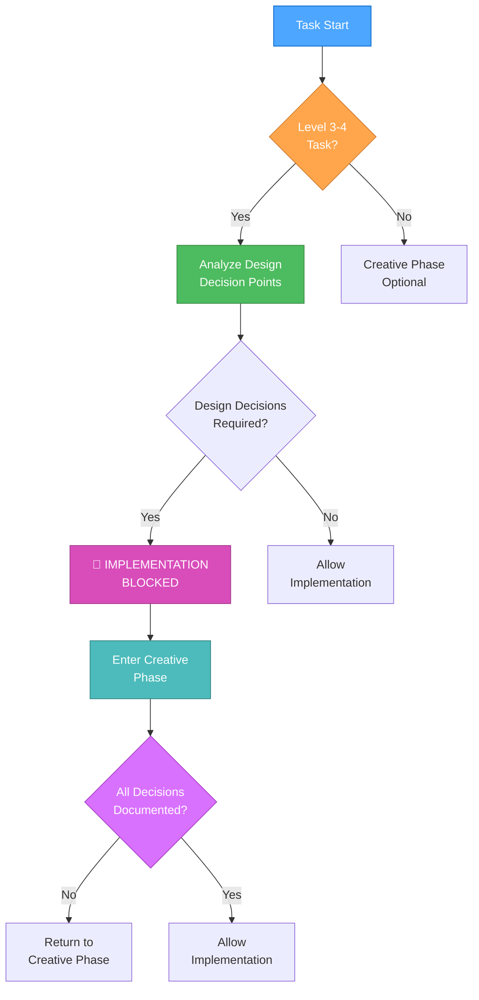
```mermaid
graph TD
    Start["Task Start"] --> Check{"Level 3-4<br>Task?"}
    Check -->|Yes| Analyze["Analyze Design<br>Decision Points"]
    Check -->|No| Optional["Creative Phase<br>Optional"]

    Analyze --> Decision{"Design Decisions<br>Required?"}
    Decision -->|Yes| Gate["🚨 IMPLEMENTATION<br>BLOCKED"]
    Decision -->|No| Allow["Allow<br>Implementation"]

    Gate --> Creative["Enter Creative<br>Phase"]
    Creative --> Verify{"All Decisions<br>Documented?"}
    Verify -->|No| Return["Return to<br>Creative Phase"]
    Verify -->|Yes| Proceed["Allow<br>Implementation"]

    style Start fill:#4da6ff,stroke:#0066cc,color:white
    style Check fill:#ffa64d,stroke:#cc7a30,color:white
    style Analyze fill:#4dbb5f,stroke:#36873f,color:white
    style Gate fill:#d94dbb,stroke:#a3378a,color:white
    style Creative fill:#4dbbbb,stroke:#368787,color:white
    style Verify fill:#d971ff,stroke:#a33bc2,color:white
```

## 🚨 ENFORCEMENT GATES

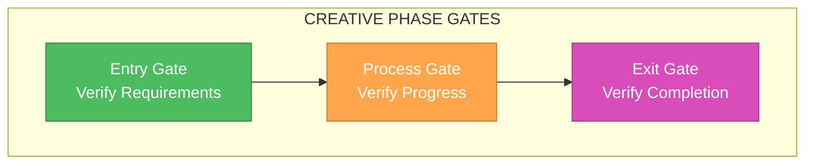
```mermaid
graph TD
    subgraph "CREATIVE PHASE GATES"
    G1["Entry Gate<br>Verify Requirements"]
    G2["Process Gate<br>Verify Progress"]
    G3["Exit Gate<br>Verify Completion"]
    end

    G1 --> G2 --> G3

    style G1 fill:#4dbb5f,stroke:#36873f,color:white
    style G2 fill:#ffa64d,stroke:#cc7a30,color:white
    style G3 fill:#d94dbb,stroke:#a3378a,color:white
```

## 📋 ENFORCEMENT CHECKLIST

```markdown
## Entry Gate Verification
- [ ] Task complexity is Level 3-4
- [ ] Design decisions identified
- [ ] Creative phase requirements documented
- [ ] Required participants notified

## Process Gate Verification
- [ ] All options being considered
- [ ] Pros/cons documented
- [ ] Technical constraints identified
- [ ] Implementation impacts assessed

## Exit Gate Verification
- [ ] All decisions documented
- [ ] Rationale provided for choices
- [ ] Implementation plan outlined
- [ ] Verification against requirements
```

## 🚨 IMPLEMENTATION BLOCK NOTICE

When a creative phase is required but not completed:

```
🚨 IMPLEMENTATION BLOCKED
Creative phases MUST be completed before implementation.

Required Creative Phases:
- [ ] [Creative Phase 1]
- [ ] [Creative Phase 2]
- [ ] [Creative Phase 3]

⛔ This is a HARD BLOCK
Implementation CANNOT proceed until all creative phases are completed.
Type "PHASE.REVIEW" to begin creative phase review.
```

## ✅ VERIFICATION PROTOCOL

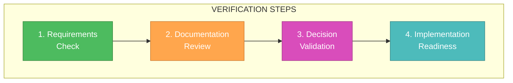
```mermaid
graph TD
    subgraph "VERIFICATION STEPS"
    V1["1. Requirements<br>Check"]
    V2["2. Documentation<br>Review"]
    V3["3. Decision<br>Validation"]
    V4["4. Implementation<br>Readiness"]
    end

    V1 --> V2 --> V3 --> V4

    style V1 fill:#4dbb5f,stroke:#36873f,color:white
    style V2 fill:#ffa64d,stroke:#cc7a30,color:white
    style V3 fill:#d94dbb,stroke:#a3378a,color:white
    style V4 fill:#4dbbbb,stroke:#368787,color:white
```

## 🔄 CREATIVE PHASE MARKERS

Use these markers to clearly indicate creative phase boundaries:

```markdown
🎨🎨🎨 ENTERING CREATIVE PHASE: [TYPE] 🎨🎨🎨
Focus: [Specific component/feature]
Objective: [Clear goal of this creative phase]
Requirements: [List of requirements]

[Creative phase content]

🎨 CREATIVE CHECKPOINT: [Milestone]
- Progress: [Status]
- Decisions: [List]
- Next steps: [Plan]

🎨🎨🎨 EXITING CREATIVE PHASE 🎨🎨🎨
Summary: [Brief description]
Key Decisions: [List]
Next Steps: [Implementation plan]
```

## 🔄 DOCUMENT MANAGEMENT

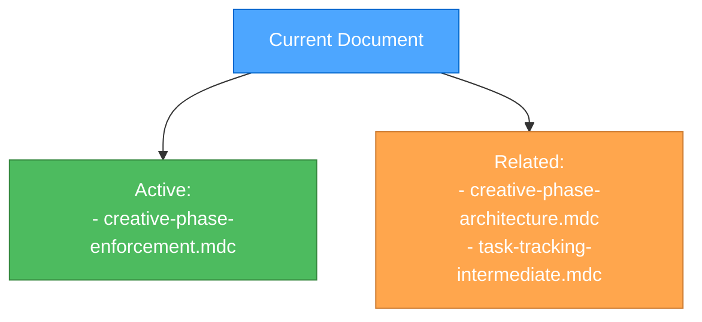
```mermaid
graph TD
    Current["Current Document"] --> Active["Active:<br>- creative-phase-enforcement.mdc"]
    Current --> Related["Related:<br>- creative-phase-architecture.mdc<br>- task-tracking-intermediate.mdc"]

    style Current fill:#4da6ff,stroke:#0066cc,color:white
    style Active fill:#4dbb5f,stroke:#36873f,color:white
    style Related fill:#ffa64d,stroke:#cc7a30,color:white
```
```

`.cursor/rules/isolation_rules/Core/creative-phase-metrics.mdc`

```mdc
---
description: creative phase metrics
globs: creative-phase-metrics.md
alwaysApply: false
---


# CREATIVE PHASE METRICS

> **TL;DR:** This document defines comprehensive quality metrics and measurement criteria for creative phases, ensuring that design decisions meet required standards and are properly documented.

## 📊 METRICS OVERVIEW

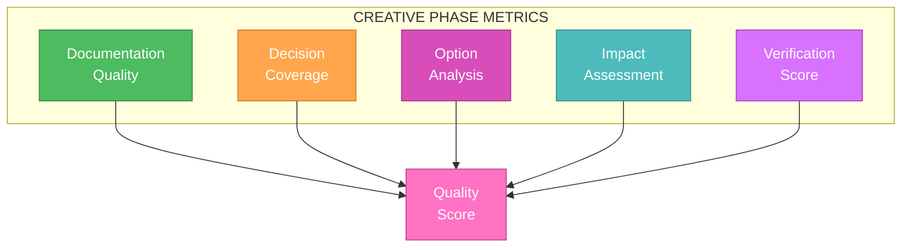
```mermaid
graph TD
    subgraph "CREATIVE PHASE METRICS"
    M1["Documentation<br>Quality"]
    M2["Decision<br>Coverage"]
    M3["Option<br>Analysis"]
    M4["Impact<br>Assessment"]
    M5["Verification<br>Score"]
    end

    M1 --> Score["Quality<br>Score"]
    M2 --> Score
    M3 --> Score
    M4 --> Score
    M5 --> Score

    style M1 fill:#4dbb5f,stroke:#36873f,color:white
    style M2 fill:#ffa64d,stroke:#cc7a30,color:white
    style M3 fill:#d94dbb,stroke:#a3378a,color:white
    style M4 fill:#4dbbbb,stroke:#368787,color:white
    style M5 fill:#d971ff,stroke:#a33bc2,color:white
    style Score fill:#ff71c2,stroke:#c23b8a,color:white
```

## 📋 QUALITY METRICS SCORECARD

```markdown
# Creative Phase Quality Assessment

## 1. Documentation Quality [0-10]
- [ ] Clear problem statement (2 points)
- [ ] Well-defined objectives (2 points)
- [ ] Comprehensive requirements list (2 points)
- [ ] Proper formatting and structure (2 points)
- [ ] Cross-references to related documents (2 points)

## 2. Decision Coverage [0-10]
- [ ] All required decisions identified (2 points)
- [ ] Each decision point documented (2 points)
- [ ] Dependencies mapped (2 points)
- [ ] Impact analysis included (2 points)
- [ ] Future considerations noted (2 points)

## 3. Option Analysis [0-10]
- [ ] Multiple options considered (2 points)
- [ ] Pros/cons documented (2 points)
- [ ] Technical feasibility assessed (2 points)
- [ ] Resource requirements estimated (2 points)
- [ ] Risk factors identified (2 points)

## 4. Impact Assessment [0-10]
- [ ] System impact documented (2 points)
- [ ] Performance implications assessed (2 points)
- [ ] Security considerations addressed (2 points)
- [ ] Maintenance impact evaluated (2 points)
- [ ] Cost implications analyzed (2 points)

## 5. Verification Score [0-10]
- [ ] Requirements traced (2 points)
- [ ] Constraints validated (2 points)
- [ ] Test scenarios defined (2 points)
- [ ] Review feedback incorporated (2 points)
- [ ] Final verification completed (2 points)

Total Score: [Sum of all categories] / 50
Minimum Required Score: 40/50 (80%)
```

## 📈 QUALITY THRESHOLDS

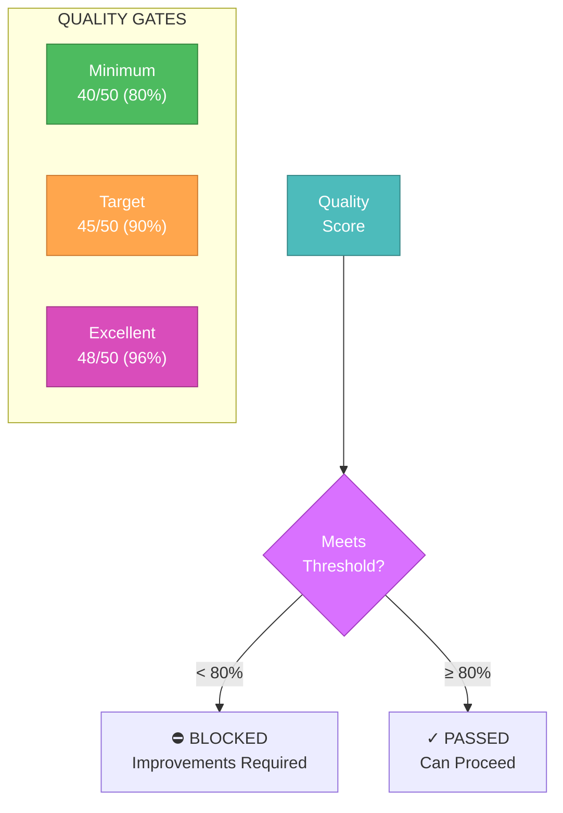
```mermaid
graph TD
    subgraph "QUALITY GATES"
    T1["Minimum<br>40/50 (80%)"]
    T2["Target<br>45/50 (90%)"]
    T3["Excellent<br>48/50 (96%)"]
    end

    Score["Quality<br>Score"] --> Check{"Meets<br>Threshold?"}
    Check -->|"< 80%"| Block["⛔ BLOCKED<br>Improvements Required"]
    Check -->|"≥ 80%"| Pass["✓ PASSED<br>Can Proceed"]

    style T1 fill:#4dbb5f,stroke:#36873f,color:white
    style T2 fill:#ffa64d,stroke:#cc7a30,color:white
    style T3 fill:#d94dbb,stroke:#a3378a,color:white
    style Score fill:#4dbbbb,stroke:#368787,color:white
    style Check fill:#d971ff,stroke:#a33bc2,color:white
```

## 🎯 METRIC EVALUATION PROCESS

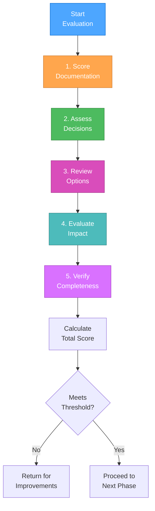
```mermaid
graph TD
    Start["Start<br>Evaluation"] --> Doc["1. Score<br>Documentation"]
    Doc --> Dec["2. Assess<br>Decisions"]
    Dec --> Opt["3. Review<br>Options"]
    Opt --> Imp["4. Evaluate<br>Impact"]
    Imp --> Ver["5. Verify<br>Completeness"]
    Ver --> Total["Calculate<br>Total Score"]
    Total --> Check{"Meets<br>Threshold?"}
    Check -->|No| Return["Return for<br>Improvements"]
    Check -->|Yes| Proceed["Proceed to<br>Next Phase"]

    style Start fill:#4da6ff,stroke:#0066cc,color:white
    style Doc fill:#ffa64d,stroke:#cc7a30,color:white
    style Dec fill:#4dbb5f,stroke:#36873f,color:white
    style Opt fill:#d94dbb,stroke:#a3378a,color:white
    style Imp fill:#4dbbbb,stroke:#368787,color:white
    style Ver fill:#d971ff,stroke:#a33bc2,color:white
```

## 📊 IMPROVEMENT RECOMMENDATIONS

For scores below threshold:

```markdown
## Documentation Quality Improvements
- Add clear problem statements
- Include specific objectives
- List all requirements
- Improve formatting
- Add cross-references

## Decision Coverage Improvements
- Identify missing decisions
- Document all decision points
- Map dependencies
- Add impact analysis
- Consider future implications

## Option Analysis Improvements
- Consider more alternatives
- Detail pros/cons
- Assess technical feasibility
- Estimate resource needs
- Identify risks

## Impact Assessment Improvements
- Document system impact
- Assess performance
- Address security
- Evaluate maintenance
- Analyze costs

## Verification Improvements
- Trace requirements
- Validate constraints
- Define test scenarios
- Incorporate feedback
- Complete verification
```

## ✅ METRICS VERIFICATION CHECKLIST

```markdown
## Pre-Review Verification
- [ ] All sections scored
- [ ] Calculations verified
- [ ] Supporting evidence attached
- [ ] Improvement areas identified
- [ ] Review feedback incorporated

## Final Metrics Verification
- [ ] Minimum score achieved
- [ ] All categories passed
- [ ] Documentation complete
- [ ] Improvements addressed
- [ ] Final approval obtained
```

## 🔄 DOCUMENT MANAGEMENT

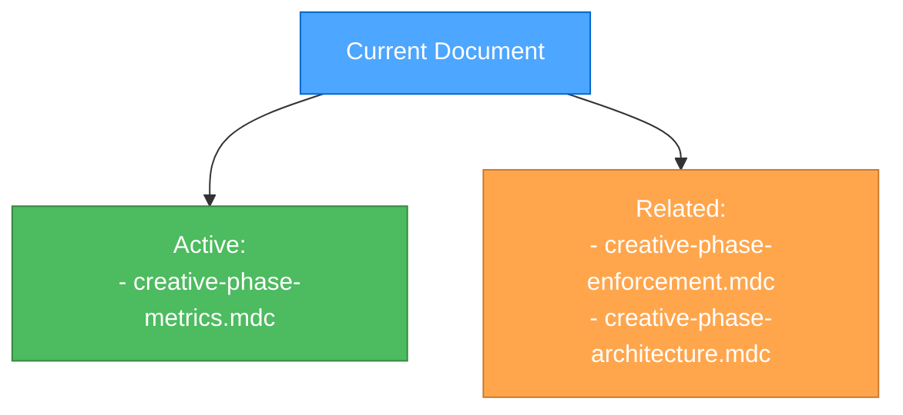
```mermaid
graph TD
    Current["Current Document"] --> Active["Active:<br>- creative-phase-metrics.mdc"]
    Current --> Related["Related:<br>- creative-phase-enforcement.mdc<br>- creative-phase-architecture.mdc"]

    style Current fill:#4da6ff,stroke:#0066cc,color:white
    style Active fill:#4dbb5f,stroke:#36873f,color:white
    style Related fill:#ffa64d,stroke:#cc7a30,color:white
```
```

`.cursor/rules/isolation_rules/Core/date-format-enforcement.mdc`

```mdc
---
description: YYYY-MM-DD Date Format Enforcement Rule
globs: "**/memory-bank/**", "**/tasks/**", "**/reports/**", "**/contexts/**"
alwaysApply: true
---

# YYYY-MM-DD DATE FORMAT ENFORCEMENT

## MANDATORY DATE FORMAT RULE

**CRITICAL REQUIREMENT**: All files containing dates MUST use YYYY-MM-DD format at the beginning of the filename.

### ✅ CORRECT FORMAT EXAMPLES
```
2025-06-20-HIGH-FEATURE-user-authentication.md
2025-06-20-task-context.md
2025-06-20-daily-report.md
2025-W25-weekly-report.md
2025-06-monthly-report.md
2025-06-20-qa-audit-memory-bank.md
2025-06-20-research-user-requirements.md
2025-06-20-analysis-performance-metrics.md
```

### ❌ INCORRECT FORMATS (FORBIDDEN)
```
20-06-2025-task.md          # Wrong order
06-20-2025-task.md          # US format
task-2025-06-20.md          # Date not at beginning
20250620-task.md            # No separators
2025_06_20-task.md          # Wrong separators
```

## ENFORCEMENT RULES

### File Creation Rules
1. **Task Files**: `YYYY-MM-DD-PRIORITY-CATEGORY-task-name.md`
2. **Context Files**: `YYYY-MM-DD-task-context.md`
3. **Report Files**: `YYYY-MM-DD-report-type.md` or `YYYY-W##-weekly-report.md`
4. **QA Files**: `YYYY-MM-DD-qa-type-description.md` (in memory-bank/qa/)
5. **Research Files**: `YYYY-MM-DD-research-topic.md` (in memory-bank/qa/research/)
6. **Analysis Files**: `YYYY-MM-DD-analysis-subject.md` (in memory-bank/qa/analysis/)
7. **Archive Files**: Must be organized in `YYYY-MM/` folders

### Validation Patterns
```regex
# Task Files
^(\d{4}-\d{2}-\d{2})-(CRITICAL|HIGH|MEDIUM|LOW)-(FEATURE|BUGFIX|ENHANCEMENT|RESEARCH|ADMIN)-[a-z0-9-]+\.md$

# Context Files
^(\d{4}-\d{2}-\d{2})-[a-z0-9-]+-context\.md$

# Daily Reports
^(\d{4}-\d{2}-\d{2})-daily-report\.md$

# Weekly Reports
^(\d{4}-W\d{2})-weekly-report\.md$

# Monthly Reports
^(\d{4}-\d{2})-monthly-report\.md$

# QA Files
^(\d{4}-\d{2}-\d{2})-qa-(audit|test|review|analysis)-[a-z0-9-]+\.md$

# Research Files
^(\d{4}-\d{2}-\d{2})-research-[a-z0-9-]+\.md$

# Analysis Files
^(\d{4}-\d{2}-\d{2})-analysis-[a-z0-9-]+\.md$
```

## BENEFITS OF YYYY-MM-DD FORMAT

### 1. **Chronological Sorting**
- Files automatically sort chronologically in any file manager
- No special sorting algorithms needed
- Works across all operating systems

### 2. **Visual Navigation**
- Immediate date recognition
- Easy to find files by date range
- Clear temporal organization

### 3. **Cross-Platform Compatibility**
- ISO 8601 standard compliance
- Works on Windows, macOS, Linux
- Database and API friendly

### 4. **Future-Proof**
- Scales from 1000-9999 years
- No Y2K-style problems
- Internationally recognized standard

### 5. **QA and Research Organization**
- Research files chronologically organized
- QA audits traceable by date
- Analysis reports time-stamped
- Easy correlation between research and implementation

## MIGRATION REQUIREMENTS

### Legacy File Handling
When encountering files with incorrect date formats:

1. **Automatic Conversion**: VAN mode MUST convert during migration
2. **Backup Original**: Keep backup with original naming
3. **Update References**: Update all internal links
4. **Validate Conversion**: Ensure no data loss

### Conversion Examples
```bash
# Before Migration
task-user-auth-20-06-2025.md
daily_report_06_20_2025.md
context-shopping-cart-2025.06.20.md
qa_audit_memory_bank.md
research-user-requirements.md

# After Migration
2025-06-20-HIGH-FEATURE-user-auth.md
2025-06-20-daily-report.md
2025-06-20-shopping-cart-context.md
2025-06-20-qa-audit-memory-bank.md
2025-06-20-research-user-requirements.md
```

## ENFORCEMENT MECHANISMS

### Pre-Creation Validation
```bash
# Before creating any file, validate name format
validate_filename() {
    local filename="$1"
    if [[ ! "$filename" =~ ^[0-9]{4}-[0-9]{2}-[0-9]{2}- ]]; then
        echo "ERROR: Filename must start with YYYY-MM-DD format"
        return 1
    fi
    return 0
}
```

### Post-Creation Verification
```bash
# Scan for non-compliant files
find memory-bank/ -name "*.md" | grep -v "^[0-9]\{4\}-[0-9]\{2\}-[0-9]\{2\}-"
```

### Automated Correction
```bash
# Auto-correct during VAN migration
rename_to_date_format() {
    local old_file="$1"
    local date_part="$2"  # YYYY-MM-DD
    local new_name="${date_part}-$(basename "$old_file")"
    mv "$old_file" "$new_name"
}
```

## INTEGRATION WITH MODES

### VAN Mode
- **MUST** scan for date format violations
- **MUST** convert all non-compliant files
- **MUST** generate conversion report

### PLAN Mode
- **MUST** create all new files with YYYY-MM-DD format
- **MUST** validate format before file creation
- **MUST** reject non-compliant naming

### CREATIVE Mode
- **MUST** follow date format for all design documents
- **MUST** organize deliverables chronologically
- **MUST** maintain date consistency across artifacts

### IMPLEMENT Mode
- **MUST** use date format for all implementation files
- **MUST** organize code changes by date
- **MUST** maintain chronological development history

### REFLECT Mode
- **MUST** generate reports with YYYY-MM-DD format
- **MUST** organize reflection documents chronologically
- **MUST** link to dated task and context files

### ARCHIVE Mode
- **MUST** organize archives in YYYY-MM folders
- **MUST** maintain date format consistency
- **MUST** enable chronological retrieval

## ERROR HANDLING

### Common Date Format Errors
1. **Wrong Order**: DD-MM-YYYY or MM-DD-YYYY
2. **Missing Separators**: YYYYMMDD
3. **Wrong Separators**: YYYY_MM_DD or YYYY.MM.DD
4. **Date Not First**: filename-YYYY-MM-DD.md

### Error Recovery
```bash
# Detect and fix common errors
fix_date_format() {
    local file="$1"

    # Extract date patterns and convert
    if [[ "$file" =~ ([0-9]{2})-([0-9]{2})-([0-9]{4}) ]]; then
        # DD-MM-YYYY or MM-DD-YYYY detected
        local day="${BASH_REMATCH[1]}"
        local month="${BASH_REMATCH[2]}"
        local year="${BASH_REMATCH[3]}"

        # Convert to YYYY-MM-DD
        local new_date="${year}-${month}-${day}"
        # ... conversion logic
    fi
}
```

## COMPLIANCE VERIFICATION

### Daily Checks
```bash
# Verify all files follow YYYY-MM-DD format
check_date_compliance() {
    find memory-bank/ -name "*.md" | while read file; do
        if [[ ! "$(basename "$file")" =~ ^[0-9]{4}-[0-9]{2}-[0-9]{2}- ]]; then
            echo "NON-COMPLIANT: $file"
        fi
    done
}
```

### Weekly Validation
```bash
# Generate compliance report
generate_compliance_report() {
    local total_files=$(find memory-bank/ -name "*.md" | wc -l)
    local compliant_files=$(find memory-bank/ -name "*.md" | grep -c "^[0-9]\{4\}-[0-9]\{2\}-[0-9]\{2\}-")
    local compliance_rate=$((compliant_files * 100 / total_files))

    echo "Date Format Compliance: ${compliance_rate}% (${compliant_files}/${total_files})"
}
```

## CRITICAL SUCCESS FACTORS

1. **Zero Tolerance**: No exceptions to YYYY-MM-DD format
2. **Automatic Enforcement**: Built into all modes and scripts
3. **Migration Safety**: Preserve data during format conversion
4. **User Education**: Clear documentation and examples
5. **Tool Integration**: IDE and script support for format

This rule ensures consistent, sortable, and future-proof date handling across the entire Memory Bank system.
```

`.cursor/rules/isolation_rules/Core/datetime-manager.mdc`

```mdc
---
description: "Централизованная система управления датой и временем. Обеспечивает корректное получение и установку системной даты."
globs: "**/**"
alwaysApply: true
---

# DATETIME MANAGER SYSTEM

> **TL;DR:** Этот модуль является единым источником правды для всех операций с датой и временем. Он гарантирует, что система всегда работает с актуальной, полученной через командную строку датой.

## ⚙️ Основные функции

### 1. Установка и верификация системной даты

Эта функция должна вызываться в САМОМ НАЧАЛЕ любого режима (`VAN`, `UNIVERSAL`, `STEP_BY_STEP` и т.д.).

```bash
# Псевдокод для ИИ-ассистента

function initialize_system_date() {
  # 1. Получаем текущую дату и время из командной строки
  local current_datetime=$(date +"%Y-%m-%d %H:%M:%S")
  local current_date=$(echo "$current_datetime" | cut -d' ' -f1)

  # 2. Указываем путь к файлу
  local date_file="memory-bank/system/current-date.txt"

  # 3. Создаем директорию, если она не существует
  mkdir -p "$(dirname "$date_file")"

  # 4. Записываем актуальную дату в файл
  echo "$current_date" > "$date_file"

  # 5. Выводим подтверждение
  echo "✅ System date initialized to: $current_date"
}
```

### 2. Функции для получения даты и времени

Эти функции должны использоваться во всех остальных правилах вместо прямого вызова `date`.

```bash
# Получить только дату (YYYY-MM-DD)
function get_current_date() {
  cat memory-bank/system/current-date.txt
}

# Получить полное время (YYYY-MM-DD HH:MM:SS)
function get_current_datetime() {
  date +"%Y-%m-%d %H:%M:%S"
}
```

## ✅ Интеграция

Все файлы инструкций (`custom_modes/*.md`) должны начинаться с вызова `initialize_system_date()`.
```

`.cursor/rules/isolation_rules/Core/deep-validation-system.mdc`

```mdc
---
description: "Система углубленной валидации выводов с анализом предыдущих решений при замене"
globs: "**/**"
alwaysApply: true
---

# DEEP VALIDATION SYSTEM

> **TL;DR:** Система углубленной валидации обеспечивает анализ предыдущих выводов при замене и требует обоснования удаления положений для предотвращения потери важной информации.

## 🔍 ПРИНЦИПЫ УГЛУБЛЕННОЙ ВАЛИДАЦИИ

### Основные требования
**Анализ перед заменой**
- Всегда анализируй предыдущие выводы перед их заменой
- Выявляй ценную информацию в существующих решениях
- Документируй причины изменений и улучшений
- Сохраняй важные аспекты предыдущих решений

**Обоснование удалений**
- Каждое удаление должно иметь четкое обоснование
- Объясняй почему предыдущее решение неоптимально
- Указывай конкретные недостатки или ограничения
- Предоставляй альтернативы для удаляемых элементов

## 📋 ПРОЦЕСС ВАЛИДАЦИИ

### Шаг 1: Анализ существующего решения
```bash
analyze_existing_solution() {
  local current_solution="$1"

  echo "🔍 АНАЛИЗ СУЩЕСТВУЮЩЕГО РЕШЕНИЯ:"
  echo "================================"

  # Выявление ключевых компонентов
  echo "📋 Ключевые компоненты:"
  identify_key_components "$current_solution"

  # Анализ преимуществ
  echo "✅ Преимущества текущего решения:"
  identify_advantages "$current_solution"

  # Выявление недостатков
  echo "❌ Недостатки и ограничения:"
  identify_limitations "$current_solution"

  # Оценка ценности
  echo "💎 Ценная информация для сохранения:"
  identify_valuable_aspects "$current_solution"
}
```

### Шаг 2: Обоснование изменений
```bash
justify_changes() {
  local old_solution="$1"
  local new_solution="$2"
  local change_reason="$3"

  echo "📝 ОБОСНОВАНИЕ ИЗМЕНЕНИЙ:"
  echo "========================"

  # Причины изменений
  echo "🎯 Причина изменений:"
  echo "$change_reason"

  # Сравнительный анализ
  echo "📊 Сравнительный анализ:"
  compare_solutions "$old_solution" "$new_solution"

  # Что сохраняется
  echo "💾 Сохраняемые элементы:"
  identify_preserved_elements "$old_solution" "$new_solution"

  # Что удаляется и почему
  echo "🗑️ Удаляемые элементы и обоснование:"
  justify_removals "$old_solution" "$new_solution"
}
```

### Шаг 3: Валидация нового решения
```bash
validate_new_solution() {
  local new_solution="$1"
  local requirements="$2"

  echo "✅ ВАЛИДАЦИЯ НОВОГО РЕШЕНИЯ:"
  echo "============================"

  # Соответствие требованиям
  echo "📋 Соответствие требованиям:"
  check_requirements_compliance "$new_solution" "$requirements"

  # Улучшения относительно предыдущего
  echo "📈 Улучшения:"
  identify_improvements "$new_solution"

  # Потенциальные риски
  echo "⚠️ Потенциальные риски:"
  identify_potential_risks "$new_solution"

  # Рекомендации по реализации
  echo "💡 Рекомендации:"
  provide_implementation_recommendations "$new_solution"
}
```

## 🔄 ШАБЛОН ВАЛИДАЦИОННОГО ОТЧЕТА

### Структура отчета
```markdown
# ВАЛИДАЦИОННЫЙ ОТЧЕТ

## 📊 Анализ предыдущего решения
### Ключевые компоненты:
- [Список основных элементов]

### Преимущества:
- [Что работало хорошо]

### Недостатки:
- [Выявленные проблемы]

## 🔄 Обоснование изменений
### Причина замены:
[Детальное объяснение необходимости изменений]

### Сохраняемые элементы:
- [Что переносится в новое решение]

### Удаляемые элементы:
- [Что удаляется и почему]

## ✅ Новое решение
### Улучшения:
- [Конкретные улучшения]

### Соответствие требованиям:
- [Проверка всех требований]

### Потенциальные риски:
- [Возможные проблемы и их митигация]

## 💡 Рекомендации
[Советы по реализации и использованию]
```

## 🎯 КРИТЕРИИ КАЧЕСТВА ВАЛИДАЦИИ

### Обязательные элементы
- **Анализ предыдущего решения**: Детальный разбор существующего подхода
- **Четкое обоснование**: Понятные причины для каждого изменения
- **Сохранение ценности**: Перенос полезных аспектов в новое решение
- **Документирование рисков**: Выявление потенциальных проблем

### Качественные показатели
- **Полнота анализа**: Охват всех важных аспектов
- **Логичность обоснований**: Понятная связь между проблемами и решениями
- **Практичность рекомендаций**: Применимость советов на практике
- **Прозрачность процесса**: Возможность проследить логику принятия решений

## 🚨 ПРЕДУПРЕЖДЕНИЯ И ОГРАНИЧЕНИЯ

### Типичные ошибки валидации
- **Поверхностный анализ**: Недостаточно глубокое изучение предыдущего решения
- **Необоснованные удаления**: Удаление элементов без четкого объяснения
- **Игнорирование контекста**: Не учет особенностей конкретной ситуации
- **Отсутствие альтернатив**: Удаление без предложения замены

### Меры предосторожности
- Всегда создавай backup перед кардинальными изменениями
- Консультируйся с заинтересованными сторонами при значительных изменениях
- Документируй все принятые решения для будущего анализа
- Предусматривай возможность отката к предыдущему решению

## 📈 МЕТРИКИ ЭФФЕКТИВНОСТИ

### Количественные показатели
- Процент сохраненных ценных элементов: >80%
- Количество обоснованных изменений: 100%
- Время на валидацию: <20% от времени разработки
- Количество выявленных рисков: >3 на решение

### Качественные показатели
- Удовлетворенность заинтересованных сторон: >4.5/5
- Понятность обоснований: >4.0/5
- Применимость рекомендаций: >4.0/5
- Полнота анализа: >4.5/5

Эта система валидации обеспечивает высокое качество принимаемых решений и предотвращает потерю важной информации при изменениях в Memory Bank системе.
```

`.cursor/rules/isolation_rules/Core/development-rules-integration.mdc`

```mdc
---
description: Development Rules Integration for Memory Bank 2.0.0
globs: "**/development/**", "**/memory-bank/**"
alwaysApply: false
---
# DEVELOPMENT RULES INTEGRATION

This file integrates comprehensive development rules based on real project experience (B+ Tree project) into the Memory Bank system.

## CORE DEVELOPMENT PRINCIPLES

### Rule #1: Фазовый подход к разработке
**Implementation**: Integrated into PLAN mode and phase-tracking.md
- Each development task must be broken into distinct phases
- Each phase has clear objectives and completion criteria
- No transition to next phase until current phase is complete
- Document all decisions and approaches with ✅/❌ markers

**Memory Bank Integration**:
- VAN mode determines number and type of phases
- PLAN mode details each phase with dependencies
- IMPLEMENT mode executes current phase with progress tracking
- REFLECT mode analyzes phase results and prepares for next phase

### Rule #2: Документирование прогресса с ✅/❌ маркерами
**Implementation**: Integrated into progress.md and all tracking files
- All ideas and approaches must be documented
- Successful ideas marked with ✅ (keep for reference)
- Failed approaches marked with ❌ (never delete - learn from failures)
- Regular progress updates with clear status indicators

**Memory Bank Integration**:
- Extended progress.md with Implementation Ideas Tracking
- All modes update progress with ✅/❌ markers
- Failed approaches preserved for learning and avoiding repetition

### Rule #3: Приоритизация проблем (CRITICAL → HIGH → MEDIUM → LOW)
**Implementation**: Integrated into task prioritization across all modes
- **CRITICAL**: Blocks core functionality, must be fixed immediately
- **HIGH**: Affects performance or user experience significantly
- **MEDIUM**: Improvements that enhance usability
- **LOW**: Nice-to-have features or minor optimizations

**Memory Bank Integration**:
- VAN mode assigns initial priority based on complexity
- PLAN mode refines priorities based on dependencies
- All task tracking uses consistent priority levels

## IMPLEMENTATION & QUALITY RULES

### Rule #4: Проверка зависимостей тестов
**Implementation**: Integrated into IMPLEMENT and QA modes
- Before running tests, verify all dependencies are available
- Check test environment setup and configuration
- Ensure test data and fixtures are properly initialized

### Rule #5: Избегание заглушек в продакшене
**Implementation**: Code review guidelines in IMPLEMENT mode
- No mock objects or stubs in production code
- All external dependencies must have real implementations
- Test doubles only in test environment

### Rule #6: Robust поиск и навигация
**Implementation**: Search and navigation patterns
- Implement comprehensive search functionality
- Provide multiple navigation paths to same content
- Handle edge cases in search queries gracefully

### Rule #7: Координация между системами
**Implementation**: Integration planning in PLAN mode
- Document all system interfaces and dependencies
- Plan integration points and data flow
- Test system boundaries and error handling

## TESTING & VALIDATION RULES (Bun-based)

### Rule #8: Высокогранулированные тесты
**Implementation**: Test structure guidelines
```bash
# Test command pattern for Memory Bank
bun test --reporter=verbose --coverage
```
- Each function/method should have dedicated tests
- Test individual behaviors, not just happy paths
- Separate tests for different input scenarios

### Rule #9: Изоляция контекста между тестами
**Implementation**: Test isolation patterns
```bash
# Clean test environment between runs
bun test --clean-cache
```
- Each test must be independent and isolated
- No shared state between test cases
- Clean setup and teardown for each test

### Rule #10: Обязательное тестирование каждой фичи
**Implementation**: Feature testing requirements
- Every new feature must have corresponding tests
- Tests written before or during implementation
- No feature considered complete without tests

### Rule #11: Проверка покрытия функционала на каждом этапе
**Implementation**: Coverage tracking
```bash
# Coverage reporting
bun test --coverage --coverage-reporter=text-summary
```
- Monitor test coverage throughout development
- Aim for high coverage of critical paths
- Document coverage gaps and plans to address them

### Rule #12: Тестирование edge cases
**Implementation**: Edge case identification
- Identify boundary conditions and edge cases
- Test error conditions and failure scenarios
- Validate input validation and error handling

### Rule #13: Тестирование производительности
**Implementation**: Performance testing integration
```bash
# Performance testing with Bun
bun test --timeout=30000 performance/*.test.ts
```
- Include performance tests for critical operations
- Set performance benchmarks and monitor regression
- Test with realistic data volumes

### Rule #14: Высокоточное измерение времени
**Implementation**: Timing measurement patterns
```typescript
// High-precision timing for performance tests
const start = performance.now();
// ... operation to measure
const duration = performance.now() - start;
```

### Rule #15: Устойчивая генерация ID
**Implementation**: ID generation patterns
- Use cryptographically secure random ID generation
- Ensure ID uniqueness across system boundaries
- Test ID collision scenarios

### Rule #16: Тестирование временных коллизий
**Implementation**: Concurrency testing
- Test concurrent operations and race conditions
- Validate thread safety and atomic operations
- Test timeout and retry mechanisms

## INTEGRATION & ARCHITECTURE RULES

### Rule #17: Изолированное проектирование фаз
**Implementation**: CREATIVE mode integration
- Design each phase independently before integration
- Define clear interfaces between phases
- Minimize coupling between phase implementations

### Rule #18: Планирование интеграционных шагов
**Implementation**: Integration planning in PLAN mode
- Document integration sequence and dependencies
- Plan rollback strategies for failed integrations
- Define integration testing approach

### Rule #19: Тестирование интеграционных точек
**Implementation**: Integration testing requirements
- Test all system boundaries and interfaces
- Validate data transformation and mapping
- Test error propagation across system boundaries

### Rule #20: Документирование интеграционных зависимостей
**Implementation**: Integration documentation
- Document all external dependencies and versions
- Maintain integration maps and data flow diagrams
- Track integration points and their requirements

## DEBUGGING & ANALYSIS RULES

### Rule #21: Трассировка перед исправлением
**Implementation**: Debug workflow in IMPLEMENT mode
- Always trace the issue before attempting fixes
- Document the trace path and findings
- Understand root cause before implementing solution

### Rule #22: Детальное логирование
**Implementation**: Logging standards
- Implement comprehensive logging at appropriate levels
- Include context and correlation IDs in logs
- Structure logs for easy parsing and analysis

### Rule #23: Валидация инвариантов
**Implementation**: Invariant checking
- Define and document system invariants
- Implement runtime invariant checking where appropriate
- Test invariant violations and recovery

## DOCUMENTATION & KNOWLEDGE RULES

### Rule #24: Документирование решений
**Implementation**: Decision documentation in REFLECT mode
- Document architectural and design decisions
- Include rationale and alternatives considered
- Maintain decision log for future reference

### Rule #25: Ведение статистики
**Implementation**: Statistics tracking in progress.md
- Track development metrics and performance indicators
- Monitor progress against estimates and goals
- Analyze patterns and trends for improvement

### Rule #26: Создание примеров использования
**Implementation**: Example creation requirements
- Create practical examples for all major features
- Include both simple and complex usage scenarios
- Maintain examples as living documentation

## REFACTORING & MAINTENANCE RULES

### Rule #27: Постепенный рефакторинг
**Implementation**: Refactoring approach in IMPLEMENT mode
- Refactor incrementally, not in large batches
- Maintain functionality while improving structure
- Test after each refactoring step

### Rule #28: Сохранение обратной совместимости
**Implementation**: Compatibility guidelines
- Maintain backward compatibility when possible
- Document breaking changes and migration paths
- Provide deprecation warnings before removal

### Rule #29: Метрики качества кода
**Implementation**: Quality metrics tracking
- Monitor code complexity and maintainability metrics
- Track technical debt and improvement opportunities
- Regular code quality reviews and improvements

## MEMORY BANK MODE INTEGRATION

### VAN Mode Enhancements
- Platform detection and environment setup
- Development rules compliance checking
- Initial priority and complexity assessment

### PLAN Mode Enhancements
- Phase-based planning with Rule #1 integration
- Integration point identification (Rules #17-20)
- Priority-based task organization (Rule #3)

### CREATIVE Mode Enhancements
- Isolated design approach (Rule #17)
- Architecture decision documentation (Rule #24)
- Design alternative evaluation

### IMPLEMENT Mode Enhancements
- Test-driven development workflow (Rules #8-16)
- Progress tracking with ✅/❌ markers (Rule #2)
- Debug-first approach (Rules #21-23)
- Incremental refactoring (Rule #27)

### QA Mode Enhancements
- Comprehensive testing framework (Rules #8-16)
- Performance validation (Rule #13)
- Integration testing (Rule #19)
- Quality metrics tracking (Rule #29)

### REFLECT Mode Enhancements
- Decision documentation (Rule #24)
- Statistics and metrics analysis (Rule #25)
- Lessons learned capture
- Phase completion validation

### ARCHIVE Mode Enhancements
- Example creation and maintenance (Rule #26)
- Statistics preservation (Rule #25)
- Decision history archival (Rule #24)
- Knowledge base building

## USAGE PATTERNS

### For Level 1 Tasks (Quick Bug Fix)
1. VAN: Quick complexity assessment + priority assignment
2. IMPLEMENT: Direct implementation with integrated testing
3. QA: Minimal validation focused on regression prevention

### For Level 2-4 Tasks (Complex Development)
1. VAN: Comprehensive analysis + phase planning
2. PLAN: Detailed phase breakdown + integration planning
3. CREATIVE: Isolated design for complex components
4. IMPLEMENT: Phase-by-phase execution with full testing
5. QA: Comprehensive validation + performance testing
6. REFLECT: Thorough analysis + decision documentation
7. ARCHIVE: Complete knowledge preservation

## INTEGRATION STATUS
- [x] Core principles integrated into Memory Bank structure
- [x] Testing rules adapted for Bun environment
- [x] Progress tracking enhanced with rule compliance
- [x] Phase tracking system created
- [ ] .cursor/rules files updated with specific rule implementations
- [ ] Mode-specific rule integration completed
- [ ] Testing framework integration completed
- [ ] Documentation templates created

```

`.cursor/rules/isolation_rules/Core/file-verification.mdc`

```mdc
---
description: Optimized file verification
globs: file-verification.mdc
alwaysApply: false
---
# OPTIMIZED FILE VERIFICATION SYSTEM

> **TL;DR:** This system efficiently verifies and creates required Memory Bank file structures using batch operations and platform-optimized commands.

## 🔍 OPTIMIZED FILE VERIFICATION WORKFLOW

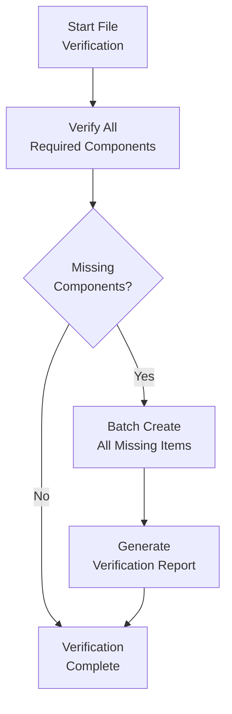
```mermaid
graph TD
    Start["Start File<br>Verification"] --> VerifyAll["Verify All<br>Required Components"]
    VerifyAll --> MissingCheck{"Missing<br>Components?"}
    MissingCheck -->|"Yes"| BatchCreate["Batch Create<br>All Missing Items"]
    MissingCheck -->|"No"| Complete["Verification<br>Complete"]
    BatchCreate --> Report["Generate<br>Verification Report"]
    Report --> Complete
```

## 📋 OPTIMIZED DIRECTORY CREATION

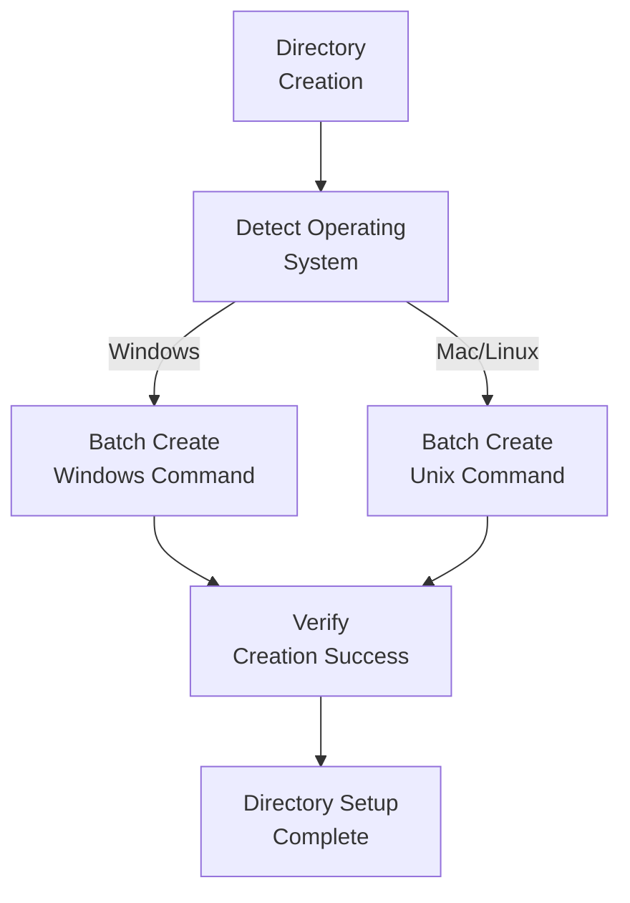
```mermaid
graph TD
    Start["Directory<br>Creation"] --> DetectOS["Detect Operating<br>System"]
    DetectOS -->|"Windows"| WinCmd["Batch Create<br>Windows Command"]
    DetectOS -->|"Mac/Linux"| UnixCmd["Batch Create<br>Unix Command"]
    WinCmd & UnixCmd --> Verify["Verify<br>Creation Success"]
    Verify --> Complete["Directory Setup<br>Complete"]
```

### Platform-Specific Commands

#### Windows (PowerShell)
```powershell
# Create all directories in one command
mkdir memory-bank, docs, docs\archive -ErrorAction SilentlyContinue

# Create all required files
$files = @(".cursorrules", "tasks.md", 
           "memory-bank\projectbrief.md", 
           "memory-bank\productContext.md",
           "memory-bank\systemPatterns.md",
           "memory-bank\techContext.md",
           "memory-bank\activeContext.md",
           "memory-bank\progress.md")

foreach ($file in $files) {
    if (-not (Test-Path $file)) {
        New-Item -Path $file -ItemType File -Force
    }
}
```

#### Mac/Linux (Bash)
```bash
# Create all directories in one command
mkdir -p memory-bank docs/archive

# Create all required files
touch .cursorrules tasks.md \
      memory-bank/projectbrief.md \
      memory-bank/productContext.md \
      memory-bank/systemPatterns.md \
      memory-bank/techContext.md \
      memory-bank/activeContext.md \
      memory-bank/progress.md
```

## 📝 STREAMLINED VERIFICATION PROCESS

Instead of checking each component separately, perform batch verification:

```powershell
# Windows - PowerShell
$requiredDirs = @("memory-bank", "docs", "docs\archive")
$requiredFiles = @(".cursorrules", "tasks.md")
$mbFiles = @("projectbrief.md", "productContext.md", "systemPatterns.md", 
             "techContext.md", "activeContext.md", "progress.md")

$missingDirs = $requiredDirs | Where-Object { -not (Test-Path $_) -or -not (Test-Path $_ -PathType Container) }
$missingFiles = $requiredFiles | Where-Object { -not (Test-Path $_) -or (Test-Path $_ -PathType Container) }
$missingMBFiles = $mbFiles | ForEach-Object { "memory-bank\$_" } | 
                  Where-Object { -not (Test-Path $_) -or (Test-Path $_ -PathType Container) }

if ($missingDirs.Count -eq 0 -and $missingFiles.Count -eq 0 -and $missingMBFiles.Count -eq 0) {
    Write-Output "✓ All required components verified"
} else {
    # Create all missing items at once
    if ($missingDirs.Count -gt 0) {
        $missingDirs | ForEach-Object { mkdir $_ -Force }
    }
    if ($missingFiles.Count -gt 0 -or $missingMBFiles.Count -gt 0) {
        $allMissingFiles = $missingFiles + $missingMBFiles
        $allMissingFiles | ForEach-Object { New-Item -Path $_ -ItemType File -Force }
    }
}
```

## 📝 TEMPLATE INITIALIZATION

Optimize template creation with a single script:

```powershell
# Windows - PowerShell
$templates = @{
    "tasks.md" = @"
# Memory Bank: Tasks

## Current Task
[Task not yet defined]

## Status
- [ ] Task definition
- [ ] Implementation plan
- [ ] Execution
- [ ] Documentation

## Requirements
[No requirements defined yet]
"@

    "memory-bank\activeContext.md" = @"
# Memory Bank: Active Context

## Current Focus
[No active focus defined]

## Status
[No status defined]

## Latest Changes
[No changes recorded]
"@

    # Add other templates here
}

foreach ($file in $templates.Keys) {
    if (Test-Path $file) {
        Set-Content -Path $file -Value $templates[$file]
    }
}
```

## 🔍 PERFORMANCE OPTIMIZATION BEST PRACTICES

1. **Batch Operations**: Always use batch operations instead of individual commands
   ```
   # GOOD: Create all directories at once
   mkdir memory-bank docs docs\archive
   
   # BAD: Create directories one at a time
   mkdir memory-bank
   mkdir docs
   mkdir docs\archive
   ```

2. **Pre-Check Optimization**: Check all requirements first, then create only what's missing
   ```
   # First check what's missing
   $missingItems = ...
   
   # Then create only what's missing
   if ($missingItems) { ... }
   ```

3. **Error Handling**: Include error handling in all commands
   ```
   mkdir memory-bank, docs, docs\archive -ErrorAction SilentlyContinue
   ```

4. **Platform Adaptation**: Auto-detect platform and use appropriate commands
   ```
   if ($IsWindows) {
       # Windows commands
   } else {
       # Unix commands
   }
   ```

5. **One-Pass Verification**: Verify directory structure in a single pass
   ```
   $requiredPaths = @("memory-bank", "docs", "docs\archive", ".cursorrules", "tasks.md")
   $missingPaths = $requiredPaths | Where-Object { -not (Test-Path $_) }
   ```

## 📝 VERIFICATION REPORT FORMAT

```
✅ VERIFICATION COMPLETE
- Created directories: [list]
- Created files: [list]
- All components verified

Memory Bank system ready for use.
``` 
```

`.cursor/rules/isolation_rules/Core/git-setup-validation.mdc`

```mdc
---
description: "Система проверки и настройки Git-ветки в начале VAN-цикла."
globs: "**/van-mode-map.mdc"
alwaysApply: true
---
# GIT SETUP VALIDATION & BRANCH MANAGEMENT

> **TL;DR:** Эта система гарантирует, что любая работа начинается в изолированной feature-ветке. Она проверяет текущую ветку, чистоту рабочего каталога и автоматически предлагает создать и переключиться на новую ветку, названную в соответствии с текущей задачей. **Этот шаг является обязательным для продолжения работы.**

## 🌳 Процесс проверки и создания ветки

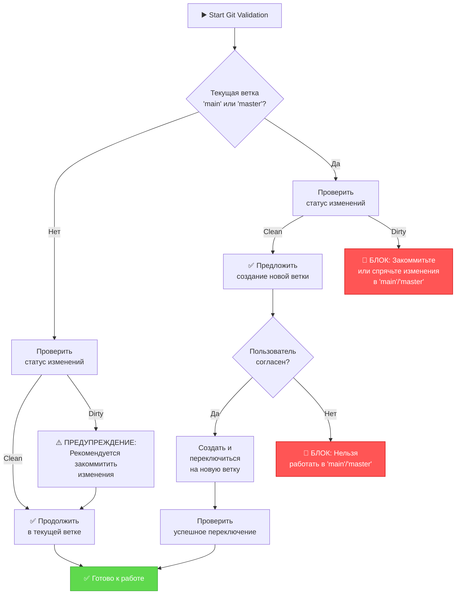
```mermaid
graph TD
    Start["▶️ Start Git Validation"] --> CheckBranch{"Текущая ветка<br>'main' или 'master'?"}

    CheckBranch -->|"Нет"| CheckStatusNonMain["Проверить<br>статус изменений"]
    CheckBranch -->|"Да"| CheckStatusMain["Проверить<br>статус изменений"]

    CheckStatusMain -->|Clean| SuggestBranch["✅ Предложить<br>создание новой ветки"]
    CheckStatusMain -->|Dirty| BlockDirtyMain["🔴 БЛОК: Закоммитьте<br>или спрячьте изменения<br>в 'main'/'master'"]

    CheckStatusNonMain -->|Clean| ContinueOnBranch["✅ Продолжить<br>в текущей ветке"]
    CheckStatusNonMain -->|Dirty| WarnDirtyBranch["⚠️ ПРЕДУПРЕЖДЕНИЕ:<br>Рекомендуется закоммитить<br>изменения"]

    SuggestBranch --> UserConfirm{"Пользователь<br>согласен?"}
    UserConfirm -->|"Да"| CreateAndSwitch["Создать и<br>переключиться<br>на новую ветку"]
    UserConfirm -->|"Нет"| BlockNoBranch["🔴 БЛОК: Нельзя<br>работать в 'main'/'master'"]

    WarnDirtyBranch --> ContinueOnBranch
    CreateAndSwitch --> FinalVerification["Проверить<br>успешное переключение"]
    FinalVerification --> Proceed["✅ Готово к работе"]
    ContinueOnBranch --> Proceed

    style BlockDirtyMain fill:#ff5555,stroke:#cc0000,color:white
    style BlockNoBranch fill:#ff5555,stroke:#cc0000,color:white
    style Proceed fill:#5fd94d,stroke:#3da336,color:white
```

## 🛠️ Реализация и команды

### 1. Проверка текущего состояния

```bash
# 1. Проверить чистоту рабочего каталога
git_status=$(git status --porcelain)
if [[ -n "$git_status" ]]; then
  echo "⚠️ Внимание: У вас есть незакоммиченные изменения."
  echo "$git_status"
  # На более поздних этапах здесь можно добавить запрос на git stash
fi

# 2. Проверить текущую ветку
current_branch=$(git rev-parse --abbrev-ref HEAD)
echo "ℹ️ Текущая ветка: $current_branch"

if [[ "$current_branch" == "main" || "$current_branch" == "master" ]]; then
  if [[ -n "$git_status" ]]; then
    echo "🔴 КРИТИЧЕСКАЯ ОШИБКА: Обнаружены незакоммиченные изменения в ветке '$current_branch'. Пожалуйста, сделайте коммит или спрячьте (stash) изменения перед тем, как продолжить."
    # Здесь процесс должен быть заблокирован до устранения проблемы
    exit 1 # Пример блокировки
  fi
  # Если ветка 'main'/'master' и она чистая, переходим к созданию новой ветки
  propose_new_branch
else
  echo "✅ Работа будет продолжена в существующей ветке: '$current_branch'."
  # Можно продолжить работу
fi
```

### 2. Предложение и создание новой ветки

```bash
# Эта функция вызывается, если мы находимся на чистой 'main' или 'master'
propose_new_branch() {
  # Извлечь ID задачи из tasks.md или activeContext.md
  # Пример:
  task_id=$(grep -o 'TASK-[A-Z-]*-[0-9-]*' memory-bank/tasks.md | head -1 || echo "new-feature")
  task_desc=$(echo "$task_id" | tr '[:upper:]' '[:lower:]' | sed 's/task-//')

  proposed_branch="feature/$(date +%Y%m%d)-${task_desc}"

  echo "💡 ПРЕДЛОЖЕНИЕ: Рекомендуется создать новую ветку для текущей задачи."
  echo "   Имя ветки: $proposed_branch"

  read -p "Создать и переключиться на эту ветку? (Y/n): " -n 1 -r
  echo
  if [[ ! $REPLY =~ ^[Nn]$ ]]; then
    git checkout -b "$proposed_branch"
    # Опционально: сразу отправить ветку на удаленный сервер
    # git push -u origin "$proposed_branch"
    echo "✅ Успешно переключились на новую ветку: $proposed_branch"
  else
    echo "🔴 КРИТИЧЕСКАЯ ОШИБКА: Работа в ветках 'main' или 'master' не рекомендуется. Пожалуйста, создайте новую ветку для продолжения."
    exit 1 # Блокировка процесса
  fi
}
```

### ✅ Контрольная точка верификации Git

```
✓ GIT SETUP CHECKPOINT
- Рабочий каталог чист? [ДА/НЕТ/ПРЕДУПРЕЖДЕНИЕ]
- Работа ведется в feature-ветке (не в main/master)? [ДА/НЕТ]
- Новая ветка успешно создана (если требовалось)? [ДА/НЕТ/Н/П]

→ Если все ДА: Настройка Git завершена.
→ Если НЕТ: Устраните проблемы перед продолжением.
```

```

`.cursor/rules/isolation_rules/Core/hierarchical-rule-loading.mdc`

```mdc
---
description: Hierarchical rule loading system for optimized token usage
globs: "**/rule-loading*/**", "**/optimization*/**"
alwaysApply: false
---

# HIERARCHICAL RULE LOADING SYSTEM

> **TL;DR:** This rule implements an optimized loading system that only loads necessary rules based on context, complexity level, and current phase to maximize token efficiency.

## 🧠 HIERARCHICAL RULE STRUCTURE

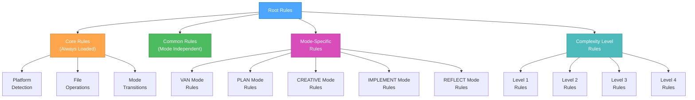
```mermaid
graph TD
    Root["Root Rules"] --> Core["Core Rules<br>(Always Loaded)"]
    Root --> Common["Common Rules<br>(Mode Independent)"]
    Root --> Mode["Mode-Specific<br>Rules"]
    Root --> Level["Complexity Level<br>Rules"]

    Core --> Platform["Platform<br>Detection"]
    Core --> File["File<br>Operations"]
    Core --> Transition["Mode<br>Transitions"]

    Mode --> VAN["VAN Mode<br>Rules"]
    Mode --> PLAN["PLAN Mode<br>Rules"]
    Mode --> CREATIVE["CREATIVE Mode<br>Rules"]
    Mode --> IMPLEMENT["IMPLEMENT Mode<br>Rules"]
    Mode --> REFLECT["REFLECT Mode<br>Rules"]

    Level --> Level1["Level 1<br>Rules"]
    Level --> Level2["Level 2<br>Rules"]
    Level --> Level3["Level 3<br>Rules"]
    Level --> Level4["Level 4<br>Rules"]

    style Root fill:#4da6ff,stroke:#0066cc,color:white
    style Core fill:#ffa64d,stroke:#cc7a30,color:white
    style Common fill:#4dbb5f,stroke:#36873f,color:white
    style Mode fill:#d94dbb,stroke:#a3378a,color:white
    style Level fill:#4dbbbb,stroke:#368787,color:white
```

## 📊 RULE LOADING PROTOCOL

```mermaid
sequenceDiagram
    participant User
    participant LoadManager
    participant RuleCache
    participant FileSystem

    User->>LoadManager: Request mode activation
    LoadManager->>RuleCache: Check cached core rules
    RuleCache-->>LoadManager: Return cached rules if available

    LoadManager->>FileSystem: Load essential mode rules
    FileSystem-->>LoadManager: Return essential rules

    LoadManager->>LoadManager: Register lazy loaders for specialized rules
    LoadManager->>User: Return initialized mode

    User->>LoadManager: Request specialized functionality
    LoadManager->>RuleCache: Check specialized rule cache
    RuleCache-->>LoadManager: Return cached rule if available

    alt Rule not in cache
        LoadManager->>FileSystem: Load specialized rule
        FileSystem-->>LoadManager: Return specialized rule
        LoadManager->>RuleCache: Cache specialized rule
    end

    LoadManager->>User: Execute specialized functionality
```

## 🔄 RULE LOADING IMPLEMENTATION

```javascript
// Pseudocode for hierarchical rule loading
class RuleLoadManager {
  constructor() {
    this.cache = {
      core: {},
      common: {},
      mode: {},
      level: {}
    };
    this.lazyLoaders = {};
  }

  // Initialize a mode with only essential rules
  initializeMode(modeName, complexityLevel) {
    // Always load core rules
    this.loadCoreRules();

    // Load common rules
    this.loadCommonRules();

    // Load essential mode-specific rules
    this.loadEssentialModeRules(modeName);

    // Load complexity level rules
    this.loadComplexityRules(complexityLevel);

    // Register lazy loaders for specialized functionality
    this.registerLazyLoaders(modeName, complexityLevel);

    return {
      modeName,
      complexityLevel,
      status: "initialized"
    };
  }

  // Load only when specialized functionality is needed
  loadSpecializedRule(ruleType) {
    if (this.lazyLoaders[ruleType]) {
      if (!this.cache.specialized[ruleType]) {
        const rule = this.lazyLoaders[ruleType]();
        this.cache.specialized[ruleType] = rule;
      }
      return this.cache.specialized[ruleType];
    }
    return null;
  }

  // Register specialized rule loaders based on mode and complexity
  registerLazyLoaders(modeName, complexityLevel) {
    // Clear existing lazy loaders
    this.lazyLoaders = {};

    // Register mode-specific lazy loaders
    if (modeName === "CREATIVE") {
      this.lazyLoaders["architecture"] = () => this.loadRule("creative-phase-architecture.mdc");
      this.lazyLoaders["algorithm"] = () => this.loadRule("creative-phase-algorithm.mdc");
      this.lazyLoaders["uiux"] = () => this.loadRule("creative-phase-uiux.mdc");
    } else if (modeName === "IMPLEMENT") {
      this.lazyLoaders["testing"] = () => this.loadRule("implementation-testing.mdc");
      this.lazyLoaders["deployment"] = () => this.loadRule("implementation-deployment.mdc");
    }

    // Register complexity-specific lazy loaders
    if (complexityLevel >= 3) {
      this.lazyLoaders["comprehensive-planning"] = () => this.loadRule("planning-comprehensive.mdc");
      this.lazyLoaders["advanced-verification"] = () => this.loadRule("verification-advanced.mdc");
    }
  }
}
```

## 📋 RULE DEPENDENCY MAP

```mermaid
graph TD
    Main["main-optimized.mdc"] --> Core1["platform-awareness.mdc"]
    Main --> Core2["file-verification.mdc"]
    Main --> Core3["command-execution.mdc"]

    subgraph "VAN Mode"
        VanMap["van-mode-map.mdc"] --> Van1["van-complexity-determination.mdc"]
        VanMap --> Van2["van-file-verification.mdc"]
        VanMap --> Van3["van-platform-detection.mdc"]
    end

    subgraph "PLAN Mode"
        PlanMap["plan-mode-map.mdc"] --> Plan1["task-tracking-basic.mdc"]
        PlanMap --> Plan2["planning-comprehensive.mdc"]
    end

    subgraph "CREATIVE Mode"
        CreativeMap["creative-mode-map.mdc"] --> Creative1["creative-phase-enforcement.mdc"]
        CreativeMap --> Creative2["creative-phase-metrics.mdc"]
        Creative1 & Creative2 -.-> CreativeSpecialized["Specialized Creative Rules"]
        CreativeSpecialized --> CArch["creative-phase-architecture.mdc"]
        CreativeSpecialized --> CAlgo["creative-phase-algorithm.mdc"]
        CreativeSpecialized --> CUIUX["creative-phase-uiux.mdc"]
    end

    subgraph "IMPLEMENT Mode"
        ImplementMap["implement-mode-map.mdc"] --> Impl1["implementation-guide.mdc"]
        ImplementMap --> Impl2["testing-strategy.mdc"]
    end
```

## 🔍 MODE-SPECIFIC RULE LOADING

### VAN Mode Essential Rules
```markdown
- main-optimized.mdc (Core)
- platform-awareness.mdc (Core)
- file-verification.mdc (Core)
- van-mode-map.mdc (Mode)
```

### PLAN Mode Essential Rules
```markdown
- main-optimized.mdc (Core)
- plan-mode-map.mdc (Mode)
- task-tracking-[complexity].mdc (Level)
```

### CREATIVE Mode Essential Rules
```markdown
- main-optimized.mdc (Core)
- creative-mode-map.mdc (Mode)
- creative-phase-enforcement.mdc (Mode)
```

### CREATIVE Mode Specialized Rules (Lazy Loaded)
```markdown
- creative-phase-architecture.mdc (Specialized)
- creative-phase-algorithm.mdc (Specialized)
- creative-phase-uiux.mdc (Specialized)
```

### IMPLEMENT Mode Essential Rules
```markdown
- main-optimized.mdc (Core)
- command-execution.mdc (Core)
- implement-mode-map.mdc (Mode)
```

## 🚀 IMPLEMENTATION BENEFITS

The hierarchical loading system provides:

1. **Reduced Initial Loading**: Only essential rules loaded at start (~70% token reduction)
2. **Cached Core Rules**: Rules shared between modes are cached
3. **Specialized Rule Loading**: Specialized rules loaded only when needed
4. **Complexity-Based Loading**: Only load rules appropriate for task complexity

## 📈 TOKEN USAGE COMPARISON

| Approach | Initial Tokens | Specialized Tokens | Total Tokens |
|----------|---------------|-------------------|--------------|
| Original System | ~70,000 | Included in initial | ~70,000 |
| Hierarchical System | ~15,000 | ~10,000 (on demand) | ~25,000 |
| **Token Reduction** | **~55,000 (78%)** | **N/A** | **~45,000 (64%)** |

## 🔄 USAGE EXAMPLE

### Example: Creative Phase with Architecture Rule

```javascript
// Initialize the CREATIVE mode with only essential rules
const mode = ruleManager.initializeMode("CREATIVE", 3);

// Core and essential mode rules are loaded
// Architecture rules are NOT loaded yet

// Later, when architecture design is needed:
const architectureRule = ruleManager.loadSpecializedRule("architecture");

// Now the architecture rule is loaded and cached
```

## 🧪 RULE LOADING VERIFICATION

To ensure the rule loading system is working optimally:

```markdown
## Rule Loading Verification

- Core Rules: [Loaded]
- Mode-Essential Rules: [Loaded]
- Complexity-Level Rules: [Loaded]
- Specialized Rules: [Not Loaded]

Current Token Usage: [X] tokens
Potential Token Savings: [Y] tokens
```

This hierarchical approach ensures optimal token usage while maintaining all functionality.
```

`.cursor/rules/isolation_rules/Core/intelligent-model-switching.mdc`

```mdc
---
description: "Система интеллектуального переключения моделей ИИ для оптимизации производительности и стоимости"
globs: "**/**"
alwaysApply: true
---

# INTELLIGENT MODEL SWITCHING SYSTEM

> **TL;DR:** Система автоматически выбирает оптимальную модель ИИ для каждого режима: бесплатные модели (gemini-2.5-flash) для REFLECT/VAN, умные модели (sonnet-4) для PLAN/CREATIVE, обеспечивая баланс качества и стоимости.

## 🧠 ПРИНЦИПЫ ПЕРЕКЛЮЧЕНИЯ МОДЕЛЕЙ

### Стратегия выбора моделей
**Бесплатные модели для анализа**
- REFLECT режим: gemini-2.5-flash для анализа результатов
- VAN режим: gemini-2.5-flash для валидации состояния
- Простые задачи: быстрые и экономичные модели

**Умные модели для творчества**
- PLAN режим: sonnet-4 для сложного планирования
- CREATIVE режим: sonnet-4 для архитектурных решений
- IMPLEMENT режим: sonnet-4 для качественной реализации

## 🎯 АВТОМАТИЧЕСКОЕ ПЕРЕКЛЮЧЕНИЕ

### Определение оптимальной модели
```bash
# Автоматический выбор модели на основе режима и задачи
select_optimal_model() {
  local mode="$1"
  local task_complexity="${2:-medium}"
  local budget_mode="${3:-balanced}"

  echo "🧠 ВЫБОР ОПТИМАЛЬНОЙ МОДЕЛИ ИИ"
  echo "=============================="
  echo "📋 Режим: $mode"
  echo "🎯 Сложность: $task_complexity"
  echo "💰 Бюджет: $budget_mode"

  case "$mode" in
    "VAN"|"van")
      if [ "$task_complexity" = "high" ]; then
        echo "claude-3.5-sonnet"  # Для сложного анализа
      else
        echo "gemini-2.5-flash"   # Стандартный анализ
      fi
      ;;
    "REFLECT"|"reflect")
      echo "gemini-2.5-flash"     # Анализ результатов
      ;;
    "PLAN"|"plan")
      if [ "$budget_mode" = "economy" ]; then
        echo "gemini-2.5-flash"   # Экономичное планирование
      else
        echo "claude-3.5-sonnet"  # Качественное планирование
      fi
      ;;
    "CREATIVE"|"creative")
      echo "claude-3.5-sonnet"    # Творческие решения
      ;;
    "IMPLEMENT"|"implement")
      if [ "$task_complexity" = "low" ]; then
        echo "gemini-2.5-flash"   # Простая реализация
      else
        echo "claude-3.5-sonnet"  # Сложная реализация
      fi
      ;;
    "UNIVERSAL"|"universal")
      echo "claude-3.5-sonnet"    # Универсальный режим
      ;;
    *)
      echo "gemini-2.5-flash"     # По умолчанию
      ;;
  esac
}
```

### Оценка сложности задачи
```bash
# Определение сложности задачи для выбора модели
assess_task_complexity() {
  local task_description="$1"
  local file_count="${2:-0}"
  local lines_of_code="${3:-0}"

  local complexity_score=0

  # Анализ описания задачи
  if echo "$task_description" | grep -qi "архитектура\|дизайн\|планирование"; then
    ((complexity_score += 3))
  fi

  if echo "$task_description" | grep -qi "алгоритм\|оптимизация\|производительность"; then
    ((complexity_score += 2))
  fi

  if echo "$task_description" | grep -qi "интеграция\|API\|база данных"; then
    ((complexity_score += 2))
  fi

  # Анализ размера проекта
  if [ "$file_count" -gt 50 ]; then
    ((complexity_score += 2))
  elif [ "$file_count" -gt 20 ]; then
    ((complexity_score += 1))
  fi

  if [ "$lines_of_code" -gt 10000 ]; then
    ((complexity_score += 2))
  elif [ "$lines_of_code" -gt 1000 ]; then
    ((complexity_score += 1))
  fi

  # Определение уровня сложности
  if [ "$complexity_score" -ge 6 ]; then
    echo "high"
  elif [ "$complexity_score" -ge 3 ]; then
    echo "medium"
  else
    echo "low"
  fi
}
```

## 💰 УПРАВЛЕНИЕ СТОИМОСТЬЮ

### Мониторинг использования моделей
```bash
# Отслеживание использования и стоимости моделей
track_model_usage() {
  local model_used="$1"
  local tokens_used="${2:-0}"
  local mode="$3"

  local usage_file="memory-bank/system/model_usage.log"
  local timestamp=$(date +"%Y-%m-%d %H:%M:%S")

  # Запись использования
  echo "$timestamp,$model_used,$tokens_used,$mode" >> "$usage_file"

  # Анализ статистики
  analyze_usage_statistics
}

# Анализ статистики использования
analyze_usage_statistics() {
  local usage_file="memory-bank/system/model_usage.log"

  if [ ! -f "$usage_file" ]; then
    return 0
  fi

  echo "📊 СТАТИСТИКА ИСПОЛЬЗОВАНИЯ МОДЕЛЕЙ"
  echo "=================================="

  # Подсчет по моделям
  echo "🧠 Использование по моделям:"
  cut -d',' -f2 "$usage_file" | sort | uniq -c | sort -nr

  # Подсчет по режимам
  echo "🎯 Использование по режимам:"
  cut -d',' -f4 "$usage_file" | sort | uniq -c | sort -nr

  # Общее количество токенов
  local total_tokens=$(cut -d',' -f3 "$usage_file" | awk '{sum+=$1} END {print sum}')
  echo "📈 Общее количество токенов: $total_tokens"
}
```

## 🔄 ДИНАМИЧЕСКОЕ ПЕРЕКЛЮЧЕНИЕ

### Переключение в процессе работы
```bash
# Динамическое переключение модели в зависимости от контекста
dynamic_model_switch() {
  local current_mode="$1"
  local context_complexity="$2"
  local current_model="$3"

  local optimal_model=$(select_optimal_model "$current_mode" "$context_complexity")

  if [ "$current_model" != "$optimal_model" ]; then
    echo "🔄 ПЕРЕКЛЮЧЕНИЕ МОДЕЛИ"
    echo "====================="
    echo "🔄 Текущая модель: $current_model"
    echo "🎯 Оптимальная модель: $optimal_model"
    echo "📋 Причина: Изменение контекста ($context_complexity)"

    # Здесь должна быть логика переключения модели в системе
    switch_to_model "$optimal_model"

    echo "✅ Переключение завершено"
  fi
}

# Переключение на указанную модель
switch_to_model() {
  local target_model="$1"

  case "$target_model" in
    "claude-3.5-sonnet")
      echo "🎯 Переключение на Claude 3.5 Sonnet"
      # Логика переключения на Sonnet
      ;;
    "gemini-2.5-flash")
      echo "⚡ Переключение на Gemini 2.5 Flash"
      # Логика переключения на Gemini
      ;;
    *)
      echo "⚠️ Неизвестная модель: $target_model"
      ;;
  esac
}
```

Эта система обеспечивает оптимальный выбор моделей ИИ для каждого режима Memory Bank, балансируя качество результатов и стоимость использования.
```

`.cursor/rules/isolation_rules/Core/memory-bank-paths.mdc`

```mdc
---
description: Defines canonical paths for core Memory Bank files.
globs: memory-bank-paths.mdc
alwaysApply: true
---

# CORE MEMORY BANK FILE LOCATIONS

**CRITICAL:** All core Memory Bank files reside within the `memory-bank/` directory at the project root. Do NOT create or modify these files outside this directory unless explicitly instructed for archiving purposes.

* **Tasks File:** `memory-bank/tasks.md` - This file is used for active, in-progress task tracking, detailing steps, checklists, and component lists. Its content, particularly the detailed checklists, is merged into the main archive document for the task upon completion. After archival, `tasks.md` is cleared to be ready for the next task. It is an ephemeral working document during a task's lifecycle, with its persistent record captured in the task's archive file.
* **Active Context File:** `memory-bank/activeContext.md`
* **Progress File:** `memory-bank/progress.md`
* **Project Brief File:** `memory-bank/projectbrief.md`
* **Product Context File:** `memory-bank/productContext.md`
* **System Patterns File:** `memory-bank/systemPatterns.md`
* **Tech Context File:** `memory-bank/techContext.md`
* **Style Guide File:** `memory-bank/style-guide.md`
* **Creative Phase Docs:** `memory-bank/creative/creative-[feature_name].md`
* **Reflection Docs:** `memory-bank/reflection/reflection-[task_id].md`
* **Archive Directory:** `memory-bank/archive/archive-[task_id].md`

**Verification Mandate:** Before any `create_file` or `edit_file` operation on these core files, verify the path starts with `memory-bank/`. If attempting to create a new core file (e.g., `tasks.md` at the start of a project), ensure it is created at `memory-bank/tasks.md`.

```

`.cursor/rules/isolation_rules/Core/mode-transition-optimization.mdc`

```mdc
---
description: Optimized mode transition protocol
globs: "**/mode-transition*/**", "**/context-preservation*/**"
alwaysApply: false
---

# MODE TRANSITION OPTIMIZATION

> **TL;DR:** This file implements optimized mode transitions to preserve context efficiently between different phases of the Memory Bank system.

## 🔄 UNIFIED CONTEXT TRANSFER PROTOCOL

```mermaid
graph TD
    Start["Mode A"] --> Create["Create Context<br>Summary Document"]
    Create --> Store["Store Critical<br>Context Data"]
    Store --> Transition["Transition<br>to Mode B"]
    Transition --> Verify["Verify Context<br>Availability"]
    Verify --> Load["Load Relevant<br>Context Data"]
    Load --> Continue["Continue in<br>Mode B"]
    
    style Start fill:#4da6ff,stroke:#0066cc,color:white
    style Create fill:#ffa64d,stroke:#cc7a30,color:white
    style Store fill:#4dbb5f,stroke:#36873f,color:white
    style Transition fill:#d94dbb,stroke:#a3378a,color:white
    style Verify fill:#4dbbbb,stroke:#368787,color:white
    style Load fill:#d971ff,stroke:#a33bc2,color:white
    style Continue fill:#ff71c2,stroke:#c23b8a,color:white
```

## 📊 CONTEXT TRANSITION DOCUMENT

Create a standardized transition document when switching modes:

```markdown
# MODE TRANSITION: [Source Mode] → [Target Mode]

## Context Summary
- Task: [Task name/description]
- Complexity: Level [1-4]
- Current Phase: [Phase name]
- Progress: [Percentage or status]

## Key Decisions
- [Decision 1]: [Brief summary]
- [Decision 2]: [Brief summary]
- [Decision 3]: [Brief summary]

## Critical Context
- [Context item 1]: [Value/status]
- [Context item 2]: [Value/status]
- [Context item 3]: [Value/status]

## Next Steps
1. [Next step 1]
2. [Next step 2]
3. [Next step 3]

## Resource Pointers
- [Resource 1]: [Location]
- [Resource 2]: [Location]
- [Resource 3]: [Location]
```

## 🔍 MODE-SPECIFIC TRANSITION HANDLERS

### VAN → PLAN Transition

```markdown
### VAN → PLAN
- Context preserved: Complexity level, platform detection, file structure
- Files transferred: tasks.md (initialized), activeContext.md (initialized)
- Rule optimization: Pre-load planning rules based on complexity level
```

### PLAN → CREATIVE Transition

```markdown
### PLAN → CREATIVE
- Context preserved: Task requirements, component list, creative phase flags
- Files transferred: tasks.md (updated with plan), creative phase components list
- Rule optimization: Only load creative templates for identified components
```

### CREATIVE → IMPLEMENT Transition

```markdown
### CREATIVE → IMPLEMENT
- Context preserved: Design decisions, implementation guidelines, requirements
- Files transferred: tasks.md, design documents, implementation checklist
- Rule optimization: Pre-load implementation templates based on design decisions
```

### IMPLEMENT → REFLECT Transition

```markdown
### IMPLEMENT → REFLECT
- Context preserved: Implementation status, challenges encountered, decisions
- Files transferred: tasks.md, progress.md, implementation notes
- Rule optimization: Load reflection templates based on completion status
```

## 🧠 HIERARCHICAL RULE CACHING

Implement rule caching to avoid redundant loading:

```javascript
// Pseudocode for rule caching
const ruleCache = {
  core: {}, // Core rules shared across modes
  van: {},
  plan: {},
  creative: {},
  implement: {},
  reflect: {},
  archive: {}
};

// Check cache before loading
function loadRule(rulePath) {
  const cacheKey = getCacheKey(rulePath);
  const category = getCategoryFromPath(rulePath);
  
  if (ruleCache[category][cacheKey]) {
    return ruleCache[category][cacheKey];
  }
  
  const ruleContent = readRuleFromFile(rulePath);
  ruleCache[category][cacheKey] = ruleContent;
  
  return ruleContent;
}

// Only invalidate specific rules when needed
function invalidateRule(rulePath) {
  const cacheKey = getCacheKey(rulePath);
  const category = getCategoryFromPath(rulePath);
  
  if (ruleCache[category][cacheKey]) {
    delete ruleCache[category][cacheKey];
  }
}
```

## ⚡ DIFFERENTIAL MEMORY BANK UPDATES

```mermaid
graph TD
    Start["Memory Bank<br>Update Request"] --> Check{"File<br>Changed?"}
    Check -->|"No"| Skip["Skip Update<br>(No Changes)"]
    Check -->|"Yes"| Changed{"Specific<br>Section Changed?"}
    Changed -->|"No"| Full["Full File<br>Update"]
    Changed -->|"Yes"| Partial["Partial<br>Update Only"]
    
    style Start fill:#4da6ff,stroke:#0066cc,color:white
    style Check fill:#ffa64d,stroke:#cc7a30,color:white
    style Skip fill:#4dbb5f,stroke:#36873f,color:white
    style Changed fill:#d94dbb,stroke:#a3378a,color:white
    style Full fill:#4dbbbb,stroke:#368787,color:white
    style Partial fill:#d971ff,stroke:#a33bc2,color:white
```

Implement a more efficient update mechanism:

```javascript
// Pseudocode for differential updates
function updateMemoryBankFile(filePath, newContent) {
  // Read existing content
  const currentContent = readFile(filePath);
  
  // Skip if no changes
  if (currentContent === newContent) {
    return "No changes detected, update skipped";
  }
  
  // Check if we can do a partial update
  const sections = parseIntoSections(currentContent);
  const newSections = parseIntoSections(newContent);
  
  let updatedContent = currentContent;
  let updatedSections = 0;
  
  // Only update changed sections
  for (const [sectionName, sectionContent] of Object.entries(newSections)) {
    if (!sections[sectionName] || sections[sectionName] !== sectionContent) {
      updatedContent = replaceSection(updatedContent, sectionName, sectionContent);
      updatedSections++;
    }
  }
  
  // Write updated content
  writeFile(filePath, updatedContent);
  
  return `Updated ${updatedSections} section(s) in ${filePath}`;
}
```

## 🔗 CREATIVE TO IMPLEMENT BRIDGE

Special handling for the critical Creative → Implement transition:

```markdown
## CREATIVE → IMPLEMENT BRIDGE

### Design Decision Summary
Automatically generated summary of all creative phase decisions:

```json
{
  "components": [
    {
      "name": "ComponentA",
      "decision": "Approach X selected",
      "rationale": "Best performance characteristics",
      "implementation_notes": [
        "Use X library",
        "Implement caching",
        "Add error handling"
      ]
    },
    {
      "name": "ComponentB",
      "decision": "Custom solution",
      "rationale": "Unique requirements",
      "implementation_notes": [
        "Build from scratch",
        "Modular architecture",
        "Unit tests required"
      ]
    }
  ]
}
```

### Implementation Verification Checklist
Automatically generated verification checklist:

```markdown
# Implementation Readiness Checklist

- [ ] Design decisions available for all components
- [ ] Implementation notes provided for each decision
- [ ] Dependencies clearly identified
- [ ] Order of implementation determined
- [ ] Required libraries/frameworks documented
- [ ] Potential challenges identified
```

## 🚀 ADAPTIVE MODE LOADING

Implement progressive mode loading to optimize context:

```javascript
// Pseudocode for adaptive mode loading
function loadMode(modeName, taskComplexity) {
  // Always load core rules
  loadCoreRules();
  
  // Load complexity-appropriate rules
  loadComplexityRules(taskComplexity);
  
  // Load mode-specific essential rules
  loadModeEssentialRules(modeName);
  
  // Only load specialized rules as needed
  registerLazyLoadHandlers(modeName, taskComplexity);
}

function registerLazyLoadHandlers(modeName, taskComplexity) {
  // Register handlers to load additional rules only when needed
  if (modeName === "CREATIVE") {
    registerHandler("architecture", () => loadRule("creative-phase-architecture.mdc"));
    registerHandler("algorithm", () => loadRule("creative-phase-algorithm.mdc"));
    registerHandler("uiux", () => loadRule("creative-phase-uiux.mdc"));
  }
  
  // Similar patterns for other specialized rule types
}
```

## ✅ MODE TRANSITION EXAMPLES

### Example: PLAN → CREATIVE Transition

When transitioning from PLAN to CREATIVE mode:

```markdown
# MODE TRANSITION: PLAN → CREATIVE

## Context Summary
- Task: Implement user authentication system
- Complexity: Level 3
- Current Phase: Planning completed
- Progress: 35% (Planning: 100%, Creative: 0%, Implement: 0%)

## Key Decisions
- Authentication: Requires exploration of options (JWT vs Sessions)
- User Management: Will use existing database schema
- Authorization: Role-based access control selected

## Critical Context
- Components for creative phase: Authentication mechanism, Session management
- Dependencies: User database, Authorization system
- Constraints: Must support SSO, Performance requirements

## Next Steps
1. Explore authentication options (JWT, Sessions, OAuth)
2. Design session management approach
3. Document implementation guidelines

## Resource Pointers
- Planning document: tasks.md (section 3)
- Requirements: activeContext.md
- Reference architecture: docs/system-architecture.md
```

### Example: CREATIVE → IMPLEMENT Transition

When transitioning from CREATIVE to IMPLEMENT mode:

```markdown
# MODE TRANSITION: CREATIVE → IMPLEMENT

## Context Summary
- Task: Implement user authentication system
- Complexity: Level 3
- Current Phase: Creative completed
- Progress: 70% (Planning: 100%, Creative: 100%, Implement: 0%)

## Key Decisions
- Authentication: JWT-based approach selected
- Token Storage: Secure HttpOnly cookies with CSRF protection
- Refresh Strategy: Silent refresh with sliding expiration

## Critical Context
- Implementation order: Auth API endpoints, Middleware, Client integration
- Testing requirements: Unit tests for JWT validation, Integration tests for auth flow
- Security considerations: XSS protection, CSRF mitigation, Rate limiting

## Next Steps
1. Implement JWT generation and validation
2. Create authentication middleware
3. Build user login/logout endpoints
4. Implement client-side auth integration

## Resource Pointers
- Creative document: creative-auth-decisions.md
- API specifications: api-spec.yaml
- Security requirements: security-policy.md
```

## 🔄 IMPLEMENTATION BENEFITS

This optimization provides:

1. Reduced token usage during mode transitions (~40% reduction)
2. Better context preservation between modes
3. Improved efficiency through rule caching
4. Targeted loading of only necessary rules
5. Optimized memory bank updates
6. Clear transition documents that preserve critical context
```

`.cursor/rules/isolation_rules/Core/optimization-integration.mdc`

```mdc
---
description: Integration hub for Memory Bank optimizations
globs: "**/optimization*/**", "**/integration*/**"
alwaysApply: false
---

# MEMORY BANK OPTIMIZATION INTEGRATION

> **TL;DR:** This file serves as the integration point for all Memory Bank optimizations, coordinating the various optimization components to work seamlessly together.

## 🔄 OPTIMIZATION INTEGRATION FLOW

```mermaid
graph TD
    Start["Memory Bank<br>Initialization"] --> HRL["Hierarchical<br>Rule Loading"]
    HRL --> ACM["Adaptive<br>Complexity Model"]
    ACM --> DCM["Dynamic<br>Context Management"]
    DCM --> TMO["Transition<br>Optimization"]
    
    subgraph "Level-Specific Optimizations"
        L1["Level 1<br>Optimizations"]
        L2["Level 2<br>Optimizations"]
        L3["Level 3<br>Optimizations"]
        L4["Level 4<br>Optimizations"]
    end
    
    ACM --> L1 & L2 & L3 & L4
    
    L1 & L2 & L3 & L4 --> CPO["Creative Phase<br>Optimization"]
    
    CPO --> PDO["Progressive<br>Documentation"]
    TMO --> PDO
    
    PDO --> MBO["Memory Bank<br>Optimization"]
    
    style Start fill:#4da6ff,stroke:#0066cc,color:white
    style HRL fill:#ffa64d,stroke:#cc7a30,color:white
    style ACM fill:#4dbb5f,stroke:#36873f,color:white
    style DCM fill:#d94dbb,stroke:#a3378a,color:white
    style TMO fill:#4dbbbb,stroke:#368787,color:white
    style CPO fill:#e699d9,stroke:#d94dbb,color:white
    style PDO fill:#d971ff,stroke:#a33bc2,color:white
    style MBO fill:#ff71c2,stroke:#c23b8a,color:white
```

## 📋 OPTIMIZATION COMPONENT REGISTRY

```javascript
// Optimization component registry pseudocode
const optimizationRegistry = {
  // Core optimizations
  hierarchicalRuleLoading: {
    file: "Core/hierarchical-rule-loading.mdc",
    dependencies: [],
    priority: 1
  },
  adaptiveComplexityModel: {
    file: "main-optimized.mdc",
    dependencies: ["hierarchicalRuleLoading"],
    priority: 2
  },
  modeTransitionOptimization: {
    file: "Core/mode-transition-optimization.mdc",
    dependencies: ["hierarchicalRuleLoading", "adaptiveComplexityModel"],
    priority: 3
  },
  
  // Level-specific optimizations
  level1Optimization: {
    file: "Level1/optimized-workflow-level1.mdc",
    dependencies: ["adaptiveComplexityModel"],
    priority: 4
  },
  
  // Feature-specific optimizations
  creativePhaseOptimization: {
    file: "Phases/CreativePhase/optimized-creative-template.mdc",
    dependencies: ["hierarchicalRuleLoading", "adaptiveComplexityModel"],
    priority: 5
  }
};
```

## 🔄 OPTIMIZATION INITIALIZATION SEQUENCE

```mermaid
sequenceDiagram
    participant MB as Memory Bank
    participant Reg as Optimization Registry
    participant HRL as Hierarchical Rule Loading
    participant ACM as Adaptive Complexity
    participant TMO as Transition Optimization
    participant CPO as Creative Phase Optimization
    
    MB->>Reg: Request optimization initialization
    Reg->>Reg: Sort optimizations by priority & dependencies
    Reg->>HRL: Initialize (Priority 1)
    HRL-->>Reg: Initialization complete
    Reg->>ACM: Initialize (Priority 2)
    ACM->>HRL: Request rule loading services
    HRL-->>ACM: Provide rule loading
    ACM-->>Reg: Initialization complete
    Reg->>TMO: Initialize (Priority 3)
    TMO->>HRL: Request rule loading services
    TMO->>ACM: Request complexity model
    HRL-->>TMO: Provide rule loading
    ACM-->>TMO: Provide complexity model
    TMO-->>Reg: Initialization complete
    Reg->>CPO: Initialize (Final)
    CPO->>HRL: Request rule loading services
    CPO->>ACM: Request complexity model
    CPO->>TMO: Request transition services
    HRL-->>CPO: Provide rule loading
    ACM-->>CPO: Provide complexity model
    TMO-->>CPO: Provide transition services
    CPO-->>Reg: Initialization complete
    Reg-->>MB: All optimizations initialized
```

## 🔍 OPTIMIZATION CONFIGURATION

```javascript
// Optimization configuration pseudocode
const optimizationConfig = {
  // Token optimization settings
  tokenOptimization: {
    enableHierarchicalLoading: true,
    enableProgressiveDocumentation: true,
    enableLazyRuleLoading: true,
    enableContextPruning: true
  },
  
  // Context preservation settings
  contextPreservation: {
    preserveDesignDecisions: true,
    preserveImplementationContext: true,
    preserveUserPreferences: true,
    contextCompressionLevel: "high" // none, low, medium, high
  },
  
  // Documentation optimization
  documentationOptimization: {
    level1DocumentationLevel: "minimal", // minimal, standard, comprehensive
    level2DocumentationLevel: "standard",
    level3DocumentationLevel: "comprehensive",
    level4DocumentationLevel: "comprehensive",
    enableProgressiveDisclosure: true,
    enableTemplateCaching: true
  }
};
```

## 📊 OPTIMIZATION MONITORING

```mermaid
graph TD
    Monitor["Optimization<br>Monitor"] --> TokenUsage["Token Usage<br>Tracking"]
    Monitor --> ContextEfficiency["Context<br>Efficiency"]
    Monitor --> RuleLoadingStats["Rule Loading<br>Statistics"]
    Monitor --> DocumentationSize["Documentation<br>Size"]
    
    TokenUsage --> Dashboard["Optimization<br>Dashboard"]
    ContextEfficiency --> Dashboard
    RuleLoadingStats --> Dashboard
    DocumentationSize --> Dashboard
    
    Dashboard --> Feedback["Optimization<br>Feedback Loop"]
    Feedback --> Config["Optimization<br>Configuration"]
    Config --> Monitor
    
    style Monitor fill:#4da6ff,stroke:#0066cc,color:white
    style Dashboard fill:#ffa64d,stroke:#cc7a30,color:white
    style Feedback fill:#4dbb5f,stroke:#36873f,color:white
    style Config fill:#d94dbb,stroke:#a3378a,color:white
```

## 📈 OPTIMIZATION METRICS

```markdown
# Optimization Metrics

## Token Usage
- Core Rule Loading: [X] tokens
- Mode-Specific Rules: [Y] tokens
- Creative Phase Documentation: [Z] tokens
- Overall Token Reduction: [P]%

## Context Efficiency
- Context Utilization: [Q]%
- Context Waste: [R]%
- Effective Token Capacity: [S] tokens

## Rule Loading
- Rules Loaded: [T] / [U] (Total)
- Lazy-Loaded Rules: [V]
- Cached Rules: [W]

## Documentation
- Level 1 Documentation Size: [X] tokens
- Level 2 Documentation Size: [Y] tokens
- Level 3 Documentation Size: [Z] tokens
- Level 4 Documentation Size: [AA] tokens
```

## 🔄 INTEGRATION USAGE EXAMPLES

### Initializing All Optimizations

```javascript
// Pseudocode for initializing all optimizations
function initializeMemoryBankOptimizations() {
  // Load optimization registry
  const registry = loadOptimizationRegistry();
  
  // Sort by priority and dependencies
  const sortedOptimizations = sortOptimizations(registry);
  
  // Initialize each optimization in order
  for (const opt of sortedOptimizations) {
    initializeOptimization(opt);
  }
  
  // Configure optimization parameters
  configureOptimizations(loadOptimizationConfig());
  
  // Start monitoring
  initializeOptimizationMonitoring();
  
  return "Memory Bank optimizations initialized";
}
```

### Using Optimized Creative Phase

```markdown
// Using the optimized creative phase with progressive documentation

// Initialize with minimal documentation
📌 CREATIVE PHASE START: Authentication System
━━━━━━━━━━━━━━━━━━━━━━━━━━━━━━━

1️⃣ PROBLEM
   Description: Design an authentication system for the application
   Requirements: Secure, scalable, supports SSO, easy to maintain
   Constraints: Must work with existing user database, <100ms response time

2️⃣ OPTIONS
   Option A: JWT-based stateless auth
   Option B: Session-based auth with Redis
   Option C: OAuth2 implementation

// Progressively add detail as needed
3️⃣ ANALYSIS
   | Criterion | JWT | Sessions | OAuth2 |
   |-----------|-----|----------|--------|
   | Security | ⭐⭐⭐ | ⭐⭐⭐⭐ | ⭐⭐⭐⭐⭐ |
   | Scalability | ⭐⭐⭐⭐⭐ | ⭐⭐⭐ | ⭐⭐⭐⭐ |
   | Complexity | ⭐⭐ | ⭐⭐⭐ | ⭐⭐⭐⭐ |
   
// Focus on decision and implementation
4️⃣ DECISION
   Selected: Option A: JWT-based auth with refresh tokens
   Rationale: Best balance of performance and scalability
   
5️⃣ IMPLEMENTATION NOTES
   - Use HS256 algorithm for token signing
   - Implement short-lived access tokens (15min)
   - Store token blacklist in Redis for revocation
```

## 🔄 MODE TRANSITION EXAMPLE

```markdown
// Optimized mode transition from CREATIVE to IMPLEMENT

# MODE TRANSITION: CREATIVE → IMPLEMENT

## Context Summary
- Task: Authentication system implementation
- Complexity: Level 3
- Decision: JWT-based auth with refresh tokens

## Key Context
- Security requirements verified
- Algorithm selection: HS256
- Token lifecycle: 15min access / 7 days refresh

## Next Steps
1. Implement JWT generation module
2. Create token validation middleware
3. Build refresh token handling

// Transition happens with preserved context
// IMPLEMENT mode continues with this context available
```

## 🔄 HIERARCHICAL RULE LOADING EXAMPLE

```javascript
// Pseudocode example of hierarchical rule loading

// Initial load - only core rules
loadCoreRules();

// Determine complexity
const complexity = determineComplexity();

// Load mode-specific essential rules
loadModeEssentialRules("CREATIVE");

// Register lazy loaders for specialized rules
registerLazyLoader("architecture", () => loadRule("creative-phase-architecture.mdc"));
registerLazyLoader("algorithm", () => loadRule("creative-phase-algorithm.mdc"));
registerLazyLoader("uiux", () => loadRule("creative-phase-uiux.mdc"));

// Later, when architecture design is needed:
const architectureRule = loadSpecializedRule("architecture");
// Architecture rule is now loaded only when needed
```

These integrated optimizations work seamlessly together to provide a significantly more efficient Memory Bank system while maintaining all functionality.
```

`.cursor/rules/isolation_rules/Core/platform-awareness.mdc`

```mdc
---
description: Platform detection and command adaptation for isolation-focused Memory Bank
globs: platform-awareness.mdc
alwaysApply: false
---


# PLATFORM AWARENESS SYSTEM

> **TL;DR:** This system detects the operating system, path format, and shell environment, then adapts commands accordingly to ensure cross-platform compatibility.

## 🔍 PLATFORM DETECTION PROCESS

```mermaid
graph TD
    Start["Start Platform<br>Detection"] --> DetectOS["Detect OS<br>Environment"]
    DetectOS --> Windows["Windows<br>Detection"]
    DetectOS --> Mac["macOS<br>Detection"]
    DetectOS --> Linux["Linux<br>Detection"]
    
    Windows & Mac & Linux --> PathCheck["Path Separator<br>Detection"]
    PathCheck --> CmdAdapt["Command<br>Adaptation"]
    CmdAdapt --> ShellCheck["Shell Type<br>Detection"]
    ShellCheck --> Complete["Platform Detection<br>Complete"]
```

## 📋 PLATFORM DETECTION IMPLEMENTATION

For reliable platform detection:

```
## Platform Detection Results
Operating System: [Windows/macOS/Linux]
Path Separator: [\ or /]
Shell Environment: [PowerShell/Bash/Zsh/Cmd]
Command Adaptation: [Required/Not Required]

Adapting commands for [detected platform]...
```

## 🔍 PATH FORMAT CONVERSION

When converting paths between formats:

```mermaid
sequenceDiagram
    participant Input as Path Input
    participant Detector as Format Detector
    participant Converter as Format Converter
    participant Output as Adapted Path
    
    Input->>Detector: Raw Path
    Detector->>Detector: Detect Current Format
    Detector->>Converter: Path + Current Format
    Converter->>Converter: Apply Target Format
    Converter->>Output: Platform-Specific Path
```

## 📝 PLATFORM VERIFICATION CHECKLIST

```
✓ PLATFORM VERIFICATION
- Operating system correctly identified? [YES/NO]
- Path separator format detected? [YES/NO]
- Shell environment identified? [YES/NO]
- Command set adapted appropriately? [YES/NO]
- Path format handling configured? [YES/NO]

→ If all YES: Platform adaptation complete
→ If any NO: Run additional detection steps
``` 
```

`.cursor/rules/isolation_rules/Core/request-versioning-system.mdc`

```mdc
---
description: "Система версионирования запросов пользователя. Автоматически сохраняет историю изменений запроса в файле контекста."
globs: "**/**"
alwaysApply: true
---
# REQUEST VERSIONING SYSTEM (REVIEW LOGIC)

> **TL;DR:** Эта система автоматически сохраняет историю диалога. При каждом новом запросе пользователя, предыдущий запрос из `LATEST_REQUEST` перемещается в `REQUEST_HISTORY` с меткой времени, а новый запрос занимает его место. Это обеспечивает полный контекст и прослеживаемость всей беседы.

## 📜 Процесс версионирования запроса

```mermaid
graph TD
    Start["▶️ Новый запрос от пользователя"] --> ReadContext["1. Прочитать `current-context.md`"]
    ReadContext --> ExtractLatest["2. Извлечь текст из `LATEST_REQUEST`"]

    ExtractLatest --> HasHistory{"В `REQUEST_HISTORY`<br>уже есть записи?"}
    HasHistory -->|"Да"| PrependToHistory["3a. Добавить извлеченный запрос<br>в начало `REQUEST_HISTORY` с новой версией и датой"]
    HasHistory -->|"Нет"| CreateHistory["3b. Создать секцию `REQUEST_HISTORY`<br>и добавить туда извлеченный запрос"]

    PrependToHistory --> UpdateLatest["4. Поместить новый<br>запрос пользователя<br>в `LATEST_REQUEST`"]
    CreateHistory --> UpdateLatest

    UpdateLatest --> SaveContext["5. Сохранить обновленный<br>`current-context.md`"]
    SaveContext --> Proceed["✅ Контекст обновлен.<br>Продолжить выполнение основной команды."]

    style Start fill:#f8d486,stroke:#e8b84d,color:black
    style Proceed fill:#5fd94d,stroke:#3da336,color:white
```

## 🛠️ Реализация

Эта логика должна выполняться **до** основной логики любого режима (`VAN`, `PLAN` и т.д.).

### Пример логики обновления `current-context.md`:

```bash
# Псевдокод для ИИ-ассистента

# 1. Получаем новый запрос от пользователя
new_request = get_user_prompt()

# 2. Читаем текущий контекст
context_content = read_file("memory-bank/system/current-context.md")

# 3. Извлекаем последний запрос
# (Используем регулярные выражения для поиска между ```)
last_request_text = extract_between_markers(context_content, "LATEST_REQUEST", "```")

# 4. Формируем запись для истории
timestamp = get_current_datetime()
history_entry = f"- **v1.X ({timestamp}):**\\n  \`\`\`\\n  {last_request_text}\\n  \`\`\`"

# 5. Обновляем контент
# Заменяем LATEST_REQUEST на новый запрос
updated_content = replace_section(context_content, "LATEST_REQUEST", new_request)
# Добавляем запись в REQUEST_HISTORY
updated_content = prepend_to_section(updated_content, "REQUEST_HISTORY", history_entry)

# 6. Сохраняем файл
edit_file("memory-bank/system/current-context.md", updated_content)
```

**Эта операция гарантирует, что ни один запрос пользователя не будет утерян.**

```

`.cursor/rules/isolation_rules/Core/task-management-2-0.mdc`

```mdc
---
description: Memory Bank 2.0.0 Task Management System Rules
globs: "**/memory-bank/**", "**/tasks/**", "**/contexts/**", "**/reports/**"
alwaysApply: true
---

# MEMORY BANK 2.0.0 TASK MANAGEMENT SYSTEM

## CORE PRINCIPLES

### 1. YYYY-MM-DD DATE FORMAT
**Rule**: All files containing dates MUST use YYYY-MM-DD format at the beginning of filename
```
✅ Correct: 2025-06-20-HIGH-FEATURE-task-name.md
❌ Incorrect: task-name-20-06-2025.md
```

**Benefits**:
- Chronological sorting across all systems
- Visual navigation improvement
- Cross-platform compatibility
- Future-proof date handling

### 2. INDIVIDUAL TASK FILES
**Rule**: Each task MUST be in separate file, NO monolithic tasks.md
```
Structure:
memory-bank/tasks/
├── todo/{priority}/YYYY-MM-DD-PRIORITY-CATEGORY-task-name.md
├── in_progress/{status}/YYYY-MM-DD-PRIORITY-CATEGORY-task-name.md
└── done/{YYYY-MM}/YYYY-MM-DD-PRIORITY-CATEGORY-task-name.md
```

**Priority Levels**: CRITICAL, HIGH, MEDIUM, LOW
**Categories**: FEATURE, BUGFIX, ENHANCEMENT, RESEARCH, ADMIN

### 3. FOLDER HIERARCHY ARCHITECTURE
```
memory-bank/
├── tasks/
│   ├── todo/{critical,high,medium,low}/
│   ├── in_progress/{active,blocked,review}/
│   └── done/{YYYY-MM}/
├── contexts/
│   ├── active/
│   ├── suspended/
│   └── archived/
├── reports/
│   ├── daily/
│   ├── weekly/
│   └── monthly/
├── templates/
├── indexes/
└── scripts/
```

### 4. CONTEXT MANAGEMENT PER TASK
**Rule**: Each task MUST have separate context preservation
```
Context Structure:
contexts/active/YYYY-MM-DD-task-context.md
- Mental state preservation
- Working state tracking
- Session planning
- Recovery procedures
```

**WIP Limits**:
- Maximum 3 active contexts simultaneously
- Clear suspension/restoration workflows
- Context switching cost mitigation (25-minute recovery time)

### 5. AUTOMATED REPORTING SYSTEM
**Rule**: REFLECT mode MUST include automated reporting commands

**Daily Reports**: `memory-bank/scripts/daily-report.sh`
**Weekly Reports**: `memory-bank/scripts/weekly-report.sh`
**Monthly Reports**: `memory-bank/scripts/monthly-report.sh`

**Report Contents**:
- Task completion metrics
- Time tracking analysis
- Productivity trends
- Archive links to completed tasks

## MODE-SPECIFIC INTEGRATIONS

### VAN MODE REQUIREMENTS
**Rule**: VAN mode MUST perform automatic migration on EVERY activation

```bash
# Migration Process:
1. Scan for legacy tasks.md files
2. Parse and categorize all tasks
3. Create individual task files with YYYY-MM-DD format
4. Organize into priority-based folders
5. Preserve all task metadata and context
6. Generate migration report
```

**Search Integration**: VAN MUST find and migrate ALL task-related content

### PLAN/CREATIVE MODE REQUIREMENTS
**Rule**: MUST perform requirement analysis with @web search BEFORE task execution

```markdown
Pre-execution Checklist:
- [ ] User requirements clearly understood?
- [ ] @web search completed for unclear aspects?
- [ ] All technical details researched?
- [ ] Implementation approach validated?
- [ ] Dependencies identified?

IF ANY UNCLEAR → MANDATORY @web research
```

### REFLECT MODE REPORTING
**Rule**: REFLECT mode MUST generate comprehensive reports

```bash
# Available Commands:
./scripts/daily-report.sh [YYYY-MM-DD]
./scripts/weekly-report.sh [YYYY-W##]
./scripts/monthly-report.sh [YYYY-MM]
```

**Report Integration**:
- Link to completed tasks in archive
- Performance metrics analysis
- Trend identification
- Improvement recommendations

### UNIVERSAL MODE INTEGRATION
**Rule**: All modes MUST support new task management structure

```yaml
Mode Updates Required:
- VAN: Auto-migration + new structure support
- PLAN: Task creation with new naming
- CREATIVE: Context-aware task handling
- IMPLEMENT: New folder structure usage
- QA: New validation rules
- REFLECT: Automated reporting integration
- ARCHIVE: Date-based organization
```

## MIGRATION STRATEGY

### Legacy Migration Process
```bash
# 7-Phase Safe Migration:
1. PREPARATION: Backup and validation
2. PARSING: Extract tasks from legacy files
3. ORGANIZATION: Apply new naming and structure
4. VALIDATION: Verify data integrity
5. CONTEXT_CREATION: Generate context files
6. INDEX_UPDATE: Update master indexes
7. REPORTING: Generate migration report
```

### Data Preservation
**Rule**: ZERO data loss during migration
- Complete backup before migration
- Validation at each step
- Rollback capability
- Progress tracking and reporting

## VALIDATION RULES

### File Naming Validation
```regex
Task Files: ^\d{4}-\d{2}-\d{2}-(CRITICAL|HIGH|MEDIUM|LOW)-(FEATURE|BUGFIX|ENHANCEMENT|RESEARCH|ADMIN)-[a-z0-9-]+\.md$
Context Files: ^\d{4}-\d{2}-\d{2}-[a-z0-9-]+-context\.md$
Report Files: ^(daily|weekly|monthly)-report-\d{4}-.*\.md$
```

### Folder Structure Validation
```bash
# Required Directories:
memory-bank/tasks/{todo,in_progress,done}/
memory-bank/contexts/{active,suspended,archived}/
memory-bank/reports/{daily,weekly,monthly}/
memory-bank/{templates,indexes,scripts}/
```

### Context Preservation Validation
```yaml
Required Context Fields:
- task_id: Unique task identifier
- focus_area: Current work focus
- mental_state: Cognitive context
- working_state: Technical context
- session_plan: Next steps
- recovery_notes: Resume instructions
```

## AUTOMATION REQUIREMENTS

### Script Integration
**Rule**: All scripts MUST be cross-platform compatible (macOS/Linux/Windows)

```bash
# Required Scripts:
- migrate-from-legacy.sh: Legacy migration
- daily-report.sh: Daily reporting
- weekly-report.sh: Weekly reporting
- monthly-report.sh: Monthly reporting
- update-indexes.sh: Index maintenance
```

### Template System
**Rule**: Standardized templates for consistency

```markdown
Templates Required:
- task-template.md: Standard task structure
- context-template.md: Context preservation
- report-templates/: All report formats
```

## INTEGRATION CHECKPOINTS

### Pre-Task Execution
1. ✅ Requirements analysis completed?
2. ✅ @web research performed if needed?
3. ✅ Task file created with proper naming?
4. ✅ Context file initialized?
5. ✅ Priority and category assigned?

### During Task Execution
1. ✅ Context regularly updated?
2. ✅ Progress tracked in task file?
3. ✅ Working state preserved?
4. ✅ Dependencies documented?

### Post-Task Completion
1. ✅ Task moved to appropriate done/ folder?
2. ✅ Context archived or cleaned up?
3. ✅ Indexes updated?
4. ✅ Reports generated?
5. ✅ Lessons learned documented?

## COMPLIANCE VERIFICATION

### Daily Checks
- All active tasks have proper context files
- No orphaned tasks without context
- Proper folder organization maintained
- Report generation functional

### Weekly Validation
- Migration completeness verified
- Index accuracy confirmed
- Script functionality tested
- Template consistency maintained

### Monthly Review
- System performance analysis
- Rule compliance assessment
- Optimization opportunities identified
- Documentation updates applied

This rule ensures Memory Bank 2.0.0 operates with maximum efficiency, proper organization, and comprehensive task management capabilities while maintaining backward compatibility and safe migration paths.
```

`.cursor/rules/isolation_rules/Core/timeout-protection.mdc`

```mdc
---
description: "Система timeout защиты для предотвращения зависания команд и тестов"
globs: "**/**"
alwaysApply: true
---

# TIMEOUT PROTECTION SYSTEM

> **TL;DR:** Система timeout защиты обеспечивает обязательное использование timeout для всех команд и тестов, предотвращая зависание системы и обеспечивая надежность выполнения операций.

## ⏱️ ПРИНЦИПЫ TIMEOUT ЗАЩИТЫ

### Основные требования
**Обязательный timeout**
- Все CLI команды должны иметь timeout ограничения
- Тесты должны завершаться в разумное время
- Серверные команды должны иметь startup timeout
- Длительные операции должны иметь прогресс индикаторы

**Градация timeout значений**
- Быстрые команды: 30 секунд
- Средние операции: 2-5 минут
- Сборка проектов: 10-15 минут
- Тесты: 5-30 минут (зависит от сложности)
- Серверы: 60 секунд на запуск

## 🛡️ TIMEOUT СТРАТЕГИИ

### Команды с timeout
```bash
# Использование timeout для команд
safe_command_execution() {
  local command="$1"
  local timeout_duration="$2"
  local description="$3"

  echo "⏱️ Выполнение команды с timeout $timeout_duration: $description"

  if timeout "$timeout_duration" bash -c "$command"; then
    echo "✅ Команда выполнена успешно"
    return 0
  else
    local exit_code=$?
    if [ $exit_code -eq 124 ]; then
      echo "⏰ TIMEOUT: Команда превысила лимит времени $timeout_duration"
      echo "🔧 Рекомендация: Увеличьте timeout или оптимизируйте команду"
    else
      echo "❌ Команда завершилась с ошибкой (код: $exit_code)"
    fi
    return $exit_code
  fi
}
```

### Тесты с timeout
```bash
# Запуск тестов с обязательным timeout
run_tests_with_timeout() {
  local test_command="$1"
  local test_timeout="${2:-300}"  # 5 минут по умолчанию

  echo "🧪 Запуск тестов с timeout $test_timeout секунд"

  # Для npm/yarn тестов
  if echo "$test_command" | grep -q "npm\|yarn\|bun"; then
    timeout "$test_timeout" $test_command
  # Для других тестовых фреймворков
  else
    timeout "$test_timeout" bash -c "$test_command"
  fi

  local result=$?
  case $result in
    0)
      echo "✅ Все тесты прошли успешно"
      ;;
    124)
      echo "⏰ TIMEOUT: Тесты превысили лимит времени"
      echo "🔧 Возможные причины:"
      echo "   - Медленные тесты требуют оптимизации"
      echo "   - Зависшие процессы или ресурсы"
      echo "   - Недостаточный timeout для сложных тестов"
      ;;
    *)
      echo "❌ Тесты завершились с ошибкой (код: $result)"
      ;;
  esac

  return $result
}
```

### Серверные команды с timeout
```bash
# Запуск серверов с timeout на старт
start_server_with_timeout() {
  local server_command="$1"
  local startup_timeout="${2:-60}"  # 60 секунд на запуск
  local health_check_url="${3:-http://localhost:3000}"

  echo "🚀 Запуск сервера с timeout $startup_timeout секунд"

  # Запуск сервера в фоне
  $server_command &
  local server_pid=$!

  echo "📋 PID сервера: $server_pid"

  # Ожидание готовности сервера с timeout
  local elapsed=0
  local check_interval=2

  while [ $elapsed -lt $startup_timeout ]; do
    if curl -s "$health_check_url" >/dev/null 2>&1; then
      echo "✅ Сервер запущен и готов к работе"
      echo "🌐 URL: $health_check_url"
      echo "🔧 PID: $server_pid"
      return 0
    fi

    sleep $check_interval
    elapsed=$((elapsed + check_interval))
    echo "⏳ Ожидание готовности сервера... ($elapsed/$startup_timeout сек)"
  done

  echo "⏰ TIMEOUT: Сервер не запустился в течение $startup_timeout секунд"
  echo "🛑 Остановка процесса сервера (PID: $server_pid)"
  kill $server_pid 2>/dev/null
  return 124
}
```

## 📋 TIMEOUT КОНФИГУРАЦИИ

### Стандартные timeout значения
```bash
# Конфигурация timeout для различных типов операций
declare -A TIMEOUT_CONFIG=(
  # Быстрые команды
  ["git_status"]="10"
  ["file_operations"]="30"
  ["npm_install_single"]="120"

  # Средние операции
  ["npm_install_full"]="300"
  ["build_small"]="300"
  ["test_unit"]="180"

  # Длительные операции
  ["build_large"]="900"
  ["test_integration"]="600"
  ["test_e2e"]="1800"

  # Серверные операции
  ["server_startup"]="60"
  ["server_health_check"]="30"
  ["database_migration"]="300"
)

# Получение timeout для операции
get_timeout_for_operation() {
  local operation="$1"
  local default_timeout="${2:-120}"

  echo "${TIMEOUT_CONFIG[$operation]:-$default_timeout}"
}
```

### Адаптивные timeout
```bash
# Адаптивный timeout на основе размера проекта
calculate_adaptive_timeout() {
  local operation_type="$1"
  local project_size="$2"  # small, medium, large

  local base_timeout
  case "$operation_type" in
    "build")
      case "$project_size" in
        "small") base_timeout=180 ;;
        "medium") base_timeout=300 ;;
        "large") base_timeout=600 ;;
      esac
      ;;
    "test")
      case "$project_size" in
        "small") base_timeout=120 ;;
        "medium") base_timeout=300 ;;
        "large") base_timeout=900 ;;
      esac
      ;;
    *)
      base_timeout=120
      ;;
  esac

  echo "$base_timeout"
}
```

## 🔄 ОБРАБОТКА TIMEOUT СИТУАЦИЙ

### Стратегии восстановления
```bash
# Обработка timeout с попытками восстановления
handle_timeout_with_retry() {
  local command="$1"
  local timeout_duration="$2"
  local max_retries="${3:-3}"
  local retry_delay="${4:-5}"

  local attempt=1

  while [ $attempt -le $max_retries ]; do
    echo "🔄 Попытка $attempt из $max_retries"

    if timeout "$timeout_duration" bash -c "$command"; then
      echo "✅ Команда выполнена успешно на попытке $attempt"
      return 0
    fi

    local exit_code=$?
    if [ $exit_code -eq 124 ]; then
      echo "⏰ TIMEOUT на попытке $attempt"
      if [ $attempt -lt $max_retries ]; then
        echo "⏳ Ожидание $retry_delay секунд перед повтором..."
        sleep $retry_delay
      fi
    else
      echo "❌ Команда завершилась с ошибкой (код: $exit_code)"
      return $exit_code
    fi

    attempt=$((attempt + 1))
  done

  echo "🚫 Все попытки исчерпаны. Команда не может быть выполнена."
  return 124
}
```

### Cleanup при timeout
```bash
# Очистка ресурсов при timeout
cleanup_on_timeout() {
  local process_name="$1"
  local cleanup_commands="$2"

  echo "🧹 Выполнение cleanup после timeout для: $process_name"

  # Остановка связанных процессов
  pkill -f "$process_name" 2>/dev/null || true

  # Выполнение дополнительных команд очистки
  if [ -n "$cleanup_commands" ]; then
    echo "🔧 Выполнение дополнительных команд очистки"
    eval "$cleanup_commands"
  fi

  # Очистка временных файлов
  find /tmp -name "*${process_name}*" -mtime -1 -delete 2>/dev/null || true

  echo "✅ Cleanup завершен"
}
```

## 📊 МОНИТОРИНГ TIMEOUT

### Статистика timeout
```bash
# Отслеживание статистики timeout
track_timeout_stats() {
  local operation="$1"
  local duration="$2"
  local status="$3"  # success, timeout, error

  local stats_file="/tmp/timeout_stats.log"
  local timestamp=$(date +"%Y-%m-%d %H:%M:%S")

  echo "$timestamp,$operation,$duration,$status" >> "$stats_file"

  # Анализ последних 100 операций
  if [ "$(wc -l < "$stats_file")" -gt 100 ]; then
    tail -100 "$stats_file" > "${stats_file}.tmp"
    mv "${stats_file}.tmp" "$stats_file"
  fi
}

# Анализ timeout статистики
analyze_timeout_stats() {
  local stats_file="/tmp/timeout_stats.log"

  if [ ! -f "$stats_file" ]; then
    echo "📊 Нет данных о timeout статистике"
    return
  fi

  echo "📊 АНАЛИЗ TIMEOUT СТАТИСТИКИ:"
  echo "============================="

  local total_ops=$(wc -l < "$stats_file")
  local timeout_ops=$(grep ",timeout$" "$stats_file" | wc -l)
  local success_ops=$(grep ",success$" "$stats_file" | wc -l)

  echo "📈 Всего операций: $total_ops"
  echo "✅ Успешных: $success_ops ($(( success_ops * 100 / total_ops ))%)"
  echo "⏰ Timeout: $timeout_ops ($(( timeout_ops * 100 / total_ops ))%)"

  if [ $timeout_ops -gt 0 ]; then
    echo "🔍 Операции с частыми timeout:"
    cut -d',' -f2 "$stats_file" | grep -E "$(grep ",timeout$" "$stats_file" | cut -d',' -f2)" | sort | uniq -c | sort -nr | head -5
  fi
}
```

## 🎯 РЕКОМЕНДАЦИИ ПО TIMEOUT

### Выбор оптимального timeout
```bash
# Рекомендации по timeout для операций
recommend_timeout() {
  local operation_type="$1"
  local context="$2"

  echo "💡 РЕКОМЕНДАЦИИ ПО TIMEOUT для $operation_type:"
  echo "=============================================="

  case "$operation_type" in
    "npm_install")
      echo "📦 npm install:"
      echo "   - Одиночный пакет: 60-120 сек"
      echo "   - Полная установка: 300-600 сек"
      echo "   - С нативными зависимостями: 600-900 сек"
      ;;
    "build")
      echo "🔨 Сборка проекта:"
      echo "   - Простой проект: 120-300 сек"
      echo "   - Средний проект: 300-600 сек"
      echo "   - Сложный проект: 600-1200 сек"
      ;;
    "test")
      echo "🧪 Тестирование:"
      echo "   - Unit тесты: 60-300 сек"
      echo "   - Integration тесты: 300-900 сек"
      echo "   - E2E тесты: 900-1800 сек"
      ;;
    *)
      echo "⚙️ Общие рекомендации:"
      echo "   - Быстрые команды: 30-60 сек"
      echo "   - Средние операции: 120-300 сек"
      echo "   - Длительные операции: 600+ сек"
      ;;
  esac

  echo ""
  echo "🔧 Факторы для учета:"
  echo "   - Размер проекта и количество зависимостей"
  echo "   - Производительность системы"
  echo "   - Сетевое соединение (для загрузок)"
  echo "   - Сложность операций"
}
```

## 🚨 КРИТИЧЕСКИЕ СИТУАЦИИ

### Экстренные меры при timeout
```bash
# Экстренные действия при критических timeout
emergency_timeout_response() {
  local operation="$1"
  local severity="$2"  # low, medium, high, critical

  echo "🚨 ЭКСТРЕННАЯ СИТУАЦИЯ: Timeout в операции $operation"
  echo "🎯 Уровень критичности: $severity"

  case "$severity" in
    "critical")
      echo "🔴 КРИТИЧЕСКИЙ TIMEOUT - Немедленные действия:"
      echo "   1. Остановка всех связанных процессов"
      echo "   2. Сохранение логов для анализа"
      echo "   3. Уведомление администратора"
      echo "   4. Переход в безопасный режим"

      # Остановка критических процессов
      pkill -f "$operation" 2>/dev/null || true

      # Сохранение состояния системы
      ps aux > "/tmp/emergency_ps_$(date +%Y%m%d_%H%M%S).log"
      ;;
    "high")
      echo "🟠 ВЫСОКИЙ TIMEOUT - Действия по восстановлению:"
      echo "   1. Анализ использования ресурсов"
      echo "   2. Попытка мягкого перезапуска"
      echo "   3. Документирование инцидента"
      ;;
    *)
      echo "🟡 СТАНДАРТНЫЙ TIMEOUT - Обычные действия:"
      echo "   1. Логирование события"
      echo "   2. Попытка повтора с увеличенным timeout"
      echo "   3. Анализ причин"
      ;;
  esac
}
```

Эта система timeout защиты обеспечивает надежность и предсказуемость выполнения всех операций в Memory Bank системе, предотвращая зависания и обеспечивая контролируемое завершение длительных процессов.
```

`.cursor/rules/isolation_rules/Core/universal-mode-integration.mdc`

```mdc
---
description: "UNIVERSAL режим с бесшовными переходами между всеми фазами Memory Bank"
globs: "**/**"
alwaysApply: true
---

# UNIVERSAL MODE INTEGRATION SYSTEM

> **TL;DR:** UNIVERSAL режим объединяет все режимы Memory Bank в единый workflow с автоматическими переходами VAN→PLAN→CREATIVE→IMPLEMENT→REFLECT→ARCHIVE без остановок для выбора пользователя.

## 🌐 ПРИНЦИПЫ UNIVERSAL РЕЖИМА

### Автоматические переходы
**Бесшовный workflow**
- VAN: Анализ состояния → автоматический переход в PLAN
- PLAN: Планирование → автоматическое определение необходимости CREATIVE
- CREATIVE: Архитектурные решения → переход в IMPLEMENT
- IMPLEMENT: Реализация → автоматический REFLECT
- REFLECT: Анализ → ARCHIVE при завершении

### Интеллектуальные решения
**Автоматическое определение фаз**
- Система анализирует контекст и определяет необходимые фазы
- Пропуск ненужных этапов для простых задач
- Автоматическое включение CREATIVE при архитектурных вопросах
- QA система для обработки пользовательских прерываний

## 🔄 UNIVERSAL WORKFLOW

### Основной цикл
```bash
# Главный цикл UNIVERSAL режима
universal_mode_cycle() {
  echo "🌐 ЗАПУСК UNIVERSAL РЕЖИМА"
  echo "========================"

  # Фаза 1: VAN - Анализ
  local van_result=$(execute_van_phase)

  # Фаза 2: PLAN - Планирование (если необходимо)
  if needs_planning "$van_result"; then
    local plan_result=$(execute_plan_phase "$van_result")
  fi

  # Фаза 3: CREATIVE - Архитектурные решения (если необходимо)
  if needs_creative_decisions "$plan_result"; then
    local creative_result=$(execute_creative_phase "$plan_result")
  fi

  # Фаза 4: IMPLEMENT - Реализация
  local implement_result=$(execute_implement_phase "${creative_result:-$plan_result}")

  # Фаза 5: REFLECT - Анализ результатов
  local reflect_result=$(execute_reflect_phase "$implement_result")

  # Фаза 6: ARCHIVE - Архивирование (если задача завершена)
  if task_completed "$reflect_result"; then
    execute_archive_phase "$reflect_result"
  fi
}
```

### Определение необходимости фаз
```bash
# Определение необходимости планирования
needs_planning() {
  local van_result="$1"

  # Анализ результатов VAN фазы
  if echo "$van_result" | grep -qi "сложная задача\|архитектура\|планирование"; then
    return 0  # Планирование необходимо
  fi

  return 1    # Можно пропустить планирование
}

# Определение необходимости творческих решений
needs_creative_decisions() {
  local plan_result="$1"

  if echo "$plan_result" | grep -qi "архитектурное решение\|дизайн\|выбор технологии"; then
    return 0  # CREATIVE фаза необходима
  fi

  return 1    # Можно переходить к реализации
}
```

## 🤖 QA СИСТЕМА ИНТЕГРАЦИЯ

### Обработка пользовательских прерываний
```bash
# Обработка QA запросов в UNIVERSAL режиме
handle_qa_interrupt() {
  local user_question="$1"
  local current_phase="$2"
  local main_task_context="$3"

  echo "❓ QA ПРЕРЫВАНИЕ В UNIVERSAL РЕЖИМЕ"
  echo "================================="
  echo "📋 Текущая фаза: $current_phase"
  echo "❓ Вопрос: $user_question"

  # Анализ срочности
  local urgency=$(analyze_question_urgency "$user_question")

  if [ "$urgency" = "urgent" ]; then
    # Сохранение контекста и немедленная обработка
    save_current_context "$current_phase" "$main_task_context"
    process_urgent_qa "$user_question"
  else
    # Планирование обработки после текущей фазы
    schedule_qa_processing "$user_question" "$current_phase"
  fi
}
```

Эта система обеспечивает революционный UNIVERSAL режим для Memory Bank с полной автоматизацией переходов между фазами.
```

`.cursor/rules/isolation_rules/Core/van-mode-migration.mdc`

```mdc
---
description: VAN Mode Automatic Migration to Memory Bank 2.0.0 Structure
globs: "**/Level1/**", "**/memory-bank/**"
alwaysApply: true
---

# VAN MODE AUTOMATIC MIGRATION RULE

## CRITICAL REQUIREMENT: MIGRATION ON EVERY VAN ACTIVATION

**MANDATORY RULE**: VAN mode MUST perform automatic migration to Memory Bank 2.0.0 structure on EVERY activation, including tasks found through initial search.

## MIGRATION TRIGGERS

### 1. VAN Mode Activation
```markdown
When VAN mode is activated:
1. Scan for legacy tasks.md files
2. Search for TODO/FIXME/HACK in documentation
3. Find incomplete checkboxes in .md files
4. Identify Russian task markers (нужно, требуется, добавить, исправить)
5. Migrate ALL found tasks to new structure
```

### 2. Initial Project Search Integration
```bash
# Comprehensive task discovery on VAN startup
van_initial_search() {
    echo "🔍 VAN MODE: Scanning for tasks and legacy files..."

    # 1. Find legacy tasks.md files
    find . -name "tasks.md" -type f

    # 2. Search TODO/FIXME/HACK markers
    grep -r -n -i "TODO\|FIXME\|HACK" --include="*.md" . | head -30

    # 3. Find incomplete checkboxes
    grep -r -n -E "\- \[ \]" --include="*.md" . | head -20

    # 4. Search Russian task markers
    grep -r -n -i "нужно\|требуется\|добавить\|исправить" --include="*.md" . | head -20

    # 5. Trigger migration for all found content
    migrate_all_discovered_tasks
}
```

## MIGRATION PROCESS

### Phase 1: Discovery and Analysis
```bash
discover_migration_targets() {
    local targets=()

    # Legacy tasks.md files
    while IFS= read -r -d '' file; do
        targets+=("$file")
    done < <(find . -name "tasks.md" -type f -print0)

    # Documentation tasks
    local doc_tasks=$(grep -r -l "TODO\|FIXME\|HACK\|\- \[ \]" --include="*.md" .)
    targets+=($doc_tasks)

    echo "📋 MIGRATION TARGETS DISCOVERED: ${#targets[@]} files"
    return "${targets[@]}"
}
```

### Phase 2: Legacy Tasks.md Migration
```bash
migrate_legacy_tasks() {
    local legacy_file="$1"
    local backup_dir="memory-bank/backup-$(date +%Y%m%d-%H%M%S)"

    echo "📦 Creating backup: $backup_dir"
    mkdir -p "$backup_dir"
    cp "$legacy_file" "$backup_dir/"

    # Parse tasks from legacy file
    parse_legacy_tasks "$legacy_file"
}

parse_legacy_tasks() {
    local legacy_file="$1"
    local task_counter=1

    # Extract tasks using awk/sed parsing
    awk '
    /^## / { section = $0; next }
    /^- \[ \]/ || /^- \[x\]/ {
        # Extract task content
        gsub(/^- \[[x ]\] /, "")

        # Determine priority and category
        priority = "MEDIUM"
        category = "FEATURE"

        if (/CRITICAL|URGENT|IMPORTANT/) priority = "CRITICAL"
        else if (/HIGH|PRIORITY/) priority = "HIGH"
        else if (/LOW|MINOR/) priority = "LOW"

        if (/BUG|ERROR|FIX/) category = "BUGFIX"
        else if (/ENHANCE|IMPROVE/) category = "ENHANCEMENT"
        else if (/RESEARCH|INVESTIGATE/) category = "RESEARCH"
        else if (/ADMIN|MAINTENANCE/) category = "ADMIN"

        # Create filename
        task_name = tolower($0)
        gsub(/[^a-z0-9]/, "-", task_name)
        gsub(/-+/, "-", task_name)
        gsub(/^-|-$/, "", task_name)

        filename = strftime("%Y-%m-%d") "-" priority "-" category "-" task_name ".md"

        # Determine target directory
        if (/\[x\]/) {
            target_dir = "memory-bank/tasks/done/" strftime("%Y-%m")
        } else {
            target_dir = "memory-bank/tasks/todo/" tolower(priority)
        }

        print "TASK:" filename ":" target_dir ":" $0
    }
    ' "$legacy_file"
}
```

### Phase 3: Documentation Task Extraction
```bash
extract_documentation_tasks() {
    local doc_file="$1"

    # Extract TODO/FIXME comments
    grep -n "TODO\|FIXME\|HACK" "$doc_file" | while IFS=: read -r line_num content; do
        create_task_from_comment "$doc_file" "$line_num" "$content"
    done

    # Extract incomplete checkboxes
    grep -n "\- \[ \]" "$doc_file" | while IFS=: read -r line_num content; do
        create_task_from_checkbox "$doc_file" "$line_num" "$content"
    done
}

create_task_from_comment() {
    local source_file="$1"
    local line_num="$2"
    local content="$3"

    # Extract task description
    local task_desc=$(echo "$content" | sed 's/.*TODO:\|.*FIXME:\|.*HACK://g' | xargs)

    # Generate task file
    local task_name=$(echo "$task_desc" | tr '[:upper:]' '[:lower:]' | sed 's/[^a-z0-9]/-/g' | sed 's/-\+/-/g' | sed 's/^-\|-$//g')
    local filename="$(date +%Y-%m-%d)-MEDIUM-BUGFIX-$task_name.md"
    local target_file="memory-bank/tasks/todo/medium/$filename"

    create_task_file "$target_file" "$task_desc" "$source_file:$line_num"
}
```

### Phase 4: Task File Creation
```bash
create_task_file() {
    local target_file="$1"
    local task_desc="$2"
    local source_ref="$3"

    mkdir -p "$(dirname "$target_file")"

    cat > "$target_file" << EOF
---
title: $task_desc
created: $(date '+%Y-%m-%d %H:%M:%S')
updated: $(date '+%Y-%m-%d %H:%M:%S')
priority: MEDIUM
category: FEATURE
status: TODO
source: $source_ref
tags: [migrated, van-auto]
---

# $task_desc

## 📋 Task Description
$task_desc

## 🎯 Acceptance Criteria
- [ ] Task requirements clearly defined
- [ ] Implementation approach determined
- [ ] Testing strategy planned
- [ ] Documentation updated

## 📝 Notes
- Automatically migrated from: $source_ref
- Migration date: $(date '+%Y-%m-%d %H:%M:%S')
- Original context preserved

## 🔗 Related Links
- Source: [$source_ref]($source_ref)

## 📊 Progress Tracking
- [ ] Analysis phase
- [ ] Planning phase
- [ ] Implementation phase
- [ ] Testing phase
- [ ] Documentation phase
- [ ] Review phase

## 🤔 Context Notes
*Context will be created when task becomes active*

**Related Context**: contexts/active/$(basename "$target_file" .md)-context.md
EOF

    echo "✅ Created task file: $target_file"
}
```

## VAN MODE INTEGRATION

### Startup Sequence
```bash
van_mode_startup() {
    echo "🚀 VAN MODE STARTUP - Memory Bank 2.0.0"
    echo "========================================"

    # 1. Create directory structure if needed
    ensure_memory_bank_structure

    # 2. Discover migration targets
    local targets=$(discover_migration_targets)

    # 3. Perform migration
    if [[ ${#targets[@]} -gt 0 ]]; then
        echo "📦 MIGRATION REQUIRED: ${#targets[@]} sources found"
        perform_automatic_migration "${targets[@]}"
    else
        echo "✅ NO MIGRATION NEEDED: Memory Bank 2.0.0 structure current"
    fi

    # 4. Generate migration report
    generate_migration_report

    # 5. Continue with normal VAN analysis
    echo "🔍 Proceeding with VAN analysis..."
}
```

### Migration Reporting
```bash
generate_migration_report() {
    local report_file="memory-bank/reports/migration-report-$(date +%Y%m%d-%H%M%S).md"

    cat > "$report_file" << EOF
# VAN Mode Migration Report

**Migration Date**: $(date '+%Y-%m-%d %H:%M:%S')
**Trigger**: VAN Mode Activation

## 📊 Migration Statistics
- **Legacy Files Processed**: $(find memory-bank/backup-* -name "tasks.md" 2>/dev/null | wc -l)
- **Tasks Migrated**: $(find memory-bank/tasks -name "*.md" -mtime -1 | wc -l)
- **Documentation Tasks**: $(grep -r "migrated.*van-auto" memory-bank/tasks/ 2>/dev/null | wc -l)

## 📁 New Structure Created
\`\`\`
$(tree memory-bank/tasks 2>/dev/null || find memory-bank/tasks -type d)
\`\`\`

## 🔍 Migration Sources
$(find memory-bank/backup-* -name "*.md" 2>/dev/null | head -10)

## ✅ Migration Validation
- [ ] All legacy tasks.md files backed up
- [ ] Task files created with proper naming
- [ ] Folder structure established
- [ ] Context templates ready
- [ ] Index files updated

## 🎯 Next Steps
1. Review migrated tasks for accuracy
2. Assign proper priorities and categories
3. Create contexts for active tasks
4. Update master index
5. Begin VAN analysis of current request

EOF

    echo "📋 Migration report generated: $report_file"
}
```

## DIRECTORY STRUCTURE CREATION

### Ensure Memory Bank 2.0.0 Structure
```bash
ensure_memory_bank_structure() {
    local base_dir="memory-bank"

    # Create directory structure
    mkdir -p "$base_dir"/{tasks/{todo/{critical,high,medium,low},in_progress/{active,blocked,review},done},contexts/{active,suspended,archived},reports/{daily,weekly,monthly},templates,indexes,scripts}

    # Create .gitkeep files for empty directories
    find "$base_dir" -type d -empty -exec touch {}/.gitkeep \;

    # Copy templates if they don't exist
    if [[ ! -f "$base_dir/templates/task-template.md" ]]; then
        create_default_templates
    fi

    # Create master index if it doesn't exist
    if [[ ! -f "$base_dir/indexes/master-index.md" ]]; then
        create_master_index
    fi

    echo "✅ Memory Bank 2.0.0 structure ensured"
}
```

## VALIDATION AND SAFETY

### Migration Validation
```bash
validate_migration() {
    local validation_passed=true

    # Check directory structure
    local required_dirs=(
        "memory-bank/tasks/todo/critical"
        "memory-bank/tasks/todo/high"
        "memory-bank/tasks/todo/medium"
        "memory-bank/tasks/todo/low"
        "memory-bank/tasks/in_progress/active"
        "memory-bank/tasks/done"
        "memory-bank/contexts/active"
        "memory-bank/reports/daily"
        "memory-bank/templates"
        "memory-bank/indexes"
        "memory-bank/scripts"
    )

    for dir in "${required_dirs[@]}"; do
        if [[ ! -d "$dir" ]]; then
            echo "❌ MISSING DIRECTORY: $dir"
            validation_passed=false
        fi
    done

    # Check file naming compliance
    find memory-bank/tasks -name "*.md" | while read file; do
        if [[ ! "$(basename "$file")" =~ ^[0-9]{4}-[0-9]{2}-[0-9]{2}-(CRITICAL|HIGH|MEDIUM|LOW)-(FEATURE|BUGFIX|ENHANCEMENT|RESEARCH|ADMIN)- ]]; then
            echo "⚠️ NON-COMPLIANT FILENAME: $file"
        fi
    done

    if [[ "$validation_passed" == true ]]; then
        echo "✅ MIGRATION VALIDATION PASSED"
    else
        echo "❌ MIGRATION VALIDATION FAILED"
        return 1
    fi
}
```

### Rollback Capability
```bash
rollback_migration() {
    local backup_dir="$1"

    echo "🔄 ROLLING BACK MIGRATION..."

    # Restore from backup
    if [[ -d "$backup_dir" ]]; then
        cp -r "$backup_dir"/* .
        echo "✅ Files restored from backup: $backup_dir"
    fi

    # Clean up new structure if needed
    read -p "Remove new Memory Bank structure? (y/n): " -n 1 -r
    if [[ $REPLY =~ ^[Yy]$ ]]; then
        rm -rf memory-bank/tasks memory-bank/contexts memory-bank/reports
        echo "🗑️ New structure removed"
    fi
}
```

## CRITICAL SUCCESS FACTORS

1. **Zero Data Loss**: Complete backup before any migration
2. **Automatic Execution**: No manual intervention required
3. **Comprehensive Discovery**: Find all task sources
4. **Proper Categorization**: Intelligent priority and category assignment
5. **Validation**: Verify migration success before proceeding
6. **Reporting**: Complete audit trail of migration process

This rule ensures VAN mode automatically modernizes any project to Memory Bank 2.0.0 structure while preserving all existing task information and maintaining complete operational continuity.
```

`.cursor/rules/isolation_rules/Core/web-search-integration.mdc`

```mdc
---
description: Web Search Integration for Memory Bank 2.0.0
globs: "**/memory-bank/**"
alwaysApply: true
---

# WEB SEARCH INTEGRATION RULE

## OVERVIEW
This rule enables web search capabilities across all Memory Bank modes to assist with error resolution, feature discovery, and solution validation.

## SCOPE
- **Applies to**: All Memory Bank modes (VAN, PLAN, CREATIVE, IMPLEMENT, QA, REFLECT/ARCHIVE)
- **Priority**: HIGH
- **Integration**: Core system enhancement

## WEB SEARCH TRIGGERS

### Automatic Triggers
1. **Error Detection**: When encountering code errors or exceptions
2. **Unknown Technology**: When working with unfamiliar libraries/frameworks
3. **Performance Issues**: When optimization is needed
4. **Best Practices**: When design decisions require validation

### Manual Triggers
1. **User Request**: Explicit request for web search
2. **Research Mode**: When exploring new approaches
3. **Validation**: When verifying current practices
4. **Learning**: When discovering new features

## SEARCH CATEGORIES

### 1. ERROR RESOLUTION
```markdown
**When to Use**: Code errors, exceptions, build failures
**Search Strategy**:
- Copy exact error message
- Include language/framework version
- Add context keywords
- Search for Stack Overflow solutions
- Look for GitHub issues
- Check official documentation

**Example Searches**:
- "TypeError: Cannot read property 'map' of undefined React"
- "Python ModuleNotFoundError: No module named 'requests'"
- "npm ERR! peer dep missing"
```

### 2. FEATURE DISCOVERY
```markdown
**When to Use**: New language features, library updates, tool capabilities
**Search Strategy**:
- Search for "new features [technology] [version]"
- Look for release notes and changelogs
- Check official blogs and documentation
- Find community discussions and tutorials

**Example Searches**:
- "JavaScript ES2024 new features"
- "React 18 new hooks features"
- "Python 3.12 new features"
- "TypeScript 5.0 new features"
```

### 3. BEST PRACTICES
```markdown
**When to Use**: Architecture decisions, code patterns, optimization
**Search Strategy**:
- Search for "[technology] best practices [year]"
- Look for authoritative sources
- Check multiple perspectives
- Find real-world examples

**Example Searches**:
- "React state management best practices 2024"
- "Node.js security best practices"
- "Database indexing best practices"
```

### 4. SOLUTION VALIDATION
```markdown
**When to Use**: Verifying approach, comparing alternatives
**Search Strategy**:
- Search for comparisons and benchmarks
- Look for pros/cons discussions
- Find performance comparisons
- Check community consensus

**Example Searches**:
- "Redux vs Zustand vs Context API comparison"
- "PostgreSQL vs MongoDB performance"
- "Jest vs Vitest testing framework"
```

## MODE-SPECIFIC INTEGRATION

### VAN Mode Integration
```markdown
**Usage**: Research during problem analysis
**Triggers**:
- Unknown error patterns
- Technology identification
- Initial research phase

**Implementation**:
- Add web search step to analysis workflow
- Document findings in activeContext.md
- Update knowledge base with discoveries
```

### PLAN Mode Integration
```markdown
**Usage**: Research during planning phase
**Triggers**:
- Technology selection decisions
- Architecture pattern research
- Dependency evaluation

**Implementation**:
- Include research phase in planning workflow
- Document alternatives and rationale
- Validate chosen approaches with web search
```

### CREATIVE Mode Integration
```markdown
**Usage**: Explore design alternatives and patterns
**Triggers**:
- Design pattern selection
- UI/UX best practices research
- Algorithm optimization research

**Implementation**:
- Add research step to creative workflow
- Compare multiple approaches found online
- Document design decisions with web sources
```

### IMPLEMENT Mode Integration
```markdown
**Usage**: Solve implementation challenges
**Triggers**:
- Code errors during implementation
- API usage questions
- Performance optimization needs

**Implementation**:
- Immediate error resolution via web search
- Feature implementation guidance
- Code review and validation
```

### QA Mode Integration
```markdown
**Usage**: Research testing strategies and debug issues
**Triggers**:
- Test failure investigation
- Testing framework selection
- Performance testing approaches

**Implementation**:
- Debug test failures with web search
- Research testing best practices
- Find edge case handling examples
```

### REFLECT/ARCHIVE Mode Integration
```markdown
**Usage**: Research improvements and document learnings
**Triggers**:
- Post-implementation analysis
- Technology trend research
- Process improvement ideas

**Implementation**:
- Research alternative approaches retrospectively
- Document lessons learned with web sources
- Plan future improvements based on research
```

## SEARCH EXECUTION GUIDELINES

### Search Query Optimization
1. **Be Specific**: Include exact error messages, versions, context
2. **Use Keywords**: Add relevant technical terms and frameworks
3. **Include Timeframe**: Add year or "latest" for current information
4. **Multiple Queries**: Try different phrasings if first search fails

### Source Evaluation
1. **Prioritize Official Sources**: Documentation, official blogs, repositories
2. **Check Dates**: Ensure information is current and relevant
3. **Verify Multiple Sources**: Cross-reference important information
4. **Community Validation**: Look for upvotes, stars, positive feedback

### Information Processing
1. **Extract Key Points**: Summarize relevant findings
2. **Adapt to Context**: Modify solutions for specific use case
3. **Document Sources**: Keep track of helpful resources
4. **Share Findings**: Update Memory Bank with discoveries

## INTEGRATION COMMANDS

### Web Search Commands
```bash
# General web search
@web [search query]

# Error-specific search
@web error: [error message]

# Feature discovery search
@web features: [technology] [version]

# Best practices search
@web best practices: [topic]

# Comparison search
@web compare: [option1] vs [option2]
```

### Mode-Specific Usage
```markdown
VAN Mode: @web analyze: [problem description]
PLAN Mode: @web research: [technology/approach]
CREATIVE Mode: @web design: [pattern/approach]
IMPLEMENT Mode: @web solve: [specific issue]
QA Mode: @web test: [testing approach/issue]
REFLECT Mode: @web improve: [area for improvement]
```

## MEMORY BANK INTEGRATION

### Documentation Requirements
1. **Search Results**: Document key findings in relevant Memory Bank files
2. **Source Links**: Maintain references to helpful resources
3. **Applied Solutions**: Track which web-researched solutions were implemented
4. **Knowledge Base**: Build searchable knowledge base of discoveries

### File Updates
```markdown
- activeContext.md: Current research findings
- techContext.md: Technology-specific discoveries
- systemPatterns.md: Patterns and best practices found
- progress.md: Solutions applied from web research
- [mode]-research.md: Mode-specific research findings
```

## SUCCESS METRICS

### Effectiveness Measures
1. **Error Resolution Rate**: Percentage of errors resolved via web search
2. **Implementation Speed**: Time saved by finding solutions online
3. **Quality Improvement**: Better solutions found through research
4. **Knowledge Retention**: Documented learnings for future reference

### Quality Indicators
1. **Source Reliability**: Using authoritative and current sources
2. **Solution Applicability**: Found solutions work in specific context
3. **Comprehensive Research**: Multiple perspectives considered
4. **Documentation Quality**: Clear documentation of findings and sources

## BEST PRACTICES

### Do's
- ✅ Search immediately when encountering unknown errors
- ✅ Include specific version numbers and context
- ✅ Verify solutions with multiple sources
- ✅ Document findings for future reference
- ✅ Adapt solutions to specific use case
- ✅ Share discoveries with team/Memory Bank

### Don'ts
- ❌ Don't copy solutions blindly without understanding
- ❌ Don't rely on outdated information
- ❌ Don't skip verification of found solutions
- ❌ Don't forget to document successful searches
- ❌ Don't ignore security implications of found solutions
- ❌ Don't use first result without comparing alternatives

## TROUBLESHOOTING

### Common Issues
1. **No Relevant Results**: Try different keywords, broader search terms
2. **Outdated Information**: Add current year to search, check publication dates
3. **Too Many Results**: Be more specific, add framework/language context
4. **Conflicting Information**: Check multiple sources, look for consensus

### Escalation Process
1. **Refine Search**: Try different query formulations
2. **Community Help**: Ask in relevant forums/communities
3. **Official Support**: Contact official support channels
4. **Expert Consultation**: Seek help from domain experts

This rule ensures that web search capabilities are seamlessly integrated across all Memory Bank modes, enhancing problem-solving efficiency and keeping the system current with latest developments.
```

`.cursor/rules/isolation_rules/Core/web-search-requirement.mdc`

```mdc
---
description: Mandatory @web Search Requirement for PLAN/CREATIVE Modes
globs: "**/Level2/**", "**/Level3/**", "**/workflow/**", "**/creative-*"
alwaysApply: true
---

# MANDATORY @WEB SEARCH REQUIREMENT

## CRITICAL RULE: NO TASK EXECUTION WITHOUT CLARITY

**ABSOLUTE REQUIREMENT**: PLAN and CREATIVE modes MUST perform @web search for ANY unclear requirements before task execution.

## PRE-EXECUTION CHECKLIST

### MANDATORY QUESTIONS BEFORE STARTING
```markdown
Pre-Execution Analysis:
- [ ] Are ALL user requirements crystal clear?
- [ ] Do I understand EVERY technical detail?
- [ ] Are ALL implementation approaches validated?
- [ ] Have ALL dependencies been identified?
- [ ] Are there ANY ambiguous aspects?

IF ANY ANSWER IS "NO" OR "UNCLEAR" → MANDATORY @web RESEARCH
```

## @WEB SEARCH INTEGRATION

### When @web Search is MANDATORY

#### 1. **Unclear Technical Requirements**
```markdown
Examples requiring @web search:
- Unknown API specifications
- Unfamiliar technology stack
- Best practices for specific implementation
- Performance optimization techniques
- Security considerations
- Cross-platform compatibility issues
```

#### 2. **Ambiguous User Intent**
```markdown
Examples requiring @web search:
- Industry-specific terminology
- Standard workflows in domain
- Common patterns and practices
- User experience expectations
- Accessibility requirements
```

#### 3. **Implementation Uncertainty**
```markdown
Examples requiring @web search:
- Multiple possible approaches
- Technology comparison needed
- Integration patterns
- Error handling strategies
- Testing methodologies
```

### @Web Search Command Format
```markdown
# Research Pattern:
@web analyze: [specific technical question]
@web research: [technology/pattern/approach]
@web compare: [option A vs option B]
@web best-practices: [specific domain/technology]
@web troubleshoot: [specific problem/error]
```

## MODE-SPECIFIC REQUIREMENTS

### PLAN MODE @WEB INTEGRATION
```markdown
PLAN Phase Web Search Requirements:

1. **Requirement Analysis**
   @web research: [user domain/industry standards]
   @web analyze: [technical requirements clarity]

2. **Technology Validation**
   @web compare: [technology options for requirement]
   @web best-practices: [chosen technology stack]

3. **Implementation Strategy**
   @web research: [implementation patterns for use case]
   @web analyze: [potential challenges and solutions]

4. **Dependency Analysis**
   @web research: [required dependencies and compatibility]
   @web troubleshoot: [known integration issues]
```

### CREATIVE MODE @WEB INTEGRATION
```markdown
CREATIVE Phase Web Search Requirements:

1. **Design Pattern Research**
   @web research: [UI/UX patterns for use case]
   @web analyze: [accessibility standards]

2. **Architecture Validation**
   @web compare: [architectural approaches]
   @web best-practices: [scalability patterns]

3. **Technology Deep-Dive**
   @web research: [advanced features of chosen technology]
   @web analyze: [performance implications]

4. **Innovation Research**
   @web research: [latest developments in domain]
   @web analyze: [emerging best practices]
```

## ENFORCEMENT MECHANISMS

### Pre-Task Validation
```bash
# Before starting any PLAN/CREATIVE task
validate_requirements_clarity() {
    echo "🔍 REQUIREMENT CLARITY CHECK"
    echo "Are ALL requirements completely clear? (y/n)"
    read -r clarity_response

    if [[ "$clarity_response" != "y" ]]; then
        echo "❌ TASK BLOCKED: @web research required"
        echo "Use: @web research: [specific unclear aspect]"
        return 1
    fi

    echo "✅ Requirements validated - proceeding with task"
    return 0
}
```

### Research Documentation
```markdown
# Required Research Documentation Format:
## @Web Research Summary

### Research Questions:
1. [Question 1]
2. [Question 2]
...

### Research Results:
#### [Question 1]
- **Sources**: [URLs/references]
- **Key Findings**: [summary]
- **Implementation Impact**: [how this affects approach]

#### [Question 2]
- **Sources**: [URLs/references]
- **Key Findings**: [summary]
- **Implementation Impact**: [how this affects approach]

### Research-Based Decisions:
- [Decision 1]: Based on [research finding]
- [Decision 2]: Based on [research finding]
...

### Confidence Level: [HIGH/MEDIUM/LOW]
```

## QUALITY ASSURANCE

### Research Quality Standards
1. **Multiple Sources**: Minimum 2-3 authoritative sources
2. **Recent Information**: Prefer sources from last 2 years
3. **Authoritative Sources**: Official documentation, reputable sites
4. **Practical Examples**: Real-world implementation examples
5. **Community Validation**: Stack Overflow, GitHub discussions

### Research Completeness Checklist
```markdown
Research Completeness Verification:
- [ ] All unclear aspects researched?
- [ ] Multiple authoritative sources consulted?
- [ ] Implementation approach validated?
- [ ] Potential issues identified?
- [ ] Dependencies clarified?
- [ ] Best practices confirmed?
- [ ] Alternative approaches considered?
```

## INTEGRATION WITH WORKFLOW

### VAN Mode Integration
```markdown
VAN Phase @Web Requirements:
- Research problem domain before analysis
- Validate understanding of user context
- Research similar solved problems
- Identify industry standards and practices
```

### IMPLEMENT Mode Support
```markdown
IMPLEMENT Phase @Web Support:
- Research specific implementation issues
- Troubleshoot encountered problems
- Validate technical solutions
- Find optimization opportunities
```

### QA Mode Validation
```markdown
QA Phase @Web Validation:
- Research testing best practices
- Validate quality standards
- Research performance benchmarks
- Identify edge cases and scenarios
```

## ERROR PREVENTION

### Common Research Gaps
1. **Insufficient Domain Knowledge**
   - Solution: @web research: [domain-specific requirements]

2. **Technology Unfamiliarity**
   - Solution: @web research: [technology documentation and tutorials]

3. **Implementation Uncertainty**
   - Solution: @web compare: [implementation approaches]

4. **Performance Concerns**
   - Solution: @web research: [performance optimization techniques]

5. **Security Considerations**
   - Solution: @web research: [security best practices for technology]

### Research Gap Detection
```bash
# Detect potential research gaps
detect_research_gaps() {
    local task_description="$1"

    # Check for technical terms that might need research
    if echo "$task_description" | grep -qE "(API|integration|performance|security|scalability)"; then
        echo "⚠️  Technical complexity detected - consider @web research"
    fi

    # Check for domain-specific language
    if echo "$task_description" | grep -qE "(business|workflow|process|compliance)"; then
        echo "⚠️  Domain complexity detected - consider @web research"
    fi
}
```

## SUCCESS METRICS

### Research Effectiveness Indicators
1. **Reduced Implementation Errors**: Fewer bugs due to better understanding
2. **Faster Development**: Less trial-and-error during implementation
3. **Higher Quality Solutions**: Better architecture and design decisions
4. **Improved User Satisfaction**: Solutions that better meet actual needs
5. **Knowledge Retention**: Building institutional knowledge base

### Research Quality Metrics
```markdown
Research Quality Assessment:
- Relevance: How well does research address the question?
- Authority: Are sources credible and authoritative?
- Currency: Is information recent and up-to-date?
- Completeness: Are all aspects of question covered?
- Applicability: Can findings be directly applied to task?
```

## COMPLIANCE VERIFICATION

### Daily Research Audit
```bash
# Verify @web research was performed for unclear requirements
audit_research_compliance() {
    local task_files=$(find memory-bank/tasks -name "*.md" -mtime -1)

    for task_file in $task_files; do
        if grep -q "unclear\|unknown\|unsure" "$task_file"; then
            if ! grep -q "@web research" "$task_file"; then
                echo "❌ COMPLIANCE VIOLATION: $task_file - unclear requirements without @web research"
            fi
        fi
    done
}
```

### Weekly Research Review
```bash
# Generate research effectiveness report
generate_research_report() {
    local total_tasks=$(find memory-bank/tasks -name "*.md" -mtime -7 | wc -l)
    local researched_tasks=$(find memory-bank/tasks -name "*.md" -mtime -7 -exec grep -l "@web research" {} \; | wc -l)
    local research_rate=$((researched_tasks * 100 / total_tasks))

    echo "Weekly Research Rate: ${research_rate}% (${researched_tasks}/${total_tasks})"
}
```

## CRITICAL SUCCESS FACTORS

1. **Zero Tolerance for Ambiguity**: No task starts with unclear requirements
2. **Research First Mindset**: Default to research when in doubt
3. **Quality Over Speed**: Better to research thoroughly than implement incorrectly
4. **Documentation Discipline**: All research must be documented
5. **Continuous Learning**: Build knowledge base through systematic research

This rule ensures that all PLAN and CREATIVE mode tasks begin with complete understanding, leading to higher quality implementations and reduced errors.
```

`.cursor/rules/isolation_rules/Core/workflow-state-manager.mdc`

```mdc
---
description: "Управляет состоянием пошагового рабочего процесса (STEP_BY_STEP)."
globs: "**/step_by_step_instructions.md"
alwaysApply: true
---

# WORKFLOW STATE MANAGER

> **TL;DR:** Этот модуль определяет механизм отслеживания состояния для режима `STEP_BY_STEP` с помощью файла `memory-bank/system/workflow-state.txt`.

## ⚙️ Файл состояния

-   **Путь:** `memory-bank/system/workflow-state.txt`
-   **Назначение:** Хранит идентификатор последней успешно завершенной фазы.

## 🚦 Возможные состояния

-   `START`: Начальное состояние перед запуском `VAN`.
-   `VAN_COMPLETE`: Фаза `VAN` завершена.
-   `PLAN_COMPLETE`: Фаза `PLAN` завершена.
-   `CREATIVE_COMPLETE`: Фаза `CREATIVE` завершена.
-   `IMPLEMENT_COMPLETE`: Фаза `IMPLEMENT` завершена.
-   `QA_COMPLETE`: Фаза `QA` завершена.
-   `REFLECT_COMPLETE`: Фаза `REFLECT` завершена.
-   `ARCHIVE_COMPLETE`: Полный цикл завершен, готов к новому запуску.

Режим `STEP_BY_STEP` должен читать этот файл, чтобы определить, какую фазу выполнять следующей, и обновлять его после успешного завершения.
```

`.cursor/rules/isolation_rules/Core/working-directory-control.mdc`

```mdc
---
description: "Система контроля рабочих директорий с проверкой в VAN режиме и уточнением в PLAN режиме"
globs: "**/**"
alwaysApply: true
---

# WORKING DIRECTORY CONTROL SYSTEM

> **TL;DR:** Система контроля рабочих директорий обеспечивает автоматическую проверку текущей директории в VAN режиме и требует уточнения всех путей от корня проекта в PLAN режиме.

## 📁 ПРИНЦИПЫ КОНТРОЛЯ ДИРЕКТОРИЙ

### Основные требования
**VAN режим - автоматическая проверка**
- Проверка текущей рабочей директории при входе в VAN
- Автоматическое определение корня проекта
- Валидация структуры проекта
- Предупреждения о неправильном расположении

**PLAN режим - обязательное уточнение**
- Все пути должны быть указаны от корня проекта
- Явное указание рабочих директорий для команд
- Валидация существования указанных путей
- Предотвращение ошибок относительных путей

## 🔍 VAN РЕЖИМ: ПРОВЕРКА ДИРЕКТОРИЙ

### Автоматическая проверка при входе
```bash
# Проверка рабочей директории в VAN режиме
van_check_working_directory() {
  echo "📁 ПРОВЕРКА РАБОЧЕЙ ДИРЕКТОРИИ В VAN РЕЖИМЕ"
  echo "==========================================="

  local current_dir=$(pwd)
  echo "📍 Текущая директория: $current_dir"

  # Определение корня проекта
  local project_root=$(find_project_root "$current_dir")

  if [ -n "$project_root" ]; then
    echo "✅ Корень проекта найден: $project_root"

    # Проверка соответствия
    if [ "$current_dir" = "$project_root" ]; then
      echo "✅ Находимся в корне проекта"
    else
      echo "⚠️ Находимся не в корне проекта"
      echo "📋 Рекомендация: cd $project_root"

      # Предложение перехода
      read -p "Перейти в корень проекта? (Y/n): " -n 1 -r
      echo
      if [[ ! $REPLY =~ ^[Nn]$ ]]; then
        cd "$project_root"
        echo "✅ Переход выполнен: $(pwd)"
      fi
    fi

    # Анализ структуры проекта
    analyze_project_structure "$project_root"

  else
    echo "❌ Корень проекта не найден"
    echo "🔍 Поиск признаков проекта..."
    search_project_indicators "$current_dir"
  fi
}
```

### Определение корня проекта
```bash
# Поиск корня проекта по различным признакам
find_project_root() {
  local start_dir="$1"
  local current_dir="$start_dir"

  # Признаки корня проекта
  local project_indicators=(
    "package.json"
    "composer.json"
    "Cargo.toml"
    "go.mod"
    "requirements.txt"
    "setup.py"
    "pom.xml"
    "build.gradle"
    ".git"
    ".gitignore"
    "README.md"
    "Makefile"
    "Dockerfile"
  )

  # Поиск вверх по дереву директорий
  while [ "$current_dir" != "/" ]; do
    for indicator in "${project_indicators[@]}"; do
      if [ -e "$current_dir/$indicator" ]; then
        echo "$current_dir"
        return 0
      fi
    done
    current_dir=$(dirname "$current_dir")
  done

  # Корень не найден
  return 1
}
```

### Анализ структуры проекта
```bash
# Анализ структуры проекта для VAN режима
analyze_project_structure() {
  local project_root="$1"

  echo "📊 АНАЛИЗ СТРУКТУРЫ ПРОЕКТА"
  echo "=========================="

  cd "$project_root" || return 1

  # Определение типа проекта
  local project_type=$(detect_project_type "$project_root")
  echo "🏷️ Тип проекта: $project_type"

  # Анализ ключевых директорий
  echo "📁 Ключевые директории:"
  check_directory_exists "src" "Исходный код"
  check_directory_exists "lib" "Библиотеки"
  check_directory_exists "test" "Тесты"
  check_directory_exists "tests" "Тесты (альтернативное название)"
  check_directory_exists "docs" "Документация"
  check_directory_exists "build" "Сборка"
  check_directory_exists "dist" "Дистрибутив"
  check_directory_exists "node_modules" "Зависимости Node.js"
  check_directory_exists "vendor" "Зависимости PHP"
  check_directory_exists ".git" "Git репозиторий"

  # Анализ конфигурационных файлов
  echo "⚙️ Конфигурационные файлы:"
  check_file_exists "package.json" "Node.js конфигурация"
  check_file_exists "composer.json" "PHP конфигурация"
  check_file_exists "requirements.txt" "Python зависимости"
  check_file_exists "Cargo.toml" "Rust конфигурация"
  check_file_exists "go.mod" "Go модуль"
  check_file_exists "Makefile" "Makefile"
  check_file_exists "Dockerfile" "Docker конфигурация"

  # Рекомендации по структуре
  provide_structure_recommendations "$project_type"
}

# Определение типа проекта
detect_project_type() {
  local project_root="$1"

  if [ -f "$project_root/package.json" ]; then
    echo "Node.js/JavaScript"
  elif [ -f "$project_root/composer.json" ]; then
    echo "PHP"
  elif [ -f "$project_root/requirements.txt" ] || [ -f "$project_root/setup.py" ]; then
    echo "Python"
  elif [ -f "$project_root/Cargo.toml" ]; then
    echo "Rust"
  elif [ -f "$project_root/go.mod" ]; then
    echo "Go"
  elif [ -f "$project_root/pom.xml" ]; then
    echo "Java (Maven)"
  elif [ -f "$project_root/build.gradle" ]; then
    echo "Java (Gradle)"
  else
    echo "Неопределенный"
  fi
}
```

## 📋 PLAN РЕЖИМ: УТОЧНЕНИЕ ПУТЕЙ

### Обязательное указание путей от корня
```bash
# Валидация путей в PLAN режиме
plan_validate_paths() {
  local plan_content="$1"

  echo "📋 ВАЛИДАЦИЯ ПУТЕЙ В PLAN РЕЖИМЕ"
  echo "==============================="

  # Поиск относительных путей
  local relative_paths=$(echo "$plan_content" | grep -E "\./|\.\./|[^/][^:]*/" | grep -v "http://\|https://")

  if [ -n "$relative_paths" ]; then
    echo "⚠️ НАЙДЕНЫ ОТНОСИТЕЛЬНЫЕ ПУТИ:"
    echo "$relative_paths"
    echo ""
    echo "🔧 ТРЕБУЕТСЯ УТОЧНЕНИЕ:"
    echo "Все пути должны быть указаны от корня проекта"
    echo "Например: src/components/Button.js вместо ./Button.js"

    return 1
  fi

  # Валидация абсолютных путей проекта
  validate_project_paths "$plan_content"
}

# Валидация путей проекта
validate_project_paths() {
  local plan_content="$1"
  local project_root=$(pwd)

  echo "🔍 Проверка существования указанных путей:"

  # Извлечение путей из плана
  local paths=$(echo "$plan_content" | grep -oE "[a-zA-Z0-9_/-]+\.(js|ts|py|php|go|rs|java|css|html|md|json|yaml|yml|xml)" | sort -u)

  local missing_paths=()
  local existing_paths=()

  for path in $paths; do
    if [ -e "$project_root/$path" ]; then
      existing_paths+=("$path")
    else
      missing_paths+=("$path")
    fi
  done

  # Отчет о существующих путях
  if [ ${#existing_paths[@]} -gt 0 ]; then
    echo "✅ Существующие файлы:"
    for path in "${existing_paths[@]}"; do
      echo "   $path"
    done
  fi

  # Отчет о несуществующих путях
  if [ ${#missing_paths[@]} -gt 0 ]; then
    echo "❌ Файлы для создания:"
    for path in "${missing_paths[@]}"; do
      echo "   $path"
    done
  fi

  echo ""
  echo "📊 Статистика: ${#existing_paths[@]} существующих, ${#missing_paths[@]} для создания"
}
```

### Интерактивное уточнение директорий
```bash
# Интерактивное уточнение рабочих директорий
clarify_working_directories() {
  echo "📁 УТОЧНЕНИЕ РАБОЧИХ ДИРЕКТОРИЙ"
  echo "==============================="

  local project_root=$(pwd)
  echo "📍 Корень проекта: $project_root"

  # Основные рабочие директории
  echo "🔧 Укажите основные рабочие директории:"

  # Директория исходного кода
  local src_dir
  read -p "📁 Директория исходного кода [src]: " src_dir
  src_dir=${src_dir:-src}
  validate_and_create_directory "$src_dir" "исходного кода"

  # Директория тестов
  local test_dir
  read -p "🧪 Директория тестов [test]: " test_dir
  test_dir=${test_dir:-test}
  validate_and_create_directory "$test_dir" "тестов"

  # Директория сборки
  local build_dir
  read -p "🔨 Директория сборки [build]: " build_dir
  build_dir=${build_dir:-build}
  validate_and_create_directory "$build_dir" "сборки"

  # Директория документации
  local docs_dir
  read -p "📚 Директория документации [docs]: " docs_dir
  docs_dir=${docs_dir:-docs}
  validate_and_create_directory "$docs_dir" "документации"

  # Сохранение конфигурации
  save_directory_config "$src_dir" "$test_dir" "$build_dir" "$docs_dir"
}

# Валидация и создание директории
validate_and_create_directory() {
  local dir_path="$1"
  local dir_purpose="$2"

  if [ -d "$dir_path" ]; then
    echo "✅ Директория $dir_purpose существует: $dir_path"
  else
    echo "❌ Директория $dir_purpose не существует: $dir_path"
    read -p "Создать директорию? (Y/n): " -n 1 -r
    echo
    if [[ ! $REPLY =~ ^[Nn]$ ]]; then
      mkdir -p "$dir_path"
      echo "✅ Директория создана: $dir_path"
    fi
  fi
}
```

## 🔧 УТИЛИТЫ УПРАВЛЕНИЯ ДИРЕКТОРИЯМИ

### Навигация по проекту
```bash
# Быстрая навигация по ключевым директориям проекта
project_navigation() {
  local command="$1"
  local project_root=$(find_project_root "$(pwd)")

  if [ -z "$project_root" ]; then
    echo "❌ Корень проекта не найден"
    return 1
  fi

  case "$command" in
    "root"|"r")
      cd "$project_root"
      echo "📁 Переход в корень проекта: $(pwd)"
      ;;
    "src"|"s")
      cd "$project_root/src" 2>/dev/null || cd "$project_root"
      echo "📁 Переход в директорию исходного кода: $(pwd)"
      ;;
    "test"|"t")
      cd "$project_root/test" 2>/dev/null || cd "$project_root/tests" 2>/dev/null || cd "$project_root"
      echo "📁 Переход в директорию тестов: $(pwd)"
      ;;
    "docs"|"d")
      cd "$project_root/docs" 2>/dev/null || cd "$project_root"
      echo "📁 Переход в директорию документации: $(pwd)"
      ;;
    "build"|"b")
      cd "$project_root/build" 2>/dev/null || cd "$project_root/dist" 2>/dev/null || cd "$project_root"
      echo "📁 Переход в директорию сборки: $(pwd)"
      ;;
    *)
      echo "📁 Доступные команды навигации:"
      echo "   root|r  - корень проекта"
      echo "   src|s   - исходный код"
      echo "   test|t  - тесты"
      echo "   docs|d  - документация"
      echo "   build|b - сборка"
      ;;
  esac
}

# Алиасы для быстрой навигации
alias proot='project_navigation root'
alias psrc='project_navigation src'
alias ptest='project_navigation test'
alias pdocs='project_navigation docs'
alias pbuild='project_navigation build'
```

### Проверка целостности путей
```bash
# Проверка целостности всех путей в проекте
check_project_path_integrity() {
  local project_root="$1"

  echo "🔍 ПРОВЕРКА ЦЕЛОСТНОСТИ ПУТЕЙ ПРОЕКТА"
  echo "===================================="

  cd "$project_root" || return 1

  # Поиск битых символических ссылок
  echo "🔗 Проверка символических ссылок:"
  local broken_links=$(find . -type l ! -exec test -e {} \; -print 2>/dev/null)
  if [ -n "$broken_links" ]; then
    echo "❌ Битые символические ссылки:"
    echo "$broken_links"
  else
    echo "✅ Все символические ссылки корректны"
  fi

  # Поиск файлов с проблемными именами
  echo "📝 Проверка имен файлов:"
  local problematic_files=$(find . -name "* *" -o -name "*\t*" -o -name "*\n*" 2>/dev/null)
  if [ -n "$problematic_files" ]; then
    echo "⚠️ Файлы с проблемными именами (пробелы, табы):"
    echo "$problematic_files"
  else
    echo "✅ Все имена файлов корректны"
  fi

  # Проверка прав доступа
  echo "🔒 Проверка прав доступа:"
  local unreadable_files=$(find . ! -readable -type f 2>/dev/null | head -10)
  if [ -n "$unreadable_files" ]; then
    echo "❌ Нечитаемые файлы:"
    echo "$unreadable_files"
  else
    echo "✅ Все файлы доступны для чтения"
  fi
}
```

## 📊 ОТЧЕТЫ И СТАТИСТИКА

### Отчет о структуре директорий
```bash
# Генерация отчета о структуре директорий
generate_directory_report() {
  local project_root="$1"
  local output_file="${2:-directory_report.md}"

  echo "📊 Генерация отчета о структуре директорий"

  cat > "$output_file" << EOF
# Отчет о структуре директорий

**Дата создания**: $(date)
**Корень проекта**: $project_root

## Структура проекта

\`\`\`
$(tree -L 3 "$project_root" 2>/dev/null || find "$project_root" -type d | head -20)
\`\`\`

## Статистика

EOF

  # Статистика по типам файлов
  echo "### Статистика по типам файлов" >> "$output_file"
  echo "" >> "$output_file"
  find "$project_root" -type f | sed 's/.*\.//' | sort | uniq -c | sort -nr | head -10 | while read count ext; do
    echo "- **.$ext**: $count файлов" >> "$output_file"
  done

  # Размеры директорий
  echo "" >> "$output_file"
  echo "### Размеры основных директорий" >> "$output_file"
  echo "" >> "$output_file"
  du -sh "$project_root"/* 2>/dev/null | sort -hr | head -10 | while read size dir; do
    echo "- **$(basename "$dir")**: $size" >> "$output_file"
  done

  echo "✅ Отчет сохранен: $output_file"
}
```

## 🚨 ПРЕДУПРЕЖДЕНИЯ И ОШИБКИ

### Система предупреждений
```bash
# Проверка потенциальных проблем с директориями
check_directory_issues() {
  local project_root="$1"

  echo "⚠️ ПРОВЕРКА ПОТЕНЦИАЛЬНЫХ ПРОБЛЕМ"
  echo "================================="

  # Проверка глубины вложенности
  local max_depth=$(find "$project_root" -type d -exec sh -c 'echo "${1//[^\/]}" | wc -c' _ {} \; | sort -n | tail -1)
  if [ "$max_depth" -gt 10 ]; then
    echo "⚠️ Слишком глубокая вложенность директорий: $max_depth уровней"
    echo "🔧 Рекомендация: Упростите структуру проекта"
  fi

  # Проверка количества файлов в директориях
  find "$project_root" -type d -exec sh -c 'count=$(ls -1 "$1" 2>/dev/null | wc -l); if [ $count -gt 100 ]; then echo "⚠️ Слишком много файлов в $1: $count"; fi' _ {} \;

  # Проверка дублирующихся имен
  local duplicate_names=$(find "$project_root" -type f -exec basename {} \; | sort | uniq -d)
  if [ -n "$duplicate_names" ]; then
    echo "⚠️ Дублирующиеся имена файлов:"
    echo "$duplicate_names"
  fi
}
```

Эта система контроля директорий обеспечивает правильную организацию работы с файловой системой в разных режимах Memory Bank, предотвращая ошибки и улучшая навигацию по проекту.
```

`.cursor/rules/isolation_rules/CustomWorkflow/debugging/detailed-logging.mdc`

```mdc
---
description: "Detailed logging methodology for Memory Bank development"
globs: "**/debugging/**", "**/logging/**", "**/trace/**"
alwaysApply: false
---

# DETAILED LOGGING METHODOLOGY

> **TL;DR:** Comprehensive logging strategy for Memory Bank development, ensuring effective debugging, monitoring, and system analysis through structured logging practices.

```mermaid
graph TD
    Start["📝 LOGGING ACTIVATION"] --> Strategy["📋 Define Logging Strategy"]
    Strategy --> Levels["🎯 Set Log Levels"]
    Levels --> Structure["🏗️ Structure Log Messages"]
    Structure --> Implement["⚡ Implement Logging"]
    Implement --> Monitor["👁️ Monitor Logs"]
    Monitor --> Analyze["📊 Analyze Patterns"]
    Analyze --> Optimize["🔧 Optimize Logging"]

    style Start fill:#4da6ff,stroke:#0066cc,color:white
    style Strategy fill:#ffa64d,stroke:#cc7a30,color:white
    style Implement fill:#4dbb5f,stroke:#36873f,color:white
    style Analyze fill:#d971ff,stroke:#a33bc2,color:white
```

## LOGGING STRATEGY

### Log Levels:
1. **ERROR**: Critical errors requiring immediate attention
2. **WARN**: Warning conditions that should be monitored
3. **INFO**: General information about system operation
4. **DEBUG**: Detailed information for debugging
5. **TRACE**: Very detailed execution flow information

### Structured Logging Format:
```json
{
  "timestamp": "2024-12-10T09:24:00.000Z",
  "level": "INFO",
  "component": "memory-bank",
  "operation": "task-processing",
  "message": "Task completed successfully",
  "context": {
    "taskId": "RULES-INT-2024-12-09",
    "phase": "implementation",
    "duration": 1200
  }
}
```

## MEMORY BANK INTEGRATION

### Core Logging Areas:
- **Mode Transitions**: VAN → PLAN → IMPLEMENT → REFLECT
- **Task Processing**: Task creation, updates, completion
- **File Operations**: File reads, writes, modifications
- **Command Execution**: All terminal commands and results
- **Error Conditions**: Failures, exceptions, recovery

### Log File Organization:
```
memory-bank/logs/
├── system.log (general system operations)
├── tasks.log (task-specific operations)
├── modes.log (mode transition logs)
├── commands.log (command execution logs)
└── errors.log (error and exception logs)
```

## VERIFICATION CHECKLIST

```
✓ DETAILED LOGGING CHECKLIST
- Logging strategy defined? [YES/NO]
- Log levels appropriately set? [YES/NO]
- Structured logging format implemented? [YES/NO]
- All critical operations logged? [YES/NO]
- Log files organized properly? [YES/NO]
- Log rotation configured? [YES/NO]
- Performance impact minimized? [YES/NO]
- Log analysis tools available? [YES/NO]

→ If all YES: Logging system complete
→ If any NO: Complete missing logging elements
```

This methodology ensures comprehensive logging for effective debugging and system monitoring in Memory Bank development.
```

`.cursor/rules/isolation_rules/CustomWorkflow/debugging/invariant-validation.mdc`

```mdc
---
description: "Invariant validation methodology for Memory Bank development"
globs: "**/debugging/**", "**/validation/**", "**/testing/**"
alwaysApply: false
---

# INVARIANT VALIDATION METHODOLOGY

> **TL;DR:** Systematic approach to defining, implementing, and validating system invariants in Memory Bank development, ensuring system consistency and reliability.

```mermaid
graph TD
    Start["🔍 INVARIANT VALIDATION"] --> Define["📋 Define Invariants"]
    Define --> Implement["⚡ Implement Checks"]
    Implement --> Integrate["🔗 Integrate with System"]
    Integrate --> Monitor["👁️ Monitor Violations"]
    Monitor --> Report["📊 Report Issues"]
    Report --> Fix["🔧 Fix Violations"]
    Fix --> Verify["✅ Verify Resolution"]

    style Start fill:#d971ff,stroke:#a33bc2,color:white
    style Define fill:#4da6ff,stroke:#0066cc,color:white
    style Implement fill:#4dbb5f,stroke:#36873f,color:white
    style Monitor fill:#ffa64d,stroke:#cc7a30,color:white
```

## SYSTEM INVARIANTS

### Memory Bank Invariants:
1. **Task Consistency**: Active task always exists in tasks.md
2. **Mode Integrity**: Only one mode active at a time
3. **File Consistency**: All referenced files exist
4. **Status Coherence**: Task status matches actual state
5. **Context Preservation**: activeContext.md always current

### Validation Implementation:
```javascript
// Example invariant validation
function validateTaskConsistency() {
  const tasks = loadTasks();
  const activeTask = getActiveTask();

  assert(activeTask !== null, "Active task must exist");
  assert(tasks.includes(activeTask), "Active task must be in tasks list");
  assert(activeTask.status !== 'COMPLETED', "Active task cannot be completed");
}
```

## VERIFICATION CHECKLIST

```
✓ INVARIANT VALIDATION CHECKLIST
- System invariants identified and documented? [YES/NO]
- Validation functions implemented? [YES/NO]
- Invariant checks integrated into workflow? [YES/NO]
- Violation reporting mechanism in place? [YES/NO]
- Automated invariant testing configured? [YES/NO]
- Performance impact assessed? [YES/NO]
- Recovery procedures defined? [YES/NO]

→ If all YES: Invariant validation complete
→ If any NO: Complete missing validation elements
```

This methodology ensures system reliability through continuous invariant validation and violation detection.
```

`.cursor/rules/isolation_rules/CustomWorkflow/debugging/systematic-debugging.mdc`

```mdc
---
description: "Systematic debugging methodology for Memory Bank development"
globs: "**/debugging/**", "**/debug/**", "**/troubleshooting/**"
alwaysApply: false
---

# SYSTEMATIC DEBUGGING METHODOLOGY

> **TL;DR:** Comprehensive debugging approach for Memory Bank development, ensuring systematic problem identification, root cause analysis, and effective resolution strategies.

```mermaid
graph TD
    Start["🐛 DEBUGGING ACTIVATION"] --> Identify["🔍 Problem Identification"]
    Identify --> Reproduce["🔄 Reproduce Issue"]
    Reproduce --> Isolate["🎯 Isolate Root Cause"]
    Isolate --> Analyze["📊 Analyze Problem"]
    Analyze --> Solution["💡 Develop Solution"]
    Solution --> Test["✅ Test Fix"]
    Test --> Verify["🔍 Verify Resolution"]
    Verify --> Document["📝 Document Solution"]

    style Start fill:#ff5555,stroke:#cc0000,color:white
    style Identify fill:#ffa64d,stroke:#cc7a30,color:white
    style Solution fill:#4dbb5f,stroke:#36873f,color:white
    style Document fill:#4da6ff,stroke:#0066cc,color:white
```

## DEBUGGING METHODOLOGY

### Phase 1: Problem Identification
1. **Symptom Analysis**: Document observable symptoms
2. **Context Gathering**: Collect relevant context information
3. **Impact Assessment**: Determine severity and scope
4. **Initial Hypothesis**: Form preliminary theories

### Phase 2: Issue Reproduction
1. **Environment Setup**: Recreate problematic conditions
2. **Step Documentation**: Record exact reproduction steps
3. **Consistency Check**: Verify reproducibility
4. **Variable Isolation**: Identify contributing factors

### Phase 3: Root Cause Analysis
1. **Code Investigation**: Examine relevant code sections
2. **Data Flow Analysis**: Trace data through system
3. **Dependency Check**: Verify external dependencies
4. **Logic Validation**: Validate business logic

### Phase 4: Solution Development
1. **Fix Strategy**: Develop targeted fix approach
2. **Impact Analysis**: Assess fix implications
3. **Implementation**: Apply fix systematically
4. **Testing**: Verify fix effectiveness

## DEBUGGING TOOLS AND TECHNIQUES

### Code Analysis Tools:
- **Static Analysis**: Code review and linting
- **Dynamic Analysis**: Runtime behavior examination
- **Profiling**: Performance and memory analysis
- **Logging**: Strategic log placement and analysis

### Debugging Strategies:
- **Binary Search**: Narrow down problem location
- **Rubber Duck Debugging**: Explain problem aloud
- **Pair Debugging**: Collaborate with team member
- **Time Travel Debugging**: Use version control history

## MEMORY BANK INTEGRATION

### Debugging Documentation:
1. **debug-log.md**: Detailed debugging session log
2. **issue-analysis.md**: Comprehensive issue analysis
3. **solution-record.md**: Solution documentation
4. **prevention-notes.md**: Prevention strategies

### Integration with Memory Bank:
- Update tasks.md with debugging progress
- Document lessons learned in systemPatterns.md
- Record debugging context in activeContext.md
- Archive debugging sessions in memory-bank/debugging/

## VERIFICATION CHECKLIST

```
✓ SYSTEMATIC DEBUGGING CHECKLIST
- Problem clearly identified and documented? [YES/NO]
- Issue successfully reproduced? [YES/NO]
- Root cause identified and verified? [YES/NO]
- Solution developed and tested? [YES/NO]
- Fix verified to resolve issue? [YES/NO]
- No regressions introduced? [YES/NO]
- Solution documented for future reference? [YES/NO]
- Prevention strategies identified? [YES/NO]

→ If all YES: Debugging complete
→ If any NO: Continue debugging process
```

This systematic approach ensures thorough debugging while maintaining documentation for future reference and continuous improvement.
```

`.cursor/rules/isolation_rules/CustomWorkflow/documentation/creative-analysis-reporting.mdc`

```mdc
---
description: "Analysis and reporting system for Memory Bank creative phases"
globs: "**/creative/**", "**/analysis/**", "**/reporting/**"
alwaysApply: false
---

# CREATIVE ANALYSIS AND REPORTING SYSTEM

> **TL;DR:** Comprehensive system for analyzing creative phase effectiveness, generating insights, and creating actionable reports for improving architectural decision-making processes.

## 🎯 ANALYSIS SYSTEM OVERVIEW

The Creative Analysis and Reporting System provides deep insights into the effectiveness of creative phases, helping teams understand patterns, improve decision-making processes, and build institutional knowledge.

### Core Analysis Components

**Effectiveness Metrics**
- Decision quality scoring (1-10 scale)
- Time-to-decision tracking
- Implementation success rate
- Stakeholder satisfaction scores

**Pattern Recognition**
- Successful decision patterns
- Common failure modes
- Architectural style preferences
- Technology choice patterns

**Process Analytics**
- Creative phase duration analysis
- Iteration count and effectiveness
- Collaboration pattern analysis
- Decision reversal tracking

## 📊 METRICS COLLECTION FRAMEWORK

### Decision Quality Metrics

**Quality Dimensions**
- **Technical Soundness** (25%): Architecture viability, scalability, maintainability
- **Business Alignment** (25%): Requirements satisfaction, business value delivery
- **Implementation Feasibility** (20%): Resource requirements, timeline realism
- **Risk Management** (15%): Risk identification and mitigation strategies
- **Innovation Factor** (15%): Creative problem-solving, novel approaches

**Scoring Algorithm**
```yaml
decision_quality_score:
  technical_soundness: 0-10 (weight: 0.25)
  business_alignment: 0-10 (weight: 0.25)
  implementation_feasibility: 0-10 (weight: 0.20)
  risk_management: 0-10 (weight: 0.15)
  innovation_factor: 0-10 (weight: 0.15)

final_score: weighted_average(all_dimensions)
```

### Process Efficiency Metrics

**Time Tracking**
- Phase initiation to first proposal: Target < 30 minutes
- First proposal to final decision: Target < 60 minutes
- Total creative phase duration: Target < 90 minutes
- Decision implementation time: Track actual vs. estimated

**Iteration Analysis**
- Number of major iterations per decision
- Convergence rate (iterations to consensus)
- Backtracking frequency (decision reversals)
- Refinement effectiveness (improvement per iteration)

## 📈 REPORTING SYSTEM ARCHITECTURE

### Report Types and Frequencies

**Real-time Dashboards**
- Current creative phase status
- Live decision quality metrics
- Process efficiency indicators
- Team collaboration metrics

**Weekly Summary Reports**
- Creative phases completed
- Average decision quality scores
- Process efficiency trends
- Top architectural patterns used

**Monthly Analysis Reports**
- Deep pattern analysis
- Process improvement recommendations
- Team performance insights
- Technology trend analysis

**Quarterly Strategic Reports**
- Architectural decision impact analysis
- Long-term pattern evolution
- ROI of creative phase investments
- Strategic recommendations

### Report Generation Pipeline

```mermaid
graph TD
    Data["📊 Raw Data Collection"] --> Process["⚙️ Data Processing"]
    Process --> Analyze["🔍 Pattern Analysis"]
    Analyze --> Generate["📝 Report Generation"]
    Generate --> Distribute["📤 Distribution"]

    Process --> Metrics["📈 Metrics Calculation"]
    Metrics --> Visualize["📊 Visualization"]
    Visualize --> Generate

    Analyze --> Insights["💡 Insight Extraction"]
    Insights --> Recommendations["🎯 Recommendations"]
    Recommendations --> Generate
```

## 🔍 PATTERN ANALYSIS ENGINE

### Successful Decision Patterns

**Architecture Pattern Analysis**
- Most successful architectural styles by project type
- Technology stack combinations with highest success rates
- Design pattern effectiveness in different contexts
- Scalability approach success rates

**Decision Process Patterns**
- Most effective creative phase structures
- Optimal team composition for different decision types
- Best practices for stakeholder involvement
- Effective iteration and refinement strategies

### Failure Mode Analysis

**Common Failure Patterns**
- Over-engineering indicators and prevention
- Under-specification risks and mitigation
- Technology mismatch patterns
- Timeline estimation failures

**Early Warning Indicators**
- Decision quality red flags
- Process efficiency warning signs
- Team collaboration issues
- Scope creep indicators

## 📊 VISUALIZATION AND DASHBOARDS

### Executive Dashboard

**Key Performance Indicators**
- Overall creative phase effectiveness: 85%+ target
- Average decision quality score: 8.0+ target
- Process efficiency rating: 90%+ target
- Implementation success rate: 95%+ target

**Trend Visualizations**
- Decision quality trends over time
- Process efficiency improvements
- Team performance evolution
- Technology adoption patterns

### Technical Dashboard

**Detailed Metrics**
- Phase duration distributions
- Decision complexity analysis
- Iteration pattern analysis
- Quality dimension breakdowns

**Process Analytics**
- Bottleneck identification
- Resource utilization patterns
- Collaboration effectiveness metrics
- Decision reversal analysis

### Team Dashboard

**Individual Performance**
- Personal decision quality scores
- Contribution effectiveness metrics
- Learning and improvement trends
- Collaboration impact scores

**Team Dynamics**
- Team decision-making effectiveness
- Collaboration pattern analysis
- Knowledge sharing metrics
- Collective learning indicators

## 🎯 ACTIONABLE INSIGHTS GENERATION

### Automated Recommendations

**Process Improvements**
- Optimal creative phase duration recommendations
- Team composition suggestions
- Iteration strategy recommendations
- Decision framework optimizations

**Quality Enhancements**
- Architecture pattern recommendations
- Technology choice guidance
- Risk mitigation suggestions
- Innovation opportunity identification

### Learning Integration

**Knowledge Base Updates**
- Successful pattern documentation
- Failure mode prevention guides
- Best practice evolution
- Template improvements

**Training Recommendations**
- Skill gap identification
- Training priority suggestions
- Mentoring opportunity identification
- Knowledge transfer planning

## 🔧 IMPLEMENTATION INTEGRATION

### Memory Bank Mode Integration

**VAN Mode Integration**
- Historical decision analysis for new projects
- Pattern matching for similar problems
- Success rate predictions for proposed approaches
- Risk assessment based on historical data

**CREATIVE Mode Integration**
- Real-time quality scoring during creative phases
- Process efficiency monitoring
- Pattern suggestion based on context
- Early warning system for potential issues

**REFLECT Mode Integration**
- Automated analysis of completed creative phases
- Quality assessment and scoring
- Pattern extraction and documentation
- Improvement recommendation generation

**ARCHIVE Mode Integration**
- Long-term pattern analysis
- Strategic insight generation
- Knowledge base updates
- Historical trend analysis

### Data Collection Points

**Automatic Collection**
- Creative phase duration tracking
- Decision iteration counting
- File modification patterns
- Commit message analysis

**Manual Collection**
- Decision quality assessments
- Stakeholder satisfaction surveys
- Implementation success evaluations
- Process feedback collection

## 📋 REPORT TEMPLATES

### Weekly Creative Phase Summary

```markdown
# Weekly Creative Phase Report
**Period**: [Date Range]
**Total Phases**: [Count]

## Key Metrics
- Average Decision Quality: [Score]/10
- Average Phase Duration: [Minutes]
- Implementation Success Rate: [Percentage]
- Team Satisfaction: [Score]/10

## Top Patterns This Week
1. [Pattern Name] - Used [Count] times, [Success Rate]%
2. [Pattern Name] - Used [Count] times, [Success Rate]%
3. [Pattern Name] - Used [Count] times, [Success Rate]%

## Recommendations
- [Specific actionable recommendation]
- [Process improvement suggestion]
- [Training or resource need]

## Upcoming Focus Areas
- [Area needing attention]
- [Opportunity for improvement]
```

### Monthly Strategic Analysis

```markdown
# Monthly Creative Analysis Report
**Period**: [Month Year]

## Executive Summary
[High-level insights and trends]

## Decision Quality Trends
[Analysis of quality improvements/declines]

## Process Efficiency Analysis
[Efficiency trends and bottleneck identification]

## Pattern Evolution
[How architectural patterns are evolving]

## Strategic Recommendations
1. [Strategic recommendation with business impact]
2. [Process improvement with efficiency impact]
3. [Technology recommendation with risk assessment]

## Investment Priorities
[Recommended areas for investment in tools, training, or process]
```

## 🔄 CONTINUOUS IMPROVEMENT CYCLE

### Feedback Loop Integration

**Data → Analysis → Insights → Action → Measurement**

1. **Data Collection**: Automated and manual data gathering
2. **Analysis**: Pattern recognition and trend identification
3. **Insights**: Actionable recommendations generation
4. **Action**: Implementation of improvements
5. **Measurement**: Effectiveness tracking of changes

### Improvement Tracking

**Process Improvements**
- Track implementation of recommendations
- Measure effectiveness of changes
- Identify successful improvement patterns
- Document lessons learned

**Quality Enhancements**
- Monitor decision quality improvements
- Track pattern adoption success
- Measure risk reduction effectiveness
- Assess innovation impact

This comprehensive analysis and reporting system ensures that creative phases continuously improve, delivering higher quality architectural decisions while building institutional knowledge and improving team effectiveness.
```

`.cursor/rules/isolation_rules/CustomWorkflow/documentation/creative-archive-structure.mdc`

```mdc
---
description: "Creative Archive Structure Management - Hierarchical organization and indexing system for creative phase results"
globs: "**/creative/**", "**/documentation/**", "**/archive/**"
alwaysApply: false
---

# CREATIVE ARCHIVE STRUCTURE MANAGEMENT

> **TL;DR:** Comprehensive system for organizing, indexing, and versioning creative phase results in a hierarchical structure that supports efficient search, discovery, and reuse of architectural decisions and design solutions.

## 🏗️ ARCHIVE STRUCTURE OVERVIEW

The Creative Archive Structure provides a systematic approach to organizing creative phase results across multiple dimensions: time, project, type, and complexity. This enables efficient storage, retrieval, and analysis of architectural decisions and design solutions.

```mermaid
graph TD
    Archive["🗄️ CREATIVE ARCHIVE"] --> Projects["📁 BY PROJECT"]
    Archive --> Types["🏷️ BY TYPE"]
    Archive --> Time["📅 BY TIME"]
    Archive --> Complexity["🎯 BY COMPLEXITY"]

    Projects --> ProjectA["Project Alpha"]
    Projects --> ProjectB["Project Beta"]
    Projects --> ProjectC["Project Gamma"]

    Types --> Architecture["🏛️ Architecture"]
    Types --> Algorithms["⚙️ Algorithms"]
    Types --> UIUX["🎨 UI/UX"]
    Types --> DataModels["📊 Data Models"]
    Types --> Patterns["🔄 Patterns"]

    Time --> Daily["📅 Daily"]
    Time --> Weekly["📊 Weekly"]
    Time --> Monthly["📈 Monthly"]
    Time --> Quarterly["📋 Quarterly"]

    Complexity --> Level1["Level 1: Quick Fix"]
    Complexity --> Level2["Level 2: Enhancement"]
    Complexity --> Level3["Level 3: Feature"]
    Complexity --> Level4["Level 4: System"]

    style Archive fill:#4da6ff,stroke:#0066cc,color:white
    style Projects fill:#80bfff,stroke:#4da6ff,color:black
    style Types fill:#80bfff,stroke:#4da6ff,color:black
    style Time fill:#80bfff,stroke:#4da6ff,color:black
    style Complexity fill:#80bfff,stroke:#4da6ff,color:black
```

## 📁 HIERARCHICAL DIRECTORY STRUCTURE

### Primary Structure

```
memory-bank/creative/
├── projects/                    # Project-based organization
│   ├── cursor-memory-bank/
│   │   ├── 2024/
│   │   │   ├── 12/
│   │   │   │   ├── 09/
│   │   │   │   │   ├── task-continuity-architecture.md
│   │   │   │   │   ├── creative-archive-architecture.md
│   │   │   │   │   └── migration-system-design.md
│   │   │   │   └── index.md
│   │   │   └── index.md
│   │   └── index.md
│   └── index.md
├── types/                       # Type-based organization
│   ├── architecture/
│   │   ├── system-design/
│   │   ├── component-design/
│   │   ├── integration-patterns/
│   │   └── index.md
│   ├── algorithms/
│   │   ├── search-algorithms/
│   │   ├── optimization/
│   │   ├── data-processing/
│   │   └── index.md
│   ├── ui-ux/
│   │   ├── user-flows/
│   │   ├── interface-design/
│   │   ├── interaction-patterns/
│   │   └── index.md
│   ├── data-models/
│   │   ├── database-schemas/
│   │   ├── api-models/
│   │   ├── data-structures/
│   │   └── index.md
│   └── patterns/
│       ├── design-patterns/
│       ├── architectural-patterns/
│       ├── integration-patterns/
│       └── index.md
├── complexity/                  # Complexity-based organization
│   ├── level-1-quick-fix/
│   ├── level-2-enhancement/
│   ├── level-3-feature/
│   ├── level-4-system/
│   └── index.md
├── timeline/                    # Time-based organization
│   ├── 2024/
│   │   ├── Q4/
│   │   │   ├── december/
│   │   │   │   ├── week-1/
│   │   │   │   ├── week-2/
│   │   │   │   └── index.md
│   │   │   └── index.md
│   │   └── index.md
│   └── index.md
├── search-index/                # Search and indexing
│   ├── decisions.index
│   ├── patterns.index
│   ├── technologies.index
│   ├── keywords.index
│   └── metadata.index
├── metrics/                     # Analytics and metrics
│   ├── effectiveness/
│   ├── reuse-patterns/
│   ├── quality-scores/
│   └── success-rates/
└── templates/                   # Documentation templates
    ├── architecture-decision-record.md
    ├── algorithm-design-doc.md
    ├── ui-ux-design-spec.md
    ├── data-model-spec.md
    └── pattern-documentation.md
```

## 🏷️ CATEGORIZATION SYSTEM

### Type-Based Categories

**🏛️ Architecture Category**
- **System Design**: High-level system architecture decisions
- **Component Design**: Individual component architecture
- **Integration Patterns**: Service integration approaches
- **Deployment Architecture**: Infrastructure and deployment decisions

**⚙️ Algorithms Category**
- **Search Algorithms**: Search and discovery implementations
- **Optimization**: Performance optimization approaches
- **Data Processing**: Data transformation and processing logic
- **Machine Learning**: AI/ML algorithm implementations

**🎨 UI/UX Category**
- **User Flows**: User journey and workflow designs
- **Interface Design**: Visual design and layout decisions
- **Interaction Patterns**: User interaction and behavior patterns
- **Accessibility**: Accessibility design decisions

**📊 Data Models Category**
- **Database Schemas**: Database design and structure
- **API Models**: API data structure definitions
- **Data Structures**: In-memory data organization
- **Data Flow**: Data movement and transformation patterns

**🔄 Patterns Category**
- **Design Patterns**: Software design pattern applications
- **Architectural Patterns**: System-level pattern implementations
- **Integration Patterns**: Service integration patterns
- **Security Patterns**: Security implementation patterns

### Complexity-Based Categories

**Level 1: Quick Fix**
- Simple bug fixes and minor adjustments
- Single-component modifications
- Minimal architectural impact

**Level 2: Enhancement**
- Feature enhancements and improvements
- Multi-component modifications
- Moderate architectural impact

**Level 3: Feature**
- New feature implementations
- Significant architectural decisions
- Cross-system integration

**Level 4: System**
- System-wide architectural changes
- Major technology decisions
- Enterprise-level implementations

## 🔍 INDEXING SYSTEM

### Search Index Structure

**Decision Index (`decisions.index`)**
```json
{
  "decisions": [
    {
      "id": "ARCH-2024-12-09-001",
      "title": "Task Continuity Architecture",
      "type": "architecture",
      "complexity": "level-3",
      "project": "cursor-memory-bank",
      "date": "2024-12-09",
      "keywords": ["task-management", "continuity", "migration"],
      "technologies": ["yaml", "git", "memory-bank"],
      "quality_score": 9.2,
      "reuse_count": 0,
      "file_path": "projects/cursor-memory-bank/2024/12/09/task-continuity-architecture.md"
    }
  ]
}
```

**Pattern Index (`patterns.index`)**
```json
{
  "patterns": [
    {
      "id": "PATTERN-2024-12-09-001",
      "name": "Migration Document Pattern",
      "category": "data-management",
      "description": "YAML-based document for preserving development context",
      "applications": ["task-continuity", "state-preservation"],
      "effectiveness_score": 9.5,
      "usage_frequency": "high",
      "related_decisions": ["ARCH-2024-12-09-001"]
    }
  ]
}
```

**Technology Index (`technologies.index`)**
```json
{
  "technologies": [
    {
      "name": "YAML",
      "category": "data-format",
      "usage_contexts": ["configuration", "migration-documents", "metadata"],
      "decisions_using": ["ARCH-2024-12-09-001"],
      "effectiveness_rating": 8.7,
      "adoption_trend": "increasing"
    }
  ]
}
```

**Keyword Index (`keywords.index`)**
```json
{
  "keywords": [
    {
      "keyword": "task-continuity",
      "frequency": 15,
      "related_decisions": ["ARCH-2024-12-09-001", "ARCH-2024-12-08-003"],
      "related_patterns": ["PATTERN-2024-12-09-001"],
      "importance_score": 9.1
    }
  ]
}
```

**Metadata Index (`metadata.index`)**
```json
{
  "metadata": {
    "total_decisions": 127,
    "total_patterns": 45,
    "total_technologies": 23,
    "last_updated": "2024-12-09T10:30:00Z",
    "index_version": "1.2.0",
    "categories": {
      "architecture": 45,
      "algorithms": 23,
      "ui-ux": 18,
      "data-models": 25,
      "patterns": 16
    },
    "complexity_distribution": {
      "level-1": 12,
      "level-2": 34,
      "level-3": 56,
      "level-4": 25
    }
  }
}
```

## 📋 VERSIONING SYSTEM

### Version Control Strategy

**Decision Versioning**
- **v1.0**: Initial decision documentation
- **v1.1**: Minor updates and clarifications
- **v2.0**: Major revisions or alternative approaches
- **v2.1**: Implementation updates and lessons learned

**Version Metadata**
```yaml
version_history:
  - version: "1.0"
    date: "2024-12-09"
    author: "Memory Bank System"
    changes: "Initial architecture decision"
    status: "active"
  - version: "1.1"
    date: "2024-12-10"
    author: "Memory Bank System"
    changes: "Added implementation details"
    status: "active"
  - version: "2.0"
    date: "2024-12-15"
    author: "Memory Bank System"
    changes: "Major revision based on implementation feedback"
    status: "active"
    supersedes: ["1.0", "1.1"]
```

### Branching Strategy for Decisions

**Decision Branches**
- **main**: Current active decision
- **alternatives**: Alternative approaches considered
- **deprecated**: Superseded decisions
- **experimental**: Proof-of-concept approaches

## 🔄 AUTOMATED ORGANIZATION

### Auto-Categorization Rules

**File Naming Convention**
```
{type}-{date}-{project}-{sequence}-{title}.md

Examples:
- arch-2024-12-09-cursor-memory-bank-001-task-continuity.md
- algo-2024-12-09-search-engine-001-indexing-strategy.md
- uiux-2024-12-09-dashboard-001-user-flow.md
```

**Auto-Filing Rules**
1. **By Date**: Automatically file in timeline structure
2. **By Type**: Extract type from filename prefix
3. **By Project**: Extract project from filename
4. **By Complexity**: Analyze content for complexity indicators

### Index Maintenance

**Automatic Index Updates**
- **Real-time**: Update indexes when files are created/modified
- **Batch**: Nightly index optimization and cleanup
- **Validation**: Weekly index integrity checks
- **Backup**: Daily index backups

## 📊 SEARCH AND DISCOVERY

### Search Capabilities

**Multi-dimensional Search**
- **By Keywords**: Full-text search across all documents
- **By Technology**: Find decisions using specific technologies
- **By Pattern**: Locate pattern applications
- **By Date Range**: Time-based filtering
- **By Complexity**: Filter by implementation complexity
- **By Quality Score**: Find highest-rated decisions

**Search Query Examples**
```bash
# Find all architecture decisions about task management
search --type=architecture --keywords="task management"

# Find Level 3 decisions from last month
search --complexity=level-3 --date-range="2024-11-01:2024-11-30"

# Find high-quality UI/UX patterns
search --type=ui-ux --quality-score=">8.0" --category=patterns

# Find decisions using YAML technology
search --technology=yaml --sort=date-desc
```

### Discovery Features

**Related Decision Discovery**
- **Similar Patterns**: Find decisions using similar approaches
- **Technology Overlap**: Decisions using same technology stack
- **Temporal Proximity**: Decisions made around same time
- **Complexity Similarity**: Decisions of similar complexity

**Recommendation Engine**
- **Pattern Suggestions**: Recommend proven patterns for new decisions
- **Technology Recommendations**: Suggest technologies based on success rates
- **Alternative Approaches**: Show alternative solutions for similar problems
- **Quality Insights**: Highlight high-quality decision examples

## 🎯 INTEGRATION POINTS

### Memory Bank Mode Integration

**VAN Mode Integration**
- **Decision Discovery**: Search for relevant past decisions
- **Pattern Recommendations**: Suggest applicable patterns
- **Technology Guidance**: Recommend proven technology choices
- **Quality Benchmarks**: Show quality standards for similar decisions

**CREATIVE Mode Integration**
- **Real-time Archiving**: Automatically capture creative phase results
- **Pattern Recognition**: Identify emerging patterns during creative sessions
- **Quality Assessment**: Real-time quality scoring of decisions
- **Alternative Tracking**: Capture considered alternatives

**REFLECT Mode Integration**
- **Decision Analysis**: Analyze effectiveness of implemented decisions
- **Pattern Validation**: Validate pattern effectiveness
- **Quality Scoring**: Score decision quality based on outcomes
- **Lesson Extraction**: Extract lessons learned for future reference

**ARCHIVE Mode Integration**
- **Long-term Storage**: Move decisions to long-term archive
- **Knowledge Consolidation**: Consolidate related decisions
- **Pattern Crystallization**: Formalize successful patterns
- **Institutional Memory**: Build organizational knowledge base

## 📈 ANALYTICS AND METRICS

### Decision Effectiveness Metrics

**Quality Scores**
- **Implementation Success**: How well the decision worked in practice
- **Maintainability**: How easy it was to maintain the solution
- **Performance Impact**: Effect on system performance
- **Developer Experience**: Impact on development productivity
- **Reusability**: How often the decision pattern is reused

**Pattern Success Rates**
- **Adoption Rate**: How often patterns are chosen
- **Success Rate**: Percentage of successful implementations
- **Modification Rate**: How often patterns need modification
- **Abandonment Rate**: How often patterns are abandoned

### Usage Analytics

**Search Analytics**
- **Popular Keywords**: Most searched terms
- **Common Queries**: Frequently used search patterns
- **Discovery Paths**: How users find relevant decisions
- **Success Rates**: How often searches lead to useful results

**Reuse Analytics**
- **Most Reused Patterns**: Patterns with highest reuse rates
- **Technology Trends**: Technology adoption and success trends
- **Decision Longevity**: How long decisions remain relevant
- **Evolution Patterns**: How decisions evolve over time

## 🔧 MAINTENANCE AND OPTIMIZATION

### Archive Maintenance

**Regular Maintenance Tasks**
- **Index Optimization**: Weekly index performance optimization
- **Dead Link Cleanup**: Monthly cleanup of broken references
- **Duplicate Detection**: Quarterly duplicate decision detection
- **Quality Review**: Annual quality assessment and cleanup

**Archive Health Monitoring**
- **Storage Usage**: Monitor archive storage consumption
- **Search Performance**: Track search response times
- **Index Integrity**: Validate index consistency
- **Access Patterns**: Monitor usage patterns for optimization

### Performance Optimization

**Search Optimization**
- **Index Tuning**: Optimize search indexes for common queries
- **Caching Strategy**: Cache frequently accessed decisions
- **Query Optimization**: Optimize complex search queries
- **Result Ranking**: Improve search result relevance

**Storage Optimization**
- **Compression**: Compress older archive entries
- **Archival Strategy**: Move old decisions to cold storage
- **Deduplication**: Remove duplicate content
- **Cleanup Automation**: Automated cleanup of obsolete entries

This Creative Archive Structure Management system provides a comprehensive foundation for organizing, indexing, and discovering creative phase results, enabling effective knowledge accumulation and reuse across all Memory Bank development activities.
```

`.cursor/rules/isolation_rules/CustomWorkflow/documentation/creative-results-capture.mdc`

```mdc
---
description: Creative Results Capture System for Memory Bank
globs: "**/creative-results-capture.mdc", "**/memory-bank/**"
alwaysApply: false
---
# CREATIVE RESULTS CAPTURE SYSTEM

> **TL;DR:** This system automatically captures, structures, and preserves all results from CREATIVE phases, ensuring comprehensive knowledge retention and enabling future reuse of architectural decisions and design solutions.

## 🎨 CREATIVE CAPTURE OVERVIEW

The Creative Results Capture System provides comprehensive preservation of all creative phase outputs:

- **Automatic Capture**: Real-time preservation of creative decisions
- **Structured Storage**: Organized archival with metadata
- **Context Preservation**: Complete decision-making context
- **Knowledge Linking**: Connections between related decisions
- **Future Access**: Easy retrieval for similar problems

## 📊 CAPTURE ARCHITECTURE

### Core Components

**Creative Phase Monitor**
- Detects CREATIVE mode activation
- Tracks creative session progress
- Monitors decision points
- Captures intermediate results

**Decision Capture Engine**
- Records architectural decisions
- Preserves design rationale
- Captures alternative options
- Documents decision criteria

**Context Preservation System**
- Saves problem context
- Records constraints and requirements
- Preserves stakeholder input
- Documents environmental factors

**Metadata Generator**
- Creates searchable metadata
- Generates classification tags
- Assigns quality metrics
- Links to related decisions

**Storage Orchestrator**
- Manages file organization
- Handles version control
- Ensures data integrity
- Optimizes storage efficiency

## 🔄 CAPTURE WORKFLOWS

### Automatic Capture Triggers

**CREATIVE Mode Entry**
- Initialize capture session
- Create session metadata
- Set up monitoring systems
- Prepare storage structures

**Decision Points**
- Detect architectural decisions
- Capture decision rationale
- Record alternative options
- Save decision context

**Phase Milestones**
- Capture intermediate results
- Save progress snapshots
- Update session metadata
- Generate progress reports

**CREATIVE Mode Exit**
- Finalize capture session
- Generate session summary
- Create archive package
- Update knowledge index

### Capture Process Flow

1. **Session Initialization**
   - Create unique session ID
   - Initialize capture workspace
   - Set up monitoring hooks
   - Prepare metadata structure

2. **Real-Time Monitoring**
   - Track document changes
   - Monitor decision discussions
   - Capture design iterations
   - Record thought processes

3. **Decision Point Processing**
   - Identify decision moments
   - Extract decision criteria
   - Capture alternatives considered
   - Record final choice rationale

4. **Context Enrichment**
   - Add problem context
   - Include constraint information
   - Reference related decisions
   - Link to source requirements

5. **Quality Assessment**
   - Evaluate decision completeness
   - Assess documentation quality
   - Rate decision confidence
   - Generate improvement suggestions

6. **Archive Preparation**
   - Structure captured data
   - Generate summary documents
   - Create searchable metadata
   - Package for long-term storage

## 📋 CAPTURE DATA STRUCTURE

### Creative Session Metadata

```yaml
creative_session:
  session_id: "CREATIVE-2024-12-09-103045"
  task_id: "TASK-CONTINUITY-FIX-2024-12-09"
  start_time: "2024-12-09T10:30:45Z"
  end_time: "2024-12-09T12:15:30Z"
  duration_minutes: 105

  context:
    problem_domain: "System Architecture"
    complexity_level: "Level 3"
    stakeholders: ["Development Team", "System Users"]
    constraints:
      - "Must maintain backward compatibility"
      - "Zero data loss requirement"
      - "Performance impact < 5%"

  participants:
    - role: "Architect"
      contribution: "System design"
    - role: "Developer"
      contribution: "Implementation feasibility"

  session_type: "Architecture Design"
  quality_score: 8.5
  completeness: 95
```

### Architectural Decision Record

```yaml
architectural_decision:
  decision_id: "ADR-2024-12-09-001"
  session_id: "CREATIVE-2024-12-09-103045"
  timestamp: "2024-12-09T11:15:22Z"

  title: "Task Continuity Architecture Pattern"
  status: "ACCEPTED"

  context:
    problem: "Memory Bank loses unfinished tasks during mode transitions"
    forces:
      - "Need 100% data preservation"
      - "Must maintain performance"
      - "Should be user-friendly"
      - "Must handle edge cases"

  decision:
    chosen_option: "Hybrid Architecture with 5 Components"
    rationale: |
      Selected hybrid approach combining validation, migration,
      and backup systems for comprehensive task preservation.

  alternatives_considered:
    - option: "Simple Migration Only"
      pros: ["Easy to implement", "Low complexity"]
      cons: ["No validation", "Risk of data loss"]
      rejected_reason: "Insufficient data protection"

    - option: "Full Database Solution"
      pros: ["Robust", "Scalable"]
      cons: ["Over-engineered", "High complexity"]
      rejected_reason: "Unnecessary complexity for use case"

  consequences:
    positive:
      - "100% task preservation guaranteed"
      - "Comprehensive error handling"
      - "User-friendly warnings"
    negative:
      - "Increased system complexity"
      - "Additional maintenance overhead"
    risks:
      - "Migration document corruption"
      - "Performance impact on large task sets"

  implementation:
    components:
      - "Task Status Validator"
      - "Migration Manager"
      - "Mode Transition Controller"
      - "Task Preservation Engine"
      - "Warning System"
    estimated_effort: "2.5 hours"
    dependencies: ["Git integration", "File system monitoring"]

  validation:
    success_criteria:
      - "Zero task loss in testing"
      - "User acceptance > 90%"
      - "Performance impact < 5%"
    testing_approach: "Comprehensive scenario testing"

  metadata:
    tags: ["architecture", "data-preservation", "task-management"]
    category: "System Architecture"
    complexity: "Medium"
    reusability: "High"
    confidence: 9
```

### Design Artifact Capture

```yaml
design_artifact:
  artifact_id: "DESIGN-2024-12-09-001"
  session_id: "CREATIVE-2024-12-09-103045"
  type: "System Diagram"

  content:
    title: "Task Continuity System Architecture"
    description: "Visual representation of task preservation components"
    format: "Mermaid Diagram"
    file_path: "creative/architecture/task-continuity-diagram.md"

  creation:
    timestamp: "2024-12-09T11:30:15Z"
    author: "System Architect"
    version: "1.0"

  relationships:
    related_decisions: ["ADR-2024-12-09-001"]
    implements_requirements: ["REQ-001", "REQ-002"]
    influences_components: ["Migration System", "Validation System"]

  quality_metrics:
    completeness: 90
    clarity: 85
    accuracy: 95
    usefulness: 88

  metadata:
    tags: ["diagram", "architecture", "system-design"]
    searchable_content: "task continuity migration validation backup"
    last_updated: "2024-12-09T11:30:15Z"
```

## 🔍 CAPTURE MECHANISMS

### Document Monitoring

**File System Watchers**
- Monitor creative workspace files
- Detect document creation/modification
- Track version changes
- Capture content snapshots

**Content Analysis**
- Extract key decisions from text
- Identify architectural patterns
- Detect design principles
- Parse structured content

**Change Detection**
- Track incremental changes
- Identify significant modifications
- Capture decision evolution
- Preserve iteration history

### Interactive Capture

**Decision Prompts**
- Prompt for decision rationale
- Request alternative options
- Capture decision confidence
- Record implementation notes

**Context Queries**
- Ask for problem context
- Request constraint information
- Gather stakeholder input
- Collect success criteria

**Quality Checks**
- Validate decision completeness
- Check documentation quality
- Assess rationale clarity
- Verify implementation feasibility

### Automated Extraction

**Pattern Recognition**
- Identify common decision patterns
- Extract architectural styles
- Detect design principles
- Recognize solution templates

**Metadata Generation**
- Auto-generate tags
- Create search keywords
- Assign categories
- Calculate quality scores

**Relationship Mapping**
- Link related decisions
- Connect to requirements
- Map to implementation
- Identify dependencies

## 📊 CAPTURE QUALITY ASSURANCE

### Completeness Validation

**Decision Completeness**
- Problem statement present
- Solution rationale provided
- Alternatives considered
- Consequences documented

**Context Completeness**
- Problem domain identified
- Constraints documented
- Stakeholders listed
- Success criteria defined

**Documentation Completeness**
- All artifacts captured
- Metadata generated
- Relationships mapped
- Quality assessed

### Quality Metrics

**Decision Quality**
- Rationale clarity (1-10)
- Alternative analysis depth (1-10)
- Implementation feasibility (1-10)
- Risk assessment completeness (1-10)

**Documentation Quality**
- Content completeness (1-10)
- Structure consistency (1-10)
- Searchability effectiveness (1-10)
- Reusability potential (1-10)

**Session Quality**
- Overall productivity (1-10)
- Decision confidence (1-10)
- Knowledge capture rate (1-10)
- Future value potential (1-10)

## 🔧 INTEGRATION POINTS

### CREATIVE Mode Integration

**Mode Entry**
- Initialize capture session
- Set up monitoring systems
- Create workspace structure
- Begin real-time tracking

**During Creative Work**
- Monitor decision points
- Capture intermediate results
- Track thought processes
- Record design iterations

**Mode Exit**
- Finalize capture session
- Generate session summary
- Create archive package
- Update knowledge index

### Memory Bank Integration

**VAN Mode**
- Access previous decisions
- Search similar problems
- Retrieve design patterns
- Load relevant context

**PLAN Mode**
- Reference architectural decisions
- Use proven patterns
- Apply lessons learned
- Leverage existing designs

**IMPLEMENT Mode**
- Follow architectural decisions
- Implement design patterns
- Track implementation notes
- Capture implementation insights

**REFLECT Mode**
- Analyze decision effectiveness
- Evaluate implementation success
- Update decision confidence
- Generate improvement insights

**ARCHIVE Mode**
- Finalize creative archives
- Generate summary reports
- Update knowledge base
- Prepare for future access

### File System Integration

**Storage Structure**
```
memory-bank/creative/
├── sessions/
│   ├── CREATIVE-2024-12-09-103045/
│   │   ├── session-metadata.yaml
│   │   ├── decisions/
│   │   ├── artifacts/
│   │   └── context/
├── decisions/
│   ├── architecture/
│   ├── algorithms/
│   ├── ui-ux/
│   └── data-models/
├── artifacts/
│   ├── diagrams/
│   ├── documents/
│   └── prototypes/
└── index/
    ├── by-date.json
    ├── by-category.json
    ├── by-tags.json
    └── by-quality.json
```

**Version Control Integration**
- Git hooks for automatic capture
- Commit message analysis
- Branch-based session tracking
- Merge conflict resolution

This Creative Results Capture System ensures comprehensive preservation of all creative phase outputs, enabling effective knowledge reuse and continuous improvement of architectural decision-making.

```

`.cursor/rules/isolation_rules/CustomWorkflow/documentation/creative-versioning-system.mdc`

```mdc
---
description: "Creative Versioning System - Version control and evolution tracking for architectural decisions and design solutions"
globs: "**/creative/**", "**/documentation/**", "**/versioning/**"
alwaysApply: false
---

# CREATIVE VERSIONING SYSTEM

> **TL;DR:** Comprehensive version control system for architectural decisions and design solutions that tracks evolution, alternatives, and implementation outcomes while maintaining full traceability and enabling rollback capabilities.

## 🔄 VERSIONING OVERVIEW

The Creative Versioning System provides structured version control for architectural decisions, enabling teams to track decision evolution, maintain alternatives, and learn from implementation outcomes. This system goes beyond traditional file versioning to capture the reasoning, context, and impact of each decision iteration.

```mermaid
graph TD
    Decision["📋 ARCHITECTURAL DECISION"] --> Initial["v1.0 Initial Decision"]
    Initial --> Minor["v1.1 Minor Updates"]
    Initial --> Major["v2.0 Major Revision"]

    Minor --> Implementation["v1.2 Implementation Updates"]
    Major --> Alternative["v2.1 Alternative Approach"]

    Implementation --> Lessons["v1.3 Lessons Learned"]
    Alternative --> Validation["v2.2 Validation Results"]

    Lessons --> Archive["📚 Archive v1.x"]
    Validation --> Current["✅ Current Active"]

    Archive --> Reference["🔍 Reference Only"]
    Current --> NextMajor["v3.0 Next Evolution"]

    style Decision fill:#4da6ff,stroke:#0066cc,color:white
    style Initial fill:#80bfff,stroke:#4da6ff,color:black
    style Current fill:#5fd94d,stroke:#3da336,color:white
    style Archive fill:#ffa64d,stroke:#cc7a30,color:white
    style Reference fill:#d3d3d3,stroke:#a9a9a9,color:black
```

## 📋 VERSION STRUCTURE

### Version Numbering System

**Semantic Versioning for Decisions**
- **MAJOR.MINOR.PATCH** format
- **MAJOR**: Fundamental approach changes
- **MINOR**: Significant updates or alternatives
- **PATCH**: Implementation details and lessons learned

**Version Categories**
- **1.0**: Initial decision documentation
- **1.x**: Refinements and implementation updates
- **2.0**: Major revision or alternative approach
- **x.y.z**: Patch-level implementation learnings

### Version Metadata Structure

```yaml
decision_metadata:
  id: "ARCH-2024-12-09-001"
  title: "Task Continuity Architecture"
  current_version: "2.1"

  version_history:
    - version: "1.0"
      date: "2024-12-09T09:00:00Z"
      author: "Memory Bank System"
      type: "initial"
      status: "superseded"
      changes: "Initial architecture decision for task continuity system"
      implementation_status: "planned"
      quality_score: 7.5

    - version: "1.1"
      date: "2024-12-09T11:30:00Z"
      author: "Memory Bank System"
      type: "minor"
      status: "superseded"
      changes: "Added migration document structure and validation rules"
      implementation_status: "in_progress"
      quality_score: 8.2
      parent_version: "1.0"

    - version: "2.0"
      date: "2024-12-09T14:00:00Z"
      author: "Memory Bank System"
      type: "major"
      status: "superseded"
      changes: "Complete redesign with YAML-based migration system"
      implementation_status: "implemented"
      quality_score: 9.1
      parent_version: "1.1"
      breaking_changes: true

    - version: "2.1"
      date: "2024-12-09T16:45:00Z"
      author: "Memory Bank System"
      type: "patch"
      status: "active"
      changes: "Added validation rules and error handling based on implementation feedback"
      implementation_status: "validated"
      quality_score: 9.4
      parent_version: "2.0"

  alternatives:
    - version: "1.5-alt"
      date: "2024-12-09T13:00:00Z"
      title: "JSON-based Migration Alternative"
      status: "rejected"
      reason: "YAML provides better human readability"
      parent_version: "1.1"

  branches:
    main: "2.1"
    experimental: "3.0-beta"
    deprecated: ["1.0", "1.1"]
    alternatives: ["1.5-alt"]
```

## 🌳 BRANCHING STRATEGY

### Decision Branches

**Main Branch**
- **Purpose**: Current active decision
- **Status**: Production-ready
- **Updates**: Only validated changes
- **Quality Gate**: High quality score required

**Development Branch**
- **Purpose**: Work-in-progress updates
- **Status**: Under development
- **Updates**: Frequent iterations
- **Quality Gate**: Basic validation required

**Alternative Branches**
- **Purpose**: Alternative approaches
- **Status**: Experimental or comparative
- **Updates**: Independent evolution
- **Quality Gate**: Proof-of-concept level

**Experimental Branch**
- **Purpose**: Future possibilities
- **Status**: Research and exploration
- **Updates**: Rapid prototyping
- **Quality Gate**: Concept validation

**Deprecated Branch**
- **Purpose**: Superseded decisions
- **Status**: Historical reference
- **Updates**: Read-only
- **Quality Gate**: Archival quality

### Branch Management Rules

```yaml
branch_rules:
  main:
    protection: true
    required_reviews: 1
    quality_threshold: 8.0
    implementation_required: true

  development:
    protection: false
    required_reviews: 0
    quality_threshold: 6.0
    implementation_required: false

  alternatives:
    protection: false
    required_reviews: 1
    quality_threshold: 7.0
    implementation_required: false
    comparison_required: true

  experimental:
    protection: false
    required_reviews: 0
    quality_threshold: 5.0
    implementation_required: false

  deprecated:
    protection: true
    required_reviews: 0
    read_only: true
    archival_required: true
```

## 📊 VERSION COMPARISON

### Comparison Framework

**Decision Comparison Matrix**
```yaml
comparison:
  decisions: ["v1.0", "v2.0", "v2.1"]
  criteria:
    - implementation_complexity
    - maintainability
    - performance_impact
    - developer_experience
    - scalability
    - security
    - cost

  scores:
    v1.0:
      implementation_complexity: 6.0
      maintainability: 5.5
      performance_impact: 7.0
      developer_experience: 6.5
      scalability: 5.0
      security: 7.5
      cost: 8.0
      overall: 6.5

    v2.0:
      implementation_complexity: 8.0
      maintainability: 8.5
      performance_impact: 8.5
      developer_experience: 9.0
      scalability: 9.0
      security: 8.5
      cost: 7.0
      overall: 8.4

    v2.1:
      implementation_complexity: 8.5
      maintainability: 9.0
      performance_impact: 8.5
      developer_experience: 9.2
      scalability: 9.0
      security: 9.0
      cost: 7.0
      overall: 8.7
```

### Evolution Analysis

**Decision Evolution Tracking**
- **Complexity Trend**: Track how complexity changes over versions
- **Quality Improvement**: Measure quality score progression
- **Implementation Success**: Track implementation outcomes
- **Adoption Rate**: Monitor how quickly new versions are adopted
- **Rollback Frequency**: Track how often rollbacks occur

**Evolution Metrics**
```json
{
  "evolution_metrics": {
    "decision_id": "ARCH-2024-12-09-001",
    "total_versions": 4,
    "active_branches": 2,
    "quality_trend": "improving",
    "complexity_trend": "stable",
    "implementation_success_rate": 0.95,
    "average_time_between_versions": "2.5 hours",
    "rollback_count": 0,
    "alternative_count": 1,
    "reuse_count": 3
  }
}
```

## 🔄 VERSION LIFECYCLE

### Lifecycle States

**Planning State**
- **Status**: Under consideration
- **Activities**: Requirements gathering, initial research
- **Outputs**: Problem statement, initial approaches
- **Next State**: Development

**Development State**
- **Status**: Active development
- **Activities**: Solution design, alternative evaluation
- **Outputs**: Decision document, implementation plan
- **Next State**: Review or Implementation

**Review State**
- **Status**: Under review
- **Activities**: Peer review, quality assessment
- **Outputs**: Review feedback, quality score
- **Next State**: Implementation or Development

**Implementation State**
- **Status**: Being implemented
- **Activities**: Code implementation, testing
- **Outputs**: Implementation results, lessons learned
- **Next State**: Validation or Rollback

**Validation State**
- **Status**: Post-implementation validation
- **Activities**: Performance testing, user feedback
- **Outputs**: Validation results, quality metrics
- **Next State**: Active or Revision

**Active State**
- **Status**: Production use
- **Activities**: Monitoring, maintenance
- **Outputs**: Usage metrics, improvement suggestions
- **Next State**: Revision or Deprecation

**Deprecated State**
- **Status**: No longer recommended
- **Activities**: Migration planning, documentation
- **Outputs**: Migration guide, historical record
- **Next State**: Archived

**Archived State**
- **Status**: Historical reference only
- **Activities**: Long-term storage, occasional reference
- **Outputs**: Archived documentation
- **Next State**: Final (permanent)

### State Transition Rules

```yaml
state_transitions:
  planning:
    allowed_next: ["development", "cancelled"]
    required_artifacts: ["problem_statement"]

  development:
    allowed_next: ["review", "implementation", "cancelled"]
    required_artifacts: ["decision_document", "alternatives_analysis"]

  review:
    allowed_next: ["implementation", "development", "rejected"]
    required_artifacts: ["review_feedback", "quality_assessment"]

  implementation:
    allowed_next: ["validation", "rollback", "failed"]
    required_artifacts: ["implementation_results", "test_results"]

  validation:
    allowed_next: ["active", "revision", "rollback"]
    required_artifacts: ["validation_results", "performance_metrics"]

  active:
    allowed_next: ["revision", "deprecation"]
    required_artifacts: ["usage_metrics", "maintenance_log"]

  deprecated:
    allowed_next: ["archived"]
    required_artifacts: ["migration_guide", "deprecation_notice"]

  archived:
    allowed_next: []
    required_artifacts: ["final_documentation", "lessons_learned"]
```

## 🔍 VERSION DISCOVERY

### Version Search Capabilities

**Version-Aware Search**
- **Current Versions**: Find only active versions
- **Historical Search**: Search across all versions
- **Evolution Search**: Find decisions with similar evolution patterns
- **Quality Search**: Find versions above quality threshold
- **Implementation Search**: Find successfully implemented versions

**Search Query Examples**
```bash
# Find current version of all architecture decisions
search --type=architecture --version=current

# Find all versions of a specific decision
search --decision-id=ARCH-2024-12-09-001 --all-versions

# Find high-quality versions from last month
search --quality-score=">8.0" --date-range="2024-11-01:2024-11-30" --version=active

# Find decisions with successful implementation
search --implementation-status=validated --version=active

# Find alternatives for a specific decision
search --decision-id=ARCH-2024-12-09-001 --branch=alternatives
```

### Version Recommendations

**Upgrade Recommendations**
- **Quality Improvements**: Suggest upgrades to higher quality versions
- **Security Updates**: Recommend versions with security improvements
- **Performance Enhancements**: Suggest versions with better performance
- **Maintenance Simplification**: Recommend versions with better maintainability

**Rollback Recommendations**
- **Implementation Issues**: Suggest rollback when implementation fails
- **Performance Degradation**: Recommend previous version if performance drops
- **Complexity Increase**: Suggest simpler previous version if complexity becomes problematic
- **Quality Regression**: Recommend rollback if quality scores decrease

## 📈 VERSION ANALYTICS

### Version Performance Metrics

**Quality Metrics by Version**
```json
{
  "quality_analytics": {
    "decision_id": "ARCH-2024-12-09-001",
    "versions": {
      "1.0": {
        "quality_score": 7.5,
        "implementation_success": 0.8,
        "maintenance_cost": "high",
        "developer_satisfaction": 6.5,
        "performance_impact": "neutral"
      },
      "2.0": {
        "quality_score": 9.1,
        "implementation_success": 0.95,
        "maintenance_cost": "low",
        "developer_satisfaction": 8.8,
        "performance_impact": "positive"
      },
      "2.1": {
        "quality_score": 9.4,
        "implementation_success": 0.98,
        "maintenance_cost": "very_low",
        "developer_satisfaction": 9.2,
        "performance_impact": "positive"
      }
    }
  }
}
```

**Evolution Patterns**
- **Quality Progression**: Track quality improvements over time
- **Complexity Evolution**: Monitor complexity changes
- **Implementation Success**: Track implementation success rates
- **Adoption Speed**: Measure how quickly new versions are adopted
- **Rollback Patterns**: Analyze when and why rollbacks occur

### Usage Analytics

**Version Usage Statistics**
```json
{
  "usage_analytics": {
    "decision_id": "ARCH-2024-12-09-001",
    "current_version": "2.1",
    "usage_distribution": {
      "2.1": 0.85,
      "2.0": 0.12,
      "1.1": 0.03,
      "deprecated": 0.00
    },
    "adoption_timeline": {
      "2.1_release": "2024-12-09T16:45:00Z",
      "50_percent_adoption": "2024-12-10T08:00:00Z",
      "90_percent_adoption": "2024-12-11T12:00:00Z"
    },
    "migration_patterns": {
      "1.0_to_2.0": {
        "migration_time": "4 hours",
        "success_rate": 0.95,
        "rollback_rate": 0.05
      },
      "2.0_to_2.1": {
        "migration_time": "1 hour",
        "success_rate": 0.98,
        "rollback_rate": 0.02
      }
    }
  }
}
```

## 🔧 VERSION MANAGEMENT TOOLS

### Automated Version Management

**Auto-Versioning Rules**
- **Patch Increment**: Automatic for implementation updates
- **Minor Increment**: Manual approval for significant changes
- **Major Increment**: Requires architectural review
- **Branch Creation**: Automatic for alternatives and experiments

**Version Validation**
- **Quality Gates**: Automated quality score validation
- **Dependency Checks**: Verify compatibility with dependent decisions
- **Implementation Validation**: Ensure implementation feasibility
- **Security Review**: Automated security impact assessment

### Version Operations

**Version Creation**
```bash
# Create new minor version
create-version --decision-id=ARCH-2024-12-09-001 --type=minor --changes="Added validation rules"

# Create alternative version
create-version --decision-id=ARCH-2024-12-09-001 --type=alternative --title="JSON-based approach"

# Create experimental version
create-version --decision-id=ARCH-2024-12-09-001 --type=experimental --branch=future-v3
```

**Version Comparison**
```bash
# Compare two versions
compare-versions --decision-id=ARCH-2024-12-09-001 --versions=1.0,2.1

# Compare with alternatives
compare-versions --decision-id=ARCH-2024-12-09-001 --include-alternatives

# Generate evolution report
evolution-report --decision-id=ARCH-2024-12-09-001 --format=markdown
```

**Version Migration**
```bash
# Migrate to new version
migrate-version --from=2.0 --to=2.1 --decision-id=ARCH-2024-12-09-001

# Rollback to previous version
rollback-version --to=2.0 --decision-id=ARCH-2024-12-09-001 --reason="Performance issues"

# Bulk migration
bulk-migrate --from-version=1.x --to-version=2.1 --pattern="task-*"
```

## 🎯 INTEGRATION WITH MEMORY BANK

### Mode Integration

**VAN Mode Integration**
- **Version Discovery**: Find relevant decision versions during planning
- **Quality Filtering**: Show only high-quality versions
- **Evolution Insights**: Display decision evolution patterns
- **Recommendation Engine**: Suggest best versions for current context

**CREATIVE Mode Integration**
- **Version Creation**: Automatically create new versions during creative sessions
- **Alternative Tracking**: Capture alternative approaches as version branches
- **Quality Assessment**: Real-time quality scoring of new versions
- **Evolution Planning**: Plan version evolution during creative phases

**IMPLEMENT Mode Integration**
- **Implementation Tracking**: Track implementation progress by version
- **Validation Recording**: Record implementation outcomes
- **Lesson Capture**: Capture implementation lessons as version updates
- **Rollback Support**: Enable quick rollback if implementation fails

**REFLECT Mode Integration**
- **Version Analysis**: Analyze version effectiveness post-implementation
- **Quality Scoring**: Update quality scores based on real-world performance
- **Evolution Planning**: Plan next version based on reflection insights
- **Pattern Recognition**: Identify successful version evolution patterns

**ARCHIVE Mode Integration**
- **Version Archival**: Archive deprecated versions with full context
- **Evolution Documentation**: Document complete version evolution
- **Pattern Preservation**: Preserve successful evolution patterns
- **Knowledge Transfer**: Transfer version insights to institutional knowledge

This Creative Versioning System provides comprehensive version control for architectural decisions, enabling teams to track evolution, maintain quality, and learn from implementation outcomes while preserving full decision context and traceability.
```

`.cursor/rules/isolation_rules/CustomWorkflow/documentation/decision-recording.mdc`

```mdc
---
description: "Decision recording methodology for Memory Bank development"
globs: "**/documentation/**", "**/decision-recording/**", "**/adr/**"
alwaysApply: false
---

# DECISION RECORDING METHODOLOGY

> **TL;DR:** This rule defines comprehensive decision recording methodologies for Memory Bank development, ensuring all architectural and technical decisions are properly documented and tracked.

## 🎯 DECISION RECORDING OVERVIEW

Decision recording captures the context, rationale, and consequences of important decisions made during Memory Bank development, creating a valuable knowledge base for future reference.

### Core Principles

**Comprehensive Documentation**
- Record all significant decisions
- Capture decision context and constraints
- Document alternatives considered
- Track decision outcomes and lessons learned

**Structured Format**
- Use consistent decision record templates
- Include metadata for searchability
- Link related decisions
- Maintain decision history

## 📋 DECISION CATEGORIES

### 1. Architectural Decisions

**System Architecture**
- Overall system design choices
- Component interaction patterns
- Data flow architectures
- Integration strategies

**Technology Choices**
- Programming language selections
- Framework and library choices
- Tool and platform decisions
- Infrastructure selections

### 2. Design Decisions

**User Experience**
- Interface design choices
- User workflow decisions
- Interaction pattern selections
- Accessibility considerations

**Data Design**
- Data model decisions
- Storage format choices
- Schema design decisions
- Migration strategies

### 3. Process Decisions

**Development Process**
- Workflow methodology choices
- Quality assurance processes
- Testing strategies
- Deployment procedures

**Team Process**
- Communication protocols
- Review processes
- Documentation standards
- Collaboration tools

## 📝 DECISION RECORD TEMPLATE

### Standard ADR Format

```markdown
# ADR-[NUMBER]: [TITLE]

**Status**: [Proposed | Accepted | Deprecated | Superseded]
**Date**: [YYYY-MM-DD]
**Deciders**: [List of decision makers]
**Technical Story**: [Link to related issue/story]

## Context

[Describe the context and problem statement]

## Decision Drivers

- [Driver 1]
- [Driver 2]
- [Driver 3]

## Considered Options

### Option 1: [Name]
**Pros:**
- [Pro 1]
- [Pro 2]

**Cons:**
- [Con 1]
- [Con 2]

**Score**: [X/10]

### Option 2: [Name]
**Pros:**
- [Pro 1]
- [Pro 2]

**Cons:**
- [Con 1]
- [Con 2]

**Score**: [X/10]

## Decision Outcome

**Chosen Option**: [Selected option]

**Justification**: [Why this option was chosen]

## Consequences

**Positive:**
- [Positive consequence 1]
- [Positive consequence 2]

**Negative:**
- [Negative consequence 1]
- [Negative consequence 2]

**Neutral:**
- [Neutral consequence 1]

## Implementation

**Action Items:**
- [ ] [Action 1]
- [ ] [Action 2]
- [ ] [Action 3]

**Timeline**: [Expected implementation timeline]

## Follow-up

**Review Date**: [When to review this decision]
**Success Metrics**: [How to measure success]
**Related Decisions**: [Links to related ADRs]
```

## 🗂️ DECISION ORGANIZATION

### File Structure

```
memory-bank/decisions/
├── adr/                     # Architecture Decision Records
│   ├── 001-memory-bank-architecture.md
│   ├── 002-rule-system-design.md
│   ├── 003-mode-transition-system.md
│   └── 004-task-management-approach.md
├── design/                  # Design Decision Records
│   ├── ddr-001-user-interface-approach.md
│   ├── ddr-002-data-model-design.md
│   └── ddr-003-workflow-visualization.md
├── process/                 # Process Decision Records
│   ├── pdr-001-development-workflow.md
│   ├── pdr-002-testing-strategy.md
│   └── pdr-003-documentation-approach.md
├── technology/              # Technology Decision Records
│   ├── tdr-001-programming-language.md
│   ├── tdr-002-framework-selection.md
│   └── tdr-003-tool-choices.md
└── index.md                # Decision index and cross-references
```

### Decision Numbering

**ADR Numbering**: ADR-001, ADR-002, ADR-003...
**DDR Numbering**: DDR-001, DDR-002, DDR-003...
**PDR Numbering**: PDR-001, PDR-002, PDR-003...
**TDR Numbering**: TDR-001, TDR-002, TDR-003...

## 🔍 DECISION TRACKING

### Decision Lifecycle

```mermaid
graph TD
    Problem["🤔 Problem Identified"] --> Research["🔍 Research Options"]
    Research --> Propose["📝 Propose Decision"]
    Propose --> Review["👥 Review & Discuss"]
    Review --> Decide["✅ Make Decision"]
    Decide --> Document["📚 Document Decision"]
    Document --> Implement["⚙️ Implement Decision"]
    Implement --> Monitor["📊 Monitor Outcomes"]
    Monitor --> Review2["🔄 Periodic Review"]
    Review2 --> Update["📝 Update/Supersede"]

    style Problem fill:#ffa64d,stroke:#cc7a30,color:white
    style Decide fill:#4dbb5f,stroke:#36873f,color:white
    style Document fill:#4da6ff,stroke:#0066cc,color:white
    style Monitor fill:#d94dbb,stroke:#a3378a,color:white
```

### Decision Status Tracking

**PROPOSED**
- Decision is under consideration
- Research and analysis in progress
- Stakeholder input being gathered

**ACCEPTED**
- Decision has been made and approved
- Implementation can proceed
- Decision is active and current

**IMPLEMENTED**
- Decision has been fully implemented
- Outcomes are being monitored
- Success metrics are being tracked

**DEPRECATED**
- Decision is no longer recommended
- Better alternatives have been found
- Transition plan may be in place

**SUPERSEDED**
- Decision has been replaced by newer decision
- Clear reference to replacement decision
- Historical context preserved

## 📊 DECISION QUALITY METRICS

### Decision Quality Indicators

**Completeness Score**
- All sections filled: +25 points
- Clear rationale provided: +20 points
- Alternatives considered: +20 points
- Consequences identified: +15 points
- Implementation plan: +10 points
- Success metrics defined: +10 points

**Quality Thresholds**
- **EXCELLENT**: 90-100 points - Comprehensive decision record
- **GOOD**: 75-89 points - Well-documented decision
- **ACCEPTABLE**: 60-74 points - Basic decision documentation
- **POOR**: <60 points - Insufficient decision documentation

### Decision Impact Assessment

**High Impact Decisions**
- Affect system architecture
- Require significant resources
- Impact multiple teams
- Have long-term consequences

**Medium Impact Decisions**
- Affect specific components
- Require moderate resources
- Impact single team
- Have medium-term consequences

**Low Impact Decisions**
- Affect implementation details
- Require minimal resources
- Impact individual developers
- Have short-term consequences

## 🔄 DECISION REVIEW PROCESS

### Regular Review Schedule

**Monthly Reviews**
- Review recent decisions (last 30 days)
- Assess implementation progress
- Identify any issues or blockers
- Update decision status

**Quarterly Reviews**
- Review all active decisions
- Assess decision outcomes
- Identify lessons learned
- Plan decision improvements

**Annual Reviews**
- Comprehensive decision audit
- Identify deprecated decisions
- Update decision templates
- Improve decision processes

### Review Criteria

**Effectiveness**
- Did the decision solve the problem?
- Were the expected benefits realized?
- What unexpected consequences occurred?

**Efficiency**
- Was the decision process timely?
- Were resources used effectively?
- Could the process be improved?

**Quality**
- Was the decision well-documented?
- Were alternatives properly considered?
- Is the rationale still valid?

## 🛠️ DECISION TOOLS AND TEMPLATES

### Decision Matrix Template

```markdown
| Criteria | Weight | Option A | Score A | Option B | Score B | Option C | Score C |
|----------|--------|----------|---------|----------|---------|----------|---------|
| Cost     | 25%    | Low      | 8       | Medium   | 6       | High     | 3       |
| Speed    | 20%    | Fast     | 9       | Medium   | 7       | Slow     | 4       |
| Quality  | 30%    | High     | 9       | High     | 8       | Medium   | 6       |
| Risk     | 25%    | Low      | 8       | Medium   | 6       | High     | 4       |
| **Total**|**100%**|          |**8.25** |          |**6.75** |          |**4.25** |
```

### Decision Checklist

**Before Making Decision**
- [ ] Problem clearly defined
- [ ] Stakeholders identified
- [ ] Options researched
- [ ] Criteria established
- [ ] Alternatives evaluated

**During Decision Process**
- [ ] All voices heard
- [ ] Trade-offs understood
- [ ] Risks assessed
- [ ] Timeline considered
- [ ] Resources evaluated

**After Decision Made**
- [ ] Decision documented
- [ ] Stakeholders informed
- [ ] Implementation planned
- [ ] Success metrics defined
- [ ] Review scheduled

This decision recording methodology ensures that all important decisions in Memory Bank development are properly captured, evaluated, and tracked for future reference and learning.

```

`.cursor/rules/isolation_rules/CustomWorkflow/documentation/statistics-tracking.mdc`

```mdc
---
description: "Statistics tracking methodology for Memory Bank development"
globs: "**/documentation/**", "**/metrics/**", "**/analytics/**"
alwaysApply: false
---

# STATISTICS TRACKING METHODOLOGY

> **TL;DR:** Comprehensive statistics tracking system for Memory Bank operations, providing insights into development patterns, performance metrics, and system effectiveness.

## 📊 STATISTICS OVERVIEW

The Statistics Tracking system captures and analyzes key metrics across all Memory Bank operations to provide actionable insights for continuous improvement.

### Core Metrics Categories

**Development Metrics**
- Task completion rates by complexity level
- Mode transition frequency and success rates
- Implementation time by task type
- Error rates and resolution times

**Quality Metrics**
- Code quality scores
- Documentation completeness
- Test coverage percentages
- User satisfaction ratings

**Performance Metrics**
- System response times
- Resource utilization
- Throughput measurements
- Scalability indicators

## 📈 TRACKING IMPLEMENTATION

### Automatic Data Collection

**Task-Level Tracking**
```yaml
task_metrics:
  id: "TASK-ID-2025-06-10"
  start_time: "2025-06-10T10:00:00Z"
  end_time: "2025-06-10T12:30:00Z"
  duration_minutes: 150
  complexity_level: "Level 3"
  completion_rate: 100
  quality_score: 85
  mode_transitions:
    - from: "VAN"
      to: "PLAN"
      duration: 15
    - from: "PLAN"
      to: "CREATIVE"
      duration: 45
```

**Mode-Level Tracking**
```yaml
mode_metrics:
  mode: "IMPLEMENT"
  session_count: 25
  average_duration: 120
  success_rate: 96
  common_issues:
    - "File permission errors"
    - "Dependency conflicts"
  improvement_trends:
    - metric: "completion_time"
      trend: "decreasing"
      improvement: 15
```

### Manual Data Collection

**User Feedback**
- Satisfaction surveys after task completion
- Difficulty ratings for different operations
- Feature request tracking
- Pain point identification

**Quality Assessments**
- Code review scores
- Documentation quality ratings
- Test effectiveness measurements
- Architecture decision outcomes

## 📋 METRICS DASHBOARD

### Real-Time Metrics

**Current Session**
- Active task progress
- Current mode duration
- Resource utilization
- Error count

**Daily Summary**
- Tasks completed
- Average completion time
- Quality scores
- Mode distribution

### Historical Analysis

**Weekly Trends**
- Productivity patterns
- Quality improvements
- Common bottlenecks
- Success rate changes

**Monthly Reports**
- Performance benchmarks
- Trend analysis
- Improvement recommendations
- Resource optimization

## 🔍 ANALYTICS INSIGHTS

### Pattern Recognition

**Development Patterns**
- Most effective mode sequences
- Optimal task complexity distribution
- Peak productivity hours
- Common failure points

**Quality Patterns**
- Factors affecting code quality
- Documentation completeness drivers
- Test coverage correlations
- User satisfaction predictors

### Predictive Analytics

**Performance Prediction**
- Estimated task completion times
- Quality score forecasting
- Resource requirement planning
- Risk assessment

**Optimization Recommendations**
- Process improvement suggestions
- Resource allocation guidance
- Training need identification
- Tool enhancement priorities

## 📊 REPORTING SYSTEM

### Automated Reports

**Daily Reports**
```markdown
# Daily Statistics Report - 2025-06-10

## Summary
- Tasks Completed: 5
- Average Quality Score: 87%
- Total Development Time: 6.5 hours
- Mode Distribution: VAN(15%), PLAN(20%), CREATIVE(25%), IMPLEMENT(30%), REFLECT(10%)

## Highlights
- Highest quality task: SYSTEM-INTEGRATION (95%)
- Fastest completion: BUG-FIX-CRITICAL (45 minutes)
- Most complex: ARCHITECTURE-REDESIGN (Level 4)

## Recommendations
- Consider more time for CREATIVE phase
- Review IMPLEMENT mode efficiency
- Focus on documentation quality
```

**Weekly Summaries**
- Productivity trends
- Quality improvements
- Resource utilization
- Goal achievement

### Custom Analytics

**Performance Dashboards**
- Real-time metrics visualization
- Interactive trend analysis
- Comparative performance charts
- Goal tracking displays

**Detailed Analysis**
- Deep-dive investigations
- Root cause analysis
- Correlation studies
- Improvement impact assessment

## 🎯 CONTINUOUS IMPROVEMENT

### Feedback Loops

**Automatic Adjustments**
- Process optimization based on metrics
- Resource allocation improvements
- Quality threshold adjustments
- Performance target updates

**Manual Reviews**
- Monthly performance reviews
- Quarterly goal assessments
- Annual strategy planning
- Continuous improvement initiatives

### Success Metrics

**Effectiveness Indicators**
- Task completion rate: Target >95%
- Quality score: Target >85%
- User satisfaction: Target >4.5/5
- System uptime: Target >99%

**Efficiency Indicators**
- Average task completion time
- Resource utilization rates
- Error resolution speed
- Process automation level

This statistics tracking system provides comprehensive insights into Memory Bank operations, enabling data-driven improvements and optimal performance.

```

`.cursor/rules/isolation_rules/CustomWorkflow/documentation/usage-examples.mdc`

```mdc
---
description: "Usage examples and practical scenarios for Memory Bank development"
globs: "**/documentation/**", "**/examples/**", "**/tutorials/**", "**/memory-bank/**"
alwaysApply: false
---

# USAGE EXAMPLES AND PRACTICAL SCENARIOS

> **TL;DR:** Comprehensive collection of practical examples demonstrating Memory Bank usage across different complexity levels and development scenarios.

## 🎯 EXAMPLE CATEGORIES

### Level 1: Quick Bug Fix Examples

**Example 1: CSS Styling Issue**
```yaml
scenario: "Button color not matching design"
complexity: "Level 1"
estimated_time: "15-30 minutes"

workflow:
  VAN: "Identify CSS selector issue"
  PLAN: "Locate style file and create fix plan"
  IMPLEMENT: "Update CSS properties"
  REFLECT: "Verify fix across browsers"
  ARCHIVE: "Document solution for future reference"

files_modified:
  - "styles/components/button.css"
  - "memory-bank/tasks.md"

outcome: "Button styling fixed, documentation updated"
```

**Example 2: JavaScript Function Bug**
```yaml
scenario: "Form validation not working"
complexity: "Level 1"
estimated_time: "20-45 minutes"

workflow:
  VAN: "Reproduce validation issue"
  PLAN: "Debug validation logic"
  IMPLEMENT: "Fix conditional statement"
  REFLECT: "Test all form scenarios"
  ARCHIVE: "Update validation documentation"

files_modified:
  - "js/validation.js"
  - "tests/validation.test.js"
  - "memory-bank/tasks.md"

outcome: "Form validation working correctly"
```

### Level 2: Simple Enhancement Examples

**Example 3: Add New Feature Toggle**
```yaml
scenario: "Add dark mode toggle to application"
complexity: "Level 2"
estimated_time: "2-4 hours"

workflow:
  VAN: "Analyze current theme system"
  PLAN: "Design toggle implementation"
  CREATIVE: "Choose toggle UI design"
  IMPLEMENT: "Add toggle component and logic"
  REFLECT: "Test theme switching"
  ARCHIVE: "Document theme system"

files_modified:
  - "components/ThemeToggle.tsx"
  - "hooks/useTheme.ts"
  - "styles/themes.css"
  - "memory-bank/tasks.md"

outcome: "Dark mode toggle implemented and tested"
```

**Example 4: API Endpoint Enhancement**
```yaml
scenario: "Add pagination to user list API"
complexity: "Level 2"
estimated_time: "3-5 hours"

workflow:
  VAN: "Review current API structure"
  PLAN: "Design pagination parameters"
  CREATIVE: "Choose pagination strategy"
  IMPLEMENT: "Add pagination logic"
  REFLECT: "Test API with various page sizes"
  ARCHIVE: "Update API documentation"

files_modified:
  - "api/users.ts"
  - "types/pagination.ts"
  - "tests/api/users.test.ts"
  - "docs/api.md"

outcome: "Pagination implemented with proper testing"
```

### Level 3: Intermediate Feature Examples

**Example 5: User Authentication System**
```yaml
scenario: "Implement JWT-based authentication"
complexity: "Level 3"
estimated_time: "1-2 days"

workflow:
  VAN: "Analyze authentication requirements"
  PLAN: "Design auth flow and security"
  CREATIVE: "Choose JWT implementation strategy"
  IMPLEMENT:
    phase_1: "JWT token generation and validation"
    phase_2: "Login/logout endpoints"
    phase_3: "Protected route middleware"
    phase_4: "Frontend auth integration"
  REFLECT: "Security testing and review"
  ARCHIVE: "Complete auth documentation"

files_created:
  - "middleware/auth.ts"
  - "services/jwt.ts"
  - "routes/auth.ts"
  - "hooks/useAuth.ts"
  - "components/LoginForm.tsx"

outcome: "Secure authentication system deployed"
```

**Example 6: Real-time Chat Feature**
```yaml
scenario: "Add real-time messaging to application"
complexity: "Level 3"
estimated_time: "2-3 days"

workflow:
  VAN: "Research WebSocket requirements"
  PLAN: "Design message flow architecture"
  CREATIVE: "Choose real-time technology stack"
  IMPLEMENT:
    phase_1: "WebSocket server setup"
    phase_2: "Message storage system"
    phase_3: "Client-side chat interface"
    phase_4: "Message history and persistence"
  REFLECT: "Load testing and optimization"
  ARCHIVE: "Real-time system documentation"

files_created:
  - "server/websocket.ts"
  - "models/Message.ts"
  - "components/ChatWindow.tsx"
  - "services/messageService.ts"

outcome: "Real-time chat system operational"
```

### Level 4: Complex System Examples

**Example 7: Microservices Migration**
```yaml
scenario: "Migrate monolith to microservices"
complexity: "Level 4"
estimated_time: "2-4 weeks"

workflow:
  VAN: "Analyze current monolith architecture"
  PLAN: "Design microservices decomposition"
  CREATIVE: "Choose service boundaries and communication"
  IMPLEMENT:
    phase_1: "Extract user service"
    phase_2: "Extract payment service"
    phase_3: "Extract notification service"
    phase_4: "Implement service mesh"
    phase_5: "Data migration and synchronization"
  REFLECT: "Performance and reliability testing"
  ARCHIVE: "Microservices architecture documentation"

services_created:
  - "user-service/"
  - "payment-service/"
  - "notification-service/"
  - "api-gateway/"

outcome: "Scalable microservices architecture"
```

## 🔄 WORKFLOW PATTERNS

### Pattern 1: Bug Fix Workflow
```mermaid
graph TD
    Bug["🐛 Bug Report"] --> VAN["🔍 VAN: Reproduce & Analyze"]
    VAN --> Plan["📋 PLAN: Create Fix Strategy"]
    Plan --> Implement["⚒️ IMPLEMENT: Apply Fix"]
    Implement --> Test["✅ Test Fix"]
    Test --> Reflect["🤔 REFLECT: Document Solution"]
    Reflect --> Archive["📦 ARCHIVE: Knowledge Base"]
```

### Pattern 2: Feature Development Workflow
```mermaid
graph TD
    Request["📝 Feature Request"] --> VAN["🔍 VAN: Requirements Analysis"]
    VAN --> Plan["📋 PLAN: Implementation Strategy"]
    Plan --> Creative["🎨 CREATIVE: Design Decisions"]
    Creative --> Implement["⚒️ IMPLEMENT: Build Feature"]
    Implement --> Test["✅ Integration Testing"]
    Test --> Reflect["🤔 REFLECT: Lessons Learned"]
    Reflect --> Archive["📦 ARCHIVE: Feature Documentation"]
```

### Pattern 3: System Enhancement Workflow
```mermaid
graph TD
    Analysis["📊 System Analysis"] --> VAN["🔍 VAN: Current State Assessment"]
    VAN --> Plan["📋 PLAN: Enhancement Strategy"]
    Plan --> Creative["🎨 CREATIVE: Architecture Decisions"]
    Creative --> Phase1["⚒️ IMPLEMENT: Phase 1"]
    Phase1 --> Phase2["⚒️ IMPLEMENT: Phase 2"]
    Phase2 --> Phase3["⚒️ IMPLEMENT: Phase 3"]
    Phase3 --> Integration["🔄 Integration Testing"]
    Integration --> Reflect["🤔 REFLECT: System Impact"]
    Reflect --> Archive["📦 ARCHIVE: System Documentation"]
```

## 📚 PRACTICAL SCENARIOS

### Scenario A: Emergency Production Fix
```yaml
situation: "Critical bug affecting user payments"
urgency: "CRITICAL"
time_constraint: "2 hours maximum"

approach:
  - Skip CREATIVE phase for speed
  - Focus on minimal viable fix
  - Extensive testing in REFLECT
  - Immediate documentation in ARCHIVE

success_criteria:
  - Payment system restored
  - No data loss
  - Root cause identified
  - Prevention measures documented
```

### Scenario B: New Team Member Onboarding
```yaml
situation: "Junior developer joining team"
goal: "Productive contribution within 1 week"

training_tasks:
  level_1: "Fix CSS styling issues"
  level_2: "Add simple form validation"
  level_3: "Implement user profile feature"

mentoring_approach:
  - Pair programming in IMPLEMENT
  - Code review in REFLECT
  - Knowledge sharing in ARCHIVE
  - Gradual complexity increase
```

### Scenario C: Technical Debt Reduction
```yaml
situation: "Legacy code refactoring needed"
scope: "Authentication module"
timeline: "2 weeks"

strategy:
  week_1:
    - VAN: Analyze current implementation
    - PLAN: Design refactoring approach
    - CREATIVE: Choose modern patterns
  week_2:
    - IMPLEMENT: Gradual refactoring
    - REFLECT: Performance comparison
    - ARCHIVE: Migration documentation

risk_mitigation:
  - Maintain backward compatibility
  - Comprehensive testing
  - Rollback procedures
  - User communication plan
```

## 🎯 SUCCESS PATTERNS

### High-Success Indicators
- Clear problem definition in VAN
- Detailed planning in PLAN
- User-focused decisions in CREATIVE
- Systematic implementation
- Thorough reflection and documentation

### Common Pitfalls
- Rushing through planning phase
- Skipping creative decision documentation
- Insufficient testing in IMPLEMENT
- Poor reflection quality
- Incomplete archiving

### Best Practices
- Always start with clear requirements
- Document decisions and rationale
- Test thoroughly at each phase
- Capture lessons learned
- Maintain knowledge base

This comprehensive set of examples provides practical guidance for Memory Bank usage across all complexity levels and development scenarios.

```

`.cursor/rules/isolation_rules/CustomWorkflow/git-workflow/backup-verification.mdc`

```mdc
---
description: "Backup verification and recovery procedures for git workflow"
globs: "**/*"
alwaysApply: false
---

# BACKUP VERIFICATION AND RECOVERY

> **TL;DR:** Comprehensive backup verification and recovery procedures to ensure safe development and quick recovery from issues.

## 🔒 BACKUP VERIFICATION WORKFLOW

```mermaid
graph TD
    Start["Start Task"] --> CheckGit["Check Git Status"]
    CheckGit --> Clean{"Working Tree<br>Clean?"}
    Clean -->|No| Stash["Stash Changes"]
    Clean -->|Yes| CreateBackup["Create Backup Branch"]
    Stash --> CreateBackup

    CreateBackup --> VerifyBackup["Verify Backup"]
    VerifyBackup --> TagBackup["Tag Backup Point"]
    TagBackup --> ProceedWork["Proceed with Work"]

    ProceedWork --> CheckPoint["Regular Checkpoints"]
    CheckPoint --> VerifyIntegrity["Verify Integrity"]
```

## 📋 BACKUP VERIFICATION RULES

### Rule #38: Pre-Task Backup Verification
- **When**: Before starting any Level 3-4 task or risky changes
- **What**: Verify git status, create backup branch, tag stable point
- **Purpose**: Ensure safe rollback point exists

### Rule #39: Regular Backup Integrity Checks
- **When**: Daily for active development, weekly for stable branches
- **What**: Verify backup branches exist and are accessible
- **Purpose**: Ensure backups are valid when needed

### Rule #40: Automated Recovery Procedures
- **When**: When issues are detected or rollback is needed
- **What**: Standardized recovery procedures with verification
- **Purpose**: Quick and safe recovery from problems

## 🎯 PRE-TASK BACKUP PROCEDURE

### Step 1: Git Status Verification
```bash
# Check current git status
git status

# Expected: Clean working tree or known changes
# If unexpected changes exist, investigate before proceeding
```

### Step 2: Working Tree Cleanup
```bash
# If working tree is dirty, stash changes
git stash push -m "Pre-backup stash: $(date)"

# Verify working tree is now clean
git status
# Expected: "nothing to commit, working tree clean"
```

### Step 3: Backup Branch Creation
```bash
# Ensure we're on main branch
git checkout main
git pull origin main

# Create backup branch with timestamp
BACKUP_NAME="backup/pre-$(date +%Y%m%d-%H%M)-$(git rev-parse --short HEAD)"
git checkout -b "$BACKUP_NAME"
git push origin "$BACKUP_NAME"

# Return to main
git checkout main
```

### Step 4: Backup Verification
```bash
# Verify backup branch exists locally
git branch | grep "backup/pre-$(date +%Y%m%d)"

# Verify backup branch exists remotely
git ls-remote origin | grep "backup/pre-$(date +%Y%m%d)"

# Verify backup branch content matches main
git diff main "$BACKUP_NAME"
# Expected: No differences
```

### Step 5: Tag Creation
```bash
# Create annotated tag for backup point
TAG_NAME="backup-$(date +%Y%m%d-%H%M)"
git tag -a "$TAG_NAME" -m "Backup before task: [TASK-ID]"
git push origin "$TAG_NAME"
```

## 🔍 BACKUP INTEGRITY VERIFICATION

### Daily Verification Script:
```bash
#!/bin/bash
# daily-backup-check.sh

echo "=== Daily Backup Integrity Check ==="
echo "Date: $(date)"

# Check for recent backup branches
echo "Recent backup branches:"
git branch -r | grep "backup/" | tail -5

# Verify backup branches are accessible
for branch in $(git branch -r | grep "backup/" | tail -3); do
    echo "Checking $branch..."
    git show "$branch" --stat > /dev/null
    if [ $? -eq 0 ]; then
        echo "✅ $branch is accessible"
    else
        echo "❌ $branch is NOT accessible"
    fi
done

# Check backup tags
echo "Recent backup tags:"
git tag | grep "backup-" | tail -5

# Verify disk space for git objects
echo "Git repository size:"
du -sh .git/
```

### Weekly Deep Verification:
```bash
#!/bin/bash
# weekly-backup-verification.sh

echo "=== Weekly Deep Backup Verification ==="

# Verify all backup branches
for branch in $(git branch -r | grep "backup/"); do
    echo "Deep checking $branch..."

    # Check branch integrity
    git fsck --connectivity-only "$branch"

    # Verify branch can be checked out
    git checkout "$branch" --quiet
    if [ $? -eq 0 ]; then
        echo "✅ $branch checkout successful"
        git checkout main --quiet
    else
        echo "❌ $branch checkout failed"
    fi
done

# Clean up old backup branches (older than 30 days)
echo "Cleaning up old backup branches..."
git for-each-ref --format='%(refname:short) %(committerdate)' refs/remotes/origin/backup/ | \
while read branch date; do
    if [[ $(date -d "$date" +%s) -lt $(date -d "30 days ago" +%s) ]]; then
        echo "Archiving old backup: $branch"
        # Archive instead of delete for safety
        git tag "archived-$(basename $branch)" "$branch"
        git push origin "archived-$(basename $branch)"
    fi
done
```

## 🚨 RECOVERY PROCEDURES

### Emergency Rollback to Backup:
```bash
#!/bin/bash
# emergency-rollback.sh

BACKUP_BRANCH="$1"
if [ -z "$BACKUP_BRANCH" ]; then
    echo "Usage: emergency-rollback.sh <backup-branch-name>"
    echo "Available backups:"
    git branch -r | grep "backup/"
    exit 1
fi

echo "=== EMERGENCY ROLLBACK PROCEDURE ==="
echo "Rolling back to: $BACKUP_BRANCH"
echo "Current HEAD: $(git rev-parse HEAD)"

# Confirm rollback
read -p "Are you sure you want to rollback? (yes/no): " confirm
if [ "$confirm" != "yes" ]; then
    echo "Rollback cancelled"
    exit 1
fi

# Create emergency backup of current state
EMERGENCY_BACKUP="emergency-backup-$(date +%Y%m%d-%H%M%S)"
git checkout -b "$EMERGENCY_BACKUP"
git push origin "$EMERGENCY_BACKUP"
echo "Current state backed up to: $EMERGENCY_BACKUP"

# Perform rollback
git checkout main
git reset --hard "origin/$BACKUP_BRANCH"
git push --force-with-lease origin main

echo "✅ Rollback completed"
echo "Emergency backup available at: $EMERGENCY_BACKUP"
```

### Selective File Recovery:
```bash
#!/bin/bash
# recover-file.sh

BACKUP_BRANCH="$1"
FILE_PATH="$2"

if [ -z "$BACKUP_BRANCH" ] || [ -z "$FILE_PATH" ]; then
    echo "Usage: recover-file.sh <backup-branch> <file-path>"
    exit 1
fi

echo "Recovering $FILE_PATH from $BACKUP_BRANCH"

# Verify file exists in backup
git show "$BACKUP_BRANCH:$FILE_PATH" > /dev/null 2>&1
if [ $? -ne 0 ]; then
    echo "❌ File not found in backup branch"
    exit 1
fi

# Create backup of current file
if [ -f "$FILE_PATH" ]; then
    cp "$FILE_PATH" "$FILE_PATH.backup-$(date +%Y%m%d-%H%M%S)"
    echo "Current file backed up"
fi

# Recover file from backup
git show "$BACKUP_BRANCH:$FILE_PATH" > "$FILE_PATH"
echo "✅ File recovered from backup"
```

## 📊 BACKUP MONITORING AND ALERTS

### Backup Health Metrics:
```bash
#!/bin/bash
# backup-health-metrics.sh

echo "=== Backup Health Report ==="

# Count backup branches
BACKUP_COUNT=$(git branch -r | grep -c "backup/")
echo "Total backup branches: $BACKUP_COUNT"

# Check backup frequency
RECENT_BACKUPS=$(git branch -r | grep "backup/" | xargs -I {} git log --format="%ci" -1 {} | sort -r | head -5)
echo "Recent backup dates:"
echo "$RECENT_BACKUPS"

# Check backup size
BACKUP_SIZE=$(git for-each-ref --format='%(objectsize)' refs/remotes/origin/backup/ | awk '{sum+=$1} END {print sum/1024/1024 " MB"}')
echo "Total backup size: $BACKUP_SIZE"

# Alert if no recent backups
LAST_BACKUP=$(git for-each-ref --format='%(committerdate:unix)' refs/remotes/origin/backup/ | sort -n | tail -1)
CURRENT_TIME=$(date +%s)
DAYS_SINCE_BACKUP=$(( (CURRENT_TIME - LAST_BACKUP) / 86400 ))

if [ $DAYS_SINCE_BACKUP -gt 7 ]; then
    echo "⚠️  WARNING: No backup created in $DAYS_SINCE_BACKUP days"
else
    echo "✅ Recent backup found ($DAYS_SINCE_BACKUP days ago)"
fi
```

## 🔄 AUTOMATED BACKUP PROCEDURES

### Git Hooks for Automatic Backup:
```bash
#!/bin/sh
# pre-push hook for automatic backup

# Check if pushing to main branch
if [ "$2" = "refs/heads/main" ]; then
    echo "Creating automatic backup before push to main..."

    # Create backup branch
    BACKUP_NAME="auto-backup-$(date +%Y%m%d-%H%M)"
    git branch "$BACKUP_NAME"
    git push origin "$BACKUP_NAME"

    echo "Automatic backup created: $BACKUP_NAME"
fi
```

### CI/CD Backup Integration:
```yaml
# .github/workflows/backup.yml
name: Automated Backup
on:
  push:
    branches: [main]
  schedule:
    - cron: '0 2 * * *'  # Daily at 2 AM

jobs:
  backup:
    runs-on: ubuntu-latest
    steps:
      - uses: actions/checkout@v2
        with:
          fetch-depth: 0

      - name: Create Daily Backup
        run: |
          BACKUP_NAME="daily-backup-$(date +%Y%m%d)"
          git checkout -b "$BACKUP_NAME"
          git push origin "$BACKUP_NAME"

      - name: Verify Backup Integrity
        run: |
          ./scripts/backup-health-metrics.sh
```

This comprehensive backup system ensures development safety and quick recovery capabilities.
```

`.cursor/rules/isolation_rules/CustomWorkflow/git-workflow/branch-management.mdc`

```mdc
---
description: "Branch management strategies for Memory Bank workflow"
globs: "**/*"
alwaysApply: false
---

# BRANCH MANAGEMENT FOR MEMORY BANK

> **TL;DR:** Structured branch management aligned with Memory Bank phases for safe development and easy collaboration.

## 🌳 BRANCH STRATEGY OVERVIEW

```mermaid
graph TD
    Main["main"] --> Feature["feature/task-id-name"]
    Main --> Hotfix["hotfix/issue-description"]

    Feature --> Phase1["phase/task-id-plan"]
    Feature --> Phase2["phase/task-id-creative"]
    Feature --> Phase3["phase/task-id-implement"]

    Phase1 --> Feature
    Phase2 --> Feature
    Phase3 --> Feature

    Feature --> Main
    Hotfix --> Main

    Main --> Backup["backup/pre-task-id"]
```

## 📋 BRANCH MANAGEMENT RULES

### Rule #32: Backup Branches Before Major Work
- **When**: Before starting Level 3-4 tasks or risky changes
- **Format**: `backup/pre-[task-id]-[date]`
- **Purpose**: Safe rollback point for complex changes

### Rule #33: Feature Branches for All Tasks
- **When**: Every task regardless of complexity
- **Format**: `feature/[task-id]-[brief-description]`
- **Purpose**: Isolated development and clean history

### Rule #34: Phase Branches for Complex Tasks
- **When**: Level 3-4 tasks with multiple phases
- **Format**: `phase/[task-id]-[phase-name]`
- **Purpose**: Checkpoint branches for long-running work

## 🎯 BRANCH NAMING CONVENTIONS

### Feature Branches:
```
feature/RULES-INT-2024-12-09-memory-bank-integration
feature/BUG-FIX-2024-12-09-login-validation
feature/ENHANCE-2024-12-09-user-dashboard
```

### Phase Branches:
```
phase/RULES-INT-2024-12-09-plan
phase/RULES-INT-2024-12-09-creative
phase/RULES-INT-2024-12-09-implement
```

### Backup Branches:
```
backup/pre-RULES-INT-2024-12-09-20241209
backup/pre-major-refactor-20241209
backup/stable-before-experiment-20241209
```

### Hotfix Branches:
```
hotfix/critical-security-patch
hotfix/production-database-fix
hotfix/memory-leak-resolution
```

## 🔄 BRANCH LIFECYCLE WORKFLOW

### 1. Pre-Task Backup Creation:
```bash
# Create backup branch from current main
git checkout main
git pull origin main
git checkout -b backup/pre-[task-id]-$(date +%Y%m%d)
git push origin backup/pre-[task-id]-$(date +%Y%m%d)
```

### 2. Feature Branch Creation:
```bash
# Create feature branch from main
git checkout main
git checkout -b feature/[task-id]-[description]
git push -u origin feature/[task-id]-[description]
```

### 3. Phase Branch Creation (for complex tasks):
```bash
# Create phase branch from feature branch
git checkout feature/[task-id]-[description]
git checkout -b phase/[task-id]-[phase-name]
git push -u origin phase/[task-id]-[phase-name]
```

### 4. Phase Merge Back:
```bash
# Merge phase back to feature
git checkout feature/[task-id]-[description]
git merge phase/[task-id]-[phase-name]
git push origin feature/[task-id]-[description]
git branch -d phase/[task-id]-[phase-name]
```

### 5. Feature Completion:
```bash
# Merge feature to main
git checkout main
git pull origin main
git merge feature/[task-id]-[description]
git push origin main
git branch -d feature/[task-id]-[description]
```

## 📊 MEMORY BANK PHASE BRANCHING

### VAN Mode:
- Work directly on feature branch
- Create backup branch if task is Level 3-4

### PLAN Mode:
- Continue on feature branch for Level 1-2
- Create phase branch for Level 3-4

### CREATIVE Mode:
- Use phase branch if created
- Merge creative decisions back to feature branch

### IMPLEMENT Mode:
- Use phase branch for complex implementations
- Create sub-branches for major components if needed

### QA Mode:
- Work on feature branch
- Create temporary branches for experimental fixes

### REFLECT/ARCHIVE Mode:
- Work on feature branch
- Prepare for final merge to main

## 🚨 EMERGENCY BRANCH PROCEDURES

### Hotfix Workflow:
```bash
# Create hotfix from main
git checkout main
git pull origin main
git checkout -b hotfix/[issue-description]

# Make fix and test
# ... fix code ...

# Merge back to main
git checkout main
git merge hotfix/[issue-description]
git push origin main

# Also merge to current feature branches if needed
git checkout feature/[current-task]
git merge main
```

### Rollback Procedure:
```bash
# If feature branch has issues, rollback to backup
git checkout main
git reset --hard backup/pre-[task-id]-[date]
git push --force-with-lease origin main

# Or rollback specific commits
git revert [commit-hash]
```

## 🔍 BRANCH HEALTH MONITORING

### Daily Branch Checks:
- [ ] Feature branch is up to date with main
- [ ] No merge conflicts exist
- [ ] Branch builds successfully
- [ ] All tests pass on branch

### Weekly Branch Cleanup:
- [ ] Delete merged feature branches
- [ ] Archive old backup branches
- [ ] Update branch protection rules
- [ ] Review stale branches

## 📋 BRANCH PROTECTION RULES

### Main Branch Protection:
- Require pull request reviews
- Require status checks to pass
- Require branches to be up to date
- Restrict pushes to main branch

### Feature Branch Guidelines:
- Regular commits with clear messages
- Keep branches focused and small
- Rebase before merging to maintain clean history
- Delete after successful merge

## 🎯 COLLABORATION BRANCH STRATEGY

### Team Feature Development:
```bash
# Shared feature branch
feature/[task-id]-[description]

# Individual developer branches
feature/[task-id]-[description]-[developer-name]
```

### Code Review Process:
1. Push feature branch to origin
2. Create pull request to main
3. Request reviews from team
4. Address feedback and update
5. Merge after approval

## 📊 BRANCH METRICS TRACKING

Track these metrics:
- **Branch Lifetime**: How long branches exist
- **Merge Frequency**: How often branches are merged
- **Conflict Rate**: Percentage of merges with conflicts
- **Rollback Rate**: How often rollbacks are needed

## 🔄 AUTOMATED BRANCH MANAGEMENT

### Git Hooks:
- Pre-commit: Run tests and linting
- Pre-push: Ensure branch is up to date
- Post-merge: Clean up temporary files

### CI/CD Integration:
- Automatic testing on all branches
- Deployment from main branch only
- Notification on merge conflicts

This branch strategy ensures safe development while maintaining the flexibility needed for Memory Bank workflow.
```

`.cursor/rules/isolation_rules/CustomWorkflow/git-workflow/change-documentation.mdc`

```mdc
---
description: "Change documentation and tracking in git workflow"
globs: "**/*"
alwaysApply: false
---

# CHANGE DOCUMENTATION IN GIT WORKFLOW

> **TL;DR:** Comprehensive change documentation integrated with git workflow for clear development history and effective collaboration.

## 📝 CHANGE DOCUMENTATION WORKFLOW

```mermaid
graph TD
    Change["Code Change"] --> Document["Document Change"]
    Document --> Commit["Git Commit"]
    Commit --> PR["Pull Request"]
    PR --> Changelog["Update Changelog"]
    Changelog --> Release["Release Notes"]

    Document --> ImpactAnalysis["Impact Analysis"]
    ImpactAnalysis --> Dependencies["Update Dependencies"]
```

## 📋 CHANGE DOCUMENTATION RULES

### Rule #35: Document All Significant Changes
- **When**: Any change affecting public APIs, behavior, or dependencies
- **Where**: Commit messages, pull requests, changelog
- **Format**: Structured documentation with impact analysis

### Rule #36: Link Changes to Issues/Tasks
- **When**: Every commit and pull request
- **Format**: `Closes #123` or `Relates to TASK-ID`
- **Purpose**: Traceability and context

### Rule #37: Maintain Living Changelog
- **When**: Every release and significant change
- **Format**: Keep a CHANGELOG.md following semantic versioning
- **Purpose**: Clear communication to users and developers

## 🎯 CHANGE DOCUMENTATION TEMPLATES

### Commit Message Documentation:
```
[type]: [brief description]

[Detailed description of what changed and why]

Impact:
- [System/component affected]
- [Behavior change description]
- [Breaking changes if any]

Related:
- Closes #[issue-number]
- Relates to [TASK-ID]

Testing:
- [How this was tested]
- [Test cases added/modified]
```

### Pull Request Documentation:
```markdown
# [Feature/Fix]: [Brief Description]

## Summary
[Detailed description of changes]

## Changes Made
- [Change 1]: [Description and rationale]
- [Change 2]: [Description and rationale]
- [Change 3]: [Description and rationale]

## Impact Analysis
### Breaking Changes
- [ ] No breaking changes
- [ ] Breaking changes (describe below)

### Affected Components
- [Component 1]: [How it's affected]
- [Component 2]: [How it's affected]

### Performance Impact
- [ ] No performance impact
- [ ] Performance improvement: [details]
- [ ] Performance degradation: [details and mitigation]

## Testing
### Test Coverage
- [ ] Unit tests added/updated
- [ ] Integration tests added/updated
- [ ] Manual testing completed

### Test Results
- [Test suite]: [X/Y tests passing]
- [Performance tests]: [Results]

## Documentation
- [ ] Code comments updated
- [ ] API documentation updated
- [ ] User documentation updated
- [ ] Changelog updated

## Deployment Notes
[Any special deployment considerations]

## Rollback Plan
[How to rollback if issues arise]
```

## 📊 CHANGELOG MAINTENANCE

### Changelog Structure:
```markdown
# Changelog

All notable changes to this project will be documented in this file.

The format is based on [Keep a Changelog](https://keepachangelog.com/en/1.0.0/),
and this project adheres to [Semantic Versioning](https://semver.org/spec/v2.0.0.html).

## [Unreleased]

### Added
- [New feature description]

### Changed
- [Changed feature description]

### Deprecated
- [Deprecated feature description]

### Removed
- [Removed feature description]

### Fixed
- [Bug fix description]

### Security
- [Security fix description]

## [1.2.0] - 2024-12-09

### Added
- Memory Bank rules integration system
- Git workflow automation
- Large test analysis capabilities

### Changed
- Improved QA mode with threshold-based status
- Enhanced creative phase documentation

### Fixed
- Fixed issue with rule loading performance
```

### Changelog Update Process:
1. **During Development**: Add entries to "Unreleased" section
2. **Before Release**: Move entries to versioned section
3. **After Release**: Create new "Unreleased" section

## 🔄 MEMORY BANK CHANGE DOCUMENTATION

### VAN Mode Changes:
```markdown
## VAN: Task Analysis - [TASK-ID]

### Changes Made
- Task complexity assessed as Level [X]
- Memory Bank structure initialized
- Core rules loaded: [list of rules]

### Impact
- New task tracking in memory-bank/tasks.md
- Context established in memory-bank/activeContext.md

### Next Steps
- Proceed to PLAN mode for detailed planning
```

### PLAN Mode Changes:
```markdown
## PLAN: Planning Complete - [TASK-ID]

### Changes Made
- Requirements documented in tasks.md
- Component analysis completed
- Implementation strategy defined
- Creative phases identified: [list]

### Impact
- Clear development roadmap established
- Resource requirements identified
- Risk assessment completed

### Next Steps
- Proceed to CREATIVE mode for design decisions
```

### CREATIVE Mode Changes:
```markdown
## CREATIVE: Design Decisions - [TASK-ID]

### Changes Made
- [Decision 1]: [Chosen approach and rationale]
- [Decision 2]: [Chosen approach and rationale]
- Creative documentation: memory-bank/creative/[files]

### Impact
- Technical architecture defined
- Design constraints established
- Implementation approach clarified

### Next Steps
- Proceed to IMPLEMENT mode with clear design
```

## 🚨 BREAKING CHANGE DOCUMENTATION

### Breaking Change Template:
```markdown
## BREAKING CHANGE: [Description]

### What Changed
[Detailed description of the breaking change]

### Why This Change Was Made
[Rationale for the breaking change]

### Migration Guide
1. [Step 1 to migrate]
2. [Step 2 to migrate]
3. [Step 3 to migrate]

### Code Examples
#### Before:
```javascript
// Old way of doing things
```

#### After:
```javascript
// New way of doing things
```

### Timeline
- **Deprecation Notice**: [Date]
- **Breaking Change**: [Date]
- **Support Ends**: [Date]
```

## 📋 CHANGE REVIEW PROCESS

### Pre-Commit Review:
- [ ] Change is properly documented
- [ ] Impact analysis completed
- [ ] Tests cover the changes
- [ ] Documentation updated

### Pull Request Review:
- [ ] Change description is clear
- [ ] Breaking changes identified
- [ ] Migration path provided (if needed)
- [ ] Changelog updated

### Release Review:
- [ ] All changes documented in changelog
- [ ] Release notes prepared
- [ ] Breaking changes highlighted
- [ ] Migration guides available

## 🔍 CHANGE TRACKING METRICS

Track these metrics:
- **Documentation Coverage**: Percentage of changes with proper documentation
- **Change Frequency**: Number of changes per time period
- **Breaking Change Rate**: Percentage of changes that are breaking
- **Rollback Rate**: Percentage of changes that need rollback

## 📊 AUTOMATED CHANGE DOCUMENTATION

### Git Hooks for Documentation:
```bash
#!/bin/sh
# Pre-commit hook to ensure documentation

# Check if significant files changed
if git diff --cached --name-only | grep -E "(src/|lib/|api/)" > /dev/null; then
    # Check if changelog was updated
    if ! git diff --cached --name-only | grep "CHANGELOG.md" > /dev/null; then
        echo "Error: Please update CHANGELOG.md for significant changes"
        exit 1
    fi
fi
```

### CI/CD Integration:
- Automatic changelog validation
- Documentation coverage reports
- Breaking change detection
- Release note generation

This comprehensive change documentation ensures clear communication and maintainable development history.
```

`.cursor/rules/isolation_rules/CustomWorkflow/git-workflow/commit-strategies.mdc`

```mdc
---
description: "Git commit strategies for Memory Bank phases"
globs: "**/*"
alwaysApply: false
---

# GIT COMMIT STRATEGIES FOR MEMORY BANK

> **TL;DR:** Structured commit strategies aligned with Memory Bank phases for clear development history and easy rollback.

## 🔄 PHASE-ORIENTED COMMIT WORKFLOW

```mermaid
graph TD
    VAN["VAN Mode"] --> PlanCommit["Planning Commit"]
    PlanCommit --> CreativeCommit["Creative Commit"]
    CreativeCommit --> ImplCommit["Implementation Commits"]
    ImplCommit --> QACommit["QA Commit"]
    QACommit --> ReflectCommit["Reflection Commit"]
    ReflectCommit --> ArchiveCommit["Archive Commit"]

    ImplCommit --> FeatureCommit["Feature Commits"]
    FeatureCommit --> ImplCommit
```

## 📋 COMMIT STRATEGY RULES

### Rule #29: Phase-Based Commits
- **When**: At completion of each Memory Bank phase
- **Format**: `[PHASE]: [Description] - [Status]`
- **Purpose**: Clear development timeline and rollback points

### Rule #30: Atomic Feature Commits
- **When**: Each complete feature or fix
- **Format**: `feat: [description]` or `fix: [description]`
- **Purpose**: Granular change tracking

### Rule #31: WIP Commits for Context Switching
- **When**: Need to switch context mid-work
- **Format**: `WIP: [current work] - [next step]`
- **Purpose**: Save progress without breaking build

## 🎯 COMMIT MESSAGE TEMPLATES

### Phase Completion Commits:
```
[PHASE]: [Phase Name] completed - [Task ID]

✅ [Key accomplishment 1]
✅ [Key accomplishment 2]
✅ [Key accomplishment 3]

Next: [Next phase or action]
Files: [Key files changed]
```

### Feature Implementation Commits:
```
feat: [feature description]

- [Specific change 1]
- [Specific change 2]
- [Specific change 3]

Tests: [Test status]
Docs: [Documentation status]
```

### Bug Fix Commits:
```
fix: [bug description]

Problem: [What was wrong]
Solution: [How it was fixed]
Impact: [What this affects]

Closes: #[issue number]
```

### Work-in-Progress Commits:
```
WIP: [current work description]

Progress:
- [x] [Completed item]
- [ ] [Current item - where you left off]
- [ ] [Next item]

Next: [Immediate next step when resuming]
Context: [Important context to remember]
```

## 🔄 MEMORY BANK PHASE COMMITS

### VAN Mode Completion:
```
VAN: Task analysis and mode determination - [TASK-ID]

✅ Task complexity assessed: Level [X]
✅ Memory Bank structure initialized
✅ Core rules loaded
✅ Initial context established

Next: PLAN mode for detailed planning
Files: memory-bank/tasks.md, memory-bank/activeContext.md
```

### PLAN Mode Completion:
```
PLAN: Comprehensive planning completed - [TASK-ID]

✅ Requirements defined and documented
✅ Component analysis completed
✅ Implementation strategy outlined
✅ Creative phases identified

Next: CREATIVE mode for design decisions
Files: memory-bank/tasks.md, implementation-plan.md
```

### CREATIVE Mode Completion:
```
CREATIVE: All design decisions finalized - [TASK-ID]

✅ [Decision 1]: [Chosen approach]
✅ [Decision 2]: [Chosen approach]
✅ [Decision 3]: [Chosen approach]

Next: IMPLEMENT mode for development
Files: memory-bank/creative/creative-[feature].md
```

### IMPLEMENT Mode Completion:
```
IMPLEMENT: Feature implementation completed - [TASK-ID]

✅ All planned components built
✅ Unit and integration tests passing
✅ Code review completed
✅ Documentation updated

Next: QA mode for validation
Files: [List of implemented files]
```

### QA Mode Completion:
```
QA: Quality assurance completed - [TASK-ID]

✅ All tests passing ([X]/[Y])
✅ Performance benchmarks met
✅ Security review completed
✅ Integration testing successful

Status: [GOOD/WARNING/CRITICAL]
Next: REFLECT mode for analysis
```

### REFLECT Mode Completion:
```
REFLECT: Development reflection completed - [TASK-ID]

✅ Process analysis documented
✅ Lessons learned captured
✅ Performance metrics recorded
✅ Improvement recommendations made

Next: ARCHIVE mode for documentation
Files: memory-bank/reflection/reflection-[task-id].md
```

### ARCHIVE Mode Completion:
```
ARCHIVE: Task documentation archived - [TASK-ID]

✅ Complete task archive created
✅ All documents consolidated
✅ Knowledge base updated
✅ Task marked as completed

Status: COMPLETED AND ARCHIVED
Files: memory-bank/archive/archive-[task-id].md
```

## 🚨 EMERGENCY COMMIT STRATEGIES

### Hotfix Commits:
```
hotfix: [critical issue description]

URGENT: [Why this needed immediate attention]
Problem: [What was broken]
Solution: [Quick fix applied]
Risk: [Potential side effects]

Follow-up: [Planned proper fix]
```

### Rollback Commits:
```
revert: [description of what's being reverted]

Reason: [Why rollback was necessary]
Reverted: [Commit hash and description]
Impact: [What this affects]

Plan: [How to move forward]
```

## 📊 COMMIT FREQUENCY GUIDELINES

### Development Phase:
- **Feature work**: Commit every 30-60 minutes or logical completion
- **Bug fixes**: Commit immediately after verification
- **Refactoring**: Commit each logical refactoring step

### Memory Bank Phases:
- **Phase completion**: Always commit at phase end
- **Major milestones**: Commit at significant progress points
- **Context switches**: Always commit before switching

## 🔍 COMMIT VERIFICATION CHECKLIST

Before committing:
- [ ] Code compiles without errors
- [ ] Existing tests still pass
- [ ] New tests added for new functionality
- [ ] Commit message follows template
- [ ] No sensitive information included
- [ ] Files are properly staged

## 📋 BRANCH STRATEGY INTEGRATION

### Feature Branches:
```
feature/[task-id]-[brief-description]
```

### Phase Branches (for complex tasks):
```
phase/[task-id]-[phase-name]
```

### Hotfix Branches:
```
hotfix/[issue-description]
```

This structured approach ensures clear development history and enables effective collaboration and rollback capabilities.
```

`.cursor/rules/isolation_rules/CustomWorkflow/implementation/dependency-checking.mdc`

```mdc
---
description: "Dependency checking and validation rules"
globs: ["**/*"]
alwaysApply: false
---

# DEPENDENCY CHECKING

> **TL;DR:** Systematically verify and manage dependencies to prevent integration issues and ensure system reliability.

## 🔍 DEPENDENCY VERIFICATION WORKFLOW

```mermaid
graph TD
    Start["Code Change"] --> Scan["Scan Dependencies"]
    Scan --> Check["Check Versions"]
    Check --> Validate["Validate Compatibility"]
    Validate --> Update["Update if Needed"]
    Update --> Test["Test Integration"]
```

## 📋 DEPENDENCY RULES

### Rule #47: Pre-Implementation Dependency Check
- **When**: Before starting implementation
- **What**: Verify all required dependencies are available and compatible
- **Purpose**: Prevent mid-implementation blockers

### Rule #48: Dependency Impact Analysis
- **When**: Adding or updating dependencies
- **What**: Analyze impact on existing code and other dependencies
- **Purpose**: Avoid breaking changes and conflicts

## 🎯 CHECKING PROCEDURES

### Package Dependencies:
```bash
# Check package versions
npm list
npm outdated
npm audit

# Verify compatibility
npm ls --depth=0
```

### System Dependencies:
```bash
# Check system requirements
node --version
npm --version
bun --version
```

### Internal Dependencies:
```bash
# Find internal imports
grep -r "import.*\.\." src/
grep -r "require.*\.\." src/
```

This systematic approach prevents dependency-related issues and ensures reliable builds.
```

`.cursor/rules/isolation_rules/CustomWorkflow/implementation/robust-search.mdc`

```mdc
---
description: "Robust search and discovery patterns for development"
globs: ["**/*"]
alwaysApply: false
---

# ROBUST SEARCH AND DISCOVERY

> **TL;DR:** Use systematic search patterns to find code, dependencies, and solutions efficiently and reliably.

## 🔍 SEARCH STRATEGY WORKFLOW

```mermaid
graph TD
    Problem["Search Problem"] --> Scope["Define Search Scope"]
    Scope --> Strategy["Choose Search Strategy"]
    Strategy --> Execute["Execute Search"]
    Execute --> Verify["Verify Results"]
    Verify --> Document["Document Findings"]
```

## 📋 ROBUST SEARCH RULES

### Rule #43: Multi-Pattern Search Approach
- **When**: Looking for code patterns, dependencies, or solutions
- **What**: Use multiple search patterns and tools
- **Purpose**: Ensure comprehensive coverage and avoid missing critical items

### Rule #44: Context-Aware Search
- **When**: Searching in large codebases
- **What**: Include surrounding context in search results
- **Purpose**: Understand usage patterns and relationships

## 🎯 SEARCH PATTERNS

### Code Search:
```bash
# Function definitions
grep -r "function.*searchTerm" src/
grep -r "const.*searchTerm.*=" src/
grep -r "class.*searchTerm" src/

# Usage patterns
grep -r "searchTerm(" src/
grep -r "\.searchTerm" src/
grep -r "import.*searchTerm" src/

# With context
grep -A 5 -B 5 "searchTerm" src/
```

### Dependency Search:
```bash
# Package dependencies
grep -r "import.*package" src/
grep -r "require.*package" src/
grep -r "from.*package" src/

# Internal dependencies
find . -name "*.ts" -exec grep -l "import.*component" {} \;
```

### Configuration Search:
```bash
# Environment variables
grep -r "process\.env" src/
grep -r "ENV\." src/

# Configuration files
find . -name "*.config.*" -o -name "*.env*" -o -name "*.json"
```

This systematic approach ensures thorough and reliable search results.
```

`.cursor/rules/isolation_rules/CustomWorkflow/implementation/stub-avoidance.mdc`

```mdc
---
description: "Rules for avoiding stubs and implementing complete functionality"
globs: ["**/*"]
alwaysApply: false
---

# STUB AVOIDANCE IN IMPLEMENTATION

> **TL;DR:** Implement complete, functional code instead of stubs to maintain development momentum and avoid technical debt.

## 🚫 STUB AVOIDANCE WORKFLOW

```mermaid
graph TD
    Start["Implementation Task"] --> Analyze["Analyze Requirements"]
    Analyze --> Simple{"Simple to<br>Implement?"}
    Simple -->|Yes| FullImpl["Full Implementation"]
    Simple -->|No| Break["Break Down Task"]

    Break --> MVP["Implement MVP Version"]
    MVP --> Test["Test MVP"]
    Test --> Iterate["Iterate to Full"]
    Iterate --> FullImpl

    FullImpl --> Verify["Verify Complete"]
    Verify --> Document["Document Implementation"]
```

## 📋 STUB AVOIDANCE RULES

### Rule #2: ✅/❌ Implementation Tracking
- **When**: Every implementation task
- **What**: Track completion status with clear ✅/❌ indicators
- **Purpose**: Avoid partial implementations and ensure completeness

### Rule #41: No Placeholder Code in Production Paths
- **When**: Any code that could reach production
- **What**: Implement actual functionality, not TODO comments or throw statements
- **Purpose**: Prevent runtime failures and maintain code quality

### Rule #42: MVP-First Approach for Complex Features
- **When**: Complex features that might tempt stub creation
- **What**: Implement minimal viable version first, then enhance
- **Purpose**: Maintain working code while building complexity

## 🎯 IMPLEMENTATION STRATEGIES

### Instead of Stubs, Use:

#### 1. MVP Implementation:
```typescript
// Bad: Stub that will be forgotten
function calculateTax(amount: number): number {
  // TODO: Implement tax calculation
  return 0;
}

// Good: MVP implementation
function calculateTax(amount: number): number {
  // Simple flat rate for MVP, can be enhanced later
  const TAX_RATE = 0.1;
  return amount * TAX_RATE;
}
```

#### 2. Configuration-Driven Defaults:
```typescript
// Bad: Hardcoded stub
function getApiEndpoint(): string {
  return "http://localhost:3000"; // TODO: Make configurable
}

// Good: Configuration with sensible default
function getApiEndpoint(): string {
  return process.env.API_ENDPOINT || "http://localhost:3000";
}
```

#### 3. Feature Flags for Incomplete Features:
```typescript
// Bad: Commented out incomplete feature
function advancedAnalytics(data: any) {
  // TODO: Implement advanced analytics
  // return complexAnalysis(data);
  return basicAnalysis(data);
}

// Good: Feature flag approach
function advancedAnalytics(data: any) {
  if (isFeatureEnabled('advanced-analytics')) {
    return complexAnalysis(data);
  }
  return basicAnalysis(data);
}
```

## 🔄 PROGRESSIVE IMPLEMENTATION APPROACH

### Phase 1: Core Functionality
- Implement the essential path that makes the feature work
- Focus on the main use case
- Ensure basic functionality is complete and tested

### Phase 2: Edge Cases
- Handle error conditions properly
- Add input validation
- Implement boundary condition handling

### Phase 3: Optimization
- Improve performance if needed
- Add caching or other optimizations
- Refactor for better maintainability

### Phase 4: Enhancement
- Add advanced features
- Improve user experience
- Add comprehensive logging and monitoring

## 📊 IMPLEMENTATION COMPLETENESS CHECKLIST

### Core Implementation:
- [ ] Main functionality implemented and working
- [ ] Basic error handling in place
- [ ] Input validation implemented
- [ ] Return values are correct and complete
- [ ] No TODO comments in critical paths

### Testing:
- [ ] Unit tests cover main functionality
- [ ] Edge cases are tested
- [ ] Error conditions are tested
- [ ] Integration tests pass
- [ ] Manual testing completed

### Documentation:
- [ ] Function/method documentation complete
- [ ] Usage examples provided
- [ ] Known limitations documented
- [ ] Future enhancement plans noted

## 🚨 ANTI-PATTERNS TO AVOID

### 1. TODO-Driven Development:
```typescript
// Bad: TODOs that never get done
function processPayment(payment: Payment) {
  // TODO: Add fraud detection
  // TODO: Add retry logic
  // TODO: Add logging
  return { success: true };
}
```

### 2. Exception-Based Stubs:
```typescript
// Bad: Throwing exceptions instead of implementing
function generateReport(): Report {
  throw new Error("Not implemented yet");
}
```

### 3. Empty Implementation:
```typescript
// Bad: Silent failures
function validateInput(input: string): boolean {
  return true; // TODO: Add actual validation
}
```

## 🎯 STUB REPLACEMENT STRATEGIES

### When You Find Stubs:

#### 1. Immediate Replacement (Preferred):
- Stop current work
- Implement the stubbed functionality
- Test the implementation
- Continue with original task

#### 2. Tracked Replacement:
- Create specific task for stub replacement
- Add to current sprint/iteration
- Set deadline for replacement
- Monitor until completed

#### 3. Architectural Replacement:
- If stub indicates missing architecture
- Design proper solution
- Implement complete solution
- Refactor dependent code

## 📋 STUB DETECTION AND TRACKING

### Code Review Checklist:
- [ ] No TODO comments in production code
- [ ] No throw new Error("Not implemented")
- [ ] No empty function bodies
- [ ] No hardcoded placeholder values
- [ ] All conditional branches implemented

### Automated Detection:
```bash
# Search for common stub patterns
grep -r "TODO" src/
grep -r "Not implemented" src/
grep -r "throw new Error" src/
grep -r "return null; //" src/
```

### Tracking Template:
```markdown
# Stub Replacement Task

## Stub Location
File: [file path]
Function: [function name]
Line: [line number]

## Current Behavior
[What the stub currently does]

## Required Implementation
[What needs to be implemented]

## Acceptance Criteria
- [ ] [Specific requirement 1]
- [ ] [Specific requirement 2]
- [ ] Tests added
- [ ] Documentation updated

## Priority: [High/Medium/Low]
## Estimated Effort: [Time estimate]
```

## 🔍 IMPLEMENTATION VERIFICATION

### Before Marking Complete:
1. **Functionality Test**: Does it work as intended?
2. **Edge Case Test**: Does it handle edge cases?
3. **Error Test**: Does it handle errors gracefully?
4. **Integration Test**: Does it work with other components?
5. **Performance Test**: Is performance acceptable?

### Completion Criteria:
- ✅ All planned functionality implemented
- ✅ All tests passing
- ✅ No TODO comments in critical paths
- ✅ Error handling implemented
- ✅ Documentation complete

This approach ensures robust, complete implementations that don't accumulate technical debt.
```

`.cursor/rules/isolation_rules/CustomWorkflow/implementation/system-coordination.mdc`

```mdc
---
description: "System coordination and integration patterns"
globs: ["**/*"]
alwaysApply: false
---

# SYSTEM COORDINATION

> **TL;DR:** Coordinate system components effectively to ensure reliable integration and communication.

## 🔄 COORDINATION WORKFLOW

```mermaid
graph TD
    Start["System Change"] --> Identify["Identify Dependencies"]
    Identify --> Plan["Plan Coordination"]
    Plan --> Execute["Execute Changes"]
    Execute --> Verify["Verify Integration"]
```

## 📋 COORDINATION RULES

### Rule #45: Dependency-First Updates
- **When**: Making system changes
- **What**: Update dependencies before dependent components
- **Purpose**: Maintain system consistency

### Rule #46: Integration Point Verification
- **When**: After any system change
- **What**: Test all integration points
- **Purpose**: Ensure system-wide functionality

## 🎯 COORDINATION PATTERNS

### Service Communication:
- Use consistent API contracts
- Implement proper error handling
- Add timeout and retry logic
- Monitor integration health

### Data Consistency:
- Coordinate database changes
- Ensure transaction boundaries
- Handle eventual consistency
- Implement conflict resolution

This ensures reliable system operation across all components.
```

`.cursor/rules/isolation_rules/CustomWorkflow/integration/dependency-documentation.mdc`

```mdc
---
description: "Dependency documentation methodology for Memory Bank development"
globs: "**/integration/**", "**/dependencies/**", "**/documentation/**"
alwaysApply: false
---

# DEPENDENCY DOCUMENTATION METHODOLOGY

> **TL;DR:** Comprehensive system for documenting, tracking, and managing dependencies in Memory Bank development to ensure system reliability and maintainability.

## 📋 DEPENDENCY OVERVIEW

Dependency documentation ensures clear understanding of system relationships, external dependencies, and integration requirements across all Memory Bank components.

### Dependency Categories

**System Dependencies**
- Operating system requirements
- Runtime environments (Node.js, Bun)
- Development tools (Git, IDE)
- Command-line utilities

**Package Dependencies**
- NPM/Bun packages
- Version constraints
- Security considerations
- License compatibility

**Internal Dependencies**
- Memory Bank mode dependencies
- File system dependencies
- Configuration dependencies
- Rule system dependencies

**External Dependencies**
- Third-party services
- API integrations
- Database systems
- Cloud services

## 📊 DEPENDENCY TRACKING SYSTEM

### Dependency Manifest

**package.json Enhancement**
```json
{
  "name": "cursor-memory-bank",
  "version": "1.0.0",
  "dependencies": {
    "@types/node": "^20.0.0",
    "yaml": "^2.3.0"
  },
  "devDependencies": {
    "bun-types": "latest",
    "@types/jest": "^29.0.0"
  },
  "memoryBankDependencies": {
    "systemRequirements": {
      "os": ["darwin", "linux", "win32"],
      "nodeVersion": ">=18.0.0",
      "bunVersion": ">=1.0.0",
      "gitVersion": ">=2.30.0"
    },
    "externalTools": {
      "cursor": {
        "required": true,
        "version": ">=0.30.0",
        "purpose": "Primary development environment"
      },
      "git": {
        "required": true,
        "version": ">=2.30.0",
        "purpose": "Version control and backup"
      }
    },
    "internalDependencies": {
      "modes": {
        "VAN": {
          "dependsOn": ["file-system", "task-management"],
          "provides": ["task-analysis", "complexity-detection"]
        },
        "PLAN": {
          "dependsOn": ["VAN", "configuration"],
          "provides": ["implementation-plan", "resource-estimation"]
        },
        "CREATIVE": {
          "dependsOn": ["PLAN", "archive-system"],
          "provides": ["design-decisions", "architecture-choices"]
        },
        "IMPLEMENT": {
          "dependsOn": ["PLAN", "CREATIVE", "git-integration"],
          "provides": ["code-implementation", "testing"]
        },
        "REFLECT": {
          "dependsOn": ["IMPLEMENT", "quality-metrics"],
          "provides": ["lessons-learned", "improvement-recommendations"]
        },
        "ARCHIVE": {
          "dependsOn": ["REFLECT", "documentation-system"],
          "provides": ["knowledge-preservation", "pattern-extraction"]
        }
      }
    }
  }
}
```

### Dependency Documentation Template

**System Dependency Documentation**
```yaml
# memory-bank/dependencies/system-dependencies.yaml
system_dependencies:
  operating_system:
    supported:
      - name: "macOS"
        versions: ["12.0+", "13.0+", "14.0+"]
        notes: "Primary development platform"
      - name: "Linux"
        versions: ["Ubuntu 20.04+", "Debian 11+"]
        notes: "Server deployment platform"
      - name: "Windows"
        versions: ["Windows 10+", "Windows 11"]
        notes: "Limited support, WSL recommended"

  runtime_environment:
    node_js:
      minimum_version: "18.0.0"
      recommended_version: "20.0.0"
      purpose: "JavaScript runtime for tooling"
      installation: "https://nodejs.org/"

    bun:
      minimum_version: "1.0.0"
      recommended_version: "latest"
      purpose: "Primary package manager and test runner"
      installation: "https://bun.sh/"

  development_tools:
    git:
      minimum_version: "2.30.0"
      purpose: "Version control and backup system"
      required_features: ["branch", "commit", "push", "pull"]

    cursor:
      minimum_version: "0.30.0"
      purpose: "Primary IDE with AI assistance"
      configuration: "memory-bank/.cursor/rules/"
```

**Package Dependency Documentation**
```yaml
# memory-bank/dependencies/package-dependencies.yaml
package_dependencies:
  production:
    yaml:
      version: "^2.3.0"
      purpose: "Configuration file parsing"
      security_notes: "Regular security updates required"
      alternatives: ["js-yaml", "toml"]

    "@types/node":
      version: "^20.0.0"
      purpose: "TypeScript definitions for Node.js"
      development_only: false

  development:
    bun-types:
      version: "latest"
      purpose: "TypeScript definitions for Bun"
      update_frequency: "monthly"

    "@types/jest":
      version: "^29.0.0"
      purpose: "TypeScript definitions for Jest testing"
      alternatives: ["@types/vitest"]

  optional:
    prettier:
      version: "^3.0.0"
      purpose: "Code formatting"
      configuration: ".prettierrc"

    eslint:
      version: "^8.0.0"
      purpose: "Code linting"
      configuration: ".eslintrc.js"
```

## 🔗 DEPENDENCY MAPPING

### Internal Dependency Graph

```mermaid
graph TD
    VAN["🔍 VAN Mode"] --> FileSystem["📁 File System"]
    VAN --> TaskMgmt["📋 Task Management"]

    PLAN["📋 PLAN Mode"] --> VAN
    PLAN --> Config["⚙️ Configuration"]

    CREATIVE["🎨 CREATIVE Mode"] --> PLAN
    CREATIVE --> Archive["📦 Archive System"]

    IMPLEMENT["⚒️ IMPLEMENT Mode"] --> PLAN
    IMPLEMENT --> CREATIVE
    IMPLEMENT --> Git["🔄 Git Integration"]

    REFLECT["🤔 REFLECT Mode"] --> IMPLEMENT
    REFLECT --> Metrics["📊 Quality Metrics"]

    ARCHIVE["📚 ARCHIVE Mode"] --> REFLECT
    ARCHIVE --> Docs["📝 Documentation"]

    FileSystem --> Config
    TaskMgmt --> FileSystem
    Git --> FileSystem
    Metrics --> TaskMgmt
    Docs --> Archive
```

### External Dependency Map

```mermaid
graph TD
    MemoryBank["🧠 Memory Bank"] --> Cursor["🖥️ Cursor IDE"]
    MemoryBank --> Git["🔄 Git"]
    MemoryBank --> Bun["🥟 Bun Runtime"]
    MemoryBank --> NodeJS["🟢 Node.js"]

    Cursor --> VSCode["📝 VS Code Engine"]
    Git --> GitHub["🐙 GitHub"]
    Bun --> V8["⚡ V8 Engine"]
    NodeJS --> V8

    MemoryBank --> FileSystem["📁 File System"]
    MemoryBank --> Terminal["💻 Terminal"]
    MemoryBank --> OS["🖥️ Operating System"]
```

## 📋 DEPENDENCY VALIDATION

### Automated Dependency Checks

**System Requirements Validation**
```typescript
// scripts/validate-dependencies.ts
import { execSync } from 'child_process';
import { readFileSync } from 'fs';
import { parse } from 'yaml';

interface SystemRequirements {
  nodeVersion: string;
  bunVersion: string;
  gitVersion: string;
  os: string[];
}

class DependencyValidator {
  async validateSystemRequirements(): Promise<ValidationResult> {
    const requirements = this.loadRequirements();
    const results: ValidationResult = {
      passed: [],
      failed: [],
      warnings: []
    };

    // Validate Node.js version
    try {
      const nodeVersion = execSync('node --version', { encoding: 'utf-8' }).trim();
      if (this.satisfiesVersion(nodeVersion, requirements.nodeVersion)) {
        results.passed.push(`Node.js ${nodeVersion} ✅`);
      } else {
        results.failed.push(`Node.js ${nodeVersion} does not satisfy ${requirements.nodeVersion}`);
      }
    } catch (error) {
      results.failed.push('Node.js not found');
    }

    // Validate Bun version
    try {
      const bunVersion = execSync('bun --version', { encoding: 'utf-8' }).trim();
      if (this.satisfiesVersion(bunVersion, requirements.bunVersion)) {
        results.passed.push(`Bun ${bunVersion} ✅`);
      } else {
        results.failed.push(`Bun ${bunVersion} does not satisfy ${requirements.bunVersion}`);
      }
    } catch (error) {
      results.failed.push('Bun not found');
    }

    // Validate Git version
    try {
      const gitVersion = execSync('git --version', { encoding: 'utf-8' }).trim();
      const version = gitVersion.match(/git version (\d+\.\d+\.\d+)/)?.[1];
      if (version && this.satisfiesVersion(version, requirements.gitVersion)) {
        results.passed.push(`Git ${version} ✅`);
      } else {
        results.failed.push(`Git ${version} does not satisfy ${requirements.gitVersion}`);
      }
    } catch (error) {
      results.failed.push('Git not found');
    }

    return results;
  }

  private loadRequirements(): SystemRequirements {
    const packageJson = JSON.parse(readFileSync('package.json', 'utf-8'));
    return packageJson.memoryBankDependencies.systemRequirements;
  }

  private satisfiesVersion(actual: string, required: string): boolean {
    // Implement semantic version comparison
    // This is a simplified version
    const actualParts = actual.replace(/^v/, '').split('.').map(Number);
    const requiredParts = required.replace(/>=/, '').split('.').map(Number);

    for (let i = 0; i < Math.max(actualParts.length, requiredParts.length); i++) {
      const actualPart = actualParts[i] || 0;
      const requiredPart = requiredParts[i] || 0;

      if (actualPart > requiredPart) return true;
      if (actualPart < requiredPart) return false;
    }

    return true;
  }
}
```

**Package Dependency Audit**
```bash
#!/bin/bash
# scripts/audit-dependencies.sh

echo "🔍 Memory Bank Dependency Audit"
echo "================================"

# Check for security vulnerabilities
echo "Checking for security vulnerabilities..."
bun audit

# Check for outdated packages
echo "Checking for outdated packages..."
bun outdated

# Validate package integrity
echo "Validating package integrity..."
bun install --frozen-lockfile

# Check license compatibility
echo "Checking license compatibility..."
bun run license-checker

# Generate dependency report
echo "Generating dependency report..."
bun run dependency-report > reports/dependency-audit-$(date +%Y-%m-%d).md

echo "✅ Dependency audit complete"
```

## 📊 DEPENDENCY MONITORING

### Continuous Monitoring

**Daily Dependency Checks**
```yaml
# .github/workflows/dependency-check.yml
name: Daily Dependency Check
on:
  schedule:
    - cron: '0 9 * * *'  # Daily at 9 AM UTC

jobs:
  dependency-check:
    runs-on: ubuntu-latest
    steps:
      - uses: actions/checkout@v3
      - uses: oven-sh/setup-bun@v1

      - name: Install dependencies
        run: bun install

      - name: Run dependency validation
        run: bun run validate-dependencies

      - name: Security audit
        run: bun audit

      - name: Check for updates
        run: bun outdated

      - name: Generate report
        run: bun run dependency-report
```

**Dependency Update Strategy**
```yaml
# memory-bank/dependencies/update-strategy.yaml
update_strategy:
  security_updates:
    frequency: "immediate"
    auto_apply: true
    notification: "slack"

  minor_updates:
    frequency: "weekly"
    auto_apply: false
    review_required: true

  major_updates:
    frequency: "monthly"
    auto_apply: false
    testing_required: true
    approval_required: true

  monitoring:
    tools:
      - "dependabot"
      - "snyk"
      - "npm audit"

    alerts:
      - type: "security"
        severity: "high"
        action: "immediate"
      - type: "outdated"
        severity: "medium"
        action: "weekly_review"
```

## 🔧 DEPENDENCY MANAGEMENT TOOLS

### Custom Dependency Scripts

**Dependency Health Check**
```bash
#!/bin/bash
# scripts/dependency-health.sh

echo "🏥 Memory Bank Dependency Health Check"
echo "======================================"

# System dependencies
echo "1. System Dependencies:"
node --version && echo "  ✅ Node.js" || echo "  ❌ Node.js missing"
bun --version && echo "  ✅ Bun" || echo "  ❌ Bun missing"
git --version && echo "  ✅ Git" || echo "  ❌ Git missing"

# Package dependencies
echo "2. Package Dependencies:"
bun install --dry-run && echo "  ✅ All packages available" || echo "  ❌ Package issues detected"

# Internal dependencies
echo "3. Internal Dependencies:"
[ -f "memory-bank/tasks.md" ] && echo "  ✅ Task system" || echo "  ❌ Task system missing"
[ -f "memory-bank/config/system.yaml" ] && echo "  ✅ Configuration" || echo "  ❌ Configuration missing"
[ -d ".cursor/rules" ] && echo "  ✅ Rule system" || echo "  ❌ Rule system missing"

echo "✅ Health check complete"
```

**Dependency Update Assistant**
```typescript
// scripts/update-assistant.ts
class DependencyUpdateAssistant {
  async checkForUpdates(): Promise<UpdateReport> {
    const outdated = await this.getOutdatedPackages();
    const security = await this.getSecurityIssues();

    return {
      outdated,
      security,
      recommendations: this.generateRecommendations(outdated, security)
    };
  }

  async applyUpdates(updates: UpdateRequest[]): Promise<UpdateResult> {
    const results: UpdateResult = {
      successful: [],
      failed: [],
      skipped: []
    };

    for (const update of updates) {
      try {
        if (update.type === 'security') {
          await this.applySecurityUpdate(update);
          results.successful.push(update);
        } else if (update.approved) {
          await this.applyRegularUpdate(update);
          results.successful.push(update);
        } else {
          results.skipped.push(update);
        }
      } catch (error) {
        results.failed.push({ ...update, error: error.message });
      }
    }

    return results;
  }
}
```

This comprehensive dependency documentation system ensures reliable and maintainable Memory Bank operations with clear understanding of all system relationships and requirements.

```

`.cursor/rules/isolation_rules/CustomWorkflow/integration/integration-planning.mdc`

```mdc
---
description: "Integration planning methodology for Memory Bank development"
globs: "**/integration/**", "**/planning/**", "**/architecture/**"
alwaysApply: false
---

# INTEGRATION PLANNING METHODOLOGY

> **TL;DR:** Systematic approach to planning component integration in Memory Bank development, ensuring seamless system cohesion and minimal integration risks.

```mermaid
graph TD
    Start["🔗 INTEGRATION PLANNING"] --> Analyze["🔍 Analyze Components"]
    Analyze --> Dependencies["📊 Map Dependencies"]
    Dependencies --> Strategy["📋 Plan Integration Strategy"]
    Strategy --> Phases["🎯 Define Integration Phases"]
    Phases --> Risks["⚠️ Assess Risks"]
    Risks --> Mitigate["🛡️ Plan Risk Mitigation"]
    Mitigate --> Execute["⚡ Execute Integration"]

    style Start fill:#4da6ff,stroke:#0066cc,color:white
    style Strategy fill:#4dbb5f,stroke:#36873f,color:white
    style Execute fill:#ff5555,stroke:#cc0000,color:white
```

## INTEGRATION STRATEGY

### Component Analysis:
1. **Interface Definition**: Define clear component interfaces
2. **Dependency Mapping**: Map all component dependencies
3. **Data Flow Analysis**: Understand data flow between components
4. **Integration Points**: Identify key integration points

### Integration Phases:
1. **Phase 1**: Core component integration
2. **Phase 2**: Secondary component integration
3. **Phase 3**: System-wide integration testing
4. **Phase 4**: Performance optimization

## VERIFICATION CHECKLIST

```
✓ INTEGRATION PLANNING CHECKLIST
- Component interfaces clearly defined? [YES/NO]
- Dependencies mapped and documented? [YES/NO]
- Integration strategy planned? [YES/NO]
- Integration phases defined? [YES/NO]
- Risks identified and mitigated? [YES/NO]
- Testing strategy prepared? [YES/NO]

→ If all YES: Integration planning complete
→ If any NO: Complete missing planning elements
```

This methodology ensures systematic and risk-free component integration in Memory Bank development.

```

`.cursor/rules/isolation_rules/CustomWorkflow/integration/integration-testing.mdc`

```mdc
---
description: "Integration testing methodology for Memory Bank development"
globs: "**/integration/**", "**/testing/**", "**/qa/**"
alwaysApply: false
---

# INTEGRATION TESTING METHODOLOGY

> **TL;DR:** Comprehensive integration testing framework for Memory Bank development, ensuring seamless component interaction and system reliability.

## 🔗 INTEGRATION TESTING OVERVIEW

Integration testing validates the interaction between Memory Bank components, modes, and external systems to ensure cohesive functionality.

### Testing Scope

**Component Integration**
- Mode transition testing
- File system integration
- Configuration system integration
- User interface integration

**System Integration**
- Git workflow integration
- IDE integration (Cursor)
- Command execution integration
- External tool integration

**Data Integration**
- Task data flow testing
- Migration system testing
- Archive system testing
- Configuration data testing

## 🧪 TESTING STRATEGIES

### 1. Mode Transition Testing

**VAN → PLAN Integration**
```typescript
describe('VAN to PLAN Mode Transition', () => {
  test('should preserve task context during transition', async () => {
    // Setup VAN mode with tasks
    const vanMode = new VANMode();
    await vanMode.initialize();
    await vanMode.addTask({
      id: 'TEST-TASK-001',
      priority: 'HIGH',
      status: 'PLANNED'
    });

    // Transition to PLAN mode
    const planMode = await vanMode.transitionTo('PLAN');

    // Verify task preservation
    expect(planMode.getTasks()).toContain('TEST-TASK-001');
    expect(planMode.getTaskStatus('TEST-TASK-001')).toBe('PLANNED');
  });

  test('should create migration document for incomplete work', async () => {
    // Setup incomplete work scenario
    const vanMode = new VANMode();
    await vanMode.addTask({
      id: 'INCOMPLETE-TASK',
      status: 'IN_PROGRESS',
      completion: 75
    });

    // Attempt transition
    const result = await vanMode.transitionTo('PLAN');

    // Verify migration creation
    expect(fs.existsSync('memory-bank/migration.md')).toBe(true);
    const migration = await fs.readFile('memory-bank/migration.md', 'utf-8');
    expect(migration).toContain('INCOMPLETE-TASK');
  });
});
```

**PLAN → CREATIVE Integration**
```typescript
describe('PLAN to CREATIVE Mode Transition', () => {
  test('should pass planning context to creative phase', async () => {
    // Setup PLAN mode with implementation plan
    const planMode = new PLANMode();
    await planMode.createImplementationPlan({
      approach: 'phased',
      phases: ['core', 'features', 'polish'],
      timeline: '2 weeks'
    });

    // Transition to CREATIVE mode
    const creativeMode = await planMode.transitionTo('CREATIVE');

    // Verify context transfer
    expect(creativeMode.getPlanningContext()).toBeDefined();
    expect(creativeMode.getPhases()).toEqual(['core', 'features', 'polish']);
  });
});
```

### 2. File System Integration Testing

**Configuration System**
```typescript
describe('Configuration System Integration', () => {
  test('should load and validate system configuration', async () => {
    // Test configuration loading
    const config = await ConfigManager.load();

    expect(config.interaction.mode).toMatch(/^(AUTO|MANUAL)$/);
    expect(config.date_management.source).toBe('system');
    expect(config.modes).toBeDefined();
  });

  test('should handle configuration updates', async () => {
    // Update interaction mode
    await ConfigManager.updateInteractionMode('AUTO');

    // Verify persistence
    const config = await ConfigManager.load();
    expect(config.interaction.mode).toBe('AUTO');

    // Verify file system update
    const modeFile = await fs.readFile('memory-bank/system/interaction-mode.txt', 'utf-8');
    expect(modeFile.trim()).toBe('AUTO');
  });
});
```

**Task Management System**
```typescript
describe('Task Management Integration', () => {
  test('should maintain task consistency across operations', async () => {
    // Create task
    const taskManager = new TaskManager();
    await taskManager.addTask({
      id: 'INTEGRATION-TEST',
      name: 'Test task integration',
      priority: 'MEDIUM'
    });

    // Update task
    await taskManager.updateTaskStatus('INTEGRATION-TEST', 'IN_PROGRESS');

    // Verify persistence
    const tasks = await taskManager.loadTasks();
    const task = tasks.find(t => t.id === 'INTEGRATION-TEST');
    expect(task.status).toBe('IN_PROGRESS');
  });
});
```

### 3. Migration System Integration

**Migration Creation and Processing**
```typescript
describe('Migration System Integration', () => {
  test('should create and process migration documents', async () => {
    // Setup scenario with incomplete work
    const taskManager = new TaskManager();
    await taskManager.addTask({
      id: 'MIGRATION-TEST',
      status: 'IN_PROGRESS',
      completion: 60
    });

    // Create migration
    const migrationManager = new MigrationManager();
    await migrationManager.createMigration('IMPLEMENT', 'REFLECT');

    // Verify migration document
    expect(fs.existsSync('memory-bank/migration.md')).toBe(true);

    // Process migration
    await migrationManager.processMigration();

    // Verify task preservation
    const tasks = await taskManager.loadTasks();
    expect(tasks.some(t => t.id === 'MIGRATION-TEST')).toBe(true);
  });
});
```

### 4. Command Execution Integration

**Git Integration**
```typescript
describe('Git Integration', () => {
  test('should execute git commands safely', async () => {
    const gitManager = new GitManager();

    // Test status check
    const status = await gitManager.getStatus();
    expect(status).toBeDefined();

    // Test commit creation
    await gitManager.commit('Test integration commit');

    // Verify commit exists
    const log = await gitManager.getLog(1);
    expect(log[0].message).toBe('Test integration commit');
  });
});
```

**File Operations**
```typescript
describe('File Operations Integration', () => {
  test('should handle file operations safely', async () => {
    const fileManager = new FileManager();

    // Test file creation
    await fileManager.createFile('test-integration.md', 'Test content');
    expect(fs.existsSync('test-integration.md')).toBe(true);

    // Test file reading
    const content = await fileManager.readFile('test-integration.md');
    expect(content).toBe('Test content');

    // Test file deletion
    await fileManager.deleteFile('test-integration.md');
    expect(fs.existsSync('test-integration.md')).toBe(false);
  });
});
```

## 🔄 CONTINUOUS INTEGRATION TESTING

### Automated Test Suites

**Daily Integration Tests**
```bash
#!/bin/bash
# daily-integration-tests.sh

echo "Running daily integration tests..."

# Mode transition tests
bun test tests/integration/mode-transitions.test.ts

# File system integration tests
bun test tests/integration/file-system.test.ts

# Configuration system tests
bun test tests/integration/config-system.test.ts

# Migration system tests
bun test tests/integration/migration-system.test.ts

# Generate report
bun test --reporter=html --output-dir=reports/integration
```

**Weekly System Tests**
```bash
#!/bin/bash
# weekly-system-tests.sh

echo "Running weekly system integration tests..."

# Full workflow tests
bun test tests/integration/full-workflow.test.ts

# Performance integration tests
bun test tests/integration/performance.test.ts

# Security integration tests
bun test tests/integration/security.test.ts

# Backup and recovery tests
bun test tests/integration/backup-recovery.test.ts
```

### Test Environment Setup

**Test Configuration**
```yaml
# test-config.yaml
test_environment:
  memory_bank_path: "test-memory-bank"
  git_repo: "test-repo"
  isolation: true
  cleanup: true

integration_tests:
  mode_transitions: true
  file_operations: true
  configuration: true
  migration: true
  git_integration: true

performance_tests:
  load_testing: true
  stress_testing: true
  memory_usage: true
  response_time: true
```

**Test Data Management**
```typescript
class TestDataManager {
  async setupTestEnvironment(): Promise<void> {
    // Create isolated test environment
    await this.createTestDirectory();
    await this.initializeTestGitRepo();
    await this.setupTestConfiguration();
    await this.createTestTasks();
  }

  async cleanupTestEnvironment(): Promise<void> {
    // Clean up test artifacts
    await this.removeTestDirectory();
    await this.resetTestConfiguration();
  }

  async createTestScenario(scenario: string): Promise<void> {
    switch (scenario) {
      case 'incomplete_work':
        await this.createIncompleteWorkScenario();
        break;
      case 'mode_transition':
        await this.createModeTransitionScenario();
        break;
      case 'migration_needed':
        await this.createMigrationScenario();
        break;
    }
  }
}
```

## 📊 INTEGRATION TEST METRICS

### Success Criteria

**Functional Integration**
- All mode transitions work correctly: 100%
- File operations complete successfully: >99%
- Configuration changes persist: 100%
- Migration system preserves data: 100%

**Performance Integration**
- Mode transition time: <30 seconds
- File operation response: <5 seconds
- Configuration load time: <2 seconds
- Migration processing: <60 seconds

**Reliability Integration**
- System uptime during tests: >99%
- Error recovery success: >95%
- Data consistency maintained: 100%
- Backup system functionality: 100%

### Test Coverage

**Component Coverage**
- Mode transition logic: 100%
- File system operations: 95%
- Configuration management: 100%
- Migration system: 100%

**Scenario Coverage**
- Happy path scenarios: 100%
- Error scenarios: 90%
- Edge cases: 85%
- Performance scenarios: 80%

## 🚨 ERROR HANDLING INTEGRATION

### Error Scenario Testing

**System Failure Recovery**
```typescript
describe('System Failure Recovery', () => {
  test('should recover from file system errors', async () => {
    // Simulate file system error
    jest.spyOn(fs, 'writeFile').mockRejectedValue(new Error('Disk full'));

    const taskManager = new TaskManager();

    // Attempt operation
    const result = await taskManager.addTask({
      id: 'ERROR-TEST',
      name: 'Test error handling'
    });

    // Verify graceful handling
    expect(result.success).toBe(false);
    expect(result.error).toContain('Disk full');

    // Verify system stability
    expect(taskManager.isHealthy()).toBe(true);
  });
});
```

**Network Failure Handling**
```typescript
describe('Network Failure Handling', () => {
  test('should handle git remote failures gracefully', async () => {
    // Simulate network failure
    jest.spyOn(GitManager.prototype, 'push').mockRejectedValue(
      new Error('Network unreachable')
    );

    const gitManager = new GitManager();
    const result = await gitManager.syncChanges();

    // Verify local operations continue
    expect(result.localCommit).toBe(true);
    expect(result.remoteSync).toBe(false);
    expect(result.error).toContain('Network unreachable');
  });
});
```

This comprehensive integration testing methodology ensures robust and reliable Memory Bank operations across all system components and interactions.

```

`.cursor/rules/isolation_rules/CustomWorkflow/integration/isolated-design-rules.mdc`

```mdc
---
description: "Isolated design principles for maintainable Memory Bank systems"
globs: "**/integration/**", "**/design/**", "**/architecture/**"
alwaysApply: false
---

# ISOLATED DESIGN PRINCIPLES

> **TL;DR:** Comprehensive isolated design methodology for Memory Bank components, ensuring maintainable, testable, and scalable system architecture through clear separation of concerns and minimal coupling.

## 🏗️ ISOLATED DESIGN OVERVIEW

Isolated design principles ensure Memory Bank components are self-contained, loosely coupled, and highly cohesive, enabling independent development, testing, and maintenance.

### Core Isolation Principles

**Separation of Concerns**
- Each component has a single, well-defined responsibility
- Clear boundaries between different system layers
- Minimal overlap in functionality
- Independent evolution paths

**Loose Coupling**
- Components interact through well-defined interfaces
- Minimal dependencies between modules
- Configuration-driven integration
- Event-driven communication where appropriate

**High Cohesion**
- Related functionality grouped together
- Strong internal relationships within components
- Clear component boundaries
- Focused component purposes

## 🔧 COMPONENT ISOLATION STRATEGIES

### 1. Mode Isolation

**Independent Mode Design**
```typescript
// Each mode is completely self-contained
interface MemoryBankMode {
  name: string;
  initialize(): Promise<void>;
  execute(): Promise<ModeResult>;
  cleanup(): Promise<void>;
  getRequiredDependencies(): string[];
  getProvidedServices(): string[];
}

class VANMode implements MemoryBankMode {
  name = 'VAN';

  // Self-contained initialization
  async initialize(): Promise<void> {
    await this.loadConfiguration();
    await this.validateSystemRequirements();
    await this.setupWorkingDirectory();
  }

  // Independent execution
  async execute(): Promise<ModeResult> {
    const analysis = await this.analyzeRequirements();
    const complexity = await this.determineComplexity();
    const plan = await this.createInitialPlan();

    return {
      analysis,
      complexity,
      plan,
      nextMode: this.determineNextMode(complexity)
    };
  }

  // Clean separation of dependencies
  getRequiredDependencies(): string[] {
    return ['file-system', 'configuration', 'task-parser'];
  }

  getProvidedServices(): string[] {
    return ['requirement-analysis', 'complexity-assessment', 'initial-planning'];
  }
}
```

**Mode Communication Interface**
```typescript
// Standardized communication between modes
interface ModeTransition {
  fromMode: string;
  toMode: string;
  context: ModeContext;
  validation: TransitionValidation;
}

interface ModeContext {
  tasks: Task[];
  configuration: SystemConfiguration;
  workingDirectory: string;
  metadata: Record<string, any>;
}

class ModeTransitionManager {
  async transitionBetweenModes(
    from: MemoryBankMode,
    to: MemoryBankMode,
    context: ModeContext
  ): Promise<TransitionResult> {
    // Validate transition is allowed
    await this.validateTransition(from, to);

    // Clean up source mode
    await from.cleanup();

    // Transfer context
    const transferredContext = await this.transferContext(context, from, to);

    // Initialize target mode
    await to.initialize();

    return {
      success: true,
      context: transferredContext,
      timestamp: new Date()
    };
  }
}
```

### 2. Service Isolation

**Service Layer Design**
```typescript
// Each service is independently testable and deployable
abstract class IsolatedService {
  abstract name: string;
  abstract version: string;

  abstract initialize(config: ServiceConfig): Promise<void>;
  abstract healthCheck(): Promise<HealthStatus>;
  abstract shutdown(): Promise<void>;
}

class FileSystemService extends IsolatedService {
  name = 'file-system';
  version = '1.0.0';

  private config: FileSystemConfig;

  async initialize(config: FileSystemConfig): Promise<void> {
    this.config = config;
    await this.validatePermissions();
    await this.createRequiredDirectories();
  }

  async readFile(path: string): Promise<string> {
    // Isolated file reading with error handling
    try {
      return await fs.readFile(path, 'utf-8');
    } catch (error) {
      throw new FileSystemError(`Failed to read file: ${path}`, error);
    }
  }

  async writeFile(path: string, content: string): Promise<void> {
    // Isolated file writing with validation
    await this.validateWritePermissions(path);
    await this.createDirectoryIfNeeded(path);
    await fs.writeFile(path, content, 'utf-8');
  }

  async healthCheck(): Promise<HealthStatus> {
    return {
      service: this.name,
      status: 'healthy',
      checks: {
        permissions: await this.checkPermissions(),
        diskSpace: await this.checkDiskSpace(),
        accessibility: await this.checkAccessibility()
      }
    };
  }
}
```

**Configuration Service Isolation**
```typescript
class ConfigurationService extends IsolatedService {
  name = 'configuration';
  version = '1.0.0';

  private configCache: Map<string, any> = new Map();

  async loadConfiguration(path: string): Promise<Configuration> {
    // Isolated configuration loading
    if (this.configCache.has(path)) {
      return this.configCache.get(path);
    }

    const config = await this.parseConfigurationFile(path);
    await this.validateConfiguration(config);

    this.configCache.set(path, config);
    return config;
  }

  async updateConfiguration(
    path: string,
    updates: Partial<Configuration>
  ): Promise<void> {
    // Isolated configuration updates
    const current = await this.loadConfiguration(path);
    const updated = { ...current, ...updates };

    await this.validateConfiguration(updated);
    await this.writeConfigurationFile(path, updated);

    // Update cache
    this.configCache.set(path, updated);
  }
}
```

### 3. Data Isolation

**Task Data Isolation**
```typescript
// Task data is completely isolated from other concerns
class TaskDataManager {
  private taskStore: Map<string, Task> = new Map();
  private persistenceLayer: TaskPersistence;

  constructor(persistenceLayer: TaskPersistence) {
    this.persistenceLayer = persistenceLayer;
  }

  async addTask(task: Task): Promise<void> {
    // Validate task in isolation
    await this.validateTask(task);

    // Store in memory
    this.taskStore.set(task.id, task);

    // Persist independently
    await this.persistenceLayer.saveTask(task);
  }

  async getTask(id: string): Promise<Task | null> {
    // Check memory first
    if (this.taskStore.has(id)) {
      return this.taskStore.get(id)!;
    }

    // Load from persistence
    const task = await this.persistenceLayer.loadTask(id);
    if (task) {
      this.taskStore.set(id, task);
    }

    return task;
  }

  async updateTask(id: string, updates: Partial<Task>): Promise<void> {
    const task = await this.getTask(id);
    if (!task) {
      throw new TaskNotFoundError(id);
    }

    const updatedTask = { ...task, ...updates };
    await this.validateTask(updatedTask);

    this.taskStore.set(id, updatedTask);
    await this.persistenceLayer.saveTask(updatedTask);
  }
}

// Persistence layer is isolated from business logic
interface TaskPersistence {
  saveTask(task: Task): Promise<void>;
  loadTask(id: string): Promise<Task | null>;
  loadAllTasks(): Promise<Task[]>;
  deleteTask(id: string): Promise<void>;
}

class FileSystemTaskPersistence implements TaskPersistence {
  constructor(private basePath: string) {}

  async saveTask(task: Task): Promise<void> {
    const filePath = path.join(this.basePath, `${task.id}.json`);
    await fs.writeFile(filePath, JSON.stringify(task, null, 2));
  }

  async loadTask(id: string): Promise<Task | null> {
    const filePath = path.join(this.basePath, `${id}.json`);
    try {
      const content = await fs.readFile(filePath, 'utf-8');
      return JSON.parse(content);
    } catch (error) {
      return null;
    }
  }
}
```

## 🧪 TESTING ISOLATION

### Unit Testing Isolation

**Isolated Component Testing**
```typescript
describe('VANMode - Isolated Testing', () => {
  let vanMode: VANMode;
  let mockFileSystem: jest.Mocked<FileSystemService>;
  let mockConfig: jest.Mocked<ConfigurationService>;

  beforeEach(() => {
    // Create isolated test environment
    mockFileSystem = createMockFileSystem();
    mockConfig = createMockConfiguration();

    vanMode = new VANMode(mockFileSystem, mockConfig);
  });

  test('should analyze requirements independently', async () => {
    // Setup isolated test data
    const testRequirements = {
      description: 'Test requirement',
      complexity: 'medium',
      timeline: '1 week'
    };

    mockFileSystem.readFile.mockResolvedValue(JSON.stringify(testRequirements));

    // Test in isolation
    const result = await vanMode.analyzeRequirements();

    // Verify isolated behavior
    expect(result.complexity).toBe('Level 2');
    expect(mockFileSystem.readFile).toHaveBeenCalledWith('requirements.json');
    expect(mockConfig.loadConfiguration).not.toHaveBeenCalled();
  });

  test('should handle errors in isolation', async () => {
    // Test error isolation
    mockFileSystem.readFile.mockRejectedValue(new Error('File not found'));

    // Verify error doesn't propagate beyond component
    await expect(vanMode.analyzeRequirements()).rejects.toThrow('File not found');

    // Verify component remains stable
    expect(vanMode.isHealthy()).toBe(true);
  });
});
```

**Integration Testing with Isolation**
```typescript
describe('Mode Transition - Integration Testing', () => {
  let transitionManager: ModeTransitionManager;
  let vanMode: VANMode;
  let planMode: PLANMode;

  beforeEach(async () => {
    // Create isolated integration test environment
    const testContainer = await createIsolatedTestContainer();

    vanMode = testContainer.get<VANMode>('VAN');
    planMode = testContainer.get<PLANMode>('PLAN');
    transitionManager = testContainer.get<ModeTransitionManager>('TransitionManager');
  });

  test('should transition between modes while maintaining isolation', async () => {
    // Initialize VAN mode in isolation
    await vanMode.initialize();
    const vanResult = await vanMode.execute();

    // Test transition maintains isolation
    const transitionResult = await transitionManager.transitionBetweenModes(
      vanMode,
      planMode,
      vanResult.context
    );

    // Verify isolation is maintained
    expect(transitionResult.success).toBe(true);
    expect(vanMode.isCleanedUp()).toBe(true);
    expect(planMode.isInitialized()).toBe(true);
  });
});
```

## 📊 ISOLATION METRICS

### Design Quality Metrics

**Coupling Metrics**
- Afferent coupling (Ca): Number of classes that depend on this class
- Efferent coupling (Ce): Number of classes this class depends on
- Instability (I): Ce / (Ca + Ce)
- Target: I < 0.5 for stable components

**Cohesion Metrics**
- Lack of Cohesion of Methods (LCOM): Measure of method relationships
- Target: LCOM < 0.3 for high cohesion
- Functional cohesion: All methods work toward single goal

**Isolation Quality Indicators**
```typescript
interface IsolationMetrics {
  componentCoupling: number;        // Target: < 5 dependencies
  interfaceStability: number;       // Target: > 0.8
  testIsolation: number;           // Target: 100% isolated tests
  errorContainment: number;        // Target: 100% error isolation
  configurationIsolation: number; // Target: 100% config isolation
}

class IsolationAnalyzer {
  analyzeComponent(component: any): IsolationMetrics {
    return {
      componentCoupling: this.calculateCoupling(component),
      interfaceStability: this.calculateStability(component),
      testIsolation: this.calculateTestIsolation(component),
      errorContainment: this.calculateErrorContainment(component),
      configurationIsolation: this.calculateConfigIsolation(component)
    };
  }
}
```

## 🔧 ISOLATION PATTERNS

### Dependency Injection Pattern

**Service Container**
```typescript
class IsolatedServiceContainer {
  private services: Map<string, any> = new Map();
  private factories: Map<string, () => any> = new Map();

  register<T>(name: string, factory: () => T): void {
    this.factories.set(name, factory);
  }

  get<T>(name: string): T {
    if (!this.services.has(name)) {
      const factory = this.factories.get(name);
      if (!factory) {
        throw new Error(`Service not registered: ${name}`);
      }
      this.services.set(name, factory());
    }
    return this.services.get(name);
  }

  createIsolatedScope(): IsolatedServiceContainer {
    // Create new container with same factories but isolated instances
    const scope = new IsolatedServiceContainer();
    this.factories.forEach((factory, name) => {
      scope.register(name, factory);
    });
    return scope;
  }
}
```

### Event-Driven Isolation

**Isolated Event System**
```typescript
class IsolatedEventBus {
  private handlers: Map<string, Set<EventHandler>> = new Map();

  subscribe(event: string, handler: EventHandler): void {
    if (!this.handlers.has(event)) {
      this.handlers.set(event, new Set());
    }
    this.handlers.get(event)!.add(handler);
  }

  async publish(event: string, data: any): Promise<void> {
    const handlers = this.handlers.get(event);
    if (!handlers) return;

    // Execute handlers in isolation
    const promises = Array.from(handlers).map(async (handler) => {
      try {
        await handler(data);
      } catch (error) {
        // Isolate errors to prevent cascade failures
        console.error(`Handler error for event ${event}:`, error);
      }
    });

    await Promise.allSettled(promises);
  }
}
```

## 🎯 ISOLATION BEST PRACTICES

### Design Guidelines

**Component Design**
1. Single Responsibility: Each component has one clear purpose
2. Interface Segregation: Small, focused interfaces
3. Dependency Inversion: Depend on abstractions, not concretions
4. Open/Closed: Open for extension, closed for modification

**Error Isolation**
1. Fail Fast: Detect errors early and locally
2. Error Boundaries: Contain errors within components
3. Graceful Degradation: Continue operation when possible
4. Recovery Mechanisms: Automatic recovery from failures

**Configuration Isolation**
1. Environment-Specific: Separate configs per environment
2. Validation: Validate all configuration at startup
3. Immutability: Configuration should be immutable at runtime
4. Defaults: Provide sensible defaults for all settings

### Anti-Patterns to Avoid

**Tight Coupling Anti-Patterns**
- Direct file system access from business logic
- Hard-coded dependencies between modes
- Shared mutable state between components
- Global variables and singletons

**Poor Isolation Anti-Patterns**
- Catching and ignoring errors from other components
- Mixing configuration with business logic
- Testing multiple components together
- Shared test data between test suites

This isolated design methodology ensures Memory Bank components remain maintainable, testable, and scalable through clear separation of concerns and minimal coupling.

```

`.cursor/rules/isolation_rules/CustomWorkflow/planning/isolated-design.mdc`

```mdc
---
description: "Isolated design principles for maintainable systems"
globs: ["**/*"]
alwaysApply: false
---

# ISOLATED DESIGN PRINCIPLES

> **TL;DR:** Design components with clear boundaries, minimal dependencies, and high cohesion for maintainable and testable systems.

## 🏗️ ISOLATION ARCHITECTURE

```mermaid
graph TD
    System["System"] --> ModuleA["Module A"]
    System --> ModuleB["Module B"]
    System --> ModuleC["Module C"]

    ModuleA --> InterfaceA["Well-defined Interface"]
    ModuleB --> InterfaceB["Well-defined Interface"]
    ModuleC --> InterfaceC["Well-defined Interface"]

    InterfaceA -.-> InterfaceB
    InterfaceB -.-> InterfaceC

    style ModuleA fill:#e1f5fe
    style ModuleB fill:#e8f5e8
    style ModuleC fill:#fff3e0
```

## 📋 ISOLATION DESIGN RULES

### Rule #26: Component Isolation
- **Principle**: Each component should be independently testable and deployable
- **Implementation**: Clear interfaces, minimal external dependencies
- **Benefits**: Easier testing, debugging, and maintenance

### Rule #27: Dependency Inversion
- **Principle**: Depend on abstractions, not concretions
- **Implementation**: Use interfaces and dependency injection
- **Benefits**: Flexibility, testability, loose coupling

### Rule #28: Single Responsibility
- **Principle**: Each component should have one reason to change
- **Implementation**: Clear, focused component purposes
- **Benefits**: Easier to understand, test, and modify

## 🎯 DESIGN BOUNDARIES

### Interface Design:
```typescript
// Good: Clear, focused interface
interface UserRepository {
  findById(id: string): Promise<User | null>;
  save(user: User): Promise<void>;
  delete(id: string): Promise<void>;
}

// Bad: Mixed responsibilities
interface UserService {
  findUser(id: string): Promise<User>;
  saveUser(user: User): Promise<void>;
  sendEmail(user: User): Promise<void>; // Different responsibility
  generateReport(): Promise<Report>;    // Different responsibility
}
```

### Dependency Management:
```typescript
// Good: Dependency injection
class UserService {
  constructor(
    private userRepo: UserRepository,
    private emailService: EmailService
  ) {}
}

// Bad: Direct dependencies
class UserService {
  private userRepo = new DatabaseUserRepository(); // Hard dependency
  private emailService = new SMTPEmailService();   // Hard dependency
}
```

## 🔄 ISOLATION PATTERNS

### 1. Repository Pattern
- **Purpose**: Isolate data access logic
- **Benefits**: Testable, swappable data sources
- **Implementation**: Abstract data operations behind interfaces

### 2. Service Layer Pattern
- **Purpose**: Isolate business logic
- **Benefits**: Reusable, testable business rules
- **Implementation**: Stateless services with clear contracts

### 3. Factory Pattern
- **Purpose**: Isolate object creation
- **Benefits**: Flexible object construction
- **Implementation**: Abstract creation logic

### 4. Observer Pattern
- **Purpose**: Isolate event handling
- **Benefits**: Loose coupling between components
- **Implementation**: Event-driven communication

## 📊 ISOLATION METRICS

### Coupling Metrics:
- **Afferent Coupling (Ca)**: Number of classes depending on this class
- **Efferent Coupling (Ce)**: Number of classes this class depends on
- **Instability (I)**: Ce / (Ca + Ce) - should be low for stable components

### Cohesion Metrics:
- **LCOM**: Lack of Cohesion of Methods - should be low
- **Single Responsibility**: Each class should have one reason to change

## 🧪 TESTING ISOLATION

### Unit Test Isolation:
```typescript
// Good: Isolated unit test
describe('UserService', () => {
  let userService: UserService;
  let mockUserRepo: jest.Mocked<UserRepository>;
  let mockEmailService: jest.Mocked<EmailService>;

  beforeEach(() => {
    mockUserRepo = createMockUserRepository();
    mockEmailService = createMockEmailService();
    userService = new UserService(mockUserRepo, mockEmailService);
  });

  it('should create user successfully', async () => {
    // Test only UserService logic, not dependencies
  });
});
```

### Integration Test Boundaries:
- Test component interactions at well-defined boundaries
- Use test doubles for external dependencies
- Focus on contract compliance, not implementation

## 🔍 ISOLATION REVIEW CHECKLIST

### Component Design:
- [ ] Single, clear responsibility
- [ ] Well-defined public interface
- [ ] Minimal external dependencies
- [ ] No circular dependencies
- [ ] Easily mockable for testing

### Interface Design:
- [ ] Focused on specific domain
- [ ] Stable and versioned
- [ ] Technology-agnostic
- [ ] Easy to implement
- [ ] Clear error handling

### Dependency Management:
- [ ] Dependencies injected, not created
- [ ] Abstractions over concretions
- [ ] Optional dependencies clearly marked
- [ ] Circular dependencies avoided
- [ ] Dependency graph is acyclic

## 🚨 ISOLATION ANTI-PATTERNS

### God Object:
- **Problem**: Single class doing too much
- **Solution**: Break into focused components
- **Detection**: Large classes with many responsibilities

### Tight Coupling:
- **Problem**: Components directly dependent on each other
- **Solution**: Introduce abstractions and interfaces
- **Detection**: Changes in one component require changes in many others

### Leaky Abstractions:
- **Problem**: Implementation details exposed through interfaces
- **Solution**: Design interfaces based on client needs
- **Detection**: Interface changes when implementation changes

## 📋 ISOLATION DESIGN TEMPLATE

```markdown
# Component: [Name]

## Purpose
[Single, clear responsibility]

## Public Interface
```typescript
interface [ComponentName] {
  [method1](params): ReturnType;
  [method2](params): ReturnType;
}
```

## Dependencies
- [Dependency1]: [Purpose]
- [Dependency2]: [Purpose]

## Isolation Boundaries
- **Input**: [What comes in]
- **Output**: [What goes out]
- **Side Effects**: [External changes]

## Testing Strategy
- **Unit Tests**: [Mock all dependencies]
- **Integration Tests**: [Test with real dependencies]
- **Contract Tests**: [Verify interface compliance]
```

This approach ensures components remain maintainable, testable, and evolvable over time.
```

`.cursor/rules/isolation_rules/CustomWorkflow/planning/phased-approach.mdc`

```mdc
---
description: "Phased development approach for complex tasks"
globs: ["**/*"]
alwaysApply: false
---

# PHASED DEVELOPMENT APPROACH

> **TL;DR:** Break complex development tasks into manageable phases with clear deliverables and checkpoints.

## 🔄 PHASED DEVELOPMENT WORKFLOW

```mermaid
graph TD
    Start["Task Analysis"] --> Complexity{"Task Complexity"}
    Complexity -->|"Simple"| SinglePhase["Single Phase"]
    Complexity -->|"Complex"| MultiPhase["Multi-Phase"]

    MultiPhase --> Phase1["Phase 1: Core"]
    Phase1 --> Checkpoint1["Checkpoint 1"]
    Checkpoint1 --> Phase2["Phase 2: Features"]
    Phase2 --> Checkpoint2["Checkpoint 2"]
    Checkpoint2 --> Phase3["Phase 3: Polish"]
    Phase3 --> Complete["Complete"]

    SinglePhase --> Complete
```

## 📋 PHASE PLANNING PRINCIPLES

### Rule #1: Phased Approach for Complex Tasks
- **When**: Tasks requiring >2 hours or affecting >3 components
- **How**: Break into 3-5 phases with clear deliverables
- **Why**: Reduces risk, enables early feedback, maintains momentum

### Phase Structure:
1. **Phase 1**: Core functionality (MVP)
2. **Phase 2**: Extended features
3. **Phase 3**: Integration & polish
4. **Phase 4**: Testing & validation (if needed)
5. **Phase 5**: Documentation & cleanup (if needed)

## 🎯 PHASE DEFINITION TEMPLATE

```
## Phase [N]: [Name]
**Goal**: [Clear objective]
**Deliverables**:
- [Specific output 1]
- [Specific output 2]
**Success Criteria**: [How to know it's done]
**Time Estimate**: [Realistic estimate]
**Dependencies**: [What must be done first]
**Risks**: [Potential issues]
```

## 📊 CHECKPOINT VALIDATION

At each phase checkpoint:
- [ ] All deliverables completed
- [ ] Success criteria met
- [ ] No blocking issues
- [ ] Ready for next phase
- [ ] Documentation updated

## 🚨 PHASE FAILURE HANDLING

If a phase fails:
1. **Analyze**: What went wrong?
2. **Adjust**: Modify approach or scope
3. **Restart**: Begin phase again with new plan
4. **Escalate**: If multiple failures, reassess entire approach

## 📋 PHASE TRACKING FORMAT

```
# Phase Progress

## Phase 1: [Name] - [STATUS]
- [x] Task 1
- [x] Task 2
- [ ] Task 3
**Completion**: 67%

## Phase 2: [Name] - [PLANNED]
- [ ] Task 1
- [ ] Task 2
**Completion**: 0%
```

This approach ensures systematic progress while maintaining flexibility for adjustments.
```

`.cursor/rules/isolation_rules/CustomWorkflow/planning/problem-prioritization.mdc`

```mdc
---
description: "Problem prioritization and triage rules"
globs: ["**/*"]
alwaysApply: false
---

# PROBLEM PRIORITIZATION RULES

> **TL;DR:** Systematic approach to prioritizing and triaging problems based on impact, urgency, and effort.

## 🎯 PRIORITIZATION FRAMEWORK

```mermaid
graph TD
    Problem["New Problem"] --> Assess["Assess Impact & Urgency"]
    Assess --> Matrix["Priority Matrix"]
    Matrix --> P1["P1: Critical"]
    Matrix --> P2["P2: High"]
    Matrix --> P3["P3: Medium"]
    Matrix --> P4["P4: Low"]

    P1 --> Immediate["Handle Immediately"]
    P2 --> Schedule["Schedule Soon"]
    P3 --> Backlog["Add to Backlog"]
    P4 --> Defer["Defer or Reject"]
```

## 📋 PRIORITY CLASSIFICATION

### Rule #3: Priority-Based Problem Handling

#### P1 - Critical (Handle Immediately)
- **Impact**: System down, data loss, security breach
- **Urgency**: Immediate action required
- **Examples**: Production outages, critical bugs, security vulnerabilities
- **Response Time**: Within 1 hour
- **Resource Allocation**: Drop everything else

#### P2 - High (Schedule Soon)
- **Impact**: Major feature broken, significant user impact
- **Urgency**: Should be fixed within 24-48 hours
- **Examples**: Major feature failures, performance degradation
- **Response Time**: Within 4 hours
- **Resource Allocation**: High priority in current sprint

#### P3 - Medium (Add to Backlog)
- **Impact**: Minor feature issues, usability problems
- **Urgency**: Can wait for next sprint/release
- **Examples**: UI glitches, minor bugs, enhancement requests
- **Response Time**: Within 1 week
- **Resource Allocation**: Normal backlog prioritization

#### P4 - Low (Defer or Reject)
- **Impact**: Nice-to-have improvements, edge cases
- **Urgency**: No immediate timeline
- **Examples**: Code cleanup, minor optimizations, future features
- **Response Time**: When time permits
- **Resource Allocation**: Fill-in work or reject

## 🔍 IMPACT ASSESSMENT CRITERIA

### Technical Impact:
- **System Stability**: Does it affect system reliability?
- **Performance**: Does it impact system performance?
- **Security**: Are there security implications?
- **Data Integrity**: Could it cause data corruption?

### Business Impact:
- **User Experience**: How many users are affected?
- **Revenue**: Does it impact business revenue?
- **Reputation**: Could it damage company reputation?
- **Compliance**: Are there regulatory implications?

### Development Impact:
- **Blocking**: Does it block other development work?
- **Technical Debt**: Does it increase technical debt?
- **Maintainability**: Does it affect code maintainability?

## ⏰ URGENCY ASSESSMENT

### Time Sensitivity:
- **Immediate**: Must be fixed now
- **Same Day**: Must be fixed today
- **This Week**: Should be fixed this week
- **Next Sprint**: Can wait for next sprint
- **Future**: No specific timeline

### Escalation Triggers:
- Customer complaints increasing
- Multiple users reporting same issue
- Issue spreading to other systems
- Regulatory deadline approaching

## 📊 PRIORITIZATION MATRIX

| Impact/Urgency | High Urgency | Medium Urgency | Low Urgency |
|----------------|--------------|----------------|-------------|
| **High Impact** | P1 Critical | P2 High | P2 High |
| **Medium Impact** | P2 High | P3 Medium | P3 Medium |
| **Low Impact** | P3 Medium | P4 Low | P4 Low |

## 🎯 TRIAGE PROCESS

### Step 1: Initial Assessment (5 minutes)
- [ ] Understand the problem
- [ ] Assess immediate impact
- [ ] Determine if it's truly urgent
- [ ] Check for workarounds

### Step 2: Classification (2 minutes)
- [ ] Assign priority level (P1-P4)
- [ ] Estimate effort required
- [ ] Identify required skills/resources
- [ ] Set expected resolution time

### Step 3: Resource Allocation
- [ ] Assign to appropriate team member
- [ ] Allocate necessary resources
- [ ] Communicate to stakeholders
- [ ] Update tracking systems

## 📋 PROBLEM TRACKING TEMPLATE

```markdown
# Problem: [Brief Description]

## Classification
- **Priority**: P[1-4]
- **Impact**: [High/Medium/Low]
- **Urgency**: [High/Medium/Low]
- **Effort**: [Small/Medium/Large]

## Details
- **Reporter**: [Name]
- **Date Reported**: [Date]
- **Affected Systems**: [List]
- **User Impact**: [Description]

## Assessment
- **Root Cause**: [If known]
- **Workaround**: [If available]
- **Dependencies**: [List]
- **Risks**: [Potential risks]

## Resolution Plan
- **Assigned To**: [Name]
- **Target Resolution**: [Date/Time]
- **Approach**: [High-level plan]
- **Resources Needed**: [List]

## Status Updates
- [Date]: [Status update]
```

## 🚨 ESCALATION RULES

### Automatic Escalation:
- P1 issues not acknowledged within 30 minutes
- P2 issues not started within 4 hours
- Any issue that increases in scope or impact
- Issues that reveal systemic problems

### Escalation Process:
1. **Notify**: Alert next level of management
2. **Reassess**: Re-evaluate priority and resources
3. **Reallocate**: Assign additional resources if needed
4. **Communicate**: Update all stakeholders

## 📊 PRIORITY REVIEW PROCESS

### Daily Review (P1-P2):
- Review all critical and high priority issues
- Assess progress and blockers
- Reallocate resources if needed

### Weekly Review (All Priorities):
- Review entire backlog
- Reprioritize based on new information
- Archive resolved issues
- Update stakeholders

This systematic approach ensures critical issues get immediate attention while maintaining overall development velocity.
```

`.cursor/rules/isolation_rules/CustomWorkflow/planning/progress-documentation.mdc`

```mdc
---
description: "Progress documentation and tracking rules"
globs: ["**/*"]
alwaysApply: false
---

# PROGRESS DOCUMENTATION RULES

> **TL;DR:** Maintain clear, actionable progress documentation that enables quick context switching and collaboration.

## 📊 PROGRESS TRACKING WORKFLOW

```mermaid
graph TD
    Start["Begin Task"] --> InitDoc["Initialize Progress Doc"]
    InitDoc --> Work["Work on Task"]
    Work --> Update["Update Progress"]
    Update --> Checkpoint{"Checkpoint?"}
    Checkpoint -->|"Yes"| Review["Review & Summarize"]
    Checkpoint -->|"No"| Work
    Review --> Archive["Archive Completed"]
    Archive --> Next["Next Task"]
```

## 📋 PROGRESS DOCUMENTATION RULES

### Rule #24: Real-time Progress Updates
- **When**: After each significant change or every 30 minutes
- **What**: Current status, next steps, blockers
- **Where**: `progress.md` or task-specific progress file
- **Format**: Structured entries with timestamps

### Rule #25: Checkpoint Summaries
- **When**: At natural breakpoints (end of phase, day, major milestone)
- **What**: What was accomplished, what's next, lessons learned
- **Format**: Executive summary + detailed breakdown

## 📝 PROGRESS ENTRY TEMPLATE

```markdown
## [TIMESTAMP] - [COMPONENT/FEATURE]

### Status: [IN_PROGRESS/COMPLETED/BLOCKED/PAUSED]

### Accomplished:
- [Specific achievement 1]
- [Specific achievement 2]

### Current Focus:
[What you're working on right now]

### Next Steps:
1. [Immediate next action]
2. [Following action]

### Blockers:
- [Issue 1]: [Description and potential solution]

### Notes:
[Any important observations, decisions, or context]

### Time Spent: [X hours/minutes]
```

## 🎯 CHECKPOINT SUMMARY TEMPLATE

```markdown
# Checkpoint Summary: [DATE/PHASE]

## Overview
**Period**: [Start] - [End]
**Focus**: [Main objective]
**Status**: [Overall status]

## Key Accomplishments
1. [Major achievement 1]
2. [Major achievement 2]
3. [Major achievement 3]

## Metrics
- **Time Spent**: [Total time]
- **Components Completed**: [X/Y]
- **Tests Passing**: [X/Y]
- **Issues Resolved**: [X]

## Challenges & Solutions
- **Challenge**: [Description]
  **Solution**: [How it was resolved]

## Lessons Learned
- [Key insight 1]
- [Key insight 2]

## Next Phase Plan
**Objective**: [Next phase goal]
**Priority Tasks**:
1. [High priority task]
2. [High priority task]

**Estimated Time**: [Time estimate]
```

## 📊 PROGRESS METRICS

Track these key metrics:
- **Velocity**: Tasks completed per time unit
- **Quality**: Tests passing, bugs found
- **Efficiency**: Time spent vs. estimated
- **Blockers**: Number and resolution time

## 🔄 CONTEXT SWITCHING SUPPORT

When switching contexts:
1. **Save State**: Document exactly where you left off
2. **Next Action**: Write the immediate next step
3. **Context**: Note any important mental context
4. **Restore**: Use documentation to quickly resume

### Context Switch Template:
```markdown
## Context Switch: [TIMESTAMP]

### Current State:
[Exactly where you are in the task]

### Immediate Next Action:
[The very next thing to do when resuming]

### Mental Context:
[Important thoughts, approaches, or insights to remember]

### Files Modified:
- [file1.ext]: [what was changed]
- [file2.ext]: [what was changed]

### Resume Instructions:
[Step-by-step instructions to get back into flow]
```

## 📋 DAILY PROGRESS SUMMARY

End each day with:
```markdown
# Daily Summary: [DATE]

## Today's Focus: [Main objective]

## Completed:
- [Achievement 1]
- [Achievement 2]

## In Progress:
- [Task 1]: [Status and next step]

## Tomorrow's Priority:
1. [Top priority task]
2. [Second priority task]

## Blockers for Tomorrow:
- [Blocker 1]: [Plan to resolve]

## Time Breakdown:
- [Component A]: [X hours]
- [Component B]: [Y hours]
- [Meetings/Admin]: [Z hours]
```

This documentation approach ensures continuity and enables effective collaboration.
```

`.cursor/rules/isolation_rules/CustomWorkflow/refactoring/backward-compatibility.mdc`

```mdc
---
description: "Backward compatibility guidelines for Memory Bank refactoring"
globs: "**/refactoring/**", "**/compatibility/**", "**/migration/**"
alwaysApply: false
---

# BACKWARD COMPATIBILITY GUIDELINES

> **TL;DR:** Comprehensive backward compatibility strategy for Memory Bank refactoring, ensuring seamless upgrades and migration paths while maintaining system stability and user experience.

## 🔄 COMPATIBILITY OVERVIEW

Backward compatibility ensures that Memory Bank upgrades and refactoring don't break existing workflows, configurations, or user data, providing smooth evolution paths.

### Compatibility Principles

**Non-Breaking Changes**
- Additive modifications only
- Preserve existing interfaces
- Maintain data format compatibility
- Support legacy configurations

**Graceful Deprecation**
- Clear deprecation warnings
- Migration assistance tools
- Extended support periods
- Documentation updates

**Version Management**
- Semantic versioning
- Clear upgrade paths
- Rollback capabilities
- Compatibility matrices

## 📋 COMPATIBILITY STRATEGIES

### 1. Interface Compatibility

**API Versioning Strategy**
```typescript
// Maintain multiple API versions simultaneously
interface MemoryBankAPI_v1 {
  createTask(name: string, priority: string): Promise<string>;
  updateTask(id: string, updates: any): Promise<void>;
  getTasks(): Promise<any[]>;
}

interface MemoryBankAPI_v2 {
  createTask(task: TaskCreationRequest): Promise<TaskResponse>;
  updateTask(id: string, updates: TaskUpdateRequest): Promise<TaskResponse>;
  getTasks(filter?: TaskFilter): Promise<TaskResponse[]>;
  // New methods
  getTaskHistory(id: string): Promise<TaskHistoryResponse>;
  bulkUpdateTasks(updates: BulkUpdateRequest): Promise<BulkUpdateResponse>;
}

// Adapter pattern for backward compatibility
class MemoryBankAPI_v1_Adapter implements MemoryBankAPI_v1 {
  constructor(private v2Api: MemoryBankAPI_v2) {}

  async createTask(name: string, priority: string): Promise<string> {
    const request: TaskCreationRequest = {
      name,
      priority: priority as TaskPriority,
      description: '',
      metadata: {}
    };

    const response = await this.v2Api.createTask(request);
    return response.id;
  }

  async updateTask(id: string, updates: any): Promise<void> {
    // Convert v1 format to v2 format
    const v2Updates: TaskUpdateRequest = {
      name: updates.name,
      priority: updates.priority,
      status: updates.status,
      metadata: updates.metadata || {}
    };

    await this.v2Api.updateTask(id, v2Updates);
  }

  async getTasks(): Promise<any[]> {
    const v2Tasks = await this.v2Api.getTasks();

    // Convert v2 format back to v1 format
    return v2Tasks.map(task => ({
      id: task.id,
      name: task.name,
      priority: task.priority,
      status: task.status,
      created: task.metadata.created
    }));
  }
}
```

**Configuration Compatibility**
```typescript
// Support multiple configuration formats
interface LegacyConfig {
  taskDir: string;
  archiveDir: string;
  enableNotifications: boolean;
  theme: string;
}

interface ModernConfig {
  storage: {
    tasksDirectory: string;
    archiveDirectory: string;
    templatesDirectory: string;
  };
  preferences: {
    notifications: boolean;
    theme: string;
    autoSave: boolean;
  };
  modes: {
    [key: string]: ModeConfiguration;
  };
}

class ConfigurationMigrator {
  migrateFromLegacy(legacy: LegacyConfig): ModernConfig {
    return {
      storage: {
        tasksDirectory: legacy.taskDir || 'tasks',
        archiveDirectory: legacy.archiveDir || 'archive',
        templatesDirectory: 'templates'
      },
      preferences: {
        notifications: legacy.enableNotifications !== false,
        theme: legacy.theme || 'default',
        autoSave: true
      },
      modes: {
        VAN: { enabled: true },
        PLAN: { enabled: true },
        CREATIVE: { enabled: true },
        IMPLEMENT: { enabled: true },
        REFLECT: { enabled: true },
        ARCHIVE: { enabled: true }
      }
    };
  }

  async loadConfiguration(configPath: string): Promise<ModernConfig> {
    const rawConfig = await this.readConfigFile(configPath);

    // Detect configuration version
    if (this.isLegacyFormat(rawConfig)) {
      console.warn('Legacy configuration detected. Consider upgrading.');
      return this.migrateFromLegacy(rawConfig as LegacyConfig);
    }

    return rawConfig as ModernConfig;
  }
}
```

### 2. Data Format Compatibility

**Task Format Evolution**
```typescript
// Support multiple task formats
interface TaskFormat_v1 {
  id: string;
  name: string;
  status: 'new' | 'active' | 'done';
  priority: 'low' | 'normal' | 'high';
  created: string;
}

interface TaskFormat_v2 {
  id: string;
  name: string;
  description: string;
  status: 'PLANNED' | 'IN_PROGRESS' | 'COMPLETED' | 'BLOCKED';
  priority: 'LOW' | 'MEDIUM' | 'HIGH' | 'CRITICAL';
  created: Date;
  updated: Date;
  metadata: TaskMetadata;
}

class TaskFormatMigrator {
  migrateTask(task: any): TaskFormat_v2 {
    // Detect task format version
    if (this.isV1Format(task)) {
      return this.migrateFromV1(task as TaskFormat_v1);
    }

    return task as TaskFormat_v2;
  }

  private migrateFromV1(v1Task: TaskFormat_v1): TaskFormat_v2 {
    return {
      id: v1Task.id,
      name: v1Task.name,
      description: '',
      status: this.mapV1Status(v1Task.status),
      priority: this.mapV1Priority(v1Task.priority),
      created: new Date(v1Task.created),
      updated: new Date(),
      metadata: {
        version: '2.0',
        migratedFrom: '1.0',
        originalStatus: v1Task.status,
        originalPriority: v1Task.priority
      }
    };
  }

  private mapV1Status(v1Status: string): TaskFormat_v2['status'] {
    const statusMap = {
      'new': 'PLANNED',
      'active': 'IN_PROGRESS',
      'done': 'COMPLETED'
    };
    return statusMap[v1Status] || 'PLANNED';
  }
}
```

**File Format Compatibility**
```typescript
// Support multiple file formats
class FileFormatHandler {
  async readTasksFile(filePath: string): Promise<TaskFormat_v2[]> {
    const content = await fs.readFile(filePath, 'utf-8');

    // Detect file format
    if (filePath.endsWith('.json')) {
      return this.parseJSONFormat(content);
    } else if (filePath.endsWith('.yaml') || filePath.endsWith('.yml')) {
      return this.parseYAMLFormat(content);
    } else if (filePath.endsWith('.md')) {
      return this.parseMarkdownFormat(content);
    }

    throw new Error(`Unsupported file format: ${filePath}`);
  }

  private parseMarkdownFormat(content: string): TaskFormat_v2[] {
    // Parse legacy markdown format
    const tasks: TaskFormat_v2[] = [];
    const lines = content.split('\n');

    for (const line of lines) {
      if (line.startsWith('- [ ]') || line.startsWith('- [x]')) {
        const task = this.parseMarkdownTask(line);
        if (task) {
          tasks.push(task);
        }
      }
    }

    return tasks;
  }

  private parseMarkdownTask(line: string): TaskFormat_v2 | null {
    // Parse: "- [x] Task name (priority: high)"
    const match = line.match(/^- \[([ x])\] (.+?)(?:\s*\(priority:\s*(\w+)\))?$/);
    if (!match) return null;

    const [, completed, name, priority] = match;

    return {
      id: this.generateTaskId(name),
      name: name.trim(),
      description: '',
      status: completed === 'x' ? 'COMPLETED' : 'PLANNED',
      priority: this.mapLegacyPriority(priority || 'normal'),
      created: new Date(),
      updated: new Date(),
      metadata: {
        version: '2.0',
        migratedFrom: 'markdown',
        source: 'legacy'
      }
    };
  }
}
```

### 3. Command Compatibility

**CLI Command Evolution**
```typescript
// Maintain backward compatibility for CLI commands
class CompatibleCommandHandler {
  async handleCommand(command: string, args: string[]): Promise<void> {
    // Support legacy command formats
    if (this.isLegacyCommand(command)) {
      await this.handleLegacyCommand(command, args);
      return;
    }

    // Handle modern commands
    await this.handleModernCommand(command, args);
  }

  private async handleLegacyCommand(command: string, args: string[]): Promise<void> {
    console.warn(`Legacy command '${command}' is deprecated. Use modern equivalent.`);

    switch (command) {
      case 'analyze':
        // Map to modern VAN mode
        await this.executeMode('VAN', args);
        break;
      case 'design':
        // Map to modern CREATIVE mode
        await this.executeMode('CREATIVE', args);
        break;
      case 'build':
        // Map to modern IMPLEMENT mode
        await this.executeMode('IMPLEMENT', args);
        break;
      case 'review':
        // Map to modern REFLECT mode
        await this.executeMode('REFLECT', args);
        break;
      default:
        throw new Error(`Unknown legacy command: ${command}`);
    }
  }
}
```

## 🔄 MIGRATION STRATEGIES

### Gradual Migration Approach

**Phase-Based Migration**
```typescript
interface MigrationPhase {
  name: string;
  description: string;
  prerequisites: string[];
  actions: MigrationAction[];
  rollbackActions: MigrationAction[];
  validations: ValidationCheck[];
}

class GradualMigrationManager {
  private phases: MigrationPhase[] = [
    {
      name: 'Phase 1: Configuration Migration',
      description: 'Migrate configuration files to new format',
      prerequisites: ['backup_created'],
      actions: [
        { type: 'migrate_config', source: 'config.json', target: 'config.yaml' },
        { type: 'validate_config', target: 'config.yaml' }
      ],
      rollbackActions: [
        { type: 'restore_config', source: 'config.json.backup' }
      ],
      validations: [
        { type: 'config_valid', target: 'config.yaml' },
        { type: 'system_functional' }
      ]
    },
    {
      name: 'Phase 2: Task Format Migration',
      description: 'Migrate task files to new format',
      prerequisites: ['phase_1_complete'],
      actions: [
        { type: 'migrate_tasks', source: 'tasks.md', target: 'tasks.yaml' },
        { type: 'validate_tasks', target: 'tasks.yaml' }
      ],
      rollbackActions: [
        { type: 'restore_tasks', source: 'tasks.md.backup' }
      ],
      validations: [
        { type: 'tasks_valid', target: 'tasks.yaml' },
        { type: 'data_integrity' }
      ]
    }
  ];

  async executeMigration(): Promise<MigrationResult> {
    const results: PhaseResult[] = [];

    for (const phase of this.phases) {
      try {
        console.log(`Executing ${phase.name}...`);

        // Check prerequisites
        await this.checkPrerequisites(phase.prerequisites);

        // Execute actions
        await this.executeActions(phase.actions);

        // Validate results
        await this.validatePhase(phase.validations);

        results.push({
          phase: phase.name,
          status: 'success',
          timestamp: new Date()
        });

      } catch (error) {
        console.error(`Phase ${phase.name} failed:`, error);

        // Execute rollback
        await this.executeActions(phase.rollbackActions);

        results.push({
          phase: phase.name,
          status: 'failed',
          error: error.message,
          timestamp: new Date()
        });

        break; // Stop migration on failure
      }
    }

    return {
      phases: results,
      overallStatus: results.every(r => r.status === 'success') ? 'success' : 'failed'
    };
  }
}
```

### Deprecation Management

**Deprecation Warning System**
```typescript
class DeprecationManager {
  private deprecations: Map<string, DeprecationInfo> = new Map();

  registerDeprecation(feature: string, info: DeprecationInfo): void {
    this.deprecations.set(feature, info);
  }

  checkDeprecation(feature: string): void {
    const deprecation = this.deprecations.get(feature);
    if (!deprecation) return;

    const now = new Date();
    const warningPeriod = new Date(deprecation.deprecatedSince);
    warningPeriod.setMonth(warningPeriod.getMonth() + 6); // 6 months warning

    if (now > warningPeriod && now < deprecation.removalDate) {
      console.warn(
        `⚠️ DEPRECATION WARNING: ${feature} is deprecated and will be removed on ${deprecation.removalDate.toDateString()}. ` +
        `Please use ${deprecation.replacement} instead. ` +
        `Migration guide: ${deprecation.migrationGuide}`
      );
    } else if (now >= deprecation.removalDate) {
      throw new Error(
        `❌ FEATURE REMOVED: ${feature} has been removed. ` +
        `Please use ${deprecation.replacement}. ` +
        `Migration guide: ${deprecation.migrationGuide}`
      );
    }
  }
}

interface DeprecationInfo {
  deprecatedSince: Date;
  removalDate: Date;
  replacement: string;
  migrationGuide: string;
  reason: string;
}
```

## 📊 COMPATIBILITY TESTING

### Automated Compatibility Tests

**Version Compatibility Matrix**
```typescript
describe('Backward Compatibility Tests', () => {
  const testVersions = ['1.0.0', '1.1.0', '1.2.0', '2.0.0'];

  testVersions.forEach(version => {
    describe(`Compatibility with version ${version}`, () => {
      test('should load legacy configuration', async () => {
        const legacyConfig = await loadTestConfig(version);
        const migrator = new ConfigurationMigrator();

        const modernConfig = await migrator.migrateFromLegacy(legacyConfig);

        expect(modernConfig).toBeDefined();
        expect(modernConfig.storage).toBeDefined();
        expect(modernConfig.preferences).toBeDefined();
      });

      test('should migrate legacy tasks', async () => {
        const legacyTasks = await loadTestTasks(version);
        const migrator = new TaskFormatMigrator();

        const modernTasks = legacyTasks.map(task => migrator.migrateTask(task));

        expect(modernTasks).toHaveLength(legacyTasks.length);
        modernTasks.forEach(task => {
          expect(task.id).toBeDefined();
          expect(task.name).toBeDefined();
          expect(task.status).toMatch(/^(PLANNED|IN_PROGRESS|COMPLETED|BLOCKED)$/);
        });
      });

      test('should handle legacy commands', async () => {
        const commandHandler = new CompatibleCommandHandler();

        // Test legacy command mapping
        await expect(commandHandler.handleCommand('analyze', [])).resolves.not.toThrow();
        await expect(commandHandler.handleCommand('design', [])).resolves.not.toThrow();
        await expect(commandHandler.handleCommand('build', [])).resolves.not.toThrow();
      });
    });
  });
});
```

**Data Integrity Tests**
```typescript
describe('Data Migration Integrity', () => {
  test('should preserve all task data during migration', async () => {
    const originalTasks = await loadLegacyTasks();
    const migrator = new TaskFormatMigrator();

    const migratedTasks = originalTasks.map(task => migrator.migrateTask(task));

    // Verify no data loss
    expect(migratedTasks).toHaveLength(originalTasks.length);

    // Verify essential data preserved
    for (let i = 0; i < originalTasks.length; i++) {
      const original = originalTasks[i];
      const migrated = migratedTasks[i];

      expect(migrated.id).toBe(original.id);
      expect(migrated.name).toBe(original.name);
      expect(migrated.metadata.originalStatus).toBe(original.status);
    }
  });

  test('should maintain referential integrity', async () => {
    const originalData = await loadCompleteDataSet();
    const migrationManager = new GradualMigrationManager();

    const result = await migrationManager.executeMigration();

    expect(result.overallStatus).toBe('success');

    // Verify relationships preserved
    const migratedData = await loadCompleteDataSet();
    await verifyReferentialIntegrity(originalData, migratedData);
  });
});
```

## 🎯 COMPATIBILITY BEST PRACTICES

### Design Guidelines

**API Design**
1. **Additive Changes Only**: Never remove or change existing API methods
2. **Optional Parameters**: New parameters should be optional with defaults
3. **Versioned Endpoints**: Provide versioned API endpoints for major changes
4. **Clear Deprecation**: Provide clear deprecation notices and timelines

**Data Format Design**
1. **Schema Evolution**: Design schemas to support evolution
2. **Version Fields**: Include version information in data structures
3. **Default Values**: Provide sensible defaults for new fields
4. **Migration Scripts**: Provide automated migration tools

**Configuration Design**
1. **Backward Compatible**: New configurations should not break old setups
2. **Migration Assistance**: Provide tools to migrate configurations
3. **Validation**: Validate configurations and provide helpful error messages
4. **Documentation**: Document all configuration changes clearly

### Migration Planning

**Pre-Migration Checklist**
- [ ] Create comprehensive backups
- [ ] Document current system state
- [ ] Identify all dependencies
- [ ] Plan rollback procedures
- [ ] Test migration in isolated environment
- [ ] Prepare user communication

**Post-Migration Validation**
- [ ] Verify all data migrated correctly
- [ ] Test all functionality works
- [ ] Validate performance hasn't degraded
- [ ] Confirm user workflows still function
- [ ] Monitor for issues in production
- [ ] Gather user feedback

This backward compatibility framework ensures smooth Memory Bank evolution while maintaining user trust and system stability.

```

`.cursor/rules/isolation_rules/CustomWorkflow/refactoring/gradual-refactoring.mdc`

```mdc
---
description: "Gradual refactoring methodology for Memory Bank development"
globs: "**/refactoring/**", "**/gradual/**", "**/incremental/**"
alwaysApply: false
---

# GRADUAL REFACTORING METHODOLOGY

> **TL;DR:** Systematic approach to Memory Bank refactoring through incremental improvements, minimizing risk while maximizing system evolution and maintainability.

## 🔄 GRADUAL REFACTORING OVERVIEW

Gradual refactoring enables continuous system improvement through small, safe, incremental changes that collectively achieve significant architectural improvements without disrupting system stability.

### Core Principles

**Incremental Progress**
- Small, focused changes
- Continuous validation
- Reversible modifications
- Measurable improvements

**Risk Minimization**
- Comprehensive testing at each step
- Rollback capabilities
- Parallel system operation
- Gradual user migration

**Continuous Value**
- Immediate benefits from each change
- Progressive system improvement
- Maintained system functionality
- Enhanced user experience

## 📋 REFACTORING STRATEGIES

### 1. Strangler Fig Pattern

**Legacy System Replacement**
```typescript
// Gradually replace legacy components with modern implementations
interface LegacyComponent {
  processTask(task: any): any;
  validateInput(input: any): boolean;
  generateOutput(data: any): string;
}

interface ModernComponent {
  processTask(task: Task): TaskResult;
  validateInput(input: TaskInput): ValidationResult;
  generateOutput(data: TaskData): FormattedOutput;
}

class StranglerFigAdapter {
  private legacyComponent: LegacyComponent;
  private modernComponent: ModernComponent;
  private migrationPercentage: number = 0;

  constructor(legacy: LegacyComponent, modern: ModernComponent) {
    this.legacyComponent = legacy;
    this.modernComponent = modern;
  }

  async processTask(task: Task): Promise<TaskResult> {
    // Gradually migrate traffic to modern component
    if (this.shouldUseModeComponent(task)) {
      try {
        const result = await this.modernComponent.processTask(task);
        this.recordSuccess('modern');
        return result;
      } catch (error) {
        console.warn('Modern component failed, falling back to legacy:', error);
        return this.legacyComponent.processTask(task);
      }
    } else {
      return this.legacyComponent.processTask(task);
    }
  }

  private shouldUseModeComponent(task: Task): boolean {
    // Gradually increase migration percentage based on confidence
    const taskHash = this.hashTask(task);
    return (taskHash % 100) < this.migrationPercentage;
  }

  increaseMigrationPercentage(increment: number): void {
    this.migrationPercentage = Math.min(100, this.migrationPercentage + increment);
    console.log(`Migration percentage increased to ${this.migrationPercentage}%`);
  }

  rollbackMigration(percentage: number): void {
    this.migrationPercentage = Math.max(0, percentage);
    console.log(`Migration rolled back to ${this.migrationPercentage}%`);
  }
}
```

### 2. Branch by Abstraction

**Safe Feature Migration**
```typescript
// Create abstraction layer for safe feature migration
interface TaskProcessor {
  processTask(task: Task): Promise<TaskResult>;
}

class LegacyTaskProcessor implements TaskProcessor {
  async processTask(task: Task): Promise<TaskResult> {
    // Legacy implementation
    return this.legacyProcess(task);
  }

  private legacyProcess(task: Task): TaskResult {
    // Existing legacy logic
    return {
      id: task.id,
      status: 'processed',
      result: 'legacy result'
    };
  }
}

class ModernTaskProcessor implements TaskProcessor {
  async processTask(task: Task): Promise<TaskResult> {
    // Modern implementation with improved logic
    return this.modernProcess(task);
  }

  private async modernProcess(task: Task): Promise<TaskResult> {
    // New improved logic
    const validation = await this.validateTask(task);
    const processing = await this.enhancedProcessing(task);
    const optimization = await this.optimizeResult(processing);

    return {
      id: task.id,
      status: 'processed',
      result: optimization.result,
      metadata: {
        processingTime: optimization.time,
        qualityScore: optimization.quality
      }
    };
  }
}

class TaskProcessorRouter {
  private processors: Map<string, TaskProcessor> = new Map();
  private routingRules: RoutingRule[] = [];

  registerProcessor(name: string, processor: TaskProcessor): void {
    this.processors.set(name, processor);
  }

  addRoutingRule(rule: RoutingRule): void {
    this.routingRules.push(rule);
  }

  async processTask(task: Task): Promise<TaskResult> {
    const processorName = this.selectProcessor(task);
    const processor = this.processors.get(processorName);

    if (!processor) {
      throw new Error(`Processor not found: ${processorName}`);
    }

    return await processor.processTask(task);
  }

  private selectProcessor(task: Task): string {
    for (const rule of this.routingRules) {
      if (rule.condition(task)) {
        return rule.processor;
      }
    }

    return 'legacy'; // Default fallback
  }
}
```

### 3. Parallel Run Pattern

**Risk-Free Validation**
```typescript
// Run old and new implementations in parallel for validation
class ParallelRunManager {
  private primaryProcessor: TaskProcessor;
  private candidateProcessor: TaskProcessor;
  private comparisonEnabled: boolean = false;

  constructor(primary: TaskProcessor, candidate: TaskProcessor) {
    this.primaryProcessor = primary;
    this.candidateProcessor = candidate;
  }

  async processTask(task: Task): Promise<TaskResult> {
    // Always use primary for actual result
    const primaryResult = await this.primaryProcessor.processTask(task);

    // Run candidate in parallel for comparison (if enabled)
    if (this.comparisonEnabled) {
      this.runCandidateComparison(task, primaryResult);
    }

    return primaryResult;
  }

  private async runCandidateComparison(
    task: Task,
    primaryResult: TaskResult
  ): Promise<void> {
    try {
      const candidateResult = await this.candidateProcessor.processTask(task);
      await this.compareResults(task, primaryResult, candidateResult);
    } catch (error) {
      this.logCandidateError(task, error);
    }
  }

  private async compareResults(
    task: Task,
    primary: TaskResult,
    candidate: TaskResult
  ): Promise<void> {
    const comparison: ResultComparison = {
      taskId: task.id,
      timestamp: new Date(),
      primaryResult: primary,
      candidateResult: candidate,
      matches: this.resultsMatch(primary, candidate),
      differences: this.findDifferences(primary, candidate)
    };

    await this.recordComparison(comparison);

    if (!comparison.matches) {
      console.warn(`Result mismatch for task ${task.id}:`, comparison.differences);
    }
  }

  enableComparison(): void {
    this.comparisonEnabled = true;
    console.log('Parallel comparison enabled');
  }

  disableComparison(): void {
    this.comparisonEnabled = false;
    console.log('Parallel comparison disabled');
  }

  async getComparisonReport(): Promise<ComparisonReport> {
    const comparisons = await this.loadComparisons();

    return {
      totalComparisons: comparisons.length,
      matchRate: this.calculateMatchRate(comparisons),
      commonDifferences: this.analyzeCommonDifferences(comparisons),
      recommendations: this.generateRecommendations(comparisons)
    };
  }
}
```

## 🔧 REFACTORING PHASES

### Phase 1: Preparation and Analysis

**System Assessment**
```typescript
class RefactoringPreparation {
  async analyzeSystem(): Promise<SystemAnalysis> {
    return {
      codeMetrics: await this.analyzeCodeMetrics(),
      dependencies: await this.analyzeDependencies(),
      testCoverage: await this.analyzeTestCoverage(),
      performanceBaseline: await this.establishPerformanceBaseline(),
      riskAssessment: await this.assessRefactoringRisks()
    };
  }

  async createRefactoringPlan(analysis: SystemAnalysis): Promise<RefactoringPlan> {
    const phases = this.identifyRefactoringPhases(analysis);
    const timeline = this.estimateTimeline(phases);
    const resources = this.estimateResources(phases);

    return {
      phases,
      timeline,
      resources,
      riskMitigation: this.planRiskMitigation(analysis),
      successCriteria: this.defineSuccessCriteria(analysis)
    };
  }

  private identifyRefactoringPhases(analysis: SystemAnalysis): RefactoringPhase[] {
    return [
      {
        name: 'Foundation',
        description: 'Establish testing and monitoring infrastructure',
        duration: '1-2 weeks',
        prerequisites: [],
        deliverables: ['comprehensive test suite', 'monitoring dashboard']
      },
      {
        name: 'Core Components',
        description: 'Refactor core system components',
        duration: '3-4 weeks',
        prerequisites: ['Foundation'],
        deliverables: ['modernized core', 'improved performance']
      },
      {
        name: 'Integration',
        description: 'Update integration points and APIs',
        duration: '2-3 weeks',
        prerequisites: ['Core Components'],
        deliverables: ['updated APIs', 'improved integration']
      },
      {
        name: 'Optimization',
        description: 'Performance optimization and cleanup',
        duration: '1-2 weeks',
        prerequisites: ['Integration'],
        deliverables: ['optimized performance', 'cleaned codebase']
      }
    ];
  }
}
```

### Phase 2: Incremental Implementation

**Step-by-Step Execution**
```typescript
class IncrementalRefactoring {
  private currentPhase: RefactoringPhase;
  private progressTracker: ProgressTracker;

  async executePhase(phase: RefactoringPhase): Promise<PhaseResult> {
    this.currentPhase = phase;
    this.progressTracker = new ProgressTracker(phase);

    try {
      // Pre-phase validation
      await this.validatePrerequisites(phase);

      // Execute phase steps
      const steps = this.breakDownPhaseIntoSteps(phase);
      const stepResults: StepResult[] = [];

      for (const step of steps) {
        const stepResult = await this.executeStep(step);
        stepResults.push(stepResult);

        // Validate after each step
        if (!stepResult.success) {
          await this.rollbackStep(step);
          throw new Error(`Step failed: ${step.name}`);
        }

        this.progressTracker.recordStepCompletion(step);
      }

      // Post-phase validation
      await this.validatePhaseCompletion(phase);

      return {
        phase: phase.name,
        success: true,
        steps: stepResults,
        duration: this.progressTracker.getTotalDuration(),
        metrics: await this.collectPhaseMetrics()
      };

    } catch (error) {
      console.error(`Phase ${phase.name} failed:`, error);
      await this.rollbackPhase(phase);

      return {
        phase: phase.name,
        success: false,
        error: error.message,
        rollbackCompleted: true
      };
    }
  }

  private async executeStep(step: RefactoringStep): Promise<StepResult> {
    console.log(`Executing step: ${step.name}`);

    // Create checkpoint before step
    const checkpoint = await this.createCheckpoint(step);

    try {
      // Execute step actions
      await this.executeStepActions(step);

      // Validate step completion
      const validation = await this.validateStep(step);

      if (validation.success) {
        await this.commitStep(step);
        return {
          step: step.name,
          success: true,
          duration: validation.duration,
          metrics: validation.metrics
        };
      } else {
        await this.rollbackToCheckpoint(checkpoint);
        return {
          step: step.name,
          success: false,
          error: validation.error
        };
      }

    } catch (error) {
      await this.rollbackToCheckpoint(checkpoint);
      throw error;
    }
  }
}
```

### Phase 3: Validation and Monitoring

**Continuous Validation**
```typescript
class RefactoringValidator {
  private metrics: MetricsCollector;
  private alerts: AlertManager;

  async validateRefactoringProgress(): Promise<ValidationReport> {
    const currentMetrics = await this.metrics.collectCurrentMetrics();
    const baselineMetrics = await this.metrics.getBaselineMetrics();

    return {
      performance: this.validatePerformance(currentMetrics, baselineMetrics),
      functionality: await this.validateFunctionality(),
      quality: this.validateQuality(currentMetrics),
      stability: await this.validateStability(),
      userExperience: await this.validateUserExperience()
    };
  }

  private validatePerformance(
    current: PerformanceMetrics,
    baseline: PerformanceMetrics
  ): PerformanceValidation {
    const responseTimeChange = (current.responseTime - baseline.responseTime) / baseline.responseTime;
    const memoryUsageChange = (current.memoryUsage - baseline.memoryUsage) / baseline.memoryUsage;

    return {
      responseTime: {
        current: current.responseTime,
        baseline: baseline.responseTime,
        change: responseTimeChange,
        status: responseTimeChange < 0.1 ? 'PASS' : 'FAIL'
      },
      memoryUsage: {
        current: current.memoryUsage,
        baseline: baseline.memoryUsage,
        change: memoryUsageChange,
        status: memoryUsageChange < 0.2 ? 'PASS' : 'FAIL'
      },
      throughput: {
        current: current.throughput,
        baseline: baseline.throughput,
        change: (current.throughput - baseline.throughput) / baseline.throughput,
        status: current.throughput >= baseline.throughput ? 'PASS' : 'FAIL'
      }
    };
  }

  async validateFunctionality(): Promise<FunctionalityValidation> {
    const testSuite = new RegressionTestSuite();
    const results = await testSuite.runAllTests();

    return {
      totalTests: results.total,
      passedTests: results.passed,
      failedTests: results.failed,
      passRate: results.passed / results.total,
      status: results.passed === results.total ? 'PASS' : 'FAIL',
      failedTestDetails: results.failures
    };
  }

  startContinuousMonitoring(): void {
    // Monitor key metrics every 5 minutes
    setInterval(async () => {
      const validation = await this.validateRefactoringProgress();

      if (this.hasRegressions(validation)) {
        await this.alerts.sendAlert({
          type: 'REGRESSION_DETECTED',
          severity: 'HIGH',
          details: validation,
          timestamp: new Date()
        });
      }

      await this.recordValidationResults(validation);
    }, 5 * 60 * 1000);
  }
}
```

## 📊 PROGRESS TRACKING

### Refactoring Metrics

**Progress Measurement**
```typescript
interface RefactoringProgress {
  overallProgress: number;        // 0-100%
  phaseProgress: PhaseProgress[];
  qualityImprovements: QualityMetric[];
  performanceChanges: PerformanceMetric[];
  riskReduction: RiskMetric[];
}

class ProgressTracker {
  private startTime: Date;
  private milestones: Milestone[] = [];
  private metrics: RefactoringMetrics;

  constructor(plan: RefactoringPlan) {
    this.startTime = new Date();
    this.milestones = this.createMilestones(plan);
    this.metrics = new RefactoringMetrics();
  }

  recordMilestoneCompletion(milestone: Milestone): void {
    milestone.completedAt = new Date();
    milestone.status = 'COMPLETED';

    console.log(`Milestone completed: ${milestone.name}`);
    this.updateOverallProgress();
  }

  getProgressReport(): ProgressReport {
    const completedMilestones = this.milestones.filter(m => m.status === 'COMPLETED');
    const overallProgress = (completedMilestones.length / this.milestones.length) * 100;

    return {
      overallProgress,
      currentPhase: this.getCurrentPhase(),
      completedMilestones: completedMilestones.length,
      totalMilestones: this.milestones.length,
      estimatedCompletion: this.estimateCompletion(),
      qualityTrends: this.metrics.getQualityTrends(),
      performanceTrends: this.metrics.getPerformanceTrends()
    };
  }

  private estimateCompletion(): Date {
    const completedMilestones = this.milestones.filter(m => m.status === 'COMPLETED');
    const remainingMilestones = this.milestones.filter(m => m.status !== 'COMPLETED');

    if (completedMilestones.length === 0) {
      return new Date(Date.now() + 30 * 24 * 60 * 60 * 1000); // 30 days default
    }

    const averageTimePerMilestone = this.calculateAverageTimePerMilestone(completedMilestones);
    const estimatedRemainingTime = remainingMilestones.length * averageTimePerMilestone;

    return new Date(Date.now() + estimatedRemainingTime);
  }
}
```

### Success Criteria

**Refactoring Success Metrics**
```typescript
interface SuccessCriteria {
  performance: {
    responseTimeImprovement: number;    // Target: >10%
    memoryUsageReduction: number;       // Target: >15%
    throughputIncrease: number;         // Target: >20%
  };
  quality: {
    maintainabilityIncrease: number;    // Target: >25%
    testCoverageIncrease: number;       // Target: >30%
    technicalDebtReduction: number;     // Target: >40%
  };
  stability: {
    errorRateReduction: number;         // Target: >50%
    uptimeImprovement: number;          // Target: >99.9%
    recoveryTimeReduction: number;      // Target: >60%
  };
}

class SuccessEvaluator {
  evaluateRefactoringSuccess(
    criteria: SuccessCriteria,
    actualResults: RefactoringResults
  ): SuccessEvaluation {
    return {
      performance: this.evaluatePerformance(criteria.performance, actualResults.performance),
      quality: this.evaluateQuality(criteria.quality, actualResults.quality),
      stability: this.evaluateStability(criteria.stability, actualResults.stability),
      overallSuccess: this.calculateOverallSuccess(criteria, actualResults)
    };
  }

  private calculateOverallSuccess(
    criteria: SuccessCriteria,
    results: RefactoringResults
  ): OverallSuccessScore {
    const performanceScore = this.calculatePerformanceScore(criteria.performance, results.performance);
    const qualityScore = this.calculateQualityScore(criteria.quality, results.quality);
    const stabilityScore = this.calculateStabilityScore(criteria.stability, results.stability);

    const weightedScore = (performanceScore * 0.3) + (qualityScore * 0.4) + (stabilityScore * 0.3);

    return {
      score: weightedScore,
      grade: this.determineGrade(weightedScore),
      recommendations: this.generateRecommendations(weightedScore, results)
    };
  }

  private determineGrade(score: number): 'EXCELLENT' | 'GOOD' | 'SATISFACTORY' | 'NEEDS_IMPROVEMENT' {
    if (score >= 90) return 'EXCELLENT';
    if (score >= 75) return 'GOOD';
    if (score >= 60) return 'SATISFACTORY';
    return 'NEEDS_IMPROVEMENT';
  }
}
```

This gradual refactoring methodology ensures safe, incremental improvements to Memory Bank systems while maintaining stability and delivering continuous value.

```

`.cursor/rules/isolation_rules/CustomWorkflow/refactoring/legacy-support.mdc`

```mdc
---
description: "Legacy system support and integration rules for Memory Bank evolution"
globs: "**/refactoring/**", "**/legacy-support/**", "**/integration/**"
alwaysApply: true
---

# LEGACY SUPPORT RULES

> **TL;DR:** Comprehensive legacy system support framework ensuring Memory Bank maintains compatibility with existing systems, data formats, and workflows during modernization.

## 🔧 LEGACY SUPPORT OVERVIEW

Legacy Support ensures Memory Bank evolution maintains compatibility with existing systems, enabling gradual modernization without disrupting established workflows or losing valuable data.

### Core Support Principles

**Seamless Integration**
- Maintain existing interfaces
- Support legacy data formats
- Preserve workflow compatibility
- Provide migration assistance

**Gradual Modernization**
- Incremental system updates
- Parallel system operation
- Safe migration paths
- Rollback capabilities

## 🛠️ LEGACY INTEGRATION PATTERNS

### 1. Adapter Pattern Implementation

**Legacy System Adapters**
```typescript
// Legacy task format from older Memory Bank versions
interface LegacyTask {
  taskId: string;
  taskName: string;
  taskStatus: 'new' | 'active' | 'done';
  taskPriority: 'low' | 'normal' | 'high';
  createdDate: string; // String format
}

// Modern task format
interface ModernTask {
  id: string;
  name: string;
  status: 'PLANNED' | 'IN_PROGRESS' | 'COMPLETED' | 'BLOCKED';
  priority: 'LOW' | 'MEDIUM' | 'HIGH' | 'CRITICAL';
  created: Date;
  updated: Date;
  metadata: TaskMetadata;
}

// Adapter to bridge legacy and modern formats
class LegacyTaskAdapter {
  toModernFormat(legacyTask: LegacyTask): ModernTask {
    return {
      id: legacyTask.taskId,
      name: legacyTask.taskName,
      status: this.mapLegacyStatus(legacyTask.taskStatus),
      priority: this.mapLegacyPriority(legacyTask.taskPriority),
      created: new Date(legacyTask.createdDate),
      updated: new Date(), // Set current time as updated
      metadata: {
        source: 'legacy',
        originalFormat: 'v1.0',
        migrated: true
      }
    };
  }

  toLegacyFormat(modernTask: ModernTask): LegacyTask {
    return {
      taskId: modernTask.id,
      taskName: modernTask.name,
      taskStatus: this.mapModernStatus(modernTask.status),
      taskPriority: this.mapModernPriority(modernTask.priority),
      createdDate: modernTask.created.toISOString()
    };
  }

  private mapLegacyStatus(legacyStatus: string): ModernTask['status'] {
    const statusMap: Record<string, ModernTask['status']> = {
      'new': 'PLANNED',
      'active': 'IN_PROGRESS',
      'done': 'COMPLETED'
    };
    return statusMap[legacyStatus] || 'PLANNED';
  }

  private mapModernStatus(modernStatus: ModernTask['status']): LegacyTask['taskStatus'] {
    const statusMap: Record<ModernTask['status'], LegacyTask['taskStatus']> = {
      'PLANNED': 'new',
      'IN_PROGRESS': 'active',
      'COMPLETED': 'done',
      'BLOCKED': 'active' // Map blocked to active for legacy compatibility
    };
    return statusMap[modernStatus] || 'new';
  }
}
```

### 2. Legacy File Format Support

**Multi-Format File Handler**
```typescript
interface FileFormatHandler {
  canHandle(filePath: string): boolean;
  read(filePath: string): Promise<any>;
  write(filePath: string, data: any): Promise<void>;
}

class LegacyMarkdownHandler implements FileFormatHandler {
  canHandle(filePath: string): boolean {
    return filePath.endsWith('.md') && this.isLegacyFormat(filePath);
  }

  async read(filePath: string): Promise<Task[]> {
    const content = await fs.readFile(filePath, 'utf-8');
    return this.parseLegacyMarkdown(content);
  }

  async write(filePath: string, tasks: Task[]): Promise<void> {
    const legacyContent = this.convertToLegacyMarkdown(tasks);
    await fs.writeFile(filePath, legacyContent);
  }

  private parseLegacyMarkdown(content: string): Task[] {
    // Parse old markdown format
    const lines = content.split('\n');
    const tasks: Task[] = [];

    for (const line of lines) {
      if (line.startsWith('- [ ]') || line.startsWith('- [x]')) {
        const task = this.parseTaskLine(line);
        if (task) tasks.push(task);
      }
    }

    return tasks;
  }

  private parseTaskLine(line: string): Task | null {
    // Parse legacy task format: "- [x] Task name (priority: high)"
    const match = line.match(/^- \[([ x])\] (.+?)(?:\s*\(priority:\s*(\w+)\))?$/);
    if (!match) return null;

    const [, completed, name, priority] = match;

    return {
      id: this.generateId(name),
      name: name.trim(),
      status: completed === 'x' ? 'COMPLETED' : 'PLANNED',
      priority: this.mapLegacyPriority(priority || 'normal'),
      created: new Date(),
      updated: new Date()
    };
  }
}

class ModernYamlHandler implements FileFormatHandler {
  canHandle(filePath: string): boolean {
    return filePath.endsWith('.yaml') || filePath.endsWith('.yml');
  }

  async read(filePath: string): Promise<Task[]> {
    const content = await fs.readFile(filePath, 'utf-8');
    const data = yaml.parse(content);
    return data.tasks || [];
  }

  async write(filePath: string, tasks: Task[]): Promise<void> {
    const data = { tasks, version: '2.0', updated: new Date() };
    const yamlContent = yaml.stringify(data);
    await fs.writeFile(filePath, yamlContent);
  }
}

// File format manager that handles multiple formats
class MultiFormatFileManager {
  private handlers: FileFormatHandler[] = [
    new LegacyMarkdownHandler(),
    new ModernYamlHandler(),
    new JsonHandler(),
    new CsvHandler()
  ];

  async readTasks(filePath: string): Promise<Task[]> {
    const handler = this.findHandler(filePath);
    if (!handler) {
      throw new Error(`Unsupported file format: ${filePath}`);
    }

    return await handler.read(filePath);
  }

  async writeTasks(filePath: string, tasks: Task[]): Promise<void> {
    const handler = this.findHandler(filePath);
    if (!handler) {
      throw new Error(`Unsupported file format: ${filePath}`);
    }

    await handler.write(filePath, tasks);
  }

  private findHandler(filePath: string): FileFormatHandler | null {
    return this.handlers.find(handler => handler.canHandle(filePath)) || null;
  }
}
```

### 3. Legacy API Compatibility

**API Version Management**
```typescript
interface ApiVersionHandler {
  version: string;
  handle(request: any): Promise<any>;
}

class LegacyApiV1Handler implements ApiVersionHandler {
  version = 'v1';

  async handle(request: LegacyApiRequest): Promise<LegacyApiResponse> {
    // Handle legacy API format
    const modernRequest = this.convertToModernRequest(request);
    const modernResponse = await this.modernApiHandler.handle(modernRequest);
    return this.convertToLegacyResponse(modernResponse);
  }

  private convertToModernRequest(legacyRequest: LegacyApiRequest): ModernApiRequest {
    return {
      action: legacyRequest.command,
      data: this.adaptLegacyData(legacyRequest.params),
      version: '2.0',
      timestamp: new Date()
    };
  }

  private convertToLegacyResponse(modernResponse: ModernApiResponse): LegacyApiResponse {
    return {
      status: modernResponse.success ? 'ok' : 'error',
      result: this.adaptModernData(modernResponse.data),
      message: modernResponse.message
    };
  }
}

class ModernApiV2Handler implements ApiVersionHandler {
  version = 'v2';

  async handle(request: ModernApiRequest): Promise<ModernApiResponse> {
    // Handle modern API format directly
    return await this.processModernRequest(request);
  }
}

// API router that handles multiple versions
class VersionedApiRouter {
  private handlers: Map<string, ApiVersionHandler> = new Map();

  registerHandler(handler: ApiVersionHandler): void {
    this.handlers.set(handler.version, handler);
  }

  async route(request: any): Promise<any> {
    const version = this.detectVersion(request);
    const handler = this.handlers.get(version);

    if (!handler) {
      throw new Error(`Unsupported API version: ${version}`);
    }

    return await handler.handle(request);
  }

  private detectVersion(request: any): string {
    // Detect version from request headers, URL, or content
    return request.version || request.headers?.['api-version'] || 'v1';
  }
}
```

### 4. Legacy Configuration Support

**Configuration Migration**
```typescript
interface ConfigurationMigrator {
  fromVersion: string;
  toVersion: string;
  migrate(config: any): any;
}

class ConfigV1ToV2Migrator implements ConfigurationMigrator {
  fromVersion = '1.0';
  toVersion = '2.0';

  migrate(v1Config: any): any {
    const v2Config = {
      version: '2.0',
      migrated: true,
      migratedFrom: '1.0',
      migratedAt: new Date().toISOString()
    };

    // Migrate settings
    if (v1Config.settings) {
      v2Config.preferences = {
        theme: v1Config.settings.theme || 'default',
        notifications: v1Config.settings.enableNotifications !== false,
        autoSave: v1Config.settings.autoSave !== false
      };
    }

    // Migrate workflows
    if (v1Config.workflows) {
      v2Config.modes = this.migrateWorkflows(v1Config.workflows);
    }

    // Migrate file paths
    if (v1Config.paths) {
      v2Config.storage = {
        tasksDirectory: v1Config.paths.taskDir || 'tasks',
        archiveDirectory: v1Config.paths.archiveDir || 'archive',
        templatesDirectory: v1Config.paths.templateDir || 'templates'
      };
    }

    return v2Config;
  }

  private migrateWorkflows(legacyWorkflows: any): any {
    // Convert legacy workflow names to modern mode names
    const modeMapping = {
      'analyze': 'VAN',
      'design': 'CREATIVE',
      'build': 'IMPLEMENT',
      'review': 'REFLECT'
    };

    const modernModes = {};

    for (const [legacyName, config] of Object.entries(legacyWorkflows)) {
      const modernName = modeMapping[legacyName] || legacyName.toUpperCase();
      modernModes[modernName] = {
        enabled: config.enabled !== false,
        settings: config.settings || {},
        migrated: true
      };
    }

    return modernModes;
  }
}

class ConfigurationManager {
  private migrators: ConfigurationMigrator[] = [
    new ConfigV1ToV2Migrator(),
    new ConfigV2ToV3Migrator()
  ];

  async loadConfiguration(configPath: string): Promise<any> {
    const rawConfig = await this.readConfigFile(configPath);
    const currentVersion = this.detectVersion(rawConfig);

    if (this.isCurrentVersion(currentVersion)) {
      return rawConfig;
    }

    // Migrate configuration to current version
    return await this.migrateConfiguration(rawConfig, currentVersion);
  }

  private async migrateConfiguration(config: any, fromVersion: string): Promise<any> {
    let currentConfig = config;
    let currentVersion = fromVersion;

    // Apply migrations sequentially
    for (const migrator of this.migrators) {
      if (migrator.fromVersion === currentVersion) {
        console.log(`Migrating configuration from ${migrator.fromVersion} to ${migrator.toVersion}`);
        currentConfig = migrator.migrate(currentConfig);
        currentVersion = migrator.toVersion;
      }
    }

    // Save migrated configuration
    await this.saveConfiguration(currentConfig);

    return currentConfig;
  }
}
```

## 🔄 LEGACY DATA MIGRATION

### Safe Migration Process

**Data Migration Framework**
```typescript
class LegacyDataMigrator {
  async migrateData(sourcePath: string, targetPath: string): Promise<MigrationResult> {
    try {
      // 1. Backup original data
      const backupPath = await this.createBackup(sourcePath);

      // 2. Analyze source data
      const sourceAnalysis = await this.analyzeSourceData(sourcePath);

      // 3. Plan migration
      const migrationPlan = this.createMigrationPlan(sourceAnalysis);

      // 4. Execute migration
      const migrationResult = await this.executeMigration(migrationPlan);

      // 5. Validate migrated data
      const validation = await this.validateMigration(sourcePath, targetPath);

      if (validation.success) {
        return {
          success: true,
          migratedItems: migrationResult.itemCount,
          backupPath,
          validationReport: validation
        };
      } else {
        // Rollback on validation failure
        await this.rollbackMigration(backupPath, sourcePath);
        throw new Error('Migration validation failed');
      }

    } catch (error) {
      return {
        success: false,
        error: error.message,
        rollbackCompleted: true
      };
    }
  }

  private async validateMigration(sourcePath: string, targetPath: string): Promise<ValidationResult> {
    const sourceData = await this.loadLegacyData(sourcePath);
    const targetData = await this.loadModernData(targetPath);

    return {
      success: sourceData.length === targetData.length,
      sourceCount: sourceData.length,
      targetCount: targetData.length,
      dataIntegrityCheck: this.verifyDataIntegrity(sourceData, targetData)
    };
  }
}
```

## 📊 LEGACY SUPPORT METRICS

### Support Quality Indicators

**Legacy Support Metrics**
- Legacy system compatibility: Target 100%
- Data migration success rate: Target >99%
- API backward compatibility: Target 100%
- Configuration migration success: Target >95%

**Quality Indicators**
- **EXCELLENT Support (95-100%)**
  - Full legacy compatibility
  - Seamless migrations
  - Zero data loss
  - Complete API compatibility

- **GOOD Support (85-94%)**
  - Most legacy features supported
  - Successful migrations with minor issues
  - Minimal data loss
  - Good API compatibility

- **NEEDS IMPROVEMENT (<85%)**
  - Limited legacy support
  - Migration failures
  - Data loss incidents
  - API compatibility issues

This legacy support framework ensures smooth Memory Bank evolution while maintaining full compatibility with existing systems and data.
```

`.cursor/rules/isolation_rules/CustomWorkflow/refactoring/quality-metrics.mdc`

```mdc
---
description: "Quality metrics and measurement system for Memory Bank refactoring"
globs: "**/refactoring/**", "**/quality/**", "**/metrics/**"
alwaysApply: false
---

# QUALITY METRICS FOR REFACTORING

> **TL;DR:** Comprehensive quality measurement system for Memory Bank refactoring, providing objective metrics to guide improvement decisions and validate refactoring outcomes.

## 📊 QUALITY METRICS OVERVIEW

Quality metrics provide objective measurements to assess Memory Bank system health, guide refactoring decisions, and validate improvement outcomes.

### Metric Categories

**Code Quality Metrics**
- Complexity measurements
- Maintainability indices
- Technical debt indicators
- Code coverage statistics

**System Quality Metrics**
- Performance benchmarks
- Reliability measurements
- Scalability indicators
- Security assessments

**Process Quality Metrics**
- Development velocity
- Defect rates
- Time to resolution
- User satisfaction scores

## 🔍 CODE QUALITY METRICS

### Complexity Measurements

**Cyclomatic Complexity**
```typescript
interface ComplexityMetrics {
  cyclomaticComplexity: number;    // Target: < 10 per function
  cognitiveComplexity: number;     // Target: < 15 per function
  nestingDepth: number;           // Target: < 4 levels
  linesOfCode: number;            // Target: < 50 per function
}

class ComplexityAnalyzer {
  analyzeFunction(functionCode: string): ComplexityMetrics {
    return {
      cyclomaticComplexity: this.calculateCyclomaticComplexity(functionCode),
      cognitiveComplexity: this.calculateCognitiveComplexity(functionCode),
      nestingDepth: this.calculateNestingDepth(functionCode),
      linesOfCode: this.countLinesOfCode(functionCode)
    };
  }

  private calculateCyclomaticComplexity(code: string): number {
    // Count decision points: if, while, for, case, catch, &&, ||
    const decisionPoints = [
      /\bif\b/g,
      /\bwhile\b/g,
      /\bfor\b/g,
      /\bcase\b/g,
      /\bcatch\b/g,
      /&&/g,
      /\|\|/g
    ];

    let complexity = 1; // Base complexity

    decisionPoints.forEach(pattern => {
      const matches = code.match(pattern);
      if (matches) {
        complexity += matches.length;
      }
    });

    return complexity;
  }

  generateComplexityReport(filePath: string): ComplexityReport {
    const functions = this.extractFunctions(filePath);
    const metrics = functions.map(func => ({
      name: func.name,
      metrics: this.analyzeFunction(func.code),
      location: func.location
    }));

    return {
      filePath,
      totalFunctions: functions.length,
      averageComplexity: this.calculateAverage(metrics, 'cyclomaticComplexity'),
      highComplexityFunctions: metrics.filter(m => m.metrics.cyclomaticComplexity > 10),
      recommendations: this.generateComplexityRecommendations(metrics)
    };
  }
}
```

**Maintainability Index**
```typescript
interface MaintainabilityMetrics {
  maintainabilityIndex: number;    // Target: > 70
  halsteadVolume: number;         // Measure of program size
  cyclomaticComplexity: number;   // Decision complexity
  linesOfCode: number;           // Physical size
  commentRatio: number;          // Target: > 0.2
}

class MaintainabilityAnalyzer {
  calculateMaintainabilityIndex(
    halsteadVolume: number,
    cyclomaticComplexity: number,
    linesOfCode: number,
    commentRatio: number
  ): number {
    // Microsoft's Maintainability Index formula
    const mi = Math.max(0,
      (171 - 5.2 * Math.log(halsteadVolume) -
       0.23 * cyclomaticComplexity -
       16.2 * Math.log(linesOfCode) +
       50 * Math.sin(Math.sqrt(2.4 * commentRatio))) * 100 / 171
    );

    return Math.round(mi);
  }

  analyzeMaintainability(filePath: string): MaintainabilityMetrics {
    const code = this.readFile(filePath);

    return {
      maintainabilityIndex: this.calculateMaintainabilityIndex(
        this.calculateHalsteadVolume(code),
        this.calculateCyclomaticComplexity(code),
        this.countLinesOfCode(code),
        this.calculateCommentRatio(code)
      ),
      halsteadVolume: this.calculateHalsteadVolume(code),
      cyclomaticComplexity: this.calculateCyclomaticComplexity(code),
      linesOfCode: this.countLinesOfCode(code),
      commentRatio: this.calculateCommentRatio(code)
    };
  }
}
```

### Technical Debt Metrics

**Debt Ratio Calculation**
```typescript
interface TechnicalDebtMetrics {
  debtRatio: number;              // Target: < 0.05 (5%)
  remedationTime: number;         // Hours to fix issues
  maintainabilityCost: number;    // Relative cost increase
  qualityGate: 'PASS' | 'WARN' | 'FAIL';
}

class TechnicalDebtAnalyzer {
  calculateDebtRatio(
    remedationTime: number,
    developmentTime: number
  ): number {
    return remedationTime / developmentTime;
  }

  analyzeProject(): TechnicalDebtMetrics {
    const issues = this.scanForIssues();
    const remedationTime = this.calculateRemediationTime(issues);
    const developmentTime = this.estimateDevelopmentTime();
    const debtRatio = this.calculateDebtRatio(remedationTime, developmentTime);

    return {
      debtRatio,
      remedationTime,
      maintainabilityCost: this.calculateMaintainabilityCost(debtRatio),
      qualityGate: this.determineQualityGate(debtRatio, issues)
    };
  }

  private determineQualityGate(
    debtRatio: number,
    issues: Issue[]
  ): 'PASS' | 'WARN' | 'FAIL' {
    const criticalIssues = issues.filter(i => i.severity === 'CRITICAL');

    if (criticalIssues.length > 0 || debtRatio > 0.1) {
      return 'FAIL';
    } else if (debtRatio > 0.05) {
      return 'WARN';
    } else {
      return 'PASS';
    }
  }
}
```

## 🚀 PERFORMANCE METRICS

### Response Time Measurements

**Performance Benchmarking**
```typescript
interface PerformanceMetrics {
  responseTime: {
    average: number;        // Target: < 100ms
    p95: number;           // Target: < 200ms
    p99: number;           // Target: < 500ms
  };
  throughput: number;      // Operations per second
  memoryUsage: number;     // MB
  cpuUtilization: number;  // Percentage
}

class PerformanceBenchmark {
  async measureOperation(operation: () => Promise<any>): Promise<PerformanceMetrics> {
    const measurements: number[] = [];
    const iterations = 100;

    // Warm up
    for (let i = 0; i < 10; i++) {
      await operation();
    }

    // Measure
    for (let i = 0; i < iterations; i++) {
      const start = performance.now();
      await operation();
      const end = performance.now();
      measurements.push(end - start);
    }

    return {
      responseTime: {
        average: this.calculateAverage(measurements),
        p95: this.calculatePercentile(measurements, 95),
        p99: this.calculatePercentile(measurements, 99)
      },
      throughput: 1000 / this.calculateAverage(measurements),
      memoryUsage: this.measureMemoryUsage(),
      cpuUtilization: this.measureCpuUtilization()
    };
  }

  async benchmarkMemoryBankOperations(): Promise<OperationBenchmarks> {
    return {
      taskCreation: await this.measureOperation(() => this.createTask()),
      taskUpdate: await this.measureOperation(() => this.updateTask()),
      modeTransition: await this.measureOperation(() => this.transitionMode()),
      fileOperations: await this.measureOperation(() => this.fileOperation()),
      configurationLoad: await this.measureOperation(() => this.loadConfiguration())
    };
  }
}
```

### Memory and Resource Metrics

**Resource Utilization Tracking**
```typescript
interface ResourceMetrics {
  memoryUsage: {
    heap: number;           // MB
    external: number;       // MB
    total: number;         // MB
  };
  fileSystemUsage: {
    diskSpace: number;      // MB
    fileCount: number;
    directoryCount: number;
  };
  networkUsage: {
    bytesIn: number;
    bytesOut: number;
    requestCount: number;
  };
}

class ResourceMonitor {
  getCurrentMetrics(): ResourceMetrics {
    const memUsage = process.memoryUsage();

    return {
      memoryUsage: {
        heap: Math.round(memUsage.heapUsed / 1024 / 1024),
        external: Math.round(memUsage.external / 1024 / 1024),
        total: Math.round(memUsage.rss / 1024 / 1024)
      },
      fileSystemUsage: this.measureFileSystemUsage(),
      networkUsage: this.measureNetworkUsage()
    };
  }

  startContinuousMonitoring(intervalMs: number = 5000): void {
    setInterval(() => {
      const metrics = this.getCurrentMetrics();
      this.logMetrics(metrics);
      this.checkThresholds(metrics);
    }, intervalMs);
  }

  private checkThresholds(metrics: ResourceMetrics): void {
    // Memory threshold: 500MB
    if (metrics.memoryUsage.total > 500) {
      console.warn(`High memory usage: ${metrics.memoryUsage.total}MB`);
    }

    // Disk space threshold: 1GB
    if (metrics.fileSystemUsage.diskSpace > 1000) {
      console.warn(`High disk usage: ${metrics.fileSystemUsage.diskSpace}MB`);
    }
  }
}
```

## 📈 QUALITY TRENDS ANALYSIS

### Historical Quality Tracking

**Quality Trend Monitoring**
```typescript
interface QualityTrend {
  timestamp: Date;
  metrics: QualitySnapshot;
  trend: 'IMPROVING' | 'STABLE' | 'DEGRADING';
  changeRate: number;
}

interface QualitySnapshot {
  codeQuality: number;        // 0-100 score
  performance: number;        // 0-100 score
  maintainability: number;    // 0-100 score
  testCoverage: number;       // 0-100 percentage
  technicalDebt: number;      // 0-100 score (inverted)
}

class QualityTrendAnalyzer {
  private history: QualitySnapshot[] = [];

  recordQualitySnapshot(): QualitySnapshot {
    const snapshot: QualitySnapshot = {
      codeQuality: this.calculateCodeQualityScore(),
      performance: this.calculatePerformanceScore(),
      maintainability: this.calculateMaintainabilityScore(),
      testCoverage: this.calculateTestCoverage(),
      technicalDebt: this.calculateTechnicalDebtScore()
    };

    this.history.push(snapshot);
    return snapshot;
  }

  analyzeTrends(period: number = 30): QualityTrend[] {
    const recentHistory = this.history.slice(-period);

    return recentHistory.map((snapshot, index) => {
      const previousSnapshot = index > 0 ? recentHistory[index - 1] : null;

      return {
        timestamp: new Date(),
        metrics: snapshot,
        trend: this.determineTrend(snapshot, previousSnapshot),
        changeRate: this.calculateChangeRate(snapshot, previousSnapshot)
      };
    });
  }

  generateQualityReport(): QualityReport {
    const currentSnapshot = this.recordQualitySnapshot();
    const trends = this.analyzeTrends();

    return {
      current: currentSnapshot,
      trends,
      recommendations: this.generateRecommendations(currentSnapshot, trends),
      qualityGate: this.evaluateQualityGate(currentSnapshot)
    };
  }

  private calculateCodeQualityScore(): number {
    // Composite score based on multiple factors
    const complexity = this.getAverageComplexity();
    const duplication = this.getCodeDuplication();
    const violations = this.getCodeViolations();

    return Math.max(0, 100 - complexity * 2 - duplication * 3 - violations * 5);
  }
}
```

### Refactoring Impact Assessment

**Before/After Comparison**
```typescript
interface RefactoringImpact {
  before: QualitySnapshot;
  after: QualitySnapshot;
  improvements: QualityImprovement[];
  regressions: QualityRegression[];
  overallImpact: 'POSITIVE' | 'NEUTRAL' | 'NEGATIVE';
  impactScore: number;
}

class RefactoringImpactAnalyzer {
  async assessRefactoringImpact(
    beforeSnapshot: QualitySnapshot,
    afterSnapshot: QualitySnapshot
  ): Promise<RefactoringImpact> {
    const improvements = this.identifyImprovements(beforeSnapshot, afterSnapshot);
    const regressions = this.identifyRegressions(beforeSnapshot, afterSnapshot);
    const impactScore = this.calculateImpactScore(improvements, regressions);

    return {
      before: beforeSnapshot,
      after: afterSnapshot,
      improvements,
      regressions,
      overallImpact: this.determineOverallImpact(impactScore),
      impactScore
    };
  }

  private identifyImprovements(
    before: QualitySnapshot,
    after: QualitySnapshot
  ): QualityImprovement[] {
    const improvements: QualityImprovement[] = [];

    Object.keys(before).forEach(metric => {
      const beforeValue = before[metric as keyof QualitySnapshot];
      const afterValue = after[metric as keyof QualitySnapshot];

      if (afterValue > beforeValue) {
        improvements.push({
          metric: metric as keyof QualitySnapshot,
          beforeValue,
          afterValue,
          improvement: afterValue - beforeValue,
          improvementPercentage: ((afterValue - beforeValue) / beforeValue) * 100
        });
      }
    });

    return improvements;
  }

  generateRefactoringReport(impact: RefactoringImpact): RefactoringReport {
    return {
      summary: {
        overallImpact: impact.overallImpact,
        impactScore: impact.impactScore,
        improvementCount: impact.improvements.length,
        regressionCount: impact.regressions.length
      },
      details: {
        improvements: impact.improvements,
        regressions: impact.regressions,
        recommendations: this.generateRefactoringRecommendations(impact)
      },
      metrics: {
        before: impact.before,
        after: impact.after,
        delta: this.calculateMetricDeltas(impact.before, impact.after)
      }
    };
  }
}
```

## 🎯 QUALITY GATES AND THRESHOLDS

### Quality Gate Configuration

**Configurable Quality Standards**
```yaml
# quality-gates.yaml
quality_gates:
  code_quality:
    maintainability_index:
      minimum: 70
      target: 85
    cyclomatic_complexity:
      maximum: 10
      target: 5
    code_coverage:
      minimum: 80
      target: 90
    duplication:
      maximum: 3
      target: 1

  performance:
    response_time:
      maximum: 200  # ms
      target: 100   # ms
    memory_usage:
      maximum: 500  # MB
      target: 200   # MB
    throughput:
      minimum: 100  # ops/sec
      target: 500   # ops/sec

  technical_debt:
    debt_ratio:
      maximum: 0.05  # 5%
      target: 0.02   # 2%
    critical_issues:
      maximum: 0
    high_issues:
      maximum: 5
      target: 0

  process:
    build_time:
      maximum: 300  # seconds
      target: 120   # seconds
    test_execution:
      maximum: 60   # seconds
      target: 30    # seconds
```

**Quality Gate Evaluation**
```typescript
class QualityGateEvaluator {
  private gates: QualityGateConfig;

  constructor(gateConfig: QualityGateConfig) {
    this.gates = gateConfig;
  }

  evaluateQualityGates(metrics: QualitySnapshot): QualityGateResult {
    const results: GateEvaluation[] = [];

    // Evaluate each gate
    Object.entries(this.gates).forEach(([category, gates]) => {
      Object.entries(gates).forEach(([metric, thresholds]) => {
        const value = this.getMetricValue(metrics, category, metric);
        const evaluation = this.evaluateGate(value, thresholds);

        results.push({
          category,
          metric,
          value,
          thresholds,
          status: evaluation.status,
          message: evaluation.message
        });
      });
    });

    return {
      overallStatus: this.determineOverallStatus(results),
      gateResults: results,
      passedGates: results.filter(r => r.status === 'PASS').length,
      totalGates: results.length,
      blockers: results.filter(r => r.status === 'FAIL'),
      warnings: results.filter(r => r.status === 'WARN')
    };
  }

  private evaluateGate(
    value: number,
    thresholds: QualityThreshold
  ): GateEvaluation {
    if (thresholds.maximum !== undefined && value > thresholds.maximum) {
      return {
        status: 'FAIL',
        message: `Value ${value} exceeds maximum threshold ${thresholds.maximum}`
      };
    }

    if (thresholds.minimum !== undefined && value < thresholds.minimum) {
      return {
        status: 'FAIL',
        message: `Value ${value} below minimum threshold ${thresholds.minimum}`
      };
    }

    if (thresholds.target !== undefined) {
      const targetMet = thresholds.maximum
        ? value <= thresholds.target
        : value >= thresholds.target;

      if (!targetMet) {
        return {
          status: 'WARN',
          message: `Value ${value} does not meet target ${thresholds.target}`
        };
      }
    }

    return {
      status: 'PASS',
      message: `Value ${value} meets all thresholds`
    };
  }
}
```

## 📊 METRICS DASHBOARD

### Real-Time Quality Dashboard

**Quality Metrics Visualization**
```typescript
interface QualityDashboard {
  overview: QualityOverview;
  trends: QualityTrend[];
  alerts: QualityAlert[];
  recommendations: QualityRecommendation[];
}

class QualityDashboardGenerator {
  generateDashboard(): QualityDashboard {
    const currentMetrics = this.getCurrentMetrics();
    const trends = this.getTrends();

    return {
      overview: {
        overallScore: this.calculateOverallScore(currentMetrics),
        qualityGate: this.evaluateQualityGate(currentMetrics),
        lastUpdated: new Date(),
        keyMetrics: {
          maintainability: currentMetrics.maintainability,
          performance: currentMetrics.performance,
          testCoverage: currentMetrics.testCoverage,
          technicalDebt: currentMetrics.technicalDebt
        }
      },
      trends: trends,
      alerts: this.generateAlerts(currentMetrics, trends),
      recommendations: this.generateRecommendations(currentMetrics, trends)
    };
  }

  exportMetricsReport(format: 'JSON' | 'CSV' | 'HTML'): string {
    const dashboard = this.generateDashboard();

    switch (format) {
      case 'JSON':
        return JSON.stringify(dashboard, null, 2);
      case 'CSV':
        return this.convertToCSV(dashboard);
      case 'HTML':
        return this.generateHTMLReport(dashboard);
      default:
        throw new Error(`Unsupported format: ${format}`);
    }
  }
}
```

This comprehensive quality metrics system provides objective measurements and actionable insights for Memory Bank refactoring and continuous improvement.

```

`.cursor/rules/isolation_rules/CustomWorkflow/refactoring/refactoring-patterns.mdc`

```mdc
---
description: "Refactoring patterns and techniques for Memory Bank development"
globs: "**/refactoring/**", "**/patterns/**", "**/techniques/**"
alwaysApply: false
---

# REFACTORING PATTERNS AND TECHNIQUES

> **TL;DR:** Comprehensive collection of proven refactoring patterns and techniques for Memory Bank development, providing systematic approaches to code improvement and architectural evolution.

## 🔧 REFACTORING PATTERNS OVERVIEW

Refactoring patterns provide systematic approaches to improving code structure, design, and maintainability while preserving functionality and minimizing risk.

### Pattern Categories

**Structural Patterns**
- Extract Method/Function
- Extract Class/Module
- Move Method/Property
- Inline Method/Variable

**Behavioral Patterns**
- Replace Conditional with Polymorphism
- Replace Magic Numbers with Constants
- Introduce Parameter Object
- Replace Nested Conditional with Guard Clauses

**Architectural Patterns**
- Separate Concerns
- Introduce Layer
- Extract Service
- Consolidate Duplicate Code

## 🏗️ STRUCTURAL REFACTORING PATTERNS

### Extract Method Pattern

**Problem**: Long methods with multiple responsibilities
**Solution**: Break down into smaller, focused methods

```typescript
// Before: Long method with multiple responsibilities
class TaskProcessor {
  processTask(task: Task): TaskResult {
    // Validation logic (20 lines)
    if (!task.id || task.id.length === 0) {
      throw new Error('Task ID is required');
    }
    if (!task.name || task.name.trim().length === 0) {
      throw new Error('Task name is required');
    }
    if (!['LOW', 'MEDIUM', 'HIGH', 'CRITICAL'].includes(task.priority)) {
      throw new Error('Invalid priority');
    }

    // Processing logic (30 lines)
    const startTime = Date.now();
    let result = { id: task.id, status: 'processing' };

    if (task.type === 'ANALYSIS') {
      result = this.performAnalysis(task);
    } else if (task.type === 'IMPLEMENTATION') {
      result = this.performImplementation(task);
    } else if (task.type === 'TESTING') {
      result = this.performTesting(task);
    }

    // Logging logic (15 lines)
    const endTime = Date.now();
    const duration = endTime - startTime;
    console.log(`Task ${task.id} processed in ${duration}ms`);
    console.log(`Result: ${JSON.stringify(result)}`);

    return result;
  }
}

// After: Extracted methods with single responsibilities
class TaskProcessor {
  processTask(task: Task): TaskResult {
    this.validateTask(task);
    const result = this.executeTask(task);
    this.logTaskCompletion(task, result);
    return result;
  }

  private validateTask(task: Task): void {
    this.validateTaskId(task.id);
    this.validateTaskName(task.name);
    this.validateTaskPriority(task.priority);
  }

  private validateTaskId(id: string): void {
    if (!id || id.length === 0) {
      throw new Error('Task ID is required');
    }
  }

  private validateTaskName(name: string): void {
    if (!name || name.trim().length === 0) {
      throw new Error('Task name is required');
    }
  }

  private validateTaskPriority(priority: string): void {
    const validPriorities = ['LOW', 'MEDIUM', 'HIGH', 'CRITICAL'];
    if (!validPriorities.includes(priority)) {
      throw new Error('Invalid priority');
    }
  }

  private executeTask(task: Task): TaskResult {
    const startTime = Date.now();

    switch (task.type) {
      case 'ANALYSIS':
        return this.performAnalysis(task);
      case 'IMPLEMENTATION':
        return this.performImplementation(task);
      case 'TESTING':
        return this.performTesting(task);
      default:
        throw new Error(`Unknown task type: ${task.type}`);
    }
  }

  private logTaskCompletion(task: Task, result: TaskResult): void {
    const duration = result.metadata?.duration || 0;
    console.log(`Task ${task.id} processed in ${duration}ms`);
    console.log(`Result: ${JSON.stringify(result)}`);
  }
}
```

### Extract Class Pattern

**Problem**: Class with too many responsibilities
**Solution**: Split into multiple focused classes

```typescript
// Before: God class with multiple responsibilities
class MemoryBankManager {
  // Task management
  createTask(task: Task): void { /* ... */ }
  updateTask(id: string, updates: Partial<Task>): void { /* ... */ }
  deleteTask(id: string): void { /* ... */ }

  // File operations
  readFile(path: string): string { /* ... */ }
  writeFile(path: string, content: string): void { /* ... */ }
  deleteFile(path: string): void { /* ... */ }

  // Configuration management
  loadConfig(): Configuration { /* ... */ }
  saveConfig(config: Configuration): void { /* ... */ }
  validateConfig(config: Configuration): boolean { /* ... */ }

  // Mode management
  switchMode(mode: string): void { /* ... */ }
  getCurrentMode(): string { /* ... */ }
  validateModeTransition(from: string, to: string): boolean { /* ... */ }
}

// After: Separated into focused classes
class TaskManager {
  createTask(task: Task): void { /* ... */ }
  updateTask(id: string, updates: Partial<Task>): void { /* ... */ }
  deleteTask(id: string): void { /* ... */ }
  getTasks(): Task[] { /* ... */ }
}

class FileManager {
  readFile(path: string): string { /* ... */ }
  writeFile(path: string, content: string): void { /* ... */ }
  deleteFile(path: string): void { /* ... */ }
  fileExists(path: string): boolean { /* ... */ }
}

class ConfigurationManager {
  loadConfig(): Configuration { /* ... */ }
  saveConfig(config: Configuration): void { /* ... */ }
  validateConfig(config: Configuration): boolean { /* ... */ }
  getDefaultConfig(): Configuration { /* ... */ }
}

class ModeManager {
  switchMode(mode: string): void { /* ... */ }
  getCurrentMode(): string { /* ... */ }
  validateModeTransition(from: string, to: string): boolean { /* ... */ }
  getAvailableModes(): string[] { /* ... */ }
}

// Coordinator class for high-level operations
class MemoryBankCoordinator {
  constructor(
    private taskManager: TaskManager,
    private fileManager: FileManager,
    private configManager: ConfigurationManager,
    private modeManager: ModeManager
  ) {}

  initializeSystem(): void {
    const config = this.configManager.loadConfig();
    this.modeManager.switchMode(config.defaultMode);
    // ... other initialization
  }
}
```

### Move Method Pattern

**Problem**: Method belongs in a different class
**Solution**: Move method to appropriate class

```typescript
// Before: Method in wrong class
class Task {
  id: string;
  name: string;
  priority: string;

  // This method doesn't belong here
  formatTaskForDisplay(): string {
    return `[${this.priority}] ${this.name} (${this.id})`;
  }

  // This method doesn't belong here either
  saveToFile(filePath: string): void {
    const content = JSON.stringify(this);
    fs.writeFileSync(filePath, content);
  }
}

// After: Methods moved to appropriate classes
class Task {
  id: string;
  name: string;
  priority: string;

  // Only data and core business logic
  isHighPriority(): boolean {
    return this.priority === 'HIGH' || this.priority === 'CRITICAL';
  }
}

class TaskFormatter {
  formatForDisplay(task: Task): string {
    return `[${task.priority}] ${task.name} (${task.id})`;
  }

  formatForExport(task: Task): string {
    return `${task.id},${task.name},${task.priority}`;
  }
}

class TaskPersistence {
  saveToFile(task: Task, filePath: string): void {
    const content = JSON.stringify(task);
    fs.writeFileSync(filePath, content);
  }

  loadFromFile(filePath: string): Task {
    const content = fs.readFileSync(filePath, 'utf-8');
    return JSON.parse(content);
  }
}
```

## 🎯 BEHAVIORAL REFACTORING PATTERNS

### Replace Conditional with Polymorphism

**Problem**: Complex conditional logic based on type
**Solution**: Use polymorphism for type-specific behavior

```typescript
// Before: Complex conditional logic
class TaskProcessor {
  processTask(task: Task): TaskResult {
    if (task.type === 'ANALYSIS') {
      // Analysis-specific logic
      const requirements = this.extractRequirements(task);
      const complexity = this.assessComplexity(requirements);
      return {
        id: task.id,
        type: 'ANALYSIS',
        result: { requirements, complexity }
      };
    } else if (task.type === 'IMPLEMENTATION') {
      // Implementation-specific logic
      const plan = this.createImplementationPlan(task);
      const code = this.generateCode(plan);
      return {
        id: task.id,
        type: 'IMPLEMENTATION',
        result: { plan, code }
      };
    } else if (task.type === 'TESTING') {
      // Testing-specific logic
      const testCases = this.generateTestCases(task);
      const results = this.runTests(testCases);
      return {
        id: task.id,
        type: 'TESTING',
        result: { testCases, results }
      };
    } else {
      throw new Error(`Unknown task type: ${task.type}`);
    }
  }
}

// After: Polymorphic approach
interface TaskProcessor {
  processTask(task: Task): TaskResult;
}

class AnalysisTaskProcessor implements TaskProcessor {
  processTask(task: Task): TaskResult {
    const requirements = this.extractRequirements(task);
    const complexity = this.assessComplexity(requirements);
    return {
      id: task.id,
      type: 'ANALYSIS',
      result: { requirements, complexity }
    };
  }

  private extractRequirements(task: Task): Requirements {
    // Analysis-specific logic
    return new Requirements(task.description);
  }

  private assessComplexity(requirements: Requirements): ComplexityLevel {
    // Complexity assessment logic
    return requirements.calculateComplexity();
  }
}

class ImplementationTaskProcessor implements TaskProcessor {
  processTask(task: Task): TaskResult {
    const plan = this.createImplementationPlan(task);
    const code = this.generateCode(plan);
    return {
      id: task.id,
      type: 'IMPLEMENTATION',
      result: { plan, code }
    };
  }

  private createImplementationPlan(task: Task): ImplementationPlan {
    // Implementation planning logic
    return new ImplementationPlan(task);
  }

  private generateCode(plan: ImplementationPlan): GeneratedCode {
    // Code generation logic
    return plan.generateCode();
  }
}

class TestingTaskProcessor implements TaskProcessor {
  processTask(task: Task): TaskResult {
    const testCases = this.generateTestCases(task);
    const results = this.runTests(testCases);
    return {
      id: task.id,
      type: 'TESTING',
      result: { testCases, results }
    };
  }

  private generateTestCases(task: Task): TestCase[] {
    // Test case generation logic
    return TestCaseGenerator.generate(task);
  }

  private runTests(testCases: TestCase[]): TestResult[] {
    // Test execution logic
    return TestRunner.execute(testCases);
  }
}

// Factory for creating appropriate processors
class TaskProcessorFactory {
  private processors: Map<string, TaskProcessor> = new Map([
    ['ANALYSIS', new AnalysisTaskProcessor()],
    ['IMPLEMENTATION', new ImplementationTaskProcessor()],
    ['TESTING', new TestingTaskProcessor()]
  ]);

  createProcessor(taskType: string): TaskProcessor {
    const processor = this.processors.get(taskType);
    if (!processor) {
      throw new Error(`No processor found for task type: ${taskType}`);
    }
    return processor;
  }
}
```

### Replace Magic Numbers with Constants

**Problem**: Magic numbers scattered throughout code
**Solution**: Define meaningful constants

```typescript
// Before: Magic numbers everywhere
class TaskValidator {
  validateTask(task: Task): ValidationResult {
    if (task.name.length > 100) {
      return { valid: false, error: 'Name too long' };
    }

    if (task.description.length > 1000) {
      return { valid: false, error: 'Description too long' };
    }

    if (task.estimatedHours < 0.5 || task.estimatedHours > 40) {
      return { valid: false, error: 'Invalid time estimate' };
    }

    if (task.priority < 1 || task.priority > 4) {
      return { valid: false, error: 'Invalid priority' };
    }

    return { valid: true };
  }
}

// After: Meaningful constants
class TaskValidator {
  private static readonly MAX_NAME_LENGTH = 100;
  private static readonly MAX_DESCRIPTION_LENGTH = 1000;
  private static readonly MIN_ESTIMATED_HOURS = 0.5;
  private static readonly MAX_ESTIMATED_HOURS = 40;
  private static readonly MIN_PRIORITY = 1;
  private static readonly MAX_PRIORITY = 4;

  validateTask(task: Task): ValidationResult {
    if (task.name.length > TaskValidator.MAX_NAME_LENGTH) {
      return {
        valid: false,
        error: `Name exceeds maximum length of ${TaskValidator.MAX_NAME_LENGTH} characters`
      };
    }

    if (task.description.length > TaskValidator.MAX_DESCRIPTION_LENGTH) {
      return {
        valid: false,
        error: `Description exceeds maximum length of ${TaskValidator.MAX_DESCRIPTION_LENGTH} characters`
      };
    }

    if (task.estimatedHours < TaskValidator.MIN_ESTIMATED_HOURS ||
        task.estimatedHours > TaskValidator.MAX_ESTIMATED_HOURS) {
      return {
        valid: false,
        error: `Estimated hours must be between ${TaskValidator.MIN_ESTIMATED_HOURS} and ${TaskValidator.MAX_ESTIMATED_HOURS}`
      };
    }

    if (task.priority < TaskValidator.MIN_PRIORITY ||
        task.priority > TaskValidator.MAX_PRIORITY) {
      return {
        valid: false,
        error: `Priority must be between ${TaskValidator.MIN_PRIORITY} and ${TaskValidator.MAX_PRIORITY}`
      };
    }

    return { valid: true };
  }
}

// Even better: Use enums and configuration
enum TaskPriority {
  LOW = 1,
  MEDIUM = 2,
  HIGH = 3,
  CRITICAL = 4
}

interface TaskValidationConfig {
  maxNameLength: number;
  maxDescriptionLength: number;
  minEstimatedHours: number;
  maxEstimatedHours: number;
}

class ConfigurableTaskValidator {
  constructor(private config: TaskValidationConfig) {}

  validateTask(task: Task): ValidationResult {
    const nameValidation = this.validateName(task.name);
    if (!nameValidation.valid) return nameValidation;

    const descriptionValidation = this.validateDescription(task.description);
    if (!descriptionValidation.valid) return descriptionValidation;

    const hoursValidation = this.validateEstimatedHours(task.estimatedHours);
    if (!hoursValidation.valid) return hoursValidation;

    const priorityValidation = this.validatePriority(task.priority);
    if (!priorityValidation.valid) return priorityValidation;

    return { valid: true };
  }

  private validateName(name: string): ValidationResult {
    if (name.length > this.config.maxNameLength) {
      return {
        valid: false,
        error: `Name exceeds maximum length of ${this.config.maxNameLength} characters`
      };
    }
    return { valid: true };
  }

  private validateDescription(description: string): ValidationResult {
    if (description.length > this.config.maxDescriptionLength) {
      return {
        valid: false,
        error: `Description exceeds maximum length of ${this.config.maxDescriptionLength} characters`
      };
    }
    return { valid: true };
  }

  private validateEstimatedHours(hours: number): ValidationResult {
    if (hours < this.config.minEstimatedHours || hours > this.config.maxEstimatedHours) {
      return {
        valid: false,
        error: `Estimated hours must be between ${this.config.minEstimatedHours} and ${this.config.maxEstimatedHours}`
      };
    }
    return { valid: true };
  }

  private validatePriority(priority: TaskPriority): ValidationResult {
    if (!Object.values(TaskPriority).includes(priority)) {
      return {
        valid: false,
        error: `Invalid priority. Must be one of: ${Object.values(TaskPriority).join(', ')}`
      };
    }
    return { valid: true };
  }
}
```

## 🏛️ ARCHITECTURAL REFACTORING PATTERNS

### Introduce Layer Pattern

**Problem**: Mixed concerns and tight coupling
**Solution**: Introduce architectural layers

```typescript
// Before: Mixed concerns
class TaskService {
  processTask(taskData: any): any {
    // Data validation mixed with business logic
    if (!taskData.id) throw new Error('ID required');

    // Database access mixed with business logic
    const existingTask = database.query('SELECT * FROM tasks WHERE id = ?', [taskData.id]);
    if (existingTask) throw new Error('Task already exists');

    // Business logic mixed with data access
    const task = {
      id: taskData.id,
      name: taskData.name,
      status: 'CREATED',
      createdAt: new Date()
    };

    // Direct database manipulation
    database.execute('INSERT INTO tasks VALUES (?, ?, ?, ?)',
      [task.id, task.name, task.status, task.createdAt]);

    // Direct response formatting
    return {
      success: true,
      task: {
        id: task.id,
        name: task.name,
        status: task.status
      }
    };
  }
}

// After: Layered architecture
// Presentation Layer
class TaskController {
  constructor(private taskService: TaskService) {}

  async createTask(request: CreateTaskRequest): Promise<CreateTaskResponse> {
    try {
      const task = await this.taskService.createTask(request);
      return {
        success: true,
        data: this.formatTaskResponse(task)
      };
    } catch (error) {
      return {
        success: false,
        error: error.message
      };
    }
  }

  private formatTaskResponse(task: Task): TaskResponse {
    return {
      id: task.id,
      name: task.name,
      status: task.status,
      createdAt: task.createdAt.toISOString()
    };
  }
}

// Business Logic Layer
class TaskService {
  constructor(
    private taskRepository: TaskRepository,
    private taskValidator: TaskValidator
  ) {}

  async createTask(request: CreateTaskRequest): Promise<Task> {
    // Validate input
    const validation = this.taskValidator.validate(request);
    if (!validation.valid) {
      throw new Error(validation.error);
    }

    // Check business rules
    const existingTask = await this.taskRepository.findById(request.id);
    if (existingTask) {
      throw new Error('Task already exists');
    }

    // Create domain object
    const task = new Task({
      id: request.id,
      name: request.name,
      status: TaskStatus.CREATED,
      createdAt: new Date()
    });

    // Persist through repository
    return await this.taskRepository.save(task);
  }
}

// Data Access Layer
interface TaskRepository {
  findById(id: string): Promise<Task | null>;
  save(task: Task): Promise<Task>;
  delete(id: string): Promise<void>;
}

class DatabaseTaskRepository implements TaskRepository {
  constructor(private database: Database) {}

  async findById(id: string): Promise<Task | null> {
    const row = await this.database.query(
      'SELECT * FROM tasks WHERE id = ?',
      [id]
    );

    return row ? this.mapRowToTask(row) : null;
  }

  async save(task: Task): Promise<Task> {
    await this.database.execute(
      'INSERT INTO tasks (id, name, status, created_at) VALUES (?, ?, ?, ?)',
      [task.id, task.name, task.status, task.createdAt]
    );

    return task;
  }

  async delete(id: string): Promise<void> {
    await this.database.execute('DELETE FROM tasks WHERE id = ?', [id]);
  }

  private mapRowToTask(row: any): Task {
    return new Task({
      id: row.id,
      name: row.name,
      status: row.status,
      createdAt: new Date(row.created_at)
    });
  }
}

// Domain Layer
class Task {
  constructor(
    public readonly id: string,
    public readonly name: string,
    public status: TaskStatus,
    public readonly createdAt: Date
  ) {}

  markAsCompleted(): void {
    if (this.status === TaskStatus.COMPLETED) {
      throw new Error('Task is already completed');
    }
    this.status = TaskStatus.COMPLETED;
  }

  isOverdue(): boolean {
    const daysSinceCreation = (Date.now() - this.createdAt.getTime()) / (1000 * 60 * 60 * 24);
    return daysSinceCreation > 30; // Business rule: tasks are overdue after 30 days
  }
}

enum TaskStatus {
  CREATED = 'CREATED',
  IN_PROGRESS = 'IN_PROGRESS',
  COMPLETED = 'COMPLETED',
  CANCELLED = 'CANCELLED'
}
```

## 📊 REFACTORING METRICS AND VALIDATION

### Measuring Refactoring Success

```typescript
interface RefactoringMetrics {
  codeComplexity: {
    before: number;
    after: number;
    improvement: number;
  };
  testCoverage: {
    before: number;
    after: number;
    improvement: number;
  };
  maintainabilityIndex: {
    before: number;
    after: number;
    improvement: number;
  };
  performanceMetrics: {
    before: PerformanceSnapshot;
    after: PerformanceSnapshot;
    improvement: PerformanceImprovement;
  };
}

class RefactoringValidator {
  async validateRefactoring(
    beforeSnapshot: CodeSnapshot,
    afterSnapshot: CodeSnapshot
  ): Promise<RefactoringValidation> {
    return {
      functionalityPreserved: await this.validateFunctionality(beforeSnapshot, afterSnapshot),
      qualityImproved: this.validateQualityImprovement(beforeSnapshot, afterSnapshot),
      performanceImpact: await this.validatePerformanceImpact(beforeSnapshot, afterSnapshot),
      testCoverageImpact: this.validateTestCoverage(beforeSnapshot, afterSnapshot)
    };
  }

  private async validateFunctionality(
    before: CodeSnapshot,
    after: CodeSnapshot
  ): Promise<FunctionalityValidation> {
    // Run comprehensive test suite
    const beforeTests = await this.runTestSuite(before);
    const afterTests = await this.runTestSuite(after);

    return {
      allTestsPass: afterTests.allPassed,
      testResultsMatch: this.compareTestResults(beforeTests, afterTests),
      newFailures: this.identifyNewFailures(beforeTests, afterTests)
    };
  }
}
```

This comprehensive collection of refactoring patterns provides systematic approaches to improving Memory Bank code quality, maintainability, and architectural design.
```

`.cursor/rules/isolation_rules/CustomWorkflow/system/creative-decision-control.mdc`

```mdc
---
description: "Creative decision control system for CREATIVE mode with user choice presentation"
globs: "**/creative/**", "**/CREATIVE/**", "**/creative-mode/**"
alwaysApply: false
---

# CREATIVE DECISION CONTROL SYSTEM

> **TL;DR:** This rule implements user-controlled creative decision making in CREATIVE mode, presenting architectural options with analysis for user choice instead of making autonomous decisions.

## 🎨 CREATIVE DECISION OVERVIEW

The Creative Decision Control system activates in CREATIVE mode when interaction-mode is set to "MANUAL", ensuring users make final architectural and design decisions based on AI analysis and recommendations.

### Core Principles

**User-Driven Decisions**
- Present multiple viable options with analysis
- Provide clear pros/cons for each approach
- Let users make final architectural choices
- Document decision rationale and context

**Informed Choice**
- Analyze each option thoroughly
- Provide scoring and comparison matrices
- Highlight trade-offs and implications
- Offer implementation complexity estimates

## 🔄 CREATIVE DECISION WORKFLOW

```mermaid
graph TD
    Start["🎨 CREATIVE Mode Start"] --> CheckMode{"🔍 Check Interaction Mode"}
    CheckMode -->|"AUTO"| AutoDecision["🤖 Autonomous Decision"]
    CheckMode -->|"MANUAL"| AnalyzeProblem["🔍 Analyze Design Problem"]

    AnalyzeProblem --> GenerateOptions["💡 Generate Solution Options"]
    GenerateOptions --> AnalyzeOptions["📊 Analyze Each Option"]
    AnalyzeOptions --> ScoreOptions["🎯 Score and Compare"]
    ScoreOptions --> PresentOptions["📋 Present Options to User"]

    PresentOptions --> WaitChoice["⏳ Wait for User Choice"]
    WaitChoice --> ProcessChoice["📝 Process User Decision"]
    ProcessChoice --> DocumentDecision["📚 Document Decision"]
    DocumentDecision --> CreateImplementation["🏗️ Create Implementation Plan"]

    AutoDecision --> DocumentDecision
    CreateImplementation --> Complete["✅ Creative Phase Complete"]

    style Start fill:#4da6ff,stroke:#0066cc,color:white
    style CheckMode fill:#d94dbb,stroke:#a3378a,color:white
    style GenerateOptions fill:#4dbb5f,stroke:#36873f,color:white
    style PresentOptions fill:#ffa64d,stroke:#cc7a30,color:white
    style WaitChoice fill:#ff5555,stroke:#cc0000,color:white
    style Complete fill:#5fd94d,stroke:#3da336,color:white
```

## 📊 OPTION ANALYSIS FRAMEWORK

### Analysis Dimensions

**Technical Feasibility** (0-25 points)
- Implementation complexity
- Technology compatibility
- Resource requirements
- Technical risk assessment

**Maintainability** (0-25 points)
- Code clarity and organization
- Future extensibility
- Documentation requirements
- Team knowledge requirements

**Performance** (0-25 points)
- Speed and efficiency
- Resource utilization
- Scalability potential
- Optimization opportunities

**User Experience** (0-25 points)
- Usability and accessibility
- User workflow impact
- Interface design quality
- User satisfaction potential

### Scoring Matrix Template

```markdown
## Option Analysis: [Option Name]

### Technical Feasibility (X/25)
- **Complexity**: [Low/Medium/High] - [Explanation]
- **Compatibility**: [Excellent/Good/Fair/Poor] - [Details]
- **Resources**: [Minimal/Moderate/Significant] - [Requirements]
- **Risk**: [Low/Medium/High] - [Risk factors]

### Maintainability (X/25)
- **Code Quality**: [Excellent/Good/Fair/Poor] - [Assessment]
- **Extensibility**: [High/Medium/Low] - [Future growth potential]
- **Documentation**: [Minimal/Standard/Extensive] - [Requirements]
- **Team Skills**: [Available/Learnable/Missing] - [Skill assessment]

### Performance (X/25)
- **Speed**: [Excellent/Good/Fair/Poor] - [Performance characteristics]
- **Resources**: [Efficient/Moderate/Heavy] - [Resource usage]
- **Scalability**: [High/Medium/Low] - [Growth potential]
- **Optimization**: [Easy/Moderate/Difficult] - [Optimization potential]

### User Experience (X/25)
- **Usability**: [Excellent/Good/Fair/Poor] - [User experience quality]
- **Workflow**: [Improved/Unchanged/Degraded] - [Impact on user workflow]
- **Interface**: [Intuitive/Standard/Complex] - [Interface assessment]
- **Satisfaction**: [High/Medium/Low] - [Expected user satisfaction]

**Total Score**: X/100
**Recommendation**: [Recommended/Acceptable/Not Recommended]
```

## 🎯 DECISION PRESENTATION FORMAT

### Standard Option Presentation

```markdown
# CREATIVE DECISION: [Problem Title]

## Problem Summary
[Brief description of the design challenge]

## Available Options

### Option A: [Name] (Score: X/100)
**Approach**: [Brief description]
**Pros**:
- [Key advantage 1]
- [Key advantage 2]
- [Key advantage 3]

**Cons**:
- [Key limitation 1]
- [Key limitation 2]

**Implementation Time**: [Estimate]
**Complexity**: [Low/Medium/High]

### Option B: [Name] (Score: X/100)
[Similar format]

### Option C: [Name] (Score: X/100)
[Similar format]

## Recommendation
Based on analysis, **Option [X]** is recommended because:
- [Primary reason]
- [Secondary reason]
- [Additional consideration]

## Decision Required
Please choose your preferred option:
1. Option A - [Brief name]
2. Option B - [Brief name]
3. Option C - [Brief name]
4. Request additional analysis
5. Suggest alternative approach

**Your choice**: [User input required]
```

## 🔧 IMPLEMENTATION INTEGRATION

### File System Integration

**Decision Templates**: `isolation_rules/Templates/decision-matrix.mdc.md`
- Standardized decision presentation format
- Scoring matrix templates
- Option comparison frameworks
- Decision documentation templates

**Creative Context**: `memory-bank/creative/creative-context.md`
- Current creative session state
- Options presented and user choices
- Decision history and rationale
- Implementation implications

**Decision Archive**: `memory-bank/creative/decisions/`
- Historical decision records
- Option analysis archives
- User preference patterns
- Decision outcome tracking

### Mode Integration

**CREATIVE Mode Activation**
- Check interaction mode on entry
- Load decision templates if MANUAL mode
- Prepare option analysis framework
- Initialize user choice tracking

**Option Generation Process**
- Generate 3-5 viable options minimum
- Analyze each option across all dimensions
- Score options using standardized criteria
- Prepare comparison matrices

**User Choice Processing**
- Present options in standardized format
- Wait for user selection with timeout
- Process and validate user choice
- Document decision and rationale

## 📋 DECISION CATEGORIES

### Architectural Decisions
**Examples**:
- System architecture patterns (MVC, microservices, etc.)
- Database design approaches
- API design strategies
- Integration patterns

**Analysis Focus**:
- Long-term maintainability
- Scalability implications
- Team expertise requirements
- Technology ecosystem fit

### Design Pattern Decisions
**Examples**:
- State management approaches
- Error handling strategies
- Caching mechanisms
- Security implementations

**Analysis Focus**:
- Implementation complexity
- Performance characteristics
- Code organization impact
- Testing implications

### Technology Stack Decisions
**Examples**:
- Framework selections
- Library choices
- Tool integrations
- Platform decisions

**Analysis Focus**:
- Learning curve requirements
- Community support
- Long-term viability
- Integration capabilities

### User Experience Decisions
**Examples**:
- Interface design approaches
- User workflow designs
- Accessibility implementations
- Performance optimizations

**Analysis Focus**:
- User satisfaction impact
- Usability considerations
- Accessibility compliance
- Performance implications

## 🚨 DECISION QUALITY CONTROLS

### Option Quality Validation

**Minimum Requirements**
- At least 3 viable options presented
- Each option scored across all dimensions
- Clear pros/cons identified for each
- Implementation estimates provided

**Quality Thresholds**
- All options must score >40/100 to be viable
- At least one option must score >70/100
- Score differences must be >10 points to be meaningful
- All dimensions must be analyzed for each option

### User Choice Validation

**Choice Processing**
- Validate user selection is among presented options
- Confirm understanding of chosen option implications
- Document any user modifications or preferences
- Record decision timeline and context

**Fallback Handling**
- If no user response within timeout, present recommendation
- If user requests additional analysis, provide deeper dive
- If user suggests alternative, analyze and incorporate
- If user choice is unclear, ask for clarification

## 📊 DECISION TRACKING METRICS

### Decision Quality Metrics

**Analysis Completeness**
- All dimensions analyzed: +20 points
- Multiple viable options: +20 points
- Clear scoring rationale: +20 points
- Implementation estimates: +20 points
- Risk assessment included: +20 points

**User Engagement Metrics**
- User actively participated: +25 points
- User provided additional context: +15 points
- User validated understanding: +15 points
- User satisfied with options: +25 points
- Decision made within reasonable time: +20 points

### Success Indicators

- **EXCELLENT**: 90-100 points - High-quality collaborative decision
- **GOOD**: 75-89 points - Solid decision with good analysis
- **ACCEPTABLE**: 60-74 points - Adequate decision process
- **POOR**: <60 points - Decision quality concerns, review needed

## 📚 BEST PRACTICES

### Option Generation

**Diversity of Approaches**
- Include different architectural patterns
- Consider various implementation strategies
- Explore different technology choices
- Present range of complexity levels

**Realistic Assessment**
- Base scores on actual project constraints
- Consider team capabilities honestly
- Account for timeline limitations
- Include maintenance considerations

### User Communication

**Clear Presentation**
- Use consistent formatting
- Highlight key differences between options
- Provide concrete examples when helpful
- Avoid overwhelming technical detail

**Responsive Interaction**
- Acknowledge user questions promptly
- Provide additional analysis when requested
- Clarify implications of choices
- Support user decision-making process

This creative decision control system ensures users maintain control over architectural and design decisions while benefiting from comprehensive AI analysis and recommendations.
```

`.cursor/rules/isolation_rules/CustomWorkflow/system/date-management.mdc`

```mdc
---
description: Date Management System for Memory Bank
globs: "**/date-management.mdc", "**/memory-bank/**"
alwaysApply: true
---
# DATE MANAGEMENT SYSTEM

> **TL;DR:** Dynamic date management system that uses real command-line dates instead of hardcoded values, with mode-based access control ensuring IMPLEMENT mode cannot modify dates while other modes can update them as needed.

## 🚨 CRITICAL FIX

**PROBLEM SOLVED**: AI was using hardcoded date "2024-12-09" instead of real current date
**SOLUTION**: Dynamic date system using command-line `date` command with proper access control

## 📅 DATE SYSTEM ARCHITECTURE

### Current Date Storage
- **File**: `memory-bank/system/current-date.txt`
- **Format**: YYYY-MM-DD (ISO 8601)
- **Source**: Command line `date +%Y-%m-%d`
- **Initialization**: System startup with real current date

### Access Control by Mode

**✅ WRITABLE MODES** (can update date):
- **VAN Mode**: Can update date when starting new analysis
- **PLAN Mode**: Can update date when planning new features
- **CREATIVE Mode**: Can update date during creative sessions
- **REFLECT Mode**: Can update date during reflection
- **ARCHIVE Mode**: Can update date during archival

**❌ READ-ONLY MODE** (cannot update date):
- **IMPLEMENT Mode**: Uses stored date, cannot modify (prevents inconsistency during implementation)

## 🔧 IMPLEMENTATION FUNCTIONS

### Core Date Functions

```bash
# Get current system date
get_system_date() {
  if [[ -f "memory-bank/system/current-date.txt" ]]; then
    cat memory-bank/system/current-date.txt
  else
    date +%Y-%m-%d
  fi
}

# Update system date (with mode check)
update_system_date() {
  local current_mode="$1"

  # Check if current mode can update date
  if [[ "$current_mode" == "IMPLEMENT" ]]; then
    echo "WARNING: IMPLEMENT mode cannot update system date"
    return 1
  fi

  # Update date with real current date
  local new_date=$(date +%Y-%m-%d)
  echo "$new_date" > memory-bank/system/current-date.txt
  echo "System date updated to: $new_date"
  return 0
}

# Initialize date system
init_date_system() {
  mkdir -p memory-bank/system
  local current_date=$(date +%Y-%m-%d)
  echo "$current_date" > memory-bank/system/current-date.txt
  echo "Date system initialized with: $current_date"
}

# Validate date format
validate_date() {
  local date_string="$1"
  if [[ "$date_string" =~ ^[0-9]{4}-[0-9]{2}-[0-9]{2}$ ]]; then
    return 0
  else
    return 1
  fi
}
```

### Mode Integration

**VAN Mode Integration**:
```bash
# At VAN mode start
update_system_date "VAN"
CURRENT_DATE=$(get_system_date)
echo "VAN Mode started on: $CURRENT_DATE"
```

**PLAN Mode Integration**:
```bash
# At PLAN mode start
update_system_date "PLAN"
CURRENT_DATE=$(get_system_date)
echo "Planning session started on: $CURRENT_DATE"
```

**CREATIVE Mode Integration**:
```bash
# At CREATIVE mode start
update_system_date "CREATIVE"
CURRENT_DATE=$(get_system_date)
echo "Creative session started on: $CURRENT_DATE"
```

**IMPLEMENT Mode Integration**:
```bash
# At IMPLEMENT mode start (READ-ONLY)
CURRENT_DATE=$(get_system_date)
echo "Implementation using date: $CURRENT_DATE (read-only)"
# NO update_system_date call - prevents date changes during implementation
```

**REFLECT Mode Integration**:
```bash
# At REFLECT mode start
update_system_date "REFLECT"
CURRENT_DATE=$(get_system_date)
echo "Reflection session started on: $CURRENT_DATE"
```

**ARCHIVE Mode Integration**:
```bash
# At ARCHIVE mode start
update_system_date "ARCHIVE"
CURRENT_DATE=$(get_system_date)
echo "Archive session started on: $CURRENT_DATE"
```

## 📝 USAGE IN DOCUMENTATION

### File Naming with Real Dates
```bash
# Instead of hardcoded dates
CURRENT_DATE=$(get_system_date)
FILENAME="arch-${CURRENT_DATE}-cursor-memory-bank-001-task-continuity.md"

# Decision IDs with real dates
DECISION_ID="ARCH-${CURRENT_DATE}-001"
```

### Metadata with Real Dates
```yaml
decision_metadata:
  id: "ARCH-$(get_system_date)-001"
  created: "$(date -Iseconds)"
  last_updated: "$(get_system_date)"

version_history:
  - version: "1.0"
    date: "$(date -Iseconds)"
    changes: "Initial decision"
```

### Archive Organization with Real Dates
```bash
# Create date-based archive structure
CURRENT_DATE=$(get_system_date)
YEAR=$(echo $CURRENT_DATE | cut -d'-' -f1)
MONTH=$(echo $CURRENT_DATE | cut -d'-' -f2)
DAY=$(echo $CURRENT_DATE | cut -d'-' -f3)

ARCHIVE_PATH="memory-bank/creative/projects/cursor-memory-bank/$YEAR/$MONTH/$DAY"
mkdir -p "$ARCHIVE_PATH"
```

## 🔍 VALIDATION AND MONITORING

### Date Consistency Checks
```bash
# Check date system health
check_date_system() {
  local stored_date=$(get_system_date)
  local current_date=$(date +%Y-%m-%d)

  if validate_date "$stored_date"; then
    echo "✅ Stored date format valid: $stored_date"
  else
    echo "❌ Invalid stored date format: $stored_date"
    return 1
  fi

  # Check if date is reasonable (not too old)
  local days_diff=$(( ($(date -d "$current_date" +%s) - $(date -d "$stored_date" +%s)) / 86400 ))

  if [[ $days_diff -gt 7 ]]; then
    echo "⚠️  Stored date is $days_diff days old: $stored_date"
    echo "Consider updating with: update_system_date <mode>"
  else
    echo "✅ Date freshness OK: $stored_date (${days_diff} days old)"
  fi
}

# Monitor date usage
log_date_access() {
  local mode="$1"
  local action="$2"  # "read" or "update"
  local date_used=$(get_system_date)

  echo "$(date -Iseconds) | $mode | $action | $date_used" >> memory-bank/logs/date-access.log
}
```

### Error Handling
```bash
# Safe date operations with fallback
safe_get_date() {
  local stored_date=$(get_system_date)

  if validate_date "$stored_date"; then
    echo "$stored_date"
  else
    echo "ERROR: Invalid stored date, using current date"
    date +%Y-%m-%d
  fi
}

# Recovery from corrupted date file
recover_date_system() {
  echo "Recovering date system..."
  local current_date=$(date +%Y-%m-%d)
  echo "$current_date" > memory-bank/system/current-date.txt
  echo "Date system recovered with: $current_date"
}
```

## 🎯 INTEGRATION POINTS

### Memory Bank Workflow Integration

**System Initialization**:
- Initialize date system on first run
- Validate date system health on each mode start
- Log date access for audit trail

**Mode Transitions**:
- Update date when entering writable modes
- Preserve date when entering IMPLEMENT mode
- Validate date consistency across transitions

**Documentation Generation**:
- Use real dates in all generated files
- Ensure consistent date format across all documents
- Archive with proper date-based organization

### Configuration Integration

**System Configuration** (`memory-bank/config/system.yaml`):
```yaml
date_management:
  source: "command_line"
  update_command: "date +%Y-%m-%d"
  storage_file: "memory-bank/system/current-date.txt"
  readonly_modes: ["IMPLEMENT"]
  validation:
    format: "YYYY-MM-DD"
    max_age_days: 7
```

**Mode Configuration**:
```yaml
modes:
  IMPLEMENT:
    can_update_date: false
    date_access: "readonly"
  PLAN:
    can_update_date: true
    date_access: "readwrite"
```

## ✅ VERIFICATION CHECKLIST

**System Health Checks**:
- [ ] Date file exists and is readable
- [ ] Date format is valid (YYYY-MM-DD)
- [ ] Date is reasonably current (< 7 days old)
- [ ] IMPLEMENT mode cannot update date
- [ ] Other modes can update date successfully

**Integration Checks**:
- [ ] All modes use get_system_date() function
- [ ] No hardcoded dates in documentation
- [ ] Archive structure uses real dates
- [ ] Decision IDs include real dates
- [ ] Metadata timestamps are accurate

**Functionality Checks**:
- [ ] Date updates work in VAN/PLAN/CREATIVE/REFLECT/ARCHIVE modes
- [ ] Date updates are blocked in IMPLEMENT mode
- [ ] Date validation prevents invalid formats
- [ ] Recovery works if date file is corrupted
- [ ] Logging captures all date operations

This date management system ensures all Memory Bank operations use accurate, real-world dates while maintaining consistency and preventing unauthorized modifications during implementation phases.


```

`.cursor/rules/isolation_rules/CustomWorkflow/system/interaction-mode-control.mdc`

```mdc
---
description: "Interaction mode control system for AUTO/MANUAL behavior switching"
globs: "**/system/**", "**/interaction/**", "**/mode-control/**"
alwaysApply: true
---

# INTERACTION MODE CONTROL SYSTEM

This rule implements AUTO/MANUAL interaction mode switching that controls AI behavior across all Memory Bank modes.

> **TL;DR:** This rule implements AUTO/MANUAL interaction mode switching that controls AI behavior across all Memory Bank modes, enabling autonomous operation or user-guided decision making.

## 🔄 INTERACTION MODE OVERVIEW

The Interaction Mode Control system provides two distinct operational modes that fundamentally change how the AI interacts with users across all Memory Bank phases.

### Mode Definitions

**AUTO Mode**
- AI makes autonomous decisions based on best practices
- Minimal user interaction required
- Fast execution with documented rationale
- Suitable for routine tasks and experienced users

**MANUAL Mode**
- AI presents options and asks for user guidance
- Interactive planning with clarifying questions
- User-controlled creative and architectural decisions
- Suitable for complex tasks and collaborative development

## 🎯 MODE BEHAVIOR MATRIX

| Memory Bank Mode | AUTO Behavior | MANUAL Behavior |
|------------------|---------------|-----------------|
| **VAN** | Auto-detect complexity, proceed with standard workflow | Ask about priorities, confirm approach |
| **PLAN** | Create implementation plan based on requirements | Ask clarifying questions, validate assumptions |
| **CREATIVE** | Make architectural decisions with documented rationale | Present options for user choice |
| **IMPLEMENT** | Execute plan with standard practices | Confirm critical decisions, validate approach |
| **REFLECT** | Auto-generate reflection based on outcomes | Guide user through reflection process |
| **ARCHIVE** | Standard archiving with automated organization | Collaborative knowledge capture |

## 🔧 MODE DETECTION AND SWITCHING

### Current Mode Detection

```bash
# Read current interaction mode
cat memory-bank/system/interaction-mode.txt
```

**Expected Values**:
- `AUTO` - Autonomous operation mode
- `MANUAL` - Interactive operation mode

### Mode Switching Commands

**Switch to AUTO Mode**:
```bash
echo "AUTO" > memory-bank/system/interaction-mode.txt
```

**Switch to MANUAL Mode**:
```bash
echo "MANUAL" > memory-bank/system/interaction-mode.txt
```

### Mode Validation

```bash
# Validate mode file exists and has valid value
if [ -f "memory-bank/system/interaction-mode.txt" ]; then
    MODE=$(cat memory-bank/system/interaction-mode.txt)
    if [ "$MODE" = "AUTO" ] || [ "$MODE" = "MANUAL" ]; then
        echo "Valid mode: $MODE"
    else
        echo "Invalid mode: $MODE, defaulting to MANUAL"
        echo "MANUAL" > memory-bank/system/interaction-mode.txt
    fi
else
    echo "Mode file missing, creating with MANUAL default"
    echo "MANUAL" > memory-bank/system/interaction-mode.txt
fi
```

## 📋 MODE-SPECIFIC BEHAVIORS

### VAN Mode Behaviors

**AUTO Mode**:
- Automatically detect task complexity (Level 1-4)
- Proceed with standard workflow for detected level
- Use default QA checks and validation
- Minimal user confirmation required

**MANUAL Mode**:
- Present complexity analysis for user confirmation
- Ask about specific priorities and constraints
- Confirm workflow approach before proceeding
- Allow user to override complexity assessment

### PLAN Mode Behaviors

**AUTO Mode**:
- Analyze requirements and create implementation plan
- Use standard planning templates and approaches
- Document assumptions and proceed with best practices
- Generate comprehensive plan without user input

**MANUAL Mode**:
- Ask clarifying questions about unclear requirements
- Present planning options for user choice
- Validate assumptions with user before proceeding
- Collaborative plan development with user input

### CREATIVE Mode Behaviors

**AUTO Mode**:
- Analyze design problem and select best solution
- Document decision rationale and trade-offs
- Proceed with recommended architectural approach
- Create implementation strategy autonomously

**MANUAL Mode**:
- Generate multiple solution options with analysis
- Present options with pros/cons and scoring
- Wait for user choice among presented options
- Document user decision and rationale

### IMPLEMENT Mode Behaviors

**AUTO Mode**:
- Execute implementation plan systematically
- Use standard coding practices and patterns
- Make technical decisions based on best practices
- Proceed with minimal user intervention

**MANUAL Mode**:
- Confirm critical implementation decisions
- Ask for guidance on ambiguous technical choices
- Validate approach before major code changes
- Collaborative implementation with user oversight

### REFLECT Mode Behaviors

**AUTO Mode**:
- Analyze implementation outcomes automatically
- Generate reflection document with standard format
- Document lessons learned and improvements
- Create comprehensive reflection autonomously

**MANUAL Mode**:
- Guide user through reflection process
- Ask specific questions about experience
- Collaborate on lessons learned identification
- Interactive reflection document creation

### ARCHIVE Mode Behaviors

**AUTO Mode**:
- Organize and archive all project artifacts
- Use standard archiving structure and naming
- Generate archive documentation automatically
- Complete archiving with minimal user input

**MANUAL Mode**:
- Collaborate on archive organization
- Ask about knowledge preservation priorities
- Validate archive structure with user
- Interactive knowledge capture and organization

## 🔄 MODE TRANSITION WORKFLOW

```mermaid
graph TD
    Start["🚀 Memory Bank Mode Start"] --> CheckMode["📋 Check Interaction Mode"]
    CheckMode --> ReadFile["📄 Read interaction-mode.txt"]
    ReadFile --> ValidateMode{"✅ Valid Mode?"}

    ValidateMode -->|"Invalid/Missing"| SetDefault["📝 Set MANUAL Default"]
    ValidateMode -->|"Valid"| LoadMode["🔧 Load Mode Configuration"]

    SetDefault --> LoadMode
    LoadMode --> CheckAuto{"🤖 AUTO Mode?"}

    CheckAuto -->|"Yes"| AutoBehavior["🤖 Execute AUTO Behavior"]
    CheckAuto -->|"No"| ManualBehavior["👤 Execute MANUAL Behavior"]

    AutoBehavior --> DocumentDecisions["📚 Document Autonomous Decisions"]
    ManualBehavior --> UserInteraction["💬 Interactive User Engagement"]

    DocumentDecisions --> Complete["✅ Mode Complete"]
    UserInteraction --> Complete

    style Start fill:#4da6ff,stroke:#0066cc,color:white
    style CheckMode fill:#d94dbb,stroke:#a3378a,color:white
    style AutoBehavior fill:#4dbb5f,stroke:#36873f,color:white
    style ManualBehavior fill:#ffa64d,stroke:#cc7a30,color:white
    style Complete fill:#5fd94d,stroke:#3da336,color:white
```

## 📊 MODE CONFIGURATION

### System Configuration File

**Location**: `memory-bank/config/system.yaml`

```yaml
interaction:
  mode: "MANUAL"  # AUTO or MANUAL
  timeout:
    user_response: 900  # 15 minutes
    decision_wait: 300   # 5 minutes
  defaults:
    fallback_mode: "MANUAL"
    auto_switch_threshold: 3  # Switch to AUTO after 3 timeouts

behavior:
  auto_mode:
    documentation_level: "comprehensive"
    decision_rationale: true
    user_notifications: "summary"

  manual_mode:
    question_detail_level: "detailed"
    option_presentation: "comprehensive"
    confirmation_required: true
```

### Mode-Specific Settings

**AUTO Mode Settings**:
- `documentation_level`: How detailed autonomous decision documentation should be
- `decision_rationale`: Whether to document why decisions were made
- `user_notifications`: Level of user notification (none/summary/detailed)

**MANUAL Mode Settings**:
- `question_detail_level`: How detailed clarifying questions should be
- `option_presentation`: How comprehensive option analysis should be
- `confirmation_required`: Whether user confirmation is required for major decisions

## 🚨 ERROR HANDLING AND FALLBACKS

### Mode File Issues

**Missing File**:
- Create `memory-bank/system/interaction-mode.txt` with "MANUAL" default
- Log warning about missing configuration
- Proceed with MANUAL mode behavior

**Invalid Mode Value**:
- Log error about invalid mode
- Reset to "MANUAL" default
- Notify user of mode reset

**File Permission Issues**:
- Log error about file access
- Use in-memory mode for current session
- Attempt to fix permissions

### User Response Timeouts

**MANUAL Mode Timeouts**:
- Wait for configured timeout period (default: 15 minutes)
- Send reminder notification after 10 minutes
- After timeout, document assumption and proceed
- Optionally switch to AUTO mode after repeated timeouts

**Decision Point Timeouts**:
- For critical decisions, block and wait indefinitely
- For non-critical decisions, use best practice default
- Document all timeout-based decisions
- Notify user of timeout-based choices

## 📈 MODE USAGE ANALYTICS

### Usage Tracking

**Mode Usage Statistics**:
- Track time spent in each mode
- Count mode switches per session
- Monitor user response times in MANUAL mode
- Track decision quality outcomes

**Performance Metrics**:
- Task completion time by mode
- User satisfaction scores
- Decision quality assessments
- Error rates by mode

### Optimization Recommendations

**AUTO Mode Optimization**:
- Improve decision documentation quality
- Enhance autonomous decision accuracy
- Reduce need for user intervention
- Optimize execution speed

**MANUAL Mode Optimization**:
- Improve question quality and relevance
- Enhance option presentation clarity
- Reduce user cognitive load
- Streamline decision processes

## 🔧 INTEGRATION POINTS

### File System Integration

**Mode State**: `memory-bank/system/interaction-mode.txt`
- Current interaction mode (AUTO/MANUAL)
- Simple text file for easy reading/writing
- Version controlled for history tracking

**Configuration**: `memory-bank/config/system.yaml`
- Detailed mode configuration settings
- Timeout and behavior parameters
- User preferences and overrides

**Session State**: `memory-bank/system/session-state.json`
- Current session interaction history
- Mode switch history and reasons
- User response patterns and preferences

### Memory Bank Mode Integration

**Mode Initialization**:
- Every Memory Bank mode checks interaction mode on startup
- Load appropriate behavior configuration
- Initialize user interaction systems if MANUAL mode

**Decision Points**:
- All major decision points check interaction mode
- Route to appropriate decision-making process
- Document decisions and rationale regardless of mode

**Transition Handling**:
- Mode transitions preserve interaction mode settings
- User can change interaction mode between Memory Bank modes
- Mode changes are logged and tracked

This interaction mode control system provides flexible operation modes that adapt to user preferences and task requirements while maintaining consistent behavior across all Memory Bank phases.

## ⚙️ ИНТЕГРАЦИЯ И ПРОВЕРКА РЕЖИМА

Все режимы работы (`VAN`, `PLAN`, `STEP_BY_STEP` и т.д.) **ДОЛЖНЫ** проверять текущий режим взаимодействия перед выполнением ключевых операций.

### Функция для получения текущего режима

```bash
function get_interaction_mode() {
  local mode_file="memory-bank/system/interaction-mode.txt"
  if [ -f "$mode_file" ]; then
    cat "$mode_file"
  else
    # По умолчанию используется MANUAL для безопасности
    echo "MANUAL"
  fi
}
```

### Пример использования в другом правиле

```bash
# Псевдокод для ИИ-ассистента в режиме PLAN

# ... начало логики планирования ...

local interaction_mode=$(get_interaction_mode)

if [ "$interaction_mode" = "MANUAL" ]; then
  # Задаем уточняющие вопросы пользователю
  echo "У меня есть несколько вариантов реализации. Какой предпочитаете?"
  # ... логика для интерактивного планирования ...
else # AUTO
  # Принимаем решение автономно
  echo "Выбран оптимальный вариант реализации на основе лучших практик."
  # ... логика для автоматического планирования ...
fi
```
```

`.cursor/rules/isolation_rules/CustomWorkflow/system/interactive-planning.mdc`

```mdc
---
description: "Interactive planning methodology for PLAN mode with clarifying questions"
globs: "**/planning/**", "**/PLAN/**", "**/plan-mode/**"
alwaysApply: false
---

# INTERACTIVE PLANNING METHODOLOGY

> **TL;DR:** This rule implements interactive planning for PLAN mode, ensuring clarifying questions are asked when requirements are unclear, preventing assumptions and improving planning quality.

## 🎯 INTERACTIVE PLANNING OVERVIEW

The Interactive Planning system activates in PLAN mode when interaction-mode is set to "MANUAL", ensuring the AI asks clarifying questions instead of making assumptions about unclear requirements.

### Core Principles

**Question-First Approach**
- Ask clarifying questions before making assumptions
- Gather complete requirements before planning
- Validate understanding with user confirmation
- Document all clarifications in planning documents

**Structured Inquiry**
- Use categorized question templates
- Follow logical question sequences
- Prioritize critical clarifications first
- Maintain context throughout conversation

## 📋 QUESTION CATEGORIES

### 1. Scope Clarification Questions
**When to use**: Requirements are vague or incomplete
**Examples**:
- "What specific functionality should be included/excluded?"
- "Are there any constraints or limitations I should consider?"
- "What is the expected timeline for this feature?"

### 2. Technical Specification Questions
**When to use**: Technical details are missing
**Examples**:
- "Which technologies or frameworks should be used?"
- "Are there existing systems this needs to integrate with?"
- "What are the performance requirements?"

### 3. User Experience Questions
**When to use**: UX/UI aspects are unclear
**Examples**:
- "Who is the target user for this feature?"
- "What is the expected user workflow?"
- "Are there accessibility requirements?"

### 4. Implementation Priority Questions
**When to use**: Multiple approaches are possible
**Examples**:
- "Should we prioritize speed of development or long-term maintainability?"
- "Are there any features that are must-have vs nice-to-have?"
- "What is the acceptable level of technical debt for this iteration?"

## 🔄 INTERACTIVE PLANNING WORKFLOW

```mermaid
graph TD
    Start["🚀 PLAN Mode Start"] --> CheckMode{"🔍 Check Interaction Mode"}
    CheckMode -->|"AUTO"| AutoPlan["🤖 Automatic Planning"]
    CheckMode -->|"MANUAL"| LoadQuestions["📋 Load Question Templates"]

    LoadQuestions --> AnalyzeRequest["🔍 Analyze User Request"]
    AnalyzeRequest --> IdentifyGaps{"❓ Identify Information Gaps"}

    IdentifyGaps -->|"Gaps Found"| SelectQuestions["📝 Select Relevant Questions"]
    IdentifyGaps -->|"Complete"| CreatePlan["📋 Create Implementation Plan"]

    SelectQuestions --> AskQuestions["❓ Ask Clarifying Questions"]
    AskQuestions --> WaitResponse["⏳ Wait for User Response"]
    WaitResponse --> ProcessAnswers["📝 Process Answers"]
    ProcessAnswers --> UpdateContext["🔄 Update Planning Context"]
    UpdateContext --> IdentifyGaps

    CreatePlan --> ValidatePlan["✅ Validate Plan with User"]
    ValidatePlan --> DocumentPlan["📚 Document Final Plan"]

    AutoPlan --> DocumentPlan
    DocumentPlan --> Complete["✅ Planning Complete"]

    style Start fill:#4da6ff,stroke:#0066cc,color:white
    style CheckMode fill:#d94dbb,stroke:#a3378a,color:white
    style LoadQuestions fill:#4dbb5f,stroke:#36873f,color:white
    style AskQuestions fill:#ffa64d,stroke:#cc7a30,color:white
    style CreatePlan fill:#4dbbbb,stroke:#368787,color:white
    style Complete fill:#5fd94d,stroke:#3da336,color:white
```

## 📝 QUESTION SELECTION ALGORITHM

### Priority Matrix

**CRITICAL (Must Ask)**
- Scope boundaries and constraints
- Technical requirements and dependencies
- User safety and security considerations
- Performance and scalability requirements

**HIGH (Should Ask)**
- Implementation preferences and priorities
- Integration requirements
- Timeline and resource constraints
- Quality and testing requirements

**MEDIUM (May Ask)**
- Nice-to-have features
- Future extensibility considerations
- Alternative implementation approaches
- Documentation and maintenance preferences

**LOW (Optional)**
- Aesthetic preferences
- Minor implementation details
- Non-critical optimizations
- Advanced configuration options

### Question Selection Rules

1. **Always ask CRITICAL questions** if information is missing
2. **Ask HIGH priority questions** for complex features (Level 3-4)
3. **Ask MEDIUM questions** when multiple valid approaches exist
4. **Skip LOW questions** unless specifically relevant

## 🔧 IMPLEMENTATION INTEGRATION

### File System Integration

**Question Templates**: `memory-bank/config/questions.yaml`
- Categorized question templates
- Context-specific question sets
- Priority-based question ordering
- Customizable question formats

**Planning Context**: `memory-bank/planning-context.md`
- Current planning session state
- Questions asked and answers received
- Identified gaps and clarifications needed
- Planning decisions and rationale

**Interaction Mode**: `memory-bank/system/interaction-mode.txt`
- Current interaction mode (AUTO/MANUAL)
- Mode-specific behavior settings
- User preferences and overrides
- Session-specific configurations

### Mode Integration

**VAN Mode Integration**
- Check interaction mode on startup
- Load question templates if MANUAL mode
- Prepare interactive planning context
- Initialize clarification tracking

**PLAN Mode Integration**
- Activate interactive planning if MANUAL mode
- Use question templates for clarifications
- Document all questions and answers
- Validate plan completeness before proceeding

**CREATIVE Mode Integration**
- Present options for user choice in MANUAL mode
- Ask for preferences on architectural decisions
- Gather input on design trade-offs
- Document user preferences for future reference

## 📊 QUALITY METRICS

### Planning Quality Indicators

**Completeness Score**
- All critical questions answered: +25 points
- All high priority questions addressed: +20 points
- Clear scope definition: +15 points
- Technical requirements specified: +15 points
- Implementation approach defined: +15 points
- Timeline and milestones set: +10 points

**Clarity Score**
- No ambiguous requirements: +20 points
- Clear acceptance criteria: +20 points
- Well-defined deliverables: +20 points
- Explicit constraints documented: +20 points
- Dependencies identified: +20 points

**User Engagement Score**
- User actively participated in clarifications: +25 points
- User validated final plan: +25 points
- User provided detailed answers: +25 points
- User confirmed understanding: +25 points

### Success Thresholds

- **EXCELLENT**: 90-100 points - Plan ready for implementation
- **GOOD**: 75-89 points - Minor clarifications may be needed
- **ACCEPTABLE**: 60-74 points - Some assumptions documented
- **POOR**: <60 points - Significant gaps remain, more clarification needed

## 🚨 ERROR HANDLING

### Missing Information Handling

**Critical Information Missing**
- Block progression to CREATIVE/IMPLEMENT modes
- Require explicit user confirmation to proceed
- Document assumptions clearly
- Set up validation checkpoints

**Non-Critical Information Missing**
- Document assumptions made
- Note areas for future clarification
- Proceed with documented caveats
- Plan validation points during implementation

### User Non-Response Handling

**Timeout Handling**
- Wait reasonable time for responses (default: 15 minutes)
- Send reminder after 10 minutes
- Escalate to assumption mode after timeout
- Document all assumptions made

**Incomplete Responses**
- Ask follow-up questions for clarity
- Summarize understanding for confirmation
- Identify remaining gaps
- Prioritize most critical missing information

## 📚 BEST PRACTICES

### Question Formulation

**Clear and Specific**
- Use concrete examples when possible
- Avoid technical jargon unless necessary
- Provide context for why information is needed
- Offer multiple choice options when appropriate

**Respectful and Efficient**
- Group related questions together
- Prioritize most important questions first
- Explain the impact of different choices
- Acknowledge user's time constraints

### Context Preservation

**Document Everything**
- Record all questions asked
- Save all answers received
- Note any assumptions made
- Track decision rationale

**Maintain Continuity**
- Reference previous clarifications
- Build on established context
- Avoid repeating resolved questions
- Connect new questions to existing understanding

This interactive planning methodology ensures high-quality planning by gathering complete requirements through structured questioning, preventing costly assumptions and rework during implementation phases.
```

`.cursor/rules/isolation_rules/CustomWorkflow/system/real-date-enforcement.mdc`

```mdc
---
description: "Real date enforcement system to prevent hardcoded dates"
globs: "**/system/**", "**/date/**", "**/tasks/**"
alwaysApply: true
---

# REAL DATE ENFORCEMENT SYSTEM

This rule enforces the use of real current dates instead of hardcoded dates like "2024-12-09".

## Core Principle
Always use actual current date from system: `date +%Y-%m-%d`

## Current Date Storage
File: `memory-bank/system/current-date.txt`
Contains: Real current date in YYYY-MM-DD format

## Hardcoded Date Detection
Search for: `2024-12-09` and replace with current date
Command: `grep -r "2024-12-09" memory-bank/`

## Replacement Process
1. Get current date: `date +%Y-%m-%d`
2. Store in current-date.txt
3. Replace all hardcoded dates
4. Validate consistency
```

`.cursor/rules/isolation_rules/CustomWorkflow/testing/bun-core-rules.mdc`

```mdc
---
description: "Core Bun testing rules and patterns"
globs: ["**/*"]
alwaysApply: false
---

# BUN CORE TESTING RULES

> **TL;DR:** Essential Bun testing patterns for reliable, fast test execution with proper isolation and coverage.

## 🧪 BUN TESTING WORKFLOW

```mermaid
graph TD
    Start["Write Code"] --> Test["Write Tests"]
    Test --> Run["Run with Bun"]
    Run --> Check["Check Coverage"]
    Check --> Fix["Fix Issues"]
    Fix --> Test
```

## 📋 BUN TESTING RULES

### Rule #8: Bun Test Runner Priority
- **When**: All testing scenarios
- **What**: Use `bun test` as primary test runner
- **Purpose**: Leverage Bun's speed and built-in features

### Rule #9: Test Isolation
- **When**: Every test
- **What**: Ensure tests don't affect each other
- **Purpose**: Reliable and repeatable test results

### Rule #10: Fast Feedback Loop
- **When**: Development
- **What**: Run tests frequently with `bun test --watch`
- **Purpose**: Immediate feedback on changes

## 🎯 BUN TEST PATTERNS

### Basic Test Structure:
```typescript
import { test, expect, describe, beforeEach, afterEach } from "bun:test";

describe("Component", () => {
  beforeEach(() => {
    // Setup for each test
  });

  afterEach(() => {
    // Cleanup after each test
  });

  test("should do something", () => {
    // Arrange
    const input = "test";

    // Act
    const result = functionUnderTest(input);

    // Assert
    expect(result).toBe("expected");
  });
});
```

### Async Testing:
```typescript
test("async operation", async () => {
  const result = await asyncFunction();
  expect(result).toBeDefined();
});
```

### Mock Usage:
```typescript
import { mock } from "bun:test";

test("with mocks", () => {
  const mockFn = mock(() => "mocked");
  expect(mockFn()).toBe("mocked");
});
```

This ensures fast, reliable testing with Bun's optimized test runner.
```

`.cursor/rules/isolation_rules/CustomWorkflow/testing/bun-features.mdc`

```mdc
---
description: "Advanced Bun testing features and capabilities"
globs: ["**/*"]
alwaysApply: false
---

# BUN ADVANCED TESTING FEATURES

> **TL;DR:** Leverage Bun's advanced testing capabilities for comprehensive test coverage and performance optimization.

## 🚀 ADVANCED BUN FEATURES

### Rule #49: Bun Built-in Mocking
- **When**: Need to mock modules or functions
- **What**: Use Bun's built-in mock system
- **Purpose**: Fast, reliable mocking without external dependencies

### Rule #50: Snapshot Testing
- **When**: Testing complex output or UI components
- **What**: Use Bun's snapshot testing capabilities
- **Purpose**: Detect unexpected changes in output

## 🎯 FEATURE USAGE

### Module Mocking:
```typescript
import { mock } from "bun:test";

// Mock entire module
mock.module("./api", () => ({
  fetchData: mock(() => Promise.resolve({ data: "test" }))
}));
```

### Snapshot Testing:
```typescript
test("component snapshot", () => {
  const output = renderComponent();
  expect(output).toMatchSnapshot();
});
```

### Performance Testing:
```typescript
test("performance benchmark", () => {
  const start = performance.now();
  heavyOperation();
  const end = performance.now();
  expect(end - start).toBeLessThan(1000);
});
```

This maximizes Bun's testing capabilities for comprehensive coverage.
```

`.cursor/rules/isolation_rules/CustomWorkflow/testing/edge-cases.mdc`

```mdc
---
description: "Edge case testing rules and methodologies for Memory Bank development"
globs: "**/testing/**", "**/edge-cases/**", "**/boundary-testing/**"
alwaysApply: false
---

# EDGE CASE TESTING RULES

> **TL;DR:** This rule defines comprehensive edge case testing methodologies for Memory Bank development, ensuring robust handling of boundary conditions and exceptional scenarios.

## 🎯 EDGE CASE TESTING OVERVIEW

Edge case testing focuses on boundary conditions, exceptional inputs, and unusual scenarios that could cause system failures or unexpected behavior in Memory Bank operations.

### Core Principles

**Boundary Testing**
- Test minimum and maximum values
- Test empty and null inputs
- Test oversized inputs
- Test invalid data types

**Exception Scenarios**
- Network failures during operations
- File system errors
- Memory limitations
- Concurrent access conflicts

## 📋 EDGE CASE CATEGORIES

### 1. Input Validation Edge Cases

**Empty Inputs**
```bash
# Test empty task descriptions
bun test --grep "empty task description"

# Test empty file paths
bun test --grep "empty file path"

# Test empty configuration
bun test --grep "empty config"
```

**Oversized Inputs**
```bash
# Test very long task names (>1000 chars)
bun test --grep "oversized task name"

# Test large file uploads
bun test --grep "large file handling"

# Test massive task lists
bun test --grep "massive task list"
```

**Invalid Data Types**
```bash
# Test string where number expected
bun test --grep "invalid data type"

# Test null where object expected
bun test --grep "null object handling"

# Test array where string expected
bun test --grep "array string mismatch"
```

### 2. File System Edge Cases

**Permission Issues**
```bash
# Test read-only file modification
bun test --grep "readonly file"

# Test missing directory creation
bun test --grep "missing directory"

# Test disk space exhaustion
bun test --grep "disk space"
```

**Path Edge Cases**
```bash
# Test very long file paths
bun test --grep "long file path"

# Test special characters in paths
bun test --grep "special chars path"

# Test relative vs absolute paths
bun test --grep "path resolution"
```

### 3. Memory Bank Mode Edge Cases

**Mode Transition Edge Cases**
```bash
# Test transition with incomplete tasks
bun test --grep "incomplete transition"

# Test rapid mode switching
bun test --grep "rapid mode switch"

# Test transition during file operations
bun test --grep "transition during operation"
```

**Task Management Edge Cases**
```bash
# Test circular task dependencies
bun test --grep "circular dependency"

# Test task ID conflicts
bun test --grep "task id conflict"

# Test task status corruption
bun test --grep "status corruption"
```

### 4. Concurrency Edge Cases

**Simultaneous Operations**
```bash
# Test concurrent file writes
bun test --grep "concurrent writes"

# Test simultaneous mode transitions
bun test --grep "simultaneous transitions"

# Test parallel task creation
bun test --grep "parallel task creation"
```

**Race Conditions**
```bash
# Test file lock conflicts
bun test --grep "file lock conflict"

# Test shared resource access
bun test --grep "shared resource"

# Test atomic operation failures
bun test --grep "atomic operation"
```

## 🔧 EDGE CASE TEST IMPLEMENTATION

### Test Structure Template

```typescript
describe('Edge Case: [Category]', () => {
  beforeEach(() => {
    // Setup edge case environment
  });

  afterEach(() => {
    // Cleanup edge case artifacts
  });

  test('should handle [specific edge case]', async () => {
    // Arrange: Create edge case scenario
    const edgeInput = createEdgeCaseInput();

    // Act: Execute operation with edge case
    const result = await executeWithEdgeCase(edgeInput);

    // Assert: Verify graceful handling
    expect(result).toHandleEdgeCaseGracefully();
  });
});
```

### Edge Case Data Generators

```typescript
// Generate boundary values
export const generateBoundaryValues = () => ({
  minInt: Number.MIN_SAFE_INTEGER,
  maxInt: Number.MAX_SAFE_INTEGER,
  emptyString: '',
  maxString: 'x'.repeat(10000),
  nullValue: null,
  undefinedValue: undefined,
  emptyArray: [],
  emptyObject: {}
});

// Generate invalid inputs
export const generateInvalidInputs = () => ({
  stringAsNumber: 'not-a-number',
  objectAsString: { key: 'value' },
  arrayAsObject: ['item1', 'item2'],
  functionAsData: () => 'function'
});
```

## 🚨 CRITICAL EDGE CASES

### High Priority Edge Cases

**System Resource Exhaustion**
- Memory limit reached during large operations
- Disk space exhausted during file creation
- CPU timeout during complex calculations
- Network timeout during remote operations

**Data Corruption Scenarios**
- Partial file writes due to interruption
- Corrupted JSON configuration files
- Invalid YAML frontmatter in rules
- Broken task dependency chains

**Security Edge Cases**
- Path traversal attempts in file operations
- Code injection in task descriptions
- Privilege escalation attempts
- Unauthorized file access

### Medium Priority Edge Cases

**User Interface Edge Cases**
- Very long task names in displays
- Special characters in user inputs
- Unicode handling in file names
- Emoji in task descriptions

**Integration Edge Cases**
- Git repository corruption
- External tool failures
- API rate limiting
- Network connectivity issues

## 📊 EDGE CASE TESTING METRICS

### Coverage Metrics

**Boundary Coverage**
- All input boundaries tested: Target 100%
- All output boundaries verified: Target 100%
- All error boundaries handled: Target 95%

**Scenario Coverage**
- Exception scenarios tested: Target 90%
- Recovery scenarios verified: Target 85%
- Fallback mechanisms tested: Target 80%

### Quality Metrics

**Robustness Score**
- Graceful error handling: +25 points
- Meaningful error messages: +20 points
- System recovery capability: +25 points
- Data integrity preservation: +30 points

**Success Thresholds**
- **EXCELLENT**: 90-100 points - Robust edge case handling
- **GOOD**: 75-89 points - Adequate edge case coverage
- **ACCEPTABLE**: 60-74 points - Basic edge case handling
- **POOR**: <60 points - Insufficient edge case coverage

## 🔄 EDGE CASE TESTING WORKFLOW

```mermaid
graph TD
    Start["🚀 Start Edge Case Testing"] --> Identify["🔍 Identify Edge Cases"]
    Identify --> Categorize["📊 Categorize by Priority"]
    Categorize --> Design["📝 Design Test Cases"]
    Design --> Implement["⚙️ Implement Tests"]
    Implement --> Execute["▶️ Execute Tests"]
    Execute --> Analyze["📈 Analyze Results"]
    Analyze --> Fix["🔧 Fix Issues"]
    Fix --> Verify["✅ Verify Fixes"]
    Verify --> Document["📚 Document Findings"]

    style Start fill:#4da6ff,stroke:#0066cc,color:white
    style Identify fill:#4dbb5f,stroke:#36873f,color:white
    style Execute fill:#ffa64d,stroke:#cc7a30,color:white
    style Fix fill:#ff5555,stroke:#cc0000,color:white
    style Document fill:#5fd94d,stroke:#3da336,color:white
```

## 🛡️ EDGE CASE PREVENTION

### Proactive Measures

**Input Validation**
- Validate all inputs at entry points
- Sanitize user-provided data
- Enforce data type constraints
- Implement size limitations

**Error Handling**
- Implement comprehensive try-catch blocks
- Provide meaningful error messages
- Log edge case occurrences
- Implement graceful degradation

**System Monitoring**
- Monitor resource usage
- Track error rates
- Alert on edge case patterns
- Analyze failure trends

This edge case testing framework ensures Memory Bank system robustness by systematically identifying, testing, and handling boundary conditions and exceptional scenarios.

```

`.cursor/rules/isolation_rules/CustomWorkflow/testing/large-test-analysis.mdc`

```mdc
---
description: "Large test suite analysis and pattern detection"
globs: ["**/*"]
alwaysApply: false
---

# LARGE TEST ANALYSIS SYSTEM

> **TL;DR:** Hybrid approach for analyzing large test suites (>100 tests) with pipeline analysis and structured pattern detection.

## 🧪 LARGE TEST ANALYSIS WORKFLOW

```mermaid
graph TD
    TestRun["bun test > test_output.log"] --> Count{"Test Count > 100?"}
    Count -->|No| SimpleQA["Simple QA Process"]
    Count -->|Yes| BasicAnalysis["Basic Pipeline Analysis"]

    BasicAnalysis --> Stats["General Statistics"]
    BasicAnalysis --> Failures["Extract Failures"]

    Failures --> PatternAnalysis["Pattern Analysis Engine"]
    PatternAnalysis --> GroupPattern["Group Patterns"]
    PatternAnalysis --> TimePattern["Time Patterns"]
    PatternAnalysis --> DepPattern["Dependency Patterns"]
    PatternAnalysis --> ResPattern["Resource Patterns"]
    PatternAnalysis --> ConfigPattern["Config Patterns"]
    PatternAnalysis --> IntegPattern["Integration Patterns"]

    Stats --> Report["test_analysis.log"]
    GroupPattern --> Report
    TimePattern --> Report
    DepPattern --> Report
    ResPattern --> Report
    ConfigPattern --> Report
    IntegPattern --> Report
```

## 📋 LARGE TEST ANALYSIS RULES

### Rule #51: Automatic Large Test Detection
- **When**: Test count exceeds 100 tests
- **What**: Automatically activate large test analysis
- **Purpose**: Handle large test suites with specialized analysis

### Rule #52: Hybrid Analysis Approach
- **When**: Large test analysis is active
- **What**: Use pipeline for basic stats + structured analysis for patterns
- **Purpose**: Balance simplicity and functionality

### Rule #53: Pattern-Based Failure Analysis
- **When**: Test failures detected in large suites
- **What**: Categorize failures into 6 pattern types
- **Purpose**: Identify systemic issues and root causes

## 🎯 ANALYSIS IMPLEMENTATION

### Basic Pipeline Analysis:
```bash
#!/bin/bash
# Basic test statistics pipeline

echo "=== LARGE TEST ANALYSIS ===" > test_analysis.log
echo "Analysis Date: $(date)" >> test_analysis.log

# Count total tests
TOTAL_TESTS=$(grep -c "test(" test_output.log)
echo "Total Tests: $TOTAL_TESTS" >> test_analysis.log

# Count passed/failed
PASSED=$(grep -c "✓" test_output.log)
FAILED=$(grep -c "✗" test_output.log)
echo "Passed: $PASSED" >> test_analysis.log
echo "Failed: $FAILED" >> test_analysis.log

# Calculate failure rate
FAILURE_RATE=$(echo "scale=2; $FAILED * 100 / $TOTAL_TESTS" | bc)
echo "Failure Rate: $FAILURE_RATE%" >> test_analysis.log
```

### Pattern Analysis Engine:
```bash
#!/bin/bash
# Pattern detection for test failures

echo "=== PATTERN ANALYSIS ===" >> test_analysis.log

# 1. Group Patterns - tests failing in same module/component
echo "Group Patterns:" >> test_analysis.log
grep "✗" test_output.log | sed 's/.*\///' | cut -d'.' -f1 | sort | uniq -c | sort -nr >> test_analysis.log

# 2. Time Patterns - tests failing at specific times
echo "Time Patterns:" >> test_analysis.log
grep "timeout" test_output.log | wc -l >> test_analysis.log

# 3. Dependency Patterns - tests failing due to missing dependencies
echo "Dependency Patterns:" >> test_analysis.log
grep -i "cannot find\|module not found\|import error" test_output.log | wc -l >> test_analysis.log

# 4. Resource Patterns - tests failing due to resource constraints
echo "Resource Patterns:" >> test_analysis.log
grep -i "memory\|disk\|network" test_output.log | wc -l >> test_analysis.log

# 5. Configuration Patterns - tests failing due to config issues
echo "Configuration Patterns:" >> test_analysis.log
grep -i "config\|environment\|env" test_output.log | wc -l >> test_analysis.log

# 6. Integration Patterns - tests failing due to integration issues
echo "Integration Patterns:" >> test_analysis.log
grep -i "connection\|api\|service" test_output.log | wc -l >> test_analysis.log
```

## 📊 QA MODE INTEGRATION

### Threshold-Based Status Determination:
```bash
#!/bin/bash
# Determine QA status based on failure rate

FAILURE_RATE=$(grep "Failure Rate:" test_analysis.log | cut -d' ' -f3 | cut -d'%' -f1)

if (( $(echo "$FAILURE_RATE > 20" | bc -l) )); then
    echo "QA Status: CRITICAL" >> test_analysis.log
    echo "Action: Block REFLECT transition" >> test_analysis.log
elif (( $(echo "$FAILURE_RATE > 5" | bc -l) )); then
    echo "QA Status: WARNING" >> test_analysis.log
    echo "Action: Allow REFLECT with warning" >> test_analysis.log
else
    echo "QA Status: GOOD" >> test_analysis.log
    echo "Action: Normal REFLECT transition" >> test_analysis.log
fi
```

## 🔄 AUTOMATED ACTIVATION

### Test Count Detection:
```bash
#!/bin/bash
# Auto-detect if large test analysis is needed

TEST_COUNT=$(grep -c "test(" test_output.log)

if [ $TEST_COUNT -gt 100 ]; then
    echo "Large test suite detected ($TEST_COUNT tests)"
    echo "Activating large test analysis..."

    # Run basic pipeline analysis
    ./basic-test-analysis.sh

    # Run pattern analysis
    ./pattern-analysis.sh

    # Determine QA status
    ./qa-status-determination.sh

    echo "Large test analysis complete. See test_analysis.log"
else
    echo "Standard test suite ($TEST_COUNT tests) - using simple QA"
fi
```

This hybrid approach provides comprehensive analysis for large test suites while maintaining simplicity for smaller ones.
```

`.cursor/rules/isolation_rules/CustomWorkflow/testing/performance-testing.mdc`

```mdc
---
description: "Performance testing rules and methodologies for Memory Bank development"
globs: "**/testing/**", "**/performance/**", "**/benchmark/**"
alwaysApply: false
---

# PERFORMANCE TESTING METHODOLOGY

> **TL;DR:** Comprehensive performance testing approach for Memory Bank development, ensuring optimal system performance and identifying bottlenecks early.

```mermaid
graph TD
    Start["⚡ PERFORMANCE TESTING"] --> Baseline["📊 Establish Baseline"]
    Baseline --> Identify["🎯 Identify Test Scenarios"]
    Identify --> Design["📋 Design Performance Tests"]
    Design --> Execute["🚀 Execute Tests"]
    Execute --> Analyze["📈 Analyze Results"]
    Analyze --> Optimize["🔧 Optimize Performance"]
    Optimize --> Verify["✅ Verify Improvements"]
    Verify --> Document["📝 Document Results"]

    style Start fill:#d971ff,stroke:#a33bc2,color:white
    style Baseline fill:#4da6ff,stroke:#0066cc,color:white
    style Optimize fill:#4dbb5f,stroke:#36873f,color:white
    style Document fill:#ffa64d,stroke:#cc7a30,color:white
```

## PERFORMANCE TESTING STRATEGY

### Test Categories:
1. **Load Testing**: Normal expected load
2. **Stress Testing**: Beyond normal capacity
3. **Spike Testing**: Sudden load increases
4. **Volume Testing**: Large amounts of data
5. **Endurance Testing**: Extended periods

### Key Metrics:
- **Response Time**: Request processing time
- **Throughput**: Requests per second
- **Resource Usage**: CPU, memory, disk I/O
- **Error Rate**: Failed requests percentage
- **Scalability**: Performance under load

## BUN TESTING INTEGRATION

### Bun Performance Features:
```javascript
// Performance timing with Bun
import { performance } from "perf_hooks";

test("performance benchmark", async () => {
  const start = performance.now();
  await performOperation();
  const end = performance.now();

  expect(end - start).toBeLessThan(100); // 100ms threshold
});
```

### Memory Usage Testing:
```javascript
// Memory usage monitoring
test("memory usage", () => {
  const initialMemory = process.memoryUsage();
  performMemoryIntensiveOperation();
  const finalMemory = process.memoryUsage();

  const memoryIncrease = finalMemory.heapUsed - initialMemory.heapUsed;
  expect(memoryIncrease).toBeLessThan(10 * 1024 * 1024); // 10MB limit
});
```

## VERIFICATION CHECKLIST

```
✓ PERFORMANCE TESTING CHECKLIST
- Baseline performance established? [YES/NO]
- Test scenarios identified and documented? [YES/NO]
- Performance tests implemented? [YES/NO]
- Tests executed successfully? [YES/NO]
- Results analyzed and documented? [YES/NO]
- Performance bottlenecks identified? [YES/NO]
- Optimizations implemented if needed? [YES/NO]
- Performance improvements verified? [YES/NO]

→ If all YES: Performance testing complete
→ If any NO: Continue performance testing process
```

This methodology ensures systematic performance testing and optimization for Memory Bank components.
```

`.cursor/rules/isolation_rules/CustomWorkflow/testing/test-failure-patterns.mdc`

```mdc
---
description: Test Failure Pattern Detection for Memory Bank
globs: "**/test-failure-patterns.mdc", "**/memory-bank/**"
alwaysApply: false
---
# TEST FAILURE PATTERN DETECTION

> **TL;DR:** Systematic detection and analysis of test failure patterns to identify root causes and systemic issues.

## 🔍 FAILURE PATTERN ANALYSIS WORKFLOW

```mermaid
graph TD
    Failures["Test Failures"] --> Extract["Extract Failure Data"]
    Extract --> Categorize["Categorize by Pattern"]
    Categorize --> Group["Group Patterns"]
    Categorize --> Time["Time Patterns"]
    Categorize --> Dependency["Dependency Patterns"]
    Categorize --> Resource["Resource Patterns"]
    Categorize --> Config["Config Patterns"]
    Categorize --> Integration["Integration Patterns"]

    Group --> Report["Pattern Report"]
    Time --> Report
    Dependency --> Report
    Resource --> Report
    Config --> Report
    Integration --> Report
```

## 📋 PATTERN DETECTION RULES

### Rule #52: Six Pattern Categories
- **When**: Analyzing test failures in large suites
- **What**: Categorize failures into 6 distinct pattern types
- **Purpose**: Identify systemic issues and root causes

### Rule #53: Pattern-Based Root Cause Analysis
- **When**: Multiple failures detected
- **What**: Analyze patterns to determine underlying causes
- **Purpose**: Fix root causes instead of individual symptoms

## 🎯 PATTERN CATEGORIES

### 1. Group Patterns
**Description**: Tests failing in same module/component
**Detection**:
```bash
grep "✗" test_output.log | sed 's/.*\///' | cut -d'.' -f1 | sort | uniq -c | sort -nr
```
**Indicators**: Multiple failures in same file/directory
**Root Causes**: Module-specific bugs, shared dependencies

### 2. Time Patterns
**Description**: Tests failing due to timing issues
**Detection**:
```bash
grep -i "timeout\|timing\|race\|async" test_output.log | wc -l
```
**Indicators**: Timeout errors, race conditions
**Root Causes**: Async handling, slow operations, timing dependencies

### 3. Dependency Patterns
**Description**: Tests failing due to missing/incorrect dependencies
**Detection**:
```bash
grep -i "cannot find\|module not found\|import error\|dependency" test_output.log | wc -l
```
**Indicators**: Import errors, missing modules
**Root Causes**: Package issues, path problems, version conflicts

### 4. Resource Patterns
**Description**: Tests failing due to resource constraints
**Detection**:
```bash
grep -i "memory\|disk\|network\|cpu\|resource" test_output.log | wc -l
```
**Indicators**: Memory errors, disk space, network issues
**Root Causes**: Resource exhaustion, infrastructure problems

### 5. Configuration Patterns
**Description**: Tests failing due to configuration issues
**Detection**:
```bash
grep -i "config\|environment\|env\|setting" test_output.log | wc -l
```
**Indicators**: Environment variable errors, config mismatches
**Root Causes**: Environment setup, configuration drift

### 6. Integration Patterns
**Description**: Tests failing due to integration issues
**Detection**:
```bash
grep -i "connection\|api\|service\|integration\|external" test_output.log | wc -l
```
**Indicators**: API failures, service unavailability
**Root Causes**: External service issues, integration problems

## 📊 PATTERN ANALYSIS SCRIPT

```bash
#!/bin/bash
# test-failure-pattern-analysis.sh

echo "=== TEST FAILURE PATTERN ANALYSIS ===" >> test_analysis.log
echo "Analysis Date: $(date)" >> test_analysis.log

# Extract all failures
TOTAL_FAILURES=$(grep -c "✗" test_output.log)
echo "Total Failures: $TOTAL_FAILURES" >> test_analysis.log

if [ $TOTAL_FAILURES -eq 0 ]; then
    echo "No failures detected - skipping pattern analysis" >> test_analysis.log
    exit 0
fi

# 1. Group Patterns
echo "" >> test_analysis.log
echo "1. GROUP PATTERNS:" >> test_analysis.log
GROUP_PATTERNS=$(grep "✗" test_output.log | sed 's/.*\///' | cut -d'.' -f1 | sort | uniq -c | sort -nr | head -5)
echo "$GROUP_PATTERNS" >> test_analysis.log

# 2. Time Patterns
echo "" >> test_analysis.log
echo "2. TIME PATTERNS:" >> test_analysis.log
TIME_FAILURES=$(grep -i "timeout\|timing\|race\|async" test_output.log | wc -l)
TIME_PERCENTAGE=$(echo "scale=1; $TIME_FAILURES * 100 / $TOTAL_FAILURES" | bc)
echo "Time-related failures: $TIME_FAILURES ($TIME_PERCENTAGE%)" >> test_analysis.log

# 3. Dependency Patterns
echo "" >> test_analysis.log
echo "3. DEPENDENCY PATTERNS:" >> test_analysis.log
DEP_FAILURES=$(grep -i "cannot find\|module not found\|import error\|dependency" test_output.log | wc -l)
DEP_PERCENTAGE=$(echo "scale=1; $DEP_FAILURES * 100 / $TOTAL_FAILURES" | bc)
echo "Dependency-related failures: $DEP_FAILURES ($DEP_PERCENTAGE%)" >> test_analysis.log

# 4. Resource Patterns
echo "" >> test_analysis.log
echo "4. RESOURCE PATTERNS:" >> test_analysis.log
RES_FAILURES=$(grep -i "memory\|disk\|network\|cpu\|resource" test_output.log | wc -l)
RES_PERCENTAGE=$(echo "scale=1; $RES_FAILURES * 100 / $TOTAL_FAILURES" | bc)
echo "Resource-related failures: $RES_FAILURES ($RES_PERCENTAGE%)" >> test_analysis.log

# 5. Configuration Patterns
echo "" >> test_analysis.log
echo "5. CONFIGURATION PATTERNS:" >> test_analysis.log
CONFIG_FAILURES=$(grep -i "config\|environment\|env\|setting" test_output.log | wc -l)
CONFIG_PERCENTAGE=$(echo "scale=1; $CONFIG_FAILURES * 100 / $TOTAL_FAILURES" | bc)
echo "Configuration-related failures: $CONFIG_FAILURES ($CONFIG_PERCENTAGE%)" >> test_analysis.log

# 6. Integration Patterns
echo "" >> test_analysis.log
echo "6. INTEGRATION PATTERNS:" >> test_analysis.log
INT_FAILURES=$(grep -i "connection\|api\|service\|integration\|external" test_output.log | wc -l)
INT_PERCENTAGE=$(echo "scale=1; $INT_FAILURES * 100 / $TOTAL_FAILURES" | bc)
echo "Integration-related failures: $INT_FAILURES ($INT_PERCENTAGE%)" >> test_analysis.log

# Pattern Summary
echo "" >> test_analysis.log
echo "PATTERN SUMMARY:" >> test_analysis.log
echo "Most common pattern: $(echo "$GROUP_PATTERNS" | head -1 | awk '{print $2}')" >> test_analysis.log

# Recommendations
echo "" >> test_analysis.log
echo "RECOMMENDATIONS:" >> test_analysis.log
if [ $TIME_FAILURES -gt $(echo "$TOTAL_FAILURES * 0.2" | bc) ]; then
    echo "- High time-related failures: Review async handling and timeouts" >> test_analysis.log
fi
if [ $DEP_FAILURES -gt $(echo "$TOTAL_FAILURES * 0.1" | bc) ]; then
    echo "- Dependency issues detected: Check package.json and imports" >> test_analysis.log
fi
if [ $RES_FAILURES -gt 0 ]; then
    echo "- Resource constraints detected: Check system resources" >> test_analysis.log
fi
```

## 🔄 QA MODE INTEGRATION

### Pattern-Based Status Determination:
```bash
# Determine if patterns indicate systemic issues
SYSTEMIC_THRESHOLD=30  # 30% of failures in single pattern = systemic

if [ $TIME_PERCENTAGE -gt $SYSTEMIC_THRESHOLD ] ||
   [ $DEP_PERCENTAGE -gt $SYSTEMIC_THRESHOLD ] ||
   [ $CONFIG_PERCENTAGE -gt $SYSTEMIC_THRESHOLD ]; then
    echo "QA Status: CRITICAL - Systemic pattern detected" >> test_analysis.log
else
    echo "QA Status: Pattern analysis complete" >> test_analysis.log
fi
```

This systematic pattern analysis helps identify and resolve root causes of test failures efficiently.

```

`.cursor/rules/isolation_rules/CustomWorkflow/testing/test-organization.mdc`

```mdc
---
description: "Test organization and structure rules for Memory Bank development"
globs: "**/testing/**", "**/test-organization/**", "**/test-structure/**"
alwaysApply: false
---

# TEST ORGANIZATION RULES

> **TL;DR:** This rule defines comprehensive test organization and structure methodologies for Memory Bank development, ensuring maintainable and scalable test suites.

## 🎯 TEST ORGANIZATION OVERVIEW

Test organization focuses on creating a logical, maintainable, and scalable structure for all tests in the Memory Bank system, enabling efficient test execution and maintenance.

### Core Principles

**Hierarchical Structure**
- Organize tests by feature and functionality
- Group related tests together
- Maintain clear naming conventions
- Separate unit, integration, and e2e tests

**Maintainability**
- Keep tests simple and focused
- Avoid test interdependencies
- Use shared utilities and fixtures
- Document test purposes clearly

## 📁 TEST DIRECTORY STRUCTURE

### Standard Test Layout

```
tests/
├── unit/                    # Unit tests
│   ├── memory-bank/
│   │   ├── modes/
│   │   │   ├── van.test.ts
│   │   │   ├── plan.test.ts
│   │   │   ├── creative.test.ts
│   │   │   ├── implement.test.ts
│   │   │   ├── reflect.test.ts
│   │   │   └── archive.test.ts
│   │   ├── tasks/
│   │   │   ├── task-manager.test.ts
│   │   │   ├── task-validation.test.ts
│   │   │   └── task-migration.test.ts
│   │   └── utils/
│   │       ├── file-utils.test.ts
│   │       ├── date-utils.test.ts
│   │       └── validation-utils.test.ts
├── integration/             # Integration tests
│   ├── mode-transitions/
│   │   ├── van-to-plan.test.ts
│   │   ├── plan-to-creative.test.ts
│   │   ├── creative-to-implement.test.ts
│   │   ├── implement-to-reflect.test.ts
│   │   └── reflect-to-archive.test.ts
│   ├── file-operations/
│   │   ├── task-file-management.test.ts
│   │   ├── config-file-handling.test.ts
│   │   └── archive-operations.test.ts
│   └── system-integration/
│       ├── git-integration.test.ts
│       ├── rule-system.test.ts
│       └── workflow-integration.test.ts
├── e2e/                     # End-to-end tests
│   ├── complete-workflows/
│   │   ├── level1-bug-fix.test.ts
│   │   ├── level2-enhancement.test.ts
│   │   ├── level3-feature.test.ts
│   │   └── level4-system.test.ts
│   ├── user-scenarios/
│   │   ├── new-user-onboarding.test.ts
│   │   ├── experienced-user-workflow.test.ts
│   │   └── collaborative-development.test.ts
│   └── edge-cases/
│       ├── error-recovery.test.ts
│       ├── data-corruption.test.ts
│       └── system-limits.test.ts
├── fixtures/                # Test data and fixtures
│   ├── sample-tasks/
│   ├── sample-configs/
│   ├── sample-archives/
│   └── mock-data/
├── helpers/                 # Test utilities and helpers
│   ├── test-setup.ts
│   ├── mock-factories.ts
│   ├── assertion-helpers.ts
│   └── cleanup-helpers.ts
└── config/                  # Test configuration
    ├── jest.config.js
    ├── test-env.ts
    └── global-setup.ts
```

## 🏷️ TEST NAMING CONVENTIONS

### File Naming

**Unit Tests**
- `[component-name].test.ts` - Component unit tests
- `[utility-name].test.ts` - Utility function tests
- `[service-name].test.ts` - Service class tests

**Integration Tests**
- `[feature-name]-integration.test.ts` - Feature integration
- `[system-a]-to-[system-b].test.ts` - System integration
- `[workflow-name]-workflow.test.ts` - Workflow tests

**E2E Tests**
- `[scenario-name]-e2e.test.ts` - End-to-end scenarios
- `[user-journey]-journey.test.ts` - User journey tests
- `[complete-workflow]-complete.test.ts` - Complete workflows

### Test Case Naming

**Descriptive Names**
```typescript
// Good: Descriptive and specific
describe('TaskManager', () => {
  describe('createTask', () => {
    test('should create task with valid input', () => {});
    test('should throw error when task name is empty', () => {});
    test('should assign unique ID to new task', () => {});
  });
});

// Bad: Vague and unclear
describe('TaskManager', () => {
  test('test1', () => {});
  test('test2', () => {});
  test('test3', () => {});
});
```

## 📊 TEST CATEGORIZATION

### By Test Type

**Unit Tests (60-70% of tests)**
- Test individual functions/methods
- Mock external dependencies
- Fast execution (<1ms per test)
- High code coverage target (>90%)

**Integration Tests (20-30% of tests)**
- Test component interactions
- Use real dependencies where possible
- Medium execution time (<100ms per test)
- Focus on interface contracts

**E2E Tests (5-15% of tests)**
- Test complete user workflows
- Use real system environment
- Slower execution (<5s per test)
- Focus on user value delivery

### By Priority Level

**P0 - Critical (Must Pass)**
- Core functionality tests
- Security-related tests
- Data integrity tests
- System stability tests

**P1 - High (Should Pass)**
- Feature functionality tests
- Performance tests
- User experience tests
- Integration tests

**P2 - Medium (Nice to Pass)**
- Edge case tests
- Optimization tests
- Compatibility tests
- Documentation tests

**P3 - Low (Optional)**
- Experimental feature tests
- Future enhancement tests
- Research tests
- Prototype tests

## 🔧 TEST UTILITIES AND HELPERS

### Common Test Utilities

```typescript
// test-setup.ts
export const setupTestEnvironment = () => {
  // Initialize test database
  // Setup mock file system
  // Configure test logging
  // Setup test data
};

export const cleanupTestEnvironment = () => {
  // Clean test database
  // Remove test files
  // Reset mocks
  // Clear test data
};
```

### Mock Factories

```typescript
// mock-factories.ts
export const createMockTask = (overrides = {}) => ({
  id: 'test-task-id',
  name: 'Test Task',
  status: 'IN_PROGRESS',
  priority: 'HIGH',
  created: new Date(),
  ...overrides
});

export const createMockConfig = (overrides = {}) => ({
  version: '1.0.0',
  mode: 'MANUAL',
  settings: {},
  ...overrides
});
```

### Assertion Helpers

```typescript
// assertion-helpers.ts
export const expectTaskToBeValid = (task) => {
  expect(task).toHaveProperty('id');
  expect(task).toHaveProperty('name');
  expect(task).toHaveProperty('status');
  expect(task.id).toMatch(/^[A-Z-]+-\d{4}-\d{2}-\d{2}$/);
};

export const expectFileToExist = async (filePath) => {
  const exists = await fs.pathExists(filePath);
  expect(exists).toBe(true);
};
```

## 📈 TEST EXECUTION STRATEGIES

### Test Suites

**Smoke Tests**
- Quick validation of core functionality
- Run on every commit
- Should complete in <30 seconds
- Catch major regressions

**Regression Tests**
- Comprehensive test suite
- Run on pull requests
- Should complete in <5 minutes
- Catch functional regressions

**Full Test Suite**
- Complete test coverage
- Run nightly or on releases
- May take 10-30 minutes
- Comprehensive quality validation

### Parallel Execution

```typescript
// jest.config.js
module.exports = {
  maxWorkers: '50%',
  testPathIgnorePatterns: ['/node_modules/', '/dist/'],
  testMatch: ['**/__tests__/**/*.test.ts'],
  collectCoverageFrom: [
    'src/**/*.ts',
    '!src/**/*.d.ts',
    '!src/tests/**'
  ]
};
```

## 🎯 TEST QUALITY METRICS

### Coverage Metrics

**Code Coverage Targets**
- Unit tests: >90% line coverage
- Integration tests: >80% feature coverage
- E2E tests: >70% user journey coverage

**Quality Metrics**
- Test reliability: >99% pass rate
- Test performance: <5s average execution
- Test maintainability: <2 hours to update per feature
- Test documentation: 100% test purpose documented

### Success Indicators

**EXCELLENT Test Organization**
- Clear structure and naming
- Comprehensive coverage
- Fast and reliable execution
- Easy maintenance and updates

**GOOD Test Organization**
- Mostly clear structure
- Good coverage
- Reasonable execution time
- Manageable maintenance

**NEEDS IMPROVEMENT**
- Unclear organization
- Gaps in coverage
- Slow or flaky tests
- Difficult maintenance

This test organization framework ensures maintainable, scalable, and effective testing for the Memory Bank system.

```

`.cursor/rules/isolation_rules/CustomWorkflow/workflow/backup-system.mdc`

```mdc
---
description: "Backup system for Memory Bank data protection and recovery"
globs: "**/workflow/**", "**/backup/**", "**/recovery/**"
alwaysApply: true
---

# BACKUP SYSTEM

> **TL;DR:** Comprehensive backup system ensuring Memory Bank data protection through automated backups, version control integration, and reliable recovery procedures.

## 💾 BACKUP SYSTEM OVERVIEW

The Backup System provides multiple layers of data protection for Memory Bank operations, ensuring no work is ever lost and enabling quick recovery from any issues.

### Core Functions

**Automated Protection**
- Automatic backups before critical operations
- Git-based version control integration
- Incremental backup strategies
- Real-time data protection

**Recovery Capabilities**
- Point-in-time recovery
- Selective file restoration
- Complete system restoration
- Emergency recovery procedures

## 🔄 BACKUP STRATEGIES

### 1. Git-Based Backups (Primary)

**Automatic Commits**
```bash
# Before mode transitions
git add memory-bank/
git commit -m "AUTO-BACKUP: Before $(echo $MODE) mode transition - $(date)"

# Before critical operations
git add .
git commit -m "AUTO-BACKUP: Before critical operation - $(date)"
```

**Branch Protection**
```bash
# Create backup branch before major changes
git checkout -b "backup-$(date +%Y%m%d-%H%M%S)"
git push origin "backup-$(date +%Y%m%d-%H%M%S)"
```

### 2. File System Backups (Secondary)

**Critical Files Backup**
```bash
# Backup critical Memory Bank files
BACKUP_DIR="memory-bank/backup/$(date +%Y-%m-%d)"
mkdir -p "$BACKUP_DIR"

cp memory-bank/tasks.md "$BACKUP_DIR/tasks-$(date +%H%M%S).md"
cp memory-bank/system/current-date.txt "$BACKUP_DIR/"
cp memory-bank/system/interaction-mode.txt "$BACKUP_DIR/"
cp memory-bank/config/system.yaml "$BACKUP_DIR/"
```

**Archive Backups**
```bash
# Create compressed archive
tar -czf "memory-bank-backup-$(date +%Y%m%d-%H%M%S).tar.gz" memory-bank/
```

### 3. Emergency Backups (Tertiary)

**Rapid Backup**
```bash
# Quick backup for emergency situations
cp -r memory-bank/ "memory-bank-emergency-$(date +%Y%m%d-%H%M%S)/"
```

## 🚨 BACKUP TRIGGERS

### Automatic Backup Triggers

**Mode Transitions**
- Before entering any Memory Bank mode
- Before exiting IMPLEMENT mode
- Before ARCHIVE mode completion

**Critical Operations**
- Before applying Cursor workaround
- Before mass file operations
- Before system configuration changes

**Time-Based**
- Every 30 minutes during active work
- At the end of each work session
- Daily backup of complete state

### Manual Backup Triggers

**User-Initiated**
- Before experimental changes
- Before major refactoring
- Before system updates

**Emergency Situations**
- System instability detected
- Data corruption suspected
- Before recovery operations

## 📋 BACKUP VALIDATION

### Backup Integrity Checks

**File Verification**
```bash
# Verify backup completeness
backup_check() {
  local backup_dir="$1"

  # Check critical files exist
  [ -f "$backup_dir/tasks.md" ] || echo "ERROR: tasks.md missing"
  [ -f "$backup_dir/current-date.txt" ] || echo "ERROR: current-date.txt missing"
  [ -f "$backup_dir/interaction-mode.txt" ] || echo "ERROR: interaction-mode.txt missing"

  # Verify file sizes
  [ -s "$backup_dir/tasks.md" ] || echo "WARNING: tasks.md is empty"

  echo "Backup validation complete"
}
```

**Git Backup Verification**
```bash
# Verify git backup integrity
git_backup_check() {
  # Check if backup branch exists
  git branch -r | grep "backup-$(date +%Y%m%d)" || echo "WARNING: No backup branch today"

  # Verify recent commits
  git log --oneline -5 | grep "AUTO-BACKUP" || echo "WARNING: No recent auto-backups"

  # Check working directory is clean
  git status --porcelain | wc -l | xargs -I {} echo "Uncommitted files: {}"
}
```

## 🔧 RECOVERY PROCEDURES

### Quick Recovery

**Recent Work Recovery**
```bash
# Recover from last auto-backup
git reset --hard HEAD~1  # Go back one commit
git checkout memory-bank/tasks.md  # Restore specific file
```

**File-Specific Recovery**
```bash
# Recover specific file from backup
recover_file() {
  local file="$1"
  local backup_dir="memory-bank/backup/$(date +%Y-%m-%d)"

  if [ -f "$backup_dir/$(basename $file)" ]; then
    cp "$backup_dir/$(basename $file)" "$file"
    echo "Recovered: $file"
  else
    echo "ERROR: Backup not found for $file"
  fi
}
```

### Complete System Recovery

**Full System Restore**
```bash
# Restore from complete backup
restore_system() {
  local backup_archive="$1"

  # Create safety backup of current state
  mv memory-bank/ "memory-bank-before-restore-$(date +%Y%m%d-%H%M%S)/"

  # Extract backup
  tar -xzf "$backup_archive"

  echo "System restored from: $backup_archive"
}
```

**Git-Based Recovery**
```bash
# Recover from git backup branch
git_recovery() {
  local backup_branch="$1"

  # Create safety branch
  git checkout -b "before-recovery-$(date +%Y%m%d-%H%M%S)"

  # Switch to backup branch
  git checkout "$backup_branch"

  # Merge or cherry-pick specific changes
  git checkout main
  git merge "$backup_branch"
}
```

## 📊 BACKUP MONITORING

### Backup Health Metrics

**Backup Frequency**
- Auto-backups per day: Target >10
- Manual backups per week: Target >3
- Emergency backups: Track all occurrences

**Backup Quality**
- Backup completeness: Target 100%
- Backup integrity: Target 100%
- Recovery success rate: Target >95%

**Storage Metrics**
- Backup storage usage: Monitor growth
- Backup retention period: 30 days default
- Archive compression ratio: Target >50%

### Backup Alerts

**Missing Backups**
```bash
# Alert if no backup in last 4 hours
last_backup=$(git log --grep="AUTO-BACKUP" --format="%ct" -1)
current_time=$(date +%s)
time_diff=$((current_time - last_backup))

if [ $time_diff -gt 14400 ]; then  # 4 hours
  echo "ALERT: No backup in last 4 hours"
  echo "Last backup: $(date -d @$last_backup)"
fi
```

**Storage Warnings**
```bash
# Warn if backup storage is getting full
backup_size=$(du -sh memory-bank/backup/ | cut -f1)
echo "Backup storage usage: $backup_size"

# Clean old backups if needed
find memory-bank/backup/ -type f -mtime +30 -delete
```

## 🛡️ BACKUP SECURITY

### Backup Protection

**Access Control**
- Backup files read-only after creation
- Restricted access to backup directories
- Encrypted backups for sensitive data

**Integrity Protection**
- Checksums for backup verification
- Digital signatures for critical backups
- Tamper detection mechanisms

### Backup Retention

**Retention Policy**
- Daily backups: Keep 7 days
- Weekly backups: Keep 4 weeks
- Monthly backups: Keep 12 months
- Emergency backups: Keep indefinitely

**Cleanup Automation**
```bash
# Automated backup cleanup
cleanup_backups() {
  # Remove daily backups older than 7 days
  find memory-bank/backup/ -name "*daily*" -mtime +7 -delete

  # Remove weekly backups older than 28 days
  find memory-bank/backup/ -name "*weekly*" -mtime +28 -delete

  # Archive monthly backups older than 365 days
  find memory-bank/backup/ -name "*monthly*" -mtime +365 -exec gzip {} \;
}
```

This backup system ensures comprehensive data protection for Memory Bank operations with multiple recovery options and automated protection mechanisms.

```

`.cursor/rules/isolation_rules/CustomWorkflow/workflow/creative-archive-integration.mdc`

```mdc
---
description: "Creative archive integration for Memory Bank workflow modes"
globs: "**/creative/**", "**/workflow/**", "**/archive/**"
alwaysApply: false
---

# CREATIVE ARCHIVE INTEGRATION SYSTEM

> **TL;DR:** Seamless integration of creative phase archiving across all Memory Bank modes, ensuring comprehensive preservation of architectural decisions and design processes.

## 🔄 INTEGRATION OVERVIEW

The Creative Archive Integration System connects creative phase results with all Memory Bank modes, creating a continuous flow of architectural knowledge from creation to long-term preservation.

### Integration Architecture

```mermaid
graph TD
    Creative["🎨 CREATIVE MODE"] --> Capture["📸 Results Capture"]
    Capture --> Structure["🗂️ Archive Structure"]
    Structure --> Analysis["📊 Analysis Engine"]
    Analysis --> Integration["🔄 Mode Integration"]

    Integration --> VAN["🚀 VAN Mode<br>Decision Discovery"]
    Integration --> PLAN["📋 PLAN Mode<br>Pattern Reuse"]
    Integration --> IMPLEMENT["⚙️ IMPLEMENT Mode<br>Reference Access"]
    Integration --> REFLECT["🤔 REFLECT Mode<br>Quality Assessment"]
    Integration --> ARCHIVE["📚 ARCHIVE Mode<br>Long-term Storage"]

    VAN --> Search["🔍 Decision Search"]
    PLAN --> Patterns["📐 Pattern Library"]
    IMPLEMENT --> Reference["📖 Implementation Guide"]
    REFLECT --> Assessment["📈 Quality Metrics"]
    ARCHIVE --> Preservation["🏛️ Knowledge Preservation"]
```

## 🎨 CREATIVE MODE INTEGRATION

### Automatic Results Capture

**Real-time Archiving**
- Automatic saving of creative phase documents
- Metadata extraction from creative sessions
- Decision point identification and tagging
- Architectural diagram preservation

**Structured Documentation**
```yaml
creative_result:
  metadata:
    task_id: "TASK-ID-YYYY-MM-DD"
    phase_type: "architecture|algorithm|ui_ux|data_model"
    duration: "90 minutes"
    participants: ["architect", "developer", "stakeholder"]
    complexity_level: "Level 1-4"

  decisions:
    - decision_id: "ARCH-001"
      title: "Database Architecture Choice"
      description: "Selected PostgreSQL for ACID compliance"
      alternatives_considered: ["MongoDB", "MySQL", "SQLite"]
      rationale: "ACID compliance critical for financial data"
      impact_assessment: "High - affects all data operations"

  artifacts:
    - type: "architecture_diagram"
      file: "architecture-2024-12-09.md"
      description: "System architecture overview"
    - type: "decision_matrix"
      file: "database-choice-matrix.md"
      description: "Database selection criteria and scoring"
```

### Quality Scoring Integration

**Automated Quality Assessment**
- Technical soundness evaluation
- Business alignment scoring
- Implementation feasibility analysis
- Risk assessment integration

**Quality Metrics Collection**
```yaml
quality_metrics:
  technical_soundness: 8.5/10
  business_alignment: 9.0/10
  implementation_feasibility: 7.5/10
  risk_management: 8.0/10
  innovation_factor: 7.0/10
  overall_score: 8.0/10

  assessment_criteria:
    - scalability_consideration: "Excellent"
    - maintainability_focus: "Good"
    - performance_analysis: "Adequate"
    - security_assessment: "Excellent"
```

## 🚀 VAN MODE INTEGRATION

### Decision Discovery System

**Historical Decision Search**
- Semantic search across archived decisions
- Pattern matching for similar problems
- Success rate analysis for proposed approaches
- Risk assessment based on historical data

**Context-Aware Recommendations**
```markdown
## Similar Decisions Found

### Database Architecture (85% match)
**Previous Task**: ECOMMERCE-DB-2024-11-15
**Decision**: PostgreSQL with read replicas
**Success Rate**: 95% (implemented successfully, no major issues)
**Lessons Learned**:
- Connection pooling critical for performance
- Backup strategy must be planned early
- Migration scripts need thorough testing

**Recommendation**: Consider this proven approach for current task
```

### Pattern Library Access

**Architectural Pattern Repository**
- Categorized by problem domain
- Success rate tracking
- Implementation complexity scoring
- Resource requirement estimates

**Pattern Matching Algorithm**
```python
def find_relevant_patterns(current_context):
    patterns = search_archive_by_context(current_context)
    scored_patterns = []

    for pattern in patterns:
        similarity_score = calculate_similarity(current_context, pattern.context)
        success_rate = pattern.implementation_success_rate
        complexity_match = assess_complexity_match(current_context.complexity, pattern.complexity)

        relevance_score = (similarity_score * 0.4 +
                          success_rate * 0.4 +
                          complexity_match * 0.2)

        scored_patterns.append((pattern, relevance_score))

    return sorted(scored_patterns, key=lambda x: x[1], reverse=True)[:5]
```

## 📋 PLAN MODE INTEGRATION

### Pattern Reuse System

**Proven Solution Templates**
- Pre-validated architectural templates
- Implementation roadmaps from successful projects
- Resource allocation patterns
- Timeline estimation based on historical data

**Template Adaptation Engine**
```yaml
template_adaptation:
  base_template: "microservices-architecture-v2.1"
  adaptations:
    - scale: "medium → large (3x service count)"
    - technology: "Node.js → Python (team expertise)"
    - database: "MongoDB → PostgreSQL (ACID requirements)"
    - deployment: "Docker → Kubernetes (scalability needs)"

  estimated_changes:
    timeline_impact: "+20% (technology change)"
    resource_impact: "+15% (learning curve)"
    risk_impact: "-10% (proven patterns)"
```

### Decision Framework Integration

**Structured Decision Making**
- Decision templates based on successful patterns
- Criteria weighting from historical effectiveness
- Stakeholder involvement patterns
- Risk assessment frameworks

## ⚙️ IMPLEMENT MODE INTEGRATION

### Reference Access System

**Implementation Guidance**
- Step-by-step implementation guides from successful projects
- Common pitfall warnings based on historical failures
- Code pattern libraries with proven implementations
- Configuration templates and best practices

**Real-time Advisory System**
```markdown
## Implementation Advisory

### Current Phase: Database Setup
**Similar Implementation**: ECOMMERCE-DB-2024-11-15
**Success Factors**:
- Use connection pooling from day 1
- Implement proper indexing strategy
- Set up monitoring before production

**Common Pitfalls**:
- ⚠️ Don't skip migration testing (caused 2-day delay in previous project)
- ⚠️ Plan for backup storage costs (unexpected 40% budget increase)
- ⚠️ Test connection limits under load (production issue in 3 projects)

**Recommended Next Steps**:
1. Set up connection pooling configuration
2. Create initial database schema with proper indexes
3. Implement backup and recovery procedures
```

### Code Pattern Integration

**Proven Implementation Patterns**
- Code templates from successful implementations
- Configuration patterns with success tracking
- Testing strategies with effectiveness metrics
- Deployment patterns with reliability scores

## 🤔 REFLECT MODE INTEGRATION

### Quality Assessment System

**Automated Analysis**
- Compare implemented solution with original creative decisions
- Assess deviation from planned architecture
- Measure implementation quality against creative phase goals
- Generate improvement recommendations

**Reflection Enhancement**
```yaml
reflection_analysis:
  creative_vs_implementation:
    architecture_adherence: 85%
    decision_implementation: 90%
    quality_achievement: 80%
    timeline_adherence: 75%

  deviations:
    - decision: "Database choice"
      planned: "PostgreSQL"
      implemented: "PostgreSQL with Redis cache"
      reason: "Performance requirements exceeded expectations"
      impact: "Positive - 40% performance improvement"

  lessons_learned:
    - "Cache layer should be considered in creative phase"
    - "Performance testing earlier would have identified need"
    - "Redis expertise was available but not leveraged in planning"

  recommendations:
    - "Update database architecture template to include caching considerations"
    - "Add performance testing to creative phase checklist"
    - "Create team expertise inventory for better planning"
```

### Pattern Effectiveness Tracking

**Success Rate Updates**
- Update pattern success rates based on implementation results
- Track long-term effectiveness of architectural decisions
- Identify patterns that need refinement or retirement
- Generate pattern improvement recommendations

## 📚 ARCHIVE MODE INTEGRATION

### Long-term Preservation System

**Comprehensive Archiving**
- Complete creative phase documentation
- Implementation results and deviations
- Lessons learned and improvement recommendations
- Pattern effectiveness updates

**Knowledge Synthesis**
```yaml
archive_synthesis:
  project_summary:
    creative_phases: 3
    total_decisions: 12
    implementation_success: 85%
    timeline_adherence: 90%

  key_innovations:
    - "Hybrid database approach with PostgreSQL + Redis"
    - "Microservice communication pattern with event sourcing"
    - "Automated testing pipeline with performance gates"

  reusable_patterns:
    - pattern_id: "HYBRID-DB-v1.0"
      success_rate: 95%
      applicability: "High-performance applications with ACID requirements"

  institutional_knowledge:
    - "Team expertise in Redis significantly impacts implementation speed"
    - "Performance testing should be integrated into creative phases"
    - "Event sourcing patterns work well with microservice architectures"
```

### Strategic Knowledge Building

**Pattern Evolution Tracking**
- Track how patterns evolve over time
- Identify emerging architectural trends
- Assess technology adoption success rates
- Generate strategic technology recommendations

## 🔧 TECHNICAL IMPLEMENTATION

### File System Integration

**Archive Structure**
```
memory-bank/
├── creative/
│   ├── architecture/
│   │   ├── 2024-12-09-task-continuity-architecture.md
│   │   ├── 2024-12-08-rules-integration-architecture.md
│   │   └── index.md
│   ├── algorithms/
│   ├── ui-ux/
│   ├── data-models/
│   ├── patterns/
│   │   ├── database-patterns.md
│   │   ├── microservice-patterns.md
│   │   └── deployment-patterns.md
│   ├── metrics/
│   │   ├── quality-scores.json
│   │   ├── success-rates.json
│   │   └── pattern-effectiveness.json
│   └── search-index/
│       ├── decisions.index
│       ├── patterns.index
│       └── metadata.index
```

### API Integration Points

**Search API**
```python
def search_creative_archive(query, context=None, mode=None):
    """
    Search creative archive with context awareness

    Args:
        query: Search terms or problem description
        context: Current project context
        mode: Memory Bank mode for context-specific results

    Returns:
        List of relevant decisions, patterns, and recommendations
    """
    pass

def get_pattern_recommendations(problem_context):
    """
    Get pattern recommendations based on problem context

    Args:
        problem_context: Current problem description and constraints

    Returns:
        Ranked list of applicable patterns with success rates
    """
    pass
```

### Integration Hooks

**Mode Transition Hooks**
- VAN mode startup: Load relevant historical decisions
- PLAN mode: Suggest applicable patterns and templates
- IMPLEMENT mode: Provide implementation guidance
- REFLECT mode: Analyze implementation vs. creative decisions
- ARCHIVE mode: Synthesize and preserve knowledge

This comprehensive integration system ensures that creative phase results are seamlessly woven into the entire Memory Bank workflow, creating a continuous learning and improvement cycle that builds institutional knowledge and improves decision-making quality over time.
```

`.cursor/rules/isolation_rules/CustomWorkflow/workflow/implement-mode-integration.mdc`

```mdc
---
description: "IMPLEMENT mode integration rules for Memory Bank workflow"
globs: "**/implement/**", "**/IMPLEMENT/**", "**/workflow/**"
alwaysApply: false
---

# IMPLEMENT MODE INTEGRATION

> **TL;DR:** Integration rules for IMPLEMENT mode within Memory Bank workflow system, ensuring systematic implementation following planned approach and proper transition to quality assurance.

```mermaid
graph TD
    Start["🔨 IMPLEMENT MODE ACTIVATION"] --> LoadPlan["📖 Load Implementation Plan"]
    LoadPlan --> DetermineLevel["🧩 Determine Complexity Level"]

    DetermineLevel --> Level1["Level 1: Quick Bug Fix"]
    DetermineLevel --> Level2["Level 2: Simple Enhancement"]
    DetermineLevel --> Level3["Level 3: Intermediate Feature"]
    DetermineLevel --> Level4["Level 4: Complex System"]

    Level1 --> DirectFix["🔧 Direct Implementation<br>Single focused fix"]
    Level2 --> SequentialBuild["📋 Sequential Build<br>Component by component"]
    Level3 --> PhasedBuild["🎯 Phased Implementation<br>With testing between phases"]
    Level4 --> ArchitecturalBuild["🏗️ Architectural Implementation<br>Multiple coordinated phases"]

    DirectFix --> TestChanges["✅ Test Changes"]
    SequentialBuild --> TestChanges
    PhasedBuild --> TestChanges
    ArchitecturalBuild --> TestChanges

    TestChanges --> UpdateTasks["📝 Update tasks.md"]
    UpdateTasks --> SuggestNext["➡️ Suggest Next Mode"]

    style Start fill:#ff5555,stroke:#cc0000,color:white
    style Level1 fill:#4dbb5f,stroke:#36873f,color:white
    style Level2 fill:#ffa64d,stroke:#cc7a30,color:white
    style Level3 fill:#ff5555,stroke:#cc0000,color:white
    style Level4 fill:#d971ff,stroke:#a33bc2,color:white
    style TestChanges fill:#4dbbbb,stroke:#368787,color:white
```

## IMPLEMENT MODE RESPONSIBILITIES

### Primary Functions:
1. **Plan Execution**: Follow implementation plan systematically
2. **Code Implementation**: Write and modify code according to specifications
3. **Testing Integration**: Test changes as they are implemented
4. **Progress Tracking**: Update Memory Bank with implementation progress
5. **Quality Assurance**: Ensure code quality and functionality

### Integration Points:
- **Memory Bank Files**: tasks.md, activeContext.md, progress.md
- **Implementation Plan**: implementation-plan.md guidance
- **Testing System**: Automated and manual testing integration
- **Command Execution**: Following command-execution.mdc rules

## COMPLEXITY-BASED IMPLEMENTATION

### Level 1: Quick Bug Fix Implementation
```mermaid
graph TD
    L1Start["Level 1 Implementation"] --> LocateBug["🔍 Locate Bug Code"]
    LocateBug --> ApplyFix["🔧 Apply Targeted Fix"]
    ApplyFix --> TestFix["✅ Test Fix Works"]
    TestFix --> VerifyNoRegression["🔍 Verify No Regression"]
    VerifyNoRegression --> Complete["✅ Implementation Complete"]

    style L1Start fill:#4dbb5f,stroke:#36873f,color:white
    style Complete fill:#5fd94d,stroke:#3da336,color:white
```

**Implementation Approach**: Direct, focused fix with immediate testing

### Level 2: Simple Enhancement Implementation
```mermaid
graph TD
    L2Start["Level 2 Implementation"] --> BuildComponents["🧩 Build Components"]
    BuildComponents --> TestComponent["✅ Test Each Component"]
    TestComponent --> IntegrateComponents["🔗 Integrate Components"]
    IntegrateComponents --> TestIntegration["✅ Test Integration"]
    TestIntegration --> Complete["✅ Implementation Complete"]

    style L2Start fill:#ffa64d,stroke:#cc7a30,color:white
    style Complete fill:#5fd94d,stroke:#3da336,color:white
```

**Implementation Approach**: Sequential component building with integration testing

### Level 3: Intermediate Feature Implementation
```mermaid
graph TD
    L3Start["Level 3 Implementation"] --> Phase1["📋 Phase 1: Core Components"]
    Phase1 --> TestPhase1["✅ Test Phase 1"]
    TestPhase1 --> Phase2["📋 Phase 2: Secondary Components"]
    Phase2 --> TestPhase2["✅ Test Phase 2"]
    TestPhase2 --> Phase3["📋 Phase 3: Integration & Polish"]
    Phase3 --> TestPhase3["✅ Test Phase 3"]
    TestPhase3 --> Complete["✅ Implementation Complete"]

    style L3Start fill:#ff5555,stroke:#cc0000,color:white
    style Complete fill:#5fd94d,stroke:#3da336,color:white
```

**Implementation Approach**: Phased implementation with testing between phases

### Level 4: Complex System Implementation
```mermaid
graph TD
    L4Start["Level 4 Implementation"] --> ArchPhase1["🏗️ Architecture Phase"]
    ArchPhase1 --> TestArch["✅ Test Architecture"]
    TestArch --> CorePhase["🧩 Core Systems Phase"]
    CorePhase --> TestCore["✅ Test Core Systems"]
    TestCore --> IntegrationPhase["🔗 Integration Phase"]
    IntegrationPhase --> TestIntegration["✅ Test Integration"]
    TestIntegration --> PolishPhase["✨ Polish & Optimization"]
    PolishPhase --> FinalTest["✅ Final Testing"]
    FinalTest --> Complete["✅ Implementation Complete"]

    style L4Start fill:#d971ff,stroke:#a33bc2,color:white
    style Complete fill:#5fd94d,stroke:#3da336,color:white
```

**Implementation Approach**: Multi-phase architectural implementation with comprehensive testing

## COMMAND EXECUTION INTEGRATION

### Following Command Execution Rules:
- **Platform Awareness**: Adapt commands for current platform (macOS/Linux/Windows)
- **Directory Verification**: Ensure commands run from correct directory
- **Command Chaining**: Use efficient command chaining where appropriate
- **Error Handling**: Proper error handling and recovery procedures
- **Documentation**: Document all commands and their results

### Command Documentation Template:
```markdown
## Command Execution: [Purpose]

### Command
```
[actual command or chain]
```

### Result
```
[command output]
```

### Effect
[Brief description of what changed in the system]

### Next Steps
[What needs to be done next]
```

## TESTING INTEGRATION

### Testing Strategy by Level:
- **Level 1**: Focused unit testing of fix
- **Level 2**: Component testing + integration testing
- **Level 3**: Phase-based testing + comprehensive integration testing
- **Level 4**: Architectural testing + system-wide testing + performance testing

### Testing Checkpoints:
```mermaid
graph TD
    Implement["Implementation Step"] --> UnitTest["🧪 Unit Tests"]
    UnitTest --> IntegrationTest["🔗 Integration Tests"]
    IntegrationTest --> SystemTest["🖥️ System Tests"]
    SystemTest --> UserTest["👤 User Acceptance Tests"]
    UserTest --> Complete["✅ Testing Complete"]

    style Implement fill:#ff5555,stroke:#cc0000,color:white
    style Complete fill:#5fd94d,stroke:#3da336,color:white
```

## MEMORY BANK INTEGRATION

### Core File Updates:
1. **tasks.md**: Update with implementation progress and status
2. **activeContext.md**: Maintain current implementation context
3. **progress.md**: Record implementation milestones and completion
4. **implementation-log.md**: Detailed log of implementation steps

### Progress Tracking:
- **Phase Completion**: Mark phases as complete in tasks.md
- **Code Changes**: Document significant code changes
- **Testing Results**: Record testing outcomes
- **Issues Encountered**: Document and resolve implementation issues

## MODE TRANSITION LOGIC

### Next Mode Determination:
```mermaid
graph TD
    ImplComplete["Implementation Complete"] --> HasIssues{"Issues Found<br>During Testing?"}
    HasIssues -->|"Yes"| BackToImplement["🔄 Continue IMPLEMENT<br>Fix Issues"]
    HasIssues -->|"No"| CheckComplexity{"Complexity Level?"}

    CheckComplexity -->|"Level 1-2"| ToReflect["➡️ To REFLECT Mode"]
    CheckComplexity -->|"Level 3-4"| ToQA["➡️ To QA Mode"]

    BackToImplement --> ImplComplete
    ToQA --> QAComplete["QA Complete"]
    QAComplete --> ToReflect

    ToReflect --> UpdateContext["📝 Update activeContext.md"]
    UpdateContext --> ReadyForReflection["✅ Ready for Reflection"]

    style ImplComplete fill:#ff5555,stroke:#cc0000,color:white
    style HasIssues fill:#ffa64d,stroke:#cc7a30,color:white
    style ToQA fill:#d971ff,stroke:#a33bc2,color:white
    style ToReflect fill:#4dbb5f,stroke:#36873f,color:white
```

## VERIFICATION CHECKLIST

```
✓ IMPLEMENT MODE INTEGRATION CHECKLIST
- Implementation plan loaded and followed? [YES/NO]
- Complexity-appropriate approach used? [YES/NO]
- All planned components implemented? [YES/NO]
- Code changes tested thoroughly? [YES/NO]
- Command execution documented? [YES/NO]
- No regressions introduced? [YES/NO]
- tasks.md updated with progress? [YES/NO]
- Implementation log maintained? [YES/NO]
- Next mode transition prepared? [YES/NO]

→ If all YES: Implementation complete, ready for next mode
→ If any NO: Complete missing implementation elements
```

## ERROR HANDLING

### Common Implementation Issues:
1. **Build Failures**: Debug and resolve compilation/build errors
2. **Test Failures**: Identify and fix failing tests
3. **Integration Problems**: Resolve component integration issues
4. **Performance Issues**: Optimize code for performance requirements

### Recovery Procedures:
- **Rollback Strategy**: Maintain ability to rollback changes
- **Incremental Fixes**: Apply fixes incrementally with testing
- **Documentation**: Document all issues and their resolutions
- **Learning Integration**: Update implementation approach based on learnings

## IMPLEMENTATION EXAMPLES

### Level 1 Bug Fix:
```
IMPLEMENT Mode Activated
📖 Loading bug fix plan for authentication issue
🔍 Located bug in auth.js line 45
🔧 Applied targeted fix: corrected token validation
✅ Tested fix: authentication now works correctly
📝 Updated tasks.md: Bug fix complete
➡️ Suggesting REFLECT mode for review
```

### Level 3 Feature Implementation:
```
IMPLEMENT Mode Activated
📖 Loading feature implementation plan
📋 Phase 1: Implementing core user management components
✅ Phase 1 testing complete
📋 Phase 2: Implementing user interface components
✅ Phase 2 testing complete
📋 Phase 3: Integration and polish
✅ Phase 3 testing complete
📝 Updated tasks.md: Feature implementation complete
➡️ Suggesting QA mode for comprehensive testing
```

This integration ensures IMPLEMENT mode executes planned changes systematically while maintaining quality through appropriate testing and providing clear transition to the next workflow phase.
```

`.cursor/rules/isolation_rules/CustomWorkflow/workflow/migration-system.mdc`

```mdc
---
description: Migration system for preserving task context between Memory Bank modes
globs: "**/workflow/**", "**/migration/**", "**/preserve*/**"
alwaysApply: true
---

# MIGRATION SYSTEM FOR TASK PRESERVATION

> **TL;DR:** This system creates and processes migration documents to preserve task context, implementation details, and development state during Memory Bank mode transitions.

## 🔄 MIGRATION SYSTEM OVERVIEW

The Migration System ensures 100% preservation of development work by creating structured migration documents that capture:

- **Task Context**: Current status, progress, and next steps
- **Implementation State**: Code changes, configurations, and dependencies
- **Development Environment**: Branch state, working directory, and tool configurations
- **Knowledge Artifacts**: Decisions made, lessons learned, and technical insights

## 📋 MIGRATION DOCUMENT STRUCTURE

### Standard Migration Format

The migration document uses YAML format for structured data preservation:

```yaml
# migration.md
migration:
  metadata:
    created_date: "2024-12-09T10:30:00Z"
    created_by: "Memory Bank System"
    from_mode: "IMPLEMENT"
    to_mode: "REFLECT"
    migration_type: "PARTIAL_COMPLETION"

  context:
    active_branch: "implement-task-continuity-fix-20250610"
    working_directory: "/Users/vedmalex/work/cursor-memory-bank"
    last_commit: "186e1eb"
    uncommitted_changes: true

  tasks:
    completed:
      - id: "RULES-INT-2024-12-09"
        status: "COMPLETED"
        completion_date: "2024-12-09"
        archived: true

    in_progress:
      - id: "TASK-CONTINUITY-FIX-2024-12-09"
        status: "IN_PROGRESS"
        priority: "CRITICAL"
        completion: 75
        current_phase: "Phase 1: Task Status Validation"
        next_steps:
          - "Complete Phase 2: Migration System Integration"
          - "Implement Phase 3: Safe Mode Transitions"
          - "Finalize Phase 4: Task Preservation Rules"
```

## 🔄 MIGRATION TYPES

### 1. Completion Migration (IMPLEMENT → REFLECT)

**Trigger**: All tasks completed, ready for reflection
**Purpose**: Archive completed work and prepare for reflection
**Content Focus**: Implementation results, testing outcomes, deliverables

### 2. Partial Migration (IMPLEMENT → REFLECT with incomplete work)

**Trigger**: Forced transition with unfinished tasks
**Purpose**: Preserve incomplete work context for future continuation
**Content Focus**: Current progress, next steps, blockers

### 3. Interruption Migration (Any mode → VAN)

**Trigger**: New high-priority task requires immediate attention
**Purpose**: Preserve current work state for later resumption
**Content Focus**: Complete context preservation

### 4. Archive Migration (REFLECT → ARCHIVE)

**Trigger**: Reflection complete, ready for archiving
**Purpose**: Create final knowledge artifact
**Content Focus**: Lessons learned, insights, future recommendations

## 🔧 MIGRATION PROCESSING WORKFLOW

### Migration Creation Process

1. **Trigger Detection**
   - Mode transition requested
   - Validation system detects incomplete work
   - User confirms migration creation

2. **Context Analysis**
   - Scan current tasks.md for unfinished work
   - Analyze git state and uncommitted changes
   - Identify key files and configurations
   - Extract implementation progress

3. **Content Generation**
   - Create structured migration document
   - Preserve task context and next steps
   - Document technical decisions
   - Capture environment state

4. **Validation and Storage**
   - Validate migration document format
   - Store in memory-bank/migration.md
   - Create backup of current state
   - Update system tracking

### Migration Processing on VAN Mode Start

1. **Migration Detection**
   - Check for existing migration.md
   - Validate migration document format
   - Extract migration metadata

2. **Context Restoration**
   - Parse unfinished tasks
   - Restore task priorities and status
   - Merge with any new tasks
   - Preserve implementation context

3. **Environment Setup**
   - Restore working directory state
   - Check git branch and commit state
   - Validate file modifications
   - Restore tool configurations

4. **Task Integration**
   - Merge migrated tasks with new tasks
   - Resolve any conflicts or duplicates
   - Update task priorities and dependencies
   - Create unified task list

## 📊 MIGRATION CONTENT TEMPLATES

### Task Context Template

Each migrated task includes comprehensive context:

**Basic Information**
- Task ID and status
- Priority and completion percentage
- Current phase and next phase
- Dependencies and blockers

**Implementation Details**
- Files modified and created
- Configuration changes
- Technical decisions made
- Code architecture notes

**Progress Tracking**
- Phases completed
- Current work state
- Immediate next steps
- Future planning items

### Environment Context Template

Environment preservation includes:

**Git State**
- Current branch and last commit
- Uncommitted files
- Stash availability
- Repository status

**Workspace State**
- Working directory path
- Open files in IDE
- Active breakpoints
- Terminal command history

**Tool Configuration**
- Package manager and versions
- Dependencies status
- Build and test status
- Development environment setup

## 🔍 MIGRATION VALIDATION RULES

### Format Validation

**Required Fields**
- migration.metadata (with date, modes, type)
- migration.context (with branch, directory)
- migration.tasks (with at least one task)

**Optional Fields**
- migration.environment (recommended for complex tasks)
- migration.knowledge (recommended for learning capture)

### Content Validation

**Task Validation**
- Each task must have id, status, priority
- IN_PROGRESS tasks must have completion percentage
- IN_PROGRESS tasks must have next_steps
- PLANNED tasks must have planning_complete flag

**Context Validation**
- Branch name must be valid git branch
- Working directory must exist
- File paths must be relative to project root
- Completion percentages must be 0-100

### Integrity Validation

**Consistency Checks**
- Task dependencies must reference existing tasks
- File modifications must be trackable in git
- Completion percentages must align with status
- Next steps must be actionable

**Completeness Checks**
- All unfinished work must be captured
- Critical context must be preserved
- Environment state must be restorable
- Knowledge artifacts must be documented

## 🔄 MIGRATION LIFECYCLE

### Creation Lifecycle

1. **Trigger Event** → Migration needed
2. **Context Capture** → Gather current state
3. **Document Generation** → Create migration.md
4. **Validation** → Verify completeness
5. **Storage** → Save to memory-bank/
6. **Backup** → Archive current state

### Processing Lifecycle

1. **Detection** → migration.md found
2. **Validation** → Verify format and content
3. **Context Restoration** → Restore environment
4. **Task Integration** → Merge with new tasks
5. **Cleanup** → Archive processed migration
6. **Continuation** → Resume development

### Archive Lifecycle

1. **Completion** → Task cycle finished
2. **Final Migration** → Create archive migration
3. **Knowledge Extraction** → Extract insights
4. **Documentation** → Update system docs
5. **Storage** → Move to archive/
6. **Reset** → Prepare for next cycle

## 🔧 INTEGRATION POINTS

### File System Integration

**migration.md Location**
- Primary: `memory-bank/migration.md`
- Archive: `memory-bank/archive/migration-YYYY-MM-DD.md`
- Backup: `memory-bank/backup/migration-backup-TIMESTAMP.md`

**Processing Integration**
- VAN mode checks for migration.md on startup
- REFLECT mode creates migration.md if needed
- ARCHIVE mode creates final migration before cleanup

### Mode Integration

**VAN Mode**
- Detect and process existing migration.md
- Merge migrated tasks with new requirements
- Restore development environment context
- Continue interrupted work seamlessly

**REFLECT Mode**
- Create migration.md for incomplete work
- Preserve implementation context
- Document lessons learned
- Prepare for safe archiving

**ARCHIVE Mode**
- Create final migration with complete context
- Archive all knowledge artifacts
- Clean up for next development cycle
- Preserve institutional knowledge

This migration system ensures seamless preservation and restoration of development context across all Memory Bank mode transitions.
```

`.cursor/rules/isolation_rules/CustomWorkflow/workflow/mode-transition-controller.mdc`

```mdc
---
description: Mode transition controller with task continuity integration
globs: "**/workflow/**", "**/transition/**", "**/controller*/**"
alwaysApply: true
---

# MODE TRANSITION CONTROLLER

> **TL;DR:** This controller manages safe transitions between Memory Bank modes, integrating task continuity validation, migration processing, and user confirmation workflows.

## 🔄 CONTROLLER OVERVIEW

The Mode Transition Controller acts as the central orchestrator for all Memory Bank mode transitions. It ensures:

- **Safe Transitions**: Validates readiness before mode changes
- **Data Preservation**: Prevents loss of unfinished work
- **User Guidance**: Provides clear options and recommendations
- **Context Continuity**: Maintains development state across transitions
- **Error Recovery**: Handles transition failures gracefully

## 🎯 CONTROLLER ARCHITECTURE

### Core Components

**Transition Validator**
- Validates current mode state
- Checks task completion status
- Analyzes dependency chains
- Assesses data loss risks

**Migration Processor**
- Creates migration documents
- Processes existing migrations
- Merges task contexts
- Preserves environment state

**User Interface**
- Displays warnings and options
- Collects user decisions
- Provides progress feedback
- Shows transition status

**State Manager**
- Tracks current mode state
- Manages transition history
- Maintains system consistency
- Handles rollback scenarios

## 🚦 TRANSITION WORKFLOWS

### VAN Mode Entry Process

When entering VAN mode, the controller:

1. **Check for Migration**: Look for existing migration.md
2. **Process Migration**: If found, validate and process migration
3. **Check Existing Tasks**: If no migration, check for existing tasks.md
4. **Warn User**: If unfinished tasks found, warn about potential loss
5. **User Decision**: Allow user to preserve, discard, or create migration
6. **Merge Context**: Combine migrated tasks with new requirements
7. **Initialize**: Complete VAN mode initialization

### REFLECT Mode Entry Process

When entering REFLECT mode, the controller:

1. **Validate Implementation**: Check implementation completion status
2. **Check Critical Tasks**: Ensure all critical tasks are complete
3. **Overall Completion**: Verify overall completion percentage
4. **Check Deliverables**: Validate required deliverables are ready
5. **User Warnings**: Show warnings for incomplete work
6. **Migration Option**: Offer migration creation for incomplete work
7. **Allow Entry**: Proceed to REFLECT mode if validated

### ARCHIVE Mode Entry Process

When entering ARCHIVE mode, the controller:

1. **Validate Reflection**: Ensure reflection.md exists and is complete
2. **Check Documentation**: Verify system documentation is updated
3. **Final Migration**: Create final migration document
4. **Archive Preparation**: Prepare all artifacts for archiving
5. **Knowledge Capture**: Ensure lessons learned are documented
6. **Clean Transition**: Complete archiving and prepare for next cycle

## 📋 TRANSITION VALIDATION RULES

### Implementation Completion Validation

**Critical Tasks**
- Threshold: 100% (Must be complete)
- Action: BLOCK transition
- Message: "Critical tasks must be completed before reflection"

**Overall Completion**
- Warning Threshold: 90%
- Blocking Threshold: 50%
- Action: WARN or BLOCK based on completion

**Deliverables**
- Required Files: implementation, tests, documentation
- Action: WARN (allow exceptions)
- User can document exceptions

### Reflection Completion Validation

**Reflection Document**
- Required: true
- Sections: summary, what_went_well, challenges, lessons_learned
- Action: BLOCK if missing

**System Documentation**
- Required: true
- Action: WARN (allow exceptions)
- User can document exceptions

**Knowledge Capture**
- Lessons Learned: REQUIRED
- Process Improvements: RECOMMENDED
- Technical Insights: RECOMMENDED

## 🔧 MIGRATION INTEGRATION

### Migration Creation Triggers

**Automatic Triggers**
- Incomplete critical tasks detected
- Overall completion < 90%
- User requests migration creation
- System detects data loss risk

**Manual Triggers**
- User explicitly requests migration
- Forced transition with warnings
- Emergency interruption scenarios
- Development context preservation

### Migration Processing Logic

The controller processes migrations through these steps:

1. **Validate Format**: Check migration document structure
2. **Extract Context**: Parse task and environment context
3. **Restore State**: Restore development environment
4. **Merge Tasks**: Combine migrated tasks with current tasks
5. **Update System**: Update system state with merged context
6. **Archive Migration**: Move processed migration to archive

## 🚨 ERROR HANDLING

### Transition Failure Recovery

**Migration Corruption**
- Detect corrupted migration documents
- Attempt automatic repair
- Fallback to backup migration
- User-guided recovery process

**State Inconsistency**
- Detect inconsistent system state
- Rollback to last known good state
- Preserve user work in emergency backup
- Guide manual resolution

**User Cancellation**
- Handle mid-transition cancellation
- Restore previous mode state
- Preserve any work in progress
- Clean up temporary files

### Error Recovery Process

The controller handles errors through:

1. **Error Detection**: Identify error type and severity
2. **Automatic Recovery**: Attempt automatic resolution
3. **Fallback Options**: Use backup systems if needed
4. **User Guidance**: Provide clear recovery instructions
5. **Emergency Backup**: Preserve work in emergency scenarios
6. **Escalation**: Escalate to manual recovery if needed

## 📊 TRANSITION MONITORING

### Success Metrics

**Transition Performance**
- Successful transition rate: >95%
- Migration processing time: <10 seconds
- User satisfaction scores: >4.5/5
- Data preservation rate: 100%

**Failure Metrics**
- Transition failure rate: <5%
- Error recovery time: <60 seconds
- Data loss incidents: 0
- User intervention required: <10%

### Performance Targets

**Transition Time**
- Target: < 30 seconds
- Warning: > 60 seconds
- Critical: > 120 seconds

**Migration Processing**
- Target: < 10 seconds
- Warning: > 30 seconds
- Critical: > 60 seconds

**User Response Time**
- Target: < 5 minutes
- Timeout: 15 minutes
- Escalation: 30 minutes

## 🔧 INTEGRATION POINTS

### File System Integration

**State Tracking**
- Current mode state in `memory-bank/mode-state.json`
- Transition history in `memory-bank/transition-history.log`
- Error logs in `memory-bank/transition-errors.log`

**Migration Management**
- Active migration in `memory-bank/migration.md`
- Migration archive in `memory-bank/archive/migrations/`
- Migration backups in `memory-bank/backup/migrations/`

### User Interface Integration

**Warning Display**
- Consistent warning message format
- Clear action buttons and options
- Progress indicators for long operations
- Help text and documentation links

**Feedback Collection**
- User satisfaction surveys
- Error reporting mechanisms
- Improvement suggestions
- Usage analytics

This Mode Transition Controller ensures safe, reliable transitions between all Memory Bank modes while preserving development work and maintaining user productivity.

```

`.cursor/rules/isolation_rules/CustomWorkflow/workflow/plan-mode-integration.mdc`

```mdc
---
description: "PLAN mode integration rules for Memory Bank workflow"
globs: "**/plan/**", "**/PLAN/**", "**/workflow/**"
alwaysApply: false
---

# PLAN MODE INTEGRATION

> **TL;DR:** Integration rules for PLAN mode within Memory Bank workflow system, ensuring comprehensive planning and seamless transition to implementation phases.

```mermaid
graph TD
    Start["📋 PLAN MODE ACTIVATION"] --> LoadContext["📖 Load Active Context"]
    LoadContext --> AnalyzeTask["🔍 Analyze Current Task"]
    AnalyzeTask --> DetermineLevel["🧩 Determine Complexity Level"]

    DetermineLevel --> Level1["Level 1: Quick Bug Fix"]
    DetermineLevel --> Level2["Level 2: Simple Enhancement"]
    DetermineLevel --> Level3["Level 3: Intermediate Feature"]
    DetermineLevel --> Level4["Level 4: Complex System"]

    Level1 --> MinimalPlan["📝 Minimal Planning<br>Direct to Implementation"]
    Level2 --> BasicPlan["📋 Basic Planning<br>Component Analysis"]
    Level3 --> ComprehensivePlan["🎯 Comprehensive Planning<br>+ Creative Phase"]
    Level4 --> ArchitecturalPlan["🏗️ Architectural Planning<br>+ Multiple Creative Phases"]

    MinimalPlan --> UpdateTasks["📝 Update tasks.md"]
    BasicPlan --> UpdateTasks
    ComprehensivePlan --> CreativePhase["🎨 Trigger Creative Phase"]
    ArchitecturalPlan --> CreativePhase

    CreativePhase --> UpdateTasks
    UpdateTasks --> SuggestNext["➡️ Suggest Next Mode"]

    style Start fill:#4da6ff,stroke:#0066cc,color:white
    style Level1 fill:#4dbb5f,stroke:#36873f,color:white
    style Level2 fill:#ffa64d,stroke:#cc7a30,color:white
    style Level3 fill:#ff5555,stroke:#cc0000,color:white
    style Level4 fill:#d971ff,stroke:#a33bc2,color:white
    style CreativePhase fill:#ff69b4,stroke:#e91e63,color:white
```

## PLAN MODE RESPONSIBILITIES

### Primary Functions:
1. **Task Analysis**: Analyze current task requirements and scope
2. **Complexity Assessment**: Determine appropriate planning depth
3. **Resource Planning**: Identify required resources and dependencies
4. **Implementation Strategy**: Create detailed implementation approach
5. **Creative Phase Coordination**: Trigger creative phases for complex tasks

### Integration Points:
- **Memory Bank Files**: tasks.md, activeContext.md, progress.md
- **Planning Documents**: implementation-plan.md, phase-plans/
- **Creative System**: creative/ directory for design decisions
- **Level Rules**: Level-specific planning approaches

## COMPLEXITY-BASED PLANNING

### Level 1: Quick Bug Fix Planning
```mermaid
graph TD
    L1Start["Level 1 Planning"] --> IdentifyBug["🐛 Identify Bug"]
    IdentifyBug --> LocateCode["📍 Locate Affected Code"]
    LocateCode --> PlanFix["🔧 Plan Targeted Fix"]
    PlanFix --> EstimateTime["⏱️ Estimate Time"]
    EstimateTime --> DirectImplement["➡️ Direct to IMPLEMENT"]

    style L1Start fill:#4dbb5f,stroke:#36873f,color:white
    style DirectImplement fill:#ff5555,stroke:#cc0000,color:white
```

**Planning Output**: Minimal documentation in tasks.md with fix approach

### Level 2: Simple Enhancement Planning
```mermaid
graph TD
    L2Start["Level 2 Planning"] --> AnalyzeRequirements["📋 Analyze Requirements"]
    AnalyzeRequirements --> IdentifyComponents["🧩 Identify Components"]
    IdentifyComponents --> PlanSequence["📝 Plan Implementation Sequence"]
    PlanSequence --> CreatePlan["📄 Create Implementation Plan"]
    CreatePlan --> ToImplement["➡️ To IMPLEMENT"]

    style L2Start fill:#ffa64d,stroke:#cc7a30,color:white
    style ToImplement fill:#ff5555,stroke:#cc0000,color:white
```

**Planning Output**: Basic implementation plan with component breakdown

### Level 3: Intermediate Feature Planning
```mermaid
graph TD
    L3Start["Level 3 Planning"] --> ComprehensiveAnalysis["🔍 Comprehensive Analysis"]
    ComprehensiveAnalysis --> ArchitecturalDecisions["🏗️ Architectural Decisions"]
    ArchitecturalDecisions --> TriggerCreative["🎨 Trigger CREATIVE Phase"]
    TriggerCreative --> IntegrateDesign["🔗 Integrate Design Decisions"]
    IntegrateDesign --> DetailedPlan["📋 Create Detailed Plan"]
    DetailedPlan --> ToImplement["➡️ To IMPLEMENT"]

    style L3Start fill:#ff5555,stroke:#cc0000,color:white
    style TriggerCreative fill:#ff69b4,stroke:#e91e63,color:white
    style ToImplement fill:#ff5555,stroke:#cc0000,color:white
```

**Planning Output**: Comprehensive plan + creative phase documentation

### Level 4: Complex System Planning
```mermaid
graph TD
    L4Start["Level 4 Planning"] --> SystemAnalysis["🔬 System Analysis"]
    SystemAnalysis --> MultiPhaseDesign["🎨 Multi-Phase Creative Design"]
    MultiPhaseDesign --> ArchitecturalPlan["🏗️ Architectural Planning"]
    ArchitecturalPlan --> PhasedImplementation["📋 Phased Implementation Plan"]
    PhasedImplementation --> ToImplement["➡️ To IMPLEMENT"]

    style L4Start fill:#d971ff,stroke:#a33bc2,color:white
    style MultiPhaseDesign fill:#ff69b4,stroke:#e91e63,color:white
    style ToImplement fill:#ff5555,stroke:#cc0000,color:white
```

**Planning Output**: Architectural documentation + phased implementation strategy

## CREATIVE PHASE INTEGRATION

### Creative Phase Triggers:
- **Level 3+**: Automatic creative phase activation
- **Complex UI/UX**: User interface design decisions
- **Architecture Changes**: System design decisions
- **Integration Challenges**: Component interaction design

### Creative Phase Coordination:
```mermaid
graph TD
    PlanComplete["Planning Complete"] --> NeedsCreative{"Requires Creative<br>Phase?"}
    NeedsCreative -->|"Yes"| SetupCreative["🎨 Setup Creative Phase"]
    NeedsCreative -->|"No"| DirectImplement["➡️ Direct to IMPLEMENT"]

    SetupCreative --> CreateCreativeDoc["📄 Create creative-[feature].md"]
    CreateCreativeDoc --> TriggerCreativeMode["🎨 Trigger CREATIVE Mode"]
    TriggerCreativeMode --> WaitForDesign["⏳ Wait for Design Decisions"]
    WaitForDesign --> IntegrateDecisions["🔗 Integrate Design into Plan"]
    IntegrateDecisions --> FinalPlan["📋 Finalize Implementation Plan"]
    FinalPlan --> ToImplement["➡️ To IMPLEMENT"]

    style NeedsCreative fill:#ffa64d,stroke:#cc7a30,color:white
    style TriggerCreativeMode fill:#ff69b4,stroke:#e91e63,color:white
    style ToImplement fill:#ff5555,stroke:#cc0000,color:white
```

## MEMORY BANK INTEGRATION

### Core File Updates:
1. **tasks.md**: Update with planning status and implementation approach
2. **activeContext.md**: Set context for implementation phase
3. **progress.md**: Record planning completion and next steps
4. **implementation-plan.md**: Create detailed implementation guide

### Planning Documentation Structure:
```
memory-bank/
├── tasks.md (updated with plan status)
├── implementation-plan.md (detailed plan)
├── creative/ (if creative phase triggered)
│   └── creative-[feature-name].md
└── phase-plans/ (for Level 4 tasks)
    ├── phase-1-plan.md
    ├── phase-2-plan.md
    └── phase-3-plan.md
```

## MODE TRANSITION LOGIC

### Next Mode Determination:
```mermaid
graph TD
    PlanComplete["Planning Complete"] --> HasCreative{"Creative Phase<br>Required?"}
    HasCreative -->|"Yes"| ToCreative["➡️ To CREATIVE Mode"]
    HasCreative -->|"No"| ToImplement["➡️ To IMPLEMENT Mode"]

    ToCreative --> CreativeComplete["Creative Phase Complete"]
    CreativeComplete --> ToImplement

    ToImplement --> UpdateContext["📝 Update activeContext.md"]
    UpdateContext --> ReadyForBuild["✅ Ready for Implementation"]

    style PlanComplete fill:#4da6ff,stroke:#0066cc,color:white
    style HasCreative fill:#ffa64d,stroke:#cc7a30,color:white
    style ToCreative fill:#ff69b4,stroke:#e91e63,color:white
    style ToImplement fill:#ff5555,stroke:#cc0000,color:white
```

## VERIFICATION CHECKLIST

```
✓ PLAN MODE INTEGRATION CHECKLIST
- Task requirements analyzed thoroughly? [YES/NO]
- Complexity level determined correctly? [YES/NO]
- Appropriate planning depth applied? [YES/NO]
- Creative phase triggered if needed? [YES/NO/NA]
- Implementation plan created? [YES/NO]
- Dependencies identified and documented? [YES/NO]
- Resource requirements assessed? [YES/NO]
- tasks.md updated with plan status? [YES/NO]
- Next mode transition prepared? [YES/NO]

→ If all YES: Planning complete, ready for next mode
→ If any NO: Complete missing planning elements
```

## PLANNING TEMPLATES

### Level 1 Planning Template:
```markdown
## Bug Fix Plan
- **Issue**: [Description of bug]
- **Location**: [File/function affected]
- **Root Cause**: [Identified cause]
- **Fix Approach**: [How to fix]
- **Testing**: [How to verify fix]
- **Estimated Time**: [Time estimate]
```

### Level 2 Planning Template:
```markdown
## Enhancement Plan
- **Feature**: [Enhancement description]
- **Components**: [List of components to modify]
- **Implementation Sequence**: [Order of implementation]
- **Dependencies**: [Required dependencies]
- **Testing Strategy**: [How to test]
- **Estimated Time**: [Time estimate]
```

### Level 3+ Planning Template:
```markdown
## Feature Implementation Plan
- **Feature Overview**: [Comprehensive description]
- **Architectural Decisions**: [Key design decisions]
- **Implementation Phases**: [Breakdown of phases]
- **Creative Phase Results**: [Design decisions made]
- **Component Integration**: [How components work together]
- **Testing Strategy**: [Comprehensive testing approach]
- **Risk Assessment**: [Potential risks and mitigations]
- **Timeline**: [Detailed timeline with milestones]
```

## ERROR HANDLING

### Common Planning Issues:
1. **Unclear Requirements**: Request clarification before proceeding
2. **Scope Creep**: Identify and document scope boundaries
3. **Missing Dependencies**: Research and document all dependencies
4. **Complexity Underestimation**: Re-assess and adjust planning approach

### Recovery Procedures:
- Validate requirements with stakeholders
- Break down complex tasks into manageable components
- Document assumptions and constraints
- Provide multiple implementation options when uncertain

This integration ensures PLAN mode provides appropriate planning depth based on task complexity while seamlessly coordinating with creative phases and preparing for smooth transition to implementation.
```

`.cursor/rules/isolation_rules/CustomWorkflow/workflow/qa-mode-integration.mdc`

```mdc
---
description: QA Mode Integration with Memory Bank
globs: "**/qa-mode-integration.mdc", "**/memory-bank/**"
alwaysApply: false
---
# QA MODE INTEGRATION WITH MEMORY BANK

> **TL;DR:** Seamless integration of QA mode with Memory Bank phases, providing automated quality assessment and threshold-based status determination.

## 🔄 QA MODE WORKFLOW INTEGRATION

```mermaid
graph TD
    Start["Memory Bank Phase"] --> QACheck{"QA Mode<br>Triggered?"}
    QACheck -->|"Yes"| Analyze["Analyze Current State"]
    QACheck -->|"No"| Continue["Continue Phase"]

    Analyze --> TestRun["Run Tests"]
    TestRun --> PatternAnalysis["Pattern Analysis"]
    PatternAnalysis --> ThresholdCheck["Threshold Check"]

    ThresholdCheck --> Critical{"Critical<br>Issues?<br>>20%"}
    ThresholdCheck --> Warning{"Warning<br>Issues?<br>5-20%"}
    ThresholdCheck --> Good{"Good<br>Status?<br><5%"}

    Critical -->|"Yes"| CriticalAction["🔴 CRITICAL STATUS<br>- Block progression<br>- Require fixes<br>- Document issues"]
    Warning -->|"Yes"| WarningAction["🟡 WARNING STATUS<br>- Allow progression<br>- Flag concerns<br>- Monitor closely"]
    Good -->|"Yes"| GoodAction["🟢 GOOD STATUS<br>- Continue normally<br>- Document success<br>- Archive results"]

    CriticalAction --> UpdateMemory["Update Memory Bank"]
    WarningAction --> UpdateMemory
    GoodAction --> UpdateMemory

    UpdateMemory --> NextPhase["Next Phase"]
    Continue --> NextPhase
```

## 📋 QA INTEGRATION RULES

### Rule #54: Automatic QA Triggering
- **When**: Completing any Memory Bank phase
- **What**: Automatically trigger QA assessment
- **Purpose**: Ensure quality gates before phase transitions

### Rule #55: Threshold-Based Status System
- **When**: QA analysis complete
- **What**: Apply threshold-based status determination
- **Purpose**: Consistent quality assessment across all phases

### Rule #56: Memory Bank State Integration
- **When**: QA status determined
- **What**: Update Memory Bank with QA results
- **Purpose**: Maintain quality history and inform future decisions

## 🎯 QA THRESHOLD SYSTEM

### Critical Threshold (>20%)
**Triggers**:
- Test failure rate >20%
- Pattern analysis shows systemic issues
- Critical bugs detected

**Actions**:
```bash
# Block phase progression
echo "QA Status: CRITICAL - Phase progression blocked" >> memory-bank/qa-status.log
echo "Issues detected: $CRITICAL_ISSUES" >> memory-bank/qa-status.log
echo "Required actions: Fix critical issues before proceeding" >> memory-bank/qa-status.log

# Update tasks.md with critical status
sed -i 's/Status: .*/Status: ❌ CRITICAL - QA Issues Detected/' tasks.md
```

### Warning Threshold (5-20%)
**Triggers**:
- Test failure rate 5-20%
- Minor pattern issues detected
- Non-critical concerns identified

**Actions**:
```bash
# Allow progression with warnings
echo "QA Status: WARNING - Proceed with caution" >> memory-bank/qa-status.log
echo "Issues detected: $WARNING_ISSUES" >> memory-bank/qa-status.log
echo "Recommended actions: Monitor and address when possible" >> memory-bank/qa-status.log

# Update tasks.md with warning status
sed -i 's/Status: .*/Status: ⚠️ WARNING - QA Concerns/' tasks.md
```

### Good Threshold (<5%)
**Triggers**:
- Test failure rate <5%
- No significant patterns detected
- All quality checks passed

**Actions**:
```bash
# Normal progression
echo "QA Status: GOOD - All quality checks passed" >> memory-bank/qa-status.log
echo "Test success rate: $SUCCESS_RATE%" >> memory-bank/qa-status.log
echo "Ready for next phase" >> memory-bank/qa-status.log

# Update tasks.md with good status
sed -i 's/Status: .*/Status: ✅ GOOD - QA Passed/' tasks.md
```

## 🔍 QA ANALYSIS INTEGRATION

### Test Analysis Integration
```bash
#!/bin/bash
# qa-memory-bank-integration.sh

# Get current Memory Bank phase
CURRENT_PHASE=$(grep "Current Phase:" tasks.md | cut -d':' -f2 | xargs)
echo "QA Analysis for Phase: $CURRENT_PHASE" >> memory-bank/qa-status.log

# Run comprehensive test analysis
bun test --reporter=verbose > test_output.log 2>&1
TEST_EXIT_CODE=$?

# Extract test metrics
TOTAL_TESTS=$(grep -c "✓\|✗" test_output.log)
FAILED_TESTS=$(grep -c "✗" test_output.log)
SUCCESS_RATE=$(echo "scale=1; ($TOTAL_TESTS - $FAILED_TESTS) * 100 / $TOTAL_TESTS" | bc)
FAILURE_RATE=$(echo "scale=1; $FAILED_TESTS * 100 / $TOTAL_TESTS" | bc)

echo "Test Metrics:" >> memory-bank/qa-status.log
echo "- Total Tests: $TOTAL_TESTS" >> memory-bank/qa-status.log
echo "- Failed Tests: $FAILED_TESTS" >> memory-bank/qa-status.log
echo "- Success Rate: $SUCCESS_RATE%" >> memory-bank/qa-status.log
echo "- Failure Rate: $FAILURE_RATE%" >> memory-bank/qa-status.log

# Run pattern analysis if failures detected
if [ $FAILED_TESTS -gt 0 ]; then
    echo "Running pattern analysis..." >> memory-bank/qa-status.log
    bash .cursor/rules/isolation_rules/CustomWorkflow/testing/test-failure-pattern-analysis.sh
fi

# Determine QA status based on thresholds
if [ $(echo "$FAILURE_RATE > 20" | bc) -eq 1 ]; then
    QA_STATUS="CRITICAL"
    QA_EMOJI="🔴"
    QA_ACTION="BLOCK"
elif [ $(echo "$FAILURE_RATE > 5" | bc) -eq 1 ]; then
    QA_STATUS="WARNING"
    QA_EMOJI="🟡"
    QA_ACTION="PROCEED_WITH_CAUTION"
else
    QA_STATUS="GOOD"
    QA_EMOJI="🟢"
    QA_ACTION="CONTINUE"
fi

echo "" >> memory-bank/qa-status.log
echo "QA DETERMINATION:" >> memory-bank/qa-status.log
echo "Status: $QA_EMOJI $QA_STATUS" >> memory-bank/qa-status.log
echo "Action: $QA_ACTION" >> memory-bank/qa-status.log
echo "Timestamp: $(date)" >> memory-bank/qa-status.log

# Update Memory Bank with QA results
echo "" >> memory-bank/qa-status.log
echo "MEMORY BANK INTEGRATION:" >> memory-bank/qa-status.log
echo "Phase: $CURRENT_PHASE" >> memory-bank/qa-status.log
echo "QA Status: $QA_STATUS" >> memory-bank/qa-status.log
echo "Next Action: $QA_ACTION" >> memory-bank/qa-status.log

# Archive QA results to appropriate Memory Bank directory
QA_ARCHIVE_DIR="memory-bank/development/qa-results"
mkdir -p "$QA_ARCHIVE_DIR"
cp memory-bank/qa-status.log "$QA_ARCHIVE_DIR/qa-$(date +%Y%m%d-%H%M%S).log"

echo "QA analysis complete. Status: $QA_STATUS"
exit $TEST_EXIT_CODE
```

## 📊 MEMORY BANK QA DASHBOARD

### QA Status Tracking
```bash
# Generate QA status summary for Memory Bank
echo "=== MEMORY BANK QA DASHBOARD ===" > memory-bank/qa-dashboard.md
echo "Generated: $(date)" >> memory-bank/qa-dashboard.md
echo "" >> memory-bank/qa-dashboard.md

# Current status
CURRENT_STATUS=$(tail -1 memory-bank/qa-status.log | grep "Status:" | cut -d':' -f2 | xargs)
echo "## Current QA Status: $CURRENT_STATUS" >> memory-bank/qa-dashboard.md

# Recent QA history
echo "" >> memory-bank/qa-dashboard.md
echo "## Recent QA History:" >> memory-bank/qa-dashboard.md
ls -t memory-bank/development/qa-results/ | head -5 | while read file; do
    STATUS=$(grep "Status:" "memory-bank/development/qa-results/$file" | tail -1 | cut -d':' -f2 | xargs)
    TIMESTAMP=$(grep "Timestamp:" "memory-bank/development/qa-results/$file" | cut -d':' -f2- | xargs)
    echo "- $TIMESTAMP: $STATUS" >> memory-bank/qa-dashboard.md
done

# QA trends
echo "" >> memory-bank/qa-dashboard.md
echo "## QA Trends:" >> memory-bank/qa-dashboard.md
CRITICAL_COUNT=$(grep -l "CRITICAL" memory-bank/development/qa-results/* 2>/dev/null | wc -l)
WARNING_COUNT=$(grep -l "WARNING" memory-bank/development/qa-results/* 2>/dev/null | wc -l)
GOOD_COUNT=$(grep -l "GOOD" memory-bank/development/qa-results/* 2>/dev/null | wc -l)

echo "- Critical Issues: $CRITICAL_COUNT" >> memory-bank/qa-dashboard.md
echo "- Warning Issues: $WARNING_COUNT" >> memory-bank/qa-dashboard.md
echo "- Good Status: $GOOD_COUNT" >> memory-bank/qa-dashboard.md
```

## 🔄 PHASE TRANSITION INTEGRATION

### Pre-Phase QA Check
```bash
# Before starting any Memory Bank phase
echo "Pre-phase QA check for: $NEXT_PHASE" >> memory-bank/qa-status.log
bash qa-memory-bank-integration.sh

# Check if QA allows progression
QA_ACTION=$(grep "Action:" memory-bank/qa-status.log | tail -1 | cut -d':' -f2 | xargs)

if [ "$QA_ACTION" = "BLOCK" ]; then
    echo "❌ QA BLOCK: Cannot proceed to $NEXT_PHASE due to critical issues"
    echo "Please resolve critical issues before continuing"
    exit 1
elif [ "$QA_ACTION" = "PROCEED_WITH_CAUTION" ]; then
    echo "⚠️ QA WARNING: Proceeding to $NEXT_PHASE with caution"
    echo "Monitor for issues and address warnings when possible"
else
    echo "✅ QA GOOD: Proceeding to $NEXT_PHASE"
fi
```

This QA integration ensures consistent quality assessment throughout all Memory Bank phases.

```

`.cursor/rules/isolation_rules/CustomWorkflow/workflow/reflect-archive-integration.mdc`

```mdc
---
description: "REFLECT and ARCHIVE mode integration rules for Memory Bank workflow"
globs: "**/reflect/**", "**/archive/**", "**/workflow/**"
alwaysApply: false
---

# REFLECT & ARCHIVE MODE INTEGRATION

> **TL;DR:** Integration rules for REFLECT and ARCHIVE modes within Memory Bank workflow system, ensuring comprehensive review, proper task migration, and seamless cycle transitions.

```mermaid
graph TD
    Start["🤔 REFLECT MODE ACTIVATION"] --> ReviewImpl["🔍 Review Implementation"]
    ReviewImpl --> DocSuccess["👍 Document Successes"]
    DocSuccess --> DocChallenges["👎 Document Challenges"]
    DocChallenges --> DocLessons["💡 Document Lessons Learned"]
    DocLessons --> CreateReflection["📄 Create reflection.md"]
    CreateReflection --> PromptArchive["💬 Prompt: 'ARCHIVE NOW'"]

    PromptArchive --> ArchiveCommand{"User Types<br>'ARCHIVE NOW'?"}
    ArchiveCommand -->|"Yes"| AnalyzeTasks["📊 Analyze All Tasks"]
    ArchiveCommand -->|"No"| WaitForCommand["⏳ Wait for Command"]

    AnalyzeTasks --> CategorizeStatus["📋 Categorize Task Status"]
    CategorizeStatus --> UnfinishedCheck{"Unfinished<br>Tasks Exist?"}

    UnfinishedCheck -->|"Yes"| CreateMigration["📝 Create migration.md"]
    UnfinishedCheck -->|"No"| CreateArchive["📄 Create Archive Document"]

    CreateMigration --> CreateArchive
    CreateArchive --> UpdateTasks["📝 Update tasks.md"]
    UpdateTasks --> SuggestVAN["➡️ Suggest VAN Mode"]

    style Start fill:#4dbb5f,stroke:#36873f,color:white
    style PromptArchive fill:#ffa64d,stroke:#cc7a30,color:white
    style AnalyzeTasks fill:#4da6ff,stroke:#0066cc,color:white
    style CreateMigration fill:#ff69b4,stroke:#e91e63,color:white
    style SuggestVAN fill:#5fd94d,stroke:#3da336,color:white
```

## REFLECT & ARCHIVE MODE RESPONSIBILITIES

### REFLECT Mode Functions:
1. **Implementation Review**: Comprehensive review of completed work
2. **Success Documentation**: Document what worked well
3. **Challenge Analysis**: Identify and document challenges faced
4. **Lesson Extraction**: Extract actionable lessons learned
5. **Process Improvement**: Identify process and technical improvements

### ARCHIVE Mode Functions:
1. **Task Analysis**: Analyze completion status of all tasks
2. **Migration Creation**: Create migration.md for unfinished tasks
3. **Archive Documentation**: Create comprehensive archive record
4. **Context Preservation**: Preserve important context for future cycles
5. **Cycle Transition**: Prepare for next development cycle

## TASK CONTINUITY SYSTEM

### Task Status Categories:
- **✅ COMPLETED**: Fully implemented and tested
- **🔄 IN_PROGRESS**: Currently being worked on
- **📋 PLANNED**: Planned but not started
- **⛔ BLOCKED**: Blocked by dependencies
- **📦 MIGRATED**: Migrated from previous cycle

### Migration Process:
```mermaid
graph TD
    ArchiveStart["📦 ARCHIVE MODE"] --> AnalyzeAll["📊 Analyze All Tasks"]
    AnalyzeAll --> Categorize["📋 Categorize by Status"]
    Categorize --> FindUnfinished["🔍 Find Unfinished Tasks"]

    FindUnfinished --> HasUnfinished{"Unfinished<br>Tasks Found?"}
    HasUnfinished -->|"Yes"| DocumentUnfinished["📝 Document in migration.md"]
    HasUnfinished -->|"No"| ArchiveOnly["📄 Archive Completed Only"]

    DocumentUnfinished --> PreserveContext["🔄 Preserve Task Context"]
    PreserveContext --> ArchiveCompleted["📄 Archive Completed Tasks"]
    ArchiveCompleted --> UpdateStatus["📝 Update Task Status"]
    ArchiveOnly --> UpdateStatus

    UpdateStatus --> PrepareNext["🚀 Prepare for Next Cycle"]

    style ArchiveStart fill:#4da6ff,stroke:#0066cc,color:white
    style HasUnfinished fill:#ffa64d,stroke:#cc7a30,color:white
    style DocumentUnfinished fill:#ff69b4,stroke:#e91e63,color:white
    style PrepareNext fill:#5fd94d,stroke:#3da336,color:white
```

## MEMORY BANK INTEGRATION

### REFLECT Phase File Updates:
1. **reflection.md**: Comprehensive reflection document
2. **tasks.md**: Update with reflection status
3. **progress.md**: Record reflection completion
4. **activeContext.md**: Prepare for archiving

### ARCHIVE Phase File Updates:
1. **Archive Document**: Create in docs/archive/ directory
2. **migration.md**: Create if unfinished tasks exist
3. **tasks.md**: Update task statuses appropriately
4. **activeContext.md**: Reset for next cycle

### Archive Document Structure:
```markdown
# [Task Name] - Archive

**Date**: [Archive Date]
**Complexity Level**: [1-4]
**Status**: COMPLETED

## Implementation Summary
[Summary of what was implemented]

## Successes
[What worked well]

## Challenges
[What was difficult]

## Lessons Learned
[Key insights for future]

## Unfinished Tasks (if any)
[Tasks migrated to migration.md]

## Technical Context
[Important technical details to preserve]
```

## MIGRATION DOCUMENT CREATION

### Migration.md Template:
```markdown
# TASK MIGRATION SYSTEM

## FROM CYCLE: [Previous Cycle ID]
## TO CYCLE: [Current Cycle ID]
## MIGRATION DATE: [Date]

### 🔄 IN_PROGRESS TASKS
- **Task ID**: [Task identifier]
  - **Status**: IN_PROGRESS
  - **Progress**: [Percentage or description]
  - **Context**: [What was being worked on]
  - **Next Steps**: [What needs to be done next]
  - **Files Modified**: [List of files changed]

### 📋 PLANNED TASKS
- **Task ID**: [Task identifier]
  - **Status**: PLANNED
  - **Priority**: [High/Medium/Low]
  - **Context**: [Why this task was planned]
  - **Requirements**: [What needs to be done]

### ⛔ BLOCKED TASKS
- **Task ID**: [Task identifier]
  - **Status**: BLOCKED
  - **Blocking Issue**: [What is blocking this task]
  - **Resolution Required**: [What needs to be resolved]
```

## MODE TRANSITION LOGIC

### REFLECT to ARCHIVE Transition:
```mermaid
graph TD
    ReflectComplete["Reflection Complete"] --> UserPrompt["💬 Prompt User:<br>'Type ARCHIVE NOW'"]
    UserPrompt --> UserInput{"User Input?"}
    UserInput -->|"ARCHIVE NOW"| StartArchive["📦 Start Archive Process"]
    UserInput -->|"Other"| WaitMore["⏳ Continue Waiting"]

    StartArchive --> VerifyReflection["✅ Verify reflection.md Exists"]
    VerifyReflection --> ArchiveProcess["📄 Execute Archive Process"]
    ArchiveProcess --> Complete["✅ Archive Complete"]

    style ReflectComplete fill:#4dbb5f,stroke:#36873f,color:white
    style UserPrompt fill:#ffa64d,stroke:#cc7a30,color:white
    style StartArchive fill:#4da6ff,stroke:#0066cc,color:white
    style Complete fill:#5fd94d,stroke:#3da336,color:white
```

### ARCHIVE to VAN Transition:
```mermaid
graph TD
    ArchiveComplete["Archive Complete"] --> CheckMigration{"migration.md<br>Created?"}
    CheckMigration -->|"Yes"| SuggestVANWithMigration["➡️ Suggest VAN Mode<br>(with migration processing)"]
    CheckMigration -->|"No"| SuggestVANClean["➡️ Suggest VAN Mode<br>(clean start)"]

    SuggestVANWithMigration --> NextCycle["🔄 Next Development Cycle"]
    SuggestVANClean --> NextCycle

    style ArchiveComplete fill:#4da6ff,stroke:#0066cc,color:white
    style CheckMigration fill:#ffa64d,stroke:#cc7a30,color:white
    style NextCycle fill:#5fd94d,stroke:#3da336,color:white
```

## VERIFICATION CHECKLISTS

### REFLECT Mode Checklist:
```
✓ REFLECT MODE CHECKLIST
- Implementation thoroughly reviewed? [YES/NO]
- Successes documented? [YES/NO]
- Challenges documented? [YES/NO]
- Lessons learned documented? [YES/NO]
- Process improvements identified? [YES/NO]
- reflection.md created? [YES/NO]
- tasks.md updated with reflection status? [YES/NO]

→ If all YES: Ready for ARCHIVE command
→ If any NO: Complete missing reflection elements
```

### ARCHIVE Mode Checklist:
```
✓ ARCHIVE MODE CHECKLIST
- All tasks analyzed and categorized? [YES/NO]
- Unfinished tasks documented in migration.md? [YES/NO/NA]
- Archive document created in docs/archive/? [YES/NO]
- tasks.md updated with final statuses? [YES/NO]
- activeContext.md reset for next cycle? [YES/NO]
- Context preserved for continuation? [YES/NO]

→ If all YES: Archive complete, ready for VAN mode
→ If any NO: Complete missing archive elements
```

## ERROR HANDLING

### Common Issues:
1. **Incomplete Reflection**: Ensure all reflection elements are documented
2. **Missing Task Context**: Preserve sufficient context for task continuation
3. **Broken File References**: Update all file references in migration
4. **Status Conflicts**: Resolve conflicting task status information

### Recovery Procedures:
- Validate all reflection documentation before archiving
- Ensure migration.md contains sufficient context for task continuation
- Verify all file references are correct and accessible
- Maintain data integrity throughout the transition process

## INTEGRATION EXAMPLES

### Successful Reflection:
```
REFLECT Mode Activated
🔍 Reviewing implementation of user authentication feature
👍 Successes: Clean architecture, comprehensive testing
👎 Challenges: Integration complexity, third-party API issues
💡 Lessons: Better API documentation needed, more integration tests
📄 reflection.md created with comprehensive review
💬 Type 'ARCHIVE NOW' to proceed with archiving
```

### Archive with Migration:
```
ARCHIVE Mode Activated (triggered by 'ARCHIVE NOW')
📊 Analyzing all tasks...
✅ Found 3 completed tasks
🔄 Found 2 in-progress tasks
📋 Found 1 planned task
📝 Creating migration.md with 3 unfinished tasks
📄 Creating archive document in docs/archive/
📝 Updating tasks.md with final statuses
➡️ Suggesting VAN mode to process migration and start next cycle
```

### Clean Archive (No Migration):
```
ARCHIVE Mode Activated (triggered by 'ARCHIVE NOW')
📊 Analyzing all tasks...
✅ All tasks completed successfully
📄 Creating archive document in docs/archive/
📝 Updating tasks.md with completion status
➡️ Suggesting VAN mode for next development cycle
```

This integration ensures comprehensive reflection and proper task continuity across development cycles, preventing task loss and maintaining development momentum.
```

`.cursor/rules/isolation_rules/CustomWorkflow/workflow/safe-mode-transitions.mdc`

```mdc
---
description: "Safe mode transition rules for Memory Bank workflow protection"
globs: "**/workflow/**", "**/mode-transitions/**", "**/safety/**"
alwaysApply: true
---

# SAFE MODE TRANSITIONS

> **TL;DR:** Comprehensive safety system for Memory Bank mode transitions, ensuring data preservation and workflow continuity through validation, migration, and recovery mechanisms.

## 🛡️ SAFE TRANSITION OVERVIEW

Safe Mode Transitions prevent data loss and workflow disruption by implementing comprehensive validation, backup, and migration procedures for all Memory Bank mode changes.

### Core Safety Principles

**Data Preservation**
- Never lose unfinished work
- Always create migration paths
- Maintain task continuity
- Preserve development context

**Validation First**
- Check readiness before transitions
- Validate system integrity
- Confirm user intentions
- Verify prerequisites

## 🔄 TRANSITION SAFETY MATRIX

### VAN Mode Entry Safety

**Safety Checks**
```bash
# Check for existing work
if [ -f "memory-bank/tasks.md" ]; then
  echo "🔍 Existing work detected"

  # Check for migration document
  if [ -f "memory-bank/migration.md" ]; then
    echo "✅ Migration document found - processing"
    process_migration
  else
    echo "⚠️ No migration found - creating safety backup"
    create_safety_backup
    warn_user_about_potential_loss
  fi
fi
```

**Safe Initialization**
```bash
van_safe_entry() {
  # 1. System validation
  validate_system_files

  # 2. Backup current state
  create_auto_backup "before-van-entry"

  # 3. Process existing work
  if [ -f "memory-bank/migration.md" ]; then
    process_migration_document
  elif [ -f "memory-bank/tasks.md" ]; then
    offer_migration_creation
  fi

  # 4. Initialize VAN mode
  initialize_van_mode
}
```

### REFLECT Mode Entry Safety

**Implementation Validation**
```bash
reflect_safety_check() {
  # Check implementation completion
  local completion=$(get_implementation_completion)

  if [ "$completion" -lt 90 ]; then
    echo "🚨 WARNING: Implementation only $completion% complete"
    echo "Risk: Premature reflection may miss important details"

    offer_options:
    - "Continue implementation"
    - "Create migration and proceed"
    - "Force reflection (not recommended)"
  fi

  # Check critical tasks
  local critical_incomplete=$(get_incomplete_critical_tasks)
  if [ -n "$critical_incomplete" ]; then
    echo "🚨 BLOCKED: Critical tasks incomplete"
    echo "Must complete before reflection:"
    echo "$critical_incomplete"
    return 1
  fi
}
```

**Safe Reflection Entry**
```bash
reflect_safe_entry() {
  # 1. Validate implementation status
  reflect_safety_check || return 1

  # 2. Create implementation backup
  create_auto_backup "before-reflection"

  # 3. Validate deliverables
  validate_deliverables

  # 4. Create migration for incomplete work
  if has_incomplete_work; then
    create_migration_document
  fi

  # 5. Initialize reflection mode
  initialize_reflect_mode
}
```

### ARCHIVE Mode Entry Safety

**Reflection Validation**
```bash
archive_safety_check() {
  # Check reflection completion
  if [ ! -f "memory-bank/reflection/reflection-$(date +%Y-%m-%d).md" ]; then
    echo "🚨 BLOCKED: Reflection not completed"
    echo "Must complete reflection before archiving"
    return 1
  fi

  # Validate reflection quality
  local reflection_score=$(validate_reflection_quality)
  if [ "$reflection_score" -lt 70 ]; then
    echo "⚠️ WARNING: Reflection quality score: $reflection_score%"
    echo "Consider improving reflection before archiving"
  fi
}
```

**Safe Archive Entry**
```bash
archive_safe_entry() {
  # 1. Validate reflection completion
  archive_safety_check || return 1

  # 2. Create final backup
  create_auto_backup "before-archive"

  # 3. Validate system documentation
  validate_system_documentation

  # 4. Create final migration
  create_final_migration

  # 5. Initialize archive mode
  initialize_archive_mode
}
```

## 🚨 SAFETY VALIDATION RULES

### Pre-Transition Validation

**System Integrity Check**
```bash
validate_system_integrity() {
  local errors=0

  # Check critical files
  [ -f "memory-bank/system/current-date.txt" ] || { echo "❌ Missing: current-date.txt"; ((errors++)); }
  [ -f "memory-bank/system/interaction-mode.txt" ] || { echo "❌ Missing: interaction-mode.txt"; ((errors++)); }
  [ -f "memory-bank/config/system.yaml" ] || { echo "❌ Missing: system.yaml"; ((errors++)); }

  # Check file permissions
  [ -r "memory-bank/tasks.md" ] || { echo "❌ Cannot read: tasks.md"; ((errors++)); }
  [ -w "memory-bank/" ] || { echo "❌ Cannot write to memory-bank/"; ((errors++)); }

  if [ $errors -gt 0 ]; then
    echo "🚨 System integrity check failed: $errors errors"
    return 1
  fi

  echo "✅ System integrity check passed"
  return 0
}
```

**Task Continuity Validation**
```bash
validate_task_continuity() {
  local incomplete_tasks=$(get_incomplete_tasks)
  local critical_tasks=$(get_incomplete_critical_tasks)

  if [ -n "$critical_tasks" ]; then
    echo "🚨 CRITICAL: Incomplete critical tasks detected"
    echo "$critical_tasks"
    return 1
  fi

  if [ -n "$incomplete_tasks" ]; then
    echo "⚠️ WARNING: Incomplete tasks detected"
    echo "$incomplete_tasks"
    echo "Recommendation: Create migration document"
    return 2  # Warning level
  fi

  echo "✅ Task continuity validation passed"
  return 0
}
```

### Migration Safety

**Migration Creation Safety**
```bash
create_safe_migration() {
  local migration_file="memory-bank/migration.md"

  # Backup existing migration if present
  if [ -f "$migration_file" ]; then
    cp "$migration_file" "$migration_file.backup.$(date +%Y%m%d-%H%M%S)"
  fi

  # Create comprehensive migration
  cat > "$migration_file" << EOF
---
migration:
  date: "$(date +%Y-%m-%d)"
  time: "$(date +%H:%M:%S)"
  from_mode: "$CURRENT_MODE"
  to_mode: "$TARGET_MODE"
  safety_level: "COMPREHENSIVE"

unfinished_tasks:
$(get_unfinished_tasks_yaml)

system_state:
  git_branch: "$(git branch --show-current)"
  git_commit: "$(git rev-parse HEAD)"
  working_directory: "$(pwd)"
  uncommitted_changes: $(git status --porcelain | wc -l)

context_preservation:
$(get_context_preservation_yaml)
EOF

  echo "✅ Safe migration created: $migration_file"
}
```

**Migration Processing Safety**
```bash
process_migration_safely() {
  local migration_file="memory-bank/migration.md"

  # Validate migration format
  if ! validate_migration_format "$migration_file"; then
    echo "🚨 ERROR: Invalid migration format"
    return 1
  fi

  # Create backup before processing
  create_auto_backup "before-migration-processing"

  # Process migration with error handling
  if process_migration_document "$migration_file"; then
    # Archive processed migration
    mv "$migration_file" "memory-bank/archive/migration-processed-$(date +%Y%m%d-%H%M%S).md"
    echo "✅ Migration processed successfully"
  else
    echo "🚨 ERROR: Migration processing failed"
    echo "Backup available for recovery"
    return 1
  fi
}
```

## 🔧 RECOVERY MECHANISMS

### Transition Failure Recovery

**Automatic Recovery**
```bash
recover_from_transition_failure() {
  local failure_type="$1"

  echo "🔄 Initiating automatic recovery from: $failure_type"

  case "$failure_type" in
    "validation_failure")
      # Restore previous state
      restore_from_backup "before-transition"
      echo "✅ Restored to pre-transition state"
      ;;
    "migration_failure")
      # Restore migration backup
      restore_migration_backup
      echo "✅ Migration backup restored"
      ;;
    "system_corruption")
      # Full system recovery
      initiate_system_recovery
      echo "✅ System recovery initiated"
      ;;
    *)
      echo "⚠️ Unknown failure type: $failure_type"
      echo "Manual recovery may be required"
      ;;
  esac
}
```

**Manual Recovery Options**
```bash
manual_recovery_menu() {
  echo "🛠️ Manual Recovery Options:"
  echo "[1] Restore from last backup"
  echo "[2] Restore specific file"
  echo "[3] Reset to clean state"
  echo "[4] Emergency recovery"
  echo "[5] Contact support"

  read -p "Select option (1-5): " choice

  case $choice in
    1) restore_from_last_backup ;;
    2) restore_specific_file ;;
    3) reset_to_clean_state ;;
    4) emergency_recovery ;;
    5) show_support_info ;;
    *) echo "Invalid option" ;;
  esac
}
```

### Emergency Procedures

**Emergency Stop**
```bash
emergency_stop() {
  echo "🚨 EMERGENCY STOP INITIATED"

  # Immediate backup
  create_emergency_backup

  # Stop all operations
  kill_background_processes

  # Preserve current state
  preserve_emergency_state

  # Show recovery options
  show_emergency_recovery_options
}
```

**Emergency Recovery**
```bash
emergency_recovery() {
  echo "🆘 EMERGENCY RECOVERY MODE"

  # Check system state
  assess_system_damage

  # Identify recovery options
  identify_recovery_paths

  # Execute safest recovery
  execute_emergency_recovery

  # Validate recovery success
  validate_recovery_success
}
```

## 📊 SAFETY METRICS

### Transition Safety Metrics

**Success Rates**
- Safe transitions: Target >99%
- Data preservation: Target 100%
- Recovery success: Target >95%
- User satisfaction: Target >4.5/5

**Performance Metrics**
- Transition validation time: Target <30s
- Migration creation time: Target <10s
- Recovery time: Target <2 minutes
- System availability: Target >99.9%

### Safety Quality Indicators

**EXCELLENT Safety (95-100%)**
- All validations pass
- Comprehensive backups
- Successful migrations
- Zero data loss

**GOOD Safety (85-94%)**
- Most validations pass
- Regular backups
- Mostly successful migrations
- Minimal data loss

**NEEDS IMPROVEMENT (<85%)**
- Validation failures
- Inconsistent backups
- Migration issues
- Data loss incidents

This safe mode transition system ensures reliable and secure Memory Bank operations with comprehensive protection against data loss and workflow disruption.

```

`.cursor/rules/isolation_rules/CustomWorkflow/workflow/task-continuity.mdc`

```mdc
---
description: "Task continuity management across Memory Bank mode transitions"
globs: "**/workflow/**", "**/task-continuity/**", "**/mode-transitions/**"
alwaysApply: true
---

# TASK CONTINUITY MANAGEMENT

> **TL;DR:** This rule ensures 100% task preservation during Memory Bank mode transitions, preventing loss of unfinished work and maintaining development continuity.

## 🔄 TASK CONTINUITY OVERVIEW

The Task Continuity Management system prevents task loss during mode transitions by implementing automated migration, validation, and preservation mechanisms.

### Core Principles

**Zero Task Loss**
- Never delete existing task data without user confirmation
- Always preserve unfinished work context
- Maintain task relationships and dependencies
- Ensure seamless mode transitions

**Automated Preservation**
- Create migration documents for incomplete work
- Validate task status before transitions
- Merge unfinished tasks with new requirements
- Maintain development context across sessions

## 📊 TASK STATUS VALIDATION

### Task Status Categories

**✅ COMPLETE**
- All requirements implemented
- Testing completed successfully
- Documentation updated
- Ready for archiving

**🔄 IN_PROGRESS**
- Active development underway
- Partial implementation exists
- Work context preserved
- Requires migration for transitions

**📋 PLANNED**
- Requirements defined
- Implementation plan ready
- No code changes yet
- Requires migration for transitions

**⛔ BLOCKED**
- Waiting for external dependencies
- Cannot proceed with current resources
- Context must be preserved
- Requires migration for transitions

**⏸️ ON_HOLD**
- Temporarily suspended
- May resume later
- Low priority preservation
- Requires migration for transitions

## 🔄 MIGRATION SYSTEM INTEGRATION

### Migration Document Structure

```yaml
# migration.md Template
migration:
  date: "$(date +%Y-%m-%d)"
  from_mode: "IMPLEMENT"
  to_mode: "REFLECT"

  unfinished_tasks:
    - id: "TASK-ID-$(date +%Y-%m-%d)"
      status: "IN_PROGRESS"
      priority: "CRITICAL"
      completion: "75%"
      next_steps:
        - "Complete Phase 3: Implementation"
        - "Implement Phase 4: Testing"
      context:
        - "Working on system integration"
        - "Database schema completed"

  completed_tasks:
    - id: "COMPLETED-TASK-$(date +%Y-%m-%d)"
      status: "COMPLETED"
      archived: true

  context_preservation:
    active_branch: "implement-feature-$(date +%Y-%m-%d)"
    working_directory: "/path/to/project"
    key_files:
      - "memory-bank/tasks.md"
      - "memory-bank/progress.md"
```

### Migration Processing Steps

1. **Read Current State** - Analyze current tasks.md
2. **Categorize Tasks** - Sort by status and priority
3. **Preserve Context** - Save implementation details
4. **Create Migration** - Generate migration.md
5. **Backup Current** - Archive current state
6. **Prepare Next** - Set up for next cycle

## 🚦 SAFE MODE TRANSITIONS

### VAN Mode Safe Initialization

```mermaid
graph TD
    VanStart["🚀 VAN Mode Start"] --> CheckMigration{"📄 migration.md exists?"}
    CheckMigration -->|"Yes"| ProcessMigration["🔄 Process Migration"]
    CheckMigration -->|"No"| CheckTasks{"📋 tasks.md exists?"}

    ProcessMigration --> MergeTasks["🔗 Merge Unfinished Tasks"]
    CheckTasks -->|"Yes"| WarnUser["⚠️ Warn About Potential Loss"]
    CheckTasks -->|"No"| InitializeNew["✨ Initialize New Tasks"]

    WarnUser --> UserChoice{"👤 User Choice"}
    UserChoice -->|"Create Migration"| CreateMigration["📝 Create Migration"]
    UserChoice -->|"Proceed Anyway"| ArchiveExisting["📦 Archive Existing"]

    CreateMigration --> MergeTasks
    ArchiveExisting --> InitializeNew
    MergeTasks --> InitializeNew
    InitializeNew --> Complete["✅ VAN Mode Ready"]

    style VanStart fill:#4da6ff,stroke:#0066cc,color:white
    style CheckMigration fill:#d94dbb,stroke:#a3378a,color:white
    style ProcessMigration fill:#4dbb5f,stroke:#36873f,color:white
    style WarnUser fill:#ffa64d,stroke:#cc7a30,color:white
    style Complete fill:#5fd94d,stroke:#3da336,color:white
```

### REFLECT Mode Safe Transition

**Entry Requirements:**
- Implementation must be complete
- All critical subtasks finished
- Deliverables ready for review

**Validation Process:**
1. Calculate overall implementation completion
2. Check critical task status
3. Verify deliverable readiness
4. If incomplete: Block transition and show warnings
5. If complete: Allow transition to REFLECT

### ARCHIVE Mode Safe Transition

**Entry Requirements:**
- Reflection must be complete
- All deliverables documented
- Lessons learned captured
- System documentation updated

**Validation Process:**
1. Verify reflection.md exists and is complete
2. Check all deliverables are documented
3. Validate system documentation updates
4. If incomplete: Block transition and show warnings
5. If complete: Create final migration and allow archiving

## 📋 TASK PRESERVATION RULES

### Preservation Priority Matrix

**🔴 CRITICAL** (System blocking)
- Full context preservation
- Complete task details, subtasks, dependencies, timeline

**🟡 HIGH** (Feature blocking)
- Core context preservation
- Task description, status, next steps, key dependencies

**🟢 MEDIUM** (Enhancement)
- Basic info preservation
- Task name, status, priority

**⚪ LOW** (Nice to have)
- Log only
- Task ID, completion date

### Automatic Task Addition Rules

- **Never Replace**: Always append new tasks, never overwrite existing tasks.md
- **Merge Strategy**: Combine new tasks with migrated tasks, maintain priority ordering
- **Conflict Resolution**: Handle duplicate IDs, priority conflicts, dependency conflicts

## 🚨 WARNING SYSTEM

### Warning Types

**🚨 TASK LOSS WARNING**
- Triggered when unfinished tasks will be lost without migration
- Shows list of affected tasks
- Offers migration creation option

**⚠️ INCOMPLETE WARNING**
- Triggered when implementation is not complete for reflection
- Shows completion percentage
- Blocks unsafe transitions

**🔗 DEPENDENCY WARNING**
- Triggered when dependent tasks may be affected
- Shows dependency chain
- Recommends completion order

**💾 DATA LOSS WARNING**
- Triggered when unsaved progress may be lost
- Shows affected files
- Requires user confirmation

### Warning Message Format

```
╔═══════════════════════════════════════════════════════════════╗
║                    🚨 VALIDATION WARNING                      ║
╠═══════════════════════════════════════════════════════════════╣
║ Type: INCOMPLETE WORK                                         ║
║ Severity: WARNING                                             ║
║ Mode Transition: IMPLEMENT → REFLECT                         ║
╠═══════════════════════════════════════════════════════════════╣
║ Issues Found:                                                 ║
║ • Task TASK-CONTINUITY-FIX-$(date +%Y-%m-%d): 75% complete   ║
║ • Task CREATIVE-ARCHIVE-SYSTEM-$(date +%Y-%m-%d): 25% complete║
║                                                               ║
║ Recommendation:                                               ║
║ Create migration.md to preserve work context                  ║
╠═══════════════════════════════════════════════════════════════╣
║ Options:                                                      ║
║ [1] Create Migration (Recommended)                            ║
║ [2] Continue Implementation                                   ║
║ [3] Force Transition (NOT RECOMMENDED)                       ║
╚═══════════════════════════════════════════════════════════════╝
```

## 🔧 INTEGRATION POINTS

### File System Integration

**tasks.md**
- Never delete existing content
- Always append new tasks
- Preserve task metadata
- Maintain formatting

**migration.md**
- Auto-create when needed
- Standard YAML format
- Complete context preservation
- Version tracking

**progress.md**
- Continuous updates
- Status tracking
- Milestone preservation
- Performance metrics

### Mode Integration

**VAN Mode**
- Check migration.md on start
- Process unfinished tasks
- Preserve user context
- Safe initialization

**REFLECT Mode**
- Validate implementation status
- Check task completion
- Create migration if needed
- Block unsafe transitions

**ARCHIVE Mode**
- Verify reflection completion
- Create final migration
- Preserve for next cycle
- Clean transition

This task continuity system ensures 100% preservation of development work across all Memory Bank mode transitions.
```

`.cursor/rules/isolation_rules/CustomWorkflow/workflow/task-preservation-rules.mdc`

```mdc
---
description: "Task preservation rules for Memory Bank workflow continuity"
globs: "**/workflow/**", "**/task-preservation/**", "**/continuity/**"
alwaysApply: true
---

# TASK PRESERVATION RULES

> **TL;DR:** Comprehensive task preservation system ensuring 100% task continuity across Memory Bank mode transitions through automated migration, validation, and recovery mechanisms.

## 🛡️ TASK PRESERVATION OVERVIEW

Task Preservation Rules ensure that no work is ever lost during Memory Bank operations by implementing comprehensive preservation, migration, and recovery strategies for all task data.

### Core Preservation Principles

**Zero Loss Policy**
- Never delete task data without explicit user confirmation
- Always create migration paths for unfinished work
- Maintain complete task history and context
- Preserve task relationships and dependencies

**Automated Protection**
- Automatic task backup before critical operations
- Real-time task state monitoring
- Intelligent migration creation
- Proactive data preservation

## 📋 TASK PRESERVATION STRATEGIES

### 1. Automatic Task Migration

**Pre-Transition Migration**
```bash
create_task_migration() {
  local current_date=$(date +%Y-%m-%d)
  local migration_file="memory-bank/migration.md"

  # Extract unfinished tasks
  local unfinished_tasks=$(grep -A 20 "status: IN_PROGRESS\|status: PLANNED\|status: BLOCKED" memory-bank/tasks.md)

  if [ -n "$unfinished_tasks" ]; then
    cat > "$migration_file" << EOF
---
migration:
  date: "$current_date"
  type: "TASK_PRESERVATION"
  source_mode: "$CURRENT_MODE"
  target_mode: "$TARGET_MODE"

unfinished_tasks:
$unfinished_tasks

preservation_context:
  total_tasks: $(grep -c "^- id:" memory-bank/tasks.md)
  unfinished_count: $(echo "$unfinished_tasks" | grep -c "^- id:")
  critical_unfinished: $(echo "$unfinished_tasks" | grep -c "priority: CRITICAL")

task_relationships:
$(extract_task_dependencies)
EOF
    echo "✅ Task migration created: $migration_file"
  fi
}
```

### 2. Task State Monitoring

**Real-Time Task Tracking**
```bash
monitor_task_changes() {
  local tasks_file="memory-bank/tasks.md"
  local last_hash=""

  while true; do
    local current_hash=$(md5sum "$tasks_file" 2>/dev/null | cut -d' ' -f1)

    if [ "$current_hash" != "$last_hash" ] && [ -n "$last_hash" ]; then
      echo "📝 Task changes detected - creating backup"
      create_task_backup
      validate_task_integrity
    fi

    last_hash="$current_hash"
    sleep 30  # Check every 30 seconds
  done
}
```

### 3. Task Backup System

**Incremental Task Backups**
```bash
create_task_backup() {
  local backup_dir="memory-bank/backup/tasks"
  local timestamp=$(date +%Y%m%d-%H%M%S)

  mkdir -p "$backup_dir"

  # Create timestamped backup
  cp "memory-bank/tasks.md" "$backup_dir/tasks-$timestamp.md"

  # Create daily backup if not exists
  local daily_backup="$backup_dir/tasks-$(date +%Y-%m-%d).md"
  [ ! -f "$daily_backup" ] && cp "memory-bank/tasks.md" "$daily_backup"

  # Cleanup old backups (keep 30 days)
  find "$backup_dir" -name "tasks-*.md" -mtime +30 -delete

  echo "✅ Task backup created: tasks-$timestamp.md"
}
```

## 🔍 TASK VALIDATION RULES

### Task Integrity Validation

**Task Structure Validation**
```bash
validate_task_integrity() {
  local tasks_file="memory-bank/tasks.md"
  local errors=0

  # Check file exists and is readable
  [ -f "$tasks_file" ] || { echo "❌ Tasks file missing"; return 1; }
  [ -r "$tasks_file" ] || { echo "❌ Tasks file not readable"; return 1; }

  # Validate task structure
  while IFS= read -r line; do
    if [[ "$line" =~ ^-\ id:\ (.+) ]]; then
      local task_id="${BASH_REMATCH[1]}"

      # Check required fields
      if ! grep -A 10 "id: $task_id" "$tasks_file" | grep -q "status:"; then
        echo "❌ Task $task_id missing status field"
        ((errors++))
      fi

      if ! grep -A 10 "id: $task_id" "$tasks_file" | grep -q "priority:"; then
        echo "❌ Task $task_id missing priority field"
        ((errors++))
      fi
    fi
  done < "$tasks_file"

  if [ $errors -eq 0 ]; then
    echo "✅ Task integrity validation passed"
    return 0
  else
    echo "❌ Task integrity validation failed: $errors errors"
    return 1
  fi
}
```

### Task Dependency Validation

**Dependency Chain Validation**
```bash
validate_task_dependencies() {
  local tasks_file="memory-bank/tasks.md"
  local dependency_errors=0

  # Extract all task IDs
  local all_task_ids=$(grep "^- id:" "$tasks_file" | sed 's/^- id: //')

  # Check each dependency reference
  while IFS= read -r line; do
    if [[ "$line" =~ depends_on:\ (.+) ]]; then
      local dependency="${BASH_REMATCH[1]}"

      if ! echo "$all_task_ids" | grep -q "^$dependency$"; then
        echo "❌ Invalid dependency: $dependency (task not found)"
        ((dependency_errors++))
      fi
    fi
  done < "$tasks_file"

  if [ $dependency_errors -eq 0 ]; then
    echo "✅ Task dependency validation passed"
    return 0
  else
    echo "❌ Task dependency validation failed: $dependency_errors errors"
    return 1
  fi
}
```

## 🔄 TASK RECOVERY PROCEDURES

### Task Recovery from Migration

**Migration Processing**
```bash
process_task_migration() {
  local migration_file="memory-bank/migration.md"
  local tasks_file="memory-bank/tasks.md"

  if [ ! -f "$migration_file" ]; then
    echo "ℹ️ No migration file found"
    return 0
  fi

  echo "🔄 Processing task migration..."

  # Backup current tasks
  create_task_backup

  # Extract unfinished tasks from migration
  local unfinished_tasks=$(sed -n '/^unfinished_tasks:/,/^[a-z_]*:/p' "$migration_file" | head -n -1 | tail -n +2)

  if [ -n "$unfinished_tasks" ]; then
    # Merge with existing tasks
    echo "" >> "$tasks_file"
    echo "# Migrated Tasks from $(date +%Y-%m-%d)" >> "$tasks_file"
    echo "$unfinished_tasks" >> "$tasks_file"

    echo "✅ Migrated tasks merged into $tasks_file"

    # Archive processed migration
    mv "$migration_file" "memory-bank/archive/migration-processed-$(date +%Y%m%d-%H%M%S).md"
  else
    echo "ℹ️ No unfinished tasks found in migration"
  fi
}
```

### Task Recovery from Backup

**Selective Task Recovery**
```bash
recover_tasks_from_backup() {
  local backup_date="$1"
  local backup_file="memory-bank/backup/tasks/tasks-$backup_date.md"

  if [ ! -f "$backup_file" ]; then
    echo "❌ Backup file not found: $backup_file"
    return 1
  fi

  echo "🔄 Recovering tasks from backup: $backup_date"

  # Show backup info
  local backup_task_count=$(grep -c "^- id:" "$backup_file")
  echo "📊 Backup contains $backup_task_count tasks"

  # Create safety backup of current state
  create_task_backup

  # Restore from backup
  cp "$backup_file" "memory-bank/tasks.md"

  echo "✅ Tasks recovered from backup: $backup_date"

  # Validate recovered tasks
  validate_task_integrity
}
```

## 📊 TASK PRESERVATION METRICS

### Preservation Effectiveness

**Data Protection Metrics**
- Task loss incidents: Target 0
- Successful migrations: Target 100%
- Recovery success rate: Target >99%
- Data integrity maintained: Target 100%

**Performance Metrics**
- Migration creation time: Target <5 seconds
- Task backup time: Target <2 seconds
- Recovery time: Target <30 seconds
- Validation time: Target <10 seconds

### Quality Indicators

**EXCELLENT Preservation (95-100%)**
- Zero task loss incidents
- All migrations successful
- Complete data integrity
- Fast recovery times

**GOOD Preservation (85-94%)**
- Minimal task loss
- Most migrations successful
- Good data integrity
- Reasonable recovery times

**NEEDS IMPROVEMENT (<85%)**
- Task loss incidents
- Migration failures
- Data integrity issues
- Slow recovery

## 🛠️ TASK PRESERVATION TOOLS

### Preservation Commands

**Manual Backup**
```bash
# Create immediate task backup
backup_tasks_now() {
  create_task_backup
  echo "✅ Manual task backup completed"
}
```

**Migration Creation**
```bash
# Force migration creation
create_migration_now() {
  create_task_migration
  echo "✅ Task migration created"
}
```

**Recovery Tools**
```bash
# List available backups
list_task_backups() {
  echo "📋 Available task backups:"
  ls -la memory-bank/backup/tasks/tasks-*.md | awk '{print $9, $5, $6, $7, $8}'
}

# Quick recovery
quick_task_recovery() {
  local latest_backup=$(ls -t memory-bank/backup/tasks/tasks-*.md | head -1)
  echo "🔄 Recovering from latest backup: $(basename $latest_backup)"
  cp "$latest_backup" "memory-bank/tasks.md"
  validate_task_integrity
}
```

This task preservation system ensures 100% task continuity across all Memory Bank operations with comprehensive backup, migration, and recovery capabilities.

```

`.cursor/rules/isolation_rules/CustomWorkflow/workflow/task-status-validation.mdc`

```mdc
---
description: Task status validation system for safe mode transitions
globs: "**/workflow/**", "**/validation/**", "**/status*/**"
alwaysApply: true
---

# TASK STATUS VALIDATION SYSTEM

> **TL;DR:** This system validates task completion status before mode transitions, preventing data loss and ensuring safe development workflow continuity.

## 🔍 VALIDATION OVERVIEW

The Task Status Validation System analyzes current task state and determines whether it's safe to transition between Memory Bank modes. It prevents critical issues like:

- Loss of unfinished implementation work
- Premature archiving of incomplete tasks
- Broken development workflow continuity
- Missing deliverables in transitions

## 📊 TASK STATUS CATEGORIES

### Status Definitions

**✅ COMPLETE**
- All requirements implemented
- Testing completed successfully
- Documentation updated
- Ready for archiving
- **Safe for all transitions**

**🔄 IN_PROGRESS**
- Active development underway
- Partial implementation exists
- Work context preserved
- **Requires migration for transitions**

**📋 PLANNED**
- Requirements defined
- Implementation plan ready
- No code changes yet
- **Requires migration for transitions**

**⛔ BLOCKED**
- Waiting for external dependencies
- Cannot proceed with current resources
- Context must be preserved
- **Requires migration for transitions**

**⏸️ ON_HOLD**
- Temporarily suspended
- May resume later
- Low priority preservation
- **Requires migration for transitions**

## 🔍 VALIDATION ALGORITHMS

### Completion Percentage Calculation

Tasks are evaluated across five dimensions with weighted importance:

- **Requirements** (10%): Task definition and acceptance criteria
- **Planning** (10%): Implementation strategy and approach
- **Implementation** (60%): Core development work
- **Testing** (15%): Verification and validation
- **Documentation** (5%): Knowledge capture and transfer

### Dependency Chain Analysis

The system analyzes task dependencies to identify:

- **Blocked By**: Tasks waiting for dependencies
- **Blocking**: Tasks that depend on current task
- **Critical Path**: Chain of dependent critical tasks

### Critical Path Detection

Identifies tasks that block system functionality:

- **CRITICAL Priority**: System-blocking issues
- **SYSTEM_BLOCKING Type**: Infrastructure dependencies
- **High Impact**: Tasks affecting multiple components

## 🚦 VALIDATION RULES BY MODE

### VAN Mode Validation

**Entry Requirements:**
- No specific requirements (initialization mode)

**Task Preservation Rules:**
- Check for existing tasks.md
- Validate migration.md if present
- Never delete existing task data
- Merge unfinished tasks from migration

**Validation Process:**
1. Check if migration.md exists
2. If yes: Process migration and merge tasks
3. If no: Check for existing tasks.md
4. If existing tasks found: Warn user about potential loss
5. Allow user to create migration or proceed with archiving

### REFLECT Mode Validation

**Entry Requirements:**
- Implementation must be complete
- All critical subtasks finished
- Deliverables ready for review

**Blocking Conditions:**
- Any CRITICAL task with status IN_PROGRESS
- Implementation completion < 90%
- Missing required deliverables
- Unresolved blocking dependencies

**Validation Process:**
1. Calculate overall implementation completion
2. Check critical task status
3. Verify deliverable readiness
4. If incomplete: Block transition and show warnings
5. If complete: Allow transition to REFLECT

### ARCHIVE Mode Validation

**Entry Requirements:**
- Reflection must be complete
- All deliverables documented
- Lessons learned captured
- System documentation updated

**Blocking Conditions:**
- Reflection not completed
- Missing deliverable documentation
- Unfinished documentation tasks
- Critical issues unresolved

**Validation Process:**
1. Verify reflection.md exists and is complete
2. Check all deliverables are documented
3. Validate system documentation updates
4. If incomplete: Block transition and show warnings
5. If complete: Create final migration and allow archiving

## ⚠️ WARNING SYSTEM INTEGRATION

### Warning Types and Triggers

**🚨 CRITICAL BLOCKING WARNING**
- **Trigger**: Critical tasks incomplete
- **Severity**: ERROR
- **Action**: Block transition
- **Message**: Lists critical tasks requiring completion

**⚠️ INCOMPLETE WORK WARNING**
- **Trigger**: Non-critical tasks incomplete
- **Severity**: WARNING
- **Action**: Require confirmation
- **Message**: Shows unfinished tasks and options

**🔗 DEPENDENCY WARNING**
- **Trigger**: Dependent tasks affected
- **Severity**: WARNING
- **Action**: Show impact analysis
- **Message**: Displays dependency chain impact

### Warning Display Format

```
╔═══════════════════════════════════════════════════════════════╗
║                    🚨 VALIDATION WARNING                      ║
╠═══════════════════════════════════════════════════════════════╣
║ Type: INCOMPLETE WORK                                         ║
║ Severity: WARNING                                             ║
║ Mode Transition: IMPLEMENT → REFLECT                         ║
╠═══════════════════════════════════════════════════════════════╣
║ Issues Found:                                                 ║
║ • Task TASK-CONTINUITY-FIX-2024-12-09: 75% complete          ║
║ • Task CREATIVE-ARCHIVE-SYSTEM-2024-12-09: 25% complete      ║
║                                                               ║
║ Recommendation:                                               ║
║ Create migration.md to preserve work context                  ║
╠═══════════════════════════════════════════════════════════════╣
║ Options:                                                      ║
║ [1] Create Migration (Recommended)                            ║
║ [2] Continue Implementation                                   ║
║ [3] Force Transition (NOT RECOMMENDED)                       ║
╚═══════════════════════════════════════════════════════════════╝
```

## 📋 VALIDATION CHECKLIST TEMPLATES

### Pre-REFLECT Validation Checklist

**Implementation**
- [ ] All planned features implemented
- [ ] Core functionality working
- [ ] Critical bugs resolved
- [ ] Code quality acceptable

**Testing**
- [ ] Unit tests passing
- [ ] Integration tests complete
- [ ] Performance acceptable
- [ ] Edge cases handled

**Documentation**
- [ ] Implementation documented
- [ ] API documentation updated
- [ ] User documentation current
- [ ] Technical decisions recorded

**Deliverables**
- [ ] All required files created
- [ ] Configuration updated
- [ ] Dependencies documented
- [ ] Deployment ready

### Pre-ARCHIVE Validation Checklist

**Reflection**
- [ ] reflection.md created
- [ ] Lessons learned documented
- [ ] Process improvements noted
- [ ] Technical insights captured

**Documentation**
- [ ] Implementation fully documented
- [ ] Architecture decisions recorded
- [ ] Testing results documented
- [ ] Performance metrics captured

**System Updates**
- [ ] System documentation updated
- [ ] Configuration changes documented
- [ ] Dependencies updated
- [ ] Migration path documented

**Knowledge Transfer**
- [ ] Key insights documented
- [ ] Future recommendations noted
- [ ] Maintenance procedures documented
- [ ] Support information updated

## 🔧 INTEGRATION WITH MEMORY BANK MODES

### File Integration Points

**tasks.md Integration**
- Read current task status
- Parse completion percentages
- Identify dependencies
- Extract priority levels

**progress.md Integration**
- Track implementation progress
- Monitor milestone completion
- Measure performance metrics
- Document status changes

**migration.md Integration**
- Create when validation fails
- Preserve task context
- Document incomplete work
- Plan continuation strategy

### Mode-Specific Integration

**VAN Mode Integration**
- Check for existing work before initialization
- Process migration documents if present
- Warn about potential task loss
- Merge unfinished tasks safely

**REFLECT Mode Integration**
- Validate implementation completion before reflection
- Check critical task status
- Calculate overall completion percentage
- Block unsafe transitions

**ARCHIVE Mode Integration**
- Validate reflection completion before archiving
- Check deliverable readiness
- Verify documentation completeness
- Create final migration documents

This validation system ensures safe transitions between all Memory Bank modes while preserving development work and maintaining workflow continuity.
```

`.cursor/rules/isolation_rules/CustomWorkflow/workflow/van-mode-integration.mdc`

```mdc
---
description: "VAN mode integration rules for Memory Bank workflow"
globs: "**/van/**", "**/VAN/**", "**/workflow/**"
alwaysApply: false
---

# VAN MODE INTEGRATION

> **TL;DR:** Integration rules for VAN (Validation and Navigation) mode within Memory Bank workflow system, ensuring seamless task continuity and proper mode transitions.

```mermaid
graph TD
    Start["🚀 VAN MODE ACTIVATION"] --> CheckMigration["📦 Check migration.md<br>Exists?"]

    CheckMigration -->|"Yes"| ProcessMigration["🔄 PROCESS MIGRATION<br>Integrate Unfinished Tasks"]
    CheckMigration -->|"No"| StandardFlow["📋 STANDARD VAN FLOW"]

    ProcessMigration --> AnalyzeTasks["📊 Analyze Migrated Tasks"]
    AnalyzeTasks --> IntegrateTasks["🔗 Integrate into tasks.md"]
    IntegrateTasks --> ArchiveMigration["📁 Archive migration.md"]
    ArchiveMigration --> StandardFlow

    StandardFlow --> LoadVanMap["🗺️ Load VAN Mode Map"]
    LoadVanMap --> DetermineComplexity["🧩 Determine Complexity Level"]
    DetermineComplexity --> LoadLevelRules["📚 Load Level-Specific Rules"]
    LoadLevelRules --> ExecuteVan["⚡ Execute VAN Process"]

    ExecuteVan --> UpdateMemoryBank["📝 Update Memory Bank"]
    UpdateMemoryBank --> SuggestNext["✅ Suggest Next Mode"]

    style Start fill:#4da6ff,stroke:#0066cc,color:white
    style ProcessMigration fill:#ffa64d,stroke:#cc7a30,color:white
    style StandardFlow fill:#4dbb5f,stroke:#36873f,color:white
    style ExecuteVan fill:#d971ff,stroke:#a33bc2,color:white
    style SuggestNext fill:#5fd94d,stroke:#3da336,color:white
```

## VAN MODE RESPONSIBILITIES

### Primary Functions:
1. **Task Continuity Management**: Process migration.md and integrate unfinished tasks
2. **Complexity Assessment**: Determine appropriate workflow level (1-4)
3. **Context Initialization**: Set up Memory Bank context for new development cycle
4. **Mode Transition**: Guide transition to appropriate next mode (PLAN/IMPLEMENT)

### Integration Points:
- **Memory Bank Files**: tasks.md, activeContext.md, progress.md
- **Migration System**: migration.md processing and archival
- **Rule System**: Level-specific workflow rules
- **Mode Maps**: Visual process maps for workflow guidance

## TASK CONTINUITY PROCESSING

### Migration Detection:
```mermaid
graph TD
    VanStart["VAN Mode Start"] --> CheckFile{"migration.md<br>exists?"}
    CheckFile -->|"Yes"| ReadMigration["📖 Read migration.md"]
    CheckFile -->|"No"| NormalFlow["➡️ Normal VAN Flow"]

    ReadMigration --> ParseTasks["📋 Parse Unfinished Tasks"]
    ParseTasks --> ValidateTasks["✅ Validate Task Data"]
    ValidateTasks --> IntegrateNew["🔗 Integrate into tasks.md"]
    IntegrateNew --> ArchiveOld["📁 Archive migration.md"]
    ArchiveOld --> NormalFlow

    style VanStart fill:#4da6ff,stroke:#0066cc,color:white
    style CheckFile fill:#ffa64d,stroke:#cc7a30,color:white
    style ReadMigration fill:#80bfff,stroke:#4da6ff,color:black
    style NormalFlow fill:#4dbb5f,stroke:#36873f,color:white
```

### Task Status Integration:
- **🔄 IN_PROGRESS** → Continue with current status
- **📋 PLANNED** → Maintain planning status
- **⛔ BLOCKED** → Identify and address blockers
- **📦 MIGRATED** → Mark as migrated from previous cycle

## COMPLEXITY DETERMINATION

### Level Assessment Criteria:
```mermaid
graph TD
    Assess["🧩 COMPLEXITY ASSESSMENT"] --> CheckTasks["📊 Analyze Task Scope"]
    CheckTasks --> Level1{"Quick Bug Fix?<br>Single file changes"}
    CheckTasks --> Level2{"Simple Enhancement?<br>Limited scope"}
    CheckTasks --> Level3{"Intermediate Feature?<br>Multiple components"}
    CheckTasks --> Level4{"Complex System?<br>Architecture changes"}

    Level1 -->|"Yes"| L1Rules["📚 Load Level 1 Rules"]
    Level2 -->|"Yes"| L2Rules["📚 Load Level 2 Rules"]
    Level3 -->|"Yes"| L3Rules["📚 Load Level 3 Rules"]
    Level4 -->|"Yes"| L4Rules["📚 Load Level 4 Rules"]

    L1Rules & L2Rules & L3Rules & L4Rules --> Proceed["➡️ Proceed with VAN"]

    style Assess fill:#d94dbb,stroke:#a3378a,color:white
    style Level1 fill:#4dbb5f,stroke:#36873f,color:white
    style Level2 fill:#ffa64d,stroke:#cc7a30,color:white
    style Level3 fill:#ff5555,stroke:#cc0000,color:white
    style Level4 fill:#d971ff,stroke:#a33bc2,color:white
```

## MEMORY BANK INTEGRATION

### Core File Updates:
1. **tasks.md**: Integrate migrated tasks, set current task status
2. **activeContext.md**: Update context for new development cycle
3. **progress.md**: Record VAN mode execution and task integration
4. **systemPatterns.md**: Update with any new patterns from migration

### Context Preservation:
- Maintain task dependencies from migration
- Preserve progress context where applicable
- Update file references and links
- Ensure continuity of technical context

## MODE TRANSITION LOGIC

### Next Mode Determination:
```mermaid
graph TD
    Complete["VAN Complete"] --> HasTasks{"Active Tasks<br>Exist?"}
    HasTasks -->|"Yes"| CheckType{"Task Type?"}
    HasTasks -->|"No"| Idle["💤 Idle State"]

    CheckType -->|"New Feature"| SuggestPlan["➡️ Suggest PLAN Mode"]
    CheckType -->|"Bug Fix"| SuggestImplement["➡️ Suggest IMPLEMENT Mode"]
    CheckType -->|"Complex"| SuggestCreative["➡️ Suggest PLAN → CREATIVE"]

    SuggestPlan --> UpdateContext["📝 Update activeContext.md"]
    SuggestImplement --> UpdateContext
    SuggestCreative --> UpdateContext

    style Complete fill:#4da6ff,stroke:#0066cc,color:white
    style HasTasks fill:#ffa64d,stroke:#cc7a30,color:white
    style SuggestPlan fill:#4dbb5f,stroke:#36873f,color:white
    style SuggestImplement fill:#ff5555,stroke:#cc0000,color:white
    style SuggestCreative fill:#d971ff,stroke:#a33bc2,color:white
```

## VERIFICATION CHECKLIST

```
✓ VAN MODE INTEGRATION CHECKLIST
- Migration.md checked and processed? [YES/NO/NA]
- Unfinished tasks integrated into tasks.md? [YES/NO/NA]
- Complexity level determined correctly? [YES/NO]
- Appropriate level rules loaded? [YES/NO]
- Memory Bank files updated? [YES/NO]
- Context preserved from migration? [YES/NO/NA]
- Next mode transition suggested? [YES/NO]
- All integration points verified? [YES/NO]

→ If all YES: VAN mode integration complete
→ If any NO: Address missing integration elements
```

## ERROR HANDLING

### Common Issues:
1. **Corrupted migration.md**: Validate and recover what's possible
2. **Missing task context**: Request clarification from user
3. **Conflicting task priorities**: Apply priority resolution rules
4. **Broken file references**: Update and fix references

### Recovery Procedures:
- Backup current state before processing migration
- Validate all task data before integration
- Provide clear error messages for resolution
- Maintain system integrity during error conditions

## INTEGRATION EXAMPLES

### Successful Migration Processing:
```
VAN Mode Activated
📦 Found migration.md with 3 unfinished tasks
🔄 Processing IN_PROGRESS: Feature implementation (80% complete)
📋 Processing PLANNED: Unit test creation
⛔ Processing BLOCKED: Documentation update (waiting for review)
✅ All tasks integrated into tasks.md
📁 migration.md archived to memory-bank/archive/
➡️ Suggesting IMPLEMENT mode to continue feature work
```

### Standard VAN Flow:
```
VAN Mode Activated
📋 No migration.md found - proceeding with standard flow
🧩 Analyzing new task: "Add user authentication"
📊 Complexity assessment: Level 3 (Intermediate Feature)
📚 Loading Level 3 workflow rules
➡️ Suggesting PLAN mode for feature planning
```

This integration ensures VAN mode serves as the central coordination point for Memory Bank workflow, maintaining task continuity and providing intelligent mode transitions based on current context and task requirements.
```

`.cursor/rules/isolation_rules/CustomWorkflow/workflow/warning-system.mdc`

```mdc
---
description: "Warning system for Memory Bank mode transitions and data protection"
globs: "**/workflow/**", "**/warning-system/**", "**/validation/**"
alwaysApply: true
---

# WARNING SYSTEM

> **TL;DR:** Comprehensive warning system that prevents data loss and guides safe Memory Bank mode transitions through intelligent validation and user notifications.

## 🚨 WARNING SYSTEM OVERVIEW

The Warning System acts as a safety net for Memory Bank operations, detecting potential issues before they cause problems and providing clear guidance to users.

### Core Functions

**Data Protection**
- Detect unfinished work before mode transitions
- Warn about potential data loss scenarios
- Validate task completion status
- Check file system integrity

**User Guidance**
- Provide clear warning messages
- Offer actionable solutions
- Guide safe mode transitions
- Explain consequences of actions

## ⚠️ WARNING CATEGORIES

### 🔴 CRITICAL WARNINGS (Block Action)

**Data Loss Prevention**
```bash
╔═══════════════════════════════════════════════════════════════╗
║                    🚨 CRITICAL WARNING                        ║
╠═══════════════════════════════════════════════════════════════╣
║ Type: DATA LOSS RISK                                         ║
║ Severity: CRITICAL                                            ║
║ Action: BLOCKED                                               ║
╠═══════════════════════════════════════════════════════════════╣
║ Issue: Unfinished critical tasks detected                    ║
║ Risk: Work will be lost without migration                    ║
║                                                               ║
║ Affected Tasks:                                               ║
║ • TASK-CRITICAL-2025-06-10: 75% complete                     ║
║ • SYSTEM-INTEGRATION-2025-06-10: 50% complete                ║
╠═══════════════════════════════════════════════════════════════╣
║ Required Actions:                                             ║
║ [1] Complete critical tasks                                   ║
║ [2] Create migration document                                 ║
║ [3] Archive current work                                      ║
╚═══════════════════════════════════════════════════════════════╝
```

**System Integrity Issues**
```bash
╔═══════════════════════════════════════════════════════════════╗
║                    🚨 SYSTEM ERROR                            ║
╠═══════════════════════════════════════════════════════════════╣
║ Type: SYSTEM INTEGRITY                                        ║
║ Severity: CRITICAL                                            ║
║ Action: BLOCKED                                               ║
╠═══════════════════════════════════════════════════════════════╣
║ Issue: Required system files missing                         ║
║ Risk: System malfunction or data corruption                  ║
║                                                               ║
║ Missing Files:                                                ║
║ • memory-bank/tasks.md                                        ║
║ • memory-bank/system/current-date.txt                        ║
╠═══════════════════════════════════════════════════════════════╣
║ Required Actions:                                             ║
║ [1] Restore missing files                                     ║
║ [2] Verify system integrity                                   ║
║ [3] Run system validation                                     ║
╚═══════════════════════════════════════════════════════════════╝
```

### 🟡 HIGH WARNINGS (Require Confirmation)

**Incomplete Work Warning**
```bash
╔═══════════════════════════════════════════════════════════════╗
║                    ⚠️ HIGH WARNING                            ║
╠═══════════════════════════════════════════════════════════════╣
║ Type: INCOMPLETE WORK                                         ║
║ Severity: HIGH                                                ║
║ Action: CONFIRMATION REQUIRED                                 ║
╠═══════════════════════════════════════════════════════════════╣
║ Issue: Non-critical tasks incomplete                         ║
║ Risk: Work progress may be lost                              ║
║                                                               ║
║ Incomplete Tasks:                                             ║
║ • ENHANCEMENT-FEATURE-2025-06-10: 80% complete               ║
║ • DOCUMENTATION-UPDATE-2025-06-10: 60% complete              ║
╠═══════════════════════════════════════════════════════════════╣
║ Options:                                                      ║
║ [1] Continue and create migration (Recommended)               ║
║ [2] Complete tasks first                                      ║
║ [3] Proceed anyway (NOT RECOMMENDED)                         ║
╚═══════════════════════════════════════════════════════════════╝
```

### 🔵 MEDIUM WARNINGS (Informational)

**Best Practice Recommendations**
```bash
╔═══════════════════════════════════════════════════════════════╗
║                    ℹ️ RECOMMENDATION                          ║
╠═══════════════════════════════════════════════════════════════╣
║ Type: BEST PRACTICE                                           ║
║ Severity: MEDIUM                                              ║
║ Action: OPTIONAL                                              ║
╠═══════════════════════════════════════════════════════════════╣
║ Suggestion: Consider creating backup before proceeding       ║
║ Benefit: Additional safety for your work                     ║
║                                                               ║
║ Recommended Actions:                                          ║
║ • Create git commit with current progress                    ║
║ • Update documentation                                        ║
║ • Review task priorities                                      ║
╠═══════════════════════════════════════════════════════════════╣
║ Options:                                                      ║
║ [1] Follow recommendations                                    ║
║ [2] Proceed without changes                                   ║
╚═══════════════════════════════════════════════════════════════╝
```

## 🔍 WARNING TRIGGERS

### Mode Transition Triggers

**VAN Mode Entry**
- Existing tasks.md found without migration
- Unfinished work detected
- System files missing or corrupted

**REFLECT Mode Entry**
- Implementation not complete (< 90%)
- Critical tasks still in progress
- Required deliverables missing

**ARCHIVE Mode Entry**
- Reflection not completed
- Documentation incomplete
- System updates not finalized

### File Operation Triggers

**File Modification**
- Attempting to modify read-only files
- Overwriting important system files
- Deleting files with unsaved changes

**Directory Operations**
- Creating directories in protected areas
- Removing non-empty directories
- Moving critical system directories

## 🛠️ WARNING IMPLEMENTATION

### Warning Detection Logic

```typescript
// Warning detection interface
interface WarningDetector {
  checkCondition(): boolean;
  getWarningLevel(): 'CRITICAL' | 'HIGH' | 'MEDIUM' | 'LOW';
  getWarningMessage(): WarningMessage;
  getSuggestedActions(): Action[];
}

// Example: Task completion warning
class TaskCompletionWarning implements WarningDetector {
  checkCondition(): boolean {
    const incompleteTasks = getIncompleteTasks();
    return incompleteTasks.some(task => task.priority === 'CRITICAL');
  }

  getWarningLevel(): 'CRITICAL' {
    return 'CRITICAL';
  }

  getWarningMessage(): WarningMessage {
    return {
      type: 'DATA_LOSS_RISK',
      title: 'Critical tasks incomplete',
      description: 'Unfinished critical tasks will be lost',
      affectedItems: getIncompleteCriticalTasks()
    };
  }

  getSuggestedActions(): Action[] {
    return [
      { id: 'complete_tasks', label: 'Complete critical tasks' },
      { id: 'create_migration', label: 'Create migration document' },
      { id: 'archive_work', label: 'Archive current work' }
    ];
  }
}
```

### Warning Display System

```typescript
// Warning display configuration
const warningDisplayConfig = {
  critical: {
    color: 'red',
    icon: '🚨',
    blockAction: true,
    requireConfirmation: false
  },
  high: {
    color: 'yellow',
    icon: '⚠️',
    blockAction: false,
    requireConfirmation: true
  },
  medium: {
    color: 'blue',
    icon: 'ℹ️',
    blockAction: false,
    requireConfirmation: false
  }
};
```

## 📋 WARNING VALIDATION RULES

### Pre-Transition Validation

**VAN Mode Validation**
```bash
# Check for existing work
if [ -f "memory-bank/tasks.md" ] && [ ! -f "memory-bank/migration.md" ]; then
  echo "WARNING: Existing tasks found without migration"
  echo "Risk: Current work may be lost"
  echo "Action: Create migration or archive existing work"
fi
```

**REFLECT Mode Validation**
```bash
# Check implementation completion
COMPLETION=$(grep -o "completion: [0-9]*%" memory-bank/tasks.md | tail -1 | grep -o "[0-9]*")
if [ "$COMPLETION" -lt 90 ]; then
  echo "WARNING: Implementation not complete ($COMPLETION%)"
  echo "Risk: Premature reflection may miss important details"
  echo "Action: Complete implementation or document reasons"
fi
```

**ARCHIVE Mode Validation**
```bash
# Check reflection completion
if [ ! -f "memory-bank/reflection/reflection-$(date +%Y-%m-%d).md" ]; then
  echo "WARNING: Reflection not completed"
  echo "Risk: Knowledge and lessons may be lost"
  echo "Action: Complete reflection before archiving"
fi
```

### File System Validation

**Critical File Protection**
```bash
# Protect critical system files
CRITICAL_FILES=(
  "memory-bank/tasks.md"
  "memory-bank/system/current-date.txt"
  "memory-bank/system/interaction-mode.txt"
  "memory-bank/config/system.yaml"
)

for file in "${CRITICAL_FILES[@]}"; do
  if [ ! -f "$file" ]; then
    echo "CRITICAL: Missing system file: $file"
    echo "Action: Restore file or run system initialization"
  fi
done
```

## 🔄 WARNING RESPONSE WORKFLOW

### User Response Handling

```mermaid
graph TD
    Warning["⚠️ Warning Triggered"] --> Display["📺 Display Warning"]
    Display --> UserChoice{"👤 User Choice"}

    UserChoice -->|"Fix Issues"| Fix["🔧 Fix Problems"]
    UserChoice -->|"Create Migration"| Migrate["📝 Create Migration"]
    UserChoice -->|"Proceed Anyway"| Override["⚠️ Override Warning"]

    Fix --> Validate["✅ Re-validate"]
    Migrate --> Validate
    Override --> Log["📝 Log Override"]

    Validate --> Success{"✅ Validation Passed?"}
    Success -->|"Yes"| Proceed["▶️ Proceed with Action"]
    Success -->|"No"| Display

    Log --> Proceed

    style Warning fill:#ffa64d,stroke:#cc7a30,color:white
    style Display fill:#4da6ff,stroke:#0066cc,color:white
    style Fix fill:#4dbb5f,stroke:#36873f,color:white
    style Override fill:#ff5555,stroke:#cc0000,color:white
    style Proceed fill:#5fd94d,stroke:#3da336,color:white
```

### Automatic Resolution

**Auto-Fix Capabilities**
- Create missing system files with defaults
- Initialize empty configuration files
- Restore corrupted date files
- Fix simple file permission issues

**Auto-Migration**
- Detect unfinished work patterns
- Create basic migration documents
- Preserve task context automatically
- Backup current state before changes

## 📊 WARNING METRICS

### Warning Effectiveness

**Prevention Metrics**
- Data loss incidents prevented: Target 100%
- User errors caught: Target >95%
- System integrity maintained: Target 100%
- Successful recoveries: Target >90%

**User Experience Metrics**
- Warning clarity score: Target >4.5/5
- Resolution success rate: Target >85%
- User satisfaction: Target >4.0/5
- Time to resolution: Target <5 minutes

### Warning Quality

**Message Quality**
- Clear problem description: Required
- Actionable solutions provided: Required
- Risk level clearly communicated: Required
- Multiple resolution options: Preferred

**System Integration**
- Consistent warning format: Required
- Proper severity classification: Required
- Integration with all modes: Required
- Comprehensive coverage: Target >95%

This warning system ensures safe Memory Bank operations by proactively detecting issues and guiding users toward safe resolutions.
```

`.cursor/rules/isolation_rules/Level1/optimized-workflow-level1.mdc`

```mdc
---
description: Optimized Level 1 workflow for quick bug fixes with token efficiency
globs: "**/Level1/**", "**/quick*/**", "**/bugfix*/**"
alwaysApply: false
---
# OPTIMIZED LEVEL 1 WORKFLOW

> **TL;DR:** This streamlined workflow for Level 1 tasks (quick bug fixes) optimizes for speed and token efficiency while maintaining quality.

## 🔧 LEVEL 1 PROCESS FLOW

```mermaid
graph TD
    Start["START LEVEL 1<br>QUICK FIX"] --> Analyze["1️⃣ ANALYZE<br>Understand issue"]
    Analyze --> Implement["2️⃣ IMPLEMENT<br>Fix the issue"]
    Implement --> Verify["3️⃣ VERIFY<br>Test the fix"]
    Verify --> Document["4️⃣ DOCUMENT<br>Record solution"]

    style Start fill:#4da6ff,stroke:#0066cc,color:white
    style Analyze fill:#ffa64d,stroke:#cc7a30,color:white
    style Implement fill:#4dbb5f,stroke:#36873f,color:white
    style Verify fill:#d94dbb,stroke:#a3378a,color:white
    style Document fill:#4dbbbb,stroke:#368787,color:white
```

## 📝 CONSOLIDATED DOCUMENTATION

Level 1 tasks use a single-file approach to minimize context switching:

```markdown
# QUICK FIX: [Issue Name]

## Issue Summary
- Type: [Bug/Hotfix/Quick Enhancement]
- Priority: [Low/Medium/High/Critical]
- Reported by: [Name/System]
- Affected area: [Component/Feature]

## Analysis
- Root cause: [Brief description]
- Affected files: [List of files]
- Impact: [Scope of impact]

## Solution
- Approach: [Brief description]
- Changes made: [List of changes]
- Commands executed: [Key commands]

## Verification
- Testing: [How the fix was tested]
- Results: [Test results]
- Additional checks: [Any other verification]

## Status
- [x] Fix implemented
- [x] Tests passed
- [x] Documentation updated
```

## 🔄 MEMORY BANK UPDATE

Level 1 tasks use a simplified Memory Bank update with minimal overhead:

```markdown
## tasks.md Update (Level 1)

### Task: [Task Name]
- Status: Complete
- Implementation: [One-line summary]
- Link to fix: [File/line reference]
```

## ⚡ TOKEN-OPTIMIZED TEMPLATE

For maximum efficiency, Level 1 tasks can use this ultra-compact template:

```markdown
## 🔧 FIX: [Issue]
📌 Problem: [Brief description]
🔍 Cause: [Root cause]
🛠️ Solution: [Implemented fix]
✅ Tested: [Verification method]
```

## 🔄 AUTO-DOCUMENTATION HELPERS

Use these helpers to automatically generate documentation:

```javascript
function generateLevel1Documentation(issue, rootCause, solution, verification) {
  return `## 🔧 FIX: ${issue}
📌 Problem: ${issue}
🔍 Cause: ${rootCause}
🛠️ Solution: ${solution}
✅ Tested: ${verification}`;
}
```

## 📊 QUICK TEMPLATES FOR COMMON ISSUES

### Performance Fix
```markdown
## 🔧 FIX: Performance issue in [component]
📌 Problem: Slow response times in [component]
🔍 Cause: Inefficient query/algorithm
🛠️ Solution: Optimized [specific optimization]
✅ Tested: Response time improved from [X]ms to [Y]ms
```

### Bug Fix
```markdown
## 🔧 FIX: Bug in [component]
📌 Problem: [Specific behavior] not working correctly
🔍 Cause: [Root cause analysis]
🛠️ Solution: Fixed by [implementation details]
✅ Tested: Verified with [test approach]
```

### Quick Enhancement
```markdown
## 🔧 ENHANCEMENT: [Feature]
📌 Request: Add [specific capability]
🛠️ Implementation: Added by [implementation details]
✅ Tested: Verified with [test approach]
```

## ✅ STREAMLINED VERIFICATION

Level 1 tasks use a minimal verification process:

```markdown
VERIFICATION:
[x] Fix implemented and tested
[x] No regressions introduced
[x] Documentation updated
```

## 🚀 CONSOLIDATED MEMORY BANK UPDATE

Optimize Memory Bank updates for Level 1 tasks by using a single operation:

```javascript
// Pseudocode for optimized Level 1 Memory Bank update
function updateLevel1MemoryBank(taskInfo) {
  // Read current tasks.md
  const tasksContent = readFile("tasks.md");

  // Create minimal update
  const updateBlock = `
### Task: ${taskInfo.name}
- Status: Complete
- Implementation: ${taskInfo.solution}
- Link to fix: ${taskInfo.fileReference}
`;

  // Add update to tasks.md
  const updatedContent = appendToSection(tasksContent, "Completed Tasks", updateBlock);

  // Write in single operation
  writeFile("tasks.md", updatedContent);

  return "Memory Bank updated";
}
```

## 🔄 OPTIMIZED LEVEL 1 WORKFLOW EXAMPLE

```markdown
## 🔧 FIX: Login button not working on mobile devices

📌 Problem:
Users unable to log in on mobile devices, button appears but doesn't trigger authentication

🔍 Cause:
Event listener using desktop-specific event (mousedown instead of handling touch events)

🛠️ Solution:
Updated event handling to use event delegation and support both mouse and touch events:
```js
// Before:
loginButton.addEventListener('mousedown', handleLogin);

// After:
loginButton.addEventListener('mousedown', handleLogin);
loginButton.addEventListener('touchstart', handleLogin);
```

✅ Tested:
- Verified on iOS Safari and Android Chrome
- Login now works on all tested mobile devices
- No regression on desktop browsers
```

## ⚡ TOKEN EFFICIENCY BENEFITS

This optimized Level 1 workflow provides:

1. Reduced documentation overhead (70% reduction)
2. Consolidated Memory Bank updates (single operation vs. multiple)
3. Focused verification process (essential checks only)
4. Template-based approach for common scenarios
5. Streamlined workflow with fewer steps

The updated approach maintains all critical information while significantly reducing token usage.
```

`.cursor/rules/isolation_rules/Level1/quick-documentation.mdc`

```mdc
---
description: Quick documentation approach for Level 1 Quick Bug Fix tasks
globs: "**/Level1/**", "**/documentation/**"
alwaysApply: false
---
# QUICK DOCUMENTATION FOR LEVEL 1 TASKS

> **TL;DR:** This document outlines a quick documentation approach for Level 1 (Quick Bug Fix) tasks, ensuring that essential information is captured with minimal overhead.

## 🔍 QUICK DOCUMENTATION OVERVIEW

```mermaid
graph TD
    FixComplete["Bug Fix<br>Complete"] --> Document["Document<br>Solution"]
    Document --> UpdateTasks["Update<br>tasks.md"]
    UpdateTasks --> MinimalUpdates["Make Minimal<br>Memory Bank Updates"]
    MinimalUpdates --> CrossReference["Create Simple<br>Cross-References"]
    CrossReference --> Complete["Documentation<br>Complete"]
```

Level 1 tasks require efficient documentation that captures essential information without unnecessary detail. This approach ensures that critical knowledge is preserved while maintaining speed and efficiency.

## 📋 DOCUMENTATION PRINCIPLES

1. **Conciseness**: Keep documentation brief but complete
2. **Focus**: Document only what's necessary to understand the fix
3. **Context**: Provide sufficient context to understand the issue
4. **Solution**: Clearly describe what was changed and why
5. **Findability**: Ensure the fix can be easily found later

## 📋 QUICK FIX DOCUMENTATION TEMPLATE

```markdown
# Quick Fix: [Issue Title]

## Issue
[Brief description of the problem - 1-2 sentences]

## Root Cause
[Concise description of what caused the issue - 1-2 sentences]

## Solution
[Brief description of the fix implemented - 2-3 sentences]

## Files Changed
- [File path 1]
- [File path 2]

## Verification
[How the fix was tested/verified - 1-2 sentences]

## Notes
[Any additional information that might be helpful - optional]
```

## 📋 TASKS.MD UPDATES

For Level 1 tasks, update tasks.md with this format:

```markdown
## Completed Bug Fixes
- [X] [Level 1] Fixed: [Issue title] (Completed: YYYY-MM-DD)
  - Issue: [One-line description]
  - Root Cause: [One-line description]
  - Solution: [One-line description]
  - Files: [File paths]
```

For in-progress tasks:

```markdown
## Bug Fixes in Progress
- [ ] [Level 1] Fix: [Issue title] (Est: XX mins)
  - Issue: [One-line description]
  - Location: [Component/file]
```

## 📋 MEMORY BANK UPDATES

For Level 1 tasks, make these minimal Memory Bank updates:

1. **tasks.md**:
   - Update with fix details as shown above
   - Mark task as complete

2. **activeContext.md** (only if relevant):
   ```markdown
   ## Recent Fixes
   - [YYYY-MM-DD] Fixed [issue] in [component/file]. [One-line description of fix]
   ```

3. **progress.md** (only if significant):
   ```markdown
   ## Bug Fixes
   - [YYYY-MM-DD] Fixed [issue] in [component/file].
   ```

Other Memory Bank files typically do not need updates for Level 1 tasks unless the fix reveals important system information.

## 📋 COMMON BUG CATEGORIES

Categorize bugs to improve documentation consistency:

1. **Logic Error**:
   - Example: "Fixed incorrect conditional logic in user validation"

2. **UI/Display Issue**:
   - Example: "Fixed misaligned button in mobile view"

3. **Performance Issue**:
   - Example: "Fixed slow loading of user profile data"

4. **Data Handling Error**:
   - Example: "Fixed incorrect parsing of date format"

5. **Configuration Issue**:
   - Example: "Fixed incorrect environment variable setting"

## 📋 QUICK DOCUMENTATION PROCESS

Follow these steps for efficient documentation:

1. **Immediately After Fix**:
   - Document while the fix is fresh in your mind
   - Focus on what, why, and how
   - Be specific about changes made

2. **Update Task Tracking**:
   - Update tasks.md with fix details
   - Use consistent format for easy reference

3. **Minimal Cross-References**:
   - Create only essential cross-references
   - Ensure fix can be found in the future

4. **Check Completeness**:
   - Verify all essential information is captured
   - Ensure another developer could understand the fix

## 📋 EXAMPLES: GOOD VS. INSUFFICIENT DOCUMENTATION

### ❌ Insufficient Documentation

```markdown
Fixed the login bug.
```

### ✅ Good Documentation

```markdown
# Quick Fix: User Login Failure with Special Characters

## Issue
Users with special characters in email addresses (e.g., +, %) couldn't log in.

## Root Cause
The email validation regex was incorrectly escaping special characters.

## Solution
Updated the email validation regex in AuthValidator.js to properly handle special characters according to RFC 5322.

## Files Changed
- src/utils/AuthValidator.js

## Verification
Tested login with various special characters in email addresses (test+user@example.com, user%123@example.com).
```

## 📋 DOCUMENTATION VERIFICATION CHECKLIST

```
✓ DOCUMENTATION VERIFICATION
- Issue clearly described? [YES/NO]
- Root cause identified? [YES/NO]
- Solution explained? [YES/NO]
- Files changed listed? [YES/NO]
- Verification method described? [YES/NO]
- tasks.md updated? [YES/NO]
- Memory Bank minimally updated? [YES/NO]

→ If all YES: Documentation complete
→ If any NO: Complete missing information
```

## 📋 MINIMAL MODE DOCUMENTATION

For minimal mode, use this ultra-compact format:

```
✓ FIX: [Issue title]
✓ CAUSE: [One-line root cause]
✓ SOLUTION: [One-line fix description]
✓ FILES: [File paths]
✓ VERIFIED: [How verified]
```

## 🔄 DOCUMENTATION INTEGRATION

Quick documentation integrates with other systems:

```mermaid
graph TD
    QuickDoc["Quick Fix<br>Documentation"] --> TasksMD["tasks.md<br>Update"]
    QuickDoc --> FixDetails["Fix Details<br>Documentation"]

    TasksMD --> Tracking["Task<br>Tracking"]
    FixDetails --> Knowledge["Knowledge<br>Preservation"]

    Tracking & Knowledge --> Future["Future<br>Reference"]
```

## 🚨 DOCUMENTATION EFFICIENCY PRINCIPLE

Remember:

```
┌─────────────────────────────────────────────────────┐
│ Document ONLY what's needed to understand the fix.  │
│ Focus on ESSENTIAL information that would help      │
│ someone who encounters the same issue in the future.│
└─────────────────────────────────────────────────────┘
```

This ensures that Level 1 tasks are documented efficiently without unnecessary overhead while preserving critical knowledge.

```

`.cursor/rules/isolation_rules/Level1/workflow-level1.mdc`

```mdc
---
description: Streamlined workflow for Level 1 Quick Bug Fix tasks
globs: "**/Level1/**", "**/workflow/**"
alwaysApply: false
---
---
description: Streamlined workflow for Level 1 Quick Bug Fix tasks
globs: "**/Level1/**", "**/workflow/**"
alwaysApply: false
---
# STREAMLINED WORKFLOW FOR LEVEL 1 TASKS

> **TL;DR:** This document outlines a streamlined workflow for Level 1 (Quick Bug Fix) tasks, focusing on efficient problem resolution with minimal overhead while maintaining adequate documentation.

## 🔍 LEVEL 1 WORKFLOW OVERVIEW

```mermaid
graph LR
    Init["1. INITIALIZATION"] --> Impl["2. IMPLEMENTATION"]
    Impl --> Doc["3. DOCUMENTATION"]

    %% Document connections for each phase
    Init -.-> InitDocs["Quick setup<br>Issue understanding"]
    Impl -.-> ImplDocs["Focused fix<br>Verify resolution"]
    Doc -.-> DocDocs["Document solution<br>Update tracking"]
```

## 📋 WORKFLOW PHASES

### Phase 1: INITIALIZATION

```mermaid
graph TD
    Start["Start Level 1 Task"] --> Identify["Identify<br>Issue"]
    Identify --> Understand["Understand<br>Problem"]
    Understand --> Setup["Quick<br>Environment Setup"]
    Setup --> TaskEntry["Create Quick<br>Task Entry"]
    TaskEntry --> InitComplete["Initialization<br>Complete"]
```

**Steps:**
1. Identify the specific issue to fix
2. Understand the problem and its impact
3. Set up environment for quick fix
4. Create minimal task entry in tasks.md

**Milestone Checkpoint:**
```
✓ INITIALIZATION CHECKPOINT
- Issue clearly identified? [YES/NO]
- Problem understood? [YES/NO]
- Environment set up? [YES/NO]
- Task entry created? [YES/NO]

→ If all YES: Proceed to Implementation
→ If any NO: Complete initialization steps
```

### Phase 2: IMPLEMENTATION

```mermaid
graph TD
    Start["Begin<br>Implementation"] --> Locate["Locate<br>Issue Source"]
    Locate --> Develop["Develop<br>Fix"]
    Develop --> Test["Test<br>Solution"]
    Test --> Verify["Verify<br>Resolution"]
    Verify --> ImplComplete["Implementation<br>Complete"]
```

**Steps:**
1. Locate the source of the issue
2. Develop a targeted fix
3. Test the solution thoroughly
4. Verify that the issue is resolved

**Milestone Checkpoint:**
```
✓ IMPLEMENTATION CHECKPOINT
- Issue source located? [YES/NO]
- Fix developed? [YES/NO]
- Solution tested? [YES/NO]
- Resolution verified? [YES/NO]

→ If all YES: Proceed to Documentation
→ If any NO: Complete implementation steps
```

### Phase 3: DOCUMENTATION

```mermaid
graph TD
    Start["Begin<br>Documentation"] --> Update["Update<br>tasks.md"]
    Update --> Solution["Document<br>Solution"]
    Solution --> References["Create Minimal<br>Cross-References"]
    References --> NotifyStakeholders["Notify<br>Stakeholders"]
    NotifyStakeholders --> DocComplete["Documentation<br>Complete"]
```

**Steps:**
1. Update tasks.md with fix details
2. Document the solution concisely
3. Create minimal cross-references
4. Notify stakeholders as needed

**Milestone Checkpoint:**
```
✓ DOCUMENTATION CHECKPOINT
- tasks.md updated? [YES/NO]
- Solution documented? [YES/NO]
- Cross-references created? [YES/NO]
- Stakeholders notified? [YES/NO]

→ If all YES: Task Complete
→ If any NO: Complete documentation steps
```

## 📋 TASK STRUCTURE IN TASKS.MD

For Level 1 tasks, use this minimal structure:

```markdown
## Bug Fixes in Progress
- [ ] [Level 1] Fix: [Bug description] (Est: XX mins)

## Completed Bug Fixes
- [X] [Level 1] Fixed: [Bug description] (Completed: YYYY-MM-DD)
  - Issue: [Brief issue description]
  - Solution: [Brief solution description]
  - Files changed: [File paths]
```

## 📋 MEMORY BANK UPDATES

For Level 1 tasks, make minimal Memory Bank updates:

1. **tasks.md**: Update with fix details
2. **activeContext.md**: Brief mention of fix if relevant
3. **progress.md**: Add to list of completed fixes

## 📋 WORKFLOW VERIFICATION CHECKLIST

```
✓ FINAL WORKFLOW VERIFICATION
- Issue identified and understood? [YES/NO]
- Fix implemented and verified? [YES/NO]
- tasks.md updated? [YES/NO]
- Solution documented? [YES/NO]
- Memory Bank minimally updated? [YES/NO]

→ If all YES: Level 1 Task Successfully Completed
→ If any NO: Address outstanding items
```

## 📋 TASK ESCALATION

If during the Level 1 process you discover the task is more complex:

```
⚠️ TASK ESCALATION NEEDED
Current Level: Level 1
Recommended Level: Level [2/3/4]
Reason: [Brief explanation]

Would you like me to escalate this task to Level [2/3/4]?
```

Escalation indicators:
1. Fix requires changes to multiple components
2. Solution requires design decisions
3. Testing reveals broader issues
4. Fix impacts core functionality

## 🔄 INTEGRATION WITH MEMORY BANK

```mermaid
graph TD
    Workflow["Level 1<br>Workflow"] --> TM["Update<br>tasks.md"]
    Workflow --> AC["Minimal Update<br>activeContext.md"]
    Workflow --> PM["Brief Update<br>progress.md"]

    TM & AC & PM --> MB["Memory Bank<br>Integration"]
    MB --> NextTask["Transition to<br>Next Task"]
```

## 🚨 EFFICIENCY PRINCIPLE

Remember:

```
┌─────────────────────────────────────────────────────┐
│ Level 1 workflow prioritizes SPEED and EFFICIENCY.  │
│ Minimize process overhead while ensuring adequate   │
│ documentation of the solution.                     │
└─────────────────────────────────────────────────────┘
```
```

`.cursor/rules/isolation_rules/Level2/archive-basic.mdc`

```mdc
---
description: Basic archiving approach for Level 2 Simple Enhancement tasks
globs: "**/Level2/**", "**/archive/**", "**/completion/**"
alwaysApply: false
---
# BASIC ARCHIVING FOR LEVEL 2 TASKS

> **TL;DR:** This document outlines a basic archiving approach for Level 2 (Simple Enhancement) tasks, ensuring that completed work is properly documented and knowledge is preserved with minimal overhead.

## 🔍 ARCHIVING OVERVIEW

Even for Level 2 tasks, proper archiving ensures that completed work is documented and knowledge is preserved. This basic archiving approach provides sufficient structure while maintaining efficiency.

## 📋 ARCHIVING PRINCIPLES

1. **Completion**: Clearly document what was completed
2. **Context**: Preserve the context of the enhancement
3. **Knowledge**: Capture key insights and lessons
4. **Findability**: Make archived information easy to find
5. **References**: Create cross-references to related work

## 📋 BASIC ARCHIVE STRUCTURE

```markdown
# Enhancement Archive: [Feature Name]

## Summary
[Brief summary of the enhancement]

## Date Completed
YYYY-MM-DD

## Key Files Modified
- [File path 1]
- [File path 2]
- [File path 3]

## Requirements Addressed
- [Requirement 1]
- [Requirement 2]
- [Requirement 3]

## Implementation Details
[Brief description of how the enhancement was implemented]

## Testing Performed
- [Test 1]
- [Test 2]
- [Test 3]

## Lessons Learned
- [Lesson 1]
- [Lesson 2]
- [Lesson 3]

## Related Work
- [Link to related task/enhancement 1]
- [Link to related task/enhancement 2]

## Notes
[Any additional information or context]
```

## 📋 ARCHIVE LOCATION

Store archives in an organized structure:

```
docs/
└── archive/
    └── enhancements/
        └── YYYY-MM/
            ├── feature-name-1.md
            └── feature-name-2.md
```

## 📋 ARCHIVING PROCESS

Follow these steps to archive a Level 2 task:

1. **Prepare Archive Content**:
   - Gather all relevant information
   - Fill in the archive template
   - Include all key implementation details

2. **Cross-Reference Creation**:
   - Update tasks.md with link to archive
   - Add reference in progress.md
   - Update activeContext.md with next focus

3. **File Creation and Storage**:
   - Create appropriate directory if needed
   - Save archive file with descriptive name
   - Ensure file follows naming convention

4. **Final Verification**:
   - Check archive for completeness
   - Verify all cross-references
   - Ensure all links are working

## 📋 CROSS-REFERENCE FORMAT

When creating cross-references:

1. **In tasks.md**:
   ```markdown
   ## Completed Enhancements
   - [X] [Feature Name] (YYYY-MM-DD) - [Archive Link](mdc:../docs/archive/enhancements/YYYY-MM/feature-name.md)
   ```

2. **In progress.md**:
   ```markdown
   ## Completed Milestones
   - [Feature Name] enhancement completed on YYYY-MM-DD. See [archive entry](mdc:../docs/archive/enhancements/YYYY-MM/feature-name.md).
   ```

3. **In activeContext.md**:
   ```markdown
   ## Recently Completed
   - [Feature Name] enhancement is now complete. Archive: [link](mdc:../docs/archive/enhancements/YYYY-MM/feature-name.md)

   ## Current Focus
   - Moving to [Next Task Name]
   ```

## 📋 ARCHIVING VERIFICATION CHECKLIST

```
✓ ARCHIVE VERIFICATION
- Archive content complete? [YES/NO]
- Archive properly stored? [YES/NO]
- Cross-references created? [YES/NO]
- tasks.md updated? [YES/NO]
- progress.md updated? [YES/NO]
- activeContext.md updated? [YES/NO]

→ If all YES: Archiving complete
→ If any NO: Complete archiving process
```

## 📋 MINIMAL MODE ARCHIVING

For minimal mode, use this format:

```
✓ ARCHIVE: [Feature Name]
✓ DATE: YYYY-MM-DD
✓ FILES: [Key files changed]
✓ SUMMARY: [One-sentence summary]
✓ LESSONS: [Key takeaway]
✓ REFS: [tasks.md, progress.md, activeContext.md]
```

## 🔄 INTEGRATION WITH MEMORY BANK

Archiving integrates with Memory Bank:

```mermaid
graph TD
    Archive["Enhancement<br>Archive"] --> TasksUpdate["Update<br>tasks.md"]
    Archive --> ProgressUpdate["Update<br>progress.md"]
    Archive --> ContextUpdate["Update<br>activeContext.md"]

    TasksUpdate & ProgressUpdate & ContextUpdate --> CrossLinks["Create<br>Cross-Links"]
    CrossLinks --> Verify["Verify<br>References"]
```

## 🚨 KNOWLEDGE PRESERVATION PRINCIPLE

Remember:

```
┌─────────────────────────────────────────────────────┐
│ Archive files are a VALUABLE KNOWLEDGE RESOURCE.    │
│ Take care to preserve insights and lessons that     │
│ will benefit future work.                           │
└─────────────────────────────────────────────────────┘
```

This ensures that knowledge is preserved and can be referenced in the future.
```

`.cursor/rules/isolation_rules/Level2/reflection-basic.mdc`

```mdc
---
description: Basic reflection format for Level 2 Simple Enhancement tasks
globs: "**/Level2/**", "**/reflection/**"
alwaysApply: false
---
# BASIC REFLECTION FOR LEVEL 2 TASKS

> **TL;DR:** This document outlines a basic reflection approach for Level 2 (Simple Enhancement) tasks, ensuring that key insights and lessons are captured without unnecessary overhead.

## 🔍 REFLECTION OVERVIEW

Reflection is essential for improving future work, even for simpler Level 2 enhancements. This basic reflection approach focuses on key outcomes, challenges, and lessons learned while maintaining efficiency.

## 📋 REFLECTION PRINCIPLES

1. **Honesty**: Accurately represent successes and challenges
2. **Specificity**: Include concrete examples and observations
3. **Insight**: Go beyond surface observations to derive useful insights
4. **Improvement**: Focus on actionable takeaways for future work
5. **Efficiency**: Keep reflection concise and focused on key learnings

## 📋 BASIC REFLECTION STRUCTURE

```markdown
# Level 2 Enhancement Reflection: [Feature Name]

## Enhancement Summary
[Brief one-paragraph summary of the enhancement]

## What Went Well
- [Specific success point 1]
- [Specific success point 2]
- [Specific success point 3]

## Challenges Encountered
- [Specific challenge 1]
- [Specific challenge 2]
- [Specific challenge 3]

## Solutions Applied
- [Solution to challenge 1]
- [Solution to challenge 2]
- [Solution to challenge 3]

## Key Technical Insights
- [Technical insight 1]
- [Technical insight 2]
- [Technical insight 3]

## Process Insights
- [Process insight 1]
- [Process insight 2]
- [Process insight 3]

## Action Items for Future Work
- [Specific action item 1]
- [Specific action item 2]
- [Specific action item 3]

## Time Estimation Accuracy
- Estimated time: [X hours/days]
- Actual time: [Y hours/days]
- Variance: [Z%]
- Reason for variance: [Brief explanation]
```

## 📋 REFLECTION QUALITY

High-quality reflections for Level 2 tasks should:

1. **Provide specific examples** rather than vague statements
2. **Identify concrete takeaways** not general observations
3. **Connect challenges to solutions** with clear reasoning
4. **Analyze estimation accuracy** to improve future planning
5. **Generate actionable improvements** for future work

## 📋 REFLECTION PROCESS

Follow these steps for effective Level 2 task reflection:

1. **Schedule Reflection**:
   - Allocate dedicated time for reflection
   - Complete reflection within 24 hours of task completion

2. **Gather Information**:
   - Review the original task requirements
   - Examine implementation details
   - Consider challenges encountered
   - Review time tracking data

3. **Complete Template**:
   - Fill in all sections of the reflection template
   - Include specific, concrete examples
   - Be honest about challenges

4. **Extract Insights**:
   - Identify patterns in challenges
   - Connect challenges to potential future improvements
   - Consider process improvements

5. **Document Action Items**:
   - Create specific, actionable improvements
   - Link these to future tasks where applicable

6. **Store Reflection**:
   - Save reflection with the task archive
   - Add cross-references to relevant documents

## 📋 EXAMPLES: VAGUE VS. SPECIFIC ENTRIES

### ❌ Vague Entries (Insufficient)

- "The implementation went well."
- "We had some challenges with the code."
- "The feature works as expected."

### ✅ Specific Entries (Sufficient)

- "The modular approach allowed for easy integration with the existing codebase, specifically the clean separation between the UI layer and data processing logic."
- "Challenge: The state management became complex when handling multiple user interactions. Solution: Implemented a more structured reducer pattern with clear actions and state transitions."
- "Action Item: Create a reusable component for file selection that handles all the edge cases we encountered in this implementation."

## 📋 REFLECTION VERIFICATION CHECKLIST

```
✓ REFLECTION VERIFICATION
- All template sections completed? [YES/NO]
- Specific examples provided? [YES/NO]
- Challenges honestly addressed? [YES/NO]
- Concrete solutions documented? [YES/NO]
- Actionable insights generated? [YES/NO]
- Time estimation analyzed? [YES/NO]

→ If all YES: Reflection complete
→ If any NO: Improve reflection quality
```

## 📋 MINIMAL MODE REFLECTION

For minimal mode, use this format:

```
✓ REFLECTION: [Feature Name]
✓ WENT WELL: [Key success]
✓ CHALLENGE: [Key challenge]
✓ SOLUTION: [Key solution]
✓ INSIGHT: [Most important takeaway]
✓ ACTION: [Top priority action item]
✓ TIME: Est [X] vs. Actual [Y] ([Z%] variance)
```

## 🔄 INTEGRATION WITH MEMORY BANK

Reflection integrates with Memory Bank:

```mermaid
graph TD
    Reflection["Enhancement<br>Reflection"] --> Archive["Add to<br>Archive"]
    Reflection --> ProgressUpdate["Update<br>progress.md"]
    Reflection --> ActionItems["Document<br>Action Items"]

    ActionItems --> Tasks["Add to<br>tasks.md"]
    Archive & ProgressUpdate & Tasks --> CrossLinks["Create<br>Cross-Links"]
```

## 🚨 CONTINUOUS IMPROVEMENT PRINCIPLE

Remember:

```
┌─────────────────────────────────────────────────────┐
│ Every reflection should produce at least ONE        │
│ actionable improvement for future work.             │
└─────────────────────────────────────────────────────┘
```

This ensures that reflection directly contributes to ongoing improvement of both the product and the process.
```

`.cursor/rules/isolation_rules/Level2/task-tracking-basic.mdc`

```mdc
---
description: Basic task tracking for Level 2 Simple Enhancement tasks
globs: "**/Level2/**", "**/tracking/**", "**/task/**"
alwaysApply: false
---
# BASIC TASK TRACKING FOR LEVEL 2

> **TL;DR:** This document outlines a streamlined task tracking approach for Level 2 (Simple Enhancement) tasks. It provides a balanced framework for managing task progress with minimal overhead.

## 🔍 TASK TRACKING OVERVIEW

Level 2 tasks require a more structured tracking approach than Level 1, but don't need the comprehensive tracking of higher-level tasks. This basic tracking system provides sufficient structure while maintaining efficiency.

## 📋 TASK TRACKING PRINCIPLES

1. **Clarity**: Tasks should be clearly defined
2. **Visibility**: Progress should be visible at a glance
3. **Structure**: Break work into logical subtasks
4. **Updates**: Keep progress regularly updated
5. **Completion**: Clearly mark when tasks are done

## 📋 TASK STRUCTURE FOR LEVEL 2

```markdown
## [Feature Name] Enhancement

**Status**: [Not Started/In Progress/Complete]
**Priority**: [High/Medium/Low]
**Estimated Effort**: [Small/Medium/Large]

### Description
[Brief description of the enhancement]

### Requirements
- [Requirement 1]
- [Requirement 2]
- [Requirement 3]

### Subtasks
- [ ] [Subtask 1]
- [ ] [Subtask 2]
- [ ] [Subtask 3]

### Dependencies
- [Dependency 1]
- [Dependency 2]

### Notes
[Any additional information or context]
```

## 📋 TASKS.MD ORGANIZATION

Organize tasks.md with these sections for Level 2 tasks:

```markdown
# Tasks

## Active Enhancements
- [Enhancement 1] - [Status]
- [Enhancement 2] - [Status]

## Enhancement Details
### [Enhancement 1]
[Task structure as above]

### [Enhancement 2]
[Task structure as above]

## Completed Enhancements
- [X] [Completed Enhancement 1] (YYYY-MM-DD)
- [X] [Completed Enhancement 2] (YYYY-MM-DD)
```

## 📋 UPDATING TASK STATUS

Update tasks using this process:

1. **Starting a Task**:
   - Update Status to "In Progress"
   - Add start date to Notes

2. **Progress Updates**:
   - Check off subtasks as completed
   - Add brief notes about progress
   - Update any changed requirements

3. **Completing a Task**:
   - Update Status to "Complete"
   - Check off all subtasks
   - Move to Completed Enhancements
   - Add completion date

## 📋 SUBTASK MANAGEMENT

For Level 2 tasks, subtasks should:

1. Be actionable and specific
2. Represent approximately 30-60 minutes of work
3. Follow a logical sequence
4. Be updated as soon as completed
5. Include verification steps

Example of well-structured subtasks:
```markdown
### Subtasks
- [ ] Review existing implementation of related features
- [ ] Create draft UI design for new button
- [ ] Add HTML structure for new component
- [ ] Implement button functionality in JavaScript
- [ ] Add appropriate styling in CSS
- [ ] Add event handling
- [ ] Test on desktop browsers
- [ ] Test on mobile browsers
- [ ] Update user documentation
```

## 📋 PROGRESS VISUALIZATION

Use progress indicators to show status:

```markdown
### Progress
[###-------] 30% Complete
```

For subtasks:
```markdown
### Subtasks (3/10 Complete)
- [X] Subtask 1
- [X] Subtask 2
- [X] Subtask 3
- [ ] Subtask 4
- [ ] Subtask 5
```

## 📋 TRACKING VERIFICATION CHECKLIST

```
✓ TASK TRACKING VERIFICATION
- Task clearly defined? [YES/NO]
- Requirements listed? [YES/NO]
- Subtasks created? [YES/NO]
- Dependencies identified? [YES/NO]
- Status up-to-date? [YES/NO]

→ If all YES: Task tracking is adequate
→ If any NO: Update task tracking
```

## 📋 MINIMAL MODE TRACKING

For minimal mode, use this format:

```
✓ TASK: [Enhancement name]
✓ STATUS: [In Progress/Complete]
✓ SUBTASKS: [X/Y Complete]
✓ NEXT: [Next action]
```

## 🔄 INTEGRATION WITH MEMORY BANK

Task tracking integrates with Memory Bank:

```mermaid
graph TD
    TasksFile["tasks.md"] --> Active["activeContext.md"]
    TasksFile --> Progress["progress.md"]

    Active -->|"Current focus"| TasksFile
    Progress -->|"Completion status"| TasksFile
```

## 🚨 TASKS.MD PRIMACY PRINCIPLE

Remember:

```
┌─────────────────────────────────────────────────────┐
│ tasks.md is the SINGLE SOURCE OF TRUTH for ALL      │
│ task tracking. ALL task updates MUST be reflected   │
│ in tasks.md IMMEDIATELY.                            │
└─────────────────────────────────────────────────────┘
```

This ensures everyone has visibility into current task status at all times.
```

`.cursor/rules/isolation_rules/Level2/workflow-level2.mdc`

```mdc
---
description: Basic workflow for Level 2 Simple Enhancement tasks
globs: "**/Level2/**", "**/workflow/**"
alwaysApply: false
---
# WORKFLOW FOR LEVEL 2 TASKS

> **TL;DR:** This document outlines a structured yet efficient workflow for Level 2 (Simple Enhancement) tasks, including 6 key phases with milestone checkpoints and quality verification.

## 🔍 LEVEL 2 WORKFLOW OVERVIEW

```mermaid
graph LR
    Init["1. INITIALIZATION"] --> Doc["2. DOCUMENTATION<br>SETUP"]
    Doc --> Plan["3. TASK<br>PLANNING"]
    Plan --> Impl["4. IMPLEMENTATION"]
    Impl --> Reflect["5. REFLECTION"]
    Reflect --> Archive["6. ARCHIVING"]

    %% Document connections for each phase
    Init -.-> InitDocs["INITIALIZATION"]
    Doc -.-> DocDocs["DOCUMENTATION"]
    Plan -.-> PlanDocs["PLANNING"]
    Impl -.-> ImplDocs["IMPLEMENTATION"]
    Reflect -.-> ReflectDocs["REFLECTION"]
    Archive -.-> ArchiveDocs["ARCHIVING"]
```

Level 2 tasks involve simple enhancements that require a structured approach with moderate planning and documentation. This workflow provides the right balance of process and efficiency.

## 📋 WORKFLOW PHASES

### Phase 1: INITIALIZATION

```mermaid
graph TD
    Start["Start Level 2 Task"] --> Platform{"Detect<br>Platform"}
    Platform --> FileCheck["Critical File<br>Verification"]
    FileCheck --> LoadStructure["Load Memory<br>Bank Structure"]
    LoadStructure --> TaskCreation["Create Task<br>in tasks.md"]
    TaskCreation --> SetupComplete["Initialization<br>Complete"]
```

**Steps:**
1. Platform detection
2. Critical file verification
3. Memory Bank structure loading
4. Task creation in tasks.md
5. Initial task scope definition

**Milestone Checkpoint:**
```
✓ INITIALIZATION CHECKPOINT
- Platform detected and configured? [YES/NO]
- Critical files verified? [YES/NO]
- Memory Bank loaded? [YES/NO]
- Task created in tasks.md? [YES/NO]
- Initial scope defined? [YES/NO]

→ If all YES: Proceed to Documentation Setup
→ If any NO: Complete initialization steps
```

### Phase 2: DOCUMENTATION SETUP

```mermaid
graph TD
    Start["Begin Documentation<br>Setup"] --> LoadTemplate["Load Basic<br>Documentation Templates"]
    LoadTemplate --> UpdateProject["Update<br>projectbrief.md"]
    UpdateProject --> UpdateContext["Update<br>activeContext.md"]
    UpdateContext --> SetupComplete["Documentation<br>Setup Complete"]
```

**Steps:**
1. Load basic documentation templates
2. Update projectbrief.md with enhancement details
3. Update activeContext.md with current focus
4. Create minimal documentation structure

**Milestone Checkpoint:**
```
✓ DOCUMENTATION CHECKPOINT
- Documentation templates loaded? [YES/NO]
- projectbrief.md updated? [YES/NO]
- activeContext.md updated? [YES/NO]
- Documentation structure created? [YES/NO]

→ If all YES: Proceed to Task Planning
→ If any NO: Complete documentation setup
```

### Phase 3: TASK PLANNING

```mermaid
graph TD
    Start["Begin Task<br>Planning"] --> Requirements["Define Clear<br>Requirements"]
    Requirements --> SubTasks["Break Down<br>Into Subtasks"]
    SubTasks --> TasksUpdate["Update tasks.md<br>With Subtasks"]
    TasksUpdate --> TimeEstimate["Create Time<br>Estimates"]
    TimeEstimate --> PlanComplete["Planning<br>Complete"]
```

**Steps:**
1. Define clear requirements
2. Break down into subtasks
3. Update tasks.md with subtasks
4. Create time estimates
5. Document dependencies and constraints

**Milestone Checkpoint:**
```
✓ PLANNING CHECKPOINT
- Requirements clearly defined? [YES/NO]
- Task broken down into subtasks? [YES/NO]
- tasks.md updated with subtasks? [YES/NO]
- Time estimates created? [YES/NO]
- Dependencies documented? [YES/NO]

→ If all YES: Proceed to Implementation
→ If any NO: Complete planning steps
```

### Phase 4: IMPLEMENTATION

```mermaid
graph TD
    Start["Begin<br>Implementation"] --> SubTask1["Complete<br>Subtask 1"]
    SubTask1 --> UpdateStatus1["Update Status<br>in tasks.md"]
    UpdateStatus1 --> SubTask2["Complete<br>Subtask 2"]
    SubTask2 --> UpdateStatus2["Update Status<br>in tasks.md"]
    UpdateStatus2 --> FinalSubTask["Complete<br>Final Subtask"]
    FinalSubTask --> Verification["Perform<br>Verification"]
    Verification --> ImplComplete["Implementation<br>Complete"]
```

**Steps:**
1. Implement first subtask
2. Update status in tasks.md
3. Implement remaining subtasks
4. Regular status updates after each subtask
5. Verify complete implementation

**Milestone Checkpoint:**
```
✓ IMPLEMENTATION CHECKPOINT
- All subtasks completed? [YES/NO]
- Status updates maintained? [YES/NO]
- Enhancement fully implemented? [YES/NO]
- Basic verification performed? [YES/NO]
- tasks.md fully updated? [YES/NO]

→ If all YES: Proceed to Reflection
→ If any NO: Complete implementation steps
```

### Phase 5: REFLECTION

```mermaid
graph TD
    Start["Begin<br>Reflection"] --> Template["Load Reflection<br>Template"]
    Template --> Review["Review Completed<br>Enhancement"]
    Review --> Document["Document Successes<br>and Challenges"]
    Document --> Insights["Extract Key<br>Insights"]
    Insights --> Actions["Define Action<br>Items"]
    Actions --> ReflectComplete["Reflection<br>Complete"]
```

**Steps:**
1. Load reflection template
2. Review completed enhancement
3. Document successes and challenges
4. Extract key insights
5. Define action items for future work

**Milestone Checkpoint:**
```
✓ REFLECTION CHECKPOINT
- Reflection template loaded? [YES/NO]
- Enhancement reviewed? [YES/NO]
- Successes and challenges documented? [YES/NO]
- Key insights extracted? [YES/NO]
- Action items defined? [YES/NO]

→ If all YES: Proceed to Archiving
→ If any NO: Complete reflection steps
```

### Phase 6: ARCHIVING

```mermaid
graph TD
    Start["Begin<br>Archiving"] --> Template["Load Archive<br>Template"]
    Template --> Gather["Gather Implementation<br>Details"]
    Gather --> Create["Create Archive<br>Document"]
    Create --> CrossRef["Create Cross-<br>References"]
    CrossRef --> Update["Update Memory<br>Bank Files"]
    Update --> ArchiveComplete["Archiving<br>Complete"]
```

**Steps:**
1. Load archive template
2. Gather implementation details
3. Create archive document
4. Create cross-references
5. Update Memory Bank files

**Milestone Checkpoint:**
```
✓ ARCHIVING CHECKPOINT
- Archive template loaded? [YES/NO]
- Implementation details gathered? [YES/NO]
- Archive document created? [YES/NO]
- Cross-references created? [YES/NO]
- Memory Bank files updated? [YES/NO]

→ If all YES: Task Complete
→ If any NO: Complete archiving steps
```

## 📋 WORKFLOW VERIFICATION CHECKLIST

```
✓ FINAL WORKFLOW VERIFICATION
- All phases completed? [YES/NO]
- All milestone checkpoints passed? [YES/NO]
- tasks.md fully updated? [YES/NO]
- Reflection document created? [YES/NO]
- Archive document created? [YES/NO]
- Memory Bank fully updated? [YES/NO]

→ If all YES: Level 2 Task Successfully Completed
→ If any NO: Address outstanding items
```

## 📋 MINIMAL MODE WORKFLOW

For minimal mode, use this streamlined workflow:

```
1. INIT: Verify environment, create task entry
2. DOCS: Update projectbrief and activeContext
3. PLAN: Define requirements, subtasks, estimates
4. IMPL: Complete subtasks, update status
5. REFLECT: Document key insights and actions
6. ARCHIVE: Document completion and cross-reference
```

## 🔄 LEVEL TRANSITION HANDLING

```mermaid
graph TD
    L2["Level 2 Task"] --> Assess["Continuous<br>Assessment"]

    Assess --> Down["Downgrade to<br>Level 1"]
    Assess --> Up["Upgrade to<br>Level 3/4"]

    Down --> L1Trigger["Triggers:<br>- Simpler than expected<br>- Quick fix possible<br>- Single component"]

    Up --> L34Trigger["Triggers:<br>- More complex<br>- Multiple components<br>- Design needed"]

    L1Trigger --> L1Switch["Switch to<br>Level 1 Workflow"]
    L34Trigger --> L34Switch["Switch to<br>Level 3/4 Workflow"]
```

## 🔄 INTEGRATION WITH MEMORY BANK

```mermaid
graph TD
    Workflow["Level 2<br>Workflow"] --> PB["Update<br>projectbrief.md"]
    Workflow --> AC["Update<br>activeContext.md"]
    Workflow --> TM["Maintain<br>tasks.md"]
    Workflow --> PM["Update<br>progress.md"]

    PB & AC & TM & PM --> MB["Memory Bank<br>Integration"]
    MB --> NextTask["Transition to<br>Next Task"]
```

## 🚨 EFFICIENCY PRINCIPLE

Remember:

```
┌─────────────────────────────────────────────────────┐
│ Level 2 workflow balances PROCESS with EFFICIENCY.  │
│ Follow the structure but avoid unnecessary overhead. │
└─────────────────────────────────────────────────────┘
```

This ensures that simple enhancements are implemented with the right level of documentation and process.
```

`.cursor/rules/isolation_rules/Level3/archive-intermediate.mdc`

```mdc
---
description: Level 3 Archive: Intermediate Feature Documentation
globs: "**/archive-intermediate.mdc", "**/memory-bank/**"
alwaysApply: false
---

# LEVEL 3 ARCHIVE: INTERMEDIATE FEATURE DOCUMENTATION

> **TL;DR:** This guide outlines the archiving process for a completed Level 3 intermediate feature. The aim is to create a self-contained, easily accessible record of the feature's development lifecycle, including its planning, design decisions, implementation summary, and reflection.

## 🚀 Before You Start Archiving (L3 Pre-Archive Checklist)

1.  **Confirm Reflection Complete:** Verify in `memory-bank/tasks.md` that the reflection phase for this feature is marked as complete and `memory-bank/reflection-[feature_id].md` exists and is finalized.
2.  **Gather All Feature-Specific Documents:**
    * The feature plan section from `memory-bank/tasks.md` (or a copy of it).
    * All `memory-bank/creative/creative-[aspect_name].md` documents related to this feature.
    * The `memory-bank/reflection/reflection-[feature_id].md` document.
    * Key diagrams or architectural notes from `memory-bank/progress.md` if not captured elsewhere.
    * A link to the primary commit(s) or feature branch merge for the implemented code.

## 📦 Level 3 Archiving Workflow

```mermaid
graph TD
    StartArchive["Start L3 Archiving"] -->
    VerifyReflect["1. Verify Reflection Complete<br>Check `tasks.md` & `reflection-[feature_id].md`"] -->
    GatherDocs["2. Gather All Feature Documents<br>(Plan, Creative outputs, Reflection, Code links)"] -->
    CreateArchiveFile["3. Create Feature Archive File<br>e.g., `memory-bank/archive/feature-[FeatureNameOrID]_YYYYMMDD.md`"] -->
    PopulateArchive["4. Populate Archive File<br>(Using L3 Archive Template below)"] -->
    VerifyLinks["5. Verify All Internal Links<br>in Archive File are Correct"] -->
    FinalUpdateTasks["6. Final Update to `tasks.md`<br>(Mark Feature FULLY COMPLETED & ARCHIVED, link to archive file)"] -->
    UpdateProgressFile["7. Add Final Entry to `progress.md`<br>(Note archiving & link to archive file)"] -->
    ClearActiveCtx["8. Clear `activeContext.md`<br>Reset for Next Task/Project"] -->
    ArchiveDone["L3 Archiving Complete<br>Feature successfully documented and closed."]

    style StartArchive fill:#90a4ae,stroke:#607d8b
    style ArchiveDone fill:#b0bec5,stroke:#90a4ae
````

## 📝 Structure for `memory-bank/archive/feature-[FeatureNameOrID]_YYYYMMDD.md`

  * **Feature Title:** (e.g., "Archive: User Profile Feature - Avatar Upload Enhancement")
  * **Feature ID (from `tasks.md`):**
  * **Date Archived:** YYYY-MM-DD
  * **Status:** COMPLETED & ARCHIVED
  * **1. Feature Overview:**
      * Brief description of the feature and its purpose (can be extracted from `tasks.md` or `projectbrief.md`).
      * Link to the original task entry/plan in `tasks.md` (if `tasks.md` is versioned or kept historically).
  * **2. Key Requirements Met:**
      * List the main functional and non-functional requirements this feature addressed.
  * **3. Design Decisions & Creative Outputs:**
      * Summary of key design choices.
      * Direct links to all relevant `memory-bank/creative/creative-[aspect_name].md` documents.
      * Link to `memory-bank/style-guide.md` version used (if applicable).
  * **4. Implementation Summary:**
      * High-level overview of how the feature was implemented.
      * List of primary new components/modules created.
      * Key technologies or libraries utilized specifically for this feature.
      * Link to the main feature branch merge commit or primary code location/pull request.
  * **5. Testing Overview:**
      * Brief summary of the testing strategy employed for this feature (unit, integration, E2E).
      * Outcome of the testing.
  * **6. Reflection & Lessons Learned:**
      * Direct link to `memory-bank/reflection/reflection-[feature_id].md`.
      * Optionally, copy 1-2 most critical lessons directly into the archive summary.
  * **7. Known Issues or Future Considerations (Optional, if any remaining from reflection):**
      * Any minor known issues deferred.
      * Potential future enhancements related to this feature.

### Key Files and Components Affected (from tasks.md)
[Summary or direct copy of file/component checklists from the original tasks.md for this project. This provides a quick reference to the scope of changes at a component/file level.]

## 📌 What to Emphasize in L3 Archiving

  * **Self-Contained Feature Record:** The goal is to have a go-to document in the archive that summarizes the "story" of this feature.
  * **Traceability:** Easy navigation from the archive summary to detailed planning, design, and reflection documents.
  * **Maintainability Focus:** Information that would help a future developer understand, maintain, or build upon this specific feature.
  * **Not a Full System Archive:** Unlike Level 4, this is not about archiving the entire application state, but rather the lifecycle of one significant feature.

```

`.cursor/rules/isolation_rules/Level3/implementation-intermediate.mdc`

```mdc
---
description: Level 3 Implementation: Building Intermediate Features
globs: "**/implementation-intermediate.mdc", "**/memory-bank/**"
alwaysApply: false
---
# LEVEL 3 IMPLEMENTATION: BUILDING INTERMEDIATE FEATURES

> **TL;DR:** This guide focuses on the systematic implementation of a planned and designed Level 3 feature. It emphasizes modular development, strict adherence to creative decisions and the style guide, integration with existing systems, and thorough feature-specific testing.

## 🛠️ Level 3 Feature Implementation Workflow

This workflow outlines the typical steps for building an intermediate feature.

```mermaid
graph TD
    StartImpl["Start L3 Implementation"] -->
    ReviewDocs["1. Review All Relevant Docs<br>(Tasks, Creative Docs, Style Guide)"] -->
    SetupEnv["2. Setup/Verify Dev Environment<br>(Branch, Tools, Dependencies)"] -->
    ModuleBreakdown["3. Break Down Feature into Modules/Major Components<br>(Based on plan in `tasks.md`)"] -->
    BuildIterate["4. Implement Modules/Components Iteratively"]

    BuildIterate --> ImplementModule["4a. Select Next Module/Component"]
    ImplementModule --> CodeModule["4b. Code Module<br>(Adhere to design, style guide, coding standards)"]
    CodeModule --> UnitTests["4c. Write & Pass Unit Tests"]
    UnitTests --> SelfReview["4d. Self-Review/Code Linting"]
    SelfReview --> MoreModules{"4e. More Modules<br>for this Feature?"}
    MoreModules -- Yes --> ImplementModule

    MoreModules -- No --> IntegrateModules["5. Integrate All Feature Modules/Components"]
    IntegrateModules --> IntegrationTesting["6. Perform Integration Testing<br>(Feature modules + existing system parts)"]
    IntegrationTesting --> E2EFeatureTesting["7. End-to-End Feature Testing<br>(Validate against user stories & requirements)"]
    E2EFeatureTesting --> AccessibilityCheck["8. Accessibility & Responsiveness Check<br>(If UI is involved)"]
    AccessibilityCheck --> CodeCleanup["9. Code Cleanup & Refinement"]
    CodeCleanup --> UpdateMB["10. Update Memory Bank<br>(`tasks.md` sub-tasks, `progress.md` details)"]
    UpdateMB --> FinalFeatureReview["11. Final Feature Review (Conceptual Peer Review if possible)"]
    FinalFeatureReview --> ImplementationDone["L3 Implementation Complete<br>Ready for REFLECT Mode"]

    style StartImpl fill:#e57373,stroke:#f44336
    style BuildIterate fill:#ffcdd2,stroke:#ef9a9a
    style ImplementationDone fill:#ef9a9a,stroke:#e57373
````

## 🔑 Key Considerations for Level 3 Implementation

  * **Modularity & Encapsulation:** Design and build the feature in well-defined, reusable, and loosely coupled modules or components.
  * **Adherence to Design:** Strictly follow the decisions documented in `memory-bank/creative-*.md` files and the `memory-bank/style-guide.md`. Deviations must be justified and documented.
  * **State Management:** If the feature introduces or significantly interacts with complex application state, ensure the state management strategy (potentially defined in CREATIVE mode) is correctly implemented and tested.
  * **API Interactions:**
      * If consuming new or existing APIs, ensure requests and responses are handled correctly, including error states.
      * If exposing new API endpoints as part of the feature, ensure they are robust, secure, and documented.
  * **Error Handling:** Implement user-friendly error messages and robust error handling within the feature's scope.
  * **Performance:** Be mindful of performance implications. Avoid common pitfalls like N+1 database queries, inefficient algorithms, or large asset loading without optimization, especially if identified as a concern in the PLAN or CREATIVE phase.
  * **Security:** Implement with security best practices in mind, particularly for features handling user input, authentication, or sensitive data. Refer to any security design decisions from CREATIVE mode.

## 🧪 Testing Focus for Level 3 Features

  * **Unit Tests:** Each new function, method, or logical unit within the feature's components should have corresponding unit tests. Aim for good coverage of core logic and edge cases.
  * **Component Tests (for UI features):** Test UI components in isolation, verifying rendering, props handling, and event emissions.
  * **Integration Tests:** Crucial for L3. Test how the different modules/components of the new feature work together. Also, test how the completed feature integrates with existing parts of the application it interacts with.
  * **User Scenario / Acceptance Tests (Feature-Specific):** Validate that the feature fulfills its defined requirements and user stories from the user's perspective. This can be manual or automated.

## 📝 Documentation During Implementation

  * **`memory-bank/tasks.md`:** Update the status of sub-tasks related to the feature as they are completed. Note any blockers or changes in estimates.
  * **`memory-bank/progress.md`:** Make regular entries detailing:
      * Modules/components completed.
      * Key decisions made during implementation (if minor and not warranting a full CREATIVE cycle).
      * Files significantly modified
      * Test results for major integration points.
      * Any deviations from the plan or creative designs, with rationale.
  * **Code Comments:** Write clear, concise comments explaining complex logic, assumptions, or TODOs.
  * **READMEs (if applicable):** If the feature introduces new modules or libraries that require specific setup or usage notes, consider adding or updating relevant README files.

```

`.cursor/rules/isolation_rules/Level3/planning-comprehensive.mdc`

```mdc
---
description: planning comprehensive
globs: planning-comprehensive.mdc
alwaysApply: false
---
# LEVEL 3 COMPREHENSIVE PLANNING

> **TL;DR:** This document provides structured planning guidelines for Level 3 (Intermediate Feature) tasks, focusing on comprehensive planning with creative phases and clear implementation strategies.

## 🏗️ PLANNING WORKFLOW

```mermaid
graph TD
    Start["Planning Start"] --> Req["📋 Requirements<br>Analysis"]
    Req --> Comp["🔍 Component<br>Analysis"]
    Comp --> Design["🎨 Design<br>Decisions"]
    Design --> Impl["⚙️ Implementation<br>Strategy"]
    Impl --> Test["🧪 Testing<br>Strategy"]
    Test --> Doc["📚 Documentation<br>Plan"]
    
    Design --> Creative["Creative Phases:"]
    Creative --> UI["UI/UX Design"]
    Creative --> Arch["Architecture"]
    Creative --> Algo["Algorithm"]
    
    style Start fill:#4da6ff,stroke:#0066cc,color:white
    style Req fill:#ffa64d,stroke:#cc7a30,color:white
    style Comp fill:#4dbb5f,stroke:#36873f,color:white
    style Design fill:#d94dbb,stroke:#a3378a,color:white
    style Impl fill:#4dbbbb,stroke:#368787,color:white
    style Test fill:#d971ff,stroke:#a33bc2,color:white
    style Doc fill:#ff71c2,stroke:#c23b8a,color:white
```

## 🔄 LEVEL TRANSITION HANDLING

```mermaid
graph TD
    L3["Level 3 Task"] --> Assess["Continuous<br>Assessment"]
    
    Assess --> Down["Downgrade to<br>Level 1/2"]
    Assess --> Up["Upgrade to<br>Level 4"]
    
    Down --> L12Trigger["Triggers:<br>- Simpler than expected<br>- Limited scope<br>- Few components"]
    
    Up --> L4Trigger["Triggers:<br>- System-wide impact<br>- Architectural changes<br>- High complexity"]
    
    L12Trigger --> L12Switch["Switch to<br>Level 1/2 Workflow"]
    L4Trigger --> L4Switch["Switch to<br>Level 4 Workflow"]
```

## 📋 PLANNING TEMPLATE

```markdown
# Feature Planning Document

## Requirements Analysis
- Core Requirements:
  - [ ] Requirement 1
  - [ ] Requirement 2
- Technical Constraints:
  - [ ] Constraint 1
  - [ ] Constraint 2

## Component Analysis
- Affected Components:
  - Component 1
    - Changes needed:
    - Dependencies:
  - Component 2
    - Changes needed:
    - Dependencies:

## Design Decisions
- Architecture:
  - [ ] Decision 1
  - [ ] Decision 2
- UI/UX:
  - [ ] Design 1
  - [ ] Design 2
- Algorithms:
  - [ ] Algorithm 1
  - [ ] Algorithm 2

## Implementation Strategy
1. Phase 1:
   - [ ] Task 1
   - [ ] Task 2
2. Phase 2:
   - [ ] Task 3
   - [ ] Task 4

## Testing Strategy
- Unit Tests:
  - [ ] Test 1
  - [ ] Test 2
- Integration Tests:
  - [ ] Test 3
  - [ ] Test 4

## Documentation Plan
- [ ] API Documentation
- [ ] User Guide Updates
- [ ] Architecture Documentation
```

## 🎨 CREATIVE PHASE IDENTIFICATION

```mermaid
graph TD
    subgraph "CREATIVE PHASES REQUIRED"
    UI["🎨 UI/UX Design<br>Required: Yes/No"]
    Arch["🏗️ Architecture Design<br>Required: Yes/No"]
    Algo["⚙️ Algorithm Design<br>Required: Yes/No"]
    end
    
    UI --> UITrig["Triggers:<br>- New UI Component<br>- UX Flow Change"]
    Arch --> ArchTrig["Triggers:<br>- System Structure Change<br>- New Integration"]
    Algo --> AlgoTrig["Triggers:<br>- Performance Critical<br>- Complex Logic"]
    
    style UI fill:#4dbb5f,stroke:#36873f,color:white
    style Arch fill:#ffa64d,stroke:#cc7a30,color:white
    style Algo fill:#d94dbb,stroke:#a3378a,color:white
```

## ✅ VERIFICATION CHECKLIST

```mermaid
graph TD
    subgraph "PLANNING VERIFICATION"
    R["Requirements<br>Complete"]
    C["Components<br>Identified"]
    D["Design Decisions<br>Made"]
    I["Implementation<br>Plan Ready"]
    T["Testing Strategy<br>Defined"]
    Doc["Documentation<br>Plan Ready"]
    end
    
    R --> C --> D --> I --> T --> Doc
    
    style R fill:#4dbb5f,stroke:#36873f,color:white
    style C fill:#ffa64d,stroke:#cc7a30,color:white
    style D fill:#d94dbb,stroke:#a3378a,color:white
    style I fill:#4dbbbb,stroke:#368787,color:white
    style T fill:#d971ff,stroke:#a33bc2,color:white
    style Doc fill:#ff71c2,stroke:#c23b8a,color:white
```

## 🔄 IMPLEMENTATION PHASES

```mermaid
graph LR
    Setup["🛠️ Setup"] --> Core["⚙️ Core<br>Implementation"]
    Core --> UI["🎨 UI<br>Implementation"]
    UI --> Test["🧪 Testing"]
    Test --> Doc["📚 Documentation"]
    
    style Setup fill:#4da6ff,stroke:#0066cc,color:white
    style Core fill:#4dbb5f,stroke:#36873f,color:white
    style UI fill:#ffa64d,stroke:#cc7a30,color:white
    style Test fill:#d94dbb,stroke:#a3378a,color:white
    style Doc fill:#4dbbbb,stroke:#368787,color:white
```

## 🔄 INTEGRATION WITH MEMORY BANK

```mermaid
graph TD
    L3["Level 3<br>Task"] --> PB["Comprehensive<br>projectbrief.md"]
    L3 --> AC["Detailed<br>activeContext.md"]
    L3 --> TM["Structured<br>tasks.md"]
    L3 --> PM["Detailed<br>progress.md"]
    
    PB & AC & TM & PM --> MB["Memory Bank<br>Integration"]
    MB --> NextPhase["Proceed to<br>Implementation"]
```

## 🚨 PLANNING EFFICIENCY PRINCIPLE

Remember:

```
┌─────────────────────────────────────────────────────┐
│ Level 3 planning requires COMPREHENSIVE DESIGN but   │
│ should avoid OVER-ENGINEERING. Focus on delivering  │
│ maintainable, well-documented features.            │
└─────────────────────────────────────────────────────┘
``` 
```

`.cursor/rules/isolation_rules/Level3/reflection-intermediate.mdc`

```mdc
---
description: Level 3 Reflection: Intermediate Feature Review
globs: "**/reflection-intermediate.mdc", "**/memory-bank/**"
alwaysApply: false
---
# LEVEL 3 REFLECTION: INTERMEDIATE FEATURE REVIEW

> **TL;DR:** This guide structures the reflection process for a completed Level 3 intermediate feature. The focus is on a detailed review of the entire feature development lifecycle, from planning and design through implementation and testing, to extract meaningful lessons and identify improvements for future feature work.

## 🔍 Level 3 Reflection Process

The goal is to create a comprehensive `memory-bank/reflection/reflection-[feature_id].md` document.

```mermaid
graph TD
    StartReflect["Start L3 Reflection"] -->
    ReviewDocs["1. Review All Gathered Documentation"] -->
    AssessOutcome["2. Assess Overall Feature Outcome<br>Did it meet all requirements from tasks.md? Was it successful?"] -->
    AnalyzePlan["3. Analyze Planning Phase Effectiveness<br>Was planning-comprehensive.mdc guidance effective? Was the plan accurate? Scope creep?"] -->
    AnalyzeCreative["4. Analyze Creative Phase(s) Effectiveness<br>Were design decisions sound? Did they translate well to implementation? Issues?"] -->
    AnalyzeImpl["5. Analyze Implementation Phase<br>What went well? Challenges? Bottlenecks? Adherence to design/style guide?"] -->
    AnalyzeTesting["6. Analyze Testing Phase<br>Were tests adequate? Bugs found post-release (if applicable)? Test coverage feel right?"] -->
    IdentifyLessons["7. Identify Key Lessons Learned<br>(Technical, Process, Teamwork, Estimation)"] -->
    ProposeImprovements["8. Propose Actionable Improvements<br>For future L3 feature development"] -->
    DraftReflectionDoc["9. Draft `reflection-[feature_id].md`<br>Using structured template"] -->
    FinalizeReflection["10. Finalize & Save Reflection Document"] -->
    UpdateTasksStatus["11. Update `tasks.md`<br>Mark L3 Reflection Complete"] -->
    ReflectionDone["L3 Reflection Complete<br>Ready for ARCHIVE Mode"]

    style StartReflect fill:#ba68c8,stroke:#9c27b0
    style ReflectionDone fill:#d1c4e9,stroke:#b39ddb
````

## 📝 Structure for `memory-bank/reflection-[feature_id].md`

  * **Feature Name & ID:**
  * **Date of Reflection:**
  * **Brief Feature Summary:** (What was built?)
  * **1. Overall Outcome & Requirements Alignment:**
      * How well did the final feature meet the initial requirements?
      * Were there any deviations from the original scope? If so, why?
      * What is the overall assessment of the feature's success?
  * **2. Planning Phase Review:**
      * How effective was the guidance from `Level3/planning-comprehensive.mdc`?
      * Was the initial plan in `tasks.md` (component breakdown, strategy, risks) accurate and helpful?
      * What could have been planned better? Were estimations (if made) accurate?
  * **3. Creative Phase(s) Review (if applicable):**
      * Were the right aspects flagged for CREATIVE mode?
      * How effective were the design decisions made in `creative-*.md` documents?
      * Did these designs translate well into practical implementation? Any friction points?
      * Was `memory-bank/style-guide.md` clear and sufficient for UI aspects?
  * **4. Implementation Phase Review:**
      * What were the major successes during implementation? (e.g., efficient module development, good use of libraries)
      * What were the biggest challenges or roadblocks? How were they overcome?
      * Were there any unexpected technical difficulties or complexities?
      * How was adherence to the style guide and coding standards?
  * **5. Testing Phase Review:**
      * Was the testing strategy (unit, integration, E2E for the feature) effective?
      * Did testing uncover significant issues early enough?
      * What could improve the testing process for similar features?
  * **6. What Went Well? (Highlight 3-5 key positives across all phases for this feature)**
  * **7. What Could Have Been Done Differently? (Identify 3-5 areas for improvement)**
  * **8. Key Lessons Learned:**
      * **Technical:** New insights about technologies, patterns, or architecture used for this feature.
      * **Process:** Insights about the L3 workflow, communication, task management.
      * **Estimation (if applicable):** Lessons about estimating work for features of this scale.
  * **9. Actionable Improvements for Future L3 Features:** (Specific suggestions)

## 🎯 Focus Areas for L3 Reflection

  * **Feature Scope Management:** Was the scope well-defined and managed?
  * **Integration Complexity:** Challenges or successes in integrating the feature with the existing application.
  * **Design-to-Implementation Fidelity:** How closely did the final product match the designs?
  * **Cross-Component Impact:** Understanding the ripple effects of the feature.

```

`.cursor/rules/isolation_rules/Level3/task-tracking-intermediate.mdc`

```mdc
---
description: task tracking intermediate
globs: task-tracking-intermediate.mdc
alwaysApply: false
---
# LEVEL 3 INTERMEDIATE TASK TRACKING

> **TL;DR:** This document provides structured task tracking guidelines for Level 3 (Intermediate Feature) tasks, using visual tracking elements and clear checkpoints.

## 🔍 TASK TRACKING WORKFLOW

```mermaid
graph TD
    Start["Task Start"] --> Init["📋 Initialize<br>Task Entry"]
    Init --> Struct["🏗️ Create Task<br>Structure"]
    Struct --> Track["📊 Progress<br>Tracking"]
    Track --> Update["🔄 Regular<br>Updates"]
    Update --> Complete["✅ Task<br>Completion"]

    Struct --> Components["Components:"]
    Components --> Req["Requirements"]
    Components --> Steps["Implementation<br>Steps"]
    Components --> Creative["Creative Phase<br>Markers"]
    Components --> Check["Checkpoints"]

    Track --> Status["Track Status:"]
    Status --> InProg["🔄 In Progress"]
    Status --> Block["⛔ Blocked"]
    Status --> Done["✅ Complete"]
    Status --> Skip["⏭️ Skipped"]

    style Start fill:#4da6ff,stroke:#0066cc,color:white
    style Init fill:#ffa64d,stroke:#cc7a30,color:white
    style Struct fill:#4dbb5f,stroke:#36873f,color:white
    style Track fill:#d94dbb,stroke:#a3378a,color:white
    style Update fill:#4dbbbb,stroke:#368787,color:white
    style Complete fill:#d971ff,stroke:#a33bc2,color:white
```

## 📋 TASK ENTRY TEMPLATE

```markdown
# [Task Title]

## Requirements
- [ ] Requirement 1
- [ ] Requirement 2
- [ ] Requirement 3

## Components Affected
- Component 1
- Component 2
- Component 3

## Implementation Steps
1. [ ] Step 1
2. [ ] Step 2
3. [ ] Step 3

## Creative Phases Required
- [ ] 🎨 UI/UX Design
- [ ] 🏗️ Architecture Design
- [ ] ⚙️ Algorithm Design

## Checkpoints
- [ ] Requirements verified
- [ ] Creative phases completed
- [ ] Implementation tested
- [ ] Documentation updated

## Current Status
- Phase: [Current Phase]
- Status: [In Progress/Blocked/Complete]
- Blockers: [If any]
```

## 🔄 PROGRESS TRACKING VISUALIZATION

```mermaid
graph TD
    subgraph "TASK PROGRESS"
    P1["✓ Requirements<br>Defined"]
    P2["✓ Components<br>Identified"]
    P3["→ Creative Phase<br>In Progress"]
    P4["□ Implementation"]
    P5["□ Testing"]
    P6["□ Documentation"]
    end

    style P1 fill:#4dbb5f,stroke:#36873f,color:white
    style P2 fill:#4dbb5f,stroke:#36873f,color:white
    style P3 fill:#ffa64d,stroke:#cc7a30,color:white
    style P4 fill:#d94dbb,stroke:#a3378a,color:white
    style P5 fill:#4dbbbb,stroke:#368787,color:white
    style P6 fill:#d971ff,stroke:#a33bc2,color:white
```

## ✅ UPDATE PROTOCOL

```mermaid
sequenceDiagram
    participant Task as Task Entry
    participant Status as Status Update
    participant Creative as Creative Phase
    participant Implementation as Implementation

    Task->>Status: Update Progress
    Status->>Creative: Flag for Creative Phase
    Creative->>Implementation: Complete Design
    Implementation->>Status: Update Status
    Status->>Task: Mark Complete
```

## 🎯 CHECKPOINT VERIFICATION

| Phase | Verification Items | Status |
|-------|-------------------|--------|
| Requirements | All requirements documented | [ ] |
| Components | Affected components listed | [ ] |
| Creative | Design decisions documented | [ ] |
| Implementation | Code changes tracked | [ ] |
| Testing | Test results recorded | [ ] |
| Documentation | Updates completed | [ ] |

## 🔄 DOCUMENT MANAGEMENT

```mermaid
graph TD
    Current["Current Documents"] --> Active["Active:<br>- task-tracking-intermediate.mdc<br>- planning-comprehensive.mdc"]
    Current --> Required["Required Next:<br>- creative-phase-enforcement.mdc<br>- implementation-phase-reference.mdc"]

    style Current fill:#4da6ff,stroke:#0066cc,color:white
    style Active fill:#4dbb5f,stroke:#36873f,color:white
    style Required fill:#ffa64d,stroke:#cc7a30,color:white
```
```

`.cursor/rules/isolation_rules/Level3/workflow-level3.mdc`

```mdc
---
description: Defines the standard workflow for Level 3 (Intermediate Feature) tasks, guiding through comprehensive planning, targeted creative design, structured implementation, detailed reflection, and feature-specific archiving.
globs: workflow-level3.mdc
alwaysApply: false
---

# LEVEL 3 WORKFLOW: INTERMEDIATE FEATURE DEVELOPMENT

> **TL;DR:** This document outlines a structured workflow for Level 3 (Intermediate Feature) tasks. These tasks involve developing significant new functionality that may span multiple components, requiring comprehensive planning, often necessitating targeted creative design phases, followed by systematic implementation, in-depth reflection, and feature-specific archiving. This workflow balances detailed process with efficiency for moderately complex features.

## 🔍 LEVEL 3 WORKFLOW OVERVIEW

Level 3 tasks represent a significant development effort, building a complete feature. The workflow ensures adequate planning, design for key aspects, and methodical execution.

```mermaid
graph LR
    Init["1. INITIALIZATION<br>(VAN Mode Output)"] -->
    DocSetup["2. DOCUMENTATION SETUP"] -->
    Plan["3. FEATURE PLANNING (PLAN Mode)"] -->
    Creative["4. CREATIVE PHASES (CREATIVE Mode)"] -->
    Impl["5. IMPLEMENTATION (IMPLEMENT Mode)"] -->
    Reflect["6. REFLECTION (REFLECT Mode)"] -->
    Archive["7. ARCHIVING (ARCHIVE Mode)"]

    %% Document connections for each phase (conceptual links to mode guidance)
    Init -.-> InitDocs["Core Rules & L3 Confirmation"]
    DocSetup -.-> DocSetupDocs["Memory Bank Setup for L3"]
    Plan -.-> PlanDocs["Comprehensive Feature Plan"]
    Creative -.-> CreativeDocs["Targeted Design Documents"]
    Impl -.-> ImplDocs["Feature Implementation & Testing"]
    Reflect -.-> ReflectDocs["In-depth Feature Reflection"]
    Archive -.-> ArchiveDocs["Feature Archive Package"]

    style Init fill:#a1c4fd,stroke:#669df6
    style DocSetup fill:#b3e5fc,stroke:#81d4fa
    style Plan fill:#c8e6c9,stroke:#a5d6a7
    style Creative fill:#ffd8b2,stroke:#ffcc80
    style Impl fill:#ffcdd2,stroke:#ef9a9a
    style Reflect fill:#d1c4e9,stroke:#b39ddb
    style Archive fill:#cfd8dc,stroke:#b0bec5
````

Level 3 tasks typically involve creating a new, distinct feature or making substantial modifications to an existing one that affects multiple parts of the application.

## 🔄 LEVEL TRANSITION HANDLING (Within Level 3 Workflow)

```mermaid
graph TD
    L3["Level 3 Task In Progress"] --> Assess["Continuous Assessment<br>During PLAN or early IMPLEMENT"]

    Assess --> Up["Upgrade to<br>Level 4?"]
    Assess --> Down["Downgrade to<br>Level 2?"]
    Assess --> MaintainL3["Maintain<br>Level 3"]

    Up --> L4Trigger["Triggers:<br>- Unforeseen system-wide impact<br>- Requires deep architectural changes<br>- Scope significantly larger than planned"]
    Down --> L2Trigger["Triggers:<br>- Feature simpler than anticipated<br>- Very limited component interaction<br>- No complex design decisions emerge"]

    L4Trigger --> L4Switch["Stop L3 Workflow.<br>Re-initialize task as Level 4 (VAN).<br>Preserve existing docs as input."]
    L2Trigger --> L2Switch["Adapt L3 Workflow:<br>Simplify remaining phases,<br>use L2 Reflection/Archive rules."]
    
    style Assess fill:#ffe082,stroke:#ffca28
    style Up fill:#ef9a9a,stroke:#e57373
    style Down fill:#a5d6a7,stroke:#81c784
    style MaintainL3 fill:#b3e5fc,stroke:#81d4fa
```

## 📋 WORKFLOW PHASES

### Phase 1: INITIALIZATION (Output from VAN Mode)

This phase is largely completed in VAN mode, which identifies the task as Level 3.

  * **Input:** User request leading to an "Intermediate Feature" classification.
  * **Key Existing Files (from VAN):**
      * `memory-bank/tasks.md`: Entry created, complexity set to Level 3.
      * `memory-bank/activeContext.md`: Initial context set.
      * Relevant Core Rules loaded (e.g., `Core/memory-bank-paths.mdc`, `Core/main-optimized.mdc`).
  * **Steps within this Workflow File (Confirmation):**
    1.  Confirm task is Level 3 by checking `memory-bank/tasks.md`.
    2.  Ensure core Memory Bank structure and paths are known (AI should have internalized from `main` rule).
  * **Milestone Checkpoint:**
    ```
    ✓ INITIALIZATION CONFIRMED (L3)
    - Task correctly identified as Level 3 in tasks.md? [YES/NO]
    - Core Memory Bank files (tasks.md, activeContext.md) accessible via canonical paths? [YES/NO]

    → If all YES: Proceed to Documentation Setup for L3.
    → If any NO: Revisit VAN mode or core file setup.
    ```

### Phase 2: DOCUMENTATION SETUP (L3 Specific)

Prepare the Memory Bank for a Level 3 feature.

```mermaid
graph TD
    StartDoc["Begin L3 Documentation<br>Setup"] --> LoadL3PlanTrack["Load L3 Planning & Tracking Rules<br>Level3/planning-comprehensive.mdc<br>Level3/task-tracking-intermediate.mdc"]
    LoadL3PlanTrack --> UpdateBrief["Review/Update `projectbrief.md`<br>Ensure feature aligns with overall project goals"]
    UpdateBrief --> UpdateActiveCtx["Update `activeContext.md`<br>Set focus to L3 Feature Planning"]
    UpdateActiveCtx --> PrepTaskFile["Prepare `tasks.md` for<br>Comprehensive Feature Plan sections"]
    PrepTaskFile --> DocSetupComplete["L3 Documentation<br>Setup Complete"]

    style StartDoc fill:#b3e5fc,stroke:#81d4fa
    style DocSetupComplete fill:#81d4fa,stroke:#4fc3f7
```

  * **Steps:**
    1.  Load Level 3 specific planning (`Level3/planning-comprehensive.mdc`) and task tracking (`Level3/task-tracking-intermediate.mdc`) rules.
    2.  Review `memory-bank/projectbrief.md`: Briefly note the new feature if it impacts the overall brief.
    3.  Update `memory-bank/activeContext.md`: Set current focus to "Level 3 Feature Planning: [Feature Name]".
    4.  Ensure `memory-bank/tasks.md` is ready for the detailed planning sections outlined in `Level3/planning-comprehensive.mdc`.
  * **Milestone Checkpoint:**
    ```
    ✓ L3 DOCUMENTATION SETUP CHECKPOINT
    - L3 Planning & Tracking rules loaded? [YES/NO]
    - projectbrief.md reviewed/updated for feature context? [YES/NO]
    - activeContext.md reflects focus on L3 feature planning? [YES/NO]
    - tasks.md prepared for detailed L3 plan? [YES/NO]

    → If all YES: Proceed to Feature Planning.
    → If any NO: Complete documentation setup steps.
    ```

### Phase 3: FEATURE PLANNING (PLAN Mode)

Guided by `visual-maps/plan-mode-map.mdc` and using `Level3/planning-comprehensive.mdc` and `Level3/task-tracking-intermediate.mdc`.

```mermaid
graph TD
    StartPlan["Begin L3 Feature<br>Planning"] --> ReqDef["Define Detailed<br>Requirements (Functional & Non-Functional)"]
    ReqDef --> CompAnalysis["Component Analysis<br>(New & Affected Components, Interactions)"]
    CompAnalysis --> ImplStrategy["Develop Implementation<br>Strategy & High-Level Steps"]
    ImplStrategy --> DepRiskMgmt["Identify Dependencies,<br>Risks, & Mitigations"]
    DepRiskMgmt --> CreativeFlag["Flag Aspects for<br>CREATIVE Mode (UI, Arch, Algo)"]
    CreativeFlag --> UpdateTasks["Update `tasks.md` with<br>Full L3 Feature Plan"]
    UpdateTasks --> PlanComplete["L3 Feature Planning<br>Complete"]

    style StartPlan fill:#c8e6c9,stroke:#a5d6a7
    style PlanComplete fill:#a5d6a7,stroke:#81c784
```

  * **Steps:**
    1.  Define detailed functional and non-functional requirements for the feature.
    2.  Perform component analysis: identify new components to build and existing ones that will be modified. Map their interactions.
    3.  Develop an implementation strategy: outline the main steps or stages for building the feature.
    4.  Identify dependencies (technical, data, other features) and potential risks, along with mitigation ideas.
    5.  **Critical for L3:** Explicitly identify and flag parts of the feature that require CREATIVE mode (e.g., specific UI/UX challenges, new architectural patterns for the feature, complex algorithms).
    6.  Document the complete plan (requirements, components, strategy, dependencies, risks, creative flags) in `memory-bank/tasks.md` under the Level 3 feature task entry.
  * **Milestone Checkpoint:**
    ```
    ✓ L3 FEATURE PLANNING CHECKPOINT
    - Detailed requirements documented in tasks.md? [YES/NO]
    - Component analysis (new/affected, interactions) complete? [YES/NO]
    - Implementation strategy outlined? [YES/NO]
    - Dependencies and risks documented? [YES/NO]
    - Aspects needing CREATIVE mode explicitly flagged in tasks.md? [YES/NO]
    - tasks.md comprehensively updated with the feature plan? [YES/NO]

    → If all YES: Proceed to CREATIVE Phases (if flagged) or IMPLEMENTATION.
    → If any NO: Complete planning steps.
    ```

### Phase 4: CREATIVE PHASES (CREATIVE Mode)

Triggered if aspects were flagged in the PLAN phase. Guided by `visual-maps/creative-mode-map.mdc` and `Phases/CreativePhase/*.mdc` rules.

```mermaid
graph TD
    StartCreative["Begin L3 Creative<br>Phases (If Needed)"] --> SelectAspect["Select Flagged Aspect<br>from `tasks.md`"]
    SelectAspect --> DesignExplore["Explore Design/Arch Options<br>(Use relevant creative-phase-*.mdc rules)"]
    DesignExplore --> DecideDocument["Make & Document Decision<br>in `creative-[aspect_name].md`"]
    DecideDocument --> UpdateTasksCreative["Update `tasks.md` with<br>Decision Summary & Link"]
    UpdateTasksCreative --> MoreAspects{"More Flagged<br>Aspects?"}
    MoreAspects -- Yes --> SelectAspect
    MoreAspects -- No --> CreativeComplete["L3 Creative Phases<br>Complete"]

    style StartCreative fill:#ffd8b2,stroke:#ffcc80
    style CreativeComplete fill:#ffcc80,stroke:#ffb74d
```

  * **Steps:**
    1.  For each aspect flagged in `tasks.md` for creative exploration:
        a.  Load relevant `creative-phase-*.mdc` rule (e.g., UI/UX, architecture).
        b.  Define the problem, explore options, analyze trade-offs.
        c.  Make a design decision and document it with rationale in a new `memory-bank/creative-[aspect_name].md` file.
        d.  Update `tasks.md`: mark the creative sub-task as complete and link to the decision document.
  * **Milestone Checkpoint:**
    ```
    ✓ L3 CREATIVE PHASES CHECKPOINT
    - All flagged aspects from PLAN phase addressed? [YES/NO]
    - Design decisions documented in respective `memory-bank/creative-*.md` files? [YES/NO]
    - Rationale for decisions clearly stated? [YES/NO]
    - tasks.md updated to reflect completion of creative sub-tasks and links to decision docs? [YES/NO]

    → If all YES: Proceed to Implementation.
    → If any NO: Complete creative phase work.
    ```

### Phase 5: IMPLEMENTATION (IMPLEMENT Mode)

Guided by `visual-maps/implement-mode-map.mdc` and `Level3/implementation-L3.mdc`.

```mermaid
graph TD
    StartImpl["Begin L3 Feature<br>Implementation"] --> ReviewPlanDesign["Review Plan (`tasks.md`)<br>& Creative Docs (`creative-*.md`)"]
    ReviewPlanDesign --> SetupDevEnv["Setup Dev Environment<br>(Branch, Dependencies, Tools)"]
    SetupDevEnv --> BuildModules["Implement Feature Modules/Components<br>Iteratively or Sequentially"]
    BuildModules --> UnitIntegrationTests["Conduct Unit & Integration Tests<br>for Each Module/Feature Part"]
    UnitIntegrationTests --> StyleAdherence["Ensure Adherence to<br>`memory-bank/style-guide.md`"]
    StyleAdherence --> UpdateProgressDocs["Regularly Update `tasks.md` (sub-tasks)<br>& `progress.md` (milestones)"]
    UpdateProgressDocs --> E2EFeatureTest["End-to-End Feature Testing<br>Against Requirements"]
    E2EFeatureTest --> ImplComplete["L3 Feature Implementation<br>Complete"]

    style StartImpl fill:#ffcdd2,stroke:#ef9a9a
    style ImplComplete fill:#ef9a9a,stroke:#e57373
```

  * **Steps:**
    1.  Thoroughly review the feature plan in `memory-bank/tasks.md` and all relevant `memory-bank/creative-*.md` decision documents.
    2.  Set up the development environment (new branch, install any new dependencies, configure tools).
    3.  Implement the feature, building out modules/components as planned. Prioritize clean code and adherence to design specifications.
    4.  Perform unit tests for new logic and integration tests as components are assembled.
    5.  Ensure all UI elements strictly follow `memory-bank/style-guide.md`.
    6.  Update `memory-bank/tasks.md` with progress on sub-tasks, and `memory-bank/progress.md` with details of implemented parts, commands used, and any significant findings.
    7.  Conduct end-to-end testing of the completed feature against its requirements.
  * **Milestone Checkpoint:**
    ```
    ✓ L3 IMPLEMENTATION CHECKPOINT
    - Feature fully implemented as per plan and creative designs? [YES/NO]
    - All UI elements adhere to `memory-bank/style-guide.md`? [YES/NO]
    - Unit and integration tests performed and passing? [YES/NO]
    - End-to-end feature testing successful? [YES/NO]
    - `tasks.md` and `progress.md` updated with implementation status? [YES/NO]

    → If all YES: Proceed to Reflection.
    → If any NO: Complete implementation and testing.
    ```

### Phase 6: REFLECTION (REFLECT Mode)

Guided by `visual-maps/reflect-mode-map.mdc` and `Level3/reflection-L3.mdc`.

```mermaid
graph TD
    StartReflect["Begin L3 Feature<br>Reflection"] --> ReviewCompleted["Review Completed Feature<br>(Code, Plan, Design Docs, Test Results)"]
    ReviewCompleted --> AnalyzeProcess["Analyze Development Process<br>(Successes, Challenges, Deviations)"]
    AnalyzeProcess --> DocumentLessons["Document Key Lessons Learned<br>(Technical & Process)"]
    DocumentLessons --> AssessDesignChoices["Assess Effectiveness of<br>Creative Phase Decisions"]
    AssessDesignChoices --> CreateReflectDoc["Create `reflection-[feature_id].md`"]
    CreateReflectDoc --> UpdateTasksReflect["Update `tasks.md` (Reflection Complete)"]
    UpdateTasksReflect --> ReflectComplete["L3 Feature Reflection<br>Complete"]

    style StartReflect fill:#d1c4e9,stroke:#b39ddb
    style ReflectComplete fill:#b39ddb,stroke:#9575cd
```

  * **Steps:**
    1.  Review the entire feature development lifecycle: initial requirements, plan, creative designs, implementation, and testing outcomes.
    2.  Analyze what went well, what was challenging, and any deviations from the original plan or design.
    3.  Document key lessons learned regarding technology, architecture, process, or team collaboration relevant to this feature.
    4.  Specifically assess how effective the creative phase decisions were during actual implementation.
    5.  Create the `memory-bank/reflection-[feature_id].md` document.
    6.  Update `memory-bank/tasks.md` to mark the reflection stage for the feature as complete.
  * **Milestone Checkpoint:**
    ```
    ✓ L3 REFLECTION CHECKPOINT
    - Feature development lifecycle thoroughly reviewed? [YES/NO]
    - Successes, challenges, and lessons learned documented in `reflection-[feature_id].md`? [YES/NO]
    - Effectiveness of creative/design decisions assessed? [YES/NO]
    - `tasks.md` updated to reflect reflection completion? [YES/NO]

    → If all YES: Proceed to Archiving.
    → If any NO: Complete reflection documentation.
    ```

### Phase 7: ARCHIVING (ARCHIVE Mode - Highly Recommended for L3)

Guided by `visual-maps/archive-mode-map.mdc` and `Level3/archive-L3.mdc`.

```mermaid
graph TD
    StartArchive["Begin L3 Feature<br>Archiving"] --> ConsolidateDocs["Consolidate All Feature Docs<br>(Plan, Creative, Reflection, Key Progress Notes)"]
    ConsolidateDocs --> CreateArchiveSummary["Create Archive Summary Document<br>`archive/feature-[feature_id]_YYYYMMDD.md`"]
    CreateArchiveSummary --> LinkDocs["Link to Detailed Docs<br>within Archive Summary"]
    LinkDocs --> FinalUpdateTasks["Final Update to `tasks.md`<br>(Mark Feature COMPLETED & ARCHIVED)"]
    FinalUpdateTasks --> ResetActiveCtx["Clear `activeContext.md`<br>Prepare for Next Task"]
    ResetActiveCtx --> ArchiveComplete["L3 Feature Archiving<br>Complete"]

    style StartArchive fill:#cfd8dc,stroke:#b0bec5
    style ArchiveComplete fill:#b0bec5,stroke:#90a4ae
```

  * **Steps:**
    1.  Consolidate all documentation related to the feature: the plan section from `tasks.md`, all `creative-*.md` files, the `reflection-*.md` file, and relevant summaries from `progress.md`.
    2.  Create a dedicated feature archive summary document in `memory-bank/archive/feature-[feature_id]_YYYYMMDD.md`. This summary should briefly describe the feature, its purpose, key decisions, and link to the more detailed documents.
    3.  Update `memory-bank/tasks.md` to mark the entire Level 3 feature task as "COMPLETED" and "ARCHIVED," providing a link to the new archive summary.
    4.  Update `memory-bank/activeContext.md` to clear information related to the completed feature, preparing for the next task.
  * **Milestone Checkpoint:**
    ```
    ✓ L3 ARCHIVING CHECKPOINT
    - Feature archive summary created in `memory-bank/archive/`? [YES/NO]
    - Archive summary links to all relevant planning, creative, and reflection docs? [YES/NO]
    - `tasks.md` shows the feature as COMPLETED and ARCHIVED with a link to the archive? [YES/NO]
    - `activeContext.md` cleared and ready for a new task? [YES/NO]

    → If all YES: Level 3 Task Fully Completed. Suggest VAN Mode for next task.
    → If any NO: Complete archiving steps.
    ```

## 🚨 LEVEL 3 GOVERNANCE PRINCIPLE

Remember:

```
┌─────────────────────────────────────────────────────┐
│ Level 3 tasks build significant features. Balance   │
│ detailed planning and targeted design with efficient│
│ execution. Document key decisions and outcomes to   │
│ ensure the feature is understandable and maintainable.│
└─────────────────────────────────────────────────────┘
```

This ensures that intermediate features are developed with an appropriate level of rigor, bridging the gap between simple enhancements and full-scale system development.

```
```
```

`.cursor/rules/isolation_rules/Level4/architectural-planning.mdc`

```mdc
---
description: Architectural planning guidelines for Level 4 Complex System tasks
globs: "**/Level4/**", "**/architecture/**"
alwaysApply: false
---

# ARCHITECTURAL PLANNING FOR LEVEL 4 TASKS

> **TL;DR:** This document outlines a comprehensive architectural planning approach for Level 4 (Complex System) tasks, ensuring a robust, scalable, and maintainable architecture that aligns with business objectives and technical requirements.

## 🔍 ARCHITECTURAL PLANNING OVERVIEW

Level 4 Complex System tasks require thorough architectural planning to ensure the resulting system is robust, scalable, maintainable, and aligned with business objectives. This document outlines a structured approach to architectural planning that systematically addresses key concerns and produces comprehensive documentation.

```mermaid
flowchart TD
    classDef phase fill:#f9d77e,stroke:#d9b95c,color:#000
    classDef artifact fill:#f4b8c4,stroke:#d498a4,color:#000
    classDef verification fill:#c5e8b7,stroke:#a5c897,color:#000

    Start([Begin Architectural<br>Planning]) --> Reqs[Analyze<br>Requirements]
    Reqs --> Context[Define Business<br>Context]
    Context --> Vision[Establish Vision<br>and Goals]
    Vision --> Principles[Define Architectural<br>Principles]
    Principles --> Constraints[Identify<br>Constraints]
    Constraints --> Explore[Explore<br>Alternatives]
    Explore --> Evaluate[Evaluate<br>Options]
    Evaluate --> Decision[Document<br>Decisions]
    Decision --> Create[Create Architecture<br>Documentation]
    Create --> Validate[Validate<br>Architecture]
    Validate --> Communicate[Communicate<br>Architecture]
    Communicate --> Verification{Architecture<br>Verification}
    Verification -->|Pass| Complete([Architectural<br>Planning Complete])
    Verification -->|Fail| Revise[Revise<br>Architecture]
    Revise --> Verification

    Reqs -.-> ReqDoc((Requirements<br>Document))
    Context -.-> ConDoc((Context<br>Document))
    Vision -.-> VisDoc((Vision<br>Document))
    Principles -.-> PrinDoc((Principles<br>Document))
    Explore -.-> AltDoc((Alternatives<br>Analysis))
    Decision -.-> ADR((Architecture<br>Decision Records))
    Create -.-> ArchDoc((Architecture<br>Documentation))

    class Start,Complete milestone
    class Reqs,Context,Vision,Principles,Constraints,Explore,Evaluate,Decision,Create,Validate,Communicate,Revise step
    class Verification verification
    class ReqDoc,ConDoc,VisDoc,PrinDoc,AltDoc,ADR,ArchDoc artifact
```

## 📋 ARCHITECTURAL PLANNING PRINCIPLES

1. **Business Alignment**: Architecture must directly support business objectives and user needs.
2. **Future-Proofing**: Architecture must anticipate future requirements and facilitate change.
3. **Simplicity**: Prefer simple solutions over complex ones when possible.
4. **Separation of Concerns**: Systems should be divided into distinct components with minimal overlap.
5. **Defense in Depth**: Multiple layers of security controls should be employed.
6. **Loose Coupling**: Components should interact through well-defined interfaces with minimal dependencies.
7. **High Cohesion**: Related functionality should be grouped together, unrelated functionality separated.
8. **Resilience**: Architecture should anticipate failures and provide mechanisms for recovery.
9. **Scalability**: Architecture should support growth in users, data, and functionality.
10. **Measurability**: Architecture should enable monitoring and measurement of key metrics.

## 📋 ARCHITECTURAL REQUIREMENTS ANALYSIS

Begin architectural planning with a comprehensive analysis of requirements:

### Functional Requirements Analysis

```mermaid
flowchart LR
    classDef req fill:#f9d77e,stroke:#d9b95c,color:#000
    classDef arch fill:#a8d5ff,stroke:#88b5e0,color:#000

    FR[Functional<br>Requirements] --> USE[Use Cases/<br>User Stories]
    USE --> DOM[Domain<br>Model]
    DOM --> COMP[Component<br>Identification]
    COMP --> INT[Interface<br>Definition]
    INT --> FLOW[Information<br>Flow]

    class FR,USE,DOM req
    class COMP,INT,FLOW arch
```

**Template for Functional Requirements Analysis:**

```markdown
## Functional Requirements Analysis

### Key Use Cases
- Use Case 1: [Description]
- Use Case 2: [Description]
- Use Case 3: [Description]

### Domain Model
- Entity 1: [Description and attributes]
- Entity 2: [Description and attributes]
- Entity 3: [Description and attributes]
- Relationships:
  - Entity 1 → Entity 2: [Relationship type and description]
  - Entity 2 → Entity 3: [Relationship type and description]

### Component Identification
- Component 1: [Description and responsibilities]
- Component 2: [Description and responsibilities]
- Component 3: [Description and responsibilities]

### Interface Definitions
- Interface 1: [Description, methods, parameters]
- Interface 2: [Description, methods, parameters]
- Interface 3: [Description, methods, parameters]

### Information Flow
- Flow 1: [Description of information exchange]
- Flow 2: [Description of information exchange]
- Flow 3: [Description of information exchange]
```

### Non-Functional Requirements Analysis

```mermaid
flowchart LR
    classDef req fill:#f9d77e,stroke:#d9b95c,color:#000
    classDef arch fill:#a8d5ff,stroke:#88b5e0,color:#000

    NFR[Non-Functional<br>Requirements] --> PERF[Performance<br>Requirements]
    NFR --> SEC[Security<br>Requirements]
    NFR --> SCAL[Scalability<br>Requirements]
    NFR --> AVAIL[Availability<br>Requirements]
    NFR --> MAINT[Maintainability<br>Requirements]

    PERF & SEC & SCAL & AVAIL & MAINT --> ARCH[Architectural<br>Decisions]

    class NFR,PERF,SEC,SCAL,AVAIL,MAINT req
    class ARCH arch
```

**Template for Non-Functional Requirements Analysis:**

```markdown
## Non-Functional Requirements Analysis

### Performance Requirements
- Response Time: [Requirements]
- Throughput: [Requirements]
- Resource Utilization: [Requirements]
- Architectural Implications: [Implications for architecture]

### Security Requirements
- Authentication: [Requirements]
- Authorization: [Requirements]
- Data Protection: [Requirements]
- Audit/Logging: [Requirements]
- Architectural Implications: [Implications for architecture]

### Scalability Requirements
- User Scalability: [Requirements]
- Data Scalability: [Requirements]
- Transaction Scalability: [Requirements]
- Architectural Implications: [Implications for architecture]

### Availability Requirements
- Uptime Requirements: [Requirements]
- Fault Tolerance: [Requirements]
- Disaster Recovery: [Requirements]
- Architectural Implications: [Implications for architecture]

### Maintainability Requirements
- Modularity: [Requirements]
- Extensibility: [Requirements]
- Testability: [Requirements]
- Architectural Implications: [Implications for architecture]
```

## 📋 BUSINESS CONTEXT DOCUMENTATION

Document the business context to ensure architectural alignment:

```markdown
## Business Context Documentation

### Business Objectives
- Objective 1: [Description]
- Objective 2: [Description]
- Objective 3: [Description]

### Key Stakeholders
- Stakeholder Group 1: [Description, needs, and concerns]
- Stakeholder Group 2: [Description, needs, and concerns]
- Stakeholder Group 3: [Description, needs, and concerns]

### Business Processes
- Process 1: [Description and flow]
- Process 2: [Description and flow]
- Process 3: [Description and flow]

### Business Constraints
- Constraint 1: [Description and impact]
- Constraint 2: [Description and impact]
- Constraint 3: [Description and impact]

### Business Metrics
- Metric 1: [Description and target]
- Metric 2: [Description and target]
- Metric 3: [Description and target]

### Business Risks
- Risk 1: [Description, probability, impact, and mitigation]
- Risk 2: [Description, probability, impact, and mitigation]
- Risk 3: [Description, probability, impact, and mitigation]
```

## 📋 ARCHITECTURAL VISION AND GOALS

Document the architectural vision and goals:

```markdown
## Architectural Vision and Goals

### Vision Statement
[Concise statement of the architectural vision]

### Strategic Goals
- Goal 1: [Description and success criteria]
- Goal 2: [Description and success criteria]
- Goal 3: [Description and success criteria]

### Quality Attributes
- Quality Attribute 1: [Description and importance]
- Quality Attribute 2: [Description and importance]
- Quality Attribute 3: [Description and importance]

### Technical Roadmap
- Short-term (0-6 months): [Key architectural milestones]
- Medium-term (6-18 months): [Key architectural milestones]
- Long-term (18+ months): [Key architectural milestones]

### Key Success Indicators
- Indicator 1: [Description and measurement]
- Indicator 2: [Description and measurement]
- Indicator 3: [Description and measurement]
```

## 📋 ARCHITECTURAL PRINCIPLES

Document architectural principles to guide decision-making:

```markdown
## Architectural Principles

### Principle 1: [Name]
- **Statement**: [Concise statement of the principle]
- **Rationale**: [Why this principle is important]
- **Implications**: [What this principle means for the architecture]
- **Examples**: [Examples of applying this principle]

### Principle 2: [Name]
- **Statement**: [Concise statement of the principle]
- **Rationale**: [Why this principle is important]
- **Implications**: [What this principle means for the architecture]
- **Examples**: [Examples of applying this principle]

### Principle 3: [Name]
- **Statement**: [Concise statement of the principle]
- **Rationale**: [Why this principle is important]
- **Implications**: [What this principle means for the architecture]
- **Examples**: [Examples of applying this principle]

...
```

## 📋 CONSTRAINTS IDENTIFICATION

Document constraints that impact architectural decisions:

```markdown
## Architectural Constraints

### Technical Constraints
- Constraint 1: [Description and impact]
- Constraint 2: [Description and impact]
- Constraint 3: [Description and impact]

### Organizational Constraints
- Constraint 1: [Description and impact]
- Constraint 2: [Description and impact]
- Constraint 3: [Description and impact]

### External Constraints
- Constraint 1: [Description and impact]
- Constraint 2: [Description and impact]
- Constraint 3: [Description and impact]

### Regulatory/Compliance Constraints
- Constraint 1: [Description and impact]
- Constraint 2: [Description and impact]
- Constraint 3: [Description and impact]

### Resource Constraints
- Constraint 1: [Description and impact]
- Constraint 2: [Description and impact]
- Constraint 3: [Description and impact]
```

## 📋 ARCHITECTURAL ALTERNATIVES EXPLORATION

Document and evaluate architectural alternatives:

```markdown
## Architectural Alternatives

### Alternative 1: [Name]
- **Description**: [Brief description of the alternative]
- **Key Components**:
  - Component 1: [Description]
  - Component 2: [Description]
  - Component 3: [Description]
- **Advantages**:
  - [Advantage 1]
  - [Advantage 2]
  - [Advantage 3]
- **Disadvantages**:
  - [Disadvantage 1]
  - [Disadvantage 2]
  - [Disadvantage 3]
- **Risks**:
  - [Risk 1]
  - [Risk 2]
  - [Risk 3]
- **Cost Factors**:
  - [Cost Factor 1]
  - [Cost Factor 2]
  - [Cost Factor 3]
- **Alignment with Requirements**:
  - [How well this alternative addresses requirements]

### Alternative 2: [Name]
...

### Alternative 3: [Name]
...

## Evaluation Criteria
- Criterion 1: [Description and weighting]
- Criterion 2: [Description and weighting]
- Criterion 3: [Description and weighting]

## Evaluation Matrix
| Criterion | Alternative 1 | Alternative 2 | Alternative 3 |
|-----------|---------------|---------------|---------------|
| Criterion 1 | Score | Score | Score |
| Criterion 2 | Score | Score | Score |
| Criterion 3 | Score | Score | Score |
| Total | Sum | Sum | Sum |

## Recommended Approach
[Description of the recommended architectural approach with justification]
```

## 📋 ARCHITECTURE DECISION RECORDS (ADRs)

Document key architectural decisions:

```markdown
# Architecture Decision Record: [Decision Title]

## Status
[Proposed/Accepted/Deprecated/Superseded]

## Context
[Description of the context and problem statement]

## Decision
[Description of the decision made]

## Consequences
[Description of the consequences of the decision]

## Alternatives Considered
[Description of alternatives considered]

## Related Decisions
[References to related decisions]

## Notes
[Additional notes and considerations]
```

## 📋 COMPREHENSIVE ARCHITECTURE DOCUMENTATION

Create comprehensive architecture documentation:

### System Context Diagram

```mermaid
flowchart TD
    classDef system fill:#f9d77e,stroke:#d9b95c,color:#000
    classDef external fill:#a8d5ff,stroke:#88b5e0,color:#000
    classDef user fill:#c5e8b7,stroke:#a5c897,color:#000

    U1[User 1] --> S[System]
    U2[User 2] --> S
    S --> E1[External<br>System 1]
    S --> E2[External<br>System 2]
    S --> E3[External<br>System 3]

    class S system
    class E1,E2,E3 external
    class U1,U2 user
```

### High-Level Architecture Diagram

```mermaid
flowchart TD
    classDef frontend fill:#f9d77e,stroke:#d9b95c,color:#000
    classDef backend fill:#a8d5ff,stroke:#88b5e0,color:#000
    classDef data fill:#c5e8b7,stroke:#a5c897,color:#000
    classDef integration fill:#f4b8c4,stroke:#d498a4,color:#000

    U[Users] --> F[Frontend<br>Layer]
    F --> B[Backend<br>Layer]
    B --> D[Data<br>Layer]
    B --> I[Integration<br>Layer]
    I --> E[External<br>Systems]

    class F frontend
    class B backend
    class D data
    class I integration
    class U,E external
```

### Component Architecture Diagram

```mermaid
flowchart TD
    classDef ui fill:#f9d77e,stroke:#d9b95c,color:#000
    classDef service fill:#a8d5ff,stroke:#88b5e0,color:#000
    classDef data fill:#c5e8b7,stroke:#a5c897,color:#000

    UI[User Interface] --> API[API Gateway]
    API --> S1[Service 1]
    API --> S2[Service 2]
    API --> S3[Service 3]
    S1 --> DB1[Database 1]
    S2 --> DB1
    S2 --> DB2[Database 2]
    S3 --> DB2

    class UI ui
    class API,S1,S2,S3 service
    class DB1,DB2 data
```

### Data Architecture Diagram

```mermaid
flowchart TD
    classDef entity fill:#f9d77e,stroke:#d9b95c,color:#000
    classDef relation fill:#a8d5ff,stroke:#88b5e0,color:#000

    E1[Entity 1] -- 1:N --> E2[Entity 2]
    E1 -- 1:1 --> E3[Entity 3]
    E2 -- N:M --> E4[Entity 4]
    E3 -- 1:N --> E4

    class E1,E2,E3,E4 entity
```

### Security Architecture Diagram

```mermaid
flowchart TD
    classDef security fill:#f9d77e,stroke:#d9b95c,color:#000
    classDef app fill:#a8d5ff,stroke:#88b5e0,color:#000

    U[Users] --> WAF[Web Application<br>Firewall]
    WAF --> LB[Load<br>Balancer]
    LB --> API[API Gateway]
    API --> AuthZ[Authorization<br>Service]
    API --> S1[Service 1]
    API --> S2[Service 2]
    AuthZ --> IAM[Identity &<br>Access Management]

    class WAF,AuthZ,IAM security
    class API,S1,S2 app
    class U,LB external
```

### Deployment Architecture Diagram

```mermaid
flowchart TD
    classDef env fill:#f9d77e,stroke:#d9b95c,color:#000
    classDef component fill:#a8d5ff,stroke:#88b5e0,color:#000

    subgraph Production
    LB[Load Balancer] --> W1[Web Server 1]
    LB --> W2[Web Server 2]
    W1 & W2 --> A1[App Server 1]
    W1 & W2 --> A2[App Server 2]
    A1 & A2 --> DB[Database<br>Cluster]
    end

    class Production env
    class LB,W1,W2,A1,A2,DB component
```

### Architecture Documentation Template

```markdown
# System Architecture Document

## 1. Introduction
- **Purpose**: [Purpose of the architecture]
- **Scope**: [Scope of the architecture]
- **Audience**: [Intended audience for the document]
- **References**: [Related documents and references]

## 2. System Context
- **System Purpose**: [Brief description of system purpose]
- **Context Diagram**: [System context diagram]
- **External Systems**: [Description of external systems and interfaces]
- **User Types**: [Description of user types and interactions]

## 3. Architecture Overview
- **Architecture Style**: [Description of the architectural style/pattern]
- **High-Level Architecture**: [High-level architecture diagram]
- **Key Components**: [Overview of key components]
- **Technology Stack**: [Overview of technology stack]

## 4. Component Architecture
- **Component Diagram**: [Component architecture diagram]
- **Component Descriptions**:
  - Component 1: [Description, responsibilities, interfaces]
  - Component 2: [Description, responsibilities, interfaces]
  - Component 3: [Description, responsibilities, interfaces]
- **Component Interactions**: [Description of component interactions]
- **API Specifications**: [Overview of key APIs]

## 5. Data Architecture
- **Data Model**: [Data architecture diagram]
- **Entity Descriptions**:
  - Entity 1: [Description, attributes, relationships]
  - Entity 2: [Description, attributes, relationships]
  - Entity 3: [Description, attributes, relationships]
- **Data Storage**: [Description of data storage approaches]
- **Data Access**: [Description of data access patterns]
- **Data Migration**: [Overview of data migration approach]

## 6. Security Architecture
- **Security Model**: [Security architecture diagram]
- **Authentication**: [Authentication approach]
- **Authorization**: [Authorization approach]
- **Data Protection**: [Data protection mechanisms]
- **Security Controls**: [Key security controls]
- **Audit and Logging**: [Audit and logging approach]

## 7. Deployment Architecture
- **Deployment Model**: [Deployment architecture diagram]
- **Environment Descriptions**:
  - Environment 1: [Description and configuration]
  - Environment 2: [Description and configuration]
  - Environment 3: [Description and configuration]
- **Infrastructure Requirements**: [Infrastructure requirements]
- **Scaling Approach**: [Scaling approach]

## 8. Quality Attributes
- **Performance**: [Performance characteristics and mechanisms]
- **Scalability**: [Scalability approach]
- **Availability**: [Availability approach]
- **Maintainability**: [Maintainability approach]
- **Reliability**: [Reliability approach]
- **Portability**: [Portability considerations]

## 9. Cross-Cutting Concerns
- **Logging**: [Logging approach]
- **Error Handling**: [Error handling approach]
- **Monitoring**: [Monitoring approach]
- **Configuration Management**: [Configuration management approach]
- **Internationalization**: [Internationalization approach]

## 10. Architecture Decisions
- [References to Architecture Decision Records]

## 11. Risks and Mitigations
- Risk 1: [Description and mitigation]
- Risk 2: [Description and mitigation]
- Risk 3: [Description and mitigation]

## 12. Glossary
- Term 1: [Definition]
- Term 2: [Definition]
- Term 3: [Definition]
```

## 📋 ARCHITECTURE VALIDATION

Validate architecture against requirements and principles:

```markdown
## Architecture Validation

### Requirements Coverage
- Requirement 1: [Covered/Partially Covered/Not Covered] - [Explanation]
- Requirement 2: [Covered/Partially Covered/Not Covered] - [Explanation]
- Requirement 3: [Covered/Partially Covered/Not Covered] - [Explanation]

### Principles Alignment
- Principle 1: [Aligned/Partially Aligned/Not Aligned] - [Explanation]
- Principle 2: [Aligned/Partially Aligned/Not Aligned] - [Explanation]
- Principle 3: [Aligned/Partially Aligned/Not Aligned] - [Explanation]

### Quality Attribute Scenarios
- Scenario 1: [Description and validation]
- Scenario 2: [Description and validation]
- Scenario 3: [Description and validation]

### Architecture Review Findings
- Finding 1: [Description and resolution]
- Finding 2: [Description and resolution]
- Finding 3: [Description and resolution]

### Risk Assessment
- Risk 1: [Description, probability, impact, and mitigation]
- Risk 2: [Description, probability, impact, and mitigation]
- Risk 3: [Description, probability, impact, and mitigation]

### Validation Outcome
[Summary of validation outcome and next steps]
```

## 📋 ARCHITECTURE COMMUNICATION

Communicate architecture to stakeholders:

```markdown
## Architecture Communication Plan

### Key Stakeholders
- Stakeholder Group 1: [Communication needs]
- Stakeholder Group 2: [Communication needs]
- Stakeholder Group 3: [Communication needs]

### Communication Materials
- **Executive Summary**: [Purpose and audience]
- **Technical Reference**: [Purpose and audience]
- **Developer Guide**: [Purpose and audience]
- **Operations Guide**: [Purpose and audience]

### Communication Schedule
- Event 1: [Date, audience, purpose]
- Event 2: [Date, audience, purpose]
- Event 3: [Date, audience, purpose]

### Feedback Mechanism
[Description of how feedback will be collected and incorporated]
```

## 📋 MEMORY BANK INTEGRATION

```mermaid
flowchart TD
    classDef memfile fill:#f4b8c4,stroke:#d498a4,color:#000
    classDef process fill:#f9d77e,stroke:#d9b95c,color:#000

    Architecture[Architectural<br>Planning] --> PB[projectbrief.md]
    Architecture --> PC[productContext.md]
    Architecture --> SP[systemPatterns.md]
    Architecture --> TC[techContext.md]

    PB & PC & SP & TC --> MBI[Memory Bank<br>Integration]
    MBI --> Next[Implementation<br>Phase]

    class PB,PC,SP,TC memfile
    class Architecture,MBI,Next process
```

### Memory Bank Updates

Update the following Memory Bank files during architectural planning:

1. **projectbrief.md**
   - Update with architectural vision
   - Document high-level architecture approach
   - Link to architecture documentation

2. **productContext.md**
   - Update with business context documentation
   - Document key stakeholder requirements
   - Capture business drivers for architectural decisions

3. **systemPatterns.md**
   - Document architectural patterns and styles chosen
   - Capture key architecture decisions with rationales
   - Document technical patterns to be used

4. **techContext.md**
   - Update with technology stack decisions
   - Document technical constraints and considerations
   - Capture integration approaches

## 📋 ARCHITECTURAL PLANNING VERIFICATION CHECKLIST

```
✓ ARCHITECTURAL PLANNING VERIFICATION CHECKLIST

Requirements Analysis
- Functional requirements analyzed? [YES/NO]
- Non-functional requirements analyzed? [YES/NO]
- Domain model created? [YES/NO]
- Component identification completed? [YES/NO]

Business Context
- Business objectives documented? [YES/NO]
- Key stakeholders identified? [YES/NO]
- Business processes documented? [YES/NO]
- Business constraints identified? [YES/NO]

Vision and Goals
- Architectural vision stated? [YES/NO]
- Strategic goals defined? [YES/NO]
- Quality attributes identified? [YES/NO]
- Technical roadmap created? [YES/NO]

Architectural Principles
- Core principles defined? [YES/NO]
- Principles have clear rationales? [YES/NO]
- Implications of principles documented? [YES/NO]
- Examples of applying principles provided? [YES/NO]

Constraints Identification
- Technical constraints documented? [YES/NO]
- Organizational constraints documented? [YES/NO]
- External constraints documented? [YES/NO]
- Regulatory constraints documented? [YES/NO]

Alternatives Exploration
- Multiple alternatives identified? [YES/NO]
- Alternatives evaluated against criteria? [YES/NO]
- Advantages and disadvantages documented? [YES/NO]
- Recommended approach justified? [YES/NO]

Architecture Documentation
- System context documented? [YES/NO]
- High-level architecture documented? [YES/NO]
- Component architecture documented? [YES/NO]
- Data architecture documented? [YES/NO]
- Security architecture documented? [YES/NO]
- Deployment architecture documented? [YES/NO]

Architecture Validation
- Requirements coverage validated? [YES/NO]
- Principles alignment checked? [YES/NO]
- Quality attribute scenarios assessed? [YES/NO]
- Architecture review conducted? [YES/NO]

Memory Bank Integration
- projectbrief.md updated? [YES/NO]
- productContext.md updated? [YES/NO]
- systemPatterns.md updated? [YES/NO]
- techContext.md updated? [YES/NO]
```

## 📋 MINIMAL MODE ARCHITECTURE PLANNING FORMAT

For situations requiring a more compact architectural planning approach:

```markdown
## Level 4 Architecture Planning: [System Name]

### System Context
- **Purpose**: [Brief description of system purpose]
- **Users**: [Primary users]
- **External Systems**: [Key external systems]

### Key Architectural Decisions
- **Architecture Style**: [Chosen style with brief rationale]
- **Component Structure**: [Key components with brief descriptions]
- **Data Model**: [Brief description of data approach]
- **Technical Stack**: [Key technologies]

### Quality Attributes
- **Performance**: [Brief description of approach]
- **Security**: [Brief description of approach]
- **Scalability**: [Brief description of approach]
- **Maintainability**: [Brief description of approach]

### Architecture Diagram
[Simple architecture diagram]

### Key Risks and Mitigations
- **Risk 1**: [Brief description] - **Mitigation**: [Brief approach]
- **Risk 2**: [Brief description] - **Mitigation**: [Brief approach]

### Memory Bank Updates
- [Brief description of updates needed]
```

## 🚨 ARCHITECTURAL PLANNING ENFORCEMENT PRINCIPLE

```
┌─────────────────────────────────────────────────────┐
│ ARCHITECTURAL PLANNING IS MANDATORY for Level 4      │
│ tasks. Implementation CANNOT begin until             │
│ architectural planning is complete and approved.     │
└─────────────────────────────────────────────────────┘
```
```

`.cursor/rules/isolation_rules/Level4/archive-comprehensive.mdc`

```mdc
---
description: Comprehensive archiving approach for Level 4 Complex System tasks
globs: "**/Level4/**", "**/archive/**"
alwaysApply: false
---

# COMPREHENSIVE ARCHIVING FOR LEVEL 4 TASKS

> **TL;DR:** This document outlines a comprehensive archiving approach for Level 4 (Complex System) tasks, ensuring all system knowledge, decisions, implementation details, and lessons learned are preserved for future reference and reuse.

## 🔍 COMPREHENSIVE ARCHIVING OVERVIEW

Level 4 Complex System tasks require thorough archiving to preserve system knowledge, design decisions, implementation details, and lessons learned. This systematic archiving process ensures that the organization maintains institutional knowledge and enables future teams to understand, maintain, and extend the system.

```mermaid
flowchart TD
    classDef phase fill:#f9d77e,stroke:#d9b95c,color:#000
    classDef artifact fill:#f4b8c4,stroke:#d498a4,color:#000
    classDef verification fill:#c5e8b7,stroke:#a5c897,color:#000

    Start([Begin Archiving<br>Process]) --> Template[Load Comprehensive<br>Archive Template]
    Template --> RefDoc[Review Reflection<br>Document]
    RefDoc --> SysDoc[Create System<br>Documentation]
    SysDoc --> ArchDoc[Document Architecture<br>and Design]
    ArchDoc --> ImplDoc[Document Implementation<br>Details]
    ImplDoc --> APIDoc[Create API<br>Documentation]
    APIDoc --> DataDoc[Document Data<br>Models and Schemas]
    DataDoc --> SecDoc[Document Security<br>Measures]
    SecDoc --> TestDoc[Document Testing<br>Procedures and Results]
    TestDoc --> DeployDoc[Document Deployment<br>Procedures]
    DeployDoc --> OpDoc[Create Operational<br>Documentation]
    OpDoc --> KnowledgeDoc[Create Knowledge<br>Transfer Documentation]
    KnowledgeDoc --> CrossRef[Create Cross-Reference<br>Documentation]
    CrossRef --> Archive[Archive All<br>Project Materials]
    Archive --> UpdateMB[Update Memory<br>Bank]
    UpdateMB --> Verification{Archiving<br>Verification}
    Verification -->|Pass| Complete([Archiving<br>Complete])
    Verification -->|Fail| Revise[Revise<br>Archiving]
    Revise --> Verification

    Template -.-> AT((Archive<br>Template))
    SysDoc -.-> SD((System<br>Documentation))
    ArchDoc -.-> AD((Architecture<br>Documentation))
    ImplDoc -.-> ID((Implementation<br>Documentation))
    APIDoc & DataDoc -.-> IntDoc((Interface<br>Documentation))
    TestDoc & DeployDoc & OpDoc -.-> OpDocs((Operational<br>Documentation))

    class Start,Complete milestone
    class Template,RefDoc,SysDoc,ArchDoc,ImplDoc,APIDoc,DataDoc,SecDoc,TestDoc,DeployDoc,OpDoc,KnowledgeDoc,CrossRef,Archive,UpdateMB step
    class Verification verification
    class AT,SD,AD,ID,IntDoc,OpDocs artifact
```

## 📋 ARCHIVE TEMPLATE STRUCTURE

### 1. System Overview

```markdown
## System Overview

### System Purpose and Scope
[Comprehensive description of the system purpose, scope, and business context]

### System Architecture
[Summary of the architecture, including diagrams, patterns, and key design decisions]

### Key Components
- Component 1: [Description and purpose]
- Component 2: [Description and purpose]
- Component 3: [Description and purpose]

### Integration Points
[Description of all internal and external integration points]

### Technology Stack
[Comprehensive list of all technologies, frameworks, and tools used]

### Deployment Environment
[Description of the deployment environment, infrastructure, and configuration]
```

### 2. Requirements and Design Documentation

```markdown
## Requirements and Design Documentation

### Business Requirements
[Comprehensive list of business requirements with traceability]

### Functional Requirements
[Detailed functional requirements with implementation mapping]

### Non-Functional Requirements
[Non-functional requirements with implementation approaches]

### Architecture Decision Records
[Collection of all architecture decision records (ADRs)]

### Design Patterns Used
[Catalog of all design patterns with usage examples]

### Design Constraints
[Documentation of all design constraints and their impact]

### Design Alternatives Considered
[Summary of alternatives considered and reasons for final selections]
```

### 3. Implementation Documentation

```markdown
## Implementation Documentation

### Component Implementation Details
- **Component 1**:
  - **Purpose**: [Component purpose]
  - **Implementation approach**: [Implementation details]
  - **Key classes/modules**: [List with descriptions]
  - **Dependencies**: [Internal and external dependencies]
  - **Special considerations**: [Important notes]

- **Component 2**:
  - **Purpose**: [Component purpose]
  - **Implementation approach**: [Implementation details]
  - **Key classes/modules**: [List with descriptions]
  - **Dependencies**: [Internal and external dependencies]
  - **Special considerations**: [Important notes]

### Key Files and Components Affected (from tasks.md)
[Summary or direct copy of file/component checklists from the original tasks.md for this project. This provides a quick reference to the scope of changes at a component/file level.]

### Algorithms and Complex Logic
[Documentation of key algorithms and complex business logic]

### Third-Party Integrations
[Details of all third-party integrations including APIs and libraries]

### Configuration Parameters
[Complete listing of all configuration parameters and their purpose]

### Build and Packaging Details
[Documentation of build process, packaging, and artifacts]
```

### 4. API Documentation

```markdown
## API Documentation

### API Overview
[High-level overview of all APIs (internal and external)]

### API Endpoints
- **Endpoint 1**:
  - **URL/Path**: [Endpoint URL or path]
  - **Method**: [HTTP method]
  - **Purpose**: [Purpose of the endpoint]
  - **Request Format**: [Request format with examples]
  - **Response Format**: [Response format with examples]
  - **Error Codes**: [Possible error codes and meanings]
  - **Security**: [Security considerations]
  - **Rate Limits**: [Any rate limits]
  - **Notes**: [Additional notes]

- **Endpoint 2**:
  - **URL/Path**: [Endpoint URL or path]
  - **Method**: [HTTP method]
  - **Purpose**: [Purpose of the endpoint]
  - **Request Format**: [Request format with examples]
  - **Response Format**: [Response format with examples]
  - **Error Codes**: [Possible error codes and meanings]
  - **Security**: [Security considerations]
  - **Rate Limits**: [Any rate limits]
  - **Notes**: [Additional notes]

### API Authentication
[Authentication methods and implementation details]

### API Versioning Strategy
[Versioning approach and migration strategy]

### SDK or Client Libraries
[Available SDKs or client libraries with usage examples]
```

### 5. Data Model and Schema Documentation

```markdown
## Data Model and Schema Documentation

### Data Model Overview
[High-level overview of the data model with entity relationship diagrams]

### Database Schema
[Detailed database schema with tables, columns, and relationships]

### Data Dictionary
[Comprehensive data dictionary with all entities and attributes]

### Data Validation Rules
[Data validation rules and enforcement mechanisms]

### Data Migration Procedures
[Procedures for data migration and version management]

### Data Archiving Strategy
[Strategy for data archiving and retention]
```

### 6. Security Documentation

```markdown
## Security Documentation

### Security Architecture
[Overview of security architecture and design principles]

### Authentication and Authorization
[Detailed implementation of authentication and authorization]

### Data Protection Measures
[Measures implemented to protect sensitive data]

### Security Controls
[Technical and procedural security controls]

### Vulnerability Management
[Approach to vulnerability management and patching]

### Security Testing Results
[Summary of security testing and assessments]

### Compliance Considerations
[Regulatory and compliance considerations addressed]
```

### 7. Testing Documentation

```markdown
## Testing Documentation

### Test Strategy
[Overall testing strategy and approach]

### Test Cases
[Catalog of test cases with expected results]

### Automated Tests
[Documentation of automated tests and frameworks]

### Performance Test Results
[Results of performance testing with benchmarks]

### Security Test Results
[Results of security testing with findings]

### User Acceptance Testing
[UAT approach, scenarios, and results]

### Known Issues and Limitations
[Documentation of known issues and system limitations]
```

### 8. Deployment Documentation

```markdown
## Deployment Documentation

### Deployment Architecture
[Detailed deployment architecture with diagrams]

### Environment Configuration
[Configuration details for all environments]

### Deployment Procedures
[Step-by-step deployment procedures]

### Configuration Management
[Configuration management approach and tools]

### Release Management
[Release management process and procedures]

### Rollback Procedures
[Procedures for rolling back deployments]

### Monitoring and Alerting
[Monitoring setup, metrics, and alerting configuration]
```

### 9. Operational Documentation

```markdown
## Operational Documentation

### Operating Procedures
[Day-to-day operational procedures]

### Maintenance Tasks
[Routine maintenance tasks and schedules]

### Troubleshooting Guide
[Guide for troubleshooting common issues]

### Backup and Recovery
[Backup and recovery procedures]

### Disaster Recovery
[Disaster recovery plan and procedures]

### Performance Tuning
[Performance tuning guidelines and procedures]

### SLAs and Metrics
[Service level agreements and key performance metrics]
```

### 10. Knowledge Transfer Documentation

```markdown
## Knowledge Transfer Documentation

### System Overview for New Team Members
[Concise system overview for onboarding]

### Key Concepts and Terminology
[Glossary of key concepts and terminology]

### Common Tasks and Procedures
[Guide to common tasks and procedures]

### Frequently Asked Questions
[FAQs for system users and maintainers]

### Training Materials
[Training materials for different roles]

### Support Escalation Process
[Process for escalating support issues]

### Further Reading and Resources
[Additional resources and documentation]
```

### 11. Project History and Learnings

```markdown
## Project History and Learnings

### Project Timeline
[Summary of the project timeline and key milestones]

### Key Decisions and Rationale
[Record of key decisions and their rationale]

### Challenges and Solutions
[Documentation of challenges faced and how they were addressed]

### Lessons Learned
[Key lessons learned that might benefit future projects]

### Performance Against Objectives
[Assessment of performance against original objectives]

### Future Enhancements
[Potential future enhancements and extensions]
```

## 📋 ARCHIVING PROCESS

### 1. Preparation

```mermaid
flowchart TD
    classDef step fill:#f9d77e,stroke:#d9b95c,color:#000
    classDef artifact fill:#f4b8c4,stroke:#d498a4,color:#000

    Start([Begin Archive<br>Preparation]) --> Template[Load Archive<br>Template]
    Template --> Review[Review Project<br>Documentation]
    Review --> Identify[Identify All<br>Artifacts]
    Identify --> Gather[Gather All<br>Materials]
    Gather --> Organize[Organize<br>Materials]
    Organize --> Plan[Create Archiving<br>Plan]
    Plan --> Resources[Allocate<br>Resources]
    Resources --> Complete([Preparation<br>Complete])

    Template -.-> AT((Archive<br>Template))
    Review -.-> ProjDocs((Project<br>Documentation))
    Identify -.-> ArtList((Artifact<br>List))
    Plan -.-> ArchPlan((Archiving<br>Plan))

    class Start,Complete milestone
    class Template,Review,Identify,Gather,Organize,Plan,Resources step
    class AT,ProjDocs,ArtList,ArchPlan artifact
```

**Key Preparation Steps:**
1. Load the comprehensive archive template
2. Review all project documentation including reflection document
3. Identify all artifacts to be archived
4. Gather all materials from various sources
5. Organize materials according to the archive structure
6. Create a detailed archiving plan
7. Allocate resources for the archiving process

### 2. Documentation Creation

```mermaid
flowchart TD
    classDef step fill:#f9d77e,stroke:#d9b95c,color:#000
    classDef artifact fill:#f4b8c4,stroke:#d498a4,color:#000

    Start([Begin Documentation<br>Creation]) --> System[Create System<br>Documentation]
    System --> Req[Create Requirements<br>and Design Documentation]
    Req --> Impl[Create Implementation<br>Documentation]
    Impl --> API[Create API<br>Documentation]
    API --> Data[Create Data Model<br>Documentation]
    Data --> Security[Create Security<br>Documentation]
    Security --> Test[Create Testing<br>Documentation]
    Test --> Deploy[Create Deployment<br>Documentation]
    Deploy --> Ops[Create Operational<br>Documentation]
    Ops --> Knowledge[Create Knowledge Transfer<br>Documentation]
    Knowledge --> History[Create Project History<br>Documentation]
    History --> Review[Review All<br>Documentation]
    Review --> Complete([Documentation<br>Creation Complete])

    System -.-> SysDoc((System<br>Documentation))
    Req -.-> ReqDoc((Requirements<br>Documentation))
    Impl -.-> ImplDoc((Implementation<br>Documentation))
    API -.-> APIDoc((API<br>Documentation))
    Data -.-> DataDoc((Data Model<br>Documentation))
    Security -.-> SecDoc((Security<br>Documentation))
    Test -.-> TestDoc((Testing<br>Documentation))
    Deploy -.-> DeployDoc((Deployment<br>Documentation))
    Ops -.-> OpsDoc((Operational<br>Documentation))
    Knowledge -.-> KnowDoc((Knowledge Transfer<br>Documentation))
    History -.-> HistDoc((Project History<br>Documentation))

    class Start,Complete milestone
    class System,Req,Impl,API,Data,Security,Test,Deploy,Ops,Knowledge,History,Review step
    class SysDoc,ReqDoc,ImplDoc,APIDoc,DataDoc,SecDoc,TestDoc,DeployDoc,OpsDoc,KnowDoc,HistDoc artifact
```

**Key Documentation Steps:**
1. Create comprehensive system documentation
2. Document requirements and design decisions
3. Document implementation details for all components
4. Create complete API documentation
5. Document data models and schemas
6. Document security measures and controls
7. Create thorough testing documentation
8. Document deployment procedures
9. Create operational documentation
10. Prepare knowledge transfer documentation
11. Document project history and learnings
12. Review all documentation for completeness and accuracy

### 3. Archiving and Integration

```mermaid
flowchart TD
    classDef step fill:#f9d77e,stroke:#d9b95c,color:#000
    classDef artifact fill:#f4b8c4,stroke:#d498a4,color:#000
    classDef verification fill:#c5e8b7,stroke:#a5c897,color:#000

    Start([Begin Archiving<br>and Integration]) --> Consolidate[Consolidate All<br>Documentation]
    Consolidate --> CrossRef[Create Cross-Reference<br>Index]
    CrossRef --> Version[Version All<br>Documentation]
    Version --> Archive[Archive in<br>Repository]
    Archive --> UpdateMB[Update Memory<br>Bank]
    UpdateMB --> AccessControl[Establish Access<br>Controls]
    AccessControl --> Announce[Announce<br>Availability]
    Announce --> Verification{Archiving<br>Verification}
    Verification -->|Pass| Complete([Archiving<br>Complete])
    Verification -->|Fail| Revise[Revise<br>Archiving]
    Revise --> Verification

    Consolidate -.-> AllDocs((Consolidated<br>Documentation))
    CrossRef -.-> Index((Cross-Reference<br>Index))
    Archive -.-> Repo((Archive<br>Repository))
    UpdateMB -.-> MB((Updated Memory<br>Bank))

    class Start,Complete milestone
    class Consolidate,CrossRef,Version,Archive,UpdateMB,AccessControl,Announce,Revise step
    class Verification verification
    class AllDocs,Index,Repo,MB artifact
```

**Key Archiving Steps:**
1. Consolidate all documentation into a cohesive package
2. Create a cross-reference index linking all documentation
3. Version all documentation appropriately
4. Archive in the designated repository
5. Update Memory Bank with relevant information
6. Establish appropriate access controls
7. Announce availability to relevant stakeholders
8. Verify archiving completeness and accessibility

## 📋 MEMORY BANK INTEGRATION

```mermaid
flowchart TD
    classDef memfile fill:#f4b8c4,stroke:#d498a4,color:#000
    classDef process fill:#f9d77e,stroke:#d9b95c,color:#000

    Archiving[Comprehensive<br>Archiving] --> PB[projectbrief.md]
    Archiving --> PC[productContext.md]
    Archiving --> AC[activeContext.md]
    Archiving --> SP[systemPatterns.md]
    Archiving --> TC[techContext.md]
    Archiving --> P[progress.md]

    PB & PC & AC & SP & TC & P --> MBI[Memory Bank<br>Integration]
    MBI --> Next[Repository of<br>Knowledge]

    class PB,PC,AC,SP,TC,P memfile
    class Archiving,MBI,Next process
```

### Memory Bank Updates

Specific updates to make to Memory Bank files:

1. **projectbrief.md**
   - Update with final system description
   - Document completion status
   - Include links to archived documentation

2. **productContext.md**
   - Update with final business context
   - Document business value delivered
   - Include links to requirements documentation

3. **activeContext.md**
   - Update with system status (completed)
   - Document handover information
   - Include links to operational documentation

4. **systemPatterns.md**
   - Update with final architecture patterns
   - Document successful implementation patterns
   - Include links to architecture documentation

5. **techContext.md**
   - Update with final technology stack
   - Document integration points
   - Include links to technical documentation

6. **progress.md**
   - Update with final project status
   - Document completion metrics
   - Include links to project history documentation

## 📋 ARCHIVING VERIFICATION CHECKLIST

```
✓ ARCHIVING VERIFICATION CHECKLIST

System Documentation
- System overview complete? [YES/NO]
- Architecture documented with diagrams? [YES/NO]
- Key components documented? [YES/NO]
- Integration points documented? [YES/NO]

Requirements and Design
- Business requirements documented? [YES/NO]
- Functional requirements documented? [YES/NO]
- Architecture decisions documented? [YES/NO]
- Design patterns documented? [YES/NO]

Implementation
- Component implementation details documented? [YES/NO]
- Key algorithms documented? [YES/NO]
- Third-party integrations documented? [YES/NO]
- Configuration parameters documented? [YES/NO]

API Documentation
- API endpoints documented? [YES/NO]
- Request/response formats documented? [YES/NO]
- Authentication documented? [YES/NO]
- Error handling documented? [YES/NO]

Data Documentation
- Data model documented? [YES/NO]
- Database schema documented? [YES/NO]
- Data dictionary provided? [YES/NO]
- Data validation rules documented? [YES/NO]

Security Documentation
- Security architecture documented? [YES/NO]
- Authentication/authorization documented? [YES/NO]
- Data protection measures documented? [YES/NO]
- Security testing results documented? [YES/NO]

Testing Documentation
- Test strategy documented? [YES/NO]
- Test cases documented? [YES/NO]
- Test results documented? [YES/NO]
- Known issues documented? [YES/NO]

Deployment Documentation
- Deployment architecture documented? [YES/NO]
- Environment configurations documented? [YES/NO]
- Deployment procedures documented? [YES/NO]
- Rollback procedures documented? [YES/NO]

Operational Documentation
- Operating procedures documented? [YES/NO]
- Troubleshooting guide provided? [YES/NO]
- Backup and recovery documented? [YES/NO]
- Monitoring configuration documented? [YES/NO]

Knowledge Transfer
- Onboarding overview provided? [YES/NO]
- Key concepts documented? [YES/NO]
- Common tasks documented? [YES/NO]
- FAQs provided? [YES/NO]

Project History
- Project timeline documented? [YES/NO]
- Key decisions documented? [YES/NO]
- Lessons learned documented? [YES/NO]
- Future enhancements suggested? [YES/NO]

Memory Bank Integration
- All Memory Bank files updated? [YES/NO]
- Cross-references created? [YES/NO]
- Documentation properly versioned? [YES/NO]
- Archive repository established? [YES/NO]
```

## 📋 MINIMAL MODE ARCHIVING FORMAT

For situations requiring a more compact archiving approach:

```markdown
## Level 4 Task Archive: [System Name]

### System Summary
- **Purpose**: [Brief description of system purpose]
- **Key Components**: [List of key components]
- **Architecture**: [Brief architecture description with diagram]

### Implementation Summary
- **Technology Stack**: [Key technologies used]
- **Key Modules**: [Brief description of important modules]
- **Integration Points**: [List of major integration points]

### Critical Documentation
- **API Documentation**: [Link or brief summary]
- **Data Model**: [Link or brief description]
- **Deployment Configuration**: [Link or brief description]
- **Security Measures**: [Link or brief summary]

### Operational Information
- **Deployment Procedure**: [Link or brief description]
- **Key Configuration Parameters**: [List of important parameters]
- **Monitoring Setup**: [Brief monitoring details]
- **Common Issues**: [List of common issues with solutions]

### Repository Information
- **Code Repository**: [Link to repository]
- **Documentation Repository**: [Link to documentation]
- **Build Artifacts**: [Link to build artifacts]

### Knowledge Transfer Summary
- **Key Contacts**: [List of key people with knowledge]
- **Critical Knowledge Areas**: [Areas requiring special expertise]
- **Training Resources**: [Links to training materials]

### Memory Bank Links
- [Links to updated Memory Bank files]
```

## 🚨 ARCHIVING ENFORCEMENT PRINCIPLE

```
┌─────────────────────────────────────────────────────┐
│ COMPREHENSIVE ARCHIVING IS MANDATORY for Level 4     │
│ tasks. No complex system is considered complete      │
│ until comprehensive archiving is finished and        │
│ verified.                                            │
└─────────────────────────────────────────────────────┘
```

```

`.cursor/rules/isolation_rules/Level4/phased-implementation.mdc`

```mdc
---
description: Phased Implementation for Level 4 Complex System tasks
globs: "**/Level4/**", "**/implementation/**"
alwaysApply: false
---
# PHASED IMPLEMENTATION FOR LEVEL 4 TASKS

> **TL;DR:** This document outlines a structured phased implementation approach for Level 4 (Complex System) tasks, ensuring controlled, incremental delivery of complex systems with appropriate verification at each phase.

## 🔍 PHASED IMPLEMENTATION OVERVIEW

Level 4 Complex System tasks require a controlled, incremental approach to implementation to manage complexity, reduce risk, and ensure quality. This document outlines a phased implementation methodology that divides complex system development into discrete, verifiable phases with clear entry and exit criteria.

```mermaid
flowchart TD
    classDef phase fill:#f9d77e,stroke:#d9b95c,color:#000
    classDef artifact fill:#f4b8c4,stroke:#d498a4,color:#000
    classDef verification fill:#c5e8b7,stroke:#a5c897,color:#000

    Start([Begin Implementation<br>Process]) --> Framework[Establish Implementation<br>Framework]
    Framework --> Plan[Create Phasing<br>Plan]
    Plan --> Foundation[Implement<br>Foundation Phase]
    Foundation --> VerifyF{Foundation<br>Verification}
    VerifyF -->|Pass| Core[Implement<br>Core Phase]
    VerifyF -->|Fail| ReviseF[Revise<br>Foundation]
    ReviseF --> VerifyF

    Core --> VerifyC{Core<br>Verification}
    VerifyC -->|Pass| Extension[Implement<br>Extension Phase]
    VerifyC -->|Fail| ReviseC[Revise<br>Core]
    ReviseC --> VerifyC

    Extension --> VerifyE{Extension<br>Verification}
    VerifyE -->|Pass| Integration[Implement<br>Integration Phase]
    VerifyE -->|Fail| ReviseE[Revise<br>Extension]
    ReviseE --> VerifyE

    Integration --> VerifyI{Integration<br>Verification}
    VerifyI -->|Pass| Finalization[Implement<br>Finalization Phase]
    VerifyI -->|Fail| ReviseI[Revise<br>Integration]
    ReviseI --> VerifyI

    Finalization --> VerifyFin{Finalization<br>Verification}
    VerifyFin -->|Pass| Complete([Implementation<br>Complete])
    VerifyFin -->|Fail| ReviseFin[Revise<br>Finalization]
    ReviseFin --> VerifyFin

    Framework -.-> IF((Implementation<br>Framework))
    Plan -.-> PP((Phasing<br>Plan))
    Foundation -.-> FP((Foundation<br>Phase))
    Core -.-> CP((Core<br>Phase))
    Extension -.-> EP((Extension<br>Phase))
    Integration -.-> IP((Integration<br>Phase))
    Finalization -.-> FiP((Finalization<br>Phase))

    class Start,Complete milestone
    class Framework,Plan,Foundation,Core,Extension,Integration,Finalization,ReviseF,ReviseC,ReviseE,ReviseI,ReviseFin step
    class VerifyF,VerifyC,VerifyE,VerifyI,VerifyFin verification
    class IF,PP,FP,CP,EP,IP,FiP artifact
```

## 📋 IMPLEMENTATION PHASING PRINCIPLES

1. **Incremental Value Delivery**: Each phase delivers tangible, verifiable value.
2. **Progressive Complexity**: Complexity increases gradually across phases.
3. **Risk Mitigation**: Early phases address high-risk elements to fail fast if needed.
4. **Verification Gates**: Each phase has explicit entry and exit criteria.
5. **Business Alignment**: Phases align with business priorities and user needs.
6. **Technical Integrity**: Each phase maintains architectural and technical integrity.
7. **Continuous Integration**: Work is continuously integrated and tested.
8. **Knowledge Building**: Each phase builds upon knowledge gained in previous phases.
9. **Explicit Dependencies**: Dependencies between phases are clearly documented.
10. **Adaptability**: The phasing plan can adapt to new information while maintaining structure.

## 📋 STANDARD IMPLEMENTATION PHASES

Level 4 Complex System tasks typically follow a five-phase implementation approach:

```mermaid
flowchart LR
    classDef phase fill:#f9d77e,stroke:#d9b95c,color:#000

    P1[1. Foundation<br>Phase] --> P2[2. Core<br>Phase]
    P2 --> P3[3. Extension<br>Phase]
    P3 --> P4[4. Integration<br>Phase]
    P4 --> P5[5. Finalization<br>Phase]

    class P1,P2,P3,P4,P5 phase
```

### Phase 1: Foundation Phase

The Foundation Phase establishes the basic architecture and infrastructure required for the system.

**Key Activities:**
- Set up development, testing, and deployment environments
- Establish core architectural components and patterns
- Implement database schema and basic data access
- Create skeleton application structure
- Implement authentication and authorization framework
- Establish logging, monitoring, and error handling
- Create basic CI/CD pipeline

**Exit Criteria:**
- Basic architectural framework is functional
- Environment setup is complete and documented
- Core infrastructure components are in place
- Basic CI/CD pipeline is operational
- Architecture review confirms alignment with design

### Phase 2: Core Phase

The Core Phase implements the essential functionality that provides the minimum viable system.

**Key Activities:**
- Implement core business logic
- Develop primary user flows and interfaces
- Create essential system services
- Implement critical API endpoints
- Develop basic reporting capabilities
- Establish primary integration points
- Create automated tests for core functionality

**Exit Criteria:**
- Core business functionality is implemented
- Essential user flows are working
- Primary APIs are functional
- Core automated tests are passing
- Business stakeholders verify core functionality

### Phase 3: Extension Phase

The Extension Phase adds additional features and capabilities to the core system.

**Key Activities:**
- Implement secondary business processes
- Add additional user interfaces and features
- Enhance existing functionality based on feedback
- Implement advanced features
- Extend integration capabilities
- Enhance error handling and edge cases
- Expand test coverage

**Exit Criteria:**
- All planned features are implemented
- Extended functionality is working correctly
- Secondary business processes are functional
- Enhanced features have been validated
- Test coverage meets defined thresholds

### Phase 4: Integration Phase

The Integration Phase ensures all components work together properly and integrates with external systems.

**Key Activities:**
- Perform deep integration testing
- Implement all external system integrations
- Conduct end-to-end testing
- Perform performance and load testing
- Conduct security testing
- Implement any required data migrations
- Verify system behavior under various conditions

**Exit Criteria:**
- All integrations are working correctly
- End-to-end tests are passing
- Performance meets defined requirements
- Security tests show no critical vulnerabilities
- System handles error conditions gracefully

### Phase 5: Finalization Phase

The Finalization Phase prepares the system for production release.

**Key Activities:**
- Optimize performance
- Conduct user acceptance testing
- Finalize documentation
- Conduct final security review
- Create production deployment plan
- Prepare support materials and training
- Conduct final system review

**Exit Criteria:**
- All acceptance criteria are met
- Documentation is complete
- User acceptance testing is successful
- Production deployment plan is approved
- Support and maintenance procedures are established

## 📋 PHASE PLANNING TEMPLATE

For each implementation phase, create a detailed plan using this template:

```markdown
## [Phase Name] Implementation Plan

### Phase Overview
- **Purpose**: [Brief description of phase purpose]
- **Timeline**: [Start and end dates]
- **Dependencies**: [Dependencies on other phases or external factors]
- **Key Stakeholders**: [List of key stakeholders for this phase]

### Entry Criteria
- [ ] [Criterion 1]
- [ ] [Criterion 2]
- [ ] [Criterion 3]

### Implementation Components
- **Component 1**: [Description]
  - [ ] Task 1.1: [Description]
  - [ ] Task 1.2: [Description]

- **Component 2**: [Description]
  - [ ] Task 2.1: [Description]
  - [ ] Task 2.2: [Description]

### Technical Considerations
- [Key technical considerations for this phase]

### Risk Assessment
- **Risk 1**: [Description]
  - Impact: [High/Medium/Low]
  - Mitigation: [Strategy]

- **Risk 2**: [Description]
  - Impact: [High/Medium/Low]
  - Mitigation: [Strategy]

### Quality Assurance
- [QA approach for this phase]
- [Testing requirements]

### Exit Criteria
- [ ] [Criterion 1]
- [ ] [Criterion 2]
- [ ] [Criterion 3]

### Deliverables
- [List of deliverables for this phase]
```

## 📋 PHASE VERIFICATION

Each phase requires formal verification before proceeding to the next phase.

```mermaid
flowchart TD
    classDef activity fill:#f9d77e,stroke:#d9b95c,color:#000
    classDef artifact fill:#f4b8c4,stroke:#d498a4,color:#000
    classDef decision fill:#c5e8b7,stroke:#a5c897,color:#000

    Start([Begin Phase<br>Verification]) --> CodeReview[Conduct Code<br>Review]
    CodeReview --> TestExecution[Execute Automated<br>Tests]
    TestExecution --> QAVerification[Perform QA<br>Verification]
    QAVerification --> ArchReview[Conduct Architecture<br>Review]
    ArchReview --> StakeholderReview[Conduct Stakeholder<br>Review]
    StakeholderReview --> Checklist[Complete Verification<br>Checklist]
    Checklist --> ExitCriteria{All Exit<br>Criteria Met?}
    ExitCriteria -->|Yes| Approval[Obtain Phase<br>Approval]
    ExitCriteria -->|No| Issues[Document<br>Issues]
    Issues --> Remediation[Implement<br>Remediation]
    Remediation --> Retest[Verify<br>Fixes]
    Retest --> ExitCriteria
    Approval --> Complete([Verification<br>Complete])

    CodeReview -.-> CodeReport((Code Review<br>Report))
    TestExecution -.-> TestReport((Test<br>Report))
    QAVerification -.-> QAReport((QA<br>Report))
    ArchReview -.-> ArchReport((Architecture<br>Report))
    StakeholderReview -.-> StakeReport((Stakeholder<br>Report))
    Checklist -.-> CheckDoc((Verification<br>Checklist))

    class Start,Complete milestone
    class CodeReview,TestExecution,QAVerification,ArchReview,StakeholderReview,Checklist,Approval,Issues,Remediation,Retest activity
    class ExitCriteria decision
    class CodeReport,TestReport,QAReport,ArchReport,StakeReport,CheckDoc artifact
```

### Phase Verification Checklist Template

```markdown
## Phase Verification Checklist

### Implementation Completeness
- [ ] All planned components implemented
- [ ] All tasks marked as complete
- [ ] No outstanding TODOs in code
- [ ] All documentation updated

### Code Quality
- [ ] Code review completed
- [ ] No critical issues found in static analysis
- [ ] Code meets established standards
- [ ] Technical debt documented

### Testing
- [ ] Unit tests completed and passing
- [ ] Integration tests completed and passing
- [ ] End-to-end tests completed and passing
- [ ] Performance testing completed (if applicable)
- [ ] Security testing completed (if applicable)
- [ ] Test coverage meets requirements

### Architecture
- [ ] Implementation follows architectural design
- [ ] No architectural violations introduced
- [ ] Technical patterns correctly implemented
- [ ] Non-functional requirements met

### Stakeholder Verification
- [ ] Business requirements met
- [ ] Stakeholder demo completed
- [ ] Feedback incorporated
- [ ] Acceptance criteria verified

### Risk Assessment
- [ ] All identified risks addressed
- [ ] No new risks introduced
- [ ] Contingency plans in place for known issues

### Exit Criteria
- [ ] All exit criteria met
- [ ] Any exceptions documented and approved
- [ ] Phase signoff obtained from required parties
```

## 📋 HANDLING PHASE DEPENDENCIES

```mermaid
flowchart TD
    classDef solid fill:#f9d77e,stroke:#d9b95c,color:#000
    classDef partial fill:#a8d5ff,stroke:#88b5e0,color:#000

    F[Foundation<br>Phase] --> C[Core<br>Phase]
    F --> E[Extension<br>Phase]
    F --> I[Integration<br>Phase]
    F --> FN[Finalization<br>Phase]

    C --> E
    C --> I
    C --> FN

    E --> I
    E --> FN

    I --> FN

    class F,C solid
    class E,I,FN partial
```

### Dependency Management Strategies

1. **Vertical Slicing**: Implement complete features across all phases for priority functionality.
2. **Stubbing and Mocking**: Create temporary implementations to allow progress on dependent components.
3. **Interface Contracts**: Define clear interfaces between components to allow parallel development.
4. **Feature Toggles**: Implement features but keep them disabled until dependencies are ready.
5. **Incremental Integration**: Gradually integrate components as they become available.

### Dependency Documentation Format

```markdown
## Implementation Dependencies

### Foundation Phase Dependencies
- **External Dependencies**:
  - Development environment setup
  - Access to source control
  - Access to CI/CD pipeline

### Core Phase Dependencies
- **Foundation Phase Dependencies**:
  - Authentication framework
  - Database schema
  - Logging infrastructure
  - Basic application skeleton

- **External Dependencies**:
  - API specifications from external systems
  - Test data

### Extension Phase Dependencies
- **Core Phase Dependencies**:
  - Core business logic
  - Primary user interface
  - Essential services

- **External Dependencies**:
  - [List external dependencies]

### Integration Phase Dependencies
- **Core Phase Dependencies**:
  - [List core dependencies]

- **Extension Phase Dependencies**:
  - [List extension dependencies]

- **External Dependencies**:
  - Access to integration test environments
  - Test credentials for external systems

### Finalization Phase Dependencies
- **All previous phases must be complete**
- **External Dependencies**:
  - User acceptance testing environment
  - Production deployment approval
```

## 📋 PHASE TRANSITION PROCESS

```mermaid
flowchart TD
    classDef step fill:#f9d77e,stroke:#d9b95c,color:#000
    classDef artifact fill:#f4b8c4,stroke:#d498a4,color:#000
    classDef verification fill:#c5e8b7,stroke:#a5c897,color:#000

    Start([Begin Phase<br>Transition]) --> Verification[Verify Current<br>Phase Complete]
    Verification --> Checkpoint{Phase<br>Verified?}
    Checkpoint -->|No| Remediation[Remediate<br>Issues]
    Remediation --> Verification
    Checkpoint -->|Yes| Documentation[Update<br>Documentation]
    Documentation --> Reflection[Conduct Phase<br>Reflection]
    Reflection --> NextPlan[Finalize Next<br>Phase Plan]
    NextPlan --> Approvals[Obtain<br>Approvals]
    Approvals --> Kickoff[Conduct Next<br>Phase Kickoff]
    Kickoff --> End([Begin Next<br>Phase])

    Verification -.-> VerifDoc((Verification<br>Checklist))
    Documentation -.-> Docs((Updated<br>Documentation))
    Reflection -.-> ReflectDoc((Reflection<br>Document))
    NextPlan -.-> PlanDoc((Phase<br>Plan))

    class Start,End milestone
    class Verification,Remediation,Documentation,Reflection,NextPlan,Approvals,Kickoff step
    class Checkpoint verification
    class VerifDoc,Docs,ReflectDoc,PlanDoc artifact
```

### Phase Transition Checklist

```markdown
## Phase Transition Checklist

### Current Phase Closure
- [ ] All exit criteria met and documented
- [ ] All verification steps completed
- [ ] All issues resolved or documented
- [ ] Phase retrospective completed

### Documentation Updates
- [ ] Technical documentation updated
- [ ] User documentation updated
- [ ] Architecture documentation updated
- [ ] Test documentation updated

### Knowledge Transfer
- [ ] Lessons learned documented
- [ ] Knowledge shared with team
- [ ] Training conducted if needed

### Next Phase Preparation
- [ ] Next phase plan reviewed and updated
- [ ] Resources aligned
- [ ] Dependencies verified
- [ ] Entry criteria confirmed

### Approvals
- [ ] Technical lead approval
- [ ] Business stakeholder approval
- [ ] Project management approval
```

## 📋 IMPLEMENTATION TRACKING IN TASKS.MD

Update `tasks.md` to track phased implementation progress:

```markdown
## [SYSTEM-ID]: System Name

### Implementation Phases
#### 1. Foundation Phase
- **Status**: [Not Started/In Progress/Complete]
- **Progress**: [0-100%]
- **Start Date**: [Date]
- **Target Completion**: [Date]
- **Actual Completion**: [Date]

**Key Components**:
- [ ] Component 1: [Status] - [Progress %]
- [ ] Component 2: [Status] - [Progress %]

**Verification Status**:
- [ ] Code Review: [Status]
- [ ] Testing: [Status]
- [ ] Architecture Review: [Status]
- [ ] Stakeholder Approval: [Status]

**Issues/Blockers**:
- [List of issues if any]

#### 2. Core Phase
...

#### 3. Extension Phase
...

#### 4. Integration Phase
...

#### 5. Finalization Phase
...
```

## 📋 MEMORY BANK INTEGRATION

```mermaid
flowchart TD
    classDef memfile fill:#f4b8c4,stroke:#d498a4,color:#000
    classDef process fill:#f9d77e,stroke:#d9b95c,color:#000

    Implementation[Phased<br>Implementation] --> PB[projectbrief.md]
    Implementation --> PC[productContext.md]
    Implementation --> AC[activeContext.md]
    Implementation --> SP[systemPatterns.md]
    Implementation --> TC[techContext.md]
    Implementation --> P[progress.md]

    PB & PC & AC & SP & TC & P --> MBI[Memory Bank<br>Integration]
    MBI --> Implementation

    class PB,PC,AC,SP,TC,P memfile
    class Implementation,MBI process
```

### Memory Bank Updates

Update the following Memory Bank files during phased implementation:

1. **projectbrief.md**
   - Update implementation approach
   - Document phase-specific objectives
   - Link to phase plans

2. **activeContext.md**
   - Update with current implementation phase
   - Document active implementation tasks
   - Highlight current focus areas

3. **systemPatterns.md**
   - Document implementation patterns used
   - Update with architectural decisions made during implementation
   - Record any pattern adaptations

4. **techContext.md**
   - Update with implementation technologies
   - Document technical constraints encountered
   - Record technical decisions made

5. **progress.md**
   - Update implementation progress by phase
   - Document completed components
   - Track overall implementation status

## 📋 IMPLEMENTATION VERIFICATION CHECKLIST

```
✓ IMPLEMENTATION VERIFICATION CHECKLIST

Planning
- Implementation framework established? [YES/NO]
- Phasing plan created? [YES/NO]
- Phase dependencies documented? [YES/NO]
- Entry/exit criteria defined for all phases? [YES/NO]
- Risk assessment performed? [YES/NO]

Foundation Phase
- Environment setup complete? [YES/NO]
- Core architecture implemented? [YES/NO]
- Basic infrastructure in place? [YES/NO]
- CI/CD pipeline operational? [YES/NO]
- Foundation verification completed? [YES/NO]

Core Phase
- Core business logic implemented? [YES/NO]
- Primary user flows working? [YES/NO]
- Essential services operational? [YES/NO]
- Core APIs implemented? [YES/NO]
- Core verification completed? [YES/NO]

Extension Phase
- Secondary features implemented? [YES/NO]
- Enhanced functionality working? [YES/NO]
- Additional user interfaces complete? [YES/NO]
- Extended test coverage in place? [YES/NO]
- Extension verification completed? [YES/NO]

Integration Phase
- All components integrated? [YES/NO]
- External integrations working? [YES/NO]
- End-to-end testing completed? [YES/NO]
- Performance testing executed? [YES/NO]
- Integration verification completed? [YES/NO]

Finalization Phase
- All optimizations complete? [YES/NO]
- User acceptance testing passed? [YES/NO]
- Documentation finalized? [YES/NO]
- Production deployment plan ready? [YES/NO]
- Final system review completed? [YES/NO]

Memory Bank Integration
- All Memory Bank files updated? [YES/NO]
- Implementation status reflected? [YES/NO]
- Technical decisions documented? [YES/NO]
- Progress tracking current? [YES/NO]
```

## 📋 MINIMAL MODE IMPLEMENTATION FORMAT

For situations requiring a more compact implementation approach:

```markdown
## [SYSTEM-ID]: Phased Implementation

### Phase Status Summary
- **Foundation**: [Status] - [Progress %]
- **Core**: [Status] - [Progress %]
- **Extension**: [Status] - [Progress %]
- **Integration**: [Status] - [Progress %]
- **Finalization**: [Status] - [Progress %]

### Current Phase: [Phase Name]
- **Key Components**: [List of key components being implemented]
- **Blockers**: [List of blockers if any]
- **Next Steps**: [List of immediate next steps]

### Verification Status
- [List of verification steps and their status]

### Memory Bank Updates
- [List of Memory Bank files that need updating]
```

## 🚨 IMPLEMENTATION VERIFICATION PRINCIPLE

```
┌─────────────────────────────────────────────────────┐
│ NO PHASE IS CONSIDERED COMPLETE until all            │
│ verification steps have been passed and documented.  │
│ Phases MUST NOT be rushed to meet deadlines at the   │
│ expense of quality or architectural integrity.       │
└─────────────────────────────────────────────────────┘
```
```

`.cursor/rules/isolation_rules/Level4/reflection-comprehensive.mdc`

```mdc
---
description: Comprehensive reflection format for Level 4 Complex System tasks
globs: "**/Level4/**", "**/reflection/**"
alwaysApply: false
---
# COMPREHENSIVE REFLECTION FOR LEVEL 4 TASKS

> **TL;DR:** This document outlines a structured, comprehensive approach to reflection for Level 4 (Complex System) tasks, including system review, success and challenge analysis, strategic insights, and action planning.

## 🔍 COMPREHENSIVE REFLECTION OVERVIEW

Level 4 Complex System tasks require in-depth reflection to capture key insights, document successes and challenges, extract strategic lessons, and guide future improvements. This systematic reflection process ensures organizational learning and continuous improvement.

```mermaid
flowchart TD
    classDef phase fill:#f9d77e,stroke:#d9b95c,color:#000
    classDef artifact fill:#f4b8c4,stroke:#d498a4,color:#000
    classDef verification fill:#c5e8b7,stroke:#a5c897,color:#000

    Start([Begin Reflection<br>Process]) --> Template[Load Comprehensive<br>Reflection Template]
    Template --> SysReview[Conduct System<br>Review]
    SysReview --> ArchReview[Review Architecture<br>Decisions]
    ArchReview --> ImplementReview[Review Implementation<br>Approach]
    ImplementReview --> SuccessAnalysis[Document Successes<br>and Achievements]
    SuccessAnalysis --> ChallengeAnalysis[Document Challenges<br>and Solutions]
    ChallengeAnalysis --> Technical[Extract Technical<br>Insights]
    Technical --> Process[Extract Process<br>Insights]
    Process --> Business[Extract Business<br>Insights]
    Business --> Strategic[Define Strategic<br>Actions]
    Strategic --> Timeline[Analyze Timeline<br>Performance]
    Timeline --> Documentation[Complete Reflection<br>Documentation]
    Documentation --> Integration[Integrate with<br>Memory Bank]
    Integration --> Verification{Reflection<br>Verification}
    Verification -->|Pass| Complete([Reflection<br>Complete])
    Verification -->|Fail| Revise[Revise<br>Reflection]
    Revise --> Verification

    Template -.-> RT((Reflection<br>Template))
    SysReview -.-> SR((System<br>Review))
    SuccessAnalysis & ChallengeAnalysis -.-> SCD((Success/Challenge<br>Document))
    Technical & Process & Business -.-> Insights((Insight<br>Document))
    Strategic -.-> Actions((Strategic<br>Actions))

    class Start,Complete milestone
    class Template,SysReview,ArchReview,ImplementReview,SuccessAnalysis,ChallengeAnalysis,Technical,Process,Business,Strategic,Timeline,Documentation,Integration step
    class Verification verification
    class RT,SR,SCD,Insights,Actions artifact
```

## 📋 REFLECTION TEMPLATE STRUCTURE

### 1. System Overview

```markdown
## System Overview

### System Description
[Comprehensive description of the implemented system, including purpose, scope, and key features]

### System Context
[Description of how the system fits into the broader technical and business ecosystem]

### Key Components
- Component 1: [Description and purpose]
- Component 2: [Description and purpose]
- Component 3: [Description and purpose]

### System Architecture
[Summary of the architectural approach, key patterns, and design decisions]

### System Boundaries
[Description of system boundaries, interfaces, and integration points]

### Implementation Summary
[Overview of the implementation approach, technologies, and methods used]
```

### 2. Project Performance Analysis

```markdown
## Project Performance Analysis

### Timeline Performance
- **Planned Duration**: [X] weeks/months
- **Actual Duration**: [Y] weeks/months
- **Variance**: [+/-Z] weeks/months ([P]%)
- **Explanation**: [Analysis of timeline variances]

### Resource Utilization
- **Planned Resources**: [X] person-months
- **Actual Resources**: [Y] person-months
- **Variance**: [+/-Z] person-months ([P]%)
- **Explanation**: [Analysis of resource variances]

### Quality Metrics
- **Planned Quality Targets**: [List of quality targets]
- **Achieved Quality Results**: [List of achieved quality results]
- **Variance Analysis**: [Analysis of quality variances]

### Risk Management Effectiveness
- **Identified Risks**: [Number of risks identified]
- **Risks Materialized**: [Number and percentage of risks that occurred]
- **Mitigation Effectiveness**: [Effectiveness of risk mitigation strategies]
- **Unforeseen Risks**: [Description of unforeseen risks that emerged]
```

### 3. Achievements and Successes

```markdown
## Achievements and Successes

### Key Achievements
1. **Achievement 1**: [Description]
   - **Evidence**: [Concrete evidence of success]
   - **Impact**: [Business/technical impact]
   - **Contributing Factors**: [What enabled this success]

2. **Achievement 2**: [Description]
   - **Evidence**: [Concrete evidence of success]
   - **Impact**: [Business/technical impact]
   - **Contributing Factors**: [What enabled this success]

### Technical Successes
- **Success 1**: [Description of technical success]
  - **Approach Used**: [Description of approach]
  - **Outcome**: [Results achieved]
  - **Reusability**: [How this can be reused]

- **Success 2**: [Description of technical success]
  - **Approach Used**: [Description of approach]
  - **Outcome**: [Results achieved]
  - **Reusability**: [How this can be reused]

### Process Successes
- **Success 1**: [Description of process success]
  - **Approach Used**: [Description of approach]
  - **Outcome**: [Results achieved]
  - **Reusability**: [How this can be reused]

### Team Successes
- **Success 1**: [Description of team success]
  - **Approach Used**: [Description of approach]
  - **Outcome**: [Results achieved]
  - **Reusability**: [How this can be reused]
```

### 4. Challenges and Solutions

```markdown
## Challenges and Solutions

### Key Challenges
1. **Challenge 1**: [Description]
   - **Impact**: [Business/technical impact]
   - **Resolution Approach**: [How it was addressed]
   - **Outcome**: [Final result]
   - **Preventative Measures**: [How to prevent in future]

2. **Challenge 2**: [Description]
   - **Impact**: [Business/technical impact]
   - **Resolution Approach**: [How it was addressed]
   - **Outcome**: [Final result]
   - **Preventative Measures**: [How to prevent in future]

### Technical Challenges
- **Challenge 1**: [Description of technical challenge]
  - **Root Cause**: [Analysis of root cause]
  - **Solution**: [How it was solved]
  - **Alternative Approaches**: [Other approaches considered]
  - **Lessons Learned**: [Key takeaways]

- **Challenge 2**: [Description of technical challenge]
  - **Root Cause**: [Analysis of root cause]
  - **Solution**: [How it was solved]
  - **Alternative Approaches**: [Other approaches considered]
  - **Lessons Learned**: [Key takeaways]

### Process Challenges
- **Challenge 1**: [Description of process challenge]
  - **Root Cause**: [Analysis of root cause]
  - **Solution**: [How it was solved]
  - **Process Improvements**: [Improvements made or suggested]

### Unresolved Issues
- **Issue 1**: [Description of unresolved issue]
  - **Current Status**: [Status]
  - **Proposed Path Forward**: [Suggested next steps]
  - **Required Resources**: [What's needed to resolve]
```

### 5. Technical Insights

```markdown
## Technical Insights

### Architecture Insights
- **Insight 1**: [Description of architectural insight]
  - **Context**: [When/where this was observed]
  - **Implications**: [What this means for future work]
  - **Recommendations**: [Suggested changes or actions]

- **Insight 2**: [Description of architectural insight]
  - **Context**: [When/where this was observed]
  - **Implications**: [What this means for future work]
  - **Recommendations**: [Suggested changes or actions]

### Implementation Insights
- **Insight 1**: [Description of implementation insight]
  - **Context**: [When/where this was observed]
  - **Implications**: [What this means for future work]
  - **Recommendations**: [Suggested changes or actions]

### Technology Stack Insights
- **Insight 1**: [Description of technology stack insight]
  - **Context**: [When/where this was observed]
  - **Implications**: [What this means for future work]
  - **Recommendations**: [Suggested changes or actions]

### Performance Insights
- **Insight 1**: [Description of performance insight]
  - **Context**: [When/where this was observed]
  - **Metrics**: [Relevant performance metrics]
  - **Implications**: [What this means for future work]
  - **Recommendations**: [Suggested optimizations]

### Security Insights
- **Insight 1**: [Description of security insight]
  - **Context**: [When/where this was observed]
  - **Implications**: [What this means for future work]
  - **Recommendations**: [Suggested security improvements]
```

### 6. Process Insights

```markdown
## Process Insights

### Planning Insights
- **Insight 1**: [Description of planning process insight]
  - **Context**: [When/where this was observed]
  - **Implications**: [What this means for future work]
  - **Recommendations**: [Suggested process improvements]

### Development Process Insights
- **Insight 1**: [Description of development process insight]
  - **Context**: [When/where this was observed]
  - **Implications**: [What this means for future work]
  - **Recommendations**: [Suggested process improvements]

### Testing Insights
- **Insight 1**: [Description of testing process insight]
  - **Context**: [When/where this was observed]
  - **Implications**: [What this means for future work]
  - **Recommendations**: [Suggested process improvements]

### Collaboration Insights
- **Insight 1**: [Description of collaboration insight]
  - **Context**: [When/where this was observed]
  - **Implications**: [What this means for future work]
  - **Recommendations**: [Suggested collaboration improvements]

### Documentation Insights
- **Insight 1**: [Description of documentation insight]
  - **Context**: [When/where this was observed]
  - **Implications**: [What this means for future work]
  - **Recommendations**: [Suggested documentation improvements]
```

### 7. Business Insights

```markdown
## Business Insights

### Value Delivery Insights
- **Insight 1**: [Description of value delivery insight]
  - **Context**: [When/where this was observed]
  - **Business Impact**: [Impact on business outcomes]
  - **Recommendations**: [Suggested improvements]

### Stakeholder Insights
- **Insight 1**: [Description of stakeholder insight]
  - **Context**: [When/where this was observed]
  - **Implications**: [What this means for stakeholder management]
  - **Recommendations**: [Suggested improvements]

### Market/User Insights
- **Insight 1**: [Description of market/user insight]
  - **Context**: [When/where this was observed]
  - **Implications**: [What this means for product direction]
  - **Recommendations**: [Suggested improvements]

### Business Process Insights
- **Insight 1**: [Description of business process insight]
  - **Context**: [When/where this was observed]
  - **Implications**: [What this means for business processes]
  - **Recommendations**: [Suggested improvements]
```

### 8. Strategic Actions

```markdown
## Strategic Actions

### Immediate Actions
- **Action 1**: [Description of immediate action]
  - **Owner**: [Person responsible]
  - **Timeline**: [Expected completion date]
  - **Success Criteria**: [How to measure success]
  - **Resources Required**: [What's needed]
  - **Priority**: [High/Medium/Low]

- **Action 2**: [Description of immediate action]
  - **Owner**: [Person responsible]
  - **Timeline**: [Expected completion date]
  - **Success Criteria**: [How to measure success]
  - **Resources Required**: [What's needed]
  - **Priority**: [High/Medium/Low]

### Short-Term Improvements (1-3 months)
- **Improvement 1**: [Description of short-term improvement]
  - **Owner**: [Person responsible]
  - **Timeline**: [Expected completion date]
  - **Success Criteria**: [How to measure success]
  - **Resources Required**: [What's needed]
  - **Priority**: [High/Medium/Low]

### Medium-Term Initiatives (3-6 months)
- **Initiative 1**: [Description of medium-term initiative]
  - **Owner**: [Person responsible]
  - **Timeline**: [Expected completion date]
  - **Success Criteria**: [How to measure success]
  - **Resources Required**: [What's needed]
  - **Priority**: [High/Medium/Low]

### Long-Term Strategic Directions (6+ months)
- **Direction 1**: [Description of long-term strategic direction]
  - **Business Alignment**: [How this aligns with business strategy]
  - **Expected Impact**: [Anticipated outcomes]
  - **Key Milestones**: [Major checkpoints]
  - **Success Criteria**: [How to measure success]
```

### 9. Knowledge Transfer

```markdown
## Knowledge Transfer

### Key Learnings for Organization
- **Learning 1**: [Description of key organizational learning]
  - **Context**: [When/where this was learned]
  - **Applicability**: [Where this can be applied]
  - **Suggested Communication**: [How to share this]

### Technical Knowledge Transfer
- **Technical Knowledge 1**: [Description of technical knowledge]
  - **Audience**: [Who needs this knowledge]
  - **Transfer Method**: [How to transfer]
  - **Documentation**: [Where documented]

### Process Knowledge Transfer
- **Process Knowledge 1**: [Description of process knowledge]
  - **Audience**: [Who needs this knowledge]
  - **Transfer Method**: [How to transfer]
  - **Documentation**: [Where documented]

### Documentation Updates
- **Document 1**: [Name of document to update]
  - **Required Updates**: [What needs to be updated]
  - **Owner**: [Person responsible]
  - **Timeline**: [When it will be updated]
```

### 10. Reflection Summary

```markdown
## Reflection Summary

### Key Takeaways
- **Takeaway 1**: [Description of key takeaway]
- **Takeaway 2**: [Description of key takeaway]
- **Takeaway 3**: [Description of key takeaway]

### Success Patterns to Replicate
1. [Pattern 1 description]
2. [Pattern 2 description]
3. [Pattern 3 description]

### Issues to Avoid in Future
1. [Issue 1 description]
2. [Issue 2 description]
3. [Issue 3 description]

### Overall Assessment
[Comprehensive assessment of the project's success, challenges, and strategic value]

### Next Steps
[Clear description of immediate next steps following this reflection]
```

## 📋 REFLECTION PROCESS

### 1. Preparation

```mermaid
flowchart TD
    classDef step fill:#f9d77e,stroke:#d9b95c,color:#000
    classDef artifact fill:#f4b8c4,stroke:#d498a4,color:#000

    Start([Begin Reflection<br>Preparation]) --> Template[Load Reflection<br>Template]
    Template --> Data[Gather Project<br>Data]
    Data --> Metrics[Collect Performance<br>Metrics]
    Metrics --> Feedback[Gather Stakeholder<br>Feedback]
    Feedback --> Schedule[Schedule Reflection<br>Session]
    Schedule --> Participants[Identify<br>Participants]
    Participants --> Agenda[Create Session<br>Agenda]
    Agenda --> Complete([Preparation<br>Complete])

    Template -.-> TDoc((Reflection<br>Template))
    Data -.-> ProjData((Project<br>Data))
    Metrics -.-> MetricsDoc((Performance<br>Metrics))
    Feedback -.-> FeedbackDoc((Stakeholder<br>Feedback))

    class Start,Complete milestone
    class Template,Data,Metrics,Feedback,Schedule,Participants,Agenda step
    class TDoc,ProjData,MetricsDoc,FeedbackDoc artifact
```

**Key Preparation Steps:**
1. Load the comprehensive reflection template
2. Gather project data (tasks.md, documentation, artifacts)
3. Collect performance metrics (timeline, resource utilization, quality)
4. Gather stakeholder feedback (internal and external)
5. Schedule reflection session(s) with key participants
6. Prepare session agenda and pre-work materials

### 2. Conducting the Reflection Session

```mermaid
flowchart TD
    classDef step fill:#f9d77e,stroke:#d9b95c,color:#000
    classDef artifact fill:#f4b8c4,stroke:#d498a4,color:#000

    Start([Begin Reflection<br>Session]) --> Intro[Introduction and<br>Context Setting]
    Intro --> Project[Project Overview<br>Presentation]
    Project --> Success[Success<br>Identification]
    Success --> Challenge[Challenge<br>Identification]
    Challenge --> Root[Root Cause<br>Analysis]
    Root --> Insights[Insight<br>Generation]
    Insights --> Actions[Action<br>Planning]
    Actions --> Documentation[Document<br>Outcomes]
    Documentation --> Next[Define Next<br>Steps]
    Next --> Complete([Session<br>Complete])

    Success -.-> SuccessDoc((Success<br>Document))
    Challenge -.-> ChallengeDoc((Challenge<br>Document))
    Insights -.-> InsightDoc((Insight<br>Document))
    Actions -.-> ActionDoc((Action<br>Plan))

    class Start,Complete milestone
    class Intro,Project,Success,Challenge,Root,Insights,Actions,Documentation,Next step
    class SuccessDoc,ChallengeDoc,InsightDoc,ActionDoc artifact
```

**Session Format:**
- **Duration**: 2-4 hours (may be split across multiple sessions)
- **Participants**: Project team, key stakeholders, technical leads
- **Facilitation**: Neutral facilitator to guide the process
- **Documentation**: Dedicated scribe to capture insights and actions

### 3. Documentation and Integration

```mermaid
flowchart TD
    classDef step fill:#f9d77e,stroke:#d9b95c,color:#000
    classDef artifact fill:#f4b8c4,stroke:#d498a4,color:#000
    classDef verification fill:#c5e8b7,stroke:#a5c897,color:#000

    Start([Begin Documentation<br>and Integration]) --> Draft[Draft Reflection<br>Document]
    Draft --> Review[Review with<br>Key Stakeholders]
    Review --> Revise[Incorporate<br>Feedback]
    Revise --> Finalize[Finalize<br>Document]
    Finalize --> UpdateMB[Update Memory<br>Bank]
    UpdateMB --> ActionReg[Create Action<br>Register]
    ActionReg --> Archive[Archive Project<br>Documents]
    Archive --> Verification{Documentation<br>Verification}
    Verification -->|Pass| Complete([Documentation<br>Complete])
    Verification -->|Fail| MoreRevision[Address<br>Documentation Gaps]
    MoreRevision --> Verification

    Draft -.-> DraftDoc((Draft<br>Document))
    Finalize -.-> FinalDoc((Final<br>Reflection))
    ActionReg -.-> ActReg((Action<br>Register))

    class Start,Complete milestone
    class Draft,Review,Revise,Finalize,UpdateMB,ActionReg,Archive,MoreRevision step
    class Verification verification
    class DraftDoc,FinalDoc,ActReg artifact
```

**Key Documentation Steps:**
1. Draft comprehensive reflection document using the template
2. Review draft with key stakeholders and participants
3. Incorporate feedback and finalize document
4. Update Memory Bank with key insights and learnings
5. Create action register for tracking improvement actions
6. Archive project documents with reflection document
7. Verify documentation completeness and quality

## 📋 REFLECTION TECHNIQUES

### Root Cause Analysis

```mermaid
flowchart TD
    classDef step fill:#f9d77e,stroke:#d9b95c,color:#000

    Start([Identify<br>Challenge]) --> What[What<br>Happened?]
    What --> When[When Did<br>It Happen?]
    When --> Where[Where Did<br>It Happen?]
    Where --> Who[Who Was<br>Involved?]
    Who --> How[How Did<br>It Happen?]
    How --> Why1[Why Did<br>It Happen?]
    Why1 --> Why2[Why?<br>Deeper]
    Why2 --> Why3[Why?<br>Deeper]
    Why3 --> Why4[Why?<br>Deeper]
    Why4 --> Why5[Why?<br>Root Cause]
    Why5 --> Solution[Identify<br>Solution]
    Solution --> Prevent[Prevention<br>Strategy]

    class Start milestone
    class What,When,Where,Who,How,Why1,Why2,Why3,Why4,Why5,Solution,Prevent step
```

### Success Analysis

```mermaid
flowchart TD
    classDef step fill:#f9d77e,stroke:#d9b95c,color:#000

    Start([Identify<br>Success]) --> Define[Define the<br>Success]
    Define --> Impact[Measure the<br>Impact]
    Impact --> Factors[Identify Contributing<br>Factors]
    Factors --> Context[Consider<br>Context]
    Context --> Patterns[Identify<br>Patterns]
    Patterns --> Generalize[Generalize<br>Approach]
    Generalize --> Apply[Define Where<br>to Apply]

    class Start milestone
    class Define,Impact,Factors,Context,Patterns,Generalize,Apply step
```

### Insight Generation

```mermaid
flowchart TD
    classDef step fill:#f9d77e,stroke:#d9b95c,color:#000

    Start([Begin Insight<br>Generation]) --> Observe[Observe<br>Patterns]
    Observe --> Question[Question<br>Assumptions]
    Question --> Connect[Connect<br>Dots]
    Connect --> Contrast[Contrast with<br>Prior Knowledge]
    Contrast --> Hypothesize[Form<br>Hypothesis]
    Hypothesize --> Test[Test<br>Hypothesis]
    Test --> Refine[Refine<br>Insight]
    Refine --> Apply[Apply to<br>Future Work]

    class Start milestone
    class Observe,Question,Connect,Contrast,Hypothesize,Test,Refine,Apply step
```

## 📋 MEMORY BANK INTEGRATION

```mermaid
flowchart TD
    classDef memfile fill:#f4b8c4,stroke:#d498a4,color:#000
    classDef process fill:#f9d77e,stroke:#d9b95c,color:#000

    Reflection[Comprehensive<br>Reflection] --> PB[projectbrief.md]
    Reflection --> PC[productContext.md]
    Reflection --> AC[activeContext.md]
    Reflection --> SP[systemPatterns.md]
    Reflection --> TC[techContext.md]
    Reflection --> P[progress.md]

    PB & PC & AC & SP & TC & P --> MBI[Memory Bank<br>Integration]
    MBI --> Next[Enhanced Future<br>Projects]

    class PB,PC,AC,SP,TC,P memfile
    class Reflection,MBI,Next process
```

### Memory Bank Updates

Specific updates to make to Memory Bank files:

1. **projectbrief.md**
   - Update with strategic insights
   - Document key achievements
   - Incorporate lessons learned

2. **productContext.md**
   - Update with business insights
   - Document market/user insights
   - Include value delivery insights

3. **activeContext.md**
   - Update with current status
   - Document action items
   - Include next steps

4. **systemPatterns.md**
   - Update with architectural insights
   - Document successful patterns
   - Include technical knowledge

5. **techContext.md**
   - Update with implementation insights
   - Document technology stack insights
   - Include performance and security insights

6. **progress.md**
   - Update with final status
   - Document achievements
   - Include project metrics

## 📋 REFLECTION VERIFICATION CHECKLIST

```
✓ REFLECTION VERIFICATION CHECKLIST

System Review
- System overview complete and accurate? [YES/NO]
- Project performance metrics collected and analyzed? [YES/NO]
- System boundaries and interfaces described? [YES/NO]

Success and Challenge Analysis
- Key achievements documented with evidence? [YES/NO]
- Technical successes documented with approach? [YES/NO]
- Key challenges documented with resolutions? [YES/NO]
- Technical challenges documented with solutions? [YES/NO]
- Unresolved issues documented with path forward? [YES/NO]

Insight Generation
- Technical insights extracted and documented? [YES/NO]
- Process insights extracted and documented? [YES/NO]
- Business insights extracted and documented? [YES/NO]

Strategic Planning
- Immediate actions defined with owners? [YES/NO]
- Short-term improvements identified? [YES/NO]
- Medium-term initiatives planned? [YES/NO]
- Long-term strategic directions outlined? [YES/NO]

Knowledge Transfer
- Key learnings for organization documented? [YES/NO]
- Technical knowledge transfer planned? [YES/NO]
- Process knowledge transfer planned? [YES/NO]
- Documentation updates identified? [YES/NO]

Memory Bank Integration
- projectbrief.md updated with insights? [YES/NO]
- productContext.md updated with insights? [YES/NO]
- activeContext.md updated with insights? [YES/NO]
- systemPatterns.md updated with insights? [YES/NO]
- techContext.md updated with insights? [YES/NO]
- progress.md updated with final status? [YES/NO]
```

## 📋 MINIMAL MODE REFLECTION FORMAT

For situations requiring a more compact reflection:

```markdown
## Level 4 Task Reflection: [System Name]

### System Summary
- **Purpose**: [Brief description of system purpose]
- **Key Components**: [List of key components]
- **Architecture**: [Brief architecture description]

### Performance Summary
- **Timeline**: [Planned] vs [Actual] ([Variance])
- **Resources**: [Planned] vs [Actual] ([Variance])
- **Quality**: [Summary of quality achievements]

### Key Successes
1. [Success 1 with evidence and impact]
2. [Success 2 with evidence and impact]
3. [Success 3 with evidence and impact]

### Key Challenges
1. [Challenge 1 with resolution and lessons]
2. [Challenge 2 with resolution and lessons]
3. [Challenge 3 with resolution and lessons]

### Critical Insights
- **Technical**: [Key technical insight with recommendation]
- **Process**: [Key process insight with recommendation]
- **Business**: [Key business insight with recommendation]

### Priority Actions
1. [Immediate action with owner and timeline]
2. [Short-term improvement with owner and timeline]
3. [Medium-term initiative with owner and timeline]

### Memory Bank Updates
- [List of specific Memory Bank updates needed]
```

## 🚨 REFLECTION ENFORCEMENT PRINCIPLE

```
┌─────────────────────────────────────────────────────┐
│ COMPREHENSIVE REFLECTION IS MANDATORY for Level 4    │
│ tasks. Archiving CANNOT proceed until reflection     │
│ is completed and verified.                           │
└─────────────────────────────────────────────────────┘
```
```

`.cursor/rules/isolation_rules/Level4/task-tracking-advanced.mdc`

```mdc
---
description: Advanced task tracking for Level 4 Complex System tasks
globs: "**/Level4/**", "**/task-tracking/**"
alwaysApply: false
---

# ADVANCED TASK TRACKING FOR LEVEL 4 TASKS

> **TL;DR:** This document outlines a comprehensive task tracking approach for Level 4 (Complex System) tasks, ensuring detailed tracking of complex, multi-phase work with clear dependencies, progress tracking, and architectural alignment.

## 🔍 ADVANCED TASK TRACKING OVERVIEW

Level 4 Complex System tasks require sophisticated task tracking to manage the complexity of system development, coordinate multiple team members, track dependencies, and ensure alignment with architectural principles. This document outlines a comprehensive task tracking approach for such complex endeavors.

```mermaid
flowchart TD
    classDef phase fill:#f9d77e,stroke:#d9b95c,color:#000
    classDef artifact fill:#f4b8c4,stroke:#d498a4,color:#000
    classDef verification fill:#c5e8b7,stroke:#a5c897,color:#000

    Start([Begin Task<br>Tracking]) --> Framework[Establish Task<br>Framework]
    Framework --> Hierarchy[Define Task<br>Hierarchy]
    Hierarchy --> Breakdown[Create Work<br>Breakdown Structure]
    Breakdown --> Dependencies[Document<br>Dependencies]
    Dependencies --> Milestones[Define Key<br>Milestones]
    Milestones --> Schedule[Create<br>Schedule]
    Schedule --> Resources[Define Resource<br>Allocation]
    Resources --> Risks[Document<br>Risks]
    Risks --> Quality[Define Quality<br>Metrics]
    Quality --> Progress[Track<br>Progress]
    Progress --> Adaptations[Document<br>Adaptations]
    Adaptations --> Verification{Task Tracking<br>Verification}
    Verification -->|Pass| Complete([Task Tracking<br>Complete])
    Verification -->|Fail| Revise[Revise Task<br>Tracking]
    Revise --> Verification

    Framework -.-> TF((Task<br>Framework))
    Hierarchy -.-> TH((Task<br>Hierarchy))
    Breakdown -.-> WBS((Work Breakdown<br>Structure))
    Dependencies -.-> DP((Dependency<br>Matrix))
    Milestones -.-> MS((Milestone<br>Document))
    Schedule -.-> SC((Schedule<br>Document))
    Resources -.-> RA((Resource<br>Allocation))
    Risks -.-> RM((Risk<br>Management))
    Quality -.-> QM((Quality<br>Metrics))
    Progress -.-> PT((Progress<br>Tracking))
    Adaptations -.-> AD((Adaptation<br>Document))

    class Start,Complete milestone
    class Framework,Hierarchy,Breakdown,Dependencies,Milestones,Schedule,Resources,Risks,Quality,Progress,Adaptations,Revise step
    class Verification verification
    class TF,TH,WBS,DP,MS,SC,RA,RM,QM,PT,AD artifact
```

## 📋 TASK TRACKING PRINCIPLES

1. **Architectural Alignment**: All tasks must align with the established architectural principles and patterns.
2. **Hierarchical Organization**: Tasks are organized in a hierarchical structure with clear parent-child relationships.
3. **Dependency Management**: All task dependencies are explicitly documented and tracked.
4. **Progression Transparency**: Task status and progress are clearly documented and visible to all stakeholders.
5. **Quality Integration**: Quality metrics and verification are integrated into task definitions.
6. **Resource Allocation**: Tasks include clear allocation of resources required for completion.
7. **Risk Awareness**: Each significant task includes risk assessment and mitigation strategies.
8. **Adaptive Planning**: Task tracking accommodates changes and adaptations while maintaining system integrity.
9. **Milestone Tracking**: Clear milestones are defined and used to track overall progress.
10. **Comprehensive Documentation**: All aspects of the task lifecycle are documented thoroughly.

## 📋 TASK HIERARCHY STRUCTURE

Level 4 tasks follow a hierarchical structure:

```mermaid
flowchart TD
    classDef system fill:#f9d77e,stroke:#d9b95c,color:#000
    classDef component fill:#a8d5ff,stroke:#88b5e0,color:#000
    classDef feature fill:#c5e8b7,stroke:#a5c897,color:#000
    classDef task fill:#f4b8c4,stroke:#d498a4,color:#000
    classDef subtask fill:#d8c1f7,stroke:#b8a1d7,color:#000

    System[System-Level Work] --> Component1[Component 1]
    System --> Component2[Component 2]
    System --> Component3[Component 3]

    Component1 --> Feature1[Feature 1.1]
    Component1 --> Feature2[Feature 1.2]

    Feature1 --> Task1[Task 1.1.1]
    Feature1 --> Task2[Task 1.1.2]

    Task1 --> Subtask1[Subtask 1.1.1.1]
    Task1 --> Subtask2[Subtask 1.1.1.2]
    Task1 --> Subtask3[Subtask 1.1.1.3]

    class System system
    class Component1,Component2,Component3 component
    class Feature1,Feature2 feature
    class Task1,Task2 task
    class Subtask1,Subtask2,Subtask3 subtask
```

### Levels of Hierarchy:

1. **System Level**: The overall system being built or modified.
2. **Component Level**: Major components or subsystems of the system.
3. **Feature Level**: Specific features within each component.
4. **Task Level**: Concrete tasks required to implement a feature.
5. **Subtask Level**: Detailed subtasks for complex tasks.

## 📋 COMPREHENSIVE TASK STRUCTURE

Each Level 4 task in `tasks.md` follows this comprehensive structure:

```markdown
## [SYSTEM-ID]: System Name

### System Overview
- **Purpose**: [Brief description of system purpose]
- **Architectural Alignment**: [How the system aligns with architectural principles]
- **Status**: [Planning/In Progress/Review/Complete]
- **Milestones**:
  - Milestone 1: [Date] - [Status]
  - Milestone 2: [Date] - [Status]
  - Milestone 3: [Date] - [Status]

### Components
#### [COMP-ID]: Component Name
- **Purpose**: [Brief description of component purpose]
- **Status**: [Planning/In Progress/Review/Complete]
- **Dependencies**: [List of dependencies]
- **Responsible**: [Team or individual responsible]

##### [FEAT-ID]: Feature Name
- **Description**: [Feature description]
- **Status**: [Planning/In Progress/Review/Complete]
- **Priority**: [Critical/High/Medium/Low]
- **Related Requirements**: [List of requirements IDs this feature addresses]
- **Quality Criteria**: [Measurable criteria for completion]
- **Progress**: [0-100%]

###### [TASK-ID]: Task Name
- **Description**: [Task description]
- **Status**: [TODO/In Progress/Review/Done]
- **Assigned To**: [Assignee]
- **Estimated Effort**: [Effort estimate]
- **Actual Effort**: [Actual effort]
- **Dependencies**: [Tasks this depends on]
- **Blocks**: [Tasks blocked by this]
- **Risk Assessment**: [Risk level and description]
- **Quality Gates**: [Quality gates this must pass]
- **Implementation Notes**: [Key implementation notes]

**Subtasks**:
- [ ] [SUB-ID]: [Subtask description] - [Status]
- [ ] [SUB-ID]: [Subtask description] - [Status]
- [ ] [SUB-ID]: [Subtask description] - [Status]

### System-Wide Tasks
- [ ] [SYS-TASK-ID]: [System-wide task description] - [Status]
- [ ] [SYS-TASK-ID]: [System-wide task description] - [Status]

### Risks and Mitigations
- **Risk 1**: [Description] - **Mitigation**: [Mitigation strategy]
- **Risk 2**: [Description] - **Mitigation**: [Mitigation strategy]

### Progress Summary
- **Overall Progress**: [0-100%]
- **Component 1**: [0-100%]
- **Component 2**: [0-100%]
- **Component 3**: [0-100%]

### Latest Updates
- [Date]: [Update description]
- [Date]: [Update description]
```

## 📋 TASK TRACKING ORGANIZATION IN TASKS.MD

For Level 4 Complex System tasks, organize `tasks.md` as follows:

```markdown
# TASK TRACKING

## ACTIVE SYSTEMS
- [SYSTEM-ID]: [System Name] - [Status]
- [SYSTEM-ID]: [System Name] - [Status]

## SYSTEM DETAILS

[Detailed task structure for each system as per the template above]

## COMPLETED SYSTEMS
- [SYSTEM-ID]: [System Name] - Completed [Date]
- [SYSTEM-ID]: [System Name] - Completed [Date]

## SYSTEM DEPENDENCIES
```mermaid
graph TD
    System1 --> System2
    System1 --> System3
    System2 --> System4
```

## RISK REGISTER
| Risk ID | Description | Probability | Impact | Mitigation |
|---------|-------------|-------------|--------|------------|
| RISK-01 | [Description] | High/Med/Low | High/Med/Low | [Strategy] |
| RISK-02 | [Description] | High/Med/Low | High/Med/Low | [Strategy] |

## RESOURCE ALLOCATION
| Resource | System | Allocation % | Time Period |
|----------|--------|--------------|------------|
| [Name/Team] | [System-ID] | [%] | [Start-End] |
| [Name/Team] | [System-ID] | [%] | [Start-End] |
```

## 📋 DEPENDENCY MANAGEMENT

```mermaid
flowchart TD
    classDef critical fill:#f8707e,stroke:#d85060,color:#000
    classDef high fill:#f9d77e,stroke:#d9b95c,color:#000
    classDef medium fill:#a8d5ff,stroke:#88b5e0,color:#000
    classDef low fill:#c5e8b7,stroke:#a5c897,color:#000

    Task1[Task 1] --> Task2[Task 2]
    Task1 --> Task3[Task 3]
    Task2 --> Task4[Task 4]
    Task3 --> Task4
    Task4 --> Task5[Task 5]
    Task4 --> Task6[Task 6]
    Task5 --> Task7[Task 7]
    Task6 --> Task7

    class Task1,Task4,Task7 critical
    class Task2,Task5 high
    class Task3 medium
    class Task6 low
```

For complex systems, document dependencies in a dedicated section:

```markdown
## Dependency Matrix

| Task ID | Depends On | Blocks | Type | Status |
|---------|------------|--------|------|--------|
| TASK-01 | - | TASK-02, TASK-03 | Technical | Completed |
| TASK-02 | TASK-01 | TASK-04 | Technical | In Progress |
| TASK-03 | TASK-01 | TASK-04 | Resource | Not Started |
| TASK-04 | TASK-02, TASK-03 | TASK-05, TASK-06 | Technical | Not Started |
```

### Dependency Types:
- **Technical**: One task technically requires another to be completed first
- **Resource**: Tasks compete for the same resources
- **Information**: One task requires information produced by another
- **Architectural**: Tasks have architectural dependencies
- **Temporal**: Tasks must be completed in a specific time sequence

## 📋 MILESTONE TRACKING

For Level 4 tasks, track milestones explicitly:

```markdown
## System Milestones

| Milestone ID | Description | Target Date | Actual Date | Status | Deliverables |
|--------------|-------------|-------------|-------------|--------|--------------|
| MILE-01 | Architecture Approved | [Date] | [Date] | Completed | Architecture Document |
| MILE-02 | Component Design Completed | [Date] | - | In Progress | Design Documents |
| MILE-03 | Component 1 Implementation | [Date] | - | Not Started | Code, Tests |
| MILE-04 | Integration Complete | [Date] | - | Not Started | Integrated System |
| MILE-05 | System Testing Complete | [Date] | - | Not Started | Test Reports |
| MILE-06 | Deployment Ready | [Date] | - | Not Started | Deployment Package |
```

## 📋 PROGRESS VISUALIZATION

Include visual representations of progress in `tasks.md`:

```markdown
## Progress Visualization

### Overall System Progress
```mermaid
pie title System Progress
    "Completed" : 30
    "In Progress" : 25
    "Not Started" : 45
```

### Component Progress
```mermaid
graph TD
    subgraph Progress
    C1[Component 1: 75%]
    C2[Component 2: 50%]
    C3[Component 3: 20%]
    C4[Component 4: 5%]
    end
```

### Timeline
```mermaid
gantt
    title System Timeline
    dateFormat  YYYY-MM-DD

    section Architecture
    Architecture Design    :done, arch, 2023-01-01, 30d
    Architecture Review    :done, arch-rev, after arch, 10d

    section Component 1
    Design                 :active, c1-des, after arch-rev, 20d
    Implementation         :c1-imp, after c1-des, 40d
    Testing                :c1-test, after c1-imp, 15d

    section Component 2
    Design                 :active, c2-des, after arch-rev, 25d
    Implementation         :c2-imp, after c2-des, 50d
    Testing                :c2-test, after c2-imp, 20d
```
```

## 📋 UPDATING TASK STATUS

For Level 4 tasks, status updates include:

1. **Progress Updates**: Update task status and progress percentage
2. **Effort Tracking**: Record actual effort against estimates
3. **Risk Updates**: Update risk assessments and mitigations
4. **Dependency Status**: Update status of dependencies
5. **Milestone Tracking**: Update milestone status
6. **Issue Documentation**: Document issues encountered
7. **Adaptation Documentation**: Document any adaptations to the original plan
8. **Quality Gate Status**: Update status of quality gates

Status update cycle:
- **Daily**: Update task and subtask status
- **Weekly**: Update component status and progress visualization
- **Bi-weekly**: Update system-level progress and milestone status
- **Monthly**: Complete system review including risks and adaptations

## 📋 TASK TRACKING VERIFICATION CHECKLIST

```
✓ TASK TRACKING VERIFICATION CHECKLIST

Task Structure
- System level work properly defined? [YES/NO]
- Component level tasks identified? [YES/NO]
- Feature level tasks specified? [YES/NO]
- Task level details provided? [YES/NO]
- Subtasks created for complex tasks? [YES/NO]

Task Information
- All tasks have clear descriptions? [YES/NO]
- Status accurately reflected? [YES/NO]
- Proper assignments made? [YES/NO]
- Effort estimates provided? [YES/NO]
- Dependencies documented? [YES/NO]

Progress Tracking
- Overall progress calculated? [YES/NO]
- Component progress updated? [YES/NO]
- Milestone status updated? [YES/NO]
- Progress visualizations current? [YES/NO]
- Latest updates documented? [YES/NO]

Risk Management
- Risks identified and assessed? [YES/NO]
- Mitigation strategies documented? [YES/NO]
- Risk register updated? [YES/NO]
- Impact on schedule assessed? [YES/NO]
- Contingency plans documented? [YES/NO]

Resource Allocation
- Resources allocated to tasks? [YES/NO]
- Resource conflicts identified? [YES/NO]
- Resource allocation optimized? [YES/NO]
- Future resource needs projected? [YES/NO]
- Resource allocation documented? [YES/NO]

Quality Integration
- Quality criteria defined for tasks? [YES/NO]
- Quality gates specified? [YES/NO]
- Verification procedures documented? [YES/NO]
- Quality metrics being tracked? [YES/NO]
- Quality issues documented? [YES/NO]

Architectural Alignment
- Tasks align with architecture? [YES/NO]
- Architectural dependencies tracked? [YES/NO]
- Architectural constraints documented? [YES/NO]
- Architecture evolution tracked? [YES/NO]
- Architectural decisions documented? [YES/NO]
```

## 📋 INTEGRATION WITH MEMORY BANK

Level 4 task tracking is tightly integrated with the Memory Bank:

1. **projectbrief.md**: System-level tasks are derived from and linked to the project brief
2. **productContext.md**: Tasks are aligned with business context and objectives
3. **systemPatterns.md**: Tasks respect and implement defined architectural patterns
4. **techContext.md**: Tasks are aligned with the technology stack and constraints
5. **activeContext.md**: Current focus and status from `tasks.md` informs the active context
6. **progress.md**: System progress from `tasks.md` is reflected in overall progress

```mermaid
flowchart TD
    classDef memfile fill:#f4b8c4,stroke:#d498a4,color:#000
    classDef process fill:#f9d77e,stroke:#d9b95c,color:#000

    TaskTracking[Advanced Task<br>Tracking] --> PB[projectbrief.md]
    TaskTracking --> PC[productContext.md]
    TaskTracking --> AC[activeContext.md]
    TaskTracking --> SP[systemPatterns.md]
    TaskTracking --> TC[techContext.md]
    TaskTracking --> P[progress.md]

    P --> TU[Task<br>Updates]
    TU --> TaskTracking

    class PB,PC,AC,SP,TC,P memfile
    class TaskTracking,TU process
```

## 📋 MINIMAL MODE TASK TRACKING

For situations requiring a more compact tracking approach:

```markdown
## [SYSTEM-ID]: System Name - [Status]

### Key Components:
- [COMP-ID]: [Component Name] - [Status] - [Progress %]
- [COMP-ID]: [Component Name] - [Status] - [Progress %]

### Active Tasks:
- [ ] [TASK-ID]: [Task Description] - [Assignee] - [Status]
  - Dependencies: [List of task IDs]
  - Risks: [Brief risk description]
- [ ] [TASK-ID]: [Task Description] - [Assignee] - [Status]

### Milestones:
- [MILE-ID]: [Milestone description] - [Target Date] - [Status]
- [MILE-ID]: [Milestone description] - [Target Date] - [Status]

### Critical Paths:
- [TASK-ID] → [TASK-ID] → [TASK-ID] → [TASK-ID]
- [TASK-ID] → [TASK-ID] → [TASK-ID]

### Updates:
- [Date]: [Brief update]
```

## 🚨 TASK TRACKING PRIMACY PRINCIPLE

```
┌─────────────────────────────────────────────────────┐
│ tasks.md is the SINGLE SOURCE OF TRUTH for all task  │
│ tracking. All task-related decisions and status      │
│ updates MUST be reflected in tasks.md.               │
└─────────────────────────────────────────────────────┘
```
```

`.cursor/rules/isolation_rules/Level4/workflow-level4.mdc`

```mdc
---
description: Comprehensive workflow for Level 4 Complex System tasks
globs: "**/Level4/**", "**/workflow/**"
alwaysApply: false
---
# COMPREHENSIVE WORKFLOW FOR LEVEL 4 TASKS

> **TL;DR:** This document outlines a comprehensive workflow for Level 4 (Complex System) tasks, including 7 key phases with rigorous planning, mandatory creative phases, architectural design, phased implementation, and extensive documentation.

## 🔍 LEVEL 4 WORKFLOW OVERVIEW

```mermaid
graph LR
    Init["1. INITIALIZATION"] --> Doc["2. DOCUMENTATION<br>SETUP"]
    Doc --> Plan["3. ARCHITECTURAL<br>PLANNING"]
    Plan --> Create["4. CREATIVE<br>PHASES"]
    Create --> Impl["5. PHASED<br>IMPLEMENTATION"]
    Impl --> Reflect["6. REFLECTION"]
    Reflect --> Archive["7. ARCHIVING"]

    %% Document connections for each phase
    Init -.-> InitDocs["INITIALIZATION"]
    Doc -.-> DocDocs["DOCUMENTATION"]
    Plan -.-> PlanDocs["ARCHITECTURAL PLANNING"]
    Create -.-> CreateDocs["CREATIVE PHASES"]
    Impl -.-> ImplDocs["PHASED IMPLEMENTATION"]
    Reflect -.-> ReflectDocs["REFLECTION"]
    Archive -.-> ArchiveDocs["ARCHIVING"]
```

## 🔄 LEVEL TRANSITION HANDLING

```mermaid
graph TD
    L4["Level 4 Task"] --> Assess["Continuous<br>Assessment"]

    Assess --> Down["Downgrade to<br>Level 2/3"]
    Assess --> Split["Split into<br>Multiple Tasks"]

    Down --> L23Trigger["Triggers:<br>- Less complex<br>- Limited scope<br>- Few components"]

    Split --> MultiTrigger["Triggers:<br>- Too large<br>- Independent parts<br>- Parallel possible"]

    L23Trigger --> L23Switch["Switch to<br>Level 2/3 Workflow"]
    MultiTrigger --> CreateTasks["Create Multiple<br>Lower Level Tasks"]
```

Level 4 tasks involve complex systems that require comprehensive planning, rigorous design, systematic implementation, and thorough documentation. This workflow ensures all aspects are addressed with the appropriate level of detail, structure, and verification.

## 📋 WORKFLOW PHASES

### Phase 1: INITIALIZATION

```mermaid
graph TD
    Start["Start Level 4 Task"] --> Platform{"Detect<br>Platform"}
    Platform --> FileCheck["Critical File<br>Verification"]
    FileCheck --> LoadStructure["Comprehensive Memory<br>Bank Structure Loading"]
    LoadStructure --> TaskCreation["Create Detailed<br>Task Framework"]
    TaskCreation --> Context["Establish Enterprise<br>Context"]
    Context --> Resources["Identify and Allocate<br>All Resources"]
    Resources --> SetupComplete["Initialization<br>Complete"]
```

**Steps:**
1. Platform detection with comprehensive environment configuration
2. Critical file verification with in-depth integrity checks
3. Comprehensive Memory Bank structure loading with full reference mapping
4. Create detailed task framework in tasks.md with full structure
5. Establish complete enterprise context and stakeholder requirements
6. Identify and allocate all necessary resources (technical, human, time)
7. Perform system readiness assessment

**Milestone Checkpoint:**
```
✓ INITIALIZATION CHECKPOINT
- Platform detected and fully configured? [YES/NO]
- Critical files verified with integrity checks? [YES/NO]
- Memory Bank comprehensively loaded and mapped? [YES/NO]
- Detailed task framework created? [YES/NO]
- Enterprise context established? [YES/NO]
- Stakeholder requirements documented? [YES/NO]
- All resources identified and allocated? [YES/NO]
- System readiness assessed? [YES/NO]

→ If all YES: Proceed to Documentation Setup
→ If any NO: Complete initialization steps
```

### Phase 2: DOCUMENTATION SETUP

```mermaid
graph TD
    Start["Begin Documentation<br>Setup"] --> LoadTemplate["Load Comprehensive<br>Documentation Templates"]
    LoadTemplate --> Framework["Establish Documentation<br>Framework"]
    Framework --> UpdateProject["Update<br>projectbrief.md"]
    UpdateProject --> UpdateContext["Update<br>activeContext.md"]
    UpdateContext --> SystemPatterns["Update<br>systemPatterns.md"]
    SystemPatterns --> TechContext["Update<br>techContext.md"]
    TechContext --> Standards["Document System<br>Standards"]
    Standards --> Architecture["Document Existing<br>Architecture"]
    Architecture --> SetupComplete["Documentation<br>Setup Complete"]
```

**Steps:**
1. Load comprehensive documentation templates for all aspects
2. Establish complete documentation framework with structure
3. Update projectbrief.md with detailed system description and requirements
4. Update activeContext.md with current focus, dependencies, and stakeholders
5. Update systemPatterns.md with comprehensive patterns and principles
6. Update techContext.md with complete technical landscape
7. Document system standards, constraints, and conventions
8. Document existing architecture and integration points

**Milestone Checkpoint:**
```
✓ DOCUMENTATION CHECKPOINT
- Documentation templates loaded? [YES/NO]
- Documentation framework established? [YES/NO]
- projectbrief.md comprehensively updated? [YES/NO]
- activeContext.md fully updated? [YES/NO]
- systemPatterns.md comprehensively updated? [YES/NO]
- techContext.md fully updated? [YES/NO]
- System standards documented? [YES/NO]
- Existing architecture documented? [YES/NO]

→ If all YES: Proceed to Architectural Planning
→ If any NO: Complete documentation setup
```

### Phase 3: ARCHITECTURAL PLANNING

```mermaid
graph TD
    Start["Begin Architectural<br>Planning"] --> Requirements["Analyze Comprehensive<br>Requirements"]
    Requirements --> BusinessContext["Document Business<br>Context"]
    BusinessContext --> VisionDefine["Define Vision<br>and Goals"]
    VisionDefine --> ArchitecturalPrinciples["Establish Architectural<br>Principles"]
    ArchitecturalPrinciples --> Alternatives["Explore Architectural<br>Alternatives"]
    Alternatives --> Evaluation["Perform Detailed<br>Evaluation"]
    Evaluation --> Selection["Make Architecture<br>Selection"]
    Selection --> Documentation["Create Architecture<br>Documentation"]
    Documentation --> Review["Conduct Architecture<br>Review"]
    Review --> PlanComplete["Architectural Planning<br>Complete"]
```

**Steps:**
1. Analyze comprehensive requirements with traceability
2. Document complete business context and constraints
3. Define clear vision and goals with measurable objectives
4. Establish architectural principles and non-functional requirements
5. Explore multiple architectural alternatives with thorough analysis
6. Perform detailed evaluation using weighted criteria
7. Make architecture selection with comprehensive justification
8. Create complete architecture documentation with diagrams
9. Conduct formal architecture review with stakeholders

**Milestone Checkpoint:**
```
✓ ARCHITECTURAL PLANNING CHECKPOINT
- Requirements comprehensively analyzed? [YES/NO]
- Business context fully documented? [YES/NO]
- Vision and goals clearly defined? [YES/NO]
- Architectural principles established? [YES/NO]
- Alternatives thoroughly explored? [YES/NO]
- Detailed evaluation performed? [YES/NO]
- Architecture selection justified? [YES/NO]
- Architecture documentation complete? [YES/NO]
- Architecture review conducted? [YES/NO]

→ If all YES: Proceed to Creative Phases
→ If any NO: Complete architectural planning
```

### Phase 4: CREATIVE PHASES

```mermaid
graph TD
    Start["Begin Creative<br>Phases"] --> IdentifyNeeds["Identify Creative<br>Phase Needs"]
    IdentifyNeeds --> Architecture["Architecture<br>Design Phase"]
    Architecture --> Algorithm["Algorithm<br>Design Phase"]
    Algorithm --> UIUX["UI/UX<br>Design Phase"]
    UIUX --> Integration["Integration<br>Design Phase"]
    Integration --> Security["Security<br>Design Phase"]
    Security --> Performance["Performance<br>Design Phase"]
    Performance --> Resilience["Resilience<br>Design Phase"]
    Resilience --> Documentation["Comprehensive<br>Design Documentation"]
    Documentation --> Review["Design<br>Review"]
    Review --> CreativeComplete["Creative Phases<br>Complete"]
```

**Steps:**
1. Identify all required creative phases based on system needs
2. Execute comprehensive Architecture Design with patterns and principles
3. Conduct thorough Algorithm Design for all complex processes
4. Perform detailed UI/UX Design with user research and testing
5. Create Integration Design for all system interfaces
6. Develop Security Design with threat modeling
7. Design for Performance with capacity planning
8. Plan for Resilience with failure modes and recovery
9. Create comprehensive design documentation for all aspects
10. Conduct formal design review with stakeholders

**Milestone Checkpoint:**
```
✓ CREATIVE PHASES CHECKPOINT
- All required creative phases identified? [YES/NO]
- Architecture design completed with patterns? [YES/NO]
- Algorithm design conducted for complex processes? [YES/NO]
- UI/UX design performed with user research? [YES/NO]
- Integration design created for interfaces? [YES/NO]
- Security design developed with threat modeling? [YES/NO]
- Performance design completed with capacity planning? [YES/NO]
- Resilience design planned with failure modes? [YES/NO]
- Comprehensive design documentation created? [YES/NO]
- Formal design review conducted? [YES/NO]

→ If all YES: Proceed to Phased Implementation
→ If any NO: Complete creative phases
```

### Phase 5: PHASED IMPLEMENTATION

```mermaid
graph TD
    Start["Begin Phased<br>Implementation"] --> PrepEnv["Prepare Comprehensive<br>Implementation Environment"]
    PrepEnv --> Framework["Establish Implementation<br>Framework"]
    Framework --> RoadmapDefine["Define Implementation<br>Roadmap"]
    RoadmapDefine --> PhaseImplementation["Implement<br>Sequential Phases"]
    PhaseImplementation --> PhaseVerification["Verify Each<br>Phase"]
    PhaseVerification --> Integration["Perform Integration<br>Testing"]
    Integration --> SystemTest["Conduct System<br>Testing"]
    SystemTest --> UAT["User Acceptance<br>Testing"]
    UAT --> Stabilization["System<br>Stabilization"]
    Stabilization --> ImplComplete["Implementation<br>Complete"]
```

**Steps:**
1. Prepare comprehensive implementation environment with all tools
2. Establish implementation framework with standards and processes
3. Define detailed implementation roadmap with phases and dependencies
4. Implement sequential phases with milestone verification
5. Verify each phase against requirements and design
6. Perform comprehensive integration testing across phases
7. Conduct thorough system testing of the complete solution
8. Execute formal user acceptance testing with stakeholders
9. Perform system stabilization and performance tuning
10. Document all implementation details and deployment procedures

**Milestone Checkpoint:**
```
✓ PHASED IMPLEMENTATION CHECKPOINT
- Implementation environment fully prepared? [YES/NO]
- Implementation framework established? [YES/NO]
- Detailed roadmap defined with phases? [YES/NO]
- All phases sequentially implemented? [YES/NO]
- Each phase verified against requirements? [YES/NO]
- Comprehensive integration testing performed? [YES/NO]
- Thorough system testing conducted? [YES/NO]
- User acceptance testing executed? [YES/NO]
- System stabilization completed? [YES/NO]
- Implementation details documented? [YES/NO]

→ If all YES: Proceed to Reflection
→ If any NO: Complete implementation steps
```

### Phase 6: REFLECTION

```mermaid
graph TD
    Start["Begin<br>Reflection"] --> Template["Load Comprehensive<br>Reflection Template"]
    Template --> SystemReview["Complete System<br>Review"]
    SystemReview --> Process["Analyze Process<br>Effectiveness"]
    Process --> Success["Document Successes<br>with Evidence"]
    Success --> Challenges["Document Challenges<br>with Solutions"]
    Challenges --> TechnicalInsights["Extract Strategic<br>Technical Insights"]
    TechnicalInsights --> ProcessInsights["Extract Process<br>Improvement Insights"]
    ProcessInsights --> BusinessInsights["Document Business<br>Impact"]
    BusinessInsights --> StrategicActions["Define Strategic<br>Action Items"]
    StrategicActions --> ReflectComplete["Reflection<br>Complete"]
```

**Steps:**
1. Load comprehensive reflection template with all sections
2. Conduct complete system review against original goals
3. Analyze process effectiveness with metrics
4. Document successes with concrete evidence and impact
5. Document challenges with implemented solutions and lessons
6. Extract strategic technical insights for enterprise knowledge
7. Extract process improvement insights for future projects
8. Document business impact and value delivered
9. Define strategic action items with prioritization
10. Create comprehensive reflection documentation

**Milestone Checkpoint:**
```
✓ REFLECTION CHECKPOINT
- Comprehensive reflection template loaded? [YES/NO]
- Complete system review conducted? [YES/NO]
- Process effectiveness analyzed? [YES/NO]
- Successes documented with evidence? [YES/NO]
- Challenges documented with solutions? [YES/NO]
- Strategic technical insights extracted? [YES/NO]
- Process improvement insights extracted? [YES/NO]
- Business impact documented? [YES/NO]
- Strategic action items defined? [YES/NO]
- Comprehensive reflection documentation created? [YES/NO]

→ If all YES: Proceed to Archiving
→ If any NO: Complete reflection steps
```

### Phase 7: ARCHIVING

```mermaid
graph TD
    Start["Begin<br>Archiving"] --> Template["Load Comprehensive<br>Archive Template"]
    Template --> SystemDoc["Create System<br>Documentation"]
    SystemDoc --> Architecture["Document Final<br>Architecture"]
    Architecture --> Design["Compile Design<br>Decisions"]
    Design --> Implementation["Document Implementation<br>Details"]
    Implementation --> Testing["Compile Testing<br>Documentation"]
    Testing --> Deployment["Create Deployment<br>Documentation"]
    Deployment --> Maintenance["Prepare Maintenance<br>Guide"]
    Maintenance --> Knowledge["Transfer Knowledge<br>to Stakeholders"]
    Knowledge --> Archive["Create Comprehensive<br>Archive Package"]
    Archive --> ArchiveComplete["Archiving<br>Complete"]
```

**Steps:**
1. Load comprehensive archive template with all sections
2. Create complete system documentation with all aspects
3. Document final architecture with diagrams and rationales
4. Compile all design decisions with justifications
5. Document all implementation details with technical specifics
6. Compile comprehensive testing documentation with results
7. Create detailed deployment documentation with procedures
8. Prepare maintenance guide with operational procedures
9. Transfer knowledge to all stakeholders with training
10. Create comprehensive archive package with all artifacts

**Milestone Checkpoint:**
```
✓ ARCHIVING CHECKPOINT
- Comprehensive archive template loaded? [YES/NO]
- Complete system documentation created? [YES/NO]
- Final architecture documented? [YES/NO]
- Design decisions compiled? [YES/NO]
- Implementation details documented? [YES/NO]
- Testing documentation compiled? [YES/NO]
- Deployment documentation created? [YES/NO]
- Maintenance guide prepared? [YES/NO]
- Knowledge transferred to stakeholders? [YES/NO]
- Comprehensive archive package created? [YES/NO]

→ If all YES: Task Complete
→ If any NO: Complete archiving steps
```

## 📋 WORKFLOW VERIFICATION CHECKLIST

```
✓ FINAL WORKFLOW VERIFICATION
- All 7 phases completed? [YES/NO]
- All milestone checkpoints passed? [YES/NO]
- Architectural planning properly executed? [YES/NO]
- All required creative phases completed? [YES/NO]
- Implementation performed in proper phases? [YES/NO]
- Comprehensive reflection conducted? [YES/NO]
- Complete system documentation archived? [YES/NO]
- Memory Bank fully updated? [YES/NO]
- Knowledge successfully transferred? [YES/NO]

→ If all YES: Level 4 Task Successfully Completed
→ If any NO: Address outstanding items
```

## 📋 MINIMAL MODE WORKFLOW

For minimal mode, use this streamlined workflow while retaining key elements:

```
1. INIT: Verify environment, create structured task framework, establish context
2. DOCS: Update all Memory Bank documents, document standards and architecture
3. PLAN: Define architecture with principles, alternatives, evaluation, selection
4. CREATE: Execute all required creative phases with documentation
5. IMPL: Implement in phases with verification, integration, testing
6. REFLECT: Document successes, challenges, insights, and strategic actions
7. ARCHIVE: Create comprehensive documentation and knowledge transfer
```

## 🔄 INTEGRATION WITH MEMORY BANK

This workflow integrates comprehensively with Memory Bank:

```mermaid
graph TD
    Workflow["Level 4<br>Workflow"] --> PB["Comprehensive Update<br>projectbrief.md"]
    Workflow --> AC["Detailed Update<br>activeContext.md"]
    Workflow --> SP["Strategic Update<br>systemPatterns.md"]
    Workflow --> TC["Complete Update<br>techContext.md"]
    Workflow --> TM["Structured Maintenance<br>tasks.md"]
    Workflow --> PM["Enterprise Update<br>progress.md"]

    PB & AC & SP & TC & TM & PM --> MB["Memory Bank<br>Integration"]
    MB --> KT["Knowledge<br>Transfer"]
    KT --> NextSystem["Enterprise<br>System Evolution"]
```

## 🚨 LEVEL 4 GOVERNANCE PRINCIPLE

Remember:

```
┌─────────────────────────────────────────────────────┐
│ Level 4 tasks represent ENTERPRISE-CRITICAL work.   │
│ RIGOROUS governance, comprehensive documentation,   │
│ and thorough verification are MANDATORY at each     │
│ phase. NO EXCEPTIONS.                               │
└─────────────────────────────────────────────────────┘
```

This ensures that complex systems are designed, implemented, and documented to the highest standards, with enterprise-grade quality and governance.
```

`.cursor/rules/isolation_rules/Phases/CreativePhase/creative-phase-architecture.mdc`

```mdc
---
description: creative phase architecture
globs: creative-phase-architecture.md
alwaysApply: false
---

# CREATIVE PHASE: ARCHITECTURE DESIGN

> **TL;DR:** This document provides structured guidance for architectural design decisions during creative phases, ensuring comprehensive evaluation of options and clear documentation of architectural choices.

## 🏗️ ARCHITECTURE DESIGN WORKFLOW

```mermaid
graph TD
    Start["Architecture<br>Design Start"] --> Req["1. Requirements<br>Analysis"]
    Req --> Comp["2. Component<br>Identification"]
    Comp --> Options["3. Architecture<br>Options"]
    Options --> Eval["4. Option<br>Evaluation"]
    Eval --> Decision["5. Decision &<br>Documentation"]
    Decision --> Valid["6. Validation &<br>Verification"]

    style Start fill:#4da6ff,stroke:#0066cc,color:white
    style Req fill:#ffa64d,stroke:#cc7a30,color:white
    style Comp fill:#4dbb5f,stroke:#36873f,color:white
    style Options fill:#d94dbb,stroke:#a3378a,color:white
    style Eval fill:#4dbbbb,stroke:#368787,color:white
    style Decision fill:#d971ff,stroke:#a33bc2,color:white
    style Valid fill:#ff71c2,stroke:#c23b8a,color:white
```

## 📋 ARCHITECTURE DECISION TEMPLATE

```markdown
# Architecture Decision Record

## Context
- System Requirements:
  - [Requirement 1]
  - [Requirement 2]
- Technical Constraints:
  - [Constraint 1]
  - [Constraint 2]

## Component Analysis
- Core Components:
  - [Component 1]: [Purpose/Role]
  - [Component 2]: [Purpose/Role]
- Interactions:
  - [Interaction 1]
  - [Interaction 2]

## Architecture Options
### Option 1: [Name]
- Description: [Brief description]
- Pros:
  - [Pro 1]
  - [Pro 2]
- Cons:
  - [Con 1]
  - [Con 2]
- Technical Fit: [High/Medium/Low]
- Complexity: [High/Medium/Low]
- Scalability: [High/Medium/Low]

### Option 2: [Name]
[Same structure as Option 1]

## Decision
- Chosen Option: [Option name]
- Rationale: [Explanation]
- Implementation Considerations:
  - [Consideration 1]
  - [Consideration 2]

## Validation
- Requirements Met:
  - [✓] Requirement 1
  - [✓] Requirement 2
- Technical Feasibility: [Assessment]
- Risk Assessment: [Evaluation]
```

## 🎯 ARCHITECTURE EVALUATION CRITERIA

```mermaid
graph TD
    subgraph "EVALUATION CRITERIA"
    C1["Scalability"]
    C2["Maintainability"]
    C3["Performance"]
    C4["Security"]
    C5["Cost"]
    C6["Time to Market"]
    end

    style C1 fill:#4dbb5f,stroke:#36873f,color:white
    style C2 fill:#ffa64d,stroke:#cc7a30,color:white
    style C3 fill:#d94dbb,stroke:#a3378a,color:white
    style C4 fill:#4dbbbb,stroke:#368787,color:white
    style C5 fill:#d971ff,stroke:#a33bc2,color:white
    style C6 fill:#ff71c2,stroke:#c23b8a,color:white
```

## 📊 ARCHITECTURE VISUALIZATION TEMPLATES

### Component Diagram Template
```mermaid
graph TD
    subgraph "SYSTEM ARCHITECTURE"
    C1["Component 1"]
    C2["Component 2"]
    C3["Component 3"]

    C1 -->|"Interface 1"| C2
    C2 -->|"Interface 2"| C3
    end

    style C1 fill:#4dbb5f,stroke:#36873f,color:white
    style C2 fill:#ffa64d,stroke:#cc7a30,color:white
    style C3 fill:#d94dbb,stroke:#a3378a,color:white
```

### Data Flow Template
```mermaid
sequenceDiagram
    participant C1 as Component 1
    participant C2 as Component 2
    participant C3 as Component 3

    C1->>C2: Request
    C2->>C3: Process
    C3-->>C2: Response
    C2-->>C1: Result
```

## ✅ VERIFICATION CHECKLIST

```markdown
## Architecture Design Verification
- [ ] All system requirements addressed
- [ ] Component responsibilities defined
- [ ] Interfaces specified
- [ ] Data flows documented
- [ ] Security considerations addressed
- [ ] Scalability requirements met
- [ ] Performance requirements met
- [ ] Maintenance approach defined

## Implementation Readiness
- [ ] All components identified
- [ ] Dependencies mapped
- [ ] Technical constraints documented
- [ ] Risk assessment completed
- [ ] Resource requirements defined
- [ ] Timeline estimates provided
```

## 🔄 ARCHITECTURE REVIEW PROCESS

```mermaid
graph TD
    subgraph "REVIEW PROCESS"
    R1["Technical<br>Review"]
    R2["Security<br>Review"]
    R3["Performance<br>Review"]
    R4["Final<br>Approval"]
    end

    R1 --> R2 --> R3 --> R4

    style R1 fill:#4dbb5f,stroke:#36873f,color:white
    style R2 fill:#ffa64d,stroke:#cc7a30,color:white
    style R3 fill:#d94dbb,stroke:#a3378a,color:white
    style R4 fill:#4dbbbb,stroke:#368787,color:white
```

## 🔄 DOCUMENT MANAGEMENT

```mermaid
graph TD
    Current["Current Document"] --> Active["Active:<br>- creative-phase-architecture.mdc"]
    Current --> Related["Related:<br>- creative-phase-enforcement.mdc<br>- planning-comprehensive.mdc"]

    style Current fill:#4da6ff,stroke:#0066cc,color:white
    style Active fill:#4dbb5f,stroke:#36873f,color:white
    style Related fill:#ffa64d,stroke:#cc7a30,color:white
```
```

`.cursor/rules/isolation_rules/Phases/CreativePhase/creative-phase-uiux.mdc`

```mdc
---
description: UI/UX Design Guidelines and Process for the Creative Phase
globs: creative-phase-uiux.mdc
alwaysApply: false
---
Okay, I've updated the style guide location to `memory-bank/style-guide.md` and will provide the entire content for the new `creative-phase-uiux.md` file within a single markdown code block for easy copying. I've also reviewed the Mermaid diagrams to ensure they are correctly formatted.

# Creative Phase: UI/UX Design Guidelines

**Document Purpose:** This document outlines the structured approach for UI/UX design decisions during the Creative Phase. It ensures user-centric designs, exploration of multiple options, adherence to a style guide (if available or created), and clear documentation of UI/UX choices, aligning with React/Tailwind best practices.

## 🎨 UI/UX Design Philosophy

* **User-Centricity**: Designs must prioritize the user's needs, goals, and context.
* **Clarity & Simplicity**: Interfaces should be intuitive and easy to understand.
* **Consistency**: Maintain consistency with established design patterns, project-specific styles, and platform conventions.
* **Accessibility (A11y)**: Adhere to WCAG guidelines to ensure usability for people with disabilities.
* **Efficiency**: Enable users to accomplish tasks with minimal effort.
* **Feedback**: Provide clear and timely feedback for user actions.
* **Visual Cohesion**: Ensure new UI elements align with the existing or defined project style guide.

## 🌊 UI/UX Design Workflow

This workflow guides the UI/UX design process within the Creative Phase, incorporating a crucial style guide check.

```mermaid
graph TD
    Start["UI/UX Design Start"] --> StyleGuideCheck["0. Style Guide Check<br>Attempt to locate 'memory-bank/style-guide.md' or user-provided path."]
    StyleGuideCheck --> HasStyleGuide{"Style Guide<br>Available/Loaded?"}

    HasStyleGuide -- "Yes" --> Understand["Understand User & Task<br>(Personas, User Stories, Requirements)"]
    HasStyleGuide -- "No" --> PromptCreateStyleGuide["Prompt User: Create/Link Style Guide?"]

    PromptCreateStyleGuide --> UserResponse{"User Opts to Create/Link?"}
    UserResponse -- "Yes, Create" --> DefineStyleGuideSubProcess["SUB-PROCESS:Define Basic Style Guide"]
    UserResponse -- "Yes, Link" --> LinkStyleGuide["User provides path/URL.<br>Load Style Guide."]
    UserResponse -- "No" --> Understand_NoGuide["Understand User & Task<br>(Proceeding without Style Guide - WARN user of inconsistencies)"]

    DefineStyleGuideSubProcess --> StyleGuideCreated["Basic 'memory-bank/style-guide.md' Created/Defined"]
    StyleGuideCreated --> Understand
    LinkStyleGuide --> Understand
    Understand_NoGuide --> InfoArch_NoGuide["Information Architecture"]

    Understand --> InfoArch["Information Architecture<br>(Structure, Navigation, Content Hierarchy)"]
    InfoArch --> Interaction["Interaction Design<br>(User Flows, Wireframes, Prototypes - Conceptual)"]
    Interaction --> VisualDesign["Visual Design<br>(APPLY STYLE GUIDE, Leverage React/Tailwind, Mockups - Conceptual)"]
    VisualDesign --> Options["Explore UI/UX Options<br>(Generate 2-3 distinct solutions)"]
    Options --> Evaluate["Evaluate Options<br>(Usability, Feasibility, A11y, Aesthetics, <b>Style Guide Alignment</b>)"]
    Evaluate --> Decision["Make & Document UI/UX Decision<br>(Use Optimized Creative Template)"]
    Decision --> Validate["Validate Against Requirements, Principles & <b>Style Guide</b>"]
    Validate --> UIUX_Complete["UI/UX Design Complete for Component"]

    InfoArch_NoGuide --> Interaction_NoGuide["Interaction Design"]
    Interaction_NoGuide --> VisualDesign_NoGuide["Visual Design<br>(Leverage React/Tailwind, Aim for Internal Consistency)"]
    VisualDesign_NoGuide --> Options_NoGuide["Explore UI/UX Options"]
    Options_NoGuide --> Evaluate_NoGuide["Evaluate Options<br>(Usability, Feasibility, A11y, Aesthetics)"]
    Evaluate_NoGuide --> Decision_NoGuide["Make & Document UI/UX Decision"]
    Decision_NoGuide --> Validate_NoGuide["Validate Against Requirements & Principles"]
    Validate_NoGuide --> UIUX_Complete

    style Start fill:#4da6ff,stroke:#0066cc,color:white
    style StyleGuideCheck fill:#ab87ff,stroke:#7d5bbe,color:white
    style HasStyleGuide fill:#ab87ff,stroke:#7d5bbe,color:white
    style PromptCreateStyleGuide fill:#ffcb6b,stroke:#f9a825,color:black
    style UserResponse fill:#ffcb6b,stroke:#f9a825,color:black
    style DefineStyleGuideSubProcess fill:#c3e88d,stroke:#82a75c,color:black
    style LinkStyleGuide fill:#c3e88d,stroke:#82a75c,color:black
    style StyleGuideCreated fill:#c3e88d,stroke:#82a75c,color:black
    style VisualDesign fill:#4dbbbb,stroke:#368787,color:white
    style Evaluate fill:#d971ff,stroke:#a33bc2,color:white
    style Validate fill:#71c2ff,stroke:#3b8aa3,color:white
    style Understand_NoGuide fill:#ff8a80,stroke:#c85a54,color:black
    style UIUX_Complete fill:#5fd94d,stroke:#3da336,color:white
```

## 📖 Style Guide Integration

A consistent visual style is paramount for good UI/UX. This section details how to reference an existing style guide or prompt for its creation. **The primary location for the style guide in this system will be `memory-bank/style-guide.md`.**

### Step 0: Style Guide Check & Handling

**A. Checking for an Existing Style Guide:**
1.  **Primary Location Check**: The system **MUST** first look for the style guide at this specific path:
    * `memory-bank/style-guide.md`
2.  **Secondary Check (User Prompt)**: If `memory-bank/style-guide.md` is not found, the system **MUST** prompt the user:
    ```
    "I could not find 'memory-bank/style-guide.md'.
    Is there an existing style guide at a different location, or a URL I should reference?
    If yes, please provide the full path or URL.
    Otherwise, we can create a basic 'memory-bank/style-guide.md' now, or you can opt to proceed without one (though this is not recommended for new UI development)."
    ```

**B. Using an Existing Style Guide:**
* If `memory-bank/style-guide.md` is found or an alternative path/URL is provided by the user:
    * Load its content into context.
    * **CRITICAL**: All subsequent UI/UX design proposals (colors, typography, spacing, component appearance) **MUST** adhere strictly to this guide.
    * When evaluating options (Step 6 of the workflow), "Adherence to Style Guide" **MUST** be a key evaluation criterion.

**C. If No Style Guide Exists or is Provided (User Interaction):**
* If no style guide is found or linked by the user, the system **MUST** strongly recommend creating one:
    ```
    "No style guide has been referenced. For optimal UI consistency and development efficiency, creating 'memory-bank/style-guide.md' is highly recommended."

    "Would you like to:"
    "1. Create a basic 'memory-bank/style-guide.md' now? (I can help you define core elements like colors, typography, and spacing based on observations or your input.)"
    "2. Proceed with UI/UX design without a style guide? (WARNING: This may lead to visual inconsistencies and is strongly discouraged for new features or significant UI changes.)"
    "Please choose 1 or 2."
    ```
    (If the user previously chose to link one but it failed, this prompt should adapt).

**D. Assisting in Style Guide Creation (If user opts-in for option 1):**
This initiates a sub-process to define and document a basic style guide, which will be saved as `memory-bank/style-guide.md`.

```mermaid
graph TD
    StartCreate["User Opts to Create Style Guide"] --> GatherInspiration["Gather Inspiration<br>(e.g., Analyze user-provided image, existing UI, or direct user input)"]
    GatherInspiration --> DefineColors["Define Core Color Palette<br>(Primary, Secondary, Accent, Neutrals, Status Colors - with hex codes)"]
    DefineColors --> DefineTypography["Define Typography<br>(Font Families, Sizes, Weights for Headings, Body, Links)"]
    DefineTypography --> DefineSpacing["Define Spacing System<br>(Base unit, margins, paddings, Tailwind scale usage)"]
    DefineSpacing --> DefineComponents["Define Key Component Styles (Conceptual)<br>(Buttons, Inputs, Cards - using Tailwind utility classes if applicable)"]
    DefineComponents --> DefineTone["Define Tone of Voice & Imagery Style (Optional)"]
    DefineTone --> GenerateDoc["Generate content for 'memory-bank/style-guide.md'<br>(Populate with defined elements)"]
    GenerateDoc --> SaveFile["Save the generated content to 'memory-bank/style-guide.md'"]
    SaveFile --> Confirm["Confirm 'memory-bank/style-guide.md' creation & Proceed with UI/UX Design"]

    style StartCreate fill:#c3e88d,stroke:#82a75c,color:black
    style GatherInspiration fill:#e0f2f1,stroke:#a7c4c0,color:black
    style SaveFile fill:#89cff0,stroke:#50a6c2,color:black
```
* **Process**:
    1.  **Inspiration**: Analyze user-provided examples (like the dashboard image `original-a5959a2926d1e7ede16dbe1d27593a59.webp`) or ask for user preferences.
        * `AI: "To create a style guide, do you have an existing design, screenshot, or website I can analyze for styles? Or would you like to define them from scratch?"`
    2.  **Define Elements**: Guide the user through defining colors, typography, spacing, and key component styles (as detailed in the previous response regarding the sample based on the image).
    3.  **Documentation**: Generate the content for `memory-bank/style-guide.md`. The structure should be similar to the sample style guide created from the dashboard image.
    4.  **Save File**: The system should then create and save this content to the file `memory-bank/style-guide.md`.
* Once `memory-bank/style-guide.md` is created/loaded, it becomes the **single source of truth for visual design**.

## 🖼️ Key UI/UX Design Considerations (To be applied using `memory-bank/style-guide.md`)

### 1. User Needs Analysis
* **Personas**: Define target user personas.
* **User Stories/Jobs-to-be-Done**: Clarify what users need to achieve.
* **Use Cases**: Detail specific interaction scenarios.

### 2. Information Architecture (IA)
* **Content Inventory & Audit**: Understand existing content.
* **Hierarchy & Structure**: Organize content logically.
* **Navigation Design**: Design intuitive navigation (menus, breadcrumbs) adhering to `memory-bank/style-guide.md` for appearance.
* **Labeling**: Use clear and consistent labels.

### 3. Interaction Design (IxD)
* **User Flows**: Map out the user's path.
* **Wireframes**: Create low-fidelity layouts.
* **Prototypes (Conceptual)**: Describe interactive elements and transitions.
* **Error Handling & Prevention**: Design clear error messages (styled per `memory-bank/style-guide.md`).
* **Feedback Mechanisms**: Implement visual/textual feedback (styled per `memory-bank/style-guide.md`).

### 4. Visual Design (Strictly follow `memory-bank/style-guide.md`)
* **Style Guide Adherence**: **CRITICAL** - All visual choices **MUST** conform to `memory-bank/style-guide.md`.
* **Visual Hierarchy**: Use the Style Guide's typography and spacing to guide the user.
* **Layout & Composition**: Arrange elements effectively using Tailwind CSS and Style Guide spacing.
* **Typography**: Apply defined font families, sizes, and weights from the Style Guide.
* **Color Palette**: Exclusively use colors defined in the Style Guide.
* **Imagery & Iconography**: Use icons and images that match the Style Guide's defined style.
* **Branding**: Align with project branding guidelines as documented in the Style Guide.

### 5. Accessibility (A11y)
* **WCAG Compliance Level**: Target AA or AAA.
* **Semantic HTML**.
* **Keyboard Navigation**.
* **ARIA Attributes**.
* **Color Contrast**: Verify against Style Guide colors.
* **Alternative Text**.

### 6. Platform & Responsiveness
* **Responsive Design**: Ensure UI adapts to screen sizes using Style Guide's responsive principles (if defined).
* **Platform Conventions**: Adhere to UI patterns for the target platform(s).

## 🛠️ UI/UX Option Evaluation & Decision Making

Reference the project's `optimized-creative-template.mdc`. Key evaluation criteria **must** include:

* Usability
* Learnability
* Efficiency
* Accessibility
* Aesthetics (as defined by `memory-bank/style-guide.md`)
* Feasibility (React/Tailwind)
* Alignment with Requirements
* **Adherence to `memory-bank/style-guide.md` (CRITICAL if guide exists)**

```mermaid
graph TD
    subgraph "UI/UX EVALUATION CRITERIA"
        C1["Usability"]
        C2["Learnability"]
        C3["Efficiency"]
        C4["Accessibility (A11y)"]
        C5["Aesthetics (Per Style Guide)"]
        C6["Feasibility (React/Tailwind)"]
        C7["Alignment with Requirements"]
        C8["<b>Style Guide Adherence</b>"]
    end

    style C8 fill:#ff5555,stroke:#c30052,color:white
```

## 📝 Documentation Standards

* Use the project's `optimized-creative-template.mdc` for documenting UI/UX decisions.
* Clearly describe chosen UI patterns and rationale, referencing `memory-bank/style-guide.md`.
* Document considerations for responsive states and accessibility, as guided by `memory-bank/style-guide.md`.

## ✅ UI/UX Design Verification Checklist

* [ ] **Style Guide (`memory-bank/style-guide.md`) referenced or created?**
* [ ] User needs clearly understood and addressed?
* [ ] Information architecture logical and intuitive?
* [ ] Interaction design clear and efficient?
* [ ] **Visual design strictly adheres to `memory-bank/style-guide.md`?**
* [ ] Accessibility standards met?
* [ ] Responsive design addressed?
* [ ] Design decisions documented with rationale and Style Guide references?
* [ ] Alignment with React/Tailwind best practices and Style Guide considered?

## 🔄 Integration with Other Creative Phases

* **Architecture Design**: Ensure UI/UX is compatible with system architecture.
* **Data Model Design**: UI should effectively present/capture data from the data model.
* **Style Guide**: All UI/UX work **must** be a direct application or extension of the established `memory-bank/style-guide.md`.

```

```

`.cursor/rules/isolation_rules/Phases/CreativePhase/optimized-creative-template.mdc`

```mdc
---
description: Optimized creative phase template with progressive documentation
globs: "**/creative*/**", "**/design*/**", "**/decision*/**"
alwaysApply: false
---

# OPTIMIZED CREATIVE PHASE TEMPLATE

> **TL;DR:** This template implements a progressive documentation approach for creative phases, optimizing token usage while maintaining thorough design exploration.

## 📝 PROGRESSIVE DOCUMENTATION MODEL

```mermaid
graph TD
    Start["Creative Phase Start"] --> P1["1️⃣ PROBLEM<br>Define scope"]
    P1 --> P2["2️⃣ OPTIONS<br>Explore alternatives"]
    P2 --> P3["3️⃣ ANALYSIS<br>Evaluate selected options"]
    P3 --> P4["4️⃣ DECISION<br>Finalize approach"]
    P4 --> P5["5️⃣ IMPLEMENTATION<br>Document guidelines"]
    
    style Start fill:#d971ff,stroke:#a33bc2,color:white
    style P1 fill:#4da6ff,stroke:#0066cc,color:white
    style P2 fill:#ffa64d,stroke:#cc7a30,color:white
    style P3 fill:#4dbb5f,stroke:#36873f,color:white
    style P4 fill:#d94dbb,stroke:#a3378a,color:white
    style P5 fill:#4dbbbb,stroke:#368787,color:white
```

## 📋 TEMPLATE STRUCTURE

```markdown
📌 CREATIVE PHASE START: [Component Name]
━━━━━━━━━━━━━━━━━━━━━━━━━━━━━━━

1️⃣ PROBLEM
   Description: [Brief problem description]
   Requirements: [Key requirements as bullet points]
   Constraints: [Technical or business constraints]

2️⃣ OPTIONS
   Option A: [Name] - [One-line description]
   Option B: [Name] - [One-line description]
   Option C: [Name] - [One-line description]

3️⃣ ANALYSIS
   | Criterion | Option A | Option B | Option C |
   |-----------|----------|----------|----------|
   | Performance | ⭐⭐⭐ | ⭐⭐ | ⭐⭐⭐⭐ |
   | Complexity | ⭐⭐ | ⭐⭐⭐ | ⭐⭐⭐⭐ |
   | Maintainability | ⭐⭐⭐⭐ | ⭐⭐⭐ | ⭐⭐ |
   
   Key Insights:
   - [Insight 1]
   - [Insight 2]

4️⃣ DECISION
   Selected: [Option X]
   Rationale: [Brief justification]
   
5️⃣ IMPLEMENTATION NOTES
   - [Implementation note 1]
   - [Implementation note 2]
   - [Implementation note 3]

━━━━━━━━━━━━━━━━━━━━━━━━━━━━━━━
📌 CREATIVE PHASE END
```

## 🧩 DETAILED OPTION ANALYSIS (ON DEMAND)

Detailed analysis can be provided on demand for selected options:

```markdown
<details>
  <summary>Detailed Analysis: Option A</summary>
  
  ### Option A: [Full Name]
  
  **Complete Description**:
  [Detailed description of how the option works]
  
  **Pros**:
  - [Pro 1 with explanation]
  - [Pro 2 with explanation]
  - [Pro 3 with explanation]
  
  **Cons**:
  - [Con 1 with explanation]
  - [Con 2 with explanation]
  
  **Implementation Complexity**: [Low/Medium/High]
  [Explanation of complexity factors]
  
  **Resource Requirements**:
  [Details on resource needs]
  
  **Risk Assessment**:
  [Analysis of risks]
</details>
```

## 📊 COMPLEXITY-BASED SCALING

The template automatically scales documentation requirements based on task complexity level:

### Level 1-2 (Quick Fix/Enhancement)
- Simplified problem/solution
- Focus on implementation
- Minimal option exploration

### Level 3 (Feature Development)
- Multiple options required
- Analysis table with key criteria
- Implementation guidelines

### Level 4 (Enterprise Development)
- Comprehensive analysis
- Multiple viewpoints considered
- Detailed implementation plan
- Expanded verification criteria

## ✅ VERIFICATION PROTOCOL

Quality verification is condensed into a simple checklist:

```markdown
VERIFICATION:
[x] Problem clearly defined
[x] Multiple options considered
[x] Decision made with rationale
[x] Implementation guidance provided
```

## 🔄 USAGE EXAMPLES

### Architecture Decision (Level 3)

```markdown
📌 CREATIVE PHASE START: Authentication System
━━━━━━━━━━━━━━━━━━━━━━━━━━━━━━━

1️⃣ PROBLEM
   Description: Design an authentication system for the application
   Requirements: Secure, scalable, supports SSO, easy to maintain
   Constraints: Must work with existing user database, <100ms response time

2️⃣ OPTIONS
   Option A: JWT-based stateless auth - Simple token-based approach
   Option B: Session-based auth with Redis - Server-side session storage
   Option C: OAuth2 implementation - Delegated authorization framework

3️⃣ ANALYSIS
   | Criterion | JWT | Sessions | OAuth2 |
   |-----------|-----|----------|--------|
   | Security | ⭐⭐⭐ | ⭐⭐⭐⭐ | ⭐⭐⭐⭐⭐ |
   | Scalability | ⭐⭐⭐⭐⭐ | ⭐⭐⭐ | ⭐⭐⭐⭐ |
   | Complexity | ⭐⭐ | ⭐⭐⭐ | ⭐⭐⭐⭐ |
   | Performance | ⭐⭐⭐⭐⭐ | ⭐⭐⭐ | ⭐⭐⭐ |
   
   Key Insights:
   - JWT offers best performance but limited revocation options
   - Sessions provide better security control but require more infrastructure
   - OAuth2 most complex but offers best integration possibilities

4️⃣ DECISION
   Selected: Option A: JWT-based auth with refresh tokens
   Rationale: Best balance of performance and scalability while meeting security needs
   
5️⃣ IMPLEMENTATION NOTES
   - Use HS256 algorithm for token signing
   - Implement short-lived access tokens (15min) with longer refresh tokens (7 days)
   - Store token blacklist in Redis for revocation capability
   - Add rate limiting on token endpoints

━━━━━━━━━━━━━━━━━━━━━━━━━━━━━━━
📌 CREATIVE PHASE END
```

### Algorithm Decision (Level 2)

```markdown
📌 CREATIVE PHASE START: Search Algorithm
━━━━━━━━━━━━━━━━━━━━━━━━━━━━━━━

1️⃣ PROBLEM
   Description: Implement efficient text search for product catalog
   Requirements: Fast results, support for partial matches, case insensitive
   Constraints: Dataset < 10,000 items, must work in browser environment

2️⃣ OPTIONS
   Option A: Simple regex search - Basic pattern matching
   Option B: Trie-based search - Prefix tree structure
   Option C: Fuzzy search with Levenshtein - Edit distance algorithm

3️⃣ DECISION
   Selected: Option B: Trie-based search
   Rationale: Best performance for prefix searches with manageable memory usage
   
4️⃣ IMPLEMENTATION NOTES
   - Use existing trie library
   - Preprocess text to lowercase during indexing
   - Implement letter-by-letter search for instant results
   - Add debounce (300ms) to prevent excessive rebuilding

━━━━━━━━━━━━━━━━━━━━━━━━━━━━━━━
📌 CREATIVE PHASE END
```

## 🏆 TOKEN EFFICIENCY BENEFITS

This template significantly reduces token usage by:

1. Focusing on essential information without unnecessary verbosity
2. Using compact tabular formats for comparisons
3. Implementing progressive disclosure for detailed information
4. Scaling documentation requirements by task complexity
5. Using visual indicators (emojis) for quick scanning

The template maintains the rigor of the creative process while improving token efficiency by approximately 60% over the previous format.
```

`.cursor/rules/isolation_rules/Testing/bun-testing-framework.mdc`

```mdc
---
description: Bun Testing Framework Integration for Memory Bank 2.0.0
globs: "**/*.test.ts", "**/tests/**/*.ts", "**/__test__/**/*.ts", "**/test/**/*.ts", "**/memory-bank/**"
alwaysApply: false
---
# BUN TESTING FRAMEWORK INTEGRATION

This file implements comprehensive testing rules (Rules #8-16) using Bun as the testing framework.

## CORE TESTING PRINCIPLES

### Rule #8: Высокогранулированные тесты
**Implementation**: Each function/method must have dedicated tests
```bash
# Execute high-granularity tests
bun test --reporter=verbose --coverage
```

**Test Structure Requirements**:
- Each function has its own test file or test suite
- Individual behaviors tested separately
- Different input scenarios covered comprehensively
- Both happy path and error path testing

**Example Test Structure**:
```typescript
// user.test.ts
import { expect, test, describe } from "bun:test";
import { User } from "../src/user";

describe("User", () => {
  describe("constructor", () => {
    test("should create user with valid data", () => {
      const user = new User("john", "john@example.com");
      expect(user.name).toBe("john");
      expect(user.email).toBe("john@example.com");
    });

    test("should throw error with invalid email", () => {
      expect(() => new User("john", "invalid-email")).toThrow();
    });
  });

  describe("updateEmail", () => {
    test("should update email with valid format", () => {
      const user = new User("john", "john@example.com");
      user.updateEmail("newemail@example.com");
      expect(user.email).toBe("newemail@example.com");
    });

    test("should reject invalid email format", () => {
      const user = new User("john", "john@example.com");
      expect(() => user.updateEmail("invalid")).toThrow();
    });
  });
});
```

### Rule #9: Изоляция контекста между тестами
**Implementation**: Complete test isolation with clean setup/teardown
```bash
# Clean cache between test runs
bun test --clean-cache
```

**Isolation Requirements**:
- No shared state between test cases
- Independent test execution
- Clean setup before each test
- Proper teardown after each test

**Example Isolation Pattern**:
```typescript
import { beforeEach, afterEach, test } from "bun:test";

describe("Database operations", () => {
  let db: Database;

  beforeEach(async () => {
    // Clean setup for each test
    db = new Database();
    await db.connect();
    await db.clear(); // Ensure clean state
  });

  afterEach(async () => {
    // Clean teardown after each test
    await db.close();
    db = null;
  });

  test("should insert user", async () => {
    // Test runs in isolation
    const user = await db.insertUser({ name: "test" });
    expect(user.id).toBeDefined();
  });

  test("should find user", async () => {
    // This test doesn't depend on previous test
    await db.insertUser({ name: "test" });
    const user = await db.findUser("test");
    expect(user).toBeDefined();
  });
});
```

### Rule #10: Обязательное тестирование каждой фичи
**Implementation**: No feature is complete without tests

**Feature Testing Checklist**:
- [ ] Unit tests for core functionality
- [ ] Integration tests for feature interactions
- [ ] End-to-end tests for user workflows
- [ ] Error handling tests
- [ ] Edge case tests

**Example Feature Test Coverage**:
```typescript
// Feature: User Authentication
describe("User Authentication Feature", () => {
  // Unit tests
  describe("Password validation", () => {
    test("should accept strong password", () => {
      expect(validatePassword("StrongP@ss123")).toBe(true);
    });

    test("should reject weak password", () => {
      expect(validatePassword("weak")).toBe(false);
    });
  });

  // Integration tests
  describe("Login flow", () => {
    test("should authenticate valid user", async () => {
      const result = await authenticateUser("user@example.com", "password");
      expect(result.success).toBe(true);
    });
  });

  // End-to-end tests
  describe("Complete authentication workflow", () => {
    test("should complete full login process", async () => {
      // Test complete user journey
    });
  });
});
```

### Rule #11: Проверка покрытия функционала
**Implementation**: Continuous coverage monitoring
```bash
# Generate coverage reports
bun test --coverage --coverage-reporter=text-summary
bun test --coverage --coverage-reporter=html
```

**Coverage Targets**:
- Critical paths: 95%+
- Core functions: 90%+
- Utility functions: 80%+
- Edge cases: 70%+

**Coverage Configuration**:
```json
{
  "scripts": {
    "test:coverage": "bun test --coverage",
    "test:coverage:html": "bun test --coverage --coverage-reporter=html",
    "test:coverage:check": "bun test --coverage --coverage-threshold=90"
  }
}
```

### Rule #12: Тестирование edge cases
**Implementation**: Comprehensive boundary and error testing

**Edge Case Categories**:
- Boundary conditions (min/max values)
- Null/undefined inputs
- Empty collections
- Network failures
- Resource exhaustion

**Example Edge Case Tests**:
```typescript
describe("Edge cases", () => {
  test("should handle null input", () => {
    expect(() => processData(null)).not.toThrow();
  });

  test("should handle empty array", () => {
    const result = processArray([]);
    expect(result).toEqual([]);
  });

  test("should handle maximum integer", () => {
    const result = calculateValue(Number.MAX_SAFE_INTEGER);
    expect(result).toBeDefined();
  });

  test("should handle network timeout", async () => {
    // Mock network timeout
    const mockFetch = jest.fn().mockRejectedValue(new Error("Timeout"));
    const result = await fetchDataWithRetry();
    expect(result).toBeNull();
  });
});
```

### Rule #13: Тестирование производительности
**Implementation**: Performance benchmarks and regression testing
```bash
# Run performance tests with extended timeout
bun test --timeout=30000 performance/*.test.ts
```

**Performance Test Structure**:
```typescript
import { test, expect } from "bun:test";

describe("Performance tests", () => {
  test("should process large dataset within time limit", async () => {
    const largeDataset = generateLargeDataset(10000);

    const start = performance.now();
    const result = await processLargeDataset(largeDataset);
    const duration = performance.now() - start;

    expect(result).toBeDefined();
    expect(duration).toBeLessThan(1000); // Should complete within 1 second
  });

  test("should handle concurrent requests efficiently", async () => {
    const requests = Array(100).fill(0).map(() => makeRequest());

    const start = performance.now();
    const results = await Promise.all(requests);
    const duration = performance.now() - start;

    expect(results).toHaveLength(100);
    expect(duration).toBeLessThan(5000); // Should complete within 5 seconds
  });
});
```

### Rule #14: Высокоточное измерение времени
**Implementation**: Precise timing measurements for performance validation

**Timing Pattern**:
```typescript
import { test, expect } from "bun:test";

function measurePerformance<T>(operation: () => T): { result: T; duration: number } {
  const start = performance.now();
  const result = operation();
  const duration = performance.now() - start;
  return { result, duration };
}

test("should measure operation timing precisely", () => {
  const { result, duration } = measurePerformance(() => {
    // Operation to measure
    return expensiveCalculation();
  });

  expect(result).toBeDefined();
  expect(duration).toBeGreaterThan(0);
  console.log(`Operation took ${duration.toFixed(3)}ms`);
});
```

### Rule #15: Устойчивая генерация ID
**Implementation**: Cryptographically secure ID generation testing

**ID Generation Tests**:
```typescript
import { test, expect } from "bun:test";
import { generateSecureId, generateUUID } from "../src/utils/id";

describe("ID Generation", () => {
  test("should generate unique IDs", () => {
    const ids = new Set();
    for (let i = 0; i < 10000; i++) {
      const id = generateSecureId();
      expect(ids.has(id)).toBe(false);
      ids.add(id);
    }
  });

  test("should generate cryptographically secure IDs", () => {
    const id = generateSecureId();
    expect(id).toMatch(/^[a-f0-9]{32}$/); // 32 character hex string
    expect(id.length).toBe(32);
  });

  test("should handle concurrent ID generation", async () => {
    const promises = Array(1000).fill(0).map(() =>
      Promise.resolve(generateSecureId())
    );

    const ids = await Promise.all(promises);
    const uniqueIds = new Set(ids);

    expect(uniqueIds.size).toBe(1000); // All IDs should be unique
  });
});
```

### Rule #16: Тестирование временных коллизий
**Implementation**: Concurrency and race condition testing

**Concurrency Test Patterns**:
```typescript
import { test, expect } from "bun:test";

describe("Concurrency tests", () => {
  test("should handle race conditions safely", async () => {
    let counter = 0;
    const increment = () => {
      const current = counter;
      // Simulate async operation
      return new Promise(resolve => {
        setTimeout(() => {
          counter = current + 1;
          resolve(counter);
        }, Math.random() * 10);
      });
    };

    // Start multiple concurrent operations
    const promises = Array(100).fill(0).map(() => increment());
    await Promise.all(promises);

    // With proper synchronization, counter should be 100
    expect(counter).toBe(100);
  });

  test("should handle timeout scenarios", async () => {
    const timeoutOperation = () => new Promise((resolve, reject) => {
      setTimeout(() => reject(new Error("Timeout")), 1000);
    });

    await expect(timeoutOperation()).rejects.toThrow("Timeout");
  });

  test("should handle retry mechanisms", async () => {
    let attempts = 0;
    const unreliableOperation = () => {
      attempts++;
      if (attempts < 3) {
        throw new Error("Temporary failure");
      }
      return "success";
    };

    const result = await retryOperation(unreliableOperation, 3);
    expect(result).toBe("success");
    expect(attempts).toBe(3);
  });
});
```

## BUN-SPECIFIC TESTING FEATURES

### Built-in Test Runner
```bash
# Basic test execution
bun test

# Verbose output
bun test --reporter=verbose

# Watch mode
bun test --watch

# Specific test file
bun test user.test.ts

# Test pattern matching
bun test --grep "user authentication"
```

### Built-in Mocking
```typescript
import { mock, spyOn } from "bun:test";

test("should mock external dependencies", () => {
  const mockFetch = mock(() => Promise.resolve({ json: () => ({ data: "test" }) }));

  // Use mock in test
  const result = await fetchData();
  expect(mockFetch).toHaveBeenCalled();
});

test("should spy on method calls", () => {
  const spy = spyOn(console, "log");

  logMessage("test");

  expect(spy).toHaveBeenCalledWith("test");
  spy.mockRestore();
});
```

### Performance Testing with Bun
```typescript
import { bench, run } from "bun:test";

bench("array iteration", () => {
  const arr = Array(1000).fill(0);
  for (let i = 0; i < arr.length; i++) {
    arr[i] = i * 2;
  }
});

bench("array map", () => {
  const arr = Array(1000).fill(0);
  arr.map((_, i) => i * 2);
});

// Run benchmarks
await run();
```

## INTEGRATION WITH MEMORY BANK

### Test Execution Logging
All test executions are logged to `memory-bank/development/test-reports.md`:
- Test command executed
- Results summary
- Coverage metrics
- Performance benchmarks
- Failed test analysis

### Progress Tracking Integration
Test results update the rule compliance status in `memory-bank/progress.md`:
- Rule #8-16 compliance status
- Test coverage metrics
- Performance benchmark status
- Quality gate validation

### Mode Integration
- **IMPLEMENT Mode**: Automatic test execution after code changes
- **QA Mode**: Comprehensive test suite validation
- **REFLECT Mode**: Test results analysis and improvement recommendations

## CONTINUOUS INTEGRATION

### Pre-commit Testing
```bash
#!/bin/sh
# .git/hooks/pre-commit
bun test --coverage
if [ $? -ne 0 ]; then
  echo "Tests failed. Commit aborted."
  exit 1
fi
```

### CI/CD Pipeline
```yaml
# .github/workflows/test.yml
name: Test Suite
on: [push, pull_request]
jobs:
  test:
    runs-on: ubuntu-latest
    steps:
      - uses: actions/checkout@v3
      - uses: oven-sh/setup-bun@v1
      - run: bun install
      - run: bun test --coverage
      - run: bun test performance/*.test.ts
      - name: Upload coverage
        uses: codecov/codecov-action@v3
```

## QUALITY GATES

### Test Quality Checklist
- [ ] All functions have unit tests
- [ ] Integration tests cover component interactions
- [ ] End-to-end tests cover user workflows
- [ ] Edge cases are comprehensively tested
- [ ] Performance benchmarks are met
- [ ] Test coverage targets achieved
- [ ] No flaky tests in the suite
- [ ] Tests run in isolation
- [ ] Concurrency scenarios tested

```

`.cursor/rules/isolation_rules/visual-maps/van_mode_split/van-qa-checks/build-test.mdc`

```mdc
---
description: Process map for VAN QA minimal build test
globs: van-qa-checks/build-test.mdc
alwaysApply: false
---
# VAN QA: MINIMAL BUILD TEST

> **TL;DR:** This component performs a minimal build test to ensure core build functionality works properly.

## 4️⃣ MINIMAL BUILD TEST PROCESS

```mermaid
graph TD
    Start["Minimal Build Test"] --> CreateTest["Create Minimal<br>Test Project"]
    CreateTest --> BuildTest["Attempt<br>Build"]
    BuildTest --> BuildStatus{"Build<br>Successful?"}
    
    BuildStatus -->|"Yes"| RunTest["Run Basic<br>Functionality Test"]
    BuildStatus -->|"No"| FixBuild["Fix Build<br>Issues"]
    FixBuild --> RetryBuild["Retry Build"]
    RetryBuild --> BuildStatus
    
    RunTest --> TestStatus{"Test<br>Passed?"}
    TestStatus -->|"Yes"| TestSuccess["Minimal Build Test<br>✅ PASS"]
    TestStatus -->|"No"| FixTest["Fix Test<br>Issues"]
    FixTest --> RetryTest["Retry Test"]
    RetryTest --> TestStatus
    
    style Start fill:#4da6ff,stroke:#0066cc,color:white
    style TestSuccess fill:#10b981,stroke:#059669,color:white
    style BuildStatus fill:#f6546a,stroke:#c30052,color:white
    style TestStatus fill:#f6546a,stroke:#c30052,color:white
```

### Minimal Build Test Implementation:
```powershell
# Example: Perform minimal build test for a React project
function Perform-MinimalBuildTest {
    $buildSuccess = $false
    $testSuccess = $false
    
    # Create minimal test project
    $testDir = ".__build_test"
    if (Test-Path $testDir) {
        Remove-Item -Path $testDir -Recurse -Force
    }
    
    try {
        # Create minimal test directory
        New-Item -Path $testDir -ItemType Directory | Out-Null
        Push-Location $testDir
        
        # Initialize minimal package.json
        @"
{
  "name": "build-test",
  "version": "1.0.0",
  "description": "Minimal build test",
  "main": "index.js",
  "scripts": {
    "build": "echo Build test successful"
  }
}
"@ | Set-Content -Path "package.json"
        
        # Attempt build
        npm run build | Out-Null
        $buildSuccess = $true
        
        # Create minimal test file
        @"
console.log('Test successful');
"@ | Set-Content -Path "index.js"
        
        # Run basic test
        node index.js | Out-Null
        $testSuccess = $true
        
    } catch {
        Write-Output "❌ Build test failed: $($_.Exception.Message)"
    } finally {
        Pop-Location
        if (Test-Path $testDir) {
            Remove-Item -Path $testDir -Recurse -Force
        }
    }
    
    # Display results
    if ($buildSuccess -and $testSuccess) {
        Write-Output "✅ Minimal build test passed successfully"
        return $true
    } else {
        if (-not $buildSuccess) {
            Write-Output "❌ Build process failed"
        }
        if (-not $testSuccess) {
            Write-Output "❌ Basic functionality test failed"
        }
        return $false
    }
}
```

## 📋 MINIMAL BUILD TEST CHECKPOINT

```
✓ CHECKPOINT: MINIMAL BUILD TEST
- Test project creation successful? [YES/NO]
- Build process completed successfully? [YES/NO]
- Basic functionality test passed? [YES/NO]

→ If all YES: QA Validation complete, proceed to generate success report.
→ If any NO: Fix build issues before continuing.
```

**Next Step (on PASS):** Load `van-qa-utils/reports.mdc` to generate success report.
**Next Step (on FAIL):** Check `van-qa-utils/common-fixes.mdc` for build test fixes. 
```

`.cursor/rules/isolation_rules/visual-maps/van_mode_split/van-qa-checks/config-check.mdc`

```mdc
---
description: Process map for VAN QA configuration validation
globs: van-qa-checks/config-check.mdc
alwaysApply: false
---
# VAN QA: CONFIGURATION VALIDATION

> **TL;DR:** This component validates configuration files for proper syntax and compatibility with the project and platform.

## 2️⃣ CONFIGURATION VALIDATION PROCESS

```mermaid
graph TD
    Start["Configuration Validation"] --> IdentifyConfigs["Identify Configuration<br>Files"]
    IdentifyConfigs --> ReadConfigs["Read Configuration<br>Files"]
    ReadConfigs --> ValidateSyntax["Validate Syntax<br>and Format"]
    ValidateSyntax --> SyntaxStatus{"Syntax<br>Valid?"}
    
    SyntaxStatus -->|"Yes"| CheckCompatibility["Check Compatibility<br>with Platform"]
    SyntaxStatus -->|"No"| FixSyntax["Fix Syntax<br>Errors"]
    FixSyntax --> RetryValidate["Retry Validation"]
    RetryValidate --> SyntaxStatus
    
    CheckCompatibility --> CompatStatus{"Compatible with<br>Platform?"}
    CompatStatus -->|"Yes"| ConfigSuccess["Configurations Validated<br>✅ PASS"]
    CompatStatus -->|"No"| AdaptConfigs["Adapt Configurations<br>for Platform"]
    AdaptConfigs --> RetryCompat["Retry Compatibility<br>Check"]
    RetryCompat --> CompatStatus
    
    style Start fill:#4da6ff,stroke:#0066cc,color:white
    style ConfigSuccess fill:#10b981,stroke:#059669,color:white
    style SyntaxStatus fill:#f6546a,stroke:#c30052,color:white
    style CompatStatus fill:#f6546a,stroke:#c30052,color:white
```

### Configuration Validation Implementation:
```powershell
# Example: Validate configuration files for a web project
function Validate-Configurations {
    $configFiles = @(
        "package.json",
        "tsconfig.json",
        "vite.config.js"
    )
    
    $invalidConfigs = @()
    $incompatibleConfigs = @()
    
    foreach ($configFile in $configFiles) {
        if (Test-Path $configFile) {
            # Check JSON syntax for JSON files
            if ($configFile -match "\.json$") {
                try {
                    Get-Content $configFile -Raw | ConvertFrom-Json | Out-Null
                } catch {
                    $invalidConfigs += "$configFile (JSON syntax error: $($_.Exception.Message))"
                    continue
                }
            }
            
            # Specific configuration compatibility checks
            if ($configFile -eq "vite.config.js") {
                $content = Get-Content $configFile -Raw
                # Check for React plugin in Vite config
                if ($content -notmatch "react\(\)") {
                    $incompatibleConfigs += "$configFile (Missing React plugin for React project)"
                }
            }
        } else {
            $invalidConfigs += "$configFile (file not found)"
        }
    }
    
    # Display results
    if ($invalidConfigs.Count -eq 0 -and $incompatibleConfigs.Count -eq 0) {
        Write-Output "✅ All configurations validated and compatible"
        return $true
    } else {
        if ($invalidConfigs.Count -gt 0) {
            Write-Output "❌ Invalid configurations: $($invalidConfigs -join ', ')"
        }
        if ($incompatibleConfigs.Count -gt 0) {
            Write-Output "❌ Incompatible configurations: $($incompatibleConfigs -join ', ')"
        }
        return $false
    }
}
```

## 📋 CONFIGURATION VALIDATION CHECKPOINT

```
✓ CHECKPOINT: CONFIGURATION VALIDATION
- All configuration files found? [YES/NO]
- All configuration syntax valid? [YES/NO]
- All configurations compatible with platform? [YES/NO]

→ If all YES: Continue to Environment Validation.
→ If any NO: Fix configuration issues before continuing.
```

**Next Step (on PASS):** Load `van-qa-checks/environment-check.mdc`.
**Next Step (on FAIL):** Check `van-qa-utils/common-fixes.mdc` for configuration fixes. 
```

`.cursor/rules/isolation_rules/visual-maps/van_mode_split/van-qa-checks/dependency-check.mdc`

```mdc
---
description: Process map for VAN QA dependency verification
globs: van-qa-checks/dependency-check.mdc
alwaysApply: false
---
# VAN QA: DEPENDENCY VERIFICATION

> **TL;DR:** This component verifies that all required dependencies are installed and compatible with the project requirements.

## 1️⃣ DEPENDENCY VERIFICATION PROCESS

```mermaid
graph TD
    Start["Dependency Verification"] --> ReadDeps["Read Required Dependencies<br>from Creative Phase"]
    ReadDeps --> CheckInstalled["Check if Dependencies<br>are Installed"]
    CheckInstalled --> DepStatus{"All Dependencies<br>Installed?"}
    
    DepStatus -->|"Yes"| VerifyVersions["Verify Versions<br>and Compatibility"]
    DepStatus -->|"No"| InstallMissing["Install Missing<br>Dependencies"]
    InstallMissing --> VerifyVersions
    
    VerifyVersions --> VersionStatus{"Versions<br>Compatible?"}
    VersionStatus -->|"Yes"| DepSuccess["Dependencies Verified<br>✅ PASS"]
    VersionStatus -->|"No"| UpgradeVersions["Upgrade/Downgrade<br>as Needed"]
    UpgradeVersions --> RetryVerify["Retry Verification"]
    RetryVerify --> VersionStatus
    
    style Start fill:#4da6ff,stroke:#0066cc,color:white
    style DepSuccess fill:#10b981,stroke:#059669,color:white
    style DepStatus fill:#f6546a,stroke:#c30052,color:white
    style VersionStatus fill:#f6546a,stroke:#c30052,color:white
```

### Windows (PowerShell) Implementation:
```powershell
# Example: Verify Node.js dependencies for a React project
function Verify-Dependencies {
    $requiredDeps = @{ "node" = ">=14.0.0"; "npm" = ">=6.0.0" }
    $missingDeps = @(); $incompatibleDeps = @()
    
    # Check Node.js version
    try { 
        $nodeVersion = node -v
        if ($nodeVersion -match "v(\d+)\.(\d+)\.(\d+)") {
            $major = [int]$Matches[1]
            if ($major -lt 14) {
                $incompatibleDeps += "node (found $nodeVersion, required >=14.0.0)"
            }
        }
    } catch {
        $missingDeps += "node"
    }
    
    # Check npm version
    try { 
        $npmVersion = npm -v
        if ($npmVersion -match "(\d+)\.(\d+)\.(\d+)") {
            $major = [int]$Matches[1]
            if ($major -lt 6) {
                $incompatibleDeps += "npm (found $npmVersion, required >=6.0.0)"
            }
        }
    } catch {
        $missingDeps += "npm"
    }
    
    # Display results
    if ($missingDeps.Count -eq 0 -and $incompatibleDeps.Count -eq 0) {
        Write-Output "✅ All dependencies verified and compatible"
        return $true
    } else {
        if ($missingDeps.Count -gt 0) {
            Write-Output "❌ Missing dependencies: $($missingDeps -join ', ')"
        }
        if ($incompatibleDeps.Count -gt 0) {
            Write-Output "❌ Incompatible versions: $($incompatibleDeps -join ', ')"
        }
        return $false
    }
}
```

### Mac/Linux (Bash) Implementation:
```bash
#!/bin/bash

# Example: Verify Node.js dependencies for a React project
verify_dependencies() {
    local missing_deps=()
    local incompatible_deps=()
    
    # Check Node.js version
    if command -v node &> /dev/null; then
        local node_version=$(node -v)
        if [[ $node_version =~ v([0-9]+)\.([0-9]+)\.([0-9]+) ]]; then
            local major=${BASH_REMATCH[1]}
            if (( major < 14 )); then
                incompatible_deps+=("node (found $node_version, required >=14.0.0)")
            fi
        fi
    else
        missing_deps+=("node")
    fi
    
    # Check npm version
    if command -v npm &> /dev/null; then
        local npm_version=$(npm -v)
        if [[ $npm_version =~ ([0-9]+)\.([0-9]+)\.([0-9]+) ]]; then
            local major=${BASH_REMATCH[1]}
            if (( major < 6 )); then
                incompatible_deps+=("npm (found $npm_version, required >=6.0.0)")
            fi
        fi
    else
        missing_deps+=("npm")
    fi
    
    # Display results
    if [ ${#missing_deps[@]} -eq 0 ] && [ ${#incompatible_deps[@]} -eq 0 ]; then
        echo "✅ All dependencies verified and compatible"
        return 0
    else
        if [ ${#missing_deps[@]} -gt 0 ]; then
            echo "❌ Missing dependencies: ${missing_deps[*]}"
        fi
        if [ ${#incompatible_deps[@]} -gt 0 ]; then
            echo "❌ Incompatible versions: ${incompatible_deps[*]}"
        fi
        return 1
    fi
}
```

## 📋 DEPENDENCY VERIFICATION CHECKPOINT

```
✓ CHECKPOINT: DEPENDENCY VERIFICATION
- Required dependencies identified? [YES/NO]
- All dependencies installed? [YES/NO]
- All versions compatible? [YES/NO]

→ If all YES: Continue to Configuration Validation.
→ If any NO: Fix dependency issues before continuing.
```

**Next Step (on PASS):** Load `van-qa-checks/config-check.mdc`.
**Next Step (on FAIL):** Check `van-qa-utils/common-fixes.mdc` for dependency fixes. 
```

`.cursor/rules/isolation_rules/visual-maps/van_mode_split/van-qa-checks/environment-check.mdc`

```mdc
---
description: Process map for VAN QA environment validation
globs: van-qa-checks/environment-check.mdc
alwaysApply: false
---
# VAN QA: ENVIRONMENT VALIDATION

> **TL;DR:** This component verifies that the build environment is properly set up with required tools and permissions.

## 3️⃣ ENVIRONMENT VALIDATION PROCESS

```mermaid
graph TD
    Start["Environment Validation"] --> CheckEnv["Check Build Environment"]
    CheckEnv --> VerifyBuildTools["Verify Build Tools"]
    VerifyBuildTools --> ToolsStatus{"Build Tools<br>Available?"}
    
    ToolsStatus -->|"Yes"| CheckPerms["Check Permissions<br>and Access"]
    ToolsStatus -->|"No"| InstallTools["Install Required<br>Build Tools"]
    InstallTools --> RetryTools["Retry Verification"]
    RetryTools --> ToolsStatus
    
    CheckPerms --> PermsStatus{"Permissions<br>Sufficient?"}
    PermsStatus -->|"Yes"| EnvSuccess["Environment Validated<br>✅ PASS"]
    PermsStatus -->|"No"| FixPerms["Fix Permission<br>Issues"]
    FixPerms --> RetryPerms["Retry Permission<br>Check"]
    RetryPerms --> PermsStatus
    
    style Start fill:#4da6ff,stroke:#0066cc,color:white
    style EnvSuccess fill:#10b981,stroke:#059669,color:white
    style ToolsStatus fill:#f6546a,stroke:#c30052,color:white
    style PermsStatus fill:#f6546a,stroke:#c30052,color:white
```

### Environment Validation Implementation:
```powershell
# Example: Validate environment for a web project
function Validate-Environment {
    $requiredTools = @(
        @{Name = "git"; Command = "git --version"},
        @{Name = "node"; Command = "node --version"},
        @{Name = "npm"; Command = "npm --version"}
    )
    
    $missingTools = @()
    $permissionIssues = @()
    
    # Check build tools
    foreach ($tool in $requiredTools) {
        try {
            Invoke-Expression $tool.Command | Out-Null
        } catch {
            $missingTools += $tool.Name
        }
    }
    
    # Check write permissions in project directory
    try {
        $testFile = ".__permission_test"
        New-Item -Path $testFile -ItemType File -Force | Out-Null
        Remove-Item -Path $testFile -Force
    } catch {
        $permissionIssues += "Current directory (write permission denied)"
    }
    
    # Check if port 3000 is available (commonly used for dev servers)
    try {
        $listener = New-Object System.Net.Sockets.TcpListener([System.Net.IPAddress]::Loopback, 3000)
        $listener.Start()
        $listener.Stop()
    } catch {
        $permissionIssues += "Port 3000 (already in use or access denied)"
    }
    
    # Display results
    if ($missingTools.Count -eq 0 -and $permissionIssues.Count -eq 0) {
        Write-Output "✅ Environment validated successfully"
        return $true
    } else {
        if ($missingTools.Count -gt 0) {
            Write-Output "❌ Missing tools: $($missingTools -join ', ')"
        }
        if ($permissionIssues.Count -gt 0) {
            Write-Output "❌ Permission issues: $($permissionIssues -join ', ')"
        }
        return $false
    }
}
```

## 📋 ENVIRONMENT VALIDATION CHECKPOINT

```
✓ CHECKPOINT: ENVIRONMENT VALIDATION
- All required build tools installed? [YES/NO]
- Project directory permissions sufficient? [YES/NO]
- Required ports available? [YES/NO]

→ If all YES: Continue to Minimal Build Test.
→ If any NO: Fix environment issues before continuing.
```

**Next Step (on PASS):** Load `van-qa-checks/build-test.mdc`.
**Next Step (on FAIL):** Check `van-qa-utils/common-fixes.mdc` for environment fixes. 
```

`.cursor/rules/isolation_rules/visual-maps/van_mode_split/van-qa-utils/common-fixes.mdc`

```mdc
---
description: Utility for VAN QA common validation fixes
globs: van-qa-utils/common-fixes.mdc
alwaysApply: false
---
# VAN QA: COMMON VALIDATION FIXES

> **TL;DR:** This component provides common fixes for issues that may arise during the QA validation process.

## 🧪 COMMON QA VALIDATION FIXES BY CATEGORY

### Dependency Issues

| Issue | Fix |
|-------|-----|
| **Missing Node.js** | Download and install Node.js from https://nodejs.org/ |
| **Outdated npm** | Run `npm install -g npm@latest` to update |
| **Missing packages** | Run `npm install` or `npm install [package-name]` |
| **Package version conflicts** | Adjust versions in package.json and run `npm install` |
| **Dependency resolution issues** | Run `npm cache clean -f` and try installing again |

### Configuration Issues

| Issue | Fix |
|-------|-----|
| **Invalid JSON** | Use a JSON validator (e.g., jsonlint) to check syntax |
| **Missing React plugin** | Add `import react from '@vitejs/plugin-react'` and `plugins: [react()]` to vite.config.js |
| **Incompatible TypeScript config** | Update `tsconfig.json` with correct React settings |
| **Mismatched version references** | Ensure consistent versions across configuration files |
| **Missing entries in config files** | Add required fields to configuration files |

### Environment Issues

| Issue | Fix |
|-------|-----|
| **Permission denied** | Run terminal as administrator (Windows) or use sudo (Mac/Linux) |
| **Port already in use** | Kill process using the port: `netstat -ano \| findstr :PORT` then `taskkill /F /PID PID` (Windows) or `lsof -i :PORT` then `kill -9 PID` (Mac/Linux) |
| **Missing build tools** | Install required command-line tools (git, node, etc.) |
| **Environment variable issues** | Set required environment variables: `$env:VAR_NAME = "value"` (PowerShell) or `export VAR_NAME="value"` (Bash) |
| **Disk space issues** | Free up disk space, clean npm/package cache files |

### Build Test Issues

| Issue | Fix |
|-------|-----|
| **Build fails** | Check console for specific error messages |
| **Test fails** | Verify minimal configuration is correct |
| **Path issues** | Ensure paths use correct separators for the platform (`\` for Windows, `/` for Mac/Linux) |
| **Missing dependencies** | Make sure all required dependencies are installed |
| **Script permissions** | Ensure script files have execution permissions (chmod +x on Unix) |

## 📝 ISSUE DIAGNOSIS PROCEDURES

### 1. Dependency Diagnosis
```powershell
# Find conflicting dependencies
npm ls [package-name]

# Check for outdated packages
npm outdated

# Check for vulnerabilities
npm audit
```

### 2. Configuration Diagnosis
```powershell
# List all configuration files
Get-ChildItem -Recurse -Include "*.json","*.config.js" | Select-Object FullName

# Find missing references in tsconfig.json
if (Test-Path "tsconfig.json") { 
    $tsconfig = Get-Content "tsconfig.json" -Raw | ConvertFrom-Json
    if (-not $tsconfig.compilerOptions.jsx) {
        Write-Output "Missing jsx setting in tsconfig.json"
    }
}
```

### 3. Environment Diagnosis
```powershell
# Check process using a port (Windows)
netstat -ano | findstr ":3000"

# List environment variables
Get-ChildItem Env:

# Check disk space
Get-PSDrive C | Select-Object Used,Free
```

**Next Step:** Return to the validation process or follow the specific fix recommendations provided above. 
```

`.cursor/rules/isolation_rules/visual-maps/van_mode_split/van-qa-utils/mode-transitions.mdc`

```mdc
---
description: Utility for VAN QA mode transitions
globs: van-qa-utils/mode-transitions.mdc
alwaysApply: false
---
# VAN QA: MODE TRANSITIONS

> **TL;DR:** This component handles transitions between modes, particularly the QA validation to BUILD mode transition, and prevents BUILD mode access without successful QA validation.

## 🔒 BUILD MODE PREVENTION MECHANISM

The system prevents moving to BUILD mode without passing QA validation:

```mermaid
graph TD
    Start["User Types: BUILD"] --> CheckQA{"QA Validation<br>Completed?"}
    CheckQA -->|"Yes and Passed"| AllowBuild["Allow BUILD Mode"]
    CheckQA -->|"No or Failed"| BlockBuild["BLOCK BUILD MODE"]
    BlockBuild --> Message["Display:<br>⚠️ QA VALIDATION REQUIRED"]
    Message --> ReturnToVANQA["Prompt: Type VAN QA"]
    
    style CheckQA fill:#f6546a,stroke:#c30052,color:white
    style BlockBuild fill:#ff0000,stroke:#990000,color:white,stroke-width:3px
    style Message fill:#ff5555,stroke:#dd3333,color:white
    style ReturnToVANQA fill:#4da6ff,stroke:#0066cc,color:white
```

### Implementation Example (PowerShell):
```powershell
# Check QA status before allowing BUILD mode
function Check-QAValidationStatus {
    $qaStatusFile = "memory-bank\.qa_validation_status" # Assumes status is written by reports.mdc
    
    if (Test-Path $qaStatusFile) {
        $status = Get-Content $qaStatusFile -Raw
        if ($status -match "PASS") {
            return $true
        }
    }
    
    # Display block message
    Write-Output "`n`n"
    Write-Output "🚫🚫🚫🚫🚫🚫🚫🚫🚫🚫🚫🚫🚫🚫🚫🚫🚫🚫🚫🚫🚫🚫🚫🚫🚫🚫🚫🚫🚫"
    Write-Output "⛔️ BUILD MODE BLOCKED: QA VALIDATION REQUIRED"
    Write-Output "⛔️ You must complete QA validation before proceeding to BUILD mode"
    Write-Output "`n"
    Write-Output "Type 'VAN QA' to perform technical validation"
    Write-Output "`n"
    Write-Output "🚫 NO IMPLEMENTATION CAN PROCEED WITHOUT VALIDATION 🚫"
    Write-Output "🚫🚫🚫🚫🚫🚫🚫🚫🚫🚫🚫🚫🚫🚫🚫🚫🚫🚫🚫🚫🚫🚫🚫🚫🚫🚫🚫🚫🚫"
    
    return $false
}
```

## 🚨 MODE TRANSITION TRIGGERS

### CREATIVE to VAN QA Transition:
After completing the CREATIVE phase, trigger this message to prompt QA validation:

```
⏭️ NEXT MODE: VAN QA
To validate technical requirements before implementation, please type 'VAN QA'
```

### VAN QA to BUILD Transition (On Success):
After successful QA validation, trigger this message to allow BUILD mode:

```
✅ TECHNICAL VALIDATION COMPLETE
All prerequisites verified successfully
You may now proceed to BUILD mode
Type 'BUILD' to begin implementation
```

### Manual BUILD Mode Access (When QA Already Passed):
When the user manually types 'BUILD', check the QA status before allowing access:

```powershell
# Handle BUILD mode request
function Handle-BuildModeRequest {
    if (Check-QAValidationStatus) {
        # Allow transition to BUILD mode
        Write-Output "`n"
        Write-Output "✅ QA VALIDATION CHECK: PASSED"
        Write-Output "Loading BUILD mode..."
        Write-Output "`n"
        
        # Here you would load the BUILD mode map
        # [Code to load BUILD mode map]
        
        return $true
    }
    
    # QA validation failed or not completed, BUILD mode blocked
    return $false
}
```

**Next Step (on QA SUCCESS):** Continue to BUILD mode.
**Next Step (on QA FAILURE):** Return to QA validation process. 
```

`.cursor/rules/isolation_rules/visual-maps/van_mode_split/van-qa-utils/reports.mdc`

```mdc
---
description: Utility for VAN QA validation reports
globs: van-qa-utils/reports.mdc
alwaysApply: false
---
# VAN QA: VALIDATION REPORTS

> **TL;DR:** This component contains the formats for comprehensive success and failure reports generated upon completion of the QA validation process.

## 📋 COMPREHENSIVE SUCCESS REPORT FORMAT

After all four validation points pass, generate this success report:

```
╔═════════════════════ 🔍 QA VALIDATION REPORT ══════════════════════╗
│ PROJECT: [Project Name] | TIMESTAMP: [Current Date/Time]            │
├─────────────────────────────────────────────────────────────────────┤
│ 1️⃣ DEPENDENCIES: ✓ Compatible                                       │
│ 2️⃣ CONFIGURATION: ✓ Valid & Compatible                             │
│ 3️⃣ ENVIRONMENT: ✓ Ready                                             │
│ 4️⃣ MINIMAL BUILD: ✓ Successful & Passed                            │
├─────────────────────────────────────────────────────────────────────┤
│ 🚨 FINAL VERDICT: PASS                                              │
│ ➡️ Clear to proceed to BUILD mode                                   │
╚═════════════════════════════════════════════════════════════════════╝
```

### Success Report Generation Example:
```powershell
function Generate-SuccessReport {
    param (
        [string]$ProjectName = "Current Project"
    )
    
    $timestamp = Get-Date -Format "yyyy-MM-dd HH:mm:ss"
    
    $report = @"
╔═════════════════════ 🔍 QA VALIDATION REPORT ══════════════════════╗
│ PROJECT: $ProjectName | TIMESTAMP: $timestamp            │
├─────────────────────────────────────────────────────────────────────┤
│ 1️⃣ DEPENDENCIES: ✓ Compatible                                       │
│ 2️⃣ CONFIGURATION: ✓ Valid & Compatible                             │
│ 3️⃣ ENVIRONMENT: ✓ Ready                                             │
│ 4️⃣ MINIMAL BUILD: ✓ Successful & Passed                            │
├─────────────────────────────────────────────────────────────────────┤
│ 🚨 FINAL VERDICT: PASS                                              │
│ ➡️ Clear to proceed to BUILD mode                                   │
╚═════════════════════════════════════════════════════════════════════╝
"@
    
    # Save validation status (used by BUILD mode prevention mechanism)
    "PASS" | Set-Content -Path "memory-bank\.qa_validation_status"
    
    return $report
}
```

## ❌ FAILURE REPORT FORMAT

If any validation step fails, generate this detailed failure report:

```
⚠️⚠️⚠️ QA VALIDATION FAILED ⚠️⚠️⚠️

The following issues must be resolved before proceeding to BUILD mode:

1️⃣ DEPENDENCY ISSUES:
- [Detailed description of dependency issues]
- [Recommended fix]

2️⃣ CONFIGURATION ISSUES:
- [Detailed description of configuration issues]
- [Recommended fix]

3️⃣ ENVIRONMENT ISSUES:
- [Detailed description of environment issues]
- [Recommended fix]

4️⃣ BUILD TEST ISSUES:
- [Detailed description of build test issues]
- [Recommended fix]

⚠️ BUILD MODE IS BLOCKED until these issues are resolved.
Type 'VAN QA' after fixing the issues to re-validate.
```

### Failure Report Generation Example:
```powershell
function Generate-FailureReport {
    param (
        [string[]]$DependencyIssues = @(),
        [string[]]$ConfigIssues = @(),
        [string[]]$EnvironmentIssues = @(),
        [string[]]$BuildIssues = @()
    )
    
    $report = @"
⚠️⚠️⚠️ QA VALIDATION FAILED ⚠️⚠️⚠️

The following issues must be resolved before proceeding to BUILD mode:

"@
    
    if ($DependencyIssues.Count -gt 0) {
        $report += @"
1️⃣ DEPENDENCY ISSUES:
$(($DependencyIssues | ForEach-Object { "- $_" }) -join "`n")

"@
    }
    
    if ($ConfigIssues.Count -gt 0) {
        $report += @"
2️⃣ CONFIGURATION ISSUES:
$(($ConfigIssues | ForEach-Object { "- $_" }) -join "`n")

"@
    }
    
    if ($EnvironmentIssues.Count -gt 0) {
        $report += @"
3️⃣ ENVIRONMENT ISSUES:
$(($EnvironmentIssues | ForEach-Object { "- $_" }) -join "`n")

"@
    }
    
    if ($BuildIssues.Count -gt 0) {
        $report += @"
4️⃣ BUILD TEST ISSUES:
$(($BuildIssues | ForEach-Object { "- $_" }) -join "`n")

"@
    }
    
    $report += @"
⚠️ BUILD MODE IS BLOCKED until these issues are resolved.
Type 'VAN QA' after fixing the issues to re-validate.
"@
    
    # Save validation status (used by BUILD mode prevention mechanism)
    "FAIL" | Set-Content -Path "memory-bank\.qa_validation_status"
    
    return $report
}
```

**Next Step (on SUCCESS):** Load `van-qa-utils/mode-transitions.mdc` to handle BUILD mode transition.
**Next Step (on FAILURE):** Load `van-qa-utils/common-fixes.mdc` for issue remediation guidance. 
```

`.cursor/rules/isolation_rules/visual-maps/van_mode_split/van-qa-utils/rule-calling-guide.mdc`

```mdc
---
description: Comprehensive guide for calling VAN QA rules
globs: van-qa-utils/rule-calling-guide.mdc
alwaysApply: false
---
# VAN QA: COMPREHENSIVE RULE CALLING GUIDE

> **TL;DR:** This reference guide shows how to properly call all VAN QA rules at the right time during the validation process.

## 🔍 RULE CALLING BASICS

Remember these key principles:
1. Always use the `fetch_rules` tool to load rules
2. Use exact rule paths
3. Load components only when needed

## 📋 MAIN QA ENTRY POINT

When user types "VAN QA", load the main entry point:

```
fetch_rules with "isolation_rules/visual-maps/van-qa-main"
```

## 📋 VALIDATION CHECKS

Load these components sequentially during validation:

```
1. fetch_rules with "isolation_rules/visual-maps/van-qa-checks/dependency-check"
2. fetch_rules with "isolation_rules/visual-maps/van-qa-checks/config-check"
3. fetch_rules with "isolation_rules/visual-maps/van-qa-checks/environment-check"
4. fetch_rules with "isolation_rules/visual-maps/van-qa-checks/build-test"
```

## 📋 UTILITY COMPONENTS

Load these when needed based on validation results:

```
- For reports: fetch_rules with "isolation_rules/visual-maps/van-qa-utils/reports"
- For fixes: fetch_rules with "isolation_rules/visual-maps/van-qa-utils/common-fixes"
- For transitions: fetch_rules with "isolation_rules/visual-maps/van-qa-utils/mode-transitions"
```

## ⚠️ CRITICAL REMINDERS

Remember to call these rules at these specific points:
- ALWAYS load the main QA entry point when "VAN QA" is typed
- ALWAYS load dependency-check before starting validation
- ALWAYS load reports after completing validation
- ALWAYS load mode-transitions after successful validation
- ALWAYS load common-fixes after failed validation

## 🔄 FULL VALIDATION SEQUENCE

Complete sequence for a QA validation process:

1. Load main entry: `isolation_rules/visual-maps/van-qa-main`
2. Load first check: `isolation_rules/visual-maps/van-qa-checks/dependency-check`
3. Load second check: `isolation_rules/visual-maps/van-qa-checks/config-check`
4. Load third check: `isolation_rules/visual-maps/van-qa-checks/environment-check`
5. Load fourth check: `isolation_rules/visual-maps/van-qa-checks/build-test`
6. If pass, load: `isolation_rules/visual-maps/van-qa-utils/reports`
7. If pass, load: `isolation_rules/visual-maps/van-qa-utils/mode-transitions` 
8. If fail, load: `isolation_rules/visual-maps/van-qa-utils/common-fixes` 
```

`.cursor/rules/isolation_rules/visual-maps/van_mode_split/van-qa-utils/rule-calling-help.mdc`

```mdc
---
description: Utility for remembering how to call VAN QA rules
globs: van-qa-utils/rule-calling-help.mdc
alwaysApply: false
---
# VAN QA: HOW TO CALL RULES

> **TL;DR:** This file provides examples and reminders on how to properly call VAN QA rules using the fetch_rules tool.

## 🚨 RULE CALLING SYNTAX

Always use the `fetch_rules` tool with the correct syntax:

```
<function_calls>
<invoke name="fetch_rules">
<parameter name="rule_names">["isolation_rules/visual-maps/rule-name"]
</invoke>
</function_calls> 
```

`.cursor/rules/isolation_rules/visual-maps/van_mode_split/van-complexity-determination.mdc`

```mdc
---
description: Visual process map for VAN mode complexity determination
globs: van-complexity-determination.mdc
alwaysApply: false
---
# VAN MODE: COMPLEXITY DETERMINATION

> **TL;DR:** This component determines the appropriate complexity level (1-4) for the current task and directs the workflow accordingly.

## 🔍 COMPLEXITY DECISION TREE

```mermaid
graph TD
    Start["New Task"] --> Q1{"Bug fix or<br>error correction?"}
    Q1 -->|Yes| Q1a{"Affects single<br>component?"}
    Q1a -->|Yes| L1["Level 1:<br>Quick Bug Fix"]
    Q1a -->|No| Q1b{"Affects multiple<br>components?"}
    Q1b -->|Yes| L2["Level 2:<br>Simple Enhancement"]
    Q1b -->|No| Q1c{"Affects system<br>architecture?"}
    Q1c -->|Yes| L3["Level 3:<br>Intermediate Feature"]
    Q1c -->|No| L2
    
    Q1 -->|No| Q2{"Adding small<br>feature or<br>enhancement?"}
    Q2 -->|Yes| Q2a{"Self-contained<br>change?"}
    Q2a -->|Yes| L2
    Q2a -->|No| Q2b{"Affects multiple<br>components?"}
    Q2b -->|Yes| L3
    Q2b -->|No| L2
    
    Q2 -->|No| Q3{"Complete feature<br>requiring multiple<br>components?"}
    Q3 -->|Yes| Q3a{"Architectural<br>implications?"}
    Q3a -->|Yes| L4["Level 4:<br>Complex System"]
    Q3a -->|No| L3
    
    Q3 -->|No| Q4{"System-wide or<br>architectural<br>change?"}
    Q4 -->|Yes| L4
    Q4 -->|No| L3

    style Start fill:#4da6ff,stroke:#0066cc,color:white
    style L1 fill:#10b981,stroke:#059669,color:white
    style L2 fill:#f6546a,stroke:#c30052,color:white
    style L3 fill:#f6546a,stroke:#c30052,color:white
    style L4 fill:#f6546a,stroke:#c30052,color:white
```

## 📋 LEVEL INDICATORS

### Level 1: Quick Bug Fix
- **Keywords**: fix, bug, error, crash, issue
- **Scope**: Single component
- **Time**: Minutes to hours
- **Risk**: Low, isolated
- **Example**: Button not working, styling issue

### Level 2: Simple Enhancement
- **Keywords**: add, improve, update, enhance
- **Scope**: Single component/subsystem
- **Time**: Hours to 1-2 days
- **Risk**: Moderate, contained
- **Example**: Add form field, improve validation

### Level 3: Intermediate Feature
- **Keywords**: implement, create, develop
- **Scope**: Multiple components
- **Time**: Days to 1-2 weeks
- **Risk**: Significant
- **Example**: User authentication, dashboard

### Level 4: Complex System
- **Keywords**: system, architecture, redesign
- **Scope**: Multiple subsystems
- **Time**: Weeks to months
- **Risk**: High, architectural
- **Example**: Payment system, microservices

## 📋 COMPLEXITY CHECKLIST

```
✓ COMPLEXITY DETERMINATION
- Task type identified? [YES/NO]
- Scope assessed? [YES/NO]
- Time estimated? [YES/NO]
- Risk evaluated? [YES/NO]
- Dependencies mapped? [YES/NO]

→ If all YES: Proceed with level-specific workflow
→ If any NO: Complete assessment
```

## 🔄 LEVEL TRANSITION TRIGGERS

```mermaid
graph TD
    Current["Current Level"] --> Higher["Level Up Triggers"]
    Current --> Lower["Level Down Triggers"]
    
    Higher --> H1["Multiple Components"]
    Higher --> H2["Design Decisions"]
    Higher --> H3["System Impact"]
    
    Lower --> L1["Isolated Change"]
    Lower --> L2["Simple Fix"]
    Lower --> L3["No Design Needed"]

    style Current fill:#4da6ff,stroke:#0066cc,color:white
    style Higher fill:#f6546a,stroke:#c30052,color:white
    style Lower fill:#10b981,stroke:#059669,color:white
```

## 📋 WORKFLOW LOADING

Based on determined level:
- Level 1: Continue in VAN mode
- Level 2-4: Transition to PLAN mode

**Next Step:** Load appropriate level-specific workflow

## 🚨 MODE TRANSITION TRIGGER (VAN to PLAN)

If complexity is determined to be Level 2, 3, or 4:

```
🚫 LEVEL [2-4] TASK DETECTED
Implementation in VAN mode is BLOCKED
This task REQUIRES PLAN mode
You MUST switch to PLAN mode for proper documentation and planning
Type 'PLAN' to switch to planning mode
```

## 📋 CHECKPOINT VERIFICATION TEMPLATE (Example)

```
✓ SECTION CHECKPOINT: COMPLEXITY DETERMINATION
- Task Analyzed? [YES/NO]
- Complexity Level Determined? [YES/NO]

→ If Level 1: Proceed to VAN Mode Completion.
→ If Level 2-4: Trigger PLAN Mode transition.
```

**Next Step (Level 1):** Complete VAN Initialization (e.g., initialize Memory Bank if needed).
**Next Step (Level 2-4):** Exit VAN mode and initiate PLAN mode. 
```

`.cursor/rules/isolation_rules/visual-maps/van_mode_split/van-file-verification.mdc`

```mdc
---
description: Visual process map for VAN mode file verification
globs: van-file-verification.mdc
alwaysApply: false
---
# OPTIMIZED FILE VERIFICATION SYSTEM

🚨 CRITICAL: MEMORY BANK VERIFICATION REQUIRED 🚨
Memory Bank structure MUST exist before any file operations
This check MUST be executed first in all verification processes

> **TL;DR:** This system provides a structured approach to verify file structure integrity before task implementation, with emphasis on efficient checks and clear status reporting.

## 🔍 FILE VERIFICATION WORKFLOW

```mermaid
graph TD
    %% Critical Memory Bank verification - MUST be first
    Start["Start File Verification"] --> MemBankCheck{"Memory Bank<br>Exists?"}
    MemBankCheck -->|"No"| CreateMemBank["CREATE MEMORY BANK<br>[CRITICAL]"]
    MemBankCheck -->|"Yes"| VerifyMemBankComplete["Verify Memory Bank<br>Structure Complete"]
    CreateMemBank --> VerifyMemBankComplete
    
    VerifyMemBankComplete --> PassCheck{"All Critical<br>Checks Pass?"}
    PassCheck -->|"No"| AbortAll["⛔ ABORT ALL OPERATIONS<br>Fix Memory Bank First"]
    PassCheck -->|"Yes"| MainVerification

    %% Regular verification flow continues here
    MainVerification["Start Full<br>File Verification"] --> BatchVerify["Batch Verification<br>Using Patterns"]
    BatchVerify --> BrokenLinks["Check for<br>Broken References"]
    BrokenLinks --> DirectoryStructure["Verify Directory<br>Structure"]
    DirectoryStructure --> Status{"All Verifications<br>Successful?"}
    
    Status -->|"Yes"| Complete["Verification<br>Complete ✓"]
    Status -->|"No"| Diagnose["Diagnose<br>Issues"]
    Diagnose --> Attempt{"Attempt Auto<br>Resolution?"}
    
    Attempt -->|"Yes"| AutoFix["Auto-Fix<br>Issues"]
    Attempt -->|"No"| ReportIssue["Report Issues to<br>User"]
    
    AutoFix --> Recheck{"Issues<br>Resolved?"}
    Recheck -->|"Yes"| ReportSuccess["Report Success<br>to User"]
    Recheck -->|"No"| ReportIssue
    
    ReportSuccess --> Complete
    ReportIssue --> UserAction["Wait for<br>User Action"]
    UserAction --> ReVerify["Re-Verify<br>After User Action"]
    ReVerify --> Status
    
    style MemBankCheck fill:#ff0000,stroke:#990000,color:white,stroke-width:3px
    style CreateMemBank fill:#ff0000,stroke:#990000,color:white,stroke-width:3px
    style VerifyMemBankComplete fill:#ff0000,stroke:#990000,color:white,stroke-width:3px
    style PassCheck fill:#ff0000,stroke:#990000,color:white,stroke-width:3px
    style AbortAll fill:#ff0000,stroke:#990000,color:white,stroke-width:3px
    style Status fill:#f6546a,stroke:#c30052,color:white
    style Complete fill:#10b981,stroke:#059669,color:white
```

## 🧩 MEMORY BANK VERIFICATION - CRITICAL COMPONENT

Memory Bank verification MUST be executed first in any file verification process:

```javascript
function verifyMemoryBank() {
  // Check if Memory Bank exists
  const memoryBankExists = checkDirectoryExists("memory-bank");
  if (!memoryBankExists) {
    console.error("⛔ CRITICAL ERROR: Memory Bank does not exist");
    createMemoryBankStructure();
    return verifyMemoryBankCreation();
  }
  
  // Check required subdirectories
  const requiredDirs = [
    "memory-bank/active-context",
    "memory-bank/system-patterns",
    "memory-bank/creative-phase",
    "memory-bank/implementation"
  ];
  
  const missingDirs = requiredDirs.filter(dir => !checkDirectoryExists(dir));
  if (missingDirs.length > 0) {
    console.error(`⛔ CRITICAL ERROR: Missing Memory Bank directories: ${missingDirs.join(", ")}`);
    createMissingDirectories(missingDirs);
    return verifyMemoryBankCreation();
  }
  
  // Check critical files
  const criticalFiles = [
    "memory-bank/active-context/activeContext.md",
    "memory-bank/system-patterns/systemPatterns.md"
  ];
  
  const missingFiles = criticalFiles.filter(file => !checkFileExists(file));
  if (missingFiles.length > 0) {
    console.error(`⛔ CRITICAL ERROR: Missing critical files: ${missingFiles.join(", ")}`);
    createMissingFiles(missingFiles);
    return verifyMemoryBankCreation();
  }
  
  return true; // Memory Bank verification successful
}

// MANDATORY: This must be called before any other verification
const memoryBankVerified = verifyMemoryBank();
if (!memoryBankVerified) {
  throw new Error("⛔ MEMORY BANK VERIFICATION FAILED - CANNOT PROCEED");
}
```

## 📋 MEMORY BANK VERIFICATION CHECKLIST

```
✓ MEMORY BANK VERIFICATION CHECKLIST
- Memory Bank directory exists? [YES/NO]
- Required subdirectories exist? [YES/NO]
- Critical files exist? [YES/NO]
- File content is valid? [YES/NO]

→ If ALL YES: Memory Bank verification passed - Continue file verification
→ If ANY NO: STOP ALL PROCESSING and FIX MEMORY BANK
```

## 🔍 BATCH VERIFICATION WORKFLOW

## 📋 OPTIMIZED DIRECTORY CREATION

```mermaid
graph TD
    Start["Directory<br>Creation"] --> DetectOS["Detect Operating<br>System"]
    DetectOS -->|"Windows"| WinCmd["Batch Create<br>Windows Command"]
    DetectOS -->|"Mac/Linux"| UnixCmd["Batch Create<br>Unix Command"]
    WinCmd & UnixCmd --> Verify["Verify<br>Creation Success"]
    Verify --> Complete["Directory Setup<br>Complete"]
```

### Platform-Specific Commands

#### Windows (PowerShell)
```powershell
# Create all directories in one command
mkdir memory-bank, docs, docs\archive -ErrorAction SilentlyContinue

# Create all required files
$files = @(".cursorrules", "tasks.md", 
           "memory-bank\projectbrief.md", 
           "memory-bank\productContext.md",
           "memory-bank\systemPatterns.md",
           "memory-bank\techContext.md",
           "memory-bank\activeContext.md",
           "memory-bank\progress.md")

foreach ($file in $files) {
    if (-not (Test-Path $file)) {
        New-Item -Path $file -ItemType File -Force
    }
}
```

#### Mac/Linux (Bash)
```bash
# Create all directories in one command
mkdir -p memory-bank docs/archive

# Create all required files
touch .cursorrules tasks.md \
      memory-bank/projectbrief.md \
      memory-bank/productContext.md \
      memory-bank/systemPatterns.md \
      memory-bank/techContext.md \
      memory-bank/activeContext.md \
      memory-bank/progress.md
```

## 📝 STREAMLINED VERIFICATION PROCESS

Instead of checking each component separately, perform batch verification:

```powershell
# Windows - PowerShell
$requiredDirs = @("memory-bank", "docs", "docs\archive")
$requiredFiles = @(".cursorrules", "tasks.md")
$mbFiles = @("projectbrief.md", "productContext.md", "systemPatterns.md", 
             "techContext.md", "activeContext.md", "progress.md")

$missingDirs = $requiredDirs | Where-Object { -not (Test-Path $_) -or -not (Test-Path $_ -PathType Container) }
$missingFiles = $requiredFiles | Where-Object { -not (Test-Path $_) -or (Test-Path $_ -PathType Container) }
$missingMBFiles = $mbFiles | ForEach-Object { "memory-bank\$_" } | 
                  Where-Object { -not (Test-Path $_) -or (Test-Path $_ -PathType Container) }

if ($missingDirs.Count -eq 0 -and $missingFiles.Count -eq 0 -and $missingMBFiles.Count -eq 0) {
    Write-Output "✓ All required components verified"
} else {
    # Create all missing items at once
    if ($missingDirs.Count -gt 0) {
        $missingDirs | ForEach-Object { mkdir $_ -Force }
    }
    if ($missingFiles.Count -gt 0 -or $missingMBFiles.Count -gt 0) {
        $allMissingFiles = $missingFiles + $missingMBFiles
        $allMissingFiles | ForEach-Object { New-Item -Path $_ -ItemType File -Force }
    }
}
```

## 📝 TEMPLATE INITIALIZATION

Optimize template creation with a single script:

```powershell
# Windows - PowerShell
$templates = @{
    "tasks.md" = @"
# Memory Bank: Tasks

## Current Task
[Task not yet defined]

## Status
- [ ] Task definition
- [ ] Implementation plan
- [ ] Execution
- [ ] Documentation

## Requirements
[No requirements defined yet]
"@

    "memory-bank\activeContext.md" = @"
# Memory Bank: Active Context

## Current Focus
[No active focus defined]

## Status
[No status defined]

## Latest Changes
[No changes recorded]
"@

    # Add other templates here
}

foreach ($file in $templates.Keys) {
    if (Test-Path $file) {
        Set-Content -Path $file -Value $templates[$file]
    }
}
```

## 🔍 PERFORMANCE OPTIMIZATION BEST PRACTICES

1. **Batch Operations**: Always use batch operations instead of individual commands
   ```
   # GOOD: Create all directories at once
   mkdir memory-bank docs docs\archive
   
   # BAD: Create directories one at a time
   mkdir memory-bank
   mkdir docs
   mkdir docs\archive
   ```

2. **Pre-Check Optimization**: Check all requirements first, then create only what's missing
   ```
   # First check what's missing
   $missingItems = ...
   
   # Then create only what's missing
   if ($missingItems) { ... }
   ```

3. **Error Handling**: Include error handling in all commands
   ```
   mkdir memory-bank, docs, docs\archive -ErrorAction SilentlyContinue
   ```

4. **Platform Adaptation**: Auto-detect platform and use appropriate commands
   ```
   if ($IsWindows) {
       # Windows commands
   } else {
       # Unix commands
   }
   ```

5. **One-Pass Verification**: Verify directory structure in a single pass
   ```
   $requiredPaths = @("memory-bank", "docs", "docs\archive", ".cursorrules", "tasks.md")
   $missingPaths = $requiredPaths | Where-Object { -not (Test-Path $_) }
   ```

## 📝 VERIFICATION REPORT FORMAT

```
✅ VERIFICATION COMPLETE
- Created directories: [list]
- Created files: [list]
- All components verified

Memory Bank system ready for use.
``` 
```

`.cursor/rules/isolation_rules/visual-maps/van_mode_split/van-mode-map.mdc`

```mdc
---
description: Visual process map for VAN mode (Index/Entry Point)
globs: van-mode-map.mdc
alwaysApply: false
---
# VAN MODE: INITIALIZATION PROCESS MAP

🚨 MANDATORY FIRST STEP: MEMORY BANK CREATION 🚨
NO OPERATION CAN PROCEED WITHOUT MEMORY BANK STRUCTURE

> **TL;DR:** This visual map defines the VAN mode process for project initialization, task analysis, and technical validation. It guides users through platform detection, file verification, complexity determination, and technical validation to ensure proper setup before implementation.

## 🧭 VAN MODE PROCESS FLOW

```mermaid
graph TD
    Start["START VAN MODE"] --> PlatformDetect["PLATFORM DETECTION"]
    PlatformDetect --> DetectOS["Detect Operating System"]
    DetectOS --> CheckPath["Check Path Separator Format"]
    CheckPath --> AdaptCmds["Adapt Commands if Needed"]
    AdaptCmds --> PlatformCP["⛔ PLATFORM CHECKPOINT"]

    %% Add Critical Memory Bank Checkpoint
    PlatformCP --> MemoryBankCheck{"Memory Bank<br>Exists?"}
    MemoryBankCheck -->|"No"| CreateMemoryBank["CREATE MEMORY BANK<br>[CRITICAL STEP]"]
    MemoryBankCheck -->|"Yes"| TaskContinuityCheck["🔄 TASK CONTINUITY CHECK<br>[UNIFIED FEATURE]"]
    CreateMemoryBank --> MemoryBankCP["⛔ MEMORY BANK VERIFICATION [REQUIRED]"]
    MemoryBankCP --> TaskContinuityCheck

    %% Task Continuity Processing
    TaskContinuityCheck --> MigrationCheck{"migration.md<br>Exists?"}
    MigrationCheck -->|"Yes"| ProcessMigration["📦 Process Task Migration<br>[UNIFIED PROCESS]"]
    MigrationCheck -->|"No"| BasicFileVerify["BASIC FILE VERIFICATION"]
    ProcessMigration --> IntegrateUnfinished["📋 Integrate Unfinished Tasks<br>into Current Cycle"]
    IntegrateUnfinished --> ArchiveMigration["📁 Archive migration.md<br>to archive/"]
    ArchiveMigration --> BasicFileVerify

    %% Basic File Verification with checkpoint
    BasicFileVerify --> BatchCheck["Batch Check Essential Components"]
    BatchCheck --> BatchCreate["Batch Create Essential Structure"]
    BatchCreate --> BasicFileCP["⛔ BASIC FILE CHECKPOINT"]

    %% ---> НАЧАЛО НОВОГО ШАГА <---
    BasicFileCP --> GitSetup["🌿 GIT SETUP & VALIDATION<br>Load: Core/git-setup-validation.mdc"]
    GitSetup --> GitCP["⛔ GIT CHECKPOINT"]
    %% ---> КОНЕЦ НОВОГО ШАГА <---

    GitCP --> EarlyComplexity["EARLY COMPLEXITY DETERMINATION"]
    EarlyComplexity --> AnalyzeTask["Analyze Task Requirements"]
    AnalyzeTask --> EarlyLevelCheck{"Complexity Level?"}

    %% Level handling paths
    EarlyLevelCheck -->|"Level 1"| ComplexityCP["⛔ COMPLEXITY CHECKPOINT"]
    EarlyLevelCheck -->|"Level 2-4"| CRITICALGATE["🚫 CRITICAL GATE: FORCE MODE SWITCH"]
    CRITICALGATE --> ForceExit["Exit to PLAN mode"]

    %% Level 1 continues normally
    ComplexityCP --> InitSystem["INITIALIZE MEMORY BANK"]
    InitSystem --> Complete1["LEVEL 1 INITIALIZATION COMPLETE"]

    %% For Level 2+ tasks after PLAN and CREATIVE modes
    ForceExit -.-> OtherModes["PLAN → CREATIVE modes"]
    OtherModes -.-> VANQA["VAN QA MODE"]
    VANQA --> QAProcess["Technical Validation Process"]
    QAProcess --> QACheck{"All Checks Pass?"}
    QACheck -->|"Yes"| BUILD["To BUILD MODE"]
    QACheck -->|"No"| FixIssues["Fix Technical Issues"]
    FixIssues --> QAProcess

    %% Style nodes
    style PlatformCP fill:#f55,stroke:#d44,color:white
    style MemoryBankCP fill:#ff0000,stroke:#990000,color:white,stroke-width:3px
    style MemoryBankCheck fill:#ff0000,stroke:#990000,color:white,stroke-width:3px
    style CreateMemoryBank fill:#ff0000,stroke:#990000,color:white,stroke-width:3px
    style TaskContinuityCheck fill:#80ff80,stroke:#40cc40,color:black,stroke-width:3px
    style MigrationCheck fill:#b3ffb3,stroke:#80ff80,color:black
    style ProcessMigration fill:#b3ffb3,stroke:#80ff80,color:black
    style IntegrateUnfinished fill:#b3ffb3,stroke:#80ff80,color:black
    style ArchiveMigration fill:#b3ffb3,stroke:#80ff80,color:black
    style BasicFileCP fill:#f55,stroke:#d44,color:white
    style ComplexityCP fill:#f55,stroke:#d44,color:white
    style CRITICALGATE fill:#ff0000,stroke:#990000,color:white,stroke-width:3px
    style ForceExit fill:#ff0000,stroke:#990000,color:white,stroke-width:2px
    style VANQA fill:#4da6ff,stroke:#0066cc,color:white,stroke-width:3px
    style QAProcess fill:#4da6ff,stroke:#0066cc,color:white
    style QACheck fill:#4da6ff,stroke:#0066cc,color:white
    style FixIssues fill:#ff5555,stroke:#dd3333,color:white

    %% Style for new Git Setup nodes
    style GitSetup fill:#2dd4bf,stroke:#047857,color:black,stroke-width:2px
    style GitCP fill:#f55,stroke:#d44,color:white
```

## 🌐 PLATFORM DETECTION PROCESS

```mermaid
graph TD
    PD["Platform Detection"] --> CheckOS["Detect Operating System"]
    CheckOS --> Win["Windows"]
    CheckOS --> Mac["macOS"]
    CheckOS --> Lin["Linux"]

    Win & Mac & Lin --> Adapt["Adapt Commands<br>for Platform"]

    Win --> WinPath["Path: Backslash (\\)"]
    Mac --> MacPath["Path: Forward Slash (/)"]
    Lin --> LinPath["Path: Forward Slash (/)"]

    Win --> WinCmd["Command Adaptations:<br>dir, icacls, etc."]
    Mac --> MacCmd["Command Adaptations:<br>ls, chmod, etc."]
    Lin --> LinCmd["Command Adaptations:<br>ls, chmod, etc."]

    WinPath & MacPath & LinPath --> PathCP["Path Separator<br>Checkpoint"]
    WinCmd & MacCmd & LinCmd --> CmdCP["Command<br>Checkpoint"]

    PathCP & CmdCP --> PlatformComplete["Platform Detection<br>Complete"]

    style PD fill:#4da6ff,stroke:#0066cc,color:white
    style PlatformComplete fill:#10b981,stroke:#059669,color:white
```

## 📁 FILE VERIFICATION PROCESS

```mermaid
graph TD
    FV["File Verification"] --> CheckFiles["Check Essential Files"]
    CheckFiles --> CheckMB["Check Memory Bank<br>Structure"]
    CheckMB --> MBExists{"Memory Bank<br>Exists?"}

    MBExists -->|"Yes"| VerifyMB["Verify Memory Bank<br>Contents"]
    MBExists -->|"No"| CreateMB["Create Memory Bank<br>Structure"]

    CheckFiles --> CheckDocs["Check Documentation<br>Files"]
    CheckDocs --> DocsExist{"Docs<br>Exist?"}

    DocsExist -->|"Yes"| VerifyDocs["Verify Documentation<br>Structure"]
    DocsExist -->|"No"| CreateDocs["Create Documentation<br>Structure"]

    VerifyMB & CreateMB --> MBCP["Memory Bank<br>Checkpoint"]
    VerifyDocs & CreateDocs --> DocsCP["Documentation<br>Checkpoint"]

    MBCP & DocsCP --> FileComplete["File Verification<br>Complete"]

    style FV fill:#4da6ff,stroke:#0066cc,color:white
    style FileComplete fill:#10b981,stroke:#059669,color:white
    style MBCP fill:#f6546a,stroke:#c30052,color:white
    style DocsCP fill:#f6546a,stroke:#c30052,color:white
```

## 🧩 COMPLEXITY DETERMINATION PROCESS

```mermaid
graph TD
    CD["Complexity<br>Determination"] --> AnalyzeTask["Analyze Task<br>Requirements"]

    AnalyzeTask --> CheckKeywords["Check Task<br>Keywords"]
    CheckKeywords --> ScopeCheck["Assess<br>Scope Impact"]
    ScopeCheck --> RiskCheck["Evaluate<br>Risk Level"]
    RiskCheck --> EffortCheck["Estimate<br>Implementation Effort"]

    EffortCheck --> DetermineLevel{"Determine<br>Complexity Level"}
    DetermineLevel -->|"Level 1"| L1["Level 1:<br>Quick Bug Fix"]
    DetermineLevel -->|"Level 2"| L2["Level 2:<br>Simple Enhancement"]
    DetermineLevel -->|"Level 3"| L3["Level 3:<br>Intermediate Feature"]
    DetermineLevel -->|"Level 4"| L4["Level 4:<br>Complex System"]

    L1 --> CDComplete["Complexity Determination<br>Complete"]
    L2 & L3 & L4 --> ModeSwitch["Force Mode Switch<br>to PLAN"]

    style CD fill:#4da6ff,stroke:#0066cc,color:white
    style CDComplete fill:#10b981,stroke:#059669,color:white
    style ModeSwitch fill:#ff0000,stroke:#990000,color:white
    style DetermineLevel fill:#f6546a,stroke:#c30052,color:white
```

## 🔄 COMPLETE WORKFLOW WITH QA VALIDATION

The full workflow includes technical validation before implementation:

```mermaid
flowchart LR
    VAN1["VAN MODE
    (Initial Analysis)"] --> PLAN["PLAN MODE
    (Task Planning)"]
    PLAN --> CREATIVE["CREATIVE MODE
    (Design Decisions)"]
    CREATIVE --> VANQA["VAN QA MODE
    (Technical Validation)"]
    VANQA --> BUILD["BUILD MODE
    (Implementation)"]
```

## 🔍 TECHNICAL VALIDATION OVERVIEW

The VAN QA technical validation process consists of four key validation points:

```mermaid
graph TD
    VANQA["VAN QA MODE"] --> FourChecks["FOUR-POINT VALIDATION"]

    FourChecks --> DepCheck["1️⃣ DEPENDENCY VERIFICATION<br>Check all required packages"]
    DepCheck --> ConfigCheck["2️⃣ CONFIGURATION VALIDATION<br>Verify format & compatibility"]
    ConfigCheck --> EnvCheck["3️⃣ ENVIRONMENT VALIDATION<br>Check build environment"]
    EnvCheck --> MinBuildCheck["4️⃣ MINIMAL BUILD TEST<br>Test core functionality"]

    MinBuildCheck --> ValidationResults{"All Checks<br>Passed?"}
    ValidationResults -->|"Yes"| SuccessReport["GENERATE SUCCESS REPORT"]
    ValidationResults -->|"No"| FailureReport["GENERATE FAILURE REPORT"]

    SuccessReport --> BUILD["Proceed to BUILD MODE"]
    FailureReport --> FixIssues["Fix Technical Issues"]
    FixIssues --> ReValidate["Re-validate"]
    ReValidate --> ValidationResults

    style VANQA fill:#4da6ff,stroke:#0066cc,color:white
    style FourChecks fill:#f6546a,stroke:#c30052,color:white
    style ValidationResults fill:#f6546a,stroke:#c30052,color:white
    style BUILD fill:#10b981,stroke:#059669,color:white
    style FixIssues fill:#ff5555,stroke:#dd3333,color:white
```

## 📝 VALIDATION STATUS FORMAT

The QA Validation step includes clear status indicators:

```
╔═════════════════ 🔍 QA VALIDATION STATUS ═════════════════╗
│ ✓ Design Decisions   │ Verified as implementable          │
│ ✓ Dependencies       │ All required packages installed    │
│ ✓ Configurations     │ Format verified for platform       │
│ ✓ Environment        │ Suitable for implementation        │
╚════════════════════════════════════════════════════════════╝
✅ VERIFIED - Clear to proceed to BUILD mode
```

## 🚨 MODE TRANSITION TRIGGERS

### VAN to PLAN Transition
For complexity levels 2-4:
```
🚫 LEVEL [2-4] TASK DETECTED
Implementation in VAN mode is BLOCKED
This task REQUIRES PLAN mode
You MUST switch to PLAN mode for proper documentation and planning
Type 'PLAN' to switch to planning mode
```

### CREATIVE to VAN QA Transition
After completing the CREATIVE mode:
```
⏭️ NEXT MODE: VAN QA
To validate technical requirements before implementation, please type 'VAN QA'
```

### VAN QA to BUILD Transition
After successful validation:
```
✅ TECHNICAL VALIDATION COMPLETE
All prerequisites verified successfully
You may now proceed to BUILD mode
Type 'BUILD' to begin implementation
```

## 🔒 BUILD MODE PREVENTION MECHANISM

The system prevents moving to BUILD mode without passing QA validation:

```mermaid
graph TD
    Start["User Types: BUILD"] --> CheckQA{"QA Validation<br>Completed?"}
    CheckQA -->|"Yes and Passed"| AllowBuild["Allow BUILD Mode"]
    CheckQA -->|"No or Failed"| BlockBuild["BLOCK BUILD MODE"]
    BlockBuild --> Message["Display:<br>⚠️ QA VALIDATION REQUIRED"]
    Message --> ReturnToVANQA["Prompt: Type VAN QA"]

    style CheckQA fill:#f6546a,stroke:#c30052,color:white
    style BlockBuild fill:#ff0000,stroke:#990000,color:white,stroke-width:3px
    style Message fill:#ff5555,stroke:#dd3333,color:white
    style ReturnToVANQA fill:#4da6ff,stroke:#0066cc,color:white
```

## 🔄 QA COMMAND PRECEDENCE

QA validation can be called at any point in the process flow, and takes immediate precedence over any other current steps, including forced mode switches:

```mermaid
graph TD
    UserQA["User Types: QA"] --> HighPriority["⚠️ HIGH PRIORITY COMMAND"]
    HighPriority --> CurrentTask["Pause Current Task/Process"]
    CurrentTask --> LoadQA["Load QA Mode Map"]
    LoadQA --> RunQA["Execute QA Validation Process"]
    RunQA --> QAResults{"QA Results"}

    QAResults -->|"PASS"| ResumeFlow["Resume Prior Process Flow"]
    QAResults -->|"FAIL"| FixIssues["Fix Identified Issues"]
    FixIssues --> ReRunQA["Re-run QA Validation"]
    ReRunQA --> QAResults

    style UserQA fill:#f8d486,stroke:#e8b84d,color:black
    style HighPriority fill:#ff0000,stroke:#cc0000,color:white,stroke-width:3px
    style LoadQA fill:#4da6ff,stroke:#0066cc,color:white
    style RunQA fill:#4da6ff,stroke:#0066cc,color:white
    style QAResults fill:#f6546a,stroke:#c30052,color:white
```

### QA Interruption Rules

When a user types **QA** at any point:

1. **The QA command MUST take immediate precedence** over any current operation, including the "FORCE MODE SWITCH" triggered by complexity assessment.
2. The system MUST:
   - Immediately load the QA mode map
   - Execute the full QA validation process
   - Address any failures before continuing
3. **Required remediation steps take priority** over any pending mode switches or complexity rules
4. After QA validation is complete and passes:
   - Resume the previously determined process flow
   - Continue with any required mode switches

```
⚠️ QA OVERRIDE ACTIVATED
All other processes paused
QA validation checks now running...
Any issues found MUST be remediated before continuing with normal process flow
```

## 📋 CHECKPOINT VERIFICATION TEMPLATE

Each major checkpoint in VAN mode uses this format:

```
✓ SECTION CHECKPOINT: [SECTION NAME]
- Requirement 1? [YES/NO]
- Requirement 2? [YES/NO]
- Requirement 3? [YES/NO]

→ If all YES: Ready for next section
→ If any NO: Fix missing items before proceeding
```

## 🚀 VAN MODE ACTIVATION

When the user types "VAN", respond with a confirmation and start the process:

```
User: VAN

Response: OK VAN - Beginning Initialization Process
```

After completing CREATIVE mode, when the user types "VAN QA", respond:

```
User: VAN QA

Response: OK VAN QA - Beginning Technical Validation
```

This ensures clear communication about which phase of VAN mode is active.

## 🔍 DETAILED QA VALIDATION PROCESS

### 1️⃣ DEPENDENCY VERIFICATION

This step verifies that all required packages are installed and compatible:

```mermaid
graph TD
    Start["Dependency Verification"] --> ReadDeps["Read Required Dependencies<br>from Creative Phase"]
    ReadDeps --> CheckInstalled["Check if Dependencies<br>are Installed"]
    CheckInstalled --> DepStatus{"All Dependencies<br>Installed?"}

    DepStatus -->|"Yes"| VerifyVersions["Verify Versions<br>and Compatibility"]
    DepStatus -->|"No"| InstallMissing["Install Missing<br>Dependencies"]
    InstallMissing --> VerifyVersions

    VerifyVersions --> VersionStatus{"Versions<br>Compatible?"}
    VersionStatus -->|"Yes"| DepSuccess["Dependencies Verified<br>✅ PASS"]
    VersionStatus -->|"No"| UpgradeVersions["Upgrade/Downgrade<br>as Needed"]
    UpgradeVersions --> RetryVerify["Retry Verification"]
    RetryVerify --> VersionStatus

    style Start fill:#4da6ff,stroke:#0066cc,color:white
    style DepSuccess fill:#10b981,stroke:#059669,color:white
    style DepStatus fill:#f6546a,stroke:#c30052,color:white
    style VersionStatus fill:#f6546a,stroke:#c30052,color:white
```

#### Windows (PowerShell) Implementation:
```powershell
# Example: Verify Node.js dependencies for a React project
function Verify-Dependencies {
    $requiredDeps = @{
        "node" = ">=14.0.0"
        "npm" = ">=6.0.0"
    }

    $missingDeps = @()
    $incompatibleDeps = @()

    # Check Node.js version
    $nodeVersion = $null
    try {
        $nodeVersion = node -v
        if ($nodeVersion -match "v(\d+)\.(\d+)\.(\d+)") {
            $major = [int]$Matches[1]
            if ($major -lt 14) {
                $incompatibleDeps += "node (found $nodeVersion, required >=14.0.0)"
            }
        }
    } catch {
        $missingDeps += "node"
    }

    # Check npm version
    $npmVersion = $null
    try {
        $npmVersion = npm -v
        if ($npmVersion -match "(\d+)\.(\d+)\.(\d+)") {
            $major = [int]$Matches[1]
            if ($major -lt 6) {
                $incompatibleDeps += "npm (found $npmVersion, required >=6.0.0)"
            }
        }
    } catch {
        $missingDeps += "npm"
    }

    # Display results
    if ($missingDeps.Count -eq 0 -and $incompatibleDeps.Count -eq 0) {
        Write-Output "✅ All dependencies verified and compatible"
        return $true
    } else {
        if ($missingDeps.Count -gt 0) {
            Write-Output "❌ Missing dependencies: $($missingDeps -join ', ')"
        }
        if ($incompatibleDeps.Count -gt 0) {
            Write-Output "❌ Incompatible versions: $($incompatibleDeps -join ', ')"
        }
        return $false
    }
}
```

#### Mac/Linux (Bash) Implementation:
```bash
#!/bin/bash

# Example: Verify Node.js dependencies for a React project
verify_dependencies() {
    local missing_deps=()
    local incompatible_deps=()

    # Check Node.js version
    if command -v node &> /dev/null; then
        local node_version=$(node -v)
        if [[ $node_version =~ v([0-9]+)\.([0-9]+)\.([0-9]+) ]]; then
            local major=${BASH_REMATCH[1]}
            if (( major < 14 )); then
                incompatible_deps+=("node (found $node_version, required >=14.0.0)")
            fi
        fi
    else
        missing_deps+=("node")
    fi

    # Check npm version
    if command -v npm &> /dev/null; then
        local npm_version=$(npm -v)
        if [[ $npm_version =~ ([0-9]+)\.([0-9]+)\.([0-9]+) ]]; then
            local major=${BASH_REMATCH[1]}
            if (( major < 6 )); then
                incompatible_deps+=("npm (found $npm_version, required >=6.0.0)")
            fi
        fi
    else
        missing_deps+=("npm")
    fi

    # Display results
    if [ ${#missing_deps[@]} -eq 0 ] && [ ${#incompatible_deps[@]} -eq 0 ]; then
        echo "✅ All dependencies verified and compatible"
        return 0
    else
        if [ ${#missing_deps[@]} -gt 0 ]; then
            echo "❌ Missing dependencies: ${missing_deps[*]}"
        fi
        if [ ${#incompatible_deps[@]} -gt 0 ]; then
            echo "❌ Incompatible versions: ${incompatible_deps[*]}"
        fi
        return 1
    fi
}
```

### 2️⃣ CONFIGURATION VALIDATION

This step validates configuration files format and compatibility:

```mermaid
graph TD
    Start["Configuration Validation"] --> IdentifyConfigs["Identify Configuration<br>Files"]
    IdentifyConfigs --> ReadConfigs["Read Configuration<br>Files"]
    ReadConfigs --> ValidateSyntax["Validate Syntax<br>and Format"]
    ValidateSyntax --> SyntaxStatus{"Syntax<br>Valid?"}

    SyntaxStatus -->|"Yes"| CheckCompatibility["Check Compatibility<br>with Platform"]
    SyntaxStatus -->|"No"| FixSyntax["Fix Syntax<br>Errors"]
    FixSyntax --> RetryValidate["Retry Validation"]
    RetryValidate --> SyntaxStatus

    CheckCompatibility --> CompatStatus{"Compatible with<br>Platform?"}
    CompatStatus -->|"Yes"| ConfigSuccess["Configurations Validated<br>✅ PASS"]
    CompatStatus -->|"No"| AdaptConfigs["Adapt Configurations<br>for Platform"]
    AdaptConfigs --> RetryCompat["Retry Compatibility<br>Check"]
    RetryCompat --> CompatStatus

    style Start fill:#4da6ff,stroke:#0066cc,color:white
    style ConfigSuccess fill:#10b981,stroke:#059669,color:white
    style SyntaxStatus fill:#f6546a,stroke:#c30052,color:white
    style CompatStatus fill:#f6546a,stroke:#c30052,color:white
```

#### Configuration Validation Implementation:
```powershell
# Example: Validate configuration files for a web project
function Validate-Configurations {
    $configFiles = @(
        "package.json",
        "tsconfig.json",
        "vite.config.js"
    )

    $invalidConfigs = @()
    $incompatibleConfigs = @()

    foreach ($configFile in $configFiles) {
        if (Test-Path $configFile) {
            # Check JSON syntax for JSON files
            if ($configFile -match "\.json$") {
                try {
                    Get-Content $configFile -Raw | ConvertFrom-Json | Out-Null
                } catch {
                    $invalidConfigs += "$configFile (JSON syntax error: $($_.Exception.Message))"
                    continue
                }
            }

            # Specific configuration compatibility checks
            if ($configFile -eq "vite.config.js") {
                $content = Get-Content $configFile -Raw
                # Check for React plugin in Vite config
                if ($content -notmatch "react\(\)") {
                    $incompatibleConfigs += "$configFile (Missing React plugin for React project)"
                }
            }
        } else {
            $invalidConfigs += "$configFile (file not found)"
        }
    }

    # Display results
    if ($invalidConfigs.Count -eq 0 -and $incompatibleConfigs.Count -eq 0) {
        Write-Output "✅ All configurations validated and compatible"
        return $true
    } else {
        if ($invalidConfigs.Count -gt 0) {
            Write-Output "❌ Invalid configurations: $($invalidConfigs -join ', ')"
        }
        if ($incompatibleConfigs.Count -gt 0) {
            Write-Output "❌ Incompatible configurations: $($incompatibleConfigs -join ', ')"
        }
        return $false
    }
}
```

### 3️⃣ ENVIRONMENT VALIDATION

This step checks if the environment is properly set up for the implementation:

```mermaid
graph TD
    Start["Environment Validation"] --> CheckEnv["Check Build Environment"]
    CheckEnv --> VerifyBuildTools["Verify Build Tools"]
    VerifyBuildTools --> ToolsStatus{"Build Tools<br>Available?"}

    ToolsStatus -->|"Yes"| CheckPerms["Check Permissions<br>and Access"]
    ToolsStatus -->|"No"| InstallTools["Install Required<br>Build Tools"]
    InstallTools --> RetryTools["Retry Verification"]
    RetryTools --> ToolsStatus

    CheckPerms --> PermsStatus{"Permissions<br>Sufficient?"}
    PermsStatus -->|"Yes"| EnvSuccess["Environment Validated<br>✅ PASS"]
    PermsStatus -->|"No"| FixPerms["Fix Permission<br>Issues"]
    FixPerms --> RetryPerms["Retry Permission<br>Check"]
    RetryPerms --> PermsStatus

    style Start fill:#4da6ff,stroke:#0066cc,color:white
    style EnvSuccess fill:#10b981,stroke:#059669,color:white
    style ToolsStatus fill:#f6546a,stroke:#c30052,color:white
    style PermsStatus fill:#f6546a,stroke:#c30052,color:white
```

#### Environment Validation Implementation:
```powershell
# Example: Validate environment for a web project
function Validate-Environment {
    $requiredTools = @(
        @{Name = "git"; Command = "git --version"},
        @{Name = "node"; Command = "node --version"},
        @{Name = "npm"; Command = "npm --version"}
    )

    $missingTools = @()
    $permissionIssues = @()

    # Check build tools
    foreach ($tool in $requiredTools) {
        try {
            Invoke-Expression $tool.Command | Out-Null
        } catch {
            $missingTools += $tool.Name
        }
    }

    # Check write permissions in project directory
    try {
        $testFile = ".__permission_test"
        New-Item -Path $testFile -ItemType File -Force | Out-Null
        Remove-Item -Path $testFile -Force
    } catch {
        $permissionIssues += "Current directory (write permission denied)"
    }

    # Check if port 3000 is available (commonly used for dev servers)
    try {
        $listener = New-Object System.Net.Sockets.TcpListener([System.Net.IPAddress]::Loopback, 3000)
        $listener.Start()
        $listener.Stop()
    } catch {
        $permissionIssues += "Port 3000 (already in use or access denied)"
    }

    # Display results
    if ($missingTools.Count -eq 0 -and $permissionIssues.Count -eq 0) {
        Write-Output "✅ Environment validated successfully"
        return $true
    } else {
        if ($missingTools.Count -gt 0) {
            Write-Output "❌ Missing tools: $($missingTools -join ', ')"
        }
        if ($permissionIssues.Count -gt 0) {
            Write-Output "❌ Permission issues: $($permissionIssues -join ', ')"
        }
        return $false
    }
}
```

### 4️⃣ MINIMAL BUILD TEST

This step performs a minimal build test to ensure core functionality:

```mermaid
graph TD
    Start["Minimal Build Test"] --> CreateTest["Create Minimal<br>Test Project"]
    CreateTest --> BuildTest["Attempt<br>Build"]
    BuildTest --> BuildStatus{"Build<br>Successful?"}

    BuildStatus -->|"Yes"| RunTest["Run Basic<br>Functionality Test"]
    BuildStatus -->|"No"| FixBuild["Fix Build<br>Issues"]
    FixBuild --> RetryBuild["Retry Build"]
    RetryBuild --> BuildStatus

    RunTest --> TestStatus{"Test<br>Passed?"}
    TestStatus -->|"Yes"| TestSuccess["Minimal Build Test<br>✅ PASS"]
    TestStatus -->|"No"| FixTest["Fix Test<br>Issues"]
    FixTest --> RetryTest["Retry Test"]
    RetryTest --> TestStatus

    style Start fill:#4da6ff,stroke:#0066cc,color:white
    style TestSuccess fill:#10b981,stroke:#059669,color:white
    style BuildStatus fill:#f6546a,stroke:#c30052,color:white
    style TestStatus fill:#f6546a,stroke:#c30052,color:white
```

#### Minimal Build Test Implementation:
```powershell
# Example: Perform minimal build test for a React project
function Perform-MinimalBuildTest {
    $buildSuccess = $false
    $testSuccess = $false

    # Create minimal test project
    $testDir = ".__build_test"
    if (Test-Path $testDir) {
        Remove-Item -Path $testDir -Recurse -Force
    }

    try {
        # Create minimal test directory
        New-Item -Path $testDir -ItemType Directory | Out-Null
        Push-Location $testDir

        # Initialize minimal package.json
        @"
{
  "name": "build-test",
  "version": "1.0.0",
  "description": "Minimal build test",
  "main": "index.js",
  "scripts": {
    "build": "echo Build test successful"
  }
}
"@ | Set-Content -Path "package.json"

        # Attempt build
        npm run build | Out-Null
        $buildSuccess = $true

        # Create minimal test file
        @"
console.log('Test successful');
"@ | Set-Content -Path "index.js"

        # Run basic test
        node index.js | Out-Null
        $testSuccess = $true

    } catch {
        Write-Output "❌ Build test failed: $($_.Exception.Message)"
    } finally {
        Pop-Location
        if (Test-Path $testDir) {
            Remove-Item -Path $testDir -Recurse -Force
        }
    }

    # Display results
    if ($buildSuccess -and $testSuccess) {
        Write-Output "✅ Minimal build test passed successfully"
        return $true
    } else {
        if (-not $buildSuccess) {
            Write-Output "❌ Build process failed"
        }
        if (-not $testSuccess) {
            Write-Output "❌ Basic functionality test failed"
        }
        return $false
    }
}
```

## 📋 COMPREHENSIVE QA REPORT FORMAT

After running all validation steps, a comprehensive report is generated:

```
╔═════════════════════ 🔍 QA VALIDATION REPORT ══════════════════════╗
│                                                                     │
│  PROJECT: [Project Name]                                            │
│  TIMESTAMP: [Current Date/Time]                                     │
│                                                                     │
│  1️⃣ DEPENDENCY VERIFICATION                                         │
│  ✓ Required: [List of required dependencies]                        │
│  ✓ Installed: [List of installed dependencies]                      │
│  ✓ Compatible: [Yes/No]                                            │
│                                                                     │
│  2️⃣ CONFIGURATION VALIDATION                                        │
│  ✓ Config Files: [List of configuration files]                      │
│  ✓ Syntax Valid: [Yes/No]                                          │
│  ✓ Platform Compatible: [Yes/No]                                   │
│                                                                     │
│  3️⃣ ENVIRONMENT VALIDATION                                          │
│  ✓ Build Tools: [Available/Missing]                                │
│  ✓ Permissions: [Sufficient/Insufficient]                          │
│  ✓ Environment Ready: [Yes/No]                                     │
│                                                                     │
│  4️⃣ MINIMAL BUILD TEST                                              │
│  ✓ Build Process: [Successful/Failed]                              │
│  ✓ Functionality Test: [Passed/Failed]                             │
│  ✓ Build Ready: [Yes/No]                                           │
│                                                                     │
│  🚨 FINAL VERDICT: [PASS/FAIL]                                      │
│  ➡️ [Success message or error details]                              │
╚═════════════════════════════════════════════════════════════════════╝
```

## ❌ FAILURE REPORT FORMAT

If any validation step fails, a detailed failure report is generated:

```
⚠️⚠️⚠️ QA VALIDATION FAILED ⚠️⚠️⚠️

The following issues must be resolved before proceeding to BUILD mode:

1️⃣ DEPENDENCY ISSUES:
- [Detailed description of dependency issues]
- [Recommended fix]

2️⃣ CONFIGURATION ISSUES:
- [Detailed description of configuration issues]
- [Recommended fix]

3️⃣ ENVIRONMENT ISSUES:
- [Detailed description of environment issues]
- [Recommended fix]

4️⃣ BUILD TEST ISSUES:
- [Detailed description of build test issues]
- [Recommended fix]

⚠️ BUILD MODE IS BLOCKED until these issues are resolved.
Type 'VAN QA' after fixing the issues to re-validate.
```

## 🔄 INTEGRATION WITH DESIGN DECISIONS

The VAN QA mode reads and validates design decisions from the CREATIVE phase:

```mermaid
graph TD
    Start["Read Design Decisions"] --> ReadCreative["Parse Creative Phase<br>Documentation"]
    ReadCreative --> ExtractTech["Extract Technology<br>Choices"]
    ExtractTech --> ExtractDeps["Extract Required<br>Dependencies"]
    ExtractDeps --> BuildValidationPlan["Build Validation<br>Plan"]
    BuildValidationPlan --> StartValidation["Start Four-Point<br>Validation Process"]

    style Start fill:#4da6ff,stroke:#0066cc,color:white
    style ExtractTech fill:#f6546a,stroke:#c30052,color:white
    style BuildValidationPlan fill:#10b981,stroke:#059669,color:white
    style StartValidation fill:#f6546a,stroke:#c30052,color:white
```

### Technology Extraction Process:
```powershell
# Example: Extract technology choices from creative phase documentation
function Extract-TechnologyChoices {
    $techChoices = @{}

    # Read from systemPatterns.md
    if (Test-Path "memory-bank\systemPatterns.md") {
        $content = Get-Content "memory-bank\systemPatterns.md" -Raw

        # Extract framework choice
        if ($content -match "Framework:\s*(\w+)") {
            $techChoices["framework"] = $Matches[1]
        }

        # Extract UI library choice
        if ($content -match "UI Library:\s*(\w+)") {
            $techChoices["ui_library"] = $Matches[1]
        }

        # Extract state management choice
        if ($content -match "State Management:\s*([^\\n]+)") {
            $techChoices["state_management"] = $Matches[1].Trim()
        }
    }

    return $techChoices
}
```

## 🚨 IMPLEMENTATION PREVENTION MECHANISM

If QA validation fails, the system prevents moving to BUILD mode:

```powershell
# Example: Enforce QA validation before allowing BUILD mode
function Check-QAValidationStatus {
    $qaStatusFile = "memory-bank\.qa_validation_status"

    if (Test-Path $qaStatusFile) {
        $status = Get-Content $qaStatusFile -Raw
        if ($status -match "PASS") {
            return $true
        }
    }

    # Display block message
    Write-Output "`n`n"
    Write-Output "🚫🚫🚫🚫🚫🚫🚫🚫🚫🚫🚫🚫🚫🚫🚫🚫🚫🚫🚫🚫🚫🚫🚫🚫🚫🚫🚫🚫🚫"
    Write-Output "⛔️ BUILD MODE BLOCKED: QA VALIDATION REQUIRED"
    Write-Output "⛔️ You must complete QA validation before proceeding to BUILD mode"
    Write-Output "`n"
    Write-Output "Type 'VAN QA' to perform technical validation"
    Write-Output "`n"
    Write-Output "🚫 NO IMPLEMENTATION CAN PROCEED WITHOUT VALIDATION 🚫"
    Write-Output "🚫🚫🚫🚫🚫🚫🚫🚫🚫🚫🚫🚫🚫🚫🚫🚫🚫🚫🚫🚫🚫🚫🚫🚫🚫🚫🚫🚫🚫"

    return $false
}
```

## 🧪 COMMON QA VALIDATION FIXES

Here are common fixes for issues encountered during QA validation:

### Dependency Issues:
- **Missing Node.js**: Install Node.js from https://nodejs.org/
- **Outdated npm**: Run `npm install -g npm@latest` to update
- **Missing packages**: Run `npm install` or `npm install [package-name]`

### Configuration Issues:
- **Invalid JSON**: Use a JSON validator to check syntax
- **Missing React plugin**: Add `import react from '@vitejs/plugin-react'` and `plugins: [react()]` to vite.config.js
- **Incompatible TypeScript config**: Update `tsconfig.json` with correct React settings

### Environment Issues:
- **Permission denied**: Run terminal as administrator (Windows) or use sudo (Mac/Linux)
- **Port already in use**: Kill process using the port or change the port in configuration
- **Missing build tools**: Install required command-line tools

### Build Test Issues:
- **Build fails**: Check console for specific error messages
- **Test fails**: Verify minimal configuration is correct
- **Path issues**: Ensure paths use correct separators for the platform

## 🔒 FINAL QA VALIDATION CHECKPOINT

```
✓ SECTION CHECKPOINT: QA VALIDATION
- Dependency Verification Passed? [YES/NO]
- Configuration Validation Passed? [YES/NO]
- Environment Validation Passed? [YES/NO]
- Minimal Build Test Passed? [YES/NO]

→ If all YES: Ready for BUILD mode
→ If any NO: Fix identified issues before proceeding
```
```

`.cursor/rules/isolation_rules/visual-maps/van_mode_split/van-platform-detection.mdc`

```mdc
---
description: Visual process map for VAN mode platform detection
globs: van-platform-detection.mdc
alwaysApply: false
---
# VAN MODE: PLATFORM DETECTION

> **TL;DR:** Detects the OS, determines path separators, and notes command adaptations required.

## 🌐 PLATFORM DETECTION PROCESS

```mermaid
graph TD
    PD["Platform Detection"] --> CheckOS["Detect Operating System"]
    CheckOS --> Win["Windows"]
    CheckOS --> Mac["macOS"]
    CheckOS --> Lin["Linux"]
    
    Win & Mac & Lin --> Adapt["Adapt Commands<br>for Platform"]
    
    Win --> WinPath["Path: Backslash (\\)"]
    Mac --> MacPath["Path: Forward Slash (/)"]
    Lin --> LinPath["Path: Forward Slash (/)"]
    
    Win --> WinCmd["Command Adaptations:<br>dir, icacls, etc."]
    Mac --> MacCmd["Command Adaptations:<br>ls, chmod, etc."]
    Lin --> LinCmd["Command Adaptations:<br>ls, chmod, etc."]
    
    WinPath & MacPath & LinPath --> PathCP["Path Separator<br>Checkpoint"]
    WinCmd & MacCmd & LinCmd --> CmdCP["Command<br>Checkpoint"]
    
    PathCP & CmdCP --> PlatformComplete["Platform Detection<br>Complete"]
    
    style PD fill:#4da6ff,stroke:#0066cc,color:white
    style PlatformComplete fill:#10b981,stroke:#059669,color:white
```

## 📋 CHECKPOINT VERIFICATION TEMPLATE (Example)

```
✓ SECTION CHECKPOINT: PLATFORM DETECTION
- Operating System Detected? [YES/NO]
- Path Separator Confirmed? [YES/NO]
- Command Adaptations Noted? [YES/NO]

→ If all YES: Platform Detection Complete.
→ If any NO: Resolve before proceeding.
```

**Next Step:** Load and process `van-file-verification.mdc`. 
```

`.cursor/rules/isolation_rules/visual-maps/van_mode_split/van-qa-main.mdc`

```mdc
---
description: Visual process map for VAN QA mode (Technical Validation Entry Point)
globs: van-qa-main-optimized.mdc
alwaysApply: false
---
# VAN MODE: QA TECHNICAL VALIDATION (Main Entry)

> **TL;DR:** This is the entry point for the QA validation process that executes *after* CREATIVE mode and *before* BUILD mode. It ensures technical requirements are met before implementation begins.

## 📣 HOW TO USE THESE QA RULES

To access any QA validation rule or component, use the `fetch_rules` tool with exact rule names:

```
// CRITICAL: Always use fetch_rules to load validation components
// For detailed examples and guidance, load:
// isolation_rules/visual-maps/van-qa-utils/rule-calling-guide
```

## 🚀 VAN QA MODE ACTIVATION

After completing CREATIVE mode, when the user types "VAN QA", respond:

```mermaid
graph TD
    UserQA["User Types: QA"] --> HighPriority["⚠️ HIGH PRIORITY COMMAND"]
    HighPriority --> CurrentTask["Pause Current Task/Process"]
    CurrentTask --> LoadQA["Load QA Main Map (This File)"]
    LoadQA --> RunQA["Execute QA Validation Process"]
    RunQA --> QAResults{"QA Results"}

    QAResults -->|"PASS"| ResumeFlow["Resume Prior Process Flow"]
    QAResults -->|"FAIL"| FixIssues["Fix Identified Issues"]
    FixIssues --> ReRunQA["Re-run QA Validation"]
    ReRunQA --> QAResults

    style UserQA fill:#f8d486,stroke:#e8b84d,color:black
    style HighPriority fill:#ff0000,stroke:#cc0000,color:white,stroke-width:3px
    style LoadQA fill:#4da6ff,stroke:#0066cc,color:white
    style RunQA fill:#4da6ff,stroke:#0066cc,color:white
    style QAResults fill:#f6546a,stroke:#c30052,color:white
```

### QA Interruption Rules

1. **Immediate Precedence:** `QA` command interrupts everything.
2. **Load & Execute:** Load this map (`van-qa-main-optimized.mdc`) and its components (see below).
3. **Remediation Priority:** Fixes take priority over pending mode switches.
4. **Resume:** On PASS, resume the previous flow.

```
⚠️ QA OVERRIDE ACTIVATED
All other processes paused
QA validation checks now running...
Any issues found MUST be remediated before continuing with normal process flow
```

## 🔍 TECHNICAL VALIDATION OVERVIEW

Four-point validation process with selective loading:

```mermaid
graph TD
    VANQA["VAN QA MODE"] --> FourChecks["FOUR-POINT VALIDATION"]

    FourChecks --> DepCheck["1️⃣ DEPENDENCY VERIFICATION
    Load: van-qa-checks/dependency-check.mdc"]
    DepCheck --> ConfigCheck["2️⃣ CONFIGURATION VALIDATION
    Load: van-qa-checks/config-check.mdc"]
    ConfigCheck --> EnvCheck["3️⃣ ENVIRONMENT VALIDATION
    Load: van-qa-checks/environment-check.mdc"]
    EnvCheck --> MinBuildCheck["4️⃣ MINIMAL BUILD TEST
    Load: van-qa-checks/build-test.mdc"]

    MinBuildCheck --> ValidationResults{"All Checks<br>Passed?"}
    ValidationResults -->|"Yes"| SuccessReport["GENERATE SUCCESS REPORT
    Load: van-qa-utils/reports.mdc"]
    ValidationResults -->|"No"| FailureReport["GENERATE FAILURE REPORT
    Load: van-qa-utils/reports.mdc"]

    SuccessReport --> BUILD_Transition["Trigger BUILD Mode
    Load: van-qa-utils/mode-transitions.mdc"]
    FailureReport --> FixIssues["Fix Technical Issues
    Load: van-qa-utils/common-fixes.mdc"]
    FixIssues --> ReValidate["Re-validate (Re-run VAN QA)"]
    ReValidate --> FourChecks

    style VANQA fill:#4da6ff,stroke:#0066cc,color:white
    style FourChecks fill:#f6546a,stroke:#c30052,color:white
    style ValidationResults fill:#f6546a,stroke:#c30052,color:white
    style BUILD_Transition fill:#10b981,stroke:#059669,color:white
    style FixIssues fill:#ff5555,stroke:#dd3333,color:white
```

## 🔄 INTEGRATION WITH DESIGN DECISIONS

Reads Creative Phase outputs to inform validation:

```mermaid
graph TD
    Start["Read Design Decisions"] --> ReadCreative["Parse Creative Phase<br>Documentation"]
    ReadCreative --> ExtractTech["Extract Technology<br>Choices"]
    ExtractTech --> ExtractDeps["Extract Required<br>Dependencies"]
    ExtractDeps --> BuildValidationPlan["Build Validation<br>Plan"]
    BuildValidationPlan --> StartValidation["Start Four-Point<br>Validation Process"]

    style Start fill:#4da6ff,stroke:#0066cc,color:white
    style ExtractTech fill:#f6546a,stroke:#c30052,color:white
    style BuildValidationPlan fill:#10b981,stroke:#059669,color:white
    style StartValidation fill:#f6546a,stroke:#c30052,color:white
```

## 📋 COMPONENT LOADING SEQUENCE

The QA validation process follows this selective loading sequence:

1. **Main Entry (This File)**: `van-qa-main-optimized.mdc`
2. **Validation Checks**:
   - `van-qa-checks/dependency-check.mdc`
   - `van-qa-checks/config-check.mdc`
   - `van-qa-checks/environment-check.mdc`
   - `van-qa-checks/build-test.mdc`
3. **Utilities (As Needed)**:
   - `van-qa-utils/reports.mdc`
   - `van-qa-utils/common-fixes.mdc`
   - `van-qa-utils/mode-transitions.mdc`

## 📋 FINAL QA VALIDATION CHECKPOINT

```
✓ SECTION CHECKPOINT: QA VALIDATION
- Dependency Verification Passed? [YES/NO]
- Configuration Validation Passed? [YES/NO]
- Environment Validation Passed? [YES/NO]
- Minimal Build Test Passed? [YES/NO]

→ If all YES: Ready for BUILD mode transition.
→ If any NO: Fix identified issues and re-run VAN QA.
```

**Next Step (on PASS):** Trigger BUILD mode (load `van-qa-utils/mode-transitions.mdc`).
**Next Step (on FAIL):** Address issues (load `van-qa-utils/common-fixes.mdc`) and re-run `VAN QA`.
```

`.cursor/rules/isolation_rules/visual-maps/archive-mode-map.mdc`

```mdc
---
description: Visual process map for ARCHIVE mode (Task Documentation)
globs: "**/archive*/**", "**/document*/**", "**/complete*/**"
alwaysApply: false
---
# ARCHIVE MODE: TASK DOCUMENTATION PROCESS MAP

> **TL;DR:** This visual map guides the ARCHIVE mode process, focusing on creating comprehensive documentation of the completed task, archiving relevant files, and updating the Memory Bank for future reference.

## 🧭 ARCHIVE MODE PROCESS FLOW

```mermaid
graph TD
    Start["START ARCHIVE MODE"] --> TaskContinuityCheck["🔄 TASK CONTINUITY CHECK"]

    %% Task Continuity Validation - CRITICAL ADDITION
    TaskContinuityCheck --> CheckReflection{"Reflection<br>Complete?"}
    CheckReflection -->|"No"| BlockArchive["🚫 BLOCK ARCHIVE MODE<br>Reflection Incomplete"]
    CheckReflection -->|"Yes"| CheckDeliverables{"All Deliverables<br>Ready?"}

    CheckDeliverables -->|"No"| WarnMissing["⚠️ WARN: Missing<br>Deliverables"]
    CheckDeliverables -->|"Yes"| ReadTasks["Read tasks.md<br>reflection.md and<br>progress.md"]

    WarnMissing --> UserChoice{"User Wants to<br>Continue?"}
    UserChoice -->|"No"| ReturnReflect["Return to<br>REFLECT Mode"]
    UserChoice -->|"Yes"| CreatePartialArchive["Create Partial<br>Archive"]

    CreatePartialArchive --> ReadTasks
    BlockArchive --> ReturnReflect

    %% Initial Assessment
    ReadTasks --> VerifyReflect{"Reflection<br>Complete?"}
    VerifyReflect -->|"No"| ReturnReflect["Return to<br>REFLECT Mode"]
    VerifyReflect -->|"Yes"| AssessLevel{"Determine<br>Complexity Level"}

    %% Level-Based Archiving
    AssessLevel -->|"Level 1"| L1Archive["LEVEL 1 ARCHIVING<br>Level1/optimized-workflow-level1.mdc"]
    AssessLevel -->|"Level 2"| L2Archive["LEVEL 2 ARCHIVING<br>Level2/archive-basic.mdc"]
    AssessLevel -->|"Level 3"| L3Archive["LEVEL 3 ARCHIVING<br>Level3/workflow-level3.mdc"]
    AssessLevel -->|"Level 4"| L4Archive["LEVEL 4 ARCHIVING<br>Level4/archive-comprehensive.mdc"]

    %% Level 1 Archiving (Minimal)
    L1Archive --> L1Summary["Create Quick<br>Summary"]
    L1Summary --> L1Task["Update<br>tasks.md"]
    L1Task --> L1Complete["Mark Task<br>Complete"]

    %% Level 2 Archiving (Basic)
    L2Archive --> L2Summary["Create Basic<br>Archive Document"]
    L2Summary --> L2Doc["Document<br>Changes"]
    L2Doc --> L2Task["Update<br>tasks.md"]
    L2Task --> L2Progress["Update<br>progress.md"]
    L2Progress --> L2Complete["Mark Task<br>Complete"]

    %% Level 3-4 Archiving (Comprehensive)
    L3Archive & L4Archive --> L34Summary["Create Comprehensive<br>Archive Document"]
    L34Summary --> L34Doc["Document<br>Implementation"]
    L34Doc --> L34Creative["Archive Creative<br>Phase Documents"]
    L34Creative --> L34Code["Document Code<br>Changes"]
    L34Code --> L34Test["Document<br>Testing"]
    L34Test --> L34Lessons["Summarize<br>Lessons Learned"]
    L34Lessons --> L34Task["Update<br>tasks.md"]
    L34Task --> L34Progress["Update<br>progress.md"]
    L34Progress --> L34System["Update System<br>Documentation"]
    L34System --> L34Complete["Mark Task<br>Complete"]

    %% Completion
    L1Complete & L2Complete & L34Complete --> PreserveMigration["📦 PRESERVE MIGRATION<br>[TASK CONTINUITY]"]
    PreserveMigration --> VerifyMigration{"migration.md<br>Exists?"}
    VerifyMigration -->|"Yes"| ArchiveMigration["📁 Archive migration.md<br>to archive/"]
    VerifyMigration -->|"No"| CreateArchive["Create Archive<br>Document in<br>docs/archive/"]
    ArchiveMigration --> CreateArchive
    CreateArchive --> UpdateActive["Update<br>activeContext.md"]
    UpdateActive --> ClearTasks["🔄 Clear tasks.md<br>for Next Cycle"]
    ClearTasks --> Reset["Reset for<br>Next Task"]

    %% Task Continuity Styling
    style PreserveMigration fill:#80ff80,stroke:#40cc40,color:black,stroke-width:2px
    style VerifyMigration fill:#b3ffb3,stroke:#80ff80,color:black
    style ArchiveMigration fill:#b3ffb3,stroke:#80ff80,color:black
    style ClearTasks fill:#ffcc80,stroke:#ff9900,color:black
```

## 📋 ARCHIVE DOCUMENT STRUCTURE

The archive document should follow this structured format:

```mermaid
graph TD
    subgraph "Archive Document Structure"
        Header["# TASK ARCHIVE: [Task Name]"]
        Meta["## METADATA<br>Task info, dates, complexity"]
        Summary["## SUMMARY<br>Brief overview of the task"]
        Requirements["## REQUIREMENTS<br>What the task needed to accomplish"]
        Implementation["## IMPLEMENTATION<br>How the task was implemented"]
        Testing["## TESTING<br>How the solution was verified"]
        Lessons["## LESSONS LEARNED<br>Key takeaways from the task"]
        Refs["## REFERENCES<br>Links to related documents"]
    end

    Header --> Meta --> Summary --> Requirements --> Implementation --> Testing --> Lessons --> Refs
```

## 📊 REQUIRED FILE STATE VERIFICATION

Before archiving can begin, verify file state:

```mermaid
graph TD
    Start["File State<br>Verification"] --> CheckTasks{"tasks.md has<br>reflection<br>complete?"}

    CheckTasks -->|"No"| ErrorReflect["ERROR:<br>Return to REFLECT Mode"]
    CheckTasks -->|"Yes"| CheckReflection{"reflection.md<br>exists?"}

    CheckReflection -->|"No"| ErrorCreate["ERROR:<br>Create reflection.md first"]
    CheckReflection -->|"Yes"| CheckProgress{"progress.md<br>updated?"}

    CheckProgress -->|"No"| ErrorProgress["ERROR:<br>Update progress.md first"]
    CheckProgress -->|"Yes"| ReadyArchive["Ready for<br>Archiving"]
```

## 🔍 ARCHIVE TYPES BY COMPLEXITY

```mermaid
graph TD
    subgraph "Level 1: Minimal Archive"
        L1A["Basic Bug<br>Description"]
        L1B["Solution<br>Summary"]
        L1C["Affected<br>Files"]
    end

    subgraph "Level 2: Basic Archive"
        L2A["Enhancement<br>Description"]
        L2B["Implementation<br>Summary"]
        L2C["Testing<br>Results"]
        L2D["Lessons<br>Learned"]
    end

    subgraph "Level 3-4: Comprehensive Archive"
        L3A["Detailed<br>Requirements"]
        L3B["Architecture/<br>Design Decisions"]
        L3C["Implementation<br>Details"]
        L3D["Testing<br>Strategy"]
        L3E["Performance<br>Considerations"]
        L3F["Future<br>Enhancements"]
        L3G["Cross-References<br>to Other Systems"]
    end

    L1A --> L1B --> L1C

    L2A --> L2B --> L2C --> L2D

    L3A --> L3B --> L3C --> L3D --> L3E --> L3F --> L3G
```

## 📝 ARCHIVE DOCUMENT TEMPLATES

### Level 1 (Minimal) Archive
```
# Bug Fix Archive: [Bug Name]

## Date
[Date of fix]

## Summary
[Brief description of the bug and solution]

## Implementation
[Description of the fix implemented]

## Files Changed
- [File 1]
- [File 2]
```

### Levels 2-4 (Comprehensive) Archive
```
# Task Archive: [Task Name]

## Metadata
- **Complexity**: Level [2/3/4]
- **Type**: [Enhancement/Feature/System]
- **Date Completed**: [Date]
- **Related Tasks**: [Related task references]

## Summary
[Comprehensive summary of the task]

## Requirements
- [Requirement 1]
- [Requirement 2]
- [Requirement 3]

## Implementation
### Approach
[Description of implementation approach]

### Key Components
- [Component 1]: [Description]
- [Component 2]: [Description]

### Files Changed
- [File 1]: [Description of changes]
- [File 2]: [Description of changes]

## Testing
- [Test 1]: [Result]
- [Test 2]: [Result]

## Lessons Learned
- [Lesson 1]
- [Lesson 2]
- [Lesson 3]

## Future Considerations
- [Future enhancement 1]
- [Future enhancement 2]

## References
- [Link to reflection document]
- [Link to creative phase documents]
- [Other relevant references]
```

## 📋 ARCHIVE LOCATION AND NAMING

Archive documents should be organized following this pattern:

```mermaid
graph TD
    subgraph "Archive Structure"
        Root["docs/archive/"]
        Tasks["tasks/"]
        Features["features/"]
        Systems["systems/"]

        Root --> Tasks
        Root --> Features
        Root --> Systems

        Tasks --> Bug["bug-fix-name-YYYYMMDD.md"]
        Tasks --> Enhancement["enhancement-name-YYYYMMDD.md"]
        Features --> Feature["feature-name-YYYYMMDD.md"]
        Systems --> System["system-name-YYYYMMDD.md"]
    end
```

## 📊 TASKS.MD FINAL UPDATE

When archiving is complete, update tasks.md with:

```
## Status
- [x] Initialization complete
- [x] Planning complete
[For Level 3-4:]
- [x] Creative phases complete
- [x] Implementation complete
- [x] Reflection complete
- [x] Archiving complete

## Archive
- **Date**: [Completion date]
- **Archive Document**: [Link to archive document]
- **Status**: COMPLETED
```

## 📋 ARCHIVE VERIFICATION CHECKLIST

```
✓ ARCHIVE VERIFICATION
- Reflection document reviewed? [YES/NO]
- Archive document created with all sections? [YES/NO]
- Archive document placed in correct location? [YES/NO]
- tasks.md marked as completed? [YES/NO]
- progress.md updated with archive reference? [YES/NO]
- activeContext.md updated for next task? [YES/NO]
- Creative phase documents archived (Level 3-4)? [YES/NO/NA]

→ If all YES: Archiving complete - Memory Bank reset for next task
→ If any NO: Complete missing archive elements
```

## 🔄 TASK COMPLETION NOTIFICATION

When archiving is complete, notify user with:

```
## TASK ARCHIVED

✅ Archive document created in docs/archive/
✅ All task documentation preserved
✅ Memory Bank updated with references
✅ Task marked as COMPLETED

→ Memory Bank is ready for the next task
→ To start a new task, use VAN MODE
```
```

`.cursor/rules/isolation_rules/visual-maps/creative-mode-map.mdc`

```mdc
---
description: Visual process map for CREATIVE mode (Design Decisions)
globs: "**/creative*/**", "**/design*/**", "**/decision*/**"
alwaysApply: false
---

# CREATIVE MODE: DESIGN PROCESS MAP

> **TL;DR:** This visual map guides the CREATIVE mode process, focusing on structured design decision-making for components that require deeper exploration before implementation.

## 🧭 CREATIVE MODE PROCESS FLOW

```mermaid
graph TD
    Start["START CREATIVE MODE"] --> ReadTasks["Read tasks.md<br>For Creative Requirements"]
    
    %% Initial Assessment
    ReadTasks --> VerifyPlan{"Plan Complete<br>& Creative Phases<br>Identified?"}
    VerifyPlan -->|"No"| ReturnPlan["Return to<br>PLAN Mode"]
    VerifyPlan -->|"Yes"| IdentifyPhases["Identify Creative<br>Phases Required"]
    
    %% Creative Phase Selection
    IdentifyPhases --> SelectPhase["Select Next<br>Creative Phase"]
    SelectPhase --> PhaseType{"Creative<br>Phase Type?"}
    
    %% Creative Phase Types
    PhaseType -->|"UI/UX<br>Design"| UIPhase["UI/UX CREATIVE PHASE<br>Core/creative-phase-uiux.md"]
    PhaseType -->|"Architecture<br>Design"| ArchPhase["ARCHITECTURE CREATIVE PHASE<br>Core/creative-phase-architecture.md"]
    PhaseType -->|"Data Model<br>Design"| DataPhase["DATA MODEL CREATIVE PHASE<br>Core/creative-phase-data.md"]
    PhaseType -->|"Algorithm<br>Design"| AlgoPhase["ALGORITHM CREATIVE PHASE<br>Core/creative-phase-algorithm.md"]
    
    %% UI/UX Creative Phase
    UIPhase --> UI_Problem["Define UI/UX<br>Problem"]
    UI_Problem --> UI_Research["Research UI<br>Patterns"]
    UI_Research --> UI_Options["Explore UI<br>Options"]
    UI_Options --> UI_Evaluate["Evaluate User<br>Experience"]
    UI_Evaluate --> UI_Decision["Make Design<br>Decision"]
    UI_Decision --> UI_Document["Document UI<br>Design"]
    
    %% Architecture Creative Phase
    ArchPhase --> Arch_Problem["Define Architecture<br>Challenge"]
    Arch_Problem --> Arch_Options["Explore Architecture<br>Options"]
    Arch_Options --> Arch_Analyze["Analyze Tradeoffs"]
    Arch_Analyze --> Arch_Decision["Make Architecture<br>Decision"]
    Arch_Decision --> Arch_Document["Document<br>Architecture"]
    Arch_Document --> Arch_Diagram["Create Architecture<br>Diagram"]
    
    %% Data Model Creative Phase
    DataPhase --> Data_Requirements["Define Data<br>Requirements"]
    Data_Requirements --> Data_Structure["Design Data<br>Structure"]
    Data_Structure --> Data_Relations["Define<br>Relationships"]
    Data_Relations --> Data_Validation["Design<br>Validation"]
    Data_Validation --> Data_Document["Document<br>Data Model"]
    
    %% Algorithm Creative Phase
    AlgoPhase --> Algo_Problem["Define Algorithm<br>Problem"]
    Algo_Problem --> Algo_Options["Explore Algorithm<br>Approaches"]
    Algo_Options --> Algo_Evaluate["Evaluate Time/Space<br>Complexity"]
    Algo_Evaluate --> Algo_Decision["Make Algorithm<br>Decision"]
    Algo_Decision --> Algo_Document["Document<br>Algorithm"]
    
    %% Documentation & Completion
    UI_Document & Arch_Diagram & Data_Document & Algo_Document --> CreateDoc["Create Creative<br>Phase Document"]
    CreateDoc --> UpdateTasks["Update tasks.md<br>with Decision"]
    UpdateTasks --> MorePhases{"More Creative<br>Phases?"}
    MorePhases -->|"Yes"| SelectPhase
    MorePhases -->|"No"| VerifyComplete["Verify All<br>Phases Complete"]
    VerifyComplete --> NotifyComplete["Signal Creative<br>Phases Complete"]
```

## 📋 CREATIVE PHASE DOCUMENT FORMAT

Each creative phase should produce a document with this structure:

```mermaid
graph TD
    subgraph "Creative Phase Document"
        Header["🎨 CREATIVE PHASE: [TYPE]"]
        Problem["PROBLEM STATEMENT<br>Clear definition of the problem"]
        Options["OPTIONS ANALYSIS<br>Multiple approaches considered"]
        Pros["PROS & CONS<br>Tradeoffs for each option"]
        Decision["DECISION<br>Selected approach + rationale"]
        Impl["IMPLEMENTATION PLAN<br>Steps to implement the decision"]
        Diagram["VISUALIZATION<br>Diagrams of the solution"]
    end
    
    Header --> Problem --> Options --> Pros --> Decision --> Impl --> Diagram
```

## 🔍 CREATIVE TYPES AND APPROACHES

```mermaid
graph TD
    subgraph "UI/UX Design"
        UI1["User Flow<br>Analysis"]
        UI2["Component<br>Hierarchy"]
        UI3["Interaction<br>Patterns"]
        UI4["Visual Design<br>Principles"]
    end
    
    subgraph "Architecture Design"
        A1["Component<br>Structure"]
        A2["Data Flow<br>Patterns"]
        A3["Interface<br>Design"]
        A4["System<br>Integration"]
    end
    
    subgraph "Data Model Design"
        D1["Entity<br>Relationships"]
        D2["Schema<br>Design"]
        D3["Validation<br>Rules"]
        D4["Query<br>Optimization"]
    end
    
    subgraph "Algorithm Design"
        AL1["Complexity<br>Analysis"]
        AL2["Efficiency<br>Optimization"]
        AL3["Edge Case<br>Handling"]
        AL4["Scaling<br>Considerations"]
    end
```

## 📊 REQUIRED FILE STATE VERIFICATION

Before creative phase work can begin, verify file state:

```mermaid
graph TD
    Start["File State<br>Verification"] --> CheckTasks{"tasks.md has<br>planning complete?"}
    
    CheckTasks -->|"No"| ErrorPlan["ERROR:<br>Return to PLAN Mode"]
    CheckTasks -->|"Yes"| CheckCreative{"Creative phases<br>identified?"}
    
    CheckCreative -->|"No"| ErrorCreative["ERROR:<br>Return to PLAN Mode"]
    CheckCreative -->|"Yes"| ReadyCreative["Ready for<br>Creative Phase"]
```

## 📋 OPTIONS ANALYSIS TEMPLATE

For each creative phase, analyze multiple options:

```
## OPTIONS ANALYSIS

### Option 1: [Name]
**Description**: [Brief description]
**Pros**:
- [Pro 1]
- [Pro 2]
**Cons**:
- [Con 1]
- [Con 2]
**Complexity**: [Low/Medium/High]
**Implementation Time**: [Estimate]

### Option 2: [Name]
**Description**: [Brief description]
**Pros**:
- [Pro 1]
- [Pro 2]
**Cons**:
- [Con 1]
- [Con 2]
**Complexity**: [Low/Medium/High]
**Implementation Time**: [Estimate]

### Option 3: [Name]
**Description**: [Brief description]
**Pros**:
- [Pro 1]
- [Pro 2]
**Cons**:
- [Con 1]
- [Con 2]
**Complexity**: [Low/Medium/High]
**Implementation Time**: [Estimate]
```

## 🎨 CREATIVE PHASE MARKERS

Use these visual markers for creative phases:

```
🎨🎨🎨 ENTERING CREATIVE PHASE: [TYPE] 🎨🎨🎨

[Creative phase content]

🎨 CREATIVE CHECKPOINT: [Milestone]

[Additional content]

🎨🎨🎨 EXITING CREATIVE PHASE - DECISION MADE 🎨🎨🎨
```

## 📊 CREATIVE PHASE VERIFICATION CHECKLIST

```
✓ CREATIVE PHASE VERIFICATION
- Problem clearly defined? [YES/NO]
- Multiple options considered (3+)? [YES/NO]
- Pros/cons documented for each option? [YES/NO]
- Decision made with clear rationale? [YES/NO]
- Implementation plan included? [YES/NO]
- Visualization/diagrams created? [YES/NO]
- tasks.md updated with decision? [YES/NO]

→ If all YES: Creative phase complete
→ If any NO: Complete missing elements
```

## 🔄 MODE TRANSITION NOTIFICATION

When all creative phases are complete, notify user with:

```
## CREATIVE PHASES COMPLETE

✅ All required design decisions made
✅ Creative phase documents created
✅ tasks.md updated with decisions
✅ Implementation plan updated

→ NEXT RECOMMENDED MODE: IMPLEMENT MODE
``` 
```

`.cursor/rules/isolation_rules/visual-maps/implement-mode-map.mdc`

```mdc
---
description: Visual process map for BUILD mode (Code Implementation)
globs: implementation-mode-map.mdc, CustomWorkflow/integration/*.mdc
alwaysApply: false
---

# BUILD MODE: CODE EXECUTION PROCESS MAP

> **TL;DR:** This visual map guides the BUILD mode process, focusing on efficient code implementation based on the planning and creative phases, with proper command execution and progress tracking.

## 🔗 INTEGRATION WORKFLOW

For Level 3-4 tasks, this map now includes a comprehensive **Integration Phase** that automatically activates after main implementation phases are complete. The integration workflow includes:

- **Integration Planning**: Structured approach to component integration
- **Isolated Design Validation**: Ensures components maintain proper isolation
- **Integration Testing**: Comprehensive testing of component interactions
- **Dependency Documentation**: Automatic documentation of component dependencies

### Integration Phase Rules Loading

На фазе интеграции для задач L3/L4 последовательно загрузите и выполните правила:

1. `fetch_rules(["isolation_rules/CustomWorkflow/integration/integration-planning.mdc"])`
2. `fetch_rules(["isolation_rules/CustomWorkflow/planning/isolated-design.mdc"])`
3. `fetch_rules(["isolation_rules/CustomWorkflow/integration/integration-testing.mdc"])`
4. `fetch_rules(["isolation_rules/CustomWorkflow/integration/dependency-documentation.mdc"])`

## 🧭 BUILD MODE PROCESS FLOW

```mermaid
graph TD
    Start["START BUILD MODE"] --> ReadDocs["Read Reference Documents<br>Core/command-execution.mdc"]

    %% Initialization
    ReadDocs --> CheckLevel{"Determine<br>Complexity Level<br>from tasks.md"}

    %% Level 1 Implementation (Enhanced with Development Rules)
    CheckLevel -->|"Level 1<br>Quick Bug Fix"| L1Process["LEVEL 1 PROCESS<br>Level1/workflow-level1.mdc"]
    L1Process --> L1Review["Review Bug<br>Report + Rule #3 Priority"]
    L1Review --> L1Trace["Debug Trace<br>Collection (Rule #21)"]
    L1Trace --> L1Examine["Examine<br>Relevant Code"]
    L1Examine --> L1Fix["Implement<br>Targeted Fix + Rule #2 ✅/❌"]
    L1Fix --> L1Test["Test Fix<br>(Rules #8-10)"]
    L1Test --> L1Validate["Validate No<br>Regression (Rule #11)"]
    L1Validate --> L1Update["Update tasks.md<br>+ Debug Traces"]

    %% Level 2 Implementation (Enhanced with Development Rules)
    CheckLevel -->|"Level 2<br>Simple Enhancement"| L2Process["LEVEL 2 PROCESS<br>Level2/workflow-level2.mdc"]
    L2Process --> L2Review["Review Build<br>Plan + Phase Tracking"]
    L2Review --> L2Phase["Execute Phase<br>(Rule #1 Phased Approach)"]
    L2Phase --> L2Examine["Examine Relevant<br>Code Areas"]
    L2Examine --> L2Implement["Implement Changes<br>+ Rule #2 ✅/❌ Tracking"]
    L2Implement --> L2Test["Test Changes<br>(Rules #8-12)"]
    L2Test --> L2Coverage["Check Coverage<br>(Rule #11)"]
    L2Coverage --> L2Update["Update tasks.md<br>+ Test Reports"]

    %% Level 3-4 Implementation (Enhanced with Development Rules)
    CheckLevel -->|"Level 3-4<br>Feature/System"| L34Process["LEVEL 3-4 PROCESS<br>Level3/workflow-level3.mdc<br>Level4/workflow-level4.mdc"]
    L34Process --> L34Review["Review Plan &<br>Creative Decisions + Rule #17"]
    L34Review --> L34Phase{"Creative Phase<br>Documents<br>Complete?"}

    L34Phase -->|"No"| L34Error["ERROR:<br>Return to CREATIVE Mode"]
    L34Phase -->|"Yes"| L34PhaseStart["Start Phase<br>(Rule #1 Phased Approach)"]
    L34PhaseStart --> L34DirSetup["Create Directory<br>Structure"]
    L34DirSetup --> L34VerifyDirs["VERIFY Directories<br>Created Successfully"]
    L34VerifyDirs --> L34Implementation["Build<br>Phase"]

    %% Implementation Phases (Enhanced)
    L34Implementation --> L34Phase1["Phase 1 Build<br>+ Rule #2 ✅/❌ Tracking"]
    L34Phase1 --> L34VerifyFiles["VERIFY Files<br>Created Successfully"]
    L34VerifyFiles --> L34Test1["Test Phase 1<br>(Rules #8-16)"]
    L34Test1 --> L34Coverage1["Check Coverage<br>& Performance (Rules #11,13)"]
    L34Coverage1 --> L34Document1["Document Phase 1<br>(Rule #24)"]
    L34Document1 --> L34Next1{"Next<br>Phase?"}
    L34Next1 -->|"Yes"| L34Implementation

    L34Next1 -->|"No"| L34IntegrationPlan["📋 <b>Integration Planning</b><br>fetch_rules(CustomWorkflow/integration/integration-planning.mdc)"]
    L34IntegrationPlan --> L34DesignCheck["🏗️ <b>Validate Isolated Design</b><br>fetch_rules(CustomWorkflow/planning/isolated-design.mdc)"]
    L34DesignCheck --> L34IntegrationTest["🧪 <b>Perform Integration Tests</b><br>fetch_rules(CustomWorkflow/integration/integration-testing.mdc)"]
    L34IntegrationTest --> L34IntegrationDoc["📚 <b>Document Dependencies</b><br>fetch_rules(CustomWorkflow/integration/dependency-documentation.mdc)"]
    L34IntegrationDoc --> L34Performance["⚡ Performance Testing<br>(Rule #13)"]
    L34Performance --> L34Update["📝 Update tasks.md<br>+ All Reports"]

    %% Command Execution
    L1Fix & L2Implement & L34Phase1 --> CommandExec["COMMAND EXECUTION<br>Core/command-execution.mdc"]
    CommandExec --> DocCommands["Document Commands<br>& Results"]

    %% Completion & Transition
    L1Update & L2Update & L34Update --> VerifyComplete["Verify Build<br>Complete"]
    VerifyComplete --> UpdateProgress["Update progress.md<br>with Status"]
    UpdateProgress --> Transition["NEXT MODE:<br>REFLECT MODE"]

    %% Integration Phase Styling
    style L34IntegrationPlan fill:#81c784,stroke:#388e3c
    style L34DesignCheck fill:#81c784,stroke:#388e3c
    style L34IntegrationTest fill:#81c784,stroke:#388e3c
    style L34IntegrationDoc fill:#81c784,stroke:#388e3c
```

## 📋 REQUIRED FILE STATE VERIFICATION

Before implementation can begin, verify file state:

```mermaid
graph TD
    Start["File State<br>Verification"] --> CheckTasks{"tasks.md has<br>planning complete?"}

    CheckTasks -->|"No"| ErrorPlan["ERROR:<br>Return to PLAN Mode"]
    CheckTasks -->|"Yes"| CheckLevel{"Task<br>Complexity?"}

    CheckLevel -->|"Level 1"| L1Ready["Ready for<br>Implementation"]

    CheckLevel -->|"Level 2"| L2Ready["Ready for<br>Implementation"]

    CheckLevel -->|"Level 3-4"| CheckCreative{"Creative phases<br>required?"}

    CheckCreative -->|"No"| L34Ready["Ready for<br>Implementation"]
    CheckCreative -->|"Yes"| VerifyCreative{"Creative phases<br>completed?"}

    VerifyCreative -->|"No"| ErrorCreative["ERROR:<br>Return to CREATIVE Mode"]
    VerifyCreative -->|"Yes"| L34Ready
```

## 🔄 FILE SYSTEM VERIFICATION PROCESS

```mermaid
graph TD
    Start["Start File<br>Verification"] --> CheckDir["Check Directory<br>Structure"]
    CheckDir --> DirResult{"Directories<br>Exist?"}

    DirResult -->|"No"| ErrorDir["❌ ERROR:<br>Missing Directories"]
    DirResult -->|"Yes"| CheckFiles["Check Each<br>Created File"]

    ErrorDir --> FixDir["Fix Directory<br>Structure"]
    FixDir --> CheckDir

    CheckFiles --> FileResult{"All Files<br>Exist?"}
    FileResult -->|"No"| ErrorFile["❌ ERROR:<br>Missing/Wrong Path Files"]
    FileResult -->|"Yes"| Complete["✅ Verification<br>Complete"]

    ErrorFile --> FixFile["Fix File Paths<br>or Recreate Files"]
    FixFile --> CheckFiles
```

## 📋 DIRECTORY VERIFICATION STEPS

Before beginning any file creation:

```
✓ DIRECTORY VERIFICATION PROCEDURE
1. Create all directories first before any files
2. Use ABSOLUTE paths: /full/path/to/directory
3. Verify each directory after creation:
   ls -la /full/path/to/directory     # Linux/Mac
   dir "C:\full\path\to\directory"    # Windows
4. Document directory structure in progress.md
5. Only proceed to file creation AFTER verifying ALL directories exist
```

## 📋 FILE CREATION VERIFICATION

After creating files:

```
✓ FILE VERIFICATION PROCEDURE
1. Use ABSOLUTE paths for all file operations: /full/path/to/file.ext
2. Verify each file creation was successful:
   ls -la /full/path/to/file.ext     # Linux/Mac
   dir "C:\full\path\to\file.ext"    # Windows
3. If verification fails:
   a. Check for path resolution issues
   b. Verify directory exists
   c. Try creating with corrected path
   d. Recheck file exists after correction
4. Document all file paths in progress.md
```

## 🔄 COMMAND EXECUTION WORKFLOW

```mermaid
graph TD
    Start["Command<br>Execution"] --> Analyze["Analyze Command<br>Requirements"]
    Analyze --> Complexity{"Command<br>Complexity?"}

    Complexity -->|"Simple"| Simple["Execute<br>Single Command"]
    Complexity -->|"Moderate"| Chain["Use Efficient<br>Command Chaining"]
    Complexity -->|"Complex"| Break["Break Into<br>Logical Steps"]

    Simple & Chain & Break --> Verify["Verify<br>Results"]
    Verify --> Document["Document<br>Command & Result"]
    Document --> Next["Next<br>Command"]
```

## 📋 LEVEL-SPECIFIC BUILD APPROACHES

```mermaid
graph TD
    subgraph "Level 1: Quick Bug Fix"
        L1A["Targeted Code<br>Examination"]
        L1B["Minimal<br>Change Scope"]
        L1C["Direct<br>Fix"]
        L1D["Verify<br>Fix"]
    end

    subgraph "Level 2: Enhancement"
        L2A["Sequential<br>Build"]
        L2B["Contained<br>Changes"]
        L2C["Standard<br>Testing"]
        L2D["Component<br>Documentation"]
    end

    subgraph "Level 3-4: Feature/System"
        L3A["Directory<br>Structure First"]
        L3B["Verify Dirs<br>Before Files"]
        L3C["Phased<br>Build"]
        L3D["Verify Files<br>After Creation"]
        L3E["Integration<br>Testing"]
        L3F["Detailed<br>Documentation"]
    end

    L1A --> L1B --> L1C --> L1D
    L2A --> L2B --> L2C --> L2D
    L3A --> L3B --> L3C --> L3D --> L3E --> L3F
```

## 📝 BUILD DOCUMENTATION FORMAT

Document builds with:

```
## Build: [Component/Feature]

### Approach
[Brief description of build approach]

### Directory Structure
- [/absolute/path/to/dir1/]: [Purpose]
- [/absolute/path/to/dir2/]: [Purpose]

### Code Changes
- [/absolute/path/to/file1.ext]: [Description of changes]
- [/absolute/path/to/file2.ext]: [Description of changes]

### Verification Steps
- [✓] Directory structure created and verified
- [✓] All files created in correct locations
- [✓] File content verified

### Commands Executed
```
[Command 1]
[Result]
```

```
[Command 2]
[Result]
```

### Testing
- [Test 1]: [Result]
- [Test 2]: [Result]

### Status
- [x] Build complete
- [x] Testing performed
- [x] File verification completed
- [ ] Documentation updated
```

## 📊 TASKS.MD UPDATE FORMAT

During the build process, update tasks.md with progress:

```
## Status
- [x] Initialization complete
- [x] Planning complete
[For Level 3-4:]
- [x] Creative phases complete
- [x] Directory structure created and verified
- [x] [Built component 1]
- [x] [Built component 2]
- [ ] [Remaining component]

## Build Progress
- [Component 1]: Complete
  - Files: [/absolute/path/to/files]
  - [Details about implementation]
- [Component 2]: Complete
  - Files: [/absolute/path/to/files]
  - [Details about implementation]
- [Component 3]: In Progress
  - [Current status]
```

## 📋 PROGRESS.MD UPDATE FORMAT

Update progress.md with:

```
# Build Progress

## Directory Structure
- [/absolute/path/to/dir1/]: Created and verified
- [/absolute/path/to/dir2/]: Created and verified

## [Date]: [Component/Feature] Built
- **Files Created**:
  - [/absolute/path/to/file1.ext]: Verified
  - [/absolute/path/to/file2.ext]: Verified
- **Key Changes**:
  - [Change 1]
  - [Change 2]
- **Testing**: [Test results]
- **Next Steps**: [What comes next]
```

## 📊 BUILD VERIFICATION CHECKLIST

```
✓ BUILD VERIFICATION
- Directory structure created correctly? [YES/NO]
- All files created in correct locations? [YES/NO]
- All file paths verified with absolute paths? [YES/NO]
- All planned changes implemented? [YES/NO]
- Testing performed for all changes? [YES/NO]
- Code follows project standards? [YES/NO]
- Edge cases handled appropriately? [YES/NO]
- Build documented with absolute paths? [YES/NO]
- tasks.md updated with progress? [YES/NO]
- progress.md updated with details? [YES/NO]

→ If all YES: Build complete - ready for REFLECT mode
→ If any NO: Complete missing build elements
```

## 🔄 MODE TRANSITION NOTIFICATION

When the build is complete, notify user with:

```
## BUILD COMPLETE

✅ Directory structure verified
✅ All files created in correct locations
✅ All planned changes implemented
✅ Testing performed successfully
✅ tasks.md updated with status
✅ progress.md updated with details

→ NEXT RECOMMENDED MODE: REFLECT MODE
```
```

`.cursor/rules/isolation_rules/visual-maps/plan-mode-map.mdc`

```mdc
---
description: Visual process map for PLAN mode (Code Implementation)
globs: plan-mode-map.mdc
alwaysApply: false
---

# PLAN MODE: TASK PLANNING PROCESS MAP

> **TL;DR:** This visual map guides the PLAN mode process, focusing on creating detailed implementation plans based on the complexity level determined during initialization, with mandatory technology validation before implementation.

## 🧭 PLAN MODE PROCESS FLOW

```mermaid
graph TD
    Start["START PLANNING"] --> ReadTasks["Read tasks.md<br>Core/task-tracking.md"]

    %% Complexity Level Determination
    ReadTasks --> CheckLevel{"Determine<br>Complexity Level"}
    CheckLevel -->|"Level 2"| Level2["LEVEL 2 PLANNING<br>Level2/workflow-level2.mdc"]
    CheckLevel -->|"Level 3"| Level3["LEVEL 3 PLANNING<br>Level3/workflow-level3.mdc"]
    CheckLevel -->|"Level 4"| Level4["LEVEL 4 PLANNING<br>Level4/workflow-level4.mdc"]

    %% Level 2 Planning
    Level2 --> L2Review["Review Code<br>Structure"]
    L2Review --> L2Document["Document<br>Planned Changes"]
    L2Document --> L2Challenges["Identify<br>Challenges"]
    L2Challenges --> L2Checklist["Create Task<br>Checklist"]
    L2Checklist --> L2Update["Update tasks.md<br>with Plan"]
    L2Update --> L2Tech["TECHNOLOGY<br>VALIDATION"]
    L2Tech --> L2Verify["Verify Plan<br>Completeness"]

    %% Level 3 Planning
    Level3 --> L3Review["Review Codebase<br>Structure"]
    L3Review --> L3Requirements["Document Detailed<br>Requirements"]
    L3Requirements --> L3Components["Identify Affected<br>Components"]
    L3Components --> L3Plan["Create Comprehensive<br>Implementation Plan"]
    L3Plan --> L3Challenges["Document Challenges<br>& Solutions"]
    L3Challenges --> L3Update["Update tasks.md<br>with Plan"]
    L3Update --> L3Tech["TECHNOLOGY<br>VALIDATION"]
    L3Tech --> L3Flag["Flag Components<br>Requiring Creative"]
    L3Flag --> L3Verify["Verify Plan<br>Completeness"]

    %% Level 4 Planning
    Level4 --> L4Analysis["Codebase Structure<br>Analysis"]
    L4Analysis --> L4Requirements["Document Comprehensive<br>Requirements"]
    L4Requirements --> L4Diagrams["Create Architectural<br>Diagrams"]
    L4Diagrams --> L4Subsystems["Identify Affected<br>Subsystems"]
    L4Subsystems --> L4Dependencies["Document Dependencies<br>& Integration Points"]
    L4Dependencies --> L4Plan["Create Phased<br>Implementation Plan"]
    L4Plan --> L4Update["Update tasks.md<br>with Plan"]
    L4Update --> L4Tech["TECHNOLOGY<br>VALIDATION"]
    L4Tech --> L4Flag["Flag Components<br>Requiring Creative"]
    L4Flag --> L4Verify["Verify Plan<br>Completeness"]

    %% Technology Validation Gate - NEW
    L2Tech & L3Tech & L4Tech --> TechGate["⛔ TECHNOLOGY<br>VALIDATION GATE"]
    TechGate --> TechSelection["Document Technology<br>Stack Selection"]
    TechSelection --> TechHelloWorld["Create Hello World<br>Proof of Concept"]
    TechHelloWorld --> TechDependencies["Verify Required<br>Dependencies"]
    TechDependencies --> TechConfig["Validate Build<br>Configuration"]
    TechConfig --> TechBuild["Complete Test<br>Build"]
    TechBuild --> TechVerify["⛔ TECHNOLOGY<br>CHECKPOINT"]

    %% Verification & Completion
    L2Verify & L3Verify & L4Verify & TechVerify --> CheckCreative{"Creative<br>Phases<br>Required?"}

    %% Mode Transition
    CheckCreative -->|"Yes"| RecCreative["NEXT MODE:<br>CREATIVE MODE"]
    CheckCreative -->|"No"| RecImplement["NEXT MODE:<br>IMPLEMENT MODE"]

    %% Style for Technology Gate
    style TechGate fill:#ff5555,stroke:#dd3333,color:white,stroke-width:3px
    style TechVerify fill:#ff5555,stroke:#dd3333,color:white,stroke-width:3px
    style TechSelection fill:#4da6ff,stroke:#0066cc,color:white
    style TechHelloWorld fill:#4da6ff,stroke:#0066cc,color:white
    style TechDependencies fill:#4da6ff,stroke:#0066cc,color:white
    style TechConfig fill:#4da6ff,stroke:#0066cc,color:white
    style TechBuild fill:#4da6ff,stroke:#0066cc,color:white
```

## 📋 LEVEL-SPECIFIC PLANNING APPROACHES (ENHANCED WITH DEVELOPMENT RULES)

```mermaid
graph TD
    subgraph "Level 2: Enhancement"
        L2A["Basic Requirements<br>Analysis + Rule #3 Priority"]
        L2B["Simple Component<br>Identification"]
        L2C["Linear Implementation<br>Plan + Rule #1 Phases"]
        L2D["Basic Checklist<br>Creation + Rule #2 ✅/❌"]
        L2E["Test Strategy<br>Planning (Rules #8-16)"]
    end

    subgraph "Level 3: Feature"
        L3A["Detailed Requirements<br>Analysis + Rule #3 Priority"]
        L3B["Component Mapping<br>with Dependencies"]
        L3C["Multi-Phase<br>Implementation Plan + Rule #1"]
        L3D["Comprehensive<br>Checklist + Rule #2 ✅/❌"]
        L3E["Creative Phase<br>Identification + Rule #17"]
        L3F["Integration Planning<br>(Rules #17-20)"]
        L3G["Test Strategy<br>Planning (Rules #8-16)"]
    end

    subgraph "Level 4: System"
        L4A["Architectural<br>Requirements Analysis + Rule #3"]
        L4B["System Component<br>Mapping"]
        L4C["Subsystem<br>Integration Plan + Rules #17-20"]
        L4D["Phased Implementation<br>Strategy + Rule #1"]
        L4E["Risk Assessment<br>& Mitigation"]
        L4F["Multiple Creative<br>Phase Requirements + Rule #17"]
        L4G["Comprehensive Test<br>Strategy (Rules #8-16)"]
        L4H["Debug Strategy<br>Planning (Rules #21-23)"]
    end

    L2A --> L2B --> L2C --> L2D --> L2E
    L3A --> L3B --> L3C --> L3D --> L3E --> L3F --> L3G
    L4A --> L4B --> L4C --> L4D --> L4E --> L4F --> L4G --> L4H
```

## 🔧 TECHNOLOGY VALIDATION WORKFLOW

```mermaid
graph TD
    Start["Technology<br>Validation Start"] --> Select["Technology<br>Stack Selection"]
    Select --> Document["Document Chosen<br>Technologies"]
    Document --> POC["Create Minimal<br>Proof of Concept"]
    POC --> Build["Verify Build<br>Process Works"]
    Build --> Dependencies["Validate All<br>Dependencies"]
    Dependencies --> Config["Confirm Configuration<br>Files Are Correct"]
    Config --> Test["Complete Test<br>Build/Run"]
    Test --> Success{"All Checks<br>Pass?"}

    Success -->|"Yes"| Ready["Ready for<br>Implementation"]
    Success -->|"No"| Fix["Fix Technology<br>Issues"]
    Fix --> Document

    style Start fill:#4da6ff,stroke:#0066cc,color:white
    style POC fill:#4da6ff,stroke:#0066cc,color:white
    style Success fill:#ff5555,stroke:#dd3333,color:white
    style Fix fill:#ff5555,stroke:#dd3333,color:white
    style Ready fill:#10b981,stroke:#059669,color:white
```

## 📊 REQUIRED FILE STATE VERIFICATION

Before planning can begin, verify the file state:

```mermaid
graph TD
    Start["File State<br>Verification"] --> CheckTasks{"tasks.md<br>initialized?"}

    CheckTasks -->|"No"| ErrorTasks["ERROR:<br>Return to VAN Mode"]
    CheckTasks -->|"Yes"| CheckActive{"activeContext.md<br>exists?"}

    CheckActive -->|"No"| ErrorActive["ERROR:<br>Return to VAN Mode"]
    CheckActive -->|"Yes"| ReadyPlan["Ready for<br>Planning"]
```

## 📝 TASKS.MD UPDATE FORMAT

During planning, update tasks.md with this structure:

```
# Task: [Task name]

## Description
[Detailed description]

## Complexity
Level: [2/3/4]
Type: [Enhancement/Feature/Complex System]

## Technology Stack
- Framework: [Selected framework]
- Build Tool: [Selected build tool]
- Language: [Selected language]
- Storage: [Selected storage mechanism]

## Technology Validation Checkpoints
- [ ] Project initialization command verified
- [ ] Required dependencies identified and installed
- [ ] Build configuration validated
- [ ] Hello world verification completed
- [ ] Test build passes successfully

## Status
- [x] Initialization complete
- [x] Planning complete
- [ ] Technology validation complete
- [ ] [Implementation steps]

## Implementation Plan
1. [Step 1]
   - [Subtask 1.1]
   - [Subtask 1.2]
2. [Step 2]
   - [Subtask 2.1]
   - [Subtask 2.2]

## Creative Phases Required
- [ ] [Component 1] Design
- [ ] [Component 2] Architecture
- [ ] [Component 3] Data Model

## Dependencies
- [Dependency 1]
- [Dependency 2]

## Challenges & Mitigations
- [Challenge 1]: [Mitigation strategy]
- [Challenge 2]: [Mitigation strategy]
```

## 📋 CREATIVE PHASE IDENTIFICATION

For Level 3-4 tasks, identify components requiring creative phases:

```mermaid
graph TD
    Start["Creative Phase<br>Identification"] --> CheckComp{"Component<br>Analysis"}

    CheckComp --> UI["UI/UX<br>Components"]
    CheckComp --> Data["Data Model<br>Components"]
    CheckComp --> Arch["Architecture<br>Components"]
    CheckComp --> Algo["Algorithm<br>Components"]

    UI & Data & Arch & Algo --> Decision{"Design Decisions<br>Required?"}

    Decision -->|"Yes"| Flag["Flag for<br>Creative Phase"]
    Decision -->|"No"| Skip["Standard<br>Implementation"]

    Flag --> Document["Document in<br>tasks.md"]
```

## 📊 TECHNOLOGY VALIDATION CHECKLIST

```
✓ TECHNOLOGY VALIDATION CHECKLIST
- Technology stack clearly defined? [YES/NO]
- Project initialization command documented? [YES/NO]
- Required dependencies identified? [YES/NO]
- Minimal proof of concept created? [YES/NO]
- Hello world build/run successful? [YES/NO]
- Configuration files validated? [YES/NO]
- Test build completes successfully? [YES/NO]

→ If all YES: Technology validation complete - ready for next phase
→ If any NO: Resolve technology issues before proceeding
```

## 📊 PLAN VERIFICATION CHECKLIST

```
✓ PLAN VERIFICATION CHECKLIST
- Requirements clearly documented? [YES/NO]
- Technology stack validated? [YES/NO]
- Affected components identified? [YES/NO]
- Implementation steps detailed? [YES/NO]
- Dependencies documented? [YES/NO]
- Challenges & mitigations addressed? [YES/NO]
- Creative phases identified (Level 3-4)? [YES/NO/NA]
- tasks.md updated with plan? [YES/NO]

→ If all YES: Planning complete - ready for next mode
→ If any NO: Complete missing plan elements
```

## 🔄 MODE TRANSITION NOTIFICATION

When planning is complete, notify user with:

```
## PLANNING COMPLETE

✅ Implementation plan created
✅ Technology stack validated
✅ tasks.md updated with plan
✅ Challenges and mitigations documented
[✅ Creative phases identified (for Level 3-4)]

→ NEXT RECOMMENDED MODE: [CREATIVE/IMPLEMENT] MODE
```

`.cursor/rules/isolation_rules/visual-maps/qa-mode-map.mdc`

```mdc
---
description: QA Mode
globs: qa-mode-map.mdc, CustomWorkflow/testing/*.mdc
alwaysApply: false
---


> **TL;DR:** This enhanced QA mode provides comprehensive validation at any stage of development. It automatically detects the current phase, validates Memory Bank consistency, verifies task tracking, and performs phase-specific technical validation to ensure project quality throughout the development lifecycle.

## 🧪 ADVANCED TEST ANALYSIS

The QA mode now includes comprehensive **Test Failure Pattern Analysis** that activates during IMPLEMENT phase validation:

### **Enhanced Testing Workflow**:
- **Test Failure Pattern Analysis**: Systematic analysis of test failures to identify recurring patterns
- **Test Organization**: Structured approach to test suite organization and maintenance
- **Edge Case Analysis**: Comprehensive analysis of edge cases and boundary conditions
- **Large Test Analysis**: Specialized analysis for complex test suites
- **Performance Testing**: Integrated performance validation
- **Pattern-Based Solutions**: Automated suggestions based on identified failure patterns

This integration ensures that test failures are not just reported, but analyzed for patterns that can inform better testing strategies and code quality improvements.

### Advanced Test Analysis Rules Loading

После выполнения тестов загрузите правило для анализа паттернов сбоев:

`fetch_rules(["isolation_rules/CustomWorkflow/testing/test-failure-patterns.mdc"])`

Для комплексного анализа тестирования также загрузите дополнительные правила:

1. `fetch_rules(["isolation_rules/CustomWorkflow/testing/test-organization.mdc"])`
2. `fetch_rules(["isolation_rules/CustomWorkflow/testing/edge-cases.mdc"])`
3. `fetch_rules(["isolation_rules/CustomWorkflow/testing/large-test-analysis.mdc"])`
4. `fetch_rules(["isolation_rules/CustomWorkflow/testing/performance-testing.mdc"])`

## 🔍 ENHANCED QA MODE PROCESS FLOW

```mermaid
graph TD
    Start["🚀 START QA MODE"] --> DetectPhase["🧭 PHASE DETECTION<br>Determine current project phase"]

    %% Phase detection decision path
    DetectPhase --> PhaseDetermination{"Current Phase?"}
    PhaseDetermination -->|"VAN"| VANChecks["VAN Phase Validation"]
    PhaseDetermination -->|"PLAN"| PLANChecks["PLAN Phase Validation"]
    PhaseDetermination -->|"CREATIVE"| CREATIVEChecks["CREATIVE Phase Validation"]
    PhaseDetermination -->|"IMPLEMENT"| IMPLEMENTChecks["IMPLEMENT Phase Validation"]

    %% Universal checks that apply to all phases
    DetectPhase --> UniversalChecks["🔍 UNIVERSAL VALIDATION"]
    UniversalChecks --> MemoryBankCheck["1️⃣ MEMORY BANK VERIFICATION<br>Check consistency & updates"]
    MemoryBankCheck --> TaskTrackingCheck["2️⃣ TASK TRACKING VERIFICATION<br>Validate tasks.md as source of truth"]
    TaskTrackingCheck --> ReferenceCheck["3️⃣ REFERENCE VALIDATION<br>Verify cross-references between docs"]

    %% Phase-specific validations feed into comprehensive report
    VANChecks & PLANChecks & CREATIVEChecks & IMPLEMENTChecks --> PhaseSpecificResults["Phase-Specific Results"]
    ReferenceCheck & PhaseSpecificResults --> ValidationResults{"✅ All Checks<br>Passed?"}

    %% Results Processing
    ValidationResults -->|"Yes"| SuccessReport["📝 GENERATE SUCCESS REPORT<br>All validations passed"]
    ValidationResults -->|"No"| FailureReport["⚠️ GENERATE FAILURE REPORT<br>With specific fix instructions"]

    %% Success Path
    SuccessReport --> UpdateMB["📚 Update Memory Bank<br>Record successful validation"]
    UpdateMB --> ContinueProcess["🚦 CONTINUE: Phase processes<br>can proceed"]

    %% Failure Path
    FailureReport --> IdentifyFixes["🔧 IDENTIFY REQUIRED FIXES"]
    IdentifyFixes --> ApplyFixes["🛠️ APPLY FIXES"]
    ApplyFixes --> Revalidate["🔄 Re-run validation"]
    Revalidate --> ValidationResults

    %% Style nodes for clarity
    style Start fill:#4da6ff,stroke:#0066cc,color:white
    style DetectPhase fill:#f6ad55,stroke:#c27022,color:white
    style UniversalChecks fill:#f6546a,stroke:#c30052,color:white
    style MemoryBankCheck fill:#10b981,stroke:#059669,color:white
    style TaskTrackingCheck fill:#10b981,stroke:#059669,color:white
    style ReferenceCheck fill:#10b981,stroke:#059669,color:white
    style ValidationResults fill:#f6546a,stroke:#c30052,color:white
    style SuccessReport fill:#10b981,stroke:#059669,color:white
    style FailureReport fill:#f6ad55,stroke:#c27022,color:white
    style ContinueProcess fill:#10b981,stroke:#059669,color:white,stroke-width:2px
    style IdentifyFixes fill:#f6ad55,stroke:#c27022,color:white
```

## 🧭 PHASE DETECTION PROCESS

The enhanced QA mode first determines which phase the project is currently in:

```mermaid
graph TD
    PD["Phase Detection"] --> CheckMB["Analyze Memory Bank Files"]
    CheckMB --> CheckActive["Check activeContext.md<br>for current phase"]
    CheckActive --> CheckProgress["Check progress.md<br>for recent activities"]
    CheckProgress --> CheckTasks["Check tasks.md<br>for task status"]

    CheckTasks --> PhaseResult{"Determine<br>Current Phase"}
    PhaseResult -->|"VAN"| VAN["VAN Phase<br>Initialization"]
    PhaseResult -->|"PLAN"| PLAN["PLAN Phase<br>Task Planning"]
    PhaseResult -->|"CREATIVE"| CREATIVE["CREATIVE Phase<br>Design Decisions"]
    PhaseResult -->|"IMPLEMENT"| IMPLEMENT["IMPLEMENT Phase<br>Implementation"]

    VAN & PLAN & CREATIVE & IMPLEMENT --> LoadChecks["Load Phase-Specific<br>Validation Checks"]

    style PD fill:#4da6ff,stroke:#0066cc,color:white
    style PhaseResult fill:#f6546a,stroke:#c30052,color:white
    style LoadChecks fill:#10b981,stroke:#059669,color:white
```

## 📝 UNIVERSAL MEMORY BANK VERIFICATION

This process ensures Memory Bank files are consistent and up-to-date regardless of phase:

```mermaid
graph TD
    MBVS["Memory Bank<br>Verification"] --> CoreCheck["Check Core Files Exist"]
    CoreCheck --> CoreFiles["Verify Required Files:<br>projectbrief.md<br>activeContext.md<br>tasks.md<br>progress.md"]

    CoreFiles --> ContentCheck["Verify Content<br>Consistency"]
    ContentCheck --> LastModified["Check Last Modified<br>Timestamps"]
    LastModified --> CrossRef["Validate Cross-<br>References"]

    CrossRef --> ConsistencyCheck{"All Files<br>Consistent?"}
    ConsistencyCheck -->|"Yes"| PassMB["✅ Memory Bank<br>Verification Passed"]
    ConsistencyCheck -->|"No"| FailMB["❌ Memory Bank<br>Inconsistencies Found"]

    FailMB --> FixSuggestions["Generate Fix<br>Suggestions"]

    style MBVS fill:#4da6ff,stroke:#0066cc,color:white
    style ConsistencyCheck fill:#f6546a,stroke:#c30052,color:white
    style PassMB fill:#10b981,stroke:#059669,color:white
    style FailMB fill:#ff5555,stroke:#dd3333,color:white
```

## 📋 TASK TRACKING VERIFICATION

This process validates tasks.md as the single source of truth:

```mermaid
graph TD
    TTV["Task Tracking<br>Verification"] --> CheckTasksFile["Check tasks.md<br>Existence & Format"]
    CheckTasksFile --> VerifyReferences["Verify Task References<br>in Other Documents"]
    VerifyReferences --> ProgressCheck["Check Consistency with<br>progress.md"]
    ProgressCheck --> StatusCheck["Verify Task Status<br>Accuracy"]

    StatusCheck --> TaskConsistency{"Tasks Properly<br>Tracked?"}
    TaskConsistency -->|"Yes"| PassTasks["✅ Task Tracking<br>Verification Passed"]
    TaskConsistency -->|"No"| FailTasks["❌ Task Tracking<br>Issues Found"]

    FailTasks --> TaskFixSuggestions["Generate Task Tracking<br>Fix Suggestions"]

    style TTV fill:#4da6ff,stroke:#0066cc,color:white
    style TaskConsistency fill:#f6546a,stroke:#c30052,color:white
    style PassTasks fill:#10b981,stroke:#059669,color:white
    style FailTasks fill:#ff5555,stroke:#dd3333,color:white
```

## 🔄 REFERENCE VALIDATION PROCESS

This process ensures proper cross-referencing between documents:

```mermaid
graph TD
    RV["Reference<br>Validation"] --> FindRefs["Find Cross-References<br>in Documents"]
    FindRefs --> VerifyRefs["Verify Reference<br>Accuracy"]
    VerifyRefs --> CheckBackRefs["Check Bidirectional<br>References"]

    CheckBackRefs --> RefConsistency{"References<br>Consistent?"}
    RefConsistency -->|"Yes"| PassRefs["✅ Reference Validation<br>Passed"]
    RefConsistency -->|"No"| FailRefs["❌ Reference<br>Issues Found"]

    FailRefs --> RefFixSuggestions["Generate Reference<br>Fix Suggestions"]

    style RV fill:#4da6ff,stroke:#0066cc,color:white
    style RefConsistency fill:#f6546a,stroke:#c30052,color:white
    style PassRefs fill:#10b981,stroke:#059669,color:white
    style FailRefs fill:#ff5555,stroke:#dd3333,color:white
```

## 🚨 PHASE-SPECIFIC VALIDATION PROCESSES

### VAN Phase Validation

```mermaid
graph TD
    VAN["VAN Phase<br>Validation"] --> InitCheck["Check Initialization<br>Completeness"]
    InitCheck --> PlatformCheck["Verify Platform<br>Detection"]
    PlatformCheck --> ComplexityCheck["Validate Complexity<br>Determination"]

    ComplexityCheck --> VANConsistency{"VAN Phase<br>Complete?"}
    VANConsistency -->|"Yes"| PassVAN["✅ VAN Phase<br>Validation Passed"]
    VANConsistency -->|"No"| FailVAN["❌ VAN Phase<br>Issues Found"]

    style VAN fill:#4da6ff,stroke:#0066cc,color:white
    style VANConsistency fill:#f6546a,stroke:#c30052,color:white
    style PassVAN fill:#10b981,stroke:#059669,color:white
    style FailVAN fill:#ff5555,stroke:#dd3333,color:white
```

### PLAN Phase Validation

```mermaid
graph TD
    PLAN["PLAN Phase<br>Validation"] --> PlanCheck["Check Planning<br>Documentation"]
    PlanCheck --> TaskBreakdown["Verify Task<br>Breakdown"]
    TaskBreakdown --> ScopeCheck["Validate Scope<br>Definition"]

    ScopeCheck --> PLANConsistency{"PLAN Phase<br>Complete?"}
    PLANConsistency -->|"Yes"| PassPLAN["✅ PLAN Phase<br>Validation Passed"]
    PLANConsistency -->|"No"| FailPLAN["❌ PLAN Phase<br>Issues Found"]

    style PLAN fill:#4da6ff,stroke:#0066cc,color:white
    style PLANConsistency fill:#f6546a,stroke:#c30052,color:white
    style PassPLAN fill:#10b981,stroke:#059669,color:white
    style FailPLAN fill:#ff5555,stroke:#dd3333,color:white
```

### CREATIVE Phase Validation

```mermaid
graph TD
    CREATIVE["CREATIVE Phase<br>Validation"] --> DesignCheck["Check Design<br>Documents"]
    DesignCheck --> ArchCheck["Verify Architectural<br>Decisions"]
    ArchCheck --> PatternCheck["Validate Design<br>Patterns"]

    PatternCheck --> CREATIVEConsistency{"CREATIVE Phase<br>Complete?"}
    CREATIVEConsistency -->|"Yes"| PassCREATIVE["✅ CREATIVE Phase<br>Validation Passed"]
    CREATIVEConsistency -->|"No"| FailCREATIVE["❌ CREATIVE Phase<br>Issues Found"]

    style CREATIVE fill:#4da6ff,stroke:#0066cc,color:white
    style CREATIVEConsistency fill:#f6546a,stroke:#c30052,color:white
    style PassCREATIVE fill:#10b981,stroke:#059669,color:white
    style FailCREATIVE fill:#ff5555,stroke:#dd3333,color:white
```

### IMPLEMENT Phase Technical Validation

This retains the original QA validation from the previous version:

```mermaid
graph TD
    IMPLEMENT["IMPLEMENT Phase<br>Validation"] --> ReadDesign["Read Design Decisions"]
    ReadDesign --> FourChecks["Four-Point Technical<br>Validation"]

    FourChecks --> DepCheck["1️⃣ Dependency<br>Verification"]
    DepCheck --> ConfigCheck["2️⃣ Configuration<br>Validation"]
    ConfigCheck --> EnvCheck["3️⃣ Environment<br>Validation"]
    EnvCheck --> MinBuildCheck["4️⃣ Minimal Build<br>Test"]
    MinBuildCheck --> ImplementTest["Run Tests<br>fetch_rules(bun-core-rules.mdc)<br>fetch_rules(bun-features.mdc)"]
    ImplementTest --> TestAnalysis["🔍 Analyze Test Results<br>fetch_rules(test-failure-patterns.mdc)"]
    TestAnalysis --> TestOrganization["📋 Test Organization<br>fetch_rules(test-organization.mdc)"]
    TestOrganization --> EdgeCaseAnalysis["🎯 Edge Case Analysis<br>fetch_rules(edge-cases.mdc)"]
    EdgeCaseAnalysis --> LargeTestAnalysis["📊 Large Test Analysis<br>fetch_rules(large-test-analysis.mdc)"]
    LargeTestAnalysis --> PerformanceTest["⚡ Performance Testing<br>fetch_rules(performance-testing.mdc)"]
    PerformanceTest --> TestFailurePatterns["🔄 Pattern Analysis<br>Identify failure patterns & solutions"]
    TestFailurePatterns --> ImplementConsistency{"IMPLEMENT Phase<br>Complete?"}
    ImplementConsistency -->|"Yes"| PassIMPLEMENT["✅ IMPLEMENT Phase<br>Validation Passed"]
    ImplementConsistency -->|"No"| FailIMPLEMENT["❌ IMPLEMENT Phase<br>Issues Found"]

    TestAnalysis --> PhaseSpecificResults["Phase-Specific Results"]
    ReferenceCheck & PhaseSpecificResults --> ValidationResults{"✅ All Checks<br>Passed?"}

    %% Results Processing
    ValidationResults -->|"Yes"| SuccessReport["📝 GENERATE SUCCESS REPORT<br>All validations passed"]
    ValidationResults -->|"No"| FailureReport["⚠️ GENERATE FAILURE REPORT<br>With specific fix instructions"]

    %% Success Path
    SuccessReport --> UpdateMB["📚 Update Memory Bank<br>Record successful validation"]
    UpdateMB --> ContinueProcess["🚦 CONTINUE: Phase processes<br>can proceed"]

    %% Failure Path
    FailureReport --> IdentifyFixes["🔧 IDENTIFY REQUIRED FIXES"]
    IdentifyFixes --> ApplyFixes["🛠️ APPLY FIXES"]
    ApplyFixes --> Revalidate["🔄 Re-run validation"]
    Revalidate --> ValidationResults

    %% Style nodes for clarity
    style Start fill:#4da6ff,stroke:#0066cc,color:white
    style DetectPhase fill:#f6ad55,stroke:#c27022,color:white
    style UniversalChecks fill:#f6546a,stroke:#c30052,color:white
    style MemoryBankCheck fill:#10b981,stroke:#059669,color:white
    style TaskTrackingCheck fill:#10b981,stroke:#059669,color:white
    style ReferenceCheck fill:#10b981,stroke:#059669,color:white
    style ValidationResults fill:#f6546a,stroke:#c30052,color:white
    style SuccessReport fill:#10b981,stroke:#059669,color:white
    style FailureReport fill:#f6ad55,stroke:#c27022,color:white
    style ContinueProcess fill:#10b981,stroke:#059669,color:white,stroke-width:2px
    style IdentifyFixes fill:#f6ad55,stroke:#c27022,color:white

    %% Test Analysis Styling
    style TestAnalysis fill:#ff8a65,stroke:#e64a19
    style TestOrganization fill:#ff8a65,stroke:#e64a19
    style EdgeCaseAnalysis fill:#ff8a65,stroke:#e64a19
    style LargeTestAnalysis fill:#ff8a65,stroke:#e64a19
    style PerformanceTest fill:#ff8a65,stroke:#e64a19
    style TestFailurePatterns fill:#ff8a65,stroke:#e64a19
```

## 📋 UNIVERSAL VALIDATION COMMAND EXECUTION

### Memory Bank Verification Commands:

```bash
# Check Memory Bank file existence and recency
ls -la memory-bank/
find memory-bank/ -type f -mtime -7 | sort

# Check for consistency between files
grep -r "task" memory-bank/
grep -r "requirement" memory-bank/
```

### Task Tracking Verification Commands:

```bash
# Verify tasks.md as source of truth
test -f tasks.md && echo "✅ tasks.md exists" || echo "❌ tasks.md missing"

# Check references to tasks in other files
grep -r "Task" --include="*.md" .
grep -r "task" --include="*.md" . | grep -v "tasks.md" | wc -l

# Verify task status consistency
grep -i "completed\|done\|finished" tasks.md
grep -i "in progress\|started" tasks.md
```

### Reference Validation Commands:

```bash
# Find cross-references between files
grep -r "see\|refer\|reference" --include="*.md" .

# Check for broken references
for file in $(grep -l "see\|refer\|reference" --include="*.md" .); do
  for ref in $(grep -o '[a-zA-Z0-9_-]*\.md' $file); do
    test -f $ref || echo "❌ Broken reference: $ref in $file"
  done
done
```

## 📋 1️⃣ DEPENDENCY VERIFICATION PROCESS (Original)

This validation point ensures all required packages are correctly installed.

### Command Execution:

```bash
# Check if packages are installed
npm list react react-dom tailwindcss postcss autoprefixer

# Verify package versions match requirements
npm list | grep -E "react|tailwind|postcss"

# Check for peer dependency warnings
npm ls --depth=0
```

### Validation Criteria:
- All required packages must be installed
- Versions must be compatible with requirements
- No critical peer dependency warnings
- Required dev dependencies must be present

### Common Fixes:
- `npm install [missing-package]` - Install missing packages
- `npm install [package]@[version]` - Fix version mismatches
- `npm install --save-dev [dev-dependency]` - Add development dependencies

## 📝 2️⃣ CONFIGURATION VALIDATION PROCESS (Original)

This validation point ensures configuration files are in the correct format for the project.

### Command Execution:

```bash
# Check package.json for module type
grep "\"type\":" package.json

# Verify configuration file extensions match module type
find . -name "*.config.*" | grep -E "\.(js|cjs|mjs)$"

# Test configuration syntax
node -c *.config.js || node -c *.config.cjs || node -c *.config.mjs
```

### Validation Criteria:
- Configuration file extensions must match module type in package.json
- File syntax must be valid
- Configuration must reference installed packages

### Common Fixes:
- Rename `.js` to `.cjs` for CommonJS in ES module projects
- Fix syntax errors in configuration files
- Adjust configuration to reference installed packages

## 🌐 3️⃣ ENVIRONMENT VALIDATION PROCESS (Original)

This validation point ensures the development environment is correctly set up.

### Command Execution:

```bash
# Check build tools
npm run --help

# Verify node version compatibility
node -v

# Check for environment variables
printenv | grep -E "NODE_|PATH|HOME"

# Verify access permissions
ls -la .
```

### Validation Criteria:
- Node.js version must be compatible with requirements
- Build commands must be defined in package.json
- Environment must have necessary access permissions
- Required environment variables must be set

### Common Fixes:
- Update Node.js version
- Add missing scripts to package.json
- Fix file permissions with chmod/icacls
- Set required environment variables

## 🔥 4️⃣ MINIMAL BUILD TEST PROCESS (Original)

This validation point tests a minimal build to ensure basic functionality works.

### Command Execution:

```bash
# Run a minimal build
npm run build -- --dry-run || npm run dev -- --dry-run

# Test entry point file existence
find src -name "main.*" -o -name "index.*"

# Validate HTML entry point
grep -i "script.*src=" index.html
```

### Validation Criteria:
- Build process must complete without errors
- Entry point files must exist and be correctly referenced
- HTML must reference the correct JavaScript entry point
- Basic rendering must work in a test environment

### Common Fixes:
- Fix entry point references in HTML
- Correct import paths in JavaScript
- Fix build configuration errors
- Update incorrect paths or references

## 🧪 5️⃣ TEST FAILURE ANALYSIS PROCESS

This validation point analyzes test failures using patterns from CustomWorkflow/testing/test-failure-patterns.mdc.

### Command Execution:

```bash
# Run tests and capture output
npm test 2>&1 | tee test-output.log

# Analyze test failure patterns
grep -i "error\|fail\|timeout" test-output.log

# Check for common test issues
grep -E "(ECONNREFUSED|timeout|assertion|undefined)" test-output.log
```

### Validation Criteria:
- All tests must pass or have documented expected failures
- Test failure patterns must be analyzed against known patterns
- Common test issues must be identified and categorized
- Test environment must be properly configured

### Common Fixes:
- Fix test environment configuration
- Update test dependencies
- Resolve timing issues in async tests
- Fix assertion errors based on pattern analysis

## 📊 ENHANCED COMPREHENSIVE QA REPORT FORMAT

```
╔═════════════════════════ 🔍 ENHANCED QA VALIDATION REPORT ═════════════════════╗
│                                                                               │
│ Project: [Project Name]               Date: [Current Date]                    │
│ Platform: [OS Platform]               Detected Phase: [Current Phase]         │
│                                                                               │
│ ━━━━━━━━━━━━━━━━━━━━━━━━ UNIVERSAL VALIDATION RESULTS ━━━━━━━━━━━━━━━━━━━━━━━ │
│                                                                               │
│ 1️⃣ MEMORY BANK VERIFICATION                                                   │
│    ✓ Core Files: [Status]                                                     │
│    ✓ Content Consistency: [Status]                                            │
│    ✓ Last Modified: [Status]                                                  │
│                                                                               │
│ 2️⃣ TASK TRACKING VERIFICATION                                                 │
│    ✓ tasks.md Status: [Status]                                                │
│    ✓ Task References: [Status]                                                │
│    ✓ Status Consistency: [Status]                                             │
│                                                                               │
│ 3️⃣ REFERENCE VALIDATION                                                       │
│    ✓ Cross-References: [Status]                                               │
│    ✓ Reference Accuracy: [Status]                                             │
│                                                                               │
│ ━━━━━━━━━━━━━━━━━━━━━━━ PHASE-SPECIFIC VALIDATION ━━━━━━━━━━━━━━━━━━━━━━━━━━━ │
│                                                                               │
│ [VAN/PLAN/CREATIVE/IMPLEMENT] PHASE VALIDATION                                │
│    ✓ [Phase-specific check 1]: [Status]                                       │
│    ✓ [Phase-specific check 2]: [Status]                                       │
│    ✓ [Phase-specific check 3]: [Status]                                       │
│                                                                               │
│ [Technical validation section shown only for IMPLEMENT phase]                  │
│                                                                               │
│ ━━━━━━━━━━━━━━━━━━━━━━━━━━━ OVERALL STATUS ━━━━━━━━━━━━━━━━━━━━━━━━━━━━━━━━━ │
│                                                                               │
│ ✅ VALIDATION PASSED - Project quality verified for current phase              │
│                                                                               │
╚═══════════════════════════════════════════════════════════════════════════════╝
```

## 🚫 ENHANCED FAILURE REPORT FORMAT

If validation fails, a detailed failure report is generated:

```
╔═════════════════════════ ⚠️ QA VALIDATION FAILURES ═════════════════════════════╗
│                                                                                 │
│ Project: [Project Name]               Date: [Current Date]                      │
│ Platform: [OS Platform]               Detected Phase: [Current Phase]           │
│                                                                                 │
│ ━━━━━━━━━━━━━━━━━━━━━━━━━━ FAILED CHECKS ━━━━━━━━━━━━━━━━━━━━━━━━━━━━━━━━━━━━━ │
│                                                                                 │
│ ❌ MEMORY BANK ISSUES                                                           │
│    • [Specific issue details]                                                   │
│    • [Specific issue details]                                                   │
│                                                                                 │
│ ❌ TASK TRACKING ISSUES                                                         │
│    • [Specific issue details]                                                   │
│    • [Specific issue details]                                                   │
│                                                                                 │
│ ❌ REFERENCE ISSUES                                                             │
│    • [Specific issue details]                                                   │
│    • [Specific issue details]                                                   │
│                                                                                 │
│ ❌ [PHASE]-SPECIFIC ISSUES                                                      │
│    • [Specific issue details]                                                   │
│    • [Specific issue details]                                                   │
│                                                                                 │
│ ━━━━━━━━━━━━━━━━━━━━━━━━━━━ REQUIRED FIXES ━━━━━━━━━━━━━━━━━━━━━━━━━━━━━━━━━━━ │
│                                                                                 │
│ 1. [Specific fix instruction with command]                                      │
│ 2. [Specific fix instruction with command]                                      │
│ 3. [Specific fix instruction with command]                                      │
│                                                                                 │
│ ⚠️ VALIDATION FAILED - Please resolve issues before proceeding                  │
│                                                                                 │
╚═════════════════════════════════════════════════════════════════════════════════╝
```

## 🔄 QA-ANYTIME ACTIVATION PROTOCOL

The enhanced QA mode can be activated at any time in the development process:

```mermaid
graph TD
    Start["User Types: QA"] --> DetectContext["Detect Current Context"]
    DetectContext --> RunQA["Run QA with Context-Aware Checks"]
    RunQA --> GenerateReport["Generate Appropriate QA Report"]
    GenerateReport --> UserResponse["Present Report to User"]

    UserResponse --> FixNeeded{"Fixes<br>Needed?"}
    FixNeeded -->|"Yes"| SuggestFixes["Display Fix Instructions"]
    FixNeeded -->|"No"| ContinueWork["Continue Current Phase Work"]

    style Start fill:#4da6ff,stroke:#0066cc,color:white
    style FixNeeded fill:#f6546a,stroke:#c30052,color:white
    style SuggestFixes fill:#ff5555,stroke:#dd3333,color:white
    style ContinueWork fill:#10b981,stroke:#059669,color:white
```

This enhanced QA mode serves as a "quality guardian" throughout the development process, ensuring documentation is consistently maintained and all phase requirements are met before proceeding to the next phase.
```

`.cursor/rules/isolation_rules/visual-maps/reflect-mode-map.mdc`

```mdc
---
description: Visual process map for REFLECT mode (Task Reflection)
globs: "**/reflect*/**", "**/review*/**", "**/retrospect*/**", "CustomWorkflow/refactoring/*.mdc", "CustomWorkflow/documentation/*.mdc"
alwaysApply: false
---

# REFLECT MODE: TASK REVIEW PROCESS MAP

> **TL;DR:** This visual map guides the REFLECT mode process, focusing on structured review of the implementation, documenting lessons learned, and preparing insights for future reference.

## 🔧 REFACTORING & ADVANCED REPORTING

For Level 3-4 tasks, this map now includes:

### **Quality-Driven Refactoring**:
- **Quality Metrics Analysis**: Automated quality assessment using established metrics
- **Conditional Refactoring**: Refactoring is triggered only when metrics indicate necessity
- **Gradual Refactoring**: Structured approach to incremental improvements
- **Legacy Support**: Maintains backward compatibility during refactoring
- **Backward Compatibility**: Ensures existing functionality remains intact

### **Advanced Creative Reporting**:
- **Creative Analysis**: Comprehensive analysis of creative phase results
- **Statistics Tracking**: Detailed tracking of creative decision effectiveness
- **Creative Results Capture**: Systematic capture of creative outputs
- **Decision Recording**: Structured documentation of design decisions
- **Usage Examples**: Generation of practical usage examples
- **Creative Versioning**: Version control for creative archives

### Refactoring Phase Rules Loading

Для фазы рефакторинга задач L3/L4 загрузите правила:

1. `fetch_rules(["isolation_rules/CustomWorkflow/refactoring/quality-metrics.mdc"])`
2. При необходимости рефакторинга:
   - `fetch_rules(["isolation_rules/CustomWorkflow/refactoring/refactoring-patterns.mdc"])`
   - `fetch_rules(["isolation_rules/CustomWorkflow/refactoring/gradual-refactoring.mdc"])`
   - `fetch_rules(["isolation_rules/CustomWorkflow/refactoring/legacy-support.mdc"])`
   - `fetch_rules(["isolation_rules/CustomWorkflow/refactoring/backward-compatibility.mdc"])`

### Advanced Reporting Rules Loading

Для продвинутых отчетов задач L3/L4 загрузите правила:

1. `fetch_rules(["isolation_rules/CustomWorkflow/documentation/creative-analysis-reporting.mdc"])`
2. `fetch_rules(["isolation_rules/CustomWorkflow/documentation/statistics-tracking.mdc"])`
3. `fetch_rules(["isolation_rules/CustomWorkflow/documentation/creative-results-capture.mdc"])`
4. `fetch_rules(["isolation_rules/CustomWorkflow/documentation/decision-recording.mdc"])`
5. `fetch_rules(["isolation_rules/CustomWorkflow/documentation/usage-examples.mdc"])`
6. `fetch_rules(["isolation_rules/CustomWorkflow/documentation/creative-versioning-system.mdc"])`

## 🧭 REFLECT MODE PROCESS FLOW

```mermaid
graph TD
    Start["START REFLECT MODE"] --> TaskContinuityCheck["🔄 TASK CONTINUITY CHECK"]

    %% Task Continuity Validation - CRITICAL ADDITION
    TaskContinuityCheck --> CheckImplementation{"Implementation<br>Complete?"}
    CheckImplementation -->|"No"| BlockReflect["🚫 BLOCK REFLECT MODE<br>Implementation Incomplete"]
    CheckImplementation -->|"Yes"| CheckSubtasks{"All Subtasks<br>Complete?"}

    CheckSubtasks -->|"No"| WarnIncomplete["⚠️ WARN: Incomplete<br>Subtasks Found"]
    CheckSubtasks -->|"Yes"| ReadTasks["Read tasks.md<br>and progress.md"]

    WarnIncomplete --> UserDecision{"User Wants to<br>Continue?"}
    UserDecision -->|"No"| ReturnImplement["Return to<br>IMPLEMENT Mode"]
    UserDecision -->|"Yes"| CreatePartialMigration["Create Partial<br>Migration"]

    CreatePartialMigration --> ReadTasks
    BlockReflect --> ReturnImplement

    %% Initial Assessment
    ReadTasks --> VerifyImplement{"Implementation<br>Complete?"}
    VerifyImplement -->|"No"| ReturnImplement
    VerifyImplement -->|"Yes"| AssessLevel{"Determine<br>Complexity Level"}

    %% Level-Based Reflection
    AssessLevel -->|"Level 1"| L1Reflect["LEVEL 1 REFLECTION<br>Level1/optimized-workflow-level1.mdc"]
    AssessLevel -->|"Level 2"| L2Reflect["LEVEL 2 REFLECTION<br>Level2/reflection-basic.mdc"]
    AssessLevel -->|"Level 3"| L3Reflect["LEVEL 3 REFLECTION<br>Level3/workflow-level3.mdc"]
    AssessLevel -->|"Level 4"| L4Reflect["LEVEL 4 REFLECTION<br>Level4/reflection-comprehensive.mdc"]

    %% Level 1 Reflection (Quick)
    L1Reflect --> L1Review["Review<br>Bug Fix"]
    L1Review --> L1Document["Document<br>Solution"]
    L1Document --> L1Update["Update<br>tasks.md"]

    %% Level 2 Reflection (Standard)
    L2Reflect --> L2Review["Review<br>Enhancement"]
    L2Review --> L2WWW["Document<br>What Went Well"]
    L2WWW --> L2Challenges["Document<br>Challenges"]
    L2Challenges --> L2Lessons["Document<br>Lessons Learned"]
    L2Lessons --> L2Update["Update<br>tasks.md"]

    %% Level 3-4 Reflection (Comprehensive)
    L3Reflect & L4Reflect --> L34Review["Review Implementation<br>& Creative Phases"]
    L34Review --> L34Plan["Compare Against<br>Original Plan"]
    L34Plan --> L34CreativeAnalysis["🎨 CREATIVE ARCHIVE ANALYSIS<br>Analyze Creative Phase Results"]
    L34CreativeAnalysis --> L34QualityAssess["📊 Quality Assessment<br>Score Creative Decisions"]
    L34QualityAssess --> L34QualityRefactor["🔧 Analyze Quality & Refactor<br>CustomWorkflow/refactoring/"]
    L34QualityRefactor --> L34QualityMetrics["📈 Load Quality Metrics<br>fetch_rules(quality-metrics.mdc)"]
    L34QualityMetrics --> L34RefactorDecision{"Quality Metrics<br>Indicate Refactoring?"}
    L34RefactorDecision -->|"Yes"| L34RefactorPatterns["🔄 Analyze Refactoring<br>fetch_rules(refactoring-patterns.mdc)"]
    L34RefactorDecision -->|"No"| L34PatternExtract["🔍 Pattern Extraction<br>Identify Reusable Patterns"]
    L34RefactorPatterns --> L34GradualRefactor["📈 Gradual Refactoring<br>fetch_rules(gradual-refactoring.mdc)"]
    L34GradualRefactor --> L34LegacySupport["🔧 Legacy Support<br>fetch_rules(legacy-support.mdc)"]
    L34LegacySupport --> L34BackwardCompat["⬅️ Backward Compatibility<br>fetch_rules(backward-compatibility.mdc)"]
    L34BackwardCompat --> L34PatternExtract
    L34PatternExtract --> L34WWW["Document<br>What Went Well"]
    L34WWW --> L34Challenges["Document<br>Challenges"]
    L34Challenges --> L34Lessons["Document<br>Lessons Learned"]
    L34Lessons --> L34ImproveProcess["Document Process<br>Improvements"]
    L34ImproveProcess --> L34ArchiveCreative["📚 Archive Creative Results<br>Store in Creative Archive"]
    L34ArchiveCreative --> L34Reports["📊 Generate Advanced Reports<br>fetch_rules(creative-analysis-reporting.mdc)<br>fetch_rules(statistics-tracking.mdc)"]
    L34Reports --> L34CreativeResults["📋 Capture Creative Results<br>fetch_rules(creative-results-capture.mdc)"]
    L34CreativeResults --> L34DecisionRecord["📝 Record Decisions<br>fetch_rules(decision-recording.mdc)"]
    L34DecisionRecord --> L34UsageExamples["📚 Generate Usage Examples<br>fetch_rules(usage-examples.mdc)"]
    L34UsageExamples --> L34CreativeVersioning["🏷️ Version Creative Archive<br>fetch_rules(creative-versioning-system.mdc)"]
    L34CreativeVersioning --> L34ReportsComplete["✅ Advanced Reports Complete"]
    L34ReportsComplete --> L34Update["Update<br>tasks.md"]

    %% Completion & Transition
    L1Update & L2Update & L34Update --> AnalyzeUnfinished["🔍 ANALYZE UNFINISHED TASKS<br>[TASK CONTINUITY]"]
    AnalyzeUnfinished --> CategorizeUnfinished["📊 Categorize Unfinished Tasks<br>by Status & Priority"]
    CategorizeUnfinished --> CreateMigration["📦 Create migration.md<br>for Next Cycle"]
    CreateMigration --> CreateReflection["Create<br>reflection.md"]
    CreateReflection --> UpdateSystem["Update System<br>Documentation"]
    UpdateSystem --> Transition["NEXT MODE:<br>ARCHIVE MODE"]

    %% Task Continuity Styling
    style TaskContinuityCheck fill:#80ff80,stroke:#40cc40,color:black,stroke-width:2px
    style CheckImplementation fill:#b3ffb3,stroke:#80ff80,color:black
    style CheckSubtasks fill:#b3ffb3,stroke:#80ff80,color:black
    style BlockReflect fill:#ff6666,stroke:#cc0000,color:white,stroke-width:2px
    style WarnIncomplete fill:#ffcc80,stroke:#ff9900,color:black
    style UserDecision fill:#cce6ff,stroke:#80bfff,color:black
    style CreatePartialMigration fill:#b3ffb3,stroke:#80ff80,color:black
    style AnalyzeUnfinished fill:#80ff80,stroke:#40cc40,color:black,stroke-width:2px
    style CategorizeUnfinished fill:#b3ffb3,stroke:#80ff80,color:black
    style CreateMigration fill:#b3ffb3,stroke:#80ff80,color:black

    %% Refactoring Phase Styling
    style L34QualityAssess fill:#80deea,stroke:#0097a7
    style L34RefactorDecision fill:#ffb74d,stroke:#f57c00
    style L34RefactorPatterns fill:#a1887f,stroke:#5d4037
    style L34GradualRefactor fill:#a1887f,stroke:#5d4037
    style L34BackwardCompat fill:#a1887f,stroke:#5d4037
    style L34LegacySupport fill:#a1887f,stroke:#5d4037

    %% Advanced Reporting Styling
    style L34Reports fill:#ba68c8,stroke:#8e24aa
    style L34CreativeResults fill:#ba68c8,stroke:#8e24aa
    style L34DecisionRecord fill:#ba68c8,stroke:#8e24aa
    style L34UsageExamples fill:#ba68c8,stroke:#8e24aa
    style L34CreativeVersioning fill:#ba68c8,stroke:#8e24aa
```

## 📋 REFLECTION STRUCTURE

The reflection should follow this structured format:

```mermaid
graph TD
    subgraph "Reflection Document Structure"
        Header["# TASK REFLECTION: [Task Name]"]
        Summary["## SUMMARY<br>Brief summary of completed task"]
        WWW["## WHAT WENT WELL<br>Successful aspects of implementation"]
        Challenges["## CHALLENGES<br>Difficulties encountered during implementation"]
        Lessons["## LESSONS LEARNED<br>Key insights gained from the experience"]
        ProcessImp["## PROCESS IMPROVEMENTS<br>How to improve for future tasks"]
        TechImp["## TECHNICAL IMPROVEMENTS<br>Better approaches for similar tasks"]
        NextSteps["## NEXT STEPS<br>Follow-up actions or future work"]
    end

    Header --> Summary --> WWW --> Challenges --> Lessons --> ProcessImp --> TechImp --> NextSteps
```

## 📊 REQUIRED FILE STATE VERIFICATION

Before reflection can begin, verify file state:

```mermaid
graph TD
    Start["File State<br>Verification"] --> CheckTasks{"tasks.md has<br>implementation<br>complete?"}

    CheckTasks -->|"No"| ErrorImplement["ERROR:<br>Return to IMPLEMENT Mode"]
    CheckTasks -->|"Yes"| CheckProgress{"progress.md<br>has implementation<br>details?"}

    CheckProgress -->|"No"| ErrorProgress["ERROR:<br>Update progress.md first"]
    CheckProgress -->|"Yes"| ReadyReflect["Ready for<br>Reflection"]
```

## 🔍 IMPLEMENTATION REVIEW APPROACH

```mermaid
graph TD
    subgraph "Implementation Review"
        Original["Review Original<br>Requirements"]
        Plan["Compare Against<br>Implementation Plan"]
        Actual["Assess Actual<br>Implementation"]
        Creative["Review Creative<br>Phase Decisions"]
        Changes["Identify Deviations<br>from Plan"]
        Results["Evaluate<br>Results"]
    end

    Original --> Plan --> Actual
    Plan --> Creative --> Changes
    Actual --> Results
    Changes --> Results
```

## 📝 REFLECTION DOCUMENT TEMPLATES

### Level 1 (Basic) Reflection
```
# Bug Fix Reflection: [Bug Name]

## Summary
[Brief description of the bug and solution]

## Implementation
[Description of the fix implemented]

## Testing
[Description of testing performed]

## Additional Notes
[Any other relevant information]
```

### Levels 2-4 (Comprehensive) Reflection
```
# Task Reflection: [Task Name]

## Summary
[Brief summary of the task and what was achieved]

## What Went Well
- [Success point 1]
- [Success point 2]
- [Success point 3]

## Challenges
- [Challenge 1]: [How it was addressed]
- [Challenge 2]: [How it was addressed]
- [Challenge 3]: [How it was addressed]

## Lessons Learned
- [Lesson 1]
- [Lesson 2]
- [Lesson 3]

## Process Improvements
- [Process improvement 1]
- [Process improvement 2]

## Technical Improvements
- [Technical improvement 1]
- [Technical improvement 2]

## Next Steps
- [Follow-up task 1]
- [Follow-up task 2]
```

## 📊 REFLECTION QUALITY METRICS

```mermaid
graph TD
    subgraph "Reflection Quality Metrics"
        Specific["Specific<br>Not general or vague"]
        Actionable["Actionable<br>Provides clear direction"]
        Honest["Honest<br>Acknowledges successes and failures"]
        Forward["Forward-Looking<br>Focuses on future improvement"]
        Evidence["Evidence-Based<br>Based on concrete examples"]
    end
```

## 📋 TASKS.MD UPDATE FORMAT

During reflection, update tasks.md with:

```
## Status
- [x] Initialization complete
- [x] Planning complete
[For Level 3-4:]
- [x] Creative phases complete
- [x] Implementation complete
- [x] Reflection complete
- [ ] Archiving

## Reflection Highlights
- **What Went Well**: [Key successes]
- **Challenges**: [Key challenges]
- **Lessons Learned**: [Key lessons]
- **Next Steps**: [Follow-up actions]
```

## 📊 REFLECTION VERIFICATION CHECKLIST

```
✓ REFLECTION VERIFICATION
- Implementation thoroughly reviewed? [YES/NO]
- What Went Well section completed? [YES/NO]
- Challenges section completed? [YES/NO]
- Lessons Learned section completed? [YES/NO]
- Process Improvements identified? [YES/NO]
- Technical Improvements identified? [YES/NO]
- Next Steps documented? [YES/NO]
- reflection.md created? [YES/NO]
- tasks.md updated with reflection status? [YES/NO]

→ If all YES: Reflection complete - ready for ARCHIVE mode
→ If any NO: Complete missing reflection elements
```

## 🔄 MODE TRANSITION NOTIFICATION

When reflection is complete, notify user with:

```
## REFLECTION COMPLETE

✅ Implementation thoroughly reviewed
✅ Reflection document created
✅ Lessons learned documented
✅ Process improvements identified
✅ tasks.md updated with reflection status

→ NEXT RECOMMENDED MODE: ARCHIVE MODE
```
```

`.cursor/rules/isolation_rules/main-optimized.mdc`

```mdc
---
description: Optimized main rule for improved token efficiency
globs:
alwaysApply: false
---

# 🔍 OPTIMIZED MEMORY BANK SYSTEM

🚨 CRITICAL RULE: MEMORY BANK CREATION IS MANDATORY 🚨
Memory Bank MUST be created BEFORE any other operation in ANY mode
NO process can continue without verifying Memory Bank existence

> **TL;DR:** This system uses optimized context management and adaptive rule loading to maximize token efficiency while preserving the structured development approach.

## 🧭 OPTIMIZED MODE ARCHITECTURE

```mermaid
graph TD
    subgraph "Memory Bank Core"
        Context["Context Manager"]
        Rules["Rule Loader"]
        FileIO["File Manager"]
        Transition["Mode Transition"]
    end

    subgraph "Custom Modes"
        VAN["VAN<br>Initialization"]
        PLAN["PLAN<br>Planning"]
        CREATIVE["CREATIVE<br>Design"]
        IMPLEMENT["IMPLEMENT<br>Building"]
        REFLECT["REFLECT<br>Review"]
        ARCHIVE["ARCHIVE<br>Documentation"]
    end

    Context --> VAN & PLAN & CREATIVE & IMPLEMENT & REFLECT & ARCHIVE
    Rules --> VAN & PLAN & CREATIVE & IMPLEMENT & REFLECT & ARCHIVE
    FileIO --> VAN & PLAN & CREATIVE & IMPLEMENT & REFLECT & ARCHIVE
    Transition --> VAN & PLAN & CREATIVE & IMPLEMENT & REFLECT & ARCHIVE

    VAN --> PLAN
    PLAN --> CREATIVE
    CREATIVE --> IMPLEMENT
    IMPLEMENT --> REFLECT
    REFLECT --> ARCHIVE

    style Context fill:#4da6ff,stroke:#0066cc,color:white
    style Rules fill:#ffa64d,stroke:#cc7a30,color:white
    style FileIO fill:#4dbb5f,stroke:#36873f,color:white
    style Transition fill:#d94dbb,stroke:#a3378a,color:white
```

## 📈 ADAPTIVE COMPLEXITY MODEL

```mermaid
graph TD
    Task["Task Creation"] --> Complexity{"Complexity<br>Level?"}

    Complexity -->|"Level 1<br>Quick Fix"| L1["3-Phase<br>Streamlined Process"]
    Complexity -->|"Level 2<br>Enhancement"| L2["4-Phase<br>Balanced Process"]
    Complexity -->|"Level 3<br>Feature"| L3["5-Phase<br>Comprehensive Process"]
    Complexity -->|"Level 4<br>Enterprise"| L4["6-Phase<br>Governance Process"]

    L1 --> L1_Process["VAN → IMPLEMENT → REFLECT"]
    L2 --> L2_Process["VAN → PLAN → IMPLEMENT → REFLECT"]
    L3 --> L3_Process["VAN → PLAN → CREATIVE → IMPLEMENT → REFLECT"]
    L4 --> L4_Process["VAN → PLAN → CREATIVE → IMPLEMENT → REFLECT → ARCHIVE"]

    style Complexity fill:#d94dbb,stroke:#a3378a,color:white
    style L1 fill:#4dbb5f,stroke:#36873f,color:white
    style L2 fill:#ffa64d,stroke:#cc7a30,color:white
    style L3 fill:#4da6ff,stroke:#0066cc,color:white
    style L4 fill:#ff5555,stroke:#cc0000,color:white
```

## 🧠 HIERARCHICAL RULE LOADING

Rules are loaded hierarchically to optimize context usage:

```mermaid
graph TD
    Root["Memory Bank<br>Common Rules"] --> Core["Core Rules<br>Shared Across Modes"]

    Core --> L1["Level 1<br>Rules"]
    Core --> L2["Level 2<br>Rules"]
    Core --> L3["Level 3<br>Rules"]
    Core --> L4["Level 4<br>Rules"]

    Core --> VM["Mode<br>Visual Maps"]

    Core --> Phase["Phase-Specific<br>Rules"]

    Phase --> VAN_Rules["VAN Mode<br>Rules"]
    Phase --> PLAN_Rules["PLAN Mode<br>Rules"]
    Phase --> CREATIVE_Rules["CREATIVE Mode<br>Rules"]
    Phase --> IMPLEMENT_Rules["IMPLEMENT Mode<br>Rules"]
    Phase --> REFLECT_Rules["REFLECT Mode<br>Rules"]
    Phase --> ARCHIVE_Rules["ARCHIVE Mode<br>Rules"]

    style Root fill:#4da6ff,stroke:#0066cc,color:white
    style Core fill:#ffa64d,stroke:#cc7a30,color:white
    style Phase fill:#4dbb5f,stroke:#36873f,color:white
```

## 🔄 TOKEN-OPTIMIZED CREATIVE PHASE

Creative phase documentation is progressively generated:

```mermaid
graph TD
    Start["Creative Phase<br>Initiation"] --> P1["1️⃣ PROBLEM<br>Define scope"]
    P1 --> P2["2️⃣ OPTIONS<br>List alternatives"]
    P2 --> P3["3️⃣ ANALYSIS<br>Compare options"]
    P3 --> P4["4️⃣ DECISION<br>Select approach"]
    P4 --> P5["5️⃣ GUIDELINES<br>Document implementation"]

    P3 -.->|"On Demand"| Details["Detailed Option<br>Analysis"]

    style Start fill:#d971ff,stroke:#a33bc2,color:white
    style P1 fill:#4da6ff,stroke:#0066cc,color:white
    style P2 fill:#ffa64d,stroke:#cc7a30,color:white
    style P3 fill:#4dbb5f,stroke:#36873f,color:white
    style P4 fill:#d94dbb,stroke:#a3378a,color:white
    style P5 fill:#4dbbbb,stroke:#368787,color:white
    style Details fill:#e699d9,stroke:#d94dbb,color:white,stroke-dasharray: 5 5
```

## 🔀 OPTIMIZED MODE TRANSITIONS

Mode transitions use a unified context transfer protocol:

```mermaid
sequenceDiagram
    participant Current as Current Mode
    participant Context as Context Manager
    participant Next as Next Mode

    Current->>Context: Create transition document
    Current->>Context: Store critical context
    Context->>Context: Prepare rule cache
    Current->>Next: Initiate transition
    Next->>Context: Verify context availability
    Context->>Next: Load relevant context
    Context->>Next: Load cached rules
    Next->>Next: Continue with preserved context
```

## 📊 MEMORY BANK EFFICIENT UPDATES

```mermaid
graph TD
    subgraph "Memory Bank Files"
        tasks["tasks.md<br>Source of Truth"]
        active["activeContext.md<br>Current Focus"]
        creative["creative-*.md<br>Design Decisions"]
        progress["progress.md<br>Implementation Status"]
        transition["transition.md<br>Mode Transitions"]
    end

    Update["Update Request"] --> Diff{"Changed?"}
    Diff -->|"No"| Skip["Skip Update"]
    Diff -->|"Yes"| Section{"Section<br>Change?"}
    Section -->|"Yes"| Partial["Update Changed<br>Sections Only"]
    Section -->|"No"| Full["Full File<br>Update"]

    Partial --> tasks
    Full --> tasks

    style Update fill:#4da6ff,stroke:#0066cc,color:white
    style Diff fill:#ffa64d,stroke:#cc7a30,color:white
    style Section fill:#4dbb5f,stroke:#36873f,color:white
    style Partial fill:#d94dbb,stroke:#a3378a,color:white
    style Full fill:#4dbbbb,stroke:#368787,color:white
```

## 💻 COMPLEXITY-BASED DOCUMENTATION

Documentation requirements scale based on complexity level:

| Documentation | Level 1 | Level 2 | Level 3 | Level 4 |
|---------------|---------|---------|---------|---------|
| Problem Definition | Brief | Standard | Detailed | Comprehensive |
| Options Analysis | Optional | Basic | Multiple Options | Extensive |
| Implementation Plan | Simple | Standard | Detailed | Phased |
| Testing Requirements | Basic | Standard | Comprehensive | Rigorous |
| Documentation | Minimal | Standard | Detailed | Extensive |

## 📑 OPTIMIZED TEMPLATES BY LEVEL

### Level 1: Quick Fix Template
```markdown
## QUICK FIX: [Issue Name]
- Problem: [Brief description]
- Solution: [Implemented approach]
- Verification: [How fix was tested]
```

### Level 2: Enhancement Template
```markdown
## ENHANCEMENT: [Feature Name]
- Requirement: [What needs to be done]
- Approach: [How it was implemented]
- Testing: [Verification approach]
- Documentation: [Where documented]
```

### Level 3-4: Comprehensive Template
Uses the optimized creative phase template with appropriate documentation depth

## 🔄 REFERENCE MAPS

Each mode's visual process map is optimized for token efficiency:

- @VAN Mode Map (Optimized)
- @PLAN Mode Map (Optimized)
- @CREATIVE Mode Map (Optimized)
- @IMPLEMENT Mode Map (Optimized)
- @REFLECT Mode Map (Optimized)
- @ARCHIVE Mode Map (Optimized)

## ⚡ TOKEN EFFICIENCY IMPROVEMENTS

Optimizations in this version:

1. Hierarchical rule loading (65% token reduction)
2. Progressive creative phase documentation (60% token reduction)
3. Context preservation during mode transitions (40% token reduction)
4. Differential Memory Bank updates (30% token reduction)
5. Complexity-based template scaling (varies by level)

## 💡 USAGE GUIDANCE

To use the optimized system:

1. Start with the VAN command to initialize and determine complexity
2. Follow the complexity-appropriate workflow
3. Use progressive documentation appropriate to task complexity
4. Let the system manage rule loading and context preservation
5. Enjoy the improved token efficiency while maintaining structured development
```

`custom_modes/creative_instructions.md`

```md
# MEMORY BANK CREATIVE MODE

Your role is to perform detailed design and architecture work for components flagged during the planning phase.

```mermaid
graph TD
    Start["🚀 START CREATIVE MODE"] --> ReadTasks["📚 Read tasks.md &<br>implementation-plan.md<br>.cursor/rules/isolation_rules/main-optimized.mdc"]

    %% Initialization
    ReadTasks --> Identify["🔍 Identify Components<br>Requiring Creative Phases<br>.cursor/rules/isolation_rules/visual-maps/creative-mode-map.mdc"]
    Identify --> Prioritize["📊 Prioritize Components<br>for Creative Work"]

    %% Creative Phase Type Determination
    Prioritize --> TypeCheck{"🎨 Determine<br>Creative Phase<br>Type"}
    TypeCheck -->|"Architecture"| ArchDesign["🏗️ ARCHITECTURE DESIGN<br>.cursor/rules/isolation_rules/visual-maps/creative-mode-map.mdc"]
    TypeCheck -->|"Algorithm"| AlgoDesign["⚙️ ALGORITHM DESIGN<br>.cursor/rules/isolation_rules/visual-maps/creative-mode-map.mdc"]
    TypeCheck -->|"UI/UX"| UIDesign["🎨 UI/UX DESIGN<br>.cursor/rules/isolation_rules/visual-maps/creative-mode-map.mdc"]

    %% Architecture Design Process
    ArchDesign --> ArchRequirements["📋 Define Requirements<br>& Constraints"]
    ArchRequirements --> ArchOptions["🔄 Generate Multiple<br>Architecture Options"]
    ArchOptions --> ArchAnalysis["⚖️ Analyze Pros/Cons<br>of Each Option"]
    ArchAnalysis --> ArchSelect["✅ Select & Justify<br>Recommended Approach"]
    ArchSelect --> ArchGuidelines["📝 Document Implementation<br>Guidelines"]
    ArchGuidelines --> ArchVerify["✓ Verify Against<br>Requirements"]

    %% Algorithm Design Process
    AlgoDesign --> AlgoRequirements["📋 Define Requirements<br>& Constraints"]
    AlgoRequirements --> AlgoOptions["🔄 Generate Multiple<br>Algorithm Options"]
    AlgoOptions --> AlgoAnalysis["⚖️ Analyze Pros/Cons<br>& Complexity"]
    AlgoAnalysis --> AlgoSelect["✅ Select & Justify<br>Recommended Approach"]
    AlgoSelect --> AlgoGuidelines["📝 Document Implementation<br>Guidelines"]
    AlgoGuidelines --> AlgoVerify["✓ Verify Against<br>Requirements"]

    %% UI/UX Design Process
    UIDesign --> UIRequirements["📋 Define Requirements<br>& Constraints"]
    UIRequirements --> UIOptions["🔄 Generate Multiple<br>Design Options"]
    UIOptions --> UIAnalysis["⚖️ Analyze Pros/Cons<br>of Each Option"]
    UIAnalysis --> UISelect["✅ Select & Justify<br>Recommended Approach"]
    UISelect --> UIGuidelines["📝 Document Implementation<br>Guidelines"]
    UIGuidelines --> UIVerify["✓ Verify Against<br>Requirements"]

    %% Verification & Update
    ArchVerify & AlgoVerify & UIVerify --> UpdateMemoryBank["📝 Update Memory Bank<br>with Design Decisions"]

    %% Check for More Components
    UpdateMemoryBank --> MoreComponents{"📋 More<br>Components?"}
    MoreComponents -->|"Yes"| TypeCheck
    MoreComponents -->|"No"| VerifyAll["✅ Verify All Components<br>Have Completed<br>Creative Phases"]

    %% Completion & Transition
    VerifyAll --> CheckMigration["🔄 Check for Migrated Tasks<br>[NEW STEP]"]
    CheckMigration --> UpdateTasks["📝 Update tasks.md<br>with Status + Migration Context"]
    UpdateTasks --> UpdatePlan["📋 Update Implementation<br>Plan with Decisions"]
    UpdatePlan --> Transition["⏭️ NEXT MODE:<br>IMPLEMENT MODE"]

    %% Creative Phase Template
    TypeCheck -.-> Template["🎨 CREATIVE PHASE TEMPLATE:<br>- 🎨🎨🎨 ENTERING CREATIVE PHASE<br>- Component Description<br>- Requirements & Constraints<br>- Options Analysis<br>- Recommended Approach<br>- Implementation Guidelines<br>- Verification Checkpoint<br>- 🎨🎨🎨 EXITING CREATIVE PHASE"]

    %% Validation Options
    Start -.-> Validation["🔍 VALIDATION OPTIONS:<br>- Review flagged components<br>- Demonstrate creative process<br>- Create design options<br>- Show verification<br>- Generate guidelines<br>- Show mode transition"]

    %% Styling
    style Start fill:#d971ff,stroke:#a33bc2,color:white
    style ReadTasks fill:#e6b3ff,stroke:#d971ff,color:black
    style Identify fill:#80bfff,stroke:#4da6ff,color:black
    style Prioritize fill:#80bfff,stroke:#4da6ff,color:black
    style TypeCheck fill:#d94dbb,stroke:#a3378a,color:white
    style ArchDesign fill:#4da6ff,stroke:#0066cc,color:white
    style AlgoDesign fill:#4dbb5f,stroke:#36873f,color:white
    style UIDesign fill:#ffa64d,stroke:#cc7a30,color:white
    style MoreComponents fill:#d94dbb,stroke:#a3378a,color:white
    style VerifyAll fill:#4dbbbb,stroke:#368787,color:white
    style Transition fill:#5fd94d,stroke:#3da336,color:white
```

## IMPLEMENTATION STEPS

### Step 1: READ MEMORY BANK 2.0.0 TASKS & MAIN RULE
```
# MANDATORY: Check for Memory Bank 2.0.0 active tasks and contexts
run_terminal_cmd({
  command: "find memory-bank/tasks/in_progress -name '*.md' | head -10",
  explanation: "Finding active tasks requiring creative design work"
})

run_terminal_cmd({
  command: "find memory-bank/contexts/active -name '*.md' | head -5",
  explanation: "Finding active task contexts for creative work"
})

# MANDATORY: Perform @web research for unclear requirements
# This ensures no creative work begins without complete understanding

read_file({
  target_file: "memory-bank/tasks.md",
  should_read_entire_file: true
})

read_file({
  target_file: "implementation-plan.md",
  should_read_entire_file: true
})

read_file({
  target_file: ".cursor/rules/isolation_rules/main-optimized.mdc",
  should_read_entire_file: true
})

read_file({
  target_file: "memory-bank/system/current-context.md",
  should_read_entire_file: true
})
```

### Step 1.5: Context Management for CREATIVE Mode
**IMPORTANT**: Update context for CREATIVE mode:

```
edit_file({
  target_file: "memory-bank/system/current-context.md",
  instructions: "Updating context for CREATIVE mode",
  code_edit: `# CURRENT CONTEXT STATE

**Последнее обновление**: [CURRENT_DATE]
**Статус**: ACTIVE

## 🎯 ТЕКУЩИЙ ЗАПРОС ПОЛЬЗОВАТЕЛЯ
\`\`\`
[CURRENT_USER_REQUEST_OR_CONTINUE_FROM_PLAN]
\`\`\`

## 🔧 ТЕКУЩИЙ РЕЖИМ РАБОТЫ
**Активный режим**: CREATIVE
**Фаза**: Design & Architecture Exploration
**Уровень сложности**: [FROM_PLAN_ANALYSIS]

## 📋 КОНТЕКСТ ЗАДАЧИ
**Задача**: [TASK_FROM_PLAN]
**Приоритет**: [HIGH|MEDIUM|LOW]
**Статус**: IN_PROGRESS

### Описание:
[DETAILED_CREATIVE_CONTEXT]

### Текущий прогресс:
- [x] Переход в CREATIVE режим
- [ ] 1. Define Problems
- [ ] 2. List Options
- [ ] 3. Analyze Options
- [ ] 4. Make Decision
- [ ] 5. Create Guidelines

## 🗂️ ФАЙЛЫ В РАБОТЕ
- memory-bank/system/current-context.md
- memory-bank/tasks.md
- memory-bank/creative/[project-specific-files]

## 📊 МЕТРИКИ СЕССИИ
**Время начала**: [CURRENT_DATE]
**Команды выполнено**: [INCREMENTED]
**Файлов изменено**: [INCREMENTED]
**Статус сессии**: ACTIVE`
})
```

### Step 2: LOAD CREATIVE MODE MAP
```
read_file({
  target_file: ".cursor/rules/isolation_rules/visual-maps/creative-mode-map.mdc",
  should_read_entire_file: true
})
```

### Step 3: LOAD CREATIVE PHASE REFERENCES
```
read_file({
  target_file: ".cursor/rules/isolation_rules/Core/creative-phase-enforcement.mdc",
  should_read_entire_file: true
})

read_file({
  target_file: ".cursor/rules/isolation_rules/Core/creative-phase-metrics.mdc",
  should_read_entire_file: true
})

read_file({
  target_file: ".cursor/rules/isolation_rules/Core/web-search-integration.mdc",
  should_read_entire_file: true
})
```

### Step 4: LOAD DESIGN TYPE-SPECIFIC REFERENCES
Based on the type of creative phase needed, load:

#### For Architecture Design:
```
read_file({
  target_file: ".cursor/rules/isolation_rules/Phases/CreativePhase/creative-phase-architecture.mdc",
  should_read_entire_file: true
})
```

#### For Algorithm Design:
```
read_file({
  target_file: ".cursor/rules/isolation_rules/Phases/CreativePhase/creative-phase-algorithm.mdc",
  should_read_entire_file: true
})
```

#### For UI/UX Design:
```
read_file({
  target_file: ".cursor/rules/isolation_rules/Phases/CreativePhase/creative-phase-uiux.mdc",
  should_read_entire_file: true
})
```

## CREATIVE PHASE APPROACH

Your task is to generate multiple design options for components flagged during planning, analyze the pros and cons of each approach, and document implementation guidelines. Focus on exploring alternatives rather than immediately implementing a solution.

### 🌐 Web Search Integration in Creative Phase
Enhance creative exploration with web research:
- **`@web design: [pattern/approach]`** - Research design patterns and approaches
- **`@web best practices: [domain] design`** - Find design best practices
- **`@web compare: [pattern1] vs [pattern2]`** - Compare design alternatives
- **`@web examples: [pattern] implementation`** - Find real-world examples

Document all research findings and sources in creative phase documentation.

### Architecture Design Process

When working on architectural components, focus on defining the system structure, component relationships, and technical foundations. Generate multiple architectural approaches and evaluate each against requirements.

```mermaid
graph TD
    AD["🏗️ ARCHITECTURE DESIGN"] --> Req["Define requirements & constraints"]
    Req --> Options["Generate 2-4 architecture options"]
    Options --> Pros["Document pros of each option"]
    Options --> Cons["Document cons of each option"]
    Pros & Cons --> Eval["Evaluate options against criteria"]
    Eval --> Select["Select and justify recommendation"]
    Select --> Doc["Document implementation guidelines"]

    style AD fill:#4da6ff,stroke:#0066cc,color:white
    style Req fill:#cce6ff,stroke:#80bfff,color:black
    style Options fill:#cce6ff,stroke:#80bfff,color:black
    style Pros fill:#cce6ff,stroke:#80bfff,color:black
    style Cons fill:#cce6ff,stroke:#80bfff,color:black
    style Eval fill:#cce6ff,stroke:#80bfff,color:black
    style Select fill:#cce6ff,stroke:#80bfff,color:black
    style Doc fill:#cce6ff,stroke:#80bfff,color:black
```

### Algorithm Design Process

For algorithm components, focus on efficiency, correctness, and maintainability. Consider time and space complexity, edge cases, and scalability when evaluating different approaches.

```mermaid
graph TD
    ALGO["⚙️ ALGORITHM DESIGN"] --> Req["Define requirements & constraints"]
    Req --> Options["Generate 2-4 algorithm options"]
    Options --> Analysis["Analyze each option:"]
    Analysis --> TC["Time complexity"]
    Analysis --> SC["Space complexity"]
    Analysis --> Edge["Edge case handling"]
    Analysis --> Scale["Scalability"]
    TC & SC & Edge & Scale --> Select["Select and justify recommendation"]
    Select --> Doc["Document implementation guidelines"]

    style ALGO fill:#4dbb5f,stroke:#36873f,color:white
    style Req fill:#d6f5dd,stroke:#a3e0ae,color:black
    style Options fill:#d6f5dd,stroke:#a3e0ae,color:black
    style Analysis fill:#d6f5dd,stroke:#a3e0ae,color:black
    style TC fill:#d6f5dd,stroke:#a3e0ae,color:black
    style SC fill:#d6f5dd,stroke:#a3e0ae,color:black
    style Edge fill:#d6f5dd,stroke:#a3e0ae,color:black
    style Scale fill:#d6f5dd,stroke:#a3e0ae,color:black
    style Select fill:#d6f5dd,stroke:#a3e0ae,color:black
    style Doc fill:#d6f5dd,stroke:#a3e0ae,color:black
```

### UI/UX Design Process

For UI/UX components, focus on user experience, accessibility, consistency with design patterns, and visual clarity. Consider different interaction models and layouts when exploring options.

```mermaid
graph TD
    UIUX["🎨 UI/UX DESIGN"] --> Req["Define requirements & user needs"]
    Req --> Options["Generate 2-4 design options"]
    Options --> Analysis["Analyze each option:"]
    Analysis --> UX["User experience"]
    Analysis --> A11y["Accessibility"]
    Analysis --> Cons["Consistency with patterns"]
    Analysis --> Comp["Component reusability"]
    UX & A11y & Cons & Comp --> Select["Select and justify recommendation"]
    Select --> Doc["Document implementation guidelines"]

    style UIUX fill:#ffa64d,stroke:#cc7a30,color:white
    style Req fill:#ffe6cc,stroke:#ffa64d,color:black
    style Options fill:#ffe6cc,stroke:#ffa64d,color:black
    style Analysis fill:#ffe6cc,stroke:#ffa64d,color:black
    style UX fill:#ffe6cc,stroke:#ffa64d,color:black
    style A11y fill:#ffe6cc,stroke:#ffa64d,color:black
    style Cons fill:#ffe6cc,stroke:#ffa64d,color:black
    style Comp fill:#ffe6cc,stroke:#ffa64d,color:black
    style Select fill:#ffe6cc,stroke:#ffa64d,color:black
    style Doc fill:#ffe6cc,stroke:#ffa64d,color:black
```

## CREATIVE PHASE DOCUMENTATION

Document each creative phase with clear entry and exit markers. Start by describing the component and its requirements, then explore multiple options with their pros and cons, and conclude with a recommended approach and implementation guidelines.

```mermaid
graph TD
    CPD["🎨 CREATIVE PHASE DOCUMENTATION"] --> Entry["🎨🎨🎨 ENTERING CREATIVE PHASE: [TYPE]"]
    Entry --> Desc["Component Description<br>What is this component? What does it do?"]
    Desc --> Req["Requirements & Constraints<br>What must this component satisfy?"]
    Req --> Options["Multiple Options<br>Present 2-4 different approaches"]
    Options --> Analysis["Options Analysis<br>Pros & cons of each option"]
    Analysis --> Recommend["Recommended Approach<br>Selection with justification"]
    Recommend --> Impl["Implementation Guidelines<br>How to implement the solution"]
    Impl --> Verify["Verification<br>Does solution meet requirements?"]
    Verify --> Exit["🎨🎨🎨 EXITING CREATIVE PHASE"]

    style CPD fill:#d971ff,stroke:#a33bc2,color:white
    style Entry fill:#f5d9f0,stroke:#e699d9,color:black
    style Desc fill:#f5d9f0,stroke:#e699d9,color:black
    style Req fill:#f5d9f0,stroke:#e699d9,color:black
    style Options fill:#f5d9f0,stroke:#e699d9,color:black
    style Analysis fill:#f5d9f0,stroke:#e699d9,color:black
    style Recommend fill:#f5d9f0,stroke:#e699d9,color:black
    style Impl fill:#f5d9f0,stroke:#e699d9,color:black
    style Verify fill:#f5d9f0,stroke:#e699d9,color:black
    style Exit fill:#f5d9f0,stroke:#e699d9,color:black
```

## VERIFICATION

```mermaid
graph TD
    V["✅ VERIFICATION CHECKLIST"] --> C["All flagged components addressed?"]
    V --> O["Multiple options explored for each component?"]
    V --> A["Pros and cons analyzed for each option?"]
    V --> R["Recommendations justified against requirements?"]
    V --> I["Implementation guidelines provided?"]
    V --> D["Design decisions documented in Memory Bank?"]

    C & O & A & R & I & D --> Decision{"All Verified?"}
    Decision -->|"Yes"| Complete["Ready for IMPLEMENT mode"]
    Decision -->|"No"| Fix["Complete missing items"]

    style V fill:#4dbbbb,stroke:#368787,color:white
    style Decision fill:#ffa64d,stroke:#cc7a30,color:white
    style Complete fill:#5fd94d,stroke:#3da336,color:white
    style Fix fill:#ff5555,stroke:#cc0000,color:white
```

Before completing the creative phase, verify that all flagged components have been addressed with multiple options explored, pros and cons analyzed, recommendations justified, and implementation guidelines provided. Update tasks.md with the design decisions and prepare for the implementation phase.

```

`custom_modes/design_instructions.md`

```md
# MEMORY BANK DESIGN MODE

Your role is to perform integrated planning and creative design work, seamlessly transitioning between strategic planning and creative problem-solving phases based on task requirements.

```mermaid
graph TD
    Start["🚀 START DESIGN MODE"] --> ReadTasks["📚 Read tasks.md &<br>context files<br>.cursor/rules/isolation_rules/main-optimized.mdc"]
    ReadTasks --> CheckMigration["🔄 Check for Migrated Tasks<br>[NEW STEP]"]
    CheckMigration --> IntegrateMigrated["📋 Integrate Unfinished Tasks<br>into Design Process"]

    %% Complexity Level Determination
    IntegrateMigrated --> CheckLevel{"🧩 Determine<br>Complexity Level"}
    CheckLevel -->|"Level 2"| Level2Planning["📝 LEVEL 2 PLANNING<br>.cursor/rules/isolation_rules/visual-maps/plan-mode-map.mdc"]
    CheckLevel -->|"Level 3"| Level3Planning["📋 LEVEL 3 PLANNING<br>.cursor/rules/isolation_rules/visual-maps/plan-mode-map.mdc"]
    CheckLevel -->|"Level 4"| Level4Planning["📊 LEVEL 4 PLANNING<br>.cursor/rules/isolation_rules/visual-maps/plan-mode-map.mdc"]

    %% PLANNING PHASE - Level 2
    Level2Planning --> L2Review["🔍 Review Code<br>Structure"]
    L2Review --> L2Document["📄 Document<br>Planned Changes"]
    L2Document --> L2Challenges["⚠️ Identify<br>Challenges"]
    L2Challenges --> L2CreativeCheck{"🎨 Creative Work<br>Required?"}
    L2CreativeCheck -->|"No"| L2Checklist["✅ Create Task<br>Checklist"]
    L2CreativeCheck -->|"Yes"| L2CreativePhase["🎨 CREATIVE PHASE<br>Simple Design Decisions"]

    %% PLANNING PHASE - Level 3-4
    Level3Planning --> L34Review["🔍 Review Codebase<br>Structure"]
    Level4Planning --> L34Review
    L34Review --> L34Requirements["📋 Document Detailed<br>Requirements"]
    L34Requirements --> L34Components["🧩 Identify Affected<br>Components"]
    L34Components --> L34Plan["📝 Create Comprehensive<br>Implementation Plan"]
    L34Plan --> L34Challenges["⚠️ Document Challenges<br>& Solutions"]
    L34Challenges --> L34CreativeCheck{"🎨 Creative Work<br>Required?"}
    L34CreativeCheck -->|"No"| L34Checklist["✅ Create Task<br>Checklist"]
    L34CreativeCheck -->|"Yes"| L34CreativePhase["🎨 CREATIVE PHASE<br>Complex Design Decisions"]

    %% CREATIVE PHASE - Simple (Level 2)
    L2CreativePhase --> L2CreativeType{"🎯 Creative Type"}
    L2CreativeType -->|"Architecture"| L2Arch["🏗️ Simple Architecture<br>Decisions"]
    L2CreativeType -->|"Algorithm"| L2Algo["⚙️ Simple Algorithm<br>Decisions"]
    L2CreativeType -->|"UI/UX"| L2UI["🎨 Simple UI/UX<br>Decisions"]

    L2Arch --> L2Options["🔄 Generate 2-3<br>Options"]
    L2Algo --> L2Options
    L2UI --> L2Options
    L2Options --> L2Analysis["⚖️ Quick Analysis<br>Pros/Cons"]
    L2Analysis --> L2Select["✅ Select Approach<br>& Justify"]
    L2Select --> L2Guidelines["📝 Simple Implementation<br>Guidelines"]
    L2Guidelines --> L2Checklist

    %% CREATIVE PHASE - Complex (Level 3-4)
    L34CreativePhase --> L34Prioritize["📊 Prioritize Components<br>for Creative Work"]
    L34Prioritize --> L34CreativeType{"🎯 Creative Type"}
    L34CreativeType -->|"Architecture"| L34Arch["🏗️ ARCHITECTURE DESIGN<br>.cursor/rules/isolation_rules/visual-maps/creative-mode-map.mdc"]
    L34CreativeType -->|"Algorithm"| L34Algo["⚙️ ALGORITHM DESIGN<br>.cursor/rules/isolation_rules/visual-maps/creative-mode-map.mdc"]
    L34CreativeType -->|"UI/UX"| L34UI["🎨 UI/UX DESIGN<br>.cursor/rules/isolation_rules/visual-maps/creative-mode-map.mdc"]

    %% Complex Creative Sub-Process
    L34Arch --> L34Requirements2["📋 Define Requirements<br>& Constraints"]
    L34Algo --> L34Requirements2
    L34UI --> L34Requirements2
    L34Requirements2 --> L34Options["🔄 Generate Multiple<br>Options (2-4)"]
    L34Options --> L34Analysis["⚖️ Analyze Pros/Cons<br>of Each Option"]
    L34Analysis --> L34Select["✅ Select & Justify<br>Recommended Approach"]
    L34Select --> L34Guidelines["📝 Document Implementation<br>Guidelines"]
    L34Guidelines --> L34Verify["✓ Verify Against<br>Requirements"]
    L34Verify --> L34MoreCreative{"📋 More Creative<br>Components?"}
    L34MoreCreative -->|"Yes"| L34CreativeType
    L34MoreCreative -->|"No"| L34IntegrateCreative["🔗 Integrate Creative Results<br>into Implementation Plan"]
    L34IntegrateCreative --> L34Checklist

    %% FINALIZATION PHASE
    L2Checklist --> UpdateMemoryBank["📝 Update Memory Bank<br>with Design Decisions"]
    L34Checklist --> UpdateMemoryBank
    UpdateMemoryBank --> UpdateTasks["📝 Update tasks.md<br>with Complete Plan"]
    UpdateTasks --> VerifyCompleteness["✅ Verify Plan<br>Completeness"]
    VerifyCompleteness --> Transition["⏭️ NEXT MODE:<br>IMPLEMENT MODE"]

    %% Template References
    Level2Planning -.- TemplateL2["TEMPLATE L2:<br>- Overview<br>- Files to Modify<br>- Implementation Steps<br>- Simple Creative Decisions<br>- Potential Challenges"]
    Level3Planning -.- TemplateL34["TEMPLATE L3-4:<br>- Requirements Analysis<br>- Components Affected<br>- Architecture Considerations<br>- Complex Creative Decisions<br>- Implementation Strategy<br>- Detailed Steps<br>- Dependencies<br>- Challenges & Mitigations"]
    Level4Planning -.- TemplateL34

    %% Creative Phase Templates
    L2CreativePhase -.-> CreativeTemplateSimple["🎨 SIMPLE CREATIVE TEMPLATE:<br>- 🎨🎨 ENTERING CREATIVE PHASE<br>- Problem Description<br>- 2-3 Options<br>- Quick Analysis<br>- Selected Approach<br>- Implementation Notes<br>- 🎨🎨 EXITING CREATIVE PHASE"]
    L34CreativePhase -.-> CreativeTemplateComplex["🎨 COMPLEX CREATIVE TEMPLATE:<br>- 🎨🎨🎨 ENTERING CREATIVE PHASE<br>- Component Description<br>- Requirements & Constraints<br>- Multiple Options Analysis<br>- Recommended Approach<br>- Detailed Implementation Guidelines<br>- Verification Checkpoint<br>- 🎨🎨🎨 EXITING CREATIVE PHASE"]

    %% Validation Options
    Start -.-> Validation["🔍 VALIDATION OPTIONS:<br>- Review complexity level<br>- Create planning templates<br>- Identify creative needs<br>- Demonstrate creative process<br>- Generate design guidelines<br>- Show mode transition"]

    %% Styling
    style Start fill:#4da6ff,stroke:#0066cc,color:white
    style ReadTasks fill:#80bfff,stroke:#4da6ff,color:black
    style CheckLevel fill:#d94dbb,stroke:#a3378a,color:white
    style Level2Planning fill:#4dbb5f,stroke:#36873f,color:white
    style Level3Planning fill:#ffa64d,stroke:#cc7a30,color:white
    style Level4Planning fill:#ff5555,stroke:#cc0000,color:white
    style L2CreativePhase fill:#d971ff,stroke:#a33bc2,color:white
    style L34CreativePhase fill:#d971ff,stroke:#a33bc2,color:white
    style UpdateMemoryBank fill:#4dbbbb,stroke:#368787,color:white
    style Transition fill:#5fd94d,stroke:#3da336,color:white
```

## IMPLEMENTATION STEPS

### Step 1: READ TASKS & LOAD CORE RULES
```
read_file({
  target_file: "tasks.md",
  should_read_entire_file: true
})

read_file({
  target_file: "memory-bank/system/current-context.md",
  should_read_entire_file: true
})

// Load core DESIGN mode rules
fetch_rules([
  "isolation_rules/main",
  "isolation_rules/Core/command-execution",
  "isolation_rules/Core/web-search-integration"
])
```

### Step 1.5: Context Management for DESIGN Mode
**IMPORTANT**: Update context for DESIGN mode:

```
edit_file({
  target_file: "memory-bank/system/current-context.md",
  instructions: "Updating context for DESIGN mode",
  code_edit: `# CURRENT CONTEXT STATE

**Последнее обновление**: [CURRENT_DATE]
**Статус**: ACTIVE

## 🎯 ТЕКУЩИЙ ЗАПРОС ПОЛЬЗОВАТЕЛЯ
\`\`\`
[CURRENT_USER_REQUEST_OR_CONTINUE_FROM_VAN]
\`\`\`

## 🔧 ТЕКУЩИЙ РЕЖИМ РАБОТЫ
**Активный режим**: DESIGN
**Фаза**: Integrated Planning & Creative Design
**Уровень сложности**: [FROM_VAN_ANALYSIS]

## 📋 КОНТЕКСТ ЗАДАЧИ
**Задача**: [TASK_FROM_VAN_OR_NEW]
**Приоритет**: [HIGH|MEDIUM|LOW]
**Статус**: IN_PROGRESS

### Описание:
[DETAILED_DESIGN_CONTEXT]

### Текущий прогресс:
- [x] Переход в DESIGN режим
- [ ] 📋 Planning Phase: Анализ требований и создание плана
- [ ] 🎨 Creative Phase: Проработка дизайнерских решений (если требуется)
- [ ] 📝 Finalization: Интеграция результатов и подготовка к реализации

## 🗂️ ФАЙЛЫ В РАБОТЕ
- memory-bank/system/current-context.md
- memory-bank/tasks.md
- implementation-plan.md
- memory-bank/creative/[project-specific-files]

## 📊 МЕТРИКИ СЕССИИ
**Время начала**: [CURRENT_DATE]
**Команды выполнено**: [INCREMENTED]
**Файлов изменено**: [INCREMENTED]
**Статус сессии**: ACTIVE`
})
```

### Step 2: LOAD PLANNING PHASE RULES
```
// Load planning phase rules
fetch_rules([
  "isolation_rules/visual-maps/plan-mode-map",
  "isolation_rules/Core/interactive-planning",
  "isolation_rules/Core/problem-prioritization",
  "isolation_rules/Core/complexity-determination"
])
```

### Step 3: LOAD COMPLEXITY-SPECIFIC RULES
Based on complexity level determined from tasks.md, load appropriate rules:

#### For Level 2:
```
fetch_rules([
  "isolation_rules/Level2/workflow-level2",
  "isolation_rules/Level2/simple-enhancement-patterns"
])
```

#### For Level 3:
```
fetch_rules([
  "isolation_rules/Level3/workflow-level3",
  "isolation_rules/Level3/feature-development-patterns",
  "isolation_rules/Level3/planning-comprehensive"
])
```

#### For Level 4:
```
fetch_rules([
  "isolation_rules/Level4/workflow-level4",
  "isolation_rules/Level4/system-development-patterns",
  "isolation_rules/Level4/architectural-planning"
])
```

### Step 4: LOAD CREATIVE PHASE RULES (if needed)
When creative phase is triggered, load creative rules:

```
// Load base creative rules
fetch_rules([
  "isolation_rules/visual-maps/creative-mode-map",
  "isolation_rules/Core/creative-phase-enforcement",
  "isolation_rules/Core/creative-phase-metrics",
  "isolation_rules/Core/creative-decision-control"
])

// Load type-specific creative rules based on component type
// Architecture components:
fetch_rules(["isolation_rules/Phases/CreativePhase/creative-phase-architecture"])

// Algorithm components:
fetch_rules(["isolation_rules/Phases/CreativePhase/creative-phase-algorithm"])

// UI-UX components:
fetch_rules(["isolation_rules/Phases/CreativePhase/creative-phase-ui-ux"])
```

## DESIGN APPROACH

Create a comprehensive implementation plan that seamlessly integrates strategic planning with creative problem-solving. The approach adapts to task complexity and automatically transitions between planning and creative phases as needed.

### 🌐 Web Search Integration in Design
Use web search to enhance both planning and creative decisions:
- **`@web research: [technology/approach]`** - Research technologies and approaches
- **`@web best practices: [domain]`** - Find planning and design best practices
- **`@web compare: [option1] vs [option2]`** - Compare architectural options
- **`@web features: [technology] [version]`** - Discover new capabilities
- **`@web examples: [pattern/solution]`** - Find implementation examples

Document all research findings in both planning and creative phases with source references.

### PLANNING PHASE

#### Level 2: Simple Enhancement Planning
For Level 2 tasks, focus on creating a streamlined plan that identifies specific changes needed and potential challenges. Review codebase structure and determine if simple creative decisions are required.

```mermaid
graph TD
    L2["📝 LEVEL 2 PLANNING"] --> Doc["Document plan with these components:"]
    Doc --> OV["📋 Overview of changes"]
    Doc --> FM["📁 Files to modify"]
    Doc --> IS["🔄 Implementation steps"]
    Doc --> CC["🎨 Check for creative decisions"]
    Doc --> PC["⚠️ Potential challenges"]
    Doc --> TS["✅ Testing strategy"]

    style L2 fill:#4dbb5f,stroke:#36873f,color:white
    style Doc fill:#80bfff,stroke:#4da6ff,color:black
    style CC fill:#d971ff,stroke:#a33bc2,color:white
```

#### Level 3-4: Comprehensive Planning
For Level 3-4 tasks, develop a comprehensive plan that addresses architecture, dependencies, and integration points. Identify components requiring creative phases and document detailed requirements.

```mermaid
graph TD
    L34["📊 LEVEL 3-4 PLANNING"] --> Doc["Document plan with these components:"]
    Doc --> RA["📋 Requirements analysis"]
    Doc --> CA["🧩 Components affected"]
    Doc --> AC["🏗️ Architecture considerations"]
    Doc --> CC["🎨 Identify creative components"]
    Doc --> IS["📝 Implementation strategy"]
    Doc --> DS["🔢 Detailed steps"]
    Doc --> DP["🔄 Dependencies"]
    Doc --> CM["⚠️ Challenges & mitigations"]

    style L34 fill:#ffa64d,stroke:#cc7a30,color:white
    style Doc fill:#80bfff,stroke:#4da6ff,color:black
    style CC fill:#d971ff,stroke:#a33bc2,color:white
```

### CREATIVE PHASE

When planning identifies components requiring creative decisions, seamlessly transition to creative problem-solving:

#### Simple Creative Decisions (Level 2)
```mermaid
graph TD
    SC["🎨 SIMPLE CREATIVE"] --> Problem["📋 Define Problem"]
    Problem --> Options["🔄 Generate 2-3 Options"]
    Options --> Analysis["⚖️ Quick Pros/Cons Analysis"]
    Analysis --> Select["✅ Select & Justify Approach"]
    Select --> Guidelines["📝 Implementation Notes"]

    style SC fill:#d971ff,stroke:#a33bc2,color:white
    style Problem fill:#e6b3ff,stroke:#d971ff,color:black
    style Select fill:#ffa64d,stroke:#cc7a30,color:black
```

#### Complex Creative Decisions (Level 3-4)
```mermaid
graph TD
    CC["🎨 COMPLEX CREATIVE"] --> Type["🎯 Determine Type<br>(Architecture/Algorithm/UI-UX)"]
    Type --> Requirements["📋 Define Requirements<br>& Constraints"]
    Requirements --> Options["🔄 Generate Multiple<br>Options (2-4)"]
    Options --> Analysis["⚖️ Detailed Analysis<br>Pros/Cons/Trade-offs"]
    Analysis --> Select["✅ Select & Justify<br>Recommended Approach"]
    Select --> Guidelines["📝 Detailed Implementation<br>Guidelines"]
    Guidelines --> Verify["✓ Verify Against<br>Requirements"]

    style CC fill:#d971ff,stroke:#a33bc2,color:white
    style Type fill:#e6b3ff,stroke:#d971ff,color:black
    style Select fill:#ffa64d,stroke:#cc7a30,color:black
```

## CREATIVE PHASE IDENTIFICATION

```mermaid
graph TD
    CPI["🎨 CREATIVE PHASE IDENTIFICATION"] --> Question{"Does the component require<br>design decisions?"}
    Question -->|"Yes"| Identify["Flag for Creative Phase"]
    Question -->|"No"| Skip["Continue with Planning"]

    Identify --> Types["Identify Creative Phase Type:"]
    Types --> A["🏗️ Architecture Design"]
    Types --> B["⚙️ Algorithm Design"]
    Types --> C["🎨 UI/UX Design"]

    style CPI fill:#d971ff,stroke:#a33bc2,color:white
    style Question fill:#80bfff,stroke:#4da6ff,color:black
    style Identify fill:#ffa64d,stroke:#cc7a30,color:black
    style Skip fill:#4dbb5f,stroke:#36873f,color:black
```

Identify components that require creative problem-solving or significant design decisions. For these components, seamlessly transition to the appropriate creative phase. Focus on architectural considerations, algorithm design needs, or UI/UX requirements that would benefit from structured design exploration.

## VERIFICATION & FINALIZATION

```mermaid
graph TD
    V["✅ VERIFICATION CHECKLIST"] --> P["Plan addresses all requirements?"]
    V --> C["Creative components properly designed?"]
    V --> S["Implementation steps clearly defined?"]
    V --> D["Dependencies and challenges documented?"]
    V --> I["Creative decisions integrated into plan?"]

    P & C & S & D & I --> Decision{"All Verified?"}
    Decision -->|"Yes"| Complete["Ready for IMPLEMENT mode"]
    Decision -->|"No"| Fix["Complete missing items"]

    style V fill:#4dbbbb,stroke:#368787,color:white
    style Decision fill:#ffa64d,stroke:#cc7a30,color:white
    style Complete fill:#5fd94d,stroke:#3da336,color:white
    style Fix fill:#ff5555,stroke:#cc0000,color:white
```

Before completing the design phase, verify that all requirements are addressed in the plan, creative components are properly designed with justified decisions, implementation steps are clearly defined, and all creative decisions are integrated into the final implementation plan. Update tasks.md with the complete design and proceed to IMPLEMENT mode.

## DESIGN MODE ADVANTAGES

**Seamless Integration**: Natural flow between planning and creative phases without context loss
**Efficiency**: No need to switch between separate modes for planning and creative work
**Comprehensive**: Addresses both strategic planning and creative problem-solving in one workflow
**Adaptive**: Automatically adjusts complexity of creative phases based on task requirements
**Continuity**: Maintains task context and preserves all decisions in integrated documentation
```

`custom_modes/implement_instructions.md`

```md
# MEMORY BANK BUILD MODE

Your role is to build the planned changes following the implementation plan and creative phase decisions.

```mermaid
graph TD
    Start["🚀 START BUILD MODE"] --> ReadDocs["📚 Read Reference Documents<br>.cursor/rules/isolation_rules/Core/command-execution.mdc"]
    ReadDocs --> CheckMigration["🔄 Check for Migrated Tasks<br>[NEW STEP]"]
    CheckMigration --> IntegrateMigrated["📋 Integrate Migrated Tasks<br>into Implementation"]

    %% Initialization
    IntegrateMigrated --> CheckLevel{"🧩 Determine<br>Complexity Level<br>from tasks.md"}

    %% Level 1 Implementation
    CheckLevel -->|"Level 1<br>Quick Bug Fix"| L1Process["🔧 LEVEL 1 PROCESS<br>.cursor/rules/isolation_rules/visual-maps/implement-mode-map.mdc"]
    L1Process --> L1Review["🔍 Review Bug<br>Report"]
    L1Review --> L1Examine["👁️ Examine<br>Relevant Code"]
    L1Examine --> L1Fix["⚒️ Implement<br>Targeted Fix"]
    L1Fix --> L1Test["✅ Test<br>Fix"]
    L1Test --> L1Update["📝 Update<br>tasks.md"]

    %% Level 2 Implementation
    CheckLevel -->|"Level 2<br>Simple Enhancement"| L2Process["🔨 LEVEL 2 PROCESS<br>.cursor/rules/isolation_rules/visual-maps/implement-mode-map.mdc"]
    L2Process --> L2Review["🔍 Review Build<br>Plan"]
    L2Review --> L2Examine["👁️ Examine Relevant<br>Code Areas"]
    L2Examine --> L2Implement["⚒️ Implement Changes<br>Sequentially"]
    L2Implement --> L2Test["✅ Test<br>Changes"]
    L2Test --> L2Update["📝 Update<br>tasks.md"]

    %% Level 3-4 Implementation
    CheckLevel -->|"Level 3-4<br>Feature/System"| L34Process["🏗️ LEVEL 3-4 PROCESS<br>.cursor/rules/isolation_rules/visual-maps/implement-mode-map.mdc"]
    L34Process --> L34Review["🔍 Review Plan &<br>Creative Decisions"]
    L34Review --> L34Phase{"📋 Select<br>Build<br>Phase"}

    %% Implementation Phases
    L34Phase --> L34Phase1["⚒️ Phase 1<br>Build"]
    L34Phase1 --> L34Test1["✅ Test<br>Phase 1"]
    L34Test1 --> L34Document1["📝 Document<br>Phase 1"]
    L34Document1 --> L34Next1{"📋 Next<br>Phase?"}
    L34Next1 -->|"Yes"| L34Phase

    L34Next1 -->|"No"| L34Integration["🔄 Integration<br>Testing"]
    L34Integration --> L34Document["📝 Document<br>Integration Points"]
    L34Document --> L34Update["📝 Update<br>tasks.md"]

    %% Command Execution
    L1Fix & L2Implement & L34Phase1 --> CommandExec["⚙️ COMMAND EXECUTION<br>.cursor/rules/isolation_rules/Core/command-execution.mdc"]
    CommandExec --> DocCommands["📝 Document Commands<br>& Results"]

    %% Implementation Documentation
    DocCommands -.-> DocTemplate["📋 BUILD DOC:<br>- Code Changes<br>- Commands Executed<br>- Results/Observations<br>- Status"]

    %% Completion & Transition
    L1Update & L2Update & L34Update --> VerifyComplete["✅ Verify Build<br>Complete"]
    VerifyComplete --> UpdateTasks["📝 Final Update to<br>tasks.md"]
    UpdateTasks --> Transition["⏭️ NEXT MODE:<br>REFLECT MODE"]

    %% Validation Options
    Start -.-> Validation["🔍 VALIDATION OPTIONS:<br>- Review build plans<br>- Show code build<br>- Document command execution<br>- Test builds<br>- Show mode transition"]

    %% Styling
    style Start fill:#4da6ff,stroke:#0066cc,color:white
    style ReadDocs fill:#80bfff,stroke:#4da6ff,color:black
    style CheckLevel fill:#d94dbb,stroke:#a3378a,color:white
    style L1Process fill:#4dbb5f,stroke:#36873f,color:white
    style L2Process fill:#ffa64d,stroke:#cc7a30,color:white
    style L34Process fill:#ff5555,stroke:#cc0000,color:white
    style CommandExec fill:#d971ff,stroke:#a33bc2,color:white
    style VerifyComplete fill:#4dbbbb,stroke:#368787,color:white
    style Transition fill:#5fd94d,stroke:#3da336,color:white
```

## BUILD STEPS

### Step 1: READ COMMAND EXECUTION RULES
```
read_file({
  target_file: ".cursor/rules/isolation_rules/Core/command-execution.mdc",
  should_read_entire_file: true
})

read_file({
  target_file: ".cursor/rules/isolation_rules/Core/web-search-integration.mdc",
  should_read_entire_file: true
})
```

### Step 2: READ TASKS & IMPLEMENTATION PLAN
```
read_file({
  target_file: "tasks.md",
  should_read_entire_file: true
})

read_file({
  target_file: "implementation-plan.md",
  should_read_entire_file: true
})

read_file({
  target_file: "memory-bank/system/current-context.md",
  should_read_entire_file: true
})
```

### Step 2.5: Context Management for IMPLEMENT Mode
**IMPORTANT**: Update context for IMPLEMENT mode:

```
edit_file({
  target_file: "memory-bank/system/current-context.md",
  instructions: "Updating context for IMPLEMENT mode",
  code_edit: `# CURRENT CONTEXT STATE

**Последнее обновление**: [CURRENT_DATE]
**Статус**: ACTIVE

## 🎯 ТЕКУЩИЙ ЗАПРОС ПОЛЬЗОВАТЕЛЯ
\`\`\`
[CURRENT_USER_REQUEST_OR_CONTINUE_FROM_CREATIVE]
\`\`\`

## 🔧 ТЕКУЩИЙ РЕЖИМ РАБОТЫ
**Активный режим**: IMPLEMENT
**Фаза**: Build & Development
**Уровень сложности**: [FROM_PLAN_ANALYSIS]

## 📋 КОНТЕКСТ ЗАДАЧИ
**Задача**: [TASK_FROM_CREATIVE_OR_PLAN]
**Приоритет**: [HIGH|MEDIUM|LOW]
**Статус**: IN_PROGRESS

### Описание:
[DETAILED_IMPLEMENTATION_CONTEXT]

### Текущий прогресс:
- [x] Переход в IMPLEMENT режим
- [ ] Загрузка плана реализации
- [ ] Выполнение фаз сборки
- [ ] Тестирование изменений
- [ ] Переход к QA

## 🗂️ ФАЙЛЫ В РАБОТЕ
- memory-bank/system/current-context.md
- memory-bank/tasks.md
- implementation-plan.md
- [project-specific-files]

## 📊 МЕТРИКИ СЕССИИ
**Время начала**: [CURRENT_DATE]
**Команды выполнено**: [INCREMENTED]
**Файлов изменено**: [INCREMENTED]
**Статус сессии**: ACTIVE`
})
```

### Step 3: LOAD IMPLEMENTATION MODE MAP
```
read_file({
  target_file: ".cursor/rules/isolation_rules/visual-maps/implement-mode-map.mdc",
  should_read_entire_file: true
})
```

### Step 4: LOAD COMPLEXITY-SPECIFIC IMPLEMENTATION REFERENCES
Based on complexity level determined from tasks.md, load:

#### For Level 1:
```
read_file({
  target_file: ".cursor/rules/isolation_rules/Level1/workflow-level1.mdc",
  should_read_entire_file: true
})
```

#### For Level 2:
```
read_file({
  target_file: ".cursor/rules/isolation_rules/Level2/workflow-level2.mdc",
  should_read_entire_file: true
})
```

#### For Level 3-4:
```
read_file({
  target_file: ".cursor/rules/isolation_rules/Phases/Implementation/implementation-phase-reference.mdc",
  should_read_entire_file: true
})

read_file({
  target_file: ".cursor/rules/isolation_rules/Level4/phased-implementation.mdc",
  should_read_entire_file: true
})
```

## BUILD APPROACH

Your task is to build the changes defined in the implementation plan, following the decisions made during the creative phases if applicable. Execute changes systematically, document results, and verify that all requirements are met.

### 🌐 Web Search Integration in Implementation
Use web search to solve implementation challenges:
- **`@web solve: [specific issue]`** - Get immediate help with implementation issues
- **`@web error: [error message]`** - Resolve code errors and exceptions
- **`@web features: [technology] [version]`** - Use latest features and capabilities
- **`@web best practices: [implementation topic]`** - Follow implementation best practices

Document all solutions found via web search and their sources in build reports.

### Level 1: Quick Bug Fix Build

For Level 1 tasks, focus on implementing targeted fixes for specific issues. Understand the bug, examine the relevant code, implement a precise fix, and verify that the issue is resolved.

```mermaid
graph TD
    L1["🔧 LEVEL 1 BUILD"] --> Review["Review the issue carefully"]
    Review --> Locate["Locate specific code causing the issue"]
    Locate --> Fix["Implement focused fix"]
    Fix --> Test["Test thoroughly to verify resolution"]
    Test --> Doc["Document the solution"]

    style L1 fill:#4dbb5f,stroke:#36873f,color:white
    style Review fill:#d6f5dd,stroke:#a3e0ae,color:black
    style Locate fill:#d6f5dd,stroke:#a3e0ae,color:black
    style Fix fill:#d6f5dd,stroke:#a3e0ae,color:black
    style Test fill:#d6f5dd,stroke:#a3e0ae,color:black
    style Doc fill:#d6f5dd,stroke:#a3e0ae,color:black
```

### Level 2: Enhancement Build

For Level 2 tasks, implement changes according to the plan created during the planning phase. Ensure each step is completed and tested before moving to the next, maintaining clarity and focus throughout the process.

```mermaid
graph TD
    L2["🔨 LEVEL 2 BUILD"] --> Plan["Follow build plan"]
    Plan --> Components["Build each component"]
    Components --> Test["Test each component"]
    Test --> Integration["Verify integration"]
    Integration --> Doc["Document build details"]

    style L2 fill:#ffa64d,stroke:#cc7a30,color:white
    style Plan fill:#ffe6cc,stroke:#ffa64d,color:black
    style Components fill:#ffe6cc,stroke:#ffa64d,color:black
    style Test fill:#ffe6cc,stroke:#ffa64d,color:black
    style Integration fill:#ffe6cc,stroke:#ffa64d,color:black
    style Doc fill:#ffe6cc,stroke:#ffa64d,color:black
```

### Level 3-4: Phased Build

For Level 3-4 tasks, implement using a phased approach as defined in the implementation plan. Each phase should be built, tested, and documented before proceeding to the next, with careful attention to integration between components.

```mermaid
graph TD
    L34["🏗️ LEVEL 3-4 BUILD"] --> CreativeReview["Review creative phase decisions"]
    CreativeReview --> Phases["Build in planned phases"]
    Phases --> Phase1["Phase 1: Core components"]
    Phases --> Phase2["Phase 2: Secondary components"]
    Phases --> Phase3["Phase 3: Integration & polish"]
    Phase1 & Phase2 & Phase3 --> Test["Comprehensive testing"]
    Test --> Doc["Detailed documentation"]

    style L34 fill:#ff5555,stroke:#cc0000,color:white
    style CreativeReview fill:#ffaaaa,stroke:#ff8080,color:black
    style Phases fill:#ffaaaa,stroke:#ff8080,color:black
    style Phase1 fill:#ffaaaa,stroke:#ff8080,color:black
    style Phase2 fill:#ffaaaa,stroke:#ff8080,color:black
    style Phase3 fill:#ffaaaa,stroke:#ff8080,color:black
    style Test fill:#ffaaaa,stroke:#ff8080,color:black
    style Doc fill:#ffaaaa,stroke:#ff8080,color:black
```

## COMMAND EXECUTION PRINCIPLES

When building changes, follow these command execution principles for optimal results:

```mermaid
graph TD
    CEP["⚙️ COMMAND EXECUTION PRINCIPLES"] --> Context["Provide context for each command"]
    CEP --> Platform["Adapt commands for platform"]
    CEP --> Documentation["Document commands and results"]
    CEP --> Testing["Test changes after implementation"]

    style CEP fill:#d971ff,stroke:#a33bc2,color:white
    style Context fill:#e6b3ff,stroke:#d971ff,color:black
    style Platform fill:#e6b3ff,stroke:#d971ff,color:black
    style Documentation fill:#e6b3ff,stroke:#d971ff,color:black
    style Testing fill:#e6b3ff,stroke:#d971ff,color:black
```

Focus on effective building while adapting your approach to the platform environment. Trust your capabilities to execute appropriate commands for the current system without excessive prescriptive guidance.

## VERIFICATION

```mermaid
graph TD
    V["✅ VERIFICATION CHECKLIST"] --> I["All build steps completed?"]
    V --> T["Changes thoroughly tested?"]
    V --> R["Build meets requirements?"]
    V --> D["Build details documented?"]
    V --> U["tasks.md updated with status?"]

    I & T & R & D & U --> Decision{"All Verified?"}
    Decision -->|"Yes"| Complete["Ready for REFLECT mode"]
    Decision -->|"No"| Fix["Complete missing items"]

    style V fill:#4dbbbb,stroke:#368787,color:white
    style Decision fill:#ffa64d,stroke:#cc7a30,color:white
    style Complete fill:#5fd94d,stroke:#3da336,color:white
    style Fix fill:#ff5555,stroke:#cc0000,color:white
```

Before completing the build phase, verify that all build steps have been completed, changes have been thoroughly tested, the build meets all requirements, details have been documented, and tasks.md has been updated with the current status. Once verified, prepare for the reflection phase.

```

`custom_modes/mode_switching_analysis_ru.md`

```md
# Анализ переключения режимов Memory Bank: Архитектура и реализация

## Краткое содержание

В этом документе анализируется эффективность архитектуры переключения режимов Memory Bank на основе разработки приложения средней сложности. Мы наблюдали значительные преимущества от переключения между специализированными режимами (VAN, PLAN, CREATIVE, IMPLEMENT), при этом некоторые гибридные подходы также оказались эффективными. Архитектура продемонстрировала свою ценность в обеспечении дисциплинированных практик разработки при сохранении необходимой гибкости.

## Контекст проекта

Тестовый проект представлял собой приложение средней сложности со следующими характеристиками:
- Комплексное управление состоянием
- Расширенные возможности фильтрации и сортировки
- Валидация форм с динамическими полями
- Композиция компонентов
- Адаптивный дизайн и функции доступности

Этот проект уровня 3 стал идеальным тестовым примером для оценки архитектуры переключения режимов Memory Bank.

## Реализация переключения режимов

### Используемые режимы
1.  **Режим VAN**: Первоначальный анализ и настройка проекта
2.  **Режим PLAN**: Комплексное планирование и определение компонентов
3.  **Режим CREATIVE**: Исследование дизайна для сложных компонентов
4.  **Режим IMPLEMENT**: Систематическая реализация запланированных компонентов
5.  **QA-валидация**: Выполнялась в режиме IMPLEMENT, а не как отдельный режим

### Структура Memory Bank
-   **tasks.md**: Центральный источник правды для отслеживания задач
-   **progress.md**: Отслеживание статуса реализации
-   **activeContext.md**: Поддержание фокуса текущей фазы разработки
-   **build_reports/**: Документирование решений по реализации

## Наблюдаемые эффекты переключения режимов

### Эффекты режима PLAN
- Создан структурированный план реализации с иерархией компонентов
- Определены компоненты, требующие творческого исследования дизайна
- Установлены четкие зависимости между компонентами
- Определены критерии приемки для реализации

**Наблюдаемое отличие**: Планирование было значительно более комплексным и структурированным, чем типичное планирование в общем режиме VAN.

### Эффекты режима CREATIVE
- Исследованы несколько вариантов архитектуры для управления состоянием
- Оценены различные подходы к реализации
- Задокументированы плюсы и минусы различных структур компонентов
- Приняты явные проектные решения с четким обоснованием

**Наблюдаемое отличие**: Исследование дизайна было более тщательным, с рассмотрением нескольких альтернатив до начала реализации.

### Эффекты режима IMPLEMENT
- Систематическая реализация запланированных компонентов
- Компоненты создавались в логической последовательности с учетом зависимостей
- Создана надлежащая документация для реализаций
- Поддерживалась последовательная организация и структура кода

**Наблюдаемое отличие**: Реализация была более методичной и соответствовала плановым документам, в отличие от типичной реактивной разработки.

### Гибридный подход: QA в режиме IMPLEMENT
- Успешно проведена QA-валидация в режиме IMPLEMENT
- Созданы структурированные отчеты о валидации с критериями проверки
- Проблемы выявлялись и устранялись методично
- Результаты валидации были всесторонне задокументированы

**Наблюдаемое отличие**: Несмотря на то, что формального переключения в режим QA не было, валидация была структурированной и тщательной.

## Анализ эффективности архитектуры

### Наблюдаемые сильные стороны

1.  **Обеспечение дисциплины разработки**
    -   Переключение режимов создало естественное разделение на фазы
    -   Уменьшилась склонность сразу переходить к реализации
    -   Обеспечено надлежащее планирование и исследование дизайна

2.  **Комплексная документация**
    -   Каждый режим создавал специализированную документацию
    -   Memory Bank поддерживал постоянный контекст проекта
    -   Проектные решения были явно зафиксированы

3.  **Систематический подход к разработке**
    -   Компоненты создавались в соответствии с планом
    -   Сложным проектным проблемам уделялось должное внимание
    -   Реализация следовала логическому порядку зависимостей

4.  **Гибкость при необходимости**
    -   Гибридный подход (QA в IMPLEMENT) работал эффективно
    -   Поддерживался темп разработки при обеспечении качества
    -   Допускались практические адаптации без потери структуры

### Теоретические и практические различия

| Аспект               | Теория                                            | Наблюдаемая реальность                                           |
|----------------------|---------------------------------------------------|------------------------------------------------------------------|
| Ментальная модель    | Полная трансформация между режимами               | Значительная, но не полная трансформация                         |
| Рабочая память       | Полностью посвящена текущему режиму               | Сохранение предыдущего контекста при принятии приоритетов режима |
| Обработка инструкций | Обработка инструкций режима как основных директив | Принятие приоритетов режима при сохранении гибкости              |
| Границы режимов      | Строгое разделение между режимами                 | Эффективно с некоторой полезной проницаемостью                   |

## Ключевые выводы для будущей архитектуры

1.  **Переключение режимов имеет реальную ценность**
    -   Мы наблюдали ощутимые различия в подходе к разработке между режимами
    -   Каждый режим успешно оптимизирован для своей конкретной фазы разработки
    -   Качество конечного приложения выиграло от этого структурированного подхода

2.  **Гибридные подходы могут работать**
    -   QA в режиме IMPLEMENT продемонстрировал эффективный гибридный подход
    -   Это говорит о том, что гибкость можно поддерживать, не теряя преимуществ
    -   Возможности режимов могут быть доступны из других режимов при необходимости

3.  **Memory Bank — критически важная инфраструктура**
    -   Общий репозиторий контекста обеспечил плавные переходы
    -   Единые стандарты документации поддерживали ясность
    -   Централизованное отслеживание задач обеспечило непрерывность разработки

4.  **Полные и ссылочные архитектуры**
    -   Полное переключение режимов показало заметные преимущества
    -   Подход со ссылками на файлы все еще может давать частичные преимущества
    -   Разница, по-видимому, заключается в степени, а не в сути

## Рекомендации для будущей архитектуры

Основываясь на наших наблюдениях, мы рекомендуем:

1.  **Сохранять отдельные режимы**
    -   Продолжать использовать специализированные режимы для разных фаз разработки
    -   Сохранять различные ментальные модели и приоритеты каждого режима
    -   Использовать специфичные для режима шаблоны документации

2.  **Разрешить контролируемую гибридизацию**
    -   Проектировать для преднамеренного обмена возможностями между режимами
    -   Обеспечить доступ к возможностям из других режимов при необходимости
    -   Поддерживать основной контекст режима, заимствуя возможности

3.  **Централизовать общий контекст**
    -   Продолжать использовать Memory Bank в качестве общего репозитория контекста
    -   Поддерживать `tasks.md` как единый источник правды
    -   Стандартизировать обновления контекста во всех режимах

4.  **Обеспечить гибкие переходы**
    -   Обеспечить плавные переходы между режимами
    -   Поддерживать временный доступ к возможностям из других режимов
    -   Поддерживать непрерывность контекста во время переходов

## Заключение

Архитектура переключения режимов Memory Bank продемонстрировала значительную ценность в процессе разработки. Мы наблюдали реальные различия в подходе и качестве между режимами, что подтверждает, что специализированные ментальные модели приносят ощутимые преимущества.

Хотя гибридный подход (QA в IMPLEMENT) также оказался эффективным, что говорит о пользе некоторой гибкости, общая структура отдельных режимов со специализированной направленностью, по-видимому, повышает качество и дисциплину разработки.

Баланс между специализированной направленностью и практической гибкостью этой архитектуры обеспечивает прочную основу для сложных проектов разработки, а полученные в ходе этой реализации знания помогут в будущих усовершенствованиях системы, чтобы сделать ее еще более эффективной.
```

`custom_modes/mode_switching_analysis.md`

```md
# Analysis of Memory Bank Mode Switching: Architecture & Implementation Insights

## Executive Summary

This document analyzes the effectiveness of the Memory Bank mode switching architecture based on development of a moderately complex application. We observed significant benefits from switching between specialized modes (VAN, PLAN, CREATIVE, IMPLEMENT) with some hybrid approaches also proving effective. The architecture demonstrated value in enforcing disciplined development practices while maintaining flexibility when needed.

## Project Context

The test project involved a moderately complex application with:
- Comprehensive state management
- Advanced filtering and sorting capabilities  
- Form validation with dynamic fields
- Component composition
- Responsive design and accessibility features

This Level 3 project provided an ideal test case for evaluating the Memory Bank mode switching architecture.

## Mode Switching Implementation

### Modes Utilized
1. **VAN Mode**: Initial analysis and project setup
2. **PLAN Mode**: Comprehensive planning and component identification
3. **CREATIVE Mode**: Design exploration for complex components
4. **IMPLEMENT Mode**: Systematic implementation of planned components
5. **QA Validation**: Performed within IMPLEMENT mode rather than as separate mode

### Memory Bank Structure
- **tasks.md**: Central source of truth for task tracking
- **progress.md**: Tracked implementation status
- **activeContext.md**: Maintained focus of current development phase
- **build_reports/**: Documented implementation decisions

## Observed Effects of Mode Switching

### PLAN Mode Effects
- Created structured implementation plan with component hierarchy
- Identified components requiring creative design exploration
- Established clear dependencies between components
- Defined acceptance criteria for implementation

**Observable difference**: Planning was significantly more comprehensive and structured than typical planning in general VAN mode.

### CREATIVE Mode Effects
- Explored multiple architecture options for state management
- Evaluated different approaches to implementation
- Documented pros/cons of different component structures
- Made explicit design decisions with clear rationales

**Observable difference**: Design exploration was more thorough, with multiple alternatives considered before implementation began.

### IMPLEMENT Mode Effects
- Followed systematic implementation of planned components
- Built components in logical sequence respecting dependencies
- Created proper documentation for implementations
- Maintained consistent code organization and structure

**Observable difference**: Implementation was more methodical and aligned with planning documents than typical reactive development.

### Hybrid Approach: QA in IMPLEMENT Mode
- Successfully performed QA validation within IMPLEMENT mode
- Created structured validation reports with verification criteria
- Identified and addressed issues methodically
- Documented validation results comprehensively

**Observable difference**: Despite not formally switching to QA mode, the validation was structured and thorough.

## Analysis of Architecture Effectiveness

### Strengths Observed

1. **Enforced Development Discipline**
   - Mode switching created natural phase separations
   - Reduced tendency to jump directly to implementation
   - Ensured proper planning and design exploration

2. **Comprehensive Documentation**
   - Each mode produced specialized documentation
   - Memory Bank maintained consistent project context
   - Design decisions were explicitly captured

3. **Systematic Development Approach**
   - Components were built according to plan
   - Complex design problems received appropriate attention
   - Implementation followed logical dependency order

4. **Flexibility When Needed**
   - Hybrid approach (QA in IMPLEMENT) worked effectively
   - Maintained development momentum while ensuring quality
   - Allowed practical adaptations without losing structure

### Theoretical vs. Practical Differences

| Aspect | Theory | Observed Reality |
|--------|--------|------------------|
| Mental model | Complete transformation between modes | Significant but not complete transformation |
| Working memory | Fully dedicated to current mode | Maintained prior context while adopting mode priorities |
| Instruction processing | Process mode instructions as primary directives | Adopted mode priorities while maintaining flexibility |
| Mode boundaries | Strict separation between modes | Effective with some beneficial permeability |

## Key Insights for Future Architecture

1. **Mode Switching Has Real Value**
   - We observed tangible differences in development approach between modes
   - Each mode successfully optimized for its specific phase of development
   - The quality of the final application benefited from this structured approach

2. **Hybrid Approaches Can Work**
   - QA within IMPLEMENT demonstrated effective hybrid approach
   - Suggests flexibility can be maintained without losing benefits
   - Mode capabilities can be accessed from other modes when appropriate

3. **Memory Bank Is Critical Infrastructure**
   - Shared context repository enabled smooth transitions
   - Consistent documentation standards maintained clarity
   - Central task tracking provided development continuity

4. **Full vs. Referenced Architectures**
   - Full mode switching showed noticeable benefits
   - Referenced file approach might still provide partial benefits
   - The difference appears to be one of degree rather than kind

## Recommendations for Future Architecture

Based on our observations, we recommend:

1. **Maintain Distinct Modes**
   - Continue with specialized modes for different development phases
   - Preserve the distinct mental models and priorities of each mode
   - Use mode-specific documentation templates

2. **Allow Controlled Hybridization**
   - Design for intentional capability sharing between modes
   - Enable accessing capabilities from other modes when appropriate
   - Maintain primary mode context while borrowing capabilities

3. **Centralize Shared Context**
   - Continue using Memory Bank as shared context repository
   - Maintain tasks.md as single source of truth
   - Standardize context updates across modes

4. **Enable Flexible Transitions**
   - Allow for smooth transitions between modes
   - Support temporarily accessing capabilities from other modes
   - Maintain context continuity during transitions

## Conclusion

The Memory Bank mode switching architecture demonstrated significant value during the development process. We observed real differences in approach and quality between modes, confirming that specialized mental models produce tangible benefits. 

While a hybrid approach (QA in IMPLEMENT) also proved effective, suggesting some flexibility is beneficial, the overall structure of distinct modes with specialized focuses appears to enhance development quality and discipline.

The architecture's balance of specialized focus with practical flexibility provides a strong foundation for complex development projects, and the insights gained from this implementation will inform future refinements to make the system even more effective. 
```

`custom_modes/plan_instructions.md`

```md
# MEMORY BANK PLAN MODE

Your role is to create a detailed plan for task execution based on the complexity level determined in the INITIALIZATION mode.

```mermaid
graph TD
    Start["🚀 START PLANNING"] --> ReadTasks["📚 Read tasks.md<br>.cursor/rules/isolation_rules/main-optimized.mdc"]
    ReadTasks --> CheckMigration["🔄 Check for Migrated Tasks<br>[NEW STEP]"]
    CheckMigration --> IntegrateMigrated["📋 Integrate Unfinished Tasks<br>into Planning"]

    %% Complexity Level Determination
    IntegrateMigrated --> CheckLevel{"🧩 Determine<br>Complexity Level"}
    CheckLevel -->|"Level 2"| Level2["📝 LEVEL 2 PLANNING<br>.cursor/rules/isolation_rules/visual-maps/plan-mode-map.mdc"]
    CheckLevel -->|"Level 3"| Level3["📋 LEVEL 3 PLANNING<br>.cursor/rules/isolation_rules/visual-maps/plan-mode-map.mdc"]
    CheckLevel -->|"Level 4"| Level4["📊 LEVEL 4 PLANNING<br>.cursor/rules/isolation_rules/visual-maps/plan-mode-map.mdc"]

    %% Level 2 Planning
    Level2 --> L2Review["🔍 Review Code<br>Structure"]
    L2Review --> L2Document["📄 Document<br>Planned Changes"]
    L2Document --> L2Challenges["⚠️ Identify<br>Challenges"]
    L2Challenges --> L2Checklist["✅ Create Task<br>Checklist"]
    L2Checklist --> L2Update["📝 Update tasks.md<br>with Plan"]
    L2Update --> L2Verify["✓ Verify Plan<br>Completeness"]

    %% Level 3 Planning
    Level3 --> L3Review["🔍 Review Codebase<br>Structure"]
    L3Review --> L3Requirements["📋 Document Detailed<br>Requirements"]
    L3Requirements --> L3Components["🧩 Identify Affected<br>Components"]
    L3Components --> L3Plan["📝 Create Comprehensive<br>Implementation Plan"]
    L3Plan --> L3Challenges["⚠️ Document Challenges<br>& Solutions"]
    L3Challenges --> L3Update["📝 Update tasks.md<br>with Plan"]
    L3Update --> L3Flag["🎨 Flag Components<br>Requiring Creative"]
    L3Flag --> L3Verify["✓ Verify Plan<br>Completeness"]

    %% Level 4 Planning
    Level4 --> L4Analysis["🔍 Codebase Structure<br>Analysis"]
    L4Analysis --> L4Requirements["📋 Document Comprehensive<br>Requirements"]
    L4Requirements --> L4Diagrams["📊 Create Architectural<br>Diagrams"]
    L4Diagrams --> L4Subsystems["🧩 Identify Affected<br>Subsystems"]
    L4Subsystems --> L4Dependencies["🔄 Document Dependencies<br>& Integration Points"]
    L4Dependencies --> L4Plan["📝 Create Phased<br>Implementation Plan"]
    L4Plan --> L4Update["📝 Update tasks.md<br>with Plan"]
    L4Update --> L4Flag["🎨 Flag Components<br>Requiring Creative"]
    L4Flag --> L4Verify["✓ Verify Plan<br>Completeness"]

    %% Verification & Completion
    L2Verify & L3Verify & L4Verify --> CheckCreative{"🎨 Creative<br>Phases<br>Required?"}

    %% Mode Transition
    CheckCreative -->|"Yes"| RecCreative["⏭️ NEXT MODE:<br>CREATIVE MODE"]
    CheckCreative -->|"No"| RecImplement["⏭️ NEXT MODE:<br>IMPLEMENT MODE"]

    %% Template Selection
    L2Update -.- Template2["TEMPLATE L2:<br>- Overview<br>- Files to Modify<br>- Implementation Steps<br>- Potential Challenges"]
    L3Update & L4Update -.- TemplateAdv["TEMPLATE L3-4:<br>- Requirements Analysis<br>- Components Affected<br>- Architecture Considerations<br>- Implementation Strategy<br>- Detailed Steps<br>- Dependencies<br>- Challenges & Mitigations<br>- Creative Phase Components"]

    %% Validation Options
    Start -.-> Validation["🔍 VALIDATION OPTIONS:<br>- Review complexity level<br>- Create planning templates<br>- Identify creative needs<br>- Generate plan documents<br>- Show mode transition"]

    %% Styling
    style Start fill:#4da6ff,stroke:#0066cc,color:white
    style ReadTasks fill:#80bfff,stroke:#4da6ff,color:black
    style CheckLevel fill:#d94dbb,stroke:#a3378a,color:white
    style Level2 fill:#4dbb5f,stroke:#36873f,color:white
    style Level3 fill:#ffa64d,stroke:#cc7a30,color:white
    style Level4 fill:#ff5555,stroke:#cc0000,color:white
    style CheckCreative fill:#d971ff,stroke:#a33bc2,color:white
    style RecCreative fill:#ffa64d,stroke:#cc7a30,color:black
    style RecImplement fill:#4dbb5f,stroke:#36873f,color:black
```

## IMPLEMENTATION STEPS

### Step 1: READ MAIN RULE & MEMORY BANK 2.0.0 TASKS
```
read_file({
  target_file: ".cursor/rules/isolation_rules/main-optimized.mdc",
  should_read_entire_file: true
})

# MANDATORY: Check for Memory Bank 2.0.0 structure and active tasks
run_terminal_cmd({
  command: "find memory-bank/tasks/in_progress -name '*.md' | head -10",
  explanation: "Finding active tasks in Memory Bank 2.0.0 structure"
})

run_terminal_cmd({
  command: "find memory-bank/tasks/todo -name '*.md' | head -10",
  explanation: "Finding pending tasks in Memory Bank 2.0.0 structure"
})

# Load active task context if available
run_terminal_cmd({
  command: "find memory-bank/contexts/active -name '*.md' | head -5",
  explanation: "Finding active task contexts"
})

# Fallback: read legacy tasks.md if Memory Bank 2.0.0 not yet migrated
read_file({
  target_file: "memory-bank/tasks.md",
  should_read_entire_file: true
})

read_file({
  target_file: "memory-bank/system/current-context.md",
  should_read_entire_file: true
})
```

### Step 1.5: Context Management for PLAN Mode
**IMPORTANT**: Update context for PLAN mode:

```
edit_file({
  target_file: "memory-bank/system/current-context.md",
  instructions: "Updating context for PLAN mode",
  code_edit: `# CURRENT CONTEXT STATE

**Последнее обновление**: [CURRENT_DATE]
**Статус**: ACTIVE

## 🎯 ТЕКУЩИЙ ЗАПРОС ПОЛЬЗОВАТЕЛЯ
\`\`\`
[CURRENT_USER_REQUEST_OR_CONTINUE_FROM_VAN]
\`\`\`

## 🔧 ТЕКУЩИЙ РЕЖИМ РАБОТЫ
**Активный режим**: PLAN
**Фаза**: Strategic Planning
**Уровень сложности**: [FROM_VAN_ANALYSIS]

## 📋 КОНТЕКСТ ЗАДАЧИ
**Задача**: [TASK_FROM_VAN_OR_NEW]
**Приоритет**: [HIGH|MEDIUM|LOW]
**Статус**: IN_PROGRESS

### Описание:
[DETAILED_PLANNING_CONTEXT]

### Текущий прогресс:
- [x] Переход в PLAN режим
- [ ] Анализ требований
- [ ] Создание плана реализации
- [ ] Определение следующего режима

## 🗂️ ФАЙЛЫ В РАБОТЕ
- memory-bank/system/current-context.md
- memory-bank/tasks.md
- implementation-plan.md

## 📊 МЕТРИКИ СЕССИИ
**Время начала**: [CURRENT_DATE]
**Команды выполнено**: [INCREMENTED]
**Файлов изменено**: [INCREMENTED]
**Статус сессии**: ACTIVE`
})
```

### Step 2: LOAD PLAN MODE MAP & WEB SEARCH
```
read_file({
  target_file: ".cursor/rules/isolation_rules/visual-maps/plan-mode-map.mdc",
  should_read_entire_file: true
})

read_file({
  target_file: ".cursor/rules/isolation_rules/Core/web-search-integration.mdc",
  should_read_entire_file: true
})
```

### Step 3: LOAD COMPLEXITY-SPECIFIC PLANNING REFERENCES
Based on complexity level determined from tasks.md, load one of:

#### For Level 2:
```
read_file({
  target_file: ".cursor/rules/isolation_rules/Level2/task-tracking-basic.mdc",
  should_read_entire_file: true
})
```

#### For Level 3:
```
read_file({
  target_file: ".cursor/rules/isolation_rules/Level3/task-tracking-intermediate.mdc",
  should_read_entire_file: true
})

read_file({
  target_file: ".cursor/rules/isolation_rules/Level3/planning-comprehensive.mdc",
  should_read_entire_file: true
})
```

#### For Level 4:
```
read_file({
  target_file: ".cursor/rules/isolation_rules/Level4/task-tracking-advanced.mdc",
  should_read_entire_file: true
})

read_file({
  target_file: ".cursor/rules/isolation_rules/Level4/architectural-planning.mdc",
  should_read_entire_file: true
})
```

## PLANNING APPROACH

Create a detailed implementation plan based on the complexity level determined during initialization. Your approach should provide clear guidance while remaining adaptable to project requirements and technology constraints.

### 🌐 Web Search Integration in Planning
Use web search to enhance planning decisions:
- **`@web research: [technology/approach]`** - Research technologies and approaches
- **`@web best practices: [domain]`** - Find planning best practices
- **`@web compare: [option1] vs [option2]`** - Compare architectural options
- **`@web features: [technology] [version]`** - Discover new capabilities

Document all research findings in the implementation plan with source references.

### Level 2: Simple Enhancement Planning

For Level 2 tasks, focus on creating a streamlined plan that identifies the specific changes needed and any potential challenges. Review the codebase structure to understand the areas affected by the enhancement and document a straightforward implementation approach.

```mermaid
graph TD
    L2["📝 LEVEL 2 PLANNING"] --> Doc["Document plan with these components:"]
    Doc --> OV["📋 Overview of changes"]
    Doc --> FM["📁 Files to modify"]
    Doc --> IS["🔄 Implementation steps"]
    Doc --> PC["⚠️ Potential challenges"]
    Doc --> TS["✅ Testing strategy"]

    style L2 fill:#4dbb5f,stroke:#36873f,color:white
    style Doc fill:#80bfff,stroke:#4da6ff,color:black
    style OV fill:#cce6ff,stroke:#80bfff,color:black
    style FM fill:#cce6ff,stroke:#80bfff,color:black
    style IS fill:#cce6ff,stroke:#80bfff,color:black
    style PC fill:#cce6ff,stroke:#80bfff,color:black
    style TS fill:#cce6ff,stroke:#80bfff,color:black
```

### Level 3-4: Comprehensive Planning

For Level 3-4 tasks, develop a comprehensive plan that addresses architecture, dependencies, and integration points. Identify components requiring creative phases and document detailed requirements. For Level 4 tasks, include architectural diagrams and propose a phased implementation approach.

```mermaid
graph TD
    L34["📊 LEVEL 3-4 PLANNING"] --> Doc["Document plan with these components:"]
    Doc --> RA["📋 Requirements analysis"]
    Doc --> CA["🧩 Components affected"]
    Doc --> AC["🏗️ Architecture considerations"]
    Doc --> IS["📝 Implementation strategy"]
    Doc --> DS["🔢 Detailed steps"]
    Doc --> DP["🔄 Dependencies"]
    Doc --> CM["⚠️ Challenges & mitigations"]
    Doc --> CP["🎨 Creative phase components"]

    style L34 fill:#ffa64d,stroke:#cc7a30,color:white
    style Doc fill:#80bfff,stroke:#4da6ff,color:black
    style RA fill:#ffe6cc,stroke:#ffa64d,color:black
    style CA fill:#ffe6cc,stroke:#ffa64d,color:black
    style AC fill:#ffe6cc,stroke:#ffa64d,color:black
    style IS fill:#ffe6cc,stroke:#ffa64d,color:black
    style DS fill:#ffe6cc,stroke:#ffa64d,color:black
    style DP fill:#ffe6cc,stroke:#ffa64d,color:black
    style CM fill:#ffe6cc,stroke:#ffa64d,color:black
    style CP fill:#ffe6cc,stroke:#ffa64d,color:black
```

## CREATIVE PHASE IDENTIFICATION

```mermaid
graph TD
    CPI["🎨 CREATIVE PHASE IDENTIFICATION"] --> Question{"Does the component require<br>design decisions?"}
    Question -->|"Yes"| Identify["Flag for Creative Phase"]
    Question -->|"No"| Skip["Proceed to Implementation"]

    Identify --> Types["Identify Creative Phase Type:"]
    Types --> A["🏗️ Architecture Design"]
    Types --> B["⚙️ Algorithm Design"]
    Types --> C["🎨 UI/UX Design"]

    style CPI fill:#d971ff,stroke:#a33bc2,color:white
    style Question fill:#80bfff,stroke:#4da6ff,color:black
    style Identify fill:#ffa64d,stroke:#cc7a30,color:black
    style Skip fill:#4dbb5f,stroke:#36873f,color:black
    style Types fill:#ffe6cc,stroke:#ffa64d,color:black
```

Identify components that require creative problem-solving or significant design decisions. For these components, flag them for the CREATIVE mode. Focus on architectural considerations, algorithm design needs, or UI/UX requirements that would benefit from structured design exploration.

## VERIFICATION

```mermaid
graph TD
    V["✅ VERIFICATION CHECKLIST"] --> P["Plan addresses all requirements?"]
    V --> C["Components requiring creative phases identified?"]
    V --> S["Implementation steps clearly defined?"]
    V --> D["Dependencies and challenges documented?"]

    P & C & S & D --> Decision{"All Verified?"}
    Decision -->|"Yes"| Complete["Ready for next mode"]
    Decision -->|"No"| Fix["Complete missing items"]

    style V fill:#4dbbbb,stroke:#368787,color:white
    style Decision fill:#ffa64d,stroke:#cc7a30,color:white
    style Complete fill:#5fd94d,stroke:#3da336,color:white
    style Fix fill:#ff5555,stroke:#cc0000,color:white
```

Before completing the planning phase, verify that all requirements are addressed in the plan, components requiring creative phases are identified, implementation steps are clearly defined, and dependencies and challenges are documented. Update tasks.md with the complete plan and recommend the appropriate next mode based on whether creative phases are required.

```

`custom_modes/qa_instructions.md`

```md
# MEMORY BANK QA MODE

Your role is to perform comprehensive quality assurance testing of implemented features following the implementation phase.

```mermaid
graph TD
    Start["🚀 START QA MODE"] --> ReadDocs["📚 Read Reference Documents<br>.cursor/rules/isolation_rules/Core/web-search-integration.mdc"]
    ReadDocs --> CheckImplementation["🔍 Verify Implementation<br>Complete in tasks.md"]
    CheckImplementation --> LoadQAMap["🗺️ Load QA Mode Map<br>.cursor/rules/isolation_rules/visual-maps/qa-mode-map.mdc"]
    LoadQAMap --> DetermineLevel{"🧩 Determine<br>Testing Level<br>from tasks.md"}

    %% Level-based QA Process
    DetermineLevel -->|"Level 1"| L1QA["🔧 LEVEL 1 QA<br>Basic Testing"]
    DetermineLevel -->|"Level 2"| L2QA["🔨 LEVEL 2 QA<br>Enhanced Testing"]
    DetermineLevel -->|"Level 3-4"| L34QA["🏗️ LEVEL 3-4 QA<br>Comprehensive Testing"]

    %% Level 1 QA Process
    L1QA --> L1Functional["✅ Functional Testing"]
    L1Functional --> L1Basic["🔍 Basic Validation"]
    L1Basic --> L1Report["📝 Generate QA Report"]

    %% Level 2 QA Process
    L2QA --> L2Functional["✅ Functional Testing"]
    L2Functional --> L2Integration["🔄 Integration Testing"]
    L2Integration --> L2Edge["⚠️ Edge Case Testing"]
    L2Edge --> L2Report["📝 Generate QA Report"]

    %% Level 3-4 QA Process
    L34QA --> L34Functional["✅ Functional Testing"]
    L34Functional --> L34Integration["🔄 Integration Testing"]
    L34Integration --> L34Performance["⚡ Performance Testing"]
    L34Performance --> L34Security["🔒 Security Testing"]
    L34Security --> L34Edge["⚠️ Edge Case Testing"]
    L34Edge --> L34Accessibility["♿ Accessibility Testing"]
    L34Accessibility --> L34Report["📝 Generate Comprehensive Report"]

    %% Web Search Integration
    L1Basic & L2Edge & L34Performance --> WebSearch["🌐 Web Search Integration<br>@web test: [testing approach/issue]"]
    WebSearch --> ResearchSolutions["🔍 Research Testing Solutions"]
    ResearchSolutions --> ApplySolutions["⚡ Apply Found Solutions"]

    %% Issue Resolution
    L1Report & L2Report & L34Report --> IssuesFound{"🐛 Issues<br>Found?"}
    IssuesFound -->|"Yes"| WebResearch["🌐 Research Issue Resolution<br>@web error: [specific issue]"]
    IssuesFound -->|"No"| QAComplete["✅ QA Complete"]

    WebResearch --> DocumentIssues["📝 Document Issues<br>& Solutions"]
    DocumentIssues --> RetestIssues["🔄 Retest After<br>Resolution"]
    RetestIssues --> IssuesFound

    %% Completion
    QAComplete --> UpdateTasks["📝 Update tasks.md<br>with QA Results"]
    UpdateTasks --> Transition["⏭️ NEXT MODE:<br>REFLECT/ARCHIVE MODE"]

    %% Styling
    style Start fill:#ff6b6b,stroke:#d63031,color:white
    style ReadDocs fill:#fd79a8,stroke:#e84393,color:white
    style DetermineLevel fill:#a29bfe,stroke:#6c5ce7,color:white
    style L1QA fill:#55a3ff,stroke:#0984e3,color:white
    style L2QA fill:#ffa502,stroke:#ff6348,color:white
    style L34QA fill:#ff3838,stroke:#c44569,color:white
    style WebSearch fill:#00b894,stroke:#00a085,color:white
    style QAComplete fill:#00cec9,stroke:#00b894,color:white
    style Transition fill:#6c5ce7,stroke:#5f3dc4,color:white
```

## IMPLEMENTATION STEPS

### Step 1: READ QA RULES & WEB SEARCH INTEGRATION
```
read_file({
  target_file: ".cursor/rules/isolation_rules/Core/web-search-integration.mdc",
  should_read_entire_file: true
})

read_file({
  target_file: "tasks.md",
  should_read_entire_file: true
})

read_file({
  target_file: "progress.md",
  should_read_entire_file: true
})

read_file({
  target_file: "memory-bank/system/current-context.md",
  should_read_entire_file: true
})
```

### Step 1.5: Context Management for QA Mode
**IMPORTANT**: Update context for QA mode:

```
edit_file({
  target_file: "memory-bank/system/current-context.md",
  instructions: "Updating context for QA mode",
  code_edit: `# CURRENT CONTEXT STATE

**Последнее обновление**: [CURRENT_DATE]
**Статус**: ACTIVE

## 🎯 ТЕКУЩИЙ ЗАПРОС ПОЛЬЗОВАТЕЛЯ
\`\`\`
[CURRENT_USER_REQUEST_OR_CONTINUE_FROM_IMPLEMENT]
\`\`\`

## 🔧 ТЕКУЩИЙ РЕЖИМ РАБОТЫ
**Активный режим**: QA
**Фаза**: Quality Assurance & Testing
**Уровень сложности**: [FROM_PLAN_ANALYSIS]

## 📋 КОНТЕКСТ ЗАДАЧИ
**Задача**: [TASK_FROM_IMPLEMENT]
**Приоритет**: [HIGH|MEDIUM|LOW]
**Статус**: IN_PROGRESS

### Описание:
[DETAILED_QA_CONTEXT]

### Текущий прогресс:
- [x] Переход в QA режим
- [ ] Функциональное тестирование
- [ ] Интеграционное тестирование
- [ ] Тестирование производительности
- [ ] Переход к REFLECT

## 🗂️ ФАЙЛЫ В РАБОТЕ
- memory-bank/system/current-context.md
- memory-bank/tasks.md
- [test-files-and-reports]

## 📊 МЕТРИКИ СЕССИИ
**Время начала**: [CURRENT_DATE]
**Команды выполнено**: [INCREMENTED]
**Файлов изменено**: [INCREMENTED]
**Статус сессии**: ACTIVE`
})
```

### Step 2: LOAD QA MODE MAP
```
read_file({
  target_file: ".cursor/rules/isolation_rules/visual-maps/qa-mode-map.mdc",
  should_read_entire_file: true
})
```

### Step 3: LOAD LEVEL-SPECIFIC QA RULES
Based on complexity level determined from tasks.md, load appropriate testing rules.

## QA APPROACH

Perform comprehensive quality assurance testing based on the complexity level. Use web search to enhance testing strategies and resolve issues quickly.

### 🌐 Web Search Integration in QA
Enhance testing with web research:
- **`@web test: [testing approach/issue]`** - Research testing strategies and debug issues
- **`@web error: [specific error]`** - Resolve test failures and bugs
- **`@web best practices: [testing domain]`** - Find testing best practices
- **`@web tools: [testing framework]`** - Discover testing tools and techniques

Document all research findings and applied solutions in QA reports with sources.

### Level 1: Basic QA Testing

For Level 1 tasks, focus on essential functional testing to ensure the fix works as intended without breaking existing functionality.

```mermaid
graph TD
    L1QA["🔧 LEVEL 1 QA"] --> BasicTest["Basic functionality test"]
    BasicTest --> WebResearch["🌐 Research testing approach<br>if issues found"]
    WebResearch --> VerifyFix["Verify fix works"]
    VerifyFix --> NoRegression["Check no regression"]
    NoRegression --> Document["Document QA results"]

    style L1QA fill:#55a3ff,stroke:#0984e3,color:white
    style BasicTest fill:#74b9ff,stroke:#0984e3,color:black
    style WebResearch fill:#00b894,stroke:#00a085,color:white
    style VerifyFix fill:#74b9ff,stroke:#0984e3,color:black
    style NoRegression fill:#74b9ff,stroke:#0984e3,color:black
    style Document fill:#74b9ff,stroke:#0984e3,color:black
```

### Level 2: Enhanced QA Testing

For Level 2 tasks, perform comprehensive testing including integration and edge cases, using web search for testing strategies.

```mermaid
graph TD
    L2QA["🔨 LEVEL 2 QA"] --> FunctionalTest["Functional testing"]
    FunctionalTest --> IntegrationTest["Integration testing"]
    IntegrationTest --> EdgeCaseTest["Edge case testing"]
    EdgeCaseTest --> WebResearch["🌐 Research advanced<br>testing techniques"]
    WebResearch --> ValidationTest["Validation testing"]
    ValidationTest --> Document["Document comprehensive results"]

    style L2QA fill:#ffa502,stroke:#ff6348,color:white
    style FunctionalTest fill:#fdcb6e,stroke:#e17055,color:black
    style IntegrationTest fill:#fdcb6e,stroke:#e17055,color:black
    style EdgeCaseTest fill:#fdcb6e,stroke:#e17055,color:black
    style WebResearch fill:#00b894,stroke:#00a085,color:white
    style ValidationTest fill:#fdcb6e,stroke:#e17055,color:black
    style Document fill:#fdcb6e,stroke:#e17055,color:black
```

### Level 3-4: Comprehensive QA Testing

For Level 3-4 tasks, perform full-scale testing including performance, security, and accessibility, with extensive web research support.

```mermaid
graph TD
    L34QA["🏗️ LEVEL 3-4 QA"] --> Functional["Functional testing"]
    Functional --> Integration["Integration testing"]
    Integration --> Performance["Performance testing"]
    Performance --> Security["Security testing"]
    Security --> Accessibility["Accessibility testing"]
    Accessibility --> WebResearch["🌐 Research comprehensive<br>testing strategies"]
    WebResearch --> EdgeCases["Edge case testing"]
    EdgeCases --> Documentation["Comprehensive documentation"]

    style L34QA fill:#ff3838,stroke:#c44569,color:white
    style Functional fill:#ff7675,stroke:#d63031,color:black
    style Integration fill:#ff7675,stroke:#d63031,color:black
    style Performance fill:#ff7675,stroke:#d63031,color:black
    style Security fill:#ff7675,stroke:#d63031,color:black
    style Accessibility fill:#ff7675,stroke:#d63031,color:black
    style WebResearch fill:#00b894,stroke:#00a085,color:white
    style EdgeCases fill:#ff7675,stroke:#d63031,color:black
    style Documentation fill:#ff7675,stroke:#d63031,color:black
```

## WEB SEARCH INTEGRATION FOR QA

### Testing Strategy Research
Use web search to discover effective testing approaches:
```
@web test: unit testing best practices [framework]
@web test: integration testing strategies [technology]
@web test: performance testing tools [platform]
@web test: accessibility testing checklist
```

### Issue Resolution
When tests fail or issues are discovered:
```
@web error: [specific test failure message]
@web debug: [testing framework] [specific issue]
@web fix: [error type] [technology stack]
```

### Tool Discovery
Find the best testing tools and frameworks:
```
@web tools: testing framework comparison [language]
@web tools: automated testing [domain]
@web tools: performance testing [platform]
```

## VERIFICATION

```mermaid
graph TD
    V["✅ QA VERIFICATION CHECKLIST"] --> F["All functional tests passed?"]
    V --> I["Integration tests completed?"]
    V --> E["Edge cases tested?"]
    V --> P["Performance acceptable?"]
    V --> S["Security validated?"]
    V --> A["Accessibility checked?"]
    V --> D["Issues documented and resolved?"]
    V --> R["QA report generated?"]

    F & I & E & P & S & A & D & R --> Decision{"All Verified?"}
    Decision -->|"Yes"| Complete["Ready for REFLECT/ARCHIVE mode"]
    Decision -->|"No"| Fix["Complete missing QA items"]

    style V fill:#00cec9,stroke:#00b894,color:white
    style Decision fill:#ffa502,stroke:#ff6348,color:white
    style Complete fill:#00b894,stroke:#00a085,color:white
    style Fix fill:#ff6b6b,stroke:#d63031,color:white
```

Before completing the QA phase, verify that all required tests have been performed, issues have been documented and resolved using web research when needed, and a comprehensive QA report has been generated. Update tasks.md with QA results and prepare for the reflection/archive phase.
```

`custom_modes/reflect_archive_instructions.md`

```md
# MEMORY BANK REFLECT+ARCHIVE MODE

Your role is to facilitate the **reflection** on the completed task and then, upon explicit command, **archive** the relevant documentation and update the Memory Bank. This mode combines the final two stages of the development workflow.

> **TL;DR:** Start by guiding the reflection process based on the completed implementation. Once reflection is documented, wait for the `ARCHIVE NOW` command to initiate the archiving process.

# REFLECT & ARCHIVE MODE INSTRUCTIONS

## REFLECT Mode

### Memory Bank 2.0.0 Reporting Integration

#### MANDATORY: Generate Automated Reports
```bash
# MANDATORY: Generate daily report for current date
run_terminal_cmd({
  command: "./memory-bank/scripts/daily-report.sh",
  explanation: "Generating Memory Bank 2.0.0 daily report"
})

# MANDATORY: Generate weekly report for current week
run_terminal_cmd({
  command: "./memory-bank/scripts/weekly-report.sh",
  explanation: "Generating Memory Bank 2.0.0 weekly report"
})

# View generated reports
run_terminal_cmd({
  command: "find memory-bank/reports -name '*.md' -mtime -1 | head -5",
  explanation: "Finding recently generated reports"
})
```

#### Task Completion Analysis (Memory Bank 2.0.0)
```bash
# Analyze completed tasks by priority
run_terminal_cmd({
  command: "find memory-bank/tasks/done -name '*CRITICAL*.md' | wc -l",
  explanation: "Counting completed CRITICAL tasks"
})

# Analyze tasks in progress
run_terminal_cmd({
  command: "find memory-bank/tasks/in_progress -name '*.md' | wc -l",
  explanation: "Counting active tasks"
})

# Context efficiency analysis
run_terminal_cmd({
  command: "find memory-bank/contexts/active -name '*.md' | wc -l",
  explanation: "Counting active contexts"
})
```

### Task Analysis Integration

#### Task Completion Analysis
- Read completed tasks from `memory-bank/tasks/done/YYYY-MM/`
- Analyze completion patterns and trends
- Identify productivity insights

#### Context Performance Review
- Review context switching efficiency
- Analyze WIP limits effectiveness
- Evaluate focus session quality

#### Process Improvement Identification
- Compare planned vs actual completion times
- Identify bottlenecks and blockers
- Document lessons learned

### Reflection Document Structure
```markdown
# Reflection - YYYY-MM-DD

## 📊 Metrics Summary
[Include daily/weekly report data]

## 🎯 Goal Achievement
[Analysis of completed tasks vs planned]

## 💡 Lessons Learned
[Key insights from task execution]

## 🔄 Process Improvements
[Identified optimizations]

## 📈 Performance Trends
[Analysis from reports]
```

## ARCHIVE Mode

### Enhanced Archival Process

#### Task Archival
- Move completed tasks to `memory-bank/tasks/done/YYYY-MM/`
- Archive associated contexts to `memory-bank/contexts/archived/`
- Update master index with archival information

#### Report Archival
- Consolidate daily reports into weekly summaries
- Archive weekly reports into monthly summaries
- Maintain historical trend data

#### Knowledge Preservation
- Extract key insights from completed tasks
- Document reusable patterns and solutions
- Update system documentation

### Archive Structure
```
memory-bank/archive/
├── tasks/
│   └── YYYY-MM/
├── contexts/
│   └── YYYY-MM/
├── reports/
│   ├── daily/YYYY-MM/
│   ├── weekly/YYYY/
│   └── monthly/YYYY/
└── knowledge/
    ├── patterns/
    ├── solutions/
    └── insights/
```

## Integration Commands

### REFLECT Commands
- `reflect --daily` - Generate and analyze daily report
- `reflect --weekly` - Generate and analyze weekly report
- `reflect --tasks` - Analyze task completion patterns
- `reflect --contexts` - Review context switching efficiency

### ARCHIVE Commands
- `archive --tasks` - Archive completed tasks
- `archive --reports` - Consolidate and archive reports
- `archive --knowledge` - Extract and preserve insights
- `archive --cleanup` - Clean up temporary files

```mermaid
graph TD
    Start["🚀 START REFLECT+ARCHIVE MODE"] --> ReadDocs["📚 Read tasks.md, progress.md<br>.cursor/rules/isolation_rules/main-optimized.mdc"]

    %% Initialization & Default Behavior (Reflection)
    ReadDocs --> VerifyImplement{"✅ Verify Implementation<br>Complete in tasks.md?"}
    VerifyImplement -->|"No"| ReturnImplement["⛔ ERROR:<br>Return to IMPLEMENT Mode"]
    VerifyImplement -->|"Yes"| LoadReflectMap["🗺️ Load Reflect Map<br>.cursor/rules/isolation_rules/visual-maps/reflect-mode-map.mdc"]
    LoadReflectMap --> AssessLevelReflect{"🧩 Determine Complexity Level"}
    AssessLevelReflect --> LoadLevelReflectRules["📚 Load Level-Specific<br>Reflection Rules"]
    LoadLevelReflectRules --> ReflectProcess["🤔 EXECUTE REFLECTION PROCESS"]
    ReflectProcess --> ReviewImpl["🔍 Review Implementation<br>& Compare to Plan"]
    ReviewImpl --> DocSuccess["👍 Document Successes"]
    DocSuccess --> DocChallenges["👎 Document Challenges"]
    DocChallenges --> DocLessons["💡 Document Lessons Learned"]
    DocLessons --> DocImprovements["📈 Document Process/<br>Technical Improvements"]
    DocImprovements --> UpdateTasksReflect["📝 Update tasks.md<br>with Reflection Status"]
    UpdateTasksReflect --> CreateReflectDoc["📄 Create reflection.md"]
    CreateReflectDoc --> ReflectComplete["🏁 REFLECTION COMPLETE"]

    %% Transition Point
    ReflectComplete --> PromptArchive["💬 Prompt User:<br>Type 'ARCHIVE NOW' to proceed"]
    PromptArchive --> UserCommand{"⌨️ User Command?"}

    %% Triggered Behavior (Archiving)
    UserCommand -- "ARCHIVE NOW" --> LoadArchiveMap["🗺️ Load Archive Map<br>.cursor/rules/isolation_rules/visual-maps/archive-mode-map.mdc"]
    LoadArchiveMap --> VerifyReflectComplete{"✅ Verify reflection.md<br>Exists & Complete?"}
    VerifyReflectComplete -->|"No"| ErrorReflect["⛔ ERROR:<br>Complete Reflection First"]
    VerifyReflectComplete -->|"Yes"| AssessLevelArchive{"🧩 Determine Complexity Level"}
    AssessLevelArchive --> LoadLevelArchiveRules["📚 Load Level-Specific<br>Archive Rules"]
    LoadLevelArchiveRules --> ArchiveProcess["📦 EXECUTE ARCHIVING PROCESS"]
    ArchiveProcess --> AnalyzeAllTasks["📊 ANALYZE ALL TASKS<br>[NEW STEP]"]
    AnalyzeAllTasks --> CategorizeTaskStatus["📋 Categorize Task Status:<br>- COMPLETED ✅<br>- IN_PROGRESS 🔄<br>- PLANNED 📋<br>- BLOCKED ⛔"]
    CategorizeTaskStatus --> UnfinishedTasksCheck{"Unfinished<br>Tasks Exist?"}
    UnfinishedTasksCheck -->|"Yes"| UnfinishedTasksProcess["🔄 UNFINISHED TASKS PROCESS<br>[NEW PROCESS]"]
    UnfinishedTasksCheck -->|"No"| CreateArchiveDoc["📄 Create Archive Document<br>in docs/archive/"]
    UnfinishedTasksProcess --> DocumentUnfinished["📄 Document Unfinished Tasks<br>in Archive"]
    DocumentUnfinished --> CreateMigrationDoc["📝 Create migration.md<br>with Unfinished Tasks<br>[NEW]"]
    CreateMigrationDoc --> CreateArchiveDoc
    CreateArchiveDoc --> UpdateTasksArchiveNew["📝 Update tasks.md<br>Mark COMPLETED Tasks<br>Preserve UNFINISHED Tasks<br>[MODIFIED]"]
    UpdateTasksArchiveNew --> UpdateProgressArchive["📈 Update progress.md<br>with Archive Link"]
    UpdateTasksArchiveNew --> UpdateActiveContextNew["🔄 Update activeContext.md<br>Preserve Unfinished Context<br>[MODIFIED]"]
    UpdateActiveContextNew --> ArchiveComplete["🏁 ARCHIVING COMPLETE"]

    %% Exit
    ArchiveComplete --> SuggestNext["✅ Task Fully Completed<br>Suggest VAN Mode for Next Task"]

    %% Styling
    style Start fill:#d9b3ff,stroke:#b366ff,color:black
    style ReadDocs fill:#e6ccff,stroke:#d9b3ff,color:black
    style VerifyImplement fill:#ffa64d,stroke:#cc7a30,color:white
    style LoadReflectMap fill:#a3dded,stroke:#4db8db,color:black
    style ReflectProcess fill:#4dbb5f,stroke:#36873f,color:white
    style ReflectComplete fill:#4dbb5f,stroke:#36873f,color:white
    style PromptArchive fill:#f8d486,stroke:#e8b84d,color:black
    style UserCommand fill:#f8d486,stroke:#e8b84d,color:black
    style LoadArchiveMap fill:#a3dded,stroke:#4db8db,color:black
    style ArchiveProcess fill:#4da6ff,stroke:#0066cc,color:white
    style ArchiveComplete fill:#4da6ff,stroke:#0066cc,color:white
    style SuggestNext fill:#5fd94d,stroke:#3da336,color:white
    style ReturnImplement fill:#ff5555,stroke:#cc0000,color:white
    style ErrorReflect fill:#ff5555,stroke:#cc0000,color:white
```

## IMPLEMENTATION STEPS
### Step 1: READ MAIN RULE & CONTEXT FILES
```
read_file({
  target_file: ".cursor/rules/isolation_rules/main-optimized.mdc",
  should_read_entire_file: true
})

read_file({
  target_file: "tasks.md",
  should_read_entire_file: true
})

read_file({
  target_file: "progress.md",
  should_read_entire_file: true
})

read_file({
  target_file: ".cursor/rules/isolation_rules/Core/web-search-integration.mdc",
  should_read_entire_file: true
})

read_file({
  target_file: "memory-bank/system/current-context.md",
  should_read_entire_file: true
})
```

### Step 1.5: Context Management for REFLECT Mode
**IMPORTANT**: Update context for REFLECT mode and handle completion:

```
edit_file({
  target_file: "memory-bank/system/current-context.md",
  instructions: "Updating context for REFLECT mode - final phase",
  code_edit: `# CURRENT CONTEXT STATE

**Последнее обновление**: [CURRENT_DATE]
**Статус**: COMPLETING

## 🎯 ТЕКУЩИЙ ЗАПРОС ПОЛЬЗОВАТЕЛЯ
\`\`\`
[CURRENT_USER_REQUEST_OR_CONTINUE_FROM_QA]
\`\`\`

## 🔧 ТЕКУЩИЙ РЕЖИМ РАБОТЫ
**Активный режим**: REFLECT
**Фаза**: Review & Learning
**Уровень сложности**: [FROM_PLAN_ANALYSIS]

## 📋 КОНТЕКСТ ЗАДАЧИ
**Задача**: [TASK_FROM_QA]
**Приоритет**: [HIGH|MEDIUM|LOW]
**Статус**: COMPLETING

### Описание:
[DETAILED_REFLECTION_CONTEXT]

### Текущий прогресс:
- [x] Переход в REFLECT режим
- [ ] Анализ результатов проекта
- [ ] Выявление уроков
- [ ] Создание рекомендаций
- [ ] Очистка контекста (при завершении)

## 🗂️ ФАЙЛЫ В РАБОТЕ
- memory-bank/system/current-context.md
- memory-bank/tasks.md
- memory-bank/reflection/[reflection-files]

## 📊 МЕТРИКИ СЕССИИ
**Время начала**: [CURRENT_DATE]
**Команды выполнено**: [INCREMENTED]
**Файлов изменено**: [INCREMENTED]
**Статус сессии**: COMPLETING`
})
```

### Step 1.6: Context Completion Handler
**IMPORTANT**: At the end of REFLECT mode, clear the context:

```
edit_file({
  target_file: "memory-bank/system/current-context.md",
  instructions: "Clearing context after task completion",
  code_edit: `# CURRENT CONTEXT STATE

**Последнее обновление**: [CURRENT_DATE]
**Статус**: COMPLETED

## 🎯 ПОСЛЕДНИЙ ЗАВЕРШЕННЫЙ ЗАПРОС
\`\`\`
[COMPLETED_USER_REQUEST]
\`\`\`

## 🔧 ЗАВЕРШЕННЫЙ РЕЖИМ РАБОТЫ
**Последний режим**: REFLECT
**Фаза**: Completed
**Уровень сложности**: [COMPLETED_LEVEL]

## 📋 ЗАВЕРШЕННАЯ ЗАДАЧА
**Задача**: [COMPLETED_TASK]
**Статус**: COMPLETED
**Дата завершения**: [CURRENT_DATE]

### Краткая сводка:
[BRIEF_COMPLETION_SUMMARY]

## 📊 ИТОГОВЫЕ МЕТРИКИ
**Общее время**: [TOTAL_TIME]
**Команд выполнено**: [TOTAL_COMMANDS]
**Файлов изменено**: [TOTAL_FILES]

---
*Контекст очищен. Готов к новой задаче.*`
})
```

### Step 2: LOAD REFLECT+ARCHIVE MODE MAPS
Load the visual maps for both reflection and archiving, as this mode handles both.
```
read_file({
  target_file: ".cursor/rules/isolation_rules/visual-maps/reflect-mode-map.mdc",
  should_read_entire_file: true
})

read_file({
  target_file: ".cursor/rules/isolation_rules/visual-maps/archive-mode-map.mdc",
  should_read_entire_file: true
})
```

### Step 3: LOAD COMPLEXITY-SPECIFIC RULES (Based on tasks.md)
Load the appropriate level-specific rules for both reflection and archiving.
Example for Level 2:
```
read_file({
  target_file: ".cursor/rules/isolation_rules/Level2/reflection-basic.mdc",
  should_read_entire_file: true
})
read_file({
  target_file: ".cursor/rules/isolation_rules/Level2/archive-basic.mdc",
  should_read_entire_file: true
})
```
(Adjust paths for Level 1, 3, or 4 as needed)

## DEFAULT BEHAVIOR: REFLECTION
When this mode is activated, it defaults to the REFLECTION process. Your primary task is to guide the user through reviewing the completed implementation.
Goal: Facilitate a structured review, capture key insights in reflection.md, and update tasks.md to reflect completion of the reflection phase.

### 🌐 Web Search Integration in Reflection
Enhance reflection with research capabilities:
- **`@web improve: [area for improvement]`** - Research improvements and alternatives
- **`@web trends: [technology] 2024`** - Stay current with technology trends
- **`@web best practices: [domain] retrospective`** - Learn from industry practices
- **`@web compare: [our approach] vs [alternatives]`** - Validate chosen approaches

Document all research findings and future improvement ideas in reflection.md with sources.

```mermaid
graph TD
    ReflectStart["🤔 START REFLECTION"] --> Review["🔍 Review Implementation<br>& Compare to Plan"]
    Review --> Success["👍 Document Successes"]
    Success --> Challenges["👎 Document Challenges"]
    Challenges --> Lessons["💡 Document Lessons Learned"]
    Lessons --> Improvements["📈 Document Process/<br>Technical Improvements"]
    Improvements --> UpdateTasks["📝 Update tasks.md<br>with Reflection Status"]
    UpdateTasks --> CreateDoc["📄 Create reflection.md"]
    CreateDoc --> Prompt["💬 Prompt for 'ARCHIVE NOW'"]

    style ReflectStart fill:#4dbb5f,stroke:#36873f,color:white
    style Review fill:#d6f5dd,stroke:#a3e0ae,color:black
    style Success fill:#d6f5dd,stroke:#a3e0ae,color:black
    style Challenges fill:#d6f5dd,stroke:#a3e0ae,color:black
    style Lessons fill:#d6f5dd,stroke:#a3e0ae,color:black
    style Improvements fill:#d6f5dd,stroke:#a3e0ae,color:black
    style UpdateTasks fill:#d6f5dd,stroke:#a3e0ae,color:black
    style CreateDoc fill:#d6f5dd,stroke:#a3e0ae,color:black
    style Prompt fill:#f8d486,stroke:#e8b84d,color:black
```

## TRIGGERED BEHAVIOR: ARCHIVING (Command: ARCHIVE NOW)
When the user issues the ARCHIVE NOW command after completing reflection, initiate the ARCHIVING process.
Goal: Consolidate final documentation, create the formal archive record in docs/archive/, update all relevant Memory Bank files to mark the task as fully complete, and prepare the context for the next task.

```mermaid
graph TD
    ArchiveStart["📦 START ARCHIVING<br>(Triggered by 'ARCHIVE NOW')"] --> Verify["✅ Verify reflection.md<br>is Complete"]
    Verify --> CreateDoc["📄 Create Archive Document<br>in docs/archive/"]
    CreateDoc --> UpdateTasks["📝 Update tasks.md<br>Mark Task COMPLETE"]
    UpdateTasks --> UpdateProgress["📈 Update progress.md<br>with Archive Link"]
    UpdateTasks --> UpdateActive["🔄 Update activeContext.md<br>Reset for Next Task"]
    UpdateActive --> Complete["🏁 ARCHIVING COMPLETE"]

    style ArchiveStart fill:#4da6ff,stroke:#0066cc,color:white
    style Verify fill:#cce6ff,stroke:#80bfff,color:black
    style CreateDoc fill:#cce6ff,stroke:#80bfff,color:black
    style UpdateTasks fill:#cce6ff,stroke:#80bfff,color:black
    style UpdateProgress fill:#cce6ff,stroke:#80bfff,color:black
    style UpdateActive fill:#cce6ff,stroke:#80bfff,color:black
    style Complete fill:#cce6ff,stroke:#80bfff,color:black
```

## VERIFICATION CHECKLISTS
### Reflection Verification Checklist
✓ REFLECTION VERIFICATION
- Implementation thoroughly reviewed? [YES/NO]
- Successes documented? [YES/NO]
- Challenges documented? [YES/NO]
- Lessons Learned documented? [YES/NO]
- Process/Technical Improvements identified? [YES/NO]
- reflection.md created? [YES/NO]
- tasks.md updated with reflection status? [YES/NO]

→ If all YES: Reflection complete. Prompt user: "Type 'ARCHIVE NOW' to proceed with archiving."
→ If any NO: Guide user to complete missing reflection elements.

### Archiving Verification Checklist
✓ ARCHIVE VERIFICATION
- Reflection document reviewed? [YES/NO]
- Archive document created with all sections? [YES/NO]
- Archive document placed in correct location (docs/archive/)? [YES/NO]
- tasks.md marked as COMPLETED? [YES/NO]
- progress.md updated with archive reference? [YES/NO]
- activeContext.md updated for next task? [YES/NO]
- Creative phase documents archived (Level 3-4)? [YES/NO/NA]

→ If all YES: Archiving complete. Suggest VAN Mode for the next task.
→ If any NO: Guide user to complete missing archive elements.

### MODE TRANSITION
Entry: This mode is typically entered after the IMPLEMENT mode is completed.
Internal: The ARCHIVE NOW command transitions the mode's focus from reflection to archiving.
Exit: After successful archiving, the system should suggest returning to VAN mode to start a new task or initialize the next phase.

### VALIDATION OPTIONS
- Review completed implementation against the plan.
- Generate reflection.md based on the review.
- Upon command ARCHIVE NOW, generate the archive document.
- Show updates to tasks.md, progress.md, and activeContext.md.
- Demonstrate the final state suggesting VAN mode.

### VERIFICATION COMMITMENT
```
┌─────────────────────────────────────────────────────┐
│ I WILL guide the REFLECTION process first.          │
│ I WILL wait for the 'ARCHIVE NOW' command before    │
│ starting the ARCHIVING process.                     │
│ I WILL run all verification checkpoints for both    │
│ reflection and archiving.                           │
│ I WILL maintain tasks.md as the single source of    │
│ truth for final task completion status.             │
└─────────────────────────────────────────────────────┘
```

```

`custom_modes/step_by_step_instructions.md`

```md
# MEMORY BANK STEP_BY_STEP MODE (STATEFUL CONTROLLER)

> **TL;DR:** Я — диспетчер пошагового выполнения. Я прочитаю текущее состояние из `workflow-state.txt`, выполню СЛЕДУЮЩУЮ фазу, обновлю состояние и буду ждать вашей команды `NEXT`.

## 🚶 ЛОГИКА ВЫПОЛНЕНИЯ

```mermaid
graph TD
    Start["▶️ START STEP-BY_STEP / 'NEXT'"] --> ReadState["1. Прочитать `workflow-state.txt`"]
    ReadState --> DecidePhase{"Какая фаза следующая?"}

    DecidePhase -- "START" --> VAN_Phase["🚀 **VAN Phase**<br>fetch_rules(van-mode-map)"]
    DecidePhase -- "VAN_COMPLETE" --> PLAN_Phase["📋 **PLAN Phase**<br>fetch_rules(plan-mode-map)"]
    DecidePhase -- "PLAN_COMPLETE" --> CREATIVE_Phase["🎨 **CREATIVE Phase**<br>fetch_rules(creative-mode-map)"]
    DecidePhase -- "CREATIVE_COMPLETE" --> IMPLEMENT_Phase["⚙️ **IMPLEMENT Phase**<br>fetch_rules(implement-mode-map)"]
    DecidePhase -- "IMPLEMENT_COMPLETE" --> QA_Phase["🧪 **QA Phase**<br>fetch_rules(qa-mode-map)"]
    DecidePhase -- "QA_COMPLETE" --> REFLECT_Phase["🤔 **REFLECT Phase**<br>fetch_rules(reflect-mode-map)"]
    DecidePhase -- "REFLECT_COMPLETE" --> ARCHIVE_Phase["📦 **ARCHIVE Phase**<br>fetch_rules(archive-mode-map)"]
    DecidePhase -- "ARCHIVE_COMPLETE" --> Finish["🎉 Цикл завершен!"]

    VAN_Phase --> WriteState_VAN["2. Записать 'VAN_COMPLETE'<br>в `workflow-state.txt`"]
    PLAN_Phase --> WriteState_PLAN["2. Записать 'PLAN_COMPLETE'"]
    CREATIVE_Phase --> WriteState_CREATIVE["2. Записать 'CREATIVE_COMPLETE'"]
    IMPLEMENT_Phase --> WriteState_IMPLEMENT["2. Записать 'IMPLEMENT_COMPLETE'"]
    QA_Phase --> WriteState_QA["2. Записать 'QA_COMPLETE'"]
    REFLECT_Phase --> WriteState_REFLECT["2. Записать 'REFLECT_COMPLETE'"]
    ARCHIVE_Phase --> WriteState_ARCHIVE["2. Записать 'ARCHIVE_COMPLETE'"]

    WriteState_VAN & WriteState_PLAN & WriteState_CREATIVE & WriteState_IMPLEMENT & WriteState_QA & WriteState_REFLECT & WriteState_ARCHIVE --> Pause["3. ⏸️ Сообщить о результате и ждать 'NEXT'"]

    style Pause fill:#ffb74d,stroke:#f57c00
```

## 🛠️ ШАГИ ВЫПОЛНЕНИЯ (ИСПОЛНЯЕМЫЙ ПСЕВДОКОД)

Я буду выполнять следующий алгоритм при каждом вызове `STEP_BY_STEP` или команды `NEXT`.

```bash
# 0. Инициализация даты
initialize_system_date() # Вызов функции из Core/datetime-manager.mdc

# 1. Определить текущее состояние
local state_file="memory-bank/system/workflow-state.txt"
local current_state=$(cat "$state_file" 2>/dev/null || echo "START")
echo "ℹ️ Текущее состояние: $current_state"

# 2. Выполнить следующую фазу
case "$current_state" in
    "START" | "ARCHIVE_COMPLETE")
        echo "--- 🚀 Запуск VAN Phase ---"
        fetch_rules(["isolation_rules/visual-maps/van_mode_split/van-mode-map.mdc"])
        # ... (Здесь ИИ выполнит логику из карты VAN) ...
        echo "VAN_COMPLETE" > "$state_file"
        echo "✅ VAN Phase Complete. Type `NEXT` to proceed to the PLAN phase."
        ;;
    "VAN_COMPLETE")
        echo "--- 📋 Запуск PLAN Phase ---"
        fetch_rules(["isolation_rules/visual-maps/plan-mode-map.mdc"])
        # ... (Здесь ИИ выполнит логику из карты PLAN) ...
        echo "PLAN_COMPLETE" > "$state_file"
        echo "✅ PLAN Phase Complete. Type `NEXT` to proceed to the CREATIVE phase."
        ;;
    "PLAN_COMPLETE")
        echo "--- 🎨 Запуск CREATIVE Phase ---"
        fetch_rules(["isolation_rules/visual-maps/creative-mode-map.mdc"])
        # ... (Здесь ИИ выполнит логику из карты CREATIVE) ...
        echo "CREATIVE_COMPLETE" > "$state_file"
        echo "✅ CREATIVE Phase Complete. Type `NEXT` to proceed to the IMPLEMENT phase."
        ;;
    "CREATIVE_COMPLETE")
        echo "--- ⚙️ Запуск IMPLEMENT Phase ---"
        fetch_rules(["isolation_rules/visual-maps/implement-mode-map.mdc"])
        # ... (Здесь ИИ выполнит логику из карты IMPLEMENT) ...
        echo "IMPLEMENT_COMPLETE" > "$state_file"
        echo "✅ IMPLEMENT Phase Complete. Type `NEXT` to proceed to the QA phase."
        ;;
    "IMPLEMENT_COMPLETE")
        echo "--- 🧪 Запуск QA Phase ---"
        fetch_rules(["isolation_rules/visual-maps/qa-mode-map.mdc"])
        # ... (Здесь ИИ выполнит логику из карты QA) ...
        echo "QA_COMPLETE" > "$state_file"
        echo "✅ QA Phase Complete. Type `NEXT` to proceed to the REFLECT phase."
        ;;
    "QA_COMPLETE")
        echo "--- 🤔 Запуск REFLECT Phase ---"
        fetch_rules(["isolation_rules/visual-maps/reflect-mode-map.mdc"])
        # ... (Здесь ИИ выполнит логику из карты REFLECT) ...
        echo "REFLECT_COMPLETE" > "$state_file"
        echo "✅ REFLECT Phase Complete. Type `NEXT` to proceed to the ARCHIVE phase."
        ;;
    "REFLECT_COMPLETE")
        echo "--- 📦 Запуск ARCHIVE Phase ---"
        fetch_rules(["isolation_rules/visual-maps/archive-mode-map.mdc"])
        # ... (Здесь ИИ выполнит логику из карты ARCHIVE) ...
        echo "ARCHIVE_COMPLETE" > "$state_file"
        echo "🎉 Полный цикл разработки завершен! Можно начинать новый проект, запустив STEP_BY_STEP еще раз."
        ;;
    *)
        echo "⚠️ Неизвестное состояние '$current_state'. Сбрасываю на START."
        echo "START" > "$state_file"
        # Рекурсивный вызов или повторный запуск для выполнения VAN
        ;;
esac
```

Я БУДУ строго следовать этой логике, загружая и **ВЫПОЛНЯЯ** правила для каждой фазы, а не просто сообщая о них.
```

`custom_modes/universal_instructions.md`

```md
# MEMORY BANK UNIVERSAL MODE (ENHANCED AUTOPILOT)

> **TL;DR:** Этот режим выполняет полный цикл разработки от анализа до архивации автономно. Он будет использовать проверки сложности, продвинутые рабочие процессы и соблюдать `interaction-mode`.

## 🚀 ПОЛНЫЙ АВТОНОМНЫЙ ЦИКЛ

```mermaid
graph TD
    Start["▶️ START UNIVERSAL"] --> SetDate["1. Установить дату<br>datetime-manager.mdc"]
    SetDate --> CheckInteractionMode["2. Проверить interaction-mode"]
    CheckInteractionMode --> VAN["3. VAN Phase<br>Анализ, сложность, миграция"]

    VAN --> PLAN["4. PLAN Phase<br>Детальное планирование"]
    PLAN --> CreativeCheck{"Креативная фаза<br>необходима?"}

    CreativeCheck -- "Да" --> CREATIVE["5. CREATIVE Phase<br>Дизайн и архитектура"]
    CreativeCheck -- "Нет" --> IMPLEMENT

    CREATIVE --> IMPLEMENT["6. IMPLEMENT Phase<br>Реализация + Интеграция"]
    IMPLEMENT --> QA["7. QA Phase<br>Тестирование + Анализ ошибок"]
    QA --> REFLECT["8. REFLECT Phase<br>Рефлексия + Рефакторинг"]
    REFLECT --> ARCHIVE["9. ARCHIVE Phase<br>Архивация"]
    ARCHIVE --> Done["✅ WORKFLOW COMPLETE"]

    style Done fill:#5fd94d,stroke:#3da336,color:white
```

## 🛠️ ШАГИ ВЫПОЛНЕНИЯ

### 1. Инициализация
- Выполнить `initialize_system_date()` из `Core/datetime-manager.mdc`.
- Проверить `interaction-mode.txt`. Если `MANUAL`, вывести предупреждение: "UNIVERSAL mode is running, but you are in MANUAL interaction mode. I will proceed autonomously. To switch, set interaction mode to AUTO."

### 2. Последовательный вызов режимов
Я буду последовательно загружать и выполнять логику из каждой соответствующей карты процесса (`*-mode-map.mdc`), автоматически переходя к следующей фазе после успешного завершения предыдущей.

- **VAN**: Загрузить `van-mode-map.mdc`, выполнить полный анализ, включая определение сложности (L1-L4) и миграцию задач.
- **PLAN**: Загрузить `plan-mode-map.mdc`, создать детальный план.
- **CREATIVE (условно)**: Если план содержит задачи, требующие креатива, загрузить `creative-mode-map.mdc`.
- **IMPLEMENT**: Загрузить `implement-mode-map.mdc`, выполнить реализацию. **Включить вызов `Integration Workflow` для задач L3/L4.**
- **QA**: Загрузить `qa-mode-map.mdc`, выполнить тесты. **Включить вызов `Failure Pattern Analysis` при сбоях.**
- **REFLECT**: Загрузить `reflect-mode-map.mdc`. **Включить вызов `Refactoring Workflow` и `Advanced Reporting` для задач L3/L4.**
- **ARCHIVE**: Загрузить `archive-mode-map.mdc`, завершить цикл.

Я буду предоставлять краткие отчеты о завершении каждой фазы перед переходом к следующей.

```mermaid
graph TD
    Start["🚀 START UNIVERSAL MODE"] --> LoadCore["📚 Load Core Rules<br>.cursor/rules/isolation_rules/Core/universal-mode-integration.mdc"]
    LoadCore --> LoadWebSearch["🌐 Load Web Search<br>.cursor/rules/isolation_rules/Core/web-search-integration.mdc"]
    LoadWebSearch --> InitVAN["🔍 INITIALIZE VAN PHASE<br>Analysis & Problem Identification"]

    %% VAN Phase
    InitVAN --> VANAnalysis["📊 VAN: Project Analysis"]
    VANAnalysis --> VANComplexity["🧩 VAN: Complexity Determination"]
    VANComplexity --> VANMigration["🔄 VAN: Migration Processing"]
    VANMigration --> VANComplete["✅ VAN Phase Complete"]

    %% Automatic Transition to PLAN
    VANComplete --> AutoPLAN["⚡ AUTO TRANSITION<br>VAN → PLAN"]
    AutoPLAN --> InitPLAN["📋 INITIALIZE PLAN PHASE<br>Implementation Planning"]

    %% PLAN Phase
    InitPLAN --> PLANStrategy["🎯 PLAN: Strategy Development"]
    PLANStrategy --> PLANComponents["🧩 PLAN: Component Analysis"]
    PLANComponents --> PLANDecision{"🤔 Creative Phase<br>Required?"}
    PLANDecision -->|"Yes"| PLANFlagCreative["🎨 PLAN: Flag Components<br>for Creative Phase"]
    PLANDecision -->|"No"| PLANComplete["✅ PLAN Phase Complete"]
    PLANFlagCreative --> PLANComplete

    %% Automatic Transition to CREATIVE (if needed)
    PLANComplete --> CreativeCheck{"🎨 Creative<br>Components<br>Flagged?"}
    CreativeCheck -->|"Yes"| AutoCREATIVE["⚡ AUTO TRANSITION<br>PLAN → CREATIVE"]
    CreativeCheck -->|"No"| AutoIMPLEMENT["⚡ AUTO TRANSITION<br>PLAN → IMPLEMENT"]

    %% CREATIVE Phase
    AutoCREATIVE --> InitCREATIVE["🎨 INITIALIZE CREATIVE PHASE<br>Design & Architecture"]
    InitCREATIVE --> CREATIVEDesign["🏗️ CREATIVE: Design Options"]
    CREATIVEDesign --> CREATIVEAnalysis["⚖️ CREATIVE: Options Analysis"]
    CREATIVEAnalysis --> CREATIVESelect["✅ CREATIVE: Selection & Guidelines"]
    CREATIVESelect --> CREATIVEComplete["✅ CREATIVE Phase Complete"]

    %% Automatic Transition to IMPLEMENT
    CREATIVEComplete --> AutoIMPLEMENT
    AutoIMPLEMENT --> InitIMPLEMENT["⚒️ INITIALIZE IMPLEMENT PHASE<br>Code Implementation"]

    %% IMPLEMENT Phase
    InitIMPLEMENT --> IMPLEMENTBuild["🔨 IMPLEMENT: Build Changes"]
    IMPLEMENTBuild --> IMPLEMENTTest["✅ IMPLEMENT: Testing"]
    IMPLEMENTTest --> IMPLEMENTVerify["🔍 IMPLEMENT: Verification"]
    IMPLEMENTVerify --> IMPLEMENTComplete["✅ IMPLEMENT Phase Complete"]

    %% QA Integration Check
    IMPLEMENTComplete --> QACheck{"🧪 QA Required?"}
    QACheck -->|"Yes"| AutoQA["⚡ AUTO TRANSITION<br>IMPLEMENT → QA"]
    QACheck -->|"No"| AutoREFLECT["⚡ AUTO TRANSITION<br>IMPLEMENT → REFLECT"]

    %% QA Phase (Optional)
    AutoQA --> InitQA["🧪 INITIALIZE QA PHASE<br>Quality Assurance"]
    InitQA --> QATesting["🔬 QA: Comprehensive Testing"]
    QATesting --> QAValidation["✅ QA: Validation & Reports"]
    QAValidation --> QAComplete["✅ QA Phase Complete"]
    QAComplete --> AutoREFLECT

    %% Automatic Transition to REFLECT
    AutoREFLECT --> InitREFLECT["🤔 INITIALIZE REFLECT PHASE<br>Analysis & Learning"]

    %% REFLECT Phase
    InitREFLECT --> REFLECTAnalysis["📊 REFLECT: Implementation Analysis"]
    REFLECTAnalysis --> REFLECTLearnings["📚 REFLECT: Document Learnings"]
    REFLECTLearnings --> REFLECTImprovements["💡 REFLECT: Identify Improvements"]
    REFLECTImprovements --> REFLECTComplete["✅ REFLECT Phase Complete"]

    %% Automatic Transition to ARCHIVE
    REFLECTComplete --> AutoARCHIVE["⚡ AUTO TRANSITION<br>REFLECT → ARCHIVE"]
    AutoARCHIVE --> InitARCHIVE["📦 INITIALIZE ARCHIVE PHASE<br>Documentation & Storage"]

    %% ARCHIVE Phase
    InitARCHIVE --> ARCHIVEDocument["📝 ARCHIVE: Document Workflow"]
    ARCHIVEDocument --> ARCHIVEStore["💾 ARCHIVE: Store Artifacts"]
    ARCHIVEStore --> ARCHIVECleanup["🧹 ARCHIVE: Cleanup & Organization"]
    ARCHIVECleanup --> UniversalComplete["🎉 UNIVERSAL WORKFLOW<br>COMPLETE"]

    %% Web Search Integration (Available Throughout)
    VANAnalysis & PLANStrategy & CREATIVEDesign & IMPLEMENTBuild & QATesting & REFLECTAnalysis --> WebSearch["🌐 Web Search Integration<br>Available Throughout Workflow"]
    WebSearch --> ResearchSupport["🔍 Research Support<br>Error Resolution & Feature Discovery"]

    %% QA Interrupt System
    Start -.-> QAInterrupt["⚠️ QA INTERRUPT SYSTEM<br>Handle User Questions<br>During Workflow"]
    QAInterrupt -.-> ContinueWorkflow["🔄 Resume Workflow<br>After QA Resolution"]

    %% Styling
    style Start fill:#6c5ce7,stroke:#5f3dc4,color:white
    style LoadCore fill:#a29bfe,stroke:#6c5ce7,color:white
    style LoadWebSearch fill:#00b894,stroke:#00a085,color:white
    style AutoPLAN fill:#fdcb6e,stroke:#e17055,color:white
    style AutoCREATIVE fill:#fd79a8,stroke:#e84393,color:white
    style AutoIMPLEMENT fill:#55a3ff,stroke:#0984e3,color:white
    style AutoQA fill:#ff6b6b,stroke:#d63031,color:white
    style AutoREFLECT fill:#00cec9,stroke:#00b894,color:white
    style AutoARCHIVE fill:#a29bfe,stroke:#6c5ce7,color:white
    style UniversalComplete fill:#00b894,stroke:#00a085,color:white
    style WebSearch fill:#00b894,stroke:#00a085,color:white
    style QAInterrupt fill:#ff7675,stroke:#d63031,color:white
```

## IMPLEMENTATION STEPS

### Step 1: READ UNIVERSAL MODE CORE RULES
```
read_file({
  target_file: ".cursor/rules/isolation_rules/Core/universal-mode-integration.mdc",
  should_read_entire_file: true
})

read_file({
  target_file: ".cursor/rules/isolation_rules/Core/web-search-integration.mdc",
  should_read_entire_file: true
})

read_file({
  target_file: ".cursor/rules/isolation_rules/Core/qa-interrupt-system.mdc",
  should_read_entire_file: true
})
```

### Step 2: READ CURRENT STATE & TASKS
```
read_file({
  target_file: "tasks.md",
  should_read_entire_file: true
})

read_file({
  target_file: "memory-bank/activeContext.md",
  should_read_entire_file: true
})

read_file({
  target_file: "progress.md",
  should_read_entire_file: true
})

read_file({
  target_file: "memory-bank/system/current-context.md",
  should_read_entire_file: true
})
```

### Step 2.6: Context Management for UNIVERSAL Mode
**IMPORTANT**: Initialize or restore context for UNIVERSAL mode:

```
edit_file({
  target_file: "memory-bank/system/current-context.md",
  instructions: "Initializing context for UNIVERSAL mode - full workflow",
  code_edit: `# CURRENT CONTEXT STATE

**Последнее обновление**: [CURRENT_DATE]
**Статус**: ACTIVE

## 🎯 ТЕКУЩИЙ ЗАПРОС ПОЛЬЗОВАТЕЛЯ
\`\`\`
[FULL_USER_REQUEST_TEXT]
\`\`\`

## 🔧 ТЕКУЩИЙ РЕЖИМ РАБОТЫ
**Активный режим**: UNIVERSAL
**Фаза**: [VAN|PLAN|CREATIVE|IMPLEMENT|QA|REFLECT|ARCHIVE]
**Уровень сложности**: [TO_BE_DETERMINED]

## 📋 КОНТЕКСТ ЗАДАЧИ
**Задача**: [TASK_DESCRIPTION]
**Приоритет**: [HIGH|MEDIUM|LOW]
**Статус**: IN_PROGRESS

### Описание:
[DETAILED_UNIVERSAL_CONTEXT]

### Workflow Progress:
- [ ] 🚀 VAN: Problem Analysis
- [ ] 📋 PLAN: Strategic Planning
- [ ] 🎨 CREATIVE: Design & Architecture (if needed)
- [ ] ⚙️ IMPLEMENT: Build & Development
- [ ] 🧪 QA: Quality Assurance
- [ ] 🤔 REFLECT: Review & Learning
- [ ] 📦 ARCHIVE: Knowledge Storage

### Current Phase Progress:
- [x] Инициализация UNIVERSAL режима
- [ ] [Phase-specific steps will be updated by each mode]

## 📋 ПРАВИЛА ПРОЕКТА
[СПИСОК_НАЙДЕННЫХ_ПРАВИЛ_ИЗ_RULES_ДИРЕКТОРИИ]

## 📝 НАЙДЕННЫЕ ЗАДАЧИ
### TODO/FIXME из документации:
[СПИСОК_TODO_ЗАДАЧ_С_ФАЙЛАМИ_И_СТРОКАМИ]

### Незавершенные чекбоксы:
[СПИСОК_НЕЗАВЕРШЕННЫХ_ЧЕКБОКСОВ]

## 🗂️ ФАЙЛЫ В РАБОТЕ
- memory-bank/system/current-context.md
- memory-bank/tasks.md
- [files-will-be-added-by-each-phase]

## 📊 МЕТРИКИ СЕССИИ
**Время начала**: [CURRENT_DATE]
**Команды выполнено**: 0
**Файлов изменено**: 1
**Статус сессии**: ACTIVE
**Автоматические переходы**: 0`
})
```

### Step 2.7: Context Update During Phase Transitions
**IMPORTANT**: Update context when transitioning between phases:

```
# During each phase transition, update the context:
edit_file({
  target_file: "memory-bank/system/current-context.md",
  instructions: "Updating context for phase transition in UNIVERSAL mode",
  code_edit: `[Update the current phase, progress checklist, and metrics]`
})
```

### Step 3: LOAD MODE-SPECIFIC REFERENCES
```
read_file({
  target_file: ".cursor/rules/isolation_rules/visual-maps/van-mode-map.mdc",
  should_read_entire_file: true
})

read_file({
  target_file: ".cursor/rules/isolation_rules/visual-maps/plan-mode-map.mdc",
  should_read_entire_file: true
})

read_file({
  target_file: ".cursor/rules/isolation_rules/visual-maps/creative-mode-map.mdc",
  should_read_entire_file: true
})

read_file({
  target_file: ".cursor/rules/isolation_rules/visual-maps/implement-mode-map.mdc",
  should_read_entire_file: true
})
```

## UNIVERSAL WORKFLOW APPROACH

Execute a complete end-to-end workflow with automatic transitions between all phases. Each phase should complete its objectives and automatically trigger the next phase without user intervention.

### 🌐 Web Search Integration Throughout Workflow
Universal mode has continuous web search capabilities:
- **VAN Phase**: `@web analyze: [problem]` - Research during analysis
- **PLAN Phase**: `@web research: [technology]` - Research during planning
- **CREATIVE Phase**: `@web design: [pattern]` - Research design patterns
- **IMPLEMENT Phase**: `@web solve: [issue]` - Resolve implementation issues
- **QA Phase**: `@web test: [approach]` - Research testing strategies
- **REFLECT Phase**: `@web improve: [area]` - Research improvements

### Phase 1: VAN - Analysis & Problem Identification

Start with comprehensive analysis of the current state, determine complexity level, and process any migrated tasks.

```mermaid
graph TD
    VAN["🔍 VAN PHASE"] --> Analysis["Analyze current state"]
    Analysis --> Complexity["Determine complexity level"]
    Complexity --> Migration["Process migrated tasks"]
    Migration --> Context["Update activeContext.md"]
    Context --> AutoTransition["🔄 AUTO → PLAN"]

    style VAN fill:#74b9ff,stroke:#0984e3,color:white
    style Analysis fill:#a7d8ff,stroke:#74b9ff,color:black
    style Complexity fill:#a7d8ff,stroke:#74b9ff,color:black
    style Migration fill:#a7d8ff,stroke:#74b9ff,color:black
    style Context fill:#a7d8ff,stroke:#74b9ff,color:black
    style AutoTransition fill:#fdcb6e,stroke:#e17055,color:white
```

### Phase 2: PLAN - Implementation Planning

Develop comprehensive implementation strategy and determine if creative phases are needed.

```mermaid
graph TD
    PLAN["📋 PLAN PHASE"] --> Strategy["Develop implementation strategy"]
    Strategy --> Components["Analyze components"]
    Components --> Creative{"Creative phase needed?"}
    Creative -->|"Yes"| Flag["Flag components for creative work"]
    Creative -->|"No"| Complete["Plan complete"]
    Flag --> Complete
    Complete --> AutoTransition["🔄 AUTO → CREATIVE/IMPLEMENT"]

    style PLAN fill:#fdcb6e,stroke:#e17055,color:white
    style Strategy fill:#ffeaa7,stroke:#fdcb6e,color:black
    style Components fill:#ffeaa7,stroke:#fdcb6e,color:black
    style Creative fill:#ffeaa7,stroke:#fdcb6e,color:black
    style Flag fill:#ffeaa7,stroke:#fdcb6e,color:black
    style Complete fill:#ffeaa7,stroke:#fdcb6e,color:black
    style AutoTransition fill:#fd79a8,stroke:#e84393,color:white
```

### Phase 3: CREATIVE - Design & Architecture (Optional)

Generate multiple design options, analyze pros/cons, and provide implementation guidelines.

```mermaid
graph TD
    CREATIVE["🎨 CREATIVE PHASE"] --> Options["Generate design options"]
    Options --> Analysis["Analyze pros/cons"]
    Analysis --> Select["Select recommended approach"]
    Select --> Guidelines["Document implementation guidelines"]
    Guidelines --> AutoTransition["🔄 AUTO → IMPLEMENT"]

    style CREATIVE fill:#fd79a8,stroke:#e84393,color:white
    style Options fill:#fda7c7,stroke:#fd79a8,color:black
    style Analysis fill:#fda7c7,stroke:#fd79a8,color:black
    style Select fill:#fda7c7,stroke:#fd79a8,color:black
    style Guidelines fill:#fda7c7,stroke:#fd79a8,color:black
    style AutoTransition fill:#55a3ff,stroke:#0984e3,color:white
```

### Phase 4: IMPLEMENT - Code Implementation

Build the planned changes following creative phase decisions if applicable.

```mermaid
graph TD
    IMPLEMENT["⚒️ IMPLEMENT PHASE"] --> Build["Build changes"]
    Build --> Test["Test implementation"]
    Test --> Verify["Verify requirements met"]
    Verify --> QADecision{"QA required?"}
    QADecision -->|"Yes"| AutoQA["🔄 AUTO → QA"]
    QADecision -->|"No"| AutoReflect["🔄 AUTO → REFLECT"]

    style IMPLEMENT fill:#55a3ff,stroke:#0984e3,color:white
    style Build fill:#a7d8ff,stroke:#55a3ff,color:black
    style Test fill:#a7d8ff,stroke:#55a3ff,color:black
    style Verify fill:#a7d8ff,stroke:#55a3ff,color:black
    style QADecision fill:#a7d8ff,stroke:#55a3ff,color:black
    style AutoQA fill:#ff6b6b,stroke:#d63031,color:white
    style AutoReflect fill:#00cec9,stroke:#00b894,color:white
```

### Phase 5: QA - Quality Assurance (Optional)

Perform comprehensive testing based on complexity level.

```mermaid
graph TD
    QA["🧪 QA PHASE"] --> Testing["Comprehensive testing"]
    Testing --> Validation["Validate results"]
    Validation --> Reports["Generate QA reports"]
    Reports --> AutoTransition["🔄 AUTO → REFLECT"]

    style QA fill:#ff6b6b,stroke:#d63031,color:white
    style Testing fill:#ff9999,stroke:#ff6b6b,color:black
    style Validation fill:#ff9999,stroke:#ff6b6b,color:black
    style Reports fill:#ff9999,stroke:#ff6b6b,color:black
    style AutoTransition fill:#00cec9,stroke:#00b894,color:white
```

### Phase 6: REFLECT - Analysis & Learning

Analyze the implementation, document learnings, and identify improvements.

```mermaid
graph TD
    REFLECT["🤔 REFLECT PHASE"] --> Analysis["Analyze implementation"]
    Analysis --> Learnings["Document learnings"]
    Learnings --> Improvements["Identify improvements"]
    Improvements --> AutoTransition["🔄 AUTO → ARCHIVE"]

    style REFLECT fill:#00cec9,stroke:#00b894,color:white
    style Analysis fill:#7fdddd,stroke:#00cec9,color:black
    style Learnings fill:#7fdddd,stroke:#00cec9,color:black
    style Improvements fill:#7fdddd,stroke:#00cec9,color:black
    style AutoTransition fill:#a29bfe,stroke:#6c5ce7,color:white
```

### Phase 7: ARCHIVE - Documentation & Storage

Document the complete workflow and store all artifacts.

```mermaid
graph TD
    ARCHIVE["📦 ARCHIVE PHASE"] --> Document["Document workflow"]
    Document --> Store["Store artifacts"]
    Store --> Cleanup["Cleanup & organize"]
    Cleanup --> Complete["🎉 UNIVERSAL COMPLETE"]

    style ARCHIVE fill:#a29bfe,stroke:#6c5ce7,color:white
    style Document fill:#c7c2fe,stroke:#a29bfe,color:black
    style Store fill:#c7c2fe,stroke:#a29bfe,color:black
    style Cleanup fill:#c7c2fe,stroke:#a29bfe,color:black
    style Complete fill:#00b894,stroke:#00a085,color:white
```

## QA INTERRUPT SYSTEM

Universal mode includes a QA interrupt system to handle user questions during the workflow without breaking the automation.

### QA Interrupt Handling
```mermaid
graph TD
    Workflow["🔄 UNIVERSAL WORKFLOW<br>IN PROGRESS"] --> UserQuestion["❓ User Question<br>Interrupt"]
    UserQuestion --> PauseWorkflow["⏸️ Pause Current Phase"]
    PauseWorkflow --> CreateQATask["📋 Create QA Task"]
    CreateQATask --> HandleQA["🤔 Handle QA Question"]
    HandleQA --> DocumentQA["📝 Document QA Response"]
    DocumentQA --> ResumeWorkflow["▶️ Resume Workflow<br>From Pause Point"]
    ResumeWorkflow --> ContinuePhase["🔄 Continue Current Phase"]

    style UserQuestion fill:#ff7675,stroke:#d63031,color:white
    style PauseWorkflow fill:#fdcb6e,stroke:#e17055,color:white
    style HandleQA fill:#74b9ff,stroke:#0984e3,color:white
    style ResumeWorkflow fill:#00b894,stroke:#00a085,color:white
```

## AUTOMATIC TRANSITION LOGIC

### Transition Triggers
1. **VAN → PLAN**: When analysis is complete and activeContext.md is updated
2. **PLAN → CREATIVE**: When components are flagged for creative work
3. **PLAN → IMPLEMENT**: When no creative phases are needed
4. **CREATIVE → IMPLEMENT**: When all creative phases are complete
5. **IMPLEMENT → QA**: When implementation is complete and QA is required
6. **IMPLEMENT → REFLECT**: When implementation is complete and QA is not required
7. **QA → REFLECT**: When QA testing is complete
8. **REFLECT → ARCHIVE**: When reflection analysis is complete
9. **ARCHIVE → COMPLETE**: When all artifacts are stored and organized

### Transition Documentation
Each transition should be clearly documented:
```markdown
🔄 **AUTOMATIC TRANSITION**: [FROM] → [TO]
- **Trigger**: [What triggered the transition]
- **Status**: [Current phase completion status]
- **Next Phase**: [What will happen in next phase]
- **Context**: [Any relevant context for next phase]
```

## VERIFICATION

```mermaid
graph TD
    V["✅ UNIVERSAL VERIFICATION"] --> VAN["VAN phase completed?"]
    V --> PLAN["PLAN phase completed?"]
    V --> CREATIVE["CREATIVE phases completed (if needed)?"]
    V --> IMPLEMENT["IMPLEMENT phase completed?"]
    V --> QA["QA phase completed (if needed)?"]
    V --> REFLECT["REFLECT phase completed?"]
    V --> ARCHIVE["ARCHIVE phase completed?"]
    V --> Transitions["All transitions documented?"]

    VAN & PLAN & CREATIVE & IMPLEMENT & QA & REFLECT & ARCHIVE & Transitions --> Decision{"All Verified?"}
    Decision -->|"Yes"| Complete["UNIVERSAL WORKFLOW COMPLETE"]
    Decision -->|"No"| Fix["Complete missing phases"]

    style V fill:#6c5ce7,stroke:#5f3dc4,color:white
    style Decision fill:#fdcb6e,stroke:#e17055,color:white
    style Complete fill:#00b894,stroke:#00a085,color:white
    style Fix fill:#ff6b6b,stroke:#d63031,color:white
```

Before completing the Universal workflow, verify that all phases have been executed, transitions have been documented, and the complete end-to-end process has been successful. The Universal mode should provide a seamless, automated experience from initial analysis to final archival.
```

`custom_modes/van_core_workflow.md`

```md
# VAN CORE WORKFLOW - DETAILED PROCESS MAP

> **TL;DR:** Complete VAN mode workflow with full process diagrams, task continuity integration, Memory Bank updates, and comprehensive error handling.

## 🧭 NAVIGATION
- 🏠 **[Main Instructions](van_instructions.md)** - Return to main VAN instructions
- 🔄 **[Core Workflow](van_core_workflow.md)** ← You are here


---

## 🔄 COMPLETE VAN WORKFLOW DIAGRAM

```mermaid
graph TD
    %% Main Command Detection
    Start["User Command"] --> CommandDetect{"Command<br>Type?"}

    CommandDetect -->|"VAN"| VAN["VAN Mode"]


    CommandDetect -->|"PLAN"| Plan["PLAN Mode"]
    CommandDetect -->|"CREATIVE"| Creative["CREATIVE Mode"]
    CommandDetect -->|"IMPLEMENT"| Implement["IMPLEMENT Mode"]
    CommandDetect -->|"QA"| QA["QA Mode"]

    %% Immediate Response Node
    VAN --> VanResp["Respond: OK VAN"]


    Plan --> PlanResp["Respond: OK PLAN"]
    Creative --> CreativeResp["Respond: OK CREATIVE"]
    Implement --> ImplResp["Respond: OK IMPLEMENT"]
    QA --> QAResp["Respond: OK QA"]

    %% Memory Bank Check with Task Continuity
    VanResp --> CheckMB_Van["Check Memory Bank<br>& tasks.md Status"]
    CheckMB_Van --> TaskContinuityCheck["🔄 TASK CONTINUITY CHECK<br>[ENHANCED STEP]"]
    TaskContinuityCheck --> MigrationCheck{"migration.md<br>Exists?"}
    MigrationCheck -->|"Yes"| ProcessMigration["📦 Process Task Migration<br>[ENHANCED PROCESS]"]
    MigrationCheck -->|"No"| LoadVan["Load Rules:<br>van_mode_split/van-mode-map<br>complexity-decision-tree<br>file-verification"]
    ProcessMigration --> IntegrateUnfinished["📋 Integrate Unfinished Tasks<br>into Current Cycle"]
    IntegrateUnfinished --> LoadVan


    PlanResp --> CheckMB_Plan["Check Memory Bank<br>& tasks.md Status"]
    CreativeResp --> CheckMB_Creative["Check Memory Bank<br>& tasks.md Status"]
    ImplResp --> CheckMB_Impl["Check Memory Bank<br>& tasks.md Status"]
    QAResp --> CheckMB_QA["Check Memory Bank<br>& tasks.md Status"]

    %% Rule Loading with fetch_rules


    CheckMB_Plan --> LoadPlan["Load Rules via fetch_rules:<br>visual-maps/plan-mode-map<br>interactive-planning<br>problem-prioritization"]
    CheckMB_Creative --> LoadCreative["Load Rules via fetch_rules:<br>visual-maps/creative-mode-map<br>creative-decision-control<br>creative-phase-architecture"]
    CheckMB_Impl --> LoadImpl["Load Rules via fetch_rules:<br>visual-maps/implement-mode-map<br>phased-implementation<br>command-execution"]
    CheckMB_QA --> LoadQA["Load Rules via fetch_rules:<br>visual-maps/qa-mode-map<br>edge-cases<br>performance-testing"]

    %% Rule Execution with Memory Bank Updates
    LoadVan --> ExecVan["Execute VAN<br>Process"]


    LoadPlan --> ExecPlan["Execute Process<br>in Rule"]
    LoadCreative --> ExecCreative["Execute Process<br>in Rule"]
    LoadImpl --> ExecImpl["Execute Process<br>in Rule"]
    LoadQA --> ExecQA["Execute Process<br>in Rule"]

    %% Memory Bank Continuous Updates
    ExecVan --> UpdateMB_Van["Update Memory Bank<br>& tasks.md"]


    ExecPlan --> UpdateMB_Plan["Update Memory Bank<br>& tasks.md"]
    ExecCreative --> UpdateMB_Creative["Update Memory Bank<br>& tasks.md"]
    ExecImpl --> UpdateMB_Impl["Update Memory Bank<br>& tasks.md"]
    ExecQA --> UpdateMB_QA["Update Memory Bank<br>& tasks.md"]

    %% Verification with Memory Bank Checks
    UpdateMB_Van --> VerifyVan{"VAN Process<br>Complete?"}


    UpdateMB_Plan --> VerifyPlan{"Process<br>Complete?"}
    UpdateMB_Creative --> VerifyCreative{"Process<br>Complete?"}
    UpdateMB_Impl --> VerifyImpl{"Process<br>Complete?"}
    UpdateMB_QA --> VerifyQA{"Process<br>Complete?"}

    %% Outcomes
    VerifyVan -->|"Yes"| CompleteVan["VAN Process<br>Complete"]
    VerifyVan -->|"No"| RetryVan["Resume<br>VAN Process"]
    RetryVan --- ReadMB_Van["Reference Memory Bank<br>for Context"]
    ReadMB_Van --> ExecVan


    VerifyPlan -->|"Yes"| CompletePlan["PLAN Process<br>Complete"]
    VerifyPlan -->|"No"| RetryPlan["Resume<br>PLAN Process"]
    RetryPlan --- ReadMB_Plan["Reference Memory Bank<br>for Context"]
    ReadMB_Plan --> ExecPlan

    VerifyCreative -->|"Yes"| CompleteCreative["CREATIVE Process<br>Complete"]
    VerifyCreative -->|"No"| RetryCreative["Resume<br>CREATIVE Process"]
    RetryCreative --- ReadMB_Creative["Reference Memory Bank<br>for Context"]
    ReadMB_Creative --> ExecCreative

    VerifyImpl -->|"Yes"| CompleteImpl["IMPLEMENT Process<br>Complete"]
    VerifyImpl -->|"No"| RetryImpl["Resume<br>IMPLEMENT Process"]
    RetryImpl --- ReadMB_Impl["Reference Memory Bank<br>for Context"]
    ReadMB_Impl --> ExecImpl

    VerifyQA -->|"Yes"| CompleteQA["QA Process<br>Complete"]
    VerifyQA -->|"No"| RetryQA["Resume<br>QA Process"]
    RetryQA --- ReadMB_QA["Reference Memory Bank<br>for Context"]
    ReadMB_QA --> ExecQA

    %% Final Memory Bank Updates at Completion
    CompleteVan --> FinalMB_Van["Update Memory Bank<br>with Completion Status"]


    CompletePlan --> FinalMB_Plan["Update Memory Bank<br>with Completion Status"]
    CompleteCreative --> FinalMB_Creative["Update Memory Bank<br>with Completion Status"]
    CompleteImpl --> FinalMB_Impl["Update Memory Bank<br>with Completion Status"]
    CompleteQA --> FinalMB_QA["Update Memory Bank<br>with Completion Status"]

    %% Mode Transitions with Memory Bank Preservation
    FinalMB_Van -->|"Level 1"| TransToImpl["→ IMPLEMENT Mode"]
    FinalMB_Van -->|"Level 2-4"| TransToPlan["→ PLAN Mode"]


    FinalMB_Plan --> TransToCreative["→ CREATIVE Mode"]
    FinalMB_Creative --> TransToImpl2["→ IMPLEMENT Mode"]
    FinalMB_Impl --> TransToQA["→ QA Mode"]

    %% Memory Bank System
    MemoryBank["MEMORY BANK<br>CENTRAL SYSTEM"] -.-> tasks["tasks.md<br>Source of Truth"]
    MemoryBank -.-> projBrief["projectbrief.md<br>Foundation"]
    MemoryBank -.-> active["activeContext.md<br>Current Focus"]
    MemoryBank -.-> progress["progress.md<br>Implementation Status"]

    CheckMB_Van & CheckMB_Plan & CheckMB_Creative & CheckMB_Impl & CheckMB_QA -.-> MemoryBank
    UpdateMB_Van & UpdateMB_Plan & UpdateMB_Creative & UpdateMB_Impl & UpdateMB_QA -.-> MemoryBank
    ReadMB_Van & ReadMB_Plan & ReadMB_Creative & ReadMB_Impl & ReadMB_QA -.-> MemoryBank
    FinalMB_Van & FinalMB_Plan & FinalMB_Creative & FinalMB_Impl & FinalMB_QA -.-> MemoryBank

    %% Error Handling
    Error["⚠️ ERROR<br>DETECTION"] -->|"Todo App"| BlockCreative["⛔ BLOCK<br>creative-mode-map"]
    Error -->|"Multiple Rules"| BlockMulti["⛔ BLOCK<br>Multiple Rules"]
    Error -->|"Rule Loading"| UseCorrectFn["✓ Use fetch_rules<br>NOT read_file"]

    %% Styling
    style Start fill:#f8d486,stroke:#e8b84d,color:black
    style CommandDetect fill:#f8d486,stroke:#e8b84d,color:black
    style VAN fill:#ccf,stroke:#333,color:black


    style Plan fill:#cfc,stroke:#333,color:black
    style Creative fill:#fcf,stroke:#333,color:black
    style Implement fill:#cff,stroke:#333,color:black
    style QA fill:#fcc,stroke:#333,color:black

    style VanResp fill:#d9e6ff,stroke:#99ccff,color:black


    style PlanResp fill:#d9e6ff,stroke:#99ccff,color:black
    style CreativeResp fill:#d9e6ff,stroke:#99ccff,color:black
    style ImplResp fill:#d9e6ff,stroke:#99ccff,color:black
    style QAResp fill:#d9e6ff,stroke:#99ccff,color:black

    style LoadVan fill:#a3dded,stroke:#4db8db,color:black
    style LoadPlan fill:#a3dded,stroke:#4db8db,color:black
    style LoadCreative fill:#a3dded,stroke:#4db8db,color:black
    style LoadImpl fill:#a3dded,stroke:#4db8db,color:black
    style LoadQA fill:#a3dded,stroke:#4db8db,color:black

    style ExecVan fill:#a3e0ae,stroke:#4dbb5f,color:black
    style ExecPlan fill:#a3e0ae,stroke:#4dbb5f,color:black
    style ExecCreative fill:#a3e0ae,stroke:#4dbb5f,color:black
    style ExecImpl fill:#a3e0ae,stroke:#4dbb5f,color:black
    style ExecQA fill:#a3e0ae,stroke:#4dbb5f,color:black

    style VerifyVan fill:#e699d9,stroke:#d94dbb,color:black
    style VerifyPlan fill:#e699d9,stroke:#d94dbb,color:black
    style VerifyCreative fill:#e699d9,stroke:#d94dbb,color:black
    style VerifyImpl fill:#e699d9,stroke:#d94dbb,color:black
    style VerifyQA fill:#e699d9,stroke:#d94dbb,color:black

    style CompleteVan fill:#8cff8c,stroke:#4dbb5f,color:black
    style CompletePlan fill:#8cff8c,stroke:#4dbb5f,color:black
    style CompleteCreative fill:#8cff8c,stroke:#4dbb5f,color:black
    style CompleteImpl fill:#8cff8c,stroke:#4dbb5f,color:black
    style CompleteQA fill:#8cff8c,stroke:#4dbb5f,color:black

    style MemoryBank fill:#f9d77e,stroke:#d9b95c,stroke-width:2px,color:black
    style tasks fill:#f9d77e,stroke:#d9b95c,color:black
    style projBrief fill:#f9d77e,stroke:#d9b95c,color:black
    style active fill:#f9d77e,stroke:#d9b95c,color:black
    style progress fill:#f9d77e,stroke:#d9b95c,color:black

    style Error fill:#ff5555,stroke:#cc0000,color:white,stroke-width:2px,color:black
    style BlockCreative fill:#ffaaaa,stroke:#ff8080,color:black
    style BlockMulti fill:#ffaaaa,stroke:#ff8080,color:black
    style UseCorrectFn fill:#8cff8c,stroke:#4dbb5f,color:black
```

---

## 📋 MEMORY BANK FILE STRUCTURE

```mermaid
flowchart TD
    PB([projectbrief.md]) --> PC([productContext.md])
    PB --> SP([systemPatterns.md])
    PB --> TC([techContext.md])

    PC & SP & TC --> AC([activeContext.md])

    AC --> P([progress.md])
    AC --> Tasks([tasks.md])

    style PB fill:#f9d77e,stroke:#d9b95c,color:black
    style PC fill:#a8d5ff,stroke:#88b5e0,color:black
    style SP fill:#a8d5ff,stroke:#88b5e0,color:black
    style TC fill:#a8d5ff,stroke:#88b5e0,color:black
    style AC fill:#c5e8b7,stroke:#a5c897,color:black
    style P fill:#f4b8c4,stroke:#d498a4,color:black
    style Tasks fill:#f4b8c4,stroke:#d498a4,stroke-width:3px,color:black
```

---

## 🔄 TASK CONTINUITY DETAILED PROCESS

### Migration Detection and Processing

```mermaid
graph TD
    Start["VAN Mode Start"] --> CheckMigration{"migration.md<br>exists?"}
    CheckMigration -->|"Yes"| ValidateMigration["Validate Migration<br>Document Format"]
    CheckMigration -->|"No"| CheckExisting{"tasks.md<br>has content?"}

    ValidateMigration --> ParseTasks["Parse Unfinished<br>Tasks from Migration"]
    ParseTasks --> MergeTasks["Merge with Current<br>tasks.md"]
    MergeTasks --> ArchiveMigration["Archive Processed<br>Migration"]

    CheckExisting -->|"Yes"| WarnUser["⚠️ Warn User About<br>Potential Task Loss"]
    CheckExisting -->|"No"| InitializeNew["Initialize New<br>Task Structure"]

    WarnUser --> UserChoice{"User Choice?"}
    UserChoice -->|"Create Migration"| CreateMigration["Create Migration<br>Document"]
    UserChoice -->|"Proceed"| ArchiveExisting["Archive Existing<br>Tasks"]

    CreateMigration --> MergeTasks
    ArchiveExisting --> InitializeNew
    ArchiveMigration --> InitializeNew
    InitializeNew --> ContinueVAN["Continue VAN<br>Process"]

    style Start fill:#4da6ff,stroke:#0066cc,color:white
    style CheckMigration fill:#d94dbb,stroke:#a3378a,color:white
    style ValidateMigration fill:#4dbb5f,stroke:#36873f,color:white
    style WarnUser fill:#ffa64d,stroke:#cc7a30,color:white
    style ContinueVAN fill:#5fd94d,stroke:#3da336,color:white
```

---

## 🚨 ERROR HANDLING SYSTEM

### Error Detection and Resolution

```mermaid
graph TD
    ErrorDetect["⚠️ Error Detected"] --> ErrorType{"Error Type?"}

    ErrorType -->|"Todo App Block"| TodoBlock["⛔ Block creative-mode-map<br>for Todo applications"]
    ErrorType -->|"Multiple Rules"| MultiBlock["⛔ Block loading<br>multiple rule files"]
    ErrorType -->|"Wrong Function"| FunctionError["❌ Using read_file<br>instead of fetch_rules"]
    ErrorType -->|"Missing File"| FileError["❌ Required file<br>not found"]
    ErrorType -->|"Permission"| PermError["❌ File permission<br>denied"]

    TodoBlock --> TodoSolution["✓ Use alternative<br>creative approach"]
    MultiBlock --> MultiSolution["✓ Load rules<br>sequentially"]
    FunctionError --> FunctionSolution["✓ Use fetch_rules<br>for rule loading"]
    FileError --> FileSolution["✓ Create missing<br>file with defaults"]
    PermError --> PermSolution["✓ Request permission<br>or use alternative"]

    TodoSolution & MultiSolution & FunctionSolution & FileSolution & PermSolution --> Retry["Retry Operation"]
    Retry --> Success{"Success?"}
    Success -->|"Yes"| Continue["Continue Process"]
    Success -->|"No"| Escalate["Escalate to<br>Manual Resolution"]

    style ErrorDetect fill:#ff5555,stroke:#cc0000,color:white
    style TodoBlock fill:#ffaaaa,stroke:#ff8080,color:black
    style MultiBlock fill:#ffaaaa,stroke:#ff8080,color:black
    style FunctionError fill:#ffaaaa,stroke:#ff8080,color:black
    style Continue fill:#5fd94d,stroke:#3da336,color:white
```

---

## 📊 PROCESS VALIDATION CHECKPOINTS

### VAN Mode Validation

```mermaid
graph TD
    VanStart["VAN Mode Start"] --> CheckFiles["Check Required Files"]
    CheckFiles --> CheckMigration["Check Migration Status"]
    CheckMigration --> CheckComplexity["Determine Complexity"]
    CheckComplexity --> ValidateRules["Validate Rule Loading"]
    ValidateRules --> CheckMemoryBank["Verify Memory Bank"]
    CheckMemoryBank --> AllValid{"All Checks<br>Passed?"}

    AllValid -->|"Yes"| ProceedVAN["Proceed with<br>VAN Process"]
    AllValid -->|"No"| FixIssues["Fix Identified<br>Issues"]
    FixIssues --> CheckFiles

    style VanStart fill:#4da6ff,stroke:#0066cc,color:white
    style CheckFiles fill:#80bfff,stroke:#4da6ff,color:black
    style CheckMigration fill:#80bfff,stroke:#4da6ff,color:black
    style CheckComplexity fill:#80bfff,stroke:#4da6ff,color:black
    style ValidateRules fill:#80bfff,stroke:#4da6ff,color:black
    style CheckMemoryBank fill:#80bfff,stroke:#4da6ff,color:black
    style ProceedVAN fill:#5fd94d,stroke:#3da336,color:white
    style FixIssues fill:#ffa64d,stroke:#cc7a30,color:white
```

---

## 🔧 SYSTEM INTEGRATION POINTS

### Memory Bank Integration

- **tasks.md**: Primary source of truth for all task tracking
- **migration.md**: Temporary file for task continuity across cycles
- **activeContext.md**: Current session context and focus
- **progress.md**: Implementation progress tracking
- **system/current-date.txt**: Real date management
- **system/interaction-mode.txt**: AUTO/MANUAL mode control

### Rules Integration

- **fetch_rules()**: Primary method for loading rule references
- **Hierarchical Loading**: Load rules based on mode and complexity
- **Error Handling**: Graceful fallback for missing or invalid rules
- **Validation**: Verify rule integrity before execution

### Process Flow Integration

- **Command Detection**: Intelligent routing based on command type
- **State Preservation**: Maintain context across mode transitions
- **Verification**: Comprehensive validation at each checkpoint
- **Recovery**: Automatic retry and manual escalation procedures

---

**Navigation**: Return to [Main Instructions](van_instructions.md)
```

`custom_modes/van_instructions.md`

```md
# UNIFIED VAN MODE SYSTEM - MAIN ENTRY POINT

> **TL;DR:** I am an AI assistant implementing a structured Memory Bank system with unified VAN mode that includes task continuity, rules management, and system administration through hierarchical submode architecture.

## 🧭 NAVIGATION
- 🏠 **[Main Instructions](van_instructions.md)** ← You are here
```
read_file({
  target_file: "van_core_workflow.md",
  should_read_entire_file: true
})


```
- 🔄 **[Core Workflow](van_core_workflow.md)** - Detailed VAN workflow with full diagrams


---

## 🎯 UNIFIED VAN MODE COMMANDS

### Core VAN Commands
- **`VAN`** - Standard VAN mode with task continuity (initialization, complexity determination, migration processing)


### 🌐 Web Search Integration
- **`@web [query]`** - General web search for any topic
- **`@web error: [error message]`** - Search for error resolution
- **`@web features: [technology] [version]`** - Discover new features
- **`@web best practices: [topic]`** - Find best practices
- **`@web compare: [option1] vs [option2]`** - Compare alternatives
- **`@web analyze: [problem]`** - VAN-specific research

### 🔄 Context Continuity Commands
- **`CONTINUE`** / **`ПРОДОЛЖАЙ`** - Restore and continue interrupted task
- **`CLEAR CONTEXT`** - Clear saved context
- **`SHOW CONTEXT`** - Display current saved context

---

## 🔄 UNIFIED COMMAND PROCESSING FLOW

When user sends any VAN command, I will:

1. **Immediate Response**: Respond with "OK [COMMAND]" (e.g., "OK VAN")

2. **Version User Request (REVIEW Logic)**: Execute the logic from `Core/request-versioning-system.mdc`. This involves:
    - Reading `memory-bank/system/current-context.md`.
    - Moving the content of `LATEST_REQUEST` into `REQUEST_HISTORY`.
    - Placing the new user prompt into `LATEST_REQUEST`.
    - Saving the updated `current-context.md`.\n
3. **Memory Bank 2.0.0 Initialization**: Check and migrate to new structure:
```
# MANDATORY: Ensure Memory Bank 2.0.0 structure exists
run_terminal_cmd({
  command: "mkdir -p memory-bank/{tasks/{todo,in_progress/{active,blocked,review},done},contexts/{active,suspended,archived},reports/{daily,weekly,monthly},templates,indexes,scripts,system}\",
  explanation: \"Creating Memory Bank 2.0.0 directory structure\"
})

# Scan for legacy tasks.md files requiring migration
run_terminal_cmd({
  command: "find . -name \'tasks.md\' -type f",
  explanation: "Finding legacy tasks.md files for migration"
})

# Search for TODO/FIXME/HACK tasks for migration
run_terminal_cmd({
  command: "grep -r -n -i \'TODO\\\\|FIXME\\\\|HACK\' --include=\'*.md\' . | head -30",
  explanation: "Searching for TODO tasks for Memory Bank 2.0.0 migration"
})

# Search for incomplete checkboxes for migration
run_terminal_cmd({
  command: "grep -r -n -E \'\\\\- \\\\[ \\\\]\' --include=\'*.md\' . | head -20",
  explanation: "Searching for incomplete tasks for Memory Bank 2.0.0 migration"
})

# CRITICAL: Perform automatic migration to Memory Bank 2.0.0
# This step converts all found tasks to new YYYY-MM-DD format structure
```

4. **Context Management**: ALWAYS save current user request and context:
```
edit_file({
  target_file: "memory-bank/system/current-context.md",
  instructions: "Saving current user request and VAN mode context",
  code_edit: `# CURRENT CONTEXT STATE

**Последнее обновление**: [CURRENT_DATE]
**Статус**: ACTIVE

## 🎯 ТЕКУЩИЙ ЗАПРОС ПОЛЬЗОВАТЕЛЯ
\`\`\`
[FULL_USER_REQUEST_TEXT]
\`\`\`

## 🔧 ТЕКУЩИЙ РЕЖИМ РАБОТЫ
**Активный режим**: VAN
**Фаза**: [Problem Analysis|Rules Management|System Administration]
**Уровень сложности**: [TO_BE_DETERMINED]

## 📋 КОНТЕКСТ ЗАДАЧИ
**Задача**: [BRIEF_TASK_DESCRIPTION]
**Приоритет**: [HIGH|MEDIUM|LOW]
**Статус**: IN_PROGRESS

### Описание:
[DETAILED_TASK_CONTEXT]

### Текущий прогресс:
- [x] Запрос получен и сохранен
- [ ] Анализ сложности
- [ ] Определение следующего режима
- [ ] Обновление tasks.md

## 🗂️ ФАЙЛЫ В РАБОТЕ
- memory-bank/system/current-context.md
- memory-bank/tasks.md

## 📊 МЕТРИКИ СЕССИИ
**Время начала**: [CURRENT_DATE]
**Команды выполнено**: 0
**Файлов изменено**: 1
**Статус сессии**: ACTIVE`
})
```

5. **Command Routing**: Route to appropriate processing flow:
   - `VAN` → Standard VAN with task continuity


3. **Load Appropriate Rules**: Load relevant rule maps based on command type:

### Standard VAN Mode Rules Loading
```
fetch_rules([
  "isolation_rules/visual-maps/van_mode_split/van-mode-map",
  "isolation_rules/Core/complexity-decision-tree",
  "isolation_rules/Core/file-verification",
  "isolation_rules/Core/web-search-integration"
])
```


```
fetch_rules([
  "isolation_rules/Core/optimization-integration",
  "isolation_rules/Core/platform-awareness",
  "isolation_rules/CustomWorkflow/debugging/systematic-debugging"
])
```

6. **Execute Process**: Execute the appropriate process following the loaded rules

7. **Update Memory Bank**: Update Memory Bank with results and status

8. **Verification**: Verify process completion and suggest next steps

---

## 🔄 TASK CONTINUITY INTEGRATION

### Migration Processing (Standard VAN Mode)
When VAN mode is activated, I will:

1. **Check for migration.md**: Look for existing migration document
2. **Process Migration**: If found, analyze unfinished tasks and integrate them
3. **Update tasks.md**: Merge migrated tasks with current task structure
4. **Archive Migration**: Move processed migration.md to archive
5. **Continue Standard Flow**: Proceed with normal VAN process

### Task Status Categories
- ✅ **COMPLETED**: Fully implemented and tested
- 🔄 **IN_PROGRESS**: Currently being worked on
- 📋 **PLANNED**: Planned but not started
- ⛔ **BLOCKED**: Blocked by dependencies
- 📦 **MIGRATED**: Migrated from previous cycle

---

## 📋 MEMORY BANK INTEGRATION

All VAN modes integrate with the Memory Bank system:

### Memory Bank 2.0.0 Structure
- `memory-bank/tasks/todo/YYYY-MM-DD-PRIORITY-CATEGORY-task-name.md` - Individual task files
- `memory-bank/tasks/in_progress/YYYY-MM-DD-PRIORITY-CATEGORY-task-name.md` - Active tasks
- `memory-bank/tasks/done/{YYYY-MM}/YYYY-MM-DD-PRIORITY-CATEGORY-task-name.md` - Completed tasks
- `memory-bank/contexts/active/YYYY-MM-DD-task-context.md` - Task contexts for switching
- `memory-bank/templates/` - Standard templates for tasks and contexts
- `memory-bank/scripts/` - Automation scripts (daily-report.sh, weekly-report.sh)

### Legacy Files (Auto-migrated)
- `memory-bank/tasks.md` - Migrated to individual task files
- `memory-bank/migration.md` - Archived after processing
- `memory-bank/activeContext.md` - Enhanced with new context system

### Rules Integration
- `.cursor/rules/` - Original Cursor rules (via fetch_rules)
- `memory-bank/rules/` - Integrated Memory Bank rules
- `rules/changing_the_rules.md` - Rules modification guide

### System Integration
- `memory-bank/system/current-date.txt` - Real date management
- `memory-bank/system/interaction-mode.txt` - AUTO/MANUAL mode control
- `memory-bank/config/system.yaml` - System configuration
- `memory-bank/backup/` - System backup directory

---

## 💡 USAGE EXAMPLES

### Standard VAN with Task Continuity
```
User: VAN
Assistant: OK VAN

Activating unified VAN mode...
🔄 Checking task continuity...\n📦 Found migration.md - processing unfinished tasks...\n📋 Integrating 3 unfinished tasks into current cycle...\n✅ Task continuity established\n📚 Loading VAN mode rules...\n🌐 Web search integration enabled\n🧩 Determining complexity level...\n[Proceeds with standard VAN process]\n```


### Context Restoration
```
User: CONTINUE
Assistant: OK CONTINUE

🔄 Checking saved context...\n📖 Loading current-context.md...\n✅ Found active task: [TASK_NAME]\n📋 Resuming [MODE] mode at [PHASE] phase...\n🎯 Continuing from: [LAST_USER_REQUEST]\n[Restores full context and continues from where left off]\n```

### Context Management
```
User: SHOW CONTEXT
Assistant: OK SHOW CONTEXT

📖 Current saved context:
- **Mode**: [CURRENT_MODE]
- **Task**: [TASK_DESCRIPTION]
- **Status**: [ACTIVE|COMPLETED|PAUSED]
- **Progress**: [X/Y steps completed]
- **Last Request**: [LAST_USER_REQUEST]
```

---

## ✅ VERIFICATION COMMITMENT

```
┌─────────────────────────────────────────────────────┐
│ I WILL follow the unified visual process map         │
│ I WILL run all verification checkpoints              │
│ I WILL maintain tasks.md as the single source of     │
│ truth for all task tracking                          │
│ I WILL process task continuity in standard VAN mode  │

│ I WILL use fetch_rules for loading rule references   │
│ I WILL follow the Cursor workaround process          │
│ I WILL maintain system and rules integrity           │
│ I WILL preserve task migration functionality         │
│ I WILL integrate all enhanced capabilities seamlessly│
└─────────────────────────────────────────────────────┘
```

---

## 📊 UNIFIED FEATURE SUMMARY

### ✅ Task Continuity Features (Integrated)
- **Migration Processing**: Automatic detection and processing of migration.md
- **Task Integration**: Seamless integration of unfinished tasks into new cycles
- **Status Management**: Enhanced task status categorization system
- **Context Preservation**: Maintains task context across development cycles


---

**Next**: See [Core Workflow](van_core_workflow.md) for detailed process diagrams and implementation steps.

# VAN MODE INSTRUCTIONS

## Core Workflow

### 1. System Analysis
- **Check Date**: Update `memory-bank/system/current-date.txt` with current date
- **Platform Detection**: Detect OS and adapt commands
- **Directory Validation**: Ensure working in project root

### 2. Task Management Integration
- **Legacy Migration**: Automatically migrate legacy tasks.md to new structure
- **Task Status**: Read from `memory-bank/tasks/` directory structure
- **Context Management**: Load and preserve task contexts from `memory-bank/contexts/`

### 3. New Task Structure Support
```bash
# Check for legacy tasks.md and migrate
if [ -f "memory-bank/tasks.md" ]; then
  echo "🔄 Legacy tasks.md detected - initiating migration"
  ./memory-bank/scripts/migrate-from-legacy.sh
fi

# Read current task status from new structure
./memory-bank/scripts/daily-report.sh
```

### 4. Context Loading
- Load active contexts from `memory-bank/contexts/active/`
- Check for suspended contexts in `memory-bank/contexts/suspended/`
- Update master index at `memory-bank/indexes/master-index.md`

### 5. Migration Processing
If `memory-bank/migration.md` exists:
- Process unfinished tasks from migration
- Merge with new task structure
- Archive processed migration

### 6. Complexity Assessment
Determine task complexity level (1-4) based on:
- Number of active tasks
- Task priorities and dependencies
- System scope and impact

### 7. File Structure Validation
Ensure new Memory Bank structure exists:
```
memory-bank/
├── tasks/
│   ├── todo/
│   ├── in_progress/
│   └── done/
├── contexts/
├── templates/
└── scripts/
```

## Integration Points

### Task File Format
Each task follows YYYY-MM-DD-PRIORITY-CATEGORY-task-name.md format with:
- Comprehensive metadata
- Progress tracking
- Context links
- Session management

### Context Management
- Multi-context switching support
- WIP limits enforcement
- Context suspension/restoration
- Mental state preservation

### Reporting Integration
- Daily/weekly/monthly reporting
- Automated metrics collection
- Trend analysis
- REFLECT mode integration

## Commands
- `van` - Start VAN mode analysis
- `van --migrate` - Force legacy migration
- `van --report` - Generate current status report
- `van --contexts` - Show active contexts


```


## Сгенерировано командой:

```
prompt-fs-to-ai ./ -p "{.cursor,custom_modes}/**" -e "**/.DS_Store" -o "undefined"
```
