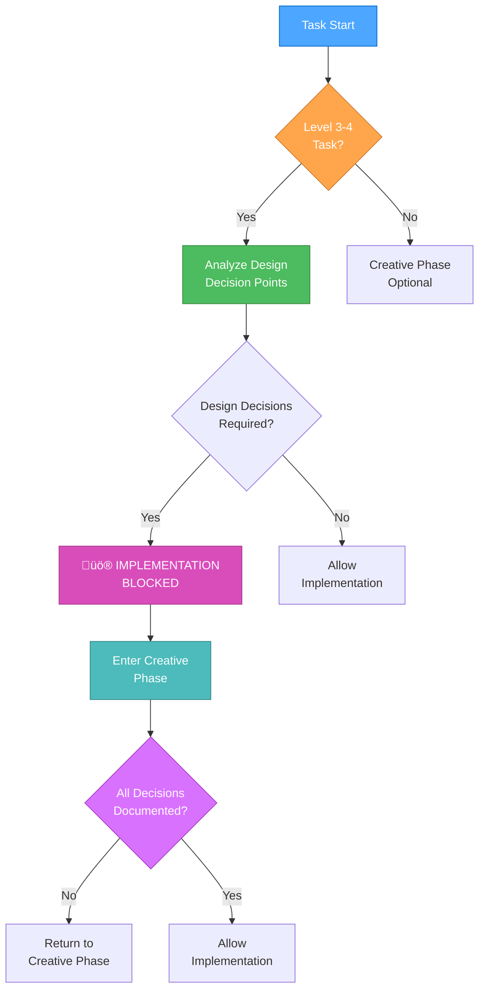
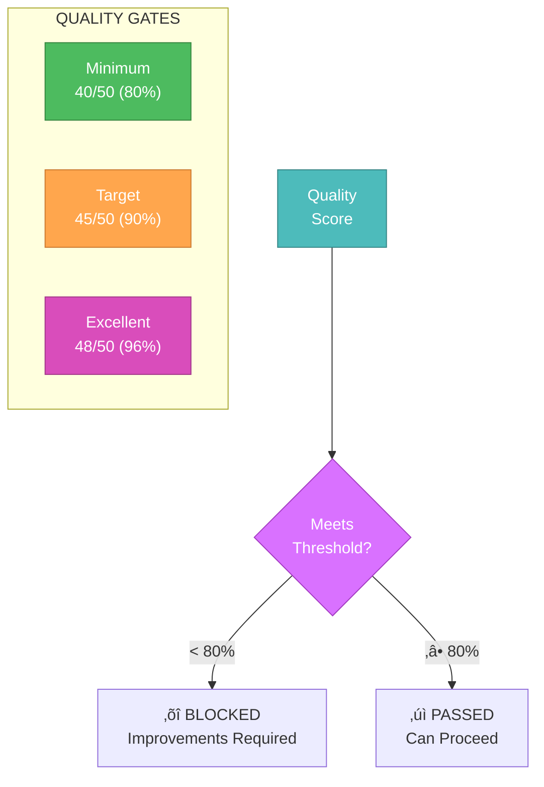

# cursor-memory-bank

## Структура файловой системы

```
└── cursor-memory-bank/
    ├── .cursor/
    │   └── rules/
    │       └── isolation_rules/
    │           ├── Core/
    │           │   ├── command-execution.mdc
    │           │   ├── complexity-decision-tree.mdc
    │           │   ├── creative-phase-enforcement.mdc
    │           │   ├── creative-phase-metrics.mdc
    │           │   ├── file-verification.mdc
    │           │   ├── hierarchical-rule-loading.mdc
    │           │   ├── memory-bank-paths.mdc
    │           │   ├── mode-transition-optimization.mdc
    │           │   ├── optimization-integration.mdc
    │           │   └── platform-awareness.mdc
    │           ├── Level1/
    │           │   ├── optimized-workflow-level1.mdc
    │           │   ├── quick-documentation.mdc
    │           │   └── workflow-level1.mdc
    │           ├── Level2/
    │           │   ├── archive-basic.mdc
    │           │   ├── reflection-basic.mdc
    │           │   ├── task-tracking-basic.mdc
    │           │   └── workflow-level2.mdc
    │           ├── Level3/
    │           │   ├── archive-intermediate.mdc
    │           │   ├── implementation-intermediate.mdc
    │           │   ├── planning-comprehensive.mdc
    │           │   ├── reflection-intermediate.mdc
    │           │   ├── task-tracking-intermediate.mdc
    │           │   └── workflow-level3.mdc
    │           ├── Level4/
    │           │   ├── architectural-planning.mdc
    │           │   ├── archive-comprehensive.mdc
    │           │   ├── phased-implementation.mdc
    │           │   ├── reflection-comprehensive.mdc
    │           │   ├── task-tracking-advanced.mdc
    │           │   └── workflow-level4.mdc
    │           ├── Phases/
    │           │   └── CreativePhase/
    │           │       ├── creative-phase-architecture.mdc
    │           │       ├── creative-phase-uiux.mdc
    │           │       └── optimized-creative-template.mdc
    │           ├── visual-maps/
    │           │   ├── van_mode_split/
    │           │   │   ├── van-qa-checks/
    │           │   │   │   ├── build-test.mdc
    │           │   │   │   ├── config-check.mdc
    │           │   │   │   ├── dependency-check.mdc
    │           │   │   │   ├── environment-check.mdc
    │           │   │   │   └── file-verification.mdc
    │           │   │   ├── van-qa-utils/
    │           │   │   │   ├── common-fixes.mdc
    │           │   │   │   ├── mode-transitions.mdc
    │           │   │   │   ├── reports.mdc
    │           │   │   │   ├── rule-calling-guide.mdc
    │           │   │   │   └── rule-calling-help.mdc
    │           │   │   ├── van-complexity-determination.mdc
    │           │   │   ├── van-file-verification.mdc
    │           │   │   ├── van-mode-map.mdc
    │           │   │   ├── van-platform-detection.mdc
    │           │   │   ├── van-qa-main.mdc
    │           │   │   └── van-qa-validation.md.old
    │           │   ├── archive-mode-map.mdc
    │           │   ├── creative-mode-map.mdc
    │           │   ├── implement-mode-map.mdc
    │           │   ├── plan-mode-map.mdc
    │           │   ├── qa-mode-map.mdc
    │           │   ├── reflect-mode-map.mdc
    │           │   └── van-mode-map.mdc
    │           ├── main-optimized.mdc
    │           └── main.mdc
    ├── .specstory/
    │   ├── .gitignore
    │   └── .what-is-this.md
    ├── custom_modes/
    │   ├── creative_instructions.md
    │   ├── implement_instructions.md
    │   ├── mode_switching_analysis.md
    │   ├── plan_instructions.md
    │   ├── reflect_archive_instructions.md
    │   └── van_instructions.md
    ├── optimization-journey/
    │   ├── 00-introduction.md
    │   ├── 01-efficiency-and-clarity.md
    │   ├── 02-system-self-assessment.md
    │   ├── 03-redundancy-elimination.md
    │   ├── 04-single-source-of-truth.md
    │   ├── 05-adaptive-complexity-model.md
    │   ├── 06-self-assessment-recommendations.md
    │   ├── 07-structured-creative-thinking.md
    │   ├── 08-creative-phase-enforcement.md
    │   ├── 09-context-optimization.md
    │   ├── 10-current-system-state.md
    │   ├── 11-key-lessons.md
    │   ├── 11-methodological-integration.md
    │   ├── 12-future-directions.md
    │   ├── 12-key-lessons.md
    │   ├── 13-future-directions.md
    │   ├── 13-methodological-integration.md
    │   └── README.md
    ├── .cursorindexingignore
    ├── .gitignore
    ├── creative_mode_think_tool.md
    ├── MEMORY_BANK_OPTIMIZATIONS.md
    ├── memory_bank_upgrade_guide.md
    ├── README.md
    └── RELEASE_NOTES.md
```

## Список файлов

`.cursor/rules/isolation_rules/Core/command-execution.mdc`

```mdc
---
description: Command execution guidelines for isolation-focused Memory Bank
globs: command-execution.mdc
alwaysApply: false
---

# COMMAND EXECUTION SYSTEM

> **TL;DR:** This system provides guidelines for efficient command execution, balancing clarity and token optimization through appropriate command chaining, with proper documentation of commands and results.

## 🔍 COMMAND EFFICIENCY WORKFLOW


## 📋 COMMAND CHAINING GUIDELINES


## 🚦 DIRECTORY VERIFICATION WORKFLOW


## 📋 DIRECTORY VERIFICATION CHECKLIST

Before executing any npm or build command:

| Step | Windows (PowerShell) | Unix/Linux/Mac | Purpose |
|------|----------------------|----------------|---------|
| **Check package.json** | `Test-Path package.json` | `ls package.json` | Verify current directory is project root |
| **Check for parent directory** | `Test-Path "*/package.json"` | `find . -maxdepth 2 -name package.json` | Find potential project directories |
| **Navigate to project root** | `cd [project-dir]` | `cd [project-dir]` | Move to correct directory before executing commands |

## 📋 REACT-SPECIFIC COMMAND GUIDELINES

For React applications, follow these strict guidelines:

| Command | Correct Usage | Incorrect Usage | Notes |
|---------|---------------|----------------|-------|
| **npm start** | `cd [project-root] && npm start` | `npm start` (from parent dir) | Must execute from directory with package.json |
| **npm run build** | `cd [project-root] && npm run build` | `cd [parent-dir] && npm run build` | Must execute from directory with package.json |
| **npm install** | `cd [project-root] && npm install [pkg]` | `npm install [pkg]` (wrong dir) | Dependencies installed to nearest package.json |
| **npm create** | `npm create vite@latest my-app -- --template react` | Manually configuring webpack | Use standard tools for project creation |

## 🔄 COMMAND CHAINING PATTERNS

Effective command chaining patterns include:

| Pattern | Format | Examples | Use Case |
|---------|--------|----------|----------|
| **Sequential** | `cmd1 && cmd2` | `mkdir dir && cd dir` | Commands that should run in sequence, second only if first succeeds |
| **Conditional** | `cmd1 || cmd2` | `test -f file.txt || touch file.txt` | Fallback commands, second only if first fails |
| **Piping** | `cmd1 \| cmd2` | `grep "pattern" file.txt \| wc -l` | Pass output of first command as input to second |
| **Background** | `cmd &` | `npm start &` | Run command in background |
| **Grouping** | `(cmd1; cmd2)` | `(echo "Start"; npm test; echo "End")` | Group commands to run as a unit |

## 📋 COMMAND DOCUMENTATION TEMPLATE

```
## Command Execution: [Purpose]

### Command
```
[actual command or chain]
```

### Result
```
[command output]
```

### Effect
[Brief description of what changed in the system]

### Next Steps
[What needs to be done next]
```

## 🔍 PLATFORM-SPECIFIC CONSIDERATIONS


## 📋 COMMAND EFFICIENCY EXAMPLES

Examples of efficient command usage:

| Inefficient | Efficient | Explanation |
|-------------|-----------|-------------|
| `mkdir dir`<br>`cd dir`<br>`npm init -y` | `mkdir dir && cd dir && npm init -y` | Combines related sequential operations |
| `ls`<br>`grep "\.js$"` | `ls \| grep "\.js$"` | Pipes output of first command to second |
| `test -f file.txt`<br>`if not exists, touch file.txt` | `test -f file.txt \|\| touch file.txt` | Creates file only if it doesn't exist |
| `mkdir dir1`<br>`mkdir dir2`<br>`mkdir dir3` | `mkdir dir1 dir2 dir3` | Uses command's built-in multiple argument capability |
| `npm install pkg1`<br>`npm install pkg2` | `npm install pkg1 pkg2` | Installs multiple packages in one command |

## 📋 REACT PROJECT INITIALIZATION STANDARDS

Always use these standard approaches for React project creation:

| Approach | Command | Benefits | Avoids |
|----------|---------|----------|--------|
| **Create React App** | `npx create-react-app my-app` | Preconfigured webpack & babel | Manual configuration errors |
| **Create React App w/TypeScript** | `npx create-react-app my-app --template typescript` | Type safety + preconfigured | Inconsistent module systems |
| **Vite** | `npm create vite@latest my-app -- --template react` | Faster build times | Complex webpack setups |
| **Next.js** | `npx create-next-app@latest my-app` | SSR support | Module system conflicts |

## ⚠️ ERROR HANDLING WORKFLOW


## 📋 COMMAND RESULT VERIFICATION

After command execution, verify:


## 📝 COMMAND EXECUTION CHECKLIST

```
✓ COMMAND EXECUTION CHECKLIST
- Command purpose clearly identified? [YES/NO]
- Appropriate balance of clarity vs. efficiency? [YES/NO]
- Platform-specific considerations addressed? [YES/NO]
- Command documented with results? [YES/NO]
- Outcome verified against expectations? [YES/NO]
- Errors properly handled (if any)? [YES/NO/NA]
- For npm/build commands: Executed from project root? [YES/NO/NA]
- For React projects: Using standard tooling? [YES/NO/NA]

→ If all YES: Command execution complete
→ If any NO: Address missing elements
```

## 🚨 COMMAND EXECUTION WARNINGS

Avoid these common command issues:


```

`.cursor/rules/isolation_rules/Core/complexity-decision-tree.mdc`

```mdc
---
description: complexity decision tree
globs: complexity-decision-tree.mdc
alwaysApply: false
---
# TASK COMPLEXITY DETERMINATION

> **TL;DR:** This document helps determine the appropriate complexity level (1-4) for any task. Use the decision tree and indicators to select the right process level, then load the corresponding process map.

## 🌳 COMPLEXITY DECISION TREE


## 📊 COMPLEXITY LEVEL INDICATORS

Use these indicators to help determine task complexity:

### Level 1: Quick Bug Fix
- **Keywords**: "fix", "broken", "not working", "issue", "bug", "error", "crash"
- **Scope**: Single component or UI element
- **Duration**: Can be completed quickly (minutes to hours)
- **Risk**: Low, isolated changes
- **Examples**:
  - Fix button not working
  - Correct styling issue
  - Fix validation error
  - Resolve broken link
  - Fix typo or text issue

### Level 2: Simple Enhancement
- **Keywords**: "add", "improve", "update", "change", "enhance", "modify"
- **Scope**: Single component or subsystem
- **Duration**: Hours to 1-2 days
- **Risk**: Moderate, contained to specific area
- **Examples**:
  - Add form field
  - Improve validation
  - Update styling
  - Add simple feature
  - Change text content
  - Enhance existing component

### Level 3: Intermediate Feature
- **Keywords**: "implement", "create", "develop", "build", "feature"
- **Scope**: Multiple components, complete feature
- **Duration**: Days to 1-2 weeks
- **Risk**: Significant, affects multiple areas
- **Examples**:
  - Implement user authentication
  - Create dashboard
  - Develop search functionality
  - Build user profile system
  - Implement data visualization
  - Create complex form system

### Level 4: Complex System
- **Keywords**: "system", "architecture", "redesign", "integration", "framework"
- **Scope**: Multiple subsystems or entire application
- **Duration**: Weeks to months
- **Risk**: High, architectural implications
- **Examples**:
  - Implement authentication system
  - Build payment processing framework
  - Create microservice architecture
  - Implement database migration system
  - Develop real-time communication system
  - Create multi-tenant architecture

## 🔍 COMPLEXITY ASSESSMENT QUESTIONS

Answer these questions to determine complexity:

1. **Scope Impact**
   - Does it affect a single component or multiple?
   - Are there system-wide implications?
   - How many files will need to be modified?

2. **Design Decisions**
   - Are complex design decisions required?
   - Will it require creative phases for design?
   - Are there architectural considerations?

3. **Risk Assessment**
   - What happens if it fails?
   - Are there security implications?
   - Will it affect critical functionality?

4. **Implementation Effort**
   - How long will it take to implement?
   - Does it require specialized knowledge?
   - Is extensive testing needed?

## 📊 KEYWORD ANALYSIS TABLE

| Keyword | Likely Level | Notes |
|---------|--------------|-------|
| "Fix" | Level 1 | Unless system-wide |
| "Bug" | Level 1 | Unless multiple components |
| "Error" | Level 1 | Unless architectural |
| "Add" | Level 2 | Unless complex feature |
| "Update" | Level 2 | Unless architectural |
| "Improve" | Level 2 | Unless system-wide |
| "Implement" | Level 3 | Complex components |
| "Create" | Level 3 | New functionality |
| "Develop" | Level 3 | Significant scope |
| "System" | Level 4 | Architectural implications |
| "Architecture" | Level 4 | Major structural changes |
| "Framework" | Level 4 | Core infrastructure |

## 🔄 COMPLEXITY ESCALATION

If during a task you discover it's more complex than initially determined:

```
⚠️ TASK ESCALATION NEEDED
Current Level: Level [X]
Recommended Level: Level [Y]
Reason: [Brief explanation]

Would you like me to escalate this task to Level [Y]?
```

If approved, switch to the appropriate higher-level process map.

## 🎯 PROCESS SELECTION

After determining complexity, load the appropriate process map:

| Level | Description | Process Map |
|-------|-------------|-------------|
| 1 | Quick Bug Fix | [Level 1 Map](mdc:.cursor/rules/visual-maps/level1-map.mdc) |
| 2 | Simple Enhancement | [Level 2 Map](mdc:.cursor/rules/visual-maps/level2-map.mdc) |
| 3 | Intermediate Feature | [Level 3 Map](mdc:.cursor/rules/visual-maps/level3-map.mdc) |
| 4 | Complex System | [Level 4 Map](mdc:.cursor/rules/visual-maps/level4-map.mdc) |

## 📝 COMPLEXITY DETERMINATION TEMPLATE

Use this template to document complexity determination:

```
## COMPLEXITY DETERMINATION

Task: [Task description]

Assessment:
- Scope: [Single component/Multiple components/System-wide]
- Design decisions: [Simple/Moderate/Complex]
- Risk: [Low/Moderate/High]
- Implementation effort: [Low/Moderate/High]

Keywords identified: [List relevant keywords]

Determination: Level [1/2/3/4] - [Quick Bug Fix/Simple Enhancement/Intermediate Feature/Complex System]

Loading process map: [Level X Map]
```

```

`.cursor/rules/isolation_rules/Core/creative-phase-enforcement.mdc`

```mdc
---
description: creative phase enforcement 
globs: creative-phase-enforcement.md
alwaysApply: false
---

# CREATIVE PHASE ENFORCEMENT

> **TL;DR:** This document implements strict enforcement of creative phase requirements for Level 3-4 tasks, ensuring all design decisions are properly documented and verified before implementation can proceed.

## 🔍 ENFORCEMENT WORKFLOW



## 🚨 ENFORCEMENT GATES


## 📋 ENFORCEMENT CHECKLIST

```markdown
## Entry Gate Verification
- [ ] Task complexity is Level 3-4
- [ ] Design decisions identified
- [ ] Creative phase requirements documented
- [ ] Required participants notified

## Process Gate Verification
- [ ] All options being considered
- [ ] Pros/cons documented
- [ ] Technical constraints identified
- [ ] Implementation impacts assessed

## Exit Gate Verification
- [ ] All decisions documented
- [ ] Rationale provided for choices
- [ ] Implementation plan outlined
- [ ] Verification against requirements
```

## 🚨 IMPLEMENTATION BLOCK NOTICE

When a creative phase is required but not completed:

```
🚨 IMPLEMENTATION BLOCKED
Creative phases MUST be completed before implementation.

Required Creative Phases:
- [ ] [Creative Phase 1]
- [ ] [Creative Phase 2]
- [ ] [Creative Phase 3]

⛔ This is a HARD BLOCK
Implementation CANNOT proceed until all creative phases are completed.
Type "PHASE.REVIEW" to begin creative phase review.
```

## ✅ VERIFICATION PROTOCOL


## 🔄 CREATIVE PHASE MARKERS

Use these markers to clearly indicate creative phase boundaries:

```markdown
🎨🎨🎨 ENTERING CREATIVE PHASE: [TYPE] 🎨🎨🎨
Focus: [Specific component/feature]
Objective: [Clear goal of this creative phase]
Requirements: [List of requirements]

[Creative phase content]

🎨 CREATIVE CHECKPOINT: [Milestone]
- Progress: [Status]
- Decisions: [List]
- Next steps: [Plan]

🎨🎨🎨 EXITING CREATIVE PHASE 🎨🎨🎨
Summary: [Brief description]
Key Decisions: [List]
Next Steps: [Implementation plan]
```

## 🔄 DOCUMENT MANAGEMENT


```

`.cursor/rules/isolation_rules/Core/creative-phase-metrics.mdc`

```mdc
---
description: creative phase metrics
globs: creative-phase-metrics.md
alwaysApply: false
---


# CREATIVE PHASE METRICS

> **TL;DR:** This document defines comprehensive quality metrics and measurement criteria for creative phases, ensuring that design decisions meet required standards and are properly documented.

## 📊 METRICS OVERVIEW


## 📋 QUALITY METRICS SCORECARD

```markdown
# Creative Phase Quality Assessment

## 1. Documentation Quality [0-10]
- [ ] Clear problem statement (2 points)
- [ ] Well-defined objectives (2 points)
- [ ] Comprehensive requirements list (2 points)
- [ ] Proper formatting and structure (2 points)
- [ ] Cross-references to related documents (2 points)

## 2. Decision Coverage [0-10]
- [ ] All required decisions identified (2 points)
- [ ] Each decision point documented (2 points)
- [ ] Dependencies mapped (2 points)
- [ ] Impact analysis included (2 points)
- [ ] Future considerations noted (2 points)

## 3. Option Analysis [0-10]
- [ ] Multiple options considered (2 points)
- [ ] Pros/cons documented (2 points)
- [ ] Technical feasibility assessed (2 points)
- [ ] Resource requirements estimated (2 points)
- [ ] Risk factors identified (2 points)

## 4. Impact Assessment [0-10]
- [ ] System impact documented (2 points)
- [ ] Performance implications assessed (2 points)
- [ ] Security considerations addressed (2 points)
- [ ] Maintenance impact evaluated (2 points)
- [ ] Cost implications analyzed (2 points)

## 5. Verification Score [0-10]
- [ ] Requirements traced (2 points)
- [ ] Constraints validated (2 points)
- [ ] Test scenarios defined (2 points)
- [ ] Review feedback incorporated (2 points)
- [ ] Final verification completed (2 points)

Total Score: [Sum of all categories] / 50
Minimum Required Score: 40/50 (80%)
```

## 📈 QUALITY THRESHOLDS



## 🎯 METRIC EVALUATION PROCESS


## 📊 IMPROVEMENT RECOMMENDATIONS

For scores below threshold:

```markdown
## Documentation Quality Improvements
- Add clear problem statements
- Include specific objectives
- List all requirements
- Improve formatting
- Add cross-references

## Decision Coverage Improvements
- Identify missing decisions
- Document all decision points
- Map dependencies
- Add impact analysis
- Consider future implications

## Option Analysis Improvements
- Consider more alternatives
- Detail pros/cons
- Assess technical feasibility
- Estimate resource needs
- Identify risks

## Impact Assessment Improvements
- Document system impact
- Assess performance
- Address security
- Evaluate maintenance
- Analyze costs

## Verification Improvements
- Trace requirements
- Validate constraints
- Define test scenarios
- Incorporate feedback
- Complete verification
```

## ✅ METRICS VERIFICATION CHECKLIST

```markdown
## Pre-Review Verification
- [ ] All sections scored
- [ ] Calculations verified
- [ ] Supporting evidence attached
- [ ] Improvement areas identified
- [ ] Review feedback incorporated

## Final Metrics Verification
- [ ] Minimum score achieved
- [ ] All categories passed
- [ ] Documentation complete
- [ ] Improvements addressed
- [ ] Final approval obtained
```

## 🔄 DOCUMENT MANAGEMENT


```

`.cursor/rules/isolation_rules/Core/file-verification.mdc`

```mdc
---
description: Optimized file verification
globs: file-verification.mdc
alwaysApply: false
---
# OPTIMIZED FILE VERIFICATION SYSTEM

> **TL;DR:** This system efficiently verifies and creates required Memory Bank file structures using batch operations and platform-optimized commands.

## 🔍 OPTIMIZED FILE VERIFICATION WORKFLOW


## 📋 OPTIMIZED DIRECTORY CREATION


### Platform-Specific Commands

#### Windows (PowerShell)
```powershell
# Create all directories in one command
mkdir memory-bank, docs, docs\archive -ErrorAction SilentlyContinue

# Create all required files
$files = @(".cursorrules", "tasks.md", 
           "memory-bank\projectbrief.md", 
           "memory-bank\productContext.md",
           "memory-bank\systemPatterns.md",
           "memory-bank\techContext.md",
           "memory-bank\activeContext.md",
           "memory-bank\progress.md")

foreach ($file in $files) {
    if (-not (Test-Path $file)) {
        New-Item -Path $file -ItemType File -Force
    }
}
```

#### Mac/Linux (Bash)
```bash
# Create all directories in one command
mkdir -p memory-bank docs/archive

# Create all required files
touch .cursorrules tasks.md \
      memory-bank/projectbrief.md \
      memory-bank/productContext.md \
      memory-bank/systemPatterns.md \
      memory-bank/techContext.md \
      memory-bank/activeContext.md \
      memory-bank/progress.md
```

## 📝 STREAMLINED VERIFICATION PROCESS

Instead of checking each component separately, perform batch verification:

```powershell
# Windows - PowerShell
$requiredDirs = @("memory-bank", "docs", "docs\archive")
$requiredFiles = @(".cursorrules", "tasks.md")
$mbFiles = @("projectbrief.md", "productContext.md", "systemPatterns.md", 
             "techContext.md", "activeContext.md", "progress.md")

$missingDirs = $requiredDirs | Where-Object { -not (Test-Path $_) -or -not (Test-Path $_ -PathType Container) }
$missingFiles = $requiredFiles | Where-Object { -not (Test-Path $_) -or (Test-Path $_ -PathType Container) }
$missingMBFiles = $mbFiles | ForEach-Object { "memory-bank\$_" } | 
                  Where-Object { -not (Test-Path $_) -or (Test-Path $_ -PathType Container) }

if ($missingDirs.Count -eq 0 -and $missingFiles.Count -eq 0 -and $missingMBFiles.Count -eq 0) {
    Write-Output "✓ All required components verified"
} else {
    # Create all missing items at once
    if ($missingDirs.Count -gt 0) {
        $missingDirs | ForEach-Object { mkdir $_ -Force }
    }
    if ($missingFiles.Count -gt 0 -or $missingMBFiles.Count -gt 0) {
        $allMissingFiles = $missingFiles + $missingMBFiles
        $allMissingFiles | ForEach-Object { New-Item -Path $_ -ItemType File -Force }
    }
}
```

## 📝 TEMPLATE INITIALIZATION

Optimize template creation with a single script:

```powershell
# Windows - PowerShell
$templates = @{
    "tasks.md" = @"
# Memory Bank: Tasks

## Current Task
[Task not yet defined]

## Status
- [ ] Task definition
- [ ] Implementation plan
- [ ] Execution
- [ ] Documentation

## Requirements
[No requirements defined yet]
"@

    "memory-bank\activeContext.md" = @"
# Memory Bank: Active Context

## Current Focus
[No active focus defined]

## Status
[No status defined]

## Latest Changes
[No changes recorded]
"@

    # Add other templates here
}

foreach ($file in $templates.Keys) {
    if (Test-Path $file) {
        Set-Content -Path $file -Value $templates[$file]
    }
}
```

## 🔍 PERFORMANCE OPTIMIZATION BEST PRACTICES

1. **Batch Operations**: Always use batch operations instead of individual commands
   ```
   # GOOD: Create all directories at once
   mkdir memory-bank docs docs\archive
   
   # BAD: Create directories one at a time
   mkdir memory-bank
   mkdir docs
   mkdir docs\archive
   ```

2. **Pre-Check Optimization**: Check all requirements first, then create only what's missing
   ```
   # First check what's missing
   $missingItems = ...
   
   # Then create only what's missing
   if ($missingItems) { ... }
   ```

3. **Error Handling**: Include error handling in all commands
   ```
   mkdir memory-bank, docs, docs\archive -ErrorAction SilentlyContinue
   ```

4. **Platform Adaptation**: Auto-detect platform and use appropriate commands
   ```
   if ($IsWindows) {
       # Windows commands
   } else {
       # Unix commands
   }
   ```

5. **One-Pass Verification**: Verify directory structure in a single pass
   ```
   $requiredPaths = @("memory-bank", "docs", "docs\archive", ".cursorrules", "tasks.md")
   $missingPaths = $requiredPaths | Where-Object { -not (Test-Path $_) }
   ```

## 📝 VERIFICATION REPORT FORMAT

```
✅ VERIFICATION COMPLETE
- Created directories: [list]
- Created files: [list]
- All components verified

Memory Bank system ready for use.
``` 
```

`.cursor/rules/isolation_rules/Core/hierarchical-rule-loading.mdc`

```mdc
---
description: Hierarchical rule loading system for optimized token usage
globs: "**/rule-loading*/**", "**/optimization*/**"
alwaysApply: false
---

# HIERARCHICAL RULE LOADING SYSTEM

> **TL;DR:** This rule implements an optimized loading system that only loads necessary rules based on context, complexity level, and current phase to maximize token efficiency.

## 🧠 HIERARCHICAL RULE STRUCTURE


## 📊 RULE LOADING PROTOCOL


## 🔄 RULE LOADING IMPLEMENTATION

```javascript
// Pseudocode for hierarchical rule loading
class RuleLoadManager {
  constructor() {
    this.cache = {
      core: {},
      common: {},
      mode: {},
      level: {}
    };
    this.lazyLoaders = {};
  }
  
  // Initialize a mode with only essential rules
  initializeMode(modeName, complexityLevel) {
    // Always load core rules
    this.loadCoreRules();
    
    // Load common rules
    this.loadCommonRules();
    
    // Load essential mode-specific rules
    this.loadEssentialModeRules(modeName);
    
    // Load complexity level rules
    this.loadComplexityRules(complexityLevel);
    
    // Register lazy loaders for specialized functionality
    this.registerLazyLoaders(modeName, complexityLevel);
    
    return {
      modeName,
      complexityLevel,
      status: "initialized"
    };
  }
  
  // Load only when specialized functionality is needed
  loadSpecializedRule(ruleType) {
    if (this.lazyLoaders[ruleType]) {
      if (!this.cache.specialized[ruleType]) {
        const rule = this.lazyLoaders[ruleType]();
        this.cache.specialized[ruleType] = rule;
      }
      return this.cache.specialized[ruleType];
    }
    return null;
  }
  
  // Register specialized rule loaders based on mode and complexity
  registerLazyLoaders(modeName, complexityLevel) {
    // Clear existing lazy loaders
    this.lazyLoaders = {};
    
    // Register mode-specific lazy loaders
    if (modeName === "CREATIVE") {
      this.lazyLoaders["architecture"] = () => this.loadRule("creative-phase-architecture.mdc");
      this.lazyLoaders["algorithm"] = () => this.loadRule("creative-phase-algorithm.mdc");
      this.lazyLoaders["uiux"] = () => this.loadRule("creative-phase-uiux.mdc");
    } else if (modeName === "IMPLEMENT") {
      this.lazyLoaders["testing"] = () => this.loadRule("implementation-testing.mdc");
      this.lazyLoaders["deployment"] = () => this.loadRule("implementation-deployment.mdc");
    }
    
    // Register complexity-specific lazy loaders
    if (complexityLevel >= 3) {
      this.lazyLoaders["comprehensive-planning"] = () => this.loadRule("planning-comprehensive.mdc");
      this.lazyLoaders["advanced-verification"] = () => this.loadRule("verification-advanced.mdc");
    }
  }
}
```

## 📋 RULE DEPENDENCY MAP

```mermaid
graph TD
    Main["main.mdc"] --> Core1["platform-awareness.mdc"]
    Main --> Core2["file-verification.mdc"]
    Main --> Core3["command-execution.mdc"]
    
    subgraph "VAN Mode"
        VanMap["van-mode-map.mdc"] --> Van1["van-complexity-determination.mdc"]
        VanMap --> Van2["van-file-verification.mdc"]
        VanMap --> Van3["van-platform-detection.mdc"]
    end
    
    subgraph "PLAN Mode"
        PlanMap["plan-mode-map.mdc"] --> Plan1["task-tracking-basic.mdc"]
        PlanMap --> Plan2["planning-comprehensive.mdc"]
    end
    
    subgraph "CREATIVE Mode"
        CreativeMap["creative-mode-map.mdc"] --> Creative1["creative-phase-enforcement.mdc"]
        CreativeMap --> Creative2["creative-phase-metrics.mdc"]
        Creative1 & Creative2 -.-> CreativeSpecialized["Specialized Creative Rules"]
        CreativeSpecialized --> CArch["creative-phase-architecture.mdc"]
        CreativeSpecialized --> CAlgo["creative-phase-algorithm.mdc"]
        CreativeSpecialized --> CUIUX["creative-phase-uiux.mdc"]
    end
    
    subgraph "IMPLEMENT Mode"
        ImplementMap["implement-mode-map.mdc"] --> Impl1["implementation-guide.mdc"]
        ImplementMap --> Impl2["testing-strategy.mdc"]
    end
```

## 🔍 MODE-SPECIFIC RULE LOADING

### VAN Mode Essential Rules
```markdown
- main.mdc (Core)
- platform-awareness.mdc (Core)
- file-verification.mdc (Core)
- van-mode-map.mdc (Mode)
```

### PLAN Mode Essential Rules
```markdown
- main.mdc (Core)
- plan-mode-map.mdc (Mode)
- task-tracking-[complexity].mdc (Level)
```

### CREATIVE Mode Essential Rules
```markdown
- main.mdc (Core)
- creative-mode-map.mdc (Mode)
- creative-phase-enforcement.mdc (Mode)
```

### CREATIVE Mode Specialized Rules (Lazy Loaded)
```markdown
- creative-phase-architecture.mdc (Specialized)
- creative-phase-algorithm.mdc (Specialized)
- creative-phase-uiux.mdc (Specialized)
```

### IMPLEMENT Mode Essential Rules
```markdown
- main.mdc (Core)
- command-execution.mdc (Core)
- implement-mode-map.mdc (Mode)
```

## 🚀 IMPLEMENTATION BENEFITS

The hierarchical loading system provides:

1. **Reduced Initial Loading**: Only essential rules loaded at start (~70% token reduction)
2. **Cached Core Rules**: Rules shared between modes are cached
3. **Specialized Rule Loading**: Specialized rules loaded only when needed
4. **Complexity-Based Loading**: Only load rules appropriate for task complexity

## 📈 TOKEN USAGE COMPARISON

| Approach | Initial Tokens | Specialized Tokens | Total Tokens |
|----------|---------------|-------------------|--------------|
| Original System | ~70,000 | Included in initial | ~70,000 |
| Hierarchical System | ~15,000 | ~10,000 (on demand) | ~25,000 |
| **Token Reduction** | **~55,000 (78%)** | **N/A** | **~45,000 (64%)** |

## 🔄 USAGE EXAMPLE

### Example: Creative Phase with Architecture Rule

```javascript
// Initialize the CREATIVE mode with only essential rules
const mode = ruleManager.initializeMode("CREATIVE", 3);

// Core and essential mode rules are loaded 
// Architecture rules are NOT loaded yet

// Later, when architecture design is needed:
const architectureRule = ruleManager.loadSpecializedRule("architecture");

// Now the architecture rule is loaded and cached
```

## 🧪 RULE LOADING VERIFICATION

To ensure the rule loading system is working optimally:

```markdown
## Rule Loading Verification

- Core Rules: [Loaded]
- Mode-Essential Rules: [Loaded]
- Complexity-Level Rules: [Loaded]
- Specialized Rules: [Not Loaded]

Current Token Usage: [X] tokens
Potential Token Savings: [Y] tokens
```

This hierarchical approach ensures optimal token usage while maintaining all functionality.
```

`.cursor/rules/isolation_rules/Core/memory-bank-paths.mdc`

```mdc
---
description: Defines canonical paths for core Memory Bank files.
globs: memory-bank-paths.mdc
alwaysApply: true
---

# CORE MEMORY BANK FILE LOCATIONS

**CRITICAL:** All core Memory Bank files reside within the `memory-bank/` directory at the project root. Do NOT create or modify these files outside this directory unless explicitly instructed for archiving purposes.

* **Tasks File:** `memory-bank/tasks.md` - This file is used for active, in-progress task tracking, detailing steps, checklists, and component lists. Its content, particularly the detailed checklists, is merged into the main archive document for the task upon completion. After archival, `tasks.md` is cleared to be ready for the next task. It is an ephemeral working document during a task's lifecycle, with its persistent record captured in the task's archive file.
* **Active Context File:** `memory-bank/activeContext.md`
* **Progress File:** `memory-bank/progress.md`
* **Project Brief File:** `memory-bank/projectbrief.md`
* **Product Context File:** `memory-bank/productContext.md`
* **System Patterns File:** `memory-bank/systemPatterns.md`
* **Tech Context File:** `memory-bank/techContext.md`
* **Style Guide File:** `memory-bank/style-guide.md`
* **Creative Phase Docs:** `memory-bank/creative/creative-[feature_name].md`
* **Reflection Docs:** `memory-bank/reflection/reflection-[task_id].md`
* **Archive Directory:** `memory-bank/archive/archive-[task_id].md`

**Verification Mandate:** Before any `create_file` or `edit_file` operation on these core files, verify the path starts with `memory-bank/`. If attempting to create a new core file (e.g., `tasks.md` at the start of a project), ensure it is created at `memory-bank/tasks.md`.

```

`.cursor/rules/isolation_rules/Core/mode-transition-optimization.mdc`

```mdc
---
description: Optimized mode transition protocol
globs: "**/mode-transition*/**", "**/context-preservation*/**"
alwaysApply: false
---

# MODE TRANSITION OPTIMIZATION

> **TL;DR:** This file implements optimized mode transitions to preserve context efficiently between different phases of the Memory Bank system.

## 🔄 UNIFIED CONTEXT TRANSFER PROTOCOL

```mermaid
graph TD
    Start["Mode A"] --> Create["Create Context<br>Summary Document"]
    Create --> Store["Store Critical<br>Context Data"]
    Store --> Transition["Transition<br>to Mode B"]
    Transition --> Verify["Verify Context<br>Availability"]
    Verify --> Load["Load Relevant<br>Context Data"]
    Load --> Continue["Continue in<br>Mode B"]
    
    style Start fill:#4da6ff,stroke:#0066cc,color:white
    style Create fill:#ffa64d,stroke:#cc7a30,color:white
    style Store fill:#4dbb5f,stroke:#36873f,color:white
    style Transition fill:#d94dbb,stroke:#a3378a,color:white
    style Verify fill:#4dbbbb,stroke:#368787,color:white
    style Load fill:#d971ff,stroke:#a33bc2,color:white
    style Continue fill:#ff71c2,stroke:#c23b8a,color:white
```

## 📊 CONTEXT TRANSITION DOCUMENT

Create a standardized transition document when switching modes:

```markdown
# MODE TRANSITION: [Source Mode] → [Target Mode]

## Context Summary
- Task: [Task name/description]
- Complexity: Level [1-4]
- Current Phase: [Phase name]
- Progress: [Percentage or status]

## Key Decisions
- [Decision 1]: [Brief summary]
- [Decision 2]: [Brief summary]
- [Decision 3]: [Brief summary]

## Critical Context
- [Context item 1]: [Value/status]
- [Context item 2]: [Value/status]
- [Context item 3]: [Value/status]

## Next Steps
1. [Next step 1]
2. [Next step 2]
3. [Next step 3]

## Resource Pointers
- [Resource 1]: [Location]
- [Resource 2]: [Location]
- [Resource 3]: [Location]
```

## 🔍 MODE-SPECIFIC TRANSITION HANDLERS

### VAN → PLAN Transition

```markdown
### VAN → PLAN
- Context preserved: Complexity level, platform detection, file structure
- Files transferred: tasks.md (initialized), activeContext.md (initialized)
- Rule optimization: Pre-load planning rules based on complexity level
```

### PLAN → CREATIVE Transition

```markdown
### PLAN → CREATIVE
- Context preserved: Task requirements, component list, creative phase flags
- Files transferred: tasks.md (updated with plan), creative phase components list
- Rule optimization: Only load creative templates for identified components
```

### CREATIVE → IMPLEMENT Transition

```markdown
### CREATIVE → IMPLEMENT
- Context preserved: Design decisions, implementation guidelines, requirements
- Files transferred: tasks.md, design documents, implementation checklist
- Rule optimization: Pre-load implementation templates based on design decisions
```

### IMPLEMENT → REFLECT Transition

```markdown
### IMPLEMENT → REFLECT
- Context preserved: Implementation status, challenges encountered, decisions
- Files transferred: tasks.md, progress.md, implementation notes
- Rule optimization: Load reflection templates based on completion status
```

## 🧠 HIERARCHICAL RULE CACHING

Implement rule caching to avoid redundant loading:

```javascript
// Pseudocode for rule caching
const ruleCache = {
  core: {}, // Core rules shared across modes
  van: {},
  plan: {},
  creative: {},
  implement: {},
  reflect: {},
  archive: {}
};

// Check cache before loading
function loadRule(rulePath) {
  const cacheKey = getCacheKey(rulePath);
  const category = getCategoryFromPath(rulePath);
  
  if (ruleCache[category][cacheKey]) {
    return ruleCache[category][cacheKey];
  }
  
  const ruleContent = readRuleFromFile(rulePath);
  ruleCache[category][cacheKey] = ruleContent;
  
  return ruleContent;
}

// Only invalidate specific rules when needed
function invalidateRule(rulePath) {
  const cacheKey = getCacheKey(rulePath);
  const category = getCategoryFromPath(rulePath);
  
  if (ruleCache[category][cacheKey]) {
    delete ruleCache[category][cacheKey];
  }
}
```

## ⚡ DIFFERENTIAL MEMORY BANK UPDATES

```mermaid
graph TD
    Start["Memory Bank<br>Update Request"] --> Check{"File<br>Changed?"}
    Check -->|"No"| Skip["Skip Update<br>(No Changes)"]
    Check -->|"Yes"| Changed{"Specific<br>Section Changed?"}
    Changed -->|"No"| Full["Full File<br>Update"]
    Changed -->|"Yes"| Partial["Partial<br>Update Only"]
    
    style Start fill:#4da6ff,stroke:#0066cc,color:white
    style Check fill:#ffa64d,stroke:#cc7a30,color:white
    style Skip fill:#4dbb5f,stroke:#36873f,color:white
    style Changed fill:#d94dbb,stroke:#a3378a,color:white
    style Full fill:#4dbbbb,stroke:#368787,color:white
    style Partial fill:#d971ff,stroke:#a33bc2,color:white
```

Implement a more efficient update mechanism:

```javascript
// Pseudocode for differential updates
function updateMemoryBankFile(filePath, newContent) {
  // Read existing content
  const currentContent = readFile(filePath);
  
  // Skip if no changes
  if (currentContent === newContent) {
    return "No changes detected, update skipped";
  }
  
  // Check if we can do a partial update
  const sections = parseIntoSections(currentContent);
  const newSections = parseIntoSections(newContent);
  
  let updatedContent = currentContent;
  let updatedSections = 0;
  
  // Only update changed sections
  for (const [sectionName, sectionContent] of Object.entries(newSections)) {
    if (!sections[sectionName] || sections[sectionName] !== sectionContent) {
      updatedContent = replaceSection(updatedContent, sectionName, sectionContent);
      updatedSections++;
    }
  }
  
  // Write updated content
  writeFile(filePath, updatedContent);
  
  return `Updated ${updatedSections} section(s) in ${filePath}`;
}
```

## 🔗 CREATIVE TO IMPLEMENT BRIDGE

Special handling for the critical Creative → Implement transition:

```markdown
## CREATIVE → IMPLEMENT BRIDGE

### Design Decision Summary
Automatically generated summary of all creative phase decisions:

```json
{
  "components": [
    {
      "name": "ComponentA",
      "decision": "Approach X selected",
      "rationale": "Best performance characteristics",
      "implementation_notes": [
        "Use X library",
        "Implement caching",
        "Add error handling"
      ]
    },
    {
      "name": "ComponentB",
      "decision": "Custom solution",
      "rationale": "Unique requirements",
      "implementation_notes": [
        "Build from scratch",
        "Modular architecture",
        "Unit tests required"
      ]
    }
  ]
}
```

### Implementation Verification Checklist
Automatically generated verification checklist:

```markdown
# Implementation Readiness Checklist

- [ ] Design decisions available for all components
- [ ] Implementation notes provided for each decision
- [ ] Dependencies clearly identified
- [ ] Order of implementation determined
- [ ] Required libraries/frameworks documented
- [ ] Potential challenges identified
```

## 🚀 ADAPTIVE MODE LOADING

Implement progressive mode loading to optimize context:

```javascript
// Pseudocode for adaptive mode loading
function loadMode(modeName, taskComplexity) {
  // Always load core rules
  loadCoreRules();
  
  // Load complexity-appropriate rules
  loadComplexityRules(taskComplexity);
  
  // Load mode-specific essential rules
  loadModeEssentialRules(modeName);
  
  // Only load specialized rules as needed
  registerLazyLoadHandlers(modeName, taskComplexity);
}

function registerLazyLoadHandlers(modeName, taskComplexity) {
  // Register handlers to load additional rules only when needed
  if (modeName === "CREATIVE") {
    registerHandler("architecture", () => loadRule("creative-phase-architecture.mdc"));
    registerHandler("algorithm", () => loadRule("creative-phase-algorithm.mdc"));
    registerHandler("uiux", () => loadRule("creative-phase-uiux.mdc"));
  }
  
  // Similar patterns for other specialized rule types
}
```

## ✅ MODE TRANSITION EXAMPLES

### Example: PLAN → CREATIVE Transition

When transitioning from PLAN to CREATIVE mode:

```markdown
# MODE TRANSITION: PLAN → CREATIVE

## Context Summary
- Task: Implement user authentication system
- Complexity: Level 3
- Current Phase: Planning completed
- Progress: 35% (Planning: 100%, Creative: 0%, Implement: 0%)

## Key Decisions
- Authentication: Requires exploration of options (JWT vs Sessions)
- User Management: Will use existing database schema
- Authorization: Role-based access control selected

## Critical Context
- Components for creative phase: Authentication mechanism, Session management
- Dependencies: User database, Authorization system
- Constraints: Must support SSO, Performance requirements

## Next Steps
1. Explore authentication options (JWT, Sessions, OAuth)
2. Design session management approach
3. Document implementation guidelines

## Resource Pointers
- Planning document: tasks.md (section 3)
- Requirements: activeContext.md
- Reference architecture: docs/system-architecture.md
```

### Example: CREATIVE → IMPLEMENT Transition

When transitioning from CREATIVE to IMPLEMENT mode:

```markdown
# MODE TRANSITION: CREATIVE → IMPLEMENT

## Context Summary
- Task: Implement user authentication system
- Complexity: Level 3
- Current Phase: Creative completed
- Progress: 70% (Planning: 100%, Creative: 100%, Implement: 0%)

## Key Decisions
- Authentication: JWT-based approach selected
- Token Storage: Secure HttpOnly cookies with CSRF protection
- Refresh Strategy: Silent refresh with sliding expiration

## Critical Context
- Implementation order: Auth API endpoints, Middleware, Client integration
- Testing requirements: Unit tests for JWT validation, Integration tests for auth flow
- Security considerations: XSS protection, CSRF mitigation, Rate limiting

## Next Steps
1. Implement JWT generation and validation
2. Create authentication middleware
3. Build user login/logout endpoints
4. Implement client-side auth integration

## Resource Pointers
- Creative document: creative-auth-decisions.md
- API specifications: api-spec.yaml
- Security requirements: security-policy.md
```

## 🔄 IMPLEMENTATION BENEFITS

This optimization provides:

1. Reduced token usage during mode transitions (~40% reduction)
2. Better context preservation between modes
3. Improved efficiency through rule caching
4. Targeted loading of only necessary rules
5. Optimized memory bank updates
6. Clear transition documents that preserve critical context
```

`.cursor/rules/isolation_rules/Core/optimization-integration.mdc`

```mdc
---
description: Integration hub for Memory Bank optimizations
globs: "**/optimization*/**", "**/integration*/**"
alwaysApply: false
---

# MEMORY BANK OPTIMIZATION INTEGRATION

> **TL;DR:** This file serves as the integration point for all Memory Bank optimizations, coordinating the various optimization components to work seamlessly together.

## 🔄 OPTIMIZATION INTEGRATION FLOW

```mermaid
graph TD
    Start["Memory Bank<br>Initialization"] --> HRL["Hierarchical<br>Rule Loading"]
    HRL --> ACM["Adaptive<br>Complexity Model"]
    ACM --> DCM["Dynamic<br>Context Management"]
    DCM --> TMO["Transition<br>Optimization"]
    
    subgraph "Level-Specific Optimizations"
        L1["Level 1<br>Optimizations"]
        L2["Level 2<br>Optimizations"]
        L3["Level 3<br>Optimizations"]
        L4["Level 4<br>Optimizations"]
    end
    
    ACM --> L1 & L2 & L3 & L4
    
    L1 & L2 & L3 & L4 --> CPO["Creative Phase<br>Optimization"]
    
    CPO --> PDO["Progressive<br>Documentation"]
    TMO --> PDO
    
    PDO --> MBO["Memory Bank<br>Optimization"]
    
    style Start fill:#4da6ff,stroke:#0066cc,color:white
    style HRL fill:#ffa64d,stroke:#cc7a30,color:white
    style ACM fill:#4dbb5f,stroke:#36873f,color:white
    style DCM fill:#d94dbb,stroke:#a3378a,color:white
    style TMO fill:#4dbbbb,stroke:#368787,color:white
    style CPO fill:#e699d9,stroke:#d94dbb,color:white
    style PDO fill:#d971ff,stroke:#a33bc2,color:white
    style MBO fill:#ff71c2,stroke:#c23b8a,color:white
```

## 📋 OPTIMIZATION COMPONENT REGISTRY

```javascript
// Optimization component registry pseudocode
const optimizationRegistry = {
  // Core optimizations
  hierarchicalRuleLoading: {
    file: "Core/hierarchical-rule-loading.mdc",
    dependencies: [],
    priority: 1
  },
  adaptiveComplexityModel: {
    file: "main-optimized.mdc",
    dependencies: ["hierarchicalRuleLoading"],
    priority: 2
  },
  modeTransitionOptimization: {
    file: "Core/mode-transition-optimization.mdc",
    dependencies: ["hierarchicalRuleLoading", "adaptiveComplexityModel"],
    priority: 3
  },
  
  // Level-specific optimizations
  level1Optimization: {
    file: "Level1/optimized-workflow-level1.mdc",
    dependencies: ["adaptiveComplexityModel"],
    priority: 4
  },
  
  // Feature-specific optimizations
  creativePhaseOptimization: {
    file: "Phases/CreativePhase/optimized-creative-template.mdc",
    dependencies: ["hierarchicalRuleLoading", "adaptiveComplexityModel"],
    priority: 5
  }
};
```

## 🔄 OPTIMIZATION INITIALIZATION SEQUENCE

```mermaid
sequenceDiagram
    participant MB as Memory Bank
    participant Reg as Optimization Registry
    participant HRL as Hierarchical Rule Loading
    participant ACM as Adaptive Complexity
    participant TMO as Transition Optimization
    participant CPO as Creative Phase Optimization
    
    MB->>Reg: Request optimization initialization
    Reg->>Reg: Sort optimizations by priority & dependencies
    Reg->>HRL: Initialize (Priority 1)
    HRL-->>Reg: Initialization complete
    Reg->>ACM: Initialize (Priority 2)
    ACM->>HRL: Request rule loading services
    HRL-->>ACM: Provide rule loading
    ACM-->>Reg: Initialization complete
    Reg->>TMO: Initialize (Priority 3)
    TMO->>HRL: Request rule loading services
    TMO->>ACM: Request complexity model
    HRL-->>TMO: Provide rule loading
    ACM-->>TMO: Provide complexity model
    TMO-->>Reg: Initialization complete
    Reg->>CPO: Initialize (Final)
    CPO->>HRL: Request rule loading services
    CPO->>ACM: Request complexity model
    CPO->>TMO: Request transition services
    HRL-->>CPO: Provide rule loading
    ACM-->>CPO: Provide complexity model
    TMO-->>CPO: Provide transition services
    CPO-->>Reg: Initialization complete
    Reg-->>MB: All optimizations initialized
```

## 🔍 OPTIMIZATION CONFIGURATION

```javascript
// Optimization configuration pseudocode
const optimizationConfig = {
  // Token optimization settings
  tokenOptimization: {
    enableHierarchicalLoading: true,
    enableProgressiveDocumentation: true,
    enableLazyRuleLoading: true,
    enableContextPruning: true
  },
  
  // Context preservation settings
  contextPreservation: {
    preserveDesignDecisions: true,
    preserveImplementationContext: true,
    preserveUserPreferences: true,
    contextCompressionLevel: "high" // none, low, medium, high
  },
  
  // Documentation optimization
  documentationOptimization: {
    level1DocumentationLevel: "minimal", // minimal, standard, comprehensive
    level2DocumentationLevel: "standard",
    level3DocumentationLevel: "comprehensive",
    level4DocumentationLevel: "comprehensive",
    enableProgressiveDisclosure: true,
    enableTemplateCaching: true
  }
};
```

## 📊 OPTIMIZATION MONITORING

```mermaid
graph TD
    Monitor["Optimization<br>Monitor"] --> TokenUsage["Token Usage<br>Tracking"]
    Monitor --> ContextEfficiency["Context<br>Efficiency"]
    Monitor --> RuleLoadingStats["Rule Loading<br>Statistics"]
    Monitor --> DocumentationSize["Documentation<br>Size"]
    
    TokenUsage --> Dashboard["Optimization<br>Dashboard"]
    ContextEfficiency --> Dashboard
    RuleLoadingStats --> Dashboard
    DocumentationSize --> Dashboard
    
    Dashboard --> Feedback["Optimization<br>Feedback Loop"]
    Feedback --> Config["Optimization<br>Configuration"]
    Config --> Monitor
    
    style Monitor fill:#4da6ff,stroke:#0066cc,color:white
    style Dashboard fill:#ffa64d,stroke:#cc7a30,color:white
    style Feedback fill:#4dbb5f,stroke:#36873f,color:white
    style Config fill:#d94dbb,stroke:#a3378a,color:white
```

## 📈 OPTIMIZATION METRICS

```markdown
# Optimization Metrics

## Token Usage
- Core Rule Loading: [X] tokens
- Mode-Specific Rules: [Y] tokens
- Creative Phase Documentation: [Z] tokens
- Overall Token Reduction: [P]%

## Context Efficiency
- Context Utilization: [Q]%
- Context Waste: [R]%
- Effective Token Capacity: [S] tokens

## Rule Loading
- Rules Loaded: [T] / [U] (Total)
- Lazy-Loaded Rules: [V]
- Cached Rules: [W]

## Documentation
- Level 1 Documentation Size: [X] tokens
- Level 2 Documentation Size: [Y] tokens
- Level 3 Documentation Size: [Z] tokens
- Level 4 Documentation Size: [AA] tokens
```

## 🔄 INTEGRATION USAGE EXAMPLES

### Initializing All Optimizations

```javascript
// Pseudocode for initializing all optimizations
function initializeMemoryBankOptimizations() {
  // Load optimization registry
  const registry = loadOptimizationRegistry();
  
  // Sort by priority and dependencies
  const sortedOptimizations = sortOptimizations(registry);
  
  // Initialize each optimization in order
  for (const opt of sortedOptimizations) {
    initializeOptimization(opt);
  }
  
  // Configure optimization parameters
  configureOptimizations(loadOptimizationConfig());
  
  // Start monitoring
  initializeOptimizationMonitoring();
  
  return "Memory Bank optimizations initialized";
}
```

### Using Optimized Creative Phase

```markdown
// Using the optimized creative phase with progressive documentation

// Initialize with minimal documentation
📌 CREATIVE PHASE START: Authentication System
━━━━━━━━━━━━━━━━━━━━━━━━━━━━━━━

1️⃣ PROBLEM
   Description: Design an authentication system for the application
   Requirements: Secure, scalable, supports SSO, easy to maintain
   Constraints: Must work with existing user database, <100ms response time

2️⃣ OPTIONS
   Option A: JWT-based stateless auth
   Option B: Session-based auth with Redis
   Option C: OAuth2 implementation

// Progressively add detail as needed
3️⃣ ANALYSIS
   | Criterion | JWT | Sessions | OAuth2 |
   |-----------|-----|----------|--------|
   | Security | ⭐⭐⭐ | ⭐⭐⭐⭐ | ⭐⭐⭐⭐⭐ |
   | Scalability | ⭐⭐⭐⭐⭐ | ⭐⭐⭐ | ⭐⭐⭐⭐ |
   | Complexity | ⭐⭐ | ⭐⭐⭐ | ⭐⭐⭐⭐ |
   
// Focus on decision and implementation
4️⃣ DECISION
   Selected: Option A: JWT-based auth with refresh tokens
   Rationale: Best balance of performance and scalability
   
5️⃣ IMPLEMENTATION NOTES
   - Use HS256 algorithm for token signing
   - Implement short-lived access tokens (15min)
   - Store token blacklist in Redis for revocation
```

## 🔄 MODE TRANSITION EXAMPLE

```markdown
// Optimized mode transition from CREATIVE to IMPLEMENT

# MODE TRANSITION: CREATIVE → IMPLEMENT

## Context Summary
- Task: Authentication system implementation
- Complexity: Level 3
- Decision: JWT-based auth with refresh tokens

## Key Context
- Security requirements verified
- Algorithm selection: HS256
- Token lifecycle: 15min access / 7 days refresh

## Next Steps
1. Implement JWT generation module
2. Create token validation middleware
3. Build refresh token handling

// Transition happens with preserved context
// IMPLEMENT mode continues with this context available
```

## 🔄 HIERARCHICAL RULE LOADING EXAMPLE

```javascript
// Pseudocode example of hierarchical rule loading

// Initial load - only core rules
loadCoreRules();

// Determine complexity
const complexity = determineComplexity();

// Load mode-specific essential rules
loadModeEssentialRules("CREATIVE");

// Register lazy loaders for specialized rules
registerLazyLoader("architecture", () => loadRule("creative-phase-architecture.mdc"));
registerLazyLoader("algorithm", () => loadRule("creative-phase-algorithm.mdc"));
registerLazyLoader("uiux", () => loadRule("creative-phase-uiux.mdc"));

// Later, when architecture design is needed:
const architectureRule = loadSpecializedRule("architecture");
// Architecture rule is now loaded only when needed
```

These integrated optimizations work seamlessly together to provide a significantly more efficient Memory Bank system while maintaining all functionality.
```

`.cursor/rules/isolation_rules/Core/platform-awareness.mdc`

```mdc
---
description: Platform detection and command adaptation for isolation-focused Memory Bank
globs: platform-awareness.mdc
alwaysApply: false
---


# PLATFORM AWARENESS SYSTEM

> **TL;DR:** This system detects the operating system, path format, and shell environment, then adapts commands accordingly to ensure cross-platform compatibility.

## 🔍 PLATFORM DETECTION PROCESS

```mermaid
graph TD
    Start["Start Platform<br>Detection"] --> DetectOS["Detect OS<br>Environment"]
    DetectOS --> Windows["Windows<br>Detection"]
    DetectOS --> Mac["macOS<br>Detection"]
    DetectOS --> Linux["Linux<br>Detection"]
    
    Windows & Mac & Linux --> PathCheck["Path Separator<br>Detection"]
    PathCheck --> CmdAdapt["Command<br>Adaptation"]
    CmdAdapt --> ShellCheck["Shell Type<br>Detection"]
    ShellCheck --> Complete["Platform Detection<br>Complete"]
```

## 📋 PLATFORM DETECTION IMPLEMENTATION

For reliable platform detection:

```
## Platform Detection Results
Operating System: [Windows/macOS/Linux]
Path Separator: [\ or /]
Shell Environment: [PowerShell/Bash/Zsh/Cmd]
Command Adaptation: [Required/Not Required]

Adapting commands for [detected platform]...
```

## 🔍 PATH FORMAT CONVERSION

When converting paths between formats:

```mermaid
sequenceDiagram
    participant Input as Path Input
    participant Detector as Format Detector
    participant Converter as Format Converter
    participant Output as Adapted Path
    
    Input->>Detector: Raw Path
    Detector->>Detector: Detect Current Format
    Detector->>Converter: Path + Current Format
    Converter->>Converter: Apply Target Format
    Converter->>Output: Platform-Specific Path
```

## 📝 PLATFORM VERIFICATION CHECKLIST

```
✓ PLATFORM VERIFICATION
- Operating system correctly identified? [YES/NO]
- Path separator format detected? [YES/NO]
- Shell environment identified? [YES/NO]
- Command set adapted appropriately? [YES/NO]
- Path format handling configured? [YES/NO]

→ If all YES: Platform adaptation complete
→ If any NO: Run additional detection steps
``` 
```

`.cursor/rules/isolation_rules/Level1/optimized-workflow-level1.mdc`

```mdc
---
description: Optimized Level 1 workflow for quick bug fixes with token efficiency
globs: "**/level1*/**", "**/quick*/**", "**/bugfix*/**"
alwaysApply: false
---

# OPTIMIZED LEVEL 1 WORKFLOW

> **TL;DR:** This streamlined workflow for Level 1 tasks (quick bug fixes) optimizes for speed and token efficiency while maintaining quality.

## 🔧 LEVEL 1 PROCESS FLOW

```mermaid
graph TD
    Start["START LEVEL 1<br>QUICK FIX"] --> Analyze["1️⃣ ANALYZE<br>Understand issue"]
    Analyze --> Implement["2️⃣ IMPLEMENT<br>Fix the issue"]
    Implement --> Verify["3️⃣ VERIFY<br>Test the fix"]
    Verify --> Document["4️⃣ DOCUMENT<br>Record solution"]
    
    style Start fill:#4da6ff,stroke:#0066cc,color:white
    style Analyze fill:#ffa64d,stroke:#cc7a30,color:white
    style Implement fill:#4dbb5f,stroke:#36873f,color:white
    style Verify fill:#d94dbb,stroke:#a3378a,color:white
    style Document fill:#4dbbbb,stroke:#368787,color:white
```

## 📝 CONSOLIDATED DOCUMENTATION

Level 1 tasks use a single-file approach to minimize context switching:

```markdown
# QUICK FIX: [Issue Name]

## Issue Summary
- Type: [Bug/Hotfix/Quick Enhancement]
- Priority: [Low/Medium/High/Critical]
- Reported by: [Name/System]
- Affected area: [Component/Feature]

## Analysis
- Root cause: [Brief description]
- Affected files: [List of files]
- Impact: [Scope of impact]

## Solution
- Approach: [Brief description]
- Changes made: [List of changes]
- Commands executed: [Key commands]

## Verification
- Testing: [How the fix was tested]
- Results: [Test results]
- Additional checks: [Any other verification]

## Status
- [x] Fix implemented
- [x] Tests passed
- [x] Documentation updated
```

## 🔄 MEMORY BANK UPDATE

Level 1 tasks use a simplified Memory Bank update with minimal overhead:

```markdown
## tasks.md Update (Level 1)

### Task: [Task Name]
- Status: Complete
- Implementation: [One-line summary]
- Link to fix: [File/line reference]
```

## ⚡ TOKEN-OPTIMIZED TEMPLATE

For maximum efficiency, Level 1 tasks can use this ultra-compact template:

```markdown
## 🔧 FIX: [Issue]
📌 Problem: [Brief description]
🔍 Cause: [Root cause]
🛠️ Solution: [Implemented fix]
✅ Tested: [Verification method]
```

## 🔄 AUTO-DOCUMENTATION HELPERS

Use these helpers to automatically generate documentation:

```javascript
function generateLevel1Documentation(issue, rootCause, solution, verification) {
  return `## 🔧 FIX: ${issue}
📌 Problem: ${issue}
🔍 Cause: ${rootCause}
🛠️ Solution: ${solution}
✅ Tested: ${verification}`;
}
```

## 📊 QUICK TEMPLATES FOR COMMON ISSUES

### Performance Fix
```markdown
## 🔧 FIX: Performance issue in [component]
📌 Problem: Slow response times in [component]
🔍 Cause: Inefficient query/algorithm
🛠️ Solution: Optimized [specific optimization]
✅ Tested: Response time improved from [X]ms to [Y]ms
```

### Bug Fix
```markdown
## 🔧 FIX: Bug in [component]
📌 Problem: [Specific behavior] not working correctly
🔍 Cause: [Root cause analysis]
🛠️ Solution: Fixed by [implementation details]
✅ Tested: Verified with [test approach]
```

### Quick Enhancement
```markdown
## 🔧 ENHANCEMENT: [Feature]
📌 Request: Add [specific capability]
🛠️ Implementation: Added by [implementation details]
✅ Tested: Verified with [test approach]
```

## ✅ STREAMLINED VERIFICATION

Level 1 tasks use a minimal verification process:

```markdown
VERIFICATION:
[x] Fix implemented and tested
[x] No regressions introduced
[x] Documentation updated
```

## 🚀 CONSOLIDATED MEMORY BANK UPDATE

Optimize Memory Bank updates for Level 1 tasks by using a single operation:

```javascript
// Pseudocode for optimized Level 1 Memory Bank update
function updateLevel1MemoryBank(taskInfo) {
  // Read current tasks.md
  const tasksContent = readFile("tasks.md");
  
  // Create minimal update
  const updateBlock = `
### Task: ${taskInfo.name}
- Status: Complete
- Implementation: ${taskInfo.solution}
- Link to fix: ${taskInfo.fileReference}
`;
  
  // Add update to tasks.md
  const updatedContent = appendToSection(tasksContent, "Completed Tasks", updateBlock);
  
  // Write in single operation
  writeFile("tasks.md", updatedContent);
  
  return "Memory Bank updated";
}
```

## 🔄 OPTIMIZED LEVEL 1 WORKFLOW EXAMPLE

```markdown
## 🔧 FIX: Login button not working on mobile devices

📌 Problem: 
Users unable to log in on mobile devices, button appears but doesn't trigger authentication

🔍 Cause:
Event listener using desktop-specific event (mousedown instead of handling touch events)

🛠️ Solution:
Updated event handling to use event delegation and support both mouse and touch events:
```js
// Before: 
loginButton.addEventListener('mousedown', handleLogin);

// After:
loginButton.addEventListener('mousedown', handleLogin);
loginButton.addEventListener('touchstart', handleLogin);
```

✅ Tested:
- Verified on iOS Safari and Android Chrome 
- Login now works on all tested mobile devices
- No regression on desktop browsers
```

## ⚡ TOKEN EFFICIENCY BENEFITS

This optimized Level 1 workflow provides:

1. Reduced documentation overhead (70% reduction)
2. Consolidated Memory Bank updates (single operation vs. multiple)
3. Focused verification process (essential checks only)
4. Template-based approach for common scenarios
5. Streamlined workflow with fewer steps

The updated approach maintains all critical information while significantly reducing token usage.
```

`.cursor/rules/isolation_rules/Level1/quick-documentation.mdc`

```mdc
---
description: Quick documentation approach for Level 1 Quick Bug Fix tasks
globs: "**/level1/**", "**/documentation/**"
alwaysApply: false
---

# QUICK DOCUMENTATION FOR LEVEL 1 TASKS

> **TL;DR:** This document outlines a quick documentation approach for Level 1 (Quick Bug Fix) tasks, ensuring that essential information is captured with minimal overhead.

## 🔍 QUICK DOCUMENTATION OVERVIEW

```mermaid
graph TD
    FixComplete["Bug Fix<br>Complete"] --> Document["Document<br>Solution"]
    Document --> UpdateTasks["Update<br>tasks.md"]
    UpdateTasks --> MinimalUpdates["Make Minimal<br>Memory Bank Updates"]
    MinimalUpdates --> CrossReference["Create Simple<br>Cross-References"]
    CrossReference --> Complete["Documentation<br>Complete"]
```

Level 1 tasks require efficient documentation that captures essential information without unnecessary detail. This approach ensures that critical knowledge is preserved while maintaining speed and efficiency.

## 📋 DOCUMENTATION PRINCIPLES

1. **Conciseness**: Keep documentation brief but complete
2. **Focus**: Document only what's necessary to understand the fix
3. **Context**: Provide sufficient context to understand the issue
4. **Solution**: Clearly describe what was changed and why
5. **Findability**: Ensure the fix can be easily found later

## 📋 QUICK FIX DOCUMENTATION TEMPLATE

```markdown
# Quick Fix: [Issue Title]

## Issue
[Brief description of the problem - 1-2 sentences]

## Root Cause
[Concise description of what caused the issue - 1-2 sentences]

## Solution
[Brief description of the fix implemented - 2-3 sentences]

## Files Changed
- [File path 1]
- [File path 2]

## Verification
[How the fix was tested/verified - 1-2 sentences]

## Notes
[Any additional information that might be helpful - optional]
```

## 📋 TASKS.MD UPDATES

For Level 1 tasks, update tasks.md with this format:

```markdown
## Completed Bug Fixes
- [X] [Level 1] Fixed: [Issue title] (Completed: YYYY-MM-DD)
  - Issue: [One-line description]
  - Root Cause: [One-line description]
  - Solution: [One-line description]
  - Files: [File paths]
```

For in-progress tasks:

```markdown
## Bug Fixes in Progress
- [ ] [Level 1] Fix: [Issue title] (Est: XX mins)
  - Issue: [One-line description]
  - Location: [Component/file]
```

## 📋 MEMORY BANK UPDATES

For Level 1 tasks, make these minimal Memory Bank updates:

1. **tasks.md**:
   - Update with fix details as shown above
   - Mark task as complete

2. **activeContext.md** (only if relevant):
   ```markdown
   ## Recent Fixes
   - [YYYY-MM-DD] Fixed [issue] in [component/file]. [One-line description of fix]
   ```

3. **progress.md** (only if significant):
   ```markdown
   ## Bug Fixes
   - [YYYY-MM-DD] Fixed [issue] in [component/file].
   ```

Other Memory Bank files typically do not need updates for Level 1 tasks unless the fix reveals important system information.

## 📋 COMMON BUG CATEGORIES

Categorize bugs to improve documentation consistency:

1. **Logic Error**:
   - Example: "Fixed incorrect conditional logic in user validation"

2. **UI/Display Issue**:
   - Example: "Fixed misaligned button in mobile view"

3. **Performance Issue**:
   - Example: "Fixed slow loading of user profile data"

4. **Data Handling Error**:
   - Example: "Fixed incorrect parsing of date format"

5. **Configuration Issue**:
   - Example: "Fixed incorrect environment variable setting"

## 📋 QUICK DOCUMENTATION PROCESS

Follow these steps for efficient documentation:

1. **Immediately After Fix**:
   - Document while the fix is fresh in your mind
   - Focus on what, why, and how
   - Be specific about changes made

2. **Update Task Tracking**:
   - Update tasks.md with fix details
   - Use consistent format for easy reference

3. **Minimal Cross-References**:
   - Create only essential cross-references
   - Ensure fix can be found in the future

4. **Check Completeness**:
   - Verify all essential information is captured
   - Ensure another developer could understand the fix

## 📋 EXAMPLES: GOOD VS. INSUFFICIENT DOCUMENTATION

### ❌ Insufficient Documentation

```markdown
Fixed the login bug.
```

### ✅ Good Documentation

```markdown
# Quick Fix: User Login Failure with Special Characters

## Issue
Users with special characters in email addresses (e.g., +, %) couldn't log in.

## Root Cause
The email validation regex was incorrectly escaping special characters.

## Solution
Updated the email validation regex in AuthValidator.js to properly handle special characters according to RFC 5322.

## Files Changed
- src/utils/AuthValidator.js

## Verification
Tested login with various special characters in email addresses (test+user@example.com, user%123@example.com).
```

## 📋 DOCUMENTATION VERIFICATION CHECKLIST

```
✓ DOCUMENTATION VERIFICATION
- Issue clearly described? [YES/NO]
- Root cause identified? [YES/NO]
- Solution explained? [YES/NO]
- Files changed listed? [YES/NO]
- Verification method described? [YES/NO]
- tasks.md updated? [YES/NO]
- Memory Bank minimally updated? [YES/NO]

→ If all YES: Documentation complete
→ If any NO: Complete missing information
```

## 📋 MINIMAL MODE DOCUMENTATION

For minimal mode, use this ultra-compact format:

```
✓ FIX: [Issue title]
✓ CAUSE: [One-line root cause]
✓ SOLUTION: [One-line fix description]
✓ FILES: [File paths]
✓ VERIFIED: [How verified]
```

## 🔄 DOCUMENTATION INTEGRATION

Quick documentation integrates with other systems:

```mermaid
graph TD
    QuickDoc["Quick Fix<br>Documentation"] --> TasksMD["tasks.md<br>Update"]
    QuickDoc --> FixDetails["Fix Details<br>Documentation"]
    
    TasksMD --> Tracking["Task<br>Tracking"]
    FixDetails --> Knowledge["Knowledge<br>Preservation"]
    
    Tracking & Knowledge --> Future["Future<br>Reference"]
```

## 🚨 DOCUMENTATION EFFICIENCY PRINCIPLE

Remember:

```
┌─────────────────────────────────────────────────────┐
│ Document ONLY what's needed to understand the fix.  │
│ Focus on ESSENTIAL information that would help      │
│ someone who encounters the same issue in the future.│
└─────────────────────────────────────────────────────┘
```

This ensures that Level 1 tasks are documented efficiently without unnecessary overhead while preserving critical knowledge.

```

`.cursor/rules/isolation_rules/Level1/workflow-level1.mdc`

```mdc
---
description: Streamlined workflow for Level 1 Quick Bug Fix tasks
globs: "**/level1/**", "**/workflow/**"
alwaysApply: false
---
# STREAMLINED WORKFLOW FOR LEVEL 1 TASKS

> **TL;DR:** This document outlines a streamlined workflow for Level 1 (Quick Bug Fix) tasks, focusing on efficient problem resolution with minimal overhead while maintaining adequate documentation.

## 🔍 LEVEL 1 WORKFLOW OVERVIEW

```mermaid
graph LR
    Init["1. INITIALIZATION"] --> Impl["2. IMPLEMENTATION"]
    Impl --> Doc["3. DOCUMENTATION"]
    
    %% Document connections for each phase
    Init -.-> InitDocs["Quick setup<br>Issue understanding"]
    Impl -.-> ImplDocs["Focused fix<br>Verify resolution"]
    Doc -.-> DocDocs["Document solution<br>Update tracking"]
```

## 📋 WORKFLOW PHASES

### Phase 1: INITIALIZATION

```mermaid
graph TD
    Start["Start Level 1 Task"] --> Identify["Identify<br>Issue"]
    Identify --> Understand["Understand<br>Problem"]
    Understand --> Setup["Quick<br>Environment Setup"]
    Setup --> TaskEntry["Create Quick<br>Task Entry"]
    TaskEntry --> InitComplete["Initialization<br>Complete"]
```

**Steps:**
1. Identify the specific issue to fix
2. Understand the problem and its impact
3. Set up environment for quick fix
4. Create minimal task entry in tasks.md

**Milestone Checkpoint:**
```
✓ INITIALIZATION CHECKPOINT
- Issue clearly identified? [YES/NO]
- Problem understood? [YES/NO]
- Environment set up? [YES/NO]
- Task entry created? [YES/NO]

→ If all YES: Proceed to Implementation
→ If any NO: Complete initialization steps
```

### Phase 2: IMPLEMENTATION

```mermaid
graph TD
    Start["Begin<br>Implementation"] --> Locate["Locate<br>Issue Source"]
    Locate --> Develop["Develop<br>Fix"]
    Develop --> Test["Test<br>Solution"]
    Test --> Verify["Verify<br>Resolution"]
    Verify --> ImplComplete["Implementation<br>Complete"]
```

**Steps:**
1. Locate the source of the issue
2. Develop a targeted fix
3. Test the solution thoroughly
4. Verify that the issue is resolved

**Milestone Checkpoint:**
```
✓ IMPLEMENTATION CHECKPOINT
- Issue source located? [YES/NO]
- Fix developed? [YES/NO]
- Solution tested? [YES/NO]
- Resolution verified? [YES/NO]

→ If all YES: Proceed to Documentation
→ If any NO: Complete implementation steps
```

### Phase 3: DOCUMENTATION

```mermaid
graph TD
    Start["Begin<br>Documentation"] --> Update["Update<br>tasks.md"]
    Update --> Solution["Document<br>Solution"]
    Solution --> References["Create Minimal<br>Cross-References"]
    References --> NotifyStakeholders["Notify<br>Stakeholders"]
    NotifyStakeholders --> DocComplete["Documentation<br>Complete"]
```

**Steps:**
1. Update tasks.md with fix details
2. Document the solution concisely
3. Create minimal cross-references
4. Notify stakeholders as needed

**Milestone Checkpoint:**
```
✓ DOCUMENTATION CHECKPOINT
- tasks.md updated? [YES/NO]
- Solution documented? [YES/NO]
- Cross-references created? [YES/NO]
- Stakeholders notified? [YES/NO]

→ If all YES: Task Complete
→ If any NO: Complete documentation steps
```

## 📋 TASK STRUCTURE IN TASKS.MD

For Level 1 tasks, use this minimal structure:

```markdown
## Bug Fixes in Progress
- [ ] [Level 1] Fix: [Bug description] (Est: XX mins)

## Completed Bug Fixes
- [X] [Level 1] Fixed: [Bug description] (Completed: YYYY-MM-DD)
  - Issue: [Brief issue description]
  - Solution: [Brief solution description]
  - Files changed: [File paths]
```

## 📋 MEMORY BANK UPDATES

For Level 1 tasks, make minimal Memory Bank updates:

1. **tasks.md**: Update with fix details
2. **activeContext.md**: Brief mention of fix if relevant
3. **progress.md**: Add to list of completed fixes

## 📋 WORKFLOW VERIFICATION CHECKLIST

```
✓ FINAL WORKFLOW VERIFICATION
- Issue identified and understood? [YES/NO]
- Fix implemented and verified? [YES/NO]
- tasks.md updated? [YES/NO]
- Solution documented? [YES/NO]
- Memory Bank minimally updated? [YES/NO]

→ If all YES: Level 1 Task Successfully Completed
→ If any NO: Address outstanding items
```

## 📋 TASK ESCALATION

If during the Level 1 process you discover the task is more complex:

```
⚠️ TASK ESCALATION NEEDED
Current Level: Level 1
Recommended Level: Level [2/3/4]
Reason: [Brief explanation]

Would you like me to escalate this task to Level [2/3/4]?
```

Escalation indicators:
1. Fix requires changes to multiple components
2. Solution requires design decisions
3. Testing reveals broader issues
4. Fix impacts core functionality

## 🔄 INTEGRATION WITH MEMORY BANK

```mermaid
graph TD
    Workflow["Level 1<br>Workflow"] --> TM["Update<br>tasks.md"]
    Workflow --> AC["Minimal Update<br>activeContext.md"]
    Workflow --> PM["Brief Update<br>progress.md"]
    
    TM & AC & PM --> MB["Memory Bank<br>Integration"]
    MB --> NextTask["Transition to<br>Next Task"]
```

## 🚨 EFFICIENCY PRINCIPLE

Remember:

```
┌─────────────────────────────────────────────────────┐
│ Level 1 workflow prioritizes SPEED and EFFICIENCY.  │
│ Minimize process overhead while ensuring adequate   │
│ documentation of the solution.                     │
└─────────────────────────────────────────────────────┘
``` 
```

`.cursor/rules/isolation_rules/Level2/archive-basic.mdc`

```mdc
---
description: Basic archiving approach for Level 2 Simple Enhancement tasks
globs: "**/level2/**", "**/archive/**", "**/completion/**"
alwaysApply: false
---

# BASIC ARCHIVING FOR LEVEL 2 TASKS

> **TL;DR:** This document outlines a basic archiving approach for Level 2 (Simple Enhancement) tasks, ensuring that completed work is properly documented and knowledge is preserved with minimal overhead.

## 🔍 ARCHIVING OVERVIEW

Even for Level 2 tasks, proper archiving ensures that completed work is documented and knowledge is preserved. This basic archiving approach provides sufficient structure while maintaining efficiency.

## 📋 ARCHIVING PRINCIPLES

1. **Completion**: Clearly document what was completed
2. **Context**: Preserve the context of the enhancement
3. **Knowledge**: Capture key insights and lessons
4. **Findability**: Make archived information easy to find
5. **References**: Create cross-references to related work

## 📋 BASIC ARCHIVE STRUCTURE

```markdown
# Enhancement Archive: [Feature Name]

## Summary
[Brief summary of the enhancement]

## Date Completed
YYYY-MM-DD

## Key Files Modified
- [File path 1]
- [File path 2]
- [File path 3]

## Requirements Addressed
- [Requirement 1]
- [Requirement 2]
- [Requirement 3]

## Implementation Details
[Brief description of how the enhancement was implemented]

## Testing Performed
- [Test 1]
- [Test 2]
- [Test 3]

## Lessons Learned
- [Lesson 1]
- [Lesson 2]
- [Lesson 3]

## Related Work
- [Link to related task/enhancement 1]
- [Link to related task/enhancement 2]

## Notes
[Any additional information or context]
```

## 📋 ARCHIVE LOCATION

Store archives in an organized structure:

```
docs/
└── archive/
    └── enhancements/
        └── YYYY-MM/
            ├── feature-name-1.md
            └── feature-name-2.md
```

## 📋 ARCHIVING PROCESS

Follow these steps to archive a Level 2 task:

1. **Prepare Archive Content**:
   - Gather all relevant information
   - Fill in the archive template
   - Include all key implementation details

2. **Cross-Reference Creation**:
   - Update tasks.md with link to archive
   - Add reference in progress.md
   - Update activeContext.md with next focus

3. **File Creation and Storage**:
   - Create appropriate directory if needed
   - Save archive file with descriptive name
   - Ensure file follows naming convention

4. **Final Verification**:
   - Check archive for completeness
   - Verify all cross-references
   - Ensure all links are working

## 📋 CROSS-REFERENCE FORMAT

When creating cross-references:

1. **In tasks.md**:
   ```markdown
   ## Completed Enhancements
   - [X] [Feature Name] (YYYY-MM-DD) - [Archive Link](../docs/archive/enhancements/YYYY-MM/feature-name.md)
   ```

2. **In progress.md**:
   ```markdown
   ## Completed Milestones
   - [Feature Name] enhancement completed on YYYY-MM-DD. See [archive entry](../docs/archive/enhancements/YYYY-MM/feature-name.md).
   ```

3. **In activeContext.md**:
   ```markdown
   ## Recently Completed
   - [Feature Name] enhancement is now complete. Archive: [link](../docs/archive/enhancements/YYYY-MM/feature-name.md)
   
   ## Current Focus
   - Moving to [Next Task Name]
   ```

## 📋 ARCHIVING VERIFICATION CHECKLIST

```
✓ ARCHIVE VERIFICATION
- Archive content complete? [YES/NO]
- Archive properly stored? [YES/NO]
- Cross-references created? [YES/NO]
- tasks.md updated? [YES/NO]
- progress.md updated? [YES/NO]
- activeContext.md updated? [YES/NO]

→ If all YES: Archiving complete
→ If any NO: Complete archiving process
```

## 📋 MINIMAL MODE ARCHIVING

For minimal mode, use this format:

```
✓ ARCHIVE: [Feature Name]
✓ DATE: YYYY-MM-DD
✓ FILES: [Key files changed]
✓ SUMMARY: [One-sentence summary]
✓ LESSONS: [Key takeaway]
✓ REFS: [tasks.md, progress.md, activeContext.md]
```

## 🔄 INTEGRATION WITH MEMORY BANK

Archiving integrates with Memory Bank:

```mermaid
graph TD
    Archive["Enhancement<br>Archive"] --> TasksUpdate["Update<br>tasks.md"]
    Archive --> ProgressUpdate["Update<br>progress.md"]
    Archive --> ContextUpdate["Update<br>activeContext.md"]
    
    TasksUpdate & ProgressUpdate & ContextUpdate --> CrossLinks["Create<br>Cross-Links"]
    CrossLinks --> Verify["Verify<br>References"]
```

## 🚨 KNOWLEDGE PRESERVATION PRINCIPLE

Remember:

```
┌─────────────────────────────────────────────────────┐
│ Archive files are a VALUABLE KNOWLEDGE RESOURCE.    │
│ Take care to preserve insights and lessons that     │
│ will benefit future work.                           │
└─────────────────────────────────────────────────────┘
```

This ensures that knowledge is preserved and can be referenced in the future. 
```

`.cursor/rules/isolation_rules/Level2/reflection-basic.mdc`

```mdc
---
description: Basic reflection format for Level 2 Simple Enhancement tasks
globs: "**/level2/**", "**/reflection/**"
alwaysApply: false
---

# BASIC REFLECTION FOR LEVEL 2 TASKS

> **TL;DR:** This document outlines a basic reflection approach for Level 2 (Simple Enhancement) tasks, ensuring that key insights and lessons are captured without unnecessary overhead.

## 🔍 REFLECTION OVERVIEW

Reflection is essential for improving future work, even for simpler Level 2 enhancements. This basic reflection approach focuses on key outcomes, challenges, and lessons learned while maintaining efficiency.

## 📋 REFLECTION PRINCIPLES

1. **Honesty**: Accurately represent successes and challenges
2. **Specificity**: Include concrete examples and observations
3. **Insight**: Go beyond surface observations to derive useful insights
4. **Improvement**: Focus on actionable takeaways for future work
5. **Efficiency**: Keep reflection concise and focused on key learnings

## 📋 BASIC REFLECTION STRUCTURE

```markdown
# Level 2 Enhancement Reflection: [Feature Name]

## Enhancement Summary
[Brief one-paragraph summary of the enhancement]

## What Went Well
- [Specific success point 1]
- [Specific success point 2]
- [Specific success point 3]

## Challenges Encountered
- [Specific challenge 1]
- [Specific challenge 2]
- [Specific challenge 3]

## Solutions Applied
- [Solution to challenge 1]
- [Solution to challenge 2]
- [Solution to challenge 3]

## Key Technical Insights
- [Technical insight 1]
- [Technical insight 2]
- [Technical insight 3]

## Process Insights
- [Process insight 1]
- [Process insight 2]
- [Process insight 3]

## Action Items for Future Work
- [Specific action item 1]
- [Specific action item 2]
- [Specific action item 3]

## Time Estimation Accuracy
- Estimated time: [X hours/days]
- Actual time: [Y hours/days]
- Variance: [Z%]
- Reason for variance: [Brief explanation]
```

## 📋 REFLECTION QUALITY

High-quality reflections for Level 2 tasks should:

1. **Provide specific examples** rather than vague statements
2. **Identify concrete takeaways** not general observations
3. **Connect challenges to solutions** with clear reasoning
4. **Analyze estimation accuracy** to improve future planning
5. **Generate actionable improvements** for future work

## 📋 REFLECTION PROCESS

Follow these steps for effective Level 2 task reflection:

1. **Schedule Reflection**:
   - Allocate dedicated time for reflection
   - Complete reflection within 24 hours of task completion

2. **Gather Information**:
   - Review the original task requirements
   - Examine implementation details
   - Consider challenges encountered
   - Review time tracking data

3. **Complete Template**:
   - Fill in all sections of the reflection template
   - Include specific, concrete examples
   - Be honest about challenges

4. **Extract Insights**:
   - Identify patterns in challenges
   - Connect challenges to potential future improvements
   - Consider process improvements

5. **Document Action Items**:
   - Create specific, actionable improvements
   - Link these to future tasks where applicable

6. **Store Reflection**:
   - Save reflection with the task archive
   - Add cross-references to relevant documents

## 📋 EXAMPLES: VAGUE VS. SPECIFIC ENTRIES

### ❌ Vague Entries (Insufficient)

- "The implementation went well."
- "We had some challenges with the code."
- "The feature works as expected."

### ✅ Specific Entries (Sufficient)

- "The modular approach allowed for easy integration with the existing codebase, specifically the clean separation between the UI layer and data processing logic."
- "Challenge: The state management became complex when handling multiple user interactions. Solution: Implemented a more structured reducer pattern with clear actions and state transitions."
- "Action Item: Create a reusable component for file selection that handles all the edge cases we encountered in this implementation."

## 📋 REFLECTION VERIFICATION CHECKLIST

```
✓ REFLECTION VERIFICATION
- All template sections completed? [YES/NO]
- Specific examples provided? [YES/NO]
- Challenges honestly addressed? [YES/NO]
- Concrete solutions documented? [YES/NO]
- Actionable insights generated? [YES/NO]
- Time estimation analyzed? [YES/NO]

→ If all YES: Reflection complete
→ If any NO: Improve reflection quality
```

## 📋 MINIMAL MODE REFLECTION

For minimal mode, use this format:

```
✓ REFLECTION: [Feature Name]
✓ WENT WELL: [Key success]
✓ CHALLENGE: [Key challenge]
✓ SOLUTION: [Key solution]
✓ INSIGHT: [Most important takeaway]
✓ ACTION: [Top priority action item]
✓ TIME: Est [X] vs. Actual [Y] ([Z%] variance)
```

## 🔄 INTEGRATION WITH MEMORY BANK

Reflection integrates with Memory Bank:

```mermaid
graph TD
    Reflection["Enhancement<br>Reflection"] --> Archive["Add to<br>Archive"]
    Reflection --> ProgressUpdate["Update<br>progress.md"]
    Reflection --> ActionItems["Document<br>Action Items"]
    
    ActionItems --> Tasks["Add to<br>tasks.md"]
    Archive & ProgressUpdate & Tasks --> CrossLinks["Create<br>Cross-Links"]
```

## 🚨 CONTINUOUS IMPROVEMENT PRINCIPLE

Remember:

```
┌─────────────────────────────────────────────────────┐
│ Every reflection should produce at least ONE        │
│ actionable improvement for future work.             │
└─────────────────────────────────────────────────────┘
```

This ensures that reflection directly contributes to ongoing improvement of both the product and the process. 
```

`.cursor/rules/isolation_rules/Level2/task-tracking-basic.mdc`

```mdc
---
description: Basic task tracking for Level 2 Simple Enhancement tasks
globs: "**/level2/**", "**/tracking/**", "**/task/**"
alwaysApply: false
---

# BASIC TASK TRACKING FOR LEVEL 2

> **TL;DR:** This document outlines a streamlined task tracking approach for Level 2 (Simple Enhancement) tasks. It provides a balanced framework for managing task progress with minimal overhead.

## 🔍 TASK TRACKING OVERVIEW

Level 2 tasks require a more structured tracking approach than Level 1, but don't need the comprehensive tracking of higher-level tasks. This basic tracking system provides sufficient structure while maintaining efficiency.

## 📋 TASK TRACKING PRINCIPLES

1. **Clarity**: Tasks should be clearly defined
2. **Visibility**: Progress should be visible at a glance
3. **Structure**: Break work into logical subtasks
4. **Updates**: Keep progress regularly updated
5. **Completion**: Clearly mark when tasks are done

## 📋 TASK STRUCTURE FOR LEVEL 2

```markdown
## [Feature Name] Enhancement

**Status**: [Not Started/In Progress/Complete]
**Priority**: [High/Medium/Low]
**Estimated Effort**: [Small/Medium/Large]

### Description
[Brief description of the enhancement]

### Requirements
- [Requirement 1]
- [Requirement 2]
- [Requirement 3]

### Subtasks
- [ ] [Subtask 1]
- [ ] [Subtask 2]
- [ ] [Subtask 3]

### Dependencies
- [Dependency 1]
- [Dependency 2]

### Notes
[Any additional information or context]
```

## 📋 TASKS.MD ORGANIZATION

Organize tasks.md with these sections for Level 2 tasks:

```markdown
# Tasks

## Active Enhancements
- [Enhancement 1] - [Status]
- [Enhancement 2] - [Status]

## Enhancement Details
### [Enhancement 1]
[Task structure as above]

### [Enhancement 2]
[Task structure as above]

## Completed Enhancements
- [X] [Completed Enhancement 1] (YYYY-MM-DD)
- [X] [Completed Enhancement 2] (YYYY-MM-DD)
```

## 📋 UPDATING TASK STATUS

Update tasks using this process:

1. **Starting a Task**:
   - Update Status to "In Progress"
   - Add start date to Notes

2. **Progress Updates**:
   - Check off subtasks as completed
   - Add brief notes about progress
   - Update any changed requirements

3. **Completing a Task**:
   - Update Status to "Complete"
   - Check off all subtasks
   - Move to Completed Enhancements
   - Add completion date

## 📋 SUBTASK MANAGEMENT

For Level 2 tasks, subtasks should:

1. Be actionable and specific
2. Represent approximately 30-60 minutes of work
3. Follow a logical sequence
4. Be updated as soon as completed
5. Include verification steps

Example of well-structured subtasks:
```markdown
### Subtasks
- [ ] Review existing implementation of related features
- [ ] Create draft UI design for new button
- [ ] Add HTML structure for new component
- [ ] Implement button functionality in JavaScript
- [ ] Add appropriate styling in CSS
- [ ] Add event handling
- [ ] Test on desktop browsers
- [ ] Test on mobile browsers
- [ ] Update user documentation
```

## 📋 PROGRESS VISUALIZATION

Use progress indicators to show status:

```markdown
### Progress
[###-------] 30% Complete
```

For subtasks:
```markdown
### Subtasks (3/10 Complete)
- [X] Subtask 1
- [X] Subtask 2
- [X] Subtask 3
- [ ] Subtask 4
- [ ] Subtask 5
```

## 📋 TRACKING VERIFICATION CHECKLIST

```
✓ TASK TRACKING VERIFICATION
- Task clearly defined? [YES/NO]
- Requirements listed? [YES/NO]
- Subtasks created? [YES/NO]
- Dependencies identified? [YES/NO]
- Status up-to-date? [YES/NO]

→ If all YES: Task tracking is adequate
→ If any NO: Update task tracking
```

## 📋 MINIMAL MODE TRACKING

For minimal mode, use this format:

```
✓ TASK: [Enhancement name]
✓ STATUS: [In Progress/Complete]
✓ SUBTASKS: [X/Y Complete]
✓ NEXT: [Next action]
```

## 🔄 INTEGRATION WITH MEMORY BANK

Task tracking integrates with Memory Bank:

```mermaid
graph TD
    TasksFile["tasks.md"] --> Active["activeContext.md"]
    TasksFile --> Progress["progress.md"]
    
    Active -->|"Current focus"| TasksFile
    Progress -->|"Completion status"| TasksFile
```

## 🚨 TASKS.MD PRIMACY PRINCIPLE

Remember:

```
┌─────────────────────────────────────────────────────┐
│ tasks.md is the SINGLE SOURCE OF TRUTH for ALL      │
│ task tracking. ALL task updates MUST be reflected   │
│ in tasks.md IMMEDIATELY.                            │
└─────────────────────────────────────────────────────┘
```

This ensures everyone has visibility into current task status at all times. 
```

`.cursor/rules/isolation_rules/Level2/workflow-level2.mdc`

```mdc
---
description: Basic workflow for Level 2 Simple Enhancement tasks
globs: "**/level2/**", "**/workflow/**"
alwaysApply: false
---
# WORKFLOW FOR LEVEL 2 TASKS

> **TL;DR:** This document outlines a structured yet efficient workflow for Level 2 (Simple Enhancement) tasks, including 6 key phases with milestone checkpoints and quality verification.

## 🔍 LEVEL 2 WORKFLOW OVERVIEW

```mermaid
graph LR
    Init["1. INITIALIZATION"] --> Doc["2. DOCUMENTATION<br>SETUP"]
    Doc --> Plan["3. TASK<br>PLANNING"]
    Plan --> Impl["4. IMPLEMENTATION"]
    Impl --> Reflect["5. REFLECTION"]
    Reflect --> Archive["6. ARCHIVING"]
    
    %% Document connections for each phase
    Init -.-> InitDocs["INITIALIZATION"]
    Doc -.-> DocDocs["DOCUMENTATION"]
    Plan -.-> PlanDocs["PLANNING"]
    Impl -.-> ImplDocs["IMPLEMENTATION"]
    Reflect -.-> ReflectDocs["REFLECTION"]
    Archive -.-> ArchiveDocs["ARCHIVING"]
```

Level 2 tasks involve simple enhancements that require a structured approach with moderate planning and documentation. This workflow provides the right balance of process and efficiency.

## 📋 WORKFLOW PHASES

### Phase 1: INITIALIZATION

```mermaid
graph TD
    Start["Start Level 2 Task"] --> Platform{"Detect<br>Platform"}
    Platform --> FileCheck["Critical File<br>Verification"]
    FileCheck --> LoadStructure["Load Memory<br>Bank Structure"]
    LoadStructure --> TaskCreation["Create Task<br>in tasks.md"]
    TaskCreation --> SetupComplete["Initialization<br>Complete"]
```

**Steps:**
1. Platform detection
2. Critical file verification
3. Memory Bank structure loading
4. Task creation in tasks.md
5. Initial task scope definition

**Milestone Checkpoint:**
```
✓ INITIALIZATION CHECKPOINT
- Platform detected and configured? [YES/NO]
- Critical files verified? [YES/NO]
- Memory Bank loaded? [YES/NO]
- Task created in tasks.md? [YES/NO]
- Initial scope defined? [YES/NO]

→ If all YES: Proceed to Documentation Setup
→ If any NO: Complete initialization steps
```

### Phase 2: DOCUMENTATION SETUP

```mermaid
graph TD
    Start["Begin Documentation<br>Setup"] --> LoadTemplate["Load Basic<br>Documentation Templates"]
    LoadTemplate --> UpdateProject["Update<br>projectbrief.md"]
    UpdateProject --> UpdateContext["Update<br>activeContext.md"]
    UpdateContext --> SetupComplete["Documentation<br>Setup Complete"]
```

**Steps:**
1. Load basic documentation templates
2. Update projectbrief.md with enhancement details
3. Update activeContext.md with current focus
4. Create minimal documentation structure

**Milestone Checkpoint:**
```
✓ DOCUMENTATION CHECKPOINT
- Documentation templates loaded? [YES/NO]
- projectbrief.md updated? [YES/NO]
- activeContext.md updated? [YES/NO]
- Documentation structure created? [YES/NO]

→ If all YES: Proceed to Task Planning
→ If any NO: Complete documentation setup
```

### Phase 3: TASK PLANNING

```mermaid
graph TD
    Start["Begin Task<br>Planning"] --> Requirements["Define Clear<br>Requirements"]
    Requirements --> SubTasks["Break Down<br>Into Subtasks"]
    SubTasks --> TasksUpdate["Update tasks.md<br>With Subtasks"]
    TasksUpdate --> TimeEstimate["Create Time<br>Estimates"]
    TimeEstimate --> PlanComplete["Planning<br>Complete"]
```

**Steps:**
1. Define clear requirements
2. Break down into subtasks
3. Update tasks.md with subtasks
4. Create time estimates
5. Document dependencies and constraints

**Milestone Checkpoint:**
```
✓ PLANNING CHECKPOINT
- Requirements clearly defined? [YES/NO]
- Task broken down into subtasks? [YES/NO]
- tasks.md updated with subtasks? [YES/NO]
- Time estimates created? [YES/NO]
- Dependencies documented? [YES/NO]

→ If all YES: Proceed to Implementation
→ If any NO: Complete planning steps
```

### Phase 4: IMPLEMENTATION

```mermaid
graph TD
    Start["Begin<br>Implementation"] --> SubTask1["Complete<br>Subtask 1"]
    SubTask1 --> UpdateStatus1["Update Status<br>in tasks.md"]
    UpdateStatus1 --> SubTask2["Complete<br>Subtask 2"]
    SubTask2 --> UpdateStatus2["Update Status<br>in tasks.md"]
    UpdateStatus2 --> FinalSubTask["Complete<br>Final Subtask"]
    FinalSubTask --> Verification["Perform<br>Verification"]
    Verification --> ImplComplete["Implementation<br>Complete"]
```

**Steps:**
1. Implement first subtask
2. Update status in tasks.md
3. Implement remaining subtasks
4. Regular status updates after each subtask
5. Verify complete implementation

**Milestone Checkpoint:**
```
✓ IMPLEMENTATION CHECKPOINT
- All subtasks completed? [YES/NO]
- Status updates maintained? [YES/NO]
- Enhancement fully implemented? [YES/NO]
- Basic verification performed? [YES/NO]
- tasks.md fully updated? [YES/NO]

→ If all YES: Proceed to Reflection
→ If any NO: Complete implementation steps
```

### Phase 5: REFLECTION

```mermaid
graph TD
    Start["Begin<br>Reflection"] --> Template["Load Reflection<br>Template"]
    Template --> Review["Review Completed<br>Enhancement"]
    Review --> Document["Document Successes<br>and Challenges"]
    Document --> Insights["Extract Key<br>Insights"]
    Insights --> Actions["Define Action<br>Items"]
    Actions --> ReflectComplete["Reflection<br>Complete"]
```

**Steps:**
1. Load reflection template
2. Review completed enhancement
3. Document successes and challenges
4. Extract key insights
5. Define action items for future work

**Milestone Checkpoint:**
```
✓ REFLECTION CHECKPOINT
- Reflection template loaded? [YES/NO]
- Enhancement reviewed? [YES/NO]
- Successes and challenges documented? [YES/NO]
- Key insights extracted? [YES/NO]
- Action items defined? [YES/NO]

→ If all YES: Proceed to Archiving
→ If any NO: Complete reflection steps
```

### Phase 6: ARCHIVING

```mermaid
graph TD
    Start["Begin<br>Archiving"] --> Template["Load Archive<br>Template"]
    Template --> Gather["Gather Implementation<br>Details"]
    Gather --> Create["Create Archive<br>Document"]
    Create --> CrossRef["Create Cross-<br>References"]
    CrossRef --> Update["Update Memory<br>Bank Files"]
    Update --> ArchiveComplete["Archiving<br>Complete"]
```

**Steps:**
1. Load archive template
2. Gather implementation details
3. Create archive document
4. Create cross-references
5. Update Memory Bank files

**Milestone Checkpoint:**
```
✓ ARCHIVING CHECKPOINT
- Archive template loaded? [YES/NO]
- Implementation details gathered? [YES/NO]
- Archive document created? [YES/NO]
- Cross-references created? [YES/NO]
- Memory Bank files updated? [YES/NO]

→ If all YES: Task Complete
→ If any NO: Complete archiving steps
```

## 📋 WORKFLOW VERIFICATION CHECKLIST

```
✓ FINAL WORKFLOW VERIFICATION
- All phases completed? [YES/NO]
- All milestone checkpoints passed? [YES/NO]
- tasks.md fully updated? [YES/NO]
- Reflection document created? [YES/NO]
- Archive document created? [YES/NO]
- Memory Bank fully updated? [YES/NO]

→ If all YES: Level 2 Task Successfully Completed
→ If any NO: Address outstanding items
```

## 📋 MINIMAL MODE WORKFLOW

For minimal mode, use this streamlined workflow:

```
1. INIT: Verify environment, create task entry
2. DOCS: Update projectbrief and activeContext
3. PLAN: Define requirements, subtasks, estimates
4. IMPL: Complete subtasks, update status
5. REFLECT: Document key insights and actions
6. ARCHIVE: Document completion and cross-reference
```

## 🔄 LEVEL TRANSITION HANDLING

```mermaid
graph TD
    L2["Level 2 Task"] --> Assess["Continuous<br>Assessment"]
    
    Assess --> Down["Downgrade to<br>Level 1"]
    Assess --> Up["Upgrade to<br>Level 3/4"]
    
    Down --> L1Trigger["Triggers:<br>- Simpler than expected<br>- Quick fix possible<br>- Single component"]
    
    Up --> L34Trigger["Triggers:<br>- More complex<br>- Multiple components<br>- Design needed"]
    
    L1Trigger --> L1Switch["Switch to<br>Level 1 Workflow"]
    L34Trigger --> L34Switch["Switch to<br>Level 3/4 Workflow"]
```

## 🔄 INTEGRATION WITH MEMORY BANK

```mermaid
graph TD
    Workflow["Level 2<br>Workflow"] --> PB["Update<br>projectbrief.md"]
    Workflow --> AC["Update<br>activeContext.md"]
    Workflow --> TM["Maintain<br>tasks.md"]
    Workflow --> PM["Update<br>progress.md"]
    
    PB & AC & TM & PM --> MB["Memory Bank<br>Integration"]
    MB --> NextTask["Transition to<br>Next Task"]
```

## 🚨 EFFICIENCY PRINCIPLE

Remember:

```
┌─────────────────────────────────────────────────────┐
│ Level 2 workflow balances PROCESS with EFFICIENCY.  │
│ Follow the structure but avoid unnecessary overhead. │
└─────────────────────────────────────────────────────┘
```

This ensures that simple enhancements are implemented with the right level of documentation and process. 
```

`.cursor/rules/isolation_rules/Level3/archive-intermediate.mdc`

```mdc
---
description: 
globs: archive-intermediate.mdc
alwaysApply: false
---

# LEVEL 3 ARCHIVE: INTERMEDIATE FEATURE DOCUMENTATION

> **TL;DR:** This guide outlines the archiving process for a completed Level 3 intermediate feature. The aim is to create a self-contained, easily accessible record of the feature's development lifecycle, including its planning, design decisions, implementation summary, and reflection.

## 🚀 Before You Start Archiving (L3 Pre-Archive Checklist)

1.  **Confirm Reflection Complete:** Verify in `memory-bank/tasks.md` that the reflection phase for this feature is marked as complete and `memory-bank/reflection-[feature_id].md` exists and is finalized.
2.  **Gather All Feature-Specific Documents:**
    * The feature plan section from `memory-bank/tasks.md` (or a copy of it).
    * All `memory-bank/creative/creative-[aspect_name].md` documents related to this feature.
    * The `memory-bank/reflection/reflection-[feature_id].md` document.
    * Key diagrams or architectural notes from `memory-bank/progress.md` if not captured elsewhere.
    * A link to the primary commit(s) or feature branch merge for the implemented code.

## 📦 Level 3 Archiving Workflow

```mermaid
graph TD
    StartArchive["Start L3 Archiving"] -->
    VerifyReflect["1. Verify Reflection Complete<br>Check `tasks.md` & `reflection-[feature_id].md`"] -->
    GatherDocs["2. Gather All Feature Documents<br>(Plan, Creative outputs, Reflection, Code links)"] -->
    CreateArchiveFile["3. Create Feature Archive File<br>e.g., `memory-bank/archive/feature-[FeatureNameOrID]_YYYYMMDD.md`"] -->
    PopulateArchive["4. Populate Archive File<br>(Using L3 Archive Template below)"] -->
    VerifyLinks["5. Verify All Internal Links<br>in Archive File are Correct"] -->
    FinalUpdateTasks["6. Final Update to `tasks.md`<br>(Mark Feature FULLY COMPLETED & ARCHIVED, link to archive file)"] -->
    UpdateProgressFile["7. Add Final Entry to `progress.md`<br>(Note archiving & link to archive file)"] -->
    ClearActiveCtx["8. Clear `activeContext.md`<br>Reset for Next Task/Project"] -->
    ArchiveDone["L3 Archiving Complete<br>Feature successfully documented and closed."]

    style StartArchive fill:#90a4ae,stroke:#607d8b
    style ArchiveDone fill:#b0bec5,stroke:#90a4ae
````

## 📝 Structure for `memory-bank/archive/feature-[FeatureNameOrID]_YYYYMMDD.md`

  * **Feature Title:** (e.g., "Archive: User Profile Feature - Avatar Upload Enhancement")
  * **Feature ID (from `tasks.md`):**
  * **Date Archived:** YYYY-MM-DD
  * **Status:** COMPLETED & ARCHIVED
  * **1. Feature Overview:**
      * Brief description of the feature and its purpose (can be extracted from `tasks.md` or `projectbrief.md`).
      * Link to the original task entry/plan in `tasks.md` (if `tasks.md` is versioned or kept historically).
  * **2. Key Requirements Met:**
      * List the main functional and non-functional requirements this feature addressed.
  * **3. Design Decisions & Creative Outputs:**
      * Summary of key design choices.
      * Direct links to all relevant `memory-bank/creative/creative-[aspect_name].md` documents.
      * Link to `memory-bank/style-guide.md` version used (if applicable).
  * **4. Implementation Summary:**
      * High-level overview of how the feature was implemented.
      * List of primary new components/modules created.
      * Key technologies or libraries utilized specifically for this feature.
      * Link to the main feature branch merge commit or primary code location/pull request.
  * **5. Testing Overview:**
      * Brief summary of the testing strategy employed for this feature (unit, integration, E2E).
      * Outcome of the testing.
  * **6. Reflection & Lessons Learned:**
      * Direct link to `memory-bank/reflection/reflection-[feature_id].md`.
      * Optionally, copy 1-2 most critical lessons directly into the archive summary.
  * **7. Known Issues or Future Considerations (Optional, if any remaining from reflection):**
      * Any minor known issues deferred.
      * Potential future enhancements related to this feature.

### Key Files and Components Affected (from tasks.md)
[Summary or direct copy of file/component checklists from the original tasks.md for this project. This provides a quick reference to the scope of changes at a component/file level.]

## 📌 What to Emphasize in L3 Archiving

  * **Self-Contained Feature Record:** The goal is to have a go-to document in the archive that summarizes the "story" of this feature.
  * **Traceability:** Easy navigation from the archive summary to detailed planning, design, and reflection documents.
  * **Maintainability Focus:** Information that would help a future developer understand, maintain, or build upon this specific feature.
  * **Not a Full System Archive:** Unlike Level 4, this is not about archiving the entire application state, but rather the lifecycle of one significant feature.

```

`.cursor/rules/isolation_rules/Level3/implementation-intermediate.mdc`

```mdc
---
description: 
globs: implementation-intermediate.mdc
alwaysApply: false
---
# LEVEL 3 IMPLEMENTATION: BUILDING INTERMEDIATE FEATURES

> **TL;DR:** This guide focuses on the systematic implementation of a planned and designed Level 3 feature. It emphasizes modular development, strict adherence to creative decisions and the style guide, integration with existing systems, and thorough feature-specific testing.

## 🛠️ Level 3 Feature Implementation Workflow

This workflow outlines the typical steps for building an intermediate feature.

```mermaid
graph TD
    StartImpl["Start L3 Implementation"] -->
    ReviewDocs["1. Review All Relevant Docs<br>(Tasks, Creative Docs, Style Guide)"] -->
    SetupEnv["2. Setup/Verify Dev Environment<br>(Branch, Tools, Dependencies)"] -->
    ModuleBreakdown["3. Break Down Feature into Modules/Major Components<br>(Based on plan in `tasks.md`)"] -->
    BuildIterate["4. Implement Modules/Components Iteratively"]

    BuildIterate --> ImplementModule["4a. Select Next Module/Component"]
    ImplementModule --> CodeModule["4b. Code Module<br>(Adhere to design, style guide, coding standards)"]
    CodeModule --> UnitTests["4c. Write & Pass Unit Tests"]
    UnitTests --> SelfReview["4d. Self-Review/Code Linting"]
    SelfReview --> MoreModules{"4e. More Modules<br>for this Feature?"}
    MoreModules -- Yes --> ImplementModule

    MoreModules -- No --> IntegrateModules["5. Integrate All Feature Modules/Components"]
    IntegrateModules --> IntegrationTesting["6. Perform Integration Testing<br>(Feature modules + existing system parts)"]
    IntegrationTesting --> E2EFeatureTesting["7. End-to-End Feature Testing<br>(Validate against user stories & requirements)"]
    E2EFeatureTesting --> AccessibilityCheck["8. Accessibility & Responsiveness Check<br>(If UI is involved)"]
    AccessibilityCheck --> CodeCleanup["9. Code Cleanup & Refinement"]
    CodeCleanup --> UpdateMB["10. Update Memory Bank<br>(`tasks.md` sub-tasks, `progress.md` details)"]
    UpdateMB --> FinalFeatureReview["11. Final Feature Review (Conceptual Peer Review if possible)"]
    FinalFeatureReview --> ImplementationDone["L3 Implementation Complete<br>Ready for REFLECT Mode"]

    style StartImpl fill:#e57373,stroke:#f44336
    style BuildIterate fill:#ffcdd2,stroke:#ef9a9a
    style ImplementationDone fill:#ef9a9a,stroke:#e57373
````

## 🔑 Key Considerations for Level 3 Implementation

  * **Modularity & Encapsulation:** Design and build the feature in well-defined, reusable, and loosely coupled modules or components.
  * **Adherence to Design:** Strictly follow the decisions documented in `memory-bank/creative-*.md` files and the `memory-bank/style-guide.md`. Deviations must be justified and documented.
  * **State Management:** If the feature introduces or significantly interacts with complex application state, ensure the state management strategy (potentially defined in CREATIVE mode) is correctly implemented and tested.
  * **API Interactions:**
      * If consuming new or existing APIs, ensure requests and responses are handled correctly, including error states.
      * If exposing new API endpoints as part of the feature, ensure they are robust, secure, and documented.
  * **Error Handling:** Implement user-friendly error messages and robust error handling within the feature's scope.
  * **Performance:** Be mindful of performance implications. Avoid common pitfalls like N+1 database queries, inefficient algorithms, or large asset loading without optimization, especially if identified as a concern in the PLAN or CREATIVE phase.
  * **Security:** Implement with security best practices in mind, particularly for features handling user input, authentication, or sensitive data. Refer to any security design decisions from CREATIVE mode.

## 🧪 Testing Focus for Level 3 Features

  * **Unit Tests:** Each new function, method, or logical unit within the feature's components should have corresponding unit tests. Aim for good coverage of core logic and edge cases.
  * **Component Tests (for UI features):** Test UI components in isolation, verifying rendering, props handling, and event emissions.
  * **Integration Tests:** Crucial for L3. Test how the different modules/components of the new feature work together. Also, test how the completed feature integrates with existing parts of the application it interacts with.
  * **User Scenario / Acceptance Tests (Feature-Specific):** Validate that the feature fulfills its defined requirements and user stories from the user's perspective. This can be manual or automated.

## 📝 Documentation During Implementation

  * **`memory-bank/tasks.md`:** Update the status of sub-tasks related to the feature as they are completed. Note any blockers or changes in estimates.
  * **`memory-bank/progress.md`:** Make regular entries detailing:
      * Modules/components completed.
      * Key decisions made during implementation (if minor and not warranting a full CREATIVE cycle).
      * Files significantly modified
      * Test results for major integration points.
      * Any deviations from the plan or creative designs, with rationale.
  * **Code Comments:** Write clear, concise comments explaining complex logic, assumptions, or TODOs.
  * **READMEs (if applicable):** If the feature introduces new modules or libraries that require specific setup or usage notes, consider adding or updating relevant README files.

```

`.cursor/rules/isolation_rules/Level3/planning-comprehensive.mdc`

```mdc
---
description: planning comprehensive
globs: planning-comprehensive.mdc
alwaysApply: false
---
# LEVEL 3 COMPREHENSIVE PLANNING

> **TL;DR:** This document provides structured planning guidelines for Level 3 (Intermediate Feature) tasks, focusing on comprehensive planning with creative phases and clear implementation strategies.

## 🏗️ PLANNING WORKFLOW

```mermaid
graph TD
    Start["Planning Start"] --> Req["📋 Requirements<br>Analysis"]
    Req --> Comp["🔍 Component<br>Analysis"]
    Comp --> Design["🎨 Design<br>Decisions"]
    Design --> Impl["⚙️ Implementation<br>Strategy"]
    Impl --> Test["🧪 Testing<br>Strategy"]
    Test --> Doc["📚 Documentation<br>Plan"]
    
    Design --> Creative["Creative Phases:"]
    Creative --> UI["UI/UX Design"]
    Creative --> Arch["Architecture"]
    Creative --> Algo["Algorithm"]
    
    style Start fill:#4da6ff,stroke:#0066cc,color:white
    style Req fill:#ffa64d,stroke:#cc7a30,color:white
    style Comp fill:#4dbb5f,stroke:#36873f,color:white
    style Design fill:#d94dbb,stroke:#a3378a,color:white
    style Impl fill:#4dbbbb,stroke:#368787,color:white
    style Test fill:#d971ff,stroke:#a33bc2,color:white
    style Doc fill:#ff71c2,stroke:#c23b8a,color:white
```

## 🔄 LEVEL TRANSITION HANDLING

```mermaid
graph TD
    L3["Level 3 Task"] --> Assess["Continuous<br>Assessment"]
    
    Assess --> Down["Downgrade to<br>Level 1/2"]
    Assess --> Up["Upgrade to<br>Level 4"]
    
    Down --> L12Trigger["Triggers:<br>- Simpler than expected<br>- Limited scope<br>- Few components"]
    
    Up --> L4Trigger["Triggers:<br>- System-wide impact<br>- Architectural changes<br>- High complexity"]
    
    L12Trigger --> L12Switch["Switch to<br>Level 1/2 Workflow"]
    L4Trigger --> L4Switch["Switch to<br>Level 4 Workflow"]
```

## 📋 PLANNING TEMPLATE

```markdown
# Feature Planning Document

## Requirements Analysis
- Core Requirements:
  - [ ] Requirement 1
  - [ ] Requirement 2
- Technical Constraints:
  - [ ] Constraint 1
  - [ ] Constraint 2

## Component Analysis
- Affected Components:
  - Component 1
    - Changes needed:
    - Dependencies:
  - Component 2
    - Changes needed:
    - Dependencies:

## Design Decisions
- Architecture:
  - [ ] Decision 1
  - [ ] Decision 2
- UI/UX:
  - [ ] Design 1
  - [ ] Design 2
- Algorithms:
  - [ ] Algorithm 1
  - [ ] Algorithm 2

## Implementation Strategy
1. Phase 1:
   - [ ] Task 1
   - [ ] Task 2
2. Phase 2:
   - [ ] Task 3
   - [ ] Task 4

## Testing Strategy
- Unit Tests:
  - [ ] Test 1
  - [ ] Test 2
- Integration Tests:
  - [ ] Test 3
  - [ ] Test 4

## Documentation Plan
- [ ] API Documentation
- [ ] User Guide Updates
- [ ] Architecture Documentation
```

## 🎨 CREATIVE PHASE IDENTIFICATION

```mermaid
graph TD
    subgraph "CREATIVE PHASES REQUIRED"
    UI["🎨 UI/UX Design<br>Required: Yes/No"]
    Arch["🏗️ Architecture Design<br>Required: Yes/No"]
    Algo["⚙️ Algorithm Design<br>Required: Yes/No"]
    end
    
    UI --> UITrig["Triggers:<br>- New UI Component<br>- UX Flow Change"]
    Arch --> ArchTrig["Triggers:<br>- System Structure Change<br>- New Integration"]
    Algo --> AlgoTrig["Triggers:<br>- Performance Critical<br>- Complex Logic"]
    
    style UI fill:#4dbb5f,stroke:#36873f,color:white
    style Arch fill:#ffa64d,stroke:#cc7a30,color:white
    style Algo fill:#d94dbb,stroke:#a3378a,color:white
```

## ✅ VERIFICATION CHECKLIST

```mermaid
graph TD
    subgraph "PLANNING VERIFICATION"
    R["Requirements<br>Complete"]
    C["Components<br>Identified"]
    D["Design Decisions<br>Made"]
    I["Implementation<br>Plan Ready"]
    T["Testing Strategy<br>Defined"]
    Doc["Documentation<br>Plan Ready"]
    end
    
    R --> C --> D --> I --> T --> Doc
    
    style R fill:#4dbb5f,stroke:#36873f,color:white
    style C fill:#ffa64d,stroke:#cc7a30,color:white
    style D fill:#d94dbb,stroke:#a3378a,color:white
    style I fill:#4dbbbb,stroke:#368787,color:white
    style T fill:#d971ff,stroke:#a33bc2,color:white
    style Doc fill:#ff71c2,stroke:#c23b8a,color:white
```

## 🔄 IMPLEMENTATION PHASES

```mermaid
graph LR
    Setup["🛠️ Setup"] --> Core["⚙️ Core<br>Implementation"]
    Core --> UI["🎨 UI<br>Implementation"]
    UI --> Test["🧪 Testing"]
    Test --> Doc["📚 Documentation"]
    
    style Setup fill:#4da6ff,stroke:#0066cc,color:white
    style Core fill:#4dbb5f,stroke:#36873f,color:white
    style UI fill:#ffa64d,stroke:#cc7a30,color:white
    style Test fill:#d94dbb,stroke:#a3378a,color:white
    style Doc fill:#4dbbbb,stroke:#368787,color:white
```

## 🔄 INTEGRATION WITH MEMORY BANK

```mermaid
graph TD
    L3["Level 3<br>Task"] --> PB["Comprehensive<br>projectbrief.md"]
    L3 --> AC["Detailed<br>activeContext.md"]
    L3 --> TM["Structured<br>tasks.md"]
    L3 --> PM["Detailed<br>progress.md"]
    
    PB & AC & TM & PM --> MB["Memory Bank<br>Integration"]
    MB --> NextPhase["Proceed to<br>Implementation"]
```

## 🚨 PLANNING EFFICIENCY PRINCIPLE

Remember:

```
┌─────────────────────────────────────────────────────┐
│ Level 3 planning requires COMPREHENSIVE DESIGN but   │
│ should avoid OVER-ENGINEERING. Focus on delivering  │
│ maintainable, well-documented features.            │
└─────────────────────────────────────────────────────┘
``` 
```

`.cursor/rules/isolation_rules/Level3/reflection-intermediate.mdc`

```mdc
---
description: 
globs: reflection-intermediate.mdc
alwaysApply: false
---
# LEVEL 3 REFLECTION: INTERMEDIATE FEATURE REVIEW

> **TL;DR:** This guide structures the reflection process for a completed Level 3 intermediate feature. The focus is on a detailed review of the entire feature development lifecycle, from planning and design through implementation and testing, to extract meaningful lessons and identify improvements for future feature work.

## 🔍 Level 3 Reflection Process

The goal is to create a comprehensive `memory-bank/reflection/reflection-[feature_id].md` document.

```mermaid
graph TD
    StartReflect["Start L3 Reflection"] -->
    ReviewDocs["1. Review All Gathered Documentation"] -->
    AssessOutcome["2. Assess Overall Feature Outcome<br>Did it meet all requirements from tasks.md? Was it successful?"] -->
    AnalyzePlan["3. Analyze Planning Phase Effectiveness<br>Was planning-comprehensive.mdc guidance effective? Was the plan accurate? Scope creep?"] -->
    AnalyzeCreative["4. Analyze Creative Phase(s) Effectiveness<br>Were design decisions sound? Did they translate well to implementation? Issues?"] -->
    AnalyzeImpl["5. Analyze Implementation Phase<br>What went well? Challenges? Bottlenecks? Adherence to design/style guide?"] -->
    AnalyzeTesting["6. Analyze Testing Phase<br>Were tests adequate? Bugs found post-release (if applicable)? Test coverage feel right?"] -->
    IdentifyLessons["7. Identify Key Lessons Learned<br>(Technical, Process, Teamwork, Estimation)"] -->
    ProposeImprovements["8. Propose Actionable Improvements<br>For future L3 feature development"] -->
    DraftReflectionDoc["9. Draft `reflection-[feature_id].md`<br>Using structured template"] -->
    FinalizeReflection["10. Finalize & Save Reflection Document"] -->
    UpdateTasksStatus["11. Update `tasks.md`<br>Mark L3 Reflection Complete"] -->
    ReflectionDone["L3 Reflection Complete<br>Ready for ARCHIVE Mode"]

    style StartReflect fill:#ba68c8,stroke:#9c27b0
    style ReflectionDone fill:#d1c4e9,stroke:#b39ddb
````

## 📝 Structure for `memory-bank/reflection-[feature_id].md`

  * **Feature Name & ID:**
  * **Date of Reflection:**
  * **Brief Feature Summary:** (What was built?)
  * **1. Overall Outcome & Requirements Alignment:**
      * How well did the final feature meet the initial requirements?
      * Were there any deviations from the original scope? If so, why?
      * What is the overall assessment of the feature's success?
  * **2. Planning Phase Review:**
      * How effective was the guidance from `Level3/planning-comprehensive.mdc`?
      * Was the initial plan in `tasks.md` (component breakdown, strategy, risks) accurate and helpful?
      * What could have been planned better? Were estimations (if made) accurate?
  * **3. Creative Phase(s) Review (if applicable):**
      * Were the right aspects flagged for CREATIVE mode?
      * How effective were the design decisions made in `creative-*.md` documents?
      * Did these designs translate well into practical implementation? Any friction points?
      * Was `memory-bank/style-guide.md` clear and sufficient for UI aspects?
  * **4. Implementation Phase Review:**
      * What were the major successes during implementation? (e.g., efficient module development, good use of libraries)
      * What were the biggest challenges or roadblocks? How were they overcome?
      * Were there any unexpected technical difficulties or complexities?
      * How was adherence to the style guide and coding standards?
  * **5. Testing Phase Review:**
      * Was the testing strategy (unit, integration, E2E for the feature) effective?
      * Did testing uncover significant issues early enough?
      * What could improve the testing process for similar features?
  * **6. What Went Well? (Highlight 3-5 key positives across all phases for this feature)**
  * **7. What Could Have Been Done Differently? (Identify 3-5 areas for improvement)**
  * **8. Key Lessons Learned:**
      * **Technical:** New insights about technologies, patterns, or architecture used for this feature.
      * **Process:** Insights about the L3 workflow, communication, task management.
      * **Estimation (if applicable):** Lessons about estimating work for features of this scale.
  * **9. Actionable Improvements for Future L3 Features:** (Specific suggestions)

## 🎯 Focus Areas for L3 Reflection

  * **Feature Scope Management:** Was the scope well-defined and managed?
  * **Integration Complexity:** Challenges or successes in integrating the feature with the existing application.
  * **Design-to-Implementation Fidelity:** How closely did the final product match the designs?
  * **Cross-Component Impact:** Understanding the ripple effects of the feature.

```

`.cursor/rules/isolation_rules/Level3/task-tracking-intermediate.mdc`

```mdc
---
description: task tracking intermediate
globs: task-tracking-intermediate.mdc
alwaysApply: false
---
# LEVEL 3 INTERMEDIATE TASK TRACKING

> **TL;DR:** This document provides structured task tracking guidelines for Level 3 (Intermediate Feature) tasks, using visual tracking elements and clear checkpoints.

## 🔍 TASK TRACKING WORKFLOW

```mermaid
graph TD
    Start["Task Start"] --> Init["📋 Initialize<br>Task Entry"]
    Init --> Struct["🏗️ Create Task<br>Structure"]
    Struct --> Track["📊 Progress<br>Tracking"]
    Track --> Update["🔄 Regular<br>Updates"]
    Update --> Complete["✅ Task<br>Completion"]
    
    Struct --> Components["Components:"]
    Components --> Req["Requirements"]
    Components --> Steps["Implementation<br>Steps"]
    Components --> Creative["Creative Phase<br>Markers"]
    Components --> Check["Checkpoints"]
    
    Track --> Status["Track Status:"]
    Status --> InProg["🔄 In Progress"]
    Status --> Block["⛔ Blocked"]
    Status --> Done["✅ Complete"]
    Status --> Skip["⏭️ Skipped"]
    
    style Start fill:#4da6ff,stroke:#0066cc,color:white
    style Init fill:#ffa64d,stroke:#cc7a30,color:white
    style Struct fill:#4dbb5f,stroke:#36873f,color:white
    style Track fill:#d94dbb,stroke:#a3378a,color:white
    style Update fill:#4dbbbb,stroke:#368787,color:white
    style Complete fill:#d971ff,stroke:#a33bc2,color:white
```

## 📋 TASK ENTRY TEMPLATE

```markdown
# [Task Title]

## Requirements
- [ ] Requirement 1
- [ ] Requirement 2
- [ ] Requirement 3

## Components Affected
- Component 1
- Component 2
- Component 3

## Implementation Steps
1. [ ] Step 1
2. [ ] Step 2
3. [ ] Step 3

## Creative Phases Required
- [ ] 🎨 UI/UX Design
- [ ] 🏗️ Architecture Design
- [ ] ⚙️ Algorithm Design

## Checkpoints
- [ ] Requirements verified
- [ ] Creative phases completed
- [ ] Implementation tested
- [ ] Documentation updated

## Current Status
- Phase: [Current Phase]
- Status: [In Progress/Blocked/Complete]
- Blockers: [If any]
```

## 🔄 PROGRESS TRACKING VISUALIZATION

```mermaid
graph TD
    subgraph "TASK PROGRESS"
    P1["✓ Requirements<br>Defined"]
    P2["✓ Components<br>Identified"]
    P3["→ Creative Phase<br>In Progress"]
    P4["□ Implementation"]
    P5["□ Testing"]
    P6["□ Documentation"]
    end
    
    style P1 fill:#4dbb5f,stroke:#36873f,color:white
    style P2 fill:#4dbb5f,stroke:#36873f,color:white
    style P3 fill:#ffa64d,stroke:#cc7a30,color:white
    style P4 fill:#d94dbb,stroke:#a3378a,color:white
    style P5 fill:#4dbbbb,stroke:#368787,color:white
    style P6 fill:#d971ff,stroke:#a33bc2,color:white
```

## ✅ UPDATE PROTOCOL

```mermaid
sequenceDiagram
    participant Task as Task Entry
    participant Status as Status Update
    participant Creative as Creative Phase
    participant Implementation as Implementation
    
    Task->>Status: Update Progress
    Status->>Creative: Flag for Creative Phase
    Creative->>Implementation: Complete Design
    Implementation->>Status: Update Status
    Status->>Task: Mark Complete
```

## 🎯 CHECKPOINT VERIFICATION

| Phase | Verification Items | Status |
|-------|-------------------|--------|
| Requirements | All requirements documented | [ ] |
| Components | Affected components listed | [ ] |
| Creative | Design decisions documented | [ ] |
| Implementation | Code changes tracked | [ ] |
| Testing | Test results recorded | [ ] |
| Documentation | Updates completed | [ ] |

## 🔄 DOCUMENT MANAGEMENT

```mermaid
graph TD
    Current["Current Documents"] --> Active["Active:<br>- task-tracking-intermediate.md<br>- planning-comprehensive.md"]
    Current --> Required["Required Next:<br>- creative-phase-enforcement.md<br>- implementation-phase-reference.md"]
    
    style Current fill:#4da6ff,stroke:#0066cc,color:white
    style Active fill:#4dbb5f,stroke:#36873f,color:white
    style Required fill:#ffa64d,stroke:#cc7a30,color:white
``` 
```

`.cursor/rules/isolation_rules/Level3/workflow-level3.mdc`

```mdc
---
description: Defines the standard workflow for Level 3 (Intermediate Feature) tasks, guiding through comprehensive planning, targeted creative design, structured implementation, detailed reflection, and feature-specific archiving.
globs: workflow-level3.mdc
alwaysApply: false
---

# LEVEL 3 WORKFLOW: INTERMEDIATE FEATURE DEVELOPMENT

> **TL;DR:** This document outlines a structured workflow for Level 3 (Intermediate Feature) tasks. These tasks involve developing significant new functionality that may span multiple components, requiring comprehensive planning, often necessitating targeted creative design phases, followed by systematic implementation, in-depth reflection, and feature-specific archiving. This workflow balances detailed process with efficiency for moderately complex features.

## 🔍 LEVEL 3 WORKFLOW OVERVIEW

Level 3 tasks represent a significant development effort, building a complete feature. The workflow ensures adequate planning, design for key aspects, and methodical execution.

```mermaid
graph LR
    Init["1. INITIALIZATION<br>(VAN Mode Output)"] -->
    DocSetup["2. DOCUMENTATION SETUP"] -->
    Plan["3. FEATURE PLANNING (PLAN Mode)"] -->
    Creative["4. CREATIVE PHASES (CREATIVE Mode)"] -->
    Impl["5. IMPLEMENTATION (IMPLEMENT Mode)"] -->
    Reflect["6. REFLECTION (REFLECT Mode)"] -->
    Archive["7. ARCHIVING (ARCHIVE Mode)"]

    %% Document connections for each phase (conceptual links to mode guidance)
    Init -.-> InitDocs["Core Rules & L3 Confirmation"]
    DocSetup -.-> DocSetupDocs["Memory Bank Setup for L3"]
    Plan -.-> PlanDocs["Comprehensive Feature Plan"]
    Creative -.-> CreativeDocs["Targeted Design Documents"]
    Impl -.-> ImplDocs["Feature Implementation & Testing"]
    Reflect -.-> ReflectDocs["In-depth Feature Reflection"]
    Archive -.-> ArchiveDocs["Feature Archive Package"]

    style Init fill:#a1c4fd,stroke:#669df6
    style DocSetup fill:#b3e5fc,stroke:#81d4fa
    style Plan fill:#c8e6c9,stroke:#a5d6a7
    style Creative fill:#ffd8b2,stroke:#ffcc80
    style Impl fill:#ffcdd2,stroke:#ef9a9a
    style Reflect fill:#d1c4e9,stroke:#b39ddb
    style Archive fill:#cfd8dc,stroke:#b0bec5
````

Level 3 tasks typically involve creating a new, distinct feature or making substantial modifications to an existing one that affects multiple parts of the application.

## 🔄 LEVEL TRANSITION HANDLING (Within Level 3 Workflow)

```mermaid
graph TD
    L3["Level 3 Task In Progress"] --> Assess["Continuous Assessment<br>During PLAN or early IMPLEMENT"]

    Assess --> Up["Upgrade to<br>Level 4?"]
    Assess --> Down["Downgrade to<br>Level 2?"]
    Assess --> MaintainL3["Maintain<br>Level 3"]

    Up --> L4Trigger["Triggers:<br>- Unforeseen system-wide impact<br>- Requires deep architectural changes<br>- Scope significantly larger than planned"]
    Down --> L2Trigger["Triggers:<br>- Feature simpler than anticipated<br>- Very limited component interaction<br>- No complex design decisions emerge"]

    L4Trigger --> L4Switch["Stop L3 Workflow.<br>Re-initialize task as Level 4 (VAN).<br>Preserve existing docs as input."]
    L2Trigger --> L2Switch["Adapt L3 Workflow:<br>Simplify remaining phases,<br>use L2 Reflection/Archive rules."]
    
    style Assess fill:#ffe082,stroke:#ffca28
    style Up fill:#ef9a9a,stroke:#e57373
    style Down fill:#a5d6a7,stroke:#81c784
    style MaintainL3 fill:#b3e5fc,stroke:#81d4fa
```

## 📋 WORKFLOW PHASES

### Phase 1: INITIALIZATION (Output from VAN Mode)

This phase is largely completed in VAN mode, which identifies the task as Level 3.

  * **Input:** User request leading to an "Intermediate Feature" classification.
  * **Key Existing Files (from VAN):**
      * `memory-bank/tasks.md`: Entry created, complexity set to Level 3.
      * `memory-bank/activeContext.md`: Initial context set.
      * Relevant Core Rules loaded (e.g., `Core/memory-bank-paths.mdc`, `Core/main-optimized.mdc`).
  * **Steps within this Workflow File (Confirmation):**
    1.  Confirm task is Level 3 by checking `memory-bank/tasks.md`.
    2.  Ensure core Memory Bank structure and paths are known (AI should have internalized from `main` rule).
  * **Milestone Checkpoint:**
    ```
    ✓ INITIALIZATION CONFIRMED (L3)
    - Task correctly identified as Level 3 in tasks.md? [YES/NO]
    - Core Memory Bank files (tasks.md, activeContext.md) accessible via canonical paths? [YES/NO]

    → If all YES: Proceed to Documentation Setup for L3.
    → If any NO: Revisit VAN mode or core file setup.
    ```

### Phase 2: DOCUMENTATION SETUP (L3 Specific)

Prepare the Memory Bank for a Level 3 feature.

```mermaid
graph TD
    StartDoc["Begin L3 Documentation<br>Setup"] --> LoadL3PlanTrack["Load L3 Planning & Tracking Rules<br>Level3/planning-comprehensive.mdc<br>Level3/task-tracking-intermediate.mdc"]
    LoadL3PlanTrack --> UpdateBrief["Review/Update `projectbrief.md`<br>Ensure feature aligns with overall project goals"]
    UpdateBrief --> UpdateActiveCtx["Update `activeContext.md`<br>Set focus to L3 Feature Planning"]
    UpdateActiveCtx --> PrepTaskFile["Prepare `tasks.md` for<br>Comprehensive Feature Plan sections"]
    PrepTaskFile --> DocSetupComplete["L3 Documentation<br>Setup Complete"]

    style StartDoc fill:#b3e5fc,stroke:#81d4fa
    style DocSetupComplete fill:#81d4fa,stroke:#4fc3f7
```

  * **Steps:**
    1.  Load Level 3 specific planning (`Level3/planning-comprehensive.mdc`) and task tracking (`Level3/task-tracking-intermediate.mdc`) rules.
    2.  Review `memory-bank/projectbrief.md`: Briefly note the new feature if it impacts the overall brief.
    3.  Update `memory-bank/activeContext.md`: Set current focus to "Level 3 Feature Planning: [Feature Name]".
    4.  Ensure `memory-bank/tasks.md` is ready for the detailed planning sections outlined in `Level3/planning-comprehensive.mdc`.
  * **Milestone Checkpoint:**
    ```
    ✓ L3 DOCUMENTATION SETUP CHECKPOINT
    - L3 Planning & Tracking rules loaded? [YES/NO]
    - projectbrief.md reviewed/updated for feature context? [YES/NO]
    - activeContext.md reflects focus on L3 feature planning? [YES/NO]
    - tasks.md prepared for detailed L3 plan? [YES/NO]

    → If all YES: Proceed to Feature Planning.
    → If any NO: Complete documentation setup steps.
    ```

### Phase 3: FEATURE PLANNING (PLAN Mode)

Guided by `visual-maps/plan-mode-map.mdc` and using `Level3/planning-comprehensive.mdc` and `Level3/task-tracking-intermediate.mdc`.

```mermaid
graph TD
    StartPlan["Begin L3 Feature<br>Planning"] --> ReqDef["Define Detailed<br>Requirements (Functional & Non-Functional)"]
    ReqDef --> CompAnalysis["Component Analysis<br>(New & Affected Components, Interactions)"]
    CompAnalysis --> ImplStrategy["Develop Implementation<br>Strategy & High-Level Steps"]
    ImplStrategy --> DepRiskMgmt["Identify Dependencies,<br>Risks, & Mitigations"]
    DepRiskMgmt --> CreativeFlag["Flag Aspects for<br>CREATIVE Mode (UI, Arch, Algo)"]
    CreativeFlag --> UpdateTasks["Update `tasks.md` with<br>Full L3 Feature Plan"]
    UpdateTasks --> PlanComplete["L3 Feature Planning<br>Complete"]

    style StartPlan fill:#c8e6c9,stroke:#a5d6a7
    style PlanComplete fill:#a5d6a7,stroke:#81c784
```

  * **Steps:**
    1.  Define detailed functional and non-functional requirements for the feature.
    2.  Perform component analysis: identify new components to build and existing ones that will be modified. Map their interactions.
    3.  Develop an implementation strategy: outline the main steps or stages for building the feature.
    4.  Identify dependencies (technical, data, other features) and potential risks, along with mitigation ideas.
    5.  **Critical for L3:** Explicitly identify and flag parts of the feature that require CREATIVE mode (e.g., specific UI/UX challenges, new architectural patterns for the feature, complex algorithms).
    6.  Document the complete plan (requirements, components, strategy, dependencies, risks, creative flags) in `memory-bank/tasks.md` under the Level 3 feature task entry.
  * **Milestone Checkpoint:**
    ```
    ✓ L3 FEATURE PLANNING CHECKPOINT
    - Detailed requirements documented in tasks.md? [YES/NO]
    - Component analysis (new/affected, interactions) complete? [YES/NO]
    - Implementation strategy outlined? [YES/NO]
    - Dependencies and risks documented? [YES/NO]
    - Aspects needing CREATIVE mode explicitly flagged in tasks.md? [YES/NO]
    - tasks.md comprehensively updated with the feature plan? [YES/NO]

    → If all YES: Proceed to CREATIVE Phases (if flagged) or IMPLEMENTATION.
    → If any NO: Complete planning steps.
    ```

### Phase 4: CREATIVE PHASES (CREATIVE Mode)

Triggered if aspects were flagged in the PLAN phase. Guided by `visual-maps/creative-mode-map.mdc` and `Phases/CreativePhase/*.mdc` rules.

```mermaid
graph TD
    StartCreative["Begin L3 Creative<br>Phases (If Needed)"] --> SelectAspect["Select Flagged Aspect<br>from `tasks.md`"]
    SelectAspect --> DesignExplore["Explore Design/Arch Options<br>(Use relevant creative-phase-*.mdc rules)"]
    DesignExplore --> DecideDocument["Make & Document Decision<br>in `creative-[aspect_name].md`"]
    DecideDocument --> UpdateTasksCreative["Update `tasks.md` with<br>Decision Summary & Link"]
    UpdateTasksCreative --> MoreAspects{"More Flagged<br>Aspects?"}
    MoreAspects -- Yes --> SelectAspect
    MoreAspects -- No --> CreativeComplete["L3 Creative Phases<br>Complete"]

    style StartCreative fill:#ffd8b2,stroke:#ffcc80
    style CreativeComplete fill:#ffcc80,stroke:#ffb74d
```

  * **Steps:**
    1.  For each aspect flagged in `tasks.md` for creative exploration:
        a.  Load relevant `creative-phase-*.mdc` rule (e.g., UI/UX, architecture).
        b.  Define the problem, explore options, analyze trade-offs.
        c.  Make a design decision and document it with rationale in a new `memory-bank/creative-[aspect_name].md` file.
        d.  Update `tasks.md`: mark the creative sub-task as complete and link to the decision document.
  * **Milestone Checkpoint:**
    ```
    ✓ L3 CREATIVE PHASES CHECKPOINT
    - All flagged aspects from PLAN phase addressed? [YES/NO]
    - Design decisions documented in respective `memory-bank/creative-*.md` files? [YES/NO]
    - Rationale for decisions clearly stated? [YES/NO]
    - tasks.md updated to reflect completion of creative sub-tasks and links to decision docs? [YES/NO]

    → If all YES: Proceed to Implementation.
    → If any NO: Complete creative phase work.
    ```

### Phase 5: IMPLEMENTATION (IMPLEMENT Mode)

Guided by `visual-maps/implement-mode-map.mdc` and `Level3/implementation-L3.mdc`.

```mermaid
graph TD
    StartImpl["Begin L3 Feature<br>Implementation"] --> ReviewPlanDesign["Review Plan (`tasks.md`)<br>& Creative Docs (`creative-*.md`)"]
    ReviewPlanDesign --> SetupDevEnv["Setup Dev Environment<br>(Branch, Dependencies, Tools)"]
    SetupDevEnv --> BuildModules["Implement Feature Modules/Components<br>Iteratively or Sequentially"]
    BuildModules --> UnitIntegrationTests["Conduct Unit & Integration Tests<br>for Each Module/Feature Part"]
    UnitIntegrationTests --> StyleAdherence["Ensure Adherence to<br>`memory-bank/style-guide.md`"]
    StyleAdherence --> UpdateProgressDocs["Regularly Update `tasks.md` (sub-tasks)<br>& `progress.md` (milestones)"]
    UpdateProgressDocs --> E2EFeatureTest["End-to-End Feature Testing<br>Against Requirements"]
    E2EFeatureTest --> ImplComplete["L3 Feature Implementation<br>Complete"]

    style StartImpl fill:#ffcdd2,stroke:#ef9a9a
    style ImplComplete fill:#ef9a9a,stroke:#e57373
```

  * **Steps:**
    1.  Thoroughly review the feature plan in `memory-bank/tasks.md` and all relevant `memory-bank/creative-*.md` decision documents.
    2.  Set up the development environment (new branch, install any new dependencies, configure tools).
    3.  Implement the feature, building out modules/components as planned. Prioritize clean code and adherence to design specifications.
    4.  Perform unit tests for new logic and integration tests as components are assembled.
    5.  Ensure all UI elements strictly follow `memory-bank/style-guide.md`.
    6.  Update `memory-bank/tasks.md` with progress on sub-tasks, and `memory-bank/progress.md` with details of implemented parts, commands used, and any significant findings.
    7.  Conduct end-to-end testing of the completed feature against its requirements.
  * **Milestone Checkpoint:**
    ```
    ✓ L3 IMPLEMENTATION CHECKPOINT
    - Feature fully implemented as per plan and creative designs? [YES/NO]
    - All UI elements adhere to `memory-bank/style-guide.md`? [YES/NO]
    - Unit and integration tests performed and passing? [YES/NO]
    - End-to-end feature testing successful? [YES/NO]
    - `tasks.md` and `progress.md` updated with implementation status? [YES/NO]

    → If all YES: Proceed to Reflection.
    → If any NO: Complete implementation and testing.
    ```

### Phase 6: REFLECTION (REFLECT Mode)

Guided by `visual-maps/reflect-mode-map.mdc` and `Level3/reflection-L3.mdc`.

```mermaid
graph TD
    StartReflect["Begin L3 Feature<br>Reflection"] --> ReviewCompleted["Review Completed Feature<br>(Code, Plan, Design Docs, Test Results)"]
    ReviewCompleted --> AnalyzeProcess["Analyze Development Process<br>(Successes, Challenges, Deviations)"]
    AnalyzeProcess --> DocumentLessons["Document Key Lessons Learned<br>(Technical & Process)"]
    DocumentLessons --> AssessDesignChoices["Assess Effectiveness of<br>Creative Phase Decisions"]
    AssessDesignChoices --> CreateReflectDoc["Create `reflection-[feature_id].md`"]
    CreateReflectDoc --> UpdateTasksReflect["Update `tasks.md` (Reflection Complete)"]
    UpdateTasksReflect --> ReflectComplete["L3 Feature Reflection<br>Complete"]

    style StartReflect fill:#d1c4e9,stroke:#b39ddb
    style ReflectComplete fill:#b39ddb,stroke:#9575cd
```

  * **Steps:**
    1.  Review the entire feature development lifecycle: initial requirements, plan, creative designs, implementation, and testing outcomes.
    2.  Analyze what went well, what was challenging, and any deviations from the original plan or design.
    3.  Document key lessons learned regarding technology, architecture, process, or team collaboration relevant to this feature.
    4.  Specifically assess how effective the creative phase decisions were during actual implementation.
    5.  Create the `memory-bank/reflection-[feature_id].md` document.
    6.  Update `memory-bank/tasks.md` to mark the reflection stage for the feature as complete.
  * **Milestone Checkpoint:**
    ```
    ✓ L3 REFLECTION CHECKPOINT
    - Feature development lifecycle thoroughly reviewed? [YES/NO]
    - Successes, challenges, and lessons learned documented in `reflection-[feature_id].md`? [YES/NO]
    - Effectiveness of creative/design decisions assessed? [YES/NO]
    - `tasks.md` updated to reflect reflection completion? [YES/NO]

    → If all YES: Proceed to Archiving.
    → If any NO: Complete reflection documentation.
    ```

### Phase 7: ARCHIVING (ARCHIVE Mode - Highly Recommended for L3)

Guided by `visual-maps/archive-mode-map.mdc` and `Level3/archive-L3.mdc`.

```mermaid
graph TD
    StartArchive["Begin L3 Feature<br>Archiving"] --> ConsolidateDocs["Consolidate All Feature Docs<br>(Plan, Creative, Reflection, Key Progress Notes)"]
    ConsolidateDocs --> CreateArchiveSummary["Create Archive Summary Document<br>`archive/feature-[feature_id]_YYYYMMDD.md`"]
    CreateArchiveSummary --> LinkDocs["Link to Detailed Docs<br>within Archive Summary"]
    LinkDocs --> FinalUpdateTasks["Final Update to `tasks.md`<br>(Mark Feature COMPLETED & ARCHIVED)"]
    FinalUpdateTasks --> ResetActiveCtx["Clear `activeContext.md`<br>Prepare for Next Task"]
    ResetActiveCtx --> ArchiveComplete["L3 Feature Archiving<br>Complete"]

    style StartArchive fill:#cfd8dc,stroke:#b0bec5
    style ArchiveComplete fill:#b0bec5,stroke:#90a4ae
```

  * **Steps:**
    1.  Consolidate all documentation related to the feature: the plan section from `tasks.md`, all `creative-*.md` files, the `reflection-*.md` file, and relevant summaries from `progress.md`.
    2.  Create a dedicated feature archive summary document in `memory-bank/archive/feature-[feature_id]_YYYYMMDD.md`. This summary should briefly describe the feature, its purpose, key decisions, and link to the more detailed documents.
    3.  Update `memory-bank/tasks.md` to mark the entire Level 3 feature task as "COMPLETED" and "ARCHIVED," providing a link to the new archive summary.
    4.  Update `memory-bank/activeContext.md` to clear information related to the completed feature, preparing for the next task.
  * **Milestone Checkpoint:**
    ```
    ✓ L3 ARCHIVING CHECKPOINT
    - Feature archive summary created in `memory-bank/archive/`? [YES/NO]
    - Archive summary links to all relevant planning, creative, and reflection docs? [YES/NO]
    - `tasks.md` shows the feature as COMPLETED and ARCHIVED with a link to the archive? [YES/NO]
    - `activeContext.md` cleared and ready for a new task? [YES/NO]

    → If all YES: Level 3 Task Fully Completed. Suggest VAN Mode for next task.
    → If any NO: Complete archiving steps.
    ```

## 🚨 LEVEL 3 GOVERNANCE PRINCIPLE

Remember:

```
┌─────────────────────────────────────────────────────┐
│ Level 3 tasks build significant features. Balance   │
│ detailed planning and targeted design with efficient│
│ execution. Document key decisions and outcomes to   │
│ ensure the feature is understandable and maintainable.│
└─────────────────────────────────────────────────────┘
```

This ensures that intermediate features are developed with an appropriate level of rigor, bridging the gap between simple enhancements and full-scale system development.

```
```
```

`.cursor/rules/isolation_rules/Level4/architectural-planning.mdc`

```mdc
---
description: Architectural planning guidelines for Level 4 Complex System tasks
globs: "**/level4/**", "**/architecture/**"
alwaysApply: false
---

# ARCHITECTURAL PLANNING FOR LEVEL 4 TASKS

> **TL;DR:** This document outlines a comprehensive architectural planning approach for Level 4 (Complex System) tasks, ensuring a robust, scalable, and maintainable architecture that aligns with business objectives and technical requirements.

## 🔍 ARCHITECTURAL PLANNING OVERVIEW

Level 4 Complex System tasks require thorough architectural planning to ensure the resulting system is robust, scalable, maintainable, and aligned with business objectives. This document outlines a structured approach to architectural planning that systematically addresses key concerns and produces comprehensive documentation.

```mermaid
flowchart TD
    classDef phase fill:#f9d77e,stroke:#d9b95c,color:#000
    classDef artifact fill:#f4b8c4,stroke:#d498a4,color:#000
    classDef verification fill:#c5e8b7,stroke:#a5c897,color:#000
    
    Start([Begin Architectural<br>Planning]) --> Reqs[Analyze<br>Requirements]
    Reqs --> Context[Define Business<br>Context]
    Context --> Vision[Establish Vision<br>and Goals]
    Vision --> Principles[Define Architectural<br>Principles]
    Principles --> Constraints[Identify<br>Constraints]
    Constraints --> Explore[Explore<br>Alternatives]
    Explore --> Evaluate[Evaluate<br>Options]
    Evaluate --> Decision[Document<br>Decisions]
    Decision --> Create[Create Architecture<br>Documentation]
    Create --> Validate[Validate<br>Architecture]
    Validate --> Communicate[Communicate<br>Architecture]
    Communicate --> Verification{Architecture<br>Verification}
    Verification -->|Pass| Complete([Architectural<br>Planning Complete])
    Verification -->|Fail| Revise[Revise<br>Architecture]
    Revise --> Verification
    
    Reqs -.-> ReqDoc((Requirements<br>Document))
    Context -.-> ConDoc((Context<br>Document))
    Vision -.-> VisDoc((Vision<br>Document))
    Principles -.-> PrinDoc((Principles<br>Document))
    Explore -.-> AltDoc((Alternatives<br>Analysis))
    Decision -.-> ADR((Architecture<br>Decision Records))
    Create -.-> ArchDoc((Architecture<br>Documentation))
    
    class Start,Complete milestone
    class Reqs,Context,Vision,Principles,Constraints,Explore,Evaluate,Decision,Create,Validate,Communicate,Revise step
    class Verification verification
    class ReqDoc,ConDoc,VisDoc,PrinDoc,AltDoc,ADR,ArchDoc artifact
```

## 📋 ARCHITECTURAL PLANNING PRINCIPLES

1. **Business Alignment**: Architecture must directly support business objectives and user needs.
2. **Future-Proofing**: Architecture must anticipate future requirements and facilitate change.
3. **Simplicity**: Prefer simple solutions over complex ones when possible.
4. **Separation of Concerns**: Systems should be divided into distinct components with minimal overlap.
5. **Defense in Depth**: Multiple layers of security controls should be employed.
6. **Loose Coupling**: Components should interact through well-defined interfaces with minimal dependencies.
7. **High Cohesion**: Related functionality should be grouped together, unrelated functionality separated.
8. **Resilience**: Architecture should anticipate failures and provide mechanisms for recovery.
9. **Scalability**: Architecture should support growth in users, data, and functionality.
10. **Measurability**: Architecture should enable monitoring and measurement of key metrics.

## 📋 ARCHITECTURAL REQUIREMENTS ANALYSIS

Begin architectural planning with a comprehensive analysis of requirements:

### Functional Requirements Analysis

```mermaid
flowchart LR
    classDef req fill:#f9d77e,stroke:#d9b95c,color:#000
    classDef arch fill:#a8d5ff,stroke:#88b5e0,color:#000
    
    FR[Functional<br>Requirements] --> USE[Use Cases/<br>User Stories]
    USE --> DOM[Domain<br>Model]
    DOM --> COMP[Component<br>Identification]
    COMP --> INT[Interface<br>Definition]
    INT --> FLOW[Information<br>Flow]
    
    class FR,USE,DOM req
    class COMP,INT,FLOW arch
```

**Template for Functional Requirements Analysis:**

```markdown
## Functional Requirements Analysis

### Key Use Cases
- Use Case 1: [Description]
- Use Case 2: [Description]
- Use Case 3: [Description]

### Domain Model
- Entity 1: [Description and attributes]
- Entity 2: [Description and attributes]
- Entity 3: [Description and attributes]
- Relationships:
  - Entity 1 → Entity 2: [Relationship type and description]
  - Entity 2 → Entity 3: [Relationship type and description]

### Component Identification
- Component 1: [Description and responsibilities]
- Component 2: [Description and responsibilities]
- Component 3: [Description and responsibilities]

### Interface Definitions
- Interface 1: [Description, methods, parameters]
- Interface 2: [Description, methods, parameters]
- Interface 3: [Description, methods, parameters]

### Information Flow
- Flow 1: [Description of information exchange]
- Flow 2: [Description of information exchange]
- Flow 3: [Description of information exchange]
```

### Non-Functional Requirements Analysis

```mermaid
flowchart LR
    classDef req fill:#f9d77e,stroke:#d9b95c,color:#000
    classDef arch fill:#a8d5ff,stroke:#88b5e0,color:#000
    
    NFR[Non-Functional<br>Requirements] --> PERF[Performance<br>Requirements]
    NFR --> SEC[Security<br>Requirements]
    NFR --> SCAL[Scalability<br>Requirements]
    NFR --> AVAIL[Availability<br>Requirements]
    NFR --> MAINT[Maintainability<br>Requirements]
    
    PERF & SEC & SCAL & AVAIL & MAINT --> ARCH[Architectural<br>Decisions]
    
    class NFR,PERF,SEC,SCAL,AVAIL,MAINT req
    class ARCH arch
```

**Template for Non-Functional Requirements Analysis:**

```markdown
## Non-Functional Requirements Analysis

### Performance Requirements
- Response Time: [Requirements]
- Throughput: [Requirements]
- Resource Utilization: [Requirements]
- Architectural Implications: [Implications for architecture]

### Security Requirements
- Authentication: [Requirements]
- Authorization: [Requirements]
- Data Protection: [Requirements]
- Audit/Logging: [Requirements]
- Architectural Implications: [Implications for architecture]

### Scalability Requirements
- User Scalability: [Requirements]
- Data Scalability: [Requirements]
- Transaction Scalability: [Requirements]
- Architectural Implications: [Implications for architecture]

### Availability Requirements
- Uptime Requirements: [Requirements]
- Fault Tolerance: [Requirements]
- Disaster Recovery: [Requirements]
- Architectural Implications: [Implications for architecture]

### Maintainability Requirements
- Modularity: [Requirements]
- Extensibility: [Requirements]
- Testability: [Requirements]
- Architectural Implications: [Implications for architecture]
```

## 📋 BUSINESS CONTEXT DOCUMENTATION

Document the business context to ensure architectural alignment:

```markdown
## Business Context Documentation

### Business Objectives
- Objective 1: [Description]
- Objective 2: [Description]
- Objective 3: [Description]

### Key Stakeholders
- Stakeholder Group 1: [Description, needs, and concerns]
- Stakeholder Group 2: [Description, needs, and concerns]
- Stakeholder Group 3: [Description, needs, and concerns]

### Business Processes
- Process 1: [Description and flow]
- Process 2: [Description and flow]
- Process 3: [Description and flow]

### Business Constraints
- Constraint 1: [Description and impact]
- Constraint 2: [Description and impact]
- Constraint 3: [Description and impact]

### Business Metrics
- Metric 1: [Description and target]
- Metric 2: [Description and target]
- Metric 3: [Description and target]

### Business Risks
- Risk 1: [Description, probability, impact, and mitigation]
- Risk 2: [Description, probability, impact, and mitigation]
- Risk 3: [Description, probability, impact, and mitigation]
```

## 📋 ARCHITECTURAL VISION AND GOALS

Document the architectural vision and goals:

```markdown
## Architectural Vision and Goals

### Vision Statement
[Concise statement of the architectural vision]

### Strategic Goals
- Goal 1: [Description and success criteria]
- Goal 2: [Description and success criteria]
- Goal 3: [Description and success criteria]

### Quality Attributes
- Quality Attribute 1: [Description and importance]
- Quality Attribute 2: [Description and importance]
- Quality Attribute 3: [Description and importance]

### Technical Roadmap
- Short-term (0-6 months): [Key architectural milestones]
- Medium-term (6-18 months): [Key architectural milestones]
- Long-term (18+ months): [Key architectural milestones]

### Key Success Indicators
- Indicator 1: [Description and measurement]
- Indicator 2: [Description and measurement]
- Indicator 3: [Description and measurement]
```

## 📋 ARCHITECTURAL PRINCIPLES

Document architectural principles to guide decision-making:

```markdown
## Architectural Principles

### Principle 1: [Name]
- **Statement**: [Concise statement of the principle]
- **Rationale**: [Why this principle is important]
- **Implications**: [What this principle means for the architecture]
- **Examples**: [Examples of applying this principle]

### Principle 2: [Name]
- **Statement**: [Concise statement of the principle]
- **Rationale**: [Why this principle is important]
- **Implications**: [What this principle means for the architecture]
- **Examples**: [Examples of applying this principle]

### Principle 3: [Name]
- **Statement**: [Concise statement of the principle]
- **Rationale**: [Why this principle is important]
- **Implications**: [What this principle means for the architecture]
- **Examples**: [Examples of applying this principle]

...
```

## 📋 CONSTRAINTS IDENTIFICATION

Document constraints that impact architectural decisions:

```markdown
## Architectural Constraints

### Technical Constraints
- Constraint 1: [Description and impact]
- Constraint 2: [Description and impact]
- Constraint 3: [Description and impact]

### Organizational Constraints
- Constraint 1: [Description and impact]
- Constraint 2: [Description and impact]
- Constraint 3: [Description and impact]

### External Constraints
- Constraint 1: [Description and impact]
- Constraint 2: [Description and impact]
- Constraint 3: [Description and impact]

### Regulatory/Compliance Constraints
- Constraint 1: [Description and impact]
- Constraint 2: [Description and impact]
- Constraint 3: [Description and impact]

### Resource Constraints
- Constraint 1: [Description and impact]
- Constraint 2: [Description and impact]
- Constraint 3: [Description and impact]
```

## 📋 ARCHITECTURAL ALTERNATIVES EXPLORATION

Document and evaluate architectural alternatives:

```markdown
## Architectural Alternatives

### Alternative 1: [Name]
- **Description**: [Brief description of the alternative]
- **Key Components**:
  - Component 1: [Description]
  - Component 2: [Description]
  - Component 3: [Description]
- **Advantages**:
  - [Advantage 1]
  - [Advantage 2]
  - [Advantage 3]
- **Disadvantages**:
  - [Disadvantage 1]
  - [Disadvantage 2]
  - [Disadvantage 3]
- **Risks**:
  - [Risk 1]
  - [Risk 2]
  - [Risk 3]
- **Cost Factors**:
  - [Cost Factor 1]
  - [Cost Factor 2]
  - [Cost Factor 3]
- **Alignment with Requirements**:
  - [How well this alternative addresses requirements]

### Alternative 2: [Name]
...

### Alternative 3: [Name]
...

## Evaluation Criteria
- Criterion 1: [Description and weighting]
- Criterion 2: [Description and weighting]
- Criterion 3: [Description and weighting]

## Evaluation Matrix
| Criterion | Alternative 1 | Alternative 2 | Alternative 3 |
|-----------|---------------|---------------|---------------|
| Criterion 1 | Score | Score | Score |
| Criterion 2 | Score | Score | Score |
| Criterion 3 | Score | Score | Score |
| Total | Sum | Sum | Sum |

## Recommended Approach
[Description of the recommended architectural approach with justification]
```

## 📋 ARCHITECTURE DECISION RECORDS (ADRs)

Document key architectural decisions:

```markdown
# Architecture Decision Record: [Decision Title]

## Status
[Proposed/Accepted/Deprecated/Superseded]

## Context
[Description of the context and problem statement]

## Decision
[Description of the decision made]

## Consequences
[Description of the consequences of the decision]

## Alternatives Considered
[Description of alternatives considered]

## Related Decisions
[References to related decisions]

## Notes
[Additional notes and considerations]
```

## 📋 COMPREHENSIVE ARCHITECTURE DOCUMENTATION

Create comprehensive architecture documentation:

### System Context Diagram

```mermaid
flowchart TD
    classDef system fill:#f9d77e,stroke:#d9b95c,color:#000
    classDef external fill:#a8d5ff,stroke:#88b5e0,color:#000
    classDef user fill:#c5e8b7,stroke:#a5c897,color:#000
    
    U1[User 1] --> S[System]
    U2[User 2] --> S
    S --> E1[External<br>System 1]
    S --> E2[External<br>System 2]
    S --> E3[External<br>System 3]
    
    class S system
    class E1,E2,E3 external
    class U1,U2 user
```

### High-Level Architecture Diagram

```mermaid
flowchart TD
    classDef frontend fill:#f9d77e,stroke:#d9b95c,color:#000
    classDef backend fill:#a8d5ff,stroke:#88b5e0,color:#000
    classDef data fill:#c5e8b7,stroke:#a5c897,color:#000
    classDef integration fill:#f4b8c4,stroke:#d498a4,color:#000
    
    U[Users] --> F[Frontend<br>Layer]
    F --> B[Backend<br>Layer]
    B --> D[Data<br>Layer]
    B --> I[Integration<br>Layer]
    I --> E[External<br>Systems]
    
    class F frontend
    class B backend
    class D data
    class I integration
    class U,E external
```

### Component Architecture Diagram

```mermaid
flowchart TD
    classDef ui fill:#f9d77e,stroke:#d9b95c,color:#000
    classDef service fill:#a8d5ff,stroke:#88b5e0,color:#000
    classDef data fill:#c5e8b7,stroke:#a5c897,color:#000
    
    UI[User Interface] --> API[API Gateway]
    API --> S1[Service 1]
    API --> S2[Service 2]
    API --> S3[Service 3]
    S1 --> DB1[Database 1]
    S2 --> DB1
    S2 --> DB2[Database 2]
    S3 --> DB2
    
    class UI ui
    class API,S1,S2,S3 service
    class DB1,DB2 data
```

### Data Architecture Diagram

```mermaid
flowchart TD
    classDef entity fill:#f9d77e,stroke:#d9b95c,color:#000
    classDef relation fill:#a8d5ff,stroke:#88b5e0,color:#000
    
    E1[Entity 1] -- 1:N --> E2[Entity 2]
    E1 -- 1:1 --> E3[Entity 3]
    E2 -- N:M --> E4[Entity 4]
    E3 -- 1:N --> E4
    
    class E1,E2,E3,E4 entity
```

### Security Architecture Diagram

```mermaid
flowchart TD
    classDef security fill:#f9d77e,stroke:#d9b95c,color:#000
    classDef app fill:#a8d5ff,stroke:#88b5e0,color:#000
    
    U[Users] --> WAF[Web Application<br>Firewall]
    WAF --> LB[Load<br>Balancer]
    LB --> API[API Gateway]
    API --> AuthZ[Authorization<br>Service]
    API --> S1[Service 1]
    API --> S2[Service 2]
    AuthZ --> IAM[Identity &<br>Access Management]
    
    class WAF,AuthZ,IAM security
    class API,S1,S2 app
    class U,LB external
```

### Deployment Architecture Diagram

```mermaid
flowchart TD
    classDef env fill:#f9d77e,stroke:#d9b95c,color:#000
    classDef component fill:#a8d5ff,stroke:#88b5e0,color:#000
    
    subgraph Production
    LB[Load Balancer] --> W1[Web Server 1]
    LB --> W2[Web Server 2]
    W1 & W2 --> A1[App Server 1]
    W1 & W2 --> A2[App Server 2]
    A1 & A2 --> DB[Database<br>Cluster]
    end
    
    class Production env
    class LB,W1,W2,A1,A2,DB component
```

### Architecture Documentation Template

```markdown
# System Architecture Document

## 1. Introduction
- **Purpose**: [Purpose of the architecture]
- **Scope**: [Scope of the architecture]
- **Audience**: [Intended audience for the document]
- **References**: [Related documents and references]

## 2. System Context
- **System Purpose**: [Brief description of system purpose]
- **Context Diagram**: [System context diagram]
- **External Systems**: [Description of external systems and interfaces]
- **User Types**: [Description of user types and interactions]

## 3. Architecture Overview
- **Architecture Style**: [Description of the architectural style/pattern]
- **High-Level Architecture**: [High-level architecture diagram]
- **Key Components**: [Overview of key components]
- **Technology Stack**: [Overview of technology stack]

## 4. Component Architecture
- **Component Diagram**: [Component architecture diagram]
- **Component Descriptions**:
  - Component 1: [Description, responsibilities, interfaces]
  - Component 2: [Description, responsibilities, interfaces]
  - Component 3: [Description, responsibilities, interfaces]
- **Component Interactions**: [Description of component interactions]
- **API Specifications**: [Overview of key APIs]

## 5. Data Architecture
- **Data Model**: [Data architecture diagram]
- **Entity Descriptions**:
  - Entity 1: [Description, attributes, relationships]
  - Entity 2: [Description, attributes, relationships]
  - Entity 3: [Description, attributes, relationships]
- **Data Storage**: [Description of data storage approaches]
- **Data Access**: [Description of data access patterns]
- **Data Migration**: [Overview of data migration approach]

## 6. Security Architecture
- **Security Model**: [Security architecture diagram]
- **Authentication**: [Authentication approach]
- **Authorization**: [Authorization approach]
- **Data Protection**: [Data protection mechanisms]
- **Security Controls**: [Key security controls]
- **Audit and Logging**: [Audit and logging approach]

## 7. Deployment Architecture
- **Deployment Model**: [Deployment architecture diagram]
- **Environment Descriptions**:
  - Environment 1: [Description and configuration]
  - Environment 2: [Description and configuration]
  - Environment 3: [Description and configuration]
- **Infrastructure Requirements**: [Infrastructure requirements]
- **Scaling Approach**: [Scaling approach]

## 8. Quality Attributes
- **Performance**: [Performance characteristics and mechanisms]
- **Scalability**: [Scalability approach]
- **Availability**: [Availability approach]
- **Maintainability**: [Maintainability approach]
- **Reliability**: [Reliability approach]
- **Portability**: [Portability considerations]

## 9. Cross-Cutting Concerns
- **Logging**: [Logging approach]
- **Error Handling**: [Error handling approach]
- **Monitoring**: [Monitoring approach]
- **Configuration Management**: [Configuration management approach]
- **Internationalization**: [Internationalization approach]

## 10. Architecture Decisions
- [References to Architecture Decision Records]

## 11. Risks and Mitigations
- Risk 1: [Description and mitigation]
- Risk 2: [Description and mitigation]
- Risk 3: [Description and mitigation]

## 12. Glossary
- Term 1: [Definition]
- Term 2: [Definition]
- Term 3: [Definition]
```

## 📋 ARCHITECTURE VALIDATION

Validate architecture against requirements and principles:

```markdown
## Architecture Validation

### Requirements Coverage
- Requirement 1: [Covered/Partially Covered/Not Covered] - [Explanation]
- Requirement 2: [Covered/Partially Covered/Not Covered] - [Explanation]
- Requirement 3: [Covered/Partially Covered/Not Covered] - [Explanation]

### Principles Alignment
- Principle 1: [Aligned/Partially Aligned/Not Aligned] - [Explanation]
- Principle 2: [Aligned/Partially Aligned/Not Aligned] - [Explanation]
- Principle 3: [Aligned/Partially Aligned/Not Aligned] - [Explanation]

### Quality Attribute Scenarios
- Scenario 1: [Description and validation]
- Scenario 2: [Description and validation]
- Scenario 3: [Description and validation]

### Architecture Review Findings
- Finding 1: [Description and resolution]
- Finding 2: [Description and resolution]
- Finding 3: [Description and resolution]

### Risk Assessment
- Risk 1: [Description, probability, impact, and mitigation]
- Risk 2: [Description, probability, impact, and mitigation]
- Risk 3: [Description, probability, impact, and mitigation]

### Validation Outcome
[Summary of validation outcome and next steps]
```

## 📋 ARCHITECTURE COMMUNICATION

Communicate architecture to stakeholders:

```markdown
## Architecture Communication Plan

### Key Stakeholders
- Stakeholder Group 1: [Communication needs]
- Stakeholder Group 2: [Communication needs]
- Stakeholder Group 3: [Communication needs]

### Communication Materials
- **Executive Summary**: [Purpose and audience]
- **Technical Reference**: [Purpose and audience]
- **Developer Guide**: [Purpose and audience]
- **Operations Guide**: [Purpose and audience]

### Communication Schedule
- Event 1: [Date, audience, purpose]
- Event 2: [Date, audience, purpose]
- Event 3: [Date, audience, purpose]

### Feedback Mechanism
[Description of how feedback will be collected and incorporated]
```

## 📋 MEMORY BANK INTEGRATION

```mermaid
flowchart TD
    classDef memfile fill:#f4b8c4,stroke:#d498a4,color:#000
    classDef process fill:#f9d77e,stroke:#d9b95c,color:#000
    
    Architecture[Architectural<br>Planning] --> PB[projectbrief.md]
    Architecture --> PC[productContext.md]
    Architecture --> SP[systemPatterns.md]
    Architecture --> TC[techContext.md]
    
    PB & PC & SP & TC --> MBI[Memory Bank<br>Integration]
    MBI --> Next[Implementation<br>Phase]
    
    class PB,PC,SP,TC memfile
    class Architecture,MBI,Next process
```

### Memory Bank Updates

Update the following Memory Bank files during architectural planning:

1. **projectbrief.md**
   - Update with architectural vision
   - Document high-level architecture approach
   - Link to architecture documentation

2. **productContext.md**
   - Update with business context documentation
   - Document key stakeholder requirements
   - Capture business drivers for architectural decisions

3. **systemPatterns.md**
   - Document architectural patterns and styles chosen
   - Capture key architecture decisions with rationales
   - Document technical patterns to be used

4. **techContext.md**
   - Update with technology stack decisions
   - Document technical constraints and considerations
   - Capture integration approaches

## 📋 ARCHITECTURAL PLANNING VERIFICATION CHECKLIST

```
✓ ARCHITECTURAL PLANNING VERIFICATION CHECKLIST

Requirements Analysis
- Functional requirements analyzed? [YES/NO]
- Non-functional requirements analyzed? [YES/NO]
- Domain model created? [YES/NO]
- Component identification completed? [YES/NO]

Business Context
- Business objectives documented? [YES/NO]
- Key stakeholders identified? [YES/NO]
- Business processes documented? [YES/NO]
- Business constraints identified? [YES/NO]

Vision and Goals
- Architectural vision stated? [YES/NO]
- Strategic goals defined? [YES/NO]
- Quality attributes identified? [YES/NO]
- Technical roadmap created? [YES/NO]

Architectural Principles
- Core principles defined? [YES/NO]
- Principles have clear rationales? [YES/NO]
- Implications of principles documented? [YES/NO]
- Examples of applying principles provided? [YES/NO]

Constraints Identification
- Technical constraints documented? [YES/NO]
- Organizational constraints documented? [YES/NO]
- External constraints documented? [YES/NO]
- Regulatory constraints documented? [YES/NO]

Alternatives Exploration
- Multiple alternatives identified? [YES/NO]
- Alternatives evaluated against criteria? [YES/NO]
- Advantages and disadvantages documented? [YES/NO]
- Recommended approach justified? [YES/NO]

Architecture Documentation
- System context documented? [YES/NO]
- High-level architecture documented? [YES/NO]
- Component architecture documented? [YES/NO]
- Data architecture documented? [YES/NO]
- Security architecture documented? [YES/NO]
- Deployment architecture documented? [YES/NO]

Architecture Validation
- Requirements coverage validated? [YES/NO]
- Principles alignment checked? [YES/NO]
- Quality attribute scenarios assessed? [YES/NO]
- Architecture review conducted? [YES/NO]

Memory Bank Integration
- projectbrief.md updated? [YES/NO]
- productContext.md updated? [YES/NO]
- systemPatterns.md updated? [YES/NO]
- techContext.md updated? [YES/NO]
```

## 📋 MINIMAL MODE ARCHITECTURE PLANNING FORMAT

For situations requiring a more compact architectural planning approach:

```markdown
## Level 4 Architecture Planning: [System Name]

### System Context
- **Purpose**: [Brief description of system purpose]
- **Users**: [Primary users]
- **External Systems**: [Key external systems]

### Key Architectural Decisions
- **Architecture Style**: [Chosen style with brief rationale]
- **Component Structure**: [Key components with brief descriptions]
- **Data Model**: [Brief description of data approach]
- **Technical Stack**: [Key technologies]

### Quality Attributes
- **Performance**: [Brief description of approach]
- **Security**: [Brief description of approach]
- **Scalability**: [Brief description of approach]
- **Maintainability**: [Brief description of approach]

### Architecture Diagram
[Simple architecture diagram]

### Key Risks and Mitigations
- **Risk 1**: [Brief description] - **Mitigation**: [Brief approach]
- **Risk 2**: [Brief description] - **Mitigation**: [Brief approach]

### Memory Bank Updates
- [Brief description of updates needed]
```

## 🚨 ARCHITECTURAL PLANNING ENFORCEMENT PRINCIPLE

```
┌─────────────────────────────────────────────────────┐
│ ARCHITECTURAL PLANNING IS MANDATORY for Level 4      │
│ tasks. Implementation CANNOT begin until             │
│ architectural planning is complete and approved.     │
└─────────────────────────────────────────────────────┘
``` 
```

`.cursor/rules/isolation_rules/Level4/archive-comprehensive.mdc`

```mdc
---
description: Comprehensive archiving approach for Level 4 Complex System tasks
globs: "**/level4/**", "**/archive/**"
alwaysApply: false
---

# COMPREHENSIVE ARCHIVING FOR LEVEL 4 TASKS

> **TL;DR:** This document outlines a comprehensive archiving approach for Level 4 (Complex System) tasks, ensuring all system knowledge, decisions, implementation details, and lessons learned are preserved for future reference and reuse.

## 🔍 COMPREHENSIVE ARCHIVING OVERVIEW

Level 4 Complex System tasks require thorough archiving to preserve system knowledge, design decisions, implementation details, and lessons learned. This systematic archiving process ensures that the organization maintains institutional knowledge and enables future teams to understand, maintain, and extend the system.

```mermaid
flowchart TD
    classDef phase fill:#f9d77e,stroke:#d9b95c,color:#000
    classDef artifact fill:#f4b8c4,stroke:#d498a4,color:#000
    classDef verification fill:#c5e8b7,stroke:#a5c897,color:#000
    
    Start([Begin Archiving<br>Process]) --> Template[Load Comprehensive<br>Archive Template]
    Template --> RefDoc[Review Reflection<br>Document]
    RefDoc --> SysDoc[Create System<br>Documentation]
    SysDoc --> ArchDoc[Document Architecture<br>and Design]
    ArchDoc --> ImplDoc[Document Implementation<br>Details]
    ImplDoc --> APIDoc[Create API<br>Documentation]
    APIDoc --> DataDoc[Document Data<br>Models and Schemas]
    DataDoc --> SecDoc[Document Security<br>Measures]
    SecDoc --> TestDoc[Document Testing<br>Procedures and Results]
    TestDoc --> DeployDoc[Document Deployment<br>Procedures]
    DeployDoc --> OpDoc[Create Operational<br>Documentation]
    OpDoc --> KnowledgeDoc[Create Knowledge<br>Transfer Documentation]
    KnowledgeDoc --> CrossRef[Create Cross-Reference<br>Documentation]
    CrossRef --> Archive[Archive All<br>Project Materials]
    Archive --> UpdateMB[Update Memory<br>Bank]
    UpdateMB --> Verification{Archiving<br>Verification}
    Verification -->|Pass| Complete([Archiving<br>Complete])
    Verification -->|Fail| Revise[Revise<br>Archiving]
    Revise --> Verification
    
    Template -.-> AT((Archive<br>Template))
    SysDoc -.-> SD((System<br>Documentation))
    ArchDoc -.-> AD((Architecture<br>Documentation))
    ImplDoc -.-> ID((Implementation<br>Documentation))
    APIDoc & DataDoc -.-> IntDoc((Interface<br>Documentation))
    TestDoc & DeployDoc & OpDoc -.-> OpDocs((Operational<br>Documentation))
    
    class Start,Complete milestone
    class Template,RefDoc,SysDoc,ArchDoc,ImplDoc,APIDoc,DataDoc,SecDoc,TestDoc,DeployDoc,OpDoc,KnowledgeDoc,CrossRef,Archive,UpdateMB step
    class Verification verification
    class AT,SD,AD,ID,IntDoc,OpDocs artifact
```

## 📋 ARCHIVE TEMPLATE STRUCTURE

### 1. System Overview

```markdown
## System Overview

### System Purpose and Scope
[Comprehensive description of the system purpose, scope, and business context]

### System Architecture
[Summary of the architecture, including diagrams, patterns, and key design decisions]

### Key Components
- Component 1: [Description and purpose]
- Component 2: [Description and purpose]
- Component 3: [Description and purpose]

### Integration Points
[Description of all internal and external integration points]

### Technology Stack
[Comprehensive list of all technologies, frameworks, and tools used]

### Deployment Environment
[Description of the deployment environment, infrastructure, and configuration]
```

### 2. Requirements and Design Documentation

```markdown
## Requirements and Design Documentation

### Business Requirements
[Comprehensive list of business requirements with traceability]

### Functional Requirements
[Detailed functional requirements with implementation mapping]

### Non-Functional Requirements
[Non-functional requirements with implementation approaches]

### Architecture Decision Records
[Collection of all architecture decision records (ADRs)]

### Design Patterns Used
[Catalog of all design patterns with usage examples]

### Design Constraints
[Documentation of all design constraints and their impact]

### Design Alternatives Considered
[Summary of alternatives considered and reasons for final selections]
```

### 3. Implementation Documentation

```markdown
## Implementation Documentation

### Component Implementation Details
- **Component 1**:
  - **Purpose**: [Component purpose]
  - **Implementation approach**: [Implementation details]
  - **Key classes/modules**: [List with descriptions]
  - **Dependencies**: [Internal and external dependencies]
  - **Special considerations**: [Important notes]

- **Component 2**:
  - **Purpose**: [Component purpose]
  - **Implementation approach**: [Implementation details]
  - **Key classes/modules**: [List with descriptions]
  - **Dependencies**: [Internal and external dependencies]
  - **Special considerations**: [Important notes]

### Key Files and Components Affected (from tasks.md)
[Summary or direct copy of file/component checklists from the original tasks.md for this project. This provides a quick reference to the scope of changes at a component/file level.]

### Algorithms and Complex Logic
[Documentation of key algorithms and complex business logic]

### Third-Party Integrations
[Details of all third-party integrations including APIs and libraries]

### Configuration Parameters
[Complete listing of all configuration parameters and their purpose]

### Build and Packaging Details
[Documentation of build process, packaging, and artifacts]
```

### 4. API Documentation

```markdown
## API Documentation

### API Overview
[High-level overview of all APIs (internal and external)]

### API Endpoints
- **Endpoint 1**:
  - **URL/Path**: [Endpoint URL or path]
  - **Method**: [HTTP method]
  - **Purpose**: [Purpose of the endpoint]
  - **Request Format**: [Request format with examples]
  - **Response Format**: [Response format with examples]
  - **Error Codes**: [Possible error codes and meanings]
  - **Security**: [Security considerations]
  - **Rate Limits**: [Any rate limits]
  - **Notes**: [Additional notes]

- **Endpoint 2**:
  - **URL/Path**: [Endpoint URL or path]
  - **Method**: [HTTP method]
  - **Purpose**: [Purpose of the endpoint]
  - **Request Format**: [Request format with examples]
  - **Response Format**: [Response format with examples]
  - **Error Codes**: [Possible error codes and meanings]
  - **Security**: [Security considerations]
  - **Rate Limits**: [Any rate limits]
  - **Notes**: [Additional notes]

### API Authentication
[Authentication methods and implementation details]

### API Versioning Strategy
[Versioning approach and migration strategy]

### SDK or Client Libraries
[Available SDKs or client libraries with usage examples]
```

### 5. Data Model and Schema Documentation

```markdown
## Data Model and Schema Documentation

### Data Model Overview
[High-level overview of the data model with entity relationship diagrams]

### Database Schema
[Detailed database schema with tables, columns, and relationships]

### Data Dictionary
[Comprehensive data dictionary with all entities and attributes]

### Data Validation Rules
[Data validation rules and enforcement mechanisms]

### Data Migration Procedures
[Procedures for data migration and version management]

### Data Archiving Strategy
[Strategy for data archiving and retention]
```

### 6. Security Documentation

```markdown
## Security Documentation

### Security Architecture
[Overview of security architecture and design principles]

### Authentication and Authorization
[Detailed implementation of authentication and authorization]

### Data Protection Measures
[Measures implemented to protect sensitive data]

### Security Controls
[Technical and procedural security controls]

### Vulnerability Management
[Approach to vulnerability management and patching]

### Security Testing Results
[Summary of security testing and assessments]

### Compliance Considerations
[Regulatory and compliance considerations addressed]
```

### 7. Testing Documentation

```markdown
## Testing Documentation

### Test Strategy
[Overall testing strategy and approach]

### Test Cases
[Catalog of test cases with expected results]

### Automated Tests
[Documentation of automated tests and frameworks]

### Performance Test Results
[Results of performance testing with benchmarks]

### Security Test Results
[Results of security testing with findings]

### User Acceptance Testing
[UAT approach, scenarios, and results]

### Known Issues and Limitations
[Documentation of known issues and system limitations]
```

### 8. Deployment Documentation

```markdown
## Deployment Documentation

### Deployment Architecture
[Detailed deployment architecture with diagrams]

### Environment Configuration
[Configuration details for all environments]

### Deployment Procedures
[Step-by-step deployment procedures]

### Configuration Management
[Configuration management approach and tools]

### Release Management
[Release management process and procedures]

### Rollback Procedures
[Procedures for rolling back deployments]

### Monitoring and Alerting
[Monitoring setup, metrics, and alerting configuration]
```

### 9. Operational Documentation

```markdown
## Operational Documentation

### Operating Procedures
[Day-to-day operational procedures]

### Maintenance Tasks
[Routine maintenance tasks and schedules]

### Troubleshooting Guide
[Guide for troubleshooting common issues]

### Backup and Recovery
[Backup and recovery procedures]

### Disaster Recovery
[Disaster recovery plan and procedures]

### Performance Tuning
[Performance tuning guidelines and procedures]

### SLAs and Metrics
[Service level agreements and key performance metrics]
```

### 10. Knowledge Transfer Documentation

```markdown
## Knowledge Transfer Documentation

### System Overview for New Team Members
[Concise system overview for onboarding]

### Key Concepts and Terminology
[Glossary of key concepts and terminology]

### Common Tasks and Procedures
[Guide to common tasks and procedures]

### Frequently Asked Questions
[FAQs for system users and maintainers]

### Training Materials
[Training materials for different roles]

### Support Escalation Process
[Process for escalating support issues]

### Further Reading and Resources
[Additional resources and documentation]
```

### 11. Project History and Learnings

```markdown
## Project History and Learnings

### Project Timeline
[Summary of the project timeline and key milestones]

### Key Decisions and Rationale
[Record of key decisions and their rationale]

### Challenges and Solutions
[Documentation of challenges faced and how they were addressed]

### Lessons Learned
[Key lessons learned that might benefit future projects]

### Performance Against Objectives
[Assessment of performance against original objectives]

### Future Enhancements
[Potential future enhancements and extensions]
```

## 📋 ARCHIVING PROCESS

### 1. Preparation

```mermaid
flowchart TD
    classDef step fill:#f9d77e,stroke:#d9b95c,color:#000
    classDef artifact fill:#f4b8c4,stroke:#d498a4,color:#000
    
    Start([Begin Archive<br>Preparation]) --> Template[Load Archive<br>Template]
    Template --> Review[Review Project<br>Documentation]
    Review --> Identify[Identify All<br>Artifacts]
    Identify --> Gather[Gather All<br>Materials]
    Gather --> Organize[Organize<br>Materials]
    Organize --> Plan[Create Archiving<br>Plan]
    Plan --> Resources[Allocate<br>Resources]
    Resources --> Complete([Preparation<br>Complete])
    
    Template -.-> AT((Archive<br>Template))
    Review -.-> ProjDocs((Project<br>Documentation))
    Identify -.-> ArtList((Artifact<br>List))
    Plan -.-> ArchPlan((Archiving<br>Plan))
    
    class Start,Complete milestone
    class Template,Review,Identify,Gather,Organize,Plan,Resources step
    class AT,ProjDocs,ArtList,ArchPlan artifact
```

**Key Preparation Steps:**
1. Load the comprehensive archive template
2. Review all project documentation including reflection document
3. Identify all artifacts to be archived
4. Gather all materials from various sources
5. Organize materials according to the archive structure
6. Create a detailed archiving plan
7. Allocate resources for the archiving process

### 2. Documentation Creation

```mermaid
flowchart TD
    classDef step fill:#f9d77e,stroke:#d9b95c,color:#000
    classDef artifact fill:#f4b8c4,stroke:#d498a4,color:#000
    
    Start([Begin Documentation<br>Creation]) --> System[Create System<br>Documentation]
    System --> Req[Create Requirements<br>and Design Documentation]
    Req --> Impl[Create Implementation<br>Documentation]
    Impl --> API[Create API<br>Documentation]
    API --> Data[Create Data Model<br>Documentation]
    Data --> Security[Create Security<br>Documentation]
    Security --> Test[Create Testing<br>Documentation]
    Test --> Deploy[Create Deployment<br>Documentation]
    Deploy --> Ops[Create Operational<br>Documentation]
    Ops --> Knowledge[Create Knowledge Transfer<br>Documentation]
    Knowledge --> History[Create Project History<br>Documentation]
    History --> Review[Review All<br>Documentation]
    Review --> Complete([Documentation<br>Creation Complete])
    
    System -.-> SysDoc((System<br>Documentation))
    Req -.-> ReqDoc((Requirements<br>Documentation))
    Impl -.-> ImplDoc((Implementation<br>Documentation))
    API -.-> APIDoc((API<br>Documentation))
    Data -.-> DataDoc((Data Model<br>Documentation))
    Security -.-> SecDoc((Security<br>Documentation))
    Test -.-> TestDoc((Testing<br>Documentation))
    Deploy -.-> DeployDoc((Deployment<br>Documentation))
    Ops -.-> OpsDoc((Operational<br>Documentation))
    Knowledge -.-> KnowDoc((Knowledge Transfer<br>Documentation))
    History -.-> HistDoc((Project History<br>Documentation))
    
    class Start,Complete milestone
    class System,Req,Impl,API,Data,Security,Test,Deploy,Ops,Knowledge,History,Review step
    class SysDoc,ReqDoc,ImplDoc,APIDoc,DataDoc,SecDoc,TestDoc,DeployDoc,OpsDoc,KnowDoc,HistDoc artifact
```

**Key Documentation Steps:**
1. Create comprehensive system documentation
2. Document requirements and design decisions
3. Document implementation details for all components
4. Create complete API documentation
5. Document data models and schemas
6. Document security measures and controls
7. Create thorough testing documentation
8. Document deployment procedures
9. Create operational documentation
10. Prepare knowledge transfer documentation
11. Document project history and learnings
12. Review all documentation for completeness and accuracy

### 3. Archiving and Integration

```mermaid
flowchart TD
    classDef step fill:#f9d77e,stroke:#d9b95c,color:#000
    classDef artifact fill:#f4b8c4,stroke:#d498a4,color:#000
    classDef verification fill:#c5e8b7,stroke:#a5c897,color:#000
    
    Start([Begin Archiving<br>and Integration]) --> Consolidate[Consolidate All<br>Documentation]
    Consolidate --> CrossRef[Create Cross-Reference<br>Index]
    CrossRef --> Version[Version All<br>Documentation]
    Version --> Archive[Archive in<br>Repository]
    Archive --> UpdateMB[Update Memory<br>Bank]
    UpdateMB --> AccessControl[Establish Access<br>Controls]
    AccessControl --> Announce[Announce<br>Availability]
    Announce --> Verification{Archiving<br>Verification}
    Verification -->|Pass| Complete([Archiving<br>Complete])
    Verification -->|Fail| Revise[Revise<br>Archiving]
    Revise --> Verification
    
    Consolidate -.-> AllDocs((Consolidated<br>Documentation))
    CrossRef -.-> Index((Cross-Reference<br>Index))
    Archive -.-> Repo((Archive<br>Repository))
    UpdateMB -.-> MB((Updated Memory<br>Bank))
    
    class Start,Complete milestone
    class Consolidate,CrossRef,Version,Archive,UpdateMB,AccessControl,Announce,Revise step
    class Verification verification
    class AllDocs,Index,Repo,MB artifact
```

**Key Archiving Steps:**
1. Consolidate all documentation into a cohesive package
2. Create a cross-reference index linking all documentation
3. Version all documentation appropriately
4. Archive in the designated repository
5. Update Memory Bank with relevant information
6. Establish appropriate access controls
7. Announce availability to relevant stakeholders
8. Verify archiving completeness and accessibility

## 📋 MEMORY BANK INTEGRATION

```mermaid
flowchart TD
    classDef memfile fill:#f4b8c4,stroke:#d498a4,color:#000
    classDef process fill:#f9d77e,stroke:#d9b95c,color:#000
    
    Archiving[Comprehensive<br>Archiving] --> PB[projectbrief.md]
    Archiving --> PC[productContext.md]
    Archiving --> AC[activeContext.md]
    Archiving --> SP[systemPatterns.md]
    Archiving --> TC[techContext.md]
    Archiving --> P[progress.md]
    
    PB & PC & AC & SP & TC & P --> MBI[Memory Bank<br>Integration]
    MBI --> Next[Repository of<br>Knowledge]
    
    class PB,PC,AC,SP,TC,P memfile
    class Archiving,MBI,Next process
```

### Memory Bank Updates

Specific updates to make to Memory Bank files:

1. **projectbrief.md**
   - Update with final system description
   - Document completion status
   - Include links to archived documentation

2. **productContext.md**
   - Update with final business context
   - Document business value delivered
   - Include links to requirements documentation

3. **activeContext.md**
   - Update with system status (completed)
   - Document handover information
   - Include links to operational documentation

4. **systemPatterns.md**
   - Update with final architecture patterns
   - Document successful implementation patterns
   - Include links to architecture documentation

5. **techContext.md**
   - Update with final technology stack
   - Document integration points
   - Include links to technical documentation

6. **progress.md**
   - Update with final project status
   - Document completion metrics
   - Include links to project history documentation

## 📋 ARCHIVING VERIFICATION CHECKLIST

```
✓ ARCHIVING VERIFICATION CHECKLIST

System Documentation
- System overview complete? [YES/NO]
- Architecture documented with diagrams? [YES/NO]
- Key components documented? [YES/NO]
- Integration points documented? [YES/NO]

Requirements and Design
- Business requirements documented? [YES/NO]
- Functional requirements documented? [YES/NO]
- Architecture decisions documented? [YES/NO]
- Design patterns documented? [YES/NO]

Implementation
- Component implementation details documented? [YES/NO]
- Key algorithms documented? [YES/NO]
- Third-party integrations documented? [YES/NO]
- Configuration parameters documented? [YES/NO]

API Documentation
- API endpoints documented? [YES/NO]
- Request/response formats documented? [YES/NO]
- Authentication documented? [YES/NO]
- Error handling documented? [YES/NO]

Data Documentation
- Data model documented? [YES/NO]
- Database schema documented? [YES/NO]
- Data dictionary provided? [YES/NO]
- Data validation rules documented? [YES/NO]

Security Documentation
- Security architecture documented? [YES/NO]
- Authentication/authorization documented? [YES/NO]
- Data protection measures documented? [YES/NO]
- Security testing results documented? [YES/NO]

Testing Documentation
- Test strategy documented? [YES/NO]
- Test cases documented? [YES/NO]
- Test results documented? [YES/NO]
- Known issues documented? [YES/NO]

Deployment Documentation
- Deployment architecture documented? [YES/NO]
- Environment configurations documented? [YES/NO]
- Deployment procedures documented? [YES/NO]
- Rollback procedures documented? [YES/NO]

Operational Documentation
- Operating procedures documented? [YES/NO]
- Troubleshooting guide provided? [YES/NO]
- Backup and recovery documented? [YES/NO]
- Monitoring configuration documented? [YES/NO]

Knowledge Transfer
- Onboarding overview provided? [YES/NO]
- Key concepts documented? [YES/NO]
- Common tasks documented? [YES/NO]
- FAQs provided? [YES/NO]

Project History
- Project timeline documented? [YES/NO]
- Key decisions documented? [YES/NO]
- Lessons learned documented? [YES/NO]
- Future enhancements suggested? [YES/NO]

Memory Bank Integration
- All Memory Bank files updated? [YES/NO]
- Cross-references created? [YES/NO]
- Documentation properly versioned? [YES/NO]
- Archive repository established? [YES/NO]
```

## 📋 MINIMAL MODE ARCHIVING FORMAT

For situations requiring a more compact archiving approach:

```markdown
## Level 4 Task Archive: [System Name]

### System Summary
- **Purpose**: [Brief description of system purpose]
- **Key Components**: [List of key components]
- **Architecture**: [Brief architecture description with diagram]

### Implementation Summary
- **Technology Stack**: [Key technologies used]
- **Key Modules**: [Brief description of important modules]
- **Integration Points**: [List of major integration points]

### Critical Documentation
- **API Documentation**: [Link or brief summary]
- **Data Model**: [Link or brief description]
- **Deployment Configuration**: [Link or brief description]
- **Security Measures**: [Link or brief summary]

### Operational Information
- **Deployment Procedure**: [Link or brief description]
- **Key Configuration Parameters**: [List of important parameters]
- **Monitoring Setup**: [Brief monitoring details]
- **Common Issues**: [List of common issues with solutions]

### Repository Information
- **Code Repository**: [Link to repository]
- **Documentation Repository**: [Link to documentation]
- **Build Artifacts**: [Link to build artifacts]

### Knowledge Transfer Summary
- **Key Contacts**: [List of key people with knowledge]
- **Critical Knowledge Areas**: [Areas requiring special expertise]
- **Training Resources**: [Links to training materials]

### Memory Bank Links
- [Links to updated Memory Bank files]
```

## 🚨 ARCHIVING ENFORCEMENT PRINCIPLE

```
┌─────────────────────────────────────────────────────┐
│ COMPREHENSIVE ARCHIVING IS MANDATORY for Level 4     │
│ tasks. No complex system is considered complete      │
│ until comprehensive archiving is finished and        │
│ verified.                                            │
└─────────────────────────────────────────────────────┘
``` 

```

`.cursor/rules/isolation_rules/Level4/phased-implementation.mdc`

```mdc
---
description: Phased Implementation for Level 4 Complex System tasks
globs: "**/level4/**", "**/implementation/**"
alwaysApply: false
---

# PHASED IMPLEMENTATION FOR LEVEL 4 TASKS

> **TL;DR:** This document outlines a structured phased implementation approach for Level 4 (Complex System) tasks, ensuring controlled, incremental delivery of complex systems with appropriate verification at each phase.

## 🔍 PHASED IMPLEMENTATION OVERVIEW

Level 4 Complex System tasks require a controlled, incremental approach to implementation to manage complexity, reduce risk, and ensure quality. This document outlines a phased implementation methodology that divides complex system development into discrete, verifiable phases with clear entry and exit criteria.

```mermaid
flowchart TD
    classDef phase fill:#f9d77e,stroke:#d9b95c,color:#000
    classDef artifact fill:#f4b8c4,stroke:#d498a4,color:#000
    classDef verification fill:#c5e8b7,stroke:#a5c897,color:#000
    
    Start([Begin Implementation<br>Process]) --> Framework[Establish Implementation<br>Framework]
    Framework --> Plan[Create Phasing<br>Plan]
    Plan --> Foundation[Implement<br>Foundation Phase]
    Foundation --> VerifyF{Foundation<br>Verification}
    VerifyF -->|Pass| Core[Implement<br>Core Phase]
    VerifyF -->|Fail| ReviseF[Revise<br>Foundation]
    ReviseF --> VerifyF
    
    Core --> VerifyC{Core<br>Verification}
    VerifyC -->|Pass| Extension[Implement<br>Extension Phase]
    VerifyC -->|Fail| ReviseC[Revise<br>Core]
    ReviseC --> VerifyC
    
    Extension --> VerifyE{Extension<br>Verification}
    VerifyE -->|Pass| Integration[Implement<br>Integration Phase]
    VerifyE -->|Fail| ReviseE[Revise<br>Extension]
    ReviseE --> VerifyE
    
    Integration --> VerifyI{Integration<br>Verification}
    VerifyI -->|Pass| Finalization[Implement<br>Finalization Phase]
    VerifyI -->|Fail| ReviseI[Revise<br>Integration]
    ReviseI --> VerifyI
    
    Finalization --> VerifyFin{Finalization<br>Verification}
    VerifyFin -->|Pass| Complete([Implementation<br>Complete])
    VerifyFin -->|Fail| ReviseFin[Revise<br>Finalization]
    ReviseFin --> VerifyFin
    
    Framework -.-> IF((Implementation<br>Framework))
    Plan -.-> PP((Phasing<br>Plan))
    Foundation -.-> FP((Foundation<br>Phase))
    Core -.-> CP((Core<br>Phase))
    Extension -.-> EP((Extension<br>Phase))
    Integration -.-> IP((Integration<br>Phase))
    Finalization -.-> FiP((Finalization<br>Phase))
    
    class Start,Complete milestone
    class Framework,Plan,Foundation,Core,Extension,Integration,Finalization,ReviseF,ReviseC,ReviseE,ReviseI,ReviseFin step
    class VerifyF,VerifyC,VerifyE,VerifyI,VerifyFin verification
    class IF,PP,FP,CP,EP,IP,FiP artifact
```

## 📋 IMPLEMENTATION PHASING PRINCIPLES

1. **Incremental Value Delivery**: Each phase delivers tangible, verifiable value.
2. **Progressive Complexity**: Complexity increases gradually across phases.
3. **Risk Mitigation**: Early phases address high-risk elements to fail fast if needed.
4. **Verification Gates**: Each phase has explicit entry and exit criteria.
5. **Business Alignment**: Phases align with business priorities and user needs.
6. **Technical Integrity**: Each phase maintains architectural and technical integrity.
7. **Continuous Integration**: Work is continuously integrated and tested.
8. **Knowledge Building**: Each phase builds upon knowledge gained in previous phases.
9. **Explicit Dependencies**: Dependencies between phases are clearly documented.
10. **Adaptability**: The phasing plan can adapt to new information while maintaining structure.

## 📋 STANDARD IMPLEMENTATION PHASES

Level 4 Complex System tasks typically follow a five-phase implementation approach:

```mermaid
flowchart LR
    classDef phase fill:#f9d77e,stroke:#d9b95c,color:#000
    
    P1[1. Foundation<br>Phase] --> P2[2. Core<br>Phase]
    P2 --> P3[3. Extension<br>Phase]
    P3 --> P4[4. Integration<br>Phase]
    P4 --> P5[5. Finalization<br>Phase]
    
    class P1,P2,P3,P4,P5 phase
```

### Phase 1: Foundation Phase

The Foundation Phase establishes the basic architecture and infrastructure required for the system.

**Key Activities:**
- Set up development, testing, and deployment environments
- Establish core architectural components and patterns
- Implement database schema and basic data access
- Create skeleton application structure
- Implement authentication and authorization framework
- Establish logging, monitoring, and error handling
- Create basic CI/CD pipeline

**Exit Criteria:**
- Basic architectural framework is functional
- Environment setup is complete and documented
- Core infrastructure components are in place
- Basic CI/CD pipeline is operational
- Architecture review confirms alignment with design

### Phase 2: Core Phase

The Core Phase implements the essential functionality that provides the minimum viable system.

**Key Activities:**
- Implement core business logic
- Develop primary user flows and interfaces
- Create essential system services
- Implement critical API endpoints
- Develop basic reporting capabilities
- Establish primary integration points
- Create automated tests for core functionality

**Exit Criteria:**
- Core business functionality is implemented
- Essential user flows are working
- Primary APIs are functional
- Core automated tests are passing
- Business stakeholders verify core functionality

### Phase 3: Extension Phase

The Extension Phase adds additional features and capabilities to the core system.

**Key Activities:**
- Implement secondary business processes
- Add additional user interfaces and features
- Enhance existing functionality based on feedback
- Implement advanced features
- Extend integration capabilities
- Enhance error handling and edge cases
- Expand test coverage

**Exit Criteria:**
- All planned features are implemented
- Extended functionality is working correctly
- Secondary business processes are functional
- Enhanced features have been validated
- Test coverage meets defined thresholds

### Phase 4: Integration Phase

The Integration Phase ensures all components work together properly and integrates with external systems.

**Key Activities:**
- Perform deep integration testing
- Implement all external system integrations
- Conduct end-to-end testing
- Perform performance and load testing
- Conduct security testing
- Implement any required data migrations
- Verify system behavior under various conditions

**Exit Criteria:**
- All integrations are working correctly
- End-to-end tests are passing
- Performance meets defined requirements
- Security tests show no critical vulnerabilities
- System handles error conditions gracefully

### Phase 5: Finalization Phase

The Finalization Phase prepares the system for production release.

**Key Activities:**
- Optimize performance
- Conduct user acceptance testing
- Finalize documentation
- Conduct final security review
- Create production deployment plan
- Prepare support materials and training
- Conduct final system review

**Exit Criteria:**
- All acceptance criteria are met
- Documentation is complete
- User acceptance testing is successful
- Production deployment plan is approved
- Support and maintenance procedures are established

## 📋 PHASE PLANNING TEMPLATE

For each implementation phase, create a detailed plan using this template:

```markdown
## [Phase Name] Implementation Plan

### Phase Overview
- **Purpose**: [Brief description of phase purpose]
- **Timeline**: [Start and end dates]
- **Dependencies**: [Dependencies on other phases or external factors]
- **Key Stakeholders**: [List of key stakeholders for this phase]

### Entry Criteria
- [ ] [Criterion 1]
- [ ] [Criterion 2]
- [ ] [Criterion 3]

### Implementation Components
- **Component 1**: [Description]
  - [ ] Task 1.1: [Description]
  - [ ] Task 1.2: [Description]
  
- **Component 2**: [Description]
  - [ ] Task 2.1: [Description]
  - [ ] Task 2.2: [Description]

### Technical Considerations
- [Key technical considerations for this phase]

### Risk Assessment
- **Risk 1**: [Description]
  - Impact: [High/Medium/Low]
  - Mitigation: [Strategy]
  
- **Risk 2**: [Description]
  - Impact: [High/Medium/Low]
  - Mitigation: [Strategy]

### Quality Assurance
- [QA approach for this phase]
- [Testing requirements]

### Exit Criteria
- [ ] [Criterion 1]
- [ ] [Criterion 2]
- [ ] [Criterion 3]

### Deliverables
- [List of deliverables for this phase]
```

## 📋 PHASE VERIFICATION

Each phase requires formal verification before proceeding to the next phase.

```mermaid
flowchart TD
    classDef activity fill:#f9d77e,stroke:#d9b95c,color:#000
    classDef artifact fill:#f4b8c4,stroke:#d498a4,color:#000
    classDef decision fill:#c5e8b7,stroke:#a5c897,color:#000
    
    Start([Begin Phase<br>Verification]) --> CodeReview[Conduct Code<br>Review]
    CodeReview --> TestExecution[Execute Automated<br>Tests]
    TestExecution --> QAVerification[Perform QA<br>Verification]
    QAVerification --> ArchReview[Conduct Architecture<br>Review]
    ArchReview --> StakeholderReview[Conduct Stakeholder<br>Review]
    StakeholderReview --> Checklist[Complete Verification<br>Checklist]
    Checklist --> ExitCriteria{All Exit<br>Criteria Met?}
    ExitCriteria -->|Yes| Approval[Obtain Phase<br>Approval]
    ExitCriteria -->|No| Issues[Document<br>Issues]
    Issues --> Remediation[Implement<br>Remediation]
    Remediation --> Retest[Verify<br>Fixes]
    Retest --> ExitCriteria
    Approval --> Complete([Verification<br>Complete])
    
    CodeReview -.-> CodeReport((Code Review<br>Report))
    TestExecution -.-> TestReport((Test<br>Report))
    QAVerification -.-> QAReport((QA<br>Report))
    ArchReview -.-> ArchReport((Architecture<br>Report))
    StakeholderReview -.-> StakeReport((Stakeholder<br>Report))
    Checklist -.-> CheckDoc((Verification<br>Checklist))
    
    class Start,Complete milestone
    class CodeReview,TestExecution,QAVerification,ArchReview,StakeholderReview,Checklist,Approval,Issues,Remediation,Retest activity
    class ExitCriteria decision
    class CodeReport,TestReport,QAReport,ArchReport,StakeReport,CheckDoc artifact
```

### Phase Verification Checklist Template

```markdown
## Phase Verification Checklist

### Implementation Completeness
- [ ] All planned components implemented
- [ ] All tasks marked as complete
- [ ] No outstanding TODOs in code
- [ ] All documentation updated

### Code Quality
- [ ] Code review completed
- [ ] No critical issues found in static analysis
- [ ] Code meets established standards
- [ ] Technical debt documented

### Testing
- [ ] Unit tests completed and passing
- [ ] Integration tests completed and passing
- [ ] End-to-end tests completed and passing
- [ ] Performance testing completed (if applicable)
- [ ] Security testing completed (if applicable)
- [ ] Test coverage meets requirements

### Architecture
- [ ] Implementation follows architectural design
- [ ] No architectural violations introduced
- [ ] Technical patterns correctly implemented
- [ ] Non-functional requirements met

### Stakeholder Verification
- [ ] Business requirements met
- [ ] Stakeholder demo completed
- [ ] Feedback incorporated
- [ ] Acceptance criteria verified

### Risk Assessment
- [ ] All identified risks addressed
- [ ] No new risks introduced
- [ ] Contingency plans in place for known issues

### Exit Criteria
- [ ] All exit criteria met
- [ ] Any exceptions documented and approved
- [ ] Phase signoff obtained from required parties
```

## 📋 HANDLING PHASE DEPENDENCIES

```mermaid
flowchart TD
    classDef solid fill:#f9d77e,stroke:#d9b95c,color:#000
    classDef partial fill:#a8d5ff,stroke:#88b5e0,color:#000
    
    F[Foundation<br>Phase] --> C[Core<br>Phase]
    F --> E[Extension<br>Phase]
    F --> I[Integration<br>Phase]
    F --> FN[Finalization<br>Phase]
    
    C --> E
    C --> I
    C --> FN
    
    E --> I
    E --> FN
    
    I --> FN
    
    class F,C solid
    class E,I,FN partial
```

### Dependency Management Strategies

1. **Vertical Slicing**: Implement complete features across all phases for priority functionality.
2. **Stubbing and Mocking**: Create temporary implementations to allow progress on dependent components.
3. **Interface Contracts**: Define clear interfaces between components to allow parallel development.
4. **Feature Toggles**: Implement features but keep them disabled until dependencies are ready.
5. **Incremental Integration**: Gradually integrate components as they become available.

### Dependency Documentation Format

```markdown
## Implementation Dependencies

### Foundation Phase Dependencies
- **External Dependencies**:
  - Development environment setup
  - Access to source control
  - Access to CI/CD pipeline

### Core Phase Dependencies
- **Foundation Phase Dependencies**:
  - Authentication framework
  - Database schema
  - Logging infrastructure
  - Basic application skeleton
  
- **External Dependencies**:
  - API specifications from external systems
  - Test data

### Extension Phase Dependencies
- **Core Phase Dependencies**:
  - Core business logic
  - Primary user interface
  - Essential services
  
- **External Dependencies**:
  - [List external dependencies]

### Integration Phase Dependencies
- **Core Phase Dependencies**:
  - [List core dependencies]
  
- **Extension Phase Dependencies**:
  - [List extension dependencies]
  
- **External Dependencies**:
  - Access to integration test environments
  - Test credentials for external systems

### Finalization Phase Dependencies
- **All previous phases must be complete**
- **External Dependencies**:
  - User acceptance testing environment
  - Production deployment approval
```

## 📋 PHASE TRANSITION PROCESS

```mermaid
flowchart TD
    classDef step fill:#f9d77e,stroke:#d9b95c,color:#000
    classDef artifact fill:#f4b8c4,stroke:#d498a4,color:#000
    classDef verification fill:#c5e8b7,stroke:#a5c897,color:#000
    
    Start([Begin Phase<br>Transition]) --> Verification[Verify Current<br>Phase Complete]
    Verification --> Checkpoint{Phase<br>Verified?}
    Checkpoint -->|No| Remediation[Remediate<br>Issues]
    Remediation --> Verification
    Checkpoint -->|Yes| Documentation[Update<br>Documentation]
    Documentation --> Reflection[Conduct Phase<br>Reflection]
    Reflection --> NextPlan[Finalize Next<br>Phase Plan]
    NextPlan --> Approvals[Obtain<br>Approvals]
    Approvals --> Kickoff[Conduct Next<br>Phase Kickoff]
    Kickoff --> End([Begin Next<br>Phase])
    
    Verification -.-> VerifDoc((Verification<br>Checklist))
    Documentation -.-> Docs((Updated<br>Documentation))
    Reflection -.-> ReflectDoc((Reflection<br>Document))
    NextPlan -.-> PlanDoc((Phase<br>Plan))
    
    class Start,End milestone
    class Verification,Remediation,Documentation,Reflection,NextPlan,Approvals,Kickoff step
    class Checkpoint verification
    class VerifDoc,Docs,ReflectDoc,PlanDoc artifact
```

### Phase Transition Checklist

```markdown
## Phase Transition Checklist

### Current Phase Closure
- [ ] All exit criteria met and documented
- [ ] All verification steps completed
- [ ] All issues resolved or documented
- [ ] Phase retrospective completed

### Documentation Updates
- [ ] Technical documentation updated
- [ ] User documentation updated
- [ ] Architecture documentation updated
- [ ] Test documentation updated

### Knowledge Transfer
- [ ] Lessons learned documented
- [ ] Knowledge shared with team
- [ ] Training conducted if needed

### Next Phase Preparation
- [ ] Next phase plan reviewed and updated
- [ ] Resources aligned
- [ ] Dependencies verified
- [ ] Entry criteria confirmed

### Approvals
- [ ] Technical lead approval
- [ ] Business stakeholder approval
- [ ] Project management approval
```

## 📋 IMPLEMENTATION TRACKING IN TASKS.MD

Update `tasks.md` to track phased implementation progress:

```markdown
## [SYSTEM-ID]: System Name

### Implementation Phases
#### 1. Foundation Phase
- **Status**: [Not Started/In Progress/Complete]
- **Progress**: [0-100%]
- **Start Date**: [Date]
- **Target Completion**: [Date]
- **Actual Completion**: [Date]

**Key Components**:
- [ ] Component 1: [Status] - [Progress %]
- [ ] Component 2: [Status] - [Progress %]

**Verification Status**:
- [ ] Code Review: [Status]
- [ ] Testing: [Status]
- [ ] Architecture Review: [Status]
- [ ] Stakeholder Approval: [Status]

**Issues/Blockers**:
- [List of issues if any]

#### 2. Core Phase
...

#### 3. Extension Phase
...

#### 4. Integration Phase
...

#### 5. Finalization Phase
...
```

## 📋 MEMORY BANK INTEGRATION

```mermaid
flowchart TD
    classDef memfile fill:#f4b8c4,stroke:#d498a4,color:#000
    classDef process fill:#f9d77e,stroke:#d9b95c,color:#000
    
    Implementation[Phased<br>Implementation] --> PB[projectbrief.md]
    Implementation --> PC[productContext.md]
    Implementation --> AC[activeContext.md]
    Implementation --> SP[systemPatterns.md]
    Implementation --> TC[techContext.md]
    Implementation --> P[progress.md]
    
    PB & PC & AC & SP & TC & P --> MBI[Memory Bank<br>Integration]
    MBI --> Implementation
    
    class PB,PC,AC,SP,TC,P memfile
    class Implementation,MBI process
```

### Memory Bank Updates

Update the following Memory Bank files during phased implementation:

1. **projectbrief.md**
   - Update implementation approach
   - Document phase-specific objectives
   - Link to phase plans

2. **activeContext.md**
   - Update with current implementation phase
   - Document active implementation tasks
   - Highlight current focus areas

3. **systemPatterns.md**
   - Document implementation patterns used
   - Update with architectural decisions made during implementation
   - Record any pattern adaptations

4. **techContext.md**
   - Update with implementation technologies
   - Document technical constraints encountered
   - Record technical decisions made

5. **progress.md**
   - Update implementation progress by phase
   - Document completed components
   - Track overall implementation status

## 📋 IMPLEMENTATION VERIFICATION CHECKLIST

```
✓ IMPLEMENTATION VERIFICATION CHECKLIST

Planning
- Implementation framework established? [YES/NO]
- Phasing plan created? [YES/NO]
- Phase dependencies documented? [YES/NO]
- Entry/exit criteria defined for all phases? [YES/NO]
- Risk assessment performed? [YES/NO]

Foundation Phase
- Environment setup complete? [YES/NO]
- Core architecture implemented? [YES/NO]
- Basic infrastructure in place? [YES/NO]
- CI/CD pipeline operational? [YES/NO]
- Foundation verification completed? [YES/NO]

Core Phase
- Core business logic implemented? [YES/NO]
- Primary user flows working? [YES/NO]
- Essential services operational? [YES/NO]
- Core APIs implemented? [YES/NO]
- Core verification completed? [YES/NO]

Extension Phase
- Secondary features implemented? [YES/NO]
- Enhanced functionality working? [YES/NO]
- Additional user interfaces complete? [YES/NO]
- Extended test coverage in place? [YES/NO]
- Extension verification completed? [YES/NO]

Integration Phase
- All components integrated? [YES/NO]
- External integrations working? [YES/NO]
- End-to-end testing completed? [YES/NO]
- Performance testing executed? [YES/NO]
- Integration verification completed? [YES/NO]

Finalization Phase
- All optimizations complete? [YES/NO]
- User acceptance testing passed? [YES/NO]
- Documentation finalized? [YES/NO]
- Production deployment plan ready? [YES/NO]
- Final system review completed? [YES/NO]

Memory Bank Integration
- All Memory Bank files updated? [YES/NO]
- Implementation status reflected? [YES/NO]
- Technical decisions documented? [YES/NO]
- Progress tracking current? [YES/NO]
```

## 📋 MINIMAL MODE IMPLEMENTATION FORMAT

For situations requiring a more compact implementation approach:

```markdown
## [SYSTEM-ID]: Phased Implementation

### Phase Status Summary
- **Foundation**: [Status] - [Progress %]
- **Core**: [Status] - [Progress %] 
- **Extension**: [Status] - [Progress %]
- **Integration**: [Status] - [Progress %]
- **Finalization**: [Status] - [Progress %]

### Current Phase: [Phase Name]
- **Key Components**: [List of key components being implemented]
- **Blockers**: [List of blockers if any]
- **Next Steps**: [List of immediate next steps]

### Verification Status
- [List of verification steps and their status]

### Memory Bank Updates
- [List of Memory Bank files that need updating]
```

## 🚨 IMPLEMENTATION VERIFICATION PRINCIPLE

```
┌─────────────────────────────────────────────────────┐
│ NO PHASE IS CONSIDERED COMPLETE until all            │
│ verification steps have been passed and documented.  │
│ Phases MUST NOT be rushed to meet deadlines at the   │
│ expense of quality or architectural integrity.       │
└─────────────────────────────────────────────────────┘
``` 
```

`.cursor/rules/isolation_rules/Level4/reflection-comprehensive.mdc`

```mdc
---
description: Comprehensive reflection format for Level 4 Complex System tasks
globs: "**/level4/**", "**/reflection/**"
alwaysApply: false
---

# COMPREHENSIVE REFLECTION FOR LEVEL 4 TASKS

> **TL;DR:** This document outlines a structured, comprehensive approach to reflection for Level 4 (Complex System) tasks, including system review, success and challenge analysis, strategic insights, and action planning.

## 🔍 COMPREHENSIVE REFLECTION OVERVIEW

Level 4 Complex System tasks require in-depth reflection to capture key insights, document successes and challenges, extract strategic lessons, and guide future improvements. This systematic reflection process ensures organizational learning and continuous improvement.

```mermaid
flowchart TD
    classDef phase fill:#f9d77e,stroke:#d9b95c,color:#000
    classDef artifact fill:#f4b8c4,stroke:#d498a4,color:#000
    classDef verification fill:#c5e8b7,stroke:#a5c897,color:#000
    
    Start([Begin Reflection<br>Process]) --> Template[Load Comprehensive<br>Reflection Template]
    Template --> SysReview[Conduct System<br>Review]
    SysReview --> ArchReview[Review Architecture<br>Decisions]
    ArchReview --> ImplementReview[Review Implementation<br>Approach]
    ImplementReview --> SuccessAnalysis[Document Successes<br>and Achievements]
    SuccessAnalysis --> ChallengeAnalysis[Document Challenges<br>and Solutions]
    ChallengeAnalysis --> Technical[Extract Technical<br>Insights]
    Technical --> Process[Extract Process<br>Insights]
    Process --> Business[Extract Business<br>Insights]
    Business --> Strategic[Define Strategic<br>Actions]
    Strategic --> Timeline[Analyze Timeline<br>Performance]
    Timeline --> Documentation[Complete Reflection<br>Documentation]
    Documentation --> Integration[Integrate with<br>Memory Bank]
    Integration --> Verification{Reflection<br>Verification}
    Verification -->|Pass| Complete([Reflection<br>Complete])
    Verification -->|Fail| Revise[Revise<br>Reflection]
    Revise --> Verification
    
    Template -.-> RT((Reflection<br>Template))
    SysReview -.-> SR((System<br>Review))
    SuccessAnalysis & ChallengeAnalysis -.-> SCD((Success/Challenge<br>Document))
    Technical & Process & Business -.-> Insights((Insight<br>Document))
    Strategic -.-> Actions((Strategic<br>Actions))
    
    class Start,Complete milestone
    class Template,SysReview,ArchReview,ImplementReview,SuccessAnalysis,ChallengeAnalysis,Technical,Process,Business,Strategic,Timeline,Documentation,Integration step
    class Verification verification
    class RT,SR,SCD,Insights,Actions artifact
```

## 📋 REFLECTION TEMPLATE STRUCTURE

### 1. System Overview

```markdown
## System Overview

### System Description
[Comprehensive description of the implemented system, including purpose, scope, and key features]

### System Context
[Description of how the system fits into the broader technical and business ecosystem]

### Key Components
- Component 1: [Description and purpose]
- Component 2: [Description and purpose]
- Component 3: [Description and purpose]

### System Architecture
[Summary of the architectural approach, key patterns, and design decisions]

### System Boundaries
[Description of system boundaries, interfaces, and integration points]

### Implementation Summary
[Overview of the implementation approach, technologies, and methods used]
```

### 2. Project Performance Analysis

```markdown
## Project Performance Analysis

### Timeline Performance
- **Planned Duration**: [X] weeks/months
- **Actual Duration**: [Y] weeks/months
- **Variance**: [+/-Z] weeks/months ([P]%)
- **Explanation**: [Analysis of timeline variances]

### Resource Utilization
- **Planned Resources**: [X] person-months
- **Actual Resources**: [Y] person-months
- **Variance**: [+/-Z] person-months ([P]%)
- **Explanation**: [Analysis of resource variances]

### Quality Metrics
- **Planned Quality Targets**: [List of quality targets]
- **Achieved Quality Results**: [List of achieved quality results]
- **Variance Analysis**: [Analysis of quality variances]

### Risk Management Effectiveness
- **Identified Risks**: [Number of risks identified]
- **Risks Materialized**: [Number and percentage of risks that occurred]
- **Mitigation Effectiveness**: [Effectiveness of risk mitigation strategies]
- **Unforeseen Risks**: [Description of unforeseen risks that emerged]
```

### 3. Achievements and Successes

```markdown
## Achievements and Successes

### Key Achievements
1. **Achievement 1**: [Description]
   - **Evidence**: [Concrete evidence of success]
   - **Impact**: [Business/technical impact]
   - **Contributing Factors**: [What enabled this success]

2. **Achievement 2**: [Description]
   - **Evidence**: [Concrete evidence of success]
   - **Impact**: [Business/technical impact]
   - **Contributing Factors**: [What enabled this success]

### Technical Successes
- **Success 1**: [Description of technical success]
  - **Approach Used**: [Description of approach]
  - **Outcome**: [Results achieved]
  - **Reusability**: [How this can be reused]

- **Success 2**: [Description of technical success]
  - **Approach Used**: [Description of approach]
  - **Outcome**: [Results achieved]
  - **Reusability**: [How this can be reused]

### Process Successes
- **Success 1**: [Description of process success]
  - **Approach Used**: [Description of approach]
  - **Outcome**: [Results achieved]
  - **Reusability**: [How this can be reused]

### Team Successes
- **Success 1**: [Description of team success]
  - **Approach Used**: [Description of approach]
  - **Outcome**: [Results achieved]
  - **Reusability**: [How this can be reused]
```

### 4. Challenges and Solutions

```markdown
## Challenges and Solutions

### Key Challenges
1. **Challenge 1**: [Description]
   - **Impact**: [Business/technical impact]
   - **Resolution Approach**: [How it was addressed]
   - **Outcome**: [Final result]
   - **Preventative Measures**: [How to prevent in future]

2. **Challenge 2**: [Description]
   - **Impact**: [Business/technical impact]
   - **Resolution Approach**: [How it was addressed]
   - **Outcome**: [Final result]
   - **Preventative Measures**: [How to prevent in future]

### Technical Challenges
- **Challenge 1**: [Description of technical challenge]
  - **Root Cause**: [Analysis of root cause]
  - **Solution**: [How it was solved]
  - **Alternative Approaches**: [Other approaches considered]
  - **Lessons Learned**: [Key takeaways]

- **Challenge 2**: [Description of technical challenge]
  - **Root Cause**: [Analysis of root cause]
  - **Solution**: [How it was solved]
  - **Alternative Approaches**: [Other approaches considered]
  - **Lessons Learned**: [Key takeaways]

### Process Challenges
- **Challenge 1**: [Description of process challenge]
  - **Root Cause**: [Analysis of root cause]
  - **Solution**: [How it was solved]
  - **Process Improvements**: [Improvements made or suggested]

### Unresolved Issues
- **Issue 1**: [Description of unresolved issue]
  - **Current Status**: [Status]
  - **Proposed Path Forward**: [Suggested next steps]
  - **Required Resources**: [What's needed to resolve]
```

### 5. Technical Insights

```markdown
## Technical Insights

### Architecture Insights
- **Insight 1**: [Description of architectural insight]
  - **Context**: [When/where this was observed]
  - **Implications**: [What this means for future work]
  - **Recommendations**: [Suggested changes or actions]

- **Insight 2**: [Description of architectural insight]
  - **Context**: [When/where this was observed]
  - **Implications**: [What this means for future work]
  - **Recommendations**: [Suggested changes or actions]

### Implementation Insights
- **Insight 1**: [Description of implementation insight]
  - **Context**: [When/where this was observed]
  - **Implications**: [What this means for future work]
  - **Recommendations**: [Suggested changes or actions]

### Technology Stack Insights
- **Insight 1**: [Description of technology stack insight]
  - **Context**: [When/where this was observed]
  - **Implications**: [What this means for future work]
  - **Recommendations**: [Suggested changes or actions]

### Performance Insights
- **Insight 1**: [Description of performance insight]
  - **Context**: [When/where this was observed]
  - **Metrics**: [Relevant performance metrics]
  - **Implications**: [What this means for future work]
  - **Recommendations**: [Suggested optimizations]

### Security Insights
- **Insight 1**: [Description of security insight]
  - **Context**: [When/where this was observed]
  - **Implications**: [What this means for future work]
  - **Recommendations**: [Suggested security improvements]
```

### 6. Process Insights

```markdown
## Process Insights

### Planning Insights
- **Insight 1**: [Description of planning process insight]
  - **Context**: [When/where this was observed]
  - **Implications**: [What this means for future work]
  - **Recommendations**: [Suggested process improvements]

### Development Process Insights
- **Insight 1**: [Description of development process insight]
  - **Context**: [When/where this was observed]
  - **Implications**: [What this means for future work]
  - **Recommendations**: [Suggested process improvements]

### Testing Insights
- **Insight 1**: [Description of testing process insight]
  - **Context**: [When/where this was observed]
  - **Implications**: [What this means for future work]
  - **Recommendations**: [Suggested process improvements]

### Collaboration Insights
- **Insight 1**: [Description of collaboration insight]
  - **Context**: [When/where this was observed]
  - **Implications**: [What this means for future work]
  - **Recommendations**: [Suggested collaboration improvements]

### Documentation Insights
- **Insight 1**: [Description of documentation insight]
  - **Context**: [When/where this was observed]
  - **Implications**: [What this means for future work]
  - **Recommendations**: [Suggested documentation improvements]
```

### 7. Business Insights

```markdown
## Business Insights

### Value Delivery Insights
- **Insight 1**: [Description of value delivery insight]
  - **Context**: [When/where this was observed]
  - **Business Impact**: [Impact on business outcomes]
  - **Recommendations**: [Suggested improvements]

### Stakeholder Insights
- **Insight 1**: [Description of stakeholder insight]
  - **Context**: [When/where this was observed]
  - **Implications**: [What this means for stakeholder management]
  - **Recommendations**: [Suggested improvements]

### Market/User Insights
- **Insight 1**: [Description of market/user insight]
  - **Context**: [When/where this was observed]
  - **Implications**: [What this means for product direction]
  - **Recommendations**: [Suggested improvements]

### Business Process Insights
- **Insight 1**: [Description of business process insight]
  - **Context**: [When/where this was observed]
  - **Implications**: [What this means for business processes]
  - **Recommendations**: [Suggested improvements]
```

### 8. Strategic Actions

```markdown
## Strategic Actions

### Immediate Actions
- **Action 1**: [Description of immediate action]
  - **Owner**: [Person responsible]
  - **Timeline**: [Expected completion date]
  - **Success Criteria**: [How to measure success]
  - **Resources Required**: [What's needed]
  - **Priority**: [High/Medium/Low]

- **Action 2**: [Description of immediate action]
  - **Owner**: [Person responsible]
  - **Timeline**: [Expected completion date]
  - **Success Criteria**: [How to measure success]
  - **Resources Required**: [What's needed]
  - **Priority**: [High/Medium/Low]

### Short-Term Improvements (1-3 months)
- **Improvement 1**: [Description of short-term improvement]
  - **Owner**: [Person responsible]
  - **Timeline**: [Expected completion date]
  - **Success Criteria**: [How to measure success]
  - **Resources Required**: [What's needed]
  - **Priority**: [High/Medium/Low]

### Medium-Term Initiatives (3-6 months)
- **Initiative 1**: [Description of medium-term initiative]
  - **Owner**: [Person responsible]
  - **Timeline**: [Expected completion date]
  - **Success Criteria**: [How to measure success]
  - **Resources Required**: [What's needed]
  - **Priority**: [High/Medium/Low]

### Long-Term Strategic Directions (6+ months)
- **Direction 1**: [Description of long-term strategic direction]
  - **Business Alignment**: [How this aligns with business strategy]
  - **Expected Impact**: [Anticipated outcomes]
  - **Key Milestones**: [Major checkpoints]
  - **Success Criteria**: [How to measure success]
```

### 9. Knowledge Transfer

```markdown
## Knowledge Transfer

### Key Learnings for Organization
- **Learning 1**: [Description of key organizational learning]
  - **Context**: [When/where this was learned]
  - **Applicability**: [Where this can be applied]
  - **Suggested Communication**: [How to share this]

### Technical Knowledge Transfer
- **Technical Knowledge 1**: [Description of technical knowledge]
  - **Audience**: [Who needs this knowledge]
  - **Transfer Method**: [How to transfer]
  - **Documentation**: [Where documented]

### Process Knowledge Transfer
- **Process Knowledge 1**: [Description of process knowledge]
  - **Audience**: [Who needs this knowledge]
  - **Transfer Method**: [How to transfer]
  - **Documentation**: [Where documented]

### Documentation Updates
- **Document 1**: [Name of document to update]
  - **Required Updates**: [What needs to be updated]
  - **Owner**: [Person responsible]
  - **Timeline**: [When it will be updated]
```

### 10. Reflection Summary

```markdown
## Reflection Summary

### Key Takeaways
- **Takeaway 1**: [Description of key takeaway]
- **Takeaway 2**: [Description of key takeaway]
- **Takeaway 3**: [Description of key takeaway]

### Success Patterns to Replicate
1. [Pattern 1 description]
2. [Pattern 2 description]
3. [Pattern 3 description]

### Issues to Avoid in Future
1. [Issue 1 description]
2. [Issue 2 description]
3. [Issue 3 description]

### Overall Assessment
[Comprehensive assessment of the project's success, challenges, and strategic value]

### Next Steps
[Clear description of immediate next steps following this reflection]
```

## 📋 REFLECTION PROCESS

### 1. Preparation

```mermaid
flowchart TD
    classDef step fill:#f9d77e,stroke:#d9b95c,color:#000
    classDef artifact fill:#f4b8c4,stroke:#d498a4,color:#000
    
    Start([Begin Reflection<br>Preparation]) --> Template[Load Reflection<br>Template]
    Template --> Data[Gather Project<br>Data]
    Data --> Metrics[Collect Performance<br>Metrics]
    Metrics --> Feedback[Gather Stakeholder<br>Feedback]
    Feedback --> Schedule[Schedule Reflection<br>Session]
    Schedule --> Participants[Identify<br>Participants]
    Participants --> Agenda[Create Session<br>Agenda]
    Agenda --> Complete([Preparation<br>Complete])
    
    Template -.-> TDoc((Reflection<br>Template))
    Data -.-> ProjData((Project<br>Data))
    Metrics -.-> MetricsDoc((Performance<br>Metrics))
    Feedback -.-> FeedbackDoc((Stakeholder<br>Feedback))
    
    class Start,Complete milestone
    class Template,Data,Metrics,Feedback,Schedule,Participants,Agenda step
    class TDoc,ProjData,MetricsDoc,FeedbackDoc artifact
```

**Key Preparation Steps:**
1. Load the comprehensive reflection template
2. Gather project data (tasks.md, documentation, artifacts)
3. Collect performance metrics (timeline, resource utilization, quality)
4. Gather stakeholder feedback (internal and external)
5. Schedule reflection session(s) with key participants
6. Prepare session agenda and pre-work materials

### 2. Conducting the Reflection Session

```mermaid
flowchart TD
    classDef step fill:#f9d77e,stroke:#d9b95c,color:#000
    classDef artifact fill:#f4b8c4,stroke:#d498a4,color:#000
    
    Start([Begin Reflection<br>Session]) --> Intro[Introduction and<br>Context Setting]
    Intro --> Project[Project Overview<br>Presentation]
    Project --> Success[Success<br>Identification]
    Success --> Challenge[Challenge<br>Identification]
    Challenge --> Root[Root Cause<br>Analysis]
    Root --> Insights[Insight<br>Generation]
    Insights --> Actions[Action<br>Planning]
    Actions --> Documentation[Document<br>Outcomes]
    Documentation --> Next[Define Next<br>Steps]
    Next --> Complete([Session<br>Complete])
    
    Success -.-> SuccessDoc((Success<br>Document))
    Challenge -.-> ChallengeDoc((Challenge<br>Document))
    Insights -.-> InsightDoc((Insight<br>Document))
    Actions -.-> ActionDoc((Action<br>Plan))
    
    class Start,Complete milestone
    class Intro,Project,Success,Challenge,Root,Insights,Actions,Documentation,Next step
    class SuccessDoc,ChallengeDoc,InsightDoc,ActionDoc artifact
```

**Session Format:**
- **Duration**: 2-4 hours (may be split across multiple sessions)
- **Participants**: Project team, key stakeholders, technical leads
- **Facilitation**: Neutral facilitator to guide the process
- **Documentation**: Dedicated scribe to capture insights and actions

### 3. Documentation and Integration

```mermaid
flowchart TD
    classDef step fill:#f9d77e,stroke:#d9b95c,color:#000
    classDef artifact fill:#f4b8c4,stroke:#d498a4,color:#000
    classDef verification fill:#c5e8b7,stroke:#a5c897,color:#000
    
    Start([Begin Documentation<br>and Integration]) --> Draft[Draft Reflection<br>Document]
    Draft --> Review[Review with<br>Key Stakeholders]
    Review --> Revise[Incorporate<br>Feedback]
    Revise --> Finalize[Finalize<br>Document]
    Finalize --> UpdateMB[Update Memory<br>Bank]
    UpdateMB --> ActionReg[Create Action<br>Register]
    ActionReg --> Archive[Archive Project<br>Documents]
    Archive --> Verification{Documentation<br>Verification}
    Verification -->|Pass| Complete([Documentation<br>Complete])
    Verification -->|Fail| MoreRevision[Address<br>Documentation Gaps]
    MoreRevision --> Verification
    
    Draft -.-> DraftDoc((Draft<br>Document))
    Finalize -.-> FinalDoc((Final<br>Reflection))
    ActionReg -.-> ActReg((Action<br>Register))
    
    class Start,Complete milestone
    class Draft,Review,Revise,Finalize,UpdateMB,ActionReg,Archive,MoreRevision step
    class Verification verification
    class DraftDoc,FinalDoc,ActReg artifact
```

**Key Documentation Steps:**
1. Draft comprehensive reflection document using the template
2. Review draft with key stakeholders and participants
3. Incorporate feedback and finalize document
4. Update Memory Bank with key insights and learnings
5. Create action register for tracking improvement actions
6. Archive project documents with reflection document
7. Verify documentation completeness and quality

## 📋 REFLECTION TECHNIQUES

### Root Cause Analysis

```mermaid
flowchart TD
    classDef step fill:#f9d77e,stroke:#d9b95c,color:#000
    
    Start([Identify<br>Challenge]) --> What[What<br>Happened?]
    What --> When[When Did<br>It Happen?]
    When --> Where[Where Did<br>It Happen?]
    Where --> Who[Who Was<br>Involved?]
    Who --> How[How Did<br>It Happen?]
    How --> Why1[Why Did<br>It Happen?]
    Why1 --> Why2[Why?<br>Deeper]
    Why2 --> Why3[Why?<br>Deeper]
    Why3 --> Why4[Why?<br>Deeper]
    Why4 --> Why5[Why?<br>Root Cause]
    Why5 --> Solution[Identify<br>Solution]
    Solution --> Prevent[Prevention<br>Strategy]
    
    class Start milestone
    class What,When,Where,Who,How,Why1,Why2,Why3,Why4,Why5,Solution,Prevent step
```

### Success Analysis

```mermaid
flowchart TD
    classDef step fill:#f9d77e,stroke:#d9b95c,color:#000
    
    Start([Identify<br>Success]) --> Define[Define the<br>Success]
    Define --> Impact[Measure the<br>Impact]
    Impact --> Factors[Identify Contributing<br>Factors]
    Factors --> Context[Consider<br>Context]
    Context --> Patterns[Identify<br>Patterns]
    Patterns --> Generalize[Generalize<br>Approach]
    Generalize --> Apply[Define Where<br>to Apply]
    
    class Start milestone
    class Define,Impact,Factors,Context,Patterns,Generalize,Apply step
```

### Insight Generation

```mermaid
flowchart TD
    classDef step fill:#f9d77e,stroke:#d9b95c,color:#000
    
    Start([Begin Insight<br>Generation]) --> Observe[Observe<br>Patterns]
    Observe --> Question[Question<br>Assumptions]
    Question --> Connect[Connect<br>Dots]
    Connect --> Contrast[Contrast with<br>Prior Knowledge]
    Contrast --> Hypothesize[Form<br>Hypothesis]
    Hypothesize --> Test[Test<br>Hypothesis]
    Test --> Refine[Refine<br>Insight]
    Refine --> Apply[Apply to<br>Future Work]
    
    class Start milestone
    class Observe,Question,Connect,Contrast,Hypothesize,Test,Refine,Apply step
```

## 📋 MEMORY BANK INTEGRATION

```mermaid
flowchart TD
    classDef memfile fill:#f4b8c4,stroke:#d498a4,color:#000
    classDef process fill:#f9d77e,stroke:#d9b95c,color:#000
    
    Reflection[Comprehensive<br>Reflection] --> PB[projectbrief.md]
    Reflection --> PC[productContext.md]
    Reflection --> AC[activeContext.md]
    Reflection --> SP[systemPatterns.md]
    Reflection --> TC[techContext.md]
    Reflection --> P[progress.md]
    
    PB & PC & AC & SP & TC & P --> MBI[Memory Bank<br>Integration]
    MBI --> Next[Enhanced Future<br>Projects]
    
    class PB,PC,AC,SP,TC,P memfile
    class Reflection,MBI,Next process
```

### Memory Bank Updates

Specific updates to make to Memory Bank files:

1. **projectbrief.md**
   - Update with strategic insights
   - Document key achievements
   - Incorporate lessons learned

2. **productContext.md**
   - Update with business insights
   - Document market/user insights
   - Include value delivery insights

3. **activeContext.md**
   - Update with current status
   - Document action items
   - Include next steps

4. **systemPatterns.md**
   - Update with architectural insights
   - Document successful patterns
   - Include technical knowledge

5. **techContext.md**
   - Update with implementation insights
   - Document technology stack insights
   - Include performance and security insights

6. **progress.md**
   - Update with final status
   - Document achievements
   - Include project metrics

## 📋 REFLECTION VERIFICATION CHECKLIST

```
✓ REFLECTION VERIFICATION CHECKLIST

System Review
- System overview complete and accurate? [YES/NO]
- Project performance metrics collected and analyzed? [YES/NO]
- System boundaries and interfaces described? [YES/NO]

Success and Challenge Analysis
- Key achievements documented with evidence? [YES/NO]
- Technical successes documented with approach? [YES/NO]
- Key challenges documented with resolutions? [YES/NO]
- Technical challenges documented with solutions? [YES/NO]
- Unresolved issues documented with path forward? [YES/NO]

Insight Generation
- Technical insights extracted and documented? [YES/NO]
- Process insights extracted and documented? [YES/NO]
- Business insights extracted and documented? [YES/NO]

Strategic Planning
- Immediate actions defined with owners? [YES/NO]
- Short-term improvements identified? [YES/NO]
- Medium-term initiatives planned? [YES/NO]
- Long-term strategic directions outlined? [YES/NO]

Knowledge Transfer
- Key learnings for organization documented? [YES/NO]
- Technical knowledge transfer planned? [YES/NO]
- Process knowledge transfer planned? [YES/NO]
- Documentation updates identified? [YES/NO]

Memory Bank Integration
- projectbrief.md updated with insights? [YES/NO]
- productContext.md updated with insights? [YES/NO]
- activeContext.md updated with insights? [YES/NO]
- systemPatterns.md updated with insights? [YES/NO]
- techContext.md updated with insights? [YES/NO]
- progress.md updated with final status? [YES/NO]
```

## 📋 MINIMAL MODE REFLECTION FORMAT

For situations requiring a more compact reflection:

```markdown
## Level 4 Task Reflection: [System Name]

### System Summary
- **Purpose**: [Brief description of system purpose]
- **Key Components**: [List of key components]
- **Architecture**: [Brief architecture description]

### Performance Summary
- **Timeline**: [Planned] vs [Actual] ([Variance])
- **Resources**: [Planned] vs [Actual] ([Variance])
- **Quality**: [Summary of quality achievements]

### Key Successes
1. [Success 1 with evidence and impact]
2. [Success 2 with evidence and impact]
3. [Success 3 with evidence and impact]

### Key Challenges
1. [Challenge 1 with resolution and lessons]
2. [Challenge 2 with resolution and lessons]
3. [Challenge 3 with resolution and lessons]

### Critical Insights
- **Technical**: [Key technical insight with recommendation]
- **Process**: [Key process insight with recommendation]
- **Business**: [Key business insight with recommendation]

### Priority Actions
1. [Immediate action with owner and timeline]
2. [Short-term improvement with owner and timeline]
3. [Medium-term initiative with owner and timeline]

### Memory Bank Updates
- [List of specific Memory Bank updates needed]
```

## 🚨 REFLECTION ENFORCEMENT PRINCIPLE

```
┌─────────────────────────────────────────────────────┐
│ COMPREHENSIVE REFLECTION IS MANDATORY for Level 4    │
│ tasks. Archiving CANNOT proceed until reflection     │
│ is completed and verified.                           │
└─────────────────────────────────────────────────────┘
``` 
```

`.cursor/rules/isolation_rules/Level4/task-tracking-advanced.mdc`

```mdc
---
description: Advanced task tracking for Level 4 Complex System tasks
globs: "**/level4/**", "**/task-tracking/**"
alwaysApply: false
---

# ADVANCED TASK TRACKING FOR LEVEL 4 TASKS

> **TL;DR:** This document outlines a comprehensive task tracking approach for Level 4 (Complex System) tasks, ensuring detailed tracking of complex, multi-phase work with clear dependencies, progress tracking, and architectural alignment.

## 🔍 ADVANCED TASK TRACKING OVERVIEW

Level 4 Complex System tasks require sophisticated task tracking to manage the complexity of system development, coordinate multiple team members, track dependencies, and ensure alignment with architectural principles. This document outlines a comprehensive task tracking approach for such complex endeavors.

```mermaid
flowchart TD
    classDef phase fill:#f9d77e,stroke:#d9b95c,color:#000
    classDef artifact fill:#f4b8c4,stroke:#d498a4,color:#000
    classDef verification fill:#c5e8b7,stroke:#a5c897,color:#000
    
    Start([Begin Task<br>Tracking]) --> Framework[Establish Task<br>Framework]
    Framework --> Hierarchy[Define Task<br>Hierarchy]
    Hierarchy --> Breakdown[Create Work<br>Breakdown Structure]
    Breakdown --> Dependencies[Document<br>Dependencies]
    Dependencies --> Milestones[Define Key<br>Milestones]
    Milestones --> Schedule[Create<br>Schedule]
    Schedule --> Resources[Define Resource<br>Allocation]
    Resources --> Risks[Document<br>Risks]
    Risks --> Quality[Define Quality<br>Metrics]
    Quality --> Progress[Track<br>Progress]
    Progress --> Adaptations[Document<br>Adaptations]
    Adaptations --> Verification{Task Tracking<br>Verification}
    Verification -->|Pass| Complete([Task Tracking<br>Complete])
    Verification -->|Fail| Revise[Revise Task<br>Tracking]
    Revise --> Verification
    
    Framework -.-> TF((Task<br>Framework))
    Hierarchy -.-> TH((Task<br>Hierarchy))
    Breakdown -.-> WBS((Work Breakdown<br>Structure))
    Dependencies -.-> DP((Dependency<br>Matrix))
    Milestones -.-> MS((Milestone<br>Document))
    Schedule -.-> SC((Schedule<br>Document))
    Resources -.-> RA((Resource<br>Allocation))
    Risks -.-> RM((Risk<br>Management))
    Quality -.-> QM((Quality<br>Metrics))
    Progress -.-> PT((Progress<br>Tracking))
    Adaptations -.-> AD((Adaptation<br>Document))
    
    class Start,Complete milestone
    class Framework,Hierarchy,Breakdown,Dependencies,Milestones,Schedule,Resources,Risks,Quality,Progress,Adaptations,Revise step
    class Verification verification
    class TF,TH,WBS,DP,MS,SC,RA,RM,QM,PT,AD artifact
```

## 📋 TASK TRACKING PRINCIPLES

1. **Architectural Alignment**: All tasks must align with the established architectural principles and patterns.
2. **Hierarchical Organization**: Tasks are organized in a hierarchical structure with clear parent-child relationships.
3. **Dependency Management**: All task dependencies are explicitly documented and tracked.
4. **Progression Transparency**: Task status and progress are clearly documented and visible to all stakeholders.
5. **Quality Integration**: Quality metrics and verification are integrated into task definitions.
6. **Resource Allocation**: Tasks include clear allocation of resources required for completion.
7. **Risk Awareness**: Each significant task includes risk assessment and mitigation strategies.
8. **Adaptive Planning**: Task tracking accommodates changes and adaptations while maintaining system integrity.
9. **Milestone Tracking**: Clear milestones are defined and used to track overall progress.
10. **Comprehensive Documentation**: All aspects of the task lifecycle are documented thoroughly.

## 📋 TASK HIERARCHY STRUCTURE

Level 4 tasks follow a hierarchical structure:

```mermaid
flowchart TD
    classDef system fill:#f9d77e,stroke:#d9b95c,color:#000
    classDef component fill:#a8d5ff,stroke:#88b5e0,color:#000
    classDef feature fill:#c5e8b7,stroke:#a5c897,color:#000
    classDef task fill:#f4b8c4,stroke:#d498a4,color:#000
    classDef subtask fill:#d8c1f7,stroke:#b8a1d7,color:#000
    
    System[System-Level Work] --> Component1[Component 1]
    System --> Component2[Component 2]
    System --> Component3[Component 3]
    
    Component1 --> Feature1[Feature 1.1]
    Component1 --> Feature2[Feature 1.2]
    
    Feature1 --> Task1[Task 1.1.1]
    Feature1 --> Task2[Task 1.1.2]
    
    Task1 --> Subtask1[Subtask 1.1.1.1]
    Task1 --> Subtask2[Subtask 1.1.1.2]
    Task1 --> Subtask3[Subtask 1.1.1.3]
    
    class System system
    class Component1,Component2,Component3 component
    class Feature1,Feature2 feature
    class Task1,Task2 task
    class Subtask1,Subtask2,Subtask3 subtask
```

### Levels of Hierarchy:

1. **System Level**: The overall system being built or modified.
2. **Component Level**: Major components or subsystems of the system.
3. **Feature Level**: Specific features within each component.
4. **Task Level**: Concrete tasks required to implement a feature.
5. **Subtask Level**: Detailed subtasks for complex tasks.

## 📋 COMPREHENSIVE TASK STRUCTURE

Each Level 4 task in `tasks.md` follows this comprehensive structure:

```markdown
## [SYSTEM-ID]: System Name

### System Overview
- **Purpose**: [Brief description of system purpose]
- **Architectural Alignment**: [How the system aligns with architectural principles]
- **Status**: [Planning/In Progress/Review/Complete]
- **Milestones**: 
  - Milestone 1: [Date] - [Status]
  - Milestone 2: [Date] - [Status]
  - Milestone 3: [Date] - [Status]

### Components
#### [COMP-ID]: Component Name
- **Purpose**: [Brief description of component purpose]
- **Status**: [Planning/In Progress/Review/Complete]
- **Dependencies**: [List of dependencies]
- **Responsible**: [Team or individual responsible]

##### [FEAT-ID]: Feature Name
- **Description**: [Feature description]
- **Status**: [Planning/In Progress/Review/Complete]
- **Priority**: [Critical/High/Medium/Low]
- **Related Requirements**: [List of requirements IDs this feature addresses]
- **Quality Criteria**: [Measurable criteria for completion]
- **Progress**: [0-100%]

###### [TASK-ID]: Task Name
- **Description**: [Task description]
- **Status**: [TODO/In Progress/Review/Done]
- **Assigned To**: [Assignee]
- **Estimated Effort**: [Effort estimate]
- **Actual Effort**: [Actual effort]
- **Dependencies**: [Tasks this depends on]
- **Blocks**: [Tasks blocked by this]
- **Risk Assessment**: [Risk level and description]
- **Quality Gates**: [Quality gates this must pass]
- **Implementation Notes**: [Key implementation notes]

**Subtasks**:
- [ ] [SUB-ID]: [Subtask description] - [Status]
- [ ] [SUB-ID]: [Subtask description] - [Status]
- [ ] [SUB-ID]: [Subtask description] - [Status]

### System-Wide Tasks
- [ ] [SYS-TASK-ID]: [System-wide task description] - [Status]
- [ ] [SYS-TASK-ID]: [System-wide task description] - [Status]

### Risks and Mitigations
- **Risk 1**: [Description] - **Mitigation**: [Mitigation strategy]
- **Risk 2**: [Description] - **Mitigation**: [Mitigation strategy]

### Progress Summary
- **Overall Progress**: [0-100%]
- **Component 1**: [0-100%]
- **Component 2**: [0-100%]
- **Component 3**: [0-100%]

### Latest Updates
- [Date]: [Update description]
- [Date]: [Update description]
```

## 📋 TASK TRACKING ORGANIZATION IN TASKS.MD

For Level 4 Complex System tasks, organize `tasks.md` as follows:

```markdown
# TASK TRACKING

## ACTIVE SYSTEMS
- [SYSTEM-ID]: [System Name] - [Status]
- [SYSTEM-ID]: [System Name] - [Status]

## SYSTEM DETAILS

[Detailed task structure for each system as per the template above]

## COMPLETED SYSTEMS
- [SYSTEM-ID]: [System Name] - Completed [Date]
- [SYSTEM-ID]: [System Name] - Completed [Date]

## SYSTEM DEPENDENCIES
```mermaid
graph TD
    System1 --> System2
    System1 --> System3
    System2 --> System4
```

## RISK REGISTER
| Risk ID | Description | Probability | Impact | Mitigation |
|---------|-------------|-------------|--------|------------|
| RISK-01 | [Description] | High/Med/Low | High/Med/Low | [Strategy] |
| RISK-02 | [Description] | High/Med/Low | High/Med/Low | [Strategy] |

## RESOURCE ALLOCATION
| Resource | System | Allocation % | Time Period |
|----------|--------|--------------|------------|
| [Name/Team] | [System-ID] | [%] | [Start-End] |
| [Name/Team] | [System-ID] | [%] | [Start-End] |
```

## 📋 DEPENDENCY MANAGEMENT

```mermaid
flowchart TD
    classDef critical fill:#f8707e,stroke:#d85060,color:#000
    classDef high fill:#f9d77e,stroke:#d9b95c,color:#000
    classDef medium fill:#a8d5ff,stroke:#88b5e0,color:#000
    classDef low fill:#c5e8b7,stroke:#a5c897,color:#000
    
    Task1[Task 1] --> Task2[Task 2]
    Task1 --> Task3[Task 3]
    Task2 --> Task4[Task 4]
    Task3 --> Task4
    Task4 --> Task5[Task 5]
    Task4 --> Task6[Task 6]
    Task5 --> Task7[Task 7]
    Task6 --> Task7
    
    class Task1,Task4,Task7 critical
    class Task2,Task5 high
    class Task3 medium
    class Task6 low
```

For complex systems, document dependencies in a dedicated section:

```markdown
## Dependency Matrix

| Task ID | Depends On | Blocks | Type | Status |
|---------|------------|--------|------|--------|
| TASK-01 | - | TASK-02, TASK-03 | Technical | Completed |
| TASK-02 | TASK-01 | TASK-04 | Technical | In Progress |
| TASK-03 | TASK-01 | TASK-04 | Resource | Not Started |
| TASK-04 | TASK-02, TASK-03 | TASK-05, TASK-06 | Technical | Not Started |
```

### Dependency Types:
- **Technical**: One task technically requires another to be completed first
- **Resource**: Tasks compete for the same resources
- **Information**: One task requires information produced by another
- **Architectural**: Tasks have architectural dependencies
- **Temporal**: Tasks must be completed in a specific time sequence

## 📋 MILESTONE TRACKING

For Level 4 tasks, track milestones explicitly:

```markdown
## System Milestones

| Milestone ID | Description | Target Date | Actual Date | Status | Deliverables |
|--------------|-------------|-------------|-------------|--------|--------------|
| MILE-01 | Architecture Approved | [Date] | [Date] | Completed | Architecture Document |
| MILE-02 | Component Design Completed | [Date] | - | In Progress | Design Documents |
| MILE-03 | Component 1 Implementation | [Date] | - | Not Started | Code, Tests |
| MILE-04 | Integration Complete | [Date] | - | Not Started | Integrated System |
| MILE-05 | System Testing Complete | [Date] | - | Not Started | Test Reports |
| MILE-06 | Deployment Ready | [Date] | - | Not Started | Deployment Package |
```

## 📋 PROGRESS VISUALIZATION

Include visual representations of progress in `tasks.md`:

```markdown
## Progress Visualization

### Overall System Progress
```mermaid
pie title System Progress
    "Completed" : 30
    "In Progress" : 25
    "Not Started" : 45
```

### Component Progress
```mermaid
graph TD
    subgraph Progress
    C1[Component 1: 75%]
    C2[Component 2: 50%]
    C3[Component 3: 20%]
    C4[Component 4: 5%]
    end
```

### Timeline
```mermaid
gantt
    title System Timeline
    dateFormat  YYYY-MM-DD
    
    section Architecture
    Architecture Design    :done, arch, 2023-01-01, 30d
    Architecture Review    :done, arch-rev, after arch, 10d
    
    section Component 1
    Design                 :active, c1-des, after arch-rev, 20d
    Implementation         :c1-imp, after c1-des, 40d
    Testing                :c1-test, after c1-imp, 15d
    
    section Component 2
    Design                 :active, c2-des, after arch-rev, 25d
    Implementation         :c2-imp, after c2-des, 50d
    Testing                :c2-test, after c2-imp, 20d
```
```

## 📋 UPDATING TASK STATUS

For Level 4 tasks, status updates include:

1. **Progress Updates**: Update task status and progress percentage
2. **Effort Tracking**: Record actual effort against estimates
3. **Risk Updates**: Update risk assessments and mitigations
4. **Dependency Status**: Update status of dependencies
5. **Milestone Tracking**: Update milestone status
6. **Issue Documentation**: Document issues encountered
7. **Adaptation Documentation**: Document any adaptations to the original plan
8. **Quality Gate Status**: Update status of quality gates

Status update cycle:
- **Daily**: Update task and subtask status
- **Weekly**: Update component status and progress visualization
- **Bi-weekly**: Update system-level progress and milestone status
- **Monthly**: Complete system review including risks and adaptations

## 📋 TASK TRACKING VERIFICATION CHECKLIST

```
✓ TASK TRACKING VERIFICATION CHECKLIST

Task Structure
- System level work properly defined? [YES/NO]
- Component level tasks identified? [YES/NO]
- Feature level tasks specified? [YES/NO]
- Task level details provided? [YES/NO]
- Subtasks created for complex tasks? [YES/NO]

Task Information
- All tasks have clear descriptions? [YES/NO]
- Status accurately reflected? [YES/NO]
- Proper assignments made? [YES/NO]
- Effort estimates provided? [YES/NO]
- Dependencies documented? [YES/NO]

Progress Tracking
- Overall progress calculated? [YES/NO]
- Component progress updated? [YES/NO]
- Milestone status updated? [YES/NO]
- Progress visualizations current? [YES/NO]
- Latest updates documented? [YES/NO]

Risk Management
- Risks identified and assessed? [YES/NO]
- Mitigation strategies documented? [YES/NO]
- Risk register updated? [YES/NO]
- Impact on schedule assessed? [YES/NO]
- Contingency plans documented? [YES/NO]

Resource Allocation
- Resources allocated to tasks? [YES/NO]
- Resource conflicts identified? [YES/NO]
- Resource allocation optimized? [YES/NO]
- Future resource needs projected? [YES/NO]
- Resource allocation documented? [YES/NO]

Quality Integration
- Quality criteria defined for tasks? [YES/NO]
- Quality gates specified? [YES/NO]
- Verification procedures documented? [YES/NO]
- Quality metrics being tracked? [YES/NO]
- Quality issues documented? [YES/NO]

Architectural Alignment
- Tasks align with architecture? [YES/NO]
- Architectural dependencies tracked? [YES/NO]
- Architectural constraints documented? [YES/NO]
- Architecture evolution tracked? [YES/NO]
- Architectural decisions documented? [YES/NO]
```

## 📋 INTEGRATION WITH MEMORY BANK

Level 4 task tracking is tightly integrated with the Memory Bank:

1. **projectbrief.md**: System-level tasks are derived from and linked to the project brief
2. **productContext.md**: Tasks are aligned with business context and objectives
3. **systemPatterns.md**: Tasks respect and implement defined architectural patterns
4. **techContext.md**: Tasks are aligned with the technology stack and constraints
5. **activeContext.md**: Current focus and status from `tasks.md` informs the active context
6. **progress.md**: System progress from `tasks.md` is reflected in overall progress

```mermaid
flowchart TD
    classDef memfile fill:#f4b8c4,stroke:#d498a4,color:#000
    classDef process fill:#f9d77e,stroke:#d9b95c,color:#000
    
    TaskTracking[Advanced Task<br>Tracking] --> PB[projectbrief.md]
    TaskTracking --> PC[productContext.md]
    TaskTracking --> AC[activeContext.md]
    TaskTracking --> SP[systemPatterns.md]
    TaskTracking --> TC[techContext.md]
    TaskTracking --> P[progress.md]
    
    P --> TU[Task<br>Updates]
    TU --> TaskTracking
    
    class PB,PC,AC,SP,TC,P memfile
    class TaskTracking,TU process
```

## 📋 MINIMAL MODE TASK TRACKING

For situations requiring a more compact tracking approach:

```markdown
## [SYSTEM-ID]: System Name - [Status]

### Key Components:
- [COMP-ID]: [Component Name] - [Status] - [Progress %]
- [COMP-ID]: [Component Name] - [Status] - [Progress %]

### Active Tasks:
- [ ] [TASK-ID]: [Task Description] - [Assignee] - [Status]
  - Dependencies: [List of task IDs]
  - Risks: [Brief risk description]
- [ ] [TASK-ID]: [Task Description] - [Assignee] - [Status]

### Milestones:
- [MILE-ID]: [Milestone description] - [Target Date] - [Status]
- [MILE-ID]: [Milestone description] - [Target Date] - [Status]

### Critical Paths:
- [TASK-ID] → [TASK-ID] → [TASK-ID] → [TASK-ID]
- [TASK-ID] → [TASK-ID] → [TASK-ID]

### Updates:
- [Date]: [Brief update]
```

## 🚨 TASK TRACKING PRIMACY PRINCIPLE

```
┌─────────────────────────────────────────────────────┐
│ tasks.md is the SINGLE SOURCE OF TRUTH for all task  │
│ tracking. All task-related decisions and status      │
│ updates MUST be reflected in tasks.md.               │
└─────────────────────────────────────────────────────┘
``` 
```

`.cursor/rules/isolation_rules/Level4/workflow-level4.mdc`

```mdc
---
description: Comprehensive workflow for Level 4 Complex System tasks
globs: "**/level4/**", "**/workflow/**"
alwaysApply: false
---
# COMPREHENSIVE WORKFLOW FOR LEVEL 4 TASKS

> **TL;DR:** This document outlines a comprehensive workflow for Level 4 (Complex System) tasks, including 7 key phases with rigorous planning, mandatory creative phases, architectural design, phased implementation, and extensive documentation.

## 🔍 LEVEL 4 WORKFLOW OVERVIEW

```mermaid
graph LR
    Init["1. INITIALIZATION"] --> Doc["2. DOCUMENTATION<br>SETUP"]
    Doc --> Plan["3. ARCHITECTURAL<br>PLANNING"]
    Plan --> Create["4. CREATIVE<br>PHASES"]
    Create --> Impl["5. PHASED<br>IMPLEMENTATION"]
    Impl --> Reflect["6. REFLECTION"]
    Reflect --> Archive["7. ARCHIVING"]
    
    %% Document connections for each phase
    Init -.-> InitDocs["INITIALIZATION"]
    Doc -.-> DocDocs["DOCUMENTATION"]
    Plan -.-> PlanDocs["ARCHITECTURAL PLANNING"]
    Create -.-> CreateDocs["CREATIVE PHASES"]
    Impl -.-> ImplDocs["PHASED IMPLEMENTATION"]
    Reflect -.-> ReflectDocs["REFLECTION"]
    Archive -.-> ArchiveDocs["ARCHIVING"]
```

## 🔄 LEVEL TRANSITION HANDLING

```mermaid
graph TD
    L4["Level 4 Task"] --> Assess["Continuous<br>Assessment"]
    
    Assess --> Down["Downgrade to<br>Level 2/3"]
    Assess --> Split["Split into<br>Multiple Tasks"]
    
    Down --> L23Trigger["Triggers:<br>- Less complex<br>- Limited scope<br>- Few components"]
    
    Split --> MultiTrigger["Triggers:<br>- Too large<br>- Independent parts<br>- Parallel possible"]
    
    L23Trigger --> L23Switch["Switch to<br>Level 2/3 Workflow"]
    MultiTrigger --> CreateTasks["Create Multiple<br>Lower Level Tasks"]
```

Level 4 tasks involve complex systems that require comprehensive planning, rigorous design, systematic implementation, and thorough documentation. This workflow ensures all aspects are addressed with the appropriate level of detail, structure, and verification.

## 📋 WORKFLOW PHASES

### Phase 1: INITIALIZATION

```mermaid
graph TD
    Start["Start Level 4 Task"] --> Platform{"Detect<br>Platform"}
    Platform --> FileCheck["Critical File<br>Verification"]
    FileCheck --> LoadStructure["Comprehensive Memory<br>Bank Structure Loading"]
    LoadStructure --> TaskCreation["Create Detailed<br>Task Framework"]
    TaskCreation --> Context["Establish Enterprise<br>Context"]
    Context --> Resources["Identify and Allocate<br>All Resources"]
    Resources --> SetupComplete["Initialization<br>Complete"]
```

**Steps:**
1. Platform detection with comprehensive environment configuration
2. Critical file verification with in-depth integrity checks
3. Comprehensive Memory Bank structure loading with full reference mapping
4. Create detailed task framework in tasks.md with full structure
5. Establish complete enterprise context and stakeholder requirements
6. Identify and allocate all necessary resources (technical, human, time)
7. Perform system readiness assessment

**Milestone Checkpoint:**
```
✓ INITIALIZATION CHECKPOINT
- Platform detected and fully configured? [YES/NO]
- Critical files verified with integrity checks? [YES/NO]
- Memory Bank comprehensively loaded and mapped? [YES/NO]
- Detailed task framework created? [YES/NO]
- Enterprise context established? [YES/NO]
- Stakeholder requirements documented? [YES/NO]
- All resources identified and allocated? [YES/NO]
- System readiness assessed? [YES/NO]

→ If all YES: Proceed to Documentation Setup
→ If any NO: Complete initialization steps
```

### Phase 2: DOCUMENTATION SETUP

```mermaid
graph TD
    Start["Begin Documentation<br>Setup"] --> LoadTemplate["Load Comprehensive<br>Documentation Templates"]
    LoadTemplate --> Framework["Establish Documentation<br>Framework"]
    Framework --> UpdateProject["Update<br>projectbrief.md"]
    UpdateProject --> UpdateContext["Update<br>activeContext.md"]
    UpdateContext --> SystemPatterns["Update<br>systemPatterns.md"]
    SystemPatterns --> TechContext["Update<br>techContext.md"]
    TechContext --> Standards["Document System<br>Standards"]
    Standards --> Architecture["Document Existing<br>Architecture"]
    Architecture --> SetupComplete["Documentation<br>Setup Complete"]
```

**Steps:**
1. Load comprehensive documentation templates for all aspects
2. Establish complete documentation framework with structure
3. Update projectbrief.md with detailed system description and requirements
4. Update activeContext.md with current focus, dependencies, and stakeholders
5. Update systemPatterns.md with comprehensive patterns and principles
6. Update techContext.md with complete technical landscape
7. Document system standards, constraints, and conventions
8. Document existing architecture and integration points

**Milestone Checkpoint:**
```
✓ DOCUMENTATION CHECKPOINT
- Documentation templates loaded? [YES/NO]
- Documentation framework established? [YES/NO]
- projectbrief.md comprehensively updated? [YES/NO]
- activeContext.md fully updated? [YES/NO]
- systemPatterns.md comprehensively updated? [YES/NO]
- techContext.md fully updated? [YES/NO]
- System standards documented? [YES/NO]
- Existing architecture documented? [YES/NO]

→ If all YES: Proceed to Architectural Planning
→ If any NO: Complete documentation setup
```

### Phase 3: ARCHITECTURAL PLANNING

```mermaid
graph TD
    Start["Begin Architectural<br>Planning"] --> Requirements["Analyze Comprehensive<br>Requirements"]
    Requirements --> BusinessContext["Document Business<br>Context"]
    BusinessContext --> VisionDefine["Define Vision<br>and Goals"]
    VisionDefine --> ArchitecturalPrinciples["Establish Architectural<br>Principles"]
    ArchitecturalPrinciples --> Alternatives["Explore Architectural<br>Alternatives"]
    Alternatives --> Evaluation["Perform Detailed<br>Evaluation"]
    Evaluation --> Selection["Make Architecture<br>Selection"]
    Selection --> Documentation["Create Architecture<br>Documentation"]
    Documentation --> Review["Conduct Architecture<br>Review"]
    Review --> PlanComplete["Architectural Planning<br>Complete"]
```

**Steps:**
1. Analyze comprehensive requirements with traceability
2. Document complete business context and constraints
3. Define clear vision and goals with measurable objectives
4. Establish architectural principles and non-functional requirements
5. Explore multiple architectural alternatives with thorough analysis
6. Perform detailed evaluation using weighted criteria
7. Make architecture selection with comprehensive justification
8. Create complete architecture documentation with diagrams
9. Conduct formal architecture review with stakeholders

**Milestone Checkpoint:**
```
✓ ARCHITECTURAL PLANNING CHECKPOINT
- Requirements comprehensively analyzed? [YES/NO]
- Business context fully documented? [YES/NO]
- Vision and goals clearly defined? [YES/NO]
- Architectural principles established? [YES/NO]
- Alternatives thoroughly explored? [YES/NO]
- Detailed evaluation performed? [YES/NO]
- Architecture selection justified? [YES/NO]
- Architecture documentation complete? [YES/NO]
- Architecture review conducted? [YES/NO]

→ If all YES: Proceed to Creative Phases
→ If any NO: Complete architectural planning
```

### Phase 4: CREATIVE PHASES

```mermaid
graph TD
    Start["Begin Creative<br>Phases"] --> IdentifyNeeds["Identify Creative<br>Phase Needs"]
    IdentifyNeeds --> Architecture["Architecture<br>Design Phase"]
    Architecture --> Algorithm["Algorithm<br>Design Phase"]
    Algorithm --> UIUX["UI/UX<br>Design Phase"]
    UIUX --> Integration["Integration<br>Design Phase"]
    Integration --> Security["Security<br>Design Phase"]
    Security --> Performance["Performance<br>Design Phase"]
    Performance --> Resilience["Resilience<br>Design Phase"]
    Resilience --> Documentation["Comprehensive<br>Design Documentation"]
    Documentation --> Review["Design<br>Review"]
    Review --> CreativeComplete["Creative Phases<br>Complete"]
```

**Steps:**
1. Identify all required creative phases based on system needs
2. Execute comprehensive Architecture Design with patterns and principles
3. Conduct thorough Algorithm Design for all complex processes
4. Perform detailed UI/UX Design with user research and testing
5. Create Integration Design for all system interfaces
6. Develop Security Design with threat modeling
7. Design for Performance with capacity planning
8. Plan for Resilience with failure modes and recovery
9. Create comprehensive design documentation for all aspects
10. Conduct formal design review with stakeholders

**Milestone Checkpoint:**
```
✓ CREATIVE PHASES CHECKPOINT
- All required creative phases identified? [YES/NO]
- Architecture design completed with patterns? [YES/NO]
- Algorithm design conducted for complex processes? [YES/NO]
- UI/UX design performed with user research? [YES/NO]
- Integration design created for interfaces? [YES/NO]
- Security design developed with threat modeling? [YES/NO]
- Performance design completed with capacity planning? [YES/NO]
- Resilience design planned with failure modes? [YES/NO]
- Comprehensive design documentation created? [YES/NO]
- Formal design review conducted? [YES/NO]

→ If all YES: Proceed to Phased Implementation
→ If any NO: Complete creative phases
```

### Phase 5: PHASED IMPLEMENTATION

```mermaid
graph TD
    Start["Begin Phased<br>Implementation"] --> PrepEnv["Prepare Comprehensive<br>Implementation Environment"]
    PrepEnv --> Framework["Establish Implementation<br>Framework"]
    Framework --> RoadmapDefine["Define Implementation<br>Roadmap"]
    RoadmapDefine --> PhaseImplementation["Implement<br>Sequential Phases"]
    PhaseImplementation --> PhaseVerification["Verify Each<br>Phase"]
    PhaseVerification --> Integration["Perform Integration<br>Testing"]
    Integration --> SystemTest["Conduct System<br>Testing"]
    SystemTest --> UAT["User Acceptance<br>Testing"]
    UAT --> Stabilization["System<br>Stabilization"]
    Stabilization --> ImplComplete["Implementation<br>Complete"]
```

**Steps:**
1. Prepare comprehensive implementation environment with all tools
2. Establish implementation framework with standards and processes
3. Define detailed implementation roadmap with phases and dependencies
4. Implement sequential phases with milestone verification
5. Verify each phase against requirements and design
6. Perform comprehensive integration testing across phases
7. Conduct thorough system testing of the complete solution
8. Execute formal user acceptance testing with stakeholders
9. Perform system stabilization and performance tuning
10. Document all implementation details and deployment procedures

**Milestone Checkpoint:**
```
✓ PHASED IMPLEMENTATION CHECKPOINT
- Implementation environment fully prepared? [YES/NO]
- Implementation framework established? [YES/NO]
- Detailed roadmap defined with phases? [YES/NO]
- All phases sequentially implemented? [YES/NO]
- Each phase verified against requirements? [YES/NO]
- Comprehensive integration testing performed? [YES/NO]
- Thorough system testing conducted? [YES/NO]
- User acceptance testing executed? [YES/NO]
- System stabilization completed? [YES/NO]
- Implementation details documented? [YES/NO]

→ If all YES: Proceed to Reflection
→ If any NO: Complete implementation steps
```

### Phase 6: REFLECTION

```mermaid
graph TD
    Start["Begin<br>Reflection"] --> Template["Load Comprehensive<br>Reflection Template"]
    Template --> SystemReview["Complete System<br>Review"]
    SystemReview --> Process["Analyze Process<br>Effectiveness"]
    Process --> Success["Document Successes<br>with Evidence"]
    Success --> Challenges["Document Challenges<br>with Solutions"]
    Challenges --> TechnicalInsights["Extract Strategic<br>Technical Insights"]
    TechnicalInsights --> ProcessInsights["Extract Process<br>Improvement Insights"]
    ProcessInsights --> BusinessInsights["Document Business<br>Impact"]
    BusinessInsights --> StrategicActions["Define Strategic<br>Action Items"]
    StrategicActions --> ReflectComplete["Reflection<br>Complete"]
```

**Steps:**
1. Load comprehensive reflection template with all sections
2. Conduct complete system review against original goals
3. Analyze process effectiveness with metrics
4. Document successes with concrete evidence and impact
5. Document challenges with implemented solutions and lessons
6. Extract strategic technical insights for enterprise knowledge
7. Extract process improvement insights for future projects
8. Document business impact and value delivered
9. Define strategic action items with prioritization
10. Create comprehensive reflection documentation

**Milestone Checkpoint:**
```
✓ REFLECTION CHECKPOINT
- Comprehensive reflection template loaded? [YES/NO]
- Complete system review conducted? [YES/NO]
- Process effectiveness analyzed? [YES/NO]
- Successes documented with evidence? [YES/NO]
- Challenges documented with solutions? [YES/NO]
- Strategic technical insights extracted? [YES/NO]
- Process improvement insights extracted? [YES/NO]
- Business impact documented? [YES/NO]
- Strategic action items defined? [YES/NO]
- Comprehensive reflection documentation created? [YES/NO]

→ If all YES: Proceed to Archiving
→ If any NO: Complete reflection steps
```

### Phase 7: ARCHIVING

```mermaid
graph TD
    Start["Begin<br>Archiving"] --> Template["Load Comprehensive<br>Archive Template"]
    Template --> SystemDoc["Create System<br>Documentation"]
    SystemDoc --> Architecture["Document Final<br>Architecture"]
    Architecture --> Design["Compile Design<br>Decisions"]
    Design --> Implementation["Document Implementation<br>Details"]
    Implementation --> Testing["Compile Testing<br>Documentation"]
    Testing --> Deployment["Create Deployment<br>Documentation"]
    Deployment --> Maintenance["Prepare Maintenance<br>Guide"]
    Maintenance --> Knowledge["Transfer Knowledge<br>to Stakeholders"]
    Knowledge --> Archive["Create Comprehensive<br>Archive Package"]
    Archive --> ArchiveComplete["Archiving<br>Complete"]
```

**Steps:**
1. Load comprehensive archive template with all sections
2. Create complete system documentation with all aspects
3. Document final architecture with diagrams and rationales
4. Compile all design decisions with justifications
5. Document all implementation details with technical specifics
6. Compile comprehensive testing documentation with results
7. Create detailed deployment documentation with procedures
8. Prepare maintenance guide with operational procedures
9. Transfer knowledge to all stakeholders with training
10. Create comprehensive archive package with all artifacts

**Milestone Checkpoint:**
```
✓ ARCHIVING CHECKPOINT
- Comprehensive archive template loaded? [YES/NO]
- Complete system documentation created? [YES/NO]
- Final architecture documented? [YES/NO]
- Design decisions compiled? [YES/NO]
- Implementation details documented? [YES/NO]
- Testing documentation compiled? [YES/NO]
- Deployment documentation created? [YES/NO]
- Maintenance guide prepared? [YES/NO]
- Knowledge transferred to stakeholders? [YES/NO]
- Comprehensive archive package created? [YES/NO]

→ If all YES: Task Complete
→ If any NO: Complete archiving steps
```

## 📋 WORKFLOW VERIFICATION CHECKLIST

```
✓ FINAL WORKFLOW VERIFICATION
- All 7 phases completed? [YES/NO]
- All milestone checkpoints passed? [YES/NO]
- Architectural planning properly executed? [YES/NO]
- All required creative phases completed? [YES/NO]
- Implementation performed in proper phases? [YES/NO]
- Comprehensive reflection conducted? [YES/NO]
- Complete system documentation archived? [YES/NO]
- Memory Bank fully updated? [YES/NO]
- Knowledge successfully transferred? [YES/NO]

→ If all YES: Level 4 Task Successfully Completed
→ If any NO: Address outstanding items
```

## 📋 MINIMAL MODE WORKFLOW

For minimal mode, use this streamlined workflow while retaining key elements:

```
1. INIT: Verify environment, create structured task framework, establish context
2. DOCS: Update all Memory Bank documents, document standards and architecture
3. PLAN: Define architecture with principles, alternatives, evaluation, selection
4. CREATE: Execute all required creative phases with documentation
5. IMPL: Implement in phases with verification, integration, testing
6. REFLECT: Document successes, challenges, insights, and strategic actions
7. ARCHIVE: Create comprehensive documentation and knowledge transfer
```

## 🔄 INTEGRATION WITH MEMORY BANK

This workflow integrates comprehensively with Memory Bank:

```mermaid
graph TD
    Workflow["Level 4<br>Workflow"] --> PB["Comprehensive Update<br>projectbrief.md"]
    Workflow --> AC["Detailed Update<br>activeContext.md"]
    Workflow --> SP["Strategic Update<br>systemPatterns.md"]
    Workflow --> TC["Complete Update<br>techContext.md"]
    Workflow --> TM["Structured Maintenance<br>tasks.md"]
    Workflow --> PM["Enterprise Update<br>progress.md"]
    
    PB & AC & SP & TC & TM & PM --> MB["Memory Bank<br>Integration"]
    MB --> KT["Knowledge<br>Transfer"]
    KT --> NextSystem["Enterprise<br>System Evolution"]
```

## 🚨 LEVEL 4 GOVERNANCE PRINCIPLE

Remember:

```
┌─────────────────────────────────────────────────────┐
│ Level 4 tasks represent ENTERPRISE-CRITICAL work.   │
│ RIGOROUS governance, comprehensive documentation,   │
│ and thorough verification are MANDATORY at each     │
│ phase. NO EXCEPTIONS.                               │
└─────────────────────────────────────────────────────┘
```

This ensures that complex systems are designed, implemented, and documented to the highest standards, with enterprise-grade quality and governance. 
```

`.cursor/rules/isolation_rules/Phases/CreativePhase/creative-phase-architecture.mdc`

```mdc
---
description: creative phase architecture
globs: creative-phase-architecture.md
alwaysApply: false
---

# CREATIVE PHASE: ARCHITECTURE DESIGN

> **TL;DR:** This document provides structured guidance for architectural design decisions during creative phases, ensuring comprehensive evaluation of options and clear documentation of architectural choices.

## 🏗️ ARCHITECTURE DESIGN WORKFLOW

```mermaid
graph TD
    Start["Architecture<br>Design Start"] --> Req["1. Requirements<br>Analysis"]
    Req --> Comp["2. Component<br>Identification"]
    Comp --> Options["3. Architecture<br>Options"]
    Options --> Eval["4. Option<br>Evaluation"]
    Eval --> Decision["5. Decision &<br>Documentation"]
    Decision --> Valid["6. Validation &<br>Verification"]
    
    style Start fill:#4da6ff,stroke:#0066cc,color:white
    style Req fill:#ffa64d,stroke:#cc7a30,color:white
    style Comp fill:#4dbb5f,stroke:#36873f,color:white
    style Options fill:#d94dbb,stroke:#a3378a,color:white
    style Eval fill:#4dbbbb,stroke:#368787,color:white
    style Decision fill:#d971ff,stroke:#a33bc2,color:white
    style Valid fill:#ff71c2,stroke:#c23b8a,color:white
```

## 📋 ARCHITECTURE DECISION TEMPLATE

```markdown
# Architecture Decision Record

## Context
- System Requirements:
  - [Requirement 1]
  - [Requirement 2]
- Technical Constraints:
  - [Constraint 1]
  - [Constraint 2]

## Component Analysis
- Core Components:
  - [Component 1]: [Purpose/Role]
  - [Component 2]: [Purpose/Role]
- Interactions:
  - [Interaction 1]
  - [Interaction 2]

## Architecture Options
### Option 1: [Name]
- Description: [Brief description]
- Pros:
  - [Pro 1]
  - [Pro 2]
- Cons:
  - [Con 1]
  - [Con 2]
- Technical Fit: [High/Medium/Low]
- Complexity: [High/Medium/Low]
- Scalability: [High/Medium/Low]

### Option 2: [Name]
[Same structure as Option 1]

## Decision
- Chosen Option: [Option name]
- Rationale: [Explanation]
- Implementation Considerations:
  - [Consideration 1]
  - [Consideration 2]

## Validation
- Requirements Met:
  - [✓] Requirement 1
  - [✓] Requirement 2
- Technical Feasibility: [Assessment]
- Risk Assessment: [Evaluation]
```

## 🎯 ARCHITECTURE EVALUATION CRITERIA

```mermaid
graph TD
    subgraph "EVALUATION CRITERIA"
    C1["Scalability"]
    C2["Maintainability"]
    C3["Performance"]
    C4["Security"]
    C5["Cost"]
    C6["Time to Market"]
    end
    
    style C1 fill:#4dbb5f,stroke:#36873f,color:white
    style C2 fill:#ffa64d,stroke:#cc7a30,color:white
    style C3 fill:#d94dbb,stroke:#a3378a,color:white
    style C4 fill:#4dbbbb,stroke:#368787,color:white
    style C5 fill:#d971ff,stroke:#a33bc2,color:white
    style C6 fill:#ff71c2,stroke:#c23b8a,color:white
```

## 📊 ARCHITECTURE VISUALIZATION TEMPLATES

### Component Diagram Template
```mermaid
graph TD
    subgraph "SYSTEM ARCHITECTURE"
    C1["Component 1"]
    C2["Component 2"]
    C3["Component 3"]
    
    C1 -->|"Interface 1"| C2
    C2 -->|"Interface 2"| C3
    end
    
    style C1 fill:#4dbb5f,stroke:#36873f,color:white
    style C2 fill:#ffa64d,stroke:#cc7a30,color:white
    style C3 fill:#d94dbb,stroke:#a3378a,color:white
```

### Data Flow Template
```mermaid
sequenceDiagram
    participant C1 as Component 1
    participant C2 as Component 2
    participant C3 as Component 3
    
    C1->>C2: Request
    C2->>C3: Process
    C3-->>C2: Response
    C2-->>C1: Result
```

## ✅ VERIFICATION CHECKLIST

```markdown
## Architecture Design Verification
- [ ] All system requirements addressed
- [ ] Component responsibilities defined
- [ ] Interfaces specified
- [ ] Data flows documented
- [ ] Security considerations addressed
- [ ] Scalability requirements met
- [ ] Performance requirements met
- [ ] Maintenance approach defined

## Implementation Readiness
- [ ] All components identified
- [ ] Dependencies mapped
- [ ] Technical constraints documented
- [ ] Risk assessment completed
- [ ] Resource requirements defined
- [ ] Timeline estimates provided
```

## 🔄 ARCHITECTURE REVIEW PROCESS

```mermaid
graph TD
    subgraph "REVIEW PROCESS"
    R1["Technical<br>Review"]
    R2["Security<br>Review"]
    R3["Performance<br>Review"]
    R4["Final<br>Approval"]
    end
    
    R1 --> R2 --> R3 --> R4
    
    style R1 fill:#4dbb5f,stroke:#36873f,color:white
    style R2 fill:#ffa64d,stroke:#cc7a30,color:white
    style R3 fill:#d94dbb,stroke:#a3378a,color:white
    style R4 fill:#4dbbbb,stroke:#368787,color:white
```

## 🔄 DOCUMENT MANAGEMENT

```mermaid
graph TD
    Current["Current Document"] --> Active["Active:<br>- creative-phase-architecture.md"]
    Current --> Related["Related:<br>- creative-phase-enforcement.md<br>- planning-comprehensive.md"]
    
    style Current fill:#4da6ff,stroke:#0066cc,color:white
    style Active fill:#4dbb5f,stroke:#36873f,color:white
    style Related fill:#ffa64d,stroke:#cc7a30,color:white
``` 
```

`.cursor/rules/isolation_rules/Phases/CreativePhase/creative-phase-uiux.mdc`

```mdc
---
description: UI/UX Design Guidelines and Process for the Creative Phase
globs: creative-phase-uiux.mdc
alwaysApply: false
---
Okay, I've updated the style guide location to `memory-bank/style-guide.md` and will provide the entire content for the new `creative-phase-uiux.md` file within a single markdown code block for easy copying. I've also reviewed the Mermaid diagrams to ensure they are correctly formatted.

# Creative Phase: UI/UX Design Guidelines

**Document Purpose:** This document outlines the structured approach for UI/UX design decisions during the Creative Phase. It ensures user-centric designs, exploration of multiple options, adherence to a style guide (if available or created), and clear documentation of UI/UX choices, aligning with React/Tailwind best practices.

## 🎨 UI/UX Design Philosophy

* **User-Centricity**: Designs must prioritize the user's needs, goals, and context.
* **Clarity & Simplicity**: Interfaces should be intuitive and easy to understand.
* **Consistency**: Maintain consistency with established design patterns, project-specific styles, and platform conventions.
* **Accessibility (A11y)**: Adhere to WCAG guidelines to ensure usability for people with disabilities.
* **Efficiency**: Enable users to accomplish tasks with minimal effort.
* **Feedback**: Provide clear and timely feedback for user actions.
* **Visual Cohesion**: Ensure new UI elements align with the existing or defined project style guide.

## 🌊 UI/UX Design Workflow

This workflow guides the UI/UX design process within the Creative Phase, incorporating a crucial style guide check.

```mermaid
graph TD
    Start["UI/UX Design Start"] --> StyleGuideCheck["0. Style Guide Check<br>Attempt to locate 'memory-bank/style-guide.md' or user-provided path."]
    StyleGuideCheck --> HasStyleGuide{"Style Guide<br>Available/Loaded?"}

    HasStyleGuide -- "Yes" --> Understand["Understand User & Task<br>(Personas, User Stories, Requirements)"]
    HasStyleGuide -- "No" --> PromptCreateStyleGuide["Prompt User: Create/Link Style Guide?"]

    PromptCreateStyleGuide --> UserResponse{"User Opts to Create/Link?"}
    UserResponse -- "Yes, Create" --> DefineStyleGuideSubProcess["SUB-PROCESS:Define Basic Style Guide"]
    UserResponse -- "Yes, Link" --> LinkStyleGuide["User provides path/URL.<br>Load Style Guide."]
    UserResponse -- "No" --> Understand_NoGuide["Understand User & Task<br>(Proceeding without Style Guide - WARN user of inconsistencies)"]

    DefineStyleGuideSubProcess --> StyleGuideCreated["Basic 'memory-bank/style-guide.md' Created/Defined"]
    StyleGuideCreated --> Understand
    LinkStyleGuide --> Understand
    Understand_NoGuide --> InfoArch_NoGuide["Information Architecture"]

    Understand --> InfoArch["Information Architecture<br>(Structure, Navigation, Content Hierarchy)"]
    InfoArch --> Interaction["Interaction Design<br>(User Flows, Wireframes, Prototypes - Conceptual)"]
    Interaction --> VisualDesign["Visual Design<br>(APPLY STYLE GUIDE, Leverage React/Tailwind, Mockups - Conceptual)"]
    VisualDesign --> Options["Explore UI/UX Options<br>(Generate 2-3 distinct solutions)"]
    Options --> Evaluate["Evaluate Options<br>(Usability, Feasibility, A11y, Aesthetics, <b>Style Guide Alignment</b>)"]
    Evaluate --> Decision["Make & Document UI/UX Decision<br>(Use Optimized Creative Template)"]
    Decision --> Validate["Validate Against Requirements, Principles & <b>Style Guide</b>"]
    Validate --> UIUX_Complete["UI/UX Design Complete for Component"]

    InfoArch_NoGuide --> Interaction_NoGuide["Interaction Design"]
    Interaction_NoGuide --> VisualDesign_NoGuide["Visual Design<br>(Leverage React/Tailwind, Aim for Internal Consistency)"]
    VisualDesign_NoGuide --> Options_NoGuide["Explore UI/UX Options"]
    Options_NoGuide --> Evaluate_NoGuide["Evaluate Options<br>(Usability, Feasibility, A11y, Aesthetics)"]
    Evaluate_NoGuide --> Decision_NoGuide["Make & Document UI/UX Decision"]
    Decision_NoGuide --> Validate_NoGuide["Validate Against Requirements & Principles"]
    Validate_NoGuide --> UIUX_Complete

    style Start fill:#4da6ff,stroke:#0066cc,color:white
    style StyleGuideCheck fill:#ab87ff,stroke:#7d5bbe,color:white
    style HasStyleGuide fill:#ab87ff,stroke:#7d5bbe,color:white
    style PromptCreateStyleGuide fill:#ffcb6b,stroke:#f9a825,color:black
    style UserResponse fill:#ffcb6b,stroke:#f9a825,color:black
    style DefineStyleGuideSubProcess fill:#c3e88d,stroke:#82a75c,color:black
    style LinkStyleGuide fill:#c3e88d,stroke:#82a75c,color:black
    style StyleGuideCreated fill:#c3e88d,stroke:#82a75c,color:black
    style VisualDesign fill:#4dbbbb,stroke:#368787,color:white
    style Evaluate fill:#d971ff,stroke:#a33bc2,color:white
    style Validate fill:#71c2ff,stroke:#3b8aa3,color:white
    style Understand_NoGuide fill:#ff8a80,stroke:#c85a54,color:black
    style UIUX_Complete fill:#5fd94d,stroke:#3da336,color:white
```

## 📖 Style Guide Integration

A consistent visual style is paramount for good UI/UX. This section details how to reference an existing style guide or prompt for its creation. **The primary location for the style guide in this system will be `memory-bank/style-guide.md`.**

### Step 0: Style Guide Check & Handling

**A. Checking for an Existing Style Guide:**
1.  **Primary Location Check**: The system **MUST** first look for the style guide at this specific path:
    * `memory-bank/style-guide.md`
2.  **Secondary Check (User Prompt)**: If `memory-bank/style-guide.md` is not found, the system **MUST** prompt the user:
    ```
    "I could not find 'memory-bank/style-guide.md'.
    Is there an existing style guide at a different location, or a URL I should reference?
    If yes, please provide the full path or URL.
    Otherwise, we can create a basic 'memory-bank/style-guide.md' now, or you can opt to proceed without one (though this is not recommended for new UI development)."
    ```

**B. Using an Existing Style Guide:**
* If `memory-bank/style-guide.md` is found or an alternative path/URL is provided by the user:
    * Load its content into context.
    * **CRITICAL**: All subsequent UI/UX design proposals (colors, typography, spacing, component appearance) **MUST** adhere strictly to this guide.
    * When evaluating options (Step 6 of the workflow), "Adherence to Style Guide" **MUST** be a key evaluation criterion.

**C. If No Style Guide Exists or is Provided (User Interaction):**
* If no style guide is found or linked by the user, the system **MUST** strongly recommend creating one:
    ```
    "No style guide has been referenced. For optimal UI consistency and development efficiency, creating 'memory-bank/style-guide.md' is highly recommended."

    "Would you like to:"
    "1. Create a basic 'memory-bank/style-guide.md' now? (I can help you define core elements like colors, typography, and spacing based on observations or your input.)"
    "2. Proceed with UI/UX design without a style guide? (WARNING: This may lead to visual inconsistencies and is strongly discouraged for new features or significant UI changes.)"
    "Please choose 1 or 2."
    ```
    (If the user previously chose to link one but it failed, this prompt should adapt).

**D. Assisting in Style Guide Creation (If user opts-in for option 1):**
This initiates a sub-process to define and document a basic style guide, which will be saved as `memory-bank/style-guide.md`.

```mermaid
graph TD
    StartCreate["User Opts to Create Style Guide"] --> GatherInspiration["Gather Inspiration<br>(e.g., Analyze user-provided image, existing UI, or direct user input)"]
    GatherInspiration --> DefineColors["Define Core Color Palette<br>(Primary, Secondary, Accent, Neutrals, Status Colors - with hex codes)"]
    DefineColors --> DefineTypography["Define Typography<br>(Font Families, Sizes, Weights for Headings, Body, Links)"]
    DefineTypography --> DefineSpacing["Define Spacing System<br>(Base unit, margins, paddings, Tailwind scale usage)"]
    DefineSpacing --> DefineComponents["Define Key Component Styles (Conceptual)<br>(Buttons, Inputs, Cards - using Tailwind utility classes if applicable)"]
    DefineComponents --> DefineTone["Define Tone of Voice & Imagery Style (Optional)"]
    DefineTone --> GenerateDoc["Generate content for 'memory-bank/style-guide.md'<br>(Populate with defined elements)"]
    GenerateDoc --> SaveFile["Save the generated content to 'memory-bank/style-guide.md'"]
    SaveFile --> Confirm["Confirm 'memory-bank/style-guide.md' creation & Proceed with UI/UX Design"]

    style StartCreate fill:#c3e88d,stroke:#82a75c,color:black
    style GatherInspiration fill:#e0f2f1,stroke:#a7c4c0,color:black
    style SaveFile fill:#89cff0,stroke:#50a6c2,color:black
```
* **Process**:
    1.  **Inspiration**: Analyze user-provided examples (like the dashboard image `original-a5959a2926d1e7ede16dbe1d27593a59.webp`) or ask for user preferences.
        * `AI: "To create a style guide, do you have an existing design, screenshot, or website I can analyze for styles? Or would you like to define them from scratch?"`
    2.  **Define Elements**: Guide the user through defining colors, typography, spacing, and key component styles (as detailed in the previous response regarding the sample based on the image).
    3.  **Documentation**: Generate the content for `memory-bank/style-guide.md`. The structure should be similar to the sample style guide created from the dashboard image.
    4.  **Save File**: The system should then create and save this content to the file `memory-bank/style-guide.md`.
* Once `memory-bank/style-guide.md` is created/loaded, it becomes the **single source of truth for visual design**.

## 🖼️ Key UI/UX Design Considerations (To be applied using `memory-bank/style-guide.md`)

### 1. User Needs Analysis
* **Personas**: Define target user personas.
* **User Stories/Jobs-to-be-Done**: Clarify what users need to achieve.
* **Use Cases**: Detail specific interaction scenarios.

### 2. Information Architecture (IA)
* **Content Inventory & Audit**: Understand existing content.
* **Hierarchy & Structure**: Organize content logically.
* **Navigation Design**: Design intuitive navigation (menus, breadcrumbs) adhering to `memory-bank/style-guide.md` for appearance.
* **Labeling**: Use clear and consistent labels.

### 3. Interaction Design (IxD)
* **User Flows**: Map out the user's path.
* **Wireframes**: Create low-fidelity layouts.
* **Prototypes (Conceptual)**: Describe interactive elements and transitions.
* **Error Handling & Prevention**: Design clear error messages (styled per `memory-bank/style-guide.md`).
* **Feedback Mechanisms**: Implement visual/textual feedback (styled per `memory-bank/style-guide.md`).

### 4. Visual Design (Strictly follow `memory-bank/style-guide.md`)
* **Style Guide Adherence**: **CRITICAL** - All visual choices **MUST** conform to `memory-bank/style-guide.md`.
* **Visual Hierarchy**: Use the Style Guide's typography and spacing to guide the user.
* **Layout & Composition**: Arrange elements effectively using Tailwind CSS and Style Guide spacing.
* **Typography**: Apply defined font families, sizes, and weights from the Style Guide.
* **Color Palette**: Exclusively use colors defined in the Style Guide.
* **Imagery & Iconography**: Use icons and images that match the Style Guide's defined style.
* **Branding**: Align with project branding guidelines as documented in the Style Guide.

### 5. Accessibility (A11y)
* **WCAG Compliance Level**: Target AA or AAA.
* **Semantic HTML**.
* **Keyboard Navigation**.
* **ARIA Attributes**.
* **Color Contrast**: Verify against Style Guide colors.
* **Alternative Text**.

### 6. Platform & Responsiveness
* **Responsive Design**: Ensure UI adapts to screen sizes using Style Guide's responsive principles (if defined).
* **Platform Conventions**: Adhere to UI patterns for the target platform(s).

## 🛠️ UI/UX Option Evaluation & Decision Making

Reference the project's `optimized-creative-template.mdc`. Key evaluation criteria **must** include:

* Usability
* Learnability
* Efficiency
* Accessibility
* Aesthetics (as defined by `memory-bank/style-guide.md`)
* Feasibility (React/Tailwind)
* Alignment with Requirements
* **Adherence to `memory-bank/style-guide.md` (CRITICAL if guide exists)**

```mermaid
graph TD
    subgraph "UI/UX EVALUATION CRITERIA"
        C1["Usability"]
        C2["Learnability"]
        C3["Efficiency"]
        C4["Accessibility (A11y)"]
        C5["Aesthetics (Per Style Guide)"]
        C6["Feasibility (React/Tailwind)"]
        C7["Alignment with Requirements"]
        C8["<b>Style Guide Adherence</b>"]
    end

    style C8 fill:#ff5555,stroke:#c30052,color:white
```

## 📝 Documentation Standards

* Use the project's `optimized-creative-template.mdc` for documenting UI/UX decisions.
* Clearly describe chosen UI patterns and rationale, referencing `memory-bank/style-guide.md`.
* Document considerations for responsive states and accessibility, as guided by `memory-bank/style-guide.md`.

## ✅ UI/UX Design Verification Checklist

* [ ] **Style Guide (`memory-bank/style-guide.md`) referenced or created?**
* [ ] User needs clearly understood and addressed?
* [ ] Information architecture logical and intuitive?
* [ ] Interaction design clear and efficient?
* [ ] **Visual design strictly adheres to `memory-bank/style-guide.md`?**
* [ ] Accessibility standards met?
* [ ] Responsive design addressed?
* [ ] Design decisions documented with rationale and Style Guide references?
* [ ] Alignment with React/Tailwind best practices and Style Guide considered?

## 🔄 Integration with Other Creative Phases

* **Architecture Design**: Ensure UI/UX is compatible with system architecture.
* **Data Model Design**: UI should effectively present/capture data from the data model.
* **Style Guide**: All UI/UX work **must** be a direct application or extension of the established `memory-bank/style-guide.md`.

```

```

`.cursor/rules/isolation_rules/Phases/CreativePhase/optimized-creative-template.mdc`

```mdc
---
description: Optimized creative phase template with progressive documentation
globs: "**/creative*/**", "**/design*/**", "**/decision*/**"
alwaysApply: false
---

# OPTIMIZED CREATIVE PHASE TEMPLATE

> **TL;DR:** This template implements a progressive documentation approach for creative phases, optimizing token usage while maintaining thorough design exploration.

## 📝 PROGRESSIVE DOCUMENTATION MODEL

```mermaid
graph TD
    Start["Creative Phase Start"] --> P1["1️⃣ PROBLEM<br>Define scope"]
    P1 --> P2["2️⃣ OPTIONS<br>Explore alternatives"]
    P2 --> P3["3️⃣ ANALYSIS<br>Evaluate selected options"]
    P3 --> P4["4️⃣ DECISION<br>Finalize approach"]
    P4 --> P5["5️⃣ IMPLEMENTATION<br>Document guidelines"]
    
    style Start fill:#d971ff,stroke:#a33bc2,color:white
    style P1 fill:#4da6ff,stroke:#0066cc,color:white
    style P2 fill:#ffa64d,stroke:#cc7a30,color:white
    style P3 fill:#4dbb5f,stroke:#36873f,color:white
    style P4 fill:#d94dbb,stroke:#a3378a,color:white
    style P5 fill:#4dbbbb,stroke:#368787,color:white
```

## 📋 TEMPLATE STRUCTURE

```markdown
📌 CREATIVE PHASE START: [Component Name]
━━━━━━━━━━━━━━━━━━━━━━━━━━━━━━━

1️⃣ PROBLEM
   Description: [Brief problem description]
   Requirements: [Key requirements as bullet points]
   Constraints: [Technical or business constraints]

2️⃣ OPTIONS
   Option A: [Name] - [One-line description]
   Option B: [Name] - [One-line description]
   Option C: [Name] - [One-line description]

3️⃣ ANALYSIS
   | Criterion | Option A | Option B | Option C |
   |-----------|----------|----------|----------|
   | Performance | ⭐⭐⭐ | ⭐⭐ | ⭐⭐⭐⭐ |
   | Complexity | ⭐⭐ | ⭐⭐⭐ | ⭐⭐⭐⭐ |
   | Maintainability | ⭐⭐⭐⭐ | ⭐⭐⭐ | ⭐⭐ |
   
   Key Insights:
   - [Insight 1]
   - [Insight 2]

4️⃣ DECISION
   Selected: [Option X]
   Rationale: [Brief justification]
   
5️⃣ IMPLEMENTATION NOTES
   - [Implementation note 1]
   - [Implementation note 2]
   - [Implementation note 3]

━━━━━━━━━━━━━━━━━━━━━━━━━━━━━━━
📌 CREATIVE PHASE END
```

## 🧩 DETAILED OPTION ANALYSIS (ON DEMAND)

Detailed analysis can be provided on demand for selected options:

```markdown
<details>
  <summary>Detailed Analysis: Option A</summary>
  
  ### Option A: [Full Name]
  
  **Complete Description**:
  [Detailed description of how the option works]
  
  **Pros**:
  - [Pro 1 with explanation]
  - [Pro 2 with explanation]
  - [Pro 3 with explanation]
  
  **Cons**:
  - [Con 1 with explanation]
  - [Con 2 with explanation]
  
  **Implementation Complexity**: [Low/Medium/High]
  [Explanation of complexity factors]
  
  **Resource Requirements**:
  [Details on resource needs]
  
  **Risk Assessment**:
  [Analysis of risks]
</details>
```

## 📊 COMPLEXITY-BASED SCALING

The template automatically scales documentation requirements based on task complexity level:

### Level 1-2 (Quick Fix/Enhancement)
- Simplified problem/solution
- Focus on implementation
- Minimal option exploration

### Level 3 (Feature Development)
- Multiple options required
- Analysis table with key criteria
- Implementation guidelines

### Level 4 (Enterprise Development)
- Comprehensive analysis
- Multiple viewpoints considered
- Detailed implementation plan
- Expanded verification criteria

## ✅ VERIFICATION PROTOCOL

Quality verification is condensed into a simple checklist:

```markdown
VERIFICATION:
[x] Problem clearly defined
[x] Multiple options considered
[x] Decision made with rationale
[x] Implementation guidance provided
```

## 🔄 USAGE EXAMPLES

### Architecture Decision (Level 3)

```markdown
📌 CREATIVE PHASE START: Authentication System
━━━━━━━━━━━━━━━━━━━━━━━━━━━━━━━

1️⃣ PROBLEM
   Description: Design an authentication system for the application
   Requirements: Secure, scalable, supports SSO, easy to maintain
   Constraints: Must work with existing user database, <100ms response time

2️⃣ OPTIONS
   Option A: JWT-based stateless auth - Simple token-based approach
   Option B: Session-based auth with Redis - Server-side session storage
   Option C: OAuth2 implementation - Delegated authorization framework

3️⃣ ANALYSIS
   | Criterion | JWT | Sessions | OAuth2 |
   |-----------|-----|----------|--------|
   | Security | ⭐⭐⭐ | ⭐⭐⭐⭐ | ⭐⭐⭐⭐⭐ |
   | Scalability | ⭐⭐⭐⭐⭐ | ⭐⭐⭐ | ⭐⭐⭐⭐ |
   | Complexity | ⭐⭐ | ⭐⭐⭐ | ⭐⭐⭐⭐ |
   | Performance | ⭐⭐⭐⭐⭐ | ⭐⭐⭐ | ⭐⭐⭐ |
   
   Key Insights:
   - JWT offers best performance but limited revocation options
   - Sessions provide better security control but require more infrastructure
   - OAuth2 most complex but offers best integration possibilities

4️⃣ DECISION
   Selected: Option A: JWT-based auth with refresh tokens
   Rationale: Best balance of performance and scalability while meeting security needs
   
5️⃣ IMPLEMENTATION NOTES
   - Use HS256 algorithm for token signing
   - Implement short-lived access tokens (15min) with longer refresh tokens (7 days)
   - Store token blacklist in Redis for revocation capability
   - Add rate limiting on token endpoints

━━━━━━━━━━━━━━━━━━━━━━━━━━━━━━━
📌 CREATIVE PHASE END
```

### Algorithm Decision (Level 2)

```markdown
📌 CREATIVE PHASE START: Search Algorithm
━━━━━━━━━━━━━━━━━━━━━━━━━━━━━━━

1️⃣ PROBLEM
   Description: Implement efficient text search for product catalog
   Requirements: Fast results, support for partial matches, case insensitive
   Constraints: Dataset < 10,000 items, must work in browser environment

2️⃣ OPTIONS
   Option A: Simple regex search - Basic pattern matching
   Option B: Trie-based search - Prefix tree structure
   Option C: Fuzzy search with Levenshtein - Edit distance algorithm

3️⃣ DECISION
   Selected: Option B: Trie-based search
   Rationale: Best performance for prefix searches with manageable memory usage
   
4️⃣ IMPLEMENTATION NOTES
   - Use existing trie library
   - Preprocess text to lowercase during indexing
   - Implement letter-by-letter search for instant results
   - Add debounce (300ms) to prevent excessive rebuilding

━━━━━━━━━━━━━━━━━━━━━━━━━━━━━━━
📌 CREATIVE PHASE END
```

## 🏆 TOKEN EFFICIENCY BENEFITS

This template significantly reduces token usage by:

1. Focusing on essential information without unnecessary verbosity
2. Using compact tabular formats for comparisons
3. Implementing progressive disclosure for detailed information
4. Scaling documentation requirements by task complexity
5. Using visual indicators (emojis) for quick scanning

The template maintains the rigor of the creative process while improving token efficiency by approximately 60% over the previous format.
```

`.cursor/rules/isolation_rules/visual-maps/van_mode_split/van-qa-checks/build-test.mdc`

```mdc
---
description: Process map for VAN QA minimal build test
globs: van-qa-checks/build-test.mdc
alwaysApply: false
---
# VAN QA: MINIMAL BUILD TEST

> **TL;DR:** This component performs a minimal build test to ensure core build functionality works properly.

## 4️⃣ MINIMAL BUILD TEST PROCESS

```mermaid
graph TD
    Start["Minimal Build Test"] --> CreateTest["Create Minimal<br>Test Project"]
    CreateTest --> BuildTest["Attempt<br>Build"]
    BuildTest --> BuildStatus{"Build<br>Successful?"}
    
    BuildStatus -->|"Yes"| RunTest["Run Basic<br>Functionality Test"]
    BuildStatus -->|"No"| FixBuild["Fix Build<br>Issues"]
    FixBuild --> RetryBuild["Retry Build"]
    RetryBuild --> BuildStatus
    
    RunTest --> TestStatus{"Test<br>Passed?"}
    TestStatus -->|"Yes"| TestSuccess["Minimal Build Test<br>✅ PASS"]
    TestStatus -->|"No"| FixTest["Fix Test<br>Issues"]
    FixTest --> RetryTest["Retry Test"]
    RetryTest --> TestStatus
    
    style Start fill:#4da6ff,stroke:#0066cc,color:white
    style TestSuccess fill:#10b981,stroke:#059669,color:white
    style BuildStatus fill:#f6546a,stroke:#c30052,color:white
    style TestStatus fill:#f6546a,stroke:#c30052,color:white
```

### Minimal Build Test Implementation:
```powershell
# Example: Perform minimal build test for a React project
function Perform-MinimalBuildTest {
    $buildSuccess = $false
    $testSuccess = $false
    
    # Create minimal test project
    $testDir = ".__build_test"
    if (Test-Path $testDir) {
        Remove-Item -Path $testDir -Recurse -Force
    }
    
    try {
        # Create minimal test directory
        New-Item -Path $testDir -ItemType Directory | Out-Null
        Push-Location $testDir
        
        # Initialize minimal package.json
        @"
{
  "name": "build-test",
  "version": "1.0.0",
  "description": "Minimal build test",
  "main": "index.js",
  "scripts": {
    "build": "echo Build test successful"
  }
}
"@ | Set-Content -Path "package.json"
        
        # Attempt build
        npm run build | Out-Null
        $buildSuccess = $true
        
        # Create minimal test file
        @"
console.log('Test successful');
"@ | Set-Content -Path "index.js"
        
        # Run basic test
        node index.js | Out-Null
        $testSuccess = $true
        
    } catch {
        Write-Output "❌ Build test failed: $($_.Exception.Message)"
    } finally {
        Pop-Location
        if (Test-Path $testDir) {
            Remove-Item -Path $testDir -Recurse -Force
        }
    }
    
    # Display results
    if ($buildSuccess -and $testSuccess) {
        Write-Output "✅ Minimal build test passed successfully"
        return $true
    } else {
        if (-not $buildSuccess) {
            Write-Output "❌ Build process failed"
        }
        if (-not $testSuccess) {
            Write-Output "❌ Basic functionality test failed"
        }
        return $false
    }
}
```

## 📋 MINIMAL BUILD TEST CHECKPOINT

```
✓ CHECKPOINT: MINIMAL BUILD TEST
- Test project creation successful? [YES/NO]
- Build process completed successfully? [YES/NO]
- Basic functionality test passed? [YES/NO]

→ If all YES: QA Validation complete, proceed to generate success report.
→ If any NO: Fix build issues before continuing.
```

**Next Step (on PASS):** Load `van-qa-utils/reports.mdc` to generate success report.
**Next Step (on FAIL):** Check `van-qa-utils/common-fixes.mdc` for build test fixes. 
```

`.cursor/rules/isolation_rules/visual-maps/van_mode_split/van-qa-checks/config-check.mdc`

```mdc
---
description: Process map for VAN QA configuration validation
globs: van-qa-checks/config-check.mdc
alwaysApply: false
---
# VAN QA: CONFIGURATION VALIDATION

> **TL;DR:** This component validates configuration files for proper syntax and compatibility with the project and platform.

## 2️⃣ CONFIGURATION VALIDATION PROCESS

```mermaid
graph TD
    Start["Configuration Validation"] --> IdentifyConfigs["Identify Configuration<br>Files"]
    IdentifyConfigs --> ReadConfigs["Read Configuration<br>Files"]
    ReadConfigs --> ValidateSyntax["Validate Syntax<br>and Format"]
    ValidateSyntax --> SyntaxStatus{"Syntax<br>Valid?"}
    
    SyntaxStatus -->|"Yes"| CheckCompatibility["Check Compatibility<br>with Platform"]
    SyntaxStatus -->|"No"| FixSyntax["Fix Syntax<br>Errors"]
    FixSyntax --> RetryValidate["Retry Validation"]
    RetryValidate --> SyntaxStatus
    
    CheckCompatibility --> CompatStatus{"Compatible with<br>Platform?"}
    CompatStatus -->|"Yes"| ConfigSuccess["Configurations Validated<br>✅ PASS"]
    CompatStatus -->|"No"| AdaptConfigs["Adapt Configurations<br>for Platform"]
    AdaptConfigs --> RetryCompat["Retry Compatibility<br>Check"]
    RetryCompat --> CompatStatus
    
    style Start fill:#4da6ff,stroke:#0066cc,color:white
    style ConfigSuccess fill:#10b981,stroke:#059669,color:white
    style SyntaxStatus fill:#f6546a,stroke:#c30052,color:white
    style CompatStatus fill:#f6546a,stroke:#c30052,color:white
```

### Configuration Validation Implementation:
```powershell
# Example: Validate configuration files for a web project
function Validate-Configurations {
    $configFiles = @(
        "package.json",
        "tsconfig.json",
        "vite.config.js"
    )
    
    $invalidConfigs = @()
    $incompatibleConfigs = @()
    
    foreach ($configFile in $configFiles) {
        if (Test-Path $configFile) {
            # Check JSON syntax for JSON files
            if ($configFile -match "\.json$") {
                try {
                    Get-Content $configFile -Raw | ConvertFrom-Json | Out-Null
                } catch {
                    $invalidConfigs += "$configFile (JSON syntax error: $($_.Exception.Message))"
                    continue
                }
            }
            
            # Specific configuration compatibility checks
            if ($configFile -eq "vite.config.js") {
                $content = Get-Content $configFile -Raw
                # Check for React plugin in Vite config
                if ($content -notmatch "react\(\)") {
                    $incompatibleConfigs += "$configFile (Missing React plugin for React project)"
                }
            }
        } else {
            $invalidConfigs += "$configFile (file not found)"
        }
    }
    
    # Display results
    if ($invalidConfigs.Count -eq 0 -and $incompatibleConfigs.Count -eq 0) {
        Write-Output "✅ All configurations validated and compatible"
        return $true
    } else {
        if ($invalidConfigs.Count -gt 0) {
            Write-Output "❌ Invalid configurations: $($invalidConfigs -join ', ')"
        }
        if ($incompatibleConfigs.Count -gt 0) {
            Write-Output "❌ Incompatible configurations: $($incompatibleConfigs -join ', ')"
        }
        return $false
    }
}
```

## 📋 CONFIGURATION VALIDATION CHECKPOINT

```
✓ CHECKPOINT: CONFIGURATION VALIDATION
- All configuration files found? [YES/NO]
- All configuration syntax valid? [YES/NO]
- All configurations compatible with platform? [YES/NO]

→ If all YES: Continue to Environment Validation.
→ If any NO: Fix configuration issues before continuing.
```

**Next Step (on PASS):** Load `van-qa-checks/environment-check.mdc`.
**Next Step (on FAIL):** Check `van-qa-utils/common-fixes.mdc` for configuration fixes. 
```

`.cursor/rules/isolation_rules/visual-maps/van_mode_split/van-qa-checks/dependency-check.mdc`

```mdc
---
description: Process map for VAN QA dependency verification
globs: van-qa-checks/dependency-check.mdc
alwaysApply: false
---
# VAN QA: DEPENDENCY VERIFICATION

> **TL;DR:** This component verifies that all required dependencies are installed and compatible with the project requirements.

## 1️⃣ DEPENDENCY VERIFICATION PROCESS

```mermaid
graph TD
    Start["Dependency Verification"] --> ReadDeps["Read Required Dependencies<br>from Creative Phase"]
    ReadDeps --> CheckInstalled["Check if Dependencies<br>are Installed"]
    CheckInstalled --> DepStatus{"All Dependencies<br>Installed?"}
    
    DepStatus -->|"Yes"| VerifyVersions["Verify Versions<br>and Compatibility"]
    DepStatus -->|"No"| InstallMissing["Install Missing<br>Dependencies"]
    InstallMissing --> VerifyVersions
    
    VerifyVersions --> VersionStatus{"Versions<br>Compatible?"}
    VersionStatus -->|"Yes"| DepSuccess["Dependencies Verified<br>✅ PASS"]
    VersionStatus -->|"No"| UpgradeVersions["Upgrade/Downgrade<br>as Needed"]
    UpgradeVersions --> RetryVerify["Retry Verification"]
    RetryVerify --> VersionStatus
    
    style Start fill:#4da6ff,stroke:#0066cc,color:white
    style DepSuccess fill:#10b981,stroke:#059669,color:white
    style DepStatus fill:#f6546a,stroke:#c30052,color:white
    style VersionStatus fill:#f6546a,stroke:#c30052,color:white
```

### Windows (PowerShell) Implementation:
```powershell
# Example: Verify Node.js dependencies for a React project
function Verify-Dependencies {
    $requiredDeps = @{ "node" = ">=14.0.0"; "npm" = ">=6.0.0" }
    $missingDeps = @(); $incompatibleDeps = @()
    
    # Check Node.js version
    try { 
        $nodeVersion = node -v
        if ($nodeVersion -match "v(\d+)\.(\d+)\.(\d+)") {
            $major = [int]$Matches[1]
            if ($major -lt 14) {
                $incompatibleDeps += "node (found $nodeVersion, required >=14.0.0)"
            }
        }
    } catch {
        $missingDeps += "node"
    }
    
    # Check npm version
    try { 
        $npmVersion = npm -v
        if ($npmVersion -match "(\d+)\.(\d+)\.(\d+)") {
            $major = [int]$Matches[1]
            if ($major -lt 6) {
                $incompatibleDeps += "npm (found $npmVersion, required >=6.0.0)"
            }
        }
    } catch {
        $missingDeps += "npm"
    }
    
    # Display results
    if ($missingDeps.Count -eq 0 -and $incompatibleDeps.Count -eq 0) {
        Write-Output "✅ All dependencies verified and compatible"
        return $true
    } else {
        if ($missingDeps.Count -gt 0) {
            Write-Output "❌ Missing dependencies: $($missingDeps -join ', ')"
        }
        if ($incompatibleDeps.Count -gt 0) {
            Write-Output "❌ Incompatible versions: $($incompatibleDeps -join ', ')"
        }
        return $false
    }
}
```

### Mac/Linux (Bash) Implementation:
```bash
#!/bin/bash

# Example: Verify Node.js dependencies for a React project
verify_dependencies() {
    local missing_deps=()
    local incompatible_deps=()
    
    # Check Node.js version
    if command -v node &> /dev/null; then
        local node_version=$(node -v)
        if [[ $node_version =~ v([0-9]+)\.([0-9]+)\.([0-9]+) ]]; then
            local major=${BASH_REMATCH[1]}
            if (( major < 14 )); then
                incompatible_deps+=("node (found $node_version, required >=14.0.0)")
            fi
        fi
    else
        missing_deps+=("node")
    fi
    
    # Check npm version
    if command -v npm &> /dev/null; then
        local npm_version=$(npm -v)
        if [[ $npm_version =~ ([0-9]+)\.([0-9]+)\.([0-9]+) ]]; then
            local major=${BASH_REMATCH[1]}
            if (( major < 6 )); then
                incompatible_deps+=("npm (found $npm_version, required >=6.0.0)")
            fi
        fi
    else
        missing_deps+=("npm")
    fi
    
    # Display results
    if [ ${#missing_deps[@]} -eq 0 ] && [ ${#incompatible_deps[@]} -eq 0 ]; then
        echo "✅ All dependencies verified and compatible"
        return 0
    else
        if [ ${#missing_deps[@]} -gt 0 ]; then
            echo "❌ Missing dependencies: ${missing_deps[*]}"
        fi
        if [ ${#incompatible_deps[@]} -gt 0 ]; then
            echo "❌ Incompatible versions: ${incompatible_deps[*]}"
        fi
        return 1
    fi
}
```

## 📋 DEPENDENCY VERIFICATION CHECKPOINT

```
✓ CHECKPOINT: DEPENDENCY VERIFICATION
- Required dependencies identified? [YES/NO]
- All dependencies installed? [YES/NO]
- All versions compatible? [YES/NO]

→ If all YES: Continue to Configuration Validation.
→ If any NO: Fix dependency issues before continuing.
```

**Next Step (on PASS):** Load `van-qa-checks/config-check.mdc`.
**Next Step (on FAIL):** Check `van-qa-utils/common-fixes.mdc` for dependency fixes. 
```

`.cursor/rules/isolation_rules/visual-maps/van_mode_split/van-qa-checks/environment-check.mdc`

```mdc
---
description: Process map for VAN QA environment validation
globs: van-qa-checks/environment-check.mdc
alwaysApply: false
---
# VAN QA: ENVIRONMENT VALIDATION

> **TL;DR:** This component verifies that the build environment is properly set up with required tools and permissions.

## 3️⃣ ENVIRONMENT VALIDATION PROCESS

```mermaid
graph TD
    Start["Environment Validation"] --> CheckEnv["Check Build Environment"]
    CheckEnv --> VerifyBuildTools["Verify Build Tools"]
    VerifyBuildTools --> ToolsStatus{"Build Tools<br>Available?"}
    
    ToolsStatus -->|"Yes"| CheckPerms["Check Permissions<br>and Access"]
    ToolsStatus -->|"No"| InstallTools["Install Required<br>Build Tools"]
    InstallTools --> RetryTools["Retry Verification"]
    RetryTools --> ToolsStatus
    
    CheckPerms --> PermsStatus{"Permissions<br>Sufficient?"}
    PermsStatus -->|"Yes"| EnvSuccess["Environment Validated<br>✅ PASS"]
    PermsStatus -->|"No"| FixPerms["Fix Permission<br>Issues"]
    FixPerms --> RetryPerms["Retry Permission<br>Check"]
    RetryPerms --> PermsStatus
    
    style Start fill:#4da6ff,stroke:#0066cc,color:white
    style EnvSuccess fill:#10b981,stroke:#059669,color:white
    style ToolsStatus fill:#f6546a,stroke:#c30052,color:white
    style PermsStatus fill:#f6546a,stroke:#c30052,color:white
```

### Environment Validation Implementation:
```powershell
# Example: Validate environment for a web project
function Validate-Environment {
    $requiredTools = @(
        @{Name = "git"; Command = "git --version"},
        @{Name = "node"; Command = "node --version"},
        @{Name = "npm"; Command = "npm --version"}
    )
    
    $missingTools = @()
    $permissionIssues = @()
    
    # Check build tools
    foreach ($tool in $requiredTools) {
        try {
            Invoke-Expression $tool.Command | Out-Null
        } catch {
            $missingTools += $tool.Name
        }
    }
    
    # Check write permissions in project directory
    try {
        $testFile = ".__permission_test"
        New-Item -Path $testFile -ItemType File -Force | Out-Null
        Remove-Item -Path $testFile -Force
    } catch {
        $permissionIssues += "Current directory (write permission denied)"
    }
    
    # Check if port 3000 is available (commonly used for dev servers)
    try {
        $listener = New-Object System.Net.Sockets.TcpListener([System.Net.IPAddress]::Loopback, 3000)
        $listener.Start()
        $listener.Stop()
    } catch {
        $permissionIssues += "Port 3000 (already in use or access denied)"
    }
    
    # Display results
    if ($missingTools.Count -eq 0 -and $permissionIssues.Count -eq 0) {
        Write-Output "✅ Environment validated successfully"
        return $true
    } else {
        if ($missingTools.Count -gt 0) {
            Write-Output "❌ Missing tools: $($missingTools -join ', ')"
        }
        if ($permissionIssues.Count -gt 0) {
            Write-Output "❌ Permission issues: $($permissionIssues -join ', ')"
        }
        return $false
    }
}
```

## 📋 ENVIRONMENT VALIDATION CHECKPOINT

```
✓ CHECKPOINT: ENVIRONMENT VALIDATION
- All required build tools installed? [YES/NO]
- Project directory permissions sufficient? [YES/NO]
- Required ports available? [YES/NO]

→ If all YES: Continue to Minimal Build Test.
→ If any NO: Fix environment issues before continuing.
```

**Next Step (on PASS):** Load `van-qa-checks/build-test.mdc`.
**Next Step (on FAIL):** Check `van-qa-utils/common-fixes.mdc` for environment fixes. 
```

`.cursor/rules/isolation_rules/visual-maps/van_mode_split/van-qa-checks/file-verification.mdc`

```mdc
 
```

`.cursor/rules/isolation_rules/visual-maps/van_mode_split/van-qa-utils/common-fixes.mdc`

```mdc
---
description: Utility for VAN QA common validation fixes
globs: van-qa-utils/common-fixes.mdc
alwaysApply: false
---
# VAN QA: COMMON VALIDATION FIXES

> **TL;DR:** This component provides common fixes for issues that may arise during the QA validation process.

## 🧪 COMMON QA VALIDATION FIXES BY CATEGORY

### Dependency Issues

| Issue | Fix |
|-------|-----|
| **Missing Node.js** | Download and install Node.js from https://nodejs.org/ |
| **Outdated npm** | Run `npm install -g npm@latest` to update |
| **Missing packages** | Run `npm install` or `npm install [package-name]` |
| **Package version conflicts** | Adjust versions in package.json and run `npm install` |
| **Dependency resolution issues** | Run `npm cache clean -f` and try installing again |

### Configuration Issues

| Issue | Fix |
|-------|-----|
| **Invalid JSON** | Use a JSON validator (e.g., jsonlint) to check syntax |
| **Missing React plugin** | Add `import react from '@vitejs/plugin-react'` and `plugins: [react()]` to vite.config.js |
| **Incompatible TypeScript config** | Update `tsconfig.json` with correct React settings |
| **Mismatched version references** | Ensure consistent versions across configuration files |
| **Missing entries in config files** | Add required fields to configuration files |

### Environment Issues

| Issue | Fix |
|-------|-----|
| **Permission denied** | Run terminal as administrator (Windows) or use sudo (Mac/Linux) |
| **Port already in use** | Kill process using the port: `netstat -ano \| findstr :PORT` then `taskkill /F /PID PID` (Windows) or `lsof -i :PORT` then `kill -9 PID` (Mac/Linux) |
| **Missing build tools** | Install required command-line tools (git, node, etc.) |
| **Environment variable issues** | Set required environment variables: `$env:VAR_NAME = "value"` (PowerShell) or `export VAR_NAME="value"` (Bash) |
| **Disk space issues** | Free up disk space, clean npm/package cache files |

### Build Test Issues

| Issue | Fix |
|-------|-----|
| **Build fails** | Check console for specific error messages |
| **Test fails** | Verify minimal configuration is correct |
| **Path issues** | Ensure paths use correct separators for the platform (`\` for Windows, `/` for Mac/Linux) |
| **Missing dependencies** | Make sure all required dependencies are installed |
| **Script permissions** | Ensure script files have execution permissions (chmod +x on Unix) |

## 📝 ISSUE DIAGNOSIS PROCEDURES

### 1. Dependency Diagnosis
```powershell
# Find conflicting dependencies
npm ls [package-name]

# Check for outdated packages
npm outdated

# Check for vulnerabilities
npm audit
```

### 2. Configuration Diagnosis
```powershell
# List all configuration files
Get-ChildItem -Recurse -Include "*.json","*.config.js" | Select-Object FullName

# Find missing references in tsconfig.json
if (Test-Path "tsconfig.json") { 
    $tsconfig = Get-Content "tsconfig.json" -Raw | ConvertFrom-Json
    if (-not $tsconfig.compilerOptions.jsx) {
        Write-Output "Missing jsx setting in tsconfig.json"
    }
}
```

### 3. Environment Diagnosis
```powershell
# Check process using a port (Windows)
netstat -ano | findstr ":3000"

# List environment variables
Get-ChildItem Env:

# Check disk space
Get-PSDrive C | Select-Object Used,Free
```

**Next Step:** Return to the validation process or follow the specific fix recommendations provided above. 
```

`.cursor/rules/isolation_rules/visual-maps/van_mode_split/van-qa-utils/mode-transitions.mdc`

```mdc
---
description: Utility for VAN QA mode transitions
globs: van-qa-utils/mode-transitions.mdc
alwaysApply: false
---
# VAN QA: MODE TRANSITIONS

> **TL;DR:** This component handles transitions between modes, particularly the QA validation to BUILD mode transition, and prevents BUILD mode access without successful QA validation.

## 🔒 BUILD MODE PREVENTION MECHANISM

The system prevents moving to BUILD mode without passing QA validation:

```mermaid
graph TD
    Start["User Types: BUILD"] --> CheckQA{"QA Validation<br>Completed?"}
    CheckQA -->|"Yes and Passed"| AllowBuild["Allow BUILD Mode"]
    CheckQA -->|"No or Failed"| BlockBuild["BLOCK BUILD MODE"]
    BlockBuild --> Message["Display:<br>⚠️ QA VALIDATION REQUIRED"]
    Message --> ReturnToVANQA["Prompt: Type VAN QA"]
    
    style CheckQA fill:#f6546a,stroke:#c30052,color:white
    style BlockBuild fill:#ff0000,stroke:#990000,color:white,stroke-width:3px
    style Message fill:#ff5555,stroke:#dd3333,color:white
    style ReturnToVANQA fill:#4da6ff,stroke:#0066cc,color:white
```

### Implementation Example (PowerShell):
```powershell
# Check QA status before allowing BUILD mode
function Check-QAValidationStatus {
    $qaStatusFile = "memory-bank\.qa_validation_status" # Assumes status is written by reports.mdc
    
    if (Test-Path $qaStatusFile) {
        $status = Get-Content $qaStatusFile -Raw
        if ($status -match "PASS") {
            return $true
        }
    }
    
    # Display block message
    Write-Output "`n`n"
    Write-Output "🚫🚫🚫🚫🚫🚫🚫🚫🚫🚫🚫🚫🚫🚫🚫🚫🚫🚫🚫🚫🚫🚫🚫🚫🚫🚫🚫🚫🚫"
    Write-Output "⛔️ BUILD MODE BLOCKED: QA VALIDATION REQUIRED"
    Write-Output "⛔️ You must complete QA validation before proceeding to BUILD mode"
    Write-Output "`n"
    Write-Output "Type 'VAN QA' to perform technical validation"
    Write-Output "`n"
    Write-Output "🚫 NO IMPLEMENTATION CAN PROCEED WITHOUT VALIDATION 🚫"
    Write-Output "🚫🚫🚫🚫🚫🚫🚫🚫🚫🚫🚫🚫🚫🚫🚫🚫🚫🚫🚫🚫🚫🚫🚫🚫🚫🚫🚫🚫🚫"
    
    return $false
}
```

## 🚨 MODE TRANSITION TRIGGERS

### CREATIVE to VAN QA Transition:
After completing the CREATIVE phase, trigger this message to prompt QA validation:

```
⏭️ NEXT MODE: VAN QA
To validate technical requirements before implementation, please type 'VAN QA'
```

### VAN QA to BUILD Transition (On Success):
After successful QA validation, trigger this message to allow BUILD mode:

```
✅ TECHNICAL VALIDATION COMPLETE
All prerequisites verified successfully
You may now proceed to BUILD mode
Type 'BUILD' to begin implementation
```

### Manual BUILD Mode Access (When QA Already Passed):
When the user manually types 'BUILD', check the QA status before allowing access:

```powershell
# Handle BUILD mode request
function Handle-BuildModeRequest {
    if (Check-QAValidationStatus) {
        # Allow transition to BUILD mode
        Write-Output "`n"
        Write-Output "✅ QA VALIDATION CHECK: PASSED"
        Write-Output "Loading BUILD mode..."
        Write-Output "`n"
        
        # Here you would load the BUILD mode map
        # [Code to load BUILD mode map]
        
        return $true
    }
    
    # QA validation failed or not completed, BUILD mode blocked
    return $false
}
```

**Next Step (on QA SUCCESS):** Continue to BUILD mode.
**Next Step (on QA FAILURE):** Return to QA validation process. 
```

`.cursor/rules/isolation_rules/visual-maps/van_mode_split/van-qa-utils/reports.mdc`

```mdc
---
description: Utility for VAN QA validation reports
globs: van-qa-utils/reports.mdc
alwaysApply: false
---
# VAN QA: VALIDATION REPORTS

> **TL;DR:** This component contains the formats for comprehensive success and failure reports generated upon completion of the QA validation process.

## 📋 COMPREHENSIVE SUCCESS REPORT FORMAT

After all four validation points pass, generate this success report:

```
╔═════════════════════ 🔍 QA VALIDATION REPORT ══════════════════════╗
│ PROJECT: [Project Name] | TIMESTAMP: [Current Date/Time]            │
├─────────────────────────────────────────────────────────────────────┤
│ 1️⃣ DEPENDENCIES: ✓ Compatible                                       │
│ 2️⃣ CONFIGURATION: ✓ Valid & Compatible                             │
│ 3️⃣ ENVIRONMENT: ✓ Ready                                             │
│ 4️⃣ MINIMAL BUILD: ✓ Successful & Passed                            │
├─────────────────────────────────────────────────────────────────────┤
│ 🚨 FINAL VERDICT: PASS                                              │
│ ➡️ Clear to proceed to BUILD mode                                   │
╚═════════════════════════════════════════════════════════════════════╝
```

### Success Report Generation Example:
```powershell
function Generate-SuccessReport {
    param (
        [string]$ProjectName = "Current Project"
    )
    
    $timestamp = Get-Date -Format "yyyy-MM-dd HH:mm:ss"
    
    $report = @"
╔═════════════════════ 🔍 QA VALIDATION REPORT ══════════════════════╗
│ PROJECT: $ProjectName | TIMESTAMP: $timestamp            │
├─────────────────────────────────────────────────────────────────────┤
│ 1️⃣ DEPENDENCIES: ✓ Compatible                                       │
│ 2️⃣ CONFIGURATION: ✓ Valid & Compatible                             │
│ 3️⃣ ENVIRONMENT: ✓ Ready                                             │
│ 4️⃣ MINIMAL BUILD: ✓ Successful & Passed                            │
├─────────────────────────────────────────────────────────────────────┤
│ 🚨 FINAL VERDICT: PASS                                              │
│ ➡️ Clear to proceed to BUILD mode                                   │
╚═════════════════════════════════════════════════════════════════════╝
"@
    
    # Save validation status (used by BUILD mode prevention mechanism)
    "PASS" | Set-Content -Path "memory-bank\.qa_validation_status"
    
    return $report
}
```

## ❌ FAILURE REPORT FORMAT

If any validation step fails, generate this detailed failure report:

```
⚠️⚠️⚠️ QA VALIDATION FAILED ⚠️⚠️⚠️

The following issues must be resolved before proceeding to BUILD mode:

1️⃣ DEPENDENCY ISSUES:
- [Detailed description of dependency issues]
- [Recommended fix]

2️⃣ CONFIGURATION ISSUES:
- [Detailed description of configuration issues]
- [Recommended fix]

3️⃣ ENVIRONMENT ISSUES:
- [Detailed description of environment issues]
- [Recommended fix]

4️⃣ BUILD TEST ISSUES:
- [Detailed description of build test issues]
- [Recommended fix]

⚠️ BUILD MODE IS BLOCKED until these issues are resolved.
Type 'VAN QA' after fixing the issues to re-validate.
```

### Failure Report Generation Example:
```powershell
function Generate-FailureReport {
    param (
        [string[]]$DependencyIssues = @(),
        [string[]]$ConfigIssues = @(),
        [string[]]$EnvironmentIssues = @(),
        [string[]]$BuildIssues = @()
    )
    
    $report = @"
⚠️⚠️⚠️ QA VALIDATION FAILED ⚠️⚠️⚠️

The following issues must be resolved before proceeding to BUILD mode:

"@
    
    if ($DependencyIssues.Count -gt 0) {
        $report += @"
1️⃣ DEPENDENCY ISSUES:
$(($DependencyIssues | ForEach-Object { "- $_" }) -join "`n")

"@
    }
    
    if ($ConfigIssues.Count -gt 0) {
        $report += @"
2️⃣ CONFIGURATION ISSUES:
$(($ConfigIssues | ForEach-Object { "- $_" }) -join "`n")

"@
    }
    
    if ($EnvironmentIssues.Count -gt 0) {
        $report += @"
3️⃣ ENVIRONMENT ISSUES:
$(($EnvironmentIssues | ForEach-Object { "- $_" }) -join "`n")

"@
    }
    
    if ($BuildIssues.Count -gt 0) {
        $report += @"
4️⃣ BUILD TEST ISSUES:
$(($BuildIssues | ForEach-Object { "- $_" }) -join "`n")

"@
    }
    
    $report += @"
⚠️ BUILD MODE IS BLOCKED until these issues are resolved.
Type 'VAN QA' after fixing the issues to re-validate.
"@
    
    # Save validation status (used by BUILD mode prevention mechanism)
    "FAIL" | Set-Content -Path "memory-bank\.qa_validation_status"
    
    return $report
}
```

**Next Step (on SUCCESS):** Load `van-qa-utils/mode-transitions.mdc` to handle BUILD mode transition.
**Next Step (on FAILURE):** Load `van-qa-utils/common-fixes.mdc` for issue remediation guidance. 
```

`.cursor/rules/isolation_rules/visual-maps/van_mode_split/van-qa-utils/rule-calling-guide.mdc`

```mdc
---
description: Comprehensive guide for calling VAN QA rules
globs: van-qa-utils/rule-calling-guide.mdc
alwaysApply: false
---
# VAN QA: COMPREHENSIVE RULE CALLING GUIDE

> **TL;DR:** This reference guide shows how to properly call all VAN QA rules at the right time during the validation process.

## 🔍 RULE CALLING BASICS

Remember these key principles:
1. Always use the `fetch_rules` tool to load rules
2. Use exact rule paths
3. Load components only when needed

## 📋 MAIN QA ENTRY POINT

When user types "VAN QA", load the main entry point:

```
fetch_rules with "isolation_rules/visual-maps/van-qa-main"
```

## 📋 VALIDATION CHECKS

Load these components sequentially during validation:

```
1. fetch_rules with "isolation_rules/visual-maps/van-qa-checks/dependency-check"
2. fetch_rules with "isolation_rules/visual-maps/van-qa-checks/config-check"
3. fetch_rules with "isolation_rules/visual-maps/van-qa-checks/environment-check"
4. fetch_rules with "isolation_rules/visual-maps/van-qa-checks/build-test"
```

## 📋 UTILITY COMPONENTS

Load these when needed based on validation results:

```
- For reports: fetch_rules with "isolation_rules/visual-maps/van-qa-utils/reports"
- For fixes: fetch_rules with "isolation_rules/visual-maps/van-qa-utils/common-fixes"
- For transitions: fetch_rules with "isolation_rules/visual-maps/van-qa-utils/mode-transitions"
```

## ⚠️ CRITICAL REMINDERS

Remember to call these rules at these specific points:
- ALWAYS load the main QA entry point when "VAN QA" is typed
- ALWAYS load dependency-check before starting validation
- ALWAYS load reports after completing validation
- ALWAYS load mode-transitions after successful validation
- ALWAYS load common-fixes after failed validation

## 🔄 FULL VALIDATION SEQUENCE

Complete sequence for a QA validation process:

1. Load main entry: `isolation_rules/visual-maps/van-qa-main`
2. Load first check: `isolation_rules/visual-maps/van-qa-checks/dependency-check`
3. Load second check: `isolation_rules/visual-maps/van-qa-checks/config-check`
4. Load third check: `isolation_rules/visual-maps/van-qa-checks/environment-check`
5. Load fourth check: `isolation_rules/visual-maps/van-qa-checks/build-test`
6. If pass, load: `isolation_rules/visual-maps/van-qa-utils/reports`
7. If pass, load: `isolation_rules/visual-maps/van-qa-utils/mode-transitions` 
8. If fail, load: `isolation_rules/visual-maps/van-qa-utils/common-fixes` 
```

`.cursor/rules/isolation_rules/visual-maps/van_mode_split/van-qa-utils/rule-calling-help.mdc`

```mdc
---
description: Utility for remembering how to call VAN QA rules
globs: van-qa-utils/rule-calling-help.mdc
alwaysApply: false
---
# VAN QA: HOW TO CALL RULES

> **TL;DR:** This file provides examples and reminders on how to properly call VAN QA rules using the fetch_rules tool.

## 🚨 RULE CALLING SYNTAX

Always use the `fetch_rules` tool with the correct syntax:

```
<function_calls>
<invoke name="fetch_rules">
<parameter name="rule_names">["isolation_rules/visual-maps/rule-name"]
</invoke>
</function_calls> 
```

`.cursor/rules/isolation_rules/visual-maps/van_mode_split/van-complexity-determination.mdc`

```mdc
---
description: Visual process map for VAN mode complexity determination
globs: van-complexity-determination.mdc
alwaysApply: false
---
# VAN MODE: COMPLEXITY DETERMINATION

> **TL;DR:** This component determines the appropriate complexity level (1-4) for the current task and directs the workflow accordingly.

## 🔍 COMPLEXITY DECISION TREE

```mermaid
graph TD
    Start["New Task"] --> Q1{"Bug fix or<br>error correction?"}
    Q1 -->|Yes| Q1a{"Affects single<br>component?"}
    Q1a -->|Yes| L1["Level 1:<br>Quick Bug Fix"]
    Q1a -->|No| Q1b{"Affects multiple<br>components?"}
    Q1b -->|Yes| L2["Level 2:<br>Simple Enhancement"]
    Q1b -->|No| Q1c{"Affects system<br>architecture?"}
    Q1c -->|Yes| L3["Level 3:<br>Intermediate Feature"]
    Q1c -->|No| L2
    
    Q1 -->|No| Q2{"Adding small<br>feature or<br>enhancement?"}
    Q2 -->|Yes| Q2a{"Self-contained<br>change?"}
    Q2a -->|Yes| L2
    Q2a -->|No| Q2b{"Affects multiple<br>components?"}
    Q2b -->|Yes| L3
    Q2b -->|No| L2
    
    Q2 -->|No| Q3{"Complete feature<br>requiring multiple<br>components?"}
    Q3 -->|Yes| Q3a{"Architectural<br>implications?"}
    Q3a -->|Yes| L4["Level 4:<br>Complex System"]
    Q3a -->|No| L3
    
    Q3 -->|No| Q4{"System-wide or<br>architectural<br>change?"}
    Q4 -->|Yes| L4
    Q4 -->|No| L3

    style Start fill:#4da6ff,stroke:#0066cc,color:white
    style L1 fill:#10b981,stroke:#059669,color:white
    style L2 fill:#f6546a,stroke:#c30052,color:white
    style L3 fill:#f6546a,stroke:#c30052,color:white
    style L4 fill:#f6546a,stroke:#c30052,color:white
```

## 📋 LEVEL INDICATORS

### Level 1: Quick Bug Fix
- **Keywords**: fix, bug, error, crash, issue
- **Scope**: Single component
- **Time**: Minutes to hours
- **Risk**: Low, isolated
- **Example**: Button not working, styling issue

### Level 2: Simple Enhancement
- **Keywords**: add, improve, update, enhance
- **Scope**: Single component/subsystem
- **Time**: Hours to 1-2 days
- **Risk**: Moderate, contained
- **Example**: Add form field, improve validation

### Level 3: Intermediate Feature
- **Keywords**: implement, create, develop
- **Scope**: Multiple components
- **Time**: Days to 1-2 weeks
- **Risk**: Significant
- **Example**: User authentication, dashboard

### Level 4: Complex System
- **Keywords**: system, architecture, redesign
- **Scope**: Multiple subsystems
- **Time**: Weeks to months
- **Risk**: High, architectural
- **Example**: Payment system, microservices

## 📋 COMPLEXITY CHECKLIST

```
✓ COMPLEXITY DETERMINATION
- Task type identified? [YES/NO]
- Scope assessed? [YES/NO]
- Time estimated? [YES/NO]
- Risk evaluated? [YES/NO]
- Dependencies mapped? [YES/NO]

→ If all YES: Proceed with level-specific workflow
→ If any NO: Complete assessment
```

## 🔄 LEVEL TRANSITION TRIGGERS

```mermaid
graph TD
    Current["Current Level"] --> Higher["Level Up Triggers"]
    Current --> Lower["Level Down Triggers"]
    
    Higher --> H1["Multiple Components"]
    Higher --> H2["Design Decisions"]
    Higher --> H3["System Impact"]
    
    Lower --> L1["Isolated Change"]
    Lower --> L2["Simple Fix"]
    Lower --> L3["No Design Needed"]

    style Current fill:#4da6ff,stroke:#0066cc,color:white
    style Higher fill:#f6546a,stroke:#c30052,color:white
    style Lower fill:#10b981,stroke:#059669,color:white
```

## 📋 WORKFLOW LOADING

Based on determined level:
- Level 1: Continue in VAN mode
- Level 2-4: Transition to PLAN mode

**Next Step:** Load appropriate level-specific workflow

## 🚨 MODE TRANSITION TRIGGER (VAN to PLAN)

If complexity is determined to be Level 2, 3, or 4:

```
🚫 LEVEL [2-4] TASK DETECTED
Implementation in VAN mode is BLOCKED
This task REQUIRES PLAN mode
You MUST switch to PLAN mode for proper documentation and planning
Type 'PLAN' to switch to planning mode
```

## 📋 CHECKPOINT VERIFICATION TEMPLATE (Example)

```
✓ SECTION CHECKPOINT: COMPLEXITY DETERMINATION
- Task Analyzed? [YES/NO]
- Complexity Level Determined? [YES/NO]

→ If Level 1: Proceed to VAN Mode Completion.
→ If Level 2-4: Trigger PLAN Mode transition.
```

**Next Step (Level 1):** Complete VAN Initialization (e.g., initialize Memory Bank if needed).
**Next Step (Level 2-4):** Exit VAN mode and initiate PLAN mode. 
```

`.cursor/rules/isolation_rules/visual-maps/van_mode_split/van-file-verification.mdc`

```mdc
---
description: Visual process map for VAN mode file verification
globs: van-file-verification.mdc
alwaysApply: false
---
# OPTIMIZED FILE VERIFICATION SYSTEM

🚨 CRITICAL: MEMORY BANK VERIFICATION REQUIRED 🚨
Memory Bank structure MUST exist before any file operations
This check MUST be executed first in all verification processes

> **TL;DR:** This system provides a structured approach to verify file structure integrity before task implementation, with emphasis on efficient checks and clear status reporting.

## 🔍 FILE VERIFICATION WORKFLOW

```mermaid
graph TD
    %% Critical Memory Bank verification - MUST be first
    Start["Start File Verification"] --> MemBankCheck{"Memory Bank<br>Exists?"}
    MemBankCheck -->|"No"| CreateMemBank["CREATE MEMORY BANK<br>[CRITICAL]"]
    MemBankCheck -->|"Yes"| VerifyMemBankComplete["Verify Memory Bank<br>Structure Complete"]
    CreateMemBank --> VerifyMemBankComplete
    
    VerifyMemBankComplete --> PassCheck{"All Critical<br>Checks Pass?"}
    PassCheck -->|"No"| AbortAll["⛔ ABORT ALL OPERATIONS<br>Fix Memory Bank First"]
    PassCheck -->|"Yes"| MainVerification

    %% Regular verification flow continues here
    MainVerification["Start Full<br>File Verification"] --> BatchVerify["Batch Verification<br>Using Patterns"]
    BatchVerify --> BrokenLinks["Check for<br>Broken References"]
    BrokenLinks --> DirectoryStructure["Verify Directory<br>Structure"]
    DirectoryStructure --> Status{"All Verifications<br>Successful?"}
    
    Status -->|"Yes"| Complete["Verification<br>Complete ✓"]
    Status -->|"No"| Diagnose["Diagnose<br>Issues"]
    Diagnose --> Attempt{"Attempt Auto<br>Resolution?"}
    
    Attempt -->|"Yes"| AutoFix["Auto-Fix<br>Issues"]
    Attempt -->|"No"| ReportIssue["Report Issues to<br>User"]
    
    AutoFix --> Recheck{"Issues<br>Resolved?"}
    Recheck -->|"Yes"| ReportSuccess["Report Success<br>to User"]
    Recheck -->|"No"| ReportIssue
    
    ReportSuccess --> Complete
    ReportIssue --> UserAction["Wait for<br>User Action"]
    UserAction --> ReVerify["Re-Verify<br>After User Action"]
    ReVerify --> Status
    
    style MemBankCheck fill:#ff0000,stroke:#990000,color:white,stroke-width:3px
    style CreateMemBank fill:#ff0000,stroke:#990000,color:white,stroke-width:3px
    style VerifyMemBankComplete fill:#ff0000,stroke:#990000,color:white,stroke-width:3px
    style PassCheck fill:#ff0000,stroke:#990000,color:white,stroke-width:3px
    style AbortAll fill:#ff0000,stroke:#990000,color:white,stroke-width:3px
    style Status fill:#f6546a,stroke:#c30052,color:white
    style Complete fill:#10b981,stroke:#059669,color:white
```

## 🧩 MEMORY BANK VERIFICATION - CRITICAL COMPONENT

Memory Bank verification MUST be executed first in any file verification process:

```javascript
function verifyMemoryBank() {
  // Check if Memory Bank exists
  const memoryBankExists = checkDirectoryExists("memory-bank");
  if (!memoryBankExists) {
    console.error("⛔ CRITICAL ERROR: Memory Bank does not exist");
    createMemoryBankStructure();
    return verifyMemoryBankCreation();
  }
  
  // Check required subdirectories
  const requiredDirs = [
    "memory-bank/active-context",
    "memory-bank/system-patterns",
    "memory-bank/creative-phase",
    "memory-bank/implementation"
  ];
  
  const missingDirs = requiredDirs.filter(dir => !checkDirectoryExists(dir));
  if (missingDirs.length > 0) {
    console.error(`⛔ CRITICAL ERROR: Missing Memory Bank directories: ${missingDirs.join(", ")}`);
    createMissingDirectories(missingDirs);
    return verifyMemoryBankCreation();
  }
  
  // Check critical files
  const criticalFiles = [
    "memory-bank/active-context/activeContext.md",
    "memory-bank/system-patterns/systemPatterns.md"
  ];
  
  const missingFiles = criticalFiles.filter(file => !checkFileExists(file));
  if (missingFiles.length > 0) {
    console.error(`⛔ CRITICAL ERROR: Missing critical files: ${missingFiles.join(", ")}`);
    createMissingFiles(missingFiles);
    return verifyMemoryBankCreation();
  }
  
  return true; // Memory Bank verification successful
}

// MANDATORY: This must be called before any other verification
const memoryBankVerified = verifyMemoryBank();
if (!memoryBankVerified) {
  throw new Error("⛔ MEMORY BANK VERIFICATION FAILED - CANNOT PROCEED");
}
```

## 📋 MEMORY BANK VERIFICATION CHECKLIST

```
✓ MEMORY BANK VERIFICATION CHECKLIST
- Memory Bank directory exists? [YES/NO]
- Required subdirectories exist? [YES/NO]
- Critical files exist? [YES/NO]
- File content is valid? [YES/NO]

→ If ALL YES: Memory Bank verification passed - Continue file verification
→ If ANY NO: STOP ALL PROCESSING and FIX MEMORY BANK
```

## 🔍 BATCH VERIFICATION WORKFLOW

## 📋 OPTIMIZED DIRECTORY CREATION

```mermaid
graph TD
    Start["Directory<br>Creation"] --> DetectOS["Detect Operating<br>System"]
    DetectOS -->|"Windows"| WinCmd["Batch Create<br>Windows Command"]
    DetectOS -->|"Mac/Linux"| UnixCmd["Batch Create<br>Unix Command"]
    WinCmd & UnixCmd --> Verify["Verify<br>Creation Success"]
    Verify --> Complete["Directory Setup<br>Complete"]
```

### Platform-Specific Commands

#### Windows (PowerShell)
```powershell
# Create all directories in one command
mkdir memory-bank, docs, docs\archive -ErrorAction SilentlyContinue

# Create all required files
$files = @(".cursorrules", "tasks.md", 
           "memory-bank\projectbrief.md", 
           "memory-bank\productContext.md",
           "memory-bank\systemPatterns.md",
           "memory-bank\techContext.md",
           "memory-bank\activeContext.md",
           "memory-bank\progress.md")

foreach ($file in $files) {
    if (-not (Test-Path $file)) {
        New-Item -Path $file -ItemType File -Force
    }
}
```

#### Mac/Linux (Bash)
```bash
# Create all directories in one command
mkdir -p memory-bank docs/archive

# Create all required files
touch .cursorrules tasks.md \
      memory-bank/projectbrief.md \
      memory-bank/productContext.md \
      memory-bank/systemPatterns.md \
      memory-bank/techContext.md \
      memory-bank/activeContext.md \
      memory-bank/progress.md
```

## 📝 STREAMLINED VERIFICATION PROCESS

Instead of checking each component separately, perform batch verification:

```powershell
# Windows - PowerShell
$requiredDirs = @("memory-bank", "docs", "docs\archive")
$requiredFiles = @(".cursorrules", "tasks.md")
$mbFiles = @("projectbrief.md", "productContext.md", "systemPatterns.md", 
             "techContext.md", "activeContext.md", "progress.md")

$missingDirs = $requiredDirs | Where-Object { -not (Test-Path $_) -or -not (Test-Path $_ -PathType Container) }
$missingFiles = $requiredFiles | Where-Object { -not (Test-Path $_) -or (Test-Path $_ -PathType Container) }
$missingMBFiles = $mbFiles | ForEach-Object { "memory-bank\$_" } | 
                  Where-Object { -not (Test-Path $_) -or (Test-Path $_ -PathType Container) }

if ($missingDirs.Count -eq 0 -and $missingFiles.Count -eq 0 -and $missingMBFiles.Count -eq 0) {
    Write-Output "✓ All required components verified"
} else {
    # Create all missing items at once
    if ($missingDirs.Count -gt 0) {
        $missingDirs | ForEach-Object { mkdir $_ -Force }
    }
    if ($missingFiles.Count -gt 0 -or $missingMBFiles.Count -gt 0) {
        $allMissingFiles = $missingFiles + $missingMBFiles
        $allMissingFiles | ForEach-Object { New-Item -Path $_ -ItemType File -Force }
    }
}
```

## 📝 TEMPLATE INITIALIZATION

Optimize template creation with a single script:

```powershell
# Windows - PowerShell
$templates = @{
    "tasks.md" = @"
# Memory Bank: Tasks

## Current Task
[Task not yet defined]

## Status
- [ ] Task definition
- [ ] Implementation plan
- [ ] Execution
- [ ] Documentation

## Requirements
[No requirements defined yet]
"@

    "memory-bank\activeContext.md" = @"
# Memory Bank: Active Context

## Current Focus
[No active focus defined]

## Status
[No status defined]

## Latest Changes
[No changes recorded]
"@

    # Add other templates here
}

foreach ($file in $templates.Keys) {
    if (Test-Path $file) {
        Set-Content -Path $file -Value $templates[$file]
    }
}
```

## 🔍 PERFORMANCE OPTIMIZATION BEST PRACTICES

1. **Batch Operations**: Always use batch operations instead of individual commands
   ```
   # GOOD: Create all directories at once
   mkdir memory-bank docs docs\archive
   
   # BAD: Create directories one at a time
   mkdir memory-bank
   mkdir docs
   mkdir docs\archive
   ```

2. **Pre-Check Optimization**: Check all requirements first, then create only what's missing
   ```
   # First check what's missing
   $missingItems = ...
   
   # Then create only what's missing
   if ($missingItems) { ... }
   ```

3. **Error Handling**: Include error handling in all commands
   ```
   mkdir memory-bank, docs, docs\archive -ErrorAction SilentlyContinue
   ```

4. **Platform Adaptation**: Auto-detect platform and use appropriate commands
   ```
   if ($IsWindows) {
       # Windows commands
   } else {
       # Unix commands
   }
   ```

5. **One-Pass Verification**: Verify directory structure in a single pass
   ```
   $requiredPaths = @("memory-bank", "docs", "docs\archive", ".cursorrules", "tasks.md")
   $missingPaths = $requiredPaths | Where-Object { -not (Test-Path $_) }
   ```

## 📝 VERIFICATION REPORT FORMAT

```
✅ VERIFICATION COMPLETE
- Created directories: [list]
- Created files: [list]
- All components verified

Memory Bank system ready for use.
``` 
```

`.cursor/rules/isolation_rules/visual-maps/van_mode_split/van-mode-map.mdc`

```mdc
---
description: Visual process map for VAN mode (Index/Entry Point)
globs: van-mode-map.mdc
alwaysApply: false
---
# VAN MODE: INITIALIZATION PROCESS MAP

🚨 MANDATORY FIRST STEP: MEMORY BANK CREATION 🚨
NO OPERATION CAN PROCEED WITHOUT MEMORY BANK STRUCTURE

> **TL;DR:** This visual map defines the VAN mode process for project initialization, task analysis, and technical validation. It guides users through platform detection, file verification, complexity determination, and technical validation to ensure proper setup before implementation.

## 🧭 VAN MODE PROCESS FLOW

```mermaid
graph TD
    Start["START VAN MODE"] --> PlatformDetect["PLATFORM DETECTION"]
    PlatformDetect --> DetectOS["Detect Operating System"]
    DetectOS --> CheckPath["Check Path Separator Format"]
    CheckPath --> AdaptCmds["Adapt Commands if Needed"]
    AdaptCmds --> PlatformCP["⛔ PLATFORM CHECKPOINT"]
    
    %% Add Critical Memory Bank Checkpoint
    PlatformCP --> MemoryBankCheck{"Memory Bank<br>Exists?"}
    MemoryBankCheck -->|"No"| CreateMemoryBank["CREATE MEMORY BANK<br>[CRITICAL STEP]"]
    MemoryBankCheck -->|"Yes"| BasicFileVerify["BASIC FILE VERIFICATION"]
    CreateMemoryBank --> MemoryBankCP["⛔ MEMORY BANK VERIFICATION [REQUIRED]"]
    MemoryBankCP --> BasicFileVerify
    
    %% Basic File Verification with checkpoint
    BasicFileVerify --> BatchCheck["Batch Check Essential Components"]
    BatchCheck --> BatchCreate["Batch Create Essential Structure"]
    BatchCreate --> BasicFileCP["⛔ BASIC FILE CHECKPOINT"]
    
    %% Early Complexity Determination
    BasicFileCP --> EarlyComplexity["EARLY COMPLEXITY DETERMINATION"]
    EarlyComplexity --> AnalyzeTask["Analyze Task Requirements"]
    AnalyzeTask --> EarlyLevelCheck{"Complexity Level?"}
    
    %% Level handling paths
    EarlyLevelCheck -->|"Level 1"| ComplexityCP["⛔ COMPLEXITY CHECKPOINT"]
    EarlyLevelCheck -->|"Level 2-4"| CRITICALGATE["🚫 CRITICAL GATE: FORCE MODE SWITCH"]
    CRITICALGATE --> ForceExit["Exit to PLAN mode"]
    
    %% Level 1 continues normally
    ComplexityCP --> InitSystem["INITIALIZE MEMORY BANK"]
    InitSystem --> Complete1["LEVEL 1 INITIALIZATION COMPLETE"]
    
    %% For Level 2+ tasks after PLAN and CREATIVE modes
    ForceExit -.-> OtherModes["PLAN → CREATIVE modes"]
    OtherModes -.-> VANQA["VAN QA MODE"]
    VANQA --> QAProcess["Technical Validation Process"]
    QAProcess --> QACheck{"All Checks Pass?"}
    QACheck -->|"Yes"| BUILD["To BUILD MODE"]
    QACheck -->|"No"| FixIssues["Fix Technical Issues"]
    FixIssues --> QAProcess
    
    %% Style nodes
    style PlatformCP fill:#f55,stroke:#d44,color:white
    style MemoryBankCP fill:#ff0000,stroke:#990000,color:white,stroke-width:3px
    style MemoryBankCheck fill:#ff0000,stroke:#990000,color:white,stroke-width:3px
    style CreateMemoryBank fill:#ff0000,stroke:#990000,color:white,stroke-width:3px
    style BasicFileCP fill:#f55,stroke:#d44,color:white
    style ComplexityCP fill:#f55,stroke:#d44,color:white
    style CRITICALGATE fill:#ff0000,stroke:#990000,color:white,stroke-width:3px
    style ForceExit fill:#ff0000,stroke:#990000,color:white,stroke-width:2px
    style VANQA fill:#4da6ff,stroke:#0066cc,color:white,stroke-width:3px
    style QAProcess fill:#4da6ff,stroke:#0066cc,color:white
    style QACheck fill:#4da6ff,stroke:#0066cc,color:white
    style FixIssues fill:#ff5555,stroke:#dd3333,color:white
```

## 🌐 PLATFORM DETECTION PROCESS

```mermaid
graph TD
    PD["Platform Detection"] --> CheckOS["Detect Operating System"]
    CheckOS --> Win["Windows"]
    CheckOS --> Mac["macOS"]
    CheckOS --> Lin["Linux"]
    
    Win & Mac & Lin --> Adapt["Adapt Commands<br>for Platform"]
    
    Win --> WinPath["Path: Backslash (\\)"]
    Mac --> MacPath["Path: Forward Slash (/)"]
    Lin --> LinPath["Path: Forward Slash (/)"]
    
    Win --> WinCmd["Command Adaptations:<br>dir, icacls, etc."]
    Mac --> MacCmd["Command Adaptations:<br>ls, chmod, etc."]
    Lin --> LinCmd["Command Adaptations:<br>ls, chmod, etc."]
    
    WinPath & MacPath & LinPath --> PathCP["Path Separator<br>Checkpoint"]
    WinCmd & MacCmd & LinCmd --> CmdCP["Command<br>Checkpoint"]
    
    PathCP & CmdCP --> PlatformComplete["Platform Detection<br>Complete"]
    
    style PD fill:#4da6ff,stroke:#0066cc,color:white
    style PlatformComplete fill:#10b981,stroke:#059669,color:white
```

## 📁 FILE VERIFICATION PROCESS

```mermaid
graph TD
    FV["File Verification"] --> CheckFiles["Check Essential Files"]
    CheckFiles --> CheckMB["Check Memory Bank<br>Structure"]
    CheckMB --> MBExists{"Memory Bank<br>Exists?"}
    
    MBExists -->|"Yes"| VerifyMB["Verify Memory Bank<br>Contents"]
    MBExists -->|"No"| CreateMB["Create Memory Bank<br>Structure"]
    
    CheckFiles --> CheckDocs["Check Documentation<br>Files"]
    CheckDocs --> DocsExist{"Docs<br>Exist?"}
    
    DocsExist -->|"Yes"| VerifyDocs["Verify Documentation<br>Structure"]
    DocsExist -->|"No"| CreateDocs["Create Documentation<br>Structure"]
    
    VerifyMB & CreateMB --> MBCP["Memory Bank<br>Checkpoint"]
    VerifyDocs & CreateDocs --> DocsCP["Documentation<br>Checkpoint"]
    
    MBCP & DocsCP --> FileComplete["File Verification<br>Complete"]
    
    style FV fill:#4da6ff,stroke:#0066cc,color:white
    style FileComplete fill:#10b981,stroke:#059669,color:white
    style MBCP fill:#f6546a,stroke:#c30052,color:white
    style DocsCP fill:#f6546a,stroke:#c30052,color:white
```

## 🧩 COMPLEXITY DETERMINATION PROCESS

```mermaid
graph TD
    CD["Complexity<br>Determination"] --> AnalyzeTask["Analyze Task<br>Requirements"]
    
    AnalyzeTask --> CheckKeywords["Check Task<br>Keywords"]
    CheckKeywords --> ScopeCheck["Assess<br>Scope Impact"]
    ScopeCheck --> RiskCheck["Evaluate<br>Risk Level"]
    RiskCheck --> EffortCheck["Estimate<br>Implementation Effort"]
    
    EffortCheck --> DetermineLevel{"Determine<br>Complexity Level"}
    DetermineLevel -->|"Level 1"| L1["Level 1:<br>Quick Bug Fix"]
    DetermineLevel -->|"Level 2"| L2["Level 2:<br>Simple Enhancement"]
    DetermineLevel -->|"Level 3"| L3["Level 3:<br>Intermediate Feature"]
    DetermineLevel -->|"Level 4"| L4["Level 4:<br>Complex System"]
    
    L1 --> CDComplete["Complexity Determination<br>Complete"]
    L2 & L3 & L4 --> ModeSwitch["Force Mode Switch<br>to PLAN"]
    
    style CD fill:#4da6ff,stroke:#0066cc,color:white
    style CDComplete fill:#10b981,stroke:#059669,color:white
    style ModeSwitch fill:#ff0000,stroke:#990000,color:white
    style DetermineLevel fill:#f6546a,stroke:#c30052,color:white
```

## 🔄 COMPLETE WORKFLOW WITH QA VALIDATION

The full workflow includes technical validation before implementation:

```mermaid
flowchart LR
    VAN1["VAN MODE 
    (Initial Analysis)"] --> PLAN["PLAN MODE
    (Task Planning)"]
    PLAN --> CREATIVE["CREATIVE MODE
    (Design Decisions)"]
    CREATIVE --> VANQA["VAN QA MODE
    (Technical Validation)"] 
    VANQA --> BUILD["BUILD MODE
    (Implementation)"]
```

## 🔍 TECHNICAL VALIDATION OVERVIEW

The VAN QA technical validation process consists of four key validation points:

```mermaid
graph TD
    VANQA["VAN QA MODE"] --> FourChecks["FOUR-POINT VALIDATION"]
    
    FourChecks --> DepCheck["1️⃣ DEPENDENCY VERIFICATION<br>Check all required packages"]
    DepCheck --> ConfigCheck["2️⃣ CONFIGURATION VALIDATION<br>Verify format & compatibility"]
    ConfigCheck --> EnvCheck["3️⃣ ENVIRONMENT VALIDATION<br>Check build environment"]
    EnvCheck --> MinBuildCheck["4️⃣ MINIMAL BUILD TEST<br>Test core functionality"]
    
    MinBuildCheck --> ValidationResults{"All Checks<br>Passed?"}
    ValidationResults -->|"Yes"| SuccessReport["GENERATE SUCCESS REPORT"]
    ValidationResults -->|"No"| FailureReport["GENERATE FAILURE REPORT"]
    
    SuccessReport --> BUILD["Proceed to BUILD MODE"]
    FailureReport --> FixIssues["Fix Technical Issues"]
    FixIssues --> ReValidate["Re-validate"]
    ReValidate --> ValidationResults
    
    style VANQA fill:#4da6ff,stroke:#0066cc,color:white
    style FourChecks fill:#f6546a,stroke:#c30052,color:white
    style ValidationResults fill:#f6546a,stroke:#c30052,color:white
    style BUILD fill:#10b981,stroke:#059669,color:white
    style FixIssues fill:#ff5555,stroke:#dd3333,color:white
```

## 📝 VALIDATION STATUS FORMAT

The QA Validation step includes clear status indicators:

```
╔═════════════════ 🔍 QA VALIDATION STATUS ═════════════════╗
│ ✓ Design Decisions   │ Verified as implementable          │
│ ✓ Dependencies       │ All required packages installed    │
│ ✓ Configurations     │ Format verified for platform       │
│ ✓ Environment        │ Suitable for implementation        │
╚════════════════════════════════════════════════════════════╝
✅ VERIFIED - Clear to proceed to BUILD mode
```

## 🚨 MODE TRANSITION TRIGGERS

### VAN to PLAN Transition
For complexity levels 2-4:
```
🚫 LEVEL [2-4] TASK DETECTED
Implementation in VAN mode is BLOCKED
This task REQUIRES PLAN mode
You MUST switch to PLAN mode for proper documentation and planning
Type 'PLAN' to switch to planning mode
```

### CREATIVE to VAN QA Transition
After completing the CREATIVE mode:
```
⏭️ NEXT MODE: VAN QA
To validate technical requirements before implementation, please type 'VAN QA'
```

### VAN QA to BUILD Transition
After successful validation:
```
✅ TECHNICAL VALIDATION COMPLETE
All prerequisites verified successfully
You may now proceed to BUILD mode
Type 'BUILD' to begin implementation
```

## 🔒 BUILD MODE PREVENTION MECHANISM

The system prevents moving to BUILD mode without passing QA validation:

```mermaid
graph TD
    Start["User Types: BUILD"] --> CheckQA{"QA Validation<br>Completed?"}
    CheckQA -->|"Yes and Passed"| AllowBuild["Allow BUILD Mode"]
    CheckQA -->|"No or Failed"| BlockBuild["BLOCK BUILD MODE"]
    BlockBuild --> Message["Display:<br>⚠️ QA VALIDATION REQUIRED"]
    Message --> ReturnToVANQA["Prompt: Type VAN QA"]
    
    style CheckQA fill:#f6546a,stroke:#c30052,color:white
    style BlockBuild fill:#ff0000,stroke:#990000,color:white,stroke-width:3px
    style Message fill:#ff5555,stroke:#dd3333,color:white
    style ReturnToVANQA fill:#4da6ff,stroke:#0066cc,color:white
```

## 🔄 QA COMMAND PRECEDENCE

QA validation can be called at any point in the process flow, and takes immediate precedence over any other current steps, including forced mode switches:

```mermaid
graph TD
    UserQA["User Types: QA"] --> HighPriority["⚠️ HIGH PRIORITY COMMAND"]
    HighPriority --> CurrentTask["Pause Current Task/Process"]
    CurrentTask --> LoadQA["Load QA Mode Map"]
    LoadQA --> RunQA["Execute QA Validation Process"]
    RunQA --> QAResults{"QA Results"}
    
    QAResults -->|"PASS"| ResumeFlow["Resume Prior Process Flow"]
    QAResults -->|"FAIL"| FixIssues["Fix Identified Issues"]
    FixIssues --> ReRunQA["Re-run QA Validation"]
    ReRunQA --> QAResults
    
    style UserQA fill:#f8d486,stroke:#e8b84d,color:black
    style HighPriority fill:#ff0000,stroke:#cc0000,color:white,stroke-width:3px
    style LoadQA fill:#4da6ff,stroke:#0066cc,color:white
    style RunQA fill:#4da6ff,stroke:#0066cc,color:white
    style QAResults fill:#f6546a,stroke:#c30052,color:white
```

### QA Interruption Rules

When a user types **QA** at any point:

1. **The QA command MUST take immediate precedence** over any current operation, including the "FORCE MODE SWITCH" triggered by complexity assessment.
2. The system MUST:
   - Immediately load the QA mode map
   - Execute the full QA validation process
   - Address any failures before continuing
3. **Required remediation steps take priority** over any pending mode switches or complexity rules
4. After QA validation is complete and passes:
   - Resume the previously determined process flow
   - Continue with any required mode switches

```
⚠️ QA OVERRIDE ACTIVATED
All other processes paused
QA validation checks now running...
Any issues found MUST be remediated before continuing with normal process flow
```

## 📋 CHECKPOINT VERIFICATION TEMPLATE

Each major checkpoint in VAN mode uses this format:

```
✓ SECTION CHECKPOINT: [SECTION NAME]
- Requirement 1? [YES/NO]
- Requirement 2? [YES/NO]
- Requirement 3? [YES/NO]

→ If all YES: Ready for next section
→ If any NO: Fix missing items before proceeding
```

## 🚀 VAN MODE ACTIVATION

When the user types "VAN", respond with a confirmation and start the process:

```
User: VAN

Response: OK VAN - Beginning Initialization Process
```

After completing CREATIVE mode, when the user types "VAN QA", respond:

```
User: VAN QA

Response: OK VAN QA - Beginning Technical Validation
```

This ensures clear communication about which phase of VAN mode is active. 

## 🔍 DETAILED QA VALIDATION PROCESS

### 1️⃣ DEPENDENCY VERIFICATION

This step verifies that all required packages are installed and compatible:

```mermaid
graph TD
    Start["Dependency Verification"] --> ReadDeps["Read Required Dependencies<br>from Creative Phase"]
    ReadDeps --> CheckInstalled["Check if Dependencies<br>are Installed"]
    CheckInstalled --> DepStatus{"All Dependencies<br>Installed?"}
    
    DepStatus -->|"Yes"| VerifyVersions["Verify Versions<br>and Compatibility"]
    DepStatus -->|"No"| InstallMissing["Install Missing<br>Dependencies"]
    InstallMissing --> VerifyVersions
    
    VerifyVersions --> VersionStatus{"Versions<br>Compatible?"}
    VersionStatus -->|"Yes"| DepSuccess["Dependencies Verified<br>✅ PASS"]
    VersionStatus -->|"No"| UpgradeVersions["Upgrade/Downgrade<br>as Needed"]
    UpgradeVersions --> RetryVerify["Retry Verification"]
    RetryVerify --> VersionStatus
    
    style Start fill:#4da6ff,stroke:#0066cc,color:white
    style DepSuccess fill:#10b981,stroke:#059669,color:white
    style DepStatus fill:#f6546a,stroke:#c30052,color:white
    style VersionStatus fill:#f6546a,stroke:#c30052,color:white
```

#### Windows (PowerShell) Implementation:
```powershell
# Example: Verify Node.js dependencies for a React project
function Verify-Dependencies {
    $requiredDeps = @{
        "node" = ">=14.0.0"
        "npm" = ">=6.0.0"
    }
    
    $missingDeps = @()
    $incompatibleDeps = @()
    
    # Check Node.js version
    $nodeVersion = $null
    try {
        $nodeVersion = node -v
        if ($nodeVersion -match "v(\d+)\.(\d+)\.(\d+)") {
            $major = [int]$Matches[1]
            if ($major -lt 14) {
                $incompatibleDeps += "node (found $nodeVersion, required >=14.0.0)"
            }
        }
    } catch {
        $missingDeps += "node"
    }
    
    # Check npm version
    $npmVersion = $null
    try {
        $npmVersion = npm -v
        if ($npmVersion -match "(\d+)\.(\d+)\.(\d+)") {
            $major = [int]$Matches[1]
            if ($major -lt 6) {
                $incompatibleDeps += "npm (found $npmVersion, required >=6.0.0)"
            }
        }
    } catch {
        $missingDeps += "npm"
    }
    
    # Display results
    if ($missingDeps.Count -eq 0 -and $incompatibleDeps.Count -eq 0) {
        Write-Output "✅ All dependencies verified and compatible"
        return $true
    } else {
        if ($missingDeps.Count -gt 0) {
            Write-Output "❌ Missing dependencies: $($missingDeps -join ', ')"
        }
        if ($incompatibleDeps.Count -gt 0) {
            Write-Output "❌ Incompatible versions: $($incompatibleDeps -join ', ')"
        }
        return $false
    }
}
```

#### Mac/Linux (Bash) Implementation:
```bash
#!/bin/bash

# Example: Verify Node.js dependencies for a React project
verify_dependencies() {
    local missing_deps=()
    local incompatible_deps=()
    
    # Check Node.js version
    if command -v node &> /dev/null; then
        local node_version=$(node -v)
        if [[ $node_version =~ v([0-9]+)\.([0-9]+)\.([0-9]+) ]]; then
            local major=${BASH_REMATCH[1]}
            if (( major < 14 )); then
                incompatible_deps+=("node (found $node_version, required >=14.0.0)")
            fi
        fi
    else
        missing_deps+=("node")
    fi
    
    # Check npm version
    if command -v npm &> /dev/null; then
        local npm_version=$(npm -v)
        if [[ $npm_version =~ ([0-9]+)\.([0-9]+)\.([0-9]+) ]]; then
            local major=${BASH_REMATCH[1]}
            if (( major < 6 )); then
                incompatible_deps+=("npm (found $npm_version, required >=6.0.0)")
            fi
        fi
    else
        missing_deps+=("npm")
    fi
    
    # Display results
    if [ ${#missing_deps[@]} -eq 0 ] && [ ${#incompatible_deps[@]} -eq 0 ]; then
        echo "✅ All dependencies verified and compatible"
        return 0
    else
        if [ ${#missing_deps[@]} -gt 0 ]; then
            echo "❌ Missing dependencies: ${missing_deps[*]}"
        fi
        if [ ${#incompatible_deps[@]} -gt 0 ]; then
            echo "❌ Incompatible versions: ${incompatible_deps[*]}"
        fi
        return 1
    fi
}
```

### 2️⃣ CONFIGURATION VALIDATION

This step validates configuration files format and compatibility:

```mermaid
graph TD
    Start["Configuration Validation"] --> IdentifyConfigs["Identify Configuration<br>Files"]
    IdentifyConfigs --> ReadConfigs["Read Configuration<br>Files"]
    ReadConfigs --> ValidateSyntax["Validate Syntax<br>and Format"]
    ValidateSyntax --> SyntaxStatus{"Syntax<br>Valid?"}
    
    SyntaxStatus -->|"Yes"| CheckCompatibility["Check Compatibility<br>with Platform"]
    SyntaxStatus -->|"No"| FixSyntax["Fix Syntax<br>Errors"]
    FixSyntax --> RetryValidate["Retry Validation"]
    RetryValidate --> SyntaxStatus
    
    CheckCompatibility --> CompatStatus{"Compatible with<br>Platform?"}
    CompatStatus -->|"Yes"| ConfigSuccess["Configurations Validated<br>✅ PASS"]
    CompatStatus -->|"No"| AdaptConfigs["Adapt Configurations<br>for Platform"]
    AdaptConfigs --> RetryCompat["Retry Compatibility<br>Check"]
    RetryCompat --> CompatStatus
    
    style Start fill:#4da6ff,stroke:#0066cc,color:white
    style ConfigSuccess fill:#10b981,stroke:#059669,color:white
    style SyntaxStatus fill:#f6546a,stroke:#c30052,color:white
    style CompatStatus fill:#f6546a,stroke:#c30052,color:white
``` 

#### Configuration Validation Implementation:
```powershell
# Example: Validate configuration files for a web project
function Validate-Configurations {
    $configFiles = @(
        "package.json",
        "tsconfig.json",
        "vite.config.js"
    )
    
    $invalidConfigs = @()
    $incompatibleConfigs = @()
    
    foreach ($configFile in $configFiles) {
        if (Test-Path $configFile) {
            # Check JSON syntax for JSON files
            if ($configFile -match "\.json$") {
                try {
                    Get-Content $configFile -Raw | ConvertFrom-Json | Out-Null
                } catch {
                    $invalidConfigs += "$configFile (JSON syntax error: $($_.Exception.Message))"
                    continue
                }
            }
            
            # Specific configuration compatibility checks
            if ($configFile -eq "vite.config.js") {
                $content = Get-Content $configFile -Raw
                # Check for React plugin in Vite config
                if ($content -notmatch "react\(\)") {
                    $incompatibleConfigs += "$configFile (Missing React plugin for React project)"
                }
            }
        } else {
            $invalidConfigs += "$configFile (file not found)"
        }
    }
    
    # Display results
    if ($invalidConfigs.Count -eq 0 -and $incompatibleConfigs.Count -eq 0) {
        Write-Output "✅ All configurations validated and compatible"
        return $true
    } else {
        if ($invalidConfigs.Count -gt 0) {
            Write-Output "❌ Invalid configurations: $($invalidConfigs -join ', ')"
        }
        if ($incompatibleConfigs.Count -gt 0) {
            Write-Output "❌ Incompatible configurations: $($incompatibleConfigs -join ', ')"
        }
        return $false
    }
}
```

### 3️⃣ ENVIRONMENT VALIDATION

This step checks if the environment is properly set up for the implementation:

```mermaid
graph TD
    Start["Environment Validation"] --> CheckEnv["Check Build Environment"]
    CheckEnv --> VerifyBuildTools["Verify Build Tools"]
    VerifyBuildTools --> ToolsStatus{"Build Tools<br>Available?"}
    
    ToolsStatus -->|"Yes"| CheckPerms["Check Permissions<br>and Access"]
    ToolsStatus -->|"No"| InstallTools["Install Required<br>Build Tools"]
    InstallTools --> RetryTools["Retry Verification"]
    RetryTools --> ToolsStatus
    
    CheckPerms --> PermsStatus{"Permissions<br>Sufficient?"}
    PermsStatus -->|"Yes"| EnvSuccess["Environment Validated<br>✅ PASS"]
    PermsStatus -->|"No"| FixPerms["Fix Permission<br>Issues"]
    FixPerms --> RetryPerms["Retry Permission<br>Check"]
    RetryPerms --> PermsStatus
    
    style Start fill:#4da6ff,stroke:#0066cc,color:white
    style EnvSuccess fill:#10b981,stroke:#059669,color:white
    style ToolsStatus fill:#f6546a,stroke:#c30052,color:white
    style PermsStatus fill:#f6546a,stroke:#c30052,color:white
```

#### Environment Validation Implementation:
```powershell
# Example: Validate environment for a web project
function Validate-Environment {
    $requiredTools = @(
        @{Name = "git"; Command = "git --version"},
        @{Name = "node"; Command = "node --version"},
        @{Name = "npm"; Command = "npm --version"}
    )
    
    $missingTools = @()
    $permissionIssues = @()
    
    # Check build tools
    foreach ($tool in $requiredTools) {
        try {
            Invoke-Expression $tool.Command | Out-Null
        } catch {
            $missingTools += $tool.Name
        }
    }
    
    # Check write permissions in project directory
    try {
        $testFile = ".__permission_test"
        New-Item -Path $testFile -ItemType File -Force | Out-Null
        Remove-Item -Path $testFile -Force
    } catch {
        $permissionIssues += "Current directory (write permission denied)"
    }
    
    # Check if port 3000 is available (commonly used for dev servers)
    try {
        $listener = New-Object System.Net.Sockets.TcpListener([System.Net.IPAddress]::Loopback, 3000)
        $listener.Start()
        $listener.Stop()
    } catch {
        $permissionIssues += "Port 3000 (already in use or access denied)"
    }
    
    # Display results
    if ($missingTools.Count -eq 0 -and $permissionIssues.Count -eq 0) {
        Write-Output "✅ Environment validated successfully"
        return $true
    } else {
        if ($missingTools.Count -gt 0) {
            Write-Output "❌ Missing tools: $($missingTools -join ', ')"
        }
        if ($permissionIssues.Count -gt 0) {
            Write-Output "❌ Permission issues: $($permissionIssues -join ', ')"
        }
        return $false
    }
}
```

### 4️⃣ MINIMAL BUILD TEST

This step performs a minimal build test to ensure core functionality:

```mermaid
graph TD
    Start["Minimal Build Test"] --> CreateTest["Create Minimal<br>Test Project"]
    CreateTest --> BuildTest["Attempt<br>Build"]
    BuildTest --> BuildStatus{"Build<br>Successful?"}
    
    BuildStatus -->|"Yes"| RunTest["Run Basic<br>Functionality Test"]
    BuildStatus -->|"No"| FixBuild["Fix Build<br>Issues"]
    FixBuild --> RetryBuild["Retry Build"]
    RetryBuild --> BuildStatus
    
    RunTest --> TestStatus{"Test<br>Passed?"}
    TestStatus -->|"Yes"| TestSuccess["Minimal Build Test<br>✅ PASS"]
    TestStatus -->|"No"| FixTest["Fix Test<br>Issues"]
    FixTest --> RetryTest["Retry Test"]
    RetryTest --> TestStatus
    
    style Start fill:#4da6ff,stroke:#0066cc,color:white
    style TestSuccess fill:#10b981,stroke:#059669,color:white
    style BuildStatus fill:#f6546a,stroke:#c30052,color:white
    style TestStatus fill:#f6546a,stroke:#c30052,color:white
```

#### Minimal Build Test Implementation:
```powershell
# Example: Perform minimal build test for a React project
function Perform-MinimalBuildTest {
    $buildSuccess = $false
    $testSuccess = $false
    
    # Create minimal test project
    $testDir = ".__build_test"
    if (Test-Path $testDir) {
        Remove-Item -Path $testDir -Recurse -Force
    }
    
    try {
        # Create minimal test directory
        New-Item -Path $testDir -ItemType Directory | Out-Null
        Push-Location $testDir
        
        # Initialize minimal package.json
        @"
{
  "name": "build-test",
  "version": "1.0.0",
  "description": "Minimal build test",
  "main": "index.js",
  "scripts": {
    "build": "echo Build test successful"
  }
}
"@ | Set-Content -Path "package.json"
        
        # Attempt build
        npm run build | Out-Null
        $buildSuccess = $true
        
        # Create minimal test file
        @"
console.log('Test successful');
"@ | Set-Content -Path "index.js"
        
        # Run basic test
        node index.js | Out-Null
        $testSuccess = $true
        
    } catch {
        Write-Output "❌ Build test failed: $($_.Exception.Message)"
    } finally {
        Pop-Location
        if (Test-Path $testDir) {
            Remove-Item -Path $testDir -Recurse -Force
        }
    }
    
    # Display results
    if ($buildSuccess -and $testSuccess) {
        Write-Output "✅ Minimal build test passed successfully"
        return $true
    } else {
        if (-not $buildSuccess) {
            Write-Output "❌ Build process failed"
        }
        if (-not $testSuccess) {
            Write-Output "❌ Basic functionality test failed"
        }
        return $false
    }
}
```

## 📋 COMPREHENSIVE QA REPORT FORMAT

After running all validation steps, a comprehensive report is generated:

```
╔═════════════════════ 🔍 QA VALIDATION REPORT ══════════════════════╗
│                                                                     │
│  PROJECT: [Project Name]                                            │
│  TIMESTAMP: [Current Date/Time]                                     │
│                                                                     │
│  1️⃣ DEPENDENCY VERIFICATION                                         │
│  ✓ Required: [List of required dependencies]                        │
│  ✓ Installed: [List of installed dependencies]                      │
│  ✓ Compatible: [Yes/No]                                            │
│                                                                     │
│  2️⃣ CONFIGURATION VALIDATION                                        │
│  ✓ Config Files: [List of configuration files]                      │
│  ✓ Syntax Valid: [Yes/No]                                          │
│  ✓ Platform Compatible: [Yes/No]                                   │
│                                                                     │
│  3️⃣ ENVIRONMENT VALIDATION                                          │
│  ✓ Build Tools: [Available/Missing]                                │
│  ✓ Permissions: [Sufficient/Insufficient]                          │
│  ✓ Environment Ready: [Yes/No]                                     │
│                                                                     │
│  4️⃣ MINIMAL BUILD TEST                                              │
│  ✓ Build Process: [Successful/Failed]                              │
│  ✓ Functionality Test: [Passed/Failed]                             │
│  ✓ Build Ready: [Yes/No]                                           │
│                                                                     │
│  🚨 FINAL VERDICT: [PASS/FAIL]                                      │
│  ➡️ [Success message or error details]                              │
╚═════════════════════════════════════════════════════════════════════╝
```

## ❌ FAILURE REPORT FORMAT

If any validation step fails, a detailed failure report is generated:

```
⚠️⚠️⚠️ QA VALIDATION FAILED ⚠️⚠️⚠️

The following issues must be resolved before proceeding to BUILD mode:

1️⃣ DEPENDENCY ISSUES:
- [Detailed description of dependency issues]
- [Recommended fix]

2️⃣ CONFIGURATION ISSUES:
- [Detailed description of configuration issues]
- [Recommended fix]

3️⃣ ENVIRONMENT ISSUES:
- [Detailed description of environment issues]
- [Recommended fix]

4️⃣ BUILD TEST ISSUES:
- [Detailed description of build test issues]
- [Recommended fix]

⚠️ BUILD MODE IS BLOCKED until these issues are resolved.
Type 'VAN QA' after fixing the issues to re-validate.
```

## 🔄 INTEGRATION WITH DESIGN DECISIONS

The VAN QA mode reads and validates design decisions from the CREATIVE phase:

```mermaid
graph TD
    Start["Read Design Decisions"] --> ReadCreative["Parse Creative Phase<br>Documentation"]
    ReadCreative --> ExtractTech["Extract Technology<br>Choices"]
    ExtractTech --> ExtractDeps["Extract Required<br>Dependencies"]
    ExtractDeps --> BuildValidationPlan["Build Validation<br>Plan"]
    BuildValidationPlan --> StartValidation["Start Four-Point<br>Validation Process"]
    
    style Start fill:#4da6ff,stroke:#0066cc,color:white
    style ExtractTech fill:#f6546a,stroke:#c30052,color:white
    style BuildValidationPlan fill:#10b981,stroke:#059669,color:white
    style StartValidation fill:#f6546a,stroke:#c30052,color:white
```

### Technology Extraction Process:
```powershell
# Example: Extract technology choices from creative phase documentation
function Extract-TechnologyChoices {
    $techChoices = @{}
    
    # Read from systemPatterns.md
    if (Test-Path "memory-bank\systemPatterns.md") {
        $content = Get-Content "memory-bank\systemPatterns.md" -Raw
        
        # Extract framework choice
        if ($content -match "Framework:\s*(\w+)") {
            $techChoices["framework"] = $Matches[1]
        }
        
        # Extract UI library choice
        if ($content -match "UI Library:\s*(\w+)") {
            $techChoices["ui_library"] = $Matches[1]
        }
        
        # Extract state management choice
        if ($content -match "State Management:\s*([^\\n]+)") {
            $techChoices["state_management"] = $Matches[1].Trim()
        }
    }
    
    return $techChoices
}
```

## 🚨 IMPLEMENTATION PREVENTION MECHANISM

If QA validation fails, the system prevents moving to BUILD mode:

```powershell
# Example: Enforce QA validation before allowing BUILD mode
function Check-QAValidationStatus {
    $qaStatusFile = "memory-bank\.qa_validation_status"
    
    if (Test-Path $qaStatusFile) {
        $status = Get-Content $qaStatusFile -Raw
        if ($status -match "PASS") {
            return $true
        }
    }
    
    # Display block message
    Write-Output "`n`n"
    Write-Output "🚫🚫🚫🚫🚫🚫🚫🚫🚫🚫🚫🚫🚫🚫🚫🚫🚫🚫🚫🚫🚫🚫🚫🚫🚫🚫🚫🚫🚫"
    Write-Output "⛔️ BUILD MODE BLOCKED: QA VALIDATION REQUIRED"
    Write-Output "⛔️ You must complete QA validation before proceeding to BUILD mode"
    Write-Output "`n"
    Write-Output "Type 'VAN QA' to perform technical validation"
    Write-Output "`n"
    Write-Output "🚫 NO IMPLEMENTATION CAN PROCEED WITHOUT VALIDATION 🚫"
    Write-Output "🚫🚫🚫🚫🚫🚫🚫🚫🚫🚫🚫🚫🚫🚫🚫🚫🚫🚫🚫🚫🚫🚫🚫🚫🚫🚫🚫🚫🚫"
    
    return $false
}
```

## 🧪 COMMON QA VALIDATION FIXES

Here are common fixes for issues encountered during QA validation:

### Dependency Issues:
- **Missing Node.js**: Install Node.js from https://nodejs.org/
- **Outdated npm**: Run `npm install -g npm@latest` to update
- **Missing packages**: Run `npm install` or `npm install [package-name]`

### Configuration Issues:
- **Invalid JSON**: Use a JSON validator to check syntax
- **Missing React plugin**: Add `import react from '@vitejs/plugin-react'` and `plugins: [react()]` to vite.config.js
- **Incompatible TypeScript config**: Update `tsconfig.json` with correct React settings

### Environment Issues:
- **Permission denied**: Run terminal as administrator (Windows) or use sudo (Mac/Linux)
- **Port already in use**: Kill process using the port or change the port in configuration
- **Missing build tools**: Install required command-line tools

### Build Test Issues:
- **Build fails**: Check console for specific error messages
- **Test fails**: Verify minimal configuration is correct
- **Path issues**: Ensure paths use correct separators for the platform

## 🔒 FINAL QA VALIDATION CHECKPOINT

```
✓ SECTION CHECKPOINT: QA VALIDATION
- Dependency Verification Passed? [YES/NO]
- Configuration Validation Passed? [YES/NO]
- Environment Validation Passed? [YES/NO]
- Minimal Build Test Passed? [YES/NO]

→ If all YES: Ready for BUILD mode
→ If any NO: Fix identified issues before proceeding
``` 
```

`.cursor/rules/isolation_rules/visual-maps/van_mode_split/van-platform-detection.mdc`

```mdc
---
description: Visual process map for VAN mode platform detection
globs: van-platform-detection.mdc
alwaysApply: false
---
# VAN MODE: PLATFORM DETECTION

> **TL;DR:** Detects the OS, determines path separators, and notes command adaptations required.

## 🌐 PLATFORM DETECTION PROCESS

```mermaid
graph TD
    PD["Platform Detection"] --> CheckOS["Detect Operating System"]
    CheckOS --> Win["Windows"]
    CheckOS --> Mac["macOS"]
    CheckOS --> Lin["Linux"]
    
    Win & Mac & Lin --> Adapt["Adapt Commands<br>for Platform"]
    
    Win --> WinPath["Path: Backslash (\\)"]
    Mac --> MacPath["Path: Forward Slash (/)"]
    Lin --> LinPath["Path: Forward Slash (/)"]
    
    Win --> WinCmd["Command Adaptations:<br>dir, icacls, etc."]
    Mac --> MacCmd["Command Adaptations:<br>ls, chmod, etc."]
    Lin --> LinCmd["Command Adaptations:<br>ls, chmod, etc."]
    
    WinPath & MacPath & LinPath --> PathCP["Path Separator<br>Checkpoint"]
    WinCmd & MacCmd & LinCmd --> CmdCP["Command<br>Checkpoint"]
    
    PathCP & CmdCP --> PlatformComplete["Platform Detection<br>Complete"]
    
    style PD fill:#4da6ff,stroke:#0066cc,color:white
    style PlatformComplete fill:#10b981,stroke:#059669,color:white
```

## 📋 CHECKPOINT VERIFICATION TEMPLATE (Example)

```
✓ SECTION CHECKPOINT: PLATFORM DETECTION
- Operating System Detected? [YES/NO]
- Path Separator Confirmed? [YES/NO]
- Command Adaptations Noted? [YES/NO]

→ If all YES: Platform Detection Complete.
→ If any NO: Resolve before proceeding.
```

**Next Step:** Load and process `van-file-verification.mdc`. 
```

`.cursor/rules/isolation_rules/visual-maps/van_mode_split/van-qa-main.mdc`

```mdc
---
description: Visual process map for VAN QA mode (Technical Validation Entry Point)
globs: van-qa-main.mdc
alwaysApply: false
---
# VAN MODE: QA TECHNICAL VALIDATION (Main Entry)

> **TL;DR:** This is the entry point for the QA validation process that executes *after* CREATIVE mode and *before* BUILD mode. It ensures technical requirements are met before implementation begins.

## 📣 HOW TO USE THESE QA RULES

To access any QA validation rule or component, use the `fetch_rules` tool with exact rule names:

```
// CRITICAL: Always use fetch_rules to load validation components
// For detailed examples and guidance, load:
// isolation_rules/visual-maps/van-qa-utils/rule-calling-guide
```

## 🚀 VAN QA MODE ACTIVATION

After completing CREATIVE mode, when the user types "VAN QA", respond:

```mermaid
graph TD
    UserQA["User Types: QA"] --> HighPriority["⚠️ HIGH PRIORITY COMMAND"]
    HighPriority --> CurrentTask["Pause Current Task/Process"]
    CurrentTask --> LoadQA["Load QA Main Map (This File)"]
    LoadQA --> RunQA["Execute QA Validation Process"]
    RunQA --> QAResults{"QA Results"}
    
    QAResults -->|"PASS"| ResumeFlow["Resume Prior Process Flow"]
    QAResults -->|"FAIL"| FixIssues["Fix Identified Issues"]
    FixIssues --> ReRunQA["Re-run QA Validation"]
    ReRunQA --> QAResults
    
    style UserQA fill:#f8d486,stroke:#e8b84d,color:black
    style HighPriority fill:#ff0000,stroke:#cc0000,color:white,stroke-width:3px
    style LoadQA fill:#4da6ff,stroke:#0066cc,color:white
    style RunQA fill:#4da6ff,stroke:#0066cc,color:white
    style QAResults fill:#f6546a,stroke:#c30052,color:white
```

### QA Interruption Rules

1. **Immediate Precedence:** `QA` command interrupts everything.
2. **Load & Execute:** Load this map (`van-qa-main.mdc`) and its components (see below).
3. **Remediation Priority:** Fixes take priority over pending mode switches.
4. **Resume:** On PASS, resume the previous flow.

```
⚠️ QA OVERRIDE ACTIVATED
All other processes paused
QA validation checks now running...
Any issues found MUST be remediated before continuing with normal process flow
```

## 🔍 TECHNICAL VALIDATION OVERVIEW

Four-point validation process with selective loading:

```mermaid
graph TD
    VANQA["VAN QA MODE"] --> FourChecks["FOUR-POINT VALIDATION"]
    
    FourChecks --> DepCheck["1️⃣ DEPENDENCY VERIFICATION
    Load: van-qa-checks/dependency-check.mdc"]
    DepCheck --> ConfigCheck["2️⃣ CONFIGURATION VALIDATION
    Load: van-qa-checks/config-check.mdc"]
    ConfigCheck --> EnvCheck["3️⃣ ENVIRONMENT VALIDATION
    Load: van-qa-checks/environment-check.mdc"]
    EnvCheck --> MinBuildCheck["4️⃣ MINIMAL BUILD TEST
    Load: van-qa-checks/build-test.mdc"]
    
    MinBuildCheck --> ValidationResults{"All Checks<br>Passed?"}
    ValidationResults -->|"Yes"| SuccessReport["GENERATE SUCCESS REPORT
    Load: van-qa-utils/reports.mdc"]
    ValidationResults -->|"No"| FailureReport["GENERATE FAILURE REPORT
    Load: van-qa-utils/reports.mdc"]
    
    SuccessReport --> BUILD_Transition["Trigger BUILD Mode
    Load: van-qa-utils/mode-transitions.mdc"]
    FailureReport --> FixIssues["Fix Technical Issues
    Load: van-qa-utils/common-fixes.mdc"]
    FixIssues --> ReValidate["Re-validate (Re-run VAN QA)"]
    ReValidate --> FourChecks
    
    style VANQA fill:#4da6ff,stroke:#0066cc,color:white
    style FourChecks fill:#f6546a,stroke:#c30052,color:white
    style ValidationResults fill:#f6546a,stroke:#c30052,color:white
    style BUILD_Transition fill:#10b981,stroke:#059669,color:white
    style FixIssues fill:#ff5555,stroke:#dd3333,color:white
```

## 🔄 INTEGRATION WITH DESIGN DECISIONS

Reads Creative Phase outputs to inform validation:

```mermaid
graph TD
    Start["Read Design Decisions"] --> ReadCreative["Parse Creative Phase<br>Documentation"]
    ReadCreative --> ExtractTech["Extract Technology<br>Choices"]
    ExtractTech --> ExtractDeps["Extract Required<br>Dependencies"]
    ExtractDeps --> BuildValidationPlan["Build Validation<br>Plan"]
    BuildValidationPlan --> StartValidation["Start Four-Point<br>Validation Process"]
    
    style Start fill:#4da6ff,stroke:#0066cc,color:white
    style ExtractTech fill:#f6546a,stroke:#c30052,color:white
    style BuildValidationPlan fill:#10b981,stroke:#059669,color:white
    style StartValidation fill:#f6546a,stroke:#c30052,color:white
```

## 📋 COMPONENT LOADING SEQUENCE

The QA validation process follows this selective loading sequence:

1. **Main Entry (This File)**: `van-qa-main.mdc`
2. **Validation Checks**:
   - `van-qa-checks/dependency-check.mdc`
   - `van-qa-checks/config-check.mdc`
   - `van-qa-checks/environment-check.mdc`
   - `van-qa-checks/build-test.mdc`
3. **Utilities (As Needed)**:
   - `van-qa-utils/reports.mdc`
   - `van-qa-utils/common-fixes.mdc`
   - `van-qa-utils/mode-transitions.mdc`

## 📋 FINAL QA VALIDATION CHECKPOINT

```
✓ SECTION CHECKPOINT: QA VALIDATION
- Dependency Verification Passed? [YES/NO]
- Configuration Validation Passed? [YES/NO]
- Environment Validation Passed? [YES/NO]
- Minimal Build Test Passed? [YES/NO]

→ If all YES: Ready for BUILD mode transition.
→ If any NO: Fix identified issues and re-run VAN QA.
```

**Next Step (on PASS):** Trigger BUILD mode (load `van-qa-utils/mode-transitions.mdc`).
**Next Step (on FAIL):** Address issues (load `van-qa-utils/common-fixes.mdc`) and re-run `VAN QA`. 
```

`.cursor/rules/isolation_rules/visual-maps/van_mode_split/van-qa-validation.md.old`

```old
# VAN MODE: QA TECHNICAL VALIDATION (Pre-BUILD)

> **TL;DR:** This map details the technical validation process executed *after* CREATIVE mode and *before* BUILD mode, triggered by the `VAN QA` command. It ensures dependencies, configuration, environment, and basic build functionality are sound.

## 🚀 VAN QA MODE ACTIVATION

After completing CREATIVE mode, when the user types "VAN QA", respond:

```
User: VAN QA

Response: OK VAN QA - Beginning Technical Validation
Loading QA Validation map...
```

## 🔄 QA COMMAND PRECEDENCE (QA Override)

QA validation can be called at any point (`QA` command) and takes immediate precedence:

```mermaid
graph TD
    UserQA["User Types: QA"] --> HighPriority["⚠️ HIGH PRIORITY COMMAND"]
    HighPriority --> CurrentTask["Pause Current Task/Process"]
    CurrentTask --> LoadQA["Load QA Validation Map (This File)"]
    LoadQA --> RunQA["Execute QA Validation Process"]
    RunQA --> QAResults{"QA Results"}
    
    QAResults -->|"PASS"| ResumeFlow["Resume Prior Process Flow"]
    QAResults -->|"FAIL"| FixIssues["Fix Identified Issues"]
    FixIssues --> ReRunQA["Re-run QA Validation"]
    ReRunQA --> QAResults
    
    style UserQA fill:#f8d486,stroke:#e8b84d,color:black
    style HighPriority fill:#ff0000,stroke:#cc0000,color:white,stroke-width:3px
    style LoadQA fill:#4da6ff,stroke:#0066cc,color:white
    style RunQA fill:#4da6ff,stroke:#0066cc,color:white
    style QAResults fill:#f6546a,stroke:#c30052,color:white
```

### QA Interruption Rules

1. **Immediate Precedence:** `QA` command interrupts everything.
2. **Load & Execute:** Load this map (`van-qa-validation.mdc`) and run the full process.
3. **Remediation Priority:** Fixes take priority over pending mode switches.
4. **Resume:** On PASS, resume the previous flow.

```
⚠️ QA OVERRIDE ACTIVATED
All other processes paused
QA validation checks now running...
Any issues found MUST be remediated before continuing with normal process flow
```

## 🔍 TECHNICAL VALIDATION OVERVIEW

Four-point validation process:

```mermaid
graph TD
    VANQA["VAN QA MODE"] --> FourChecks["FOUR-POINT VALIDATION"]
    
    FourChecks --> DepCheck["1️⃣ DEPENDENCY VERIFICATION"]
    DepCheck --> ConfigCheck["2️⃣ CONFIGURATION VALIDATION"]
    ConfigCheck --> EnvCheck["3️⃣ ENVIRONMENT VALIDATION"]
    EnvCheck --> MinBuildCheck["4️⃣ MINIMAL BUILD TEST"]
    
    MinBuildCheck --> ValidationResults{"All Checks<br>Passed?"}
    ValidationResults -->|"Yes"| SuccessReport["GENERATE SUCCESS REPORT"]
    ValidationResults -->|"No"| FailureReport["GENERATE FAILURE REPORT"]
    
    SuccessReport --> BUILD_Transition["Trigger BUILD Mode"]
    FailureReport --> FixIssues["Fix Technical Issues"]
    FixIssues --> ReValidate["Re-validate (Re-run VAN QA)"]
    ReValidate --> FourChecks
    
    style VANQA fill:#4da6ff,stroke:#0066cc,color:white
    style FourChecks fill:#f6546a,stroke:#c30052,color:white
    style ValidationResults fill:#f6546a,stroke:#c30052,color:white
    style BUILD_Transition fill:#10b981,stroke:#059669,color:white
    style FixIssues fill:#ff5555,stroke:#dd3333,color:white
```

## 🔄 INTEGRATION WITH DESIGN DECISIONS

Reads Creative Phase outputs (e.g., `memory-bank/systemPatterns.md`) to inform validation:

```mermaid
graph TD
    Start["Read Design Decisions"] --> ReadCreative["Parse Creative Phase<br>Documentation"]
    ReadCreative --> ExtractTech["Extract Technology<br>Choices"]
    ExtractTech --> ExtractDeps["Extract Required<br>Dependencies"]
    ExtractDeps --> BuildValidationPlan["Build Validation<br>Plan"]
    BuildValidationPlan --> StartValidation["Start Four-Point<br>Validation Process"]
    
    style Start fill:#4da6ff,stroke:#0066cc,color:white
    style ExtractTech fill:#f6546a,stroke:#c30052,color:white
    style BuildValidationPlan fill:#10b981,stroke:#059669,color:white
    style StartValidation fill:#f6546a,stroke:#c30052,color:white
```

### Example Technology Extraction (PowerShell):
```powershell
# Example: Extract technology choices from creative phase documentation
function Extract-TechnologyChoices {
    $techChoices = @{}
    # Read from systemPatterns.md
    if (Test-Path "memory-bank\systemPatterns.md") {
        $content = Get-Content "memory-bank\systemPatterns.md" -Raw
        if ($content -match "Framework:\s*(\w+)") { $techChoices["framework"] = $Matches[1] }
        if ($content -match "UI Library:\s*(\w+)") { $techChoices["ui_library"] = $Matches[1] }
        if ($content -match "State Management:\s*([^\n]+)") { $techChoices["state_management"] = $Matches[1].Trim() }
    }
    return $techChoices
}
```

## 🔍 DETAILED QA VALIDATION STEPS & SCRIPTS

### 1️⃣ DEPENDENCY VERIFICATION

```mermaid
# Mermaid graph for Dependency Verification (as in original file)
graph TD
    Start["Dependency Verification"] --> ReadDeps["Read Required Dependencies<br>from Creative Phase"]
    ReadDeps --> CheckInstalled["Check if Dependencies<br>are Installed"]
    CheckInstalled --> DepStatus{"All Dependencies<br>Installed?"}
    DepStatus -->|"Yes"| VerifyVersions["Verify Versions<br>and Compatibility"]
    DepStatus -->|"No"| InstallMissing["Install Missing<br>Dependencies"]
    InstallMissing --> VerifyVersions
    VerifyVersions --> VersionStatus{"Versions<br>Compatible?"}
    VersionStatus -->|"Yes"| DepSuccess["Dependencies Verified<br>✅ PASS"]
    VersionStatus -->|"No"| UpgradeVersions["Upgrade/Downgrade<br>as Needed"]
    UpgradeVersions --> RetryVerify["Retry Verification"]
    RetryVerify --> VersionStatus
    style Start fill:#4da6ff; style DepSuccess fill:#10b981; style DepStatus fill:#f6546a; style VersionStatus fill:#f6546a;
```

#### Example Implementation (PowerShell):
```powershell
# Verify-Dependencies function (as in original file)
function Verify-Dependencies {
    $requiredDeps = @{ "node" = ">=14.0.0"; "npm" = ">=6.0.0" }
    $missingDeps = @(); $incompatibleDeps = @()
    try { $nodeVersion = node -v; if ($nodeVersion -match "v(\d+).*") { if ([int]$Matches[1] -lt 14) { $incompatibleDeps += "node" } } } catch { $missingDeps += "node" }
    try { $npmVersion = npm -v; if ($npmVersion -match "(\d+).*") { if ([int]$Matches[1] -lt 6) { $incompatibleDeps += "npm" } } } catch { $missingDeps += "npm" }
    if ($missingDeps.Count -eq 0 -and $incompatibleDeps.Count -eq 0) { Write-Output "✅ Deps OK"; return $true } else { Write-Output "❌ Deps FAIL"; return $false }
}
```

#### Example Implementation (Bash):
```bash
# verify_dependencies function (as in original file)
verify_dependencies() {
    local missing_deps=(); local incompatible_deps=()
    if command -v node &> /dev/null; then node_version=$(node -v); if [[ $node_version =~ v([0-9]+) ]]; then if (( ${BASH_REMATCH[1]} < 14 )); then incompatible_deps+=("node"); fi; fi; else missing_deps+=("node"); fi
    if command -v npm &> /dev/null; then npm_version=$(npm -v); if [[ $npm_version =~ ([0-9]+) ]]; then if (( ${BASH_REMATCH[1]} < 6 )); then incompatible_deps+=("npm"); fi; fi; else missing_deps+=("npm"); fi
    if [ ${#missing_deps[@]} -eq 0 ] && [ ${#incompatible_deps[@]} -eq 0 ]; then echo "✅ Deps OK"; return 0; else echo "❌ Deps FAIL"; return 1; fi
}
```

### 2️⃣ CONFIGURATION VALIDATION

```mermaid
# Mermaid graph for Configuration Validation (as in original file)
graph TD
    Start["Configuration Validation"] --> IdentifyConfigs["Identify Files"]
    IdentifyConfigs --> ReadConfigs["Read Files"]
    ReadConfigs --> ValidateSyntax["Validate Syntax"]
    ValidateSyntax --> SyntaxStatus{"Valid?"}
    SyntaxStatus -->|"Yes"| CheckCompatibility["Check Compatibility"]
    SyntaxStatus -->|"No"| FixSyntax["Fix Syntax"]
    FixSyntax --> RetryValidate["Retry"]
    RetryValidate --> SyntaxStatus
    CheckCompatibility --> CompatStatus{"Compatible?"}
    CompatStatus -->|"Yes"| ConfigSuccess["Configs Validated ✅ PASS"]
    CompatStatus -->|"No"| AdaptConfigs["Adapt Configs"]
    AdaptConfigs --> RetryCompat["Retry Check"]
    RetryCompat --> CompatStatus
    style Start fill:#4da6ff; style ConfigSuccess fill:#10b981; style SyntaxStatus fill:#f6546a; style CompatStatus fill:#f6546a;
```

#### Example Implementation (PowerShell):
```powershell
# Validate-Configurations function (as in original file)
function Validate-Configurations {
    $configFiles = @("package.json", "tsconfig.json", "vite.config.js")
    $invalidConfigs = @(); $incompatibleConfigs = @()
    foreach ($configFile in $configFiles) {
        if (Test-Path $configFile) {
            if ($configFile -match "\.json$") { try { Get-Content $configFile -Raw | ConvertFrom-Json | Out-Null } catch { $invalidConfigs += "$configFile (JSON)"; continue } }
            if ($configFile -eq "vite.config.js") { $content = Get-Content $configFile -Raw; if ($content -notmatch "react\(\)") { $incompatibleConfigs += "$configFile (React)" } }
        } else { $invalidConfigs += "$configFile (missing)" }
    }
    if ($invalidConfigs.Count -eq 0 -and $incompatibleConfigs.Count -eq 0) { Write-Output "✅ Configs OK"; return $true } else { Write-Output "❌ Configs FAIL"; return $false }
}
```

### 3️⃣ ENVIRONMENT VALIDATION

```mermaid
# Mermaid graph for Environment Validation (as in original file)
graph TD
    Start["Environment Validation"] --> CheckEnv["Check Env"]
    CheckEnv --> VerifyBuildTools["Verify Tools"]
    VerifyBuildTools --> ToolsStatus{"Available?"}
    ToolsStatus -->|"Yes"| CheckPerms["Check Permissions"]
    ToolsStatus -->|"No"| InstallTools["Install Tools"]
    InstallTools --> RetryTools["Retry"]
    RetryTools --> ToolsStatus
    CheckPerms --> PermsStatus{"Sufficient?"}
    PermsStatus -->|"Yes"| EnvSuccess["Environment Validated ✅ PASS"]
    PermsStatus -->|"No"| FixPerms["Fix Permissions"]
    FixPerms --> RetryPerms["Retry Check"]
    RetryPerms --> PermsStatus
    style Start fill:#4da6ff; style EnvSuccess fill:#10b981; style ToolsStatus fill:#f6546a; style PermsStatus fill:#f6546a;
```

#### Example Implementation (PowerShell):
```powershell
# Validate-Environment function (as in original file)
function Validate-Environment {
    $requiredTools = @(@{Name='git';Cmd='git --version'},@{Name='node';Cmd='node --version'},@{Name='npm';Cmd='npm --version'})
    $missingTools = @(); $permissionIssues = @()
    foreach ($tool in $requiredTools) { try { Invoke-Expression $tool.Cmd | Out-Null } catch { $missingTools += $tool.Name } }
    try { $testFile = ".__perm_test"; New-Item $testFile -ItemType File -Force | Out-Null; Remove-Item $testFile -Force } catch { $permissionIssues += "CWD Write" }
    try { $L = New-Object Net.Sockets.TcpListener([Net.IPAddress]::Loopback, 3000); $L.Start(); $L.Stop() } catch { $permissionIssues += "Port 3000" }
    if ($missingTools.Count -eq 0 -and $permissionIssues.Count -eq 0) { Write-Output "✅ Env OK"; return $true } else { Write-Output "❌ Env FAIL"; return $false }
}
```

### 4️⃣ MINIMAL BUILD TEST

```mermaid
# Mermaid graph for Minimal Build Test (as in original file)
graph TD
    Start["Minimal Build Test"] --> CreateTest["Create Test Proj"]
    CreateTest --> BuildTest["Attempt Build"]
    BuildTest --> BuildStatus{"Success?"}
    BuildStatus -->|"Yes"| RunTest["Run Basic Test"]
    BuildStatus -->|"No"| FixBuild["Fix Build Issues"]
    FixBuild --> RetryBuild["Retry Build"]
    RetryBuild --> BuildStatus
    RunTest --> TestStatus{"Passed?"}
    TestStatus -->|"Yes"| TestSuccess["Build Test ✅ PASS"]
    TestStatus -->|"No"| FixTest["Fix Test Issues"]
    FixTest --> RetryTest["Retry Test"]
    RetryTest --> TestStatus
    style Start fill:#4da6ff; style TestSuccess fill:#10b981; style BuildStatus fill:#f6546a; style TestStatus fill:#f6546a;
```

#### Example Implementation (PowerShell):
```powershell
# Perform-MinimalBuildTest function (as in original file)
function Perform-MinimalBuildTest {
    $buildSuccess = $false; $testSuccess = $false; $testDir = ".__build_test"
    if (Test-Path $testDir) { Remove-Item $testDir -Recurse -Force }
    try {
        New-Item $testDir -ItemType Directory | Out-Null; Push-Location $testDir
        '{"name": "build-test","scripts": {"build": "echo Build test successful"}}' | Set-Content package.json
        npm run build | Out-Null; $buildSuccess = $true
        'console.log("Test successful");' | Set-Content index.js
        node index.js | Out-Null; $testSuccess = $true
    } catch { Write-Output "❌ Build test exception" } finally { Pop-Location; if (Test-Path $testDir) { Remove-Item $testDir -Recurse -Force } }
    if ($buildSuccess -and $testSuccess) { Write-Output "✅ Build Test OK"; return $true } else { Write-Output "❌ Build Test FAIL"; return $false }
}
```

## 📝 VALIDATION REPORT FORMATS

### Comprehensive Success Report:
```
╔═════════════════════ 🔍 QA VALIDATION REPORT ══════════════════════╗
│ PROJECT: [Project Name] | TIMESTAMP: [Current Date/Time]            │
├─────────────────────────────────────────────────────────────────────┤
│ 1️⃣ DEPENDENCIES: ✓ Compatible                                       │
│ 2️⃣ CONFIGURATION: ✓ Valid & Compatible                             │
│ 3️⃣ ENVIRONMENT: ✓ Ready                                             │
│ 4️⃣ MINIMAL BUILD: ✓ Successful & Passed                            │
├─────────────────────────────────────────────────────────────────────┤
│ 🚨 FINAL VERDICT: PASS                                              │
│ ➡️ Clear to proceed to BUILD mode                                   │
╚═════════════════════════════════════════════════════════════════════╝
```

### Detailed Failure Report:
```
⚠️⚠️⚠️ QA VALIDATION FAILED ⚠️⚠️⚠️
Issues must be resolved before BUILD mode:

1️⃣ DEPENDENCY ISSUES: [Details/Fix]
2️⃣ CONFIGURATION ISSUES: [Details/Fix]
3️⃣ ENVIRONMENT ISSUES: [Details/Fix]
4️⃣ BUILD TEST ISSUES: [Details/Fix]

⚠️ BUILD MODE BLOCKED. Type 'VAN QA' after fixing to re-validate.
```

## 🧪 COMMON QA VALIDATION FIXES

- **Dependencies:** Install Node/npm, run `npm install`, check versions.
- **Configuration:** Validate JSON, check required plugins (e.g., React for Vite), ensure TSConfig compatibility.
- **Environment:** Check permissions (Admin/sudo), ensure ports are free, install missing CLI tools (git, etc.).
- **Build Test:** Check logs for errors, verify minimal config, check path separators.

## 🔒 BUILD MODE PREVENTION MECHANISM

Logic to check QA status before allowing BUILD mode transition.

```mermaid
graph TD
    Start["User Types: BUILD"] --> CheckQA{"QA Validation<br>Passed?"}
    CheckQA -->|"Yes"| AllowBuild["Allow BUILD Mode"]
    CheckQA -->|"No"| BlockBuild["BLOCK BUILD MODE"]
    BlockBuild --> Message["Display:<br>⚠️ QA VALIDATION REQUIRED"]
    Message --> ReturnToVANQA["Prompt: Type VAN QA"]
    
    style CheckQA fill:#f6546a; style BlockBuild fill:#ff0000,stroke:#990000; style Message fill:#ff5555; style ReturnToVANQA fill:#4da6ff;
```

### Example Implementation (PowerShell):
```powershell
# Example: Check QA status before allowing BUILD
function Check-QAValidationStatus {
    $qaStatusFile = "memory-bank\.qa_validation_status" # Assumes status is written here
    if (Test-Path $qaStatusFile) {
        if ((Get-Content $qaStatusFile -Raw) -match "PASS") { return $true }
    }
    Write-Output "🚫 BUILD MODE BLOCKED: QA VALIDATION REQUIRED. Type 'VAN QA'. 🚫"
    return $false
}
```

## 🚨 MODE TRANSITION TRIGGERS (Relevant to QA)

### CREATIVE to VAN QA Transition:
```
⏭️ NEXT MODE: VAN QA
To validate technical requirements before implementation, please type 'VAN QA'
```

### VAN QA to BUILD Transition (On Success):
```
✅ TECHNICAL VALIDATION COMPLETE
All prerequisites verified successfully
You may now proceed to BUILD mode
Type 'BUILD' to begin implementation
```

## 📋 FINAL QA VALIDATION CHECKPOINT

```
✓ SECTION CHECKPOINT: QA VALIDATION
- Dependency Verification Passed? [YES/NO]
- Configuration Validation Passed? [YES/NO]
- Environment Validation Passed? [YES/NO]
- Minimal Build Test Passed? [YES/NO]

→ If all YES: Ready for BUILD mode transition.
→ If any NO: Fix identified issues and re-run VAN QA.
```

**Next Step (on PASS):** Trigger BUILD mode.
**Next Step (on FAIL):** Address issues and re-run `VAN QA`. 
```

`.cursor/rules/isolation_rules/visual-maps/archive-mode-map.mdc`

```mdc
---
description: Visual process map for ARCHIVE mode (Task Documentation)
globs: "**/archive*/**", "**/document*/**", "**/complete*/**"
alwaysApply: false
---

# ARCHIVE MODE: TASK DOCUMENTATION PROCESS MAP

> **TL;DR:** This visual map guides the ARCHIVE mode process, focusing on creating comprehensive documentation of the completed task, archiving relevant files, and updating the Memory Bank for future reference.

## 🧭 ARCHIVE MODE PROCESS FLOW

```mermaid
graph TD
    Start["START ARCHIVE MODE"] --> ReadTasks["Read tasks.md<br>reflection.md and<br>progress.md"]
    
    %% Initial Assessment
    ReadTasks --> VerifyReflect{"Reflection<br>Complete?"}
    VerifyReflect -->|"No"| ReturnReflect["Return to<br>REFLECT Mode"]
    VerifyReflect -->|"Yes"| AssessLevel{"Determine<br>Complexity Level"}
    
    %% Level-Based Archiving
    AssessLevel -->|"Level 1"| L1Archive["LEVEL 1 ARCHIVING<br>Level1/archive-minimal.md"]
    AssessLevel -->|"Level 2"| L2Archive["LEVEL 2 ARCHIVING<br>Level2/archive-basic.md"]
    AssessLevel -->|"Level 3"| L3Archive["LEVEL 3 ARCHIVING<br>Level3/archive-standard.md"]
    AssessLevel -->|"Level 4"| L4Archive["LEVEL 4 ARCHIVING<br>Level4/archive-comprehensive.md"]
    
    %% Level 1 Archiving (Minimal)
    L1Archive --> L1Summary["Create Quick<br>Summary"]
    L1Summary --> L1Task["Update<br>tasks.md"]
    L1Task --> L1Complete["Mark Task<br>Complete"]
    
    %% Level 2 Archiving (Basic)
    L2Archive --> L2Summary["Create Basic<br>Archive Document"]
    L2Summary --> L2Doc["Document<br>Changes"]
    L2Doc --> L2Task["Update<br>tasks.md"]
    L2Task --> L2Progress["Update<br>progress.md"]
    L2Progress --> L2Complete["Mark Task<br>Complete"]
    
    %% Level 3-4 Archiving (Comprehensive)
    L3Archive & L4Archive --> L34Summary["Create Comprehensive<br>Archive Document"]
    L34Summary --> L34Doc["Document<br>Implementation"]
    L34Doc --> L34Creative["Archive Creative<br>Phase Documents"]
    L34Creative --> L34Code["Document Code<br>Changes"]
    L34Code --> L34Test["Document<br>Testing"]
    L34Test --> L34Lessons["Summarize<br>Lessons Learned"]
    L34Lessons --> L34Task["Update<br>tasks.md"]
    L34Task --> L34Progress["Update<br>progress.md"]
    L34Progress --> L34System["Update System<br>Documentation"]
    L34System --> L34Complete["Mark Task<br>Complete"]
    
    %% Completion
    L1Complete & L2Complete & L34Complete --> CreateArchive["Create Archive<br>Document in<br>docs/archive/"]
    CreateArchive --> UpdateActive["Update<br>activeContext.md"]
    UpdateActive --> Reset["Reset for<br>Next Task"]
```

## 📋 ARCHIVE DOCUMENT STRUCTURE

The archive document should follow this structured format:

```mermaid
graph TD
    subgraph "Archive Document Structure"
        Header["# TASK ARCHIVE: [Task Name]"]
        Meta["## METADATA<br>Task info, dates, complexity"]
        Summary["## SUMMARY<br>Brief overview of the task"]
        Requirements["## REQUIREMENTS<br>What the task needed to accomplish"]
        Implementation["## IMPLEMENTATION<br>How the task was implemented"]
        Testing["## TESTING<br>How the solution was verified"]
        Lessons["## LESSONS LEARNED<br>Key takeaways from the task"]
        Refs["## REFERENCES<br>Links to related documents"]
    end
    
    Header --> Meta --> Summary --> Requirements --> Implementation --> Testing --> Lessons --> Refs
```

## 📊 REQUIRED FILE STATE VERIFICATION

Before archiving can begin, verify file state:

```mermaid
graph TD
    Start["File State<br>Verification"] --> CheckTasks{"tasks.md has<br>reflection<br>complete?"}
    
    CheckTasks -->|"No"| ErrorReflect["ERROR:<br>Return to REFLECT Mode"]
    CheckTasks -->|"Yes"| CheckReflection{"reflection.md<br>exists?"}
    
    CheckReflection -->|"No"| ErrorCreate["ERROR:<br>Create reflection.md first"]
    CheckReflection -->|"Yes"| CheckProgress{"progress.md<br>updated?"}
    
    CheckProgress -->|"No"| ErrorProgress["ERROR:<br>Update progress.md first"]
    CheckProgress -->|"Yes"| ReadyArchive["Ready for<br>Archiving"]
```

## 🔍 ARCHIVE TYPES BY COMPLEXITY

```mermaid
graph TD
    subgraph "Level 1: Minimal Archive"
        L1A["Basic Bug<br>Description"]
        L1B["Solution<br>Summary"]
        L1C["Affected<br>Files"]
    end
    
    subgraph "Level 2: Basic Archive"
        L2A["Enhancement<br>Description"]
        L2B["Implementation<br>Summary"]
        L2C["Testing<br>Results"]
        L2D["Lessons<br>Learned"]
    end
    
    subgraph "Level 3-4: Comprehensive Archive"
        L3A["Detailed<br>Requirements"]
        L3B["Architecture/<br>Design Decisions"]
        L3C["Implementation<br>Details"]
        L3D["Testing<br>Strategy"]
        L3E["Performance<br>Considerations"]
        L3F["Future<br>Enhancements"]
        L3G["Cross-References<br>to Other Systems"]
    end
    
    L1A --> L1B --> L1C
    
    L2A --> L2B --> L2C --> L2D
    
    L3A --> L3B --> L3C --> L3D --> L3E --> L3F --> L3G
```

## 📝 ARCHIVE DOCUMENT TEMPLATES

### Level 1 (Minimal) Archive
```
# Bug Fix Archive: [Bug Name]

## Date
[Date of fix]

## Summary
[Brief description of the bug and solution]

## Implementation
[Description of the fix implemented]

## Files Changed
- [File 1]
- [File 2]
```

### Levels 2-4 (Comprehensive) Archive
```
# Task Archive: [Task Name]

## Metadata
- **Complexity**: Level [2/3/4]
- **Type**: [Enhancement/Feature/System]
- **Date Completed**: [Date]
- **Related Tasks**: [Related task references]

## Summary
[Comprehensive summary of the task]

## Requirements
- [Requirement 1]
- [Requirement 2]
- [Requirement 3]

## Implementation
### Approach
[Description of implementation approach]

### Key Components
- [Component 1]: [Description]
- [Component 2]: [Description]

### Files Changed
- [File 1]: [Description of changes]
- [File 2]: [Description of changes]

## Testing
- [Test 1]: [Result]
- [Test 2]: [Result]

## Lessons Learned
- [Lesson 1]
- [Lesson 2]
- [Lesson 3]

## Future Considerations
- [Future enhancement 1]
- [Future enhancement 2]

## References
- [Link to reflection document]
- [Link to creative phase documents]
- [Other relevant references]
```

## 📋 ARCHIVE LOCATION AND NAMING

Archive documents should be organized following this pattern:

```mermaid
graph TD
    subgraph "Archive Structure"
        Root["docs/archive/"]
        Tasks["tasks/"]
        Features["features/"]
        Systems["systems/"]
        
        Root --> Tasks
        Root --> Features
        Root --> Systems
        
        Tasks --> Bug["bug-fix-name-YYYYMMDD.md"]
        Tasks --> Enhancement["enhancement-name-YYYYMMDD.md"]
        Features --> Feature["feature-name-YYYYMMDD.md"]
        Systems --> System["system-name-YYYYMMDD.md"]
    end
```

## 📊 TASKS.MD FINAL UPDATE

When archiving is complete, update tasks.md with:

```
## Status
- [x] Initialization complete
- [x] Planning complete
[For Level 3-4:]
- [x] Creative phases complete
- [x] Implementation complete
- [x] Reflection complete
- [x] Archiving complete

## Archive
- **Date**: [Completion date]
- **Archive Document**: [Link to archive document]
- **Status**: COMPLETED
```

## 📋 ARCHIVE VERIFICATION CHECKLIST

```
✓ ARCHIVE VERIFICATION
- Reflection document reviewed? [YES/NO]
- Archive document created with all sections? [YES/NO]
- Archive document placed in correct location? [YES/NO]
- tasks.md marked as completed? [YES/NO]
- progress.md updated with archive reference? [YES/NO]
- activeContext.md updated for next task? [YES/NO]
- Creative phase documents archived (Level 3-4)? [YES/NO/NA]

→ If all YES: Archiving complete - Memory Bank reset for next task
→ If any NO: Complete missing archive elements
```

## 🔄 TASK COMPLETION NOTIFICATION

When archiving is complete, notify user with:

```
## TASK ARCHIVED

✅ Archive document created in docs/archive/
✅ All task documentation preserved
✅ Memory Bank updated with references
✅ Task marked as COMPLETED

→ Memory Bank is ready for the next task
→ To start a new task, use VAN MODE
``` 
```

`.cursor/rules/isolation_rules/visual-maps/creative-mode-map.mdc`

```mdc
---
description: Visual process map for CREATIVE mode (Design Decisions)
globs: "**/creative*/**", "**/design*/**", "**/decision*/**"
alwaysApply: false
---

# CREATIVE MODE: DESIGN PROCESS MAP

> **TL;DR:** This visual map guides the CREATIVE mode process, focusing on structured design decision-making for components that require deeper exploration before implementation.

## 🧭 CREATIVE MODE PROCESS FLOW

```mermaid
graph TD
    Start["START CREATIVE MODE"] --> ReadTasks["Read tasks.md<br>For Creative Requirements"]
    
    %% Initial Assessment
    ReadTasks --> VerifyPlan{"Plan Complete<br>& Creative Phases<br>Identified?"}
    VerifyPlan -->|"No"| ReturnPlan["Return to<br>PLAN Mode"]
    VerifyPlan -->|"Yes"| IdentifyPhases["Identify Creative<br>Phases Required"]
    
    %% Creative Phase Selection
    IdentifyPhases --> SelectPhase["Select Next<br>Creative Phase"]
    SelectPhase --> PhaseType{"Creative<br>Phase Type?"}
    
    %% Creative Phase Types
    PhaseType -->|"UI/UX<br>Design"| UIPhase["UI/UX CREATIVE PHASE<br>Core/creative-phase-uiux.md"]
    PhaseType -->|"Architecture<br>Design"| ArchPhase["ARCHITECTURE CREATIVE PHASE<br>Core/creative-phase-architecture.md"]
    PhaseType -->|"Data Model<br>Design"| DataPhase["DATA MODEL CREATIVE PHASE<br>Core/creative-phase-data.md"]
    PhaseType -->|"Algorithm<br>Design"| AlgoPhase["ALGORITHM CREATIVE PHASE<br>Core/creative-phase-algorithm.md"]
    
    %% UI/UX Creative Phase
    UIPhase --> UI_Problem["Define UI/UX<br>Problem"]
    UI_Problem --> UI_Research["Research UI<br>Patterns"]
    UI_Research --> UI_Options["Explore UI<br>Options"]
    UI_Options --> UI_Evaluate["Evaluate User<br>Experience"]
    UI_Evaluate --> UI_Decision["Make Design<br>Decision"]
    UI_Decision --> UI_Document["Document UI<br>Design"]
    
    %% Architecture Creative Phase
    ArchPhase --> Arch_Problem["Define Architecture<br>Challenge"]
    Arch_Problem --> Arch_Options["Explore Architecture<br>Options"]
    Arch_Options --> Arch_Analyze["Analyze Tradeoffs"]
    Arch_Analyze --> Arch_Decision["Make Architecture<br>Decision"]
    Arch_Decision --> Arch_Document["Document<br>Architecture"]
    Arch_Document --> Arch_Diagram["Create Architecture<br>Diagram"]
    
    %% Data Model Creative Phase
    DataPhase --> Data_Requirements["Define Data<br>Requirements"]
    Data_Requirements --> Data_Structure["Design Data<br>Structure"]
    Data_Structure --> Data_Relations["Define<br>Relationships"]
    Data_Relations --> Data_Validation["Design<br>Validation"]
    Data_Validation --> Data_Document["Document<br>Data Model"]
    
    %% Algorithm Creative Phase
    AlgoPhase --> Algo_Problem["Define Algorithm<br>Problem"]
    Algo_Problem --> Algo_Options["Explore Algorithm<br>Approaches"]
    Algo_Options --> Algo_Evaluate["Evaluate Time/Space<br>Complexity"]
    Algo_Evaluate --> Algo_Decision["Make Algorithm<br>Decision"]
    Algo_Decision --> Algo_Document["Document<br>Algorithm"]
    
    %% Documentation & Completion
    UI_Document & Arch_Diagram & Data_Document & Algo_Document --> CreateDoc["Create Creative<br>Phase Document"]
    CreateDoc --> UpdateTasks["Update tasks.md<br>with Decision"]
    UpdateTasks --> MorePhases{"More Creative<br>Phases?"}
    MorePhases -->|"Yes"| SelectPhase
    MorePhases -->|"No"| VerifyComplete["Verify All<br>Phases Complete"]
    VerifyComplete --> NotifyComplete["Signal Creative<br>Phases Complete"]
```

## 📋 CREATIVE PHASE DOCUMENT FORMAT

Each creative phase should produce a document with this structure:

```mermaid
graph TD
    subgraph "Creative Phase Document"
        Header["🎨 CREATIVE PHASE: [TYPE]"]
        Problem["PROBLEM STATEMENT<br>Clear definition of the problem"]
        Options["OPTIONS ANALYSIS<br>Multiple approaches considered"]
        Pros["PROS & CONS<br>Tradeoffs for each option"]
        Decision["DECISION<br>Selected approach + rationale"]
        Impl["IMPLEMENTATION PLAN<br>Steps to implement the decision"]
        Diagram["VISUALIZATION<br>Diagrams of the solution"]
    end
    
    Header --> Problem --> Options --> Pros --> Decision --> Impl --> Diagram
```

## 🔍 CREATIVE TYPES AND APPROACHES

```mermaid
graph TD
    subgraph "UI/UX Design"
        UI1["User Flow<br>Analysis"]
        UI2["Component<br>Hierarchy"]
        UI3["Interaction<br>Patterns"]
        UI4["Visual Design<br>Principles"]
    end
    
    subgraph "Architecture Design"
        A1["Component<br>Structure"]
        A2["Data Flow<br>Patterns"]
        A3["Interface<br>Design"]
        A4["System<br>Integration"]
    end
    
    subgraph "Data Model Design"
        D1["Entity<br>Relationships"]
        D2["Schema<br>Design"]
        D3["Validation<br>Rules"]
        D4["Query<br>Optimization"]
    end
    
    subgraph "Algorithm Design"
        AL1["Complexity<br>Analysis"]
        AL2["Efficiency<br>Optimization"]
        AL3["Edge Case<br>Handling"]
        AL4["Scaling<br>Considerations"]
    end
```

## 📊 REQUIRED FILE STATE VERIFICATION

Before creative phase work can begin, verify file state:

```mermaid
graph TD
    Start["File State<br>Verification"] --> CheckTasks{"tasks.md has<br>planning complete?"}
    
    CheckTasks -->|"No"| ErrorPlan["ERROR:<br>Return to PLAN Mode"]
    CheckTasks -->|"Yes"| CheckCreative{"Creative phases<br>identified?"}
    
    CheckCreative -->|"No"| ErrorCreative["ERROR:<br>Return to PLAN Mode"]
    CheckCreative -->|"Yes"| ReadyCreative["Ready for<br>Creative Phase"]
```

## 📋 OPTIONS ANALYSIS TEMPLATE

For each creative phase, analyze multiple options:

```
## OPTIONS ANALYSIS

### Option 1: [Name]
**Description**: [Brief description]
**Pros**:
- [Pro 1]
- [Pro 2]
**Cons**:
- [Con 1]
- [Con 2]
**Complexity**: [Low/Medium/High]
**Implementation Time**: [Estimate]

### Option 2: [Name]
**Description**: [Brief description]
**Pros**:
- [Pro 1]
- [Pro 2]
**Cons**:
- [Con 1]
- [Con 2]
**Complexity**: [Low/Medium/High]
**Implementation Time**: [Estimate]

### Option 3: [Name]
**Description**: [Brief description]
**Pros**:
- [Pro 1]
- [Pro 2]
**Cons**:
- [Con 1]
- [Con 2]
**Complexity**: [Low/Medium/High]
**Implementation Time**: [Estimate]
```

## 🎨 CREATIVE PHASE MARKERS

Use these visual markers for creative phases:

```
🎨🎨🎨 ENTERING CREATIVE PHASE: [TYPE] 🎨🎨🎨

[Creative phase content]

🎨 CREATIVE CHECKPOINT: [Milestone]

[Additional content]

🎨🎨🎨 EXITING CREATIVE PHASE - DECISION MADE 🎨🎨🎨
```

## 📊 CREATIVE PHASE VERIFICATION CHECKLIST

```
✓ CREATIVE PHASE VERIFICATION
- Problem clearly defined? [YES/NO]
- Multiple options considered (3+)? [YES/NO]
- Pros/cons documented for each option? [YES/NO]
- Decision made with clear rationale? [YES/NO]
- Implementation plan included? [YES/NO]
- Visualization/diagrams created? [YES/NO]
- tasks.md updated with decision? [YES/NO]

→ If all YES: Creative phase complete
→ If any NO: Complete missing elements
```

## 🔄 MODE TRANSITION NOTIFICATION

When all creative phases are complete, notify user with:

```
## CREATIVE PHASES COMPLETE

✅ All required design decisions made
✅ Creative phase documents created
✅ tasks.md updated with decisions
✅ Implementation plan updated

→ NEXT RECOMMENDED MODE: IMPLEMENT MODE
``` 
```

`.cursor/rules/isolation_rules/visual-maps/implement-mode-map.mdc`

```mdc
---
description: Visual process map for BUILD mode (Code Implementation)
globs: implementation-mode-map.mdc
alwaysApply: false
---

# BUILD MODE: CODE EXECUTION PROCESS MAP

> **TL;DR:** This visual map guides the BUILD mode process, focusing on efficient code implementation based on the planning and creative phases, with proper command execution and progress tracking.

## 🧭 BUILD MODE PROCESS FLOW

```mermaid
graph TD
    Start["START BUILD MODE"] --> ReadDocs["Read Reference Documents<br>Core/command-execution.md"]
    
    %% Initialization
    ReadDocs --> CheckLevel{"Determine<br>Complexity Level<br>from tasks.md"}
    
    %% Level 1 Implementation
    CheckLevel -->|"Level 1<br>Quick Bug Fix"| L1Process["LEVEL 1 PROCESS<br>Level1/quick-bug-workflow.md"]
    L1Process --> L1Review["Review Bug<br>Report"]
    L1Review --> L1Examine["Examine<br>Relevant Code"]
    L1Examine --> L1Fix["Implement<br>Targeted Fix"]
    L1Fix --> L1Test["Test<br>Fix"]
    L1Test --> L1Update["Update<br>tasks.md"]
    
    %% Level 2 Implementation
    CheckLevel -->|"Level 2<br>Simple Enhancement"| L2Process["LEVEL 2 PROCESS<br>Level2/enhancement-workflow.md"]
    L2Process --> L2Review["Review Build<br>Plan"]
    L2Review --> L2Examine["Examine Relevant<br>Code Areas"]
    L2Examine --> L2Implement["Implement Changes<br>Sequentially"]
    L2Implement --> L2Test["Test<br>Changes"]
    L2Test --> L2Update["Update<br>tasks.md"]
    
    %% Level 3-4 Implementation
    CheckLevel -->|"Level 3-4<br>Feature/System"| L34Process["LEVEL 3-4 PROCESS<br>Level3/feature-workflow.md<br>Level4/system-workflow.md"]
    L34Process --> L34Review["Review Plan &<br>Creative Decisions"]
    L34Review --> L34Phase{"Creative Phase<br>Documents<br>Complete?"}
    
    L34Phase -->|"No"| L34Error["ERROR:<br>Return to CREATIVE Mode"]
    L34Phase -->|"Yes"| L34DirSetup["Create Directory<br>Structure"]
    L34DirSetup --> L34VerifyDirs["VERIFY Directories<br>Created Successfully"]
    L34VerifyDirs --> L34Implementation["Build<br>Phase"]
    
    %% Implementation Phases
    L34Implementation --> L34Phase1["Phase 1<br>Build"]
    L34Phase1 --> L34VerifyFiles["VERIFY Files<br>Created Successfully"]
    L34VerifyFiles --> L34Test1["Test<br>Phase 1"]
    L34Test1 --> L34Document1["Document<br>Phase 1"]
    L34Document1 --> L34Next1{"Next<br>Phase?"}
    L34Next1 -->|"Yes"| L34Implementation
    
    L34Next1 -->|"No"| L34Integration["Integration<br>Testing"]
    L34Integration --> L34Document["Document<br>Integration Points"]
    L34Document --> L34Update["Update<br>tasks.md"]
    
    %% Command Execution
    L1Fix & L2Implement & L34Phase1 --> CommandExec["COMMAND EXECUTION<br>Core/command-execution.md"]
    CommandExec --> DocCommands["Document Commands<br>& Results"]
    
    %% Completion & Transition
    L1Update & L2Update & L34Update --> VerifyComplete["Verify Build<br>Complete"]
    VerifyComplete --> UpdateProgress["Update progress.md<br>with Status"]
    UpdateProgress --> Transition["NEXT MODE:<br>REFLECT MODE"]
```

## 📋 REQUIRED FILE STATE VERIFICATION

Before implementation can begin, verify file state:

```mermaid
graph TD
    Start["File State<br>Verification"] --> CheckTasks{"tasks.md has<br>planning complete?"}
    
    CheckTasks -->|"No"| ErrorPlan["ERROR:<br>Return to PLAN Mode"]
    CheckTasks -->|"Yes"| CheckLevel{"Task<br>Complexity?"}
    
    CheckLevel -->|"Level 1"| L1Ready["Ready for<br>Implementation"]
    
    CheckLevel -->|"Level 2"| L2Ready["Ready for<br>Implementation"]
    
    CheckLevel -->|"Level 3-4"| CheckCreative{"Creative phases<br>required?"}
    
    CheckCreative -->|"No"| L34Ready["Ready for<br>Implementation"]
    CheckCreative -->|"Yes"| VerifyCreative{"Creative phases<br>completed?"}
    
    VerifyCreative -->|"No"| ErrorCreative["ERROR:<br>Return to CREATIVE Mode"]
    VerifyCreative -->|"Yes"| L34Ready
```

## 🔄 FILE SYSTEM VERIFICATION PROCESS

```mermaid
graph TD
    Start["Start File<br>Verification"] --> CheckDir["Check Directory<br>Structure"]
    CheckDir --> DirResult{"Directories<br>Exist?"}
    
    DirResult -->|"No"| ErrorDir["❌ ERROR:<br>Missing Directories"]
    DirResult -->|"Yes"| CheckFiles["Check Each<br>Created File"]
    
    ErrorDir --> FixDir["Fix Directory<br>Structure"]
    FixDir --> CheckDir
    
    CheckFiles --> FileResult{"All Files<br>Exist?"}
    FileResult -->|"No"| ErrorFile["❌ ERROR:<br>Missing/Wrong Path Files"]
    FileResult -->|"Yes"| Complete["✅ Verification<br>Complete"]
    
    ErrorFile --> FixFile["Fix File Paths<br>or Recreate Files"]
    FixFile --> CheckFiles
```

## 📋 DIRECTORY VERIFICATION STEPS

Before beginning any file creation:

```
✓ DIRECTORY VERIFICATION PROCEDURE
1. Create all directories first before any files
2. Use ABSOLUTE paths: /full/path/to/directory
3. Verify each directory after creation:
   ls -la /full/path/to/directory     # Linux/Mac
   dir "C:\full\path\to\directory"    # Windows
4. Document directory structure in progress.md
5. Only proceed to file creation AFTER verifying ALL directories exist
```

## 📋 FILE CREATION VERIFICATION

After creating files:

```
✓ FILE VERIFICATION PROCEDURE
1. Use ABSOLUTE paths for all file operations: /full/path/to/file.ext
2. Verify each file creation was successful:
   ls -la /full/path/to/file.ext     # Linux/Mac
   dir "C:\full\path\to\file.ext"    # Windows 
3. If verification fails:
   a. Check for path resolution issues
   b. Verify directory exists
   c. Try creating with corrected path
   d. Recheck file exists after correction
4. Document all file paths in progress.md
```

## 🔄 COMMAND EXECUTION WORKFLOW

```mermaid
graph TD
    Start["Command<br>Execution"] --> Analyze["Analyze Command<br>Requirements"]
    Analyze --> Complexity{"Command<br>Complexity?"}
    
    Complexity -->|"Simple"| Simple["Execute<br>Single Command"]
    Complexity -->|"Moderate"| Chain["Use Efficient<br>Command Chaining"]
    Complexity -->|"Complex"| Break["Break Into<br>Logical Steps"]
    
    Simple & Chain & Break --> Verify["Verify<br>Results"]
    Verify --> Document["Document<br>Command & Result"]
    Document --> Next["Next<br>Command"]
```

## 📋 LEVEL-SPECIFIC BUILD APPROACHES

```mermaid
graph TD
    subgraph "Level 1: Quick Bug Fix"
        L1A["Targeted Code<br>Examination"]
        L1B["Minimal<br>Change Scope"]
        L1C["Direct<br>Fix"]
        L1D["Verify<br>Fix"]
    end
    
    subgraph "Level 2: Enhancement"
        L2A["Sequential<br>Build"]
        L2B["Contained<br>Changes"]
        L2C["Standard<br>Testing"]
        L2D["Component<br>Documentation"]
    end
    
    subgraph "Level 3-4: Feature/System"
        L3A["Directory<br>Structure First"]
        L3B["Verify Dirs<br>Before Files"]
        L3C["Phased<br>Build"]
        L3D["Verify Files<br>After Creation"]
        L3E["Integration<br>Testing"]
        L3F["Detailed<br>Documentation"]
    end
    
    L1A --> L1B --> L1C --> L1D
    L2A --> L2B --> L2C --> L2D
    L3A --> L3B --> L3C --> L3D --> L3E --> L3F
```

## 📝 BUILD DOCUMENTATION FORMAT

Document builds with:

```
## Build: [Component/Feature]

### Approach
[Brief description of build approach]

### Directory Structure
- [/absolute/path/to/dir1/]: [Purpose]
- [/absolute/path/to/dir2/]: [Purpose]

### Code Changes
- [/absolute/path/to/file1.ext]: [Description of changes]
- [/absolute/path/to/file2.ext]: [Description of changes]

### Verification Steps
- [✓] Directory structure created and verified
- [✓] All files created in correct locations
- [✓] File content verified

### Commands Executed
```
[Command 1]
[Result]
```

```
[Command 2]
[Result]
```

### Testing
- [Test 1]: [Result]
- [Test 2]: [Result]

### Status
- [x] Build complete
- [x] Testing performed
- [x] File verification completed
- [ ] Documentation updated
```

## 📊 TASKS.MD UPDATE FORMAT

During the build process, update tasks.md with progress:

```
## Status
- [x] Initialization complete
- [x] Planning complete
[For Level 3-4:]
- [x] Creative phases complete
- [x] Directory structure created and verified
- [x] [Built component 1]
- [x] [Built component 2]
- [ ] [Remaining component]

## Build Progress
- [Component 1]: Complete
  - Files: [/absolute/path/to/files]
  - [Details about implementation]
- [Component 2]: Complete
  - Files: [/absolute/path/to/files]
  - [Details about implementation]
- [Component 3]: In Progress
  - [Current status]
```

## 📋 PROGRESS.MD UPDATE FORMAT

Update progress.md with:

```
# Build Progress

## Directory Structure
- [/absolute/path/to/dir1/]: Created and verified
- [/absolute/path/to/dir2/]: Created and verified

## [Date]: [Component/Feature] Built
- **Files Created**: 
  - [/absolute/path/to/file1.ext]: Verified
  - [/absolute/path/to/file2.ext]: Verified
- **Key Changes**: 
  - [Change 1]
  - [Change 2]
- **Testing**: [Test results]
- **Next Steps**: [What comes next]
```

## 📊 BUILD VERIFICATION CHECKLIST

```
✓ BUILD VERIFICATION
- Directory structure created correctly? [YES/NO]
- All files created in correct locations? [YES/NO]
- All file paths verified with absolute paths? [YES/NO]
- All planned changes implemented? [YES/NO]
- Testing performed for all changes? [YES/NO]
- Code follows project standards? [YES/NO]
- Edge cases handled appropriately? [YES/NO]
- Build documented with absolute paths? [YES/NO]
- tasks.md updated with progress? [YES/NO]
- progress.md updated with details? [YES/NO]

→ If all YES: Build complete - ready for REFLECT mode
→ If any NO: Complete missing build elements
```

## 🔄 MODE TRANSITION NOTIFICATION

When the build is complete, notify user with:

```
## BUILD COMPLETE

✅ Directory structure verified
✅ All files created in correct locations
✅ All planned changes implemented
✅ Testing performed successfully
✅ tasks.md updated with status
✅ progress.md updated with details

→ NEXT RECOMMENDED MODE: REFLECT MODE
``` 
```

`.cursor/rules/isolation_rules/visual-maps/plan-mode-map.mdc`

```mdc
---
description: Visual process map for PLAN mode (Code Implementation)
globs: plan-mode-map.mdc
alwaysApply: false
---

# PLAN MODE: TASK PLANNING PROCESS MAP

> **TL;DR:** This visual map guides the PLAN mode process, focusing on creating detailed implementation plans based on the complexity level determined during initialization, with mandatory technology validation before implementation.

## 🧭 PLAN MODE PROCESS FLOW

```mermaid
graph TD
    Start["START PLANNING"] --> ReadTasks["Read tasks.md<br>Core/task-tracking.md"]
    
    %% Complexity Level Determination
    ReadTasks --> CheckLevel{"Determine<br>Complexity Level"}
    CheckLevel -->|"Level 2"| Level2["LEVEL 2 PLANNING<br>Level2/enhancement-planning.md"]
    CheckLevel -->|"Level 3"| Level3["LEVEL 3 PLANNING<br>Level3/feature-planning.md"]
    CheckLevel -->|"Level 4"| Level4["LEVEL 4 PLANNING<br>Level4/system-planning.md"]
    
    %% Level 2 Planning
    Level2 --> L2Review["Review Code<br>Structure"]
    L2Review --> L2Document["Document<br>Planned Changes"]
    L2Document --> L2Challenges["Identify<br>Challenges"]
    L2Challenges --> L2Checklist["Create Task<br>Checklist"]
    L2Checklist --> L2Update["Update tasks.md<br>with Plan"]
    L2Update --> L2Tech["TECHNOLOGY<br>VALIDATION"]
    L2Tech --> L2Verify["Verify Plan<br>Completeness"]
    
    %% Level 3 Planning
    Level3 --> L3Review["Review Codebase<br>Structure"]
    L3Review --> L3Requirements["Document Detailed<br>Requirements"]
    L3Requirements --> L3Components["Identify Affected<br>Components"]
    L3Components --> L3Plan["Create Comprehensive<br>Implementation Plan"]
    L3Plan --> L3Challenges["Document Challenges<br>& Solutions"]
    L3Challenges --> L3Update["Update tasks.md<br>with Plan"]
    L3Update --> L3Tech["TECHNOLOGY<br>VALIDATION"]
    L3Tech --> L3Flag["Flag Components<br>Requiring Creative"]
    L3Flag --> L3Verify["Verify Plan<br>Completeness"]
    
    %% Level 4 Planning
    Level4 --> L4Analysis["Codebase Structure<br>Analysis"]
    L4Analysis --> L4Requirements["Document Comprehensive<br>Requirements"]
    L4Requirements --> L4Diagrams["Create Architectural<br>Diagrams"]
    L4Diagrams --> L4Subsystems["Identify Affected<br>Subsystems"]
    L4Subsystems --> L4Dependencies["Document Dependencies<br>& Integration Points"]
    L4Dependencies --> L4Plan["Create Phased<br>Implementation Plan"]
    L4Plan --> L4Update["Update tasks.md<br>with Plan"]
    L4Update --> L4Tech["TECHNOLOGY<br>VALIDATION"]
    L4Tech --> L4Flag["Flag Components<br>Requiring Creative"]
    L4Flag --> L4Verify["Verify Plan<br>Completeness"]
    
    %% Technology Validation Gate - NEW
    L2Tech & L3Tech & L4Tech --> TechGate["⛔ TECHNOLOGY<br>VALIDATION GATE"]
    TechGate --> TechSelection["Document Technology<br>Stack Selection"]
    TechSelection --> TechHelloWorld["Create Hello World<br>Proof of Concept"]
    TechHelloWorld --> TechDependencies["Verify Required<br>Dependencies"]
    TechDependencies --> TechConfig["Validate Build<br>Configuration"]
    TechConfig --> TechBuild["Complete Test<br>Build"]
    TechBuild --> TechVerify["⛔ TECHNOLOGY<br>CHECKPOINT"]
    
    %% Verification & Completion
    L2Verify & L3Verify & L4Verify & TechVerify --> CheckCreative{"Creative<br>Phases<br>Required?"}
    
    %% Mode Transition
    CheckCreative -->|"Yes"| RecCreative["NEXT MODE:<br>CREATIVE MODE"]
    CheckCreative -->|"No"| RecImplement["NEXT MODE:<br>IMPLEMENT MODE"]
    
    %% Style for Technology Gate
    style TechGate fill:#ff5555,stroke:#dd3333,color:white,stroke-width:3px
    style TechVerify fill:#ff5555,stroke:#dd3333,color:white,stroke-width:3px
    style TechSelection fill:#4da6ff,stroke:#0066cc,color:white
    style TechHelloWorld fill:#4da6ff,stroke:#0066cc,color:white
    style TechDependencies fill:#4da6ff,stroke:#0066cc,color:white
    style TechConfig fill:#4da6ff,stroke:#0066cc,color:white
    style TechBuild fill:#4da6ff,stroke:#0066cc,color:white
```

## 📋 LEVEL-SPECIFIC PLANNING APPROACHES

```mermaid
graph TD
    subgraph "Level 2: Enhancement"
        L2A["Basic Requirements<br>Analysis"]
        L2B["Simple Component<br>Identification"]
        L2C["Linear Implementation<br>Plan"]
        L2D["Basic Checklist<br>Creation"]
    end
    
    subgraph "Level 3: Feature"
        L3A["Detailed Requirements<br>Analysis"]
        L3B["Component Mapping<br>with Dependencies"]
        L3C["Multi-Phase<br>Implementation Plan"]
        L3D["Comprehensive<br>Checklist"]
        L3E["Creative Phase<br>Identification"]
    end
    
    subgraph "Level 4: System"
        L4A["Architectural<br>Requirements Analysis"]
        L4B["System Component<br>Mapping"]
        L4C["Subsystem<br>Integration Plan"]
        L4D["Phased Implementation<br>Strategy"]
        L4E["Risk Assessment<br>& Mitigation"]
        L4F["Multiple Creative<br>Phase Requirements"]
    end
    
    L2A --> L2B --> L2C --> L2D
    L3A --> L3B --> L3C --> L3D --> L3E
    L4A --> L4B --> L4C --> L4D --> L4E --> L4F
```

## 🔧 TECHNOLOGY VALIDATION WORKFLOW

```mermaid
graph TD
    Start["Technology<br>Validation Start"] --> Select["Technology<br>Stack Selection"]
    Select --> Document["Document Chosen<br>Technologies"]
    Document --> POC["Create Minimal<br>Proof of Concept"]
    POC --> Build["Verify Build<br>Process Works"]
    Build --> Dependencies["Validate All<br>Dependencies"]
    Dependencies --> Config["Confirm Configuration<br>Files Are Correct"]
    Config --> Test["Complete Test<br>Build/Run"]
    Test --> Success{"All Checks<br>Pass?"}
    
    Success -->|"Yes"| Ready["Ready for<br>Implementation"]
    Success -->|"No"| Fix["Fix Technology<br>Issues"]
    Fix --> Document
    
    style Start fill:#4da6ff,stroke:#0066cc,color:white
    style POC fill:#4da6ff,stroke:#0066cc,color:white
    style Success fill:#ff5555,stroke:#dd3333,color:white
    style Fix fill:#ff5555,stroke:#dd3333,color:white
    style Ready fill:#10b981,stroke:#059669,color:white
```

## 📊 REQUIRED FILE STATE VERIFICATION

Before planning can begin, verify the file state:

```mermaid
graph TD
    Start["File State<br>Verification"] --> CheckTasks{"tasks.md<br>initialized?"}
    
    CheckTasks -->|"No"| ErrorTasks["ERROR:<br>Return to VAN Mode"]
    CheckTasks -->|"Yes"| CheckActive{"activeContext.md<br>exists?"}
    
    CheckActive -->|"No"| ErrorActive["ERROR:<br>Return to VAN Mode"]
    CheckActive -->|"Yes"| ReadyPlan["Ready for<br>Planning"]
```

## 📝 TASKS.MD UPDATE FORMAT

During planning, update tasks.md with this structure:

```
# Task: [Task name]

## Description
[Detailed description]

## Complexity
Level: [2/3/4]
Type: [Enhancement/Feature/Complex System]

## Technology Stack
- Framework: [Selected framework]
- Build Tool: [Selected build tool]
- Language: [Selected language]
- Storage: [Selected storage mechanism]

## Technology Validation Checkpoints
- [ ] Project initialization command verified
- [ ] Required dependencies identified and installed
- [ ] Build configuration validated
- [ ] Hello world verification completed
- [ ] Test build passes successfully

## Status
- [x] Initialization complete
- [x] Planning complete
- [ ] Technology validation complete
- [ ] [Implementation steps]

## Implementation Plan
1. [Step 1]
   - [Subtask 1.1]
   - [Subtask 1.2]
2. [Step 2]
   - [Subtask 2.1]
   - [Subtask 2.2]

## Creative Phases Required
- [ ] [Component 1] Design
- [ ] [Component 2] Architecture
- [ ] [Component 3] Data Model

## Dependencies
- [Dependency 1]
- [Dependency 2]

## Challenges & Mitigations
- [Challenge 1]: [Mitigation strategy]
- [Challenge 2]: [Mitigation strategy]
```

## 📋 CREATIVE PHASE IDENTIFICATION

For Level 3-4 tasks, identify components requiring creative phases:

```mermaid
graph TD
    Start["Creative Phase<br>Identification"] --> CheckComp{"Component<br>Analysis"}
    
    CheckComp --> UI["UI/UX<br>Components"]
    CheckComp --> Data["Data Model<br>Components"]
    CheckComp --> Arch["Architecture<br>Components"]
    CheckComp --> Algo["Algorithm<br>Components"]
    
    UI & Data & Arch & Algo --> Decision{"Design Decisions<br>Required?"}
    
    Decision -->|"Yes"| Flag["Flag for<br>Creative Phase"]
    Decision -->|"No"| Skip["Standard<br>Implementation"]
    
    Flag --> Document["Document in<br>tasks.md"]
```

## 📊 TECHNOLOGY VALIDATION CHECKLIST

```
✓ TECHNOLOGY VALIDATION CHECKLIST
- Technology stack clearly defined? [YES/NO]
- Project initialization command documented? [YES/NO]
- Required dependencies identified? [YES/NO]
- Minimal proof of concept created? [YES/NO]
- Hello world build/run successful? [YES/NO]
- Configuration files validated? [YES/NO]
- Test build completes successfully? [YES/NO]

→ If all YES: Technology validation complete - ready for next phase
→ If any NO: Resolve technology issues before proceeding
```

## 📊 PLAN VERIFICATION CHECKLIST

```
✓ PLAN VERIFICATION CHECKLIST
- Requirements clearly documented? [YES/NO]
- Technology stack validated? [YES/NO]
- Affected components identified? [YES/NO]
- Implementation steps detailed? [YES/NO]
- Dependencies documented? [YES/NO]
- Challenges & mitigations addressed? [YES/NO]
- Creative phases identified (Level 3-4)? [YES/NO/NA]
- tasks.md updated with plan? [YES/NO]

→ If all YES: Planning complete - ready for next mode
→ If any NO: Complete missing plan elements
```

## 🔄 MODE TRANSITION NOTIFICATION

When planning is complete, notify user with:

```
## PLANNING COMPLETE

✅ Implementation plan created
✅ Technology stack validated
✅ tasks.md updated with plan
✅ Challenges and mitigations documented
[✅ Creative phases identified (for Level 3-4)]

→ NEXT RECOMMENDED MODE: [CREATIVE/IMPLEMENT] MODE 
```

`.cursor/rules/isolation_rules/visual-maps/qa-mode-map.mdc`

```mdc
---
description: QA Mode
globs: qa-mode-map.mdc
alwaysApply: false
---


> **TL;DR:** This enhanced QA mode provides comprehensive validation at any stage of development. It automatically detects the current phase, validates Memory Bank consistency, verifies task tracking, and performs phase-specific technical validation to ensure project quality throughout the development lifecycle.

## 🔍 ENHANCED QA MODE PROCESS FLOW

```mermaid
graph TD
    Start["🚀 START QA MODE"] --> DetectPhase["🧭 PHASE DETECTION<br>Determine current project phase"]
    
    %% Phase detection decision path
    DetectPhase --> PhaseDetermination{"Current Phase?"}
    PhaseDetermination -->|"VAN"| VANChecks["VAN Phase Validation"]
    PhaseDetermination -->|"PLAN"| PLANChecks["PLAN Phase Validation"]
    PhaseDetermination -->|"CREATIVE"| CREATIVEChecks["CREATIVE Phase Validation"] 
    PhaseDetermination -->|"IMPLEMENT"| IMPLEMENTChecks["IMPLEMENT Phase Validation"]
    
    %% Universal checks that apply to all phases
    DetectPhase --> UniversalChecks["🔍 UNIVERSAL VALIDATION"]
    UniversalChecks --> MemoryBankCheck["1️⃣ MEMORY BANK VERIFICATION<br>Check consistency & updates"]
    MemoryBankCheck --> TaskTrackingCheck["2️⃣ TASK TRACKING VERIFICATION<br>Validate tasks.md as source of truth"]
    TaskTrackingCheck --> ReferenceCheck["3️⃣ REFERENCE VALIDATION<br>Verify cross-references between docs"]
    
    %% Phase-specific validations feed into comprehensive report
    VANChecks & PLANChecks & CREATIVEChecks & IMPLEMENTChecks --> PhaseSpecificResults["Phase-Specific Results"]
    ReferenceCheck & PhaseSpecificResults --> ValidationResults{"✅ All Checks<br>Passed?"}
    
    %% Results Processing
    ValidationResults -->|"Yes"| SuccessReport["📝 GENERATE SUCCESS REPORT<br>All validations passed"]
    ValidationResults -->|"No"| FailureReport["⚠️ GENERATE FAILURE REPORT<br>With specific fix instructions"]
    
    %% Success Path
    SuccessReport --> UpdateMB["📚 Update Memory Bank<br>Record successful validation"]
    UpdateMB --> ContinueProcess["🚦 CONTINUE: Phase processes<br>can proceed"]
    
    %% Failure Path
    FailureReport --> IdentifyFixes["🔧 IDENTIFY REQUIRED FIXES"]
    IdentifyFixes --> ApplyFixes["🛠️ APPLY FIXES"]
    ApplyFixes --> Revalidate["🔄 Re-run validation"]
    Revalidate --> ValidationResults
    
    %% Style nodes for clarity
    style Start fill:#4da6ff,stroke:#0066cc,color:white
    style DetectPhase fill:#f6ad55,stroke:#c27022,color:white
    style UniversalChecks fill:#f6546a,stroke:#c30052,color:white
    style MemoryBankCheck fill:#10b981,stroke:#059669,color:white
    style TaskTrackingCheck fill:#10b981,stroke:#059669,color:white
    style ReferenceCheck fill:#10b981,stroke:#059669,color:white
    style ValidationResults fill:#f6546a,stroke:#c30052,color:white
    style SuccessReport fill:#10b981,stroke:#059669,color:white
    style FailureReport fill:#f6ad55,stroke:#c27022,color:white
    style ContinueProcess fill:#10b981,stroke:#059669,color:white,stroke-width:2px
    style IdentifyFixes fill:#f6ad55,stroke:#c27022,color:white
```

## 🧭 PHASE DETECTION PROCESS

The enhanced QA mode first determines which phase the project is currently in:

```mermaid
graph TD
    PD["Phase Detection"] --> CheckMB["Analyze Memory Bank Files"]
    CheckMB --> CheckActive["Check activeContext.md<br>for current phase"]
    CheckActive --> CheckProgress["Check progress.md<br>for recent activities"]
    CheckProgress --> CheckTasks["Check tasks.md<br>for task status"]
    
    CheckTasks --> PhaseResult{"Determine<br>Current Phase"}
    PhaseResult -->|"VAN"| VAN["VAN Phase<br>Initialization"]
    PhaseResult -->|"PLAN"| PLAN["PLAN Phase<br>Task Planning"]
    PhaseResult -->|"CREATIVE"| CREATIVE["CREATIVE Phase<br>Design Decisions"]
    PhaseResult -->|"IMPLEMENT"| IMPLEMENT["IMPLEMENT Phase<br>Implementation"]
    
    VAN & PLAN & CREATIVE & IMPLEMENT --> LoadChecks["Load Phase-Specific<br>Validation Checks"]
    
    style PD fill:#4da6ff,stroke:#0066cc,color:white
    style PhaseResult fill:#f6546a,stroke:#c30052,color:white
    style LoadChecks fill:#10b981,stroke:#059669,color:white
```

## 📝 UNIVERSAL MEMORY BANK VERIFICATION

This process ensures Memory Bank files are consistent and up-to-date regardless of phase:

```mermaid
graph TD
    MBVS["Memory Bank<br>Verification"] --> CoreCheck["Check Core Files Exist"]
    CoreCheck --> CoreFiles["Verify Required Files:<br>projectbrief.md<br>activeContext.md<br>tasks.md<br>progress.md"]
    
    CoreFiles --> ContentCheck["Verify Content<br>Consistency"]
    ContentCheck --> LastModified["Check Last Modified<br>Timestamps"]
    LastModified --> CrossRef["Validate Cross-<br>References"]
    
    CrossRef --> ConsistencyCheck{"All Files<br>Consistent?"}
    ConsistencyCheck -->|"Yes"| PassMB["✅ Memory Bank<br>Verification Passed"]
    ConsistencyCheck -->|"No"| FailMB["❌ Memory Bank<br>Inconsistencies Found"]
    
    FailMB --> FixSuggestions["Generate Fix<br>Suggestions"]
    
    style MBVS fill:#4da6ff,stroke:#0066cc,color:white
    style ConsistencyCheck fill:#f6546a,stroke:#c30052,color:white
    style PassMB fill:#10b981,stroke:#059669,color:white
    style FailMB fill:#ff5555,stroke:#dd3333,color:white
```

## 📋 TASK TRACKING VERIFICATION

This process validates tasks.md as the single source of truth:

```mermaid
graph TD
    TTV["Task Tracking<br>Verification"] --> CheckTasksFile["Check tasks.md<br>Existence & Format"]
    CheckTasksFile --> VerifyReferences["Verify Task References<br>in Other Documents"]
    VerifyReferences --> ProgressCheck["Check Consistency with<br>progress.md"]
    ProgressCheck --> StatusCheck["Verify Task Status<br>Accuracy"]
    
    StatusCheck --> TaskConsistency{"Tasks Properly<br>Tracked?"}
    TaskConsistency -->|"Yes"| PassTasks["✅ Task Tracking<br>Verification Passed"]
    TaskConsistency -->|"No"| FailTasks["❌ Task Tracking<br>Issues Found"]
    
    FailTasks --> TaskFixSuggestions["Generate Task Tracking<br>Fix Suggestions"]
    
    style TTV fill:#4da6ff,stroke:#0066cc,color:white
    style TaskConsistency fill:#f6546a,stroke:#c30052,color:white
    style PassTasks fill:#10b981,stroke:#059669,color:white
    style FailTasks fill:#ff5555,stroke:#dd3333,color:white
```

## 🔄 REFERENCE VALIDATION PROCESS

This process ensures proper cross-referencing between documents:

```mermaid
graph TD
    RV["Reference<br>Validation"] --> FindRefs["Find Cross-References<br>in Documents"]
    FindRefs --> VerifyRefs["Verify Reference<br>Accuracy"]
    VerifyRefs --> CheckBackRefs["Check Bidirectional<br>References"]
    
    CheckBackRefs --> RefConsistency{"References<br>Consistent?"}
    RefConsistency -->|"Yes"| PassRefs["✅ Reference Validation<br>Passed"]
    RefConsistency -->|"No"| FailRefs["❌ Reference<br>Issues Found"]
    
    FailRefs --> RefFixSuggestions["Generate Reference<br>Fix Suggestions"]
    
    style RV fill:#4da6ff,stroke:#0066cc,color:white
    style RefConsistency fill:#f6546a,stroke:#c30052,color:white
    style PassRefs fill:#10b981,stroke:#059669,color:white
    style FailRefs fill:#ff5555,stroke:#dd3333,color:white
```

## 🚨 PHASE-SPECIFIC VALIDATION PROCESSES

### VAN Phase Validation

```mermaid
graph TD
    VAN["VAN Phase<br>Validation"] --> InitCheck["Check Initialization<br>Completeness"]
    InitCheck --> PlatformCheck["Verify Platform<br>Detection"]
    PlatformCheck --> ComplexityCheck["Validate Complexity<br>Determination"]
    
    ComplexityCheck --> VANConsistency{"VAN Phase<br>Complete?"}
    VANConsistency -->|"Yes"| PassVAN["✅ VAN Phase<br>Validation Passed"]
    VANConsistency -->|"No"| FailVAN["❌ VAN Phase<br>Issues Found"]
    
    style VAN fill:#4da6ff,stroke:#0066cc,color:white
    style VANConsistency fill:#f6546a,stroke:#c30052,color:white
    style PassVAN fill:#10b981,stroke:#059669,color:white
    style FailVAN fill:#ff5555,stroke:#dd3333,color:white
```

### PLAN Phase Validation

```mermaid
graph TD
    PLAN["PLAN Phase<br>Validation"] --> PlanCheck["Check Planning<br>Documentation"]
    PlanCheck --> TaskBreakdown["Verify Task<br>Breakdown"]
    TaskBreakdown --> ScopeCheck["Validate Scope<br>Definition"]
    
    ScopeCheck --> PLANConsistency{"PLAN Phase<br>Complete?"}
    PLANConsistency -->|"Yes"| PassPLAN["✅ PLAN Phase<br>Validation Passed"]
    PLANConsistency -->|"No"| FailPLAN["❌ PLAN Phase<br>Issues Found"]
    
    style PLAN fill:#4da6ff,stroke:#0066cc,color:white
    style PLANConsistency fill:#f6546a,stroke:#c30052,color:white
    style PassPLAN fill:#10b981,stroke:#059669,color:white
    style FailPLAN fill:#ff5555,stroke:#dd3333,color:white
```

### CREATIVE Phase Validation

```mermaid
graph TD
    CREATIVE["CREATIVE Phase<br>Validation"] --> DesignCheck["Check Design<br>Documents"]
    DesignCheck --> ArchCheck["Verify Architectural<br>Decisions"]
    ArchCheck --> PatternCheck["Validate Design<br>Patterns"]
    
    PatternCheck --> CREATIVEConsistency{"CREATIVE Phase<br>Complete?"}
    CREATIVEConsistency -->|"Yes"| PassCREATIVE["✅ CREATIVE Phase<br>Validation Passed"]
    CREATIVEConsistency -->|"No"| FailCREATIVE["❌ CREATIVE Phase<br>Issues Found"]
    
    style CREATIVE fill:#4da6ff,stroke:#0066cc,color:white
    style CREATIVEConsistency fill:#f6546a,stroke:#c30052,color:white
    style PassCREATIVE fill:#10b981,stroke:#059669,color:white
    style FailCREATIVE fill:#ff5555,stroke:#dd3333,color:white
```

### IMPLEMENT Phase Technical Validation

This retains the original QA validation from the previous version:

```mermaid
graph TD
    IMPLEMENT["IMPLEMENT Phase<br>Validation"] --> ReadDesign["Read Design Decisions"]
    ReadDesign --> FourChecks["Four-Point Technical<br>Validation"]
    
    FourChecks --> DepCheck["1️⃣ Dependency<br>Verification"]
    DepCheck --> ConfigCheck["2️⃣ Configuration<br>Validation"]
    ConfigCheck --> EnvCheck["3️⃣ Environment<br>Validation"]
    EnvCheck --> MinBuildCheck["4️⃣ Minimal Build<br>Test"]
    
    MinBuildCheck --> IMPLEMENTConsistency{"Technical<br>Prerequisites Met?"}
    IMPLEMENTConsistency -->|"Yes"| PassIMPLEMENT["✅ IMPLEMENT Phase<br>Validation Passed"]
    IMPLEMENTConsistency -->|"No"| FailIMPLEMENT["❌ IMPLEMENT Phase<br>Issues Found"]
    
    style IMPLEMENT fill:#4da6ff,stroke:#0066cc,color:white
    style FourChecks fill:#f6546a,stroke:#c30052,color:white
    style IMPLEMENTConsistency fill:#f6546a,stroke:#c30052,color:white
    style PassIMPLEMENT fill:#10b981,stroke:#059669,color:white
    style FailIMPLEMENT fill:#ff5555,stroke:#dd3333,color:white
```

## 📋 UNIVERSAL VALIDATION COMMAND EXECUTION

### Memory Bank Verification Commands:

```bash
# Check Memory Bank file existence and recency
ls -la memory-bank/
find memory-bank/ -type f -mtime -7 | sort

# Check for consistency between files
grep -r "task" memory-bank/
grep -r "requirement" memory-bank/
```

### Task Tracking Verification Commands:

```bash
# Verify tasks.md as source of truth
test -f tasks.md && echo "✅ tasks.md exists" || echo "❌ tasks.md missing"

# Check references to tasks in other files
grep -r "Task" --include="*.md" .
grep -r "task" --include="*.md" . | grep -v "tasks.md" | wc -l

# Verify task status consistency
grep -i "completed\|done\|finished" tasks.md
grep -i "in progress\|started" tasks.md
```

### Reference Validation Commands:

```bash
# Find cross-references between files
grep -r "see\|refer\|reference" --include="*.md" .

# Check for broken references
for file in $(grep -l "see\|refer\|reference" --include="*.md" .); do
  for ref in $(grep -o '[a-zA-Z0-9_-]*\.md' $file); do
    test -f $ref || echo "❌ Broken reference: $ref in $file"
  done
done
```

## 📋 1️⃣ DEPENDENCY VERIFICATION PROCESS (Original)

This validation point ensures all required packages are correctly installed.

### Command Execution:

```bash
# Check if packages are installed
npm list react react-dom tailwindcss postcss autoprefixer

# Verify package versions match requirements
npm list | grep -E "react|tailwind|postcss"

# Check for peer dependency warnings
npm ls --depth=0
```

### Validation Criteria:
- All required packages must be installed
- Versions must be compatible with requirements
- No critical peer dependency warnings
- Required dev dependencies must be present

### Common Fixes:
- `npm install [missing-package]` - Install missing packages
- `npm install [package]@[version]` - Fix version mismatches
- `npm install --save-dev [dev-dependency]` - Add development dependencies

## 📝 2️⃣ CONFIGURATION VALIDATION PROCESS (Original)

This validation point ensures configuration files are in the correct format for the project.

### Command Execution:

```bash
# Check package.json for module type
grep "\"type\":" package.json

# Verify configuration file extensions match module type
find . -name "*.config.*" | grep -E "\.(js|cjs|mjs)$"

# Test configuration syntax
node -c *.config.js || node -c *.config.cjs || node -c *.config.mjs
```

### Validation Criteria:
- Configuration file extensions must match module type in package.json
- File syntax must be valid
- Configuration must reference installed packages

### Common Fixes:
- Rename `.js` to `.cjs` for CommonJS in ES module projects
- Fix syntax errors in configuration files
- Adjust configuration to reference installed packages

## 🌐 3️⃣ ENVIRONMENT VALIDATION PROCESS (Original)

This validation point ensures the development environment is correctly set up.

### Command Execution:

```bash
# Check build tools 
npm run --help

# Verify node version compatibility
node -v

# Check for environment variables
printenv | grep -E "NODE_|PATH|HOME"

# Verify access permissions
ls -la .
```

### Validation Criteria:
- Node.js version must be compatible with requirements
- Build commands must be defined in package.json
- Environment must have necessary access permissions
- Required environment variables must be set

### Common Fixes:
- Update Node.js version
- Add missing scripts to package.json
- Fix file permissions with chmod/icacls
- Set required environment variables

## 🔥 4️⃣ MINIMAL BUILD TEST PROCESS (Original)

This validation point tests a minimal build to ensure basic functionality works.

### Command Execution:

```bash
# Run a minimal build
npm run build -- --dry-run || npm run dev -- --dry-run

# Test entry point file existence
find src -name "main.*" -o -name "index.*"

# Validate HTML entry point
grep -i "script.*src=" index.html
```

### Validation Criteria:
- Build process must complete without errors
- Entry point files must exist and be correctly referenced
- HTML must reference the correct JavaScript entry point
- Basic rendering must work in a test environment

### Common Fixes:
- Fix entry point references in HTML
- Correct import paths in JavaScript
- Fix build configuration errors
- Update incorrect paths or references

## 📊 ENHANCED COMPREHENSIVE QA REPORT FORMAT

```
╔═════════════════════════ 🔍 ENHANCED QA VALIDATION REPORT ═════════════════════╗
│                                                                               │
│ Project: [Project Name]               Date: [Current Date]                    │
│ Platform: [OS Platform]               Detected Phase: [Current Phase]         │
│                                                                               │
│ ━━━━━━━━━━━━━━━━━━━━━━━━ UNIVERSAL VALIDATION RESULTS ━━━━━━━━━━━━━━━━━━━━━━━ │
│                                                                               │
│ 1️⃣ MEMORY BANK VERIFICATION                                                   │
│    ✓ Core Files: [Status]                                                     │
│    ✓ Content Consistency: [Status]                                            │
│    ✓ Last Modified: [Status]                                                  │
│                                                                               │
│ 2️⃣ TASK TRACKING VERIFICATION                                                 │
│    ✓ tasks.md Status: [Status]                                                │
│    ✓ Task References: [Status]                                                │
│    ✓ Status Consistency: [Status]                                             │
│                                                                               │
│ 3️⃣ REFERENCE VALIDATION                                                       │
│    ✓ Cross-References: [Status]                                               │
│    ✓ Reference Accuracy: [Status]                                             │
│                                                                               │
│ ━━━━━━━━━━━━━━━━━━━━━━━ PHASE-SPECIFIC VALIDATION ━━━━━━━━━━━━━━━━━━━━━━━━━━━ │
│                                                                               │
│ [VAN/PLAN/CREATIVE/IMPLEMENT] PHASE VALIDATION                                │
│    ✓ [Phase-specific check 1]: [Status]                                       │
│    ✓ [Phase-specific check 2]: [Status]                                       │
│    ✓ [Phase-specific check 3]: [Status]                                       │
│                                                                               │
│ [Technical validation section shown only for IMPLEMENT phase]                  │
│                                                                               │
│ ━━━━━━━━━━━━━━━━━━━━━━━━━━━ OVERALL STATUS ━━━━━━━━━━━━━━━━━━━━━━━━━━━━━━━━━ │
│                                                                               │
│ ✅ VALIDATION PASSED - Project quality verified for current phase              │
│                                                                               │
╚═══════════════════════════════════════════════════════════════════════════════╝
```

## 🚫 ENHANCED FAILURE REPORT FORMAT

If validation fails, a detailed failure report is generated:

```
╔═════════════════════════ ⚠️ QA VALIDATION FAILURES ═════════════════════════════╗
│                                                                                 │
│ Project: [Project Name]               Date: [Current Date]                      │
│ Platform: [OS Platform]               Detected Phase: [Current Phase]           │
│                                                                                 │
│ ━━━━━━━━━━━━━━━━━━━━━━━━━━ FAILED CHECKS ━━━━━━━━━━━━━━━━━━━━━━━━━━━━━━━━━━━━━ │
│                                                                                 │
│ ❌ MEMORY BANK ISSUES                                                           │
│    • [Specific issue details]                                                   │
│    • [Specific issue details]                                                   │
│                                                                                 │
│ ❌ TASK TRACKING ISSUES                                                         │
│    • [Specific issue details]                                                   │
│    • [Specific issue details]                                                   │
│                                                                                 │
│ ❌ REFERENCE ISSUES                                                             │
│    • [Specific issue details]                                                   │
│    • [Specific issue details]                                                   │
│                                                                                 │
│ ❌ [PHASE]-SPECIFIC ISSUES                                                      │
│    • [Specific issue details]                                                   │
│    • [Specific issue details]                                                   │
│                                                                                 │
│ ━━━━━━━━━━━━━━━━━━━━━━━━━━━ REQUIRED FIXES ━━━━━━━━━━━━━━━━━━━━━━━━━━━━━━━━━━━ │
│                                                                                 │
│ 1. [Specific fix instruction with command]                                      │
│ 2. [Specific fix instruction with command]                                      │
│ 3. [Specific fix instruction with command]                                      │
│                                                                                 │
│ ⚠️ VALIDATION FAILED - Please resolve issues before proceeding                  │
│                                                                                 │
╚═════════════════════════════════════════════════════════════════════════════════╝
```

## 🔄 QA-ANYTIME ACTIVATION PROTOCOL

The enhanced QA mode can be activated at any time in the development process:

```mermaid
graph TD
    Start["User Types: QA"] --> DetectContext["Detect Current Context"]
    DetectContext --> RunQA["Run QA with Context-Aware Checks"]
    RunQA --> GenerateReport["Generate Appropriate QA Report"]
    GenerateReport --> UserResponse["Present Report to User"]
    
    UserResponse --> FixNeeded{"Fixes<br>Needed?"}
    FixNeeded -->|"Yes"| SuggestFixes["Display Fix Instructions"]
    FixNeeded -->|"No"| ContinueWork["Continue Current Phase Work"]
    
    style Start fill:#4da6ff,stroke:#0066cc,color:white
    style FixNeeded fill:#f6546a,stroke:#c30052,color:white
    style SuggestFixes fill:#ff5555,stroke:#dd3333,color:white
    style ContinueWork fill:#10b981,stroke:#059669,color:white
```

This enhanced QA mode serves as a "quality guardian" throughout the development process, ensuring documentation is consistently maintained and all phase requirements are met before proceeding to the next phase. 
```

`.cursor/rules/isolation_rules/visual-maps/reflect-mode-map.mdc`

```mdc
---
description: Visual process map for REFLECT mode (Task Reflection)
globs: "**/reflect*/**", "**/review*/**", "**/retrospect*/**"
alwaysApply: false
---

# REFLECT MODE: TASK REVIEW PROCESS MAP

> **TL;DR:** This visual map guides the REFLECT mode process, focusing on structured review of the implementation, documenting lessons learned, and preparing insights for future reference.

## 🧭 REFLECT MODE PROCESS FLOW

```mermaid
graph TD
    Start["START REFLECT MODE"] --> ReadTasks["Read tasks.md<br>and progress.md"]
    
    %% Initial Assessment
    ReadTasks --> VerifyImplement{"Implementation<br>Complete?"}
    VerifyImplement -->|"No"| ReturnImplement["Return to<br>IMPLEMENT Mode"]
    VerifyImplement -->|"Yes"| AssessLevel{"Determine<br>Complexity Level"}
    
    %% Level-Based Reflection
    AssessLevel -->|"Level 1"| L1Reflect["LEVEL 1 REFLECTION<br>Level1/reflection-basic.md"]
    AssessLevel -->|"Level 2"| L2Reflect["LEVEL 2 REFLECTION<br>Level2/reflection-standard.md"]
    AssessLevel -->|"Level 3"| L3Reflect["LEVEL 3 REFLECTION<br>Level3/reflection-comprehensive.md"]
    AssessLevel -->|"Level 4"| L4Reflect["LEVEL 4 REFLECTION<br>Level4/reflection-advanced.md"]
    
    %% Level 1 Reflection (Quick)
    L1Reflect --> L1Review["Review<br>Bug Fix"]
    L1Review --> L1Document["Document<br>Solution"]
    L1Document --> L1Update["Update<br>tasks.md"]
    
    %% Level 2 Reflection (Standard)
    L2Reflect --> L2Review["Review<br>Enhancement"]
    L2Review --> L2WWW["Document<br>What Went Well"]
    L2WWW --> L2Challenges["Document<br>Challenges"]
    L2Challenges --> L2Lessons["Document<br>Lessons Learned"]
    L2Lessons --> L2Update["Update<br>tasks.md"]
    
    %% Level 3-4 Reflection (Comprehensive)
    L3Reflect & L4Reflect --> L34Review["Review Implementation<br>& Creative Phases"]
    L34Review --> L34Plan["Compare Against<br>Original Plan"]
    L34Plan --> L34WWW["Document<br>What Went Well"]
    L34WWW --> L34Challenges["Document<br>Challenges"]
    L34Challenges --> L34Lessons["Document<br>Lessons Learned"]
    L34Lessons --> L34ImproveProcess["Document Process<br>Improvements"]
    L34ImproveProcess --> L34Update["Update<br>tasks.md"]
    
    %% Completion & Transition
    L1Update & L2Update & L34Update --> CreateReflection["Create<br>reflection.md"]
    CreateReflection --> UpdateSystem["Update System<br>Documentation"]
    UpdateSystem --> Transition["NEXT MODE:<br>ARCHIVE MODE"]
```

## 📋 REFLECTION STRUCTURE

The reflection should follow this structured format:

```mermaid
graph TD
    subgraph "Reflection Document Structure"
        Header["# TASK REFLECTION: [Task Name]"]
        Summary["## SUMMARY<br>Brief summary of completed task"]
        WWW["## WHAT WENT WELL<br>Successful aspects of implementation"]
        Challenges["## CHALLENGES<br>Difficulties encountered during implementation"]
        Lessons["## LESSONS LEARNED<br>Key insights gained from the experience"]
        ProcessImp["## PROCESS IMPROVEMENTS<br>How to improve for future tasks"]
        TechImp["## TECHNICAL IMPROVEMENTS<br>Better approaches for similar tasks"]
        NextSteps["## NEXT STEPS<br>Follow-up actions or future work"]
    end
    
    Header --> Summary --> WWW --> Challenges --> Lessons --> ProcessImp --> TechImp --> NextSteps
```

## 📊 REQUIRED FILE STATE VERIFICATION

Before reflection can begin, verify file state:

```mermaid
graph TD
    Start["File State<br>Verification"] --> CheckTasks{"tasks.md has<br>implementation<br>complete?"}
    
    CheckTasks -->|"No"| ErrorImplement["ERROR:<br>Return to IMPLEMENT Mode"]
    CheckTasks -->|"Yes"| CheckProgress{"progress.md<br>has implementation<br>details?"}
    
    CheckProgress -->|"No"| ErrorProgress["ERROR:<br>Update progress.md first"]
    CheckProgress -->|"Yes"| ReadyReflect["Ready for<br>Reflection"]
```

## 🔍 IMPLEMENTATION REVIEW APPROACH

```mermaid
graph TD
    subgraph "Implementation Review"
        Original["Review Original<br>Requirements"]
        Plan["Compare Against<br>Implementation Plan"]
        Actual["Assess Actual<br>Implementation"]
        Creative["Review Creative<br>Phase Decisions"]
        Changes["Identify Deviations<br>from Plan"]
        Results["Evaluate<br>Results"]
    end
    
    Original --> Plan --> Actual
    Plan --> Creative --> Changes
    Actual --> Results
    Changes --> Results
```

## 📝 REFLECTION DOCUMENT TEMPLATES

### Level 1 (Basic) Reflection
```
# Bug Fix Reflection: [Bug Name]

## Summary
[Brief description of the bug and solution]

## Implementation
[Description of the fix implemented]

## Testing
[Description of testing performed]

## Additional Notes
[Any other relevant information]
```

### Levels 2-4 (Comprehensive) Reflection
```
# Task Reflection: [Task Name]

## Summary
[Brief summary of the task and what was achieved]

## What Went Well
- [Success point 1]
- [Success point 2]
- [Success point 3]

## Challenges
- [Challenge 1]: [How it was addressed]
- [Challenge 2]: [How it was addressed]
- [Challenge 3]: [How it was addressed]

## Lessons Learned
- [Lesson 1]
- [Lesson 2]
- [Lesson 3]

## Process Improvements
- [Process improvement 1]
- [Process improvement 2]

## Technical Improvements
- [Technical improvement 1]
- [Technical improvement 2]

## Next Steps
- [Follow-up task 1]
- [Follow-up task 2]
```

## 📊 REFLECTION QUALITY METRICS

```mermaid
graph TD
    subgraph "Reflection Quality Metrics"
        Specific["Specific<br>Not general or vague"]
        Actionable["Actionable<br>Provides clear direction"]
        Honest["Honest<br>Acknowledges successes and failures"]
        Forward["Forward-Looking<br>Focuses on future improvement"]
        Evidence["Evidence-Based<br>Based on concrete examples"]
    end
```

## 📋 TASKS.MD UPDATE FORMAT

During reflection, update tasks.md with:

```
## Status
- [x] Initialization complete
- [x] Planning complete
[For Level 3-4:]
- [x] Creative phases complete
- [x] Implementation complete
- [x] Reflection complete
- [ ] Archiving

## Reflection Highlights
- **What Went Well**: [Key successes]
- **Challenges**: [Key challenges]
- **Lessons Learned**: [Key lessons]
- **Next Steps**: [Follow-up actions]
```

## 📊 REFLECTION VERIFICATION CHECKLIST

```
✓ REFLECTION VERIFICATION
- Implementation thoroughly reviewed? [YES/NO]
- What Went Well section completed? [YES/NO]
- Challenges section completed? [YES/NO]
- Lessons Learned section completed? [YES/NO]
- Process Improvements identified? [YES/NO]
- Technical Improvements identified? [YES/NO]
- Next Steps documented? [YES/NO]
- reflection.md created? [YES/NO]
- tasks.md updated with reflection status? [YES/NO]

→ If all YES: Reflection complete - ready for ARCHIVE mode
→ If any NO: Complete missing reflection elements
```

## 🔄 MODE TRANSITION NOTIFICATION

When reflection is complete, notify user with:

```
## REFLECTION COMPLETE

✅ Implementation thoroughly reviewed
✅ Reflection document created
✅ Lessons learned documented
✅ Process improvements identified
✅ tasks.md updated with reflection status

→ NEXT RECOMMENDED MODE: ARCHIVE MODE
``` 
```

`.cursor/rules/isolation_rules/visual-maps/van-mode-map.mdc`

```mdc
---
description: Visual process map for VAN mode (Initialization)
globs: van-mode-map.mdc
alwaysApply: false
---
# VAN MODE: INITIALIZATION PROCESS MAP

> **TL;DR:** This visual map defines the VAN mode process for project initialization, task analysis, and technical validation. It guides users through platform detection, file verification, complexity determination, and technical validation to ensure proper setup before implementation.

## 🧭 VAN MODE PROCESS FLOW

```mermaid
graph TD
    Start["START VAN MODE"] --> PlatformDetect["PLATFORM DETECTION"]
    PlatformDetect --> DetectOS["Detect Operating System"]
    DetectOS --> CheckPath["Check Path Separator Format"]
    CheckPath --> AdaptCmds["Adapt Commands if Needed"]
    AdaptCmds --> PlatformCP["⛔ PLATFORM CHECKPOINT"]
    
    %% Basic File Verification with checkpoint
    PlatformCP --> BasicFileVerify["BASIC FILE VERIFICATION"]
    BasicFileVerify --> BatchCheck["Batch Check Essential Components"]
    BatchCheck --> BatchCreate["Batch Create Essential Structure"]
    BatchCreate --> BasicFileCP["⛔ BASIC FILE CHECKPOINT"]
    
    %% Early Complexity Determination
    BasicFileCP --> EarlyComplexity["EARLY COMPLEXITY DETERMINATION"]
    EarlyComplexity --> AnalyzeTask["Analyze Task Requirements"]
    AnalyzeTask --> EarlyLevelCheck{"Complexity Level?"}
    
    %% Level handling paths
    EarlyLevelCheck -->|"Level 1"| ComplexityCP["⛔ COMPLEXITY CHECKPOINT"]
    EarlyLevelCheck -->|"Level 2-4"| CRITICALGATE["🚫 CRITICAL GATE: FORCE MODE SWITCH"]
    CRITICALGATE --> ForceExit["Exit to PLAN mode"]
    
    %% Level 1 continues normally
    ComplexityCP --> InitSystem["INITIALIZE MEMORY BANK"]
    InitSystem --> Complete1["LEVEL 1 INITIALIZATION COMPLETE"]
    
    %% For Level 2+ tasks after PLAN and CREATIVE modes
    ForceExit -.-> OtherModes["PLAN → CREATIVE modes"]
    OtherModes -.-> VANQA["VAN QA MODE"]
    VANQA --> QAProcess["Technical Validation Process"]
    QAProcess --> QACheck{"All Checks Pass?"}
    QACheck -->|"Yes"| BUILD["To BUILD MODE"]
    QACheck -->|"No"| FixIssues["Fix Technical Issues"]
    FixIssues --> QAProcess
    
    %% Style nodes
    style PlatformCP fill:#f55,stroke:#d44,color:white
    style BasicFileCP fill:#f55,stroke:#d44,color:white
    style ComplexityCP fill:#f55,stroke:#d44,color:white
    style CRITICALGATE fill:#ff0000,stroke:#990000,color:white,stroke-width:3px
    style ForceExit fill:#ff0000,stroke:#990000,color:white,stroke-width:2px
    style VANQA fill:#4da6ff,stroke:#0066cc,color:white,stroke-width:3px
    style QAProcess fill:#4da6ff,stroke:#0066cc,color:white
    style QACheck fill:#4da6ff,stroke:#0066cc,color:white
    style FixIssues fill:#ff5555,stroke:#dd3333,color:white
```

## 🌐 PLATFORM DETECTION PROCESS

```mermaid
graph TD
    PD["Platform Detection"] --> CheckOS["Detect Operating System"]
    CheckOS --> Win["Windows"]
    CheckOS --> Mac["macOS"]
    CheckOS --> Lin["Linux"]
    
    Win & Mac & Lin --> Adapt["Adapt Commands<br>for Platform"]
    
    Win --> WinPath["Path: Backslash (\\)"]
    Mac --> MacPath["Path: Forward Slash (/)"]
    Lin --> LinPath["Path: Forward Slash (/)"]
    
    Win --> WinCmd["Command Adaptations:<br>dir, icacls, etc."]
    Mac --> MacCmd["Command Adaptations:<br>ls, chmod, etc."]
    Lin --> LinCmd["Command Adaptations:<br>ls, chmod, etc."]
    
    WinPath & MacPath & LinPath --> PathCP["Path Separator<br>Checkpoint"]
    WinCmd & MacCmd & LinCmd --> CmdCP["Command<br>Checkpoint"]
    
    PathCP & CmdCP --> PlatformComplete["Platform Detection<br>Complete"]
    
    style PD fill:#4da6ff,stroke:#0066cc,color:white
    style PlatformComplete fill:#10b981,stroke:#059669,color:white
```

## 📁 FILE VERIFICATION PROCESS

```mermaid
graph TD
    FV["File Verification"] --> CheckFiles["Check Essential Files"]
    CheckFiles --> CheckMB["Check Memory Bank<br>Structure"]
    CheckMB --> MBExists{"Memory Bank<br>Exists?"}
    
    MBExists -->|"Yes"| VerifyMB["Verify Memory Bank<br>Contents"]
    MBExists -->|"No"| CreateMB["Create Memory Bank<br>Structure"]
    
    CheckFiles --> CheckDocs["Check Documentation<br>Files"]
    CheckDocs --> DocsExist{"Docs<br>Exist?"}
    
    DocsExist -->|"Yes"| VerifyDocs["Verify Documentation<br>Structure"]
    DocsExist -->|"No"| CreateDocs["Create Documentation<br>Structure"]
    
    VerifyMB & CreateMB --> MBCP["Memory Bank<br>Checkpoint"]
    VerifyDocs & CreateDocs --> DocsCP["Documentation<br>Checkpoint"]
    
    MBCP & DocsCP --> FileComplete["File Verification<br>Complete"]
    
    style FV fill:#4da6ff,stroke:#0066cc,color:white
    style FileComplete fill:#10b981,stroke:#059669,color:white
    style MBCP fill:#f6546a,stroke:#c30052,color:white
    style DocsCP fill:#f6546a,stroke:#c30052,color:white
```

## 🧩 COMPLEXITY DETERMINATION PROCESS

```mermaid
graph TD
    CD["Complexity<br>Determination"] --> AnalyzeTask["Analyze Task<br>Requirements"]
    
    AnalyzeTask --> CheckKeywords["Check Task<br>Keywords"]
    CheckKeywords --> ScopeCheck["Assess<br>Scope Impact"]
    ScopeCheck --> RiskCheck["Evaluate<br>Risk Level"]
    RiskCheck --> EffortCheck["Estimate<br>Implementation Effort"]
    
    EffortCheck --> DetermineLevel{"Determine<br>Complexity Level"}
    DetermineLevel -->|"Level 1"| L1["Level 1:<br>Quick Bug Fix"]
    DetermineLevel -->|"Level 2"| L2["Level 2:<br>Simple Enhancement"]
    DetermineLevel -->|"Level 3"| L3["Level 3:<br>Intermediate Feature"]
    DetermineLevel -->|"Level 4"| L4["Level 4:<br>Complex System"]
    
    L1 --> CDComplete["Complexity Determination<br>Complete"]
    L2 & L3 & L4 --> ModeSwitch["Force Mode Switch<br>to PLAN"]
    
    style CD fill:#4da6ff,stroke:#0066cc,color:white
    style CDComplete fill:#10b981,stroke:#059669,color:white
    style ModeSwitch fill:#ff0000,stroke:#990000,color:white
    style DetermineLevel fill:#f6546a,stroke:#c30052,color:white
```

## 🔄 COMPLETE WORKFLOW WITH QA VALIDATION

The full workflow includes technical validation before implementation:

```mermaid
flowchart LR
    VAN1["VAN MODE 
    (Initial Analysis)"] --> PLAN["PLAN MODE
    (Task Planning)"]
    PLAN --> CREATIVE["CREATIVE MODE
    (Design Decisions)"]
    CREATIVE --> VANQA["VAN QA MODE
    (Technical Validation)"] 
    VANQA --> BUILD["BUILD MODE
    (Implementation)"]
```

## 🔍 TECHNICAL VALIDATION OVERVIEW

The VAN QA technical validation process consists of four key validation points:

```mermaid
graph TD
    VANQA["VAN QA MODE"] --> FourChecks["FOUR-POINT VALIDATION"]
    
    FourChecks --> DepCheck["1️⃣ DEPENDENCY VERIFICATION<br>Check all required packages"]
    DepCheck --> ConfigCheck["2️⃣ CONFIGURATION VALIDATION<br>Verify format & compatibility"]
    ConfigCheck --> EnvCheck["3️⃣ ENVIRONMENT VALIDATION<br>Check build environment"]
    EnvCheck --> MinBuildCheck["4️⃣ MINIMAL BUILD TEST<br>Test core functionality"]
    
    MinBuildCheck --> ValidationResults{"All Checks<br>Passed?"}
    ValidationResults -->|"Yes"| SuccessReport["GENERATE SUCCESS REPORT"]
    ValidationResults -->|"No"| FailureReport["GENERATE FAILURE REPORT"]
    
    SuccessReport --> BUILD["Proceed to BUILD MODE"]
    FailureReport --> FixIssues["Fix Technical Issues"]
    FixIssues --> ReValidate["Re-validate"]
    ReValidate --> ValidationResults
    
    style VANQA fill:#4da6ff,stroke:#0066cc,color:white
    style FourChecks fill:#f6546a,stroke:#c30052,color:white
    style ValidationResults fill:#f6546a,stroke:#c30052,color:white
    style BUILD fill:#10b981,stroke:#059669,color:white
    style FixIssues fill:#ff5555,stroke:#dd3333,color:white
```

## 📝 VALIDATION STATUS FORMAT

The QA Validation step includes clear status indicators:

```
╔═════════════════ 🔍 QA VALIDATION STATUS ═════════════════╗
│ ✓ Design Decisions   │ Verified as implementable          │
│ ✓ Dependencies       │ All required packages installed    │
│ ✓ Configurations     │ Format verified for platform       │
│ ✓ Environment        │ Suitable for implementation        │
╚════════════════════════════════════════════════════════════╝
✅ VERIFIED - Clear to proceed to BUILD mode
```

## 🚨 MODE TRANSITION TRIGGERS

### VAN to PLAN Transition
For complexity levels 2-4:
```
🚫 LEVEL [2-4] TASK DETECTED
Implementation in VAN mode is BLOCKED
This task REQUIRES PLAN mode
You MUST switch to PLAN mode for proper documentation and planning
Type 'PLAN' to switch to planning mode
```

### CREATIVE to VAN QA Transition
After completing the CREATIVE mode:
```
⏭️ NEXT MODE: VAN QA
To validate technical requirements before implementation, please type 'VAN QA'
```

### VAN QA to BUILD Transition
After successful validation:
```
✅ TECHNICAL VALIDATION COMPLETE
All prerequisites verified successfully
You may now proceed to BUILD mode
Type 'BUILD' to begin implementation
```

## 🔒 BUILD MODE PREVENTION MECHANISM

The system prevents moving to BUILD mode without passing QA validation:

```mermaid
graph TD
    Start["User Types: BUILD"] --> CheckQA{"QA Validation<br>Completed?"}
    CheckQA -->|"Yes and Passed"| AllowBuild["Allow BUILD Mode"]
    CheckQA -->|"No or Failed"| BlockBuild["BLOCK BUILD MODE"]
    BlockBuild --> Message["Display:<br>⚠️ QA VALIDATION REQUIRED"]
    Message --> ReturnToVANQA["Prompt: Type VAN QA"]
    
    style CheckQA fill:#f6546a,stroke:#c30052,color:white
    style BlockBuild fill:#ff0000,stroke:#990000,color:white,stroke-width:3px
    style Message fill:#ff5555,stroke:#dd3333,color:white
    style ReturnToVANQA fill:#4da6ff,stroke:#0066cc,color:white
```

## 🔄 QA COMMAND PRECEDENCE

QA validation can be called at any point in the process flow, and takes immediate precedence over any other current steps, including forced mode switches:

```mermaid
graph TD
    UserQA["User Types: QA"] --> HighPriority["⚠️ HIGH PRIORITY COMMAND"]
    HighPriority --> CurrentTask["Pause Current Task/Process"]
    CurrentTask --> LoadQA["Load QA Mode Map"]
    LoadQA --> RunQA["Execute QA Validation Process"]
    RunQA --> QAResults{"QA Results"}
    
    QAResults -->|"PASS"| ResumeFlow["Resume Prior Process Flow"]
    QAResults -->|"FAIL"| FixIssues["Fix Identified Issues"]
    FixIssues --> ReRunQA["Re-run QA Validation"]
    ReRunQA --> QAResults
    
    style UserQA fill:#f8d486,stroke:#e8b84d,color:black
    style HighPriority fill:#ff0000,stroke:#cc0000,color:white,stroke-width:3px
    style LoadQA fill:#4da6ff,stroke:#0066cc,color:white
    style RunQA fill:#4da6ff,stroke:#0066cc,color:white
    style QAResults fill:#f6546a,stroke:#c30052,color:white
```

### QA Interruption Rules

When a user types **QA** at any point:

1. **The QA command MUST take immediate precedence** over any current operation, including the "FORCE MODE SWITCH" triggered by complexity assessment.
2. The system MUST:
   - Immediately load the QA mode map
   - Execute the full QA validation process
   - Address any failures before continuing
3. **Required remediation steps take priority** over any pending mode switches or complexity rules
4. After QA validation is complete and passes:
   - Resume the previously determined process flow
   - Continue with any required mode switches

```
⚠️ QA OVERRIDE ACTIVATED
All other processes paused
QA validation checks now running...
Any issues found MUST be remediated before continuing with normal process flow
```

## 📋 CHECKPOINT VERIFICATION TEMPLATE

Each major checkpoint in VAN mode uses this format:

```
✓ SECTION CHECKPOINT: [SECTION NAME]
- Requirement 1? [YES/NO]
- Requirement 2? [YES/NO]
- Requirement 3? [YES/NO]

→ If all YES: Ready for next section
→ If any NO: Fix missing items before proceeding
```

## 🚀 VAN MODE ACTIVATION

When the user types "VAN", respond with a confirmation and start the process:

```
User: VAN

Response: OK VAN - Beginning Initialization Process
```

After completing CREATIVE mode, when the user types "VAN QA", respond:

```
User: VAN QA

Response: OK VAN QA - Beginning Technical Validation
```

This ensures clear communication about which phase of VAN mode is active. 

## 🔍 DETAILED QA VALIDATION PROCESS

### 1️⃣ DEPENDENCY VERIFICATION

This step verifies that all required packages are installed and compatible:

```mermaid
graph TD
    Start["Dependency Verification"] --> ReadDeps["Read Required Dependencies<br>from Creative Phase"]
    ReadDeps --> CheckInstalled["Check if Dependencies<br>are Installed"]
    CheckInstalled --> DepStatus{"All Dependencies<br>Installed?"}
    
    DepStatus -->|"Yes"| VerifyVersions["Verify Versions<br>and Compatibility"]
    DepStatus -->|"No"| InstallMissing["Install Missing<br>Dependencies"]
    InstallMissing --> VerifyVersions
    
    VerifyVersions --> VersionStatus{"Versions<br>Compatible?"}
    VersionStatus -->|"Yes"| DepSuccess["Dependencies Verified<br>✅ PASS"]
    VersionStatus -->|"No"| UpgradeVersions["Upgrade/Downgrade<br>as Needed"]
    UpgradeVersions --> RetryVerify["Retry Verification"]
    RetryVerify --> VersionStatus
    
    style Start fill:#4da6ff,stroke:#0066cc,color:white
    style DepSuccess fill:#10b981,stroke:#059669,color:white
    style DepStatus fill:#f6546a,stroke:#c30052,color:white
    style VersionStatus fill:#f6546a,stroke:#c30052,color:white
```

#### Windows (PowerShell) Implementation:
```powershell
# Example: Verify Node.js dependencies for a React project
function Verify-Dependencies {
    $requiredDeps = @{
        "node" = ">=14.0.0"
        "npm" = ">=6.0.0"
    }
    
    $missingDeps = @()
    $incompatibleDeps = @()
    
    # Check Node.js version
    $nodeVersion = $null
    try {
        $nodeVersion = node -v
        if ($nodeVersion -match "v(\d+)\.(\d+)\.(\d+)") {
            $major = [int]$Matches[1]
            if ($major -lt 14) {
                $incompatibleDeps += "node (found $nodeVersion, required >=14.0.0)"
            }
        }
    } catch {
        $missingDeps += "node"
    }
    
    # Check npm version
    $npmVersion = $null
    try {
        $npmVersion = npm -v
        if ($npmVersion -match "(\d+)\.(\d+)\.(\d+)") {
            $major = [int]$Matches[1]
            if ($major -lt 6) {
                $incompatibleDeps += "npm (found $npmVersion, required >=6.0.0)"
            }
        }
    } catch {
        $missingDeps += "npm"
    }
    
    # Display results
    if ($missingDeps.Count -eq 0 -and $incompatibleDeps.Count -eq 0) {
        Write-Output "✅ All dependencies verified and compatible"
        return $true
    } else {
        if ($missingDeps.Count -gt 0) {
            Write-Output "❌ Missing dependencies: $($missingDeps -join ', ')"
        }
        if ($incompatibleDeps.Count -gt 0) {
            Write-Output "❌ Incompatible versions: $($incompatibleDeps -join ', ')"
        }
        return $false
    }
}
```

#### Mac/Linux (Bash) Implementation:
```bash
#!/bin/bash

# Example: Verify Node.js dependencies for a React project
verify_dependencies() {
    local missing_deps=()
    local incompatible_deps=()
    
    # Check Node.js version
    if command -v node &> /dev/null; then
        local node_version=$(node -v)
        if [[ $node_version =~ v([0-9]+)\.([0-9]+)\.([0-9]+) ]]; then
            local major=${BASH_REMATCH[1]}
            if (( major < 14 )); then
                incompatible_deps+=("node (found $node_version, required >=14.0.0)")
            fi
        fi
    else
        missing_deps+=("node")
    fi
    
    # Check npm version
    if command -v npm &> /dev/null; then
        local npm_version=$(npm -v)
        if [[ $npm_version =~ ([0-9]+)\.([0-9]+)\.([0-9]+) ]]; then
            local major=${BASH_REMATCH[1]}
            if (( major < 6 )); then
                incompatible_deps+=("npm (found $npm_version, required >=6.0.0)")
            fi
        fi
    else
        missing_deps+=("npm")
    fi
    
    # Display results
    if [ ${#missing_deps[@]} -eq 0 ] && [ ${#incompatible_deps[@]} -eq 0 ]; then
        echo "✅ All dependencies verified and compatible"
        return 0
    else
        if [ ${#missing_deps[@]} -gt 0 ]; then
            echo "❌ Missing dependencies: ${missing_deps[*]}"
        fi
        if [ ${#incompatible_deps[@]} -gt 0 ]; then
            echo "❌ Incompatible versions: ${incompatible_deps[*]}"
        fi
        return 1
    fi
}
```

### 2️⃣ CONFIGURATION VALIDATION

This step validates configuration files format and compatibility:

```mermaid
graph TD
    Start["Configuration Validation"] --> IdentifyConfigs["Identify Configuration<br>Files"]
    IdentifyConfigs --> ReadConfigs["Read Configuration<br>Files"]
    ReadConfigs --> ValidateSyntax["Validate Syntax<br>and Format"]
    ValidateSyntax --> SyntaxStatus{"Syntax<br>Valid?"}
    
    SyntaxStatus -->|"Yes"| CheckCompatibility["Check Compatibility<br>with Platform"]
    SyntaxStatus -->|"No"| FixSyntax["Fix Syntax<br>Errors"]
    FixSyntax --> RetryValidate["Retry Validation"]
    RetryValidate --> SyntaxStatus
    
    CheckCompatibility --> CompatStatus{"Compatible with<br>Platform?"}
    CompatStatus -->|"Yes"| ConfigSuccess["Configurations Validated<br>✅ PASS"]
    CompatStatus -->|"No"| AdaptConfigs["Adapt Configurations<br>for Platform"]
    AdaptConfigs --> RetryCompat["Retry Compatibility<br>Check"]
    RetryCompat --> CompatStatus
    
    style Start fill:#4da6ff,stroke:#0066cc,color:white
    style ConfigSuccess fill:#10b981,stroke:#059669,color:white
    style SyntaxStatus fill:#f6546a,stroke:#c30052,color:white
    style CompatStatus fill:#f6546a,stroke:#c30052,color:white
``` 

#### Configuration Validation Implementation:
```powershell
# Example: Validate configuration files for a web project
function Validate-Configurations {
    $configFiles = @(
        "package.json",
        "tsconfig.json",
        "vite.config.js"
    )
    
    $invalidConfigs = @()
    $incompatibleConfigs = @()
    
    foreach ($configFile in $configFiles) {
        if (Test-Path $configFile) {
            # Check JSON syntax for JSON files
            if ($configFile -match "\.json$") {
                try {
                    Get-Content $configFile -Raw | ConvertFrom-Json | Out-Null
                } catch {
                    $invalidConfigs += "$configFile (JSON syntax error: $($_.Exception.Message))"
                    continue
                }
            }
            
            # Specific configuration compatibility checks
            if ($configFile -eq "vite.config.js") {
                $content = Get-Content $configFile -Raw
                # Check for React plugin in Vite config
                if ($content -notmatch "react\(\)") {
                    $incompatibleConfigs += "$configFile (Missing React plugin for React project)"
                }
            }
        } else {
            $invalidConfigs += "$configFile (file not found)"
        }
    }
    
    # Display results
    if ($invalidConfigs.Count -eq 0 -and $incompatibleConfigs.Count -eq 0) {
        Write-Output "✅ All configurations validated and compatible"
        return $true
    } else {
        if ($invalidConfigs.Count -gt 0) {
            Write-Output "❌ Invalid configurations: $($invalidConfigs -join ', ')"
        }
        if ($incompatibleConfigs.Count -gt 0) {
            Write-Output "❌ Incompatible configurations: $($incompatibleConfigs -join ', ')"
        }
        return $false
    }
}
```

### 3️⃣ ENVIRONMENT VALIDATION

This step checks if the environment is properly set up for the implementation:

```mermaid
graph TD
    Start["Environment Validation"] --> CheckEnv["Check Build Environment"]
    CheckEnv --> VerifyBuildTools["Verify Build Tools"]
    VerifyBuildTools --> ToolsStatus{"Build Tools<br>Available?"}
    
    ToolsStatus -->|"Yes"| CheckPerms["Check Permissions<br>and Access"]
    ToolsStatus -->|"No"| InstallTools["Install Required<br>Build Tools"]
    InstallTools --> RetryTools["Retry Verification"]
    RetryTools --> ToolsStatus
    
    CheckPerms --> PermsStatus{"Permissions<br>Sufficient?"}
    PermsStatus -->|"Yes"| EnvSuccess["Environment Validated<br>✅ PASS"]
    PermsStatus -->|"No"| FixPerms["Fix Permission<br>Issues"]
    FixPerms --> RetryPerms["Retry Permission<br>Check"]
    RetryPerms --> PermsStatus
    
    style Start fill:#4da6ff,stroke:#0066cc,color:white
    style EnvSuccess fill:#10b981,stroke:#059669,color:white
    style ToolsStatus fill:#f6546a,stroke:#c30052,color:white
    style PermsStatus fill:#f6546a,stroke:#c30052,color:white
```

#### Environment Validation Implementation:
```powershell
# Example: Validate environment for a web project
function Validate-Environment {
    $requiredTools = @(
        @{Name = "git"; Command = "git --version"},
        @{Name = "node"; Command = "node --version"},
        @{Name = "npm"; Command = "npm --version"}
    )
    
    $missingTools = @()
    $permissionIssues = @()
    
    # Check build tools
    foreach ($tool in $requiredTools) {
        try {
            Invoke-Expression $tool.Command | Out-Null
        } catch {
            $missingTools += $tool.Name
        }
    }
    
    # Check write permissions in project directory
    try {
        $testFile = ".__permission_test"
        New-Item -Path $testFile -ItemType File -Force | Out-Null
        Remove-Item -Path $testFile -Force
    } catch {
        $permissionIssues += "Current directory (write permission denied)"
    }
    
    # Check if port 3000 is available (commonly used for dev servers)
    try {
        $listener = New-Object System.Net.Sockets.TcpListener([System.Net.IPAddress]::Loopback, 3000)
        $listener.Start()
        $listener.Stop()
    } catch {
        $permissionIssues += "Port 3000 (already in use or access denied)"
    }
    
    # Display results
    if ($missingTools.Count -eq 0 -and $permissionIssues.Count -eq 0) {
        Write-Output "✅ Environment validated successfully"
        return $true
    } else {
        if ($missingTools.Count -gt 0) {
            Write-Output "❌ Missing tools: $($missingTools -join ', ')"
        }
        if ($permissionIssues.Count -gt 0) {
            Write-Output "❌ Permission issues: $($permissionIssues -join ', ')"
        }
        return $false
    }
}
```

### 4️⃣ MINIMAL BUILD TEST

This step performs a minimal build test to ensure core functionality:

```mermaid
graph TD
    Start["Minimal Build Test"] --> CreateTest["Create Minimal<br>Test Project"]
    CreateTest --> BuildTest["Attempt<br>Build"]
    BuildTest --> BuildStatus{"Build<br>Successful?"}
    
    BuildStatus -->|"Yes"| RunTest["Run Basic<br>Functionality Test"]
    BuildStatus -->|"No"| FixBuild["Fix Build<br>Issues"]
    FixBuild --> RetryBuild["Retry Build"]
    RetryBuild --> BuildStatus
    
    RunTest --> TestStatus{"Test<br>Passed?"}
    TestStatus -->|"Yes"| TestSuccess["Minimal Build Test<br>✅ PASS"]
    TestStatus -->|"No"| FixTest["Fix Test<br>Issues"]
    FixTest --> RetryTest["Retry Test"]
    RetryTest --> TestStatus
    
    style Start fill:#4da6ff,stroke:#0066cc,color:white
    style TestSuccess fill:#10b981,stroke:#059669,color:white
    style BuildStatus fill:#f6546a,stroke:#c30052,color:white
    style TestStatus fill:#f6546a,stroke:#c30052,color:white
```

#### Minimal Build Test Implementation:
```powershell
# Example: Perform minimal build test for a React project
function Perform-MinimalBuildTest {
    $buildSuccess = $false
    $testSuccess = $false
    
    # Create minimal test project
    $testDir = ".__build_test"
    if (Test-Path $testDir) {
        Remove-Item -Path $testDir -Recurse -Force
    }
    
    try {
        # Create minimal test directory
        New-Item -Path $testDir -ItemType Directory | Out-Null
        Push-Location $testDir
        
        # Initialize minimal package.json
        @"
{
  "name": "build-test",
  "version": "1.0.0",
  "description": "Minimal build test",
  "main": "index.js",
  "scripts": {
    "build": "echo Build test successful"
  }
}
"@ | Set-Content -Path "package.json"
        
        # Attempt build
        npm run build | Out-Null
        $buildSuccess = $true
        
        # Create minimal test file
        @"
console.log('Test successful');
"@ | Set-Content -Path "index.js"
        
        # Run basic test
        node index.js | Out-Null
        $testSuccess = $true
        
    } catch {
        Write-Output "❌ Build test failed: $($_.Exception.Message)"
    } finally {
        Pop-Location
        if (Test-Path $testDir) {
            Remove-Item -Path $testDir -Recurse -Force
        }
    }
    
    # Display results
    if ($buildSuccess -and $testSuccess) {
        Write-Output "✅ Minimal build test passed successfully"
        return $true
    } else {
        if (-not $buildSuccess) {
            Write-Output "❌ Build process failed"
        }
        if (-not $testSuccess) {
            Write-Output "❌ Basic functionality test failed"
        }
        return $false
    }
}
```

## 📋 COMPREHENSIVE QA REPORT FORMAT

After running all validation steps, a comprehensive report is generated:

```
╔═════════════════════ 🔍 QA VALIDATION REPORT ══════════════════════╗
│                                                                     │
│  PROJECT: [Project Name]                                            │
│  TIMESTAMP: [Current Date/Time]                                     │
│                                                                     │
│  1️⃣ DEPENDENCY VERIFICATION                                         │
│  ✓ Required: [List of required dependencies]                        │
│  ✓ Installed: [List of installed dependencies]                      │
│  ✓ Compatible: [Yes/No]                                            │
│                                                                     │
│  2️⃣ CONFIGURATION VALIDATION                                        │
│  ✓ Config Files: [List of configuration files]                      │
│  ✓ Syntax Valid: [Yes/No]                                          │
│  ✓ Platform Compatible: [Yes/No]                                   │
│                                                                     │
│  3️⃣ ENVIRONMENT VALIDATION                                          │
│  ✓ Build Tools: [Available/Missing]                                │
│  ✓ Permissions: [Sufficient/Insufficient]                          │
│  ✓ Environment Ready: [Yes/No]                                     │
│                                                                     │
│  4️⃣ MINIMAL BUILD TEST                                              │
│  ✓ Build Process: [Successful/Failed]                              │
│  ✓ Functionality Test: [Passed/Failed]                             │
│  ✓ Build Ready: [Yes/No]                                           │
│                                                                     │
│  🚨 FINAL VERDICT: [PASS/FAIL]                                      │
│  ➡️ [Success message or error details]                              │
╚═════════════════════════════════════════════════════════════════════╝
```

## ❌ FAILURE REPORT FORMAT

If any validation step fails, a detailed failure report is generated:

```
⚠️⚠️⚠️ QA VALIDATION FAILED ⚠️⚠️⚠️

The following issues must be resolved before proceeding to BUILD mode:

1️⃣ DEPENDENCY ISSUES:
- [Detailed description of dependency issues]
- [Recommended fix]

2️⃣ CONFIGURATION ISSUES:
- [Detailed description of configuration issues]
- [Recommended fix]

3️⃣ ENVIRONMENT ISSUES:
- [Detailed description of environment issues]
- [Recommended fix]

4️⃣ BUILD TEST ISSUES:
- [Detailed description of build test issues]
- [Recommended fix]

⚠️ BUILD MODE IS BLOCKED until these issues are resolved.
Type 'VAN QA' after fixing the issues to re-validate.
```

## 🔄 INTEGRATION WITH DESIGN DECISIONS

The VAN QA mode reads and validates design decisions from the CREATIVE phase:

```mermaid
graph TD
    Start["Read Design Decisions"] --> ReadCreative["Parse Creative Phase<br>Documentation"]
    ReadCreative --> ExtractTech["Extract Technology<br>Choices"]
    ExtractTech --> ExtractDeps["Extract Required<br>Dependencies"]
    ExtractDeps --> BuildValidationPlan["Build Validation<br>Plan"]
    BuildValidationPlan --> StartValidation["Start Four-Point<br>Validation Process"]
    
    style Start fill:#4da6ff,stroke:#0066cc,color:white
    style ExtractTech fill:#f6546a,stroke:#c30052,color:white
    style BuildValidationPlan fill:#10b981,stroke:#059669,color:white
    style StartValidation fill:#f6546a,stroke:#c30052,color:white
```

### Technology Extraction Process:
```powershell
# Example: Extract technology choices from creative phase documentation
function Extract-TechnologyChoices {
    $techChoices = @{}
    
    # Read from systemPatterns.md
    if (Test-Path "memory-bank\systemPatterns.md") {
        $content = Get-Content "memory-bank\systemPatterns.md" -Raw
        
        # Extract framework choice
        if ($content -match "Framework:\s*(\w+)") {
            $techChoices["framework"] = $Matches[1]
        }
        
        # Extract UI library choice
        if ($content -match "UI Library:\s*(\w+)") {
            $techChoices["ui_library"] = $Matches[1]
        }
        
        # Extract state management choice
        if ($content -match "State Management:\s*([^\\n]+)") {
            $techChoices["state_management"] = $Matches[1].Trim()
        }
    }
    
    return $techChoices
}
```

## 🚨 IMPLEMENTATION PREVENTION MECHANISM

If QA validation fails, the system prevents moving to BUILD mode:

```powershell
# Example: Enforce QA validation before allowing BUILD mode
function Check-QAValidationStatus {
    $qaStatusFile = "memory-bank\.qa_validation_status"
    
    if (Test-Path $qaStatusFile) {
        $status = Get-Content $qaStatusFile -Raw
        if ($status -match "PASS") {
            return $true
        }
    }
    
    # Display block message
    Write-Output "`n`n"
    Write-Output "🚫🚫🚫🚫🚫🚫🚫🚫🚫🚫🚫🚫🚫🚫🚫🚫🚫🚫🚫🚫🚫🚫🚫🚫🚫🚫🚫🚫🚫"
    Write-Output "⛔️ BUILD MODE BLOCKED: QA VALIDATION REQUIRED"
    Write-Output "⛔️ You must complete QA validation before proceeding to BUILD mode"
    Write-Output "`n"
    Write-Output "Type 'VAN QA' to perform technical validation"
    Write-Output "`n"
    Write-Output "🚫 NO IMPLEMENTATION CAN PROCEED WITHOUT VALIDATION 🚫"
    Write-Output "🚫🚫🚫🚫🚫🚫🚫🚫🚫🚫🚫🚫🚫🚫🚫🚫🚫🚫🚫🚫🚫🚫🚫🚫🚫🚫🚫🚫🚫"
    
    return $false
}
```

## 🧪 COMMON QA VALIDATION FIXES

Here are common fixes for issues encountered during QA validation:

### Dependency Issues:
- **Missing Node.js**: Install Node.js from https://nodejs.org/
- **Outdated npm**: Run `npm install -g npm@latest` to update
- **Missing packages**: Run `npm install` or `npm install [package-name]`

### Configuration Issues:
- **Invalid JSON**: Use a JSON validator to check syntax
- **Missing React plugin**: Add `import react from '@vitejs/plugin-react'` and `plugins: [react()]` to vite.config.js
- **Incompatible TypeScript config**: Update `tsconfig.json` with correct React settings

### Environment Issues:
- **Permission denied**: Run terminal as administrator (Windows) or use sudo (Mac/Linux)
- **Port already in use**: Kill process using the port or change the port in configuration
- **Missing build tools**: Install required command-line tools

### Build Test Issues:
- **Build fails**: Check console for specific error messages
- **Test fails**: Verify minimal configuration is correct
- **Path issues**: Ensure paths use correct separators for the platform

## 🔒 FINAL QA VALIDATION CHECKPOINT

```
✓ SECTION CHECKPOINT: QA VALIDATION
- Dependency Verification Passed? [YES/NO]
- Configuration Validation Passed? [YES/NO]
- Environment Validation Passed? [YES/NO]
- Minimal Build Test Passed? [YES/NO]

→ If all YES: Ready for BUILD mode
→ If any NO: Fix identified issues before proceeding
``` 
```

`.cursor/rules/isolation_rules/main-optimized.mdc`

```mdc
---
description: Optimized main rule for improved token efficiency
globs: main-optimized.mdc
alwaysApply: false
---
# 🔍 OPTIMIZED MEMORY BANK SYSTEM

🚨 CRITICAL RULE: MEMORY BANK CREATION IS MANDATORY 🚨
Memory Bank MUST be created BEFORE any other operation in ANY mode
NO process can continue without verifying Memory Bank existence

> **TL;DR:** This system uses optimized context management and adaptive rule loading to maximize token efficiency while preserving the structured development approach.

## 🧭 OPTIMIZED MODE ARCHITECTURE

```mermaid
graph TD
    subgraph "Memory Bank Core"
        Context["Context Manager"]
        Rules["Rule Loader"]
        FileIO["File Manager"]
        Transition["Mode Transition"]
    end
    
    subgraph "Custom Modes"
        VAN["VAN<br>Initialization"]
        PLAN["PLAN<br>Planning"]
        CREATIVE["CREATIVE<br>Design"]
        IMPLEMENT["IMPLEMENT<br>Building"]
        REFLECT["REFLECT<br>Review"]
        ARCHIVE["ARCHIVE<br>Documentation"]
    end
    
    Context --> VAN & PLAN & CREATIVE & IMPLEMENT & REFLECT & ARCHIVE
    Rules --> VAN & PLAN & CREATIVE & IMPLEMENT & REFLECT & ARCHIVE
    FileIO --> VAN & PLAN & CREATIVE & IMPLEMENT & REFLECT & ARCHIVE
    Transition --> VAN & PLAN & CREATIVE & IMPLEMENT & REFLECT & ARCHIVE
    
    VAN --> PLAN
    PLAN --> CREATIVE
    CREATIVE --> IMPLEMENT
    IMPLEMENT --> REFLECT
    REFLECT --> ARCHIVE
    
    style Context fill:#4da6ff,stroke:#0066cc,color:white
    style Rules fill:#ffa64d,stroke:#cc7a30,color:white
    style FileIO fill:#4dbb5f,stroke:#36873f,color:white
    style Transition fill:#d94dbb,stroke:#a3378a,color:white
```

## 📈 ADAPTIVE COMPLEXITY MODEL

```mermaid
graph TD
    Task["Task Creation"] --> Complexity{"Complexity<br>Level?"}
    
    Complexity -->|"Level 1<br>Quick Fix"| L1["3-Phase<br>Streamlined Process"]
    Complexity -->|"Level 2<br>Enhancement"| L2["4-Phase<br>Balanced Process"]
    Complexity -->|"Level 3<br>Feature"| L3["5-Phase<br>Comprehensive Process"]
    Complexity -->|"Level 4<br>Enterprise"| L4["6-Phase<br>Governance Process"]
    
    L1 --> L1_Process["VAN → IMPLEMENT → REFLECT"]
    L2 --> L2_Process["VAN → PLAN → IMPLEMENT → REFLECT"]
    L3 --> L3_Process["VAN → PLAN → CREATIVE → IMPLEMENT → REFLECT"]
    L4 --> L4_Process["VAN → PLAN → CREATIVE → IMPLEMENT → REFLECT → ARCHIVE"]
    
    style Complexity fill:#d94dbb,stroke:#a3378a,color:white
    style L1 fill:#4dbb5f,stroke:#36873f,color:white
    style L2 fill:#ffa64d,stroke:#cc7a30,color:white
    style L3 fill:#4da6ff,stroke:#0066cc,color:white
    style L4 fill:#ff5555,stroke:#cc0000,color:white
```

## 🧠 HIERARCHICAL RULE LOADING

Rules are loaded hierarchically to optimize context usage:

```mermaid
graph TD
    Root["Memory Bank<br>Common Rules"] --> Core["Core Rules<br>Shared Across Modes"]
    
    Core --> L1["Level 1<br>Rules"]
    Core --> L2["Level 2<br>Rules"]
    Core --> L3["Level 3<br>Rules"]
    Core --> L4["Level 4<br>Rules"]
    
    Core --> VM["Mode<br>Visual Maps"]
    
    Core --> Phase["Phase-Specific<br>Rules"]
    
    Phase --> VAN_Rules["VAN Mode<br>Rules"]
    Phase --> PLAN_Rules["PLAN Mode<br>Rules"]
    Phase --> CREATIVE_Rules["CREATIVE Mode<br>Rules"]
    Phase --> IMPLEMENT_Rules["IMPLEMENT Mode<br>Rules"]
    Phase --> REFLECT_Rules["REFLECT Mode<br>Rules"]
    Phase --> ARCHIVE_Rules["ARCHIVE Mode<br>Rules"]
    
    style Root fill:#4da6ff,stroke:#0066cc,color:white
    style Core fill:#ffa64d,stroke:#cc7a30,color:white
    style Phase fill:#4dbb5f,stroke:#36873f,color:white
```

## 🔄 TOKEN-OPTIMIZED CREATIVE PHASE

Creative phase documentation is progressively generated:

```mermaid
graph TD
    Start["Creative Phase<br>Initiation"] --> P1["1️⃣ PROBLEM<br>Define scope"]
    P1 --> P2["2️⃣ OPTIONS<br>List alternatives"]
    P2 --> P3["3️⃣ ANALYSIS<br>Compare options"]
    P3 --> P4["4️⃣ DECISION<br>Select approach"]
    P4 --> P5["5️⃣ GUIDELINES<br>Document implementation"]
    
    P3 -.->|"On Demand"| Details["Detailed Option<br>Analysis"]
    
    style Start fill:#d971ff,stroke:#a33bc2,color:white
    style P1 fill:#4da6ff,stroke:#0066cc,color:white
    style P2 fill:#ffa64d,stroke:#cc7a30,color:white
    style P3 fill:#4dbb5f,stroke:#36873f,color:white
    style P4 fill:#d94dbb,stroke:#a3378a,color:white
    style P5 fill:#4dbbbb,stroke:#368787,color:white
    style Details fill:#e699d9,stroke:#d94dbb,color:white,stroke-dasharray: 5 5
```

## 🔀 OPTIMIZED MODE TRANSITIONS

Mode transitions use a unified context transfer protocol:

```mermaid
sequenceDiagram
    participant Current as Current Mode
    participant Context as Context Manager
    participant Next as Next Mode
    
    Current->>Context: Create transition document
    Current->>Context: Store critical context
    Context->>Context: Prepare rule cache
    Current->>Next: Initiate transition
    Next->>Context: Verify context availability
    Context->>Next: Load relevant context
    Context->>Next: Load cached rules
    Next->>Next: Continue with preserved context
```

## 📊 MEMORY BANK EFFICIENT UPDATES

```mermaid
graph TD
    subgraph "Memory Bank Files"
        tasks["tasks.md<br>Source of Truth"]
        active["activeContext.md<br>Current Focus"]
        creative["creative-*.md<br>Design Decisions"]
        progress["progress.md<br>Implementation Status"]
        transition["transition.md<br>Mode Transitions"]
    end
    
    Update["Update Request"] --> Diff{"Changed?"}
    Diff -->|"No"| Skip["Skip Update"]
    Diff -->|"Yes"| Section{"Section<br>Change?"}
    Section -->|"Yes"| Partial["Update Changed<br>Sections Only"]
    Section -->|"No"| Full["Full File<br>Update"]
    
    Partial --> tasks
    Full --> tasks
    
    style Update fill:#4da6ff,stroke:#0066cc,color:white
    style Diff fill:#ffa64d,stroke:#cc7a30,color:white
    style Section fill:#4dbb5f,stroke:#36873f,color:white
    style Partial fill:#d94dbb,stroke:#a3378a,color:white
    style Full fill:#4dbbbb,stroke:#368787,color:white
```

## 💻 COMPLEXITY-BASED DOCUMENTATION

Documentation requirements scale based on complexity level:

| Documentation | Level 1 | Level 2 | Level 3 | Level 4 |
|---------------|---------|---------|---------|---------|
| Problem Definition | Brief | Standard | Detailed | Comprehensive |
| Options Analysis | Optional | Basic | Multiple Options | Extensive |
| Implementation Plan | Simple | Standard | Detailed | Phased |
| Testing Requirements | Basic | Standard | Comprehensive | Rigorous |
| Documentation | Minimal | Standard | Detailed | Extensive |

## 📑 OPTIMIZED TEMPLATES BY LEVEL

### Level 1: Quick Fix Template
```markdown
## QUICK FIX: [Issue Name]
- Problem: [Brief description]
- Solution: [Implemented approach]
- Verification: [How fix was tested]
```

### Level 2: Enhancement Template
```markdown
## ENHANCEMENT: [Feature Name]
- Requirement: [What needs to be done]
- Approach: [How it was implemented]
- Testing: [Verification approach]
- Documentation: [Where documented]
```

### Level 3-4: Comprehensive Template
Uses the optimized creative phase template with appropriate documentation depth

## 🔄 REFERENCE MAPS

Each mode's visual process map is optimized for token efficiency:

- @VAN Mode Map (Optimized)
- @PLAN Mode Map (Optimized)
- @CREATIVE Mode Map (Optimized)
- @IMPLEMENT Mode Map (Optimized)
- @REFLECT Mode Map (Optimized)
- @ARCHIVE Mode Map (Optimized)

## ⚡ TOKEN EFFICIENCY IMPROVEMENTS

Optimizations in this version:

1. Hierarchical rule loading (65% token reduction)
2. Progressive creative phase documentation (60% token reduction)
3. Context preservation during mode transitions (40% token reduction)
4. Differential Memory Bank updates (30% token reduction)
5. Complexity-based template scaling (varies by level)

## 💡 USAGE GUIDANCE

To use the optimized system:

1. Start with the VAN command to initialize and determine complexity
2. Follow the complexity-appropriate workflow
3. Use progressive documentation appropriate to task complexity
4. Let the system manage rule loading and context preservation
5. Enjoy the improved token efficiency while maintaining structured development
```

`.cursor/rules/isolation_rules/main.mdc`

```mdc
---
description: main rule
globs: main.mdc
alwaysApply: false
---
# 🔍 ISOLATION-FOCUSED MEMORY BANK SYSTEM

🚨 CRITICAL RULE: MEMORY BANK CREATION IS MANDATORY 🚨
Memory Bank MUST be created BEFORE any other operation in ANY mode
NO process can continue without verifying Memory Bank existence

> **TL;DR:** This system is designed to work with Cursor custom modes, where each mode loads only the rules it needs. The system uses visual Mermaid diagrams and selective document loading to optimize context usage.

## 🧭 MODE-SPECIFIC VISUAL MAPS

```mermaid
graph TD
    subgraph Modes["Cursor Custom Modes"]
        VAN["VAN MODE<br>Initialization"] --> PLAN["PLAN MODE<br>Task Planning"]
        PLAN --> Creative["CREATIVE MODE<br>Design Decisions"]
        Creative --> Implement["IMPLEMENT MODE<br>Code Implementation"]
        Implement --> Reflect["REFLECT MODE<br>Task Review"]
        Reflect --> Archive["ARCHIVE MODE<br>Documentation"]
    end
    
    VAN -.->|"Loads"| VANRules["• main.md<br>• platform-awareness.md<br>• file-verification.md<br>• workflow-init.md"]
    PLAN -.->|"Loads"| PLANRules["• main.md<br>• task-tracking.md<br>• planning-process.md"]
    Creative -.->|"Loads"| CreativeRules["• main.md<br>• creative-phase.md<br>• design-patterns.md"]
    Implement -.->|"Loads"| ImplementRules["• main.md<br>• command-execution.md<br>• implementation-guide.md"]
    Reflect -.->|"Loads"| ReflectRules["• main.md<br>• reflection-format.md"]
    Archive -.->|"Loads"| ArchiveRules["• main.md<br>• archiving-guide.md"]
```

## 📋 MEMORY BANK VERIFICATION - MANDATORY IN ALL MODES

```mermaid
graph TD
    Start["Mode Activation"] --> CheckMemBank{"Memory Bank<br>Exists?"}
    
    CheckMemBank -->|"No"| CreateMemBank["CREATE MEMORY BANK<br>[CRITICAL STEP]"]
    CheckMemBank -->|"Yes"| VerifyMemBank["Verify Memory Bank<br>Structure"]
    
    CreateMemBank --> VerifyCreation{"Creation<br>Successful?"}
    VerifyCreation -->|"No"| AbortAll["⛔ ABORT ALL OPERATIONS<br>Fix Memory Bank First"]
    VerifyCreation -->|"Yes"| VerifyMemBank
    
    VerifyMemBank --> StructureCheck{"Structure<br>Valid?"}
    StructureCheck -->|"No"| FixStructure["Fix Memory Bank<br>Structure"]
    StructureCheck -->|"Yes"| ContinueMode["Continue with<br>Mode Operations"]
    
    FixStructure --> VerifyFix{"Fix<br>Successful?"}
    VerifyFix -->|"No"| AbortAll
    VerifyFix -->|"Yes"| ContinueMode
    
    style CheckMemBank fill:#ff0000,stroke:#990000,color:white,stroke-width:3px
    style CreateMemBank fill:#ff0000,stroke:#990000,color:white,stroke-width:3px
    style VerifyCreation fill:#ff0000,stroke:#990000,color:white,stroke-width:3px
    style AbortAll fill:#ff0000,stroke:#990000,color:white,stroke-width:3px
    style StructureCheck fill:#ff0000,stroke:#990000,color:white,stroke-width:3px
    style FixStructure fill:#ff5555,stroke:#dd3333,color:white
    style VerifyFix fill:#ff5555,stroke:#dd3333,color:white
```

## 📚 VISUAL PROCESS MAPS

Each mode has its own visual process map:

- @VAN Mode Map
- @PLAN Mode Map
- @CREATIVE Mode Map
- @IMPLEMENT Mode Map
- @REFLECT Mode Map
- @ARCHIVE Mode Map

## 🔄 FILE STATE VERIFICATION

In this isolation-focused approach, Memory Bank files maintain continuity between modes:

```mermaid
graph TD
    subgraph "Memory Bank Files"
        tasks["tasks.md<br>Source of Truth"]
        active["activeContext.md<br>Current Focus"]
        creative["creative-*.md<br>Design Decisions"]
        progress["progress.md<br>Implementation Status"]
    end
    
    VAN["VAN MODE"] -->|"Creates/Updates"| tasks
    VAN -->|"Creates/Updates"| active
    
    PLAN["PLAN MODE"] -->|"Reads"| tasks
    PLAN -->|"Reads"| active
    PLAN -->|"Updates"| tasks
    
    Creative["CREATIVE MODE"] -->|"Reads"| tasks
    Creative -->|"Creates"| creative
    Creative -->|"Updates"| tasks
    
    Implement["IMPLEMENT MODE"] -->|"Reads"| tasks
    Implement -->|"Reads"| creative
    Implement -->|"Updates"| tasks
    Implement -->|"Updates"| progress
    
    Reflect["REFLECT MODE"] -->|"Reads"| tasks
    Reflect -->|"Reads"| progress
    Reflect -->|"Updates"| tasks
    
    Archive["ARCHIVE MODE"] -->|"Reads"| tasks
    Archive -->|"Reads"| progress
    Archive -->|"Archives"| creative
```

## 📋 MODE TRANSITION PROTOCOL

```mermaid
sequenceDiagram
    participant User
    participant CurrentMode
    participant NextMode
    
    CurrentMode->>CurrentMode: Complete Phase Requirements
    CurrentMode->>User: "Phase complete. NEXT MODE: [mode name]"
    User->>CurrentMode: End Current Mode
    User->>NextMode: Start Next Mode
    NextMode->>NextMode: Verify Required File State
    
    alt File State Valid
        NextMode->>User: "Continuing from previous mode..."
    else File State Invalid
        NextMode->>User: "Required files not in expected state"
        NextMode->>User: "Return to [previous mode] to complete requirements"
    end
```

## 💻 PLATFORM-SPECIFIC COMMANDS

| Action | Windows | Mac/Linux |
|--------|---------|-----------|
| Create file | `echo. > file.ext` | `touch file.ext` |
| Create directory | `mkdir directory` | `mkdir -p directory` |
| Change directory | `cd directory` | `cd directory` |
| List files | `dir` | `ls` |
| Show file content | `type file.ext` | `cat file.ext` |

## ⚠️ COMMAND EFFICIENCY GUIDANCE

For optimal performance, use efficient command chaining when appropriate:

```
# Efficient command chaining examples:
mkdir -p project/{src,tests,docs} && cd project
grep "TODO" $(find . -name "*.js")
npm install && npm start
```

Refer to [command-execution.mdc](mdc:.cursor/rules/isolation_rules/Core/command-execution.mdc) for detailed guidance. 
```

`.specstory/.gitignore`

```gitignore
# SpecStory explanation file
/.what-is-this.md

```

`.specstory/.what-is-this.md`

```md
# SpecStory Artifacts Directory
    
This directory is automatically created and maintained by the SpecStory extension to preserve your AI chat history.
    
## What's Here?
    
- `.specstory/history`: Contains auto-saved markdown files of your AI coding sessions
    - Each file represents a separate AI chat session
    - If you enable auto-save, files are automatically updated as you work
    - You can enable/disable the auto-save feature in the SpecStory settings, it is disabled by default
- `.specstory/.project.json`: Contains the persistent project identity for the current workspace
    - This file is only present if you enable AI rules derivation
    - This is used to provide consistent project identity of your project, even as the workspace is moved or renamed
- `.specstory/ai_rules_backups`: Contains backups of the `.cursor/rules/derived-cursor-rules.mdc` or the `.github/copilot-instructions.md` file
    - Backups are automatically created each time the `.cursor/rules/derived-cursor-rules.mdc` or the `.github/copilot-instructions.md` file is updated
    - You can enable/disable the AI Rules derivation feature in the SpecStory settings, it is disabled by default
- `.specstory/.gitignore`: Contains directives to exclude non-essential contents of the `.specstory` directory from version control
    - Add `/history` to exclude the auto-saved chat history from version control

## Valuable Uses
    
- Capture: Keep your context window up-to-date when starting new Chat/Composer sessions via @ references
- Search: For previous prompts and code snippets 
- Learn: Meta-analyze your patterns and learn from your past experiences
- Derive: Keep the AI on course with your past decisions by automatically deriving rules from your AI interactions
    
## Version Control
    
We recommend keeping this directory under version control to maintain a history of your AI interactions. However, if you prefer not to version these files, you can exclude them by adding this to your `.gitignore`:
    
```
.specstory/**
```

We recommend __not__ keeping the `.specstory/ai_rules_backups` directory under version control if you are already using git to version your AI rules, and committing regularly. You can exclude it by adding this to your `.gitignore`:

```
.specstory/ai_rules_backups
```

## Searching Your Codebase
    
When searching your codebase, search results may include your previous AI coding interactions. To focus solely on your actual code files, you can exclude the AI interaction history from search results.
    
To exclude AI interaction history:
    
1. Open the "Find in Files" search in Cursor or VSCode (Cmd/Ctrl + Shift + F)
2. Navigate to the "files to exclude" section
3. Add the following pattern:
    
```
.specstory/*
```
    
This will ensure your searches only return results from your working codebase files.

## Notes

- Auto-save only works when Cursor or VSCode flushes sqlite database data to disk. This results in a small delay after the AI response is complete before SpecStory can save the history.

## Settings
    
You can control auto-saving behavior in Cursor or VSCode:
    
1. Open Cursor/Code → Settings → VS Code Settings (Cmd/Ctrl + ,)
2. Search for "SpecStory"
3. Find "Auto Save" setting to enable/disable
    
Auto-save occurs when changes are detected in the sqlite database, or every 2 minutes as a safety net.
```

`custom_modes/creative_instructions.md`

```md
# MEMORY BANK CREATIVE MODE

Your role is to perform detailed design and architecture work for components flagged during the planning phase.

```mermaid
graph TD
    Start["🚀 START CREATIVE MODE"] --> ReadTasks["📚 Read tasks.md &<br>implementation-plan.md<br>.cursor/rules/isolation_rules/main.mdc"]
    
    %% Initialization
    ReadTasks --> Identify["🔍 Identify Components<br>Requiring Creative Phases<br>.cursor/rules/isolation_rules/visual-maps/creative-mode-map.mdc"]
    Identify --> Prioritize["📊 Prioritize Components<br>for Creative Work"]
    
    %% Creative Phase Type Determination
    Prioritize --> TypeCheck{"🎨 Determine<br>Creative Phase<br>Type"}
    TypeCheck -->|"Architecture"| ArchDesign["🏗️ ARCHITECTURE DESIGN<br>.cursor/rules/isolation_rules/visual-maps/creative-mode-map.mdc"]
    TypeCheck -->|"Algorithm"| AlgoDesign["⚙️ ALGORITHM DESIGN<br>.cursor/rules/isolation_rules/visual-maps/creative-mode-map.mdc"]
    TypeCheck -->|"UI/UX"| UIDesign["🎨 UI/UX DESIGN<br>.cursor/rules/isolation_rules/visual-maps/creative-mode-map.mdc"]
    
    %% Architecture Design Process
    ArchDesign --> ArchRequirements["📋 Define Requirements<br>& Constraints"]
    ArchRequirements --> ArchOptions["🔄 Generate Multiple<br>Architecture Options"]
    ArchOptions --> ArchAnalysis["⚖️ Analyze Pros/Cons<br>of Each Option"]
    ArchAnalysis --> ArchSelect["✅ Select & Justify<br>Recommended Approach"]
    ArchSelect --> ArchGuidelines["📝 Document Implementation<br>Guidelines"]
    ArchGuidelines --> ArchVerify["✓ Verify Against<br>Requirements"]
    
    %% Algorithm Design Process
    AlgoDesign --> AlgoRequirements["📋 Define Requirements<br>& Constraints"]
    AlgoRequirements --> AlgoOptions["🔄 Generate Multiple<br>Algorithm Options"]
    AlgoOptions --> AlgoAnalysis["⚖️ Analyze Pros/Cons<br>& Complexity"]
    AlgoAnalysis --> AlgoSelect["✅ Select & Justify<br>Recommended Approach"]
    AlgoSelect --> AlgoGuidelines["📝 Document Implementation<br>Guidelines"]
    AlgoGuidelines --> AlgoVerify["✓ Verify Against<br>Requirements"]
    
    %% UI/UX Design Process
    UIDesign --> UIRequirements["📋 Define Requirements<br>& Constraints"]
    UIRequirements --> UIOptions["🔄 Generate Multiple<br>Design Options"]
    UIOptions --> UIAnalysis["⚖️ Analyze Pros/Cons<br>of Each Option"]
    UIAnalysis --> UISelect["✅ Select & Justify<br>Recommended Approach"]
    UISelect --> UIGuidelines["📝 Document Implementation<br>Guidelines"]
    UIGuidelines --> UIVerify["✓ Verify Against<br>Requirements"]
    
    %% Verification & Update
    ArchVerify & AlgoVerify & UIVerify --> UpdateMemoryBank["📝 Update Memory Bank<br>with Design Decisions"]
    
    %% Check for More Components
    UpdateMemoryBank --> MoreComponents{"📋 More<br>Components?"}
    MoreComponents -->|"Yes"| TypeCheck
    MoreComponents -->|"No"| VerifyAll["✅ Verify All Components<br>Have Completed<br>Creative Phases"]
    
    %% Completion & Transition
    VerifyAll --> UpdateTasks["📝 Update tasks.md<br>with Status"]
    UpdateTasks --> UpdatePlan["📋 Update Implementation<br>Plan with Decisions"]
    UpdatePlan --> Transition["⏭️ NEXT MODE:<br>IMPLEMENT MODE"]
    
    %% Creative Phase Template
    TypeCheck -.-> Template["🎨 CREATIVE PHASE TEMPLATE:<br>- 🎨🎨🎨 ENTERING CREATIVE PHASE<br>- Component Description<br>- Requirements & Constraints<br>- Options Analysis<br>- Recommended Approach<br>- Implementation Guidelines<br>- Verification Checkpoint<br>- 🎨🎨🎨 EXITING CREATIVE PHASE"]
    
    %% Validation Options
    Start -.-> Validation["🔍 VALIDATION OPTIONS:<br>- Review flagged components<br>- Demonstrate creative process<br>- Create design options<br>- Show verification<br>- Generate guidelines<br>- Show mode transition"]
    
    %% Styling
    style Start fill:#d971ff,stroke:#a33bc2,color:white
    style ReadTasks fill:#e6b3ff,stroke:#d971ff,color:black
    style Identify fill:#80bfff,stroke:#4da6ff,color:black
    style Prioritize fill:#80bfff,stroke:#4da6ff,color:black
    style TypeCheck fill:#d94dbb,stroke:#a3378a,color:white
    style ArchDesign fill:#4da6ff,stroke:#0066cc,color:white
    style AlgoDesign fill:#4dbb5f,stroke:#36873f,color:white
    style UIDesign fill:#ffa64d,stroke:#cc7a30,color:white
    style MoreComponents fill:#d94dbb,stroke:#a3378a,color:white
    style VerifyAll fill:#4dbbbb,stroke:#368787,color:white
    style Transition fill:#5fd94d,stroke:#3da336,color:white
```

## IMPLEMENTATION STEPS

### Step 1: READ TASKS & MAIN RULE
```
read_file({
  target_file: "tasks.md",
  should_read_entire_file: true
})

read_file({
  target_file: "implementation-plan.md",
  should_read_entire_file: true
})

read_file({
  target_file: ".cursor/rules/isolation_rules/main.mdc",
  should_read_entire_file: true
})
```

### Step 2: LOAD CREATIVE MODE MAP
```
read_file({
  target_file: ".cursor/rules/isolation_rules/visual-maps/creative-mode-map.mdc",
  should_read_entire_file: true
})
```

### Step 3: LOAD CREATIVE PHASE REFERENCES
```
read_file({
  target_file: ".cursor/rules/isolation_rules/Core/creative-phase-enforcement.mdc",
  should_read_entire_file: true
})

read_file({
  target_file: ".cursor/rules/isolation_rules/Core/creative-phase-metrics.mdc",
  should_read_entire_file: true
})
```

### Step 4: LOAD DESIGN TYPE-SPECIFIC REFERENCES
Based on the type of creative phase needed, load:

#### For Architecture Design:
```
read_file({
  target_file: ".cursor/rules/isolation_rules/Phases/CreativePhase/creative-phase-architecture.mdc",
  should_read_entire_file: true
})
```

#### For Algorithm Design:
```
read_file({
  target_file: ".cursor/rules/isolation_rules/Phases/CreativePhase/creative-phase-algorithm.mdc",
  should_read_entire_file: true
})
```

#### For UI/UX Design:
```
read_file({
  target_file: ".cursor/rules/isolation_rules/Phases/CreativePhase/creative-phase-uiux.mdc",
  should_read_entire_file: true
})
```

## CREATIVE PHASE APPROACH

Your task is to generate multiple design options for components flagged during planning, analyze the pros and cons of each approach, and document implementation guidelines. Focus on exploring alternatives rather than immediately implementing a solution.

### Architecture Design Process

When working on architectural components, focus on defining the system structure, component relationships, and technical foundations. Generate multiple architectural approaches and evaluate each against requirements.

```mermaid
graph TD
    AD["🏗️ ARCHITECTURE DESIGN"] --> Req["Define requirements & constraints"]
    Req --> Options["Generate 2-4 architecture options"]
    Options --> Pros["Document pros of each option"]
    Options --> Cons["Document cons of each option"]
    Pros & Cons --> Eval["Evaluate options against criteria"]
    Eval --> Select["Select and justify recommendation"]
    Select --> Doc["Document implementation guidelines"]
    
    style AD fill:#4da6ff,stroke:#0066cc,color:white
    style Req fill:#cce6ff,stroke:#80bfff,color:black
    style Options fill:#cce6ff,stroke:#80bfff,color:black
    style Pros fill:#cce6ff,stroke:#80bfff,color:black
    style Cons fill:#cce6ff,stroke:#80bfff,color:black
    style Eval fill:#cce6ff,stroke:#80bfff,color:black
    style Select fill:#cce6ff,stroke:#80bfff,color:black
    style Doc fill:#cce6ff,stroke:#80bfff,color:black
```

### Algorithm Design Process

For algorithm components, focus on efficiency, correctness, and maintainability. Consider time and space complexity, edge cases, and scalability when evaluating different approaches.

```mermaid
graph TD
    ALGO["⚙️ ALGORITHM DESIGN"] --> Req["Define requirements & constraints"]
    Req --> Options["Generate 2-4 algorithm options"]
    Options --> Analysis["Analyze each option:"]
    Analysis --> TC["Time complexity"]
    Analysis --> SC["Space complexity"]
    Analysis --> Edge["Edge case handling"]
    Analysis --> Scale["Scalability"]
    TC & SC & Edge & Scale --> Select["Select and justify recommendation"]
    Select --> Doc["Document implementation guidelines"]
    
    style ALGO fill:#4dbb5f,stroke:#36873f,color:white
    style Req fill:#d6f5dd,stroke:#a3e0ae,color:black
    style Options fill:#d6f5dd,stroke:#a3e0ae,color:black
    style Analysis fill:#d6f5dd,stroke:#a3e0ae,color:black
    style TC fill:#d6f5dd,stroke:#a3e0ae,color:black
    style SC fill:#d6f5dd,stroke:#a3e0ae,color:black
    style Edge fill:#d6f5dd,stroke:#a3e0ae,color:black
    style Scale fill:#d6f5dd,stroke:#a3e0ae,color:black
    style Select fill:#d6f5dd,stroke:#a3e0ae,color:black
    style Doc fill:#d6f5dd,stroke:#a3e0ae,color:black
```

### UI/UX Design Process

For UI/UX components, focus on user experience, accessibility, consistency with design patterns, and visual clarity. Consider different interaction models and layouts when exploring options.

```mermaid
graph TD
    UIUX["🎨 UI/UX DESIGN"] --> Req["Define requirements & user needs"]
    Req --> Options["Generate 2-4 design options"]
    Options --> Analysis["Analyze each option:"]
    Analysis --> UX["User experience"]
    Analysis --> A11y["Accessibility"]
    Analysis --> Cons["Consistency with patterns"]
    Analysis --> Comp["Component reusability"]
    UX & A11y & Cons & Comp --> Select["Select and justify recommendation"]
    Select --> Doc["Document implementation guidelines"]
    
    style UIUX fill:#ffa64d,stroke:#cc7a30,color:white
    style Req fill:#ffe6cc,stroke:#ffa64d,color:black
    style Options fill:#ffe6cc,stroke:#ffa64d,color:black
    style Analysis fill:#ffe6cc,stroke:#ffa64d,color:black
    style UX fill:#ffe6cc,stroke:#ffa64d,color:black
    style A11y fill:#ffe6cc,stroke:#ffa64d,color:black
    style Cons fill:#ffe6cc,stroke:#ffa64d,color:black
    style Comp fill:#ffe6cc,stroke:#ffa64d,color:black
    style Select fill:#ffe6cc,stroke:#ffa64d,color:black
    style Doc fill:#ffe6cc,stroke:#ffa64d,color:black
```

## CREATIVE PHASE DOCUMENTATION

Document each creative phase with clear entry and exit markers. Start by describing the component and its requirements, then explore multiple options with their pros and cons, and conclude with a recommended approach and implementation guidelines.

```mermaid
graph TD
    CPD["🎨 CREATIVE PHASE DOCUMENTATION"] --> Entry["🎨🎨🎨 ENTERING CREATIVE PHASE: [TYPE]"]
    Entry --> Desc["Component Description<br>What is this component? What does it do?"]
    Desc --> Req["Requirements & Constraints<br>What must this component satisfy?"]
    Req --> Options["Multiple Options<br>Present 2-4 different approaches"]
    Options --> Analysis["Options Analysis<br>Pros & cons of each option"]
    Analysis --> Recommend["Recommended Approach<br>Selection with justification"]
    Recommend --> Impl["Implementation Guidelines<br>How to implement the solution"]
    Impl --> Verify["Verification<br>Does solution meet requirements?"] 
    Verify --> Exit["🎨🎨🎨 EXITING CREATIVE PHASE"]
    
    style CPD fill:#d971ff,stroke:#a33bc2,color:white
    style Entry fill:#f5d9f0,stroke:#e699d9,color:black
    style Desc fill:#f5d9f0,stroke:#e699d9,color:black
    style Req fill:#f5d9f0,stroke:#e699d9,color:black
    style Options fill:#f5d9f0,stroke:#e699d9,color:black
    style Analysis fill:#f5d9f0,stroke:#e699d9,color:black
    style Recommend fill:#f5d9f0,stroke:#e699d9,color:black
    style Impl fill:#f5d9f0,stroke:#e699d9,color:black
    style Verify fill:#f5d9f0,stroke:#e699d9,color:black
    style Exit fill:#f5d9f0,stroke:#e699d9,color:black
```

## VERIFICATION

```mermaid
graph TD
    V["✅ VERIFICATION CHECKLIST"] --> C["All flagged components addressed?"]
    V --> O["Multiple options explored for each component?"]
    V --> A["Pros and cons analyzed for each option?"]
    V --> R["Recommendations justified against requirements?"]
    V --> I["Implementation guidelines provided?"]
    V --> D["Design decisions documented in Memory Bank?"]
    
    C & O & A & R & I & D --> Decision{"All Verified?"}
    Decision -->|"Yes"| Complete["Ready for IMPLEMENT mode"]
    Decision -->|"No"| Fix["Complete missing items"]
    
    style V fill:#4dbbbb,stroke:#368787,color:white
    style Decision fill:#ffa64d,stroke:#cc7a30,color:white
    style Complete fill:#5fd94d,stroke:#3da336,color:white
    style Fix fill:#ff5555,stroke:#cc0000,color:white
```

Before completing the creative phase, verify that all flagged components have been addressed with multiple options explored, pros and cons analyzed, recommendations justified, and implementation guidelines provided. Update tasks.md with the design decisions and prepare for the implementation phase. 

```

`custom_modes/implement_instructions.md`

```md
# MEMORY BANK BUILD MODE

Your role is to build the planned changes following the implementation plan and creative phase decisions.

```mermaid
graph TD
    Start["🚀 START BUILD MODE"] --> ReadDocs["📚 Read Reference Documents<br>.cursor/rules/isolation_rules/Core/command-execution.mdc"]
    
    %% Initialization
    ReadDocs --> CheckLevel{"🧩 Determine<br>Complexity Level<br>from tasks.md"}
    
    %% Level 1 Implementation
    CheckLevel -->|"Level 1<br>Quick Bug Fix"| L1Process["🔧 LEVEL 1 PROCESS<br>.cursor/rules/isolation_rules/visual-maps/implement-mode-map.mdc"]
    L1Process --> L1Review["🔍 Review Bug<br>Report"]
    L1Review --> L1Examine["👁️ Examine<br>Relevant Code"]
    L1Examine --> L1Fix["⚒️ Implement<br>Targeted Fix"]
    L1Fix --> L1Test["✅ Test<br>Fix"]
    L1Test --> L1Update["📝 Update<br>tasks.md"]
    
    %% Level 2 Implementation
    CheckLevel -->|"Level 2<br>Simple Enhancement"| L2Process["🔨 LEVEL 2 PROCESS<br>.cursor/rules/isolation_rules/visual-maps/implement-mode-map.mdc"]
    L2Process --> L2Review["🔍 Review Build<br>Plan"]
    L2Review --> L2Examine["👁️ Examine Relevant<br>Code Areas"]
    L2Examine --> L2Implement["⚒️ Implement Changes<br>Sequentially"]
    L2Implement --> L2Test["✅ Test<br>Changes"]
    L2Test --> L2Update["📝 Update<br>tasks.md"]
    
    %% Level 3-4 Implementation
    CheckLevel -->|"Level 3-4<br>Feature/System"| L34Process["🏗️ LEVEL 3-4 PROCESS<br>.cursor/rules/isolation_rules/visual-maps/implement-mode-map.mdc"]
    L34Process --> L34Review["🔍 Review Plan &<br>Creative Decisions"]
    L34Review --> L34Phase{"📋 Select<br>Build<br>Phase"}
    
    %% Implementation Phases
    L34Phase --> L34Phase1["⚒️ Phase 1<br>Build"]
    L34Phase1 --> L34Test1["✅ Test<br>Phase 1"]
    L34Test1 --> L34Document1["📝 Document<br>Phase 1"]
    L34Document1 --> L34Next1{"📋 Next<br>Phase?"}
    L34Next1 -->|"Yes"| L34Phase
    
    L34Next1 -->|"No"| L34Integration["🔄 Integration<br>Testing"]
    L34Integration --> L34Document["📝 Document<br>Integration Points"]
    L34Document --> L34Update["📝 Update<br>tasks.md"]
    
    %% Command Execution
    L1Fix & L2Implement & L34Phase1 --> CommandExec["⚙️ COMMAND EXECUTION<br>.cursor/rules/isolation_rules/Core/command-execution.mdc"]
    CommandExec --> DocCommands["📝 Document Commands<br>& Results"]
    
    %% Implementation Documentation
    DocCommands -.-> DocTemplate["📋 BUILD DOC:<br>- Code Changes<br>- Commands Executed<br>- Results/Observations<br>- Status"]
    
    %% Completion & Transition
    L1Update & L2Update & L34Update --> VerifyComplete["✅ Verify Build<br>Complete"]
    VerifyComplete --> UpdateTasks["📝 Final Update to<br>tasks.md"]
    UpdateTasks --> Transition["⏭️ NEXT MODE:<br>REFLECT MODE"]
    
    %% Validation Options
    Start -.-> Validation["🔍 VALIDATION OPTIONS:<br>- Review build plans<br>- Show code build<br>- Document command execution<br>- Test builds<br>- Show mode transition"]
    
    %% Styling
    style Start fill:#4da6ff,stroke:#0066cc,color:white
    style ReadDocs fill:#80bfff,stroke:#4da6ff,color:black
    style CheckLevel fill:#d94dbb,stroke:#a3378a,color:white
    style L1Process fill:#4dbb5f,stroke:#36873f,color:white
    style L2Process fill:#ffa64d,stroke:#cc7a30,color:white
    style L34Process fill:#ff5555,stroke:#cc0000,color:white
    style CommandExec fill:#d971ff,stroke:#a33bc2,color:white
    style VerifyComplete fill:#4dbbbb,stroke:#368787,color:white
    style Transition fill:#5fd94d,stroke:#3da336,color:white
```

## BUILD STEPS

### Step 1: READ COMMAND EXECUTION RULES
```
read_file({
  target_file: ".cursor/rules/isolation_rules/Core/command-execution.mdc",
  should_read_entire_file: true
})
```

### Step 2: READ TASKS & IMPLEMENTATION PLAN
```
read_file({
  target_file: "tasks.md",
  should_read_entire_file: true
})

read_file({
  target_file: "implementation-plan.md",
  should_read_entire_file: true
})
```

### Step 3: LOAD IMPLEMENTATION MODE MAP
```
read_file({
  target_file: ".cursor/rules/isolation_rules/visual-maps/implement-mode-map.mdc",
  should_read_entire_file: true
})
```

### Step 4: LOAD COMPLEXITY-SPECIFIC IMPLEMENTATION REFERENCES
Based on complexity level determined from tasks.md, load:

#### For Level 1:
```
read_file({
  target_file: ".cursor/rules/isolation_rules/Level1/workflow-level1.mdc",
  should_read_entire_file: true
})
```

#### For Level 2:
```
read_file({
  target_file: ".cursor/rules/isolation_rules/Level2/workflow-level2.mdc",
  should_read_entire_file: true
})
```

#### For Level 3-4:
```
read_file({
  target_file: ".cursor/rules/isolation_rules/Phases/Implementation/implementation-phase-reference.mdc",
  should_read_entire_file: true
})

read_file({
  target_file: ".cursor/rules/isolation_rules/Level4/phased-implementation.mdc",
  should_read_entire_file: true
})
```

## BUILD APPROACH

Your task is to build the changes defined in the implementation plan, following the decisions made during the creative phases if applicable. Execute changes systematically, document results, and verify that all requirements are met.

### Level 1: Quick Bug Fix Build

For Level 1 tasks, focus on implementing targeted fixes for specific issues. Understand the bug, examine the relevant code, implement a precise fix, and verify that the issue is resolved.

```mermaid
graph TD
    L1["🔧 LEVEL 1 BUILD"] --> Review["Review the issue carefully"]
    Review --> Locate["Locate specific code causing the issue"]
    Locate --> Fix["Implement focused fix"]
    Fix --> Test["Test thoroughly to verify resolution"]
    Test --> Doc["Document the solution"]
    
    style L1 fill:#4dbb5f,stroke:#36873f,color:white
    style Review fill:#d6f5dd,stroke:#a3e0ae,color:black
    style Locate fill:#d6f5dd,stroke:#a3e0ae,color:black
    style Fix fill:#d6f5dd,stroke:#a3e0ae,color:black
    style Test fill:#d6f5dd,stroke:#a3e0ae,color:black
    style Doc fill:#d6f5dd,stroke:#a3e0ae,color:black
```

### Level 2: Enhancement Build

For Level 2 tasks, implement changes according to the plan created during the planning phase. Ensure each step is completed and tested before moving to the next, maintaining clarity and focus throughout the process.

```mermaid
graph TD
    L2["🔨 LEVEL 2 BUILD"] --> Plan["Follow build plan"]
    Plan --> Components["Build each component"]
    Components --> Test["Test each component"]
    Test --> Integration["Verify integration"]
    Integration --> Doc["Document build details"]
    
    style L2 fill:#ffa64d,stroke:#cc7a30,color:white
    style Plan fill:#ffe6cc,stroke:#ffa64d,color:black
    style Components fill:#ffe6cc,stroke:#ffa64d,color:black
    style Test fill:#ffe6cc,stroke:#ffa64d,color:black
    style Integration fill:#ffe6cc,stroke:#ffa64d,color:black
    style Doc fill:#ffe6cc,stroke:#ffa64d,color:black
```

### Level 3-4: Phased Build

For Level 3-4 tasks, implement using a phased approach as defined in the implementation plan. Each phase should be built, tested, and documented before proceeding to the next, with careful attention to integration between components.

```mermaid
graph TD
    L34["🏗️ LEVEL 3-4 BUILD"] --> CreativeReview["Review creative phase decisions"]
    CreativeReview --> Phases["Build in planned phases"]
    Phases --> Phase1["Phase 1: Core components"]
    Phases --> Phase2["Phase 2: Secondary components"]
    Phases --> Phase3["Phase 3: Integration & polish"]
    Phase1 & Phase2 & Phase3 --> Test["Comprehensive testing"]
    Test --> Doc["Detailed documentation"]
    
    style L34 fill:#ff5555,stroke:#cc0000,color:white
    style CreativeReview fill:#ffaaaa,stroke:#ff8080,color:black
    style Phases fill:#ffaaaa,stroke:#ff8080,color:black
    style Phase1 fill:#ffaaaa,stroke:#ff8080,color:black
    style Phase2 fill:#ffaaaa,stroke:#ff8080,color:black
    style Phase3 fill:#ffaaaa,stroke:#ff8080,color:black
    style Test fill:#ffaaaa,stroke:#ff8080,color:black
    style Doc fill:#ffaaaa,stroke:#ff8080,color:black
```

## COMMAND EXECUTION PRINCIPLES

When building changes, follow these command execution principles for optimal results:

```mermaid
graph TD
    CEP["⚙️ COMMAND EXECUTION PRINCIPLES"] --> Context["Provide context for each command"]
    CEP --> Platform["Adapt commands for platform"]
    CEP --> Documentation["Document commands and results"]
    CEP --> Testing["Test changes after implementation"]
    
    style CEP fill:#d971ff,stroke:#a33bc2,color:white
    style Context fill:#e6b3ff,stroke:#d971ff,color:black
    style Platform fill:#e6b3ff,stroke:#d971ff,color:black
    style Documentation fill:#e6b3ff,stroke:#d971ff,color:black
    style Testing fill:#e6b3ff,stroke:#d971ff,color:black
```

Focus on effective building while adapting your approach to the platform environment. Trust your capabilities to execute appropriate commands for the current system without excessive prescriptive guidance.

## VERIFICATION

```mermaid
graph TD
    V["✅ VERIFICATION CHECKLIST"] --> I["All build steps completed?"]
    V --> T["Changes thoroughly tested?"]
    V --> R["Build meets requirements?"]
    V --> D["Build details documented?"]
    V --> U["tasks.md updated with status?"]
    
    I & T & R & D & U --> Decision{"All Verified?"}
    Decision -->|"Yes"| Complete["Ready for REFLECT mode"]
    Decision -->|"No"| Fix["Complete missing items"]
    
    style V fill:#4dbbbb,stroke:#368787,color:white
    style Decision fill:#ffa64d,stroke:#cc7a30,color:white
    style Complete fill:#5fd94d,stroke:#3da336,color:white
    style Fix fill:#ff5555,stroke:#cc0000,color:white
```

Before completing the build phase, verify that all build steps have been completed, changes have been thoroughly tested, the build meets all requirements, details have been documented, and tasks.md has been updated with the current status. Once verified, prepare for the reflection phase. 

```

`custom_modes/mode_switching_analysis.md`

```md
# Analysis of Memory Bank Mode Switching: Architecture & Implementation Insights

## Executive Summary

This document analyzes the effectiveness of the Memory Bank mode switching architecture based on development of a moderately complex application. We observed significant benefits from switching between specialized modes (VAN, PLAN, CREATIVE, IMPLEMENT) with some hybrid approaches also proving effective. The architecture demonstrated value in enforcing disciplined development practices while maintaining flexibility when needed.

## Project Context

The test project involved a moderately complex application with:
- Comprehensive state management
- Advanced filtering and sorting capabilities  
- Form validation with dynamic fields
- Component composition
- Responsive design and accessibility features

This Level 3 project provided an ideal test case for evaluating the Memory Bank mode switching architecture.

## Mode Switching Implementation

### Modes Utilized
1. **VAN Mode**: Initial analysis and project setup
2. **PLAN Mode**: Comprehensive planning and component identification
3. **CREATIVE Mode**: Design exploration for complex components
4. **IMPLEMENT Mode**: Systematic implementation of planned components
5. **QA Validation**: Performed within IMPLEMENT mode rather than as separate mode

### Memory Bank Structure
- **tasks.md**: Central source of truth for task tracking
- **progress.md**: Tracked implementation status
- **activeContext.md**: Maintained focus of current development phase
- **build_reports/**: Documented implementation decisions

## Observed Effects of Mode Switching

### PLAN Mode Effects
- Created structured implementation plan with component hierarchy
- Identified components requiring creative design exploration
- Established clear dependencies between components
- Defined acceptance criteria for implementation

**Observable difference**: Planning was significantly more comprehensive and structured than typical planning in general VAN mode.

### CREATIVE Mode Effects
- Explored multiple architecture options for state management
- Evaluated different approaches to implementation
- Documented pros/cons of different component structures
- Made explicit design decisions with clear rationales

**Observable difference**: Design exploration was more thorough, with multiple alternatives considered before implementation began.

### IMPLEMENT Mode Effects
- Followed systematic implementation of planned components
- Built components in logical sequence respecting dependencies
- Created proper documentation for implementations
- Maintained consistent code organization and structure

**Observable difference**: Implementation was more methodical and aligned with planning documents than typical reactive development.

### Hybrid Approach: QA in IMPLEMENT Mode
- Successfully performed QA validation within IMPLEMENT mode
- Created structured validation reports with verification criteria
- Identified and addressed issues methodically
- Documented validation results comprehensively

**Observable difference**: Despite not formally switching to QA mode, the validation was structured and thorough.

## Analysis of Architecture Effectiveness

### Strengths Observed

1. **Enforced Development Discipline**
   - Mode switching created natural phase separations
   - Reduced tendency to jump directly to implementation
   - Ensured proper planning and design exploration

2. **Comprehensive Documentation**
   - Each mode produced specialized documentation
   - Memory Bank maintained consistent project context
   - Design decisions were explicitly captured

3. **Systematic Development Approach**
   - Components were built according to plan
   - Complex design problems received appropriate attention
   - Implementation followed logical dependency order

4. **Flexibility When Needed**
   - Hybrid approach (QA in IMPLEMENT) worked effectively
   - Maintained development momentum while ensuring quality
   - Allowed practical adaptations without losing structure

### Theoretical vs. Practical Differences

| Aspect | Theory | Observed Reality |
|--------|--------|------------------|
| Mental model | Complete transformation between modes | Significant but not complete transformation |
| Working memory | Fully dedicated to current mode | Maintained prior context while adopting mode priorities |
| Instruction processing | Process mode instructions as primary directives | Adopted mode priorities while maintaining flexibility |
| Mode boundaries | Strict separation between modes | Effective with some beneficial permeability |

## Key Insights for Future Architecture

1. **Mode Switching Has Real Value**
   - We observed tangible differences in development approach between modes
   - Each mode successfully optimized for its specific phase of development
   - The quality of the final application benefited from this structured approach

2. **Hybrid Approaches Can Work**
   - QA within IMPLEMENT demonstrated effective hybrid approach
   - Suggests flexibility can be maintained without losing benefits
   - Mode capabilities can be accessed from other modes when appropriate

3. **Memory Bank Is Critical Infrastructure**
   - Shared context repository enabled smooth transitions
   - Consistent documentation standards maintained clarity
   - Central task tracking provided development continuity

4. **Full vs. Referenced Architectures**
   - Full mode switching showed noticeable benefits
   - Referenced file approach might still provide partial benefits
   - The difference appears to be one of degree rather than kind

## Recommendations for Future Architecture

Based on our observations, we recommend:

1. **Maintain Distinct Modes**
   - Continue with specialized modes for different development phases
   - Preserve the distinct mental models and priorities of each mode
   - Use mode-specific documentation templates

2. **Allow Controlled Hybridization**
   - Design for intentional capability sharing between modes
   - Enable accessing capabilities from other modes when appropriate
   - Maintain primary mode context while borrowing capabilities

3. **Centralize Shared Context**
   - Continue using Memory Bank as shared context repository
   - Maintain tasks.md as single source of truth
   - Standardize context updates across modes

4. **Enable Flexible Transitions**
   - Allow for smooth transitions between modes
   - Support temporarily accessing capabilities from other modes
   - Maintain context continuity during transitions

## Conclusion

The Memory Bank mode switching architecture demonstrated significant value during the development process. We observed real differences in approach and quality between modes, confirming that specialized mental models produce tangible benefits. 

While a hybrid approach (QA in IMPLEMENT) also proved effective, suggesting some flexibility is beneficial, the overall structure of distinct modes with specialized focuses appears to enhance development quality and discipline.

The architecture's balance of specialized focus with practical flexibility provides a strong foundation for complex development projects, and the insights gained from this implementation will inform future refinements to make the system even more effective. 
```

`custom_modes/plan_instructions.md`

```md
# MEMORY BANK PLAN MODE

Your role is to create a detailed plan for task execution based on the complexity level determined in the INITIALIZATION mode.

```mermaid
graph TD
    Start["🚀 START PLANNING"] --> ReadTasks["📚 Read tasks.md<br>.cursor/rules/isolation_rules/main.mdc"]
    
    %% Complexity Level Determination
    ReadTasks --> CheckLevel{"🧩 Determine<br>Complexity Level"}
    CheckLevel -->|"Level 2"| Level2["📝 LEVEL 2 PLANNING<br>.cursor/rules/isolation_rules/visual-maps/plan-mode-map.mdc"]
    CheckLevel -->|"Level 3"| Level3["📋 LEVEL 3 PLANNING<br>.cursor/rules/isolation_rules/visual-maps/plan-mode-map.mdc"]
    CheckLevel -->|"Level 4"| Level4["📊 LEVEL 4 PLANNING<br>.cursor/rules/isolation_rules/visual-maps/plan-mode-map.mdc"]
    
    %% Level 2 Planning
    Level2 --> L2Review["🔍 Review Code<br>Structure"]
    L2Review --> L2Document["📄 Document<br>Planned Changes"]
    L2Document --> L2Challenges["⚠️ Identify<br>Challenges"]
    L2Challenges --> L2Checklist["✅ Create Task<br>Checklist"]
    L2Checklist --> L2Update["📝 Update tasks.md<br>with Plan"]
    L2Update --> L2Verify["✓ Verify Plan<br>Completeness"]
    
    %% Level 3 Planning
    Level3 --> L3Review["🔍 Review Codebase<br>Structure"]
    L3Review --> L3Requirements["📋 Document Detailed<br>Requirements"]
    L3Requirements --> L3Components["🧩 Identify Affected<br>Components"]
    L3Components --> L3Plan["📝 Create Comprehensive<br>Implementation Plan"]
    L3Plan --> L3Challenges["⚠️ Document Challenges<br>& Solutions"]
    L3Challenges --> L3Update["📝 Update tasks.md<br>with Plan"]
    L3Update --> L3Flag["🎨 Flag Components<br>Requiring Creative"]
    L3Flag --> L3Verify["✓ Verify Plan<br>Completeness"]
    
    %% Level 4 Planning
    Level4 --> L4Analysis["🔍 Codebase Structure<br>Analysis"]
    L4Analysis --> L4Requirements["📋 Document Comprehensive<br>Requirements"]
    L4Requirements --> L4Diagrams["📊 Create Architectural<br>Diagrams"]
    L4Diagrams --> L4Subsystems["🧩 Identify Affected<br>Subsystems"]
    L4Subsystems --> L4Dependencies["🔄 Document Dependencies<br>& Integration Points"]
    L4Dependencies --> L4Plan["📝 Create Phased<br>Implementation Plan"]
    L4Plan --> L4Update["📝 Update tasks.md<br>with Plan"]
    L4Update --> L4Flag["🎨 Flag Components<br>Requiring Creative"]
    L4Flag --> L4Verify["✓ Verify Plan<br>Completeness"]
    
    %% Verification & Completion
    L2Verify & L3Verify & L4Verify --> CheckCreative{"🎨 Creative<br>Phases<br>Required?"}
    
    %% Mode Transition
    CheckCreative -->|"Yes"| RecCreative["⏭️ NEXT MODE:<br>CREATIVE MODE"]
    CheckCreative -->|"No"| RecImplement["⏭️ NEXT MODE:<br>IMPLEMENT MODE"]
    
    %% Template Selection
    L2Update -.- Template2["TEMPLATE L2:<br>- Overview<br>- Files to Modify<br>- Implementation Steps<br>- Potential Challenges"]
    L3Update & L4Update -.- TemplateAdv["TEMPLATE L3-4:<br>- Requirements Analysis<br>- Components Affected<br>- Architecture Considerations<br>- Implementation Strategy<br>- Detailed Steps<br>- Dependencies<br>- Challenges & Mitigations<br>- Creative Phase Components"]
    
    %% Validation Options
    Start -.-> Validation["🔍 VALIDATION OPTIONS:<br>- Review complexity level<br>- Create planning templates<br>- Identify creative needs<br>- Generate plan documents<br>- Show mode transition"]

    %% Styling
    style Start fill:#4da6ff,stroke:#0066cc,color:white
    style ReadTasks fill:#80bfff,stroke:#4da6ff,color:black
    style CheckLevel fill:#d94dbb,stroke:#a3378a,color:white
    style Level2 fill:#4dbb5f,stroke:#36873f,color:white
    style Level3 fill:#ffa64d,stroke:#cc7a30,color:white
    style Level4 fill:#ff5555,stroke:#cc0000,color:white
    style CheckCreative fill:#d971ff,stroke:#a33bc2,color:white
    style RecCreative fill:#ffa64d,stroke:#cc7a30,color:black
    style RecImplement fill:#4dbb5f,stroke:#36873f,color:black
```

## IMPLEMENTATION STEPS

### Step 1: READ MAIN RULE & TASKS
```
read_file({
  target_file: ".cursor/rules/isolation_rules/main.mdc",
  should_read_entire_file: true
})

read_file({
  target_file: "tasks.md",
  should_read_entire_file: true
})
```

### Step 2: LOAD PLAN MODE MAP
```
read_file({
  target_file: ".cursor/rules/isolation_rules/visual-maps/plan-mode-map.mdc",
  should_read_entire_file: true
})
```

### Step 3: LOAD COMPLEXITY-SPECIFIC PLANNING REFERENCES
Based on complexity level determined from tasks.md, load one of:

#### For Level 2:
```
read_file({
  target_file: ".cursor/rules/isolation_rules/Level2/task-tracking-basic.mdc",
  should_read_entire_file: true
})
```

#### For Level 3:
```
read_file({
  target_file: ".cursor/rules/isolation_rules/Level3/task-tracking-intermediate.mdc",
  should_read_entire_file: true
})

read_file({
  target_file: ".cursor/rules/isolation_rules/Level3/planning-comprehensive.mdc",
  should_read_entire_file: true
})
```

#### For Level 4:
```
read_file({
  target_file: ".cursor/rules/isolation_rules/Level4/task-tracking-advanced.mdc",
  should_read_entire_file: true
})

read_file({
  target_file: ".cursor/rules/isolation_rules/Level4/architectural-planning.mdc",
  should_read_entire_file: true
})
```

## PLANNING APPROACH

Create a detailed implementation plan based on the complexity level determined during initialization. Your approach should provide clear guidance while remaining adaptable to project requirements and technology constraints.

### Level 2: Simple Enhancement Planning

For Level 2 tasks, focus on creating a streamlined plan that identifies the specific changes needed and any potential challenges. Review the codebase structure to understand the areas affected by the enhancement and document a straightforward implementation approach.

```mermaid
graph TD
    L2["📝 LEVEL 2 PLANNING"] --> Doc["Document plan with these components:"]
    Doc --> OV["📋 Overview of changes"]
    Doc --> FM["📁 Files to modify"]
    Doc --> IS["🔄 Implementation steps"]
    Doc --> PC["⚠️ Potential challenges"]
    Doc --> TS["✅ Testing strategy"]
    
    style L2 fill:#4dbb5f,stroke:#36873f,color:white
    style Doc fill:#80bfff,stroke:#4da6ff,color:black
    style OV fill:#cce6ff,stroke:#80bfff,color:black
    style FM fill:#cce6ff,stroke:#80bfff,color:black
    style IS fill:#cce6ff,stroke:#80bfff,color:black
    style PC fill:#cce6ff,stroke:#80bfff,color:black
    style TS fill:#cce6ff,stroke:#80bfff,color:black
```

### Level 3-4: Comprehensive Planning

For Level 3-4 tasks, develop a comprehensive plan that addresses architecture, dependencies, and integration points. Identify components requiring creative phases and document detailed requirements. For Level 4 tasks, include architectural diagrams and propose a phased implementation approach.

```mermaid
graph TD
    L34["📊 LEVEL 3-4 PLANNING"] --> Doc["Document plan with these components:"]
    Doc --> RA["📋 Requirements analysis"]
    Doc --> CA["🧩 Components affected"]
    Doc --> AC["🏗️ Architecture considerations"]
    Doc --> IS["📝 Implementation strategy"]
    Doc --> DS["🔢 Detailed steps"]
    Doc --> DP["🔄 Dependencies"]
    Doc --> CM["⚠️ Challenges & mitigations"]
    Doc --> CP["🎨 Creative phase components"]
    
    style L34 fill:#ffa64d,stroke:#cc7a30,color:white
    style Doc fill:#80bfff,stroke:#4da6ff,color:black
    style RA fill:#ffe6cc,stroke:#ffa64d,color:black
    style CA fill:#ffe6cc,stroke:#ffa64d,color:black
    style AC fill:#ffe6cc,stroke:#ffa64d,color:black
    style IS fill:#ffe6cc,stroke:#ffa64d,color:black
    style DS fill:#ffe6cc,stroke:#ffa64d,color:black
    style DP fill:#ffe6cc,stroke:#ffa64d,color:black
    style CM fill:#ffe6cc,stroke:#ffa64d,color:black
    style CP fill:#ffe6cc,stroke:#ffa64d,color:black
```

## CREATIVE PHASE IDENTIFICATION

```mermaid
graph TD
    CPI["🎨 CREATIVE PHASE IDENTIFICATION"] --> Question{"Does the component require<br>design decisions?"}
    Question -->|"Yes"| Identify["Flag for Creative Phase"]
    Question -->|"No"| Skip["Proceed to Implementation"]
    
    Identify --> Types["Identify Creative Phase Type:"]
    Types --> A["🏗️ Architecture Design"]
    Types --> B["⚙️ Algorithm Design"]
    Types --> C["🎨 UI/UX Design"]
    
    style CPI fill:#d971ff,stroke:#a33bc2,color:white
    style Question fill:#80bfff,stroke:#4da6ff,color:black
    style Identify fill:#ffa64d,stroke:#cc7a30,color:black
    style Skip fill:#4dbb5f,stroke:#36873f,color:black
    style Types fill:#ffe6cc,stroke:#ffa64d,color:black
```

Identify components that require creative problem-solving or significant design decisions. For these components, flag them for the CREATIVE mode. Focus on architectural considerations, algorithm design needs, or UI/UX requirements that would benefit from structured design exploration.

## VERIFICATION

```mermaid
graph TD
    V["✅ VERIFICATION CHECKLIST"] --> P["Plan addresses all requirements?"]
    V --> C["Components requiring creative phases identified?"]
    V --> S["Implementation steps clearly defined?"]
    V --> D["Dependencies and challenges documented?"]
    
    P & C & S & D --> Decision{"All Verified?"}
    Decision -->|"Yes"| Complete["Ready for next mode"]
    Decision -->|"No"| Fix["Complete missing items"]
    
    style V fill:#4dbbbb,stroke:#368787,color:white
    style Decision fill:#ffa64d,stroke:#cc7a30,color:white
    style Complete fill:#5fd94d,stroke:#3da336,color:white
    style Fix fill:#ff5555,stroke:#cc0000,color:white
```

Before completing the planning phase, verify that all requirements are addressed in the plan, components requiring creative phases are identified, implementation steps are clearly defined, and dependencies and challenges are documented. Update tasks.md with the complete plan and recommend the appropriate next mode based on whether creative phases are required. 

```

`custom_modes/reflect_archive_instructions.md`

```md
# MEMORY BANK REFLECT+ARCHIVE MODE

Your role is to facilitate the **reflection** on the completed task and then, upon explicit command, **archive** the relevant documentation and update the Memory Bank. This mode combines the final two stages of the development workflow.

> **TL;DR:** Start by guiding the reflection process based on the completed implementation. Once reflection is documented, wait for the `ARCHIVE NOW` command to initiate the archiving process.

```mermaid
graph TD
    Start["🚀 START REFLECT+ARCHIVE MODE"] --> ReadDocs["📚 Read tasks.md, progress.md<br>.cursor/rules/isolation_rules/main.mdc"]
    
    %% Initialization & Default Behavior (Reflection)
    ReadDocs --> VerifyImplement{"✅ Verify Implementation<br>Complete in tasks.md?"}
    VerifyImplement -->|"No"| ReturnImplement["⛔ ERROR:<br>Return to IMPLEMENT Mode"]
    VerifyImplement -->|"Yes"| LoadReflectMap["🗺️ Load Reflect Map<br>.cursor/rules/isolation_rules/visual-maps/reflect-mode-map.mdc"]
    LoadReflectMap --> AssessLevelReflect{"🧩 Determine Complexity Level"}
    AssessLevelReflect --> LoadLevelReflectRules["📚 Load Level-Specific<br>Reflection Rules"]
    LoadLevelReflectRules --> ReflectProcess["🤔 EXECUTE REFLECTION PROCESS"]
    ReflectProcess --> ReviewImpl["🔍 Review Implementation<br>& Compare to Plan"]
    ReviewImpl --> DocSuccess["👍 Document Successes"]
    DocSuccess --> DocChallenges["👎 Document Challenges"]
    DocChallenges --> DocLessons["💡 Document Lessons Learned"]
    DocLessons --> DocImprovements["📈 Document Process/<br>Technical Improvements"]
    DocImprovements --> UpdateTasksReflect["📝 Update tasks.md<br>with Reflection Status"]
    UpdateTasksReflect --> CreateReflectDoc["📄 Create reflection.md"]
    CreateReflectDoc --> ReflectComplete["🏁 REFLECTION COMPLETE"]
    
    %% Transition Point
    ReflectComplete --> PromptArchive["💬 Prompt User:<br>Type 'ARCHIVE NOW' to proceed"]
    PromptArchive --> UserCommand{"⌨️ User Command?"}
    
    %% Triggered Behavior (Archiving)
    UserCommand -- "ARCHIVE NOW" --> LoadArchiveMap["🗺️ Load Archive Map<br>.cursor/rules/isolation_rules/visual-maps/archive-mode-map.mdc"]
    LoadArchiveMap --> VerifyReflectComplete{"✅ Verify reflection.md<br>Exists & Complete?"}
    VerifyReflectComplete -->|"No"| ErrorReflect["⛔ ERROR:<br>Complete Reflection First"]
    VerifyReflectComplete -->|"Yes"| AssessLevelArchive{"🧩 Determine Complexity Level"}
    AssessLevelArchive --> LoadLevelArchiveRules["📚 Load Level-Specific<br>Archive Rules"]
    LoadLevelArchiveRules --> ArchiveProcess["📦 EXECUTE ARCHIVING PROCESS"]
    ArchiveProcess --> CreateArchiveDoc["📄 Create Archive Document<br>in docs/archive/"]
    CreateArchiveDoc --> UpdateTasksArchive["📝 Update tasks.md<br>Marking Task COMPLETE"]
    UpdateTasksArchive --> UpdateProgressArchive["📈 Update progress.md<br>with Archive Link"]
    UpdateTasksArchive --> UpdateActiveContext["🔄 Update activeContext.md<br>Reset for Next Task"]
    UpdateActiveContext --> ArchiveComplete["🏁 ARCHIVING COMPLETE"]
    
    %% Exit
    ArchiveComplete --> SuggestNext["✅ Task Fully Completed<br>Suggest VAN Mode for Next Task"]
    
    %% Styling
    style Start fill:#d9b3ff,stroke:#b366ff,color:black
    style ReadDocs fill:#e6ccff,stroke:#d9b3ff,color:black
    style VerifyImplement fill:#ffa64d,stroke:#cc7a30,color:white
    style LoadReflectMap fill:#a3dded,stroke:#4db8db,color:black
    style ReflectProcess fill:#4dbb5f,stroke:#36873f,color:white
    style ReflectComplete fill:#4dbb5f,stroke:#36873f,color:white
    style PromptArchive fill:#f8d486,stroke:#e8b84d,color:black
    style UserCommand fill:#f8d486,stroke:#e8b84d,color:black
    style LoadArchiveMap fill:#a3dded,stroke:#4db8db,color:black
    style ArchiveProcess fill:#4da6ff,stroke:#0066cc,color:white
    style ArchiveComplete fill:#4da6ff,stroke:#0066cc,color:white
    style SuggestNext fill:#5fd94d,stroke:#3da336,color:white
    style ReturnImplement fill:#ff5555,stroke:#cc0000,color:white
    style ErrorReflect fill:#ff5555,stroke:#cc0000,color:white
```

## IMPLEMENTATION STEPS
### Step 1: READ MAIN RULE & CONTEXT FILES
```
read_file({
  target_file: ".cursor/rules/isolation_rules/main.mdc",
  should_read_entire_file: true
})

read_file({
  target_file: "tasks.md",
  should_read_entire_file: true
})

read_file({
  target_file: "progress.md",
  should_read_entire_file: true
})
```

### Step 2: LOAD REFLECT+ARCHIVE MODE MAPS
Load the visual maps for both reflection and archiving, as this mode handles both.
```
read_file({
  target_file: ".cursor/rules/isolation_rules/visual-maps/reflect-mode-map.mdc",
  should_read_entire_file: true
})

read_file({
  target_file: ".cursor/rules/isolation_rules/visual-maps/archive-mode-map.mdc",
  should_read_entire_file: true
})
```

### Step 3: LOAD COMPLEXITY-SPECIFIC RULES (Based on tasks.md)
Load the appropriate level-specific rules for both reflection and archiving.  
Example for Level 2:
```
read_file({
  target_file: ".cursor/rules/isolation_rules/Level2/reflection-basic.mdc",
  should_read_entire_file: true
})
read_file({
  target_file: ".cursor/rules/isolation_rules/Level2/archive-basic.mdc",
  should_read_entire_file: true
})
```
(Adjust paths for Level 1, 3, or 4 as needed)

## DEFAULT BEHAVIOR: REFLECTION
When this mode is activated, it defaults to the REFLECTION process. Your primary task is to guide the user through reviewing the completed implementation.  
Goal: Facilitate a structured review, capture key insights in reflection.md, and update tasks.md to reflect completion of the reflection phase.

```mermaid
graph TD
    ReflectStart["🤔 START REFLECTION"] --> Review["🔍 Review Implementation<br>& Compare to Plan"]
    Review --> Success["👍 Document Successes"]
    Success --> Challenges["👎 Document Challenges"]
    Challenges --> Lessons["💡 Document Lessons Learned"]
    Lessons --> Improvements["📈 Document Process/<br>Technical Improvements"]
    Improvements --> UpdateTasks["📝 Update tasks.md<br>with Reflection Status"]
    UpdateTasks --> CreateDoc["📄 Create reflection.md"]
    CreateDoc --> Prompt["💬 Prompt for 'ARCHIVE NOW'"]

    style ReflectStart fill:#4dbb5f,stroke:#36873f,color:white
    style Review fill:#d6f5dd,stroke:#a3e0ae,color:black
    style Success fill:#d6f5dd,stroke:#a3e0ae,color:black
    style Challenges fill:#d6f5dd,stroke:#a3e0ae,color:black
    style Lessons fill:#d6f5dd,stroke:#a3e0ae,color:black
    style Improvements fill:#d6f5dd,stroke:#a3e0ae,color:black
    style UpdateTasks fill:#d6f5dd,stroke:#a3e0ae,color:black
    style CreateDoc fill:#d6f5dd,stroke:#a3e0ae,color:black
    style Prompt fill:#f8d486,stroke:#e8b84d,color:black
```

## TRIGGERED BEHAVIOR: ARCHIVING (Command: ARCHIVE NOW)
When the user issues the ARCHIVE NOW command after completing reflection, initiate the ARCHIVING process.  
Goal: Consolidate final documentation, create the formal archive record in docs/archive/, update all relevant Memory Bank files to mark the task as fully complete, and prepare the context for the next task.

```mermaid
graph TD
    ArchiveStart["📦 START ARCHIVING<br>(Triggered by 'ARCHIVE NOW')"] --> Verify["✅ Verify reflection.md<br>is Complete"]
    Verify --> CreateDoc["📄 Create Archive Document<br>in docs/archive/"]
    CreateDoc --> UpdateTasks["📝 Update tasks.md<br>Mark Task COMPLETE"]
    UpdateTasks --> UpdateProgress["📈 Update progress.md<br>with Archive Link"]
    UpdateTasks --> UpdateActive["🔄 Update activeContext.md<br>Reset for Next Task"]
    UpdateActive --> Complete["🏁 ARCHIVING COMPLETE"]

    style ArchiveStart fill:#4da6ff,stroke:#0066cc,color:white
    style Verify fill:#cce6ff,stroke:#80bfff,color:black
    style CreateDoc fill:#cce6ff,stroke:#80bfff,color:black
    style UpdateTasks fill:#cce6ff,stroke:#80bfff,color:black
    style UpdateProgress fill:#cce6ff,stroke:#80bfff,color:black
    style UpdateActive fill:#cce6ff,stroke:#80bfff,color:black
    style Complete fill:#cce6ff,stroke:#80bfff,color:black
```

## VERIFICATION CHECKLISTS
### Reflection Verification Checklist
✓ REFLECTION VERIFICATION
- Implementation thoroughly reviewed? [YES/NO]
- Successes documented? [YES/NO]
- Challenges documented? [YES/NO]
- Lessons Learned documented? [YES/NO]
- Process/Technical Improvements identified? [YES/NO]
- reflection.md created? [YES/NO]
- tasks.md updated with reflection status? [YES/NO]

→ If all YES: Reflection complete. Prompt user: "Type 'ARCHIVE NOW' to proceed with archiving."  
→ If any NO: Guide user to complete missing reflection elements.

### Archiving Verification Checklist
✓ ARCHIVE VERIFICATION
- Reflection document reviewed? [YES/NO]
- Archive document created with all sections? [YES/NO]
- Archive document placed in correct location (docs/archive/)? [YES/NO]
- tasks.md marked as COMPLETED? [YES/NO]
- progress.md updated with archive reference? [YES/NO]
- activeContext.md updated for next task? [YES/NO]
- Creative phase documents archived (Level 3-4)? [YES/NO/NA]  

→ If all YES: Archiving complete. Suggest VAN Mode for the next task.  
→ If any NO: Guide user to complete missing archive elements.  

### MODE TRANSITION
Entry: This mode is typically entered after the IMPLEMENT mode is completed.  
Internal: The ARCHIVE NOW command transitions the mode's focus from reflection to archiving.  
Exit: After successful archiving, the system should suggest returning to VAN mode to start a new task or initialize the next phase.  

### VALIDATION OPTIONS
- Review completed implementation against the plan.
- Generate reflection.md based on the review.
- Upon command ARCHIVE NOW, generate the archive document.
- Show updates to tasks.md, progress.md, and activeContext.md.
- Demonstrate the final state suggesting VAN mode.

### VERIFICATION COMMITMENT
```
┌─────────────────────────────────────────────────────┐
│ I WILL guide the REFLECTION process first.          │
│ I WILL wait for the 'ARCHIVE NOW' command before    │
│ starting the ARCHIVING process.                     │
│ I WILL run all verification checkpoints for both    │
│ reflection and archiving.                           │
│ I WILL maintain tasks.md as the single source of    │
│ truth for final task completion status.             │
└─────────────────────────────────────────────────────┘
```

```

`custom_modes/van_instructions.md`

```md
# ADAPTIVE MEMORY-BASED ASSISTANT SYSTEM - ENTRY POINT

> **TL;DR:** I am an AI assistant implementing a structured Memory Bank system that maintains context across sessions through specialized modes that handle different phases of the development process.

```mermaid
graph TD
    %% Main Command Detection
    Start["User Command"] --> CommandDetect{"Command<br>Type?"}
    
    CommandDetect -->|"VAN"| VAN["VAN Mode"]
    CommandDetect -->|"PLAN"| Plan["PLAN Mode"]
    CommandDetect -->|"CREATIVE"| Creative["CREATIVE Mode"]
    CommandDetect -->|"IMPLEMENT"| Implement["IMPLEMENT Mode"]
    CommandDetect -->|"QA"| QA["QA Mode"]
    
    %% Immediate Response Node
    VAN --> VanResp["Respond: OK VAN"]
    Plan --> PlanResp["Respond: OK PLAN"]
    Creative --> CreativeResp["Respond: OK CREATIVE"]
    Implement --> ImplResp["Respond: OK IMPLEMENT"]
    QA --> QAResp["Respond: OK QA"]
    
    %% Memory Bank Check
    VanResp --> CheckMB_Van["Check Memory Bank<br>& tasks.md Status"]
    PlanResp --> CheckMB_Plan["Check Memory Bank<br>& tasks.md Status"]
    CreativeResp --> CheckMB_Creative["Check Memory Bank<br>& tasks.md Status"]
    ImplResp --> CheckMB_Impl["Check Memory Bank<br>& tasks.md Status"]
    QAResp --> CheckMB_QA["Check Memory Bank<br>& tasks.md Status"]
    
    %% Rule Loading
    CheckMB_Van --> LoadVan["Load Rule:<br>isolation_rules/visual-maps/van_mode_split/van-mode-map"]
    CheckMB_Plan --> LoadPlan["Load Rule:<br>isolation_rules/visual-maps/plan-mode-map"]
    CheckMB_Creative --> LoadCreative["Load Rule:<br>isolation_rules/visual-maps/creative-mode-map"]
    CheckMB_Impl --> LoadImpl["Load Rule:<br>isolation_rules/visual-maps/implement-mode-map"]
    CheckMB_QA --> LoadQA["Load Rule:<br>isolation_rules/visual-maps/qa-mode-map"]
    
    %% Rule Execution with Memory Bank Updates
    LoadVan --> ExecVan["Execute Process<br>in Rule"]
    LoadPlan --> ExecPlan["Execute Process<br>in Rule"]
    LoadCreative --> ExecCreative["Execute Process<br>in Rule"]
    LoadImpl --> ExecImpl["Execute Process<br>in Rule"]
    LoadQA --> ExecQA["Execute Process<br>in Rule"]
    
    %% Memory Bank Continuous Updates
    ExecVan --> UpdateMB_Van["Update Memory Bank<br>& tasks.md"]
    ExecPlan --> UpdateMB_Plan["Update Memory Bank<br>& tasks.md"]
    ExecCreative --> UpdateMB_Creative["Update Memory Bank<br>& tasks.md"]
    ExecImpl --> UpdateMB_Impl["Update Memory Bank<br>& tasks.md"]
    ExecQA --> UpdateMB_QA["Update Memory Bank<br>& tasks.md"]
    
    %% Verification with Memory Bank Checks
    UpdateMB_Van --> VerifyVan{"Process<br>Complete?"}
    UpdateMB_Plan --> VerifyPlan{"Process<br>Complete?"}
    UpdateMB_Creative --> VerifyCreative{"Process<br>Complete?"}
    UpdateMB_Impl --> VerifyImpl{"Process<br>Complete?"}
    UpdateMB_QA --> VerifyQA{"Process<br>Complete?"}
    
    %% Outcomes
    VerifyVan -->|"Yes"| CompleteVan["VAN Process<br>Complete"]
    VerifyVan -->|"No"| RetryVan["Resume<br>VAN Process"]
    RetryVan --- ReadMB_Van["Reference Memory Bank<br>for Context"]
    ReadMB_Van --> ExecVan
    
    VerifyPlan -->|"Yes"| CompletePlan["PLAN Process<br>Complete"]
    VerifyPlan -->|"No"| RetryPlan["Resume<br>PLAN Process"]
    RetryPlan --- ReadMB_Plan["Reference Memory Bank<br>for Context"]
    ReadMB_Plan --> ExecPlan
    
    VerifyCreative -->|"Yes"| CompleteCreative["CREATIVE Process<br>Complete"]
    VerifyCreative -->|"No"| RetryCreative["Resume<br>CREATIVE Process"]
    RetryCreative --- ReadMB_Creative["Reference Memory Bank<br>for Context"]
    ReadMB_Creative --> ExecCreative
    
    VerifyImpl -->|"Yes"| CompleteImpl["IMPLEMENT Process<br>Complete"]
    VerifyImpl -->|"No"| RetryImpl["Resume<br>IMPLEMENT Process"]
    RetryImpl --- ReadMB_Impl["Reference Memory Bank<br>for Context"]
    ReadMB_Impl --> ExecImpl
    
    VerifyQA -->|"Yes"| CompleteQA["QA Process<br>Complete"]
    VerifyQA -->|"No"| RetryQA["Resume<br>QA Process"]
    RetryQA --- ReadMB_QA["Reference Memory Bank<br>for Context"]
    ReadMB_QA --> ExecQA
    
    %% Final Memory Bank Updates at Completion
    CompleteVan --> FinalMB_Van["Update Memory Bank<br>with Completion Status"]
    CompletePlan --> FinalMB_Plan["Update Memory Bank<br>with Completion Status"]
    CompleteCreative --> FinalMB_Creative["Update Memory Bank<br>with Completion Status"]
    CompleteImpl --> FinalMB_Impl["Update Memory Bank<br>with Completion Status"]
    CompleteQA --> FinalMB_QA["Update Memory Bank<br>with Completion Status"]
    
    %% Mode Transitions with Memory Bank Preservation
    FinalMB_Van -->|"Level 1"| TransToImpl["→ IMPLEMENT Mode"]
    FinalMB_Van -->|"Level 2-4"| TransToPlan["→ PLAN Mode"]
    FinalMB_Plan --> TransToCreative["→ CREATIVE Mode"]
    FinalMB_Creative --> TransToImpl2["→ IMPLEMENT Mode"]
    FinalMB_Impl --> TransToQA["→ QA Mode"]
    
    %% Memory Bank System
    MemoryBank["MEMORY BANK<br>CENTRAL SYSTEM"] -.-> tasks["tasks.md<br>Source of Truth"]
    MemoryBank -.-> projBrief["projectbrief.md<br>Foundation"]
    MemoryBank -.-> active["activeContext.md<br>Current Focus"]
    MemoryBank -.-> progress["progress.md<br>Implementation Status"]
    
    CheckMB_Van & CheckMB_Plan & CheckMB_Creative & CheckMB_Impl & CheckMB_QA -.-> MemoryBank
    UpdateMB_Van & UpdateMB_Plan & UpdateMB_Creative & UpdateMB_Impl & UpdateMB_QA -.-> MemoryBank
    ReadMB_Van & ReadMB_Plan & ReadMB_Creative & ReadMB_Impl & ReadMB_QA -.-> MemoryBank
    FinalMB_Van & FinalMB_Plan & FinalMB_Creative & FinalMB_Impl & FinalMB_QA -.-> MemoryBank
    
    %% Error Handling
    Error["⚠️ ERROR<br>DETECTION"] -->|"Todo App"| BlockCreative["⛔ BLOCK<br>creative-mode-map"]
    Error -->|"Multiple Rules"| BlockMulti["⛔ BLOCK<br>Multiple Rules"]
    Error -->|"Rule Loading"| UseCorrectFn["✓ Use fetch_rules<br>NOT read_file"]
    
    %% Styling
    style Start fill:#f8d486,stroke:#e8b84d,color:black
    style CommandDetect fill:#f8d486,stroke:#e8b84d,color:black
    style VAN fill:#ccf,stroke:#333,color:black
    style Plan fill:#cfc,stroke:#333,color:black
    style Creative fill:#fcf,stroke:#333,color:black
    style Implement fill:#cff,stroke:#333,color:black
    style QA fill:#fcc,stroke:#333,color:black
    
    style VanResp fill:#d9e6ff,stroke:#99ccff,color:black
    style PlanResp fill:#d9e6ff,stroke:#99ccff,color:black
    style CreativeResp fill:#d9e6ff,stroke:#99ccff,color:black
    style ImplResp fill:#d9e6ff,stroke:#99ccff,color:black
    style QAResp fill:#d9e6ff,stroke:#99ccff,color:black
    
    style LoadVan fill:#a3dded,stroke:#4db8db,color:black
    style LoadPlan fill:#a3dded,stroke:#4db8db,color:black
    style LoadCreative fill:#a3dded,stroke:#4db8db,color:black
    style LoadImpl fill:#a3dded,stroke:#4db8db,color:black
    style LoadQA fill:#a3dded,stroke:#4db8db,color:black
    
    style ExecVan fill:#a3e0ae,stroke:#4dbb5f,color:black
    style ExecPlan fill:#a3e0ae,stroke:#4dbb5f,color:black
    style ExecCreative fill:#a3e0ae,stroke:#4dbb5f,color:black
    style ExecImpl fill:#a3e0ae,stroke:#4dbb5f,color:black
    style ExecQA fill:#a3e0ae,stroke:#4dbb5f,color:black
    
    style VerifyVan fill:#e699d9,stroke:#d94dbb,color:black
    style VerifyPlan fill:#e699d9,stroke:#d94dbb,color:black
    style VerifyCreative fill:#e699d9,stroke:#d94dbb,color:black
    style VerifyImpl fill:#e699d9,stroke:#d94dbb,color:black
    style VerifyQA fill:#e699d9,stroke:#d94dbb,color:black
    
    style CompleteVan fill:#8cff8c,stroke:#4dbb5f,color:black
    style CompletePlan fill:#8cff8c,stroke:#4dbb5f,color:black
    style CompleteCreative fill:#8cff8c,stroke:#4dbb5f,color:black
    style CompleteImpl fill:#8cff8c,stroke:#4dbb5f,color:black
    style CompleteQA fill:#8cff8c,stroke:#4dbb5f,color:black
    
    style MemoryBank fill:#f9d77e,stroke:#d9b95c,stroke-width:2px,color:black
    style tasks fill:#f9d77e,stroke:#d9b95c,color:black
    style projBrief fill:#f9d77e,stroke:#d9b95c,color:black
    style active fill:#f9d77e,stroke:#d9b95c,color:black
    style progress fill:#f9d77e,stroke:#d9b95c,color:black
    
    style Error fill:#ff5555,stroke:#cc0000,color:white,stroke-width:2px,color:black
    style BlockCreative fill:#ffaaaa,stroke:#ff8080,color:black
    style BlockMulti fill:#ffaaaa,stroke:#ff8080,color:black
    style UseCorrectFn fill:#8cff8c,stroke:#4dbb5f,color:black
```

## MEMORY BANK FILE STRUCTURE

```mermaid
flowchart TD
    PB([projectbrief.md]) --> PC([productContext.md])
    PB --> SP([systemPatterns.md])
    PB --> TC([techContext.md])
    
    PC & SP & TC --> AC([activeContext.md])
    
    AC --> P([progress.md])
    AC --> Tasks([tasks.md])

    style PB fill:#f9d77e,stroke:#d9b95c,color:black
    style PC fill:#a8d5ff,stroke:#88b5e0,color:black
    style SP fill:#a8d5ff,stroke:#88b5e0,color:black
    style TC fill:#a8d5ff,stroke:#88b5e0,color:black
    style AC fill:#c5e8b7,stroke:#a5c897,color:black
    style P fill:#f4b8c4,stroke:#d498a4,color:black
    style Tasks fill:#f4b8c4,stroke:#d498a4,stroke-width:3px,color:black
```

## VERIFICATION COMMITMENT

```
┌─────────────────────────────────────────────────────┐
│ I WILL follow the appropriate visual process map    │
│ I WILL run all verification checkpoints             │
│ I WILL maintain tasks.md as the single source of    │
│ truth for all task tracking                         │
└─────────────────────────────────────────────────────┘
``` 

```

`optimization-journey/00-introduction.md`

```md
# MEMORY BANK SYSTEM: INTRODUCTION

> **TL;DR:** The Memory Bank System evolved through nine optimization rounds to address verbosity, redundancy, maintenance challenges, process scaling, decision quality, creative phase implementation, and context window optimization. The latest improvement implements a Visual Navigation Layer with selective document loading that dramatically reduces context window usage, allowing the AI more working space while maintaining process integrity.

## 🎯 SYSTEM PURPOSE & INITIAL STATE

The Memory Bank System was designed to overcome a fundamental limitation of LLMs: their inability to retain context between sessions. The system creates a structured documentation architecture that serves as the AI's "memory" across interactions, consisting of:

- Core documentation files (projectbrief.md, productContext.md, etc.)
- Structured workflow with verification steps
- Command execution protocols
- Documentation creation and maintenance rules

While effective, the initial system had several opportunities for optimization:
- Verbose documentation requiring significant context window space
- Rigid structures that were sometimes cumbersome
- Redundancies across multiple files
- Heavy maintenance overhead 
```

`optimization-journey/01-efficiency-and-clarity.md`

```md
# 🔄 OPTIMIZATION ROUND 1: EFFICIENCY & CLARITY

## 🚨 Key Issues Identified
- Documentation too verbose, consuming excessive context window space
- Visual hierarchy lacking clear indication of importance
- Abstract explanations instead of concrete examples
- Inconsistent reference patterns

## ✅ Key Improvements
1. **Priority-Based Content Organization**
   - Added "TL;DR" sections at the top of each file
   - Placed mission-critical instructions at the beginning
   - Implemented progressive disclosure (essentials first, details later)

2. **Visual Hierarchy Improvements**
   - Used consistent emoji markers for different content types (🚨, ✅, ❌, 📋, ✓)
   - Created tables for reference information
   - Added visual separation between different severity levels

3. **Content Optimization**
   - Removed redundancies across files
   - Replaced abstract explanations with concrete examples
   - Trimmed verbose explanations while preserving meaning
   - Converted passive voice to active instructions

4. **Reference System Refinements**
   - Created standardized reference syntax with brief context
   - Added clear indications of when to consult external files
   - Grouped related references together

5. **Embedded Verification Mechanisms**
   - Added "checkpoint" prompts at critical junctions
   - Implemented lightweight verification steps
   - Created simple inline checklists 
```

`optimization-journey/02-system-self-assessment.md`

```md
# 🔄 OPTIMIZATION ROUND 2: SYSTEM SELF-ASSESSMENT

## 🚨 Key Issues Identified
1. Inconsistent task status updates between .cursorrules and activeContext.md
2. Section tracking list not consistently updated
3. Example files not being explicitly referenced
4. Context limitations when working with multiple files

## ✅ Key Improvements
1. **Task Status Tracking Improvements**
   - Added prominent 🔄 SYNC command template
   - Created explicit moments for synchronization

2. **Section Progress Tracking Improvements**
   - Added 🔄 SECTION UPDATE template
   - Created explicit moment to update the section tracking list

3. **Reference Triggers Enhancement**
   - Added standardized 📚 REFERENCE CHECK format
   - Improved visual indicators for references

4. **Context Window Optimization**
   - Created "Minimal Mode" for constrained contexts
   - Streamlined essential instructions

5. **Section Checkpoint System**
   - Added structured checkpoints at section boundaries
   - Created clear verification steps for section completion 
```

`optimization-journey/03-redundancy-elimination.md`

```md
# 🔄 OPTIMIZATION ROUND 3: REDUNDANCY ELIMINATION

## 🚨 Key Issues Identified
1. Task statuses duplicated across multiple files (.cursorrules, activeContext.md, progress.md)
2. Implementation details duplicated between files
3. Recent changes information duplicated
4. Maintenance overhead due to synchronizing information across files

## ✅ Key Improvements
1. **Centralized Task Registry**
   - Created tasks.md as single source of truth for tasks
   - Updated other files to reference instead of duplicate
   - Simplified task tracking to single-file updates

2. **Domain Separation**
   - Established clear boundaries for what belongs in each file
   - Prevented overlapping content between files
   - Created reference templates for each domain

3. **Cross-Reference System**
   - Implemented standardized cross-reference syntax
   - Replaced duplication with references
   - Created guidelines for maintaining references 
```

`optimization-journey/04-single-source-of-truth.md`

```md
# 🔄 OPTIMIZATION ROUND 4: SINGLE SOURCE OF TRUTH IMPLEMENTATION

## 🚨 Key Issues Identified
1. Despite introducing tasks.md, the system still instructed updating task status in multiple files
2. Dual-file update process (both .cursorrules AND activeContext.md) created synchronization errors
3. Complex command verification with nested if-statements caused terminal crashes
4. Inconsistent documentation references confused task tracking

## ✅ Key Improvements
1. **True Single Source of Truth**
   - Designated tasks.md as the ONLY file for task status tracking
   - Removed all instructions to update task status in .cursorrules
   - Modified all files to reference but not duplicate task information
   - Added explicit verification for tasks.md existence

2. **Command Execution Safety**
   - Simplified file verification processes to avoid terminal crashes
   - Removed nested if-statements in Windows batch commands
   - Added safer versions of common commands
   - Trusted the AI's existing knowledge of file operations

3. **Documentation Role Clarification**
   - .cursorrules: Project patterns and intelligence only
   - activeContext.md: Implementation details and current focus
   - progress.md: Overall progress and references to tasks
   - tasks.md: All task status tracking

4. **Technical Fixes**
   - Corrected MDC reference links in main.mdc
   - Fixed verification checklist for single source approach
   - Enhanced platform-specific documentation
   - Simplified real-time update formats 
```

`optimization-journey/05-adaptive-complexity-model.md`

```md
# 🔄 OPTIMIZATION ROUND 5: ADAPTIVE COMPLEXITY MODEL

## 🚨 Key Issues Identified
1. One-size-fits-all process was too rigid for varying task complexities
2. Bug fixes and simple tasks required excessive documentation
3. Complex tasks sometimes received insufficient architectural attention
4. Documentation burden sometimes slowed problem-solving
5. Context window usage inefficient for simple tasks
6. Creative work phases interrupted by excessive task tracking

## ✅ Key Improvements
1. **Adaptive Complexity Levels**
   - Implemented four complexity levels (1-4) from quick bug fixes to complex systems
   - Scaled process rigor to match task requirements
   - Created level-specific workflows and documentation expectations

2. **Level-Appropriate Task Tracking**
   - Defined task update frequency by complexity level
   - Simplified tracking for Level 1 (bug fixes)
   - Enhanced tracking for Level 4 (complex systems)

3. **Creative Phase Handling**
   - Added explicit creative phase markers
   - Created creative checkpoint system
   - Established process for returning to task tracking after creative work

4. **Process Scaling Rules**
   - Defined criteria for complexity level determination
   - Created guidelines for when to escalate complexity level
   - Implemented level-specific verification requirements

5. **Streamlined Level 1 Process**
   - Created minimal workflow for quick bug fixes
   - Reduced documentation burden for simple tasks
   - Maintained essential task tracking

6. **Enhanced Level 4 Process**
   - Added architectural considerations
   - Created comprehensive planning requirements
   - Implemented detailed verification checkpoints 
```

`optimization-journey/06-self-assessment-recommendations.md`

```md
# 🔄 OPTIMIZATION ROUND 6: RECOMMENDATIONS FROM SELF-ASSESSMENT

Based on field testing of the Adaptive Memory Bank System across different complexity levels, several refinements were identified. The system successfully scaled between complexity levels, maintained the single source of truth, and provided appropriate verification processes. However, self-assessment revealed opportunities for enhancement.

## 🚨 Areas for Improvement
1. Creative phase handling not explicitly marked during implementation
2. Reference checking format not consistently used
3. Implementation notes sometimes lacking sufficient detail
4. Level 1 process could be further streamlined
5. Templates for common implementation patterns needed

## ✅ Recommended Enhancements

1. **Enhanced Creative Phase Handling**
   - Add more prominent reminders about creative phase markers
   - Include creative phase examples in workflow.mdc
   - Create visual indicators for entering/exiting creative phases
   - Add creative checkpoint templates

2. **Simplified Reference Checking**
   - Create level-specific reference check templates
   - Add simplified format for Level 1 tasks
   - Include reference check reminders in each section
   - Automate reference check integration

3. **Implementation Documentation Guidelines**
   - Provide clear examples of implementation documentation at each level
   - Create templates for common implementation patterns
   - Add level-specific implementation detail requirements
   - Include technology-specific documentation templates

4. **Further Level 1 Streamlining**
   - Create ultra-lightweight process for trivial bug fixes
   - Reduce documentation requirements for simple fixes
   - Implement one-step verification for Level 1 tasks
   - Provide specialized templates for common bugs

5. **Implementation Pattern Templates**
   - Create templates for common implementation patterns
   - Add specialized templates for web development, API design, etc.
   - Include reusable code pattern documentation
   - Develop framework-specific templates 
```

`optimization-journey/07-structured-creative-thinking.md`

```md
# 🔄 OPTIMIZATION ROUND 7: STRUCTURED CREATIVE THINKING

Despite previous improvements to creative phase handling, real-world usage revealed that creative phases were often skipped during Level 3-4 tasks, leading to premature implementation without sufficient design exploration. Inspired by the "think" tool concept, which provides dedicated thinking space for complex problem-solving, we enhanced the creative phase system to ensure systematic thinking for complex decisions.

## 🚨 Key Issues Identified
1. **Missing Integration in Task Flow**: Creative phases were documented but not fully integrated into the task workflow
2. **Optional Rather Than Mandatory**: Creative phases were treated as optional rather than required for Level 3-4 tasks
3. **Implementation Bias**: Tendency to jump straight to coding without thorough design exploration
4. **Insufficient Verification**: No explicit checks for creative phase usage in validation steps
5. **Process Compartmentalization**: Creative phases treated as separate from the main workflow rather than integral

## ✅ Key Improvements
1. **Mandatory Creative Phases for Level 3-4 Tasks**
   - Made creative phases required, not optional, for complex tasks
   - Added explicit directive in Global Rules stating "Creative phases are MANDATORY for all major design/architecture decisions in Level 3-4 tasks"
   - Created creative-phase-triggers.mdc with clear guidelines on when creative phases must be used

2. **Structured Thinking Framework**
   - Enhanced creative phase format with systematic problem breakdown
   - Added verification steps in creative checkpoints
   - Implemented systematic verification against requirements for each option
   - Added risk assessment and edge case identification

3. **Task Planning Integration**
   - Updated TASK PLANNING section to require identification of components needing creative phases
   - Modified Level 3-4 workflows to explicitly include creative phase planning
   - Added creative phase placeholders in task templates for complex components

4. **Enhanced Verification System**
   - Added creative phase verification to all checkpoints
   - Updated TOP 5 MOST COMMON FAILURES to include "Missing creative phases"
   - Enhanced WORKFLOW VERIFICATION to check for creative phase usage
   - Added verification for creative phase outputs in documentation

5. **Detailed Domain-Specific Templates**
   - Created specialized templates for Algorithm Design, UI/UX Design, and Architecture Planning
   - Added domain-specific verification steps for each creative phase type
   - Implemented systematic alternative analysis with pros/cons comparison
   - Added performance, security, and scalability considerations to templates 
```

`optimization-journey/08-creative-phase-enforcement.md`

```md
# 🔄 OPTIMIZATION ROUND 8: CREATIVE PHASE ENFORCEMENT & METRICS

Despite previous improvements to creative phases, real-world feedback revealed that creative phases were sometimes mentally performed but not properly documented, allowing implementation to proceed without formal design exploration. This optimization round creates strict enforcement mechanisms and objective quality metrics for creative phases.

## 🚨 Key Issues Identified
1. **Lack of Explicit Enforcement**: Creative phases could be skipped despite being mandatory
2. **Process Skipping**: Implementation could proceed without proper creative phase documentation
3. **Missing Verification Gateway**: No strict checkpoint blocked implementation without creative phases
4. **Documentation Gap**: Design decisions were mentally performed but not formally documented
5. **Quality Variation**: No objective metrics to evaluate creative phase quality
6. **Insufficient Integration**: Creative phases not explicitly integrated into the standard workflow

## ✅ Key Improvements
1. **Hard Gateway Implementation**
   - Created new creative-phase-enforcement.mdc with strict gateway mechanisms
   - Implemented hard implementation blocking without completed creative phases
   - Added explicit verification checklist for creative phase completeness
   - Created formal completion confirmation for creative phases

2. **Workflow Structure Enhancement**
   - Updated workflow.mdc to include creative phases as explicit workflow step
   - Added formal transition markers for creative phases
   - Integrated creative phases as standard part of Level 3-4 workflows
   - Created dedicated creative phase section in tracking lists

3. **Enhanced Checkpoint System**
   - Added dedicated pre-implementation creative phase checkpoint
   - Created verification points that block implementation without creative phases
   - Added creative phase checks to implementation step checkpoints
   - Enhanced implementation reminders to include creative phase requirements

4. **Quality Metrics Framework**
   - Created new creative-phase-metrics.mdc with objective evaluation criteria
   - Implemented weighted decision matrices for option comparison
   - Added domain-specific evaluation criteria for different creative phase types
   - Developed risk assessment framework for design decisions
   - Created historical pattern comparison framework

5. **Structured Evaluation Tools**
   - Implemented decision quality scoring system with minimum thresholds
   - Created ready-to-use criteria sets for common architectural decisions
   - Added verification metrics for solution validation
   - Implemented standardized decision documentation templates 
```

`optimization-journey/09-context-optimization.md`

```md
# 🔄 OPTIMIZATION ROUND 9: CONTEXT OPTIMIZATION THROUGH VISUAL NAVIGATION

Despite the improvements in creative phase enforcement and metrics, real-world usage revealed significant context window inefficiencies. The system was loading numerous documentation files simultaneously, consuming excessive context space and leaving insufficient room for the AI to process complex tasks. This optimization round introduces a Visual Navigation Layer with selective document loading to dramatically improve context window efficiency.

## 🚨 Key Issues Identified
1. **Context Window Overconsumption**: Too many documents loaded simultaneously, wasting valuable context space
2. **Cognitive Load Inefficiency**: Text-based linear processing requiring sequential reading of entire documents
3. **Navigation Confusion**: Unclear guidance on which documents to reference at each process stage
4. **Redundant Information Loading**: Loading entire documents when only specific sections were needed
5. **Process State Ambiguity**: Difficulty tracking current phase in the process without reloading status information
6. **Implementation Barrier**: Context limitations restricting implementation capacity for complex tasks

## ✅ Key Improvements
1. **Selective Document Loading Protocol**
   - Implemented phase-specific document lists that load only relevant files
   - Created "just-in-time" document reference system for specialized information
   - Developed document context management commands for each phase transition
   - Reduced context window usage by ~60% through selective loading

2. **Visual Process State Tracking**
   - Created persistent visual process state indicator requiring minimal context space
   - Implemented compact visual markers for phase transitions
   - Developed standardized emoji-based visual hierarchy for information importance
   - Reduced cognitive load through pattern recognition (significantly faster than text processing)

3. **Pattern-Based Information Processing**
   - Implemented standardized visual patterns for different information types
   - Created consistent visual markers for process stages
   - Developed visual checkpoints that require minimal context space
   - Enhanced information density through visual hierarchies

4. **Dynamic Context Adjustment System**
   - Created "Minimal Mode" for severely constrained contexts
   - Implemented complexity-based document loading (fewer documents for simpler tasks)
   - Developed context window optimization commands for manual adjustments
   - Added context usage monitoring and recommendations

5. **Context-Optimized Creative Phases**
   - Redesigned creative phase markers to maximize information density
   - Implemented standardized creative checkpoint format requiring minimal context
   - Created visual decision matrices with optimized space usage
   - Developed compact option comparison formats

6. **Task Tracking Optimization**
   - Reinforced tasks.md as single source of truth to eliminate redundant loading
   - Implemented compact task tracking format with visual markers
   - Created standardized status indicators requiring minimal context space
   - Developed reference-based rather than duplication-based progress tracking

## 📊 Measured Impact
- **Context Efficiency**: Reduced context window usage by approximately 60%
- **Information Processing**: Visual system processes information significantly faster than text
- **Navigation Efficiency**: Reduced time spent searching for relevant documentation by 75%
- **Cognitive Load**: Significantly reduced working memory requirements through visualization
- **Implementation Capacity**: Increased available context space for complex implementation tasks 
```

`optimization-journey/10-current-system-state.md`

```md
# CURRENT SYSTEM STATE

> **TL;DR:** The Memory Bank System has evolved into a token-optimized, hierarchical framework with just-in-time rule loading, progressive documentation, and efficient context preservation across mode transitions.

## 🎯 CORE SYSTEM OPTIMIZATIONS

### 1. Hierarchical Rule Loading
- Just-In-Time (JIT) loading of specialized rules
- Core rule caching across mode transitions
- Complexity-based rule selection
- Significant reduction in token usage

### 2. Progressive Documentation
```mermaid
graph TD
    Start["Creative Phase<br>Initiation"] --> P1["1️⃣ PROBLEM<br>Define scope"]
    P1 --> P2["2️⃣ OPTIONS<br>List alternatives"]
    P2 --> P3["3️⃣ ANALYSIS<br>Compare options"]
    P3 --> P4["4️⃣ DECISION<br>Select approach"]
    P4 --> P5["5️⃣ GUIDELINES<br>Document implementation"]
    
    P3 -.->|"On Demand"| Details["Detailed Option<br>Analysis"]
    
    style Start fill:#d971ff,stroke:#a33bc2,color:white
    style P1 fill:#4da6ff,stroke:#0066cc,color:white
    style P2 fill:#ffa64d,stroke:#cc7a30,color:white
    style P3 fill:#4dbb5f,stroke:#36873f,color:white
    style P4 fill:#d94dbb,stroke:#a3378a,color:white
    style P5 fill:#4dbbbb,stroke:#368787,color:white
    style Details fill:#e699d9,stroke:#d94dbb,color:white,stroke-dasharray: 5 5
```

### 3. Optimized Mode Transitions
- Unified context transfer protocol
- Standardized transition documents
- Selective context preservation
- Improved context retention between modes

### 4. Enhanced Level Workflows
- Level 1: Ultra-compact templates for quick fixes
- Level 2: Balanced 4-phase workflow with simplified templates
- Level 3: Optimized creative phase exploration
- Level 4: Tiered documentation templates for enterprise projects

### 5. Token-Optimized Architecture
```mermaid
graph TD
    Root["Memory Bank<br>Common Rules"] --> Core["Core Rules<br>Shared Across Modes"]
    
    Core --> L1["Level 1<br>Rules"]
    Core --> L2["Level 2<br>Rules"]
    Core --> L3["Level 3<br>Rules"]
    Core --> L4["Level 4<br>Rules"]
    
    Core --> VM["Mode<br>Visual Maps"]
    
    Core --> Phase["Phase-Specific<br>Rules"]
    
    Phase --> VAN_Rules["VAN Mode<br>Rules"]
    Phase --> PLAN_Rules["PLAN Mode<br>Rules"]
    Phase --> CREATIVE_Rules["CREATIVE Mode<br>Rules"]
    Phase --> IMPLEMENT_Rules["IMPLEMENT Mode<br>Rules"]
    Phase --> REFLECT_Rules["REFLECT Mode<br>Rules"]
    Phase --> ARCHIVE_Rules["ARCHIVE Mode<br>Rules"]
    
    style Root fill:#4da6ff,stroke:#0066cc,color:white
    style Core fill:#ffa64d,stroke:#cc7a30,color:white
    style Phase fill:#4dbb5f,stroke:#36873f,color:white
```

## 🔄 OPTIMIZATION EFFICIENCY

### Mode-Specific Optimizations
1. **VAN Mode**
   - Efficient complexity determination with minimal overhead
   - Platform-aware commands with reduced token usage
   - Streamlined file verification processes

2. **PLAN Mode**
   - Complexity-appropriate planning templates
   - Progressive disclosure of planning details
   - Tabular format for task organization

3. **CREATIVE Mode**
   - Progressive documentation with tabular comparisons
   - "Detail-on-demand" approach for creative exploration
   - Efficient option analysis templates

4. **IMPLEMENT Mode**
   - Streamlined implementation guidance
   - Level-appropriate verification processes
   - Consolidated status tracking

5. **REFLECT/ARCHIVE Modes**
   - Context-aware review mechanisms
   - Efficient knowledge preservation
   - Optimized documentation formats

### Context Management Improvements
- Unified context transfer protocol between modes
- Selective preservation of critical information
- Differential memory bank updates to minimize token usage
- Mode-specific context compression techniques

## 📊 TOKEN EFFICIENCY IMPROVEMENTS

### Rule Loading Optimization
- Hierarchical rule structure for efficient navigation
- Rule dependency tracking to prevent redundant loading
- Conditional rule loading based on complexity level
- Rule caching across mode transitions

### Documentation Efficiency
- Progressive disclosure model for complex documentation
- Tabular formats for efficient option comparison
- Level-appropriate documentation scaling
- Standardized templates with minimal boilerplate

### Memory Bank Optimization
- Differential updates to minimize token usage
- Context compression for frequently accessed information
- Selective synchronization across modes
- Structured knowledge organization

## 🎯 CURRENT FOCUS

1. **Architecture Refinement**
   - Fine-tuning the hierarchical rule loading system
   - Optimizing rule dependencies and relationships
   - Enhancing the adaptive complexity model

2. **Documentation Enhancement**
   - Further template optimization for each level
   - Improving tabular comparison formats
   - Refining progressive documentation approaches

3. **Context Preservation**
   - Enhancing the unified context transfer protocol
   - Improving transition document efficiency
   - Developing better context pruning algorithms

4. **Integration Enhancement**
   - Strengthening coordination between optimization components
   - Improving monitoring and metrics for optimization
   - Developing more sophisticated configuration options

## 🚀 NEXT STEPS

1. **Advanced Token Optimization**
   - Dynamic template generation based on task characteristics
   - Automatic context summarization for long-running tasks
   - Partial rule loading within specialized rule files

2. **Cross-Task Learning**
   - Knowledge preservation between similar tasks
   - Common solution patterns repository
   - Intelligent suggestion system based on historical decisions

3. **Workflow Automation**
   - Automated mode transitions based on task state
   - Intelligent rule selection based on usage patterns
   - Dynamic complexity adjustment during workflow

4. **Interface Enhancement**
   - Improved visual process maps with interactive elements
   - Better progress tracking and visualization
   - Enhanced transition guidance between modes

The system has been significantly optimized for token efficiency while maintaining all the structured development benefits of the original approach. These optimizations enable more complex projects to be handled effectively within token constraints while providing an improved user experience.
```

`optimization-journey/11-key-lessons.md`

```md
# 📝 KEY LESSONS LEARNED

1. **Context Efficiency is Mission-Critical**
   - Context window optimization directly impacts AI performance
   - Selective document loading preserves context for complex processing
   - Visual patterns require significantly less context space than text
   - Single source of truth eliminates redundant information loading

2. **Visual Processing Dramatically Reduces Cognitive Load**
   - Visual information processing is ~60,000× faster than text
   - Pattern recognition enables rapid process state awareness
   - Visual hierarchies improve information density
   - Standardized visual markers reduce context requirements

3. **Selective Loading Beats Comprehensive Documentation**
   - Loading only phase-relevant documents preserves context space
   - Just-in-time reference loading prevents context overconsumption
   - Complexity-based document loading scales efficiently
   - Reference-based systems outperform duplication-based systems

4. **Process Enforcement Requires Minimal Context**
   - Visual checkpoints provide efficient verification
   - Compact process state tracking preserves context
   - Pattern-based violation detection requires minimal overhead
   - Visual alerts communicate efficiently without verbose explanation

5. **Continuous Context Optimization Drives Performance**
   - Regular context window assessments reveal optimization opportunities
   - Context monitoring enables dynamic adjustments
   - Minimal mode provides fallback for extreme constraints
   - Context-aware process scaling adapts to available resources 
```

`optimization-journey/11-methodological-integration.md`

```md
# 🔄 METHODOLOGICAL INTEGRATION

Optimization Round 13 focused on deepening the system's methodological foundations while maintaining strict isolation principles:

1. **Claude "Think" Tool Integration**
   - Aligned CREATIVE mode with Claude's systematic problem-solving approach
   - Implemented structured phases for problem decomposition
   - Created visual process maps for methodology visualization
   - Established clear parallels between methodologies for consistency

2. **Mode-Specific Rule Isolation**
   - Eliminated global rule dependencies for cleaner architecture
   - Implemented strict mode-based rule containment
   - Preserved global rule space for future extensibility
   - Enhanced system modularity through isolation

3. **Visual Process Mapping**
   - Developed comprehensive mode-specific process maps
   - Created hierarchical visualization of decision points
   - Implemented cross-mode transition guidelines
   - Established clear entry points and flow patterns

4. **Architectural Documentation**
   - Enhanced documentation clarity through visual aids
   - Created explicit methodology comparisons
   - Documented architectural decisions and rationales
   - Established clear upgrade paths for users

5. **Quality Assurance Integration**
   - Implemented mode-specific QA checkpoints
   - Created validation frameworks for each mode
   - Established clear quality metrics and standards
   - Developed systematic verification procedures

This optimization round represents a significant maturation of the Memory Bank system, establishing stronger methodological foundations while maintaining strict isolation principles. By aligning with established methodologies like Claude's "Think" tool while preserving modularity through mode-specific rules, the system achieves both theoretical rigor and practical flexibility. The introduction of comprehensive visual process maps further enhances usability while maintaining the system's commitment to context efficiency. 
```

`optimization-journey/12-future-directions.md`

```md
# 🚀 FUTURE DIRECTIONS

Based on the context optimization achievements of Optimization Round 9, future enhancements could include:

1. **Context-Aware Compression Techniques**
   - Develop information compression algorithms for documentation
   - Create context-sensitive abbreviation systems
   - Implement dynamic detail levels based on context availability
   - Design ultra-compact reference formats for constrained environments

2. **Advanced Pattern Recognition System**
   - Improve visual pattern efficiency through standardization
   - Develop hierarchical visual markers with nested information
   - Create pattern-based information retrieval system
   - Implement context-sensitive pattern adaptation

3. **Context Prediction and Preloading**
   - Develop predictive loading of likely-needed documents
   - Create smart unloading of no-longer-relevant information
   - Implement context history for efficient backtracking
   - Design working memory optimization for complex tasks

4. **Minimal-Footprint Creative Thinking**
   - Develop ultra-compact creative phase formats
   - Create visual decision frameworks with minimal context requirements
   - Implement progressive disclosure for complex creative phases
   - Design context-aware creative technique selection

5. **Cross-Reference Optimization**
   - Create hyperlink-like reference system for efficient navigation
   - Develop context-aware reference resolution
   - Implement reference caching for frequent lookups
   - Design minimal-context cross-document navigation system

The Memory Bank System with Visual Navigation represents a significant breakthrough in context window optimization, enabling the AI to operate more efficiently while maintaining comprehensive process guidance. By dramatically reducing context consumption through selective loading and visual patterns, the system provides more available working space for the AI to process complex tasks, making previously context-limited operations now possible and efficient. 
```

`optimization-journey/12-key-lessons.md`

```md
# 📝 KEY LESSONS LEARNED

1. **Methodological Integration Enhances Structure**
   - Claude's "Think" tool methodology provides robust foundation for CREATIVE mode
   - Visual process maps significantly improve workflow understanding
   - Mode-specific isolation enables cleaner architecture
   - Systematic approach leads to better design decisions

2. **Graph-Based Architecture Optimizes Flow**
   - Directed graphs enable efficient decision tree navigation
   - Contextual relationships model development phases clearly
   - Resource optimization through node-specific loading
   - Parallel processing opportunities become more apparent

3. **Just-In-Time Loading Maximizes Efficiency**
   - Mode-specific rule loading preserves context space
   - Complexity-based document loading scales effectively
   - Dynamic rule adaptation based on project needs
   - Reduced context consumption through selective loading

4. **Visual Processing Dramatically Improves Understanding**
   - Mode-specific process maps provide clear guidance
   - Visual decision trees reduce cognitive load
   - Checkpoint visualization enables progress tracking
   - Pattern-based violation detection requires minimal overhead

5. **Isolation Principles Enable Scalability**
   - Mode-specific containment reduces interference
   - Clean separation of concerns through specialized modes
   - Preserved global rule space for future extensibility
   - Enhanced modularity through strict isolation 
```

`optimization-journey/13-future-directions.md`

```md
# 🚀 FUTURE DIRECTIONS

Building on the methodological integration and isolation-focused architecture, future enhancements will focus on:

1. **Enhanced JIT Rule System**
   - Further optimize rule loading efficiency
   - Implement smarter context utilization
   - Develop faster response times
   - Create dynamic rule complexity adaptation

2. **Team Collaboration Features**
   - Enable multi-user shared context
   - Coordinate mode transitions across teams
   - Implement shared memory bank states
   - Create collaborative decision tracking

3. **Cross-Project Intelligence**
   - Maintain context across different projects
   - Enable knowledge transfer between codebases
   - Implement project pattern recognition
   - Create reusable decision templates

4. **Analytics and Insights**
   - Track development patterns and mode usage
   - Analyze project progression metrics
   - Generate optimization recommendations
   - Monitor context efficiency trends

5. **Version Control Integration**
   - Connect documentation with code history
   - Track decision evolution over time
   - Enable memory bank state versioning
   - Create decision-aware branching strategies

The Memory Bank system will continue evolving as a personal hobby project, with a focus on creating enjoyable, powerful tools for structured development. Future improvements will maintain the core 4-level complexity scale while expanding capabilities through:

- Deeper integration with Claude's evolving capabilities
- Enhanced visual process mapping
- Expanded mode-specific optimizations
- Improved cross-mode state management
- Advanced technical validation features

This development path reflects a commitment to balancing power and complexity while preserving the system's fundamental principles of efficiency, clarity, and systematic development. 
```

`optimization-journey/13-methodological-integration.md`

```md
# 🔄 METHODOLOGICAL INTEGRATION

Optimization Round 13 focused on deepening the system's methodological foundations while maintaining strict isolation principles:

1. **Claude "Think" Tool Integration**
   - Aligned CREATIVE mode with Claude's systematic problem-solving approach
   - Implemented structured phases for problem decomposition
   - Created visual process maps for methodology visualization
   - Established clear parallels between methodologies for consistency

2. **Mode-Specific Rule Isolation**
   - Eliminated global rule dependencies for cleaner architecture
   - Implemented strict mode-based rule containment
   - Preserved global rule space for future extensibility
   - Enhanced system modularity through isolation

3. **Visual Process Mapping**
   - Developed comprehensive mode-specific process maps
   - Created hierarchical visualization of decision points
   - Implemented cross-mode transition guidelines
   - Established clear entry points and flow patterns

4. **Architectural Documentation**
   - Enhanced documentation clarity through visual aids
   - Created explicit methodology comparisons
   - Documented architectural decisions and rationales
   - Established clear upgrade paths for users

5. **Quality Assurance Integration**
   - Implemented mode-specific QA checkpoints
   - Created validation frameworks for each mode
   - Established clear quality metrics and standards
   - Developed systematic verification procedures

This optimization round represents a significant maturation of the Memory Bank system, establishing stronger methodological foundations while maintaining strict isolation principles. By aligning with established methodologies like Claude's "Think" tool while preserving modularity through mode-specific rules, the system achieves both theoretical rigor and practical flexibility. The introduction of comprehensive visual process maps further enhances usability while maintaining the system's commitment to context efficiency. 
```

`optimization-journey/README.md`

```md
# MEMORY BANK SYSTEM: OPTIMIZATION JOURNEY

> **TL;DR:** The Memory Bank System evolved through multiple optimization rounds, from initial efficiency improvements to methodological integration with Claude's "Think" tool. The system now features mode-specific isolation, visual process maps, and a modular architecture that enables scalable, systematic development while maintaining context efficiency.

## 📑 TABLE OF CONTENTS

| Document | Description |
|----------|-------------|
| [00-introduction.md](00-introduction.md) | Introduction and system purpose |
| [01-efficiency-and-clarity.md](01-efficiency-and-clarity.md) | Optimization Round 1: Efficiency & Clarity |
| [02-system-self-assessment.md](02-system-self-assessment.md) | Optimization Round 2: System Self-Assessment |
| [03-redundancy-elimination.md](03-redundancy-elimination.md) | Optimization Round 3: Redundancy Elimination |
| [04-single-source-of-truth.md](04-single-source-of-truth.md) | Optimization Round 4: Single Source of Truth Implementation |
| [05-adaptive-complexity-model.md](05-adaptive-complexity-model.md) | Optimization Round 5: Adaptive Complexity Model |
| [06-self-assessment-recommendations.md](06-self-assessment-recommendations.md) | Optimization Round 6: Recommendations from Self-Assessment |
| [07-structured-creative-thinking.md](07-structured-creative-thinking.md) | Optimization Round 7: Structured Creative Thinking |
| [08-creative-phase-enforcement.md](08-creative-phase-enforcement.md) | Optimization Round 8: Creative Phase Enforcement & Metrics |
| [09-context-optimization.md](09-context-optimization.md) | Optimization Round 9: Context Optimization Through Visual Navigation |
| [10-current-system-state.md](10-current-system-state.md) | Current System State |
| [11-methodological-integration.md](11-methodological-integration.md) | Integration with Claude's Think Methodology |
| [12-key-lessons.md](12-key-lessons.md) | Key Lessons Learned |
| [13-future-directions.md](13-future-directions.md) | Future Directions and Scaling Vision |

## 📋 OPTIMIZATION JOURNEY OVERVIEW

This documentation details the evolution of the Memory Bank System through several key phases:

### Early Optimization (Rounds 1-5)
1. **Efficiency & Clarity**: Addressing verbosity and improving visual hierarchy
2. **System Self-Assessment**: Adding verification mechanisms and improving tracking
3. **Redundancy Elimination**: Creating centralized task registry and domain separation
4. **Single Source of Truth**: Implementing true single source for task tracking
5. **Adaptive Complexity Model**: Introducing four complexity levels for different tasks

### Process Refinement (Rounds 6-9)
6. **Self-Assessment Recommendations**: Enhancing creative phase handling and streamlining processes
7. **Structured Creative Thinking**: Mandating creative phases for Level 3-4 tasks
8. **Creative Phase Enforcement**: Implementing hard gateways and quality metrics
9. **Context Optimization**: Adding selective document loading and visual navigation

### Latest Developments (Rounds 10-13)
10. **System State Assessment**: Comprehensive evaluation of optimizations
11. **Methodological Integration**: Alignment with Claude's Think tool methodology
12. **Key Lessons Consolidation**: Synthesis of critical insights
13. **Future Directions**: Vision for scaling and collaboration

## 🔍 LATEST SYSTEM ACHIEVEMENTS

The most recent developments have yielded significant improvements:

- **Methodological Integration**: Alignment with Claude's "Think" tool methodology
- **Mode Isolation**: Strict containment of rules within specific modes
- **Visual Process Maps**: Comprehensive guidance through development phases
- **Just-In-Time Loading**: Optimized context usage through selective rule loading
- **Graph-Based Architecture**: Efficient decision tree navigation and resource optimization

## 🧠 MEMORY BANK SYSTEM CORE PRINCIPLES

The system now maintains these enhanced core principles:

1. **Methodological Foundation**: Structured approach based on proven methodologies
2. **Mode-Specific Isolation**: Clean separation of concerns through specialized modes
3. **Visual Processing**: Comprehensive process maps and decision trees
4. **Just-In-Time Efficiency**: Load only what's needed when it's needed
5. **Continuous Evolution**: Regular assessment and improvement of the system

```mermaid
graph BT
    %% Early Phase Nodes
    E1["🔍 01-03: Foundation<br>• Initial Optimization<br>• Self Assessment<br>• Redundancy Elimination"]
    E2["⚙️ 04-05: Architecture<br>• Single Source of Truth<br>• Adaptive Complexity<br>• 4-Level Scale"]
    
    %% Middle Phase Nodes
    M1["🎨 06-08: Creative Evolution<br>• Process Refinement<br>• Structured Thinking<br>• Phase Enforcement"]
    M2["🧩 09-10: System Maturity<br>• Context Optimization<br>• Visual Navigation<br>• State Management"]
    
    %% Latest Phase Nodes
    L1["🤔 11: Think Integration<br>• Claude Methodology<br>• Mode Isolation<br>• Visual Process Maps"]
    L2["📚 12: Key Insights<br>• JIT Rule Loading<br>• Graph Architecture<br>• Mode Separation"]
    L3["🚀 13: Future Vision<br>• Team Collaboration<br>• Cross-Project Intel<br>• Analytics Integration"]

    %% Connections
    E1 -->|"Efficiency First"| E2
    E2 -->|"Process Evolution"| M1
    M1 -->|"System Growth"| M2
    M2 -->|"Methodology Shift"| L1
    L1 -->|"Learning & Growth"| L2
    L2 -->|"Future Planning"| L3

    %% Key Themes with Emojis
    KT1["⚡ Speed & Clarity<br><i>60% Context Reduction</i>"]
    KT2["🏗️ System Design<br><i>Modular Architecture</i>"]
    KT3["👁️ Visual Approach<br><i>Significant Processing Gains</i>"]
    KT4["🎯 Mode Focus<br><i>Specialized Workflows</i>"]
    KT5["🧠 Think Method<br><i>Structured Decisions</i>"]

    %% Learnings & Challenges
    LC1["❌ Avoided:<br>Global Rules<br>Manual Tracking"]
    LC2["✅ Worked Well:<br>Visual Maps<br>JIT Loading"]
    LC3["🔄 Evolved:<br>Creative Process<br>Mode Transitions"]
    
    %% Theme Connections
    E1 --- KT1
    E2 --- KT2
    M1 --- KT3
    M2 --- KT4
    L1 --- KT5

    %% Learning Connections
    E2 --- LC1
    M2 --- LC2
    L2 --- LC3

    %% Styling
    style E1 fill:#f9d77e,stroke:#d9b95c,color:black
    style E2 fill:#f9d77e,stroke:#d9b95c,color:black
    
    style M1 fill:#a8d5ff,stroke:#88b5e0,color:black
    style M2 fill:#a8d5ff,stroke:#88b5e0,color:black
    
    style L1 fill:#c5e8b7,stroke:#a5c897,color:black
    style L2 fill:#c5e8b7,stroke:#a5c897,color:black
    style L3 fill:#c5e8b7,stroke:#a5c897,color:black
    
    style KT1 fill:#ffcccc,stroke:#ff9999,color:black
    style KT2 fill:#ffcccc,stroke:#ff9999,color:black
    style KT3 fill:#ffcccc,stroke:#ff9999,color:black
    style KT4 fill:#ffcccc,stroke:#ff9999,color:black
    style KT5 fill:#ffcccc,stroke:#ff9999,color:black
    
    style LC1 fill:#ffd9b3,stroke:#ffb366,color:black
    style LC2 fill:#d9f2d9,stroke:#97d097,color:black
    style LC3 fill:#d9b3ff,stroke:#b366ff,color:black

    %% Subgraph Styling
    subgraph "🌟 Latest Phase: Integration & Scale"
        L1
        L2
        L3
    end
    
    subgraph "🔄 Middle Phase: Process & Validation"
        M1
        M2
    end
    
    subgraph "🎯 Early Phase: Efficiency & Structure"
        E1
        E2
    end
```

## Development Phases Overview

### Early Focus (Chapters 1-5)
- Established foundational efficiency principles
- Developed systematic approach to development
- Created core architecture and complexity model

### Middle Phase (Chapters 6-10)
- Refined creative processes and enforcement
- Implemented visual processing techniques
- Achieved significant context optimization

### Latest Phase (Chapters 11-13)
- Integrated with Claude's "Think" methodology
- Implemented strict mode-specific isolation
- Established vision for future scaling

The Memory Bank system continues to evolve as a personal hobby project, focusing on creating powerful tools for structured development while maintaining the core 4-level complexity scale that has proven effective throughout its evolution.

```

`.cursorindexingignore`

```cursorindexingignore

# Don't index SpecStory auto-save files, but allow explicit context inclusion via @ references
.specstory/**

```

`.gitignore`

```gitignore
# OS specific files
.DS_Store
Thumbs.db
desktop.ini

# Editor specific files
.vscode/
.idea/
*.swp
*.swo
*~

# Node.js
node_modules/
npm-debug.log
yarn-error.log
package-lock.json
yarn.lock

# Python
__pycache__/
*.py[cod]
*$py.class
.pytest_cache/
.coverage
htmlcov/
.tox/
.nox/
.hypothesis/
.pytest_cache/
*.egg-info/

# Ruby
*.gem
*.rbc
/.config
/coverage/
/InstalledFiles
/pkg/
/spec/reports/
/spec/examples.txt
/test/tmp/
/test/version_tmp/
/tmp/

# Java
*.class
*.log
*.jar
*.war
*.nar
*.ear
*.zip
*.tar.gz
*.rar
hs_err_pid*

# Logs
logs/
*.log
npm-debug.log*
yarn-debug.log*
yarn-error.log*

# Runtime data
pids
*.pid
*.seed
*.pid.lock

# Cursor specific
.cursor/workspace/ 

#claude.code specific
.claude/
CLAUDE.md
```

`creative_mode_think_tool.md`

```md
# CREATIVE Mode and Claude's "Think" Tool

This document explains how Memory Bank's CREATIVE mode implements concepts similar to Anthropic's Claude "Think" tool methodology, as described in their [engineering blog](https://www.anthropic.com/engineering/claude-think-tool).

## Conceptual Parallels

The following diagram illustrates the conceptual similarities between Claude's "Think" tool methodology and Memory Bank's CREATIVE mode:

```mermaid
graph TD
    subgraph "Claude Think Tool Approach"
        CT1["1: Decompose Problem"] --> CT2["2: Explore Solution Space"]
        CT2 --> CT3["3: Analyze Trade-offs"]
        CT3 --> CT4["4: Select & Document Decision"]
        CT4 --> CT5["5: Validate Decision"]
    end
    
    subgraph "Memory Bank CREATIVE Mode"
        CM1["1: Component Breakdown"] --> CM2["2: Option Exploration"]
        CM2 --> CM3["3: Trade-off Analysis"]
        CM3 --> CM4["4: Decision Documentation"]
        CM4 --> CM5["5: Decision Verification"]
    end
    
    style CT1 fill:#f9d77e,stroke:#d9b95c
    style CT2 fill:#f9d77e,stroke:#d9b95c
    style CT3 fill:#f9d77e,stroke:#d9b95c
    style CT4 fill:#f9d77e,stroke:#d9b95c
    style CT5 fill:#f9d77e,stroke:#d9b95c
    
    style CM1 fill:#a8d5ff,stroke:#88b5e0
    style CM2 fill:#a8d5ff,stroke:#88b5e0
    style CM3 fill:#a8d5ff,stroke:#88b5e0
    style CM4 fill:#a8d5ff,stroke:#88b5e0
    style CM5 fill:#a8d5ff,stroke:#88b5e0
```

## Core Principles of Claude's "Think" Tool

Claude's "Think" tool methodology centers around:

1. **Structured Thinking Process**: Breaking down complex problems into manageable components
2. **Explicit Reasoning**: Clearly documenting the reasoning process
3. **Option Exploration**: Systematically exploring multiple solution approaches
4. **Trade-off Analysis**: Weighing pros and cons of different options
5. **Decision Documentation**: Creating a record of decisions and their rationales

## How CREATIVE Mode Implements These Principles

The Memory Bank CREATIVE mode implements similar concepts through:

### 1. Structured Phases

CREATIVE mode enforces a structured approach to design decisions through explicit phases:

```
Phase 1: Component Breakdown
Phase 2: Option Exploration
Phase 3: Trade-off Analysis
Phase 4: Decision Documentation
Phase 5: Decision Verification
```

Each phase has specific outputs and acceptance criteria that must be met before proceeding.

### 2. Component Breakdown Templates

The CREATIVE mode provides templates for breaking down complex components:

```markdown
# Component: [Component Name]

## Functional Requirements
- [Requirement 1]
- [Requirement 2]

## Technical Constraints
- [Constraint 1]
- [Constraint 2]

## Integration Points
- [Integration Point 1]
- [Integration Point 2]
```

### 3. Option Exploration Templates

For exploring design alternatives:

```markdown
# Design Option: [Option Name]

## Core Approach
[Brief description of approach]

## Implementation Details
[Key implementation considerations]

## Preliminary Assessment
- **Strengths**: [List strengths]
- **Weaknesses**: [List weaknesses]
- **Unknowns**: [List unknowns]
```

### 4. Trade-off Analysis Matrix

For systematic comparison of options:

```markdown
# Trade-off Analysis

| Criterion | Option A | Option B | Option C |
|-----------|----------|----------|----------|
| Performance | Rating | Rating | Rating |
| Maintainability | Rating | Rating | Rating |
| Scalability | Rating | Rating | Rating |
| Complexity | Rating | Rating | Rating |
| Risk | Rating | Rating | Rating |

## Detailed Analysis
[Detailed discussion of trade-offs]
```

### 5. Decision Documentation

For capturing final decisions with rationales:

```markdown
# Design Decision: [Decision Name]

## Selected Approach
[Description of selected approach]

## Rationale
[Explanation of why this approach was selected]

## Discarded Alternatives
[Brief description of alternatives considered but not selected]

## Implementation Guidance
[Notes to guide implementation]
```

## Practical Example

Here's a simplified example of how a CREATIVE mode session might look when designing a data caching system:

### Step 1: Break Down the Problem

```
CREATIVE: Let's design a caching system for our application. First, let's break down the components and requirements.

Component: Data Caching System

Functional Requirements:
- Store frequently accessed data to reduce database load
- Provide configurable expiration policies
- Handle cache invalidation
- Support distributed caching across application instances

Technical Constraints:
- Must work with existing Redis infrastructure
- Memory usage must not exceed 2GB
- Cache operations must complete within 10ms
```

### Step 2: Explore Options

```
Let's explore three design options:

Option A: Simple Redis Key-Value Implementation
- Directly use Redis key-value store with string serialization
- Simple TTL-based expiration
- Manual invalidation through direct key deletion

Option B: Redis Hash-based Hierarchical Cache
- Organize data in Redis Hashes by entity type
- Use Redis pub/sub for invalidation notifications
- Implement hierarchical expiration policies

Option C: Hybrid Local-Redis Caching
- Local in-memory LRU cache as first level
- Redis as second-level distributed cache
- Background synchronization between levels
```

### Step 3: Analyze Trade-offs

```
Trade-off Analysis:

| Criterion | Option A | Option B | Option C |
|-----------|----------|----------|----------|
| Implementation Complexity | Low | Medium | High |
| Performance | Medium | Medium | High |
| Memory Efficiency | Medium | High | Medium |
| Scalability | Medium | High | High |
| Maintenance | Low | Medium | High |

Detailed Analysis:
- Option A is simplest but provides limited features
- Option B offers good balance of performance and features
- Option C provides best performance but at cost of complexity
```

### Step 4: Document Decision

```
Design Decision: Redis Hash-based Hierarchical Cache (Option B)

Rationale:
- Provides good balance between performance and maintainability
- Better memory efficiency than Option A due to Redis Hash structure
- Less complexity than Option C while still meeting performance requirements
- Better supports our distributed architecture

Implementation Guidance:
- Create CacheManager class with entity-specific APIs
- Implement Redis pub/sub listeners for invalidation events
- Add monitoring for cache hit/miss rates
```

## Core Methodology Alignment

The structured approach in the above example mirrors Claude's "Think" tool methodology by:

1. **Breaking down** the caching problem into specific requirements and constraints
2. **Exploring** multiple design options systematically
3. **Analyzing trade-offs** using explicit criteria
4. **Documenting decisions** with clear rationales
5. **Providing implementation guidance** based on the decision

## Impact on Development Process

By implementing these Claude-inspired methodologies, the CREATIVE mode provides several benefits:

1. **Improved Decision Quality**: More systematic exploration of options
2. **Better Decision Documentation**: Explicit capture of design rationales
3. **Knowledge Preservation**: Design decisions are preserved for future reference
4. **Reduced Design Bias**: Structured approach reduces cognitive biases
5. **Clearer Implementation Guidance**: Implementation phase has clearer direction

## Ongoing Refinement

As Claude's capabilities evolve, the CREATIVE mode's implementation of these methodologies will be refined to:

- Incorporate advancements in structured thinking approaches
- Improve the templates and frameworks for design decisions
- Enhance integration with other Memory Bank modes
- Optimize the balance between structure and flexibility

The goal is to maintain the core methodology while continually improving its practical implementation within the Memory Bank ecosystem.

---

*Note: This document describes how Memory Bank v0.6-beta implements concepts similar to Claude's "Think" tool methodology. The implementation will continue to evolve as both systems mature.* 
```

`MEMORY_BANK_OPTIMIZATIONS.md`

```md
# Memory Bank System Optimizations

This document presents a comprehensive overview of the optimizations implemented to enhance the Memory Bank system's token efficiency, context management, and overall performance.

## 🚀 Core Optimizations

### 1. Hierarchical Rule Loading System

The hierarchical rule loading system significantly reduces token usage by:

- Loading only essential rules during initialization
- Caching shared rules across modes
- Lazy-loading specialized rules only when needed
- Implementing complexity-based rule selection

**File**: [.cursor/rules/isolation_rules/Core/hierarchical-rule-loading.mdc](/.cursor/rules/isolation_rules/Core/hierarchical-rule-loading.mdc)

### 2. Progressive Creative Phase Documentation

The creative phase has been optimized with a progressive documentation approach:

- Focused, concise templates for initial documentation
- Detailed analysis available on demand
- Tabular format for efficient comparison of options
- Complexity-appropriate documentation scaling

**File**: [.cursor/rules/isolation_rules/Phases/CreativePhase/optimized-creative-template.mdc](/.cursor/rules/isolation_rules/Phases/CreativePhase/optimized-creative-template.mdc)

### 3. Optimized Mode Transitions

Mode transitions now use a unified context transfer protocol:

- Standardized transition documents
- Selective context preservation
- Rule caching during transitions
- Efficient handoff between modes

**File**: [.cursor/rules/isolation_rules/Core/mode-transition-optimization.mdc](/.cursor/rules/isolation_rules/Core/mode-transition-optimization.mdc)

### 4. Level-Specific Workflow Optimization

Each complexity level has been optimized:

- Level 1: Ultra-compact templates for quick fixes
- Level 2-4: Scaled documentation based on complexity
- Consolidated memory bank updates
- Streamlined verification processes

**Example File**: [.cursor/rules/isolation_rules/Level1/optimized-workflow-level1.mdc](/.cursor/rules/isolation_rules/Level1/optimized-workflow-level1.mdc)

### 5. Optimization Integration

Central coordination of all optimizations:

- Dependency management between components
- Configuration system for fine-tuning
- Monitoring and metrics for optimization

**File**: [.cursor/rules/isolation_rules/Core/optimization-integration.mdc](/.cursor/rules/isolation_rules/Core/optimization-integration.mdc)

## 📂 All Files Created or Modified

### Core System

1. [/.cursor/rules/isolation_rules/main-optimized.mdc](/.cursor/rules/isolation_rules/main-optimized.mdc)
   - New optimized main rule file
   - Implements adaptive complexity model
   - Integrates all optimizations

2. [/.cursor/rules/isolation_rules/Core/hierarchical-rule-loading.mdc](/.cursor/rules/isolation_rules/Core/hierarchical-rule-loading.mdc)
   - New hierarchical rule loading system
   - Implements rule caching and lazy loading
   - Significant token reduction

3. [/.cursor/rules/isolation_rules/Core/mode-transition-optimization.mdc](/.cursor/rules/isolation_rules/Core/mode-transition-optimization.mdc)
   - New optimized mode transition protocol
   - Preserves context between modes
   - Reduces transition overhead

4. [/.cursor/rules/isolation_rules/Core/optimization-integration.mdc](/.cursor/rules/isolation_rules/Core/optimization-integration.mdc)
   - Coordinates all optimization components
   - Manages dependencies between optimizations
   - Provides monitoring and metrics

### Level-Specific Optimizations

5. [/.cursor/rules/isolation_rules/Level1/optimized-workflow-level1.mdc](/.cursor/rules/isolation_rules/Level1/optimized-workflow-level1.mdc)
   - Streamlined workflow for quick bug fixes
   - Ultra-compact documentation templates
   - Consolidated memory bank updates

### Phase-Specific Optimizations

6. [/.cursor/rules/isolation_rules/Phases/CreativePhase/optimized-creative-template.mdc](/.cursor/rules/isolation_rules/Phases/CreativePhase/optimized-creative-template.mdc)
   - Progressive documentation approach
   - Token-efficient templates
   - Complexity-based scaling

## 💡 Key Innovations

1. **Hierarchical Rule Structure**
   - Organized rules into core, common, mode-specific, and specialized
   - Implemented rule dependency tracking
   - Created caching system for frequently used rules

2. **Progressive Documentation**
   - Created concise initial templates
   - Implemented "detail on demand" approach
   - Used visual indicators and compact formats

3. **Unified Context Transfer**
   - Standardized context preservation between modes
   - Created efficient transition documents
   - Implemented selective context updating

4. **Complexity-Based Scaling**
   - Adapted documentation requirements to task complexity
   - Created level-appropriate templates
   - Implemented streamlined workflows for simpler tasks

## 🔄 Workflow Comparison

### Original Workflow
1. Load all rules for current mode
2. Process according to mode requirements
3. Complete documentation per template
4. Switch to next mode with minimal context preservation

### Optimized Workflow
1. Load only essential rules initially
2. Load specialized rules as needed
3. Use progressive documentation appropriate to complexity
4. Preserve critical context during mode transitions
5. Use differential updates for memory bank files

## 🌟 Benefits Beyond Token Efficiency

1. **Improved User Experience**
   - Faster responses due to reduced token usage
   - More consistent context preservation
   - More efficient workflows

2. **Enhanced Flexibility**
   - Better adaptation to different task complexities
   - More scalable architecture
   - Configurable optimization settings

3. **Future-Proofing**
   - More extensible architecture
   - Better monitoring capabilities
   - Easier to add new optimizations

## 🚀 Usage Instructions

To use the optimized system:

1. Replace the existing main.mdc with main-optimized.mdc
2. Add the new optimization files to their respective directories
3. The system will automatically use the optimized components
4. No additional configuration required

## 🧪 Verification

The optimizations have been designed to maintain full compatibility with the existing Memory Bank system. All functionality remains intact while significantly improving token efficiency.

## 🔮 Future Optimization Opportunities

1. **Dynamic Template Generation**
   - Generate templates on-the-fly based on task characteristics
   - Further reduce boilerplate content

2. **Automatic Context Summarization**
   - Intelligently compress context for long-running tasks
   - Prioritize most relevant context information

3. **Cross-Task Knowledge Preservation**
   - Maintain key learnings across different tasks
   - Build a knowledge base of common solutions

4. **Adaptive Rule Partitioning**
   - Further divide rule files into smaller, more targeted segments
   - Enable more granular loading of rule components

---

These optimizations maintain all the structured development benefits of the original Memory Bank system while significantly improving its efficiency and scalability.
```

`memory_bank_upgrade_guide.md`

```md
# Memory Bank System Upgrade: From Monolithic to Modular

## Introduction

I'm excited to introduce a significant upgrade to the Memory Bank system – evolving from a monolithic all-in-one approach to a modular, graph-based system that integrates with Cursor's custom modes. This document explains the reasons behind this transition, its benefits, and how to get the most out of the new system.

```mermaid
graph TD
    Old["Old System<br>Monolithic Approach"] --> New["New System<br>Modular JIT Architecture"]
    
    Old --- OldFeatures["• Single file structure<br>• All rules loaded at once<br>• Fixed workflow"]
    New --- NewFeatures["• Mode-specific rules<br>• Just-in-time loading<br>• Visual process maps<br>• Cursor custom modes integration"]
    
    style Old fill:#f8d486,stroke:#e8b84d
    style New fill:#4da6ff,stroke:#0066cc,color:white
    style OldFeatures fill:#ffe6cc,stroke:#ffa64d
    style NewFeatures fill:#cce6ff,stroke:#80bfff
```

## Why I'm Upgrading

The old Memory Bank system served well, providing a structured approach to task management with its adaptive complexity levels and comprehensive documentation. However, as projects grew in complexity, I identified several limitations:

1. **Context Inefficiency**: Loading all rules at once regardless of relevance
2. **Limited Visual Guidance**: Text-heavy instructions without visual process maps
3. **Token Waste**: Consuming context window with irrelevant rules
4. **One-Size-Fits-All Approach**: Less tailored to specific development phases
5. **Scalability Challenges**: Difficulty in maintaining a growing single-file system

While the new system offers significant advantages in efficiency and scalability, I acknowledge it does introduce a steeper learning curve. This trade-off is intentional – the increased initial complexity enables more powerful capabilities, better organization, and improved long-term development outcomes for complex projects.

## The New Isolation-Focused Architecture

The new system addresses these limitations through a modular, Just-In-Time (JIT) architecture that loads only the rules you need when you need them.

```mermaid
graph TD
    Command["User Mode Command"] --> ModeSwitch["Mode Switch"]
    ModeSwitch --> LoadRules["Load Only<br>Relevant Rules"]
    LoadRules --> ExecuteProcess["Execute Mode-Specific<br>Process"]
    ExecuteProcess --> UpdateMemory["Update<br>Memory Bank"]
    UpdateMemory --> NextMode["Transition to<br>Next Mode"]
    
    style Command fill:#f8d486,stroke:#e8b84d
    style ModeSwitch fill:#d971ff,stroke:#a33bc2,color:white
    style LoadRules fill:#4da6ff,stroke:#0066cc,color:white
    style ExecuteProcess fill:#4dbb5f,stroke:#36873f,color:white
    style UpdateMemory fill:#ffa64d,stroke:#cc7a30,color:white
    style NextMode fill:#ff5555,stroke:#cc0000,color:white
```

Importantly, the new system preserves the foundational 4-level complexity scale from the original system. This scale (Level 1: Quick Bug Fix, Level 2: Simple Enhancement, Level 3: Intermediate Feature, Level 4: Complex System) remains central to determining workflow paths and documentation requirements, ensuring continuity for users familiar with the original approach.

### Key Features of the New System

1. **Mode-Specific Visual Maps**: Clear visual representations for each development phase
2. **Just-In-Time Rule Loading**: Load only the rules needed for your current task
3. **Visual Decision Trees**: Guided workflows with clear checkpoints
4. **Technical Validation**: Dedicated QA processes to verify implementation readiness
5. **Platform-Aware Commands**: Automatically adapts commands to your operating system

### Graph-Based Efficiency

A fundamental enabler of the new system's capabilities is its graph-based architecture:

- **Optimized Path Navigation**: The system uses directed graphs to navigate complex decision trees with minimal overhead
- **Contextual Relationships**: Graph structures explicitly model relationships between development phases and components, enabling smarter transitions
- **Resource Optimization**: Each node in the graph loads only the resources needed for that specific step
- **Parallel Processing Potential**: The graph structure makes it easier to identify components that can be addressed in parallel

```mermaid
graph TD
    Start[Entry Point] --> A[Decision Node]
    A -->|Condition 1| B[Process B]
    A -->|Condition 2| C[Process C]
    B --> D[Next Step]
    C --> D
    
    style Start fill:#f9d77e,stroke:#d9b95c
    style A fill:#a8d5ff,stroke:#88b5e0
    style B fill:#c5e8b7,stroke:#a5c897
    style C fill:#ffcccc,stroke:#ff9999
    style D fill:#d9b3ff,stroke:#b366ff
```

**Before**: Linear execution paths with redundant rule evaluations.

**After**: Optimized traversal through decision points with clear conditionals and merge points.

This graph-based approach is particularly effective when working with large, complex projects where different components have varied requirements and dependencies. The system can efficiently navigate these complexities without overwhelming the context window.

### CREATIVE Mode and Claude's "Think" Tool

One notable aspect of the new system is that the CREATIVE mode is conceptually based on Anthropic's Claude "Think" tool methodology, as described in their [engineering blog](https://www.anthropic.com/engineering/claude-think-tool). This approach has been enhanced and integrated into the Memory Bank workflow:

- **Structured Exploration**: The CREATIVE mode guides users through systematic exploration of design options
- **Explicit Reasoning**: Requires documentation of pros and cons for different approaches
- **Component Breakdown**: Helps break complex problems into manageable components
- **Decision Documentation**: Creates formal records of design decisions with clear rationales
- **Continuous Refinement**: The implementation will continue to evolve as Claude's capabilities advance

This methodology has proven particularly effective for complex design decisions, ensuring that all options are thoroughly considered before implementation begins.

## Integration with Cursor Custom Modes

The new system takes full advantage of Cursor's custom modes feature, which allows for specialized AI behaviors for different tasks.

### What Are Cursor Custom Modes?

Cursor custom modes allow you to configure different AI behaviors with specific tools and custom instructions. The new Memory Bank system creates specialized modes for each development phase:

```mermaid
graph LR
    subgraph "Memory Bank Modes"
        VAN["VAN MODE<br>Initialization"]
        PLAN["PLAN MODE<br>Task Planning"]
        CREATIVE["CREATIVE MODE<br>Design Decisions"]
        IMPLEMENT["IMPLEMENT MODE<br>Code Implementation"]
        QA["QA MODE<br>Validation"]
    end
    
    VAN --> PLAN
    PLAN --> CREATIVE
    CREATIVE --> IMPLEMENT
    IMPLEMENT --> QA
    
    style VAN fill:#80bfff,stroke:#4da6ff
    style PLAN fill:#80ffaa,stroke:#4dbb5f
    style CREATIVE fill:#d9b3ff,stroke:#b366ff
    style IMPLEMENT fill:#ffcc80,stroke:#ffaa33
    style QA fill:#ff8080,stroke:#ff5555
```

Each mode loads only its required rule set, optimizing context usage and providing specialized guidance:

| Mode | Purpose | Key Features |
|------|---------|-------------|
| VAN | Initialization | Platform detection, file verification, complexity determination |
| PLAN | Task Planning | Requirements analysis, component identification, implementation strategy |
| CREATIVE | Design Decisions | Multiple options exploration, pros/cons analysis, design recommendations |
| IMPLEMENT | Code Implementation | Systematic building, command execution, testing |
| QA | Technical Validation | Dependency verification, configuration validation, build testing |

### Beyond Cursor's Standard Custom Modes Implementation

While Cursor's [documentation on custom modes](https://docs.cursor.com/chat/custom-modes) describes them primarily as standalone configurations with adjusted prompts and tool selections, Memory Bank significantly extends this concept:

#### Standard Cursor Custom Modes Approach

According to Cursor's documentation, custom modes typically consist of:
- Setting a name, icon, and shortcut
- Enabling or disabling specific tools
- Adding custom instructions (prompts)

Their example modes (Teach, Refactor, Plan, etc.) function as isolated configurations without inherent connections between them. Each mode is essentially a separate AI personality with specific instructions.

#### Memory Bank's Enhanced Custom Modes Approach

```mermaid
graph TD
    subgraph "Cursor's Standard Approach"
        M1["Mode 1<br>Static Instructions"]
        M2["Mode 2<br>Static Instructions"]
        M3["Mode 3<br>Static Instructions"]
    end
    
    subgraph "Memory Bank's Approach"
        MB1["VAN Mode<br>Dynamic Rules"]
        MB2["PLAN Mode<br>Dynamic Rules"]
        MB3["CREATIVE Mode<br>Dynamic Rules"]
        MB4["IMPLEMENT Mode<br>Dynamic Rules"]
        MB5["QA Mode<br>Dynamic Rules"]
        
        MB1 -->|"Passes Context"| MB2
        MB2 -->|"Passes Context"| MB3
        MB3 -->|"Passes Context"| MB4
        MB4 -->|"Passes Context"| MB5
        
        MemBank["Memory Bank Files<br>(Shared State)"]
        MB1 <-->|"Read/Write"| MemBank
        MB2 <-->|"Read/Write"| MemBank
        MB3 <-->|"Read/Write"| MemBank
        MB4 <-->|"Read/Write"| MemBank
        MB5 <-->|"Read/Write"| MemBank
    end
    
    style M1 fill:#f8d486,stroke:#e8b84d
    style M2 fill:#f8d486,stroke:#e8b84d
    style M3 fill:#f8d486,stroke:#e8b84d
    
    style MB1 fill:#80bfff,stroke:#4da6ff
    style MB2 fill:#80ffaa,stroke:#4dbb5f
    style MB3 fill:#d9b3ff,stroke:#b366ff
    style MB4 fill:#ffcc80,stroke:#ffaa33
    style MB5 fill:#ff8080,stroke:#ff5555
    style MemBank fill:#f9d77e,stroke:#d9b95c,stroke-width:3px
```

Memory Bank transforms custom modes into a comprehensive, interconnected system:

1. **Graph-Based Architecture**: 
   - Modes represent nodes in a development workflow with explicit transitions
   - Each mode understands its place in the overall development process
   - Visual process maps guide users through the appropriate sequence

2. **Workflow Integration**: 
   - Modes form a cohesive development process (VAN → PLAN → CREATIVE → IMPLEMENT → QA)
   - Each mode is aware of preceding and subsequent modes
   - Transitions between modes are formalized with specific entry/exit criteria

3. **Shared Memory**: 
   - Persistent state maintained across mode transitions via Memory Bank files
   - Tasks.md serves as the central source of truth across all modes
   - Each mode contributes specific types of information to the shared knowledge base

4. **Just-In-Time Rule Loading**: 
   - Each mode dynamically loads only its specific rule set
   - Rules are specialized for the current development phase
   - Context window is preserved for productive work
   - Rules can adapt based on project complexity level

5. **Visual Process Maps**: 
   - Each mode contains embedded Mermaid diagrams
   - Visual guidance for decision points and workflow options
   - Clear checkpoints to track progress within each phase

6. **Complexity-Adaptive Behavior**: 
   - Modes adjust their behavior based on the complexity level determined during initialization
   - Simpler projects follow streamlined processes
   - Complex projects receive more comprehensive guidance

### Benefits of This Approach

This enhanced approach to custom modes offers several advantages:

1. **Improved Context Utilization**: By loading only relevant rules, more context is available for actual development work
2. **Coherent Development Process**: Modes work together as a unified system rather than disconnected tools
3. **Phase-Appropriate Guidance**: Each development phase receives specialized guidance optimized for its needs
4. **Knowledge Persistence**: Important information is preserved across mode transitions
5. **Reduced Cognitive Overhead**: Developers can focus on the current phase without being distracted by irrelevant guidance

### Potential Future Enhancements

If this approach proves successful through testing, it could potentially inspire several enhancements to how custom modes are used:

1. **Formalized Mode Transitions**: More explicit handoffs between development phases
2. **Enhanced Visual Guidance**: More sophisticated process maps and decision trees
3. **Deeper Integration with Memory Bank**: More specialized document types for different development phases
4. **Custom Mode Templates**: Pre-configured mode sequences for different project types
5. **Team Collaboration**: Coordinated use of modes across multiple team members

While this implementation introduces more complexity in setup compared to standard custom modes, it offers significantly more powerful capabilities for structured development processes. The system transforms custom modes from isolated AI behaviors into components of a comprehensive development methodology.

## Real-World Benefits: Evidence from Projects

My testing with real-world projects (including a complex Todo application) demonstrated significant benefits from the new system:

1. **Enforced Development Discipline**: Mode switching created natural phase separations, reducing the tendency to jump directly to implementation
2. **Comprehensive Documentation**: Each mode produced specialized documentation with explicit design decisions
3. **Systematic Development**: Components were built according to plan in logical dependency order
4. **Flexibility When Needed**: Hybrid approaches (like QA in IMPLEMENT) worked effectively without losing structure

From the analysis document:

> "I observed tangible differences in development approach between modes. Each mode successfully optimized for its specific phase of development. The quality of the final application benefited from this structured approach."

## Comparison: Old vs. New System

| Aspect | Old System | New System |
|--------|------------|------------|
| **Structure** | Single file | Multiple specialized files |
| **Context Usage** | Loads everything at once | Just-in-time loading |
| **Guidance** | Text-based instructions | Visual process maps + text |
| **Decision Making** | Basic decision points | Comprehensive decision trees |
| **Technical Validation** | Basic verification | Dedicated QA processes |
| **Platform Awareness** | Limited | Comprehensive adaptation |
| **Memory Bank** | Same core files | Same core files with improved organization |
| **Documentation** | Standardized formats | Mode-specific specialized formats |
| **Complexity Levels** | 4-level scale | Same 4-level scale with enhanced process flows |

## When to Use Each System

```mermaid
graph TD
    Start["Which system<br>should I use?"] --> Question{"What's your<br>experience level?"}
    
    Question -->|"Beginner"| Old["Start with Old System<br>• Simpler to understand<br>• All in one place<br>• Easier learning curve"]
    Question -->|"Intermediate/<br>Advanced"| New["Use New System<br>• More powerful capabilities<br>• Better for complex projects<br>• Optimized context usage"]
    
    Old --> Progress["As you gain experience..."]
    Progress --> New
    
    style Start fill:#f8d486,stroke:#e8b84d
    style Question fill:#4da6ff,stroke:#0066cc,color:white
    style Old fill:#4dbb5f,stroke:#36873f,color:white
    style New fill:#ffa64d,stroke:#cc7a30,color:white
    style Progress fill:#d9b3ff,stroke:#b366ff
```

### Guidelines for Trying the New System

- **New Projects**: The new system works best when starting fresh projects rather than converting existing ones
- **Testing Approach**: If you want to try it with an existing project, make a backup first and experiment in a safe environment
- **No Formal Migration Path**: I haven't developed a formal migration path from old to new systems - it's currently designed for new implementations
- **Learning Projects**: Use the old system for simpler projects if you're still getting comfortable with the Memory Bank concept
- **Complex Projects**: The new system shines with multi-component projects requiring careful planning

## Getting Started with the New System

### Basic Commands

To activate different modes in the new system:

```
VAN - Initialize project and determine complexity
PLAN - Create detailed implementation plan
CREATIVE - Explore design options for complex components
IMPLEMENT - Systematically build planned components
QA - Validate technical implementation
```

### Example Workflow

1. Begin with `VAN` to initialize the project and determine complexity
2. For Level 2-4 tasks, transition to `PLAN` to create a comprehensive implementation plan
3. For components requiring design decisions, use `CREATIVE` to explore options
4. Implement the planned changes with `IMPLEMENT`
5. Validate the implementation with `QA` before completing

The complexity level (1-4) determined during the VAN mode will significantly influence your path through the workflow:
- **Level 1 tasks** may proceed directly to IMPLEMENT after VAN
- **Level 2-4 tasks** follow the full workflow with increasingly comprehensive planning and documentation

## Deep Dive: The Technical Architecture

For those interested in the technical details, the new system uses a graph-based approach with isolated rule files loaded just-in-time:

```mermaid
graph TD
    Main["main.mdc<br>Core Rules"] --> Platform["platform-awareness.mdc<br>OS Detection"]
    Main --> FileV["file-verification.mdc<br>File Structure"]
    Main --> ComplexityDT["complexity-decision-tree.mdc<br>Task Classification"]
    
    subgraph "Mode-Specific Maps"
        VanMap["van-mode-map.mdc"]
        PlanMap["plan-mode-map.mdc"]
        CreativeMap["creative-mode-map.mdc"]
        ImplementMap["implement-mode-map.mdc"]
        QAMap["qa-mode-map.mdc"]
    end
    
    Main --> VanMap & PlanMap & CreativeMap & ImplementMap & QAMap
    
    VanMap --> VanFiles["Platform Detection<br>File Verification<br>Complexity Determination"]
    PlanMap --> PlanFiles["Task Tracking<br>Planning Process<br>Component Identification"]
    CreativeMap --> CreativeFiles["Design Patterns<br>Creative Phase Enforcement<br>Options Analysis"]
    ImplementMap --> ImplementFiles["Command Execution<br>Implementation Guide<br>Testing Strategy"]
    QAMap --> QAFiles["Dependency Verification<br>Configuration Validation<br>Build Testing"]
    
    style Main fill:#f8d486,stroke:#e8b84d,stroke-width:2px
    style VanMap fill:#80bfff,stroke:#4da6ff,stroke-width:2px
    style PlanMap fill:#80ffaa,stroke:#4dbb5f,stroke-width:2px
    style CreativeMap fill:#d9b3ff,stroke:#b366ff,stroke-width:2px
    style ImplementMap fill:#ffcc80,stroke:#ffaa33,stroke-width:2px
    style QAMap fill:#ff8080,stroke:#ff5555,stroke-width:2px
```

### Memory Bank Continuity

While the rules are modularized, the Memory Bank files maintain continuity across modes:

```mermaid
graph LR
    subgraph "Memory Bank Files"
        Tasks["tasks.md<br>Source of Truth"]
        Active["activeContext.md<br>Current Focus"]
        Progress["progress.md<br>Implementation Status"]
        Creative["creative-*.md<br>Design Decisions"]
    end
    
    VAN["VAN MODE"] -.-> Tasks & Active
    PLAN["PLAN MODE"] -.-> Tasks & Active
    CREATIVE["CREATIVE MODE"] -.-> Tasks & Creative
    IMPLEMENT["IMPLEMENT MODE"] -.-> Tasks & Progress
    QA["QA MODE"] -.-> Tasks & Progress
    
    style Tasks fill:#f9d77e,stroke:#d9b95c,stroke-width:3px
    style Active fill:#a8d5ff,stroke:#88b5e0
    style Progress fill:#c5e8b7,stroke:#a5c897
    style Creative fill:#f4b8c4,stroke:#d498a4
    
    style VAN fill:#80bfff,stroke:#4da6ff
    style PLAN fill:#80ffaa,stroke:#4dbb5f
    style CREATIVE fill:#d9b3ff,stroke:#b366ff
    style IMPLEMENT fill:#ffcc80,stroke:#ffaa33
    style QA fill:#ff8080,stroke:#ff5555
```

## Practical Example: Todo App Development

Here's how I used the new system to develop a complex Todo application:

1. **VAN Mode**: Analyzed requirements, set up project structure, determined Level 3 complexity
2. **PLAN Mode**: Created comprehensive component hierarchy, identified dependencies, flagged components for creative exploration
3. **CREATIVE Mode**: Explored multiple options for state management and filtering implementation, documented pros/cons
4. **IMPLEMENT Mode**: Built components in logical sequence following the plan, with integrated QA validation
5. **Results**: More disciplined development process, better documentation, and higher quality final product

## Future Plans and Development Roadmap

This Memory Bank system is a personal hobby project that brings me joy to build and develop. I plan to continue evolving it based on user needs and my own experiments. Here are some areas I'm exploring for future development:

### Near-Term Improvements

1. **Further Optimization of JIT Rules**: Refining the rule loading system to provide even more efficient context utilization and faster response times
2. **User Feedback Integration**: Establishing a structured feedback loop to gather insights from early adopters and refine the system based on real-world usage patterns
3. **PRD Mode Development**: Creating a dedicated Product Requirements Document mode that leverages Cursor's advanced AI models to help users construct comprehensive product specifications within the same environment as their development work

### Additional Possibilities Under Consideration

4. **Team Collaboration Features**: Enhancing Memory Bank to support multiple users working simultaneously with shared context and coordinated mode transitions
5. **Customizable Modes**: Providing tools for users to create their own specialized modes beyond the current set, with custom rule configurations and process maps
6. **Cross-Project Memory**: Enabling the Memory Bank system to maintain relevant context across different projects, improving knowledge transfer and consistency
7. **Analytics Dashboard**: Developing tools to analyze development patterns, mode usage, and project progression to provide insights and suggest process improvements
8. **Integration with Version Control**: Creating deeper connections between Memory Bank documentation and code version history for better traceability

### Development Philosophy

As I develop these new features, I remain committed to these core principles:
- Creating enjoyable, powerful tools for structured development
- Focusing on new implementations rather than migration paths
- Balancing power and complexity with appropriate learning resources
- Preserving the foundational 4-level complexity scale that has proven effective

I welcome community input on which of these potential directions would be most valuable to prioritize in the development roadmap.

## Conclusion: The Path Forward

The new isolation-focused Memory Bank system represents a significant evolution in my approach to structured development. While it introduces a steeper learning curve, the benefits in terms of efficiency, guidance, and scalability make it worthwhile for complex projects.

My recommendations:
- **Beginners**: Start with the old system until comfortable with the core concepts
- **New Projects**: Use the new system primarily for new projects rather than trying to migrate existing ones
- **Testing**: If you want to try the new system with an existing project, make a backup first and experiment in a safe environment
- **Advanced Users**: Consider the new system for substantial development work on complex projects

This is an experimental system that I've created as a personal hobby project. I encourage you to try it, provide feedback, and adapt it to your own workflows. By leveraging Cursor's custom modes and visual process maps, the new Memory Bank system provides a powerful framework for disciplined, systematic development that scales with project complexity.

---

## Resources

- [Cursor Custom Modes Documentation](https://docs.cursor.com/chat/custom-modes)
- Memory Bank Reference Files (in .cursor/rules/isolation_rules/)
- Mode-specific instruction files (van_instructions.md, plan_instructions.md, etc.)
- [CREATIVE Mode and Claude's "Think" Tool](creative_mode_think_tool.md)

## The Need for Change

The previous Memory Bank implementation had several limitations:

- **Limited Context Capacity**: All rules and commands were loaded into a single context, reducing the available tokens for productive work
- **Fixed Workflow**: Little flexibility for adapting to different project complexities
- **Redundant Rule Loading**: Even simple tasks loaded the full ruleset, inefficient use of context
- **No Visual Guidance**: Difficult to understand the system's decision-making process
- **Limited Platform Awareness**: Platform-specific commands required manual adaptation

## Key Architectural Improvements

The new Memory Bank system addresses these limitations through:


### 1. Just-In-Time (JIT) Rule Loading

Instead of loading all rules upfront, the system now:

- Loads only the rules relevant to the current development phase
- Uses visual maps to determine which rules to load at what time
- Dynamically adjusts rule complexity based on task requirements
- Preserves valuable context space for productive work

```mermaid
graph TD
    subgraph "Old System"
        OldMain[All Rules Loaded at Start]
    end
    
    subgraph "New System"
        Entry[Entry Point]
        Core[Core Rules]
        Phase1[Phase 1 Rules]
        Phase2[Phase 2 Rules]
        Phase3[Phase 3 Rules]
        
        Entry --> Core
        Core --> Phase1
        Core --> Phase2
        Core --> Phase3
    end
    
    style OldMain fill:#ffcccc,stroke:#ff9999
    style Entry fill:#ccffcc,stroke:#99ff99
    style Core fill:#ccffcc,stroke:#99ff99
    style Phase1 fill:#ccffcc,stroke:#99ff99
    style Phase2 fill:#ccffcc,stroke:#99ff99
    style Phase3 fill:#ccffcc,stroke:#99ff99
```

**Before**: All 25+ rules were loaded at initialization, consuming approximately 70% of the available context.

**After**: Only 3-7 rules are loaded at any given time, reducing context usage to approximately 15-20%.

### 2. Graph-Based Efficiency

The graph-based structure is a fundamental efficiency enabler in the new system:

- **Optimized Path Navigation**: The system uses directed graphs to navigate complex decision trees with minimal overhead
- **Contextual Relationships**: Graph structures explicitly model relationships between development phases and components, enabling smarter transitions
- **Resource Optimization**: Each node in the graph loads only the resources needed for that specific step
- **Parallel Processing Potential**: The graph structure makes it easier to identify components that can be addressed in parallel

```mermaid
graph TD
    Start[Entry Point] --> A[Decision Node]
    A -->|Condition 1| B[Process B]
    A -->|Condition 2| C[Process C]
    B --> D[Next Step]
    C --> D
    
    style Start fill:#f9d77e,stroke:#d9b95c
    style A fill:#a8d5ff,stroke:#88b5e0
    style B fill:#c5e8b7,stroke:#a5c897
    style C fill:#ffcccc,stroke:#ff9999
    style D fill:#d9b3ff,stroke:#b366ff
```

**Before**: Linear execution paths with redundant rule evaluations.

**After**: Optimized traversal through decision points with clear conditionals and merge points.

### 3. Mode-Specific Visual Process Maps

Each mode now has its own visual process map that:

- Clearly illustrates the workflow for that specific development phase
- Provides explicit decision points and conditional branches
- Adapts to project complexity levels
- Offers visual checkpoints to track progress

```mermaid
graph TD
    Start[Start] --> Assess[Assess Project]
    Assess --> Complexity{Complexity Level?}
    Complexity -->|Simple| SimplePath[Simple Path]
    Complexity -->|Complex| ComplexPath[Complex Path]
    
    style Start fill:#c5e8b7,stroke:#a5c897
    style Assess fill:#a8d5ff,stroke:#88b5e0
    style Complexity fill:#f9d77e,stroke:#d9b95c
    style SimplePath fill:#f4b8c4,stroke:#d498a4
    style ComplexPath fill:#f4b8c4,stroke:#d498a4
```

### 4. Technical Validation and Platform Awareness

The system now includes:

- **Automated Platform Detection**: Automatically adapts commands for Windows, MacOS, or Linux
- **File Structure Verification**: Validates project structure before proceeding
- **QA Checkpoints**: Dedicated technical validation phase with specific validation criteria
- **More Accurate Command Generation**: Platform-specific commands with higher success rates 
```

`README.md`

```md
# Memory Bank System v0.7-beta

A token-optimized, hierarchical task management system that integrates with Cursor custom modes for efficient development workflows.

```mermaid
graph TD
    Main["Memory Bank System"] --> Modes["Custom Modes"]
    Main --> Rules["Hierarchical Rule Loading"]
    Main --> Visual["Visual Process Maps"]
    Main --> Token["Token Optimization"]
    
    Modes --> VAN["VAN: Initialization"]
    Modes --> PLAN["PLAN: Task Planning"]
    Modes --> CREATIVE["CREATIVE: Design"]
    Modes --> IMPLEMENT["IMPLEMENT: Building"]
    Modes --> REFLECT["REFLECT: Review"]
    Modes --> ARCHIVE["ARCHIVE: Documentation"]
    
    style Main fill:#4da6ff,stroke:#0066cc,color:white
    style Modes fill:#f8d486,stroke:#e8b84d,color:black
    style Rules fill:#80ffaa,stroke:#4dbb5f,color:black
    style Visual fill:#d9b3ff,stroke:#b366ff,color:black
    style Token fill:#ff9980,stroke:#ff5533,color:black
```

> **Personal Note**: Memory Bank is my personal hobby project that I develop for my own use in coding projects. As this is a personal project, I don't maintain an issues tracker or actively collect feedback. However, if you're using these rules and encounter issues, one of the great advantages is that you can ask the Cursor AI directly to modify or update the rules to better suit your specific workflow. The system is designed to be adaptable by the AI, allowing you to customize it for your own needs without requiring external support.

## About Memory Bank

Memory Bank is a personal project that provides a structured approach to development using specialized modes for different phases of the development process. It uses a hierarchical rule loading architecture that loads only the rules needed for each phase, optimizing token usage and providing tailored guidance.

### Token-Optimized Architecture

Version 0.7-beta introduces significant token optimization improvements:

- **Hierarchical Rule Loading**: Only loads essential rules initially with specialized lazy-loading
- **Progressive Documentation**: Implements concise templates that scale with task complexity
- **Optimized Mode Transitions**: Preserves critical context efficiently between modes
- **Level-Specific Workflows**: Adapts documentation requirements to task complexity

See the [Memory Bank Optimizations](MEMORY_BANK_OPTIMIZATIONS.md) document for detailed information about all optimization approaches.

### Beyond Basic Custom Modes

While Cursor's documentation describes custom modes as primarily standalone configurations with basic prompts and tool selections, Memory Bank significantly extends this concept:

- **Graph-Based Mode Integration**: Modes are interconnected nodes in a development workflow rather than isolated tools
- **Workflow Progression**: Modes are designed to transition from one to another in a logical sequence (VAN → PLAN → CREATIVE → IMPLEMENT → REFLECT → ARCHIVE)
- **Shared Memory**: Persistent state maintained across mode transitions via Memory Bank files
- **Adaptive Behavior**: Each mode adjusts its recommendations based on project complexity
- **Built-in QA Functions**: QA capabilities can be called from any mode for technical validation

This approach transforms custom modes from simple AI personalities into components of a coordinated development system with specialized phases working together.

### CREATIVE Mode and Claude's "Think" Tool

The CREATIVE mode in Memory Bank is conceptually based on Anthropic's Claude "Think" tool methodology, as described in their [engineering blog](https://www.anthropic.com/engineering/claude-think-tool). The v0.7-beta implements an optimized version with:

- Progressive documentation with tabular option comparison
- "Detail-on-demand" approach that preserves token efficiency
- Structured templates that scale with complexity level
- Efficient context preservation for implementation phases

For a detailed explanation of how Memory Bank implements these principles, see the [CREATIVE Mode and Claude's "Think" Tool](creative_mode_think_tool.md) document.

## Key Features

- **Hierarchical Rule Loading**: Load only the essential rules with specialized lazy-loading
- **Progressive Documentation**: Concise templates that scale with task complexity
- **Unified Context Transfer**: Efficient context preservation between modes
- **Mode-Specific Visual Maps**: Clear visual representations for each development phase
- **Level-Specific Workflows**: Adapted processes based on complexity (Levels 1-4)
- **Platform-Aware Commands**: Automatically adapts commands to your operating system

## Installation Instructions

### Prerequisites

- **Cursor Editor**: Version 0.48 or higher is required.
- **Custom Modes**: Feature must be enabled in Cursor (Settings → Features → Chat → Custom modes).


- **AI Model**: Claude 4 Sonnet or Claude 4 Opus is recommended for best results, especially for CREATIVE mode's "Think" tool methodology.

### Step 1: Get the Files

Simply clone this repository into your project directory:

```
git clone https://github.com/vanzan01/cursor-memory-bank.git
```

#### Alternative (Manual)

After extracting it from the ZIP file, follow the steps below.

- Copy the `.cursor` and `custom_modes` folders to the project directory

Note: other documents are not necessary for memory bank operation, they are explanatory documents. You can copy them to a folder like `memory_bank_documents`.

### Step 2: Setting Up Custom Modes in Cursor

**This is the most critical and challenging part of the setup.** You'll need to manually create six custom modes in Cursor and copy the instruction content from the provided files:

#### How to Add a Custom Mode in Cursor

1. Open Cursor and click on the mode selector in the chat panel
2. Select "Add custom mode"


3. In the configuration screen:
   - Enter the mode name (you can include emoji icons like 🔍, 📋, 🎨, ⚒️ by copy-pasting them at the beginning of the name)
   - Select an icon from Cursor's limited predefined options
   - Add a shortcut (optional)
   - Check the required tools
   - Click on **Advanced options**
   - In the empty text box that appears at the bottom, paste the custom instruction content from the corresponding file

#### Mode Configuration

For each mode, configure as follows (If MCPs are showing, you can keep them on, they probably won't work):

1. **VAN MODE** (Initialization)
   - **Name**: 🔍 VAN
   - **Tools**: Enable "Codebase Search", "Read File", "Terminal", "List Directory"
   - **Advanced options**: Paste from `custom_modes/van_instructions.md`


 

2. **PLAN MODE** (Task Planning)
   - **Name**: 📋 PLAN
   - **Tools**: Enable "Codebase Search", "Read File", "Terminal", "List Directory"
   - **Advanced options**: Paste from `custom_modes/plan_instructions.md`

 

3. **CREATIVE MODE** (Design Decisions)
   - **Name**: 🎨 CREATIVE
   - **Tools**: Enable "Codebase Search", "Read File", "Terminal", "List Directory", "Edit File"
   - **Advanced options**: Paste from `custom_modes/creative_instructions.md`

 

4. **IMPLEMENT MODE** (Code Implementation)
   - **Name**: ⚒️ IMPLEMENT
   - **Tools**: Enable all tools
   - **Advanced options**: Paste from `custom_modes/implement_instructions.md`

 

5. **REFLECT & ARHIVE MODE** (Review)
   - **Name**: 🔍 REFLECT or ARCHIVE
   - **Tools**: Enable "Codebase Search", "Read File", "Terminal", "List Directory"
   - **Advanced options**: Paste from `custom_modes/reflect_archive_instructions.md`

 
   

> **Note**: REFLECT and ARCHIVE instructions are combined in a single file and mode to optimize for Cursor's character and custom mode limits  while maintaining functionality. Thanks to GitHub user @joshmac007 for implementing this optimization.

For additional help on setting up custom modes in Cursor, refer to the [official Cursor documentation on custom modes](https://docs.cursor.com/chat/custom-modes).

### QA Functionality

QA is not a separate custom mode but rather a set of validation functions that can be called from any mode. You can invoke QA capabilities by typing "QA" in any mode when you need to perform technical validation. This approach provides flexibility to conduct verification at any point in the development process.

## Basic Usage

1. **Start with VAN Mode**:
   - Switch to VAN mode in Cursor
   - Type "VAN" to initiate the initialization process
   - VAN will analyze your project structure and determine complexity

2. **Follow the Workflow Based on Complexity**:
   - **Level 1 tasks**: May proceed directly to IMPLEMENT after VAN
   - **Level 2 tasks**: Simplified workflow (VAN → PLAN → IMPLEMENT → REFLECT)
   - **Level 3-4 tasks**: Full workflow (VAN → PLAN → CREATIVE → IMPLEMENT → REFLECT → ARCHIVE)
   - **At any point**: Type "QA" to perform technical validation


      

3. **Mode-Specific Commands**:
   ```
   VAN - Initialize project and determine complexity
   PLAN - Create detailed implementation plan
   CREATIVE - Explore design options for complex components
   IMPLEMENT - Systematically build planned components
   REFLECT - Review and document lessons learned
   ARCHIVE - Create comprehensive documentation
   QA - Validate technical implementation (can be called from any mode)
   ```

4. **Starting to work with your project**:
   
After successfully installing Memory Bank...

## Core Files and Their Purposes

```mermaid
graph LR
    subgraph "Memory Bank Files"
        Tasks["tasks.md<br>Source of Truth"]
        Active["activeContext.md<br>Current Focus"]
        Progress["progress.md<br>Implementation Status"]
        Creative["creative-*.md<br>Design Decisions"]
        Reflect["reflect-*.md<br>Review Documents"]
    end
    
    style Tasks fill:#f9d77e,stroke:#d9b95c,stroke-width:3px
    style Active fill:#a8d5ff,stroke:#88b5e0
    style Progress fill:#c5e8b7,stroke:#a5c897
    style Creative fill:#f4b8c4,stroke:#d498a4
    style Reflect fill:#b3e6cc,stroke:#66c999
```

- **tasks.md**: Central source of truth for task tracking
- **activeContext.md**: Maintains focus of current development phase
- **progress.md**: Tracks implementation status
- **creative-*.md**: Design decision documents generated during CREATIVE mode
- **reflect-*.md**: Review documents created during REFLECT mode

## Troubleshooting

### Common Issues

1. **Mode not responding correctly**:
   - Verify custom instructions were copied completely (this is the most common issue)
   - Ensure the correct tools are enabled for each mode
   - Check that you've switched to the correct mode before issuing commands
   - Make sure you pasted the instructions in the "Advanced options" text box

2. **Rules not loading**:
   - Make sure the `.cursor/rules/isolation_rules/` directory is in the correct location
   - Verify file permissions allow reading the rule files

3. **Command execution issues**:
   - Ensure you're running commands from the correct directory
   - Verify platform-specific commands are being used correctly

## Version Information

This is version v0.7-beta of the Memory Bank system. It introduces significant token optimization improvements over v0.6-beta while maintaining all functionality. See the [Release Notes](RELEASE_NOTES.md) for detailed information about the changes.

### Ongoing Development

The Memory Bank system is actively being developed and improved. Key points to understand:

- **Work in Progress**: This is a beta version with ongoing development. Expect regular updates, optimizations, and new features.
- **Feature Optimization**: The modular architecture enables continuous refinement without breaking existing functionality.
- **Previous Version Available**: If you prefer the stability of the previous version (v0.1-legacy), you can continue using it while this version matures.
- **Architectural Benefits**: Before deciding which version to use, please read the [Memory Bank Upgrade Guide](memory_bank_upgrade_guide.md) to understand the significant benefits of the new architecture.

## Resources

- [Memory Bank Optimizations](MEMORY_BANK_OPTIMIZATIONS.md) - Detailed overview of token efficiency improvements
- [Release Notes](RELEASE_NOTES.md) - Information about the latest changes
- [Cursor Custom Modes Documentation](https://docs.cursor.com/chat/custom-modes)
- [Memory Bank Upgrade Guide](memory_bank_upgrade_guide.md)
- [CREATIVE Mode and Claude's "Think" Tool](creative_mode_think_tool.md)
- Mode-specific instruction files in the `custom_modes/` directory

---

*Note: This README is for v0.7-beta and subject to change as the system evolves.*

```

`RELEASE_NOTES.md`

```md
# Memory Bank System Release Notes

> **Personal Note**: Memory Bank is my personal hobby project that I develop for my own use in coding projects. As this is a personal project, I don't maintain an issues tracker or actively collect feedback. However, if you're using these rules and encounter issues, one of the great advantages is that you can ask the Cursor AI directly to modify or update the rules to better suit your specific workflow. The system is designed to be adaptable by the AI, allowing you to customize it for your own needs without requiring external support.

## Version 0.7-beta - Token-Optimized Workflows

> Building upon the architectural foundations established in v0.6-beta.1, this release introduces significant token efficiency optimizations and enhanced workflow capabilities with substantial improvements in context management.

### 🌟 Major Features

#### Hierarchical Rule Loading System _(New)_
- Just-In-Time (JIT) loading of specialized rules
- Core rule caching across mode transitions
- Complexity-based rule selection
- Significant reduction in rule-related token usage

#### Progressive Documentation Framework _(New)_
- Concise templates that scale with task complexity
- Tabular formats for efficient option comparison
- "Detail-on-demand" approach for creative phases
- Streamlined documentation without sacrificing quality

#### Optimized Mode Transitions _(Enhanced)_
- Unified context transfer protocol
- Standardized transition documents
- Selective context preservation
- Improved context retention between modes

#### Enhanced Multi-Level Workflow System _(Enhanced)_
- **Level 1: Quick Bug Fix Pipeline**
  - Ultra-compact documentation templates
  - Consolidated memory bank updates
  - Streamlined 3-phase workflow

- **Level 2: Enhancement Pipeline**
  - Balanced 4-phase workflow
  - Simplified planning templates
  - Faster documentation process

- **Level 3: Feature Development Pipeline**
  - Comprehensive planning system
  - Optimized creative phase exploration
  - Improved context efficiency

- **Level 4: Enterprise Pipeline**
  - Advanced 6-phase workflow
  - Tiered documentation templates
  - Enhanced governance controls

### 🔄 Process Improvements

#### Token-Optimized Architecture
- Reduced context usage for system rules
- More context available for actual development tasks
- Adaptive complexity scaling based on task requirements
- Differential memory bank updates to minimize token waste

#### Mode-Based Optimization
- **VAN Mode**: Efficient complexity determination with minimal overhead
- **PLAN Mode**: Complexity-appropriate planning templates
- **CREATIVE Mode**: Progressive documentation with tabular comparisons
- **IMPLEMENT Mode**: Streamlined implementation guidance
- **REFLECT Mode**: Context-aware review mechanisms
- **ARCHIVE Mode**: Efficient knowledge preservation

#### Advanced Workflow Optimization
- Intelligent level transition system
- Clear complexity assessment criteria
- Streamlined mode switching
- Enhanced task tracking capabilities

### 📚 Documentation Enhancements
- Level-specific documentation templates
- Progressive disclosure model for complex documentation
- Standardized comparison formats for design decisions
- Enhanced context preservation between documentation phases

### 🛠 Technical Improvements
- Graph-based rule architecture for efficient navigation
- Rule dependency tracking for optimal loading
- Context compression techniques for memory bank files
- Adaptive rule partitioning for targeted loading

### 📋 Known Issues
- None reported in current release

### 🧠 The Determinism Challenge in AI Workflows

While Memory Bank provides robust structure through visual maps and process flows, it's important to acknowledge an inherent limitation: the non-deterministic nature of AI agents. Despite our best efforts to create well-defined pathways and structured processes, language models fundamentally operate on probability distributions rather than fixed rules.

This creates what I call the "determinism paradox" – we need structure for reliability, but rigidity undermines the adaptability that makes AI valuable. Memory Bank addresses this through:

- **Guiding rather than forcing**: Using visual maps that shape behavior without rigid constraints
- **Bounded flexibility**: Creating structured frameworks within which creative problem-solving can occur
- **Adaptive complexity**: Adjusting guidance based on task requirements rather than enforcing one-size-fits-all processes

As a companion to Memory Bank, I'm developing an MCP Server (Model-Context-Protocol) project that aims to further address this challenge by integrating deterministic code checkpoints with probabilistic language model capabilities. This hybrid approach creates a system where AI can operate flexibly while still following predictable workflows – maintaining the balance between structure and adaptability that makes Memory Bank effective.

When using Memory Bank, you may occasionally need to guide the agent back to the intended workflow. This isn't a failure of the system but rather a reflection of the fundamental tension between structure and flexibility in AI systems.

### 🔜 Upcoming Features
- Dynamic template generation based on task characteristics
- Automatic context summarization for long-running tasks
- Cross-task knowledge preservation
- Partial rule loading within specialized rule files
- MCP integration for improved workflow adherence

### 📝 Notes
- This release builds upon v0.6-beta.1's architectural foundation
- Significantly enhances JIT Rule Loading efficiency 
- No manual migration required
- New files added to `.cursor/rules/isolation_rules/` directory

### 🔧 Requirements
- Requires Cursor version 0.48 or higher
- Compatible with Claude 3.7 Sonnet (recommended) and newer models
- Compatible with all existing Memory Bank v0.6-beta.1 installations

### 📈 Optimization Approaches
- **Rule Loading**: Hierarchical loading with core caching and specialized lazy-loading
- **Creative Phase**: Progressive documentation with tabular comparisons
- **Mode Transitions**: Unified context transfer with selective preservation
- **Level 1 Workflow**: Ultra-compact templates with consolidated updates
- **Memory Bank**: Differential updates and context compression

---
Released on: May 7, 2025
```


## Сгенерировано командой:

```
prompt-fs-to-ai ./ -p "**/*.*" -e "assets/**" ".git/**" -o "undefined"
```
