# CREATIVE INSTRUCTIONS

> **TL;DR:** Режим для творческого проектирования и архитектурных решений. Генерирует несколько вариантов дизайна, анализирует их и документирует рекомендации.

## 🔧 GIT WORKFLOW CONTROLLER INTEGRATION

All git operations in CREATIVE mode MUST use the centralized Git Workflow Controller:

```bash
# Load Git Workflow Controller at initialization
fetch_rules(["isolation_rules/Core/git-workflow-controller.mdc"])
git_controller_init

# Use controller functions for creative-related git operations:
# - git_commit() for design decision commits
# - git_branch_create() for design exploration branches
# - git_push() for creative artifacts backup
```

**Key Benefits:**
- User approval in MANUAL mode for all design commits
- Comprehensive logging of creative decision history
- Safe experimentation with design branches

## 📋 REQUIRED RULES LOADING

Before starting CREATIVE mode, load the following rules:

1. `fetch_rules(["isolation_rules/main-optimized.mdc"])` - Core workflow optimization patterns

# MEMORY BANK CREATIVE MODE

Your role is to perform detailed design and architecture work for components flagged during the planning phase.

```mermaid
graph TD
    Start["🚀 START CREATIVE MODE"] --> ReadTasks["📚 Read tasks.md &<br>implementation-plan.md<br>fetch_rules([main-optimized.mdc])"]

    %% Initialization
    ReadTasks --> Identify["🔍 Identify Components<br>Requiring Creative Phases<br>fetch_rules([creative-mode-map.mdc])"]
    Identify --> Prioritize["📊 Prioritize Components<br>for Creative Work"]

    %% Creative Phase Type Determination
    Prioritize --> TypeCheck{"🎨 Determine<br>Creative Phase<br>Type"}
    TypeCheck -->|"Architecture"| ArchDesign["🏗️ ARCHITECTURE DESIGN<br>fetch_rules([creative-mode-map.mdc])"]
    TypeCheck -->|"Algorithm"| AlgoDesign["⚙️ ALGORITHM DESIGN<br>fetch_rules([creative-mode-map.mdc])"]
    TypeCheck -->|"UI/UX"| UIDesign["🎨 UI/UX DESIGN<br>fetch_rules([creative-mode-map.mdc])"]

    %% Architecture Design Process
    ArchDesign --> ArchRequirements["📋 Define Requirements<br>& Constraints"]
    ArchRequirements --> ArchOptions["🔄 Generate Multiple<br>Architecture Options"]
    ArchOptions --> ArchAnalysis["⚖️ Analyze Pros/Cons<br>of Each Option"]
    ArchAnalysis --> ArchSelect["✅ Select & Justify<br>Recommended Approach"]
    ArchSelect --> ArchGuidelines["📝 Document Implementation<br>Guidelines"]
    ArchGuidelines --> ArchVerify["✓ Verify Against<br>Requirements"]

    %% Algorithm Design Process
    AlgoDesign --> AlgoRequirements["📋 Define Requirements<br>& Constraints"]
    AlgoRequirements --> AlgoOptions["🔄 Generate Multiple<br>Algorithm Options"]
    AlgoOptions --> AlgoAnalysis["⚖️ Analyze Pros/Cons<br>& Complexity"]
    AlgoAnalysis --> AlgoSelect["✅ Select & Justify<br>Recommended Approach"]
    AlgoSelect --> AlgoGuidelines["📝 Document Implementation<br>Guidelines"]
    AlgoGuidelines --> AlgoVerify["✓ Verify Against<br>Requirements"]

    %% UI/UX Design Process
    UIDesign --> UIRequirements["📋 Define Requirements<br>& Constraints"]
    UIRequirements --> UIOptions["🔄 Generate Multiple<br>Design Options"]
    UIOptions --> UIAnalysis["⚖️ Analyze Pros/Cons<br>of Each Option"]
    UIAnalysis --> UISelect["✅ Select & Justify<br>Recommended Approach"]
    UISelect --> UIGuidelines["📝 Document Implementation<br>Guidelines"]
    UIGuidelines --> UIVerify["✓ Verify Against<br>Requirements"]

    %% Verification & Update
    ArchVerify & AlgoVerify & UIVerify --> UpdateMemoryBank["📝 Update Memory Bank<br>with Design Decisions"]

    %% Check for More Components
    UpdateMemoryBank --> MoreComponents{"📋 More<br>Components?"}
    MoreComponents -->|"Yes"| TypeCheck
    MoreComponents -->|"No"| VerifyAll["✅ Verify All Components<br>Have Completed<br>Creative Phases"]

    %% Completion & Transition
    VerifyAll --> CheckMigration["🔄 Check for Migrated Tasks<br>[NEW STEP]"]
    CheckMigration --> UpdateTasks["📝 Update tasks.md<br>with Status + Migration Context"]
    UpdateTasks --> UpdatePlan["📋 Update Implementation<br>Plan with Decisions"]
    UpdatePlan --> Transition["⏭️ NEXT MODE:<br>IMPLEMENT MODE"]

    %% Creative Phase Template
    TypeCheck -.-> Template["🎨 CREATIVE PHASE TEMPLATE:<br>- 🎨🎨🎨 ENTERING CREATIVE PHASE<br>- Component Description<br>- Requirements & Constraints<br>- Options Analysis<br>- Recommended Approach<br>- Implementation Guidelines<br>- Verification Checkpoint<br>- 🎨🎨🎨 EXITING CREATIVE PHASE"]

    %% Validation Options
    Start -.-> Validation["🔍 VALIDATION OPTIONS:<br>- Review flagged components<br>- Demonstrate creative process<br>- Create design options<br>- Show verification<br>- Generate guidelines<br>- Show mode transition"]

    %% Styling
    style Start fill:#d971ff,stroke:#a33bc2,color:white
    style ReadTasks fill:#e6b3ff,stroke:#d971ff,color:black
    style Identify fill:#80bfff,stroke:#4da6ff,color:black
    style Prioritize fill:#80bfff,stroke:#4da6ff,color:black
    style TypeCheck fill:#d94dbb,stroke:#a3378a,color:white
    style ArchDesign fill:#4da6ff,stroke:#0066cc,color:white
    style AlgoDesign fill:#4dbb5f,stroke:#36873f,color:white
    style UIDesign fill:#ffa64d,stroke:#cc7a30,color:white
    style MoreComponents fill:#d94dbb,stroke:#a3378a,color:white
    style VerifyAll fill:#4dbbbb,stroke:#368787,color:white
    style Transition fill:#5fd94d,stroke:#3da336,color:white
```



## IMPLEMENTATION STEPS

### Step 1: READ MEMORY BANK 2.0.0 TASKS & MAIN RULE
```
# MANDATORY: Check for Memory Bank 2.0.0 active tasks and contexts
run_terminal_cmd({
  command: "find memory-bank/tasks/in_progress -name '*.md' | head -10",
  explanation: "Finding active tasks requiring creative design work"
})

run_terminal_cmd({
  command: "find memory-bank/contexts/active -name '*.md' | head -5",
  explanation: "Finding active task contexts for creative work"
})

# MANDATORY: Perform @web research for unclear requirements
# This ensures no creative work begins without complete understanding

read_file({
  target_file: "memory-bank/tasks.md",
  should_read_entire_file: true
})

read_file({
  target_file: "implementation-plan.md",
  should_read_entire_file: true
})

fetch_rules([
  "isolation_rules/main-optimized.mdc"
])

read_file({
  target_file: "memory-bank/system/current-context.md",
  should_read_entire_file: true
})
```

### Step 1.5: Context Management for CREATIVE Mode
**MANDATORY**: You MUST update context for CREATIVE mode:

```
edit_file({
  target_file: "memory-bank/system/current-context.md",
  instructions: "MANDATORY update of context for CREATIVE mode",
  code_edit: `# CURRENT CONTEXT STATE

**Последнее обновление**: [CURRENT_DATE]
**Статус**: ACTIVE

## 🎯 ТЕКУЩИЙ ЗАПРОС ПОЛЬЗОВАТЕЛЯ
\`\`\`
[CURRENT_USER_REQUEST_OR_CONTINUE_FROM_PLAN]
\`\`\`

## 🔧 ТЕКУЩИЙ РЕЖИМ РАБОТЫ
**Активный режим**: CREATIVE
**Фаза**: Design & Architecture Exploration
**Уровень сложности**: [FROM_PLAN_ANALYSIS]

## 📋 КОНТЕКСТ ЗАДАЧИ
**Задача**: [TASK_FROM_PLAN]
**Приоритет**: [HIGH|MEDIUM|LOW]
**Статус**: IN_PROGRESS

### Описание:
[DETAILED_CREATIVE_CONTEXT]

### Текущий прогресс:
- [x] Переход в CREATIVE режим
- [ ] 1. Define Problems
- [ ] 2. List Options
- [ ] 3. Analyze Options
- [ ] 4. Make Decision
- [ ] 5. Create Guidelines

## 🗂️ ФАЙЛЫ В РАБОТЕ
- memory-bank/system/current-context.md
- memory-bank/tasks.md
- $active_task_path/creative/[project-specific-files]

## 📊 МЕТРИКИ СЕССИИ
**Время начала**: [CURRENT_DATE]
**Команды выполнено**: [INCREMENTED]
**Файлов изменено**: [INCREMENTED]
**Статус сессии**: ACTIVE`
})
```

### Step 2: LOAD CREATIVE MODE MAP
```
fetch_rules([
  "isolation_rules/visual-maps/creative-mode-map.mdc"
])
```

### Step 3: LOAD CREATIVE PHASE REFERENCES
```
fetch_rules([
  "isolation_rules/Core/creative-phase-enforcement",
  "isolation_rules/Core/creative-phase-metrics",
  "isolation_rules/Core/web-search-integration"
])
```

### Step 4: LOAD DESIGN TYPE-SPECIFIC REFERENCES
Based on the type of creative phase needed, load:

#### For Architecture Design:
```
fetch_rules([
  "isolation_rules/Phases/CreativePhase/creative-phase-architecture.mdc"
])
```

#### For Algorithm Design:
```
fetch_rules([
  "isolation_rules/Phases/CreativePhase/creative-phase-algorithm.mdc"
])
```

#### For UI/UX Design:
```
fetch_rules([
  "isolation_rules/Phases/CreativePhase/creative-phase-uiux.mdc"
])
```

## CREATIVE PHASE APPROACH

Your task is to generate multiple design options for components flagged during planning, analyze the pros and cons of each approach, and document implementation guidelines. Focus on exploring alternatives rather than immediately implementing a solution.

### 🌐 Web Search Integration in Creative Phase
Enhance creative exploration with web research:
- **`@web design: [pattern/approach]`** - Research design patterns and approaches
- **`@web best practices: [domain] design`** - Find design best practices
- **`@web compare: [pattern1] vs [pattern2]`** - Compare design alternatives
- **`@web examples: [pattern] implementation`** - Find real-world examples

Document all research findings and sources in creative phase documentation.

### Architecture Design Process

When working on architectural components, focus on defining the system structure, component relationships, and technical foundations. Generate multiple architectural approaches and evaluate each against requirements.

```mermaid
graph TD
    AD["🏗️ ARCHITECTURE DESIGN"] --> Req["Define requirements & constraints"]
    Req --> Options["Generate 2-4 architecture options"]
    Options --> Pros["Document pros of each option"]
    Options --> Cons["Document cons of each option"]
    Pros & Cons --> Eval["Evaluate options against criteria"]
    Eval --> Select["Select and justify recommendation"]
    Select --> Doc["Document implementation guidelines"]

    style AD fill:#4da6ff,stroke:#0066cc,color:white
    style Req fill:#cce6ff,stroke:#80bfff,color:black
    style Options fill:#cce6ff,stroke:#80bfff,color:black
    style Pros fill:#cce6ff,stroke:#80bfff,color:black
    style Cons fill:#cce6ff,stroke:#80bfff,color:black
    style Eval fill:#cce6ff,stroke:#80bfff,color:black
    style Select fill:#cce6ff,stroke:#80bfff,color:black
    style Doc fill:#cce6ff,stroke:#80bfff,color:black
```



### Algorithm Design Process

For algorithm components, focus on efficiency, correctness, and maintainability. Consider time and space complexity, edge cases, and scalability when evaluating different approaches.

```mermaid
graph TD
    ALGO["⚙️ ALGORITHM DESIGN"] --> Req["Define requirements & constraints"]
    Req --> Options["Generate 2-4 algorithm options"]
    Options --> Analysis["Analyze each option:"]
    Analysis --> TC["Time complexity"]
    Analysis --> SC["Space complexity"]
    Analysis --> Edge["Edge case handling"]
    Analysis --> Scale["Scalability"]
    TC & SC & Edge & Scale --> Select["Select and justify recommendation"]
    Select --> Doc["Document implementation guidelines"]

    style ALGO fill:#4dbb5f,stroke:#36873f,color:white
    style Req fill:#d6f5dd,stroke:#a3e0ae,color:black
    style Options fill:#d6f5dd,stroke:#a3e0ae,color:black
    style Analysis fill:#d6f5dd,stroke:#a3e0ae,color:black
    style TC fill:#d6f5dd,stroke:#a3e0ae,color:black
    style SC fill:#d6f5dd,stroke:#a3e0ae,color:black
    style Edge fill:#d6f5dd,stroke:#a3e0ae,color:black
    style Scale fill:#d6f5dd,stroke:#a3e0ae,color:black
    style Select fill:#d6f5dd,stroke:#a3e0ae,color:black
    style Doc fill:#d6f5dd,stroke:#a3e0ae,color:black
```



### UI/UX Design Process

For UI/UX components, focus on user experience, accessibility, consistency with design patterns, and visual clarity. Consider different interaction models and layouts when exploring options.

```mermaid
graph TD
    UIUX["🎨 UI/UX DESIGN"] --> Req["Define requirements & user needs"]
    Req --> Options["Generate 2-4 design options"]
    Options --> Analysis["Analyze each option:"]
    Analysis --> UX["User experience"]
    Analysis --> A11y["Accessibility"]
    Analysis --> Cons["Consistency with patterns"]
    Analysis --> Comp["Component reusability"]
    UX & A11y & Cons & Comp --> Select["Select and justify recommendation"]
    Select --> Doc["Document implementation guidelines"]

    style UIUX fill:#ffa64d,stroke:#cc7a30,color:white
    style Req fill:#ffe6cc,stroke:#ffa64d,color:black
    style Options fill:#ffe6cc,stroke:#ffa64d,color:black
    style Analysis fill:#ffe6cc,stroke:#ffa64d,color:black
    style UX fill:#ffe6cc,stroke:#ffa64d,color:black
    style A11y fill:#ffe6cc,stroke:#ffa64d,color:black
    style Cons fill:#ffe6cc,stroke:#ffa64d,color:black
    style Comp fill:#ffe6cc,stroke:#ffa64d,color:black
    style Select fill:#ffe6cc,stroke:#ffa64d,color:black
    style Doc fill:#ffe6cc,stroke:#ffa64d,color:black
```



## CREATIVE PHASE DOCUMENTATION

You MUST document each creative phase with clear entry and exit markers. Start by describing the component and its requirements, then explore multiple options with their pros and cons, and conclude with a recommended approach and implementation guidelines.

```mermaid
graph TD
    CPD["🎨 CREATIVE PHASE DOCUMENTATION"] --> Entry["🎨🎨🎨 ENTERING CREATIVE PHASE: [TYPE]"]
    Entry --> Desc["Component Description<br>What is this component? What does it do?"]
    Desc --> Req["Requirements & Constraints<br>What must this component satisfy?"]
    Req --> Options["Multiple Options<br>Present 2-4 different approaches"]
    Options --> Analysis["Options Analysis<br>Pros & cons of each option"]
    Analysis --> Recommend["Recommended Approach<br>Selection with justification"]
    Recommend --> Impl["Implementation Guidelines<br>How to implement the solution"]
    Impl --> Verify["Verification<br>Does solution meet requirements?"]
    Verify --> Exit["🎨🎨🎨 EXITING CREATIVE PHASE"]

    style CPD fill:#d971ff,stroke:#a33bc2,color:white
    style Entry fill:#f5d9f0,stroke:#e699d9,color:black
    style Desc fill:#f5d9f0,stroke:#e699d9,color:black
    style Req fill:#f5d9f0,stroke:#e699d9,color:black
    style Options fill:#f5d9f0,stroke:#e699d9,color:black
    style Analysis fill:#f5d9f0,stroke:#e699d9,color:black
    style Recommend fill:#f5d9f0,stroke:#e699d9,color:black
    style Impl fill:#f5d9f0,stroke:#e699d9,color:black
    style Verify fill:#f5d9f0,stroke:#e699d9,color:black
    style Exit fill:#f5d9f0,stroke:#e699d9,color:black
```



## VERIFICATION


Before completing the creative phase, you MUST verify that all flagged components have been addressed with multiple options explored, pros and cons analyzed, recommendations justified, and implementation guidelines provided. You MUST update tasks.md with the design decisions and prepare for the implementation phase.

## MANDATORY ARTIFACT CREATION

### ACTIVE TASK VALIDATION:
```bash
echo "=== ПОЛУЧЕНИЕ АКТИВНОЙ ЗАДАЧИ ==="
active_task_path=$(get_active_task_path)

if [ -z "$active_task_path" ]; then
    echo "⚠️  КРИТИЧЕСКАЯ ОШИБКА: Активная задача не выбрана!"
    echo ""
    echo "🔧 РЕШЕНИЕ:"
    echo "1. Выберите существующую задачу:"
    echo "   ls memory-bank/tasks/todo/"
    echo "   ls memory-bank/tasks/in_progress/"
    echo "   set_active_task(memory-bank/tasks/[status]/[task-directory])"
    echo ""
    echo "2. Или создайте новую задачу в VAN режиме"
    echo ""
    echo "❌ CREATIVE режим не может продолжить без активной задачи"
    exit 1
fi

echo "✅ Активная задача: $active_task_path"
echo "📁 Создание папки creative..."
mkdir -p "$active_task_path/creative"
```

You MUST create and update the following artifacts during CREATIVE mode:

### REQUIRED FILES:
1. **memory-bank/system/current-context.md** - MUST be updated with CREATIVE mode context
2. **memory-bank/tasks.md** - MUST be updated with creative decisions and status
3. **implementation-plan.md** - MUST be updated with creative guidelines
4. **$active_task_path/creative/[component-name].md** - MUST be created for each creative component
5. **$active_task_path/creative/style-guide.md** - MUST be created/updated for UI/UX components

### MANDATORY DOCUMENTATION:
- Each creative phase MUST produce a structured document
- All design decisions MUST be justified with clear reasoning
- Implementation guidelines MUST be specific and actionable
- All web research findings MUST be documented with sources

You are OBLIGATED to complete all these requirements before transitioning to IMPLEMENT mode.
