# MEMORY BANK DESIGN MODE

Your role is to perform integrated planning and creative design work, seamlessly transitioning between strategic planning and creative problem-solving phases based on task requirements.

```mermaid
graph TD
    Start["🚀 START DESIGN MODE"] --> ReadTasks["📚 Read tasks.md &<br>context files<br>fetch_rules([main-optimized.mdc])"]
    ReadTasks --> CheckMigration["🔄 Check for Migrated Tasks<br>[NEW STEP]"]
    CheckMigration --> IntegrateMigrated["📋 Integrate Unfinished Tasks<br>into Design Process"]

    %% Complexity Level Determination
    IntegrateMigrated --> CheckLevel{"🧩 Determine<br>Complexity Level"}
    CheckLevel -->|"Level 2"| Level2Planning["📝 LEVEL 2 PLANNING<br>fetch_rules([plan-mode-map.mdc])"]
    CheckLevel -->|"Level 3"| Level3Planning["📋 LEVEL 3 PLANNING<br>fetch_rules([plan-mode-map.mdc])"]
    CheckLevel -->|"Level 4"| Level4Planning["📊 LEVEL 4 PLANNING<br>fetch_rules([plan-mode-map.mdc])"]

    %% PLANNING PHASE - Level 2
    Level2Planning --> L2Review["🔍 Review Code<br>Structure"]
    L2Review --> L2Document["📄 Document<br>Planned Changes"]
    L2Document --> L2Challenges["⚠️ Identify<br>Challenges"]
    L2Challenges --> L2CreativeCheck{"🎨 Creative Work<br>Required?"}
    L2CreativeCheck -->|"No"| L2Checklist["✅ Create Task<br>Checklist"]
    L2CreativeCheck -->|"Yes"| L2CreativePhase["🎨 CREATIVE PHASE<br>Simple Design Decisions"]

    %% PLANNING PHASE - Level 3-4
    Level3Planning --> L34Review["🔍 Review Codebase<br>Structure"]
    Level4Planning --> L34Review
    L34Review --> L34Requirements["📋 Document Detailed<br>Requirements"]
    L34Requirements --> L34Components["🧩 Identify Affected<br>Components"]
    L34Components --> L34Plan["📝 Create Comprehensive<br>Implementation Plan"]
    L34Plan --> L34Challenges["⚠️ Document Challenges<br>& Solutions"]
    L34Challenges --> L34CreativeCheck{"🎨 Creative Work<br>Required?"}
    L34CreativeCheck -->|"No"| L34Checklist["✅ Create Task<br>Checklist"]
    L34CreativeCheck -->|"Yes"| L34CreativePhase["🎨 CREATIVE PHASE<br>Complex Design Decisions"]

    %% CREATIVE PHASE - Simple (Level 2)
    L2CreativePhase --> L2CreativeType{"🎯 Creative Type"}
    L2CreativeType -->|"Architecture"| L2Arch["🏗️ Simple Architecture<br>Decisions"]
    L2CreativeType -->|"Algorithm"| L2Algo["⚙️ Simple Algorithm<br>Decisions"]
    L2CreativeType -->|"UI/UX"| L2UI["🎨 Simple UI/UX<br>Decisions"]

    L2Arch --> L2Options["🔄 Generate 2-3<br>Options"]
    L2Algo --> L2Options
    L2UI --> L2Options
    L2Options --> L2Analysis["⚖️ Quick Analysis<br>Pros/Cons"]
    L2Analysis --> L2Select["✅ Select Approach<br>& Justify"]
    L2Select --> L2Guidelines["📝 Simple Implementation<br>Guidelines"]
    L2Guidelines --> L2Checklist

    %% CREATIVE PHASE - Complex (Level 3-4)
    L34CreativePhase --> L34Prioritize["📊 Prioritize Components<br>for Creative Work"]
    L34Prioritize --> L34CreativeType{"🎯 Creative Type"}
    L34CreativeType -->|"Architecture"| L34Arch["🏗️ ARCHITECTURE DESIGN<br>fetch_rules([creative-mode-map.mdc])"]
    L34CreativeType -->|"Algorithm"| L34Algo["⚙️ ALGORITHM DESIGN<br>fetch_rules([creative-mode-map.mdc])"]
    L34CreativeType -->|"UI/UX"| L34UI["🎨 UI/UX DESIGN<br>fetch_rules([creative-mode-map.mdc])"]

    %% Complex Creative Sub-Process
    L34Arch --> L34Requirements2["📋 Define Requirements<br>& Constraints"]
    L34Algo --> L34Requirements2
    L34UI --> L34Requirements2
    L34Requirements2 --> L34Options["🔄 Generate Multiple<br>Options (2-4)"]
    L34Options --> L34Analysis["⚖️ Analyze Pros/Cons<br>of Each Option"]
    L34Analysis --> L34Select["✅ Select & Justify<br>Recommended Approach"]
    L34Select --> L34Guidelines["📝 Document Implementation<br>Guidelines"]
    L34Guidelines --> L34Verify["✓ Verify Against<br>Requirements"]
    L34Verify --> L34MoreCreative{"📋 More Creative<br>Components?"}
    L34MoreCreative -->|"Yes"| L34CreativeType
    L34MoreCreative -->|"No"| L34IntegrateCreative["🔗 Integrate Creative Results<br>into Implementation Plan"]
    L34IntegrateCreative --> L34Checklist

    %% FINALIZATION PHASE
    L2Checklist --> UpdateMemoryBank["📝 Update Memory Bank<br>with Design Decisions"]
    L34Checklist --> UpdateMemoryBank
    UpdateMemoryBank --> UpdateTasks["📝 Update tasks.md<br>with Complete Plan"]
    UpdateTasks --> VerifyCompleteness["✅ Verify Plan<br>Completeness"]
    VerifyCompleteness --> Transition["⏭️ NEXT MODE:<br>IMPLEMENT MODE"]

    %% Template References
    Level2Planning -.- TemplateL2["TEMPLATE L2:<br>- Overview<br>- Files to Modify<br>- Implementation Steps<br>- Simple Creative Decisions<br>- Potential Challenges"]
    Level3Planning -.- TemplateL34["TEMPLATE L3-4:<br>- Requirements Analysis<br>- Components Affected<br>- Architecture Considerations<br>- Complex Creative Decisions<br>- Implementation Strategy<br>- Detailed Steps<br>- Dependencies<br>- Challenges & Mitigations"]
    Level4Planning -.- TemplateL34

    %% Creative Phase Templates
    L2CreativePhase -.-> CreativeTemplateSimple["🎨 SIMPLE CREATIVE TEMPLATE:<br>- 🎨🎨 ENTERING CREATIVE PHASE<br>- Problem Description<br>- 2-3 Options<br>- Quick Analysis<br>- Selected Approach<br>- Implementation Notes<br>- 🎨🎨 EXITING CREATIVE PHASE"]
    L34CreativePhase -.-> CreativeTemplateComplex["🎨 COMPLEX CREATIVE TEMPLATE:<br>- 🎨🎨🎨 ENTERING CREATIVE PHASE<br>- Component Description<br>- Requirements & Constraints<br>- Multiple Options Analysis<br>- Recommended Approach<br>- Detailed Implementation Guidelines<br>- Verification Checkpoint<br>- 🎨🎨🎨 EXITING CREATIVE PHASE"]

    %% Validation Options
    Start -.-> Validation["🔍 VALIDATION OPTIONS:<br>- Review complexity level<br>- Create planning templates<br>- Identify creative needs<br>- Demonstrate creative process<br>- Generate design guidelines<br>- Show mode transition"]

    %% Styling
    style Start fill:#4da6ff,stroke:#0066cc,color:white
    style ReadTasks fill:#80bfff,stroke:#4da6ff,color:black
    style CheckLevel fill:#d94dbb,stroke:#a3378a,color:white
    style Level2Planning fill:#4dbb5f,stroke:#36873f,color:white
    style Level3Planning fill:#ffa64d,stroke:#cc7a30,color:white
    style Level4Planning fill:#ff5555,stroke:#cc0000,color:white
    style L2CreativePhase fill:#d971ff,stroke:#a33bc2,color:white
    style L34CreativePhase fill:#d971ff,stroke:#a33bc2,color:white
    style UpdateMemoryBank fill:#4dbbbb,stroke:#368787,color:white
    style Transition fill:#5fd94d,stroke:#3da336,color:white
```



## IMPLEMENTATION STEPS

### Step 1: READ TASKS & LOAD CORE RULES
```
read_file({
  target_file: "tasks.md",
  should_read_entire_file: true
})

read_file({
  target_file: "memory-bank/system/current-context.md",
  should_read_entire_file: true
})

// Load core DESIGN mode rules
fetch_rules([
  "isolation_rules/main",
  "isolation_rules/Core/command-execution",
  "isolation_rules/Core/web-search-integration"
])
```

### Step 1.5: Context Management for DESIGN Mode
**IMPORTANT**: Update context for DESIGN mode:

```
edit_file({
  target_file: "memory-bank/system/current-context.md",
  instructions: "Updating context for DESIGN mode",
  code_edit: `# CURRENT CONTEXT STATE

**Последнее обновление**: [CURRENT_DATE]
**Статус**: ACTIVE

## 🎯 ТЕКУЩИЙ ЗАПРОС ПОЛЬЗОВАТЕЛЯ
\`\`\`
[CURRENT_USER_REQUEST_OR_CONTINUE_FROM_VAN]
\`\`\`

## 🔧 ТЕКУЩИЙ РЕЖИМ РАБОТЫ
**Активный режим**: DESIGN
**Фаза**: Integrated Planning & Creative Design
**Уровень сложности**: [FROM_VAN_ANALYSIS]

## 📋 КОНТЕКСТ ЗАДАЧИ
**Задача**: [TASK_FROM_VAN_OR_NEW]
**Приоритет**: [HIGH|MEDIUM|LOW]
**Статус**: IN_PROGRESS

### Описание:
[DETAILED_DESIGN_CONTEXT]

### Текущий прогресс:
- [x] Переход в DESIGN режим
- [ ] 📋 Planning Phase: Анализ требований и создание плана
- [ ] 🎨 Creative Phase: Проработка дизайнерских решений (если требуется)
- [ ] 📝 Finalization: Интеграция результатов и подготовка к реализации

## 🗂️ ФАЙЛЫ В РАБОТЕ
- memory-bank/system/current-context.md
- memory-bank/tasks.md
- implementation-plan.md
- $active_task_path/creative/[project-specific-files]

## 📊 МЕТРИКИ СЕССИИ
**Время начала**: [CURRENT_DATE]
**Команды выполнено**: [INCREMENTED]
**Файлов изменено**: [INCREMENTED]
**Статус сессии**: ACTIVE`
})
```

### Step 2: LOAD PLANNING PHASE RULES
```
// Load planning phase rules
fetch_rules([
  "isolation_rules/visual-maps/plan-mode-map",
  "isolation_rules/Core/interactive-planning",
  "isolation_rules/Core/problem-prioritization",
  "isolation_rules/Core/complexity-determination"
])
```

### Step 3: LOAD COMPLEXITY-SPECIFIC RULES
Based on complexity level determined from tasks.md, load appropriate rules:

#### For Level 2:
```
fetch_rules([
  "isolation_rules/Level2/workflow-level2",
  "isolation_rules/Level2/simple-enhancement-patterns"
])
```

#### For Level 3:
```
fetch_rules([
  "isolation_rules/Level3/workflow-level3",
  "isolation_rules/Level3/feature-development-patterns",
  "isolation_rules/Level3/planning-comprehensive"
])
```

#### For Level 4:
```
fetch_rules([
  "isolation_rules/Level4/workflow-level4",
  "isolation_rules/Level4/system-development-patterns",
  "isolation_rules/Level4/architectural-planning"
])
```

### Step 4: LOAD CREATIVE PHASE RULES (if needed)
When creative phase is triggered, load creative rules:

```
// Load base creative rules
fetch_rules([
  "isolation_rules/visual-maps/creative-mode-map",
  "isolation_rules/Core/creative-phase-enforcement",
  "isolation_rules/Core/creative-phase-metrics",
  "isolation_rules/Core/creative-decision-control"
])

// Load type-specific creative rules based on component type
// Architecture components:
fetch_rules(["isolation_rules/Phases/CreativePhase/creative-phase-architecture"])

// Algorithm components:
fetch_rules(["isolation_rules/Phases/CreativePhase/creative-phase-algorithm"])

// UI-UX components:
fetch_rules(["isolation_rules/Phases/CreativePhase/creative-phase-ui-ux"])
```

## DESIGN APPROACH

Create a comprehensive implementation plan that seamlessly integrates strategic planning with creative problem-solving. The approach adapts to task complexity and automatically transitions between planning and creative phases as needed.

### 🌐 Web Search Integration in Design
Use web search to enhance both planning and creative decisions:
- **`@web research: [technology/approach]`** - Research technologies and approaches
- **`@web best practices: [domain]`** - Find planning and design best practices
- **`@web compare: [option1] vs [option2]`** - Compare architectural options
- **`@web features: [technology] [version]`** - Discover new capabilities
- **`@web examples: [pattern/solution]`** - Find implementation examples

Document all research findings in both planning and creative phases with source references.

### PLANNING PHASE

#### Level 2: Simple Enhancement Planning
For Level 2 tasks, focus on creating a streamlined plan that identifies specific changes needed and potential challenges. Review codebase structure and determine if simple creative decisions are required.

```mermaid
graph TD
    L2["📝 LEVEL 2 PLANNING"] --> Doc["Document plan with these components:"]
    Doc --> OV["📋 Overview of changes"]
    Doc --> FM["📁 Files to modify"]
    Doc --> IS["🔄 Implementation steps"]
    Doc --> CC["🎨 Check for creative decisions"]
    Doc --> PC["⚠️ Potential challenges"]
    Doc --> TS["✅ Testing strategy"]

    style L2 fill:#4dbb5f,stroke:#36873f,color:white
    style Doc fill:#80bfff,stroke:#4da6ff,color:black
    style CC fill:#d971ff,stroke:#a33bc2,color:white
```



#### Level 3-4: Comprehensive Planning
For Level 3-4 tasks, develop a comprehensive plan that addresses architecture, dependencies, and integration points. Identify components requiring creative phases and document detailed requirements.

```mermaid
graph TD
    L34["📊 LEVEL 3-4 PLANNING"] --> Doc["Document plan with these components:"]
    Doc --> RA["📋 Requirements analysis"]
    Doc --> CA["🧩 Components affected"]
    Doc --> AC["🏗️ Architecture considerations"]
    Doc --> CC["🎨 Identify creative components"]
    Doc --> IS["📝 Implementation strategy"]
    Doc --> DS["🔢 Detailed steps"]
    Doc --> DP["🔄 Dependencies"]
    Doc --> CM["⚠️ Challenges & mitigations"]

    style L34 fill:#ffa64d,stroke:#cc7a30,color:white
    style Doc fill:#80bfff,stroke:#4da6ff,color:black
    style CC fill:#d971ff,stroke:#a33bc2,color:white
```



### CREATIVE PHASE

When planning identifies components requiring creative decisions, seamlessly transition to creative problem-solving:

#### Simple Creative Decisions (Level 2)

```mermaid
graph TD
    SC["🎨 SIMPLE CREATIVE"] --> Problem["📋 Define Problem"]
    Problem --> Options["🔄 Generate 2-3 Options"]
    Options --> Analysis["⚖️ Quick Pros/Cons Analysis"]
    Analysis --> Select["✅ Select & Justify Approach"]
    Select --> Guidelines["📝 Implementation Notes"]

    style SC fill:#d971ff,stroke:#a33bc2,color:white
    style Problem fill:#e6b3ff,stroke:#d971ff,color:black
    style Select fill:#ffa64d,stroke:#cc7a30,color:black
```


#### Complex Creative Decisions (Level 3-4)

```mermaid
graph TD
    CC["🎨 COMPLEX CREATIVE"] --> Type["🎯 Determine Type<br>(Architecture/Algorithm/UI-UX)"]
    Type --> Requirements["📋 Define Requirements<br>& Constraints"]
    Requirements --> Options["🔄 Generate Multiple<br>Options (2-4)"]
    Options --> Analysis["⚖️ Detailed Analysis<br>Pros/Cons/Trade-offs"]
    Analysis --> Select["✅ Select & Justify<br>Recommended Approach"]
    Select --> Guidelines["📝 Detailed Implementation<br>Guidelines"]
    Guidelines --> Verify["✓ Verify Against<br>Requirements"]

    style CC fill:#d971ff,stroke:#a33bc2,color:white
    style Type fill:#e6b3ff,stroke:#d971ff,color:black
    style Select fill:#ffa64d,stroke:#cc7a30,color:black
```


## CREATIVE PHASE IDENTIFICATION

```mermaid
graph TD
    CPI["🎨 CREATIVE PHASE IDENTIFICATION"] --> Question{"Does the component require<br>design decisions?"}
    Question -->|"Yes"| Identify["Flag for Creative Phase"]
    Question -->|"No"| Skip["Continue with Planning"]

    Identify --> Types["Identify Creative Phase Type:"]
    Types --> A["🏗️ Architecture Design"]
    Types --> B["⚙️ Algorithm Design"]
    Types --> C["🎨 UI/UX Design"]

    style CPI fill:#d971ff,stroke:#a33bc2,color:white
    style Question fill:#80bfff,stroke:#4da6ff,color:black
    style Identify fill:#ffa64d,stroke:#cc7a30,color:black
    style Skip fill:#4dbb5f,stroke:#36873f,color:black
```



Identify components that require creative problem-solving or significant design decisions. For these components, seamlessly transition to the appropriate creative phase. Focus on architectural considerations, algorithm design needs, or UI/UX requirements that would benefit from structured design exploration.

## VERIFICATION & FINALIZATION

```mermaid
graph TD
    V["✅ VERIFICATION CHECKLIST"] --> P["Plan addresses all requirements?"]
    V --> C["Creative components properly designed?"]
    V --> S["Implementation steps clearly defined?"]
    V --> D["Dependencies and challenges documented?"]
    V --> I["Creative decisions integrated into plan?"]

    P & C & S & D & I --> Decision{"All Verified?"}
    Decision -->|"Yes"| Complete["Ready for IMPLEMENT mode"]
    Decision -->|"No"| Fix["Complete missing items"]

    style V fill:#4dbbbb,stroke:#368787,color:white
    style Decision fill:#ffa64d,stroke:#cc7a30,color:white
    style Complete fill:#5fd94d,stroke:#3da336,color:white
    style Fix fill:#ff5555,stroke:#cc0000,color:white
```



Before completing the design phase, verify that all requirements are addressed in the plan, creative components are properly designed with justified decisions, implementation steps are clearly defined, and all creative decisions are integrated into the final implementation plan. Update tasks.md with the complete design and proceed to IMPLEMENT mode.

## DESIGN MODE ADVANTAGES

**Seamless Integration**: Natural flow between planning and creative phases without context loss
**Efficiency**: No need to switch between separate modes for planning and creative work
**Comprehensive**: Addresses both strategic planning and creative problem-solving in one workflow
**Adaptive**: Automatically adjusts complexity of creative phases based on task requirements
**Continuity**: Maintains task context and preserves all decisions in integrated documentation