# MEMORY BANK BUILD MODE

Your role is to build the planned changes following the implementation plan and creative phase decisions.

```mermaid
graph TD
    Start["🚀 START BUILD MODE"] --> ReadDocs["📚 Read Reference Documents<br>fetch_rules([command-execution.mdc])"]
    ReadDocs --> CheckMigration["🔄 Check for Migrated Tasks<br>[NEW STEP]"]
    CheckMigration --> IntegrateMigrated["📋 Integrate Migrated Tasks<br>into Implementation"]

    %% Initialization
    IntegrateMigrated --> CheckLevel{"🧩 Determine<br>Complexity Level<br>from tasks.md"}

    %% Level 1 Implementation
    CheckLevel -->|"Level 1<br>Quick Bug Fix"| L1Process["🔧 LEVEL 1 PROCESS<br>fetch_rules([implement-mode-map.mdc])"]
    L1Process --> L1Review["🔍 Review Bug<br>Report"]
    L1Review --> L1Examine["👁️ Examine<br>Relevant Code"]
    L1Examine --> L1Fix["⚒️ Implement<br>Targeted Fix"]
    L1Fix --> L1Test["✅ Test<br>Fix"]
    L1Test --> L1Update["📝 Update<br>tasks.md"]

    %% Level 2 Implementation
    CheckLevel -->|"Level 2<br>Simple Enhancement"| L2Process["🔨 LEVEL 2 PROCESS<br>fetch_rules([implement-mode-map.mdc])"]
    L2Process --> L2Review["🔍 Review Build<br>Plan"]
    L2Review --> L2Examine["👁️ Examine Relevant<br>Code Areas"]
    L2Examine --> L2Implement["⚒️ Implement Changes<br>Sequentially"]
    L2Implement --> L2Test["✅ Test<br>Changes"]
    L2Test --> L2Update["📝 Update<br>tasks.md"]

    %% Level 3-4 Implementation
    CheckLevel -->|"Level 3-4<br>Feature/System"| L34Process["🏗️ LEVEL 3-4 PROCESS<br>fetch_rules([implement-mode-map.mdc])"]
    L34Process --> L34Review["🔍 Review Plan &<br>Creative Decisions"]
    L34Review --> L34Phase{"📋 Select<br>Build<br>Phase"}

    %% Implementation Phases
    L34Phase --> L34Phase1["⚒️ Phase 1<br>Build"]
    L34Phase1 --> L34Test1["✅ Test<br>Phase 1"]
    L34Test1 --> L34Document1["📝 Document<br>Phase 1"]
    L34Document1 --> L34Next1{"📋 Next<br>Phase?"}
    L34Next1 -->|"Yes"| L34Phase

    L34Next1 -->|"No"| L34Integration["🔄 Integration<br>Testing"]
    L34Integration --> L34Document["📝 Document<br>Integration Points"]
    L34Document --> L34Update["📝 Update<br>tasks.md"]

    %% Command Execution
    L1Fix & L2Implement & L34Phase1 --> CommandExec["⚙️ COMMAND EXECUTION<br>fetch_rules([command-execution.mdc])"]
    CommandExec --> DocCommands["📝 Document Commands<br>& Results"]

    %% Implementation Documentation
    DocCommands -.-> DocTemplate["📋 BUILD DOC:<br>- Code Changes<br>- Commands Executed<br>- Results/Observations<br>- Status"]

    %% Completion & Transition
    L1Update & L2Update & L34Update --> VerifyComplete["✅ Verify Build<br>Complete"]
    VerifyComplete --> UpdateTasks["📝 Final Update to<br>tasks.md"]
    UpdateTasks --> Transition["⏭️ NEXT MODE:<br>REFLECT MODE"]

    %% Validation Options
    Start -.-> Validation["🔍 VALIDATION OPTIONS:<br>- Review build plans<br>- Show code build<br>- Document command execution<br>- Test builds<br>- Show mode transition"]

    %% Styling
    style Start fill:#4da6ff,stroke:#0066cc,color:white
    style ReadDocs fill:#80bfff,stroke:#4da6ff,color:black
    style CheckLevel fill:#d94dbb,stroke:#a3378a,color:white
    style L1Process fill:#4dbb5f,stroke:#36873f,color:white
    style L2Process fill:#ffa64d,stroke:#cc7a30,color:white
    style L34Process fill:#ff5555,stroke:#cc0000,color:white
    style CommandExec fill:#d971ff,stroke:#a33bc2,color:white
    style VerifyComplete fill:#4dbbbb,stroke:#368787,color:white
    style Transition fill:#5fd94d,stroke:#3da336,color:white
```



## BUILD STEPS

### Step 1: READ COMMAND EXECUTION RULES
```
fetch_rules([
  "isolation_rules/Core/command-execution",
  "isolation_rules/Core/web-search-integration"
])
```

### Step 2: READ TASKS & IMPLEMENTATION PLAN
```
read_file({
  target_file: "tasks.md",
  should_read_entire_file: true
})

read_file({
  target_file: "implementation-plan.md",
  should_read_entire_file: true
})

read_file({
  target_file: "memory-bank/system/current-context.md",
  should_read_entire_file: true
})
```

### Step 2.5: Context Management for IMPLEMENT Mode
**MANDATORY**: You MUST update context for IMPLEMENT mode:

```
edit_file({
  target_file: "memory-bank/system/current-context.md",
  instructions: "MANDATORY update of context for IMPLEMENT mode",
  code_edit: `# CURRENT CONTEXT STATE

**Последнее обновление**: [CURRENT_DATE]
**Статус**: ACTIVE

## 🎯 ТЕКУЩИЙ ЗАПРОС ПОЛЬЗОВАТЕЛЯ
\`\`\`
[CURRENT_USER_REQUEST_OR_CONTINUE_FROM_CREATIVE]
\`\`\`

## 🔧 ТЕКУЩИЙ РЕЖИМ РАБОТЫ
**Активный режим**: IMPLEMENT
**Фаза**: Build & Development
**Уровень сложности**: [FROM_PLAN_ANALYSIS]

## 📋 КОНТЕКСТ ЗАДАЧИ
**Задача**: [TASK_FROM_CREATIVE_OR_PLAN]
**Приоритет**: [HIGH|MEDIUM|LOW]
**Статус**: IN_PROGRESS

### Описание:
[DETAILED_IMPLEMENTATION_CONTEXT]

### Текущий прогресс:
- [x] Переход в IMPLEMENT режим
- [ ] Загрузка плана реализации
- [ ] Выполнение фаз сборки
- [ ] Тестирование изменений
- [ ] Переход к QA

## 🗂️ ФАЙЛЫ В РАБОТЕ
- memory-bank/system/current-context.md
- memory-bank/tasks.md
- implementation-plan.md
- [project-specific-files]

## 📊 МЕТРИКИ СЕССИИ
**Время начала**: [CURRENT_DATE]
**Команды выполнено**: [INCREMENTED]
**Файлов изменено**: [INCREMENTED]
**Статус сессии**: ACTIVE`
})
```

### Step 3: LOAD IMPLEMENTATION MODE MAP
```
fetch_rules([
  "isolation_rules/visual-maps/implement-mode-map.mdc"
])
```

### Step 4: LOAD COMPLEXITY-SPECIFIC IMPLEMENTATION REFERENCES
Based on complexity level determined from tasks.md, load:

#### For Level 1:
```
fetch_rules([
  "isolation_rules/Level1/workflow-level1.mdc"
])
```

#### For Level 2:
```
fetch_rules([
  "isolation_rules/Level2/workflow-level2.mdc"
])
```

#### For Level 3-4:
```
fetch_rules([
  "isolation_rules/Phases/Implementation/implementation-phase-reference.mdc",
  "isolation_rules/Level4/phased-implementation.mdc"
])
```

## BUILD APPROACH

Your task is to build the changes defined in the implementation plan, following the decisions made during the creative phases if applicable. You MUST execute changes systematically, document results, and verify that all requirements are met.

### 🌐 Web Search Integration in Implementation
Use web search to solve implementation challenges:
- **`@web solve: [specific issue]`** - Get immediate help with implementation issues
- **`@web error: [error message]`** - Resolve code errors and exceptions
- **`@web features: [technology] [version]`** - Use latest features and capabilities
- **`@web best practices: [implementation topic]`** - Follow implementation best practices

You MUST document all solutions found via web search and their sources in build reports.

### Level 1: Quick Bug Fix Build

For Level 1 tasks, you MUST focus on implementing targeted fixes for specific issues. You MUST understand the bug, examine the relevant code, implement a precise fix, and verify that the issue is resolved.

```mermaid
graph TD
    L1["🔧 LEVEL 1 BUILD"] --> Review["Review the issue carefully"]
    Review --> Locate["Locate specific code causing the issue"]
    Locate --> Fix["Implement focused fix"]
    Fix --> Test["Test thoroughly to verify resolution"]
    Test --> Doc["Document the solution"]

    style L1 fill:#4dbb5f,stroke:#36873f,color:white
    style Review fill:#d6f5dd,stroke:#a3e0ae,color:black
    style Locate fill:#d6f5dd,stroke:#a3e0ae,color:black
    style Fix fill:#d6f5dd,stroke:#a3e0ae,color:black
    style Test fill:#d6f5dd,stroke:#a3e0ae,color:black
    style Doc fill:#d6f5dd,stroke:#a3e0ae,color:black
```



### Level 2: Enhancement Build

For Level 2 tasks, you MUST implement changes according to the plan created during the planning phase. You MUST ensure each step is completed and tested before moving to the next, maintaining clarity and focus throughout the process.

```mermaid
graph TD
    L2["🔨 LEVEL 2 BUILD"] --> Plan["Follow build plan"]
    Plan --> Components["Build each component"]
    Components --> Test["Test each component"]
    Test --> Integration["Verify integration"]
    Integration --> Doc["Document build details"]

    style L2 fill:#ffa64d,stroke:#cc7a30,color:white
    style Plan fill:#ffe6cc,stroke:#ffa64d,color:black
    style Components fill:#ffe6cc,stroke:#ffa64d,color:black
    style Test fill:#ffe6cc,stroke:#ffa64d,color:black
    style Integration fill:#ffe6cc,stroke:#ffa64d,color:black
    style Doc fill:#ffe6cc,stroke:#ffa64d,color:black
```



### Level 3-4: Phased Build

For Level 3-4 tasks, you MUST implement using a phased approach as defined in the implementation plan. Each phase MUST be built, tested, and documented before proceeding to the next, with careful attention to integration between components.

```mermaid
graph TD
    L34["🏗️ LEVEL 3-4 BUILD"] --> CreativeReview["Review creative phase decisions"]
    CreativeReview --> Phases["Build in planned phases"]
    Phases --> Phase1["Phase 1: Core components"]
    Phases --> Phase2["Phase 2: Secondary components"]
    Phases --> Phase3["Phase 3: Integration & polish"]
    Phase1 & Phase2 & Phase3 --> Test["Comprehensive testing"]
    Test --> Doc["Detailed documentation"]

    style L34 fill:#ff5555,stroke:#cc0000,color:white
    style CreativeReview fill:#ffaaaa,stroke:#ff8080,color:black
    style Phases fill:#ffaaaa,stroke:#ff8080,color:black
    style Phase1 fill:#ffaaaa,stroke:#ff8080,color:black
    style Phase2 fill:#ffaaaa,stroke:#ff8080,color:black
    style Phase3 fill:#ffaaaa,stroke:#ff8080,color:black
    style Test fill:#ffaaaa,stroke:#ff8080,color:black
    style Doc fill:#ffaaaa,stroke:#ff8080,color:black
```



## COMMAND EXECUTION PRINCIPLES

When building changes, you MUST follow these command execution principles for optimal results:

```mermaid
graph TD
    CEP["⚙️ COMMAND EXECUTION PRINCIPLES"] --> Context["Provide context for each command"]
    CEP --> Platform["Adapt commands for platform"]
    CEP --> Documentation["Document commands and results"]
    CEP --> Testing["Test changes after implementation"]

    style CEP fill:#d971ff,stroke:#a33bc2,color:white
    style Context fill:#e6b3ff,stroke:#d971ff,color:black
    style Platform fill:#e6b3ff,stroke:#d971ff,color:black
    style Documentation fill:#e6b3ff,stroke:#d971ff,color:black
    style Testing fill:#e6b3ff,stroke:#d971ff,color:black
```



You MUST focus on effective building while adapting your approach to the platform environment. Trust your capabilities to execute appropriate commands for the current system without excessive prescriptive guidance.

## VERIFICATION

```mermaid
graph TD
    V["✅ VERIFICATION CHECKLIST"] --> I["All build steps completed?"]
    V --> T["Changes thoroughly tested?"]
    V --> R["Build meets requirements?"]
    V --> D["Build details documented?"]
    V --> U["tasks.md updated with status?"]

    I & T & R & D & U --> Decision{"All Verified?"}
    Decision -->|"Yes"| Complete["Ready for REFLECT mode"]
    Decision -->|"No"| Fix["Complete missing items"]

    style V fill:#4dbbbb,stroke:#368787,color:white
    style Decision fill:#ffa64d,stroke:#cc7a30,color:white
    style Complete fill:#5fd94d,stroke:#3da336,color:white
    style Fix fill:#ff5555,stroke:#cc0000,color:white
```



Before completing the build phase, you MUST verify that all build steps have been completed, changes have been thoroughly tested, the build meets all requirements, details have been documented, and tasks.md has been updated with the current status. Once verified, prepare for the reflection phase.

## MANDATORY ARTIFACT CREATION

### ACTIVE TASK VALIDATION:
```bash
echo "=== ПОЛУЧЕНИЕ АКТИВНОЙ ЗАДАЧИ ==="
active_task_path=$(get_active_task_path)

if [ -z "$active_task_path" ]; then
    echo "⚠️  КРИТИЧЕСКАЯ ОШИБКА: Активная задача не выбрана!"
    echo ""
    echo "🔧 РЕШЕНИЕ:"
    echo "1. Выберите существующую задачу:"
    echo "   ls memory-bank/tasks/todo/"
    echo "   ls memory-bank/tasks/in_progress/"
    echo "   set_active_task(memory-bank/tasks/[status]/[task-directory])"
    echo ""
    echo "2. Или создайте новую задачу в VAN режиме"
    echo ""
    echo "❌ IMPLEMENT режим не может продолжить без активной задачи"
    exit 1
fi

echo "✅ Активная задача: $active_task_path"
echo "📁 Создание папки implementation..."
mkdir -p "$active_task_path/implementation"
```

You MUST create and update the following artifacts during IMPLEMENT mode:

### REQUIRED FILES:
1. **memory-bank/system/current-context.md** - MUST be updated with IMPLEMENT mode context
2. **memory-bank/tasks.md** - MUST be updated with implementation progress and status
3. **implementation-plan.md** - MUST be updated with actual implementation details
4. **$active_task_path/implementation/build-log.md** - MUST be created with build details
5. **$active_task_path/implementation/test-results.md** - MUST be created with test results

### MANDATORY DOCUMENTATION:
- All code changes MUST be documented with explanations
- All commands executed MUST be logged with results
- All tests performed MUST be documented with outcomes
- All integration points MUST be verified and documented
- All web research solutions MUST be documented with sources
- Build status MUST be clearly tracked and updated

You are OBLIGATED to complete all these requirements before transitioning to QA or REFLECT mode.
