# PLAN INSTRUCTIONS

> **TL;DR:** Режим для стратегического планирования задач. Анализирует требования, создает детальный план реализации и определяет необходимость творческих фаз.

## 🔧 GIT WORKFLOW CONTROLLER INTEGRATION

All git operations in PLAN mode MUST use the centralized Git Workflow Controller:

```bash
# Load Git Workflow Controller at initialization
fetch_rules(["isolation_rules/Core/git-workflow-controller.mdc"])
git_controller_init

# Use controller functions for plan-related git operations:
# - git_commit() for plan completion commits
# - git_branch_create() for feature planning branches
# - git_push() for plan backups
```

**Key Benefits:**
- User approval in MANUAL mode for all git operations
- Comprehensive logging of planning-related commits
- Safe branch management for complex planning tasks

## 📋 REQUIRED RULES LOADING

Before starting PLAN mode, load the following rules:

1. `fetch_rules(["isolation_rules/main-optimized.mdc"])` - Core workflow optimization patterns
2. `fetch_rules(["isolation_rules/Testing/universal-testing-controller.mdc"])` - Universal testing framework controller
3. `fetch_rules(["isolation_rules/Testing/universal-testing-principles.mdc"])` - Universal testing principles

# MEMORY BANK PLAN MODE

Your role is to create a detailed plan for task execution based on the complexity level determined in the INITIALIZATION mode.

```mermaid
graph TD
    Start["🚀 START PLANNING"] --> ReadTasks["📚 Read tasks.md<br>fetch_rules([main-optimized.mdc])"]
    ReadTasks --> CheckMigration["🔄 Check for Migrated Tasks<br>[NEW STEP]"]
    CheckMigration --> IntegrateMigrated["📋 Integrate Unfinished Tasks<br>into Planning"]

    %% Complexity Level Determination
    IntegrateMigrated --> CheckLevel{"🧩 Determine<br>Complexity Level"}
    CheckLevel -->|"Level 2"| Level2["📝 LEVEL 2 PLANNING<br>fetch_rules([plan-mode-map.mdc])"]
    CheckLevel -->|"Level 3"| Level3["📋 LEVEL 3 PLANNING<br>fetch_rules([plan-mode-map.mdc])"]
    CheckLevel -->|"Level 4"| Level4["📊 LEVEL 4 PLANNING<br>fetch_rules([plan-mode-map.mdc])"]

    %% Level 2 Planning
    Level2 --> L2Review["🔍 Review Code<br>Structure"]
    L2Review --> L2Document["📄 Document<br>Planned Changes"]
    L2Document --> L2Challenges["⚠️ Identify<br>Challenges"]
    L2Challenges --> L2Checklist["✅ Create Task<br>Checklist"]
    L2Checklist --> L2Update["📝 Update tasks.md<br>with Plan"]
    L2Update --> L2Verify["✓ Verify Plan<br>Completeness"]

    %% Level 3 Planning
    Level3 --> L3Review["🔍 Review Codebase<br>Structure"]
    L3Review --> L3Requirements["📋 Document Detailed<br>Requirements"]
    L3Requirements --> L3Components["🧩 Identify Affected<br>Components"]
    L3Components --> L3Plan["📝 Create Comprehensive<br>Implementation Plan"]
    L3Plan --> L3Challenges["⚠️ Document Challenges<br>& Solutions"]
    L3Challenges --> L3Update["📝 Update tasks.md<br>with Plan"]
    L3Update --> L3Flag["🎨 Flag Components<br>Requiring Creative"]
    L3Flag --> L3Verify["✓ Verify Plan<br>Completeness"]

    %% Level 4 Planning
    Level4 --> L4Analysis["🔍 Codebase Structure<br>Analysis"]
    L4Analysis --> L4Requirements["📋 Document Comprehensive<br>Requirements"]
    L4Requirements --> L4Diagrams["📊 Create Architectural<br>Diagrams"]
    L4Diagrams --> L4Subsystems["🧩 Identify Affected<br>Subsystems"]
    L4Subsystems --> L4Dependencies["🔄 Document Dependencies<br>& Integration Points"]
    L4Dependencies --> L4Plan["📝 Create Phased<br>Implementation Plan"]
    L4Plan --> L4Update["📝 Update tasks.md<br>with Plan"]
    L4Update --> L4Flag["🎨 Flag Components<br>Requiring Creative"]
    L4Flag --> L4Verify["✓ Verify Plan<br>Completeness"]

    %% Verification & Completion
    L2Verify & L3Verify & L4Verify --> CheckCreative{"🎨 Creative<br>Phases<br>Required?"}

    %% Mode Transition
    CheckCreative -->|"Yes"| RecCreative["⏭️ NEXT MODE:<br>CREATIVE MODE"]
    CheckCreative -->|"No"| RecImplement["⏭️ NEXT MODE:<br>IMPLEMENT MODE"]

    %% Template Selection
    L2Update -.- Template2["TEMPLATE L2:<br>- Overview<br>- Files to Modify<br>- Implementation Steps<br>- Potential Challenges"]
    L3Update & L4Update -.- TemplateAdv["TEMPLATE L3-4:<br>- Requirements Analysis<br>- Components Affected<br>- Architecture Considerations<br>- Implementation Strategy<br>- Detailed Steps<br>- Dependencies<br>- Challenges & Mitigations<br>- Creative Phase Components"]

    %% Validation Options
    Start -.-> Validation["🔍 VALIDATION OPTIONS:<br>- Review complexity level<br>- Create planning templates<br>- Identify creative needs<br>- Generate plan documents<br>- Show mode transition"]

    %% Styling
    style Start fill:#4da6ff,stroke:#0066cc,color:white
    style ReadTasks fill:#80bfff,stroke:#4da6ff,color:black
    style CheckLevel fill:#d94dbb,stroke:#a3378a,color:white
    style Level2 fill:#4dbb5f,stroke:#36873f,color:white
    style Level3 fill:#ffa64d,stroke:#cc7a30,color:white
    style Level4 fill:#ff5555,stroke:#cc0000,color:white
    style CheckCreative fill:#d971ff,stroke:#a33bc2,color:white
    style RecCreative fill:#ffa64d,stroke:#cc7a30,color:black
    style RecImplement fill:#4dbb5f,stroke:#36873f,color:black
```



## IMPLEMENTATION STEPS

### Step 1: READ MAIN RULE & MEMORY BANK 2.0.0 TASKS
```
fetch_rules([
  "isolation_rules/main-optimized.mdc"
])

# MANDATORY: Check for Memory Bank 2.0.0 structure and active tasks
run_terminal_cmd({
  command: "find memory-bank/tasks/in_progress -name '*.md' | head -10",
  explanation: "Finding active tasks in Memory Bank 2.0.0 structure"
})

run_terminal_cmd({
  command: "find memory-bank/tasks/todo -name '*.md' | head -10",
  explanation: "Finding pending tasks in Memory Bank 2.0.0 structure"
})

# Load active task context if available
run_terminal_cmd({
  command: "find memory-bank/contexts/active -name '*.md' | head -5",
  explanation: "Finding active task contexts"
})

# Fallback: read legacy tasks.md if Memory Bank 2.0.0 not yet migrated
read_file({
  target_file: "memory-bank/tasks.md",
  should_read_entire_file: true
})

read_file({
  target_file: "memory-bank/system/current-context.md",
  should_read_entire_file: true
})
```

### Step 1.5: Context Management for PLAN Mode
**MANDATORY**: You MUST update context for PLAN mode:

```
edit_file({
  target_file: "memory-bank/system/current-context.md",
  instructions: "MANDATORY update of context for PLAN mode",
  code_edit: `# CURRENT CONTEXT STATE

**Последнее обновление**: [CURRENT_DATE]
**Статус**: ACTIVE

## 🎯 ТЕКУЩИЙ ЗАПРОС ПОЛЬЗОВАТЕЛЯ
\`\`\`
[CURRENT_USER_REQUEST_OR_CONTINUE_FROM_VAN]
\`\`\`

## 🔧 ТЕКУЩИЙ РЕЖИМ РАБОТЫ
**Активный режим**: PLAN
**Фаза**: Strategic Planning
**Уровень сложности**: [FROM_VAN_ANALYSIS]

## 📋 КОНТЕКСТ ЗАДАЧИ
**Задача**: [TASK_FROM_VAN_OR_NEW]
**Приоритет**: [HIGH|MEDIUM|LOW]
**Статус**: IN_PROGRESS

### Описание:
[DETAILED_PLANNING_CONTEXT]

### Текущий прогресс:
- [x] Переход в PLAN режим
- [ ] Анализ требований
- [ ] Создание плана реализации
- [ ] Определение следующего режима

## 🗂️ ФАЙЛЫ В РАБОТЕ
- memory-bank/system/current-context.md
- memory-bank/tasks.md
- implementation-plan.md

## 📊 МЕТРИКИ СЕССИИ
**Время начала**: [CURRENT_DATE]
**Команды выполнено**: [INCREMENTED]
**Файлов изменено**: [INCREMENTED]
**Статус сессии**: ACTIVE`
})
```

### Step 2: LOAD PLAN MODE MAP & WEB SEARCH
```
fetch_rules([
  "isolation_rules/visual-maps/plan-mode-map.mdc",
  "isolation_rules/Core/web-search-integration.mdc"
])
```

### Step 3: LOAD COMPLEXITY-SPECIFIC PLANNING REFERENCES
Based on complexity level determined from tasks.md, load one of:

#### For Level 2:
```
fetch_rules([
  "isolation_rules/Level2/task-tracking-basic.mdc"
])
```

#### For Level 3:
```
fetch_rules([
  "isolation_rules/Level3/task-tracking-intermediate.mdc",
  "isolation_rules/Level3/planning-comprehensive.mdc"
])
```

#### For Level 4:
```
fetch_rules([
  "isolation_rules/Level4/task-tracking-advanced.mdc",
  "isolation_rules/Level4/architectural-planning.mdc"
])
```

## PLANNING APPROACH

You MUST create a detailed implementation plan based on the complexity level determined during initialization. Your approach MUST provide clear guidance while remaining adaptable to project requirements and technology constraints.

### 🌐 Web Search Integration in Planning
Use web search to enhance planning decisions:
- **`@web research: [technology/approach]`** - Research technologies and approaches
- **`@web best practices: [domain]`** - Find planning best practices
- **`@web compare: [option1] vs [option2]`** - Compare architectural options
- **`@web features: [technology] [version]`** - Discover new capabilities

You MUST document all research findings in the implementation plan with source references.

### Level 2: Simple Enhancement Planning

For Level 2 tasks, you MUST focus on creating a streamlined plan that identifies the specific changes needed and any potential challenges. You MUST review the codebase structure to understand the areas affected by the enhancement and document a straightforward implementation approach.

```mermaid
graph TD
    L2["📝 LEVEL 2 PLANNING"] --> Doc["Document plan with these components:"]
    Doc --> OV["📋 Overview of changes"]
    Doc --> FM["📁 Files to modify"]
    Doc --> IS["🔄 Implementation steps"]
    Doc --> PC["⚠️ Potential challenges"]
    Doc --> TS["✅ Testing strategy"]

    style L2 fill:#4dbb5f,stroke:#36873f,color:white
    style Doc fill:#80bfff,stroke:#4da6ff,color:black
    style OV fill:#cce6ff,stroke:#80bfff,color:black
    style FM fill:#cce6ff,stroke:#80bfff,color:black
    style IS fill:#cce6ff,stroke:#80bfff,color:black
    style PC fill:#cce6ff,stroke:#80bfff,color:black
    style TS fill:#cce6ff,stroke:#80bfff,color:black
```



### Level 3-4: Comprehensive Planning

For Level 3-4 tasks, you MUST develop a comprehensive plan that addresses architecture, dependencies, and integration points. You MUST identify components requiring creative phases and document detailed requirements. For Level 4 tasks, you MUST include architectural diagrams and propose a phased implementation approach.

```mermaid
graph TD
    L34["📊 LEVEL 3-4 PLANNING"] --> Doc["Document plan with these components:"]
    Doc --> RA["📋 Requirements analysis"]
    Doc --> CA["🧩 Components affected"]
    Doc --> AC["🏗️ Architecture considerations"]
    Doc --> IS["📝 Implementation strategy"]
    Doc --> DS["🔢 Detailed steps"]
    Doc --> DP["🔄 Dependencies"]
    Doc --> CM["⚠️ Challenges & mitigations"]
    Doc --> CP["🎨 Creative phase components"]

    style L34 fill:#ffa64d,stroke:#cc7a30,color:white
    style Doc fill:#80bfff,stroke:#4da6ff,color:black
    style RA fill:#ffe6cc,stroke:#ffa64d,color:black
    style CA fill:#ffe6cc,stroke:#ffa64d,color:black
    style AC fill:#ffe6cc,stroke:#ffa64d,color:black
    style IS fill:#ffe6cc,stroke:#ffa64d,color:black
    style DS fill:#ffe6cc,stroke:#ffa64d,color:black
    style DP fill:#ffe6cc,stroke:#ffa64d,color:black
    style CM fill:#ffe6cc,stroke:#ffa64d,color:black
    style CP fill:#ffe6cc,stroke:#ffa64d,color:black
```



## CREATIVE PHASE IDENTIFICATION

```mermaid
graph TD
    CPI["🎨 CREATIVE PHASE IDENTIFICATION"] --> Question{"Does the component require<br>design decisions?"}
    Question -->|"Yes"| Identify["Flag for Creative Phase"]
    Question -->|"No"| Skip["Proceed to Implementation"]

    Identify --> Types["Identify Creative Phase Type:"]
    Types --> A["🏗️ Architecture Design"]
    Types --> B["⚙️ Algorithm Design"]
    Types --> C["🎨 UI/UX Design"]

    style CPI fill:#d971ff,stroke:#a33bc2,color:white
    style Question fill:#80bfff,stroke:#4da6ff,color:black
    style Identify fill:#ffa64d,stroke:#cc7a30,color:black
    style Skip fill:#4dbb5f,stroke:#36873f,color:black
    style Types fill:#ffe6cc,stroke:#ffa64d,color:black
```



You MUST identify components that require creative problem-solving or significant design decisions. For these components, you MUST flag them for the CREATIVE mode. Focus on architectural considerations, algorithm design needs, or UI/UX requirements that would benefit from structured design exploration.

## VERIFICATION

```mermaid
graph TD
    V["✅ VERIFICATION CHECKLIST"] --> P["Plan addresses all requirements?"]
    V --> C["Components requiring creative phases identified?"]
    V --> S["Implementation steps clearly defined?"]
    V --> D["Dependencies and challenges documented?"]

    P & C & S & D --> Decision{"All Verified?"}
    Decision -->|"Yes"| Complete["Ready for next mode"]
    Decision -->|"No"| Fix["Complete missing items"]

    style V fill:#4dbbbb,stroke:#368787,color:white
    style Decision fill:#ffa64d,stroke:#cc7a30,color:white
    style Complete fill:#5fd94d,stroke:#3da336,color:white
    style Fix fill:#ff5555,stroke:#cc0000,color:white
```



Before completing the planning phase, you MUST verify that all requirements are addressed in the plan, components requiring creative phases are identified, implementation steps are clearly defined, and dependencies and challenges are documented. You MUST update tasks.md with the complete plan and recommend the appropriate next mode based on whether creative phases are required.

## MANDATORY ARTIFACT CREATION

### ACTIVE TASK VALIDATION:
```bash
echo "=== ПОЛУЧЕНИЕ АКТИВНОЙ ЗАДАЧИ ==="
active_task_path=$(get_active_task_path)

if [ -z "$active_task_path" ]; then
    echo "⚠️  КРИТИЧЕСКАЯ ОШИБКА: Активная задача не выбрана!"
    echo ""
    echo "🔧 РЕШЕНИЕ:"
    echo "1. Выберите существующую задачу:"
    echo "   ls memory-bank/tasks/todo/"
    echo "   ls memory-bank/tasks/in_progress/"
    echo "   set_active_task(memory-bank/tasks/[status]/[task-directory])"
    echo ""
    echo "2. Или создайте новую задачу в VAN режиме"
    echo ""
    echo "❌ PLAN режим не может продолжить без активной задачи"
    exit 1
fi

echo "✅ Активная задача: $active_task_path"
echo "📁 Создание папки planning..."
mkdir -p "$active_task_path/planning"
```

You MUST create and update the following artifacts during PLAN mode:

### REQUIRED FILES:
1. **memory-bank/system/current-context.md** - MUST be updated with PLAN mode context
2. **memory-bank/tasks.md** - MUST be updated with complete plan and status
3. **implementation-plan.md** - MUST be created with detailed implementation strategy
4. **$active_task_path/planning/requirements.md** - MUST be created for Level 3-4 tasks
5. **$active_task_path/planning/architecture.md** - MUST be created for Level 4 tasks
6. **$active_task_path/planning/implementation-plan.md** - MUST be created for Level 3-4 tasks

### MANDATORY DOCUMENTATION:
- All requirements MUST be clearly documented and prioritized
- Implementation steps MUST be specific and actionable
- Dependencies MUST be identified and documented
- Risks and challenges MUST be documented with mitigation strategies
- Creative phase components MUST be explicitly flagged
- All web research findings MUST be documented with sources

You are OBLIGATED to complete all these requirements before transitioning to the next mode.
