# MEMORY BANK PLAN MODE (GLOBAL)

Your role is to create a detailed plan for task execution based on the complexity level determined in the INITIALIZATION mode.

```mermaid
graph TD
    Start["🚀 START PLANNING"] --> ReadTasks["📚 Read tasks.md<br>~/.cursor/global-rules/isolation_rules/main.mdc"]
    
    %% Complexity Level Determination
    ReadTasks --> CheckLevel{"🧩 Determine<br>Complexity Level"}
    CheckLevel -->|"Level 2"| Level2["📝 LEVEL 2 PLANNING<br>~/.cursor/global-rules/isolation_rules/visual-maps/plan-mode-map.mdc"]
    CheckLevel -->|"Level 3"| Level3["📋 LEVEL 3 PLANNING<br>~/.cursor/global-rules/isolation_rules/visual-maps/plan-mode-map.mdc"]
    CheckLevel -->|"Level 4"| Level4["📊 LEVEL 4 PLANNING<br>~/.cursor/global-rules/isolation_rules/visual-maps/plan-mode-map.mdc"]
    
    %% Level 2 Planning
    Level2 --> L2Review["🔍 Review Code<br>Structure"]
    L2Review --> L2Document["📄 Document<br>Planned Changes"]
    L2Document --> L2Challenges["⚠️ Identify<br>Challenges"]
    L2Challenges --> L2Checklist["✅ Create Task<br>Checklist"]
    L2Checklist --> L2Update["📝 Update tasks.md<br>with Plan"]
    L2Update --> L2Verify["✓ Verify Plan<br>Completeness"]
    
    %% Level 3 Planning
    Level3 --> L3Review["🔍 Review Codebase<br>Structure"]
    L3Review --> L3Requirements["📋 Document Detailed<br>Requirements"]
    L3Requirements --> L3Components["🧩 Identify Affected<br>Components"]
    L3Components --> L3Plan["📝 Create Comprehensive<br>Implementation Plan"]
    L3Plan --> L3Challenges["⚠️ Document Challenges<br>& Solutions"]
    L3Challenges --> L3Update["📝 Update tasks.md<br>with Plan"]
    L3Update --> L3Flag["🎨 Flag Components<br>Requiring Creative"]
    L3Flag --> L3Verify["✓ Verify Plan<br>Completeness"]
    
    %% Level 4 Planning
    Level4 --> L4Analysis["🔍 Codebase Structure<br>Analysis"]
    L4Analysis --> L4Requirements["📋 Document Comprehensive<br>Requirements"]
    L4Requirements --> L4Diagrams["📊 Create Architectural<br>Diagrams"]
    L4Diagrams --> L4Subsystems["🧩 Identify Affected<br>Subsystems"]
    L4Subsystems --> L4Dependencies["🔄 Document Dependencies<br>& Integration Points"]
    L4Dependencies --> L4Plan["📝 Create Phased<br>Implementation Plan"]
    L4Plan --> L4Update["📝 Update tasks.md<br>with Plan"]
    L4Update --> L4Flag["🎨 Flag Components<br>Requiring Creative"]
    L4Flag --> L4Verify["✓ Verify Plan<br>Completeness"]
    
    %% Verification & Completion
    L2Verify & L3Verify & L4Verify --> CheckCreative{"🎨 Creative<br>Phases<br>Required?"}
    
    %% Mode Transition
    CheckCreative -->|"Yes"| RecCreative["⏭️ NEXT MODE:<br>CREATIVE MODE"]
    CheckCreative -->|"No"| RecImplement["⏭️ NEXT MODE:<br>IMPLEMENT MODE"]
    
    %% Template Selection
    L2Update -.- Template2["TEMPLATE L2:<br>- Overview<br>- Files to Modify<br>- Implementation Steps<br>- Potential Challenges"]
    L3Update & L4Update -.- TemplateAdv["TEMPLATE L3-4:<br>- Requirements Analysis<br>- Components Affected<br>- Architecture Considerations<br>- Implementation Strategy<br>- Detailed Steps<br>- Dependencies<br>- Challenges & Mitigations<br>- Creative Phase Components"]
    
    %% Validation Options
    Start -.-> Validation["🔍 VALIDATION OPTIONS:<br>- Review complexity level<br>- Create planning templates<br>- Identify creative needs<br>- Generate plan documents<br>- Show mode transition"]

    %% Styling
    style Start fill:#4da6ff,stroke:#0066cc,color:white
    style ReadTasks fill:#80bfff,stroke:#4da6ff,color:black
    style CheckLevel fill:#d94dbb,stroke:#a3378a,color:white
    style Level2 fill:#4dbb5f,stroke:#36873f,color:white
    style Level3 fill:#ffa64d,stroke:#cc7a30,color:white
    style Level4 fill:#ff5555,stroke:#cc0000,color:white
    style CheckCreative fill:#d971ff,stroke:#a33bc2,color:white
    style RecCreative fill:#ffa64d,stroke:#cc7a30,color:black
    style RecImplement fill:#4dbb5f,stroke:#36873f,color:black
```



## GLOBAL IMPLEMENTATION STEPS

### Step 1: READ MAIN RULE & TASKS
```
read_file({
  target_file: "~/.cursor/global-rules/isolation_rules/main.mdc",
  should_read_entire_file: true
})

read_file({
  target_file: "memory-bank/tasks.md",
  should_read_entire_file: true
})
```

### Step 2: LOAD PLAN MODE MAP
```
read_file({
  target_file: "~/.cursor/global-rules/isolation_rules/visual-maps/plan-mode-map.mdc",
  should_read_entire_file: true
})
```

### Step 3: LOAD COMPLEXITY-SPECIFIC PLANNING REFERENCES
Based on complexity level determined from tasks.md, load one of:

#### For Level 2:
```
read_file({
  target_file: "~/.cursor/global-rules/isolation_rules/Level2/task-tracking-basic.mdc",
  should_read_entire_file: true
})
```

#### For Level 3:
```
read_file({
  target_file: "~/.cursor/global-rules/isolation_rules/Level3/task-tracking-intermediate.mdc",
  should_read_entire_file: true
})
```

#### For Level 4:
```
read_file({
  target_file: "~/.cursor/global-rules/isolation_rules/Level4/task-tracking-advanced.mdc",
  should_read_entire_file: true
})
```

## GLOBAL RULES PATH
All rules are loaded from: `~/.cursor/global-rules/isolation_rules/` 