# MEMORY BANK QA MODE

Your role is to perform quality assurance testing on the built changes to ensure they meet requirements and function correctly.

## 🔧 GIT WORKFLOW CONTROLLER INTEGRATION

All git operations in QA mode MUST use the centralized Git Workflow Controller:

```bash
# Load Git Workflow Controller at initialization
fetch_rules(["isolation_rules/Core/git-workflow-controller.mdc"])
git_controller_init

# Use controller functions for QA-related git operations:
# - git_commit() for QA report commits
# - git_branch_create() for testing branches
# - git_push() for QA artifacts backup
# - git_tag_create() for QA milestones
```

**Key Benefits:**
- User approval in MANUAL mode for all QA commits
- Comprehensive logging of QA process history
- Safe branch management for testing scenarios
- Automated QA milestone tracking

```mermaid
graph TD
    Start["🚀 START QA MODE"] --> ReadDocs["📚 Read Build Results<br>fetch_rules([qa-mode-map.mdc])"]
    ReadDocs --> CheckMigration["🔄 Check for Migrated Tasks<br>[NEW STEP]"]
    CheckMigration --> IntegrateMigrated["📋 Integrate Migrated Tasks<br>into QA Process"]

    %% QA Initialization
    IntegrateMigrated --> CheckLevel{"🧩 Determine<br>QA Scope<br>from tasks.md"}

    %% Level 1 QA
    CheckLevel -->|"Level 1<br>Bug Fix"| L1QA["🔍 LEVEL 1 QA<br>fetch_rules([qa-mode-map.mdc])"]
    L1QA --> L1Verify["✅ Verify Bug<br>is Fixed"]
    L1Verify --> L1Regression["🔄 Check for<br>Regression Issues"]
    L1Regression --> L1Report["📝 Generate<br>QA Report"]

    %% Level 2 QA
    CheckLevel -->|"Level 2<br>Enhancement"| L2QA["🧪 LEVEL 2 QA<br>fetch_rules([qa-mode-map.mdc])"]
    L2QA --> L2Functional["⚙️ Functional<br>Testing"]
    L2Functional --> L2Integration["🔄 Integration<br>Testing"]
    L2Integration --> L2Performance["⚡ Basic Performance<br>Testing"]
    L2Performance --> L2Report["📝 Generate<br>QA Report"]

    %% Level 3-4 QA
    CheckLevel -->|"Level 3-4<br>Feature/System"| L34QA["🏗️ LEVEL 3-4 QA<br>fetch_rules([qa-mode-map.mdc])"]
    L34QA --> L34Comprehensive["🔍 Comprehensive<br>Testing"]
    L34Comprehensive --> L34Functional["⚙️ Functional<br>Testing"]
    L34Comprehensive --> L34Integration["🔄 Integration<br>Testing"]
    L34Comprehensive --> L34Performance["⚡ Performance<br>Testing"]
    L34Comprehensive --> L34Security["🔒 Security<br>Testing"]
    L34Comprehensive --> L34Usability["👤 Usability<br>Testing"]
    L34Functional & L34Integration & L34Performance & L34Security & L34Usability --> L34Report["📝 Generate<br>Comprehensive QA Report"]

    %% Test Execution
    L1Verify & L2Functional & L34Functional --> TestExec["🧪 TEST EXECUTION<br>fetch_rules([qa-mode-map.mdc])"]
    TestExec --> DocResults["📝 Document Test<br>Results & Issues"]

    %% QA Decision
    L1Report & L2Report & L34Report --> QADecision{"✅ QA<br>Status"}
    QADecision -->|"PASS"| QAPass["✅ QA PASSED<br>Ready for Release"]
    QADecision -->|"FAIL"| QAFail["❌ QA FAILED<br>Return to BUILD"]
    QADecision -->|"ISSUES"| QAIssues["⚠️ QA ISSUES<br>Document & Decide"]

    %% Completion & Transition
    QAPass --> UpdateTasks["📝 Update tasks.md<br>with QA Results"]
    QAFail --> ReturnBuild["⏪ RETURN TO:<br>BUILD MODE"]
    QAIssues --> IssueDecision{"🤔 Issue<br>Severity"}
    IssueDecision -->|"Critical"| ReturnBuild
    IssueDecision -->|"Minor"| AcceptIssues["✅ Accept with<br>Known Issues"]
    AcceptIssues --> UpdateTasks

    UpdateTasks --> Transition["⏭️ NEXT MODE:<br>REFLECT MODE"]

    %% Validation Options
    Start -.-> Validation["🔍 VALIDATION OPTIONS:<br>- Review build results<br>- Execute test suites<br>- Performance testing<br>- Generate QA reports<br>- Show mode transition"]

    %% Styling
    style Start fill:#4da6ff,stroke:#0066cc,color:white
    style ReadDocs fill:#80bfff,stroke:#4da6ff,color:black
    style CheckLevel fill:#d94dbb,stroke:#a3378a,color:white
    style L1QA fill:#4dbb5f,stroke:#36873f,color:white
    style L2QA fill:#ffa64d,stroke:#cc7a30,color:white
    style L34QA fill:#ff5555,stroke:#cc0000,color:white
    style TestExec fill:#d971ff,stroke:#a33bc2,color:white
    style QADecision fill:#ffa64d,stroke:#cc7a30,color:white
    style QAPass fill:#5fd94d,stroke:#3da336,color:white
    style QAFail fill:#ff5555,stroke:#cc0000,color:white
    style Transition fill:#5fd94d,stroke:#3da336,color:white
```



## QA STEPS

### Step 1: READ QA MODE MAP
```
fetch_rules([
  "isolation_rules/visual-maps/qa-mode-map.mdc"
])
```

### Step 2: READ BUILD RESULTS & DOCUMENTATION
```
read_file({
  target_file: "tasks.md",
  should_read_entire_file: true
})

read_file({
  target_file: "implementation-plan.md",
  should_read_entire_file: true
})

read_file({
  target_file: "memory-bank/system/current-context.md",
  should_read_entire_file: true
})

# Read any build documentation created during implementation
run_terminal_cmd({
  command: "find . -name '*build*' -o -name '*implementation*' | grep -E '\\.(md|txt)$' | head -5",
  explanation: "Finding build documentation files"
})
```

### Step 2.5: Context Management for QA Mode
**MANDATORY**: You MUST update context for QA mode:

```
edit_file({
  target_file: "memory-bank/system/current-context.md",
  instructions: "MANDATORY update of context for QA mode",
  code_edit: `# CURRENT CONTEXT STATE

**Последнее обновление**: [CURRENT_DATE]
**Статус**: ACTIVE

## 🎯 ТЕКУЩИЙ ЗАПРОС ПОЛЬЗОВАТЕЛЯ
\`\`\`
[CURRENT_USER_REQUEST_OR_CONTINUE_FROM_BUILD]
\`\`\`

## 🔧 ТЕКУЩИЙ РЕЖИМ РАБОТЫ
**Активный режим**: QA
**Фаза**: Quality Assurance & Testing
**Уровень сложности**: [FROM_BUILD_ANALYSIS]

## 📋 КОНТЕКСТ ЗАДАЧИ
**Задача**: [TASK_FROM_BUILD]
**Приоритет**: [HIGH|MEDIUM|LOW]
**Статус**: IN_PROGRESS

### Описание:
[DETAILED_QA_CONTEXT]

### Текущий прогресс:
- [x] Переход в QA режим
- [ ] Анализ результатов сборки
- [ ] Выполнение тестирования
- [ ] Генерация QA отчета
- [ ] Принятие решения о статусе

## 🗂️ ФАЙЛЫ В РАБОТЕ
- memory-bank/system/current-context.md
- memory-bank/tasks.md
- $active_task_path/qa/qa-report.md

## 📊 МЕТРИКИ СЕССИИ
**Время начала**: [CURRENT_DATE]
**Команды выполнено**: [INCREMENTED]
**Файлов изменено**: [INCREMENTED]
**Статус сессии**: ACTIVE`
})
```

### Step 3: LOAD TESTING FRAMEWORK REFERENCES
```
fetch_rules([
          "isolation_rules/Testing/universal-testing-controller.mdc",
        "isolation_rules/Testing/universal-testing-principles.mdc",
  "isolation_rules/Core/web-search-integration.mdc"
])
```

## QA APPROACH

Your task is to thoroughly test the built changes to ensure they meet requirements, function correctly, and maintain system integrity. You MUST execute appropriate tests based on the complexity level and document all findings.

### 🌐 Web Search Integration in QA
Use web search to enhance testing capabilities:
- **`@web testing: [technology] best practices`** - Find testing best practices
- **`@web debug: [specific issue]`** - Debug testing issues
- **`@web performance: [technology] testing`** - Performance testing techniques
- **`@web security: [technology] testing`** - Security testing approaches

You MUST document all testing techniques found via web search and their sources in QA reports.

### Level 1: Bug Fix QA

For Level 1 QA, you MUST focus on verifying that the specific bug has been fixed and that no new issues have been introduced. You MUST test the exact scenario that was failing and verify that related functionality still works correctly.

```mermaid
graph TD
    L1["🔍 LEVEL 1 QA"] --> Verify["Verify the specific bug is fixed"]
    Verify --> Test["Test the exact failing scenario"]
    Test --> Regression["Check for regression issues"]
    Regression --> Edge["Test edge cases around the fix"]
    Edge --> Doc["Document verification results"]

    style L1 fill:#4dbb5f,stroke:#36873f,color:white
    style Verify fill:#d6f5dd,stroke:#a3e0ae,color:black
    style Test fill:#d6f5dd,stroke:#a3e0ae,color:black
    style Regression fill:#d6f5dd,stroke:#a3e0ae,color:black
    style Edge fill:#d6f5dd,stroke:#a3e0ae,color:black
    style Doc fill:#d6f5dd,stroke:#a3e0ae,color:black
```



### Level 2: Enhancement QA

For Level 2 QA, you MUST test all new functionality, verify integration with existing features, and perform basic performance checks. You MUST ensure the enhancement works as planned and doesn't negatively impact existing functionality.

```mermaid
graph TD
    L2["🧪 LEVEL 2 QA"] --> Functional["Test new functionality"]
    Functional --> Integration["Test integration with existing features"]
    Integration --> Performance["Basic performance testing"]
    Performance --> Usability["Basic usability testing"]
    Usability --> Doc["Document test results"]

    style L2 fill:#ffa64d,stroke:#cc7a30,color:white
    style Functional fill:#ffe6cc,stroke:#ffa64d,color:black
    style Integration fill:#ffe6cc,stroke:#ffa64d,color:black
    style Performance fill:#ffe6cc,stroke:#ffa64d,color:black
    style Usability fill:#ffe6cc,stroke:#ffa64d,color:black
    style Doc fill:#ffe6cc,stroke:#ffa64d,color:black
```



### Level 3-4: Comprehensive QA

For Level 3-4 QA, you MUST perform comprehensive testing including functional, integration, performance, security, and usability testing. You MUST ensure all requirements are met and the system maintains high quality standards.

```mermaid
graph TD
    L34["🏗️ LEVEL 3-4 QA"] --> Functional["Comprehensive functional testing"]
    L34 --> Integration["Thorough integration testing"]
    L34 --> Performance["Performance & load testing"]
    L34 --> Security["Security testing"]
    L34 --> Usability["Usability & accessibility testing"]
    L34 --> Compatibility["Cross-platform compatibility"]
    Functional & Integration & Performance & Security & Usability & Compatibility --> Doc["Comprehensive QA report"]

    style L34 fill:#ff5555,stroke:#cc0000,color:white
    style Functional fill:#ffaaaa,stroke:#ff8080,color:black
    style Integration fill:#ffaaaa,stroke:#ff8080,color:black
    style Performance fill:#ffaaaa,stroke:#ff8080,color:black
    style Security fill:#ffaaaa,stroke:#ff8080,color:black
    style Usability fill:#ffaaaa,stroke:#ff8080,color:black
    style Compatibility fill:#ffaaaa,stroke:#ff8080,color:black
    style Doc fill:#ffaaaa,stroke:#ff8080,color:black
```



## QA DECISION MATRIX

```mermaid
graph TD
    QDM["🤔 QA DECISION MATRIX"] --> Criteria["Evaluate against criteria:"]
    Criteria --> Functional["All functional requirements met?"]
    Criteria --> Performance["Performance acceptable?"]
    Criteria --> Security["Security requirements met?"]
    Criteria --> Usability["Usability standards met?"]
    Criteria --> Bugs["Critical bugs present?"]

    Functional & Performance & Security & Usability & Bugs --> Decision{"Overall Assessment"}
    Decision -->|"All Pass"| Pass["✅ PASS: Ready for release"]
    Decision -->|"Critical Issues"| Fail["❌ FAIL: Return to build"]
    Decision -->|"Minor Issues"| Issues["⚠️ PASS WITH ISSUES: Document & proceed"]

    style QDM fill:#d971ff,stroke:#a33bc2,color:white
    style Decision fill:#ffa64d,stroke:#cc7a30,color:white
    style Pass fill:#5fd94d,stroke:#3da336,color:white
    style Fail fill:#ff5555,stroke:#cc0000,color:white
    style Issues fill:#ffcc00,stroke:#ff9900,color:black
```



You MUST make a clear decision about the QA status based on testing results. If critical issues are found, you MUST recommend returning to the build phase. For minor issues, you MAY proceed with documented known issues.

## VERIFICATION


Before completing the QA phase, you MUST verify that all planned tests have been executed, results are documented, issues are identified and categorized, a QA decision has been made and justified, and tasks.md has been updated with the QA status. Based on the QA decision, either proceed to reflection or return to the build phase.

## MANDATORY ARTIFACT CREATION

### ACTIVE TASK VALIDATION:
```bash
echo "=== ПОЛУЧЕНИЕ АКТИВНОЙ ЗАДАЧИ ==="
active_task_path=$(get_active_task_path)

if [ -z "$active_task_path" ]; then
    echo "⚠️  КРИТИЧЕСКАЯ ОШИБКА: Активная задача не выбрана!"
    echo ""
    echo "🔧 РЕШЕНИЕ:"
    echo "1. Выберите существующую задачу:"
    echo "   ls memory-bank/tasks/todo/"
    echo "   ls memory-bank/tasks/in_progress/"
    echo "   set_active_task(memory-bank/tasks/[status]/[task-directory])"
    echo ""
    echo "2. Или создайте новую задачу в VAN режиме"
    echo ""
    echo "❌ QA режим не может продолжить без активной задачи"
    exit 1
fi

echo "✅ Активная задача: $active_task_path"
echo "📁 Создание папки qa..."
mkdir -p "$active_task_path/qa"
```

You MUST create and update the following artifacts during QA mode:

### REQUIRED FILES:
1. **memory-bank/system/current-context.md** - MUST be updated with QA mode context
2. **memory-bank/tasks.md** - MUST be updated with QA results and status
3. **$active_task_path/qa/qa-report.md** - MUST be created with comprehensive test results
4. **$active_task_path/qa/test-log.md** - MUST be created with detailed test execution logs
5. **$active_task_path/qa/issues.md** - MUST be created if issues are found

### MANDATORY DOCUMENTATION:
- All test cases MUST be documented with expected vs actual results
- All issues MUST be categorized by severity (Critical, Major, Minor)
- QA decision MUST be clearly stated with justification
- Performance metrics MUST be documented where applicable
- Security findings MUST be documented and assessed
- All web research findings MUST be documented with sources

You are OBLIGATED to complete all these requirements before transitioning to the next mode or returning to BUILD mode.