# MEMORY BANK QA MODE

Your role is to perform comprehensive quality assurance testing of implemented features following the implementation phase.

```mermaid
graph TD
    Start["🚀 START QA MODE"] --> ReadDocs["📚 Read Reference Documents<br>.cursor/rules/isolation_rules/Core/web-search-integration.mdc"]
    ReadDocs --> CheckImplementation["🔍 Verify Implementation<br>Complete in tasks.md"]
    CheckImplementation --> LoadQAMap["🗺️ Load QA Mode Map<br>.cursor/rules/isolation_rules/visual-maps/qa-mode-map.mdc"]
    LoadQAMap --> DetermineLevel{"🧩 Determine<br>Testing Level<br>from tasks.md"}

    %% Level-based QA Process
    DetermineLevel -->|"Level 1"| L1QA["🔧 LEVEL 1 QA<br>Basic Testing"]
    DetermineLevel -->|"Level 2"| L2QA["🔨 LEVEL 2 QA<br>Enhanced Testing"]
    DetermineLevel -->|"Level 3-4"| L34QA["🏗️ LEVEL 3-4 QA<br>Comprehensive Testing"]

    %% Level 1 QA Process
    L1QA --> L1Functional["✅ Functional Testing"]
    L1Functional --> L1Basic["🔍 Basic Validation"]
    L1Basic --> L1Report["📝 Generate QA Report"]

    %% Level 2 QA Process
    L2QA --> L2Functional["✅ Functional Testing"]
    L2Functional --> L2Integration["🔄 Integration Testing"]
    L2Integration --> L2Edge["⚠️ Edge Case Testing"]
    L2Edge --> L2Report["📝 Generate QA Report"]

    %% Level 3-4 QA Process
    L34QA --> L34Functional["✅ Functional Testing"]
    L34Functional --> L34Integration["🔄 Integration Testing"]
    L34Integration --> L34Performance["⚡ Performance Testing"]
    L34Performance --> L34Security["🔒 Security Testing"]
    L34Security --> L34Edge["⚠️ Edge Case Testing"]
    L34Edge --> L34Accessibility["♿ Accessibility Testing"]
    L34Accessibility --> L34Report["📝 Generate Comprehensive Report"]

    %% Web Search Integration
    L1Basic & L2Edge & L34Performance --> WebSearch["🌐 Web Search Integration<br>@web test: [testing approach/issue]"]
    WebSearch --> ResearchSolutions["🔍 Research Testing Solutions"]
    ResearchSolutions --> ApplySolutions["⚡ Apply Found Solutions"]

    %% Issue Resolution
    L1Report & L2Report & L34Report --> IssuesFound{"🐛 Issues<br>Found?"}
    IssuesFound -->|"Yes"| WebResearch["🌐 Research Issue Resolution<br>@web error: [specific issue]"]
    IssuesFound -->|"No"| QAComplete["✅ QA Complete"]

    WebResearch --> DocumentIssues["📝 Document Issues<br>& Solutions"]
    DocumentIssues --> RetestIssues["🔄 Retest After<br>Resolution"]
    RetestIssues --> IssuesFound

    %% Completion
    QAComplete --> UpdateTasks["📝 Update tasks.md<br>with QA Results"]
    UpdateTasks --> Transition["⏭️ NEXT MODE:<br>REFLECT/ARCHIVE MODE"]

    %% Styling
    style Start fill:#ff6b6b,stroke:#d63031,color:white
    style ReadDocs fill:#fd79a8,stroke:#e84393,color:white
    style DetermineLevel fill:#a29bfe,stroke:#6c5ce7,color:white
    style L1QA fill:#55a3ff,stroke:#0984e3,color:white
    style L2QA fill:#ffa502,stroke:#ff6348,color:white
    style L34QA fill:#ff3838,stroke:#c44569,color:white
    style WebSearch fill:#00b894,stroke:#00a085,color:white
    style QAComplete fill:#00cec9,stroke:#00b894,color:white
    style Transition fill:#6c5ce7,stroke:#5f3dc4,color:white
```



## IMPLEMENTATION STEPS

### Step 1: READ QA RULES & WEB SEARCH INTEGRATION
```
read_file({
  target_file: ".cursor/rules/isolation_rules/Core/web-search-integration.mdc",
  should_read_entire_file: true
})

read_file({
  target_file: "tasks.md",
  should_read_entire_file: true
})

read_file({
  target_file: "progress.md",
  should_read_entire_file: true
})
```

### Step 2: LOAD QA MODE MAP
```
read_file({
  target_file: ".cursor/rules/isolation_rules/visual-maps/qa-mode-map.mdc",
  should_read_entire_file: true
})
```

### Step 3: LOAD LEVEL-SPECIFIC QA RULES
Based on complexity level determined from tasks.md, load appropriate testing rules.

## QA APPROACH

Perform comprehensive quality assurance testing based on the complexity level. Use web search to enhance testing strategies and resolve issues quickly.

### 🌐 Web Search Integration in QA
Enhance testing with web research:
- **`@web test: [testing approach/issue]`** - Research testing strategies and debug issues
- **`@web error: [specific error]`** - Resolve test failures and bugs
- **`@web best practices: [testing domain]`** - Find testing best practices
- **`@web tools: [testing framework]`** - Discover testing tools and techniques

Document all research findings and applied solutions in QA reports with sources.

### Level 1: Basic QA Testing

For Level 1 tasks, focus on essential functional testing to ensure the fix works as intended without breaking existing functionality.

```mermaid
graph TD
    L1QA["🔧 LEVEL 1 QA"] --> BasicTest["Basic functionality test"]
    BasicTest --> WebResearch["🌐 Research testing approach<br>if issues found"]
    WebResearch --> VerifyFix["Verify fix works"]
    VerifyFix --> NoRegression["Check no regression"]
    NoRegression --> Document["Document QA results"]

    style L1QA fill:#55a3ff,stroke:#0984e3,color:white
    style BasicTest fill:#74b9ff,stroke:#0984e3,color:black
    style WebResearch fill:#00b894,stroke:#00a085,color:white
    style VerifyFix fill:#74b9ff,stroke:#0984e3,color:black
    style NoRegression fill:#74b9ff,stroke:#0984e3,color:black
    style Document fill:#74b9ff,stroke:#0984e3,color:black
```



### Level 2: Enhanced QA Testing

For Level 2 tasks, perform comprehensive testing including integration and edge cases, using web search for testing strategies.

```mermaid
graph TD
    L2QA["🔨 LEVEL 2 QA"] --> FunctionalTest["Functional testing"]
    FunctionalTest --> IntegrationTest["Integration testing"]
    IntegrationTest --> EdgeCaseTest["Edge case testing"]
    EdgeCaseTest --> WebResearch["🌐 Research advanced<br>testing techniques"]
    WebResearch --> ValidationTest["Validation testing"]
    ValidationTest --> Document["Document comprehensive results"]

    style L2QA fill:#ffa502,stroke:#ff6348,color:white
    style FunctionalTest fill:#fdcb6e,stroke:#e17055,color:black
    style IntegrationTest fill:#fdcb6e,stroke:#e17055,color:black
    style EdgeCaseTest fill:#fdcb6e,stroke:#e17055,color:black
    style WebResearch fill:#00b894,stroke:#00a085,color:white
    style ValidationTest fill:#fdcb6e,stroke:#e17055,color:black
    style Document fill:#fdcb6e,stroke:#e17055,color:black
```



### Level 3-4: Comprehensive QA Testing

For Level 3-4 tasks, perform full-scale testing including performance, security, and accessibility, with extensive web research support.

```mermaid
graph TD
    L34QA["🏗️ LEVEL 3-4 QA"] --> Functional["Functional testing"]
    Functional --> Integration["Integration testing"]
    Integration --> Performance["Performance testing"]
    Performance --> Security["Security testing"]
    Security --> Accessibility["Accessibility testing"]
    Accessibility --> WebResearch["🌐 Research comprehensive<br>testing strategies"]
    WebResearch --> EdgeCases["Edge case testing"]
    EdgeCases --> Documentation["Comprehensive documentation"]

    style L34QA fill:#ff3838,stroke:#c44569,color:white
    style Functional fill:#ff7675,stroke:#d63031,color:black
    style Integration fill:#ff7675,stroke:#d63031,color:black
    style Performance fill:#ff7675,stroke:#d63031,color:black
    style Security fill:#ff7675,stroke:#d63031,color:black
    style Accessibility fill:#ff7675,stroke:#d63031,color:black
    style WebResearch fill:#00b894,stroke:#00a085,color:white
    style EdgeCases fill:#ff7675,stroke:#d63031,color:black
    style Documentation fill:#ff7675,stroke:#d63031,color:black
```



## WEB SEARCH INTEGRATION FOR QA

### Testing Strategy Research
Use web search to discover effective testing approaches:
```
@web test: unit testing best practices [framework]
@web test: integration testing strategies [technology]
@web test: performance testing tools [platform]
@web test: accessibility testing checklist
```

### Issue Resolution
When tests fail or issues are discovered:
```
@web error: [specific test failure message]
@web debug: [testing framework] [specific issue]
@web fix: [error type] [technology stack]
```

### Tool Discovery
Find the best testing tools and frameworks:
```
@web tools: testing framework comparison [language]
@web tools: automated testing [domain]
@web tools: performance testing [platform]
```

## VERIFICATION


Before completing the QA phase, verify that all required tests have been performed, issues have been documented and resolved using web research when needed, and a comprehensive QA report has been generated. Update tasks.md with QA results and prepare for the reflection/archive phase.