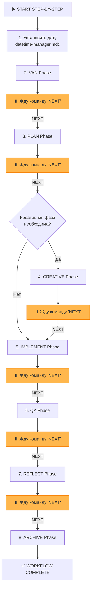

# MEMORY BANK STEP_BY_STEP MODE

> **TL;DR:** Этот режим проведет вас через полный цикл разработки пошагово. После каждой фазы я буду останавливаться и ждать вашей команды `NEXT` для перехода к следующему этапу. Этот режим полностью соблюдает `interaction-mode`.

## 🚶 ПОШАГОВЫЙ ЦИКЛ РАЗРАБОТКИ

## 🛠️ ШАГИ ВЫПОЛНЕНИЯ

### 1. Инициализация
- Я начну с вызова `initialize_system_date()` из `Core/datetime-manager.mdc`.
- Затем я выполню **VAN Phase**.

### 2. Ожидание команды
- После завершения каждой фазы я буду предоставлять отчет и останавливаться с сообщением: **"✅ [Имя фазы] Phase Complete. Type `NEXT` to proceed to the [Имя следующей фазы] phase."**

### 3. Соблюдение `interaction-mode`
- **Принципиально важно:** В этом режиме каждая фаза будет выполняться в соответствии с настройкой в `memory-bank/system/interaction-mode.txt`.
- **Если `MANUAL`**: на фазе `PLAN` я буду задавать уточняющие вопросы; на фазе `CREATIVE` я буду предлагать варианты на выбор.
- **Если `AUTO`**: я буду выполнять каждую фазу автономно, предоставляя только итоговый отчет.

### 4. Продвинутые рабочие процессы
- Как и в `UNIVERSAL` режиме, я буду автоматически включать **Integration Workflow**, **Refactoring Workflow** и другие продвинутые процессы для задач уровня L3/L4.