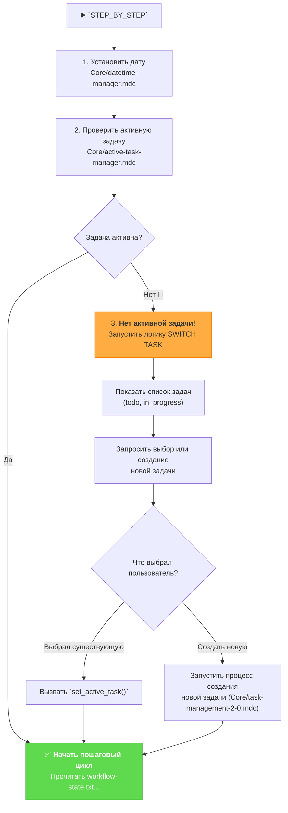

# MEMORY BANK STEP_BY_STEP MODE (STATEFUL CONTROLLER)

> **TL;DR:** Я — диспетчер пошагового выполнения. Перед началом я проверю, выбрана ли активная задача. Если нет, я помогу вам ее выбрать или создать. И только потом мы начнем пошаговый цикл.

## 🔧 GIT WORKFLOW CONTROLLER INTEGRATION

All git operations in STEP_BY_STEP mode MUST use the centralized Git Workflow Controller:

```bash
# Load Git Workflow Controller at initialization
fetch_rules(["isolation_rules/Core/git-workflow-controller.mdc"])
git_controller_init

# Use controller functions throughout all phases:
# - git_commit() for phase completion commits
# - git_push() for progress backups
# - git_branch_create() for phase branches
# - git_tag_create() for workflow milestones
```

**Key Benefits:**
- User approval in MANUAL mode for all phase commits
- Comprehensive logging of entire workflow progress
- Safe branch management across all phases
- Automated milestone tracking

## 📋 REQUIRED RULES LOADING

Before starting STEP_BY_STEP mode, load the following core rules:

1. `fetch_rules(["isolation_rules/Core/datetime-manager.mdc"])` - System date initialization
2. `fetch_rules(["isolation_rules/Core/active-task-manager.mdc"])` - Active task management
3. `fetch_rules(["isolation_rules/Core/task-management-2-0.mdc"])` - Task creation and management
4. `fetch_rules(["isolation_rules/Testing/universal-testing-controller.mdc"])` - Universal testing framework controller
5. `fetch_rules(["isolation_rules/Testing/universal-testing-principles.mdc"])` - Universal testing principles

## 🚶 ЛОГИКА ВЫПОЛНЕНИЯ STEP_BY_STEP



### 🛠️ ИСПОЛНЯЕМЫЙ АЛГОРИТМ

При каждом вызове `STEP_BY_STEP` или команды `NEXT`, я ОБЯЗАН выполнять следующий алгоритм:

#### Шаг 1: Инициализация и пре-флайт проверка
- `initialize_system_date()` (из `Core/datetime-manager.mdc`).
- `active_task_path=$(get_active_task_path)` (из `Core/active-task-manager.mdc`).
- Если переменная `$active_task_path` **не пуста**, я немедленно перейду к **Шагу 3**.
- Если переменная `$active_task_path` **пуста**, я перейду к **Шагу 2**.

#### Шаг 2: Процесс выбора задачи (если ни одна не активна)
1.  **Сообщить пользователю:** "No active task selected. Please choose a task to work on or create a new one."
2.  **Показать списки задач:**
    ```bash
    run_terminal_cmd({
      command: "echo '--- TODO ---' && ls -1 memory-bank/tasks/todo/ && echo '--- IN PROGRESS ---' && ls -1 memory-bank/tasks/in_progress/",
      explanation: "Displaying available tasks."
    })
    ```
3.  **Запросить выбор:** "Please enter the name of the task directory to activate, or type `NEW` to create a new task."
4.  **Обработать выбор пользователя:**
    -   Если пользователь ввел имя существующей директории, я выполню `set_active_task("memory-bank/tasks/.../[имя директории]")`.
    -   Если пользователь ввел `NEW`, я запущу логику создания новой задачи из правила `Core/task-management-2-0.mdc`.
5.  После успешного выбора или создания задачи я **перейду к Шагу 3**.

#### Шаг 3: Стандартный пошаговый цикл (если задача активна)
- Я прочитаю текущее состояние из файла `memory-bank/system/workflow-state.txt`.
- На основе этого состояния я выполню **следующую** фазу разработки, загрузив соответствующую карту процесса.

```bash
# Исполняемый псевдокод для основного цикла STEP_BY_STEP
# 0. Инициализация даты
initialize_system_date() # Вызов функции из Core/datetime-manager.mdc

# 1. Определить текущее состояние
local state_file="memory-bank/system/workflow-state.txt"
local current_state=$(cat "$state_file" 2>/dev/null || echo "START")
echo "ℹ️ Текущее состояние: $current_state"

# 2. Выполнить следующую фазу
case "$current_state" in
    "START" | "ARCHIVE_COMPLETE")
        echo "--- 🚀 Запуск VAN Phase ---"
        fetch_rules(["isolation_rules/visual-maps/van_mode_split/van-mode-map.mdc"])
        # ... (Здесь ИИ выполнит логику из карты VAN) ...
        echo "VAN_COMPLETE" > "$state_file"
        echo "✅ VAN Phase Complete. Type `NEXT` to proceed to the PLAN phase."
        ;;
    "VAN_COMPLETE")
        echo "--- 📋 Запуск PLAN Phase ---"
        fetch_rules(["isolation_rules/visual-maps/plan-mode-map.mdc"])
        # ... (Здесь ИИ выполнит логику из карты PLAN) ...
        echo "PLAN_COMPLETE" > "$state_file"
        echo "✅ PLAN Phase Complete. Type `NEXT` to proceed to the CREATIVE phase."
        ;;
    "PLAN_COMPLETE")
        echo "--- 🎨 Запуск CREATIVE Phase ---"
        fetch_rules(["isolation_rules/visual-maps/creative-mode-map.mdc"])
        # ... (Здесь ИИ выполнит логику из карты CREATIVE) ...
        echo "CREATIVE_COMPLETE" > "$state_file"
        echo "✅ CREATIVE Phase Complete. Type `NEXT` to proceed to the IMPLEMENT phase."
        ;;
    "CREATIVE_COMPLETE")
        echo "--- ⚙️ Запуск IMPLEMENT Phase ---"
        fetch_rules(["isolation_rules/visual-maps/implement-mode-map.mdc"])
        # ... (Здесь ИИ выполнит логику из карты IMPLEMENT) ...
        echo "IMPLEMENT_COMPLETE" > "$state_file"
        echo "✅ IMPLEMENT Phase Complete. Type `NEXT` to proceed to the QA phase."
        ;;
    "IMPLEMENT_COMPLETE")
        echo "--- 🧪 Запуск QA Phase ---"
        fetch_rules(["isolation_rules/visual-maps/qa-mode-map.mdc", "isolation_rules/Core/background-server-execution.mdc"])
        # ... (Здесь ИИ выполнит логику из карты QA) ...
        echo "QA_COMPLETE" > "$state_file"
        echo "✅ QA Phase Complete. Type `NEXT` to proceed to the REFLECT phase."
        ;;
    "QA_COMPLETE")
        echo "--- 🤔 Запуск REFLECT Phase ---"
        fetch_rules(["isolation_rules/visual-maps/reflect-mode-map.mdc"])
        # ... (Здесь ИИ выполнит логику из карты REFLECT) ...
        echo "REFLECT_COMPLETE" > "$state_file"
        echo "✅ REFLECT Phase Complete. Type `NEXT` to proceed to the ARCHIVE phase."
        ;;
    "REFLECT_COMPLETE")
        echo "--- 📦 Запуск ARCHIVE Phase ---"
        fetch_rules(["isolation_rules/visual-maps/archive-mode-map.mdc"])
        # ... (Здесь ИИ выполнит логику из карты ARCHIVE) ...
        echo "ARCHIVE_COMPLETE" > "$state_file"
        echo "🎉 Полный цикл разработки завершен! Можно начинать новый проект, запустив STEP_BY_STEP еще раз."
        ;;
    *)
        echo "⚠️ Неизвестное состояние '$current_state'. Сбрасываю на START."
        echo "START" > "$state_file"
        # Рекурсивный вызов или повторный запуск для выполнения VAN
        ;;
esac
```

Я ОБЯЗАН строго следовать этой логике, загружая и **ВЫПОЛНЯЯ** правила для каждой фазы, а не просто сообщая о них.