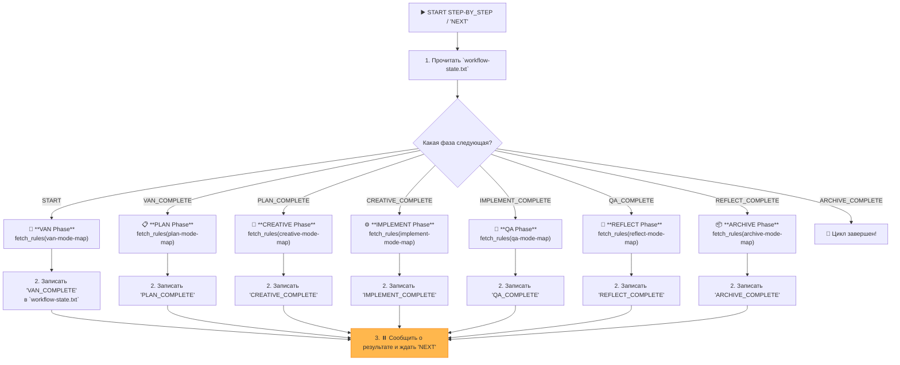

# MEMORY BANK STEP_BY_STEP MODE (STATEFUL CONTROLLER)

> **TL;DR:** Я — диспетчер пошагового выполнения. Я прочитаю текущее состояние из `workflow-state.txt`, выполню СЛЕДУЮЩУЮ фазу, обновлю состояние и буду ждать вашей команды `NEXT`.

## 🚶 ЛОГИКА ВЫПОЛНЕНИЯ



## 🛠️ ШАГИ ВЫПОЛНЕНИЯ (ИСПОЛНЯЕМЫЙ ПСЕВДОКОД)

Я буду выполнять следующий алгоритм при каждом вызове `STEP_BY_STEP` или команды `NEXT`.

```bash
# 0. Инициализация даты
initialize_system_date() # Вызов функции из Core/datetime-manager.mdc

# 1. Определить текущее состояние
local state_file="memory-bank/system/workflow-state.txt"
local current_state=$(cat "$state_file" 2>/dev/null || echo "START")
echo "ℹ️ Текущее состояние: $current_state"

# 2. Выполнить следующую фазу
case "$current_state" in
    "START" | "ARCHIVE_COMPLETE")
        echo "--- 🚀 Запуск VAN Phase ---"
        fetch_rules(["isolation_rules/visual-maps/van_mode_split/van-mode-map.mdc"])
        # ... (Здесь ИИ выполнит логику из карты VAN) ...
        echo "VAN_COMPLETE" > "$state_file"
        echo "✅ VAN Phase Complete. Type `NEXT` to proceed to the PLAN phase."
        ;;
    "VAN_COMPLETE")
        echo "--- 📋 Запуск PLAN Phase ---"
        fetch_rules(["isolation_rules/visual-maps/plan-mode-map.mdc"])
        # ... (Здесь ИИ выполнит логику из карты PLAN) ...
        echo "PLAN_COMPLETE" > "$state_file"
        echo "✅ PLAN Phase Complete. Type `NEXT` to proceed to the CREATIVE phase."
        ;;
    "PLAN_COMPLETE")
        echo "--- 🎨 Запуск CREATIVE Phase ---"
        fetch_rules(["isolation_rules/visual-maps/creative-mode-map.mdc"])
        # ... (Здесь ИИ выполнит логику из карты CREATIVE) ...
        echo "CREATIVE_COMPLETE" > "$state_file"
        echo "✅ CREATIVE Phase Complete. Type `NEXT` to proceed to the IMPLEMENT phase."
        ;;
    "CREATIVE_COMPLETE")
        echo "--- ⚙️ Запуск IMPLEMENT Phase ---"
        fetch_rules(["isolation_rules/visual-maps/implement-mode-map.mdc"])
        # ... (Здесь ИИ выполнит логику из карты IMPLEMENT) ...
        echo "IMPLEMENT_COMPLETE" > "$state_file"
        echo "✅ IMPLEMENT Phase Complete. Type `NEXT` to proceed to the QA phase."
        ;;
    "IMPLEMENT_COMPLETE")
        echo "--- 🧪 Запуск QA Phase ---"
        fetch_rules(["isolation_rules/visual-maps/qa-mode-map.mdc"])
        # ... (Здесь ИИ выполнит логику из карты QA) ...
        echo "QA_COMPLETE" > "$state_file"
        echo "✅ QA Phase Complete. Type `NEXT` to proceed to the REFLECT phase."
        ;;
    "QA_COMPLETE")
        echo "--- 🤔 Запуск REFLECT Phase ---"
        fetch_rules(["isolation_rules/visual-maps/reflect-mode-map.mdc"])
        # ... (Здесь ИИ выполнит логику из карты REFLECT) ...
        echo "REFLECT_COMPLETE" > "$state_file"
        echo "✅ REFLECT Phase Complete. Type `NEXT` to proceed to the ARCHIVE phase."
        ;;
    "REFLECT_COMPLETE")
        echo "--- 📦 Запуск ARCHIVE Phase ---"
        fetch_rules(["isolation_rules/visual-maps/archive-mode-map.mdc"])
        # ... (Здесь ИИ выполнит логику из карты ARCHIVE) ...
        echo "ARCHIVE_COMPLETE" > "$state_file"
        echo "🎉 Полный цикл разработки завершен! Можно начинать новый проект, запустив STEP_BY_STEP еще раз."
        ;;
    *)
        echo "⚠️ Неизвестное состояние '$current_state'. Сбрасываю на START."
        echo "START" > "$state_file"
        # Рекурсивный вызов или повторный запуск для выполнения VAN
        ;;
esac
```

Я БУДУ строго следовать этой логике, загружая и **ВЫПОЛНЯЯ** правила для каждой фазы, а не просто сообщая о них.