# MEMORY BANK UNIVERSAL MODE (ENHANCED AUTOPILOT)

> **TL;DR:** Этот режим выполняет полный цикл разработки. Перед запуском я проверю, выбрана ли активная задача. Если нет, я помогу вам ее выбрать или создать.

## 🚶 ЛОГИКА ВЫПОЛНЕНИЯ UNIVERSAL

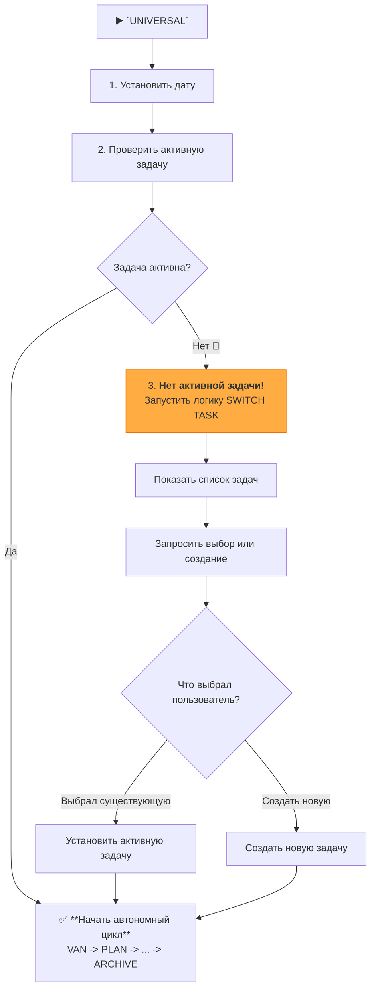

### 🛠️ ИСПОЛНЯЕМЫЕ ШАГИ

#### Шаг 1: Инициализация и проверка активной задачи
- `initialize_system_date()`
- `active_task_path=$(get_active_task_path)`
- Если `$active_task_path` **не пуст**, переходим к **Шагу 3**.
- Если `$active_task_path` **пуст**, переходим к **Шагу 2**.

#### Шаг 2: Процесс выбора задачи (если ни одна не активна)
1.  **Сообщить пользователю:** "No active task selected. Please choose a task to work on or create a new one."
2.  **Показать списки задач:**
    ```bash
    run_terminal_cmd({
      command: "echo '--- TODO ---' && ls -1 memory-bank/tasks/todo/ && echo '--- IN PROGRESS ---' && ls -1 memory-bank/tasks/in_progress/",
      explanation: "Displaying available tasks."
    })
    ```
3.  **Запросить выбор:** "Please enter the name of the task directory to activate, or type `NEW` to create a new task."
4.  **Обработать выбор пользователя:**
    -   Если пользователь ввел имя директории, выполнить `set_active_task("memory-bank/tasks/in_progress/[имя директории]")` (или `todo`).
    -   Если пользователь ввел `NEW`, запустить логику создания новой задачи из правила `Core/task-management-2-0.mdc`.
5.  **Перейти к Шагу 3.**

#### Шаг 3: Стандартный UNIVERSAL-поток
- После того как задача выбрана, начинается основной автономный цикл, который мы уже проектировали:
- **VAN**: Загрузить `van-mode-map.mdc`...
- **PLAN**: Загрузить `plan-mode-map.mdc`...
- ... (и так далее)

## 🚀 ПОЛНЫЙ АВТОНОМНЫЙ ЦИКЛ

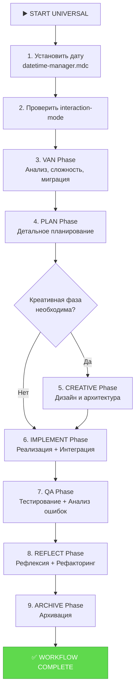

## 🛠️ ШАГИ ВЫПОЛНЕНИЯ

### 1. Инициализация
- Выполнить `initialize_system_date()` из `Core/datetime-manager.mdc`.
- Проверить `interaction-mode.txt`. Если `MANUAL`, вывести предупреждение: "UNIVERSAL mode is running, but you are in MANUAL interaction mode. I will proceed autonomously. To switch, set interaction mode to AUTO."

### 2. Последовательный вызов режимов
Я буду последовательно загружать и выполнять логику из каждой соответствующей карты процесса (`*-mode-map.mdc`), автоматически переходя к следующей фазе после успешного завершения предыдущей.

- **VAN**: Загрузить `van-mode-map.mdc`, выполнить полный анализ, включая определение сложности (L1-L4) и миграцию задач.
- **PLAN**: Загрузить `plan-mode-map.mdc`, создать детальный план.
- **CREATIVE (условно)**: Если план содержит задачи, требующие креатива, загрузить `creative-mode-map.mdc`.
- **IMPLEMENT**: Загрузить `implement-mode-map.mdc`, выполнить реализацию. **Включить вызов `Integration Workflow` для задач L3/L4.**
- **QA**: Загрузить `qa-mode-map.mdc`, выполнить тесты. **Включить вызов `Failure Pattern Analysis` при сбоях.**
- **REFLECT**: Загрузить `reflect-mode-map.mdc`. **Включить вызов `Refactoring Workflow` и `Advanced Reporting` для задач L3/L4.**
- **ARCHIVE**: Загрузить `archive-mode-map.mdc`, завершить цикл.

Я буду предоставлять краткие отчеты о завершении каждой фазы перед переходом к следующей.

```mermaid
graph TD
    Start["🚀 START UNIVERSAL MODE"] --> LoadCore["📚 Load Core Rules<br>.cursor/rules/isolation_rules/Core/universal-mode-integration.mdc"]
    LoadCore --> LoadWebSearch["🌐 Load Web Search<br>.cursor/rules/isolation_rules/Core/web-search-integration.mdc"]
    LoadWebSearch --> InitVAN["🔍 INITIALIZE VAN PHASE<br>Analysis & Problem Identification"]

    %% VAN Phase
    InitVAN --> VANAnalysis["📊 VAN: Project Analysis"]
    VANAnalysis --> VANComplexity["🧩 VAN: Complexity Determination"]
    VANComplexity --> VANMigration["🔄 VAN: Migration Processing"]
    VANMigration --> VANComplete["✅ VAN Phase Complete"]

    %% Automatic Transition to PLAN
    VANComplete --> AutoPLAN["⚡ AUTO TRANSITION<br>VAN → PLAN"]
    AutoPLAN --> InitPLAN["📋 INITIALIZE PLAN PHASE<br>Implementation Planning"]

    %% PLAN Phase
    InitPLAN --> PLANStrategy["🎯 PLAN: Strategy Development"]
    PLANStrategy --> PLANComponents["🧩 PLAN: Component Analysis"]
    PLANComponents --> PLANDecision{"🤔 Creative Phase<br>Required?"}
    PLANDecision -->|"Yes"| PLANFlagCreative["🎨 PLAN: Flag Components<br>for Creative Phase"]
    PLANDecision -->|"No"| PLANComplete["✅ PLAN Phase Complete"]
    PLANFlagCreative --> PLANComplete

    %% Automatic Transition to CREATIVE (if needed)
    PLANComplete --> CreativeCheck{"🎨 Creative<br>Components<br>Flagged?"}
    CreativeCheck -->|"Yes"| AutoCREATIVE["⚡ AUTO TRANSITION<br>PLAN → CREATIVE"]
    CreativeCheck -->|"No"| AutoIMPLEMENT["⚡ AUTO TRANSITION<br>PLAN → IMPLEMENT"]

    %% CREATIVE Phase
    AutoCREATIVE --> InitCREATIVE["🎨 INITIALIZE CREATIVE PHASE<br>Design & Architecture"]
    InitCREATIVE --> CREATIVEDesign["🏗️ CREATIVE: Design Options"]
    CREATIVEDesign --> CREATIVEAnalysis["⚖️ CREATIVE: Options Analysis"]
    CREATIVEAnalysis --> CREATIVESelect["✅ CREATIVE: Selection & Guidelines"]
    CREATIVESelect --> CREATIVEComplete["✅ CREATIVE Phase Complete"]

    %% Automatic Transition to IMPLEMENT
    CREATIVEComplete --> AutoIMPLEMENT
    AutoIMPLEMENT --> InitIMPLEMENT["⚒️ INITIALIZE IMPLEMENT PHASE<br>Code Implementation"]

    %% IMPLEMENT Phase
    InitIMPLEMENT --> IMPLEMENTBuild["🔨 IMPLEMENT: Build Changes"]
    IMPLEMENTBuild --> IMPLEMENTTest["✅ IMPLEMENT: Testing"]
    IMPLEMENTTest --> IMPLEMENTVerify["🔍 IMPLEMENT: Verification"]
    IMPLEMENTVerify --> IMPLEMENTComplete["✅ IMPLEMENT Phase Complete"]

    %% QA Integration Check
    IMPLEMENTComplete --> QACheck{"🧪 QA Required?"}
    QACheck -->|"Yes"| AutoQA["⚡ AUTO TRANSITION<br>IMPLEMENT → QA"]
    QACheck -->|"No"| AutoREFLECT["⚡ AUTO TRANSITION<br>IMPLEMENT → REFLECT"]

    %% QA Phase (Optional)
    AutoQA --> InitQA["🧪 INITIALIZE QA PHASE<br>Quality Assurance"]
    InitQA --> QATesting["🔬 QA: Comprehensive Testing"]
    QATesting --> QAValidation["✅ QA: Validation & Reports"]
    QAValidation --> QAComplete["✅ QA Phase Complete"]
    QAComplete --> AutoREFLECT

    %% Automatic Transition to REFLECT
    AutoREFLECT --> InitREFLECT["🤔 INITIALIZE REFLECT PHASE<br>Analysis & Learning"]

    %% REFLECT Phase
    InitREFLECT --> REFLECTAnalysis["📊 REFLECT: Implementation Analysis"]
    REFLECTAnalysis --> REFLECTLearnings["📚 REFLECT: Document Learnings"]
    REFLECTLearnings --> REFLECTImprovements["💡 REFLECT: Identify Improvements"]
    REFLECTImprovements --> REFLECTComplete["✅ REFLECT Phase Complete"]

    %% Automatic Transition to ARCHIVE
    REFLECTComplete --> AutoARCHIVE["⚡ AUTO TRANSITION<br>REFLECT → ARCHIVE"]
    AutoARCHIVE --> InitARCHIVE["📦 INITIALIZE ARCHIVE PHASE<br>Documentation & Storage"]

    %% ARCHIVE Phase
    InitARCHIVE --> ARCHIVEDocument["📝 ARCHIVE: Document Workflow"]
    ARCHIVEDocument --> ARCHIVEStore["💾 ARCHIVE: Store Artifacts"]
    ARCHIVEStore --> ARCHIVECleanup["🧹 ARCHIVE: Cleanup & Organization"]
    ARCHIVECleanup --> UniversalComplete["🎉 UNIVERSAL WORKFLOW<br>COMPLETE"]

    %% Web Search Integration (Available Throughout)
    VANAnalysis & PLANStrategy & CREATIVEDesign & IMPLEMENTBuild & QATesting & REFLECTAnalysis --> WebSearch["🌐 Web Search Integration<br>Available Throughout Workflow"]
    WebSearch --> ResearchSupport["🔍 Research Support<br>Error Resolution & Feature Discovery"]

    %% QA Interrupt System
    Start -.-> QAInterrupt["⚠️ QA INTERRUPT SYSTEM<br>Handle User Questions<br>During Workflow"]
    QAInterrupt -.-> ContinueWorkflow["🔄 Resume Workflow<br>After QA Resolution"]

    %% Styling
    style Start fill:#6c5ce7,stroke:#5f3dc4,color:white
    style LoadCore fill:#a29bfe,stroke:#6c5ce7,color:white
    style LoadWebSearch fill:#00b894,stroke:#00a085,color:white
    style AutoPLAN fill:#fdcb6e,stroke:#e17055,color:white
    style AutoCREATIVE fill:#fd79a8,stroke:#e84393,color:white
    style AutoIMPLEMENT fill:#55a3ff,stroke:#0984e3,color:white
    style AutoQA fill:#ff6b6b,stroke:#d63031,color:white
    style AutoREFLECT fill:#00cec9,stroke:#00b894,color:white
    style AutoARCHIVE fill:#a29bfe,stroke:#6c5ce7,color:white
    style UniversalComplete fill:#00b894,stroke:#00a085,color:white
    style WebSearch fill:#00b894,stroke:#00a085,color:white
    style QAInterrupt fill:#ff7675,stroke:#d63031,color:white
```

## IMPLEMENTATION STEPS

### Step 1: READ UNIVERSAL MODE CORE RULES
```
read_file({
  target_file: ".cursor/rules/isolation_rules/Core/universal-mode-integration.mdc",
  should_read_entire_file: true
})

read_file({
  target_file: ".cursor/rules/isolation_rules/Core/web-search-integration.mdc",
  should_read_entire_file: true
})

read_file({
  target_file: ".cursor/rules/isolation_rules/Core/qa-interrupt-system.mdc",
  should_read_entire_file: true
})
```

### Step 2: READ CURRENT STATE & TASKS
```
read_file({
  target_file: "tasks.md",
  should_read_entire_file: true
})

read_file({
  target_file: "memory-bank/activeContext.md",
  should_read_entire_file: true
})

read_file({
  target_file: "progress.md",
  should_read_entire_file: true
})

read_file({
  target_file: "memory-bank/system/current-context.md",
  should_read_entire_file: true
})
```

### Step 2.6: Context Management for UNIVERSAL Mode
**IMPORTANT**: Initialize or restore context for UNIVERSAL mode:

```
edit_file({
  target_file: "memory-bank/system/current-context.md",
  instructions: "Initializing context for UNIVERSAL mode - full workflow",
  code_edit: `# CURRENT CONTEXT STATE

**Последнее обновление**: [CURRENT_DATE]
**Статус**: ACTIVE

## 🎯 ТЕКУЩИЙ ЗАПРОС ПОЛЬЗОВАТЕЛЯ
\`\`\`
[FULL_USER_REQUEST_TEXT]
\`\`\`

## 🔧 ТЕКУЩИЙ РЕЖИМ РАБОТЫ
**Активный режим**: UNIVERSAL
**Фаза**: [VAN|PLAN|CREATIVE|IMPLEMENT|QA|REFLECT|ARCHIVE]
**Уровень сложности**: [TO_BE_DETERMINED]

## 📋 КОНТЕКСТ ЗАДАЧИ
**Задача**: [TASK_DESCRIPTION]
**Приоритет**: [HIGH|MEDIUM|LOW]
**Статус**: IN_PROGRESS

### Описание:
[DETAILED_UNIVERSAL_CONTEXT]

### Workflow Progress:
- [ ] 🚀 VAN: Problem Analysis
- [ ] 📋 PLAN: Strategic Planning
- [ ] 🎨 CREATIVE: Design & Architecture (if needed)
- [ ] ⚙️ IMPLEMENT: Build & Development
- [ ] 🧪 QA: Quality Assurance
- [ ] 🤔 REFLECT: Review & Learning
- [ ] 📦 ARCHIVE: Knowledge Storage

### Current Phase Progress:
- [x] Инициализация UNIVERSAL режима
- [ ] [Phase-specific steps will be updated by each mode]

## 📋 ПРАВИЛА ПРОЕКТА
[СПИСОК_НАЙДЕННЫХ_ПРАВИЛ_ИЗ_RULES_ДИРЕКТОРИИ]

## 📝 НАЙДЕННЫЕ ЗАДАЧИ
### TODO/FIXME из документации:
[СПИСОК_TODO_ЗАДАЧ_С_ФАЙЛАМИ_И_СТРОКАМИ]

### Незавершенные чекбоксы:
[СПИСОК_НЕЗАВЕРШЕННЫХ_ЧЕКБОКСОВ]

## 🗂️ ФАЙЛЫ В РАБОТЕ
- memory-bank/system/current-context.md
- memory-bank/tasks.md
- [files-will-be-added-by-each-phase]

## 📊 МЕТРИКИ СЕССИИ
**Время начала**: [CURRENT_DATE]
**Команды выполнено**: 0
**Файлов изменено**: 1
**Статус сессии**: ACTIVE
**Автоматические переходы**: 0`
})
```

### Step 2.7: Context Update During Phase Transitions
**IMPORTANT**: Update context when transitioning between phases:

```
# During each phase transition, update the context:
edit_file({
  target_file: "memory-bank/system/current-context.md",
  instructions: "Updating context for phase transition in UNIVERSAL mode",
  code_edit: `[Update the current phase, progress checklist, and metrics]`
})
```

### Step 3: LOAD MODE-SPECIFIC REFERENCES
```
read_file({
  target_file: ".cursor/rules/isolation_rules/visual-maps/van-mode-map.mdc",
  should_read_entire_file: true
})

read_file({
  target_file: ".cursor/rules/isolation_rules/visual-maps/plan-mode-map.mdc",
  should_read_entire_file: true
})

read_file({
  target_file: ".cursor/rules/isolation_rules/visual-maps/creative-mode-map.mdc",
  should_read_entire_file: true
})

read_file({
  target_file: ".cursor/rules/isolation_rules/visual-maps/implement-mode-map.mdc",
  should_read_entire_file: true
})
```

## UNIVERSAL WORKFLOW APPROACH

Execute a complete end-to-end workflow with automatic transitions between all phases. Each phase should complete its objectives and automatically trigger the next phase without user intervention.

### 🌐 Web Search Integration Throughout Workflow
Universal mode has continuous web search capabilities:
- **VAN Phase**: `@web analyze: [problem]` - Research during analysis
- **PLAN Phase**: `@web research: [technology]` - Research during planning
- **CREATIVE Phase**: `@web design: [pattern]` - Research design patterns
- **IMPLEMENT Phase**: `@web solve: [issue]` - Resolve implementation issues
- **QA Phase**: `@web test: [approach]` - Research testing strategies
- **REFLECT Phase**: `@web improve: [area]` - Research improvements

### Phase 1: VAN - Analysis & Problem Identification

Start with comprehensive analysis of the current state, determine complexity level, and process any migrated tasks.

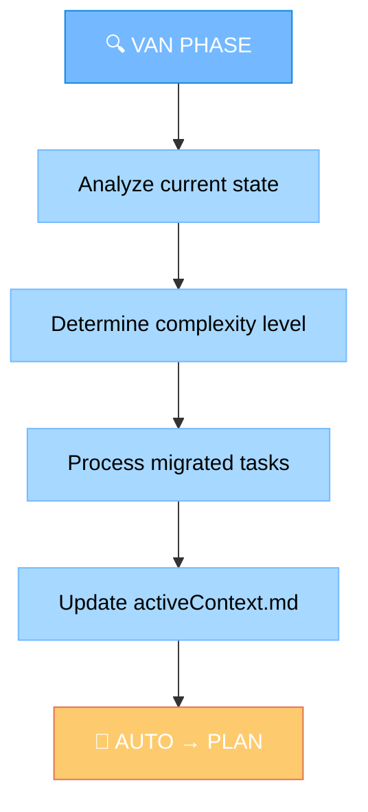

### Phase 2: PLAN - Implementation Planning

Develop comprehensive implementation strategy and determine if creative phases are needed.

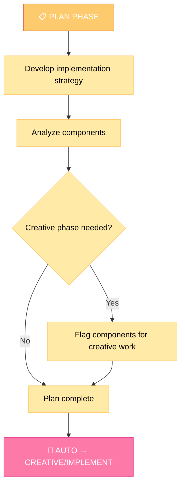

### Phase 3: CREATIVE - Design & Architecture (Optional)

Generate multiple design options, analyze pros/cons, and provide implementation guidelines.

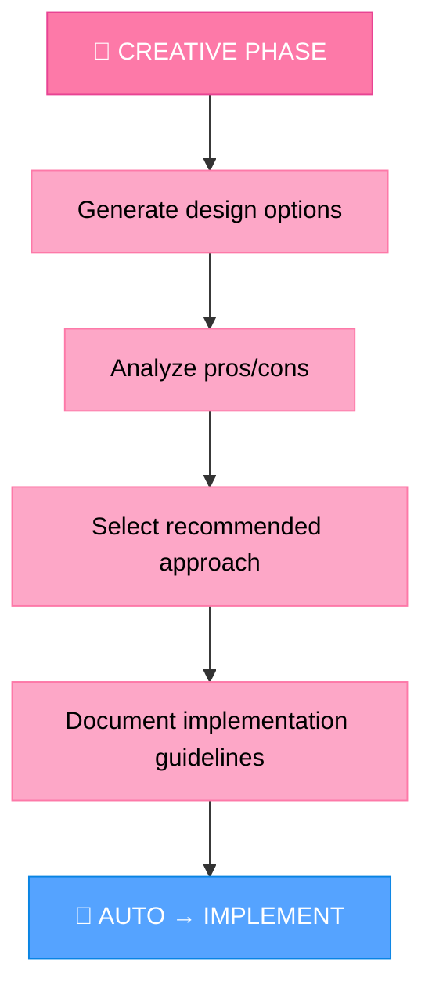

### Phase 4: IMPLEMENT - Code Implementation

Build the planned changes following creative phase decisions if applicable.

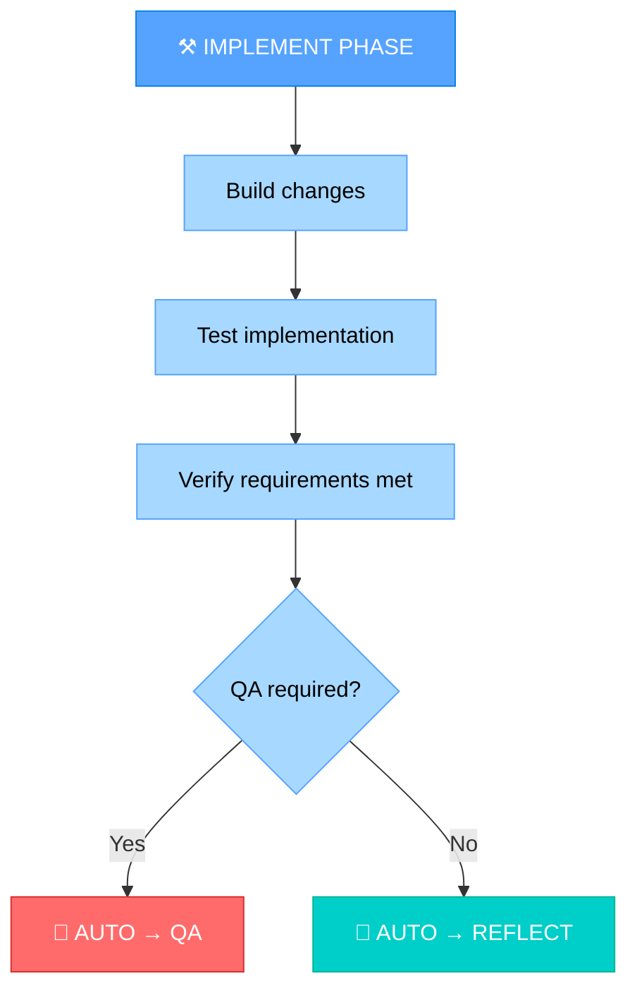

### Phase 5: QA - Quality Assurance (Optional)

Perform comprehensive testing based on complexity level.

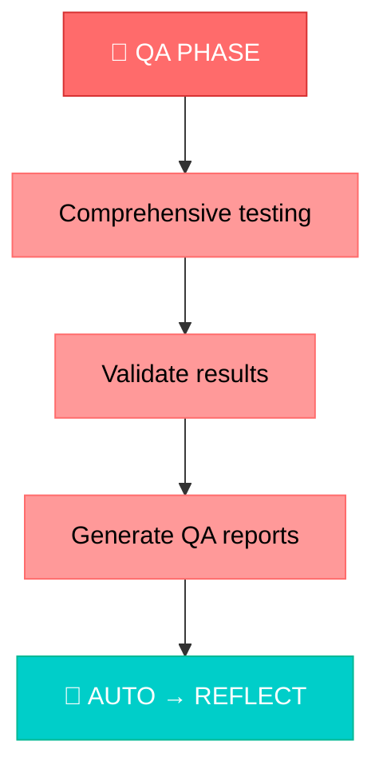

### Phase 6: REFLECT - Analysis & Learning

Analyze the implementation, document learnings, and identify improvements.

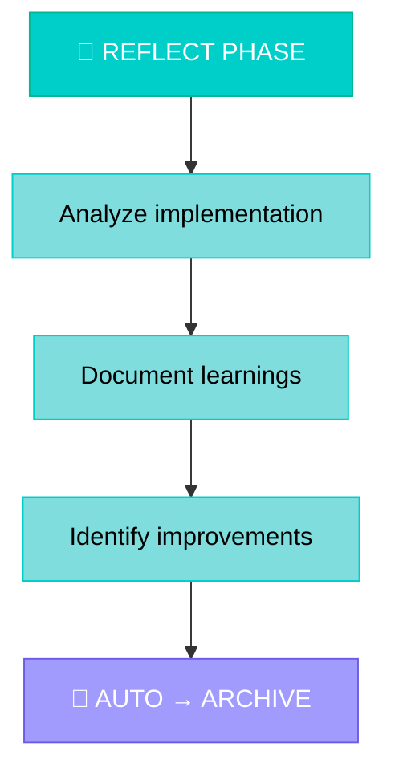

### Phase 7: ARCHIVE - Documentation & Storage

Document the complete workflow and store all artifacts.

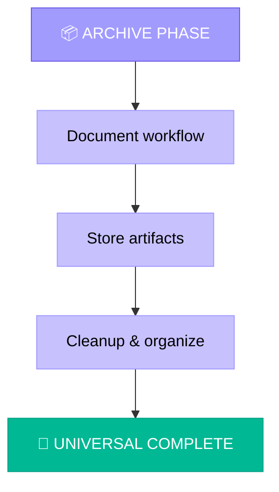

## QA INTERRUPT SYSTEM

Universal mode includes a QA interrupt system to handle user questions during the workflow without breaking the automation.

### QA Interrupt Handling
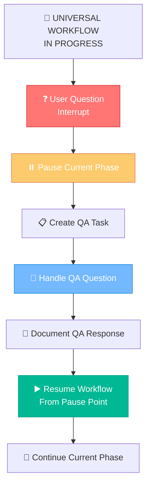

## AUTOMATIC TRANSITION LOGIC

### Transition Triggers
1. **VAN → PLAN**: When analysis is complete and activeContext.md is updated
2. **PLAN → CREATIVE**: When components are flagged for creative work
3. **PLAN → IMPLEMENT**: When no creative phases are needed
4. **CREATIVE → IMPLEMENT**: When all creative phases are complete
5. **IMPLEMENT → QA**: When implementation is complete and QA is required
6. **IMPLEMENT → REFLECT**: When implementation is complete and QA is not required
7. **QA → REFLECT**: When QA testing is complete
8. **REFLECT → ARCHIVE**: When reflection analysis is complete
9. **ARCHIVE → COMPLETE**: When all artifacts are stored and organized

### Transition Documentation
Each transition should be clearly documented:
```markdown
🔄 **AUTOMATIC TRANSITION**: [FROM] → [TO]
- **Trigger**: [What triggered the transition]
- **Status**: [Current phase completion status]
- **Next Phase**: [What will happen in next phase]
- **Context**: [Any relevant context for next phase]
```

## VERIFICATION

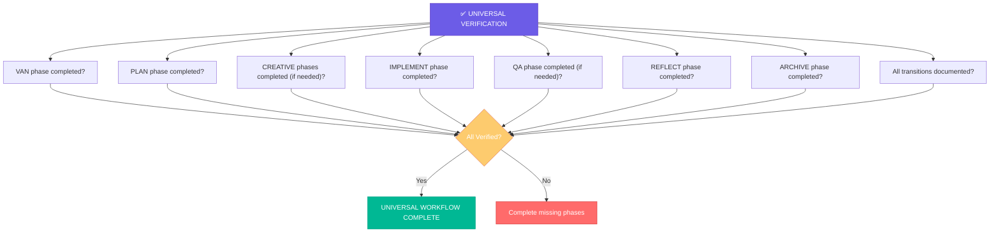

Before completing the Universal workflow, verify that all phases have been executed, transitions have been documented, and the complete end-to-end process has been successful. The Universal mode should provide a seamless, automated experience from initial analysis to final archival.