# MEMORY BANK UNIVERSAL MODE (ENHANCED AUTOPILOT)

> **TL;DR:** Этот режим выполняет полный цикл разработки. Перед запуском я проверю, выбрана ли активная задача. Если нет, я помогу вам ее выбрать или создать.

## 🔧 GIT WORKFLOW CONTROLLER INTEGRATION

All git operations in UNIVERSAL mode MUST use the centralized Git Workflow Controller:

```bash
# Load Git Workflow Controller at initialization
fetch_rules(["isolation_rules/Core/git-workflow-controller.mdc"])
git_controller_init

# All phases will use controller functions:
# - git_commit() for phase completions
# - git_push() for backups
# - git_branch_create() for feature branches
```

**Key Benefits:**
- User approval in MANUAL mode
- Comprehensive logging of all git operations
- Consistent error handling across all phases
- Force operation protection

## 🚶 ЛОГИКА ВЫПОЛНЕНИЯ UNIVERSAL

```mermaid
graph TD
    Start["▶️ `UNIVERSAL`"] --> InitDate["1. Установить дату"]
    InitDate --> GetActiveTask["2. Проверить активную задачу"]

    GetActiveTask --> IsTaskActive{"Задача активна?"}

    IsTaskActive -- "Да" --> UNIVERSAL_Flow["✅ **Начать автономный цикл**<br>VAN -> PLAN -> ... -> ARCHIVE"]

    IsTaskActive -- "Нет 🔴" --> NoTaskFlow["3. <b>Нет активной задачи!</b><br>Запустить логику SWITCH TASK"]
    NoTaskFlow --> ListTasks["Показать список задач"]
    ListTasks --> UserPrompt["Запросить выбор или создание"]
    UserPrompt --> UserChoice{"Что выбрал пользователь?"}

    UserChoice -- "Выбрал существующую" --> SetTask["Установить активную задачу"]
    UserChoice -- "Создать новую" --> CreateTask["Создать новую задачу"]

    SetTask --> UNIVERSAL_Flow
    CreateTask --> UNIVERSAL_Flow

    style NoTaskFlow fill:#ffad42,stroke:#f57c00
```

### 🛠️ ИСПОЛНЯЕМЫЕ ШАГИ

#### Шаг 1: Инициализация и проверка активной задачи
- `initialize_system_date()`
- `active_task_path=$(get_active_task_path)`
- Если `$active_task_path` **не пуст**, переходим к **Шагу 3**.
- Если `$active_task_path` **пуст**, переходим к **Шагу 2**.

#### Шаг 2: Процесс выбора задачи (если ни одна не активна)
1.  **Сообщить пользователю:** "No active task selected. Please choose a task to work on or create a new one."
2.  **Показать списки задач:**
    ```bash
    run_terminal_cmd({
      command: "echo '--- TODO ---' && ls -1 memory-bank/tasks/todo/ && echo '--- IN PROGRESS ---' && ls -1 memory-bank/tasks/in_progress/",
      explanation: "Displaying available tasks."
    })
    ```
3.  **Запросить выбор:** "Please enter the name of the task directory to activate, or type `NEW` to create a new task."
4.  **Обработать выбор пользователя:**
    -   Если пользователь ввел имя директории, выполнить `set_active_task("memory-bank/tasks/in_progress/[имя директории]")` (или `todo`).
    -   Если пользователь ввел `NEW`, запустить логику создания новой задачи из правила `Core/task-management-2-0.mdc`.
5.  **Перейти к Шагу 3.**

#### Шаг 3: Стандартный UNIVERSAL-поток
- После того как задача выбрана, начинается основной автономный цикл, который мы уже проектировали:
- **VAN**: Загрузить `van-mode-map.mdc`...
- **PLAN**: Загрузить `plan-mode-map.mdc`...
- ... (и так далее)

## 🚀 ПОЛНЫЙ АВТОНОМНЫЙ ЦИКЛ

```mermaid
graph TD
    Start["▶️ START UNIVERSAL"] --> SetDate["1. Установить дату<br>datetime-manager.mdc"]
    SetDate --> CheckInteractionMode["2. Проверить interaction-mode"]
    CheckInteractionMode --> VAN["3. VAN Phase<br>Анализ, сложность, миграция"]

    VAN --> PLAN["4. PLAN Phase<br>Детальное планирование"]
    PLAN --> CreativeCheck{"Креативная фаза<br>необходима?"}

    CreativeCheck -- "Да" --> CREATIVE["5. CREATIVE Phase<br>Дизайн и архитектура"]
    CreativeCheck -- "Нет" --> IMPLEMENT

    CREATIVE --> IMPLEMENT["6. IMPLEMENT Phase<br>Реализация + Интеграция"]
    IMPLEMENT --> QA["7. QA Phase<br>Тестирование + Анализ ошибок"]
    QA --> REFLECT["8. REFLECT Phase<br>Рефлексия + Рефакторинг"]
    REFLECT --> ARCHIVE["9. ARCHIVE Phase<br>Архивация"]
    ARCHIVE --> Done["✅ WORKFLOW COMPLETE"]

    style Done fill:#5fd94d,stroke:#3da336,color:white
```

## 🛠️ ШАГИ ВЫПОЛНЕНИЯ

### 1. Инициализация
- Выполнить `initialize_system_date()` из `Core/datetime-manager.mdc`.
- Загрузить универсальную систему тестирования: `fetch_rules(["isolation_rules/Testing/universal-testing-controller.mdc", "isolation_rules/Testing/universal-testing-principles.mdc"])`
- Проверить `interaction-mode.txt`. Если `MANUAL`, вывести предупреждение: "UNIVERSAL mode is running, but you are in MANUAL interaction mode. I will proceed autonomously. To switch, set interaction mode to AUTO."

### 2. Последовательный вызов режимов
Я ОБЯЗАН последовательно загружать и выполнять логику из каждой соответствующей карты процесса (`*-mode-map.mdc`), автоматически переходя к следующей фазе после успешного завершения предыдущей.

- **VAN**: Загрузить `van-mode-map.mdc`, выполнить полный анализ, включая определение сложности (L1-L4) и миграцию задач.
- **PLAN**: Загрузить `plan-mode-map.mdc`, создать детальный план.
- **CREATIVE (условно)**: Если план содержит задачи, требующие креатива, загрузить `creative-mode-map.mdc`.
- **IMPLEMENT**: Загрузить `implement-mode-map.mdc`, выполнить реализацию. **Включить вызов `Integration Workflow` для задач L3/L4.**
- **QA**: Загрузить `qa-mode-map.mdc`, выполнить тесты. **Включить вызов `Failure Pattern Analysis` при сбоях.**
- **REFLECT**: Загрузить `reflect-mode-map.mdc`. **Включить вызов `Refactoring Workflow` и `Advanced Reporting` для задач L3/L4.**
- **ARCHIVE**: Загрузить `archive-mode-map.mdc`, завершить цикл.

Я ОБЯЗАН предоставлять краткие отчеты о завершении каждой фазы перед переходом к следующей.

```mermaid
graph TD
    Start["🚀 START UNIVERSAL MODE"] --> LoadCore["📚 Load Core Rules<br>fetch_rules([universal-mode-integration.mdc])"]
LoadCore --> LoadWebSearch["🌐 Load Web Search<br>fetch_rules([web-search-integration.mdc])"]
    LoadWebSearch --> InitVAN["🔍 INITIALIZE VAN PHASE<br>Analysis & Problem Identification"]

    %% VAN Phase
    InitVAN --> VANAnalysis["📊 VAN: Project Analysis"]
    VANAnalysis --> VANComplexity["🧩 VAN: Complexity Determination"]
    VANComplexity --> VANMigration["🔄 VAN: Migration Processing"]
    VANMigration --> VANComplete["✅ VAN Phase Complete"]

    %% Automatic Transition to PLAN
    VANComplete --> AutoPLAN["⚡ AUTO TRANSITION<br>VAN → PLAN"]
    AutoPLAN --> InitPLAN["📋 INITIALIZE PLAN PHASE<br>Implementation Planning"]

    %% PLAN Phase
    InitPLAN --> PLANStrategy["🎯 PLAN: Strategy Development"]
    PLANStrategy --> PLANComponents["🧩 PLAN: Component Analysis"]
    PLANComponents --> PLANDecision{"🤔 Creative Phase<br>Required?"}
    PLANDecision -->|"Yes"| PLANFlagCreative["🎨 PLAN: Flag Components<br>for Creative Phase"]
    PLANDecision -->|"No"| PLANComplete["✅ PLAN Phase Complete"]
    PLANFlagCreative --> PLANComplete

    %% Automatic Transition to CREATIVE (if needed)
    PLANComplete --> CreativeCheck{"🎨 Creative<br>Components<br>Flagged?"}
    CreativeCheck -->|"Yes"| AutoCREATIVE["⚡ AUTO TRANSITION<br>PLAN → CREATIVE"]
    CreativeCheck -->|"No"| AutoIMPLEMENT["⚡ AUTO TRANSITION<br>PLAN → IMPLEMENT"]

    %% CREATIVE Phase
    AutoCREATIVE --> InitCREATIVE["🎨 INITIALIZE CREATIVE PHASE<br>Design & Architecture"]
    InitCREATIVE --> CREATIVEDesign["🏗️ CREATIVE: Design Options"]
    CREATIVEDesign --> CREATIVEAnalysis["⚖️ CREATIVE: Options Analysis"]
    CREATIVEAnalysis --> CREATIVESelect["✅ CREATIVE: Selection & Guidelines"]
    CREATIVESelect --> CREATIVEComplete["✅ CREATIVE Phase Complete"]

    %% Automatic Transition to IMPLEMENT
    CREATIVEComplete --> AutoIMPLEMENT
    AutoIMPLEMENT --> InitIMPLEMENT["⚒️ INITIALIZE IMPLEMENT PHASE<br>Code Implementation"]

    %% IMPLEMENT Phase
    InitIMPLEMENT --> IMPLEMENTBuild["🔨 IMPLEMENT: Build Changes"]
    IMPLEMENTBuild --> IMPLEMENTTest["✅ IMPLEMENT: Testing"]
    IMPLEMENTTest --> IMPLEMENTVerify["🔍 IMPLEMENT: Verification"]
    IMPLEMENTVerify --> IMPLEMENTComplete["✅ IMPLEMENT Phase Complete"]

    %% QA Integration Check
    IMPLEMENTComplete --> QACheck{"🧪 QA Required?"}
    QACheck -->|"Yes"| AutoQA["⚡ AUTO TRANSITION<br>IMPLEMENT → QA"]
    QACheck -->|"No"| AutoREFLECT["⚡ AUTO TRANSITION<br>IMPLEMENT → REFLECT"]

    %% QA Phase (Optional)
    AutoQA --> InitQA["🧪 INITIALIZE QA PHASE<br>Quality Assurance"]
    InitQA --> QATesting["🔬 QA: Comprehensive Testing"]
    QATesting --> QAValidation["✅ QA: Validation & Reports"]
    QAValidation --> QAComplete["✅ QA Phase Complete"]
    QAComplete --> AutoREFLECT

    %% Automatic Transition to REFLECT
    AutoREFLECT --> InitREFLECT["🤔 INITIALIZE REFLECT PHASE<br>Analysis & Learning"]

    %% REFLECT Phase
    InitREFLECT --> REFLECTAnalysis["📊 REFLECT: Implementation Analysis"]
    REFLECTAnalysis --> REFLECTLearnings["📚 REFLECT: Document Learnings"]
    REFLECTLearnings --> REFLECTImprovements["💡 REFLECT: Identify Improvements"]
    REFLECTImprovements --> REFLECTComplete["✅ REFLECT Phase Complete"]

    %% Automatic Transition to ARCHIVE
    REFLECTComplete --> AutoARCHIVE["⚡ AUTO TRANSITION<br>REFLECT → ARCHIVE"]
    AutoARCHIVE --> InitARCHIVE["📦 INITIALIZE ARCHIVE PHASE<br>Documentation & Storage"]

    %% ARCHIVE Phase
    InitARCHIVE --> ARCHIVEDocument["📝 ARCHIVE: Document Workflow"]
    ARCHIVEDocument --> ARCHIVEStore["💾 ARCHIVE: Store Artifacts"]
    ARCHIVEStore --> ARCHIVECleanup["🧹 ARCHIVE: Cleanup & Organization"]
    ARCHIVECleanup --> UniversalComplete["🎉 UNIVERSAL WORKFLOW<br>COMPLETE"]

    %% Web Search Integration (Available Throughout)
    VANAnalysis & PLANStrategy & CREATIVEDesign & IMPLEMENTBuild & QATesting & REFLECTAnalysis --> WebSearch["🌐 Web Search Integration<br>Available Throughout Workflow"]
    WebSearch --> ResearchSupport["🔍 Research Support<br>Error Resolution & Feature Discovery"]

    %% QA Interrupt System
    Start -.-> QAInterrupt["⚠️ QA INTERRUPT SYSTEM<br>Handle User Questions<br>During Workflow"]
    QAInterrupt -.-> ContinueWorkflow["🔄 Resume Workflow<br>After QA Resolution"]

    %% Styling
    style Start fill:#6c5ce7,stroke:#5f3dc4,color:white
    style LoadCore fill:#a29bfe,stroke:#6c5ce7,color:white
    style LoadWebSearch fill:#00b894,stroke:#00a085,color:white
    style AutoPLAN fill:#fdcb6e,stroke:#e17055,color:white
    style AutoCREATIVE fill:#fd79a8,stroke:#e84393,color:white
    style AutoIMPLEMENT fill:#55a3ff,stroke:#0984e3,color:white
    style AutoQA fill:#ff6b6b,stroke:#d63031,color:white
    style AutoREFLECT fill:#00cec9,stroke:#00b894,color:white
    style AutoARCHIVE fill:#a29bfe,stroke:#6c5ce7,color:white
    style UniversalComplete fill:#00b894,stroke:#00a085,color:white
    style WebSearch fill:#00b894,stroke:#00a085,color:white
    style QAInterrupt fill:#ff7675,stroke:#d63031,color:white
```

## IMPLEMENTATION STEPS

### Step 1: READ UNIVERSAL MODE CORE RULES
```
fetch_rules([
  "isolation_rules/Core/universal-mode-integration",
  "isolation_rules/Core/web-search-integration",
  "isolation_rules/Core/qa-interrupt-system",
  "isolation_rules/Core/background-server-execution"
])
```

### Step 2: READ CURRENT STATE & TASKS
```
read_file({
  target_file: "tasks.md",
  should_read_entire_file: true
})

read_file({
  target_file: "memory-bank/activeContext.md",
  should_read_entire_file: true
})

read_file({
  target_file: "progress.md",
  should_read_entire_file: true
})

read_file({
  target_file: "memory-bank/system/current-context.md",
  should_read_entire_file: true
})
```

### Step 2.6: Context Management for UNIVERSAL Mode
**IMPORTANT**: Initialize or restore context for UNIVERSAL mode:

```
edit_file({
  target_file: "memory-bank/system/current-context.md",
  instructions: "Initializing context for UNIVERSAL mode - full workflow",
  code_edit: `# CURRENT CONTEXT STATE

**Последнее обновление**: [CURRENT_DATE]
**Статус**: ACTIVE

## 🎯 ТЕКУЩИЙ ЗАПРОС ПОЛЬЗОВАТЕЛЯ
\`\`\`
[FULL_USER_REQUEST_TEXT]
\`\`\`

## 🔧 ТЕКУЩИЙ РЕЖИМ РАБОТЫ
**Активный режим**: UNIVERSAL
**Фаза**: [VAN|PLAN|CREATIVE|IMPLEMENT|QA|REFLECT|ARCHIVE]
**Уровень сложности**: [TO_BE_DETERMINED]

## 📋 КОНТЕКСТ ЗАДАЧИ
**Задача**: [TASK_DESCRIPTION]
**Приоритет**: [HIGH|MEDIUM|LOW]
**Статус**: IN_PROGRESS

### Описание:
[DETAILED_UNIVERSAL_CONTEXT]

### Workflow Progress:
- [ ] 🚀 VAN: Problem Analysis
- [ ] 📋 PLAN: Strategic Planning
- [ ] 🎨 CREATIVE: Design & Architecture (if needed)
- [ ] ⚙️ IMPLEMENT: Build & Development
- [ ] 🧪 QA: Quality Assurance
- [ ] 🤔 REFLECT: Review & Learning
- [ ] 📦 ARCHIVE: Knowledge Storage

### Current Phase Progress:
- [x] Инициализация UNIVERSAL режима
- [ ] [Phase-specific steps will be updated by each mode]

## 📋 ПРАВИЛА ПРОЕКТА
[СПИСОК_НАЙДЕННЫХ_ПРАВИЛ_ИЗ_RULES_ДИРЕКТОРИИ]

## 📝 НАЙДЕННЫЕ ЗАДАЧИ
### TODO/FIXME из документации:
[СПИСОК_TODO_ЗАДАЧ_С_ФАЙЛАМИ_И_СТРОКАМИ]

### Незавершенные чекбоксы:
[СПИСОК_НЕЗАВЕРШЕННЫХ_ЧЕКБОКСОВ]

## 🗂️ ФАЙЛЫ В РАБОТЕ
- memory-bank/system/current-context.md
- memory-bank/tasks.md
- [files-will-be-added-by-each-phase]

## 📊 МЕТРИКИ СЕССИИ
**Время начала**: [CURRENT_DATE]
**Команды выполнено**: 0
**Файлов изменено**: 1
**Статус сессии**: ACTIVE
**Автоматические переходы**: 0`
})
```

### Step 2.7: Context Update During Phase Transitions
**IMPORTANT**: Update context when transitioning between phases:

```
# During each phase transition, update the context:
edit_file({
  target_file: "memory-bank/system/current-context.md",
  instructions: "Updating context for phase transition in UNIVERSAL mode",
  code_edit: `[Update the current phase, progress checklist, and metrics]`
})
```

### Step 3: LOAD MODE-SPECIFIC REFERENCES
```
fetch_rules([
  "isolation_rules/visual-maps/van-mode-map.mdc",
  "isolation_rules/visual-maps/plan-mode-map.mdc",
  "isolation_rules/visual-maps/creative-mode-map.mdc",
  "isolation_rules/visual-maps/implement-mode-map.mdc"
])
```

## UNIVERSAL WORKFLOW APPROACH

Execute a complete end-to-end workflow with automatic transitions between all phases. Each phase should complete its objectives and automatically trigger the next phase without user intervention.

### 🌐 Web Search Integration Throughout Workflow
Universal mode has continuous web search capabilities:
- **VAN Phase**: `@web analyze: [problem]` - Research during analysis
- **PLAN Phase**: `@web research: [technology]` - Research during planning
- **CREATIVE Phase**: `@web design: [pattern]` - Research design patterns
- **IMPLEMENT Phase**: `@web solve: [issue]` - Resolve implementation issues
- **QA Phase**: `@web test: [approach]` - Research testing strategies
- **REFLECT Phase**: `@web improve: [area]` - Research improvements

### Phase 1: VAN - Analysis & Problem Identification

Start with comprehensive analysis of the current state, determine complexity level, and process any migrated tasks.

```mermaid
graph TD
    VAN["🔍 VAN PHASE"] --> Analysis["Analyze current state"]
    Analysis --> Complexity["Determine complexity level"]
    Complexity --> Migration["Process migrated tasks"]
    Migration --> Context["Update activeContext.md"]
    Context --> AutoTransition["🔄 AUTO → PLAN"]

    style VAN fill:#74b9ff,stroke:#0984e3,color:white
    style Analysis fill:#a7d8ff,stroke:#74b9ff,color:black
    style Complexity fill:#a7d8ff,stroke:#74b9ff,color:black
    style Migration fill:#a7d8ff,stroke:#74b9ff,color:black
    style Context fill:#a7d8ff,stroke:#74b9ff,color:black
    style AutoTransition fill:#fdcb6e,stroke:#e17055,color:white
```

### Phase 2: PLAN - Implementation Planning

Develop comprehensive implementation strategy and determine if creative phases are needed.

```mermaid
graph TD
    PLAN["📋 PLAN PHASE"] --> Strategy["Develop implementation strategy"]
    Strategy --> Components["Analyze components"]
    Components --> Creative{"Creative phase needed?"}
    Creative -->|"Yes"| Flag["Flag components for creative work"]
    Creative -->|"No"| Complete["Plan complete"]
    Flag --> Complete
    Complete --> AutoTransition["🔄 AUTO → CREATIVE/IMPLEMENT"]

    style PLAN fill:#fdcb6e,stroke:#e17055,color:white
    style Strategy fill:#ffeaa7,stroke:#fdcb6e,color:black
    style Components fill:#ffeaa7,stroke:#fdcb6e,color:black
    style Creative fill:#ffeaa7,stroke:#fdcb6e,color:black
    style Flag fill:#ffeaa7,stroke:#fdcb6e,color:black
    style Complete fill:#ffeaa7,stroke:#fdcb6e,color:black
    style AutoTransition fill:#fd79a8,stroke:#e84393,color:white
```

### Phase 3: CREATIVE - Design & Architecture (Optional)

Generate multiple design options, analyze pros/cons, and provide implementation guidelines.

```mermaid
graph TD
    CREATIVE["🎨 CREATIVE PHASE"] --> Options["Generate design options"]
    Options --> Analysis["Analyze pros/cons"]
    Analysis --> Select["Select recommended approach"]
    Select --> Guidelines["Document implementation guidelines"]
    Guidelines --> AutoTransition["🔄 AUTO → IMPLEMENT"]

    style CREATIVE fill:#fd79a8,stroke:#e84393,color:white
    style Options fill:#fda7c7,stroke:#fd79a8,color:black
    style Analysis fill:#fda7c7,stroke:#fd79a8,color:black
    style Select fill:#fda7c7,stroke:#fd79a8,color:black
    style Guidelines fill:#fda7c7,stroke:#fd79a8,color:black
    style AutoTransition fill:#55a3ff,stroke:#0984e3,color:white
```

### Phase 4: IMPLEMENT - Code Implementation

Build the planned changes following creative phase decisions if applicable.

```mermaid
graph TD
    IMPLEMENT["⚒️ IMPLEMENT PHASE"] --> Build["Build changes"]
    Build --> Test["Test implementation"]
    Test --> Verify["Verify requirements met"]
    Verify --> QADecision{"QA required?"}
    QADecision -->|"Yes"| AutoQA["🔄 AUTO → QA"]
    QADecision -->|"No"| AutoReflect["🔄 AUTO → REFLECT"]

    style IMPLEMENT fill:#55a3ff,stroke:#0984e3,color:white
    style Build fill:#a7d8ff,stroke:#55a3ff,color:black
    style Test fill:#a7d8ff,stroke:#55a3ff,color:black
    style Verify fill:#a7d8ff,stroke:#55a3ff,color:black
    style QADecision fill:#a7d8ff,stroke:#55a3ff,color:black
    style AutoQA fill:#ff6b6b,stroke:#d63031,color:white
    style AutoReflect fill:#00cec9,stroke:#00b894,color:white
```

### Phase 5: QA - Quality Assurance (Optional)

Perform comprehensive testing based on complexity level.

```mermaid
graph TD
    QA["🧪 QA PHASE"] --> Testing["Comprehensive testing"]
    Testing --> Validation["Validate results"]
    Validation --> Reports["Generate QA reports"]
    Reports --> AutoTransition["🔄 AUTO → REFLECT"]

    style QA fill:#ff6b6b,stroke:#d63031,color:white
    style Testing fill:#ff9999,stroke:#ff6b6b,color:black
    style Validation fill:#ff9999,stroke:#ff6b6b,color:black
    style Reports fill:#ff9999,stroke:#ff6b6b,color:black
    style AutoTransition fill:#00cec9,stroke:#00b894,color:white
```

### Phase 6: REFLECT - Analysis & Learning

Analyze the implementation, document learnings, and identify improvements.

```mermaid
graph TD
    REFLECT["🤔 REFLECT PHASE"] --> Analysis["Analyze implementation"]
    Analysis --> Learnings["Document learnings"]
    Learnings --> Improvements["Identify improvements"]
    Improvements --> AutoTransition["🔄 AUTO → ARCHIVE"]

    style REFLECT fill:#00cec9,stroke:#00b894,color:white
    style Analysis fill:#7fdddd,stroke:#00cec9,color:black
    style Learnings fill:#7fdddd,stroke:#00cec9,color:black
    style Improvements fill:#7fdddd,stroke:#00cec9,color:black
    style AutoTransition fill:#a29bfe,stroke:#6c5ce7,color:white
```

### Phase 7: ARCHIVE - Documentation & Storage

Document the complete workflow and store all artifacts.

```mermaid
graph TD
    ARCHIVE["📦 ARCHIVE PHASE"] --> Document["Document workflow"]
    Document --> Store["Store artifacts"]
    Store --> Cleanup["Cleanup & organize"]
    Cleanup --> Complete["🎉 UNIVERSAL COMPLETE"]

    style ARCHIVE fill:#a29bfe,stroke:#6c5ce7,color:white
    style Document fill:#c7c2fe,stroke:#a29bfe,color:black
    style Store fill:#c7c2fe,stroke:#a29bfe,color:black
    style Cleanup fill:#c7c2fe,stroke:#a29bfe,color:black
    style Complete fill:#00b894,stroke:#00a085,color:white
```

## QA INTERRUPT SYSTEM

Universal mode includes a QA interrupt system to handle user questions during the workflow without breaking the automation.

### QA Interrupt Handling
```mermaid
graph TD
    Workflow["🔄 UNIVERSAL WORKFLOW<br>IN PROGRESS"] --> UserQuestion["❓ User Question<br>Interrupt"]
    UserQuestion --> PauseWorkflow["⏸️ Pause Current Phase"]
    PauseWorkflow --> CreateQATask["📋 Create QA Task"]
    CreateQATask --> HandleQA["🤔 Handle QA Question"]
    HandleQA --> DocumentQA["📝 Document QA Response"]
    DocumentQA --> ResumeWorkflow["▶️ Resume Workflow<br>From Pause Point"]
    ResumeWorkflow --> ContinuePhase["🔄 Continue Current Phase"]

    style UserQuestion fill:#ff7675,stroke:#d63031,color:white
    style PauseWorkflow fill:#fdcb6e,stroke:#e17055,color:white
    style HandleQA fill:#74b9ff,stroke:#0984e3,color:white
    style ResumeWorkflow fill:#00b894,stroke:#00a085,color:white
```

## AUTOMATIC TRANSITION LOGIC

### Transition Triggers
1. **VAN → PLAN**: When analysis is complete and activeContext.md is updated
2. **PLAN → CREATIVE**: When components are flagged for creative work
3. **PLAN → IMPLEMENT**: When no creative phases are needed
4. **CREATIVE → IMPLEMENT**: When all creative phases are complete
5. **IMPLEMENT → QA**: When implementation is complete and QA is required
6. **IMPLEMENT → REFLECT**: When implementation is complete and QA is not required
7. **QA → REFLECT**: When QA testing is complete
8. **REFLECT → ARCHIVE**: When reflection analysis is complete
9. **ARCHIVE → COMPLETE**: When all artifacts are stored and organized

### Transition Documentation
Each transition should be clearly documented:
```markdown
🔄 **AUTOMATIC TRANSITION**: [FROM] → [TO]
- **Trigger**: [What triggered the transition]
- **Status**: [Current phase completion status]
- **Next Phase**: [What will happen in next phase]
- **Context**: [Any relevant context for next phase]
```

## VERIFICATION

```mermaid
graph TD
    V["✅ UNIVERSAL VERIFICATION"] --> VAN["VAN phase completed?"]
    V --> PLAN["PLAN phase completed?"]
    V --> CREATIVE["CREATIVE phases completed (if needed)?"]
    V --> IMPLEMENT["IMPLEMENT phase completed?"]
    V --> QA["QA phase completed (if needed)?"]
    V --> REFLECT["REFLECT phase completed?"]
    V --> ARCHIVE["ARCHIVE phase completed?"]
    V --> Transitions["All transitions documented?"]

    VAN & PLAN & CREATIVE & IMPLEMENT & QA & REFLECT & ARCHIVE & Transitions --> Decision{"All Verified?"}
    Decision -->|"Yes"| Complete["UNIVERSAL WORKFLOW COMPLETE"]
    Decision -->|"No"| Fix["Complete missing phases"]

    style V fill:#6c5ce7,stroke:#5f3dc4,color:white
    style Decision fill:#fdcb6e,stroke:#e17055,color:white
    style Complete fill:#00b894,stroke:#00a085,color:white
    style Fix fill:#ff6b6b,stroke:#d63031,color:white
```

Before completing the Universal workflow, verify that all phases have been executed, transitions have been documented, and the complete end-to-end process has been successful. The Universal mode should provide a seamless, automated experience from initial analysis to final archival.

# UNIVERSAL INSTRUCTIONS (FALLBACK MODE)

> **TL;DR:** Универсальный режим для обработки любых запросов, когда пользователь не указал конкретный режим. Автоматически определяет контекст и выбирает подходящий подход.

## 📋 REQUIRED RULES LOADING

Before starting UNIVERSAL mode, load the following core rules:

1. `fetch_rules(["isolation_rules/Core/task-management-2-0.mdc"])` - Task creation and management
2. `fetch_rules(["isolation_rules/Core/datetime-manager.mdc"])` - System date initialization

# MEMORY BANK UNIVERSAL MODE

Your role is to handle any user request by automatically determining the appropriate approach and executing it effectively.

```mermaid
graph TD
    Start["🚀 START UNIVERSAL MODE"] --> InitSystem["⚙️ Initialize System<br>fetch_rules([datetime-manager.mdc])"]
    InitSystem --> AnalyzeRequest["🔍 Analyze User Request<br>& Current Context"]
    AnalyzeRequest --> CheckMemoryBank["📚 Check Memory Bank<br>Structure & Status"]

    %% Request Classification
    CheckMemoryBank --> ClassifyRequest{"🎯 Classify<br>Request Type"}
    ClassifyRequest -->|"New Task"| CreateTask["📝 CREATE NEW TASK<br>fetch_rules([task-management-2-0.mdc])"]
    ClassifyRequest -->|"Continue Work"| ContinueWork["🔄 CONTINUE EXISTING<br>WORK"]
    ClassifyRequest -->|"Quick Question"| QuickAnswer["💬 PROVIDE QUICK<br>ANSWER"]
    ClassifyRequest -->|"System Management"| SystemTask["⚙️ SYSTEM MANAGEMENT<br>TASK"]

    %% New Task Creation
    CreateTask --> DetermineComplexity["🧩 Determine Task<br>Complexity"]
    DetermineComplexity --> SetupTask["📋 Setup Task<br>Structure"]
    SetupTask --> RecommendMode["💡 Recommend Appropriate<br>Mode for Task"]

    %% Continue Existing Work
    ContinueWork --> FindActiveTask["🔍 Find Active Task<br>or Context"]
    FindActiveTask --> DetermineNextStep["📋 Determine Next<br>Step in Workflow"]
    DetermineNextStep --> ExecuteStep["⚡ Execute Next<br>Step"]

    %% Quick Answer
    QuickAnswer --> WebSearch["🌐 Web Search if Needed<br>@web research: [topic]"]
    WebSearch --> ProvideAnswer["💬 Provide Comprehensive<br>Answer"]
    ProvideAnswer --> OfferFollowUp["🤝 Offer Follow-up<br>Actions"]

    %% System Management
    SystemTask --> SystemAction["⚙️ Execute System<br>Action"]
    SystemAction --> DocumentAction["📝 Document System<br>Changes"]

    %% Context Management
    RecommendMode & ExecuteStep & OfferFollowUp & DocumentAction --> UpdateContext["📝 Update System<br>Context"]
    UpdateContext --> Completion["✅ Task Completion<br>or Mode Transition"]

    %% Validation Options
    Start -.-> Validation["🔍 VALIDATION OPTIONS:<br>- Handle any request type<br>- Determine appropriate approach<br>- Execute or delegate effectively<br>- Maintain system context<br>- Provide clear guidance"]

    %% Styling
    style Start fill:#4da6ff,stroke:#0066cc,color:white
    style InitSystem fill:#80bfff,stroke:#4da6ff,color:black
    style ClassifyRequest fill:#d94dbb,stroke:#a3378a,color:white
    style CreateTask fill:#4dbb5f,stroke:#36873f,color:white
    style ContinueWork fill:#ffa64d,stroke:#cc7a30,color:white
    style QuickAnswer fill:#d971ff,stroke:#a33bc2,color:white
    style SystemTask fill:#ff5555,stroke:#cc0000,color:white
    style Completion fill:#5fd94d,stroke:#3da336,color:white
```

## IMPLEMENTATION STEPS

### Step 1: SYSTEM INITIALIZATION
```
# MANDATORY: Initialize system date and context
fetch_rules([
  "isolation_rules/Core/datetime-manager.mdc"
])

# Initialize current date
run_terminal_cmd({
  command: "date",
  explanation: "Getting current system date for context initialization"
})

# Check Memory Bank structure
run_terminal_cmd({
  command: "ls -la memory-bank/ 2>/dev/null || echo 'Memory Bank not initialized'",
  explanation: "Checking Memory Bank 2.0.0 structure"
})
```

### Step 1.5: Context Management for UNIVERSAL Mode
**MANDATORY**: You MUST update or create context for UNIVERSAL mode:

```
edit_file({
  target_file: "memory-bank/system/current-context.md",
  instructions: "MANDATORY update of context for UNIVERSAL mode",
  code_edit: `# CURRENT CONTEXT STATE

**Последнее обновление**: [CURRENT_DATE]
**Статус**: ACTIVE

## 🎯 ТЕКУЩИЙ ЗАПРОС ПОЛЬЗОВАТЕЛЯ
\`\`\`
[CURRENT_USER_REQUEST]
\`\`\`

## 🔧 ТЕКУЩИЙ РЕЖИМ РАБОТЫ
**Активный режим**: UNIVERSAL
**Фаза**: Request Analysis & Routing
**Подход**: Auto-Detection

## 📋 КОНТЕКСТ ЗАДАЧИ
**Задача**: [AUTO_DETECTED_OR_NEW]
**Приоритет**: [AUTO_DETERMINED]
**Статус**: ANALYZING

### Описание:
[DETAILED_REQUEST_ANALYSIS]

### Текущий прогресс:
- [x] Переход в UNIVERSAL режим
- [ ] Анализ запроса пользователя
- [ ] Определение подходящего подхода
- [ ] Выполнение или делегирование

## 🗂️ ФАЙЛЫ В РАБОТЕ
- memory-bank/system/current-context.md
- [auto-determined-files]

## 📊 МЕТРИКИ СЕССИИ
**Время начала**: [CURRENT_DATE]
**Команды выполнено**: [INCREMENTED]
**Файлов изменено**: [INCREMENTED]
**Статус сессии**: ACTIVE`
})
```

### Step 2: LOAD CORE SYSTEM RULES
```
fetch_rules([
  "isolation_rules/Core/task-management-2-0.mdc",
  "isolation_rules/Core/web-search-integration.mdc",
  "isolation_rules/Core/active-task-manager.mdc"
])
```

## UNIVERSAL APPROACH

Your task is to intelligently handle any user request by automatically determining the most appropriate approach. You MUST analyze the request context, determine the best course of action, and execute it effectively while maintaining system consistency.

### 🌐 Web Search Integration in Universal Mode
Use web search to enhance any response:
- **`@web research: [topic]`** - Research any topic for comprehensive answers
- **`@web current: [technology/news]`** - Get current information
- **`@web how to: [specific task]`** - Find implementation guidance
- **`@web best practices: [domain]`** - Discover best practices

You MUST document all web research findings and sources in your responses.

### Request Classification Matrix

You MUST classify each request to determine the appropriate handling approach:

```mermaid
graph TD
    RCM["🎯 REQUEST CLASSIFICATION"] --> Analysis["Analyze request characteristics:"]
    Analysis --> NewTask["🆕 New Task Creation"]
    Analysis --> Continue["🔄 Continue Existing Work"]
    Analysis --> Question["❓ Quick Question/Info"]
    Analysis --> System["⚙️ System Management"]

    NewTask --> TaskChar["Characteristics:<br>- Mentions new project/feature<br>- Requires planning/implementation<br>- Has clear deliverables"]
    Continue --> ContChar["Characteristics:<br>- References existing work<br>- Asks for next steps<br>- Continues previous context"]
    Question --> QuestChar["Characteristics:<br>- Asks for information<br>- Seeks explanation<br>- Needs quick guidance"]
    System --> SysChar["Characteristics:<br>- Memory Bank operations<br>- System configuration<br>- Maintenance tasks"]

    style RCM fill:#d971ff,stroke:#a33bc2,color:white
    style NewTask fill:#4dbb5f,stroke:#36873f,color:white
    style Continue fill:#ffa64d,stroke:#cc7a30,color:white
    style Question fill:#d971ff,stroke:#a33bc2,color:white
    style System fill:#ff5555,stroke:#cc0000,color:white
```

### New Task Creation Process

When a request involves creating a new task, you MUST follow the structured task creation process:

```mermaid
graph TD
    NTC["📝 NEW TASK CREATION"] --> Analyze["Analyze task requirements"]
    Analyze --> Complexity["Determine complexity level"]
    Complexity --> Structure["Create task structure"]
    Structure --> Context["Setup initial context"]
    Context --> Recommend["Recommend appropriate mode"]
    Recommend --> Handoff["Handoff to specialized mode"]

    style NTC fill:#4dbb5f,stroke:#36873f,color:white
    style Analyze fill:#d6f5dd,stroke:#a3e0ae,color:black
    style Complexity fill:#d6f5dd,stroke:#a3e0ae,color:black
    style Structure fill:#d6f5dd,stroke:#a3e0ae,color:black
    style Context fill:#d6f5dd,stroke:#a3e0ae,color:black
    style Recommend fill:#d6f5dd,stroke:#a3e0ae,color:black
    style Handoff fill:#d6f5dd,stroke:#a3e0ae,color:black
```

### Continue Existing Work Process

When a request involves continuing existing work, you MUST identify the current state and next steps:

```mermaid
graph TD
    CEW["🔄 CONTINUE EXISTING WORK"] --> FindContext["Find active task/context"]
    FindContext --> AnalyzeState["Analyze current state"]
    AnalyzeState --> DetermineNext["Determine next step"]
    DetermineNext --> Execute["Execute next step"]
    Execute --> Update["Update context"]

    style CEW fill:#ffa64d,stroke:#cc7a30,color:white
    style FindContext fill:#ffe6cc,stroke:#ffa64d,color:black
    style AnalyzeState fill:#ffe6cc,stroke:#ffa64d,color:black
    style DetermineNext fill:#ffe6cc,stroke:#ffa64d,color:black
    style Execute fill:#ffe6cc,stroke:#ffa64d,color:black
    style Update fill:#ffe6cc,stroke:#ffa64d,color:black
```

### Quick Answer Process

When a request is a simple question or information request, you MUST provide comprehensive answers:

```mermaid
graph TD
    QAP["💬 QUICK ANSWER PROCESS"] --> Understand["Understand the question"]
    Understand --> Research["Web research if needed"]
    Research --> Formulate["Formulate comprehensive answer"]
    Formulate --> Provide["Provide clear response"]
    Provide --> OfferMore["Offer follow-up actions"]

    style QAP fill:#d971ff,stroke:#a33bc2,color:white
    style Understand fill:#f5d9f0,stroke:#e699d9,color:black
    style Research fill:#f5d9f0,stroke:#e699d9,color:black
    style Formulate fill:#f5d9f0,stroke:#e699d9,color:black
    style Provide fill:#f5d9f0,stroke:#e699d9,color:black
    style OfferMore fill:#f5d9f0,stroke:#e699d9,color:black
```

## VERIFICATION

```mermaid
graph TD
    V["✅ VERIFICATION CHECKLIST"] --> R["Request properly analyzed?"]
    V --> A["Appropriate approach determined?"]
    V --> E["Action executed effectively?"]
    V --> C["Context updated accurately?"]
    V --> F["Follow-up guidance provided?"]

    R & A & E & C & F --> Decision{"All Verified?"}
    Decision -->|"Yes"| Complete["Request successfully handled"]
    Decision -->|"No"| Fix["Complete missing items"]

    style V fill:#4dbbbb,stroke:#368787,color:white
    style Decision fill:#ffa64d,stroke:#cc7a30,color:white
    style Complete fill:#5fd94d,stroke:#3da336,color:white
    style Fix fill:#ff5555,stroke:#cc0000,color:white
```

Before completing the universal mode handling, you MUST verify that the request has been properly analyzed, appropriate approach determined, action executed effectively, context updated accurately, and follow-up guidance provided. Ensure the user has clear next steps or complete resolution.

## MANDATORY ARTIFACT CREATION

You MUST create and update the following artifacts during UNIVERSAL mode:

### REQUIRED FILES:
1. **memory-bank/system/current-context.md** - MUST be updated with current request context
2. **memory-bank/tasks.md** - MUST be updated if new tasks are created
3. **memory-bank/system/universal/[date]-request-log.md** - MUST be created to log handled requests

### CONDITIONAL FILES (based on request type):
- **New Task**: MUST create task structure in appropriate memory-bank directory
- **System Management**: MUST document system changes in memory-bank/system/
- **Research Response**: MUST document sources and findings

### MANDATORY DOCUMENTATION:
- All requests MUST be properly classified and documented
- All actions taken MUST be logged with timestamps
- All web research MUST be documented with sources
- All task creations MUST include proper metadata
- All system changes MUST be documented with rationale

You are OBLIGATED to maintain comprehensive documentation of all universal mode activities.