# MEMORY BANK UNIVERSAL MODE

Your role is to execute a complete end-to-end workflow with seamless transitions between all Memory Bank modes without user intervention.


## IMPLEMENTATION STEPS

### Step 1: READ UNIVERSAL MODE CORE RULES
```
read_file({
  target_file: ".cursor/rules/isolation_rules/Core/universal-mode-integration.mdc",
  should_read_entire_file: true
})

read_file({
  target_file: ".cursor/rules/isolation_rules/Core/web-search-integration.mdc",
  should_read_entire_file: true
})

read_file({
  target_file: ".cursor/rules/isolation_rules/Core/qa-interrupt-system.mdc",
  should_read_entire_file: true
})
```

### Step 2: READ CURRENT STATE & TASKS
```
read_file({
  target_file: "tasks.md",
  should_read_entire_file: true
})

read_file({
  target_file: "memory-bank/activeContext.md",
  should_read_entire_file: true
})

read_file({
  target_file: "progress.md",
  should_read_entire_file: true
})
```

### Step 3: LOAD MODE-SPECIFIC REFERENCES
```
read_file({
  target_file: ".cursor/rules/isolation_rules/visual-maps/van-mode-map.mdc",
  should_read_entire_file: true
})

read_file({
  target_file: ".cursor/rules/isolation_rules/visual-maps/plan-mode-map.mdc",
  should_read_entire_file: true
})

read_file({
  target_file: ".cursor/rules/isolation_rules/visual-maps/creative-mode-map.mdc",
  should_read_entire_file: true
})

read_file({
  target_file: ".cursor/rules/isolation_rules/visual-maps/implement-mode-map.mdc",
  should_read_entire_file: true
})
```

## UNIVERSAL WORKFLOW APPROACH

Execute a complete end-to-end workflow with automatic transitions between all phases. Each phase should complete its objectives and automatically trigger the next phase without user intervention.

### 🌐 Web Search Integration Throughout Workflow
Universal mode has continuous web search capabilities:
- **VAN Phase**: `@web analyze: [problem]` - Research during analysis
- **PLAN Phase**: `@web research: [technology]` - Research during planning
- **CREATIVE Phase**: `@web design: [pattern]` - Research design patterns
- **IMPLEMENT Phase**: `@web solve: [issue]` - Resolve implementation issues
- **QA Phase**: `@web test: [approach]` - Research testing strategies
- **REFLECT Phase**: `@web improve: [area]` - Research improvements

### Phase 1: VAN - Analysis & Problem Identification

Start with comprehensive analysis of the current state, determine complexity level, and process any migrated tasks.

```mermaid
graph TD
    VAN["🔍 VAN PHASE"] --> Analysis["Analyze current state"]
    Analysis --> Complexity["Determine complexity level"]
    Complexity --> Migration["Process migrated tasks"]
    Migration --> Context["Update activeContext.md"]
    Context --> AutoTransition["🔄 AUTO → PLAN"]

    style VAN fill:#74b9ff,stroke:#0984e3,color:white
    style Analysis fill:#a7d8ff,stroke:#74b9ff,color:black
    style Complexity fill:#a7d8ff,stroke:#74b9ff,color:black
    style Migration fill:#a7d8ff,stroke:#74b9ff,color:black
    style Context fill:#a7d8ff,stroke:#74b9ff,color:black
    style AutoTransition fill:#fdcb6e,stroke:#e17055,color:white
```



### Phase 2: PLAN - Implementation Planning

Develop comprehensive implementation strategy and determine if creative phases are needed.

```mermaid
graph TD
    PLAN["📋 PLAN PHASE"] --> Strategy["Develop implementation strategy"]
    Strategy --> Components["Analyze components"]
    Components --> Creative{"Creative phase needed?"}
    Creative -->|"Yes"| Flag["Flag components for creative work"]
    Creative -->|"No"| Complete["Plan complete"]
    Flag --> Complete
    Complete --> AutoTransition["🔄 AUTO → CREATIVE/IMPLEMENT"]

    style PLAN fill:#fdcb6e,stroke:#e17055,color:white
    style Strategy fill:#ffeaa7,stroke:#fdcb6e,color:black
    style Components fill:#ffeaa7,stroke:#fdcb6e,color:black
    style Creative fill:#ffeaa7,stroke:#fdcb6e,color:black
    style Flag fill:#ffeaa7,stroke:#fdcb6e,color:black
    style Complete fill:#ffeaa7,stroke:#fdcb6e,color:black
    style AutoTransition fill:#fd79a8,stroke:#e84393,color:white
```



### Phase 3: CREATIVE - Design & Architecture (Optional)

Generate multiple design options, analyze pros/cons, and provide implementation guidelines.

```mermaid
graph TD
    CREATIVE["🎨 CREATIVE PHASE"] --> Options["Generate design options"]
    Options --> Analysis["Analyze pros/cons"]
    Analysis --> Select["Select recommended approach"]
    Select --> Guidelines["Document implementation guidelines"]
    Guidelines --> AutoTransition["🔄 AUTO → IMPLEMENT"]

    style CREATIVE fill:#fd79a8,stroke:#e84393,color:white
    style Options fill:#fda7c7,stroke:#fd79a8,color:black
    style Analysis fill:#fda7c7,stroke:#fd79a8,color:black
    style Select fill:#fda7c7,stroke:#fd79a8,color:black
    style Guidelines fill:#fda7c7,stroke:#fd79a8,color:black
    style AutoTransition fill:#55a3ff,stroke:#0984e3,color:white
```



### Phase 4: IMPLEMENT - Code Implementation

Build the planned changes following creative phase decisions if applicable.

```mermaid
graph TD
    IMPLEMENT["⚒️ IMPLEMENT PHASE"] --> Build["Build changes"]
    Build --> Test["Test implementation"]
    Test --> Verify["Verify requirements met"]
    Verify --> QADecision{"QA required?"}
    QADecision -->|"Yes"| AutoQA["🔄 AUTO → QA"]
    QADecision -->|"No"| AutoReflect["🔄 AUTO → REFLECT"]

    style IMPLEMENT fill:#55a3ff,stroke:#0984e3,color:white
    style Build fill:#a7d8ff,stroke:#55a3ff,color:black
    style Test fill:#a7d8ff,stroke:#55a3ff,color:black
    style Verify fill:#a7d8ff,stroke:#55a3ff,color:black
    style QADecision fill:#a7d8ff,stroke:#55a3ff,color:black
    style AutoQA fill:#ff6b6b,stroke:#d63031,color:white
    style AutoReflect fill:#00cec9,stroke:#00b894,color:white
```



### Phase 5: QA - Quality Assurance (Optional)

Perform comprehensive testing based on complexity level.

```mermaid
graph TD
    QA["🧪 QA PHASE"] --> Testing["Comprehensive testing"]
    Testing --> Validation["Validate results"]
    Validation --> Reports["Generate QA reports"]
    Reports --> AutoTransition["🔄 AUTO → REFLECT"]

    style QA fill:#ff6b6b,stroke:#d63031,color:white
    style Testing fill:#ff9999,stroke:#ff6b6b,color:black
    style Validation fill:#ff9999,stroke:#ff6b6b,color:black
    style Reports fill:#ff9999,stroke:#ff6b6b,color:black
    style AutoTransition fill:#00cec9,stroke:#00b894,color:white
```



### Phase 6: REFLECT - Analysis & Learning

Analyze the implementation, document learnings, and identify improvements.

```mermaid
graph TD
    REFLECT["🤔 REFLECT PHASE"] --> Analysis["Analyze implementation"]
    Analysis --> Learnings["Document learnings"]
    Learnings --> Improvements["Identify improvements"]
    Improvements --> AutoTransition["🔄 AUTO → ARCHIVE"]

    style REFLECT fill:#00cec9,stroke:#00b894,color:white
    style Analysis fill:#7fdddd,stroke:#00cec9,color:black
    style Learnings fill:#7fdddd,stroke:#00cec9,color:black
    style Improvements fill:#7fdddd,stroke:#00cec9,color:black
    style AutoTransition fill:#a29bfe,stroke:#6c5ce7,color:white
```



### Phase 7: ARCHIVE - Documentation & Storage

Document the complete workflow and store all artifacts.

```mermaid
graph TD
    ARCHIVE["📦 ARCHIVE PHASE"] --> Document["Document workflow"]
    Document --> Store["Store artifacts"]
    Store --> Cleanup["Cleanup & organize"]
    Cleanup --> Complete["🎉 UNIVERSAL COMPLETE"]

    style ARCHIVE fill:#a29bfe,stroke:#6c5ce7,color:white
    style Document fill:#c7c2fe,stroke:#a29bfe,color:black
    style Store fill:#c7c2fe,stroke:#a29bfe,color:black
    style Cleanup fill:#c7c2fe,stroke:#a29bfe,color:black
    style Complete fill:#00b894,stroke:#00a085,color:white
```



## QA INTERRUPT SYSTEM

Universal mode includes a QA interrupt system to handle user questions during the workflow without breaking the automation.

### QA Interrupt Handling

```mermaid
graph TD
    Workflow["🔄 UNIVERSAL WORKFLOW<br>IN PROGRESS"] --> UserQuestion["❓ User Question<br>Interrupt"]
    UserQuestion --> PauseWorkflow["⏸️ Pause Current Phase"]
    PauseWorkflow --> CreateQATask["📋 Create QA Task"]
    CreateQATask --> HandleQA["🤔 Handle QA Question"]
    HandleQA --> DocumentQA["📝 Document QA Response"]
    DocumentQA --> ResumeWorkflow["▶️ Resume Workflow<br>From Pause Point"]
    ResumeWorkflow --> ContinuePhase["🔄 Continue Current Phase"]

    style UserQuestion fill:#ff7675,stroke:#d63031,color:white
    style PauseWorkflow fill:#fdcb6e,stroke:#e17055,color:white
    style HandleQA fill:#74b9ff,stroke:#0984e3,color:white
    style ResumeWorkflow fill:#00b894,stroke:#00a085,color:white
```


## AUTOMATIC TRANSITION LOGIC

### Transition Triggers
1. **VAN → PLAN**: When analysis is complete and activeContext.md is updated
2. **PLAN → CREATIVE**: When components are flagged for creative work
3. **PLAN → IMPLEMENT**: When no creative phases are needed
4. **CREATIVE → IMPLEMENT**: When all creative phases are complete
5. **IMPLEMENT → QA**: When implementation is complete and QA is required
6. **IMPLEMENT → REFLECT**: When implementation is complete and QA is not required
7. **QA → REFLECT**: When QA testing is complete
8. **REFLECT → ARCHIVE**: When reflection analysis is complete
9. **ARCHIVE → COMPLETE**: When all artifacts are stored and organized

### Transition Documentation
Each transition should be clearly documented:
```markdown
🔄 **AUTOMATIC TRANSITION**: [FROM] → [TO]
- **Trigger**: [What triggered the transition]
- **Status**: [Current phase completion status]
- **Next Phase**: [What will happen in next phase]
- **Context**: [Any relevant context for next phase]
```

## VERIFICATION

```mermaid
graph TD
    V["✅ UNIVERSAL VERIFICATION"] --> VAN["VAN phase completed?"]
    V --> PLAN["PLAN phase completed?"]
    V --> CREATIVE["CREATIVE phases completed (if needed)?"]
    V --> IMPLEMENT["IMPLEMENT phase completed?"]
    V --> QA["QA phase completed (if needed)?"]
    V --> REFLECT["REFLECT phase completed?"]
    V --> ARCHIVE["ARCHIVE phase completed?"]
    V --> Transitions["All transitions documented?"]

    VAN & PLAN & CREATIVE & IMPLEMENT & QA & REFLECT & ARCHIVE & Transitions --> Decision{"All Verified?"}
    Decision -->|"Yes"| Complete["UNIVERSAL WORKFLOW COMPLETE"]
    Decision -->|"No"| Fix["Complete missing phases"]

    style V fill:#6c5ce7,stroke:#5f3dc4,color:white
    style Decision fill:#fdcb6e,stroke:#e17055,color:white
    style Complete fill:#00b894,stroke:#00a085,color:white
    style Fix fill:#ff6b6b,stroke:#d63031,color:white
```



Before completing the Universal workflow, verify that all phases have been executed, transitions have been documented, and the complete end-to-end process has been successful. The Universal mode should provide a seamless, automated experience from initial analysis to final archival.