# VAN CORE WORKFLOW - DETAILED PROCESS MAP

> **TL;DR:** Complete VAN mode workflow with full process diagrams, task continuity integration, Memory Bank updates, and comprehensive error handling.

## 🧭 NAVIGATION
- 🏠 **[Main Instructions](van_instructions.md)** - Return to main VAN instructions
- 🔄 **[Core Workflow](van_core_workflow.md)** ← You are here
- 📋 **[Rules Submode](van_rules_submode.md)** - VAN.RULES management functionality
- ⚙️ **[System Submode](van_system_submode.md)** - VAN.SYSTEM administration functionality

---

## 🔄 COMPLETE VAN WORKFLOW DIAGRAM

```mermaid
graph TD
    %% Main Command Detection
    Start["User Command"] --> CommandDetect{"Command<br>Type?"}

    CommandDetect -->|"VAN"| VAN["VAN Mode"]
    CommandDetect -->|"VAN.RULES"| VanRules["VAN.RULES<br>Rules Management"]
    CommandDetect -->|"VAN.SYSTEM"| VanSystem["VAN.SYSTEM<br>System Admin"]
    CommandDetect -->|"PLAN"| Plan["PLAN Mode"]
    CommandDetect -->|"CREATIVE"| Creative["CREATIVE Mode"]
    CommandDetect -->|"IMPLEMENT"| Implement["IMPLEMENT Mode"]
    CommandDetect -->|"QA"| QA["QA Mode"]

    %% Immediate Response Node
    VAN --> VanResp["Respond: OK VAN"]
    VanRules --> VanRulesResp["Respond: OK VAN.RULES"]
    VanSystem --> VanSystemResp["Respond: OK VAN.SYSTEM"]
    Plan --> PlanResp["Respond: OK PLAN"]
    Creative --> CreativeResp["Respond: OK CREATIVE"]
    Implement --> ImplResp["Respond: OK IMPLEMENT"]
    QA --> QAResp["Respond: OK QA"]

    %% Memory Bank Check with Task Continuity
    VanResp --> CheckMB_Van["Check Memory Bank<br>& tasks.md Status"]
    CheckMB_Van --> TaskContinuityCheck["🔄 TASK CONTINUITY CHECK<br>[ENHANCED STEP]"]
    TaskContinuityCheck --> MigrationCheck{"migration.md<br>Exists?"}
    MigrationCheck -->|"Yes"| ProcessMigration["📦 Process Task Migration<br>[ENHANCED PROCESS]"]
    MigrationCheck -->|"No"| LoadVan["Load Rules:<br>van_mode_split/van-mode-map<br>complexity-decision-tree<br>file-verification"]
    ProcessMigration --> IntegrateUnfinished["📋 Integrate Unfinished Tasks<br>into Current Cycle"]
    IntegrateUnfinished --> LoadVan

    VanRulesResp --> CheckMB_Rules["Check Rules Status<br>& Integration State"]
    VanSystemResp --> CheckMB_System["Check System Status<br>& Configuration"]
    PlanResp --> CheckMB_Plan["Check Memory Bank<br>& tasks.md Status"]
    CreativeResp --> CheckMB_Creative["Check Memory Bank<br>& tasks.md Status"]
    ImplResp --> CheckMB_Impl["Check Memory Bank<br>& tasks.md Status"]
    QAResp --> CheckMB_QA["Check Memory Bank<br>& tasks.md Status"]

    %% Rule Loading with fetch_rules
    CheckMB_Rules --> LoadRules["Load Rules via fetch_rules:<br>git-workflow/branch-management<br>implementation/dependency-checking<br>hierarchical-rule-loading"]
    CheckMB_System --> LoadSystem["Load Rules via fetch_rules:<br>optimization-integration<br>platform-awareness<br>debugging/systematic-debugging"]
    CheckMB_Plan --> LoadPlan["Load Rules via fetch_rules:<br>visual-maps/plan-mode-map<br>interactive-planning<br>problem-prioritization"]
    CheckMB_Creative --> LoadCreative["Load Rules via fetch_rules:<br>visual-maps/creative-mode-map<br>creative-decision-control<br>creative-phase-architecture"]
    CheckMB_Impl --> LoadImpl["Load Rules via fetch_rules:<br>visual-maps/implement-mode-map<br>phased-implementation<br>command-execution"]
    CheckMB_QA --> LoadQA["Load Rules via fetch_rules:<br>visual-maps/qa-mode-map<br>edge-cases<br>performance-testing"]

    %% Rule Execution with Memory Bank Updates
    LoadVan --> ExecVan["Execute VAN<br>Process"]
    LoadRules --> ExecRules["Execute Rules<br>Management Process"]
    LoadSystem --> ExecSystem["Execute System<br>Administration"]
    LoadPlan --> ExecPlan["Execute Process<br>in Rule"]
    LoadCreative --> ExecCreative["Execute Process<br>in Rule"]
    LoadImpl --> ExecImpl["Execute Process<br>in Rule"]
    LoadQA --> ExecQA["Execute Process<br>in Rule"]

    %% Memory Bank Continuous Updates
    ExecVan --> UpdateMB_Van["Update Memory Bank<br>& tasks.md"]
    ExecRules --> UpdateMB_Rules["Update Memory Bank<br>& Rules Integration"]
    ExecSystem --> UpdateMB_System["Update Memory Bank<br>& System State"]
    ExecPlan --> UpdateMB_Plan["Update Memory Bank<br>& tasks.md"]
    ExecCreative --> UpdateMB_Creative["Update Memory Bank<br>& tasks.md"]
    ExecImpl --> UpdateMB_Impl["Update Memory Bank<br>& tasks.md"]
    ExecQA --> UpdateMB_QA["Update Memory Bank<br>& tasks.md"]

    %% Verification with Memory Bank Checks
    UpdateMB_Van --> VerifyVan{"VAN Process<br>Complete?"}
    UpdateMB_Rules --> VerifyRules{"Rules Operation<br>Complete?"}
    UpdateMB_System --> VerifySystem{"System Operation<br>Complete?"}
    UpdateMB_Plan --> VerifyPlan{"Process<br>Complete?"}
    UpdateMB_Creative --> VerifyCreative{"Process<br>Complete?"}
    UpdateMB_Impl --> VerifyImpl{"Process<br>Complete?"}
    UpdateMB_QA --> VerifyQA{"Process<br>Complete?"}

    %% Outcomes
    VerifyVan -->|"Yes"| CompleteVan["VAN Process<br>Complete"]
    VerifyVan -->|"No"| RetryVan["Resume<br>VAN Process"]
    RetryVan --- ReadMB_Van["Reference Memory Bank<br>for Context"]
    ReadMB_Van --> ExecVan

    VerifyRules -->|"Yes"| CompleteRules["VAN.RULES Process<br>Complete"]
    VerifyRules -->|"No"| RetryRules["Resume<br>Rules Process"]
    RetryRules --- ReadMB_Rules["Reference Rules State<br>for Context"]
    ReadMB_Rules --> ExecRules

    VerifySystem -->|"Yes"| CompleteSystem["VAN.SYSTEM Process<br>Complete"]
    VerifySystem -->|"No"| RetrySystem["Resume<br>System Process"]
    RetrySystem --- ReadMB_System["Reference System State<br>for Context"]
    ReadMB_System --> ExecSystem

    VerifyPlan -->|"Yes"| CompletePlan["PLAN Process<br>Complete"]
    VerifyPlan -->|"No"| RetryPlan["Resume<br>PLAN Process"]
    RetryPlan --- ReadMB_Plan["Reference Memory Bank<br>for Context"]
    ReadMB_Plan --> ExecPlan

    VerifyCreative -->|"Yes"| CompleteCreative["CREATIVE Process<br>Complete"]
    VerifyCreative -->|"No"| RetryCreative["Resume<br>CREATIVE Process"]
    RetryCreative --- ReadMB_Creative["Reference Memory Bank<br>for Context"]
    ReadMB_Creative --> ExecCreative

    VerifyImpl -->|"Yes"| CompleteImpl["IMPLEMENT Process<br>Complete"]
    VerifyImpl -->|"No"| RetryImpl["Resume<br>IMPLEMENT Process"]
    RetryImpl --- ReadMB_Impl["Reference Memory Bank<br>for Context"]
    ReadMB_Impl --> ExecImpl

    VerifyQA -->|"Yes"| CompleteQA["QA Process<br>Complete"]
    VerifyQA -->|"No"| RetryQA["Resume<br>QA Process"]
    RetryQA --- ReadMB_QA["Reference Memory Bank<br>for Context"]
    ReadMB_QA --> ExecQA

    %% Final Memory Bank Updates at Completion
    CompleteVan --> FinalMB_Van["Update Memory Bank<br>with Completion Status"]
    CompleteRules --> FinalMB_Rules["Update Memory Bank<br>with Rules Integration Status"]
    CompleteSystem --> FinalMB_System["Update Memory Bank<br>with System Status"]
    CompletePlan --> FinalMB_Plan["Update Memory Bank<br>with Completion Status"]
    CompleteCreative --> FinalMB_Creative["Update Memory Bank<br>with Completion Status"]
    CompleteImpl --> FinalMB_Impl["Update Memory Bank<br>with Completion Status"]
    CompleteQA --> FinalMB_QA["Update Memory Bank<br>with Completion Status"]

    %% Mode Transitions with Memory Bank Preservation
    FinalMB_Van -->|"Level 1"| TransToImpl["→ IMPLEMENT Mode"]
    FinalMB_Van -->|"Level 2-4"| TransToPlan["→ PLAN Mode"]
    FinalMB_Rules --> TransToAny["→ Any Mode<br>(Rules Ready)"]
    FinalMB_System --> TransToVan["→ VAN Mode<br>(System Ready)"]
    FinalMB_Plan --> TransToCreative["→ CREATIVE Mode"]
    FinalMB_Creative --> TransToImpl2["→ IMPLEMENT Mode"]
    FinalMB_Impl --> TransToQA["→ QA Mode"]

    %% Memory Bank System
    MemoryBank["MEMORY BANK<br>CENTRAL SYSTEM"] -.-> tasks["tasks.md<br>Source of Truth"]
    MemoryBank -.-> projBrief["projectbrief.md<br>Foundation"]
    MemoryBank -.-> active["activeContext.md<br>Current Focus"]
    MemoryBank -.-> progress["progress.md<br>Implementation Status"]

    CheckMB_Van & CheckMB_Rules & CheckMB_System & CheckMB_Plan & CheckMB_Creative & CheckMB_Impl & CheckMB_QA -.-> MemoryBank
    UpdateMB_Van & UpdateMB_Rules & UpdateMB_System & UpdateMB_Plan & UpdateMB_Creative & UpdateMB_Impl & UpdateMB_QA -.-> MemoryBank
    ReadMB_Van & ReadMB_Rules & ReadMB_System & ReadMB_Plan & ReadMB_Creative & ReadMB_Impl & ReadMB_QA -.-> MemoryBank
    FinalMB_Van & FinalMB_Rules & FinalMB_System & FinalMB_Plan & FinalMB_Creative & FinalMB_Impl & FinalMB_QA -.-> MemoryBank

    %% Error Handling
    Error["⚠️ ERROR<br>DETECTION"] -->|"Todo App"| BlockCreative["⛔ BLOCK<br>creative-mode-map"]
    Error -->|"Multiple Rules"| BlockMulti["⛔ BLOCK<br>Multiple Rules"]
    Error -->|"Rule Loading"| UseCorrectFn["✓ Use fetch_rules<br>NOT read_file"]

    %% Styling
    style Start fill:#f8d486,stroke:#e8b84d,color:black
    style CommandDetect fill:#f8d486,stroke:#e8b84d,color:black
    style VAN fill:#ccf,stroke:#333,color:black
    style VanRules fill:#ffc,stroke:#333,color:black
    style VanSystem fill:#fcf,stroke:#333,color:black
    style Plan fill:#cfc,stroke:#333,color:black
    style Creative fill:#fcf,stroke:#333,color:black
    style Implement fill:#cff,stroke:#333,color:black
    style QA fill:#fcc,stroke:#333,color:black

    style VanResp fill:#d9e6ff,stroke:#99ccff,color:black
    style VanRulesResp fill:#fff9d9,stroke:#ffcc99,color:black
    style VanSystemResp fill:#f9d9ff,stroke:#cc99ff,color:black
    style PlanResp fill:#d9e6ff,stroke:#99ccff,color:black
    style CreativeResp fill:#d9e6ff,stroke:#99ccff,color:black
    style ImplResp fill:#d9e6ff,stroke:#99ccff,color:black
    style QAResp fill:#d9e6ff,stroke:#99ccff,color:black

    style LoadVan fill:#a3dded,stroke:#4db8db,color:black
    style LoadPlan fill:#a3dded,stroke:#4db8db,color:black
    style LoadCreative fill:#a3dded,stroke:#4db8db,color:black
    style LoadImpl fill:#a3dded,stroke:#4db8db,color:black
    style LoadQA fill:#a3dded,stroke:#4db8db,color:black

    style ExecVan fill:#a3e0ae,stroke:#4dbb5f,color:black
    style ExecPlan fill:#a3e0ae,stroke:#4dbb5f,color:black
    style ExecCreative fill:#a3e0ae,stroke:#4dbb5f,color:black
    style ExecImpl fill:#a3e0ae,stroke:#4dbb5f,color:black
    style ExecQA fill:#a3e0ae,stroke:#4dbb5f,color:black

    style VerifyVan fill:#e699d9,stroke:#d94dbb,color:black
    style VerifyPlan fill:#e699d9,stroke:#d94dbb,color:black
    style VerifyCreative fill:#e699d9,stroke:#d94dbb,color:black
    style VerifyImpl fill:#e699d9,stroke:#d94dbb,color:black
    style VerifyQA fill:#e699d9,stroke:#d94dbb,color:black

    style CompleteVan fill:#8cff8c,stroke:#4dbb5f,color:black
    style CompletePlan fill:#8cff8c,stroke:#4dbb5f,color:black
    style CompleteCreative fill:#8cff8c,stroke:#4dbb5f,color:black
    style CompleteImpl fill:#8cff8c,stroke:#4dbb5f,color:black
    style CompleteQA fill:#8cff8c,stroke:#4dbb5f,color:black

    style MemoryBank fill:#f9d77e,stroke:#d9b95c,stroke-width:2px,color:black
    style tasks fill:#f9d77e,stroke:#d9b95c,color:black
    style projBrief fill:#f9d77e,stroke:#d9b95c,color:black
    style active fill:#f9d77e,stroke:#d9b95c,color:black
    style progress fill:#f9d77e,stroke:#d9b95c,color:black

    style Error fill:#ff5555,stroke:#cc0000,color:white,stroke-width:2px,color:black
    style BlockCreative fill:#ffaaaa,stroke:#ff8080,color:black
    style BlockMulti fill:#ffaaaa,stroke:#ff8080,color:black
    style UseCorrectFn fill:#8cff8c,stroke:#4dbb5f,color:black
```

---

## 📋 MEMORY BANK FILE STRUCTURE

---

## 🔄 TASK CONTINUITY DETAILED PROCESS

### Migration Detection and Processing

```mermaid
graph TD
    Start["VAN Mode Start"] --> CheckMigration{"migration.md<br>exists?"}
    CheckMigration -->|"Yes"| ValidateMigration["Validate Migration<br>Document Format"]
    CheckMigration -->|"No"| CheckExisting{"tasks.md<br>has content?"}

    ValidateMigration --> ParseTasks["Parse Unfinished<br>Tasks from Migration"]
    ParseTasks --> MergeTasks["Merge with Current<br>tasks.md"]
    MergeTasks --> ArchiveMigration["Archive Processed<br>Migration"]

    CheckExisting -->|"Yes"| WarnUser["⚠️ Warn User About<br>Potential Task Loss"]
    CheckExisting -->|"No"| InitializeNew["Initialize New<br>Task Structure"]

    WarnUser --> UserChoice{"User Choice?"}
    UserChoice -->|"Create Migration"| CreateMigration["Create Migration<br>Document"]
    UserChoice -->|"Proceed"| ArchiveExisting["Archive Existing<br>Tasks"]

    CreateMigration --> MergeTasks
    ArchiveExisting --> InitializeNew
    ArchiveMigration --> InitializeNew
    InitializeNew --> ContinueVAN["Continue VAN<br>Process"]

    style Start fill:#4da6ff,stroke:#0066cc,color:white
    style CheckMigration fill:#d94dbb,stroke:#a3378a,color:white
    style ValidateMigration fill:#4dbb5f,stroke:#36873f,color:white
    style WarnUser fill:#ffa64d,stroke:#cc7a30,color:white
    style ContinueVAN fill:#5fd94d,stroke:#3da336,color:white
```

---

## 🚨 ERROR HANDLING SYSTEM

### Error Detection and Resolution

```mermaid
graph TD
    ErrorDetect["⚠️ Error Detected"] --> ErrorType{"Error Type?"}

    ErrorType -->|"Todo App Block"| TodoBlock["⛔ Block creative-mode-map<br>for Todo applications"]
    ErrorType -->|"Multiple Rules"| MultiBlock["⛔ Block loading<br>multiple rule files"]
    ErrorType -->|"Wrong Function"| FunctionError["❌ Using read_file<br>instead of fetch_rules"]
    ErrorType -->|"Missing File"| FileError["❌ Required file<br>not found"]
    ErrorType -->|"Permission"| PermError["❌ File permission<br>denied"]

    TodoBlock --> TodoSolution["✓ Use alternative<br>creative approach"]
    MultiBlock --> MultiSolution["✓ Load rules<br>sequentially"]
    FunctionError --> FunctionSolution["✓ Use fetch_rules<br>for rule loading"]
    FileError --> FileSolution["✓ Create missing<br>file with defaults"]
    PermError --> PermSolution["✓ Request permission<br>or use alternative"]

    TodoSolution & MultiSolution & FunctionSolution & FileSolution & PermSolution --> Retry["Retry Operation"]
    Retry --> Success{"Success?"}
    Success -->|"Yes"| Continue["Continue Process"]
    Success -->|"No"| Escalate["Escalate to<br>Manual Resolution"]

    style ErrorDetect fill:#ff5555,stroke:#cc0000,color:white
    style TodoBlock fill:#ffaaaa,stroke:#ff8080,color:black
    style MultiBlock fill:#ffaaaa,stroke:#ff8080,color:black
    style FunctionError fill:#ffaaaa,stroke:#ff8080,color:black
    style Continue fill:#5fd94d,stroke:#3da336,color:white
```

---

## 📊 PROCESS VALIDATION CHECKPOINTS

### VAN Mode Validation

---

## 🔧 SYSTEM INTEGRATION POINTS

### Memory Bank Integration

- **tasks.md**: Primary source of truth for all task tracking
- **migration.md**: Temporary file for task continuity across cycles
- **activeContext.md**: Current session context and focus
- **progress.md**: Implementation progress tracking
- **system/current-date.txt**: Real date management
- **system/interaction-mode.txt**: AUTO/MANUAL mode control

### Rules Integration

- **fetch_rules()**: Primary method for loading rule references
- **Hierarchical Loading**: Load rules based on mode and complexity
- **Error Handling**: Graceful fallback for missing or invalid rules
- **Validation**: Verify rule integrity before execution

### Process Flow Integration

- **Command Detection**: Intelligent routing based on command type
- **State Preservation**: Maintain context across mode transitions
- **Verification**: Comprehensive validation at each checkpoint
- **Recovery**: Automatic retry and manual escalation procedures

---

**Navigation**: Return to [Main Instructions](van_instructions.md) | Continue to [Rules Submode](van_rules_submode.md)