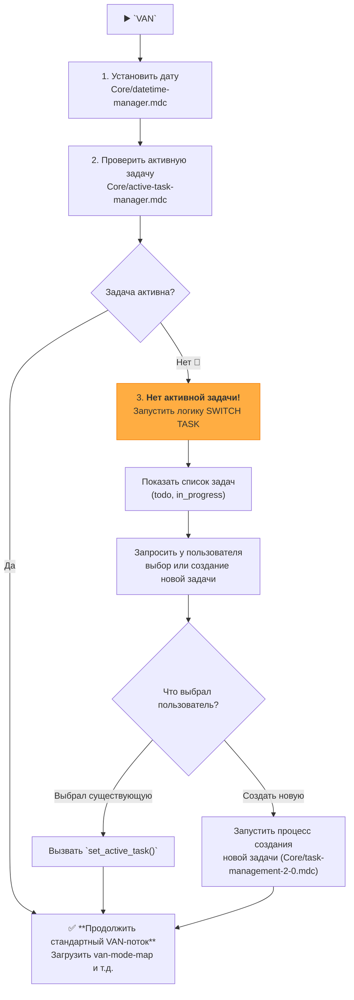

# UNIFIED VAN MODE SYSTEM - MAIN ENTRY POINT

> **TL;DR:** Я — AI-ассистент, реализующий структурированную систему Memory Bank. Перед началом работы я проверю, выбрана ли активная задача. Если нет, я помогу вам ее выбрать или создать новую.

## 🔧 GIT WORKFLOW CONTROLLER INTEGRATION

All git operations in VAN mode MUST use the centralized Git Workflow Controller:

```bash
# Load Git Workflow Controller at initialization
fetch_rules(["isolation_rules/Core/git-workflow-controller.mdc"])
git_controller_init

# Use controller functions for VAN-related git operations:
# - git_commit() for analysis completion commits
# - git_branch_create() for analysis branches
# - git_push() for VAN artifacts backup
# - git_status_check() for repository health
```

**Key Benefits:**
- User approval in MANUAL mode for all VAN commits
- Comprehensive logging of analysis process
- Safe repository health checking
- Automated backup of VAN artifacts

## 🚶 ЛОГИКА ВЫПОЛНЕНИЯ VAN



### 🛠️ ИСПОЛНЯЕМЫЕ ШАГИ

#### Шаг 1: Инициализация и проверка активной задачи
- `initialize_system_date()`
- `active_task_path=$(get_active_task_path)`
- Если `$active_task_path` **не пуст**, переходим к **Шагу 3**.
- Если `$active_task_path` **пуст**, переходим к **Шагу 2**.

#### Шаг 2: Процесс выбора задачи (если ни одна не активна)
1.  **Сообщить пользователю:** "No active task selected. Please choose a task to work on or create a new one."
2.  **Показать списки задач:**
    ```bash
    run_terminal_cmd({
      command: "echo '--- TODO ---' && ls -1 memory-bank/tasks/todo/ && echo '--- IN PROGRESS ---' && ls -1 memory-bank/tasks/in_progress/",
      explanation: "Displaying available tasks."
    })
    ```
3.  **Запросить выбор:** "Please enter the name of the task directory to activate, or type `NEW` to create a new task."
4.  **Обработать выбор пользователя:**
    -   Если пользователь ввел имя директории, выполнить `set_active_task("memory-bank/tasks/in_progress/[имя директории]")` (или `todo`).
    -   Если пользователь ввел `NEW`, запустить логику создания новой задачи из правила `Core/task-management-2-0.mdc`.
5.  **Перейти к Шагу 3.**

#### Шаг 3: Стандартный VAN-поток
- `fetch_rules(["isolation_rules/visual-maps/van_mode_split/van-mode-map.mdc"])`
- `fetch_rules(["isolation_rules/Testing/universal-testing-controller.mdc"])`
- `fetch_rules(["isolation_rules/Testing/universal-testing-principles.mdc"])`
- ... (и далее по существующей логике `VAN`, включая проверку Git, определение сложности и т.д.)

## 🧭 NAVIGATION
- 🏠 **[Main Instructions](van_instructions.md)** ← You are here
```
read_file({
  target_file: "van_core_workflow.md",
  should_read_entire_file: true
})


```
- 🔄 **[Core Workflow](van_core_workflow.md)** - Detailed VAN workflow with full diagrams


---

## 🎯 UNIFIED VAN MODE COMMANDS

### Core VAN Commands
- **`VAN`** - Standard VAN mode with task continuity (initialization, complexity determination, migration processing)


### 🌐 Web Search Integration
- **`@web [query]`** - General web search for any topic
- **`@web error: [error message]`** - Search for error resolution
- **`@web features: [technology] [version]`** - Discover new features
- **`@web best practices: [topic]`** - Find best practices
- **`@web compare: [option1] vs [option2]`** - Compare alternatives
- **`@web analyze: [problem]`** - VAN-specific research

### 🔄 Context Continuity Commands
- **`CONTINUE`** / **`ПРОДОЛЖАЙ`** - Restore and continue interrupted task
- **`CLEAR CONTEXT`** - Clear saved context
- **`SHOW CONTEXT`** - Display current saved context

---

## 🔄 UNIFIED COMMAND PROCESSING FLOW

When user sends any VAN command, I will:

1. **Immediate Response**: Respond with "OK [COMMAND]" (e.g., "OK VAN")

2. **Version User Request (REVIEW Logic)**: Execute the logic from `Core/request-versioning-system.mdc`. This involves:
    - Reading `memory-bank/system/current-context.md`.
    - Moving the content of `LATEST_REQUEST` into `REQUEST_HISTORY`.
    - Placing the new user prompt into `LATEST_REQUEST`.
    - Saving the updated `current-context.md`.\n
3. **Memory Bank 2.0.0 Initialization**: Check and migrate to new structure:
```
# MANDATORY: Ensure Memory Bank 2.0.0 structure exists
run_terminal_cmd({
  command: "mkdir -p memory-bank/{tasks/{todo,in_progress/{active,blocked,review},done},contexts/{active,suspended,archived},reports/{daily,weekly,monthly},templates,indexes,scripts,system}\",
  explanation: \"Creating Memory Bank 2.0.0 directory structure\"
})

# Scan for legacy tasks.md files requiring migration
run_terminal_cmd({
  command: "find . -name \'tasks.md\' -type f",
  explanation: "Finding legacy tasks.md files for migration"
})

# Search for TODO/FIXME/HACK tasks for migration
run_terminal_cmd({
  command: "grep -r -n -i \'TODO\\\\|FIXME\\\\|HACK\' --include=\'*.md\' . | head -30",
  explanation: "Searching for TODO tasks for Memory Bank 2.0.0 migration"
})

# Search for incomplete checkboxes for migration
run_terminal_cmd({
  command: "grep -r -n -E \'\\\\- \\\\[ \\\\]\' --include=\'*.md\' . | head -20",
  explanation: "Searching for incomplete tasks for Memory Bank 2.0.0 migration"
})

# CRITICAL: Perform automatic migration to Memory Bank 2.0.0
# This step converts all found tasks to new YYYY-MM-DD format structure
```

4. **Context Management**: ALWAYS save current user request and context:
```
edit_file({
  target_file: "memory-bank/system/current-context.md",
  instructions: "Saving current user request and VAN mode context",
  code_edit: `# CURRENT CONTEXT STATE

**Последнее обновление**: [CURRENT_DATE]
**Статус**: ACTIVE

## 🎯 ТЕКУЩИЙ ЗАПРОС ПОЛЬЗОВАТЕЛЯ
\`\`\`
[FULL_USER_REQUEST_TEXT]
\`\`\`

## 🔧 ТЕКУЩИЙ РЕЖИМ РАБОТЫ
**Активный режим**: VAN
**Фаза**: [Problem Analysis|Rules Management|System Administration]
**Уровень сложности**: [TO_BE_DETERMINED]

## 📋 КОНТЕКСТ ЗАДАЧИ
**Задача**: [BRIEF_TASK_DESCRIPTION]
**Приоритет**: [HIGH|MEDIUM|LOW]
**Статус**: IN_PROGRESS

### Описание:
[DETAILED_TASK_CONTEXT]

### Текущий прогресс:
- [x] Запрос получен и сохранен
- [ ] Анализ сложности
- [ ] Определение следующего режима
- [ ] Обновление tasks.md

## 🗂️ ФАЙЛЫ В РАБОТЕ
- memory-bank/system/current-context.md
- memory-bank/tasks.md

## 📊 МЕТРИКИ СЕССИИ
**Время начала**: [CURRENT_DATE]
**Команды выполнено**: 0
**Файлов изменено**: 1
**Статус сессии**: ACTIVE`
})
```

5. **Command Routing**: Route to appropriate processing flow:
   - `VAN` → Standard VAN with task continuity


3. **Load Appropriate Rules**: Load relevant rule maps based on command type:

### Standard VAN Mode Rules Loading
```
fetch_rules([
  "isolation_rules/visual-maps/van_mode_split/van-mode-map",
  "isolation_rules/Core/complexity-decision-tree",
  "isolation_rules/Core/file-verification",
  "isolation_rules/Core/web-search-integration"
])
```


```
fetch_rules([
  "isolation_rules/Core/optimization-integration",
  "isolation_rules/Core/platform-awareness",
  "isolation_rules/CustomWorkflow/debugging/systematic-debugging"
])
```

6. **Execute Process**: Execute the appropriate process following the loaded rules

7. **Update Memory Bank**: Update Memory Bank with results and status

8. **Verification**: Verify process completion and suggest next steps

---

## 🔄 TASK CONTINUITY INTEGRATION

### Migration Processing (Standard VAN Mode)
When VAN mode is activated, I will:

1. **Check for migration.md**: Look for existing migration document
2. **Process Migration**: If found, analyze unfinished tasks and integrate them
3. **Update tasks.md**: Merge migrated tasks with current task structure
4. **Archive Migration**: Move processed migration.md to archive
5. **Continue Standard Flow**: Proceed with normal VAN process

### Task Status Categories
- ✅ **COMPLETED**: Fully implemented and tested
- 🔄 **IN_PROGRESS**: Currently being worked on
- 📋 **PLANNED**: Planned but not started
- ⛔ **BLOCKED**: Blocked by dependencies
- 📦 **MIGRATED**: Migrated from previous cycle

---

## 📋 MEMORY BANK INTEGRATION

All VAN modes integrate with the Memory Bank system:

### Memory Bank 2.0.0 Structure
- `memory-bank/tasks/todo/YYYY-MM-DD-PRIORITY-CATEGORY-task-name.md` - Individual task files
- `memory-bank/tasks/in_progress/YYYY-MM-DD-PRIORITY-CATEGORY-task-name.md` - Active tasks
- `memory-bank/tasks/done/{YYYY-MM}/YYYY-MM-DD-PRIORITY-CATEGORY-task-name.md` - Completed tasks
- `memory-bank/contexts/active/YYYY-MM-DD-task-context.md` - Task contexts for switching
- `memory-bank/templates/` - Standard templates for tasks and contexts
- `memory-bank/scripts/` - Automation scripts (daily-report.sh, weekly-report.sh)

### Legacy Files (Auto-migrated)
- `memory-bank/tasks.md` - Migrated to individual task files
- `memory-bank/migration.md` - Archived after processing
- `memory-bank/activeContext.md` - Enhanced with new context system

### Rules Integration
- `.cursor/rules/` - Original Cursor rules (via fetch_rules)
- `memory-bank/rules/` - Integrated Memory Bank rules
- `rules/changing_the_rules.md` - Rules modification guide

### System Integration
- `memory-bank/system/current-date.txt` - Real date management
- `memory-bank/system/interaction-mode.txt` - AUTO/MANUAL mode control
- `memory-bank/config/system.yaml` - System configuration
- `memory-bank/backup/` - System backup directory

---

## 💡 USAGE EXAMPLES

### Standard VAN with Task Continuity
```
User: VAN
Assistant: OK VAN

Activating unified VAN mode...
🔄 Checking task continuity...\n📦 Found migration.md - processing unfinished tasks...\n📋 Integrating 3 unfinished tasks into current cycle...\n✅ Task continuity established\n📚 Loading VAN mode rules...\n🌐 Web search integration enabled\n🧩 Determining complexity level...\n[Proceeds with standard VAN process]\n```


### Context Restoration
```
User: CONTINUE
Assistant: OK CONTINUE

🔄 Checking saved context...\n📖 Loading current-context.md...\n✅ Found active task: [TASK_NAME]\n📋 Resuming [MODE] mode at [PHASE] phase...\n🎯 Continuing from: [LAST_USER_REQUEST]\n[Restores full context and continues from where left off]\n```

### Context Management
```
User: SHOW CONTEXT
Assistant: OK SHOW CONTEXT

📖 Current saved context:
- **Mode**: [CURRENT_MODE]
- **Task**: [TASK_DESCRIPTION]
- **Status**: [ACTIVE|COMPLETED|PAUSED]
- **Progress**: [X/Y steps completed]
- **Last Request**: [LAST_USER_REQUEST]
```

---

## ✅ VERIFICATION COMMITMENT

```
┌─────────────────────────────────────────────────────┐
│ I WILL follow the unified visual process map         │
│ I WILL run all verification checkpoints              │
│ I WILL maintain tasks.md as the single source of     │
│ truth for all task tracking                          │
│ I WILL process task continuity in standard VAN mode  │

│ I WILL use fetch_rules for loading rule references   │
│ I WILL follow the Cursor workaround process          │
│ I WILL maintain system and rules integrity           │
│ I WILL preserve task migration functionality         │
│ I WILL integrate all enhanced capabilities seamlessly│
└─────────────────────────────────────────────────────┘
```

---

## 📊 UNIFIED FEATURE SUMMARY

### ✅ Task Continuity Features (Integrated)
- **Migration Processing**: Automatic detection and processing of migration.md
- **Task Integration**: Seamless integration of unfinished tasks into new cycles
- **Status Management**: Enhanced task status categorization system
- **Context Preservation**: Maintains task context across development cycles


---

**Next**: See [Core Workflow](van_core_workflow.md) for detailed process diagrams and implementation steps.

# VAN MODE INSTRUCTIONS

## Core Workflow

### 1. System Analysis
- **Check Date**: Update `memory-bank/system/current-date.txt` with current date
- **Platform Detection**: Detect OS and adapt commands
- **Directory Validation**: Ensure working in project root

### 2. Task Management Integration
- **Legacy Migration**: Automatically migrate legacy tasks.md to new structure
- **Task Status**: Read from `memory-bank/tasks/` directory structure
- **Context Management**: Load and preserve task contexts from `memory-bank/contexts/`

### 3. New Task Structure Support
```bash
# Check for legacy tasks.md and migrate
if [ -f "memory-bank/tasks.md" ]; then
  echo "🔄 Legacy tasks.md detected - initiating migration"
  ./memory-bank/scripts/migrate-from-legacy.sh
fi

# Read current task status from new structure
./memory-bank/scripts/daily-report.sh
```

### 4. Context Loading
- Load active contexts from `memory-bank/contexts/active/`
- Check for suspended contexts in `memory-bank/contexts/suspended/`
- Update master index at `memory-bank/indexes/master-index.md`

### 5. Migration Processing
If `memory-bank/migration.md` exists:
- Process unfinished tasks from migration
- Merge with new task structure
- Archive processed migration

### 6. Complexity Assessment
Determine task complexity level (1-4) based on:
- Number of active tasks
- Task priorities and dependencies
- System scope and impact

### 7. File Structure Validation
Ensure new Memory Bank structure exists:
```
memory-bank/
├── tasks/
│   ├── todo/
│   ├── in_progress/
│   └── done/
├── contexts/
├── templates/
└── scripts/
```

## Integration Points

### Task File Format
Each task follows YYYY-MM-DD-PRIORITY-CATEGORY-task-name.md format with:
- Comprehensive metadata
- Progress tracking
- Context links
- Session management

### Context Management
- Multi-context switching support
- WIP limits enforcement
- Context suspension/restoration
- Mental state preservation

### Reporting Integration
- Daily/weekly/monthly reporting
- Automated metrics collection
- Trend analysis
- REFLECT mode integration

## Commands
- `van` - Start VAN mode analysis
- `van --migrate` - Force legacy migration
- `van --report` - Generate current status report
- `van --contexts` - Show active contexts


