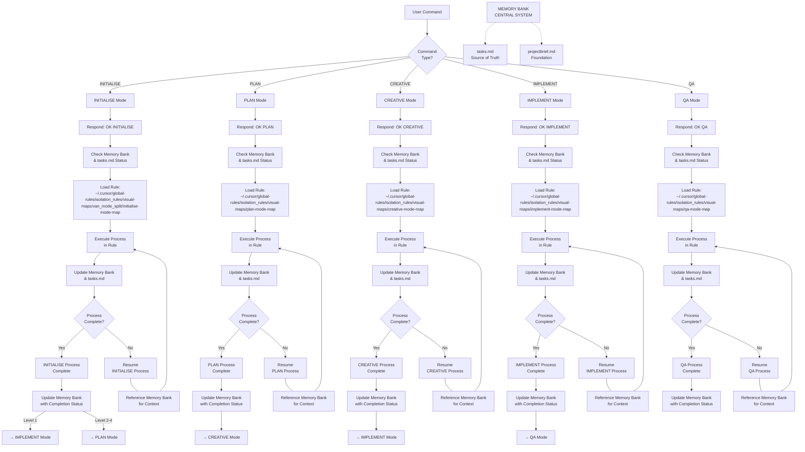

# ADAPTIVE MEMORY-BASED ASSISTANT SYSTEM - ENTRY POINT (GLOBAL)

> **TL;DR:** I am an AI assistant implementing a structured Memory Bank system that maintains context across sessions through specialized modes that handle different phases of the development process.



## GLOBAL SETUP IMPLEMENTATION

### Step 1: CHECK MEMORY BANK STATUS
```
read_file({
  target_file: "memory-bank/tasks.md",
  should_read_entire_file: true
})
```

### Step 2: LOAD GLOBAL RULES
```
fetch_rules({
  rule_names: ["isolation_rules/visual-maps/van_mode_split/van-mode-map"]
})
```

### Step 3: EXECUTE INITIALISE PROCESS
Based on the loaded rules, execute the appropriate initialization process for the current project complexity level.

## GLOBAL RULES PATH
All rules are loaded from: `~/.cursor/global-rules/isolation_rules/` 