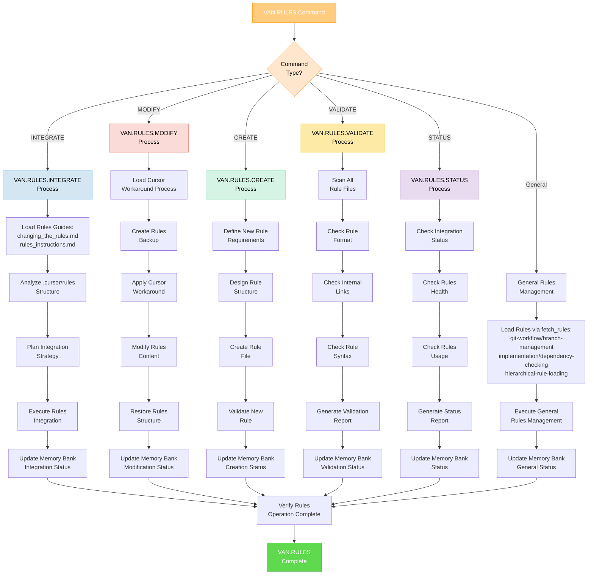
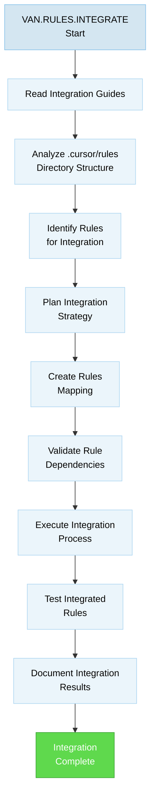
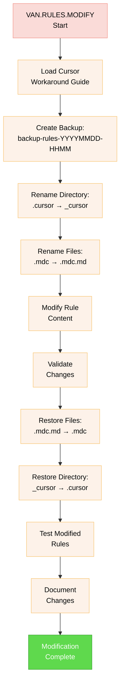
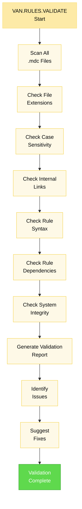
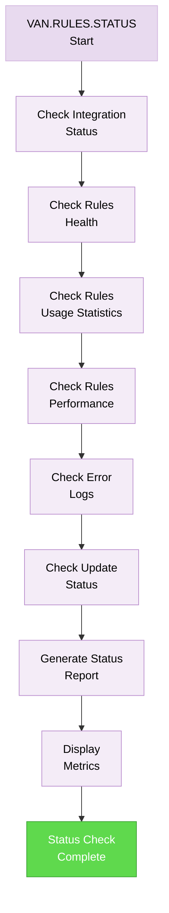

# VAN.RULES SUBMODE - RULES MANAGEMENT

> **TL;DR:** Comprehensive VAN.RULES submode for managing .cursor rules integration with Memory Bank system, including Cursor workaround procedures and validation.

## 🧭 NAVIGATION
- 🏠 **[Main Instructions](van_instructions.md)** - Return to main VAN instructions
- 🔄 **[Core Workflow](van_core_workflow.md)** - Detailed VAN workflow with full diagrams
- 📋 **[Rules Submode](van_rules_submode.md)** ← You are here
- ⚙️ **[System Submode](van_system_submode.md)** - VAN.SYSTEM administration functionality

---

## 🎯 VAN.RULES COMMANDS

### Available Commands
- **`VAN.RULES`** - Activate rules management submode
- **`VAN.RULES.INTEGRATE`** - Integrate .cursor rules with Memory Bank
- **`VAN.RULES.MODIFY`** - Modify existing rules using Cursor workaround
- **`VAN.RULES.CREATE`** - Create new custom rules
- **`VAN.RULES.VALIDATE`** - Validate all rules for correctness
- **`VAN.RULES.STATUS`** - Check current rules integration status

---

## 🔄 VAN.RULES WORKFLOW



---

## 🔗 VAN.RULES.INTEGRATE PROCESS

### Integration Workflow



### Integration Rules Loading

```
fetch_rules([
  "isolation_rules/CustomWorkflow/git-workflow/branch-management",
  "isolation_rules/CustomWorkflow/implementation/dependency-checking",
  "isolation_rules/Core/hierarchical-rule-loading"
])
```

---

## 🔧 VAN.RULES.MODIFY PROCESS

### Cursor Workaround Procedure



### Cursor Workaround Commands

```bash
# Step 1: Create backup
git checkout -b "backup-rules-$(date +%Y%m%d-%H%M)"

# Step 2: Rename directory
mv .cursor _cursor

# Step 3: Rename files
find _cursor -name "*.mdc" -exec mv {} {}.md \;

# Step 4: Modify content (manual step)
# Edit files as needed

# Step 5: Restore files
find _cursor -name "*.mdc.md" -exec sh -c 'mv "$1" "${1%.md}"' _ {} \;

# Step 6: Restore directory
mv _cursor .cursor

# Step 7: Commit changes
git add .cursor/
git commit -m "Modified rules via Cursor workaround"
```

---

## ✅ VAN.RULES.VALIDATE PROCESS

### Validation Workflow



### Validation Checklist

```
✓ RULES VALIDATION CHECKLIST
- All .mdc files have correct extensions? [YES/NO]
- File names follow naming conventions? [YES/NO]
- Internal links are valid? [YES/NO]
- Rule syntax is correct? [YES/NO]
- Dependencies are satisfied? [YES/NO]
- No circular dependencies? [YES/NO]
- Integration points are valid? [YES/NO]
- fetch_rules references are correct? [YES/NO]

→ If all YES: Rules validation passed
→ If any NO: Address identified issues
```

---

## 📊 VAN.RULES.STATUS PROCESS

### Status Monitoring



### Status Report Format

```
## VAN.RULES STATUS REPORT

### Integration Status
- Rules Integrated: X/Y (Z%)
- Last Integration: YYYY-MM-DD HH:MM
- Integration Health: [EXCELLENT/GOOD/NEEDS_ATTENTION]

### Rules Health
- Total Rules: X files
- Valid Rules: Y files
- Invalid Rules: Z files
- Health Score: X/100

### Usage Statistics
- Rules Loaded Today: X
- Most Used Rules: [list]
- Least Used Rules: [list]
- Average Load Time: X ms

### Performance Metrics
- Load Success Rate: X%
- Error Rate: Y%
- Average Response Time: Z ms

### Recent Issues
- [List of recent issues and resolutions]

### Recommendations
- [Actionable recommendations for improvement]
```

---

## 🔧 MEMORY BANK INTEGRATION

### Rules Integration Files

- **`memory-bank/rules/integration-status.md`** - Current integration status
- **`memory-bank/rules/validation-reports/`** - Validation report archive
- **`memory-bank/rules/modification-log.md`** - Modification history
- **`memory-bank/backup/rules/`** - Rules backup directory

### Integration with Other Modes

```
fetch_rules([
  "isolation_rules/CustomWorkflow/git-workflow/branch-management",
  "isolation_rules/CustomWorkflow/git-workflow/backup-verification",
  "isolation_rules/CustomWorkflow/git-workflow/change-documentation",
  "isolation_rules/CustomWorkflow/implementation/dependency-checking",
  "isolation_rules/Core/hierarchical-rule-loading"
])
```

---

## 💡 USAGE EXAMPLES

### Example 1: Rules Integration
```
User: VAN.RULES.INTEGRATE
Assistant: OK VAN.RULES

Activating VAN.RULES integration submode...
📚 Loading rules management guidelines...
🔍 Analyzing .cursor/rules structure...
📋 Found 37 .mdc files for integration...
⚡ Planning integration strategy...
🔗 Executing integration process...
✅ Rules integration completed successfully
📊 Integration status: 37/37 rules integrated (100%)
```

### Example 2: Rules Modification
```
User: VAN.RULES.MODIFY
Assistant: OK VAN.RULES

Activating VAN.RULES modification submode...
🔧 Loading Cursor workaround procedure...
💾 Creating backup: backup-rules-20250610-1430...
📁 Applying Cursor workaround (.cursor → _cursor)...
📝 Ready for rule modifications...
[User makes modifications]
🔄 Restoring structure (_cursor → .cursor)...
✅ Rules modification completed successfully
```

### Example 3: Rules Validation
```
User: VAN.RULES.VALIDATE
Assistant: OK VAN.RULES

Activating VAN.RULES validation submode...
🔍 Scanning all .mdc files...
✅ File extensions: 37/37 correct
✅ Naming conventions: 37/37 valid
✅ Internal links: 156/156 valid
✅ Rule syntax: 37/37 correct
✅ Dependencies: All satisfied
📊 Validation score: 100/100 (EXCELLENT)
```

---

## ✅ VERIFICATION COMMITMENT

```
┌─────────────────────────────────────────────────────┐
│ I WILL use fetch_rules for all rule loading          │
│ I WILL follow the Cursor workaround process exactly  │
│ I WILL create backups before any modifications       │
│ I WILL validate all rules after changes              │
│ I WILL document all rules operations                 │
│ I WILL maintain rules integration integrity          │
│ I WILL update Memory Bank with all status changes    │
└─────────────────────────────────────────────────────┘
```

---

**Navigation**: Return to [Main Instructions](van_instructions.md) | Previous: [Core Workflow](van_core_workflow.md) | Next: [System Submode](van_system_submode.md)