# System Administration Guide

> **Advanced System Management**: Comprehensive guide for system administration using the VAN.SYSTEM submode. This guide covers system optimization, backup and restore procedures, health monitoring, and advanced configuration management for Memory Bank deployments.

## 🎯 Overview

The VAN.SYSTEM submode provides powerful system administration capabilities for Memory Bank deployments. This guide covers all aspects of system management, from basic health checks to advanced optimization and backup procedures.

### What You'll Learn
- VAN.SYSTEM submode commands and capabilities
- System optimization techniques and strategies
- Backup and restore procedures
- Health monitoring and diagnostics
- Advanced configuration management
- Troubleshooting and maintenance procedures

### Prerequisites
- Understanding of VAN mode and Memory Bank system
- Familiarity with VAN.RULES system (recommended)
- System administrator access to Memory Bank deployment
- Knowledge of file system operations

## 🏗️ VAN.SYSTEM Architecture

### System Administration Framework

The VAN.SYSTEM submode operates as an integrated administration layer within the Memory Bank ecosystem:


### Integration with Memory Bank

VAN.SYSTEM integrates seamlessly with the Memory Bank file structure:

```
memory-bank/
├── system/                  # System administration files
│   ├── config/             # System configuration
│   │   ├── system-config.md # Main system configuration
│   │   ├── optimization.md  # Performance settings
│   │   └── monitoring.md    # Monitoring configuration
│   ├── backups/            # System backups
│   │   ├── daily/          # Daily backup snapshots
│   │   ├── weekly/         # Weekly backup archives
│   │   └── manual/         # Manual backup files
│   ├── logs/               # System logs
│   │   ├── system-logs.md  # Main system log
│   │   ├── health-logs.md  # Health check logs
│   │   └── error-logs.md   # Error and warning logs
│   └── reports/            # System reports
│       ├── health-reports/ # Health check reports
│       ├── performance/    # Performance reports
│       └── diagnostics/    # Diagnostic reports
├── tasks.md               # Central task file (monitored)
├── progress.md           # Progress tracking (monitored)
└── [other Memory Bank files]
```

## 🔧 VAN.SYSTEM Commands

### Core System Commands

#### VAN.SYSTEM
**Purpose**: Activate system administration submode
**Usage**: `VAN.SYSTEM`
**Response**: `OK VAN.SYSTEM`

Activates the system administration interface and performs initial system status check.

#### VAN.SYSTEM.HEALTH
**Purpose**: Comprehensive system health check
**Usage**: `VAN.SYSTEM.HEALTH`

Performs complete system health assessment including:
- Memory Bank file integrity verification
- System performance metrics
- Storage utilization analysis
- Configuration validation
- Error log analysis

#### VAN.SYSTEM.OPTIMIZE
**Purpose**: System performance optimization
**Usage**: `VAN.SYSTEM.OPTIMIZE`

Executes system optimization procedures:
- Memory usage optimization
- File system cleanup
- Performance tuning
- Cache optimization
- Resource allocation adjustment

#### VAN.SYSTEM.BACKUP
**Purpose**: Create system backup
**Usage**: `VAN.SYSTEM.BACKUP`

Creates comprehensive system backup including:
- Complete Memory Bank state
- System configuration files
- User data and preferences
- System logs and reports
- Metadata and indexes

#### VAN.SYSTEM.RESTORE
**Purpose**: Restore system from backup
**Usage**: `VAN.SYSTEM.RESTORE`

Restores system from backup with options for:
- Full system restore
- Selective file restore
- Configuration-only restore
- Data validation and verification

### Advanced System Commands

#### VAN.SYSTEM.CONFIG
**Purpose**: System configuration management
**Usage**: `VAN.SYSTEM.CONFIG`

Manages system configuration including:
- Performance settings adjustment
- Feature enablement/disablement
- Integration configuration
- Security settings management

#### VAN.SYSTEM.MONITOR
**Purpose**: Real-time system monitoring
**Usage**: `VAN.SYSTEM.MONITOR`

Provides real-time monitoring capabilities:
- Live performance metrics
- Resource utilization tracking
- Error detection and alerting
- Trend analysis and reporting

#### VAN.SYSTEM.CLEANUP
**Purpose**: System maintenance and cleanup
**Usage**: `VAN.SYSTEM.CLEANUP`

Performs system maintenance tasks:
- Temporary file cleanup
- Log rotation and archival
- Orphaned file removal
- Cache cleanup and optimization

## 📊 System Health Monitoring

### Health Check Procedures

#### Comprehensive Health Assessment

The VAN.SYSTEM.HEALTH command performs a multi-layered health assessment:

```mermaid
graph TD
    HealthStart["VAN.SYSTEM.HEALTH<br>Initiated"] --> FileIntegrity["File Integrity<br>Verification"]
    FileIntegrity --> ConfigCheck["Configuration<br>Validation"]
    ConfigCheck --> PerformanceCheck["Performance<br>Assessment"]
    PerformanceCheck --> StorageCheck["Storage<br>Analysis"]
    StorageCheck --> ErrorCheck["Error Log<br>Analysis"]
    ErrorCheck --> ReportGen["Health Report<br>Generation"]

    FileIntegrity --> FileResults["✓ File Structure<br>✓ File Permissions<br>✓ Data Integrity"]
    ConfigCheck --> ConfigResults["✓ System Settings<br>✓ Integration Config<br>✓ Security Settings"]
    PerformanceCheck --> PerfResults["✓ Response Times<br>✓ Memory Usage<br>✓ CPU Utilization"]
    StorageCheck --> StorageResults["✓ Disk Usage<br>✓ File Sizes<br>✓ Growth Trends"]
    ErrorCheck --> ErrorResults["✓ Error Frequency<br>✓ Warning Patterns<br>✓ Critical Issues"]

    style HealthStart fill:#cc80ff,stroke:#9900ff,color:white
    style FileIntegrity fill:#e6ccff,stroke:#b366ff,color:black
    style ConfigCheck fill:#e6ccff,stroke:#b366ff,color:black
    style PerformanceCheck fill:#e6ccff,stroke:#b366ff,color:black
    style StorageCheck fill:#e6ccff,stroke:#b366ff,color:black
    style ErrorCheck fill:#e6ccff,stroke:#b366ff,color:black
    style ReportGen fill:#e6ccff,stroke:#b366ff,color:black
```



#### Health Metrics and Indicators

**System Health Score**: Calculated based on multiple factors:
- File integrity: 25%
- Performance metrics: 25%
- Configuration validity: 20%
- Storage efficiency: 15%
- Error frequency: 15%

**Health Status Levels**:
- **Excellent (90-100%)**: System operating optimally
- **Good (75-89%)**: System functioning well with minor issues
- **Fair (60-74%)**: System functional but requires attention
- **Poor (40-59%)**: System has significant issues requiring immediate action
- **Critical (<40%)**: System requires urgent intervention

### Monitoring and Alerting

#### Continuous Monitoring

VAN.SYSTEM.MONITOR provides real-time system monitoring:

```markdown
# Real-time Monitoring Dashboard
┌─────────────────────────────────────────────────────┐
│ MEMORY BANK SYSTEM STATUS                           │
├─────────────────────────────────────────────────────┤
│ Health Score: 94% (Excellent)                       │
│ Uptime: 15 days, 7 hours, 23 minutes               │
│ Last Backup: 2 hours ago (Successful)              │
├─────────────────────────────────────────────────────┤
│ PERFORMANCE METRICS                                 │
│ • Memory Usage: 67% (Normal)                       │
│ • Storage Usage: 23% (Optimal)                     │
│ • Response Time: 0.8s (Good)                       │
│ • Error Rate: 0.02% (Excellent)                    │
├─────────────────────────────────────────────────────┤
│ RECENT ACTIVITY                                     │
│ • 14:32 - Task completed successfully               │
│ • 14:15 - System optimization completed             │
│ • 13:45 - Health check passed                      │
│ • 13:30 - Backup created successfully              │
└─────────────────────────────────────────────────────┘
```

#### Alert Configuration

Configure monitoring alerts for:
- **Critical Errors**: Immediate notification for system failures
- **Performance Degradation**: Alerts when performance drops below thresholds
- **Storage Warnings**: Notifications when storage usage exceeds limits
- **Backup Failures**: Immediate alerts for failed backup operations
- **Security Events**: Notifications for security-related events

## 🔄 Backup and Restore Operations

### Backup Strategies

#### Automated Backup System

VAN.SYSTEM implements a comprehensive backup strategy:

```mermaid
graph TD
    BackupTrigger["Backup Trigger"] --> BackupType{"Backup Type?"}

    BackupType -->|"Daily"| DailyBackup["Daily Incremental<br>Backup"]
    BackupType -->|"Weekly"| WeeklyBackup["Weekly Full<br>Backup"]
    BackupType -->|"Manual"| ManualBackup["Manual Selective<br>Backup"]

    DailyBackup --> DailyProcess["• Changed files only<br>• Quick execution<br>• Minimal storage"]
    WeeklyBackup --> WeeklyProcess["• Complete system state<br>• Full verification<br>• Archive creation"]
    ManualBackup --> ManualProcess["• User-selected files<br>• Custom configuration<br>• Immediate execution"]

    DailyProcess --> Verification["Backup Verification"]
    WeeklyProcess --> Verification
    ManualProcess --> Verification

    Verification --> Storage["Backup Storage<br>& Indexing"]
    Storage --> Notification["Completion<br>Notification"]

    style BackupTrigger fill:#cc80ff,stroke:#9900ff,color:white
    style BackupType fill:#e6ccff,stroke:#b366ff,color:black
    style DailyBackup fill:#ccffcc,stroke:#66cc66,color:black
    style WeeklyBackup fill:#ffffcc,stroke:#cccc66,color:black
    style ManualBackup fill:#ffcccc,stroke:#cc6666,color:black
```



#### Backup Content and Structure

**Full System Backup includes**:
```
backup-[timestamp]/
├── memory-bank/           # Complete Memory Bank state
│   ├── tasks.md          # Current tasks
│   ├── progress.md       # Progress tracking
│   ├── activeContext.md  # Active context
│   ├── creative/         # Creative phase documents
│   ├── reflection/       # Reflection documents
│   └── archive/          # Archived tasks
├── system/               # System configuration
│   ├── config/          # Configuration files
│   ├── logs/            # System logs
│   └── reports/         # System reports
├── metadata/             # Backup metadata
│   ├── backup-info.md   # Backup information
│   ├── file-manifest.md # File listing
│   └── verification.md  # Integrity checksums
└── restore-guide.md      # Restoration instructions
```

### Restore Procedures

#### Restore Process Flow


#### Restore Verification

After restore operations, VAN.SYSTEM performs comprehensive verification:

1. **File Integrity Check**: Verify all restored files are intact
2. **Configuration Validation**: Ensure all settings are properly applied
3. **System Functionality Test**: Test core system operations
4. **Performance Baseline**: Establish post-restore performance metrics
5. **Error Log Review**: Check for any restoration-related issues

## ⚡ Performance Optimization

### Optimization Strategies

#### VAN.SYSTEM.OPTIMIZE Process

The optimization process follows a systematic approach:


#### Performance Metrics and Targets

**Key Performance Indicators (KPIs)**:

| Metric | Target | Good | Needs Attention |
|--------|--------|------|-----------------|
| Response Time | <1s | <2s | >2s |
| Memory Usage | <70% | <85% | >85% |
| Storage Usage | <80% | <90% | >90% |
| Error Rate | <0.1% | <0.5% | >0.5% |
| Backup Time | <5min | <10min | >10min |
| Health Score | >90% | >75% | <75% |

### Optimization Techniques

#### Memory Optimization
- **Garbage Collection Tuning**: Optimize memory cleanup cycles
- **Buffer Management**: Efficient buffer allocation and reuse
- **Memory Pool Optimization**: Optimize memory pool sizes and allocation strategies
- **Leak Detection**: Identify and resolve memory leaks

#### Storage Optimization
- **File System Optimization**: Optimize file system performance
- **Index Optimization**: Maintain and optimize file indexes
- **Compression**: Implement intelligent file compression
- **Cleanup Automation**: Automated cleanup of temporary and obsolete files

#### Cache Optimization
- **Cache Warming**: Pre-load frequently accessed data
- **Cache Size Tuning**: Optimize cache sizes for different data types
- **Eviction Policies**: Implement intelligent cache eviction strategies
- **Cache Hierarchy**: Implement multi-level caching strategies

## 🔧 Configuration Management

### System Configuration

#### Configuration Structure

VAN.SYSTEM manages configuration through a hierarchical structure:

```
memory-bank/system/config/
├── system-config.md       # Main system configuration
├── performance-config.md  # Performance settings
├── backup-config.md       # Backup configuration
├── monitoring-config.md   # Monitoring settings
├── security-config.md     # Security configuration
└── integration-config.md  # Integration settings
```

#### Configuration Categories

**System Settings**:
- Memory allocation limits
- Storage quotas and limits
- Performance thresholds
- Timeout configurations
- Logging levels and retention

**Performance Settings**:
- Cache sizes and policies
- Optimization schedules
- Resource allocation priorities
- Performance monitoring intervals

**Backup Settings**:
- Backup schedules and retention
- Backup storage locations
- Verification procedures
- Compression settings

**Monitoring Settings**:
- Health check intervals
- Alert thresholds and notifications
- Reporting schedules
- Metric collection settings

### Configuration Management Commands

#### VAN.SYSTEM.CONFIG.VIEW
View current system configuration:
```bash
VAN.SYSTEM.CONFIG.VIEW
# Displays current configuration in organized format
```

#### VAN.SYSTEM.CONFIG.UPDATE
Update specific configuration settings:
```bash
VAN.SYSTEM.CONFIG.UPDATE [category] [setting] [value]
# Example: VAN.SYSTEM.CONFIG.UPDATE performance cache_size 256MB
```

#### VAN.SYSTEM.CONFIG.VALIDATE
Validate configuration settings:
```bash
VAN.SYSTEM.CONFIG.VALIDATE
# Validates all configuration settings for correctness
```

#### VAN.SYSTEM.CONFIG.BACKUP
Backup current configuration:
```bash
VAN.SYSTEM.CONFIG.BACKUP
# Creates backup of current configuration
```

#### VAN.SYSTEM.CONFIG.RESTORE
Restore configuration from backup:
```bash
VAN.SYSTEM.CONFIG.RESTORE [backup-id]
# Restores configuration from specified backup
```

## 🚨 Troubleshooting and Maintenance

### Common System Issues

#### Issue: Performance Degradation
**Symptoms**: Slow response times, high resource usage
**Diagnosis**:
1. Run `VAN.SYSTEM.HEALTH` to identify bottlenecks
2. Check system logs for errors or warnings
3. Analyze performance metrics and trends

**Solutions**:
1. Execute `VAN.SYSTEM.OPTIMIZE` for automatic optimization
2. Review and adjust configuration settings
3. Clear caches and temporary files
4. Consider hardware resource upgrades

#### Issue: Backup Failures
**Symptoms**: Failed backup operations, incomplete backups
**Diagnosis**:
1. Check backup logs for error messages
2. Verify storage space availability
3. Test file system permissions

**Solutions**:
1. Free up storage space if needed
2. Repair file system permissions
3. Update backup configuration
4. Run manual backup to test resolution

#### Issue: Configuration Corruption
**Symptoms**: System errors, unexpected behavior
**Diagnosis**:
1. Run `VAN.SYSTEM.CONFIG.VALIDATE` to check configuration
2. Review recent configuration changes
3. Check system logs for configuration errors

**Solutions**:
1. Restore configuration from backup
2. Reset to default configuration
3. Manually correct configuration errors
4. Validate configuration after changes

### Maintenance Procedures

#### Regular Maintenance Schedule

**Daily**:
- Automated health checks
- Incremental backups
- Log rotation
- Performance monitoring

**Weekly**:
- Full system backup
- Comprehensive health assessment
- Performance optimization
- Configuration validation

**Monthly**:
- System cleanup and maintenance
- Security updates and patches
- Configuration review and updates
- Capacity planning review

#### Preventive Maintenance

**System Cleanup**:
```bash
VAN.SYSTEM.CLEANUP
# Performs comprehensive system cleanup
```

**Health Monitoring**:
```bash
VAN.SYSTEM.MONITOR
# Enables continuous health monitoring
```

**Performance Optimization**:
```bash
VAN.SYSTEM.OPTIMIZE
# Executes performance optimization procedures
```

## 📊 Reporting and Analytics

### System Reports

#### Health Reports
Generated by `VAN.SYSTEM.HEALTH`, includes:
- Overall system health score
- Component-specific health metrics
- Trend analysis and recommendations
- Issue identification and resolution suggestions

#### Performance Reports
Generated by `VAN.SYSTEM.OPTIMIZE`, includes:
- Performance metrics before and after optimization
- Optimization actions taken
- Performance improvement measurements
- Recommendations for further optimization

#### Backup Reports
Generated by backup operations, includes:
- Backup success/failure status
- Backup size and duration
- File counts and verification results
- Storage utilization and retention status

### Analytics and Insights

#### System Trends
- Performance trends over time
- Resource utilization patterns
- Error frequency and patterns
- Backup success rates and timing

#### Capacity Planning
- Storage growth projections
- Memory usage trends
- Performance scaling requirements
- Resource optimization opportunities

#### Predictive Analytics
- Potential issue identification
- Maintenance scheduling optimization
- Resource requirement forecasting
- Performance degradation prediction

## 🔗 Integration with Other Systems

### VAN.RULES Integration

VAN.SYSTEM works seamlessly with VAN.RULES for comprehensive system management:


### Memory Bank Integration

VAN.SYSTEM integrates deeply with Memory Bank operations:
- **Task Monitoring**: Monitor task execution and completion
- **Progress Tracking**: Track system performance during task execution
- **Context Management**: Maintain system context across sessions
- **Archive Management**: Manage archived task data and system states

### External System Integration

VAN.SYSTEM supports integration with external systems:
- **Monitoring Tools**: Integration with external monitoring platforms
- **Backup Systems**: Integration with enterprise backup solutions
- **Security Systems**: Integration with security monitoring and alerting
- **Performance Tools**: Integration with performance analysis tools

## 🎯 Best Practices

### System Administration
1. **Regular Monitoring**: Implement continuous system monitoring
2. **Proactive Maintenance**: Perform regular preventive maintenance
3. **Backup Verification**: Always verify backup integrity
4. **Configuration Management**: Maintain configuration version control
5. **Documentation**: Keep detailed system documentation

### Performance Optimization
1. **Baseline Establishment**: Establish performance baselines
2. **Incremental Optimization**: Make incremental optimization changes
3. **Testing and Validation**: Test all optimization changes
4. **Monitoring Impact**: Monitor optimization impact over time
5. **Rollback Planning**: Plan for optimization rollback if needed

### Security and Compliance
1. **Access Control**: Implement proper access controls
2. **Audit Trails**: Maintain comprehensive audit trails
3. **Security Updates**: Keep system security updates current
4. **Compliance Monitoring**: Monitor compliance with organizational policies
5. **Incident Response**: Maintain incident response procedures

## 🔗 Related Documentation

- [VAN.RULES System Guide](van-rules-system.md) - Rules management system
- [Rules Integration Guide](rules-integration.md) - .cursor rules integration
- [Rules Editing Tutorial](rules-editing-tutorial.md) - Rule modification procedures

## 📚 Advanced Administration Topics

### Enterprise Deployment

For enterprise deployments, consider:
- **High Availability**: Implement redundancy and failover
- **Scalability**: Design for horizontal and vertical scaling
- **Security**: Implement enterprise security requirements
- **Compliance**: Ensure regulatory compliance
- **Integration**: Integrate with enterprise systems and workflows

### Custom Administration Scripts

VAN.SYSTEM supports custom administration scripts for:
- **Automated Maintenance**: Custom maintenance procedures
- **Custom Monitoring**: Organization-specific monitoring requirements
- **Integration Scripts**: Custom integration with external systems
- **Reporting Extensions**: Custom reporting and analytics

### Performance Tuning

Advanced performance tuning techniques:
- **Resource Allocation**: Optimize resource allocation strategies
- **Caching Strategies**: Implement advanced caching techniques
- **Database Optimization**: Optimize data storage and retrieval
- **Network Optimization**: Optimize network communication and data transfer

---

**Next Steps**:
- Master the complete system with [VAN.RULES System Guide](van-rules-system.md)
- Learn rule modification with [Rules Editing Tutorial](rules-editing-tutorial.md)
- Explore integration strategies with [Rules Integration Guide](rules-integration.md)