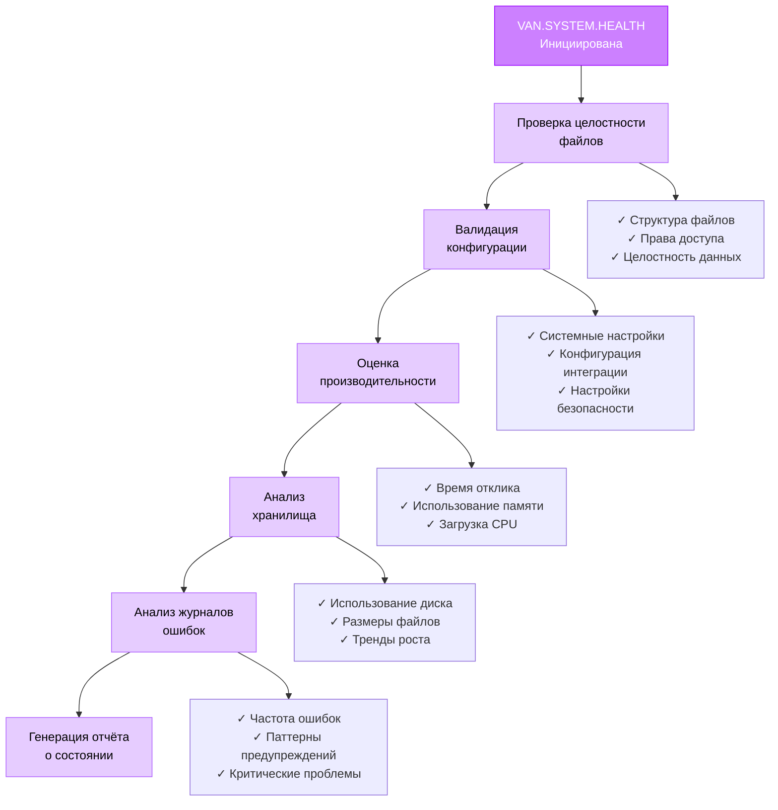
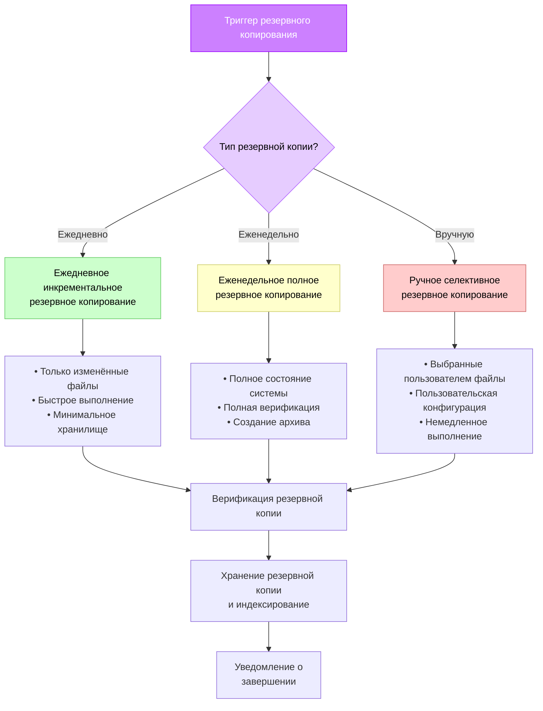
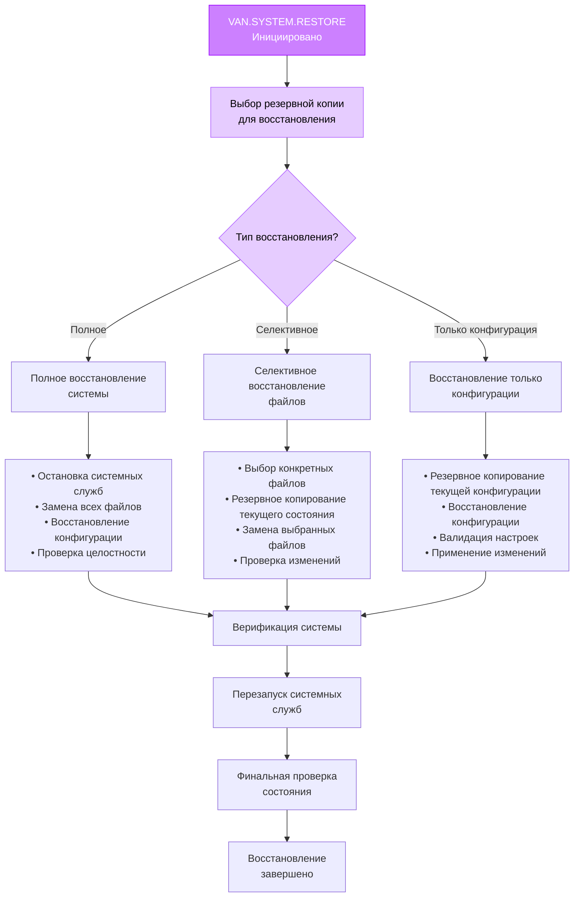
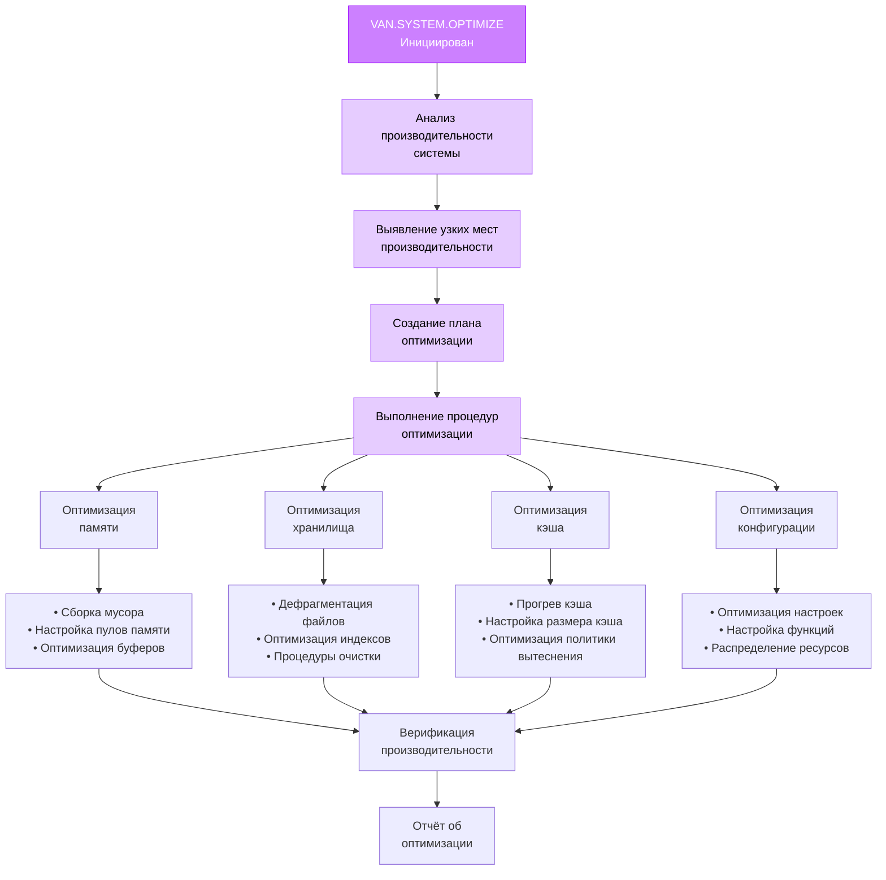
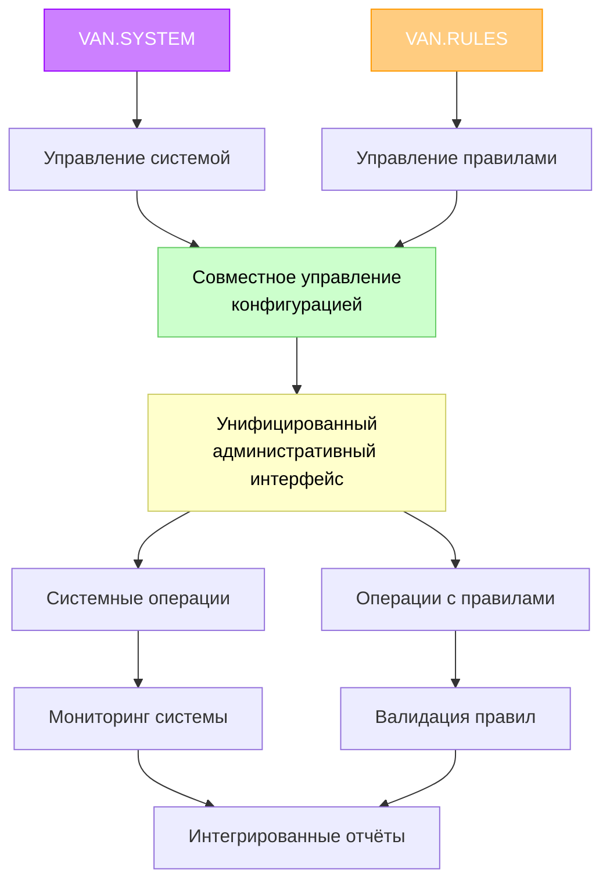

# Руководство по администрированию системы

> **Продвинутое управление системой**: Комплексное руководство по администрированию системы с использованием подрежима VAN.SYSTEM. Это руководство охватывает оптимизацию системы, процедуры резервного копирования и восстановления, мониторинг состояния и продвинутое управление конфигурацией для развёртываний Memory Bank.

## 🎯 Обзор

Подрежим VAN.SYSTEM предоставляет мощные возможности администрирования системы для развёртываний Memory Bank. Это руководство охватывает все аспекты управления системой, от базовых проверок состояния до продвинутой оптимизации и процедур резервного копирования.

### Что вы изучите
- Команды и возможности подрежима VAN.SYSTEM
- Техники и стратегии оптимизации системы
- Процедуры резервного копирования и восстановления
- Мониторинг состояния и диагностика
- Продвинутое управление конфигурацией
- Процедуры устранения неполадок и обслуживания

### Предварительные требования
- Понимание режима VAN и системы Memory Bank
- Знакомство с системой VAN.RULES (рекомендуется)
- Доступ системного администратора к развёртыванию Memory Bank
- Знание операций файловой системы

## 🏗️ Архитектура VAN.SYSTEM

### Фреймворк администрирования системы

Подрежим VAN.SYSTEM работает как интегрированный административный слой в экосистеме Memory Bank:

```mermaid
graph TD
    VanSystem["VAN.SYSTEM<br>Административный слой"] --> SystemOps["Системные операции"]
    VanSystem --> Monitoring["Мониторинг состояния"]
    VanSystem --> Optimization["Оптимизация производительности"]
    VanSystem --> DataMgmt["Управление данными"]

    SystemOps --> Backup["Операции резервного копирования"]
    SystemOps --> Restore["Операции восстановления"]
    SystemOps --> Config["Управление конфигурацией"]

    Monitoring --> HealthCheck["Проверки состояния"]
    Monitoring --> Diagnostics["Системная диагностика"]
    Monitoring --> Reporting["Отчёты о статусе"]

    Optimization --> Performance["Настройка производительности"]
    Optimization --> Memory["Оптимизация памяти"]
    Optimization --> Storage["Оптимизация хранилища"]

    DataMgmt --> Integrity["Целостность данных"]
    DataMgmt --> Cleanup["Очистка системы"]
    DataMgmt --> Migration["Миграция данных"]

    style VanSystem fill:#cc80ff,stroke:#9900ff,color:white
    style SystemOps fill:#e6ccff,stroke:#b366ff,color:black
    style Monitoring fill:#e6ccff,stroke:#b366ff,color:black
    style Optimization fill:#e6ccff,stroke:#b366ff,color:black
    style DataMgmt fill:#e6ccff,stroke:#b366ff,color:black
```



### Интеграция с Memory Bank

VAN.SYSTEM бесшовно интегрируется со структурой файлов Memory Bank:

```
memory-bank/
├── system/                  # Файлы администрирования системы
│   ├── config/             # Конфигурация системы
│   │   ├── system-config.md # Основная конфигурация системы
│   │   ├── optimization.md  # Настройки производительности
│   │   └── monitoring.md    # Конфигурация мониторинга
│   ├── backups/            # Резервные копии системы
│   │   ├── daily/          # Ежедневные снимки резервных копий
│   │   ├── weekly/         # Еженедельные архивы резервных копий
│   │   └── manual/         # Файлы ручных резервных копий
│   ├── logs/               # Системные журналы
│   │   ├── system-logs.md  # Основной системный журнал
│   │   ├── health-logs.md  # Журналы проверок состояния
│   │   └── error-logs.md   # Журналы ошибок и предупреждений
│   └── reports/            # Системные отчёты
│       ├── health-reports/ # Отчёты о проверках состояния
│       ├── performance/    # Отчёты о производительности
│       └── diagnostics/    # Диагностические отчёты
├── tasks.md               # Центральный файл задач (мониторится)
├── progress.md           # Отслеживание прогресса (мониторится)
└── [другие файлы Memory Bank]
```

## 🔧 Команды VAN.SYSTEM

### Основные системные команды

#### VAN.SYSTEM
**Назначение**: Активация подрежима администрирования системы
**Использование**: `VAN.SYSTEM`
**Ответ**: `OK VAN.SYSTEM`

Активирует интерфейс администрирования системы и выполняет начальную проверку статуса системы.

#### VAN.SYSTEM.HEALTH
**Назначение**: Комплексная проверка состояния системы
**Использование**: `VAN.SYSTEM.HEALTH`

Выполняет полную оценку состояния системы, включая:
- Проверка целостности файлов Memory Bank
- Метрики производительности системы
- Анализ использования хранилища
- Валидация конфигурации
- Анализ журналов ошибок

#### VAN.SYSTEM.OPTIMIZE
**Назначение**: Оптимизация производительности системы
**Использование**: `VAN.SYSTEM.OPTIMIZE`

Выполняет процедуры оптимизации системы:
- Оптимизация использования памяти
- Очистка файловой системы
- Настройка производительности
- Оптимизация кэша
- Корректировка распределения ресурсов

#### VAN.SYSTEM.BACKUP
**Назначение**: Создание резервной копии системы
**Использование**: `VAN.SYSTEM.BACKUP`

Создаёт комплексную резервную копию системы, включая:
- Полное состояние Memory Bank
- Файлы конфигурации системы
- Пользовательские данные и настройки
- Системные журналы и отчёты
- Метаданные и индексы

#### VAN.SYSTEM.RESTORE
**Назначение**: Восстановление системы из резервной копии
**Использование**: `VAN.SYSTEM.RESTORE`

Восстанавливает систему из резервной копии с опциями для:
- Полного восстановления системы
- Селективного восстановления файлов
- Восстановления только конфигурации
- Валидации и верификации данных

### Продвинутые системные команды

#### VAN.SYSTEM.CONFIG
**Назначение**: Управление конфигурацией системы
**Использование**: `VAN.SYSTEM.CONFIG`

Управляет конфигурацией системы, включая:
- Корректировка настроек производительности
- Включение/отключение функций
- Конфигурация интеграции
- Управление настройками безопасности

#### VAN.SYSTEM.MONITOR
**Назначение**: Мониторинг системы в реальном времени
**Использование**: `VAN.SYSTEM.MONITOR`

Предоставляет возможности мониторинга в реальном времени:
- Живые метрики производительности
- Отслеживание использования ресурсов
- Обнаружение ошибок и оповещения
- Анализ трендов и отчётность

#### VAN.SYSTEM.CLEANUP
**Назначение**: Обслуживание и очистка системы
**Использование**: `VAN.SYSTEM.CLEANUP`

Выполняет задачи обслуживания системы:
- Очистка временных файлов
- Ротация и архивирование журналов
- Удаление осиротевших файлов
- Очистка и оптимизация кэша

## 📊 Мониторинг состояния системы

### Процедуры проверки состояния

#### Комплексная оценка состояния

Команда VAN.SYSTEM.HEALTH выполняет многоуровневую оценку состояния:



#### Метрики и индикаторы состояния

**Оценка состояния системы**: Рассчитывается на основе множественных факторов:
- Целостность файлов: 25%
- Метрики производительности: 25%
- Валидность конфигурации: 20%
- Эффективность хранилища: 15%
- Частота ошибок: 15%

**Уровни состояния системы**:
- **Отлично (90-100%)**: Система работает оптимально
- **Хорошо (75-89%)**: Система функционирует хорошо с незначительными проблемами
- **Удовлетворительно (60-74%)**: Система функциональна, но требует внимания
- **Плохо (40-59%)**: Система имеет значительные проблемы, требующие немедленного действия
- **Критично (<40%)**: Система требует срочного вмешательства

### Мониторинг и оповещения

#### Непрерывный мониторинг

VAN.SYSTEM.MONITOR предоставляет мониторинг системы в реальном времени:

```markdown
# Панель мониторинга в реальном времени
┌─────────────────────────────────────────────────────┐
│ СТАТУС СИСТЕМЫ MEMORY BANK                          │
├─────────────────────────────────────────────────────┤
│ Оценка состояния: 94% (Отлично)                     │
│ Время работы: 15 дней, 7 часов, 23 минуты          │
│ Последняя резервная копия: 2 часа назад (Успешно)   │
├─────────────────────────────────────────────────────┤
│ МЕТРИКИ ПРОИЗВОДИТЕЛЬНОСТИ                          │
│ • Использование памяти: 67% (Нормально)             │
│ • Использование хранилища: 23% (Оптимально)         │
│ • Время отклика: 0.8с (Хорошо)                     │
│ • Частота ошибок: 0.02% (Отлично)                  │
├─────────────────────────────────────────────────────┤
│ НЕДАВНЯЯ АКТИВНОСТЬ                                 │
│ • 14:32 - Задача выполнена успешно                  │
│ • 14:15 - Оптимизация системы завершена             │
│ • 13:45 - Проверка состояния пройдена               │
│ • 13:30 - Резервная копия создана успешно           │
└─────────────────────────────────────────────────────┘
```

#### Конфигурация оповещений

Настройка оповещений мониторинга для:
- **Критические ошибки**: Немедленное уведомление о сбоях системы
- **Деградация производительности**: Оповещения при падении производительности ниже пороговых значений
- **Предупреждения о хранилище**: Уведомления при превышении лимитов использования хранилища
- **Сбои резервного копирования**: Немедленные оповещения о неудачных операциях резервного копирования
- **События безопасности**: Уведомления о событиях, связанных с безопасностью

## 🔄 Операции резервного копирования и восстановления

### Стратегии резервного копирования

#### Автоматизированная система резервного копирования

VAN.SYSTEM реализует комплексную стратегию резервного копирования:



#### Содержимое и структура резервной копии

**Полная резервная копия системы включает**:
```
backup-[timestamp]/
├── memory-bank/           # Полное состояние Memory Bank
│   ├── tasks.md          # Текущие задачи
│   ├── progress.md       # Отслеживание прогресса
│   ├── activeContext.md  # Активный контекст
│   ├── creative/         # Документы творческих фаз
│   ├── reflection/       # Документы рефлексии
│   └── archive/          # Архивированные задачи
├── system/               # Конфигурация системы
│   ├── config/          # Файлы конфигурации
│   ├── logs/            # Системные журналы
│   └── reports/         # Системные отчёты
├── metadata/             # Метаданные резервной копии
│   ├── backup-info.md   # Информация о резервной копии
│   ├── file-manifest.md # Список файлов
│   └── verification.md  # Контрольные суммы целостности
└── restore-guide.md      # Инструкции по восстановлению
```

### Процедуры восстановления

#### Поток процесса восстановления



#### Верификация восстановления

После операций восстановления VAN.SYSTEM выполняет комплексную верификацию:

1. **Проверка целостности файлов**: Проверка того, что все восстановленные файлы целы
2. **Валидация конфигурации**: Обеспечение правильного применения всех настроек
3. **Тест функциональности системы**: Тестирование основных операций системы
4. **Базовая линия производительности**: Установление метрик производительности после восстановления
5. **Обзор журналов ошибок**: Проверка на наличие проблем, связанных с восстановлением

## ⚡ Оптимизация производительности

### Стратегии оптимизации

#### Процесс VAN.SYSTEM.OPTIMIZE

Процесс оптимизации следует систематическому подходу:



#### Метрики производительности и цели

**Ключевые показатели производительности (KPI)**:

| Метрика | Цель | Хорошо | Требует внимания |
|---------|------|--------|------------------|
| Время отклика | <1с | <2с | >2с |
| Использование памяти | <70% | <85% | >85% |
| Использование хранилища | <80% | <90% | >90% |
| Частота ошибок | <0.1% | <0.5% | >0.5% |
| Время резервного копирования | <5мин | <10мин | >10мин |
| Оценка состояния | >90% | >75% | <75% |

### Техники оптимизации

#### Оптимизация памяти
- **Настройка сборки мусора**: Оптимизация циклов очистки памяти
- **Управление буферами**: Эффективное выделение и повторное использование буферов
- **Оптимизация пулов памяти**: Оптимизация размеров пулов памяти и стратегий выделения
- **Обнаружение утечек**: Выявление и устранение утечек памяти

#### Оптимизация хранилища
- **Оптимизация файловой системы**: Оптимизация производительности файловой системы
- **Оптимизация индексов**: Поддержание и оптимизация файловых индексов
- **Сжатие**: Реализация интеллектуального сжатия файлов
- **Автоматизация очистки**: Автоматизированная очистка временных и устаревших файлов

#### Оптимизация кэша
- **Прогрев кэша**: Предварительная загрузка часто используемых данных
- **Настройка размера кэша**: Оптимизация размеров кэша для разных типов данных
- **Политики вытеснения**: Реализация интеллектуальных стратегий вытеснения кэша
- **Иерархия кэша**: Реализация многоуровневых стратегий кэширования

## 🔧 Управление конфигурацией

### Конфигурация системы

#### Структура конфигурации

VAN.SYSTEM управляет конфигурацией через иерархическую структуру:

```
memory-bank/system/config/
├── system-config.md       # Основная конфигурация системы
├── performance-config.md  # Настройки производительности
├── backup-config.md       # Конфигурация резервного копирования
├── monitoring-config.md   # Настройки мониторинга
├── security-config.md     # Конфигурация безопасности
└── integration-config.md  # Настройки интеграции
```

#### Категории конфигурации

**Системные настройки**:
- Лимиты выделения памяти
- Квоты и лимиты хранилища
- Пороговые значения производительности
- Конфигурации таймаутов
- Уровни логирования и хранения

**Настройки производительности**:
- Размеры кэша и политики
- Расписания оптимизации
- Приоритеты распределения ресурсов
- Интервалы мониторинга производительности

**Настройки резервного копирования**:
- Расписания резервного копирования и хранения
- Местоположения хранения резервных копий
- Процедуры верификации
- Настройки сжатия

**Настройки мониторинга**:
- Интервалы проверок состояния
- Пороговые значения оповещений и уведомления
- Расписания отчётности
- Настройки сбора метрик

### Команды управления конфигурацией

#### VAN.SYSTEM.CONFIG.VIEW
Просмотр текущей конфигурации системы:
```bash
VAN.SYSTEM.CONFIG.VIEW
# Отображает текущую конфигурацию в организованном формате
```

#### VAN.SYSTEM.CONFIG.UPDATE
Обновление конкретных настроек конфигурации:
```bash
VAN.SYSTEM.CONFIG.UPDATE [категория] [настройка] [значение]
# Пример: VAN.SYSTEM.CONFIG.UPDATE performance cache_size 256MB
```

#### VAN.SYSTEM.CONFIG.VALIDATE
Валидация настроек конфигурации:
```bash
VAN.SYSTEM.CONFIG.VALIDATE
# Валидирует все настройки конфигурации на корректность
```

#### VAN.SYSTEM.CONFIG.BACKUP
Резервное копирование текущей конфигурации:
```bash
VAN.SYSTEM.CONFIG.BACKUP
# Создаёт резервную копию текущей конфигурации
```

#### VAN.SYSTEM.CONFIG.RESTORE
Восстановление конфигурации из резервной копии:
```bash
VAN.SYSTEM.CONFIG.RESTORE [backup-id]
# Восстанавливает конфигурацию из указанной резервной копии
```

## 🚨 Устранение неполадок и обслуживание

### Общие проблемы системы

#### Проблема: Деградация производительности
**Симптомы**: Медленное время отклика, высокое использование ресурсов
**Диагностика**:
1. Запустить `VAN.SYSTEM.HEALTH` для выявления узких мест
2. Проверить системные журналы на наличие ошибок или предупреждений
3. Проанализировать метрики производительности и тренды

**Решения**:
1. Выполнить `VAN.SYSTEM.OPTIMIZE` для автоматической оптимизации
2. Просмотреть и скорректировать настройки конфигурации
3. Очистить кэши и временные файлы
4. Рассмотреть обновление аппаратных ресурсов

#### Проблема: Сбои резервного копирования
**Симптомы**: Неудачные операции резервного копирования, неполные резервные копии
**Диагностика**:
1. Проверить журналы резервного копирования на наличие сообщений об ошибках
2. Проверить доступность места для хранения
3. Протестировать права доступа к файловой системе

**Решения**:
1. Освободить место для хранения при необходимости
2. Восстановить права доступа к файловой системе
3. Обновить конфигурацию резервного копирования
4. Запустить ручное резервное копирование для тестирования решения

#### Проблема: Повреждение конфигурации
**Симптомы**: Системные ошибки, неожиданное поведение
**Диагностика**:
1. Запустить `VAN.SYSTEM.CONFIG.VALIDATE` для проверки конфигурации
2. Просмотреть недавние изменения конфигурации
3. Проверить системные журналы на наличие ошибок конфигурации

**Решения**:
1. Восстановить конфигурацию из резервной копии
2. Сбросить к конфигурации по умолчанию
3. Вручную исправить ошибки конфигурации
4. Валидировать конфигурацию после изменений

### Процедуры обслуживания

#### Регулярное расписание обслуживания

**Ежедневно**:
- Автоматизированные проверки состояния
- Инкрементальные резервные копии
- Ротация журналов
- Мониторинг производительности

**Еженедельно**:
- Полное резервное копирование системы
- Комплексная оценка состояния
- Оптимизация производительности
- Валидация конфигурации

**Ежемесячно**:
- Очистка и обслуживание системы
- Обновления безопасности и патчи
- Обзор и обновление конфигурации
- Обзор планирования мощностей

#### Профилактическое обслуживание

**Очистка системы**:
```bash
VAN.SYSTEM.CLEANUP
# Выполняет комплексную очистку системы
```

**Мониторинг состояния**:
```bash
VAN.SYSTEM.MONITOR
# Включает непрерывный мониторинг состояния
```

**Оптимизация производительности**:
```bash
VAN.SYSTEM.OPTIMIZE
# Выполняет процедуры оптимизации производительности
```

## 📊 Отчётность и аналитика

### Системные отчёты

#### Отчёты о состоянии
Генерируются командой `VAN.SYSTEM.HEALTH`, включают:
- Общая оценка состояния системы
- Метрики состояния конкретных компонентов
- Анализ трендов и рекомендации
- Выявление проблем и предложения по решению

#### Отчёты о производительности
Генерируются командой `VAN.SYSTEM.OPTIMIZE`, включают:
- Метрики производительности до и после оптимизации
- Предпринятые действия по оптимизации
- Измерения улучшения производительности
- Рекомендации для дальнейшей оптимизации

#### Отчёты о резервном копировании
Генерируются операциями резервного копирования, включают:
- Статус успеха/неудачи резервного копирования
- Размер и продолжительность резервного копирования
- Количество файлов и результаты верификации
- Использование хранилища и статус хранения

### Аналитика и инсайты

#### Системные тренды
- Тренды производительности во времени
- Паттерны использования ресурсов
- Частота и паттерны ошибок
- Показатели успешности резервного копирования и время

#### Планирование мощностей
- Прогнозы роста хранилища
- Тренды использования памяти
- Требования к масштабированию производительности
- Возможности оптимизации ресурсов

#### Предиктивная аналитика
- Выявление потенциальных проблем
- Оптимизация планирования обслуживания
- Прогнозирование требований к ресурсам
- Предсказание деградации производительности

## 🔗 Интеграция с другими системами

### Интеграция с VAN.RULES

VAN.SYSTEM работает бесшовно с VAN.RULES для комплексного управления системой:



### Интеграция с Memory Bank

VAN.SYSTEM глубоко интегрируется с операциями Memory Bank:
- **Мониторинг задач**: Мониторинг выполнения и завершения задач
- **Отслеживание прогресса**: Отслеживание производительности системы во время выполнения задач
- **Управление контекстом**: Поддержание системного контекста между сессиями
- **Управление архивом**: Управление архивированными данными задач и состояниями системы

### Интеграция с внешними системами

VAN.SYSTEM поддерживает интеграцию с внешними системами:
- **Инструменты мониторинга**: Интеграция с внешними платформами мониторинга
- **Системы резервного копирования**: Интеграция с корпоративными решениями резервного копирования
- **Системы безопасности**: Интеграция с мониторингом безопасности и оповещениями
- **Инструменты производительности**: Интеграция с инструментами анализа производительности

## 🎯 Лучшие практики

### Администрирование системы
1. **Регулярный мониторинг**: Реализация непрерывного мониторинга системы
2. **Проактивное обслуживание**: Выполнение регулярного профилактического обслуживания
3. **Верификация резервных копий**: Всегда проверять целостность резервных копий
4. **Управление конфигурацией**: Поддержание контроля версий конфигурации
5. **Документация**: Ведение детальной системной документации

### Оптимизация производительности
1. **Установление базовой линии**: Установление базовых показателей производительности
2. **Инкрементальная оптимизация**: Внесение постепенных изменений оптимизации
3. **Тестирование и валидация**: Тестирование всех изменений оптимизации
4. **Мониторинг воздействия**: Мониторинг воздействия оптимизации во времени
5. **Планирование отката**: Планирование отката оптимизации при необходимости

### Безопасность и соответствие
1. **Контроль доступа**: Реализация правильного контроля доступа
2. **Аудиторские следы**: Поддержание комплексных аудиторских следов
3. **Обновления безопасности**: Поддержание актуальности обновлений безопасности системы
4. **Мониторинг соответствия**: Мониторинг соответствия организационным политикам
5. **Реагирование на инциденты**: Поддержание процедур реагирования на инциденты

## 🔗 Связанная документация

- [Руководство по системе VAN.RULES](van-rules-system_ru.md) - Система управления правилами
- [Руководство по интеграции правил](rules-integration_ru.md) - Интеграция правил .cursor
- [Учебник по редактированию правил](rules-editing-tutorial_ru.md) - Процедуры модификации правил

## 📚 Продвинутые темы администрирования

### Корпоративное развёртывание

Для корпоративных развёртываний рассмотрите:
- **Высокая доступность**: Реализация избыточности и переключения при отказе
- **Масштабируемость**: Дизайн для горизонтального и вертикального масштабирования
- **Безопасность**: Реализация корпоративных требований безопасности
- **Соответствие**: Обеспечение соответствия регулятивным требованиям
- **Интеграция**: Интеграция с корпоративными системами и рабочими процессами

### Пользовательские административные скрипты

VAN.SYSTEM поддерживает пользовательские административные скрипты для:
- **Автоматизированное обслуживание**: Пользовательские процедуры обслуживания
- **Пользовательский мониторинг**: Специфичные для организации требования мониторинга
- **Скрипты интеграции**: Пользовательская интеграция с внешними системами
- **Расширения отчётности**: Пользовательская отчётность и аналитика

### Настройка производительности

Продвинутые техники настройки производительности:
- **Распределение ресурсов**: Оптимизация стратегий распределения ресурсов
- **Стратегии кэширования**: Реализация продвинутых техник кэширования
- **Оптимизация базы данных**: Оптимизация хранения и извлечения данных
- **Оптимизация сети**: Оптимизация сетевой коммуникации и передачи данных

---

**Следующие шаги**:
- Освойте полную систему с [Руководством по системе VAN.RULES](van-rules-system_ru.md)
- Изучите модификацию правил с [Учебником по редактированию правил](rules-editing-tutorial_ru.md)
- Изучите стратегии интеграции с [Руководством по интеграции правил](rules-integration_ru.md)