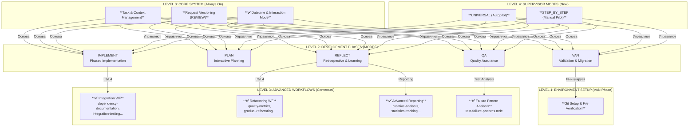
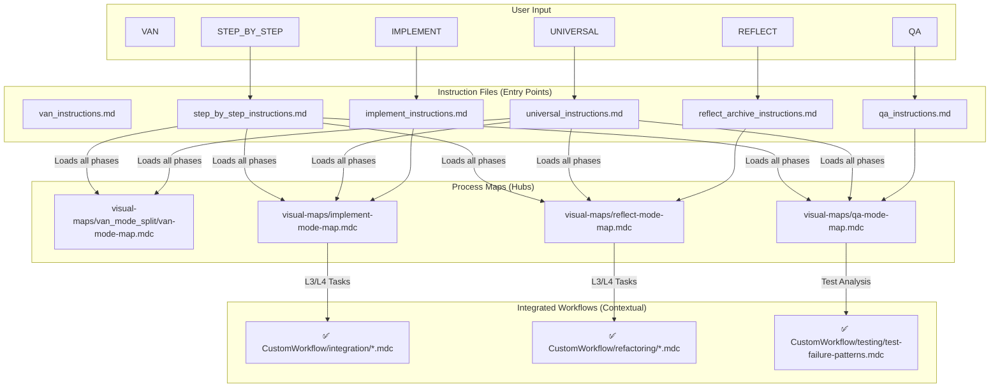

# Архитектура системы `cursor-memory-bank`

## 1. Обзор

`cursor-memory-bank` — это сложный, многоуровневый фреймворк для Cursor AI, разработанный для управления полным циклом разработки программного обеспечения. Его основная цель — обеспечить структурированный, повторяемый и надежный процесс, от первоначального анализа задачи до ее финальной архивации.

Система построена на принципах изоляции, модульности и контекстно-зависимой активации правил для максимальной эффективности и точности работы AI.

## 2. Ключевые принципы архитектуры

1.  **Изоляция и Модульность:** Система разделена на независимые режимы (`VAN`, `PLAN`, `CREATIVE` и т.д.) и рабочие процессы (`Refactoring`, `Integration`). Каждый модуль имеет четкую зону ответственности, что упрощает его поддержку и расширение.
2.  **Контекст — это всё:** Ядром системы является строгий менеджмент контекста. Задачи, запросы пользователя, состояние сессии и даже дата — все это управляется централизованно, чтобы AI всегда имел самую актуальную информацию и не терял фокус.
3.  **Адаптация к сложности:** Система распознает сложность задачи (Уровни 1-4) и автоматически загружает соответствующий набор правил и рабочих процессов. Простые задачи решаются быстро, а сложные проходят через все необходимые этапы планирования и проектирования.
4.  **Автоматизация с возможностью контроля:** Система предлагает два глобальных режима управления:
    *   `UNIVERSAL` (автопилот): Полностью автоматическое выполнение всех фаз разработки.
    *   `STEP_BY_STEP` (ручное управление): Пошаговое выполнение с подтверждением от пользователя на каждом этапе.
5.  **Управляемое пользователем взаимодействие:** Файл `interaction-mode.txt` (`AUTO`/`MANUAL`) позволяет пользователю в любой момент переключить стиль работы AI: от полностью автономного до интерактивного, с запросом подтверждения на ключевых этапах.

## 3. Многоуровневая структура правил

Система организована в логические уровни, каждый из которых строится на предыдущем. Эту иерархию лучше всего иллюстрирует **Дерево связности правил**.

-   **LEVEL 0: Ядро системы:** Правила, которые активны всегда (`alwaysApply: true`). Они управляют задачами, контекстом, датой и режимом взаимодействия, формируя фундамент всей системы.
-   **LEVEL 1: Настройка окружения:** Правила, которые запускаются в самом начале работы (в режиме `VAN`). Они проверяют Git, файловую систему и готовят рабочее пространство.
-   **LEVEL 2: Фазы разработки (Режимы):** Основные рабочие режимы, видимые пользователю (`PLAN`, `IMPLEMENT` и т.д.). Каждый режим решает свою конкретную задачу в цикле разработки.
-   **LEVEL 3: Продвинутые рабочие процессы:** Специализированные модули, которые вызываются контекстно в зависимости от сложности задачи. Например, `Refactoring Workflow` активируется в режиме `REFLECT` для задач уровня L3/L4.
-   **LEVEL 4: Режимы-супервайзоры:** Высокоуровневые режимы `UNIVERSAL` и `STEP_BY_STEP`, которые координируют работу всех остальных фаз.

## 4. Процесс загрузки правил и файлов

Запуск любого режима инициирует цепочку загрузки правил. Пользовательская команда активирует "файл инструкций", который, в свою очередь, загружает "карту процесса", а та — конкретные правила.

**Граф загрузки файлов** наглядно показывает эту иерархию.

## 5. Ключевые подсистемы

### 5.1. Task Management 2.0
Система полностью отходит от монолитного `tasks.md` в пользу атомарной структуры:
-   **Структура:** `memory-bank/tasks/{todo,in_progress,done}/`
-   **Именование:** `YYYY-MM-DD-PRIORITY-CATEGORY-task-name.md`
-   **Преимущества:** Упрощает автоматизацию, отслеживание и архивацию задач.

### 5.2. Context & Request Versioning
Это двойная система для сохранения "ментального состояния" AI и истории диалога.
-   **`current-context.md`:** Содержит самый последний запрос пользователя (`LATEST_REQUEST`) и полную историю предыдущих запросов (`REQUEST_HISTORY`).
-   **Механизм:** Перед обработкой новой команды система автоматически перемещает старый запрос в историю.
-   **Преимущества:** Предотвращает потерю контекста, позволяет AI понимать эволюцию задачи.

### 5.3. Datetime Manager & Interaction Mode
-   **`datetime-manager.mdc`:** Централизованно устанавливает текущую дату и время из командной строки в начале каждой сессии. Это решает проблему использования AI устаревших или захардкоженных дат.
-   **`interaction-mode.txt`:** Файл, содержащий `AUTO` или `MANUAL`. Позволяет пользователю "на лету" переключать поведение AI, требуя либо полного доверия, либо ручного подтверждения ключевых решений.

## 6. Заключение

Архитектура `cursor-memory-bank` представляет собой зрелый и мощный фреймворк. Она сочетает в себе строгую структуру (фазы, уровни сложности) с необходимой гибкостью (режимы `AUTO`/`MANUAL`, `STEP_BY_STEP`). Централизованное управление контекстом, задачами и датой обеспечивает надежность, а модульная система правил позволяет легко расширять функциональность в будущем.
