# Context Management Architecture

> **Comprehensive overview of Memory Bank's context management system**

## 🏗️ System Overview

Memory Bank's context management system provides seamless continuity across development sessions through intelligent state preservation and restoration.

## 📊 Architecture Diagram

```mermaid
graph TB
    subgraph "User Interface"
        UserInput[👤 User Commands<br>VAN, CONTINUE, etc.]
        Commands[🎯 Command Processor]
    end

    subgraph "Context Management Core"
        ContextEngine[🧠 Context Engine]
        StateManager[📊 State Manager]
        ModeController[🔄 Mode Controller]
    end

    subgraph "Storage Layer"
        CurrentContext[(📄 current-context.md)]
        InteractionMode[(📝 interaction-mode.txt)]
        TasksFile[(📋 tasks.md)]
        ProgressFile[(📊 progress.md)]
    end

    subgraph "Discovery Services"
        RuleScanner[📁 Rule Scanner]
        TaskDiscovery[🔍 Task Discovery]
        ProjectAnalyzer[📊 Project Analyzer]
    end

    subgraph "Archive System"
        ArchiveManager[📦 Archive Manager]
        ReflectionStore[🤔 Reflection Store]
        CreativeStore[🎨 Creative Store]
    end

    UserInput --> Commands
    Commands --> ContextEngine

    ContextEngine --> StateManager
    ContextEngine --> ModeController

    StateManager --> CurrentContext
    StateManager --> InteractionMode
    StateManager --> TasksFile
    StateManager --> ProgressFile

    ContextEngine --> RuleScanner
    ContextEngine --> TaskDiscovery
    ContextEngine --> ProjectAnalyzer

    ModeController --> ArchiveManager
    ArchiveManager --> ReflectionStore
    ArchiveManager --> CreativeStore

    style UserInput fill:#4da6ff,stroke:#0066cc,color:white
    style ContextEngine fill:#d94dbb,stroke:#a3378a,color:white
    style StateManager fill:#4dbb5f,stroke:#36873f,color:white
    style ModeController fill:#ffa64d,stroke:#cc7a30,color:white
```



## 🔧 Core Components

### Context Engine
**Responsibilities:**
- Process user commands (CONTINUE, SHOW CONTEXT, etc.)
- Coordinate context save/restore operations
- Manage session lifecycle
- Handle error recovery

**Key Methods:**
```typescript
interface ContextEngine {
  saveContext(mode: string, taskData: TaskData): Promise<void>
  restoreContext(): Promise<ContextData>
  clearContext(): Promise<void>
  validateContext(): Promise<boolean>
}
```

### State Manager
**Responsibilities:**
- File system operations for context data
- Data serialization/deserialization
- Backup and recovery operations
- Data integrity validation

**Storage Format:**
```yaml
# current-context.md structure
metadata:
  last_updated: "2025-06-20T14:30:00Z"
  status: "ACTIVE" | "PAUSED" | "COMPLETED"
  session_id: "uuid"

current_request: "Original user request text"
working_mode:
  active_mode: "IMPLEMENT"
  phase: "Phase 3 of 4"
  complexity_level: "Level 3"

task_context:
  task_id: "CONTEXT-MGMT-2025-06-20"
  progress: 75
  next_steps: ["Complete Phase 4", "Update docs"]

session_metrics:
  start_time: "2025-06-20T12:15:00Z"
  active_time: "2h 15m"
  commands_executed: 47
```

### Mode Controller
**Responsibilities:**
- Manage Memory Bank mode transitions
- Coordinate with context system during mode changes
- Handle mode-specific context operations
- Ensure proper cleanup on completion

**Mode Integration:**
```typescript
interface ModeController {
  initializeMode(mode: string, context?: ContextData): Promise<void>
  transitionMode(fromMode: string, toMode: string): Promise<void>
  finalizeMode(mode: string): Promise<void>
}
```

## 🔍 Discovery Services

### Rule Scanner
**Purpose:** Automatically discover project rules and configuration

**Scan Targets:**
- `rules/*.md` files
- Configuration files (`package.json`, `tsconfig.json`, etc.)
- Documentation files
- Project guidelines

**Example Output:**
```typescript
interface RuleScanResult {
  files: Array<{
    path: string
    size: string
    lines: number
    type: 'rule' | 'config' | 'doc'
  }>
  totalFiles: number
  totalSize: string
}
```

### Task Discovery
**Purpose:** Find existing tasks and work items in project

**Search Patterns:**
```typescript
const searchPatterns = {
  todo: /TODO|FIXME|HACK|NOTE:/gi,
  checkboxes: /- \[ \]/g,
  russian: /нужно|требуется|добавить|исправить/gi
}
```

**Discovery Process:**
1. Scan all `.md` files
2. Extract task markers
3. Categorize by priority
4. Present findings to user

### Project Analyzer
**Purpose:** Analyze project structure and provide insights

**Analysis Areas:**
- Project size and complexity
- Technology stack detection
- Dependency analysis
- Code quality metrics

## 💾 Data Flow

### Context Save Flow


### Context Restore Flow


## 🚨 Error Handling

### Context Corruption Recovery

```mermaid
flowchart TD
    Error[🚨 Context Error Detected] --> CheckBackup{📦 Backup Available?}

    CheckBackup -->|Yes| RestoreBackup[🔄 Restore from Backup]
    CheckBackup -->|No| ManualRecovery[👤 Manual Recovery]

    RestoreBackup --> ValidateRestore{✅ Restore Valid?}
    ValidateRestore -->|Yes| Success[✅ Recovery Complete]
    ValidateRestore -->|No| ManualRecovery

    ManualRecovery --> ClearContext[🗑️ Clear Context]
    ClearContext --> NewSession[🚀 Start New Session]

    Success --> Resume[▶️ Resume Work]
    NewSession --> Resume

    style Error fill:#ff5555,stroke:#cc0000,color:white
    style Success fill:#5fd94d,stroke:#3da336,color:white
    style Resume fill:#4da6ff,stroke:#0066cc,color:white
```


### Recovery Strategies
1. **Automatic Recovery**: Restore from latest backup
2. **Partial Recovery**: Salvage valid portions of context
3. **Manual Recovery**: User-guided context reconstruction
4. **Emergency Reset**: Clear context and start fresh

## 📈 Performance Characteristics

### Target Metrics
- **Context Save Time**: < 2 seconds
- **Context Restore Time**: < 5 seconds
- **File Size Limit**: < 50KB per context
- **Memory Usage**: < 10MB for context system
- **Reliability**: 99.9% successful operations

### Optimization Strategies
```typescript
// Lazy loading for large contexts
class ContextManager {
  private contextCache = new Map<string, ContextData>()

  async loadContext(sessionId: string): Promise<ContextData> {
    if (this.contextCache.has(sessionId)) {
      return this.contextCache.get(sessionId)!
    }

    const context = await this.loadFromDisk(sessionId)
    this.contextCache.set(sessionId, context)
    return context
  }

  // Compress large contexts
  private compressContext(context: ContextData): string {
    return gzip(JSON.stringify(context))
  }
}
```

## 🔗 Integration Points

### Memory Bank Modes
Each mode integrates with context system:

**VAN Mode:**
- Creates initial context
- Discovers project tasks and rules
- Sets complexity level

**PLAN/CREATIVE/IMPLEMENT/QA Modes:**
- Updates context with progress
- Saves mode-specific data
- Triggers auto-save on milestones

**REFLECT/ARCHIVE Modes:**
- Finalizes context data
- Creates permanent records
- Clears active context

### File System Integration
```typescript
interface FileSystemAdapter {
  // Core context operations
  saveContext(path: string, data: ContextData): Promise<void>
  loadContext(path: string): Promise<ContextData>

  // Backup operations
  createBackup(path: string): Promise<string>
  restoreBackup(backupPath: string): Promise<void>

  // Discovery operations
  scanRules(directory: string): Promise<RuleScanResult>
  findTasks(patterns: string[]): Promise<TaskDiscoveryResult>
}
```

### External Tool Integration
- **Git Integration**: Context saves trigger git commits
- **IDE Integration**: Context data available to editor extensions
- **CI/CD Integration**: Context data in build metadata
- **Monitoring**: Context metrics for system health

## 🛡️ Security Considerations

### Data Protection
- Context files are user-readable only
- Sensitive data filtering before save
- Backup encryption for critical projects
- Audit trail for context operations

### Privacy
- No external data transmission
- Local-only context storage
- User control over data retention
- Opt-out mechanisms for sensitive projects

## 🔮 Future Enhancements

### Planned Features
1. **Multi-Project Context**: Support for multiple simultaneous projects
2. **Team Context Sharing**: Collaborative context management
3. **AI-Powered Insights**: Smart suggestions based on context history
4. **Advanced Analytics**: Detailed productivity metrics
5. **Cloud Backup**: Optional cloud storage for context data

### Extensibility
```typescript
interface ContextPlugin {
  name: string
  version: string

  onContextSave?(context: ContextData): Promise<ContextData>
  onContextRestore?(context: ContextData): Promise<ContextData>
  onModeTransition?(from: string, to: string): Promise<void>
}

class ContextSystem {
  private plugins: ContextPlugin[] = []

  registerPlugin(plugin: ContextPlugin): void {
    this.plugins.push(plugin)
  }
}
```

This architecture ensures robust, scalable context management that grows with Memory Bank's capabilities while maintaining simplicity and reliability.