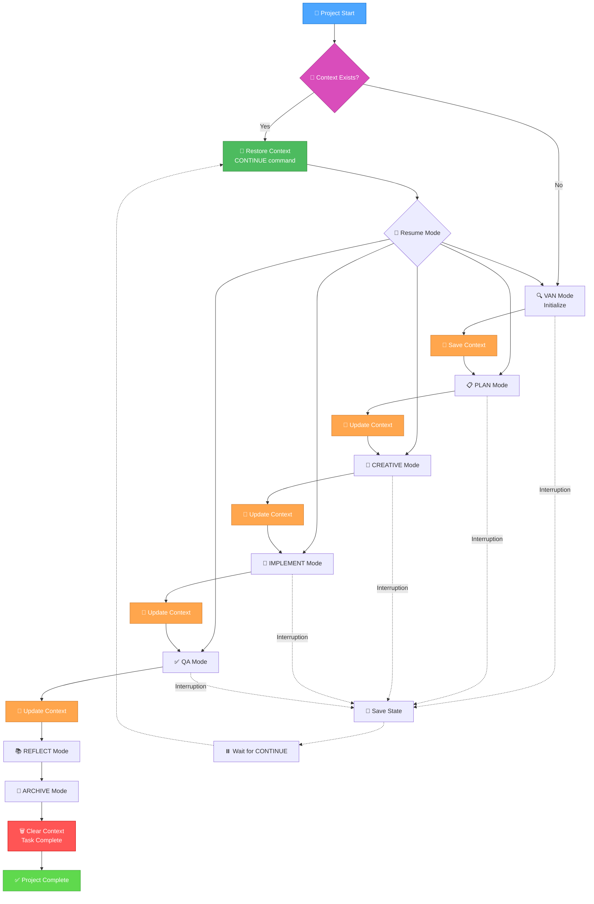
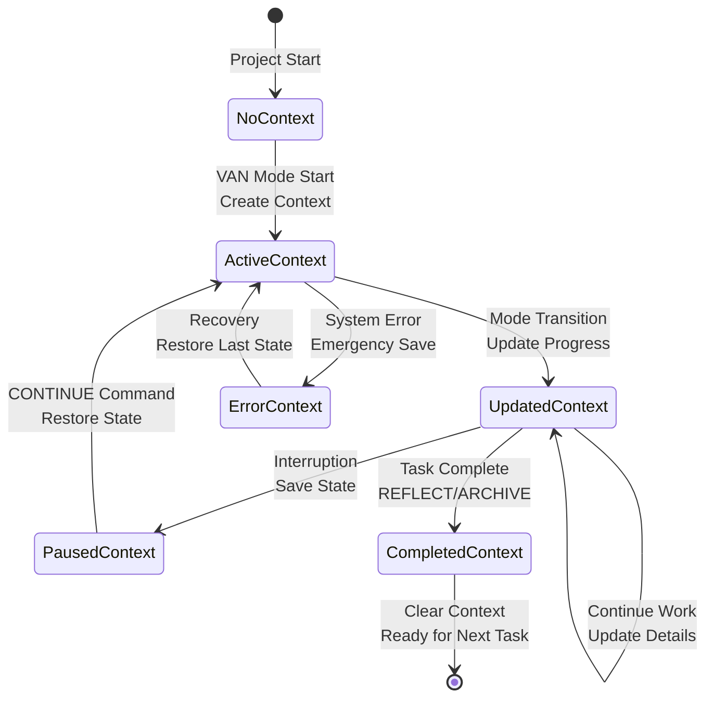
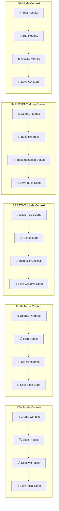
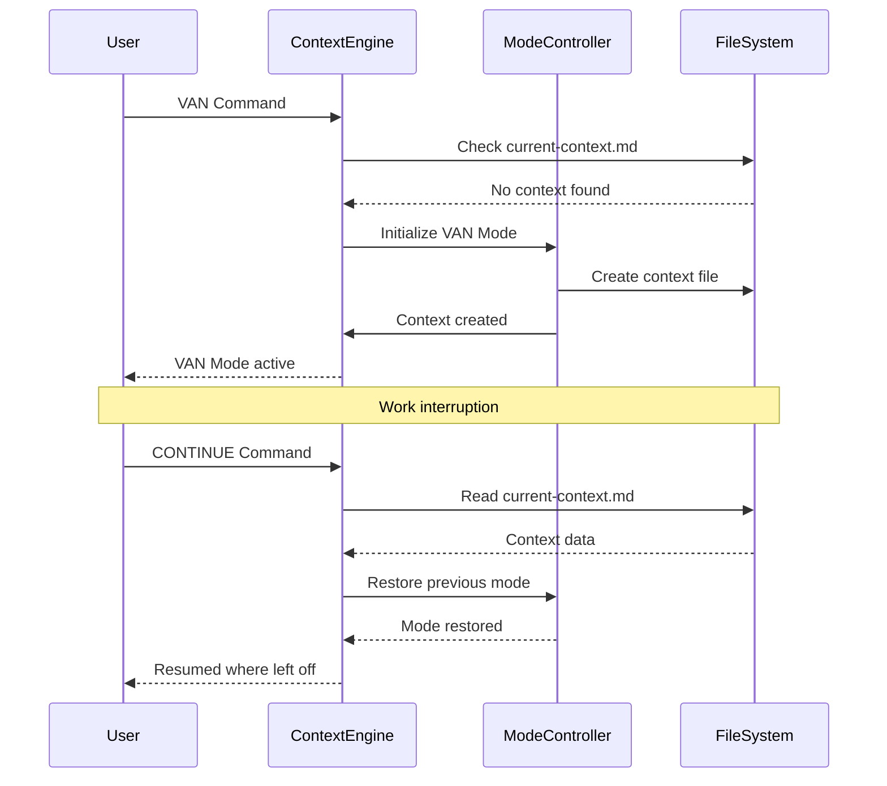
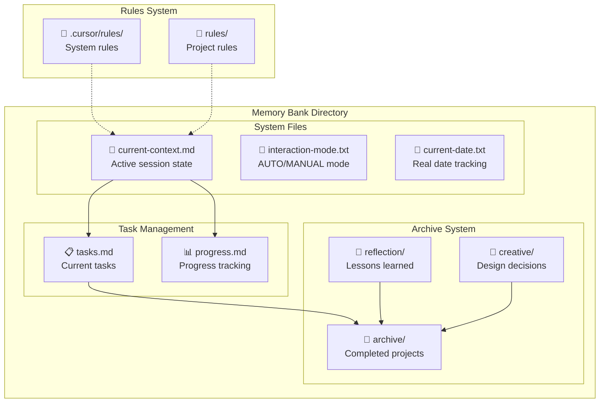
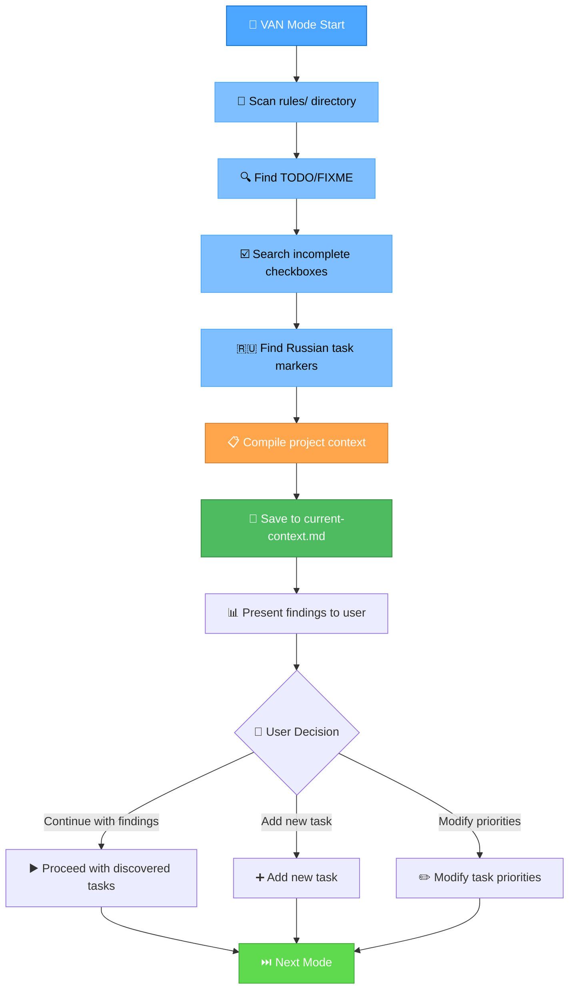
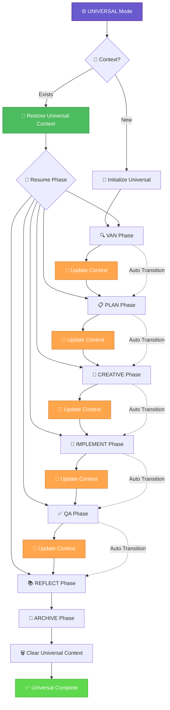
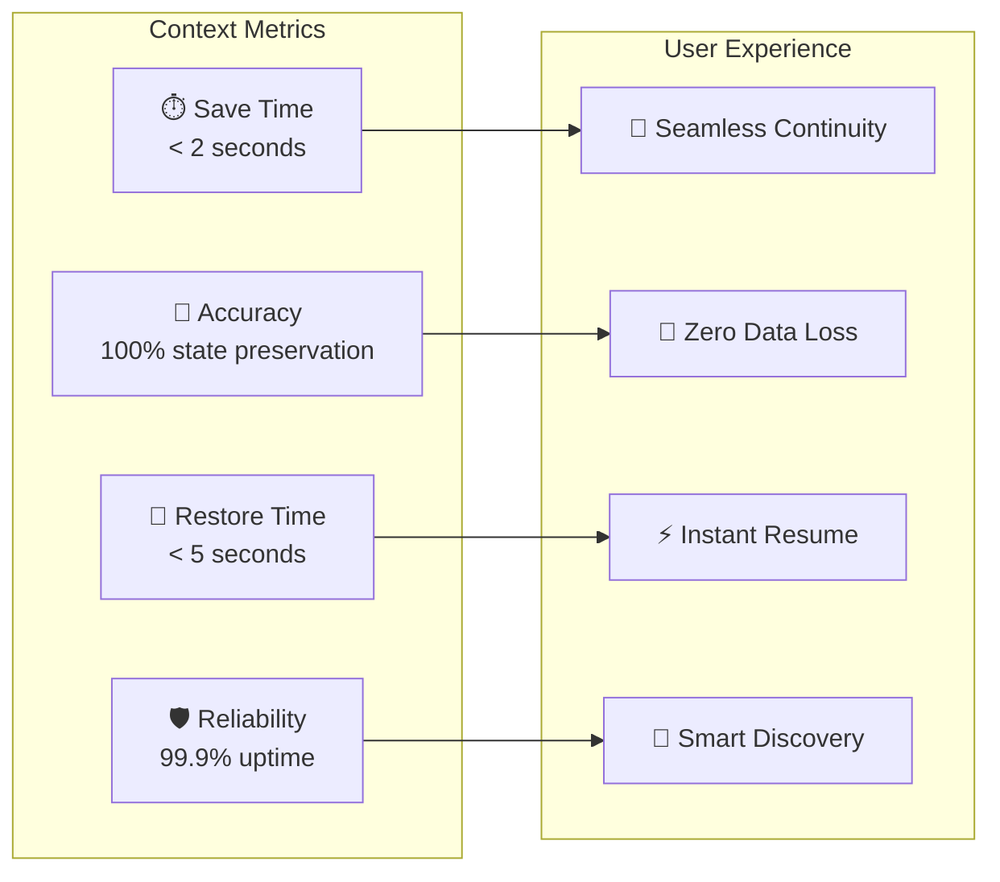

# Memory Bank Workflow Diagrams

> **Comprehensive visual guide to Memory Bank workflows with context management**

## 🔄 Complete Workflow with Context Management

## 📊 Context Lifecycle Management

## 🎯 Mode-Specific Context Operations

## 🔧 Command Flow with Context

## 📁 File System Integration

## 🚀 Project Discovery Flow

## 🔄 Universal Mode with Context

## 📈 Context Performance Metrics

This comprehensive workflow documentation shows how Memory Bank's context management system ensures seamless development continuity across all modes and scenarios.