# Memory Bank Workflow Guide

This comprehensive guide explains how to effectively use Memory Bank's workflow system for different types of development tasks. Learn when to use each mode, how to transition between them, and best practices for maximum productivity.

## 🎯 Understanding Workflow Complexity

Memory Bank adapts its workflow based on task complexity, ensuring you use the right amount of process for each situation.

### Complexity Levels Overview

| Level | Duration | Description | Workflow |
|-------|----------|-------------|----------|
| **Level 1** | 5-30 min | Quick bug fixes, small corrections | VAN → IMPLEMENT → REFLECT → ARCHIVE |
| **Level 2** | 1-4 hours | Simple enhancements, feature additions | VAN → PLAN → IMPLEMENT → REFLECT → ARCHIVE |
| **Level 3** | 1-3 days | New feature development | VAN → PLAN → CREATIVE → IMPLEMENT → QA → REFLECT → ARCHIVE |
| **Level 4** | 1+ weeks | Complex systems, major refactoring | VAN → PLAN → CREATIVE → IMPLEMENT → QA → REFLECT → ARCHIVE |

## 🔍 Level 1: Quick Bug Fix Workflow

**Best for**: Hotfixes, typos, small corrections, configuration updates

### Workflow Steps



```mermaid
graph LR
    A[🔍 VAN] --> B[🔨 IMPLEMENT] --> C[📚 REFLECT] --> D[📁 ARCHIVE]
```

#### Step 1: VAN Mode (5 minutes)
**Objective**: Quickly identify and understand the issue

**Activities**:
- Analyze the bug report or issue description
- Locate the problematic code
- Assess the scope of the fix
- Confirm it's truly a Level 1 task

**Key Questions**:
- What exactly is broken?
- Where is the issue located?
- Will this fix affect other parts of the system?
- Can this be fixed in under 30 minutes?

**Output**: Clear understanding of the problem and fix location

#### Step 2: IMPLEMENT Mode (15-20 minutes)
**Objective**: Apply the fix quickly and safely

**Activities**:
- Make the minimal necessary changes
- Test the fix locally
- Verify no regression is introduced
- Update any relevant comments

**Best Practices**:
- Keep changes as small as possible
- Test the specific issue that was reported
- Check for similar issues in nearby code
- Document the change in commit message

**Output**: Working fix that resolves the issue

#### Step 3: REFLECT Mode (3-5 minutes)
**Objective**: Capture lessons and prevent similar issues

**Activities**:
- Document what caused the issue
- Note any patterns or root causes
- Update documentation if needed
- Consider if preventive measures are needed

**Key Questions**:
- Why did this issue occur?
- How can we prevent similar issues?
- Should we add tests or documentation?
- Are there other places with similar problems?

**Output**: Brief reflection document with lessons learned

#### Step 4: ARCHIVE Mode (2 minutes)
**Objective**: Preserve knowledge for future reference

**Activities**:
- Archive the fix details
- Tag with relevant keywords
- Link to related issues or documentation
- Update knowledge base

**Output**: Searchable archive entry for future reference

### Level 1 Example: React Form Validation Bug

```markdown
## VAN Analysis
**Issue**: Form submits with empty required fields
**Location**: `src/components/ContactForm.jsx`
**Root Cause**: Missing validation check
**Complexity**: Level 1 (simple validation fix)

## IMPLEMENT Solution
**Change**: Added validation check before form submission
**Files Modified**: `src/components/ContactForm.jsx`
**Testing**: Verified form blocks submission with empty fields

## REFLECT Insights
**Lesson**: Form validation should be checked both client and server side
**Prevention**: Add validation tests to prevent regression
**Pattern**: Similar forms may have same issue

## ARCHIVE
**Keywords**: form-validation, react, bug-fix
**Related**: Issue #123, ContactForm component
```

## 📋 Level 2: Simple Enhancement Workflow

**Best for**: Feature additions, UI improvements, performance optimizations

### Workflow Steps


#### Step 1: VAN Mode (10-15 minutes)
**Objective**: Understand requirements and assess scope

**Activities**:
- Analyze the enhancement request
- Review existing code and architecture
- Identify affected components
- Confirm Level 2 complexity

**Key Questions**:
- What exactly needs to be enhanced?
- How does this fit with existing architecture?
- What are the acceptance criteria?
- Are there any dependencies or constraints?

**Output**: Clear understanding of requirements and scope

#### Step 2: PLAN Mode (30-60 minutes)
**Objective**: Design the enhancement approach

**Activities**:
- Break down the enhancement into tasks
- Design the implementation approach
- Identify potential risks or challenges
- Plan testing strategy

**Planning Template**:
```markdown
## Enhancement Plan: [Feature Name]

### Requirements
- [ ] Requirement 1
- [ ] Requirement 2

### Implementation Approach
1. **Phase 1**: [Description]
2. **Phase 2**: [Description]

### Files to Modify
- `file1.js`: [Changes needed]
- `file2.css`: [Changes needed]

### Testing Plan
- [ ] Unit tests for new functionality
- [ ] Integration tests
- [ ] Manual testing scenarios

### Risks & Mitigation
- **Risk**: [Description]
  - **Mitigation**: [Strategy]
```

**Output**: Detailed implementation plan

#### Step 3: IMPLEMENT Mode (2-3 hours)
**Objective**: Build the enhancement according to plan

**Activities**:
- Follow the implementation plan
- Build incrementally and test frequently
- Update documentation as you go
- Handle any unexpected issues

**Best Practices**:
- Implement in small, testable chunks
- Commit frequently with descriptive messages
- Test each piece before moving to the next
- Update plan if you discover new requirements

**Output**: Working enhancement that meets requirements

#### Step 4: REFLECT Mode (15-20 minutes)
**Objective**: Document learnings and improvements

**Activities**:
- Review what went well and what didn't
- Document any deviations from the plan
- Capture insights about the codebase
- Note opportunities for future improvements

**Reflection Template**:
```markdown
## Enhancement Reflection: [Feature Name]

### What Went Well
- [Success 1]
- [Success 2]

### Challenges Encountered
- [Challenge 1]: [How resolved]
- [Challenge 2]: [How resolved]

### Lessons Learned
- [Lesson 1]
- [Lesson 2]

### Future Improvements
- [Improvement opportunity 1]
- [Improvement opportunity 2]
```

**Output**: Comprehensive reflection document

#### Step 5: ARCHIVE Mode (5-10 minutes)
**Objective**: Preserve knowledge and create reusable assets

**Activities**:
- Archive the complete enhancement documentation
- Create templates for similar enhancements
- Update team knowledge base
- Tag for easy discovery

**Output**: Archived enhancement with searchable metadata

## 🎨 Level 3: Feature Development Workflow

**Best for**: New features, significant UI changes, API development

### Workflow Steps



```mermaid
graph LR
    A[🔍 VAN] --> B[📋 PLAN] --> C[🎨 CREATIVE] --> D[🔨 IMPLEMENT] --> E[✅ QA] --> F[📚 REFLECT] --> G[📁 ARCHIVE]
```

#### Step 1: VAN Mode (20-30 minutes)
**Objective**: Comprehensive analysis of feature requirements

**Activities**:
- Analyze detailed feature requirements
- Review existing system architecture
- Identify integration points
- Assess technical complexity and risks

**Analysis Framework**:
```markdown
## Feature Analysis: [Feature Name]

### Business Requirements
- **Primary Goal**: [Description]
- **Success Metrics**: [How to measure success]
- **User Stories**: [Key user scenarios]

### Technical Assessment
- **Complexity**: Level 3
- **Estimated Effort**: [Time estimate]
- **Dependencies**: [External dependencies]
- **Risks**: [Technical risks]

### Architecture Impact
- **New Components**: [List]
- **Modified Components**: [List]
- **Integration Points**: [List]
```

#### Step 2: PLAN Mode (1-2 hours)
**Objective**: Create comprehensive implementation strategy

**Activities**:
- Design system architecture
- Plan implementation phases
- Define APIs and data structures
- Create detailed task breakdown

**Planning Deliverables**:
- Architecture diagrams
- API specifications
- Database schema changes
- Implementation timeline
- Testing strategy

#### Step 3: CREATIVE Mode (2-4 hours)
**Objective**: Design user experience and technical solutions

**Activities**:
- Design user interface and user experience
- Create wireframes or mockups
- Design technical architecture patterns
- Make key design decisions

**Creative Deliverables**:
- UI/UX designs
- Technical architecture decisions
- Design system components
- Interaction patterns

#### Step 4: IMPLEMENT Mode (1-2 days)
**Objective**: Build the feature in phases

**Implementation Phases**:
1. **Foundation**: Core data structures and APIs
2. **Core Logic**: Main feature functionality
3. **User Interface**: Frontend components
4. **Integration**: Connect all pieces
5. **Polish**: Refinements and optimizations

**Best Practices**:
- Implement in phases with testing at each stage
- Regular commits with descriptive messages
- Continuous integration and testing
- Regular progress updates

#### Step 5: QA Mode (2-4 hours)
**Objective**: Comprehensive quality assurance

**QA Activities**:
- Functional testing of all features
- Integration testing
- Performance testing
- Security review
- Accessibility testing
- Cross-browser/device testing

**QA Checklist**:
```markdown
## QA Checklist: [Feature Name]

### Functional Testing
- [ ] All user stories work as expected
- [ ] Edge cases handled properly
- [ ] Error conditions handled gracefully

### Integration Testing
- [ ] APIs work correctly
- [ ] Database operations successful
- [ ] External integrations functional

### Performance Testing
- [ ] Page load times acceptable
- [ ] API response times within limits
- [ ] No memory leaks detected

### Security Review
- [ ] Input validation implemented
- [ ] Authentication/authorization correct
- [ ] No sensitive data exposed

### Accessibility
- [ ] Keyboard navigation works
- [ ] Screen reader compatible
- [ ] Color contrast sufficient
```

#### Step 6: REFLECT Mode (30-45 minutes)
**Objective**: Comprehensive learning capture

**Activities**:
- Analyze the entire development process
- Document technical decisions and rationale
- Capture lessons learned
- Identify process improvements

#### Step 7: ARCHIVE Mode (15-20 minutes)
**Objective**: Create comprehensive knowledge repository

**Activities**:
- Archive all design and development artifacts
- Create feature documentation
- Update system documentation
- Create reusable templates and patterns

## 🏗️ Level 4: Complex System Workflow

**Best for**: Major system changes, architectural refactoring, new product development

### Workflow Steps


Level 4 follows the same workflow as Level 3 but with significantly more depth and rigor at each stage.

#### Key Differences from Level 3:

**VAN Mode (1-2 hours)**:
- Comprehensive stakeholder analysis
- Detailed technical feasibility study
- Risk assessment and mitigation planning
- Resource and timeline estimation

**PLAN Mode (1-2 days)**:
- Detailed system architecture design
- Phased implementation strategy
- Comprehensive testing strategy
- Deployment and rollback plans

**CREATIVE Mode (2-3 days)**:
- Extensive design exploration
- Multiple design alternatives
- Stakeholder review and feedback
- Design system creation

**IMPLEMENT Mode (1+ weeks)**:
- Phased implementation with milestones
- Continuous integration and deployment
- Regular stakeholder demos
- Iterative feedback incorporation

**QA Mode (2-3 days)**:
- Comprehensive testing across all dimensions
- Performance and load testing
- Security audits
- User acceptance testing

**REFLECT Mode (2-3 hours)**:
- Comprehensive project retrospective
- Process improvement recommendations
- Knowledge transfer sessions
- Success metrics analysis

**ARCHIVE Mode (1-2 hours)**:
- Complete project documentation
- Best practices documentation
- Template and pattern creation
- Knowledge base updates

## 🔄 Mode Transition Best Practices

### When to Move Forward
- All exit criteria for current mode are met
- Deliverables are complete and reviewed
- No blocking issues remain
- Next mode's entry criteria are satisfied

### When to Go Back
- New information changes previous decisions
- Quality issues are discovered
- Requirements change significantly
- Technical blockers require redesign

### Transition Checklist
```markdown
## Mode Transition Checklist

### Current Mode Completion
- [ ] All planned activities completed
- [ ] Deliverables created and reviewed
- [ ] Exit criteria met
- [ ] Issues resolved or documented

### Next Mode Preparation
- [ ] Entry criteria verified
- [ ] Resources available
- [ ] Dependencies resolved
- [ ] Plan updated if needed

### Documentation
- [ ] Progress updated in tasks.md
- [ ] Context updated in activeContext.md
- [ ] Lessons captured
- [ ] Next steps documented
```

## 🎯 Workflow Customization

### Adapting Workflows to Your Needs

**For Solo Developers**:
- Reduce documentation overhead for Level 1-2 tasks
- Focus on personal learning in REFLECT mode
- Simplify CREATIVE mode for straightforward features

**For Teams**:
- Add review checkpoints at mode transitions
- Include stakeholder approval gates
- Enhance documentation for knowledge sharing
- Add collaboration activities in CREATIVE mode

**For Enterprise**:
- Add compliance checkpoints
- Include security reviews at each stage
- Enhance documentation requirements
- Add formal approval processes

### Common Customizations

**Skip Modes**: For very simple tasks, you might skip CREATIVE or QA modes
**Combine Modes**: For small enhancements, combine PLAN and CREATIVE
**Iterate Modes**: For complex features, iterate between CREATIVE and PLAN
**Parallel Modes**: For large teams, run some modes in parallel

## 📊 Workflow Metrics and Optimization

### Key Metrics to Track

**Efficiency Metrics**:
- Time spent in each mode
- Number of mode transitions
- Rework frequency
- Delivery time vs. estimates

**Quality Metrics**:
- Defect rate by complexity level
- Customer satisfaction scores
- Technical debt accumulation
- Test coverage achieved

**Learning Metrics**:
- Knowledge capture frequency
- Template reuse rate
- Process improvement suggestions
- Team skill development

### Optimization Strategies

**Reduce Mode Switching**:
- Better upfront analysis in VAN mode
- More thorough planning in PLAN mode
- Clear exit criteria for each mode

**Improve Quality**:
- Enhanced QA checklists
- Better testing strategies
- Regular architecture reviews

**Accelerate Learning**:
- Regular reflection sessions
- Knowledge sharing meetings
- Template and pattern libraries

## 🚨 Common Workflow Pitfalls

### 1. Complexity Misjudgment
**Problem**: Choosing wrong complexity level
**Solution**: Use VAN mode analysis, be willing to adjust

### 2. Mode Skipping
**Problem**: Skipping modes to save time
**Solution**: Understand that each mode adds value

### 3. Insufficient Planning
**Problem**: Rushing through PLAN mode
**Solution**: Invest time upfront to save time later

### 4. Poor Documentation
**Problem**: Inadequate documentation during development
**Solution**: Document as you go, not at the end

### 5. Weak Reflection
**Problem**: Skipping or rushing REFLECT mode
**Solution**: Treat reflection as investment in future productivity

## 📚 Advanced Workflow Techniques

### Workflow Patterns

**Spike Pattern**: For research-heavy tasks
```
VAN → CREATIVE (Research) → PLAN → IMPLEMENT → QA → REFLECT → ARCHIVE
```

**Prototype Pattern**: For experimental features
```
VAN → CREATIVE (Prototype) → REFLECT → PLAN → IMPLEMENT → QA → REFLECT → ARCHIVE
```

**Refactoring Pattern**: For code improvement
```
VAN → PLAN (Analysis) → IMPLEMENT (Refactor) → QA (Validation) → REFLECT → ARCHIVE
```

### Workflow Automation

**Automated Transitions**:
- Use CI/CD to trigger QA mode
- Automated testing to validate IMPLEMENT mode
- Automated documentation generation

**Template Automation**:
- Auto-generate planning templates
- Pre-populate reflection templates
- Automated archive organization

## 🔗 Integration with Development Tools

### Version Control Integration
- Use mode names in branch naming
- Tag commits with mode context
- Create mode-specific commit templates

### Project Management Integration
- Map modes to project phases
- Use mode transitions as milestones
- Track time spent in each mode

### Documentation Integration
- Auto-link mode artifacts
- Generate mode-based reports
- Create searchable knowledge base

---

**Next Steps**: Now that you understand the workflows, explore the [Modes Reference](modes-reference.md) for detailed guidance on each mode, or check out [Best Practices](best-practices.md) for advanced techniques.