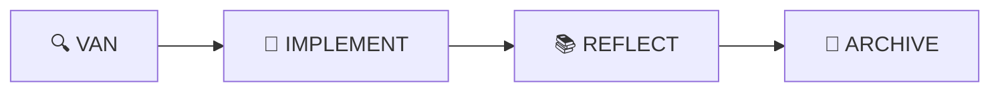
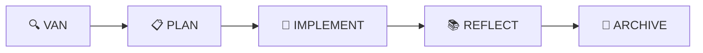
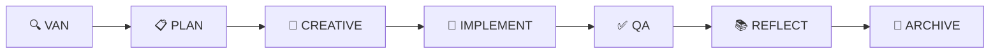

# Руководство по рабочим процессам Memory Bank

Это комплексное руководство объясняет, как эффективно использовать систему рабочих процессов Memory Bank для различных типов задач разработки. Изучите, когда использовать каждый режим, как переходить между ними, и лучшие практики для максимальной продуктивности.

## 🎯 Понимание сложности рабочих процессов

Memory Bank адаптирует свой рабочий процесс на основе сложности задачи, обеспечивая использование правильного количества процессов для каждой ситуации.

### Обзор уровней сложности

| Уровень | Длительность | Описание | Рабочий процесс |
|---------|--------------|----------|-----------------|
| **Уровень 1** | 5-30 мин | Быстрые исправления ошибок, мелкие корректировки | VAN → IMPLEMENT → REFLECT → ARCHIVE |
| **Уровень 2** | 1-4 часа | Простые улучшения, добавление функций | VAN → PLAN → IMPLEMENT → REFLECT → ARCHIVE |
| **Уровень 3** | 1-3 дня | Разработка новых функций | VAN → PLAN → CREATIVE → IMPLEMENT → QA → REFLECT → ARCHIVE |
| **Уровень 4** | 1+ недель | Сложные системы, крупный рефакторинг | VAN → PLAN → CREATIVE → IMPLEMENT → QA → REFLECT → ARCHIVE |

## 🔍 Уровень 1: Рабочий процесс быстрого исправления ошибок

**Лучше всего для**: Горячие исправления, опечатки, мелкие корректировки, обновления конфигурации

### Шаги рабочего процесса



#### Шаг 1: VAN режим (5 минут)
**Цель**: Быстро идентифицировать и понять проблему

**Активности**:
- Анализ отчета об ошибке или описания проблемы
- Локализация проблемного кода
- Оценка области исправления
- Подтверждение, что это действительно задача Уровня 1

**Ключевые вопросы**:
- Что именно сломано?
- Где находится проблема?
- Повлияет ли это исправление на другие части системы?
- Можно ли это исправить менее чем за 30 минут?

**Результат**: Четкое понимание проблемы и места исправления

#### Шаг 2: IMPLEMENT режим (15-20 минут)
**Цель**: Применить исправление быстро и безопасно

**Активности**:
- Внести минимально необходимые изменения
- Протестировать исправление локально
- Убедиться, что не введена регрессия
- Обновить соответствующие комментарии

**Лучшие практики**:
- Сохранять изменения как можно меньшими
- Тестировать конкретную проблему, которая была сообщена
- Проверить похожие проблемы в близлежащем коде
- Документировать изменение в сообщении коммита

**Результат**: Работающее исправление, которое решает проблему

#### Шаг 3: REFLECT режим (3-5 минут)
**Цель**: Захватить уроки и предотвратить похожие проблемы

**Активности**:
- Документировать, что вызвало проблему
- Отметить любые паттерны или корневые причины
- Обновить документацию при необходимости
- Рассмотреть, нужны ли превентивные меры

**Ключевые вопросы**:
- Почему возникла эта проблема?
- Как мы можем предотвратить похожие проблемы?
- Следует ли добавить тесты или документацию?
- Есть ли другие места с похожими проблемами?

**Результат**: Краткий документ рефлексии с извлеченными уроками

#### Шаг 4: ARCHIVE режим (2 минуты)
**Цель**: Сохранить знания для будущего использования

**Активности**:
- Архивировать детали исправления
- Пометить соответствующими ключевыми словами
- Связать с соответствующими проблемами или документацией
- Обновить базу знаний

**Результат**: Поисковая запись архива для будущего использования

### Пример Уровня 1: Ошибка валидации React формы

```markdown
## VAN Анализ
**Проблема**: Форма отправляется с пустыми обязательными полями
**Местоположение**: `src/components/ContactForm.jsx`
**Корневая причина**: Отсутствует проверка валидации
**Сложность**: Уровень 1 (простое исправление валидации)

## IMPLEMENT Решение
**Изменение**: Добавлена проверка валидации перед отправкой формы
**Измененные файлы**: `src/components/ContactForm.jsx`
**Тестирование**: Проверено, что форма блокирует отправку с пустыми полями

## REFLECT Инсайты
**Урок**: Валидация формы должна проверяться как на клиенте, так и на сервере
**Предотвращение**: Добавить тесты валидации для предотвращения регрессии
**Паттерн**: Похожие формы могут иметь ту же проблему

## ARCHIVE
**Ключевые слова**: form-validation, react, bug-fix
**Связанное**: Issue #123, компонент ContactForm
```

## 📋 Уровень 2: Рабочий процесс простого улучшения

**Лучше всего для**: Добавление функций, улучшения UI, оптимизация производительности

### Шаги рабочего процесса



#### Шаг 1: VAN режим (10-15 минут)
**Цель**: Понять требования и оценить область

**Активности**:
- Анализ запроса на улучшение
- Обзор существующего кода и архитектуры
- Идентификация затронутых компонентов
- Подтверждение сложности Уровня 2

**Ключевые вопросы**:
- Что именно нужно улучшить?
- Как это вписывается в существующую архитектуру?
- Каковы критерии приемки?
- Есть ли зависимости или ограничения?

**Результат**: Четкое понимание требований и области

#### Шаг 2: PLAN режим (30-60 минут)
**Цель**: Спроектировать подход к улучшению

**Активности**:
- Разбить улучшение на задачи
- Спроектировать подход к реализации
- Идентифицировать потенциальные риски или вызовы
- Спланировать стратегию тестирования

**Шаблон планирования**:
```markdown
## План улучшения: [Название функции]

### Требования
- [ ] Требование 1
- [ ] Требование 2

### Подход к реализации
1. **Фаза 1**: [Описание]
2. **Фаза 2**: [Описание]

### Файлы для изменения
- `file1.js`: [Необходимые изменения]
- `file2.css`: [Необходимые изменения]

### План тестирования
- [ ] Юнит-тесты для новой функциональности
- [ ] Интеграционные тесты
- [ ] Сценарии ручного тестирования

### Риски и смягчение
- **Риск**: [Описание]
  - **Смягчение**: [Стратегия]
```

**Результат**: Детальный план реализации

#### Шаг 3: IMPLEMENT режим (2-3 часа)
**Цель**: Построить улучшение согласно плану

**Активности**:
- Следовать плану реализации
- Строить инкрементально и часто тестировать
- Обновлять документацию по ходу
- Обрабатывать любые неожиданные проблемы

**Лучшие практики**:
- Реализовывать небольшими, тестируемыми частями
- Часто коммитить с описательными сообщениями
- Тестировать каждую часть перед переходом к следующей
- Обновлять план при обнаружении новых требований

**Результат**: Работающее улучшение, которое соответствует требованиям

#### Шаг 4: REFLECT режим (15-20 минут)
**Цель**: Документировать обучение и улучшения

**Активности**:
- Обзор того, что прошло хорошо, а что нет
- Документировать любые отклонения от плана
- Захватить инсайты о кодовой базе
- Отметить возможности для будущих улучшений

**Шаблон рефлексии**:
```markdown
## Рефлексия улучшения: [Название функции]

### Что прошло хорошо
- [Успех 1]
- [Успех 2]

### Встреченные вызовы
- [Вызов 1]: [Как решено]
- [Вызов 2]: [Как решено]

### Извлеченные уроки
- [Урок 1]
- [Урок 2]

### Будущие улучшения
- [Возможность улучшения 1]
- [Возможность улучшения 2]
```

**Результат**: Комплексный документ рефлексии

#### Шаг 5: ARCHIVE режим (5-10 минут)
**Цель**: Сохранить знания и создать переиспользуемые активы

**Активности**:
- Архивировать полную документацию улучшения
- Создать шаблоны для похожих улучшений
- Обновить командную базу знаний
- Пометить для легкого обнаружения

**Результат**: Архивированное улучшение с поисковыми метаданными

## 🎨 Уровень 3: Рабочий процесс разработки функций

**Лучше всего для**: Новые функции, значительные изменения UI, разработка API

### Шаги рабочего процесса



#### Шаг 1: VAN режим (20-30 минут)
**Цель**: Комплексный анализ требований к функции

**Активности**:
- Анализ детальных требований к функции
- Обзор существующей архитектуры системы
- Идентификация точек интеграции
- Оценка технической сложности и рисков

**Фреймворк анализа**:
```markdown
## Анализ функции: [Название функции]

### Бизнес-требования
- **Основная цель**: [Описание]
- **Метрики успеха**: [Как измерить успех]
- **Пользовательские истории**: [Ключевые пользовательские сценарии]

### Техническая оценка
- **Сложность**: Уровень 3
- **Оценочные усилия**: [Оценка времени]
- **Зависимости**: [Внешние зависимости]
- **Риски**: [Технические риски]

### Влияние на архитектуру
- **Новые компоненты**: [Список]
- **Измененные компоненты**: [Список]
- **Точки интеграции**: [Список]
```

#### Шаг 2: PLAN режим (1-2 часа)
**Цель**: Создать комплексную стратегию реализации

**Активности**:
- Спроектировать архитектуру системы
- Спланировать фазы реализации
- Определить API и структуры данных
- Создать детальную разбивку задач

**Результаты планирования**:
- Диаграммы архитектуры
- Спецификации API
- Изменения схемы базы данных
- Временная линия реализации
- Стратегия тестирования

#### Шаг 3: CREATIVE режим (2-4 часа)
**Цель**: Спроектировать пользовательский опыт и технические решения

**Активности**:
- Спроектировать пользовательский интерфейс и опыт
- Создать wireframes или макеты
- Спроектировать паттерны технической архитектуры
- Принять ключевые дизайнерские решения

**Творческие результаты**:
- UI/UX дизайны
- Решения технической архитектуры
- Компоненты дизайн-системы
- Паттерны взаимодействия

#### Шаг 4: IMPLEMENT режим (1-2 дня)
**Цель**: Построить функцию по фазам

**Фазы реализации**:
1. **Основа**: Основные структуры данных и API
2. **Основная логика**: Главная функциональность функции
3. **Пользовательский интерфейс**: Frontend компоненты
4. **Интеграция**: Соединить все части
5. **Полировка**: Доработки и оптимизации

**Лучшие практики**:
- Реализовывать по фазам с тестированием на каждом этапе
- Регулярные коммиты с описательными сообщениями
- Непрерывная интеграция и тестирование
- Регулярные обновления прогресса

#### Шаг 5: QA режим (2-4 часа)
**Цель**: Комплексное обеспечение качества

**QA активности**:
- Функциональное тестирование всех функций
- Интеграционное тестирование
- Тестирование производительности
- Обзор безопасности
- Тестирование доступности
- Кросс-браузерное/устройственное тестирование

**QA чеклист**:
```markdown
## QA чеклист: [Название функции]

### Функциональное тестирование
- [ ] Все пользовательские истории работают как ожидается
- [ ] Граничные случаи обрабатываются правильно
- [ ] Условия ошибок обрабатываются корректно

### Интеграционное тестирование
- [ ] API работают корректно
- [ ] Операции базы данных успешны
- [ ] Внешние интеграции функциональны

### Тестирование производительности
- [ ] Время загрузки страниц приемлемо
- [ ] Время ответа API в пределах лимитов
- [ ] Утечки памяти не обнаружены

### Обзор безопасности
- [ ] Валидация ввода реализована
- [ ] Аутентификация/авторизация корректна
- [ ] Чувствительные данные не раскрыты

### Доступность
- [ ] Навигация с клавиатуры работает
- [ ] Совместимость со скрин-ридером
- [ ] Контраст цветов достаточен
```

#### Шаг 6: REFLECT режим (30-45 минут)
**Цель**: Комплексный захват обучения

**Активности**:
- Анализ всего процесса разработки
- Документирование технических решений и обоснований
- Захват извлеченных уроков
- Идентификация улучшений процесса

#### Шаг 7: ARCHIVE режим (15-20 минут)
**Цель**: Создать комплексный репозиторий знаний

**Активности**:
- Архивировать все артефакты дизайна и разработки
- Создать документацию функции
- Обновить системную документацию
- Создать переиспользуемые шаблоны и паттерны

## 🏗️ Уровень 4: Рабочий процесс сложной системы

**Лучше всего для**: Крупные системные изменения, архитектурный рефакторинг, разработка нового продукта

### Шаги рабочего процесса


Уровень 4 следует тому же рабочему процессу, что и Уровень 3, но со значительно большей глубиной и строгостью на каждом этапе.

#### Ключевые отличия от Уровня 3:

**VAN режим (1-2 часа)**:
- Комплексный анализ заинтересованных сторон
- Детальное исследование технической осуществимости
- Оценка рисков и планирование смягчения
- Оценка ресурсов и временных рамок

**PLAN режим (1-2 дня)**:
- Детальное проектирование архитектуры системы
- Поэтапная стратегия реализации
- Комплексная стратегия тестирования
- Планы развертывания и отката

**CREATIVE режим (2-3 дня)**:
- Обширное исследование дизайна
- Множественные альтернативы дизайна
- Обзор и обратная связь заинтересованных сторон
- Создание дизайн-системы

**IMPLEMENT режим (1+ недель)**:
- Поэтапная реализация с вехами
- Непрерывная интеграция и развертывание
- Регулярные демо для заинтересованных сторон
- Итеративное включение обратной связи

**QA режим (2-3 дня)**:
- Комплексное тестирование по всем измерениям
- Тестирование производительности и нагрузки
- Аудиты безопасности
- Пользовательское приемочное тестирование

**REFLECT режим (2-3 часа)**:
- Комплексная ретроспектива проекта
- Рекомендации по улучшению процесса
- Сессии передачи знаний
- Анализ метрик успеха

**ARCHIVE режим (1-2 часа)**:
- Полная документация проекта
- Документация лучших практик
- Создание шаблонов и паттернов
- Обновления базы знаний

## 🔄 Лучшие практики переходов между режимами

### Когда двигаться вперед
- Все критерии выхода для текущего режима выполнены
- Результаты завершены и проверены
- Не осталось блокирующих проблем
- Критерии входа следующего режима удовлетворены

### Когда возвращаться назад
- Новая информация изменяет предыдущие решения
- Обнаружены проблемы качества
- Требования значительно изменились
- Технические блокеры требуют редизайна

### Чеклист перехода
```markdown
## Чеклист перехода режима

### Завершение текущего режима
- [ ] Все запланированные активности завершены
- [ ] Результаты созданы и проверены
- [ ] Критерии выхода выполнены
- [ ] Проблемы решены или документированы

### Подготовка следующего режима
- [ ] Критерии входа проверены
- [ ] Ресурсы доступны
- [ ] Зависимости решены
- [ ] План обновлен при необходимости

### Документация
- [ ] Прогресс обновлен в tasks.md
- [ ] Контекст обновлен в activeContext.md
- [ ] Уроки захвачены
- [ ] Следующие шаги документированы
```

## 🎯 Кастомизация рабочих процессов

### Адаптация рабочих процессов к Вашим потребностям

**Для индивидуальных разработчиков**:
- Уменьшить накладные расходы документации для задач Уровня 1-2
- Сосредоточиться на личном обучении в REFLECT режиме
- Упростить CREATIVE режим для прямолинейных функций

**Для команд**:
- Добавить контрольные точки обзора при переходах режимов
- Включить точки одобрения заинтересованных сторон
- Улучшить документацию для обмена знаниями
- Добавить активности сотрудничества в CREATIVE режиме

**Для предприятий**:
- Добавить контрольные точки соответствия
- Включить обзоры безопасности на каждом этапе
- Улучшить требования к документации
- Добавить формальные процессы одобрения

### Общие кастомизации

**Пропуск режимов**: Для очень простых задач можно пропустить CREATIVE или QA режимы
**Объединение режимов**: Для небольших улучшений объединить PLAN и CREATIVE
**Итерация режимов**: Для сложных функций итерировать между CREATIVE и PLAN
**Параллельные режимы**: Для больших команд запускать некоторые режимы параллельно

## 📊 Метрики рабочих процессов и оптимизация

### Ключевые метрики для отслеживания

**Метрики эффективности**:
- Время, проведенное в каждом режиме
- Количество переходов режимов
- Частота переделок
- Время доставки против оценок

**Метрики качества**:
- Частота дефектов по уровню сложности
- Оценки удовлетворенности клиентов
- Накопление технического долга
- Достигнутое покрытие тестами

**Метрики обучения**:
- Частота захвата знаний
- Частота переиспользования шаблонов
- Предложения по улучшению процесса
- Развитие навыков команды

### Стратегии оптимизации

**Уменьшение переключений режимов**:
- Лучший предварительный анализ в VAN режиме
- Более тщательное планирование в PLAN режиме
- Четкие критерии выхода для каждого режима

**Улучшение качества**:
- Улучшенные QA чеклисты
- Лучшие стратегии тестирования
- Регулярные обзоры архитектуры

**Ускорение обучения**:
- Регулярные сессии рефлексии
- Встречи по обмену знаниями
- Библиотеки шаблонов и паттернов

## 🚨 Общие ошибки рабочих процессов

### 1. Неправильная оценка сложности
**Проблема**: Выбор неправильного уровня сложности
**Решение**: Использовать анализ VAN режима, быть готовым к корректировке

### 2. Пропуск режимов
**Проблема**: Пропуск режимов для экономии времени
**Решение**: Понимать, что каждый режим добавляет ценность

### 3. Недостаточное планирование
**Проблема**: Спешка через PLAN режим
**Решение**: Инвестировать время заранее, чтобы сэкономить время позже

### 4. Плохая документация
**Проблема**: Неадекватная документация во время разработки
**Решение**: Документировать по ходу, а не в конце

### 5. Слабая рефлексия
**Проблема**: Пропуск или спешка через REFLECT режим
**Решение**: Рассматривать рефлексию как инвестицию в будущую продуктивность

## 📚 Продвинутые техники рабочих процессов

### Паттерны рабочих процессов

**Паттерн исследования**: Для задач с большим объемом исследований
```
VAN → CREATIVE (Исследование) → PLAN → IMPLEMENT → QA → REFLECT → ARCHIVE
```

**Паттерн прототипа**: Для экспериментальных функций
```
VAN → CREATIVE (Прототип) → REFLECT → PLAN → IMPLEMENT → QA → REFLECT → ARCHIVE
```

**Паттерн рефакторинга**: Для улучшения кода
```
VAN → PLAN (Анализ) → IMPLEMENT (Рефакторинг) → QA (Валидация) → REFLECT → ARCHIVE
```

### Автоматизация рабочих процессов

**Автоматизированные переходы**:
- Использовать CI/CD для запуска QA режима
- Автоматизированное тестирование для валидации IMPLEMENT режима
- Автоматизированная генерация документации

**Автоматизация шаблонов**:
- Автогенерация шаблонов планирования
- Предзаполнение шаблонов рефлексии
- Автоматизированная организация архива

## 🔗 Интеграция с инструментами разработки

### Интеграция с контролем версий
- Использовать названия режимов в именовании веток
- Помечать коммиты контекстом режима
- Создать шаблоны коммитов для режимов

### Интеграция с управлением проектами
- Сопоставить режимы с фазами проекта
- Использовать переходы режимов как вехи
- Отслеживать время, проведенное в каждом режиме

### Интеграция документации
- Автосвязывание артефактов режимов
- Генерация отчетов на основе режимов
- Создание поисковой базы знаний

---

**Следующие шаги**: Теперь, когда Вы понимаете рабочие процессы, изучите [Справочник режимов](modes-reference_ru.md) для детального руководства по каждому режиму, или ознакомьтесь с [Лучшими практиками](best-practices_ru.md) для продвинутых техник.