# Level 1 Example: Quick Bug Fix

## 📋 Scenario Overview

**Context**: A React application has a login form that's not submitting properly
**Goal**: Identify and fix the form submission issue
**Complexity**: Level 1 (Quick Bug Fix)
**Time**: ~15 minutes

## 🎯 Learning Objectives

After this example, you will understand:
- How VAN mode analyzes simple issues
- Level 1 workflow for quick fixes
- Direct problem-to-solution approach
- Minimal documentation requirements

## 📝 Step-by-Step Walkthrough

### Step 1: Initialize VAN Mode

**User Input:**
```
VAN
```

**Memory Bank Response:**
```
🔍 VAN MODE ACTIVATED

Initializing Memory Bank for your project...
- Platform detected: macOS (darwin 23.6.0)
- Project structure analyzed: React application
- Package manager: npm detected

Please describe the issue you're experiencing.
```

### Step 2: Describe the Problem

**User Input:**
```
My login form isn't submitting. When users click the submit button, nothing happens.
```

**Memory Bank Analysis:**
```
📊 ISSUE ANALYSIS

Issue Type: Form submission bug
Complexity Assessment: Level 1 (Quick Bug Fix)
Estimated Time: 10-15 minutes

🔍 ANALYSIS COMPLETE
- Simple, isolated issue
- Clear problem statement
- Likely quick resolution

Proceeding with Level 1 workflow...
```

### Step 3: Code Examination

**Memory Bank Action:**
```
🔍 Examining login form code...

Found: src/components/LoginForm.jsx
```

**Code Found:**
```jsx
// src/components/LoginForm.jsx
import React, { useState } from 'react';

const LoginForm = () => {
  const [email, setEmail] = useState('');
  const [password, setPassword] = useState('');

  const handleSubmit = (e) => {
    // Missing e.preventDefault()!
    console.log('Submitting:', { email, password });
    // Form submission logic here
  };

  return (
    <form onSubmit={handleSubmit}>
      <input
        type="email"
        value={email}
        onChange={(e) => setEmail(e.target.value)}
        placeholder="Email"
      />
      <input
        type="password"
        value={password}
        onChange={(e) => setPassword(e.target.value)}
        placeholder="Password"
      />
      <button type="submit">Login</button>
    </form>
  );
};

export default LoginForm;
```

### Step 4: Problem Identification

**Memory Bank Analysis:**
```
🎯 PROBLEM IDENTIFIED

Issue: Missing e.preventDefault() in form submit handler
Effect: Form submits to server causing page reload
Solution: Add e.preventDefault() to prevent default form behavior

This is a common React form handling issue.
```

### Step 5: Implement Fix

**Memory Bank Implementation:**
```jsx
// src/components/LoginForm.jsx
import React, { useState } from 'react';

const LoginForm = () => {
  const [email, setEmail] = useState('');
  const [password, setPassword] = useState('');

  const handleSubmit = (e) => {
    e.preventDefault(); // ✅ Added this line
    console.log('Submitting:', { email, password });
    // Form submission logic here
  };

  return (
    <form onSubmit={handleSubmit}>
      <input
        type="email"
        value={email}
        onChange={(e) => setEmail(e.target.value)}
        placeholder="Email"
        required
      />
      <input
        type="password"
        value={password}
        onChange={(e) => setPassword(e.target.value)}
        placeholder="Password"
        required
      />
      <button type="submit">Login</button>
    </form>
  );
};

export default LoginForm;
```

### Step 6: Test the Fix

**Memory Bank Testing:**
```
🧪 TESTING FIX

1. Start development server: npm start
2. Navigate to login page
3. Fill in form fields
4. Click submit button
5. Verify: No page reload, console shows form data

✅ Test Result: Form now submits correctly without page reload
```

### Step 7: Update Documentation

**Memory Bank Documentation:**
```
📝 UPDATING TASKS.MD

## Bug Fix: Login Form Submission

### Issue
- Login form was causing page reload on submission
- Missing e.preventDefault() in submit handler

### Solution
- Added e.preventDefault() to handleSubmit function
- Form now handles submission properly

### Status: ✅ COMPLETE
```

## 🔍 Key Takeaways

### Level 1 Characteristics
- **Simple, isolated issues** with clear symptoms
- **Direct problem-to-solution** approach
- **Minimal planning** required
- **Quick resolution** (under 30 minutes)

### VAN Mode Efficiency
- **Rapid analysis** of straightforward issues
- **Immediate transition** to implementation
- **Focused documentation** on the specific fix
- **No complex workflow** needed

### Common Level 1 Issues
- Missing event handlers
- Typos in variable names
- Incorrect import paths
- Simple logic errors
- Missing CSS properties

## 🔗 Related Resources

- **[Level 2 Enhancement Example](../level-2-enhancement/scenario.md)** - More complex issues
- **[VAN Mode Reference](../../docs/user-guide/modes-reference.md)** - Complete mode documentation
- **[Best Practices](../../docs/user-guide/best-practices.md)** - Optimization tips

---

## 📊 Workflow Summary

```mermaid
graph LR
    A[🔍 VAN<br>Initialize] --> B[📝 Describe<br>Issue]
    B --> C[🔍 Analyze<br>Code]
    C --> D[🎯 Identify<br>Problem]
    D --> E[🔨 Implement<br>Fix]
    E --> F[🧪 Test<br>Solution]
    F --> G[📝 Document<br>Fix]
```



**Total Time**: 15 minutes
**Files Modified**: 1
**Complexity**: Minimal
**Documentation**: Basic

> 💡 **Pro Tip**: Level 1 issues are perfect for learning Memory Bank basics. They provide immediate feedback and build confidence with the system.