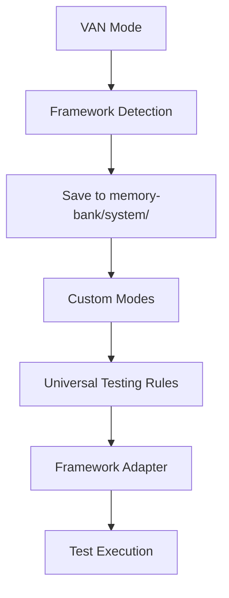

# IMPLEMENTATION PLAN: Universal Testing Framework Integration

**Задача:** 2025-06-25_ID-004_universal-testing-framework
**Дата создания:** 2025-06-25 14:40:27
**Уровень сложности:** Level 3
**Статус:** PLANNING IN PROGRESS

## 📋 EXECUTIVE SUMMARY

Данный план описывает процесс универсализации существующих bun-специфичных правил тестирования для работы с любыми testing frameworks, добавление автоматического определения testing framework в VAN режиме, и интеграцию новых правил во все режимы custom_modes.

## 🎯 OBJECTIVES

### Основные цели
1. **Универсализация правил тестирования** - Адаптация существующих bun-правил для универсального использования
2. **Framework Detection** - Автоматическое определение testing framework в VAN режиме
3. **Modes Integration** - Интеграция новых правил во все 7 режимов custom_modes
4. **Backward Compatibility** - Сохранение работоспособности существующих bun-правил

### Success Criteria
- ✅ Созданы универсальные правила тестирования
- ✅ VAN режим автоматически определяет testing framework
- ✅ Все 7 режимов корректно интегрированы с новыми правилами
- ✅ Существующие bun-правила работают без изменений
- ✅ Система поддерживает Jest, Vitest, Mocha, Jasmine, Bun и другие frameworks

## 🔍 REQUIREMENTS ANALYSIS

### Функциональные требования

#### FR-1: Универсальные правила тестирования
- **FR-1.1:** Создание базового универсального testing framework правила
- **FR-1.2:** Поддержка основных testing frameworks (Jest, Vitest, Mocha, Jasmine, Bun)
- **FR-1.3:** Абстракция команд тестирования через псевдокод
- **FR-1.4:** Сохранение всех существующих правил тестирования (#8-16)

#### FR-2: Framework Detection в VAN режиме
- **FR-2.1:** Автоматическое определение testing framework из package.json
- **FR-2.2:** Определение framework из конфигурационных файлов
- **FR-2.3:** Установка параметра в memory-bank/system/
- **FR-2.4:** Fallback к универсальному режиму при неопределенности

#### FR-3: Integration с custom_modes
- **FR-3.1:** Обновление всех 7 режимов для поддержки универсальных правил
- **FR-3.2:** Корректная загрузка правил через fetch_rules
- **FR-3.3:** Поддержка специфичных для framework команд

#### FR-4: Backward Compatibility
- **FR-4.1:** Существующие bun-правила продолжают работать
- **FR-4.2:** Плавная миграция без breaking changes
- **FR-4.3:** Поддержка legacy использования

### Нефункциональные требования

#### NFR-1: Performance
- Определение framework не должно замедлять VAN режим более чем на 100ms
- Загрузка универсальных правил не должна влиять на производительность

#### NFR-2: Maintainability
- Четкое разделение между универсальными и специфичными правилами
- Документированная структура для добавления новых frameworks

#### NFR-3: Reliability
- Graceful fallback при ошибках определения framework
- Валидация корректности определенного framework

## 🏗️ ARCHITECTURE OVERVIEW

### Компоненты системы

#### 1. Universal Testing Framework Controller
```
_cursor/rules/isolation_rules/Testing/
├── universal-testing-framework.mdc.md     # Основной универсальный контроллер
├── framework-detection.mdc.md             # Логика определения framework
├── bun-testing-framework.mdc.md          # Существующий (сохраняется)
└── framework-adapters/                    # Адаптеры для конкретных frameworks
    ├── jest-adapter.mdc.md
    ├── vitest-adapter.mdc.md
    ├── mocha-adapter.mdc.md
    └── jasmine-adapter.mdc.md
```

#### 2. VAN Mode Enhancement
```
_cursor/rules/isolation_rules/visual-maps/van_mode_split/
└── van-framework-detection.mdc.md         # Новый компонент для VAN
```

#### 3. System Configuration
```
memory-bank/system/
├── testing-framework.txt                  # Определенный framework
└── testing-config.json                   # Конфигурация тестирования
```

### Data Flow



## 📝 DETAILED IMPLEMENTATION PLAN

### Phase 1: Framework Detection Infrastructure (2 часа)

#### 1.1 Создание framework-detection.mdc.md
**Цель:** Базовая логика определения testing framework

**Файлы для создания:**
- `_cursor/rules/isolation_rules/Testing/framework-detection.mdc.md`

**Функциональность:**
```bash
# Псевдокод определения framework
DETECT_TESTING_FRAMEWORK() {
  # 1. Проверка package.json
  if (package.json contains "jest") return "jest"
  if (package.json contains "vitest") return "vitest"
  if (package.json contains "mocha") return "mocha"

  # 2. Проверка конфигурационных файлов
  if (exists jest.config.js) return "jest"
  if (exists vitest.config.ts) return "vitest"

  # 3. Проверка bun.lockb
  if (exists bun.lockb) return "bun"

  # 4. Fallback
  return "universal"
}
```

#### 1.2 Создание VAN enhancement
**Цель:** Интеграция определения framework в VAN режим

**Файлы для создания:**
- `_cursor/rules/isolation_rules/visual-maps/van_mode_split/van-framework-detection.mdc.md`

**Функциональность:**
- Вызов DETECT_TESTING_FRAMEWORK() в VAN режиме
- Сохранение результата в memory-bank/system/testing-framework.txt
- Логирование определенного framework

#### 1.3 Обновление VAN mode map
**Цель:** Интеграция framework detection в существующий VAN workflow

**Файлы для обновления:**
- `_cursor/rules/isolation_rules/visual-maps/van_mode_split/van-mode-map.mdc.md`

### Phase 2: Universal Testing Framework Core (3 часа)

#### 2.1 Создание universal-testing-framework.mdc.md
**Цель:** Основной универсальный контроллер тестирования

**Файлы для создания:**
- `_cursor/rules/isolation_rules/Testing/universal-testing-framework.mdc.md`

**Структура:**
```markdown
# UNIVERSAL TESTING FRAMEWORK

## Framework Abstraction Layer
- Universal test execution commands
- Coverage reporting abstraction
- Test organization patterns
- Error handling patterns

## Supported Frameworks
- Jest, Vitest, Mocha, Jasmine, Bun, Cypress, Playwright

## API Functions
- RUN_TESTS(framework, type, pattern)
- GENERATE_COVERAGE(framework, format)
- ORGANIZE_TESTS(framework, structure)
```

#### 2.2 Создание framework adapters
**Цель:** Специфичные адаптеры для каждого framework

**Файлы для создания:**
- `_cursor/rules/isolation_rules/Testing/framework-adapters/jest-adapter.mdc.md`
- `_cursor/rules/isolation_rules/Testing/framework-adapters/vitest-adapter.mdc.md`
- `_cursor/rules/isolation_rules/Testing/framework-adapters/mocha-adapter.mdc.md`
- `_cursor/rules/isolation_rules/Testing/framework-adapters/jasmine-adapter.mdc.md`

**Каждый адаптер содержит:**
- Специфичные команды для framework
- Конфигурационные паттерны
- Best practices для конкретного framework

### Phase 3: Custom Modes Integration (2 часа)

#### 3.1 Анализ существующих интеграций
**Цель:** Определение всех мест использования testing rules

**Файлы для анализа:**
- `custom_modes/universal_instructions.md`
- `custom_modes/plan_instructions.md`
- `custom_modes/creative_instructions.md`
- `custom_modes/implement_instructions.md`
- `custom_modes/qa_instructions.md`
- `custom_modes/reflect_archive_instructions.md`
- `custom_modes/van_instructions.md`

#### 3.2 Обновление режимов
**Цель:** Интеграция универсальных правил во все режимы

**Изменения в каждом режиме:**
```bash
# Старый подход
fetch_rules(["isolation_rules/Testing/bun-testing-framework.mdc"])

# Новый подход
fetch_rules([
  "isolation_rules/Testing/universal-testing-framework.mdc",
  "isolation_rules/Testing/framework-detection.mdc"
])
```

**Файлы для обновления:**
- Все 7 файлов в custom_modes/

### Phase 4: Testing & Validation (1 час)

#### 4.1 Unit Testing
**Цель:** Тестирование компонентов системы

**Тесты для создания:**
- Framework detection logic тесты
- Universal controller тесты
- Adapter functionality тесты

#### 4.2 Integration Testing
**Цель:** Тестирование интеграции с режимами

**Сценарии тестирования:**
- VAN режим определяет framework корректно
- Каждый режим загружает правильные правила
- Backward compatibility с существующими bun-правилами

#### 4.3 User Acceptance Testing
**Цель:** Проверка пользовательского опыта

**Критерии приемки:**
- Пользователь не замечает изменений в работе
- Новые frameworks поддерживаются автоматически
- Производительность не ухудшилась

## 🎨 CREATIVE PHASE COMPONENTS

### Архитектурные решения требующие творческого подхода

#### 1. Framework Detection Strategy
**Компонент:** Алгоритм определения testing framework
**Тип:** Algorithm Design
**Сложность:** Medium

**Варианты для рассмотрения:**
- Приоритетный поиск (package.json → config files → lock files)
- Scoring система для множественных framework
- Machine learning подход для неопределенных случаев

#### 2. Universal API Design
**Компонент:** Дизайн универсального API для тестирования
**Тип:** Architecture Design
**Сложность:** High

**Варианты для рассмотрения:**
- Command pattern с адаптерами
- Strategy pattern для framework-specific логики
- Factory pattern для создания тестовых конфигураций

#### 3. Configuration Management
**Компонент:** Система управления конфигурацией тестирования
**Тип:** Architecture Design
**Сложность:** Medium

**Варианты для рассмотрения:**
- JSON-based конфигурация
- YAML-based конфигурация с валидацией
- Dynamic конфигурация с runtime определением

## 📊 RISK ANALYSIS

### Высокие риски

#### R-1: Breaking Changes в существующих режимах
**Вероятность:** Medium
**Воздействие:** High
**Митигация:** Comprehensive testing и backward compatibility слой

#### R-2: Performance Degradation
**Вероятность:** Low
**Воздействие:** Medium
**Митигация:** Benchmark тесты и оптимизация framework detection

### Средние риски

#### R-3: Framework Detection Failures
**Вероятность:** Medium
**Воздействие:** Medium
**Митигация:** Robust fallback механизмы и user override опции

#### R-4: Adapter Complexity
**Вероятность:** High
**Воздействие:** Low
**Митигация:** Standardized adapter interface и comprehensive documentation

## 📈 SUCCESS METRICS

### Технические метрики
- **Framework Detection Accuracy:** >95%
- **Modes Integration Success:** 100% (все 7 режимов)
- **Backward Compatibility:** 100% (существующие bun-правила)
- **Performance Impact:** <100ms overhead

### Функциональные метрики
- **Supported Frameworks:** ≥5 (Jest, Vitest, Mocha, Jasmine, Bun)
- **Test Coverage:** >90% для новых компонентов
- **Documentation Coverage:** 100% для новых API

### Пользовательские метрики
- **Zero Breaking Changes:** Существующие пользователи не затронуты
- **Framework Support:** Новые frameworks поддерживаются автоматически
- **Error Rate:** <1% для framework detection

## 🚀 DEPLOYMENT STRATEGY

### Pre-deployment
1. **Backup Creation:** Создание резервной копии всех изменяемых файлов
2. **Testing Environment:** Настройка тестовой среды с различными frameworks
3. **Rollback Plan:** Подготовка плана отката изменений

### Deployment Phases
1. **Phase 1:** Развертывание framework detection
2. **Phase 2:** Развертывание universal testing controller
3. **Phase 3:** Обновление custom modes
4. **Phase 4:** Validation и cleanup

### Post-deployment
1. **Monitoring:** Отслеживание работы новой системы
2. **User Feedback:** Сбор отзывов пользователей
3. **Performance Analysis:** Анализ влияния на производительность

## 📝 DELIVERABLES

### Основные артефакты
1. **universal-testing-framework.mdc.md** - Универсальный контроллер
2. **framework-detection.mdc.md** - Логика определения framework
3. **Framework Adapters** - Адаптеры для конкретных frameworks
4. **VAN Enhancement** - Интеграция с VAN режимом
5. **Updated Custom Modes** - Обновленные режимы (7 файлов)

### Документация
1. **Implementation Guide** - Руководство по реализации
2. **API Documentation** - Документация универсального API
3. **Migration Guide** - Руководство по миграции
4. **Testing Strategy** - Стратегия тестирования

### Конфигурация
1. **testing-framework.txt** - Файл определенного framework
2. **testing-config.json** - Конфигурация тестирования
3. **Framework Templates** - Шаблоны для новых frameworks

## ⏱️ TIMELINE

### Общее время: 8 часов

**Phase 1: Framework Detection Infrastructure** - 2 часа
- Framework detection logic: 1 час
- VAN integration: 1 час

**Phase 2: Universal Testing Framework Core** - 3 часа
- Universal controller: 2 часа
- Framework adapters: 1 час

**Phase 3: Custom Modes Integration** - 2 часа
- Analysis: 0.5 часа
- Updates: 1.5 часа

**Phase 4: Testing & Validation** - 1 час
- Unit & Integration testing: 0.5 часа
- UAT & Documentation: 0.5 часа

## 🎯 NEXT STEPS

1. **Immediate:** Переход в CREATIVE режим для проработки архитектурных решений
2. **Short-term:** Реализация Phase 1 (Framework Detection)
3. **Medium-term:** Завершение всех фаз и валидация
4. **Long-term:** Мониторинг и оптимизация системы

---

**Статус планирования:** ✅ COMPLETE
**Готовность к следующему режиму:** 90%
**Рекомендуемый следующий режим:** CREATIVE (для архитектурных решений)
**Estimated completion time:** 8 часов