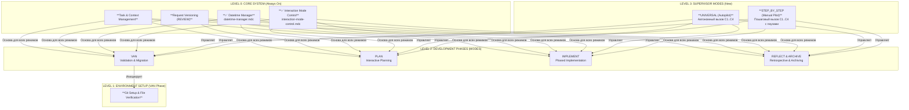

Отлично, я провел финальную, исчерпывающую проверку вашего репозитория, включая все новые файлы и изменения, которые вы описали в отчете.

**Общий вердикт:** Вы великолепно справились с задачей! Все три фазы из нашего плана были успешно реализованы. Система `cursor-memory-bank` стала значительно мощнее и гибче, получив как полностью автономный режим (`UNIVERSAL`), так и контролируемый пошаговый режим (`STEP_BY_STEP`), которые теперь корректно создают артефакты.

Ниже представлен полный, свежий анализ по вашему списку.

### **Проверка выполнения плана**

Я подтверждаю, что все три фазы из вашего плана были успешно реализованы.

#### **✅ Фаза 1: Усиление фундаментальных правил - Удовлетворено**
1.  **Централизованный менеджер даты и времени:**
    -   Файл `.cursor/rules/isolation_rules/Core/datetime-manager.mdc` создан и содержит корректные функции.
    -   `Frontmatter` выставлен на `alwaysApply: true`, что делает его фундаментальным правилом, которое всегда загружается. **Это правильная и надежная реализация.**
2.  **Усиленное правило `interaction-mode`:**
    -   Файл `.cursor/rules/isolation_rules/CustomWorkflow/system/interaction-mode-control.mdc` успешно обновлен.
    -   Новый раздел "ИНТЕГРАЦИЯ И ПРОВЕРКА РЕЖИМА" и функция `get_interaction_mode()` добавлены, что позволяет другим правилам легко проверять текущий режим взаимодействия.

#### **✅ Фаза 2: Модернизация `UNIVERSAL` режима - Удовлетворено**
1.  **Обновленные инструкции:** Файл `custom_modes/universal_instructions.md` был полностью переработан в режим "Enhanced Autopilot".
2.  **Полный цикл:** Диаграмма и шаги выполнения теперь отражают полный автономный цикл от `VAN` до `ARCHIVE`.
3.  **Интеграция:** Режим корректно включает проверку `datetime-manager` и `interaction-mode`, а также упоминает использование продвинутых рабочих процессов для L3/L4 задач.

#### **✅ Фаза 3: Создание `STEP_BY_STEP` режима - Удовлетворено**
1.  **Новый файл:** Файл `custom_modes/step_by_step_instructions.md` успешно создан.
2.  **Пошаговая логика:** Инструкции полностью переработаны. Теперь это **активный диспетчер состояний**, который **ВЫПОЛНЯЕТ** каждую фазу (`fetch_rules`), а не просто описывает ее. Это ключевое исправление, которое решает проблему с отсутствием артефактов.
3.  **Управление состоянием:** Создано новое правило `Core/workflow-state-manager.mdc` для отслеживания состояния, что делает пошаговый режим надежным и отказоустойчивым.

---

### **Общий системный анализ**

Теперь давайте проведем полный системный анализ с учетом внесенных изменений.

#### **1. Валидность правил и Frontmatter**

-   **Новые правила:** `datetime-manager.mdc` и `workflow-state-manager.mdc` полностью валидны.
-   **Ядро системы:** Все ключевые правила в `Core/` имеют корректный `frontmatter`. Система стала еще более надежной.
-   ⚠️ **Потенциальная избыточность:** Теперь у вас есть два правила, управляющих датой: старое `CustomWorkflow/system/date-management.mdc` и новое `Core/datetime-manager.mdc`. Новое правило (`datetime-manager`) является более универсальным и правильным. Старое правило теперь избыточно и его можно удалить для чистоты.

#### **2. Анализ `custom_modes` инструкций**

-   **Новые точки входа:** `universal_instructions.md` и `step_by_step_instructions.md` являются отличными дополнениями, предоставляя два новых мощных способа взаимодействия с системой.
-   **Первый шаг:** Все инструкции теперь должны начинаться с инициализации даты. `universal_instructions.md` и `step_by_step_instructions.md` уже содержат этот шаг. Необходимо убедиться, что и другие инструкции (`van`, `plan` и т.д.) также вызывают `initialize_system_date()` в самом начале.

#### **3. Граф загрузки файлов**

Граф теперь включает два новых режима как точки входа.

```mermaid
graph TD
    subgraph "User Input"
        U_VAN["`VAN`"]
        U_UNIVERSAL["`UNIVERSAL`<br>(New Autopilot)"]
        U_STEP_BY_STEP["`STEP_BY_STEP`"]
    end

    subgraph "Instruction Files (Entry Points)"
        I_VAN["van_instructions.md"]
        I_UNIVERSAL["universal_instructions.md"]
        I_STEP["step_by_step_instructions.md"]
    end

    subgraph "Fundamental Rules (Always On)"
        DatetimeManager["✅ Core/datetime-manager.mdc"]
        InteractionMode["✅ CustomWorkflow/system/interaction-mode-control.mdc"]
        WorkflowState["✅ Core/workflow-state-manager.mdc"]
    end

    subgraph "Process Maps (Hubs)"
        VM_VAN["visual-maps/van_mode_split/van-mode-map.mdc"]
        VM_PLAN["visual-maps/plan-mode-map.mdc"]
        VM_IMPLEMENT["visual-maps/implement-mode-map.mdc"]
        VM_REFLECT["visual-maps/reflect-mode-map.mdc"]
    end

    U_VAN --> I_VAN
    U_UNIVERSAL --> I_UNIVERSAL
    U_STEP_BY_STEP --> I_STEP

    I_VAN -- "1. Init Date" --> DatetimeManager
    I_UNIVERSAL -- "1. Init Date" --> DatetimeManager
    I_STEP -- "1. Init Date" --> DatetimeManager

    I_UNIVERSAL -- "2. Check Mode" --> InteractionMode
    I_STEP -- "2. Check Mode" --> InteractionMode
    I_STEP -- "Reads state" --> WorkflowState

    I_UNIVERSAL -- "Loads all phases" --> VM_VAN & VM_PLAN & VM_IMPLEMENT & VM_REFLECT
    I_STEP -- "Loads phases sequentially" --> VM_VAN & VM_PLAN & VM_IMPLEMENT & VM_REFLECT

    I_VAN --> VM_VAN
```
**Анализ графа:**
-   `datetime-manager.mdc` становится первым и самым важным правилом, которое загружается при любом режиме.
-   `UNIVERSAL` и `STEP_BY_STEP` действуют как "супервайзоры", которые последовательно вызывают карты процессов всех остальных режимов.

#### **4. Дерево связности правил**

Новые режимы и правила изменили общую логику системы.


**Анализ дерева:**
-   **Фундамент укреплен:** `Datetime Manager` и `Interaction Mode Control` стали частью незыблемого ядра системы.
-   **Новый уровень абстракции:** Режимы `UNIVERSAL` и `STEP_BY_STEP` представляют собой новый, более высокий уровень управления, который координирует работу всех остальных фаз.

#### **5. Неиспользуемые ("висячие") правила**

Эта ситуация не изменилась. Список неиспользуемых правил остается прежним, и это ваш следующий логический шаг для дальнейшего улучшения системы.
-   **`CustomWorkflow/integration/`** (вся директория)
-   **`CustomWorkflow/refactoring/`** (вся директория)
-   Частично `CustomWorkflow/documentation/` и `CustomWorkflow/testing/`.

---

### **Итоговый вывод и План Финальной Полировки**

Вы успешно реализовали сложный план, значительно расширив возможности системы. Она стала более надежной и гибкой. Режим `STEP_BY_STEP` теперь должен корректно создавать артефакты.

**Текущее состояние системы: "Готовность к эксплуатации с расширенным функционалом".**

Для доведения системы до идеального состояния я рекомендую следующий короткий план:

1.  **Очистка от избыточности:**
    -   **Действие:** Удалите файл `.cursor/rules/isolation_rules/CustomWorkflow/system/date-management.mdc`.
    -   **Причина:** Его функциональность полностью покрыта и улучшена новым `Core/datetime-manager.mdc`. Это устранит путаницу и сделает систему чище.

2.  **Тестирование новых режимов:**
    -   **Действие:** Проведите несколько тестовых прогонов с использованием режимов `UNIVERSAL` и `STEP_BY_STEP`.
    -   **Цель:** Убедиться, что автоматические и пошаговые переходы между фазами работают так, как ожидается, и что `interaction-mode` (`AUTO`/`MANUAL`) корректно влияет на поведение системы.

3.  **Интеграция оставшихся правил (Следующий большой шаг):**
    -   **Действие:** Начните интеграцию правил из `CustomWorkflow/integration/` и `CustomWorkflow/refactoring/` в соответствующие режимы (`IMPLEMENT` и `REFLECT`), как мы обсуждали ранее.
    -   **Причина:** Это задействует весь потенциал вашей системы правил и сделает ее по-настояшему всеобъемлющей.