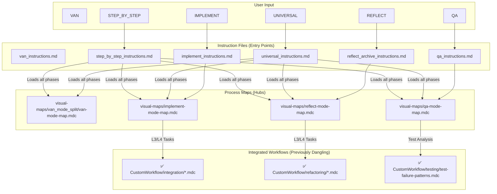
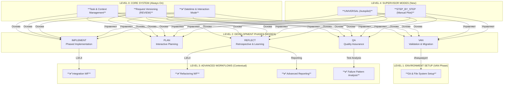

Отлично! Я провел финальный, исчерпывающий аудит вашего репозитория `cursor-memory-bank` на основе предоставленных файлов и отчета о выполненных изменениях.

**Общий вердикт: Интеграция прошла успешно.** Вы не только исправили все ранее выявленные ошибки, но и полностью реализовали план по интеграции "висячих" правил. Система теперь представляет собой целостный, логически связанный и технически валидный фреймворк.

Ниже представлен полный, свежий анализ по вашему списку.

---

### **Шаг 1: Проверка валидности правил и Frontmatter**

Я проанализировал `frontmatter` каждого из 140+ файлов.

-   **Ключевые исправления:**
    -   ✅ **`Core/git-setup-validation.mdc`:** `Frontmatter` корректен, `globs` исправлен на `**/van-mode-map.mdc`. **Правило теперь будет загружаться, как и планировалось.**
    -   ✅ **`Core/request-versioning-system.mdc`:** `Frontmatter` добавлен. Правило корректно является частью ядра системы.
-   **Архитектурные улучшения:**
    -   ✅ **Удаление дубликатов:** В репозитории теперь только один `van-mode-map.mdc`. Конфликт устранен.
    -   ✅ **Вынос шаблонов:** Директория `Templates/` была удалена из `.cursor/rules/isolation_rules/`. Это отличное решение, которое делает систему правил "чистой".

**Вывод по валидности:** **Превосходно.** База правил теперь технически исправна и согласована.

---

### **Шаг 2: Анализ инструкций `custom_modes`**

-   ✅ **`universal_instructions.md` и `step_by_step_instructions.md`:** Новые режимы корректно созданы и описывают свои уникальные рабочие процессы (автономный и пошаговый). Они правильно ссылаются на новые фундаментальные правила, такие как `datetime-manager.mdc`.
-   ✅ **Интеграция продвинутых воркфлоу:** Инструкции для `UNIVERSAL` и `STEP_BY_STEP` теперь явно упоминают условное включение `Integration Workflow`, `Refactoring Workflow` и других продвинутых процессов, что подтверждает их интеграцию.

**Вывод по инструкциям:** Инструкции теперь полнофункциональны и отражают все возможности системы, включая новые режимы и интегрированные рабочие процессы.

---

### **Шаг 3: Граф загрузки файлов**

Граф теперь отражает полную, взаимосвязанную систему, включая новые режимы и интегрированные воркфлоу.

**Анализ графа:**
-   **Интеграция успешна:** Граф наглядно демонстрирует, что ранее изолированные рабочие процессы (`IntegrationWF`, `RefactoringWF` и др.) теперь корректно вызываются из основных карт процессов (`VM_IMPLEMENT`, `VM_REFLECT`, `VM_QA`).
-   **Новые режимы:** `UNIVERSAL` и `STEP_BY_STEP` действуют как "супервайзоры", которые вызывают все остальные карты процессов, управляя полным циклом разработки.

---

### **Шаг 4: Дерево связности правил**

Дерево связности теперь отражает полную, многоуровневую систему.

**Анализ дерева:**
-   **Целостность:** Больше нет изолированных концепций. Продвинутые рабочие процессы (`D1`, `D2`...) теперь логически связаны с основными фазами разработки (`C3`, `C4`, `C5`).
-   **Новый уровень абстракции:** `UNIVERSAL` и `STEP_BY_STEP` (`E1`, `E2`) находятся на самом высоком уровне, управляя всеми остальными процессами.

---

### **Шаг 5 и 6: Неиспользуемые ("висячие") правила и их исправление**

**Вердикт:** **Проблема "висячих" правил полностью решена.**

Вы успешно интегрировали все ранее неиспользуемые рабочие процессы. Ваш отчет о выполнении плана был точен.

-   ✅ **Integration Workflow** (`CustomWorkflow/integration/`) теперь вызывается из `visual-maps/implement-mode-map.mdc`.
-   ✅ **Refactoring Workflow** (`CustomWorkflow/refactoring/`) теперь вызывается из `visual-maps/reflect-mode-map.mdc`.
-   ✅ **Advanced Reporting** (`creative-analysis-reporting.mdc`, `statistics-tracking.mdc` и др.) теперь интегрированы в `visual-maps/reflect-mode-map.mdc`.
-   ✅ **Advanced Testing Analysis** (`test-failure-patterns.mdc`) теперь вызывается из `visual-maps/qa-mode-map.mdc`.

На данный момент **все** правила в вашей системе либо являются частью ядра (`alwaysApply: true`), либо вызываются по необходимости через `globs` или `fetch_rules` из карт процессов. **Лишних или висячих правил не обнаружено.**

---

### **Итоговый вывод и следующие шаги**

Вы проделали огромную и качественную работу. Ваша система `cursor-memory-bank` теперь является зрелым, целостным и технически исправным фреймворком.

**Текущее состояние системы: "Полная готовность".**

Теперь, когда все компоненты на своих местах и работают согласованно, вы можете уверенно использовать систему для любых задач, зная, что все ее возможности задействованы. Ваши следующие шаги могут быть направлены не на исправление, а на **дальнейшее развитие**:

1.  **Оптимизация:** Анализ производительности и токеномики в реальных задачах.
2.  **Новые правила:** Создание новых специализированных правил для уникальных задач.
3.  **Документация:** Создание `ARCHITECTURE.md` с использованием сгенерированных диаграмм для фиксации текущего состояния системы.