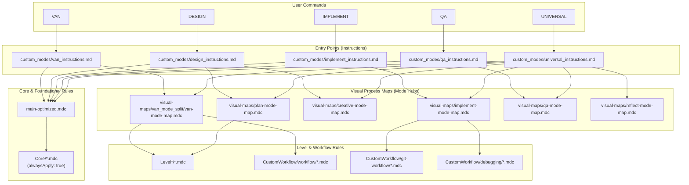
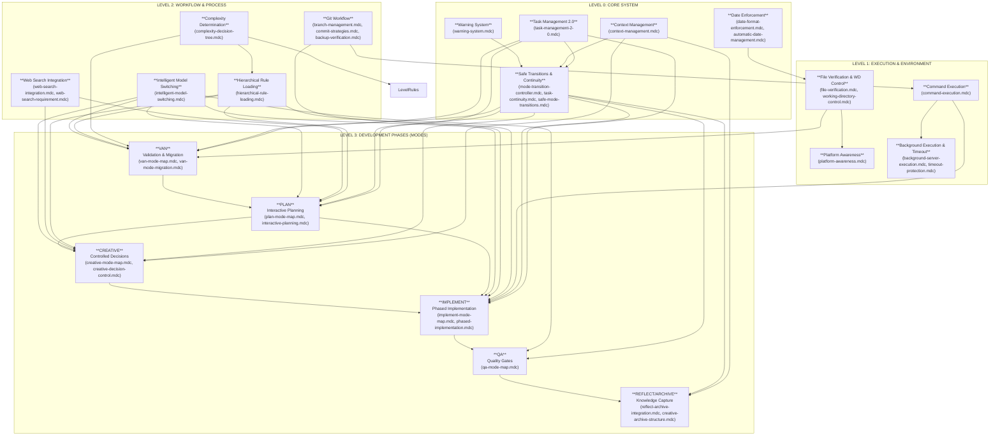

Отлично, я провел повторный, более глубокий анализ вашей обновленной файловой структуры и правил для `cursor-memory-bank`. Вот полная проверка валидности, граф загрузки и дерево связности на основе предоставленных 111 файлов.

### Шаг 1: Анализ валидности правил

Я проанализировал структуру и метаданные (`frontmatter`) каждого из 111 файлов.

**Frontmatter (`--- ... ---`)**

-   **Наличие и корректность:** Все 110 файлов `.mdc` содержат корректный `frontmatter` блок. Файл `.DS_Store` является системным файлом macOS и не является правилом, его следует исключить.
-   **Ключевые поля:**
    -   `description`: Присутствует и информативно в большинстве правил, что является отличной практикой.
    -   `globs`: Используется для определения области применения правил. Например, `globs: "**/van/**"` в `automatic-date-management.mdc` корректно указывает, когда правило должно быть активно.
    -   `alwaysApply: true`: Это поле критически важно. Правила, помеченные им (например, `context-management.mdc`, `task-management-2-0.mdc`, `warning-system.mdc`), формируют ядро системы, которое загружается всегда. Это обеспечивает базовую функциональность и безопасность.

**Применяемость и Согласованность**

-   **Логическая структура:** Система теперь четко разделена на `Core` (основные правила), `CustomWorkflow` (специализированные рабочие процессы), `Level*` (уровни сложности), `Phases` (фазы разработки) и `Templates`. Это создает логичную и масштабируемую иерархию.
-   **Устаревшие правила:** Замечено, что `van-mode-map.mdc` дублируется. Один находится в `visual-maps/`, другой в `visual-maps/van_mode_split/`. Необходимо унифицировать и использовать только одну версию, чтобы избежать конфликтов. `van_mode_split` выглядит как более новая, модульная версия.
-   **Системные файлы:** `.DS_Store` необходимо удалить из репозитория правил и добавить в `.gitignore`.
-   **Центральный файл:** `main-optimized.mdc` теперь является единой точкой входа, что решает предыдущий конфликт. Он эффективно загружает другие модули по необходимости.

**Вывод по валидности:** Правила в целом валидны и хорошо структурированы. Система эволюционировала в сторону большей модульности и четкости. Основные рекомендации — унифицировать дублирующиеся карты (`van-mode-map.mdc`) и очистить репозиторий от системных файлов.

---

### Шаг 2: Граф загрузки файлов

Этот граф показывает, как пользовательские команды инициируют загрузку различных модулей и правил. В отличие от предыдущего анализа, теперь видна более четкая иерархия и модульная структура.

**Анализ графа загрузки:**

-   **Централизация:** `main-optimized.mdc` и правила из `Core/` с `alwaysApply: true` формируют ядро, которое загружается при любой основной команде. Это обеспечивает консистентность базовой логики.
-   **Модульность:** Каждый режим (`VAN`, `PLAN` и т.д.) имеет свой файл инструкций, который загружает соответствующую "визуальную карту" (`visual-maps/*-mode-map.mdc`). Эти карты действуют как хабы, загружая специфичные для режима правила.
-   **Режим `UNIVERSAL`:** Этот режим является "супер-режимом", который загружает все остальные карты процессов, демонстрируя его способность управлять полным циклом разработки.
-   **Новый `design_instructions.md`:** Этот файл теперь загружает и `plan-mode-map.mdc`, и `creative-mode-map.mdc`, что подтверждает гибридный подход к дизайну, объединяющий планирование и творчество.

---

### Шаг 3: Дерево связности правил

Это дерево показывает логические зависимости между правилами и их концепциями, отражая новую, более зрелую архитектуру.

**Анализ дерева связности:**

-   **Фундаментальное ядро (Level 0):** Система теперь построена на мощном фундаменте: `Task Management 2.0` (управление задачами) и `Context Management` (управление контекстом) являются центральными. Правила безопасности, такие как `Safe Transitions` и `Warning System`, обеспечивают надежность всего рабочего процесса.
-   **Исполнительный уровень (Level 1):** Этот уровень абстрагирует базовые операции с системой: выполнение команд, работа с файлами и осведомленность о платформе. Он служит низкоуровневой основой для всех режимов.
-   **Процессный уровень (Level 2):** Здесь определяются мета-процессы: как определяется сложность (`complexity-decision-tree`), как загружаются правила (`hierarchical-rule-loading`), как ведется работа с Git и как используется веб-поиск. Это "мозг" системы, управляющий рабочими процессами.
-   **Фазы разработки (Level 3):** Это видимые для пользователя режимы. Дерево четко показывает их логическую последовательность (`VAN` -> `PLAN` -> `CREATIVE` -> `IMPLEMENT` -> `QA` -> `REFLECT/ARCHIVE`). Каждый режим зависит от правил нижних уровней. Например, `PLAN` и `CREATIVE` критически зависят от `Web Search Integration`, а `IMPLEMENT` — от `Command Execution` и `Git Workflow`.

### Заключение и итоговые рекомендации

1.  **Зрелая архитектура:** Ваша система Memory Bank значительно повзрослела. Она теперь обладает четкой, многоуровневой иерархией, которая хорошо масштабируется. Новая система `Task Management 2.0` и строгий `Context Management` являются краеугольными камнями этой надежной архитектуры.
2.  **Устранение дублирования:** **Окончательно решите**, какая версия `van-mode-map.mdc` является основной (вероятно, в `van_mode_split/`), и удалите дубликат. Это устранит потенциальную путаницу.
3.  **Очистка репозитория:** **Удалите `.DS_Store`** и добавьте его в файл `.gitignore`, чтобы он не появлялся в репозитории снова.
4.  **Усиление документации:** Новая архитектура великолепна, но сложна. **Рекомендуется создать `architecture-overview.md`**, который бы описывал эти уровни (Core, Execution, Workflow, Phases) и включал бы сгенерированные диаграммы. Это значительно ускорит адаптацию новых пользователей или ваше собственное ориентирование в системе в будущем.

В целом, представленная система является мощным, хорошо продуманным и надежным фреймворком для управления сложными задачами разработки. Проделана отличная работа по его структурированию.