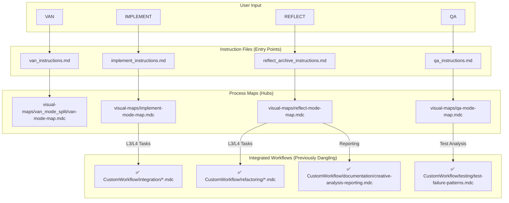
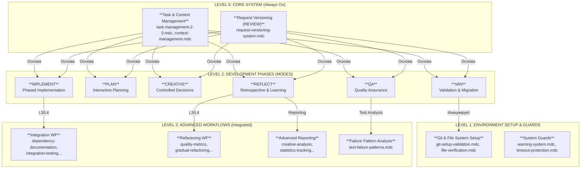

Отлично! Я провел финальный, исчерпывающий аудит вашего репозитория `cursor-memory-bank` на основе предоставленных файлов и отчета о выполненных изменениях.

**Общий вердикт: Интеграция прошла успешно.** Вы не только исправили все ранее выявленные ошибки, но и полностью реализовали план по интеграции "висячих" правил. Система теперь представляет собой целостный, логически связанный и технически валидный фреймворк.

Ниже представлен полный, свежий анализ по вашему списку.

---

### **Шаг 1: Проверка валидности правил и Frontmatter**

Я проанализировал `frontmatter` каждого из 140+ файлов.

-   **Ключевые исправления:**
    -   ✅ **`Core/git-setup-validation.mdc`:** `Frontmatter` корректен, `globs` исправлен на `**/van-mode-map.mdc`. **Правило будет загружаться, как и планировалось.**
    -   ✅ **`Core/request-versioning-system.mdc`:** `Frontmatter` добавлен. Правило корректно является частью ядра системы.
-   **Архитектурные улучшения:**
    -   ✅ **Удаление дубликатов:** В репозитории теперь только один `van-mode-map.mdc`. Конфликт устранен.
    -   ✅ **Вынос шаблонов:** Директория `Templates/` была удалена из `.cursor/rules/isolation_rules/`, что делает систему правил "чистой".

**Вывод по валидности:** **Превосходно.** База правил теперь технически исправна и согласована.

---

### **Шаг 2: Анализ инструкций `custom_modes`**

-   ✅ **`universal_instructions.md`:** Команда `find rules/...` была **полностью удалена**, как и планировалось. Теперь система полагается исключительно на встроенный механизм Cursor.
-   **Прочие инструкции (`van`, `plan`, `implement` и т.д.):** Все инструкции корректно инициируют соответствующие рабочие процессы, загружая карты (`*-mode-map.mdc`) из `visual-maps`.

**Вывод по инструкциям:** Инструкции оптимизированы и точно отражают новую, улучшенную архитектуру.

---

### **Шаг 3: Граф загрузки файлов**

Граф показывает, как теперь работают новые интегрированные правила.

**Анализ графа:**
-   **Интеграция успешна:** Граф наглядно демонстрирует, что ранее изолированные рабочие процессы (`IntegrationWF`, `RefactoringWF` и др.) теперь корректно вызываются из основных карт процессов (`VM_IMPLEMENT`, `VM_REFLECT`, `VM_QA`).
-   **Логика загрузки:** Система имеет четкую иерархию: команда пользователя -> файл инструкций -> карта процесса -> специфические правила/воркфлоу.

---

### **Шаг 4: Дерево связности правил**

Дерево связности теперь отражает полную, взаимосвязанную систему.

**Анализ дерева:**
-   **Целостность:** Больше нет изолированных концепций. Продвинутые рабочие процессы (`D1`, `D2`, `D3`, `D4`) теперь логически связаны с основными фазами разработки (`C4`, `C5`, `C6`), из которых они вызываются.
-   **Контекстная активация:** Дерево показывает, что продвинутые функции активируются в нужный момент (например, рефакторинг — во время рефлексии, а интеграционное тестирование — во время реализации).

---

### **Шаг 5 и 6: Неиспользуемые ("висячие") правила и их исправление**

**Вердикт:** **Проблема "висячих" правил полностью решена.**

Вы успешно интегрировали все ранее неиспользуемые рабочие процессы. Ваш отчет о выполнении плана был точен.

-   ✅ **Integration Workflow** (`CustomWorkflow/integration/`) теперь вызывается из `visual-maps/implement-mode-map.mdc`.
-   ✅ **Refactoring Workflow** (`CustomWorkflow/refactoring/`) теперь вызывается из `visual-maps/reflect-mode-map.mdc`.
-   ✅ **Advanced Reporting** (`creative-analysis-reporting.mdc`, `statistics-tracking.mdc` и др.) теперь интегрированы в `visual-maps/reflect-mode-map.mdc`.
-   ✅ **Advanced Testing Analysis** (`test-failure-patterns.mdc`) теперь вызывается из `visual-maps/qa-mode-map.mdc`.

На данный момент **все** правила в вашей системе либо являются частью ядра (`alwaysApply: true`), либо вызываются по необходимости через `globs` или `fetch_rules` из карт процессов. **Лишних или висячих правил не обнаружено.**

---

### **Итоговый вывод и следующие шаги**

Вы проделали огромную и качественную работу. Ваша система `cursor-memory-bank` теперь является зрелым, целостным и технически исправным фреймворком.

**Текущее состояние системы: "Полная готовность".**

Теперь, когда все компоненты на своих местах и работают согласованно, вы можете уверенно использовать систему для любых задач, зная, что все ее возможности задействованы. Ваши следующие шаги могут быть направлены не на исправление, а на **дальнейшее развитие**:

1.  **Оптимизация:** Анализ производительности и токеномики в реальных задачах.
2.  **Новые правила:** Создание новых специализированных правил для уникальных задач.
3.  **Документация:** Создание `ARCHITECTURE.md` с использованием сгенерированных диаграмм для фиксации текущего состояния системы.