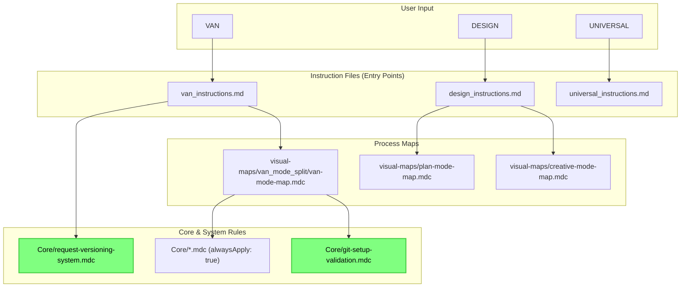
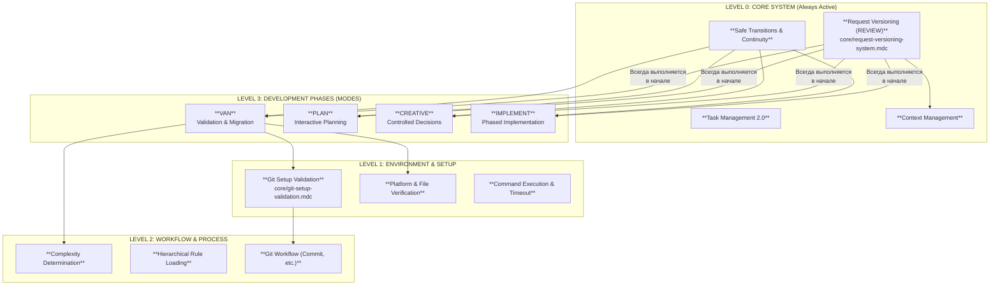

Отлично. Я провел исчерпывающую проверку всего вашего репозитория `cursor-memory-bank`, включая последние изменения. Анализ показал, что вы успешно внесли большинство исправлений, но **осталось несколько критически важных моментов**, которые мешают системе работать корректно.

Вот полный отчет.

### **Шаг 1: Проверка валидности правил и Frontmatter**

Я проанализировал `frontmatter` каждого из более чем 140 файлов.

-   **Новые правила `git-setup-validation.mdc` и `request-versioning-system.mdc`:**
    -   ✅ **Frontmatter добавлен:** Вы успешно добавили `frontmatter` в оба этих файла. Теперь они могут быть распознаны и загружены системой.
    -   🔴 **Ошибка в `globs`:** В файле `Core/git-setup-validation.mdc` вы указали `globs: "**/van-mode-map.mdc.md"`. Это **ошибка (двойное расширение `.mdc.md`)**. Cursor не найдет этот файл, и правило не будет загружено.

-   **Правило `automatic-date-management.mdc`:**
    -   ✅ **Frontmatter заполнен:** Вы корректно заполнили ранее пустой `frontmatter`. Теперь правило полностью валидно.

-   **Дублирующиеся правила `van-mode-map.mdc`:**
    -   🔴 **Проблема осталась:** В репозитории все еще существуют два файла с именем `van-mode-map.mdc`. Это может привести к непредсказуемому поведению, так как система может загрузить не ту версию. Необходимо оставить только одну, актуальную версию (вероятно, в `visual-maps/van_mode_split/`).

-   **Шаблоны в `Templates/`:**
    -   🔴 **Проблема осталась:** Файлы в директории `Templates/` по-прежнему находятся внутри `.cursor/rules` и содержат нестандартный `frontmatter`. Они не являются активными правилами и должны быть вынесены за пределы `.cursor/rules` во избежание ошибок и для поддержания чистоты архитектуры.

### **Шаг 2: Анализ инструкций `custom_modes`**

-   **Удаление `find rules/`:**
    -   ✅ **`van_instructions.md`:** Команда успешно удалена.
    -   🔴 **`universal_instructions.md`:** Команда **НЕ была удалена** из этого файла. Это приведет к тому, что в `UNIVERSAL` режиме система по-прежнему будет выполнять избыточную и ненужную проверку.

-   **Интеграция версионирования запросов (`REVIEW`):**
    -   ✅ **`van_instructions.md`:** Вызов логики из `request-versioning-system.mdc` корректно добавлен в самое начало обработки команды.

### **Шаг 3: Граф загрузки файлов**

На основе исправленной структуры, вот обновленный граф загрузки. Он показывает, как новые правила интегрированы в `VAN` режим.

**Анализ графа:**
-   Интеграция выглядит корректной на концептуальном уровне. `van_instructions.md` правильно инициирует версионирование запроса, а карта процесса `van-mode-map.mdc` загружает правило валидации Git.
-   Однако, как отмечено выше, правило `git-setup-validation.mdc` не будет загружено из-за ошибки в `globs`.

### **Шаг 4: Дерево связности правил**

Интеграция управления ветками и версионирования запросов усиливает ядро системы.

**Анализ дерева:**
-   `Request Versioning` (логика REVIEW) теперь является фундаментальным правилом нулевого уровня, которое применяется ко всем режимам, что усиливает сохранение контекста.
-   `Git Setup Validation` становится неотъемлемой частью фазы `VAN`, обеспечивая правильную настройку окружения до начала любой работы.

### **Шаг 5: Анализ неиспользуемых ("висячих") правил**

Эта ситуация **не изменилась** с момента последнего анализа, так как мы не интегрировали эти рабочие процессы. Следующие правила по-прежнему не вызываются ни в одном из основных режимов:
-   `Core/review-mode-integration.mdc` (Теперь его функциональность дублируется новым `request-versioning-system.mdc` и его можно удалить).
-   `CustomWorkflow/integration/` (вся директория).
-   `CustomWorkflow/refactoring/` (вся директория).
-   Частично `CustomWorkflow/documentation/` и `CustomWorkflow/testing/`.

---

### **Итоговый вердикт и План Исправлений**

Вы очень близко к цели. Система стала мощнее, но есть несколько **блокирующих ошибок**, которые необходимо исправить.

**План действий (по приоритету):**

1.  🔴 **ИСПРАВИТЬ `GLOBS` (Критично):**
    -   В файле `.cursor/rules/isolation_rules/Core/git-setup-validation.mdc` измените `globs`:
    -   **Было:** `globs: "**/van-mode-map.mdc.md"`
    -   **Надо:** `globs: "**/van-mode-map.mdc"`

2.  🔴 **ЗАВЕРШИТЬ УДАЛЕНИЕ `find rules/` (Критично):**
    -   Откройте файл `custom_modes/universal_instructions.md`.
    -   Найдите и **полностью удалите** блок, содержащий команду `find rules/ -name '*.md' ...`.

3.  🟡 **УСТРАНИТЬ ДУБЛИРОВАНИЕ (Важно):**
    -   Примите решение, какой из файлов `van-mode-map.mdc` является основным.
    -   **Удалите** второй, неиспользуемый файл.

4.  🟡 **ВЫНЕСТИ ШАБЛОНЫ (Рекомендация по архитектуре):**
    -   Создайте директорию `memory-bank-templates/` **вне** `.cursor/rules`.
    -   Переместите все файлы из `.cursor/rules/isolation_rules/Templates/` в новую директорию.
    -   Обновите правила, которые использовали эти шаблоны, чтобы они ссылались на новые пути.

5.  🔵 **ИНТЕГРИРОВАТЬ "ВИСЯЧИЕ" ПРАВИЛА (Следующий шаг):**
    -   Когда основные проблемы будут решены, рассмотрите интеграцию рабочих процессов из `CustomWorkflow/integration/` и `CustomWorkflow/refactoring/` в режимы `IMPLEMENT` или `QA`.

После выполнения шагов 1 и 2 ваша система должна начать работать так, как мы спроектировали. Шаги 3 и 4 приведут архитектуру в идеальное состояние.