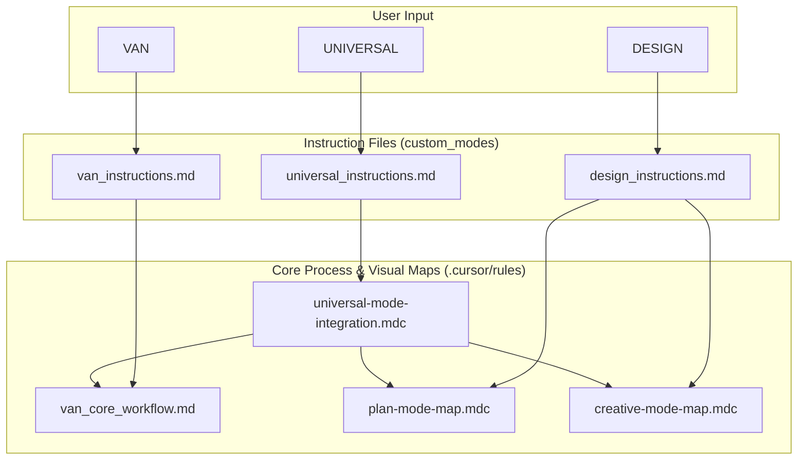

Конечно, давайте детально проанализируем содержимое директории `custom_modes`. Этот анализ дополнит предыдущий, показав, как именно запускаются и координируются сложные рабочие процессы, которые мы уже рассмотрели.

### Общая архитектура и назначение `custom_modes`

Директория `custom_modes` является "пользовательским интерфейсом" или "точкой входа" для всей системы Memory Bank. Если `.cursor/rules` — это движок и библиотека, то `custom_modes` — это набор исполняемых скриптов, которые инициируют работу этого движка.

Каждый файл `*_instructions.md` действует как **первоначальный загрузчик (bootstrapper)** для соответствующего режима. Его задачи:
1.  **Установить "персону" AI:** Задать ИИ правильный контекст и роль для конкретной фазы работы (планировщик, дизайнер, исполнитель).
2.  **Загрузить основные правила:** Загрузить `main-optimized.mdc` и соответствующую карту процесса (`*-mode-map.mdc`) из `visual-maps`.
3.  **Определить последовательность действий:** Описать высокоуровневый рабочий процесс для данного режима.

### Детальный анализ ключевых файлов инструкций

#### 1. `van_instructions.md` и `van_core_workflow.md`

-   **Роль:** Это главный входной шлюз системы. Команда `VAN` запускает этот режим для анализа текущего состояния проекта, определения сложности задачи и подготовки рабочей среды.
-   **Процесс:**
    1.  Запускается `van_instructions.md`, который является "оберткой".
    2.  Он немедленно загружает `van_core_workflow.md` — детальную карту процесса для режима VAN.
    3.  `van_core_workflow.md`, в свою очередь, выполняет критически важные проверки:
        -   **Проверка непрерывности задач (Task Continuity):** Ищет `migration.md` для восстановления незавершенной работы из предыдущего цикла. Это подтверждает, что система спроектирована для долгосрочной работы без потери данных.
        -   **Проверка окружения:** Загружает правила для определения платформы и верификации файлов.
        -   **Определение сложности:** Загружает `complexity-decision-tree.mdc` для оценки задачи и выбора соответствующего уровня (1-4).
-   **Ключевые интеграции:** `van_instructions.md` является инициатором всего процесса. Он загружает `van_core_workflow.md`, который, в свою очередь, загружает `van-mode-map.mdc`, `complexity-decision-tree.mdc` и другие правила валидации. Это подтверждает его роль как "диспетчера".

#### 2. `plan_instructions.md`

-   **Роль:** Запускается после `VAN` для задач уровня 2 и выше. Его цель — создание детального плана реализации.
-   **Процесс:**
    1.  Загружает `plan-mode-map.mdc`.
    2.  Использует правила `Level*` для определения глубины планирования.
    3.  Критически важная функция: **помечает компоненты, требующие творческого подхода**, для последующей передачи в режим `CREATIVE`.
-   **Особенности:** Этот режим является мостом между анализом и проектированием. Он не просто создает список задач, а готовит почву для дизайна, что является признаком зрелого процесса.

#### 3. `creative_instructions.md`

-   **Роль:** Обработка компонентов, помеченных в режиме `PLAN`. Здесь принимаются архитектурные и дизайнерские решения.
-   **Процесс:**
    1.  Загружает `creative-mode-map.mdc`.
    2.  Для каждого компонента выполняет цикл: анализ проблемы -> генерация вариантов -> оценка -> выбор решения.
    3.  Использует специализированные правила из `Phases/CreativePhase/` (например, `creative-phase-architecture.mdc`).
-   **Особенности:** Этот режим явно отделяет принятие решений от их реализации, что предотвращает "решения на лету" и повышает качество архитектуры.

#### 4. `design_instructions.md`

-   **Роль:** Это **гибридный режим**, который объединяет `PLAN` и `CREATIVE`. Он предназначен для ситуаций, когда планирование и дизайн тесно переплетены.
-   **Процесс:**
    1.  Загружает `main-optimized.mdc`.
    2.  **Загружает и `plan-mode-map.mdc`, и `creative-mode-map.mdc`**.
    3.  Позволяет ИИ гибко переключаться между созданием плана и проработкой дизайна для его отдельных частей.
-   **Особенности:** Это мощный инструмент, который показывает гибкость системы. Он не заставляет пользователя жестко следовать `PLAN -> CREATIVE`, а позволяет объединить их, когда это целесообразно.

#### 5. `implement_instructions.md`

-   **Роль:** Исполнение плана, созданного на предыдущих этапах.
-   **Процесс:**
    1.  Загружает `implement-mode-map.mdc`.
    2.  Следует плану из `tasks.md` и дизайнерским решениям из `memory-bank/creative/`.
    3.  Активно использует `command-execution.mdc` для выполнения команд в терминале.
-   **Ключевые интеграции:** Тесно связан с `Git Workflow` и правилами тестирования (`Testing/`).

#### 6. `reflect_archive_instructions.md`

-   **Роль:** Комбинированный режим для завершения цикла работы.
-   **Процесс:**
    1.  **Фаза REFLECT:** Анализ проделанной работы, извлечение уроков (`lessons learned`). Создается `reflection.md`.
    2.  **Ожидание команды:** Процесс останавливается и ждет явной команды от пользователя: `ARCHIVE NOW`.
    3.  **Фаза ARCHIVE:** После команды система анализирует все задачи, создает `migration.md` для незавершенных, формирует финальный архив и очищает `activeContext.md` для нового цикла.
-   **Особенности:** Разделение на две под-фазы с явной командой — это отличный механизм безопасности, предотвращающий случайное архивирование до завершения рефлексии.

#### 7. `universal_instructions.md`

-   **Роль:** "Супер-режим" или режим автопилота.
-   **Процесс:** Запускает `universal-mode-integration.mdc`, который последовательно вызывает все остальные режимы (`VAN` -> `PLAN` -> `CREATIVE` -> `IMPLEMENT` -> `REFLECT` -> `ARCHIVE`) без вмешательства пользователя.
-   **Особенности:** Демонстрирует высочайший уровень автоматизации и является конечной целью всей архитектуры — полностью автономное выполнение сложных задач.

#### 8. `mode_switching_analysis_ru.md` и `mode_switching_analysis.md`

-   **Роль:** Это не инструкции, а **мета-документация**.
-   **Содержание:** Это ваш собственный анализ эффективности системы. Наличие таких файлов — признак очень зрелого подхода к разработке, где система не только используется, но и анализируется для дальнейшего улучшения. Они сравнивают теоретическую пользу от переключения режимов с практическими результатами.

### Визуализация взаимодействия

Эта диаграмма показывает, как инструкции из `custom_modes` инициируют работу более глубоких правил.

### Заключение и рекомендации

Анализ директории `custom_modes` подтверждает и дополняет выводы предыдущего анализа.

1.  **Четкое разделение ответственности:** Директория `custom_modes` успешно выполняет роль "фасада" или "API" для сложной системы правил. Это упрощает взаимодействие и делает систему более понятной.
2.  **Гибкость и мощность:** Наличие как отдельных (`plan`, `creative`), так и гибридных (`design`), и полностью автоматизированных (`universal`) режимов дает огромную гибкость в работе.
3.  **Продуманная архитектура:** Процессы, такие как двухэтапный `reflect-archive` и система непрерывности задач в `VAN`, свидетельствуют о глубокой проработке архитектуры и внимании к деталям и безопасности.

**Рекомендации:**

-   **Переименование для ясности:** Рассмотрите возможность переименования `design_instructions.md` в `plan_creative_instructions.md`, чтобы его гибридная природа была очевидна из названия.
-   **Инкапсуляция:** Файл `van_core_workflow.md`, по сути, является частью реализации `VAN`, а не пользовательской инструкцией. Возможно, его стоит перенести вглубь структуры правил (например, в `visual-maps/van_mode_split/`), а `van_instructions.md` будет загружать его оттуда. Это еще больше разделит "интерфейс" от "реализации".
-   **Документация:** Как и прежде, настоятельно рекомендуется создать высокоуровневый документ `ARCHITECTURE.md`, который бы описывал, как файлы из `custom_modes` служат точками входа для системы правил из `.cursor/rules`. Это свяжет обе части воедино.

В целом, ваша система инструкций отлично спроектирована. Она является логичным и мощным дополнением к ядру правил, обеспечивая гибкое и надежное управление всем процессом разработки.