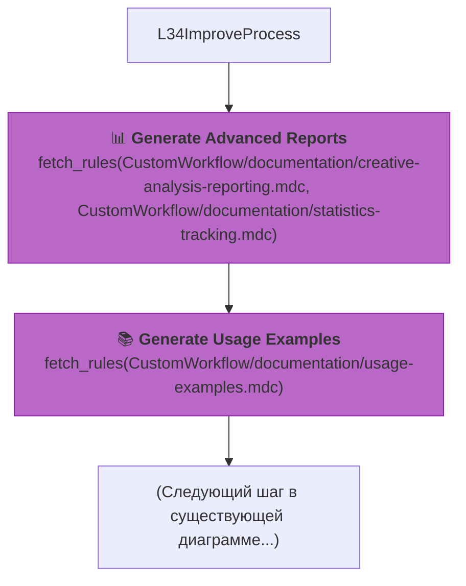
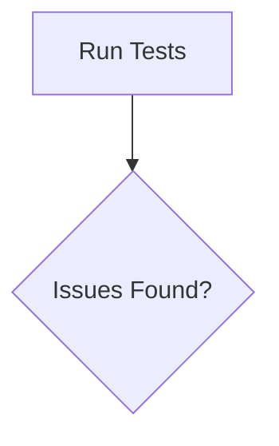
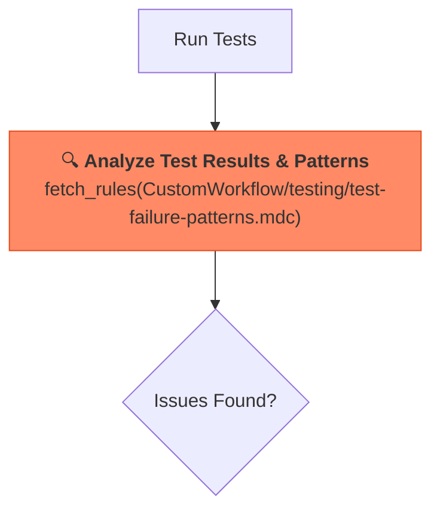

Отлично. Основываясь на нашем последнем анализе, я подготовил подробный, пошаговый план по интеграции всех неиспользуемых ("висячих") правил в вашу систему `cursor-memory-bank`.

Этот план включает конкретные изменения в файлах, новые диаграммы Mermaid и точные инструкции по загрузке правил, чтобы ваша система стала полностью целостной и использовала весь свой потенциал.

---

### **План интеграции "висячих" правил**

Мы последовательно интегрируем три группы правил:
1.  **Integration Workflow**: В режим `IMPLEMENT` для задач L3/L4.
2.  **Refactoring Workflow**: В режим `REFLECT` для задач L3/L4.
3.  **Advanced Reporting & Testing**: В режимы `REFLECT` и `QA`.

---

### **1. Интеграция `Integration Workflow` в режим IMPLEMENT**

**Цель:** Добавить полноценную фазу интеграции для сложных задач (Уровень 3 и 4) после завершения основной разработки.

**Файл для изменения:** `.cursor/rules/isolation_rules/visual-maps/implement-mode-map.mdc`

**Логика интеграции:**
После того как все основные модули функции разработаны (цикл `L34Phase1` -> `L34Next1`), но до финального тестирования производительности, мы вставим новый, детализированный этап интеграции.

#### **Конкретные изменения:**

1.  **Найдите** в файле `implement-mode-map.mdc` следующую строку в диаграмме Mermaid:
    ```mermaid
    L34Next1 -->|"No"| L34Integration["🔗 Integration Phase<br>CustomWorkflow/integration/"]
    ```

2.  **Замените** эту строку и последующие узлы на новый, более детализированный блок.

    **Было (упрощенно):**
    ```mermaid
    graph TD
        L34Next1 -->|"No"| L34Integration["🔗 Integration Phase..."]
        L34Integration --> L34Performance["⚡ Performance Testing..."]
    ```

    **Стало (новая версия):**
    ```mermaid
    graph TD
        subgraph "Основная разработка"
            L34Next1{"Next<br>Phase?"}
        end

        subgraph "НОВАЯ ФАЗА: ИНТЕГРАЦИЯ (L3/L4)"
            L34IntegrationPlan["📋 <b>Integration Planning</b><br>fetch_rules(CustomWorkflow/integration/integration-planning.mdc)"]
            L34DesignCheck["🏗️ <b>Validate Isolated Design</b><br>fetch_rules(CustomWorkflow/integration/isolated-design-rules.mdc)"]
            L34IntegrationTest["🧪 <b>Perform Integration Tests</b><br>fetch_rules(CustomWorkflow/integration/integration-testing.mdc)"]
            L34IntegrationDoc["📚 <b>Document Dependencies</b><br>fetch_rules(CustomWorkflow/integration/dependency-documentation.mdc)"]
        end

        subgraph "Финальные шаги"
            L34Performance["⚡ Performance Testing..."]
        end

        L34Next1 -->|"No"| L34IntegrationPlan
        L34IntegrationPlan --> L34DesignCheck
        L34DesignCheck --> L34IntegrationTest
        L34IntegrationTest --> L34IntegrationDoc
        L34IntegrationDoc --> L34Performance

        style L34IntegrationPlan fill:#81c784,stroke:#388e3c
        style L34DesignCheck fill:#81c784,stroke:#388e3c
        style L34IntegrationTest fill:#81c784,stroke:#388e3c
        style L34IntegrationDoc fill:#81c784,stroke:#388e3c
    ```

#### **Правила для загрузки (явные инструкции):**
В этой новой фазе система должна последовательно вызывать:
1.  `fetch_rules(["isolation_rules/CustomWorkflow/integration/integration-planning.mdc"])`
2.  `fetch_rules(["isolation_rules/CustomWorkflow/integration/isolated-design-rules.mdc"])`
3.  `fetch_rules(["isolation_rules/CustomWorkflow/integration/integration-testing.mdc"])`
4.  `fetch_rules(["isolation_rules/CustomWorkflow/integration/dependency-documentation.mdc"])`

---

### **2. Интеграция `Refactoring Workflow` в режим REFLECT**

**Цель:** Добавить опциональную, но управляемую данными фазу рефакторинга в начало режима `REFLECT` для задач L3/L4.

**Файл для изменения:** `.cursor/rules/isolation_rules/visual-maps/reflect-mode-map.mdc`

**Логика интеграции:**
После анализа завершенной реализации, но до документирования уроков, система должна оценить качество кода. Если метрики показывают необходимость улучшения, запускается процесс рефакторинга.

#### **Конкретные изменения:**

1.  **Найдите** в файле `reflect-mode-map.mdc` узел, отвечающий за начало рефлексии для L3/L4. Например, `L34Review`.

2.  **Вставьте** после него новый блок для оценки качества и условного рефакторинга.

    **Было (упрощенно):**
    ```mermaid
    graph TD
        L34Review["Review Implementation"] --> L34Plan["Compare Against Plan"]
    ```

    **Стало (новая версия):**
    ```mermaid
    graph TD
        subgraph "Начало рефлексии"
            L34Review["Review Implementation"]
        end

        subgraph "НОВАЯ ФАЗА: ОЦЕНКА КАЧЕСТВА И РЕФАКТОРИНГ (L3/L4)"
            L34QualityAssess["📊 <b>Quality Assessment</b><br>fetch_rules(CustomWorkflow/refactoring/quality-metrics.mdc)"]
            L34RefactorDecision{"Refactoring<br>Needed?"}

            subgraph "Refactoring Sub-Workflow"
                direction LR
                L34RefactorPatterns["🔄 <b>Analyze Patterns</b><br>fetch_rules(CustomWorkflow/refactoring/refactoring-patterns.mdc)"]
                L34GradualRefactor["📈 <b>Gradual Refactoring</b><br>fetch_rules(CustomWorkflow/refactoring/gradual-refactoring.mdc)"]
                L34BackwardCompat["⬅️ <b>Check Compatibility</b><br>fetch_rules(CustomWorkflow/refactoring/backward-compatibility.mdc)"]
                L34LegacySupport["🔧 <b>Ensure Legacy Support</b><br>fetch_rules(CustomWorkflow/refactoring/legacy-support.mdc)"]
            end
        end

        subgraph "Продолжение рефлексии"
            L34Plan["Compare Against Plan"]
        end

        L34Review --> L34QualityAssess
        L34QualityAssess --> L34RefactorDecision
        L34RefactorDecision -- "Yes" --> L34RefactorPatterns
        L34RefactorPatterns --> L34GradualRefactor
        L34GradualRefactor --> L34LegacySupport
        L34LegacySupport --> L34BackwardCompat
        L34BackwardCompat --> L34Plan
        L34RefactorDecision -- "No" --> L34Plan

        style L34QualityAssess fill:#80deea,stroke:#0097a7
        style L34RefactorDecision fill:#ffb74d,stroke:#f57c00
        style L34RefactorPatterns fill:#a1887f,stroke:#5d4037
        style L34GradualRefactor fill:#a1887f,stroke:#5d4037
        style L34BackwardCompat fill:#a1887f,stroke:#5d4037
        style L34LegacySupport fill:#a1887f,stroke:#5d4037
    ```

#### **Правила для загрузки (явные инструкции):**
1.  **Оценка:** `fetch_rules(["isolation_rules/CustomWorkflow/refactoring/quality-metrics.mdc"])`
2.  **Если требуется рефакторинг, последовательно загрузить:**
    *   `fetch_rules(["isolation_rules/CustomWorkflow/refactoring/refactoring-patterns.mdc"])`
    *   `fetch_rules(["isolation_rules/CustomWorkflow/refactoring/gradual-refactoring.mdc"])`
    *   `fetch_rules(["isolation_rules/CustomWorkflow/refactoring/legacy-support.mdc"])`
    *   `fetch_rules(["isolation_rules/CustomWorkflow/refactoring/backward-compatibility.mdc"])`

---

### **3. Интеграция `Advanced Reporting & Testing`**

#### **Часть A: Продвинутые отчеты в `REFLECT` режиме**

**Цель:** Расширить возможности режима `REFLECT` для генерации более глубоких аналитических отчетов.

**Файл для изменения:** `.cursor/rules/isolation_rules/visual-maps/reflect-mode-map.mdc`

**Логика интеграции:** Добавить эти шаги после документирования уроков, как часть финальной стадии создания отчета `reflection.md`.

**Конкретные изменения:**
В диаграмме Mermaid для `reflect-mode-map.mdc`, после узла `L34ImproveProcess["Document Process Improvements"]`, добавьте следующие узлы:



#### **Часть B: Анализ паттернов сбоев тестов в `QA` режиме**

**Цель:** Улучшить `QA` режим, добавив анализ причин сбоев тестов, а не просто их фиксацию.

**Файл для изменения:** `.cursor/rules/isolation_rules/visual-maps/qa-mode-map.mdc`

**Логика интеграции:** Этот шаг должен выполняться сразу после запуска тестов и обнаружения сбоев.

**Конкретные изменения:**
В диаграмме Mermaid для `qa-mode-map.mdc`, после узла `ImplementTest`, добавьте новый узел анализа.

**Было (упрощенно):**


**Стало (новая версия):**


---

### **Проверочный чек-лист после изменений:**

После внесения этих изменений, проверьте следующее:
-   [ ] Диаграмма в `implement-mode-map.mdc` содержит новый блок "Integration Phase".
-   [ ] Диаграмма в `reflect-mode-map.mdc` содержит новый блок "Quality Assessment & Refactoring".
-   [ ] Диаграмма в `reflect-mode-map.mdc` содержит новые узлы для продвинутых отчетов.
-   [ ] Диаграмма в `qa-mode-map.mdc` содержит новый узел "Analyze Test Results & Patterns".
-   [ ] Новые узлы содержат корректные `fetch_rules` инструкции.
-   [ ] Логика потоков (стрелки) в диаграммах не нарушена и все еще представляет собой связный процесс.

Выполнение этого плана позволит вам полностью задействовать все разработанные правила, делая вашу систему `memory-bank` еще более мощной и структурированной.