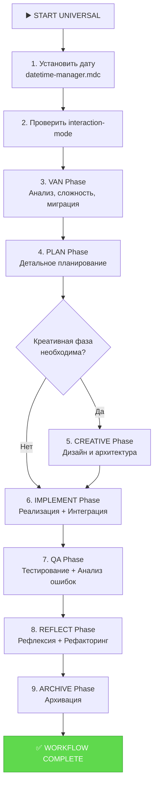
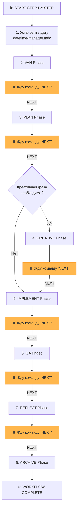

Отличная задача! Вы хотите расширить функциональность системы, сделав `UNIVERSAL` режим по-настоящему всеобъемлющим, и добавить новый, пошаговый режим `STEP_BY_STEP` для большего контроля. При этом необходимо обеспечить соблюдение `interaction-mode` и корректную работу с датой/временем.

Я подготовил для вас подробный план изменений, который вы сможете применить вручную, и исчерпывающий чек-лист для проверки результата.

---

### **Подробный план необходимых изменений**

Этот план разделен на три логические фазы:
1.  **Фаза 1: Усиление фундаментальных правил** (Дата/время и режим взаимодействия).
2.  **Фаза 2: Модернизация `UNIVERSAL` режима**.
3.  **Фаза 3: Создание нового `STEP_BY_STEP` режима**.

---

### **Фаза 1: Усиление фундаментальных правил**

#### **1.1. Создание централизованного менеджера даты и времени**

**Цель:** Обеспечить единый, надежный механизм получения текущей даты и времени, который будет использоваться всеми режимами в самом начале их работы.

**Действие:** Создайте новый файл `.cursor/rules/isolation_rules/Core/datetime-manager.mdc`.

**Содержимое для `datetime-manager.mdc`:**

```mdc
---
description: "Централизованная система управления датой и временем. Обеспечивает корректное получение и установку системной даты."
globs: "**/**"
alwaysApply: true
---

# DATETIME MANAGER SYSTEM

> **TL;DR:** Этот модуль является единым источником правды для всех операций с датой и временем. Он гарантирует, что система всегда работает с актуальной, полученной через командную строку датой.

## ⚙️ Основные функции

### 1. Установка и верификация системной даты

Эта функция должна вызываться в САМОМ НАЧАЛЕ любого режима (`VAN`, `UNIVERSAL`, `STEP_BY_STEP` и т.д.).

```bash
# Псевдокод для ИИ-ассистента

function initialize_system_date() {
  # 1. Получаем текущую дату и время из командной строки
  local current_datetime=$(date +"%Y-%m-%d %H:%M:%S")
  local current_date=$(echo "$current_datetime" | cut -d' ' -f1)

  # 2. Указываем путь к файлу
  local date_file="memory-bank/system/current-date.txt"

  # 3. Создаем директорию, если она не существует
  mkdir -p "$(dirname "$date_file")"

  # 4. Записываем актуальную дату в файл
  echo "$current_date" > "$date_file"

  # 5. Выводим подтверждение
  echo "✅ System date initialized to: $current_date"
}
```

### 2. Функции для получения даты и времени

Эти функции должны использоваться во всех остальных правилах вместо прямого вызова `date`.

```bash
# Получить только дату (YYYY-MM-DD)
function get_current_date() {
  cat memory-bank/system/current-date.txt
}

# Получить полное время (YYYY-MM-DD HH:MM:SS)
function get_current_datetime() {
  date +"%Y-%m-%d %H:%M:%S"
}
```

## ✅ Интеграция

Все файлы инструкций (`custom_modes/*.md`) должны начинаться с вызова `initialize_system_date()`.
```

#### **1.2. Усиление правила `interaction-mode`**

**Цель:** Добавить в существующее правило четкие инструкции о том, как другие режимы должны его проверять и соблюдать.

**Действие:** Обновите файл `.cursor/rules/isolation_rules/CustomWorkflow/system/interaction-mode-control.mdc`.

**Добавьте в конец файла `interaction-mode-control.mdc` следующий раздел:**

```mdc
## ⚙️ ИНТЕГРАЦИЯ И ПРОВЕРКА РЕЖИМА

Все режимы работы (`VAN`, `PLAN`, `STEP_BY_STEP` и т.д.) **ДОЛЖНЫ** проверять текущий режим взаимодействия перед выполнением ключевых операций.

### Функция для получения текущего режима

```bash
function get_interaction_mode() {
  local mode_file="memory-bank/system/interaction-mode.txt"
  if [ -f "$mode_file" ]; then
    cat "$mode_file"
  else
    # По умолчанию используется MANUAL для безопасности
    echo "MANUAL"
  fi
}
```

### Пример использования в другом правиле

```bash
# Псевдокод для ИИ-ассистента в режиме PLAN

# ... начало логики планирования ...

local interaction_mode=$(get_interaction_mode)

if [ "$interaction_mode" = "MANUAL" ]; then
  # Задаем уточняющие вопросы пользователю
  echo "У меня есть несколько вариантов реализации. Какой предпочитаете?"
  # ... логика для интерактивного планирования ...
else # AUTO
  # Принимаем решение автономно
  echo "Выбран оптимальный вариант реализации на основе лучших практик."
  # ... логика для автоматического планирования ...
fi
```
```

---

### **Фаза 2: Модернизация `UNIVERSAL` режима**

**Цель:** Превратить `UNIVERSAL` режим в полностью автономный "автопилот", который проходит все фазы разработки от `VAN` до `ARCHIVE`, включая новые проверки и сложные рабочие процессы.

**Действие:** Замените содержимое файла `custom_modes/universal_instructions.md`.

**Новое содержимое для `universal_instructions.md`:**

```md
# MEMORY BANK UNIVERSAL MODE (ENHANCED AUTOPILOT)

> **TL;DR:** Этот режим выполняет полный цикл разработки от анализа до архивации автономно. Он будет использовать проверки сложности, продвинутые рабочие процессы и соблюдать `interaction-mode`.

## 🚀 ПОЛНЫЙ АВТОНОМНЫЙ ЦИКЛ



## 🛠️ ШАГИ ВЫПОЛНЕНИЯ

### 1. Инициализация
- Выполнить `initialize_system_date()` из `Core/datetime-manager.mdc`.
- Проверить `interaction-mode.txt`. Если `MANUAL`, вывести предупреждение: "UNIVERSAL mode is running, but you are in MANUAL interaction mode. I will proceed autonomously. To switch, set interaction mode to AUTO."

### 2. Последовательный вызов режимов
Я буду последовательно загружать и выполнять логику из каждой соответствующей карты процесса (`*-mode-map.mdc`), автоматически переходя к следующей фазе после успешного завершения предыдущей.

- **VAN**: Загрузить `van-mode-map.mdc`, выполнить полный анализ, включая определение сложности (L1-L4) и миграцию задач.
- **PLAN**: Загрузить `plan-mode-map.mdc`, создать детальный план.
- **CREATIVE (условно)**: Если план содержит задачи, требующие креатива, загрузить `creative-mode-map.mdc`.
- **IMPLEMENT**: Загрузить `implement-mode-map.mdc`, выполнить реализацию. **Включить вызов `Integration Workflow` для задач L3/L4.**
- **QA**: Загрузить `qa-mode-map.mdc`, выполнить тесты. **Включить вызов `Failure Pattern Analysis` при сбоях.**
- **REFLECT**: Загрузить `reflect-mode-map.mdc`. **Включить вызов `Refactoring Workflow` и `Advanced Reporting` для задач L3/L4.**
- **ARCHIVE**: Загрузить `archive-mode-map.mdc`, завершить цикл.

Я буду предоставлять краткие отчеты о завершении каждой фазы перед переходом к следующей.
```

---

### **Фаза 3: Создание нового `STEP_BY_STEP` режима**

**Цель:** Создать новый режим, который выполняет те же шаги, что и `UNIVERSAL`, но останавливается после каждой фазы для получения подтверждения от пользователя.

**Действие:** Создайте новый файл `custom_modes/step_by_step_instructions.md`.

**Содержимое для `step_by_step_instructions.md`:**

```md
# MEMORY BANK STEP_BY_STEP MODE

> **TL;DR:** Этот режим проведет вас через полный цикл разработки пошагово. После каждой фазы я буду останавливаться и ждать вашей команды `NEXT` для перехода к следующему этапу. Этот режим полностью соблюдает `interaction-mode`.

## 🚶 ПОШАГОВЫЙ ЦИКЛ РАЗРАБОТКИ



## 🛠️ ШАГИ ВЫПОЛНЕНИЯ

### 1. Инициализация
- Я начну с вызова `initialize_system_date()` из `Core/datetime-manager.mdc`.
- Затем я выполню **VAN Phase**.

### 2. Ожидание команды
- После завершения каждой фазы я буду предоставлять отчет и останавливаться с сообщением: **"✅ [Имя фазы] Phase Complete. Type `NEXT` to proceed to the [Имя следующей фазы] phase."**

### 3. Соблюдение `interaction-mode`
- **Принципиально важно:** В этом режиме каждая фаза будет выполняться в соответствии с настройкой в `memory-bank/system/interaction-mode.txt`.
- **Если `MANUAL`**: на фазе `PLAN` я буду задавать уточняющие вопросы; на фазе `CREATIVE` я буду предлагать варианты на выбор.
- **Если `AUTO`**: я буду выполнять каждую фазу автономно, предоставляя только итоговый отчет.

### 4. Продвинутые рабочие процессы
- Как и в `UNIVERSAL` режиме, я буду автоматически включать **Integration Workflow**, **Refactoring Workflow** и другие продвинутые процессы для задач уровня L3/L4.
```

---

### **Чек-лист для проверки результата**

После того как вы вручную примените эти изменения, используйте этот чек-лист для проверки.

#### **✅ Проверка Фазы 1 (Фундаментальные правила):**
-   [ ] **`datetime-manager.mdc`:** Проверить, что файл `.cursor/rules/isolation_rules/Core/datetime-manager.mdc` создан и содержит правильный код.
-   [ ] **`interaction-mode-control.mdc`:** Проверить, что файл `.cursor/rules/isolation_rules/CustomWorkflow/system/interaction-mode-control.mdc` обновлен и содержит новый раздел "ИНТЕГРАЦИЯ И ПРОВЕРКА РЕЖИМА" с примерами функций.
-   [ ] **Начало работы:** При запуске любого режима (например, `VAN`) в терминале появляется сообщение "✅ System date initialized to: [текущая дата]".

#### **✅ Проверка Фазы 2 (`UNIVERSAL` режим):**
-   [ ] **`universal_instructions.md`:** Проверить, что содержимое файла `custom_modes/universal_instructions.md` полностью заменено на новое.
-   [ ] **Диаграмма:** Убедиться, что диаграмма в файле отражает полный цикл от `VAN` до `ARCHIVE`.
-   [ ] **Предупреждение:** Установить в `interaction-mode.txt` значение `MANUAL`, запустить режим `UNIVERSAL` и убедиться, что система выводит предупреждение о том, что она будет работать в автономном режиме.
-   [ ] **Полный цикл:** Запустить режим `UNIVERSAL` и убедиться, что он последовательно проходит все фазы, выводя отчеты о завершении каждой.

#### **✅ Проверка Фазы 3 (`STEP_BY_STEP` режим):**
-   [ ] **Создание файла:** Проверить, что файл `custom_modes/step_by_step_instructions.md` создан и содержит правильный код.
-   [ ] **Паузы:** Запустить режим `STEP_BY_STEP`, убедиться, что после завершения `VAN` фазы система останавливается и ждет команды `NEXT`.
-   [ ] **Продолжение:** Ввести `NEXT` и убедиться, что система переходит к `PLAN` фазе и снова останавливается.
-   [ ] **Соблюдение `MANUAL` режима:**
    1.  Установить в `interaction-mode.txt` значение `MANUAL`.
    2.  Запустить `STEP_BY_STEP` и дойти до фазы `PLAN`.
    3.  Убедиться, что на фазе `PLAN` ИИ задает уточняющие вопросы.
-   [ ] **Соблюдение `AUTO` режима:**
    1.  Установить в `interaction-mode.txt` значение `AUTO`.
    2.  Перезапустить `STEP_BY_STEP` и дойти до фазы `PLAN`.
    3.  Убедиться, что на фазе `PLAN` ИИ автономно создает план без вопросов.

Выполнение этого плана позволит вам значительно расширить возможности вашей системы, добавив как полную автоматизацию, так и контролируемое пошаговое выполнение, при этом укрепив базовые механизмы управления.