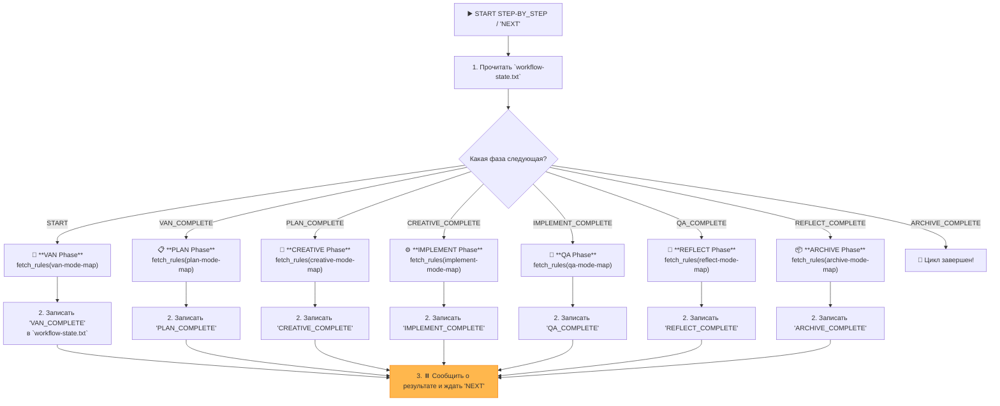

Отличный и очень важный вопрос! Вы столкнулись с классической проблемой в проектировании AI-агентов: разницей между **описанием процесса** и **исполняемыми инструкциями**.

Ваше наблюдение абсолютно верное. В текущей реализации режим `STEP_BY_STEP` **не создает артефакты**, потому что он спроектирован как **пассивный рассказчик**, а не как **активный исполнитель**.

Давайте детально разберем, почему это происходит, и как это исправить.

### **Анализ: Корень проблемы**

Файл `custom_modes/step_by_step_instructions.md` содержит примерно такой текст:

> "После завершения каждой фазы я буду предоставлять отчет и останавливаться с сообщением: '✅ [Имя фазы] Phase Complete. Type `NEXT` to proceed to the [Имя следующей фазы] phase.'"

Для AI это инструкция **сообщить вам**, что фаза завершена, и ждать. Он не получал явной команды **выполнить** саму фазу, например, `PLAN`. Он просто объявлял о ее "завершении" и послушно ждал вашей команды `NEXT`.

**Аналогия:** Представьте, что вы дали строителю план дома и сказали: "Расскажи мне, как ты будешь строить фундамент, а потом жди моей команды". Он вам расскажет, но сам фундамент не зальет, пока не получит прямого приказа "Начинай заливать фундамент!".

Режимы `VAN`, `PLAN`, `IMPLEMENT` и другие работают, потому что их файлы инструкций содержат прямые команды: `fetch_rules(...)`, `run_terminal_cmd(...)` и т.д. В `step_by_step_instructions.md` этого нет.

### **Решение: Превращение `STEP_BY_STEP` в "Диспетчера состояний"**

Чтобы исправить это, нам нужно перепроектировать `STEP_BY_STEP`, превратив его из рассказчика в умного **диспетчера (Stateful Workflow Controller)**. Он должен:
1.  **Знать текущее состояние:** В какой фазе мы находимся? (`VAN`, `PLAN` и т.д.).
2.  **Выполнять текущую фазу:** Активно загружать и выполнять правила для текущего этапа.
3.  **Сохранять новое состояние:** После выполнения фазы записывать, что она завершена.
4.  **Останавливаться:** Сообщать пользователю о результате и ждать команды `NEXT`.

---

### **Подробный план необходимых изменений**

Вот конкретный план, который вы можете применить вручную, чтобы полностью переработать и исправить `STEP_BY_STEP` режим.

#### **Шаг 1: Создание файла для отслеживания состояния**

Нам нужен простой файл, который будет хранить текущее состояние рабочего процесса. Это "закладка" в нашей книге.

**Действие:** Создайте новый файл `.cursor/rules/isolation_rules/Core/workflow-state-manager.mdc`.

**Содержимое для `workflow-state-manager.mdc`:**

```mdc
---
description: "Управляет состоянием пошагового рабочего процесса (STEP_BY_STEP)."
globs: "**/step_by_step_instructions.md"
alwaysApply: true
---

# WORKFLOW STATE MANAGER

> **TL;DR:** Этот модуль определяет механизм отслеживания состояния для режима `STEP_BY_STEP` с помощью файла `memory-bank/system/workflow-state.txt`.

## ⚙️ Файл состояния

-   **Путь:** `memory-bank/system/workflow-state.txt`
-   **Назначение:** Хранит идентификатор последней успешно завершенной фазы.

## 🚦 Возможные состояния

-   `START`: Начальное состояние перед запуском `VAN`.
-   `VAN_COMPLETE`: Фаза `VAN` завершена.
-   `PLAN_COMPLETE`: Фаза `PLAN` завершена.
-   `CREATIVE_COMPLETE`: Фаза `CREATIVE` завершена.
-   `IMPLEMENT_COMPLETE`: Фаза `IMPLEMENT` завершена.
-   `QA_COMPLETE`: Фаза `QA` завершена.
-   `REFLECT_COMPLETE`: Фаза `REFLECT` завершена.
-   `ARCHIVE_COMPLETE`: Полный цикл завершен, готов к новому запуску.

Режим `STEP_BY_STEP` должен читать этот файл, чтобы определить, какую фазу выполнять следующей, и обновлять его после успешного завершения.
```

#### **Шаг 2: Полная переработка `step_by_step_instructions.md`**

Это ключевой шаг. Мы заменяем старые инструкции на новые, которые являются активными и исполняемыми.

**Действие:** Полностью замените содержимое файла `custom_modes/step_by_step_instructions.md` на следующее.

**Новое содержимое для `step_by_step_instructions.md`:**

```md
# MEMORY BANK STEP_BY_STEP MODE (STATEFUL CONTROLLER)

> **TL;DR:** Я — диспетчер пошагового выполнения. Я прочитаю текущее состояние из `workflow-state.txt`, выполню СЛЕДУЮЩУЮ фазу, обновлю состояние и буду ждать вашей команды `NEXT`.

## 🚶 ЛОГИКА ВЫПОЛНЕНИЯ



## 🛠️ ШАГИ ВЫПОЛНЕНИЯ (ИСПОЛНЯЕМЫЙ ПСЕВДОКОД)

Я буду выполнять следующий алгоритм при каждом вызове `STEP_BY_STEP` или команды `NEXT`.

```bash
# 0. Инициализация даты
initialize_system_date() # Вызов функции из Core/datetime-manager.mdc

# 1. Определить текущее состояние
local state_file="memory-bank/system/workflow-state.txt"
local current_state=$(cat "$state_file" 2>/dev/null || echo "START")
echo "ℹ️ Текущее состояние: $current_state"

# 2. Выполнить следующую фазу
case "$current_state" in
    "START" | "ARCHIVE_COMPLETE")
        echo "--- 🚀 Запуск VAN Phase ---"
        fetch_rules(["isolation_rules/visual-maps/van_mode_split/van-mode-map.mdc"])
        # ... (Здесь ИИ выполнит логику из карты VAN) ...
        echo "VAN_COMPLETE" > "$state_file"
        echo "✅ VAN Phase Complete. Type `NEXT` to proceed to the PLAN phase."
        ;;
    "VAN_COMPLETE")
        echo "--- 📋 Запуск PLAN Phase ---"
        fetch_rules(["isolation_rules/visual-maps/plan-mode-map.mdc"])
        # ... (Здесь ИИ выполнит логику из карты PLAN) ...
        echo "PLAN_COMPLETE" > "$state_file"
        echo "✅ PLAN Phase Complete. Type `NEXT` to proceed to the CREATIVE phase."
        ;;
    "PLAN_COMPLETE")
        echo "--- 🎨 Запуск CREATIVE Phase ---"
        fetch_rules(["isolation_rules/visual-maps/creative-mode-map.mdc"])
        # ... (Здесь ИИ выполнит логику из карты CREATIVE) ...
        echo "CREATIVE_COMPLETE" > "$state_file"
        echo "✅ CREATIVE Phase Complete. Type `NEXT` to proceed to the IMPLEMENT phase."
        ;;
    "CREATIVE_COMPLETE")
        echo "--- ⚙️ Запуск IMPLEMENT Phase ---"
        fetch_rules(["isolation_rules/visual-maps/implement-mode-map.mdc"])
        # ... (Здесь ИИ выполнит логику из карты IMPLEMENT) ...
        echo "IMPLEMENT_COMPLETE" > "$state_file"
        echo "✅ IMPLEMENT Phase Complete. Type `NEXT` to proceed to the QA phase."
        ;;
    "IMPLEMENT_COMPLETE")
        echo "--- 🧪 Запуск QA Phase ---"
        fetch_rules(["isolation_rules/visual-maps/qa-mode-map.mdc"])
        # ... (Здесь ИИ выполнит логику из карты QA) ...
        echo "QA_COMPLETE" > "$state_file"
        echo "✅ QA Phase Complete. Type `NEXT` to proceed to the REFLECT phase."
        ;;
    "QA_COMPLETE")
        echo "--- 🤔 Запуск REFLECT Phase ---"
        fetch_rules(["isolation_rules/visual-maps/reflect-mode-map.mdc"])
        # ... (Здесь ИИ выполнит логику из карты REFLECT) ...
        echo "REFLECT_COMPLETE" > "$state_file"
        echo "✅ REFLECT Phase Complete. Type `NEXT` to proceed to the ARCHIVE phase."
        ;;
    "REFLECT_COMPLETE")
        echo "--- 📦 Запуск ARCHIVE Phase ---"
        fetch_rules(["isolation_rules/visual-maps/archive-mode-map.mdc"])
        # ... (Здесь ИИ выполнит логику из карты ARCHIVE) ...
        echo "ARCHIVE_COMPLETE" > "$state_file"
        echo "🎉 Полный цикл разработки завершен! Можно начинать новый проект, запустив STEP_BY_STEP еще раз."
        ;;
    *)
        echo "⚠️ Неизвестное состояние '$current_state'. Сбрасываю на START."
        echo "START" > "$state_file"
        # Рекурсивный вызов или повторный запуск для выполнения VAN
        ;;
esac
```

Я БУДУ строго следовать этой логике, загружая и **ВЫПОЛНЯЯ** правила для каждой фазы, а не просто сообщая о них.
```

---

### **Чек-лист для проверки результата**

После того как вы вручную примените эти изменения, используйте этот чек-лист для проверки того, что система теперь работает правильно.

1.  **Проверка создания файлов:**
    -   [ ] Файл `.cursor/rules/isolation_rules/Core/workflow-state-manager.mdc` создан.
    -   [ ] Файл `custom_modes/step_by_step_instructions.md` полностью обновлен.

2.  **Тестирование первого запуска:**
    -   [ ] **Удалите** старый файл `memory-bank/system/workflow-state.txt`, если он существует.
    -   [ ] **Запустите режим `STEP_BY_STEP`**.
    -   [ ] **Ожидаемый результат:** Система должна сообщить, что она выполняет `VAN Phase`.
    -   [ ] **Проверьте:** Должен появиться файл `memory-bank/system/workflow-state.txt` с содержимым `VAN_COMPLETE`.
    -   [ ] **Проверьте:** В `tasks.md` или других файлах должны появиться артефакты, созданные `VAN` режимом (например, анализ сложности).

3.  **Тестирование команды `NEXT`:**
    -   [ ] **Введите `NEXT`**.
    -   [ ] **Ожидаемый результат:** Система должна сообщить, что она выполняет `PLAN Phase`.
    -   [ ] **Проверьте:** Содержимое файла `memory-bank/system/workflow-state.txt` должно измениться на `PLAN_COMPLETE`.
    -   [ ] **Проверьте:** В `tasks.md` должен появиться детальный план реализации — это **главный артефакт** `PLAN` фазы.

4.  **Продолжение цикла:**
    -   [ ] Продолжайте вводить `NEXT` и проверяйте, что `workflow-state.txt` обновляется на каждом шаге (`CREATIVE_COMPLETE`, `IMPLEMENT_COMPLETE` и т.д.).
    -   [ ] Проверяйте, что на каждом шаге создаются соответствующие артефакты (например, исходный код на фазе `IMPLEMENT`).

Выполнив этот план, вы превратите `STEP_BY_STEP` в мощный и надежный инструмент для контролируемого, пошагового выполнения всего цикла разработки.