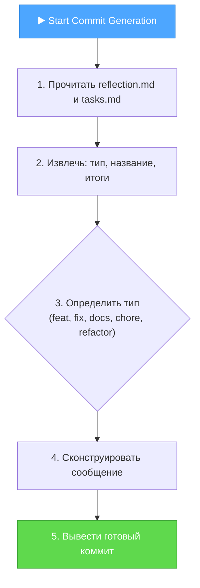
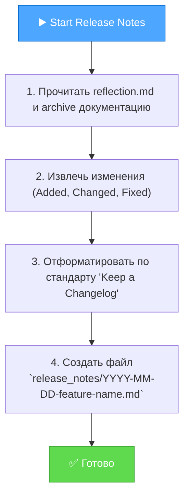

Я подготовил для вас подробный план, который включает создание двух новых правил и их интеграцию в существующий `ARCHIVE` режим.

---

### **Подробный план интеграции Release Notes и Commit Message**

Этот план разделен на две логические фазы:
1.  **Фаза 1: Создание специализированных правил-генераторов.**
2.  **Фаза 2: Интеграция новых правил в карту процесса `ARCHIVE` режима.**

---

### **Фаза 1: Создание специализированных правил-генераторов**

Мы создадим два новых, модульных правила. Это позволит нам в будущем легко изменять форматы коммитов или заметок, не затрагивая основную логику архивации.

#### **1.1. Создание правила `commit-message-generator.mdc`**

**Цель:** Это правило будет анализировать завершенную задачу и генерировать структурированное сообщение для коммита в соответствии со стандартом Conventional Commits.

**Действие:** Создайте новый файл `.cursor/rules/isolation_rules/CustomWorkflow/documentation/commit-message-generator.mdc`.

**Содержимое для `commit-message-generator.mdc`:**

```mdc
---
description: "Генерирует структурированное сообщение для коммита на основе завершенной задачи."
globs: "**/archive-mode-map.mdc"
alwaysApply: false
---

# COMMIT MESSAGE GENERATOR

> **TL;DR:** Этот модуль анализирует `reflection.md` и `tasks.md` для автоматического создания коммита по стандарту Conventional Commits.

## 📝 Процесс генерации



## 📋 Шаблон сообщения для коммита

Я буду использовать следующий шаблон:

```
[type]([scope]): [Краткое описание на английском]

[Более подробное описание изменений на русском языке. Описывает, ЧТО было сделано и ПОЧЕМУ. Основывается на `reflection.md`.]

- Ключевое изменение 1
- Ключевое изменение 2
- Ключевое изменение 3

BREAKING CHANGE: [Описание, если есть обратно несовместимые изменения]

Closes #[Номер задачи в трекере, если есть]
```

### Пример сгенерированного сообщения:

```
feat(auth): add step-by-step and universal modes

Реализованы два новых режима управления рабочим процессом:
- `UNIVERSAL`: Полностью автономный режим ("автопилот") для выполнения всего цикла разработки.
- `STEP_BY_STEP`: Контролируемый пошаговый режим, ожидающий подтверждения пользователя после каждой фазы.

Оба режима интегрированы с системой управления состоянием, `interaction-mode` и менеджером даты/времени. Это нововведение значительно повышает гибкость и уровень автоматизации системы.
```
```

#### **1.2. Создание правила `release-notes-generator.mdc`**

**Цель:** Это правило будет собирать информацию о новой функции или исправлении и генерировать заметки для релиза в формате "Keep a Changelog".

**Действие:** Создайте новый файл `.cursor/rules/isolation_rules/CustomWorkflow/documentation/release-notes-generator.mdc`.

**Содержимое для `release-notes-generator.mdc`:**

```mdc
---
description: "Генерирует заметки для релиза (Release Notes) для завершенной задачи."
globs: "**/archive-mode-map.mdc"
alwaysApply: false
---

# RELEASE NOTES GENERATOR

> **TL;DR:** Этот модуль создает файл с заметками для релиза в директории `/release_notes`, основываясь на итогах задачи.

## 🚀 Процесс генерации Release Notes



## 📋 Шаблон Release Notes

```markdown
# Release Notes - [Название фичи/задачи] - [YYYY-MM-DD]

## ✨ Added (Добавлено)
- [Описание новой функциональности 1.]
- [Описание новой функциональности 2.]

## 🔄 Changed (Изменено)
- [Описание изменения в существующей функциональности.]

## 🐛 Fixed (Исправлено)
- [Описание исправленной ошибки.]

## ⚠️ BREAKING CHANGES (Критические изменения)
- [Описание изменений, которые могут нарушить обратную совместимость.]
```

### Место сохранения:
Сгенерированные заметки будут сохранены в новую директорию в корне проекта: `release_notes/`.
```

---

### **Фаза 2: Интеграция новых правил в карту процесса `ARCHIVE`**

Теперь мы встроим вызов этих двух новых правил в существующую логику режима `ARCHIVE`.

**Файл для изменения:** `.cursor/rules/isolation_rules/visual-maps/archive-mode-map.mdc`

#### **Конкретные изменения:**

1.  **Найдите** в файле `archive-mode-map.mdc` диаграмму Mermaid.
2.  **Найдите** узел `CreateArchive["Create Archive<br>Document in<br>docs/archive/"]`.
3.  **Вставьте** новые узлы для генерации коммита и заметок для релиза **сразу после** него.

    **Было (упрощенно):**
    ```mermaid
    graph TD
        ...
        CreateMigration --> CreateArchive
        CreateArchive --> UpdateTasks["📝 Update tasks.md"]
        ...
    ```

    **Стало (новая версия):**
    ```mermaid
    graph TD
        ...
        CreateMigration --> CreateArchive["📄 Create Archive Document"]

        subgraph "НОВАЯ ФАЗА: ФИНАЛЬНЫЕ АРТЕФАКТЫ"
            GenerateCommit["📝 <b>Generate Commit Message</b><br>fetch_rules(isolation_rules/CustomWorkflow/documentation/commit-message-generator.mdc)"]
            GenerateReleaseNotes["📄 <b>Generate Release Notes</b><br>fetch_rules(isolation_rules/CustomWorkflow/documentation/release-notes-generator.mdc)"]
        end

        CreateArchive --> GenerateCommit
        GenerateCommit --> GenerateReleaseNotes
        GenerateReleaseNotes --> UpdateTasks["📝 Update tasks.md"]
        ...

        style GenerateCommit fill:#80deea,stroke:#0097a7
        style GenerateReleaseNotes fill:#80deea,stroke:#0097a7
    ```

4.  **Добавьте явные инструкции** в текстовую часть файла `archive-mode-map.mdc` (например, после раздела "ARCHIVE PHASE FILE UPDATES").

    **Новый текст для добавления:**

    ```markdown
    ### Commit Message & Release Notes Generation
    After creating the main archive document, but before updating `tasks.md`, perform the following steps:
    1.  `fetch_rules(["isolation_rules/CustomWorkflow/documentation/commit-message-generator.mdc"])` to generate the final commit message. Display it to the user.
    2.  `fetch_rules(["isolation_rules/CustomWorkflow/documentation/release-notes-generator.mdc"])` to generate the release notes and save them to the `release_notes/` directory.
    ```

---

### **Чек-лист для проверки результата**

После того как вы вручную примените эти изменения, используйте этот чек-лист для проверки:

#### **✅ Проверка Фазы 1 (Новые правила):**
-   [ ] Файл `.cursor/rules/isolation_rules/CustomWorkflow/documentation/commit-message-generator.mdc` создан и содержит правильный код.
-   [ ] Файл `.cursor/rules/isolation_rules/CustomWorkflow/documentation/release-notes-generator.mdc` создан и содержит правильный код.

#### **✅ Проверка Фазы 2 (Интеграция):**
-   [ ] Файл `.cursor/rules/isolation_rules/visual-maps/archive-mode-map.mdc` был изменен.
-   [ ] **Диаграмма Mermaid** в `archive-mode-map.mdc` теперь включает новые узлы `GenerateCommit` и `GenerateReleaseNotes` после `CreateArchive`.
-   [ ] **Текстовая часть** `archive-mode-map.mdc` содержит новый раздел с явными инструкциями `fetch_rules` для `commit-message-generator.mdc` и `release-notes-generator.mdc`.

#### **✅ Проверка итогового поведения:**
-   [ ] При выполнении команды `ARCHIVE NOW` в режиме `REFLECT`:
    -   Система сначала выполняет свои обычные шаги (анализ, создание архива).
    -   Затем она должна **показать вам сгенерированное сообщение для коммита**.
    -   Затем она должна **создать файл Release Notes** в новой директории `/release_notes`.
    -   И только после этого она завершает процесс, обновляя `tasks.md` и очищая контекст.

Выполнение этого плана сделает ваш `ARCHIVE` режим еще более мощным и полезным, автоматизируя последние шаги перед фиксацией изменений.