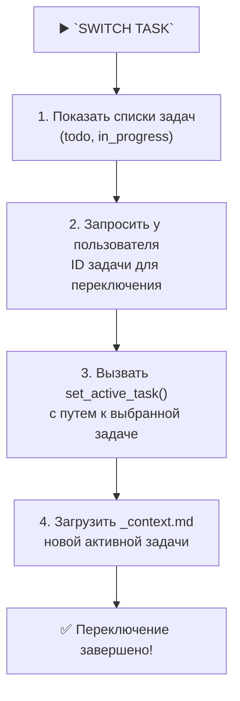

Отличная идея! Это следующий логический шаг в эволюции вашей системы — переход от **глобального контекста** к **полностью инкапсулированному контексту задачи**. Такой подход решает сразу несколько проблем:

*   **Истинная изоляция:** Полностью исключается "протекание" контекста между задачами.
*   **Легкое переключение:** Переключиться на другую задачу так же просто, как перейти в другую директорию.
*   **Портативность:** Всю задачу со всеми артефактами можно легко заархивировать, переместить или передать.
*   **Масштабируемость:** Система может одновременно "знать" о десятках задач, не смешивая их в одном месте.

Давайте разработаем подробный план для этой миграции.

---

### **Подробный план перехода к инкапсулированному контексту задачи**

#### **Фаза 1: Проектирование новой структуры задачи**

**1.1. Определение новой иерархии директорий**

Каждая задача будет представлять собой отдельную директорию. Имя директории будет содержать дату и идентификатор задачи, что обеспечит хронологическую сортировку и уникальность.

**Новая структура:**

```
└── memory-bank/
    ├── tasks/
    │   ├── todo/
    │   │   └── 2025-06-25_ID-001_implement-user-auth/  <-- Директория задачи
    │   │       ├── _task.md                            <-- Основной файл задачи
    │   │       ├── _context.md                         <-- Контекст задачи
    │   │       ├── _reflection.md                      <-- Рефлексия
    │   │       ├── _archive.md                         <-- Архивный документ
    │   │       ├── creative/
    │   │       │   └── ... (результаты креативной фазы)
    │   │       ├── reports/
    │   │       │   └── ... (отчеты по задаче)
    │   │       └── release/
    │   │           ├── _commit_message.txt
    │   │           └── _release_notes.md
    │   ├── in_progress/
    │   │   └── 2025-06-26_ID-002_refactor-api/
    │   │       └── ... (такая же структура)
    │   └── done/
    │       └── ... (сюда будут перемещаться директории завершенных задач)
    └── system/
        ├── current-task.txt  <-- (НОВЫЙ ФАЙЛ) Указывает на активную задачу
        └── ... (остальные системные файлы остаются)
```

-   **`_task.md`:** Заменяет старые атомарные файлы задач. Содержит описание, требования, чек-листы.
-   **`_context.md`:** Заменяет `current-context.md`. Содержит `LATEST_REQUEST` и `REQUEST_HISTORY` **только для этой задачи**.
-   **`creative/`, `reports/`, `release/`:** Папки для всех артефактов, связанных с задачей.
-   **`_` (подчеркивание):** Используется для именования ключевых файлов, чтобы они всегда были вверху списка.
-   **`current-task.txt`:** Новый системный файл, который хранит путь к директории **текущей активной задачи**. Это замена глобальному `activeContext.md`.

#### **1.2. Создание нового правила для управления активной задачей**

**Действие:** Создайте новый файл `.cursor/rules/isolation_rules/Core/active-task-manager.mdc`.

**Содержимое для `active-task-manager.mdc`:**

```mdc
---
description: "Управляет активной задачей, читая и записывая путь в current-task.txt."
globs: "**/**"
alwaysApply: true
---

# ACTIVE TASK MANAGER

> **TL;DR:** Этот модуль определяет текущую активную задачу, читая путь из `memory-bank/system/current-task.txt`. Все операции (чтение/запись контекста, задач и т.д.) должны использовать этот путь для определения рабочей директории.

## ⚙️ Основные функции

### 1. Получение пути к активной задаче

```bash
# Эта функция должна использоваться всеми правилами для доступа к файлам задачи
function get_active_task_path() {
  local state_file="memory-bank/system/current-task.txt"
  if [ -f "$state_file" ]; then
    cat "$state_file"
  else
    echo "" # Нет активной задачи
  fi
}
```

### 2. Установка новой активной задачи

```bash
# Эта функция вызывается при создании новой задачи или переключении на существующую
function set_active_task() {
  local task_path="$1" # e.g., memory-bank/tasks/in_progress/2025-06-25_ID-001...
  local state_file="memory-bank/system/current-task.txt"
  echo "$task_path" > "$state_file"
  echo "✅ Active task set to: $task_path"
}
```
```

---

### **Фаза 2: Модификация существующих правил**

Теперь нам нужно обновить все правила, которые работали с глобальными файлами, чтобы они использовали новую, инкапсулированную структуру.

**2.1. Обновление `task-management-2-0.mdc`**

-   **Действие:** Измените логику создания задач. Вместо создания одного файла, теперь нужно создавать целую директорию с подпапками и файлом `_task.md`.

    **Было:** `Создать файл YYYY-MM-DD-task-name.md в tasks/todo/`
    **Стало:**
    1.  `Создать директорию YYYY-MM-DD_ID-XXX_task-name/ в tasks/todo/`.
    2.  Внутри нее создать пустые файлы `_task.md`, `_context.md` и папки `creative`, `reports`, `release`.
    3.  Вызвать `set_active_task()` с путем к этой новой директории.

**2.2. Обновление `context-management.mdc` и `request-versioning-system.mdc`**

-   **Действие:** Измените все пути к файлам контекста. Вместо глобального файла, они должны использовать путь из `get_active_task_path()`.

    **Было:** `read_file("memory-bank/system/current-context.md")`
    **Стало:**
    ```bash
    active_task_path=$(get_active_task_path)
    if [ -n "$active_task_path" ]; then
      read_file("$active_task_path/_context.md")
    else
      # Обработка случая, когда нет активной задачи
    fi
    ```

**2.3. Обновление правил `commit-message-generator.mdc` и `release-notes-generator.mdc`**

-   **Действие:** Измените пути сохранения артефактов.

    **Было (Release Notes):** `Создать файл в release_notes/`
    **Стало:**
    ```bash
    active_task_path=$(get_active_task_path)
    release_dir="$active_task_path/release"
    mkdir -p "$release_dir"
    create_file("$release_dir/_release_notes.md")
    ```
    Аналогично для `_commit_message.txt`.

**2.4. Обновление всех карт процессов (`*-mode-map.mdc`)**

-   **Действие:** Везде, где есть ссылки на файлы задач, контекста или другие артефакты, замените их на вызовы с использованием `get_active_task_path()`. Это самое масштабное изменение.

    **Пример для `implement-mode-map.mdc`:**
    **Было:** `Прочитать implementation-plan.md`
    **Стало:** `Прочитать $(get_active_task_path)/_task.md` (так как план теперь часть `_task.md`).

---

### **Фаза 3: Внедрение новой логики переключения задач**

**Цель:** Создать новую команду или механизм, который позволит пользователю переключаться между задачами.

**Действие:** Создайте новый файл инструкций `custom_modes/switch_task_instructions.md`.

**Содержимое для `switch_task_instructions.md`:**

```md
# MEMORY BANK TASK SWITCHING MODE

> **TL;DR:** Этот режим позволяет вам просматривать все задачи и переключаться на любую из них.

## 🚀 Процесс переключения задачи



## 🛠️ Команды

### 1. Показать все задачи
```bash
echo "--- TODO ---"
ls -1 memory-bank/tasks/todo/
echo "--- IN PROGRESS ---"
ls -1 memory-bank/tasks/in_progress/
```

### 2. Переключиться на задачу
```bash
# Псевдокод
user_input_id = prompt_user("Enter Task ID to switch to (e.g., ID-001):")
task_dir = find_directory_by_id(user_input_id)
if [ -n "$task_dir" ]; then
  set_active_task("$task_dir")
  load_file("$task_dir/_context.md")
else
  echo "❌ Задача с ID $user_input_id не найдена."
fi
```
```

---

### **Фаза 4: Миграция**

**Цель:** Создать одноразовый скрипт, который преобразует вашу текущую структуру в новую.

**Действие:** Создайте скрипт `memory-bank/scripts/migrate-to-encapsulated.sh`.

**Содержимое для `migrate-to-encapsulated.sh` (упрощенный псевдокод):**

```bash
#!/bin/bash
echo "🚀 Starting migration to encapsulated task structure..."

# Переместить существующие файлы задач
for task_file in memory-bank/tasks/{todo,in_progress}/*/*.md; do
  if [ -f "$task_file" ]; then
    # Создать новую директорию задачи
    task_name=$(basename "$task_file" .md)
    task_dir="memory-bank/tasks/$(dirname "$task_file")/${task_name}"
    mkdir -p "$task_dir/creative" "$task_dir/reports" "$task_dir/release"

    # Переместить файл задачи
    mv "$task_file" "$task_dir/_task.md"

    # Создать пустые файлы-заглушки
    touch "$task_dir/_context.md"
    touch "$task_dir/_reflection.md"
  fi
done

# Обработать завершенные задачи
# ... (аналогично для папки done) ...

# Очистить старые папки контекста, если они есть
rm -rf memory-bank/contexts/

echo "✅ Migration complete!"
```

---

### **Чек-лист для проверки результата**

#### **✅ Фаза 1: Проектирование**
-   [ ] Новая структура директории задачи определена и понятна.
-   [ ] Файл `.cursor/rules/isolation_rules/Core/active-task-manager.mdc` создан.

#### **✅ Фаза 2: Модификация правил**
-   [ ] `task-management-2-0.mdc` обновлен для создания директорий, а не файлов.
-   [ ] `context-management.mdc` и `request-versioning-system.mdc` теперь используют `get_active_task_path()`.
-   [ ] `commit-message-generator.mdc` и `release-notes-generator.mdc` сохраняют файлы в директорию активной задачи.
-   [ ] **(Выборочно)** Проверить 2-3 ключевые карты процессов (`van-mode-map`, `implement-mode-map`) на предмет использования `get_active_task_path()`.

#### **✅ Фаза 3: Переключение задач**
-   [ ] Файл `custom_modes/switch_task_instructions.md` создан.
-   [ ] Протестировать команду `SWITCH TASK`: она должна показывать список задач и успешно обновлять `current-task.txt`.

#### **✅ Фаза 4: Миграция**
-   [ ] Скрипт миграции `migrate-to-encapsulated.sh` создан.
-   [ ] **(После бэкапа!)** Запустить скрипт и убедиться, что старые файлы корректно перемещены в новые директории.

Выполнение этого плана приведет вашу систему к новому, более высокому уровню организации и надежности. Это масштабное, но очень ценное изменение.