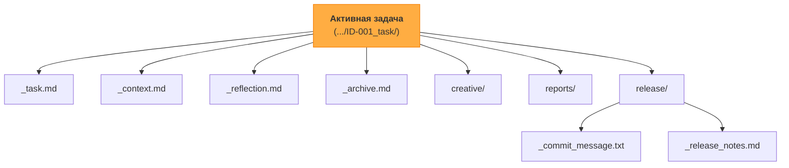

Вот подробный план действий **только для Фазы 1**, который вы можете выполнить вручную, и исчерпывающий чек-лист для верификации результата.

---

### **Фаза 1: Создание централизованного менеджера артефактов (`task-artifact-manager`)**

**Цель:** Создать единое правило, которое будет "знать" внутреннюю структуру директории задачи. Все остальные правила будут обращаться к нему, чтобы получить канонический путь к артефактам, таким как `_context.md`, `_release_notes.md` и т.д. Это делает систему гораздо более надежной и легкой в поддержке.

---

### **Пошаговый план реализации**

#### **Шаг 1: Создание нового правила `Core/task-artifact-manager.mdc`**

Это правило станет "библиотекой путей" для активной задачи.

**Действие:** Создайте новый файл по пути `.cursor/rules/isolation_rules/Core/task-artifact-manager.mdc`.

**Содержимое для `task-artifact-manager.mdc`:**

```mdc
---
description: "Централизованно управляет путями к артефактам внутри директории активной задачи."
globs: "**/**"
alwaysApply: true
---

# TASK ARTIFACT MANAGER

> **TL;DR:** Этот модуль является единым источником правды для всех путей *внутри* директории активной задачи. Вместо того чтобы конструировать пути вручную, другие правила должны вызывать функции этого менеджера для получения канонических путей.

## 🗺️ Каноническая структура директории задачи



## ⚙️ Функции-хелперы для получения путей

**ВАЖНО:** Эти функции предполагают, что правило `Core/active-task-manager.mdc` уже загружено и функция `get_active_task_path()` доступна.

```bash
# Эта функция из active-task-manager.mdc, от которой мы зависим
function get_active_task_path() { ... }

# ===== НОВЫЕ ФУНКЦИИ-ХЕЛПЕРЫ =====

# Получить путь к основному файлу задачи (_task.md)
function get_task_file_path() {
  local active_path
  active_path=$(get_active_task_path)
  if [ -n "$active_path" ]; then
    echo "$active_path/_task.md"
  fi
}

# Получить путь к файлу контекста задачи (_context.md)
function get_context_file_path() {
  local active_path
  active_path=$(get_active_task_path)
  if [ -n "$active_path" ]; then
    echo "$active_path/_context.md"
  fi
}

# Получить путь к файлу рефлексии задачи (_reflection.md)
function get_reflection_file_path() {
  local active_path
  active_path=$(get_active_task_path)
  if [ -n "$active_path" ]; then
    echo "$active_path/_reflection.md"
  fi
}

# Получить путь к директории с артефактами релиза (release/)
function get_release_path() {
  local active_path
  active_path=$(get_active_task_path)
  if [ -n "$active_path" ]; then
    echo "$active_path/release"
  fi
}

# Получить путь к файлу с сообщением для коммита
function get_commit_message_file_path() {
  local release_path
  release_path=$(get_release_path)
  if [ -n "$release_path" ]; then
    echo "$release_path/_commit_message.txt"
  fi
}

# Получить путь к файлу с заметками для релиза
function get_release_notes_file_path() {
  local release_path
  release_path=$(get_release_path)
  if [ -n "$release_path" ]; then
    echo "$release_path/_release_notes.md"
  fi
}
```
```

#### **Шаг 2: Рефакторинг существующих правил для использования нового менеджера**

Теперь необходимо найти правила, которые вручную конструировали пути, и заставить их вызывать новые функции. Вот самые важные примеры:

**2.1. Рефакторинг `Core/context-management.mdc`**

-   **Действие:** Найдите место, где определяется путь к файлу контекста.
-   **Было:**
    ```bash
    active_task_path=$(get_active_task_path)
    context_file="$active_task_path/_context.md"
    # ... работа с context_file ...
    ```
-   **Стало:**
    ```bash
    context_file=$(get_context_file_path)
    if [ -n "$context_file" ]; then
      # ... работа с context_file ...
    else
      echo "❌ No active task. Cannot manage context."
    fi
    ```

**2.2. Рефакторинг `Core/request-versioning-system.mdc`**

-   **Действие:** Аналогично, найдите место, где определяется путь к файлу контекста.
-   **Было:**
    ```bash
    active_task_path=$(get_active_task_path)
    context_file="$active_task_path/_context.md"
    context_content = read_file("$context_file")
    ```
-   **Стало:**
    ```bash
    context_file=$(get_context_file_path)
    if [ -n "$context_file" ]; then
      context_content = read_file("$context_file")
      # ... остальная логика ...
    else
      echo "❌ No active task. Cannot version request."
    fi
    ```

**2.3. Рефакторинг `CustomWorkflow/documentation/release-notes-generator.mdc`**

-   **Действие:** Найдите место, где определяется путь к файлу `_release_notes.md`.
-   **Было:**
    ```bash
    active_task_path=$(get_active_task_path)
    release_dir="$active_task_path/release"
    mkdir -p "$release_dir"
    release_notes_file="$release_dir/_release_notes.md"
    ```
-   **Стало:**
    ```bash
    release_notes_file=$(get_release_notes_file_path)
    if [ -n "$release_notes_file" ]; then
      mkdir -p "$(dirname "$release_notes_file")"
      # ... логика создания файла ...
      echo "✅ Release notes saved to: $release_notes_file"
    else
      echo "❌ No active task. Cannot save release notes."
    fi
    ```
    *(Паттерн `mkdir -p "$(dirname "$file")"` — это надежный способ создать родительскую директорию для файла, путь к которому вы получили)*.

**2.4. Рефакторинг `CustomWorkflow/documentation/commit-message-generator.mdc`**

-   **Действие:** Примените ту же логику, что и в шаге 2.3, но для `_commit_message.txt`.
-   **Стало:**
    ```bash
    commit_message_file=$(get_commit_message_file_path)
    if [ -n "$commit_message_file" ]; then
      mkdir -p "$(dirname "$commit_message_file")"
      # ... логика создания файла ...
      echo "✅ Commit message saved to: $commit_message_file"
    else
      echo "❌ No active task. Cannot save commit message."
    fi
    ```

**2.5. Рекомендация:** Просмотрите другие правила и карты процессов (например, `archive-mode-map.mdc`), чтобы найти другие места, где пути конструируются вручную, и примените тот же рефакторинг.

---

### **План верификации (Чек-лист)**

После выполнения этих шагов, используйте этот чек-лист для проверки.

#### **✅ Шаг 1: Проверка создания и содержания нового правила**
-   [ ] **1.1. Проверка существования файла:**
    -   **Команда:** `ls .cursor/rules/isolation_rules/Core/task-artifact-manager.mdc`
    -   **Ожидаемый результат:** Команда выполняется без ошибок.
-   [ ] **1.2. Проверка `frontmatter`:**
    -   **Команда:** `cat .cursor/rules/isolation_rules/Core/task-artifact-manager.mdc | head -n 4`
    -   **Ожидаемый результат:** Вы должны увидеть `description`, `globs: "**/**"` и `alwaysApply: true`.
-   [ ] **1.3. Проверка наличия функций:**
    -   **Команда:** `cat .cursor/rules/isolation_rules/Core/task-artifact-manager.mdc | grep "function get_"`
    -   **Ожидаемый результат:** Вы должны увидеть в списке все новые функции: `get_task_file_path`, `get_context_file_path`, `get_release_path` и т.д.

#### **✅ Шаг 2: Проверка рефакторинга существующих правил**
-   [ ] **2.1. Проверка `context-management.mdc`:**
    -   **Команда:** `grep "get_context_file_path" .cursor/rules/isolation_rules/Core/context-management.mdc`
    -   **Ожидаемый результат:** Команда должна найти как минимум одно совпадение.
-   [ ] **2.2. Проверка `release-notes-generator.mdc`:**
    -   **Команда:** `grep "get_release_notes_file_path" .cursor/rules/isolation_rules/CustomWorkflow/documentation/release-notes-generator.mdc`
    -   **Ожидаемый результат:** Команда должна найти как минимум одно совпадение.

#### **✅ Шаг 3: Функциональное End-to-End тестирование**
Это самая важная проверка, которая подтверждает, что вся цепочка работает.

-   [ ] **3.1. Подготовка:**
    1.  Создайте тестовую директорию задачи, например: `mkdir -p memory-bank/tasks/in_progress/2025-06-25_ID-999_test-artifact-manager`
    2.  Установите эту директорию как активную. **Команда:** `echo "memory-bank/tasks/in_progress/2025-06-25_ID-999_test-artifact-manager" > memory-bank/system/current-task.txt`
-   [ ] **3.2. Действие:**
    -   Запустите режим, который создает артефакты, например, `ARCHIVE NOW` (из режима `REFLECT`). Этот режим вызывает `release-notes-generator.mdc` и `commit-message-generator.mdc`.
-   [ ] **3.3. Верификация:**
    1.  **Команда:** `ls -l memory-bank/tasks/in_progress/2025-06-25_ID-999_test-artifact-manager/release/`
    2.  **Ожидаемый результат:** Вы должны увидеть файлы `_commit_message.txt` и `_release_notes.md` в этой директории. Если они создались здесь, значит `active-task-manager` правильно определил путь к задаче, `task-artifact-manager` правильно построил путь к артефакту, и правило-генератор успешно его использовало.
-   [ ] **3.4. Очистка:**
    -   **Команда:** `rm -rf memory-bank/tasks/in_progress/2025-06-25_ID-999_test-artifact-manager`
    -   **Команда:** `echo "" > memory-bank/system/current-task.txt`

Выполнение этого плана сделает вашу систему гораздо более надежной и готовой к дальнейшему развитию.