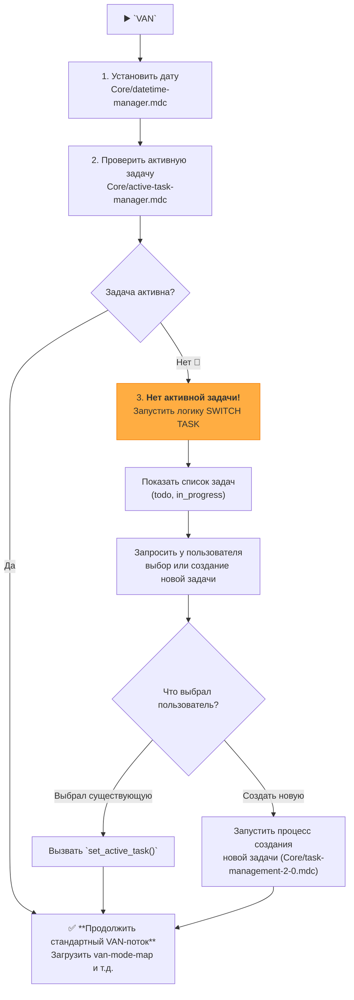
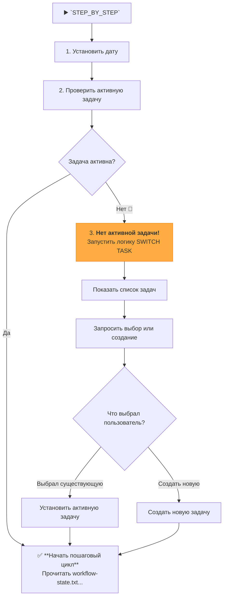

Отлично! Переходим к **Фазе 2**. Это ключевой шаг, который сделает вашу систему более "дружелюбной" и умной. Вместо того чтобы выдавать ошибку при отсутствии активной задачи, система теперь будет проактивно помогать пользователю выбрать, с чем работать.

### **Фаза 2: Интеграция `SWITCH TASK` в основной рабочий поток**

**Цель:** Научить режимы-супервайзоры (`VAN`, `UNIVERSAL` и `STEP_BY_STEP`) проверять наличие активной задачи в самом начале. Если активной задачи нет, они должны инициировать логику выбора/создания задачи, а не аварийно завершаться.

---

### **Пошаговый план реализации**

Этот план затрагивает три ключевых файла инструкций. Логика, которую мы добавляем, практически идентична для всех трех, но мы рассмотрим каждый отдельно для максимальной ясности.

#### **Шаг 1: Модификация `custom_modes/van_instructions.md`**

Это самый важный файл для изменения, так как `VAN` — это основная точка входа для анализа и начала работы над задачей.

**Действие:** Откройте файл `custom_modes/van_instructions.md`. Полностью замените его содержимое на новое, которое включает логику "пре-флайт проверки".

**Новое содержимое для `van_instructions.md`:**

```md
# UNIFIED VAN MODE SYSTEM - MAIN ENTRY POINT

> **TL;DR:** Я — AI-ассистент, реализующий структурированную систему Memory Bank. Перед началом работы я проверю, выбрана ли активная задача. Если нет, я помогу вам ее выбрать или создать новую.

## 🚶 ЛОГИКА ВЫПОЛНЕНИЯ VAN



### 🛠️ ИСПОЛНЯЕМЫЕ ШАГИ

#### Шаг 1: Инициализация и проверка активной задачи
- `initialize_system_date()`
- `active_task_path=$(get_active_task_path)`
- Если `$active_task_path` **не пуст**, переходим к **Шагу 3**.
- Если `$active_task_path` **пуст**, переходим к **Шагу 2**.

#### Шаг 2: Процесс выбора задачи (если ни одна не активна)
1.  **Сообщить пользователю:** "No active task selected. Please choose a task to work on or create a new one."
2.  **Показать списки задач:**
    ```bash
    run_terminal_cmd({
      command: "echo '--- TODO ---' && ls -1 memory-bank/tasks/todo/ && echo '--- IN PROGRESS ---' && ls -1 memory-bank/tasks/in_progress/",
      explanation: "Displaying available tasks."
    })
    ```
3.  **Запросить выбор:** "Please enter the name of the task directory to activate, or type `NEW` to create a new task."
4.  **Обработать выбор пользователя:**
    -   Если пользователь ввел имя директории, выполнить `set_active_task("memory-bank/tasks/in_progress/[имя директории]")` (или `todo`).
    -   Если пользователь ввел `NEW`, запустить логику создания новой задачи из правила `Core/task-management-2-0.mdc`.
5.  **Перейти к Шагу 3.**

#### Шаг 3: Стандартный VAN-поток
- `fetch_rules(["isolation_rules/visual-maps/van_mode_split/van-mode-map.mdc"])`
- ... (и далее по существующей логике `VAN`, включая проверку Git, определение сложности и т.д.)
```

#### **Шаг 2: Модификация `custom_modes/universal_instructions.md`**

**Действие:** Примените ту же самую логику "пре-флайт проверки", что и в Шаге 1. `UNIVERSAL` режим не может работать без конкретной задачи, поэтому он должен заставить пользователя ее выбрать.

**Новое содержимое для `universal_instructions.md` (начало файла):**

```md
# MEMORY BANK UNIVERSAL MODE (ENHANCED AUTOPILOT)

> **TL;DR:** Этот режим выполняет полный цикл разработки. Перед запуском я проверю, выбрана ли активная задача. Если нет, я помогу вам ее выбрать или создать.

## 🚶 ЛОГИКА ВЫПОЛНЕНИЯ UNIVERSAL


### 🛠️ ИСПОЛНЯЕМЫЕ ШАГИ

#### Шаг 1: Инициализация и проверка активной задачи
- ... (полностью идентично Шагу 1 из `van_instructions.md`)

#### Шаг 2: Процесс выбора задачи (если ни одна не активна)
- ... (полностью идентично Шагу 2 из `van_instructions.md`)

#### Шаг 3: Стандартный UNIVERSAL-поток
- После того как задача выбрана, начинается основной автономный цикл, который мы уже проектировали:
- **VAN**: Загрузить `van-mode-map.mdc`...
- **PLAN**: Загрузить `plan-mode-map.mdc`...
- ... (и так далее)
```

#### **Шаг 3: Модификация `custom_modes/step_by_step_instructions.md`**

**Действие:** Примените ту же логику. Пошаговый режим также требует активной задачи для работы.

**Новое содержимое для `step_by_step_instructions.md` (начало файла):**

```md
# MEMORY BANK STEP_BY_STEP MODE (STATEFUL CONTROLLER)

> **TL;DR:** Я — диспетчер пошагового выполнения. Перед началом я проверю, выбрана ли активная задача. Если нет, я помогу вам.

## 🚶 ЛОГИКА ВЫПОЛНЕНИЯ STEP_BY_STEP



### 🛠️ ИСПОЛНЯЕМЫЕ ШАГИ

#### Шаг 1: Инициализация и проверка активной задачи
- ... (полностью идентично Шагу 1 из `van_instructions.md`)

#### Шаг 2: Процесс выбора задачи (если ни одна не активна)
- ... (полностью идентично Шагу 2 из `van_instructions.md`)

#### Шаг 3: Стандартный STEP_BY_STEP-поток
- После того как задача выбрана, начинается основной пошаговый цикл:
- Прочитать `workflow-state.txt`...
- Выполнить следующую фазу...
- ... (и так далее)
```

---

### **План верификации (Чек-лист)**

После внесения этих изменений, используйте этот чек-лист для проверки.

1.  **Проверка обновления файлов:**
    -   [ ] Файл `custom_modes/van_instructions.md` обновлен и содержит новую логику "пре-флайт проверки".
    -   [ ] Файл `custom_modes/universal_instructions.md` обновлен с аналогичной логикой.
    -   [ ] Файл `custom_modes/step_by_step_instructions.md` обновлен с аналогичной логикой.

2.  **Функциональное End-to-End тестирование (Ключевая проверка):**
    -   [ ] **Сценарий 1: Нет активной задачи.**
        1.  **Подготовка:** Убедитесь, что файл `memory-bank/system/current-task.txt` пуст или не существует.
        2.  **Действие:** Запустите режим `VAN` (или `UNIVERSAL`, или `STEP_BY_STEP`).
        3.  **Ожидаемый результат:**
            -   Система должна сообщить: "No active task selected".
            -   Система должна вывести списки задач из `tasks/todo` и `tasks/in_progress`.
            -   Система должна запросить у вас имя директории или команду `NEW`.
        4.  **Действие 2:** Введите имя существующей директории задачи.
        5.  **Ожидаемый результат 2:**
            -   Система должна сообщить "✅ Active task set to: ...".
            -   Система должна **продолжить выполнение** изначально запрошенного режима (`VAN`, `UNIVERSAL` и т.д.) уже для этой задачи.
            -   Файл `current-task.txt` должен содержать путь к выбранной задаче.

    -   [ ] **Сценарий 2: Есть активная задача.**
        1.  **Подготовка:** Запишите валидный путь к директории задачи в файл `memory-bank/system/current-task.txt`.
        2.  **Действие:** Запустите режим `VAN`.
        3.  **Ожидаемый результат:** Система должна **сразу перейти** к стандартному `VAN`-потоку (проверка Git и т.д.), **пропустив** этап выбора задачи.

Выполнение этого плана сделает вашу систему гораздо более надежной, интуитивно понятной и готовой к использованию в реальных условиях.