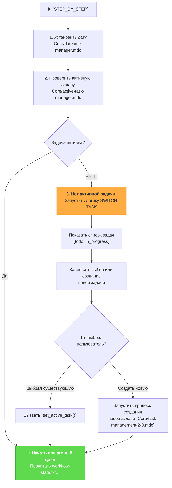

Отлично! Выделение `STEP_BY_STEP` режима в отдельный, детализированный план — это правильный подход, так как его логика "диспетчера состояний" сложнее, чем у других режимов.

Вот подробный, пошаговый план внесения изменений **только в файл `custom_modes/step_by_step_instructions.md`**. План включает в себя финальное содержимое файла и исчерпывающий чек-лист для верификации, чтобы вы могли быть уверены, что все работает как надо.

---

### **Подробный план для `custom_modes/step_by_step_instructions.md`**

**Цель:** Модифицировать `STEP_BY_STEP` режим так, чтобы он сначала проверял наличие активной задачи. Если задача не выбрана, он должен запустить процесс выбора/создания задачи. И только после того, как задача станет активной, он должен начать свой основной пошаговый цикл выполнения фаз разработки.

---

### **Шаг 1: Полная замена содержимого файла**

Это самый простой и надежный способ. Старая логика полностью войдет в новую в качестве одного из шагов.

**Действие:** Откройте файл `custom_modes/step_by_step_instructions.md`. Полностью удалите его текущее содержимое и замените его следующим кодом.

**Новое содержимое для `step_by_step_instructions.md`:**

```md
# MEMORY BANK STEP_BY_STEP MODE (STATEFUL CONTROLLER)

> **TL;DR:** Я — диспетчер пошагового выполнения. Перед началом я проверю, выбрана ли активная задача. Если нет, я помогу вам ее выбрать или создать. И только потом мы начнем пошаговый цикл.

## 🚶 ЛОГИКА ВЫПОЛНЕНИЯ STEP_BY_STEP



### 🛠️ ИСПОЛНЯЕМЫЙ АЛГОРИТМ

При каждом вызове `STEP_BY_STEP` или команды `NEXT`, я буду выполнять следующий алгоритм:

#### Шаг 1: Инициализация и пре-флайт проверка
- `initialize_system_date()` (из `Core/datetime-manager.mdc`).
- `active_task_path=$(get_active_task_path)` (из `Core/active-task-manager.mdc`).
- Если переменная `$active_task_path` **не пуста**, я немедленно перейду к **Шагу 3**.
- Если переменная `$active_task_path` **пуста**, я перейду к **Шагу 2**.

#### Шаг 2: Процесс выбора задачи (если ни одна не активна)
1.  **Сообщить пользователю:** "No active task selected. Please choose a task to work on or create a new one."
2.  **Показать списки задач:**
    ```bash
    run_terminal_cmd({
      command: "echo '--- TODO ---' && ls -1 memory-bank/tasks/todo/ && echo '--- IN PROGRESS ---' && ls -1 memory-bank/tasks/in_progress/",
      explanation: "Displaying available tasks."
    })
    ```
3.  **Запросить выбор:** "Please enter the name of the task directory to activate, or type `NEW` to create a new task."
4.  **Обработать выбор пользователя:**
    -   Если пользователь ввел имя существующей директории, я выполню `set_active_task("memory-bank/tasks/.../[имя директории]")`.
    -   Если пользователь ввел `NEW`, я запущу логику создания новой задачи из правила `Core/task-management-2-0.mdc`.
5.  После успешного выбора или создания задачи я **перейду к Шагу 3**.

#### Шаг 3: Стандартный пошаговый цикл (если задача активна)
- Я прочитаю текущее состояние из файла `memory-bank/system/workflow-state.txt`.
- На основе этого состояния я выполню **следующую** фазу разработки, загрузив соответствующую карту процесса.

```bash
# Исполняемый псевдокод для основного цикла STEP_BY_STEP

local state_file="memory-bank/system/workflow-state.txt"
local current_state=$(cat "$state_file" 2>/dev/null || echo "START")
echo "ℹ️ Текущее состояние: $current_state"

case "$current_state" in
    "START" | "ARCHIVE_COMPLETE")
        echo "--- 🚀 Запуск VAN Phase ---"
        fetch_rules(["isolation_rules/visual-maps/van_mode_split/van-mode-map.mdc"])
        echo "VAN_COMPLETE" > "$state_file"
        echo "✅ VAN Phase Complete. Type `NEXT` to proceed."
        ;;
    "VAN_COMPLETE")
        echo "--- 📋 Запуск PLAN Phase ---"
        fetch_rules(["isolation_rules/visual-maps/plan-mode-map.mdc"])
        echo "PLAN_COMPLETE" > "$state_file"
        echo "✅ PLAN Phase Complete. Type `NEXT` to proceed."
        ;;
    # ... и так далее для всех остальных фаз (CREATIVE, IMPLEMENT, QA, REFLECT, ARCHIVE) ...
    "REFLECT_COMPLETE")
        echo "--- 📦 Запуск ARCHIVE Phase ---"
        fetch_rules(["isolation_rules/visual-maps/archive-mode-map.mdc"])
        echo "ARCHIVE_COMPLETE" > "$state_file"
        echo "🎉 Полный цикл разработки завершен!"
        ;;
    *)
        echo "⚠️ Неизвестное состояние '$current_state'. Сбрасываю на START."
        echo "START" > "$state_file"
        ;;
esac
```

Я БУДУ строго следовать этой логике, сначала обеспечивая наличие активной задачи, а затем выполняя фазы пошагово.
```

---

### **План верификации (Чек-лист)**

После того как вы вручную примените эти изменения, используйте этот чек-лист для проверки.

1.  **Проверка обновления файла:**
    -   [ ] **1.1. Проверка наличия новой логики:**
        -   **Команда:** `grep "Проверить активную задачу" custom_modes/step_by_step_instructions.md`
        -   **Ожидаемый результат:** Команда должна найти как минимум одно совпадение. Это подтверждает, что новый код на месте.

2.  **Функциональное End-to-End тестирование (Ключевая проверка):**
    -   [ ] **2.1. Сценарий: Нет активной задачи.**
        1.  **Подготовка:** Убедитесь, что файл `memory-bank/system/current-task.txt` пуст.
        2.  **Действие:** Запустите режим `STEP_BY_STEP`.
        3.  **Ожидаемый результат:** Система **НЕ должна** сразу выполнять `VAN Phase`. Вместо этого она должна:
            -   Сообщить: "No active task selected...".
            -   Показать списки задач из `tasks/todo` и `tasks/in_progress`.
            -   Запросить у вас имя директории или команду `NEW`.
        4.  **Действие 2:** Введите имя существующей директории задачи.
        5.  **Ожидаемый результат 2:**
            -   Система должна сообщить "✅ Active task set to: ...".
            -   Затем она должна **начать выполнение `VAN Phase`** (первой фазы цикла).
            -   И, наконец, остановиться с сообщением "✅ VAN Phase Complete. Type `NEXT` to proceed.".

    -   [ ] **2.2. Сценарий: Есть активная задача.**
        1.  **Подготовка:** Запишите валидный путь к директории задачи в файл `memory-bank/system/current-task.txt`. Убедитесь, что `memory-bank/system/workflow-state.txt` пуст или содержит `START`.
        2.  **Действие:** Запустите режим `STEP_BY_STEP`.
        3.  **Ожидаемый результат:** Система должна **сразу перейти** к выполнению `VAN Phase`, **пропустив** этап выбора задачи, и остановиться с сообщением "✅ VAN Phase Complete. Type `NEXT` to proceed.".

Выполнение этого плана обеспечит, что ваш `STEP_BY_STEP` режим станет более надежным и интуитивно понятным для пользователя, гарантируя, что работа всегда ведется в контексте конкретной задачи.