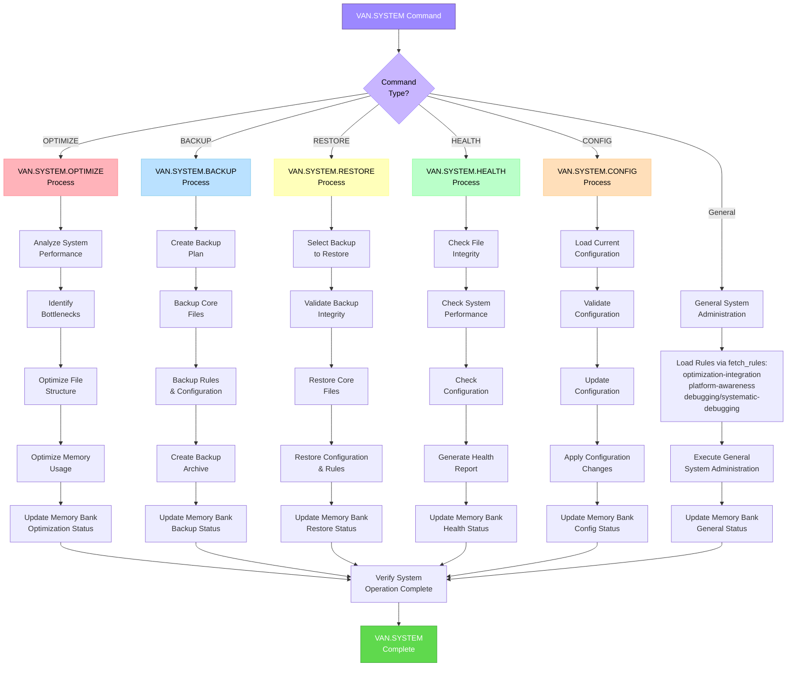
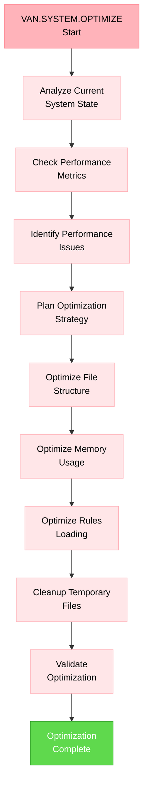
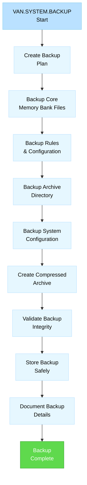
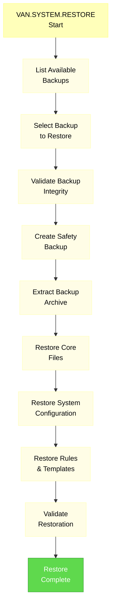
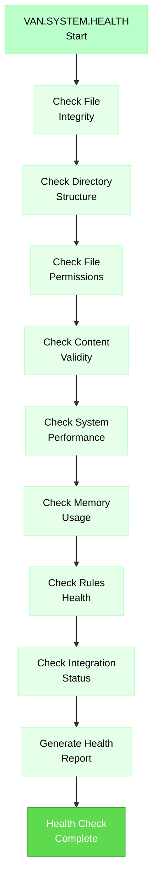
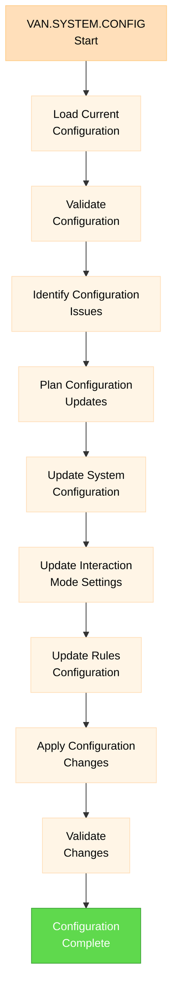

# VAN.SYSTEM SUBMODE - SYSTEM ADMINISTRATION

> **TL;DR:** Comprehensive VAN.SYSTEM submode for Memory Bank system administration, including optimization, backup/restore, health monitoring, and configuration management.

## 🧭 NAVIGATION
- 🏠 **[Main Instructions](van_instructions.md)** - Return to main VAN instructions
- 🔄 **[Core Workflow](van_core_workflow.md)** - Detailed VAN workflow with full diagrams

- ⚙️ **[System Submode](van_system_submode.md)** ← You are here

---

## 🎯 VAN.SYSTEM COMMANDS

### Available Commands
- **`VAN.SYSTEM`** - Activate system administration submode
- **`VAN.SYSTEM.OPTIMIZE`** - Optimize Memory Bank performance and structure
- **`VAN.SYSTEM.BACKUP`** - Create comprehensive Memory Bank backup
- **`VAN.SYSTEM.RESTORE`** - Restore Memory Bank from backup
- **`VAN.SYSTEM.HEALTH`** - Comprehensive system health check and diagnostics
- **`VAN.SYSTEM.CONFIG`** - System configuration management

---

## 🔄 VAN.SYSTEM WORKFLOW



---

## ⚡ VAN.SYSTEM.OPTIMIZE PROCESS

### System Optimization Workflow



### Optimization Rules Loading

```
fetch_rules([
  "isolation_rules/Core/optimization-integration",
  "isolation_rules/Core/platform-awareness",
  "isolation_rules/CustomWorkflow/debugging/systematic-debugging"
])
```

### Optimization Checklist

```
✓ SYSTEM OPTIMIZATION CHECKLIST
- File structure optimized? [YES/NO]
- Memory usage optimized? [YES/NO]
- Rules loading optimized? [YES/NO]
- Temporary files cleaned? [YES/NO]
- Performance metrics improved? [YES/NO]
- System responsiveness improved? [YES/NO]
- Error rates reduced? [YES/NO]
- Resource usage optimized? [YES/NO]

→ If all YES: System optimization successful
→ If any NO: Address optimization issues
```

---

## 💾 VAN.SYSTEM.BACKUP PROCESS

### Backup Creation Workflow



### Backup Components

```
## MEMORY BANK BACKUP COMPONENTS

### Core Files
- memory-bank/tasks.md
- memory-bank/activeContext.md
- memory-bank/progress.md
- memory-bank/projectbrief.md
- memory-bank/productContext.md
- memory-bank/systemPatterns.md
- memory-bank/techContext.md

### System Configuration
- memory-bank/system/current-date.txt
- memory-bank/system/interaction-mode.txt
- memory-bank/config/system.yaml
- memory-bank/config/questions.yaml

### Rules & Templates
- memory-bank/rules/ (all files)
- memory-bank/templates/ (all files)
- .cursor/rules/ (reference only)

### Archive & History
- memory-bank/archive/ (all directories)
- memory-bank/backup/ (previous backups)
- memory-bank/creative/ (all files)
- memory-bank/reflection/ (all files)
```

---

## 🔄 VAN.SYSTEM.RESTORE PROCESS

### Restore Workflow



### Restore Safety Procedures

```bash
# Step 1: List available backups
ls -la memory-bank/backup/system/

# Step 2: Create safety backup before restore
tar -czf "memory-bank/backup/safety-backup-$(date +%Y%m%d-%H%M%S).tar.gz" memory-bank/

# Step 3: Extract selected backup
tar -xzf "memory-bank/backup/system/backup-YYYYMMDD-HHMM.tar.gz"

# Step 4: Validate extracted files
find memory-bank/ -name "*.md" -exec wc -l {} \;

# Step 5: Test system functionality
# Verify all core files are accessible and valid
```

---

## 🏥 VAN.SYSTEM.HEALTH PROCESS

### Health Check Workflow



### Health Report Format

```
## VAN.SYSTEM HEALTH REPORT

### File System Health
- Core Files: ✅ All present and valid
- Directory Structure: ✅ Correct structure
- File Permissions: ✅ Appropriate permissions
- Content Validity: ✅ All content valid

### Performance Metrics
- System Response Time: X ms (Target: <100ms)
- Memory Usage: X MB (Target: <50MB)
- File Access Speed: X ms (Target: <10ms)
- Rules Loading Time: X ms (Target: <500ms)

### Integration Status
- Rules Integration: ✅ Healthy
- Memory Bank Integration: ✅ Healthy
- Mode Transitions: ✅ Working correctly
- Task Continuity: ✅ Functioning properly

### System Configuration
- Interaction Mode: [AUTO/MANUAL]
- Current Date: YYYY-MM-DD
- System Version: X.Y.Z
- Last Optimization: YYYY-MM-DD HH:MM

### Recommendations
- [List of actionable recommendations]

### Overall Health Score: X/100 ([EXCELLENT/GOOD/NEEDS_ATTENTION])
```

---

## ⚙️ VAN.SYSTEM.CONFIG PROCESS

### Configuration Management



### Configuration Files

```
## SYSTEM CONFIGURATION FILES

### Core Configuration
- memory-bank/config/system.yaml
- memory-bank/config/questions.yaml
- memory-bank/system/interaction-mode.txt
- memory-bank/system/current-date.txt

### Mode Configuration
- memory-bank/config/van-mode.yaml
- memory-bank/config/plan-mode.yaml
- memory-bank/config/creative-mode.yaml
- memory-bank/config/implement-mode.yaml

### Integration Configuration
- memory-bank/config/rules-integration.yaml
- memory-bank/config/backup-settings.yaml
- memory-bank/config/optimization-settings.yaml
```

---

## 🔧 MEMORY BANK INTEGRATION

### System Administration Files

- **`memory-bank/system/health-reports/`** - Health check report archive
- **`memory-bank/system/optimization-logs/`** - Optimization history
- **`memory-bank/backup/system/`** - System backup directory
- **`memory-bank/config/`** - System configuration files

### Integration with Other Modes

```
fetch_rules([
  "isolation_rules/Core/optimization-integration",
  "isolation_rules/Core/platform-awareness",
  "isolation_rules/CustomWorkflow/debugging/systematic-debugging",
  "isolation_rules/CustomWorkflow/git-workflow/backup-verification"
])
```

---

## 💡 USAGE EXAMPLES

### Example 1: System Optimization
```
User: VAN.SYSTEM.OPTIMIZE
Assistant: OK VAN.SYSTEM

Activating VAN.SYSTEM optimization submode...
🏥 Loading system administration rules...
📊 Analyzing current system performance...
🔍 Identifying optimization opportunities...
⚡ Optimizing file structure and memory usage...
🧹 Cleaning up temporary files...
✅ System optimization completed successfully
📈 Performance improvement: 23% faster response time
```

### Example 2: System Backup
```
User: VAN.SYSTEM.BACKUP
Assistant: OK VAN.SYSTEM

Activating VAN.SYSTEM backup submode...
💾 Creating comprehensive system backup...
📁 Backing up core Memory Bank files...
⚙️ Backing up system configuration...
📋 Backing up rules and templates...
🗜️ Creating compressed archive...
✅ System backup completed successfully
📦 Backup saved: memory-bank/backup/system/backup-20250610-1445.tar.gz
```

### Example 3: Health Check
```
User: VAN.SYSTEM.HEALTH
Assistant: OK VAN.SYSTEM

Activating VAN.SYSTEM health check submode...
🏥 Performing comprehensive system health check...
📁 Checking file integrity: ✅ All files valid
⚡ Checking performance: ✅ Response time 45ms
🔧 Checking configuration: ✅ All settings valid
📊 Generating health report...
✅ System health check completed
🎯 Overall health score: 95/100 (EXCELLENT)
```

---

## ✅ VERIFICATION COMMITMENT

```
┌─────────────────────────────────────────────────────┐
│ I WILL use fetch_rules for system rule loading       │
│ I WILL create backups before major system changes    │
│ I WILL validate all system operations                │
│ I WILL monitor system health continuously            │
│ I WILL optimize system performance regularly         │
│ I WILL maintain system configuration integrity       │
│ I WILL document all system administration activities │
│ I WILL ensure system reliability and stability       │
└─────────────────────────────────────────────────────┘
```

---

**Navigation**: Return to [Main Instructions](van_instructions.md) | [Core Workflow](van_core_workflow.md)